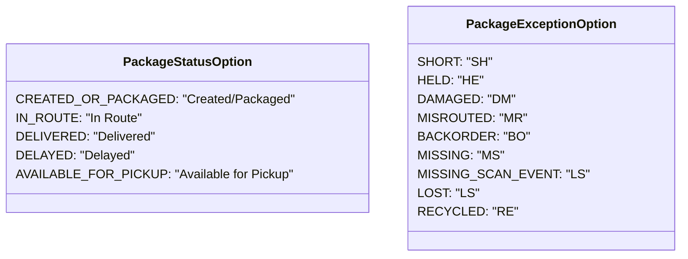

# Diagram: web/portal/src/pages/partview/utils/filter.utils.js

> Auto-generated by Obscura crawlers

## Mermaid

### SVG

<svg id="container" width="814.59375" xmlns="http://www.w3.org/2000/svg" class="classDiagram" height="328" viewBox="0 0 814.59375 328" role="graphics-document document" aria-roledescription="class"><g><defs><marker id="container_class-aggregationStart" class="marker aggregation class" refX="18" refY="7" markerWidth="190" markerHeight="240" orient="auto"><path d="M 18,7 L9,13 L1,7 L9,1 Z"></path></marker></defs><defs><marker id="container_class-aggregationEnd" class="marker aggregation class" refX="1" refY="7" markerWidth="20" markerHeight="28" orient="auto"><path d="M 18,7 L9,13 L1,7 L9,1 Z"></path></marker></defs><defs><marker id="container_class-extensionStart" class="marker extension class" refX="18" refY="7" markerWidth="190" markerHeight="240" orient="auto"><path d="M 1,7 L18,13 V 1 Z"></path></marker></defs><defs><marker id="container_class-extensionEnd" class="marker extension class" refX="1" refY="7" markerWidth="20" markerHeight="28" orient="auto"><path d="M 1,1 V 13 L18,7 Z"></path></marker></defs><defs><marker id="container_class-compositionStart" class="marker composition class" refX="18" refY="7" markerWidth="190" markerHeight="240" orient="auto"><path d="M 18,7 L9,13 L1,7 L9,1 Z"></path></marker></defs><defs><marker id="container_class-compositionEnd" class="marker composition class" refX="1" refY="7" markerWidth="20" markerHeight="28" orient="auto"><path d="M 18,7 L9,13 L1,7 L9,1 Z"></path></marker></defs><defs><marker id="container_class-dependencyStart" class="marker dependency class" refX="6" refY="7" markerWidth="190" markerHeight="240" orient="auto"><path d="M 5,7 L9,13 L1,7 L9,1 Z"></path></marker></defs><defs><marker id="container_class-dependencyEnd" class="marker dependency class" refX="13" refY="7" markerWidth="20" markerHeight="28" orient="auto"><path d="M 18,7 L9,13 L14,7 L9,1 Z"></path></marker></defs><defs><marker id="container_class-lollipopStart" class="marker lollipop class" refX="13" refY="7" markerWidth="190" markerHeight="240" orient="auto"><circle stroke="black" fill="transparent" cx="7" cy="7" r="6"></circle></marker></defs><defs><marker id="container_class-lollipopEnd" class="marker lollipop class" refX="1" refY="7" markerWidth="190" markerHeight="240" orient="auto"><circle stroke="black" fill="transparent" cx="7" cy="7" r="6"></circle></marker></defs><g class="root"><g class="clusters"></g><g class="edgePaths"></g><g class="edgeLabels"></g><g class="nodes"><g class="node default" id="classId-PackageStatusOption-0" transform="translate(227.0703125, 164)"><g class="basic label-container"><path d="M-219.0703125 -108 L219.0703125 -108 L219.0703125 108 L-219.0703125 108" stroke="none" stroke-width="0" fill="#ECECFF" style=""></path><path d="M-219.0703125 -108 C-72.04944930270298 -108, 74.97141389459404 -108, 219.0703125 -108 M-219.0703125 -108 C-115.31910909141044 -108, -11.567905682820879 -108, 219.0703125 -108 M219.0703125 -108 C219.0703125 -26.442993041776433, 219.0703125 55.114013916447135, 219.0703125 108 M219.0703125 -108 C219.0703125 -30.469821519843237, 219.0703125 47.06035696031353, 219.0703125 108 M219.0703125 108 C60.81354138503315 108, -97.4432297299337 108, -219.0703125 108 M219.0703125 108 C104.78554352561952 108, -9.499225448760967 108, -219.0703125 108 M-219.0703125 108 C-219.0703125 48.55437618614984, -219.0703125 -10.891247627700324, -219.0703125 -108 M-219.0703125 108 C-219.0703125 43.025242003401516, -219.0703125 -21.949515993196968, -219.0703125 -108" stroke="#9370DB" stroke-width="1.3" fill="none" stroke-dasharray="0 0" style=""></path></g><g class="annotation-group text" transform="translate(0, -84)"></g><g class="label-group text" transform="translate(-78.265625, -84)"><g class="label" style="font-weight: bolder" transform="translate(0,-12)"><foreignObject width="156.53125" height="24">

PackageStatusOption

</foreignObject></g></g><g class="members-group text" transform="translate(-207.0703125, -36)"><g class="label" style="" transform="translate(0,-12)"><foreignObject width="324.8125" height="24">

CREATED_OR_PACKAGED: "Created/Packaged"

</foreignObject></g><g class="label" style="" transform="translate(0,12)"><foreignObject width="153.390625" height="24">

IN_ROUTE: "In Route"

</foreignObject></g><g class="label" style="" transform="translate(0,36)"><foreignObject width="167.140625" height="24">

DELIVERED: "Delivered"

</foreignObject></g><g class="label" style="" transform="translate(0,60)"><foreignObject width="141.921875" height="24">

DELAYED: "Delayed"

</foreignObject></g><g class="label" style="" transform="translate(0,84)"><foreignObject width="335.875" height="24">

AVAILABLE_FOR_PICKUP: "Available for Pickup"

</foreignObject></g></g><g class="methods-group text" transform="translate(-207.0703125, 108)"></g><g class="divider" style=""><path d="M-219.0703125 -60 C-105.55537231602551 -60, 7.9595678679489765 -60, 219.0703125 -60 M-219.0703125 -60 C-108.41876458531304 -60, 2.232783329373916 -60, 219.0703125 -60" stroke="#9370DB" stroke-width="1.3" fill="none" stroke-dasharray="0 0" style=""></path></g><g class="divider" style=""><path d="M-219.0703125 84 C-63.58200240485519 84, 91.90630769028962 84, 219.0703125 84 M-219.0703125 84 C-87.56368845891373 84, 43.94293558217254 84, 219.0703125 84" stroke="#9370DB" stroke-width="1.3" fill="none" stroke-dasharray="0 0" style=""></path></g></g><g class="node default" id="classId-PackageExceptionOption-1" transform="translate(651.3671875, 164)"><g class="basic label-container"><path d="M-155.2265625 -156 L155.2265625 -156 L155.2265625 156 L-155.2265625 156" stroke="none" stroke-width="0" fill="#ECECFF" style=""></path><path d="M-155.2265625 -156 C-68.33251935844882 -156, 18.56152378310236 -156, 155.2265625 -156 M-155.2265625 -156 C-35.9423383631766 -156, 83.3418857736468 -156, 155.2265625 -156 M155.2265625 -156 C155.2265625 -50.24349621023963, 155.2265625 55.513007579520746, 155.2265625 156 M155.2265625 -156 C155.2265625 -82.3463407135736, 155.2265625 -8.692681427147193, 155.2265625 156 M155.2265625 156 C90.98923016733633 156, 26.75189783467266 156, -155.2265625 156 M155.2265625 156 C92.03183131696184 156, 28.83710013392367 156, -155.2265625 156 M-155.2265625 156 C-155.2265625 78.82624210779814, -155.2265625 1.6524842155962745, -155.2265625 -156 M-155.2265625 156 C-155.2265625 89.27783047327844, -155.2265625 22.555660946556884, -155.2265625 -156" stroke="#9370DB" stroke-width="1.3" fill="none" stroke-dasharray="0 0" style=""></path></g><g class="annotation-group text" transform="translate(0, -132)"></g><g class="label-group text" transform="translate(-90.484375, -132)"><g class="label" style="font-weight: bolder" transform="translate(0,-12)"><foreignObject width="180.96875" height="24">

PackageExceptionOption

</foreignObject></g></g><g class="members-group text" transform="translate(-143.2265625, -84)"><g class="label" style="" transform="translate(0,-12)"><foreignObject width="88.125" height="24">

SHORT: "SH"

</foreignObject></g><g class="label" style="" transform="translate(0,12)"><foreignObject width="78.015625" height="24">

HELD: "HE"

</foreignObject></g><g class="label" style="" transform="translate(0,36)"><foreignObject width="113.21875" height="24">

DAMAGED: "DM"

</foreignObject></g><g class="label" style="" transform="translate(0,60)"><foreignObject width="127.203125" height="24">

MISROUTED: "MR"

</foreignObject></g><g class="label" style="" transform="translate(0,84)"><foreignObject width="127.765625" height="24">

BACKORDER: "BO"

</foreignObject></g><g class="label" style="" transform="translate(0,108)"><foreignObject width="101.78125" height="24">

MISSING: "MS"

</foreignObject></g><g class="label" style="" transform="translate(0,132)"><foreignObject width="195.96875" height="24">

MISSING_SCAN_EVENT: "LS"

</foreignObject></g><g class="label" style="" transform="translate(0,156)"><foreignObject width="71.46875" height="24">

LOST: "LS"

</foreignObject></g><g class="label" style="" transform="translate(0,180)"><foreignObject width="109.921875" height="24">

RECYCLED: "RE"

</foreignObject></g></g><g class="methods-group text" transform="translate(-143.2265625, 156)"></g><g class="divider" style=""><path d="M-155.2265625 -108 C-85.133107090179 -108, -15.039651680357991 -108, 155.2265625 -108 M-155.2265625 -108 C-62.16854006978902 -108, 30.889482360421965 -108, 155.2265625 -108" stroke="#9370DB" stroke-width="1.3" fill="none" stroke-dasharray="0 0" style=""></path></g><g class="divider" style=""><path d="M-155.2265625 132 C-52.68426414722373 132, 49.85803420555254 132, 155.2265625 132 M-155.2265625 132 C-54.215526925464616 132, 46.79550864907077 132, 155.2265625 132" stroke="#9370DB" stroke-width="1.3" fill="none" stroke-dasharray="0 0" style=""></path></g></g></g></g></g></svg>
