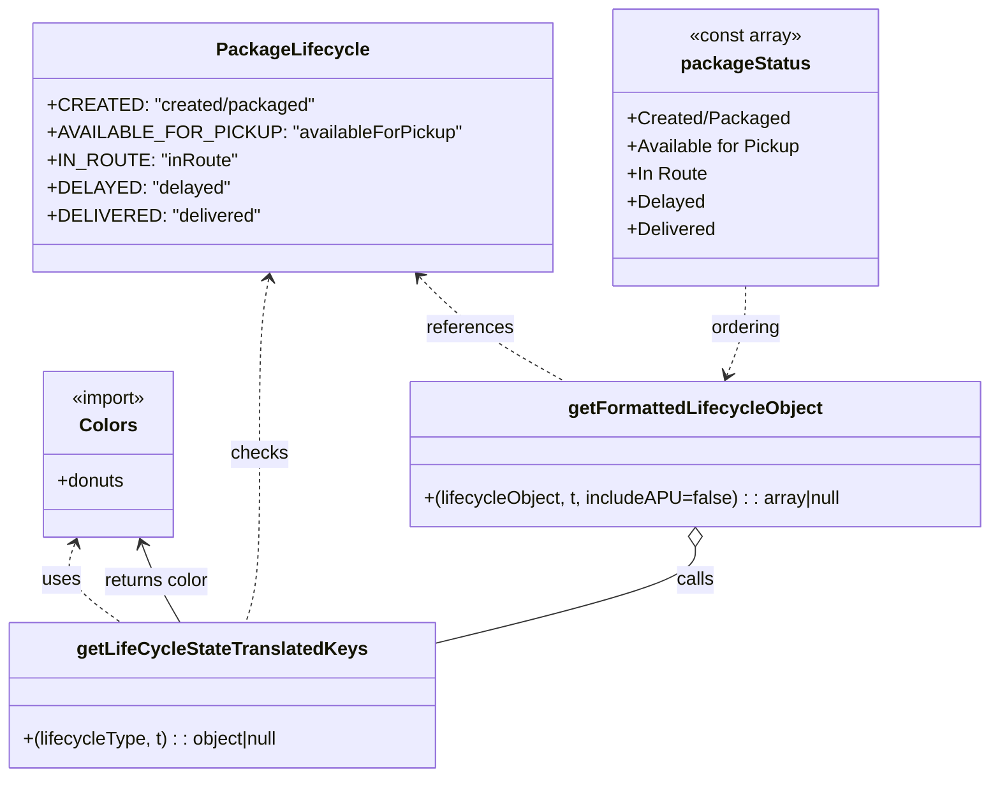

# Diagram: web/portal/src/pages/partview/utils/lifecycleState.utils.js


> Auto-generated by Obscura crawlers

## Diagram 1



### SVG

<svg id="container" width="850.947265625" xmlns="http://www.w3.org/2000/svg" class="classDiagram" height="674" viewBox="0 0 850.947265625 674" role="graphics-document document" aria-roledescription="class"><style>#container{font-family:"trebuchet ms",verdana,arial,sans-serif;font-size:16px;fill:#333;}@keyframes edge-animation-frame{from{stroke-dashoffset:0;}}@keyframes dash{to{stroke-dashoffset:0;}}#container .edge-animation-slow{stroke-dasharray:9,5!important;stroke-dashoffset:900;animation:dash 50s linear infinite;stroke-linecap:round;}#container .edge-animation-fast{stroke-dasharray:9,5!important;stroke-dashoffset:900;animation:dash 20s linear infinite;stroke-linecap:round;}#container .error-icon{fill:#552222;}#container .error-text{fill:#552222;stroke:#552222;}#container .edge-thickness-normal{stroke-width:1px;}#container .edge-thickness-thick{stroke-width:3.5px;}#container .edge-pattern-solid{stroke-dasharray:0;}#container .edge-thickness-invisible{stroke-width:0;fill:none;}#container .edge-pattern-dashed{stroke-dasharray:3;}#container .edge-pattern-dotted{stroke-dasharray:2;}#container .marker{fill:#333333;stroke:#333333;}#container .marker.cross{stroke:#333333;}#container svg{font-family:"trebuchet ms",verdana,arial,sans-serif;font-size:16px;}#container p{margin:0;}#container g.classGroup text{fill:#9370DB;stroke:none;font-family:"trebuchet ms",verdana,arial,sans-serif;font-size:10px;}#container g.classGroup text .title{font-weight:bolder;}#container .nodeLabel,#container .edgeLabel{color:#131300;}#container .edgeLabel .label rect{fill:#ECECFF;}#container .label text{fill:#131300;}#container .labelBkg{background:#ECECFF;}#container .edgeLabel .label span{background:#ECECFF;}#container .classTitle{font-weight:bolder;}#container .node rect,#container .node circle,#container .node ellipse,#container .node polygon,#container .node path{fill:#ECECFF;stroke:#9370DB;stroke-width:1px;}#container .divider{stroke:#9370DB;stroke-width:1;}#container g.clickable{cursor:pointer;}#container g.classGroup rect{fill:#ECECFF;stroke:#9370DB;}#container g.classGroup line{stroke:#9370DB;stroke-width:1;}#container .classLabel .box{stroke:none;stroke-width:0;fill:#ECECFF;opacity:0.5;}#container .classLabel .label{fill:#9370DB;font-size:10px;}#container .relation{stroke:#333333;stroke-width:1;fill:none;}#container .dashed-line{stroke-dasharray:3;}#container .dotted-line{stroke-dasharray:1 2;}#container #compositionStart,#container .composition{fill:#333333!important;stroke:#333333!important;stroke-width:1;}#container #compositionEnd,#container .composition{fill:#333333!important;stroke:#333333!important;stroke-width:1;}#container #dependencyStart,#container .dependency{fill:#333333!important;stroke:#333333!important;stroke-width:1;}#container #dependencyStart,#container .dependency{fill:#333333!important;stroke:#333333!important;stroke-width:1;}#container #extensionStart,#container .extension{fill:transparent!important;stroke:#333333!important;stroke-width:1;}#container #extensionEnd,#container .extension{fill:transparent!important;stroke:#333333!important;stroke-width:1;}#container #aggregationStart,#container .aggregation{fill:transparent!important;stroke:#333333!important;stroke-width:1;}#container #aggregationEnd,#container .aggregation{fill:transparent!important;stroke:#333333!important;stroke-width:1;}#container #lollipopStart,#container .lollipop{fill:#ECECFF!important;stroke:#333333!important;stroke-width:1;}#container #lollipopEnd,#container .lollipop{fill:#ECECFF!important;stroke:#333333!important;stroke-width:1;}#container .edgeTerminals{font-size:11px;line-height:initial;}#container .classTitleText{text-anchor:middle;font-size:18px;fill:#333;}#container .label-icon{display:inline-block;height:1em;overflow:visible;vertical-align:-0.125em;}#container .node .label-icon path{fill:currentColor;stroke:revert;stroke-width:revert;}#container :root{--mermaid-font-family:"trebuchet ms",verdana,arial,sans-serif;}</style><g><defs><marker id="container_class-aggregationStart" class="marker aggregation class" refX="18" refY="7" markerWidth="190" markerHeight="240" orient="auto"><path d="M 18,7 L9,13 L1,7 L9,1 Z"></path></marker></defs><defs><marker id="container_class-aggregationEnd" class="marker aggregation class" refX="1" refY="7" markerWidth="20" markerHeight="28" orient="auto"><path d="M 18,7 L9,13 L1,7 L9,1 Z"></path></marker></defs><defs><marker id="container_class-extensionStart" class="marker extension class" refX="18" refY="7" markerWidth="190" markerHeight="240" orient="auto"><path d="M 1,7 L18,13 V 1 Z"></path></marker></defs><defs><marker id="container_class-extensionEnd" class="marker extension class" refX="1" refY="7" markerWidth="20" markerHeight="28" orient="auto"><path d="M 1,1 V 13 L18,7 Z"></path></marker></defs><defs><marker id="container_class-compositionStart" class="marker composition class" refX="18" refY="7" markerWidth="190" markerHeight="240" orient="auto"><path d="M 18,7 L9,13 L1,7 L9,1 Z"></path></marker></defs><defs><marker id="container_class-compositionEnd" class="marker composition class" refX="1" refY="7" markerWidth="20" markerHeight="28" orient="auto"><path d="M 18,7 L9,13 L1,7 L9,1 Z"></path></marker></defs><defs><marker id="container_class-dependencyStart" class="marker dependency class" refX="6" refY="7" markerWidth="190" markerHeight="240" orient="auto"><path d="M 5,7 L9,13 L1,7 L9,1 Z"></path></marker></defs><defs><marker id="container_class-dependencyEnd" class="marker dependency class" refX="13" refY="7" markerWidth="20" markerHeight="28" orient="auto"><path d="M 18,7 L9,13 L14,7 L9,1 Z"></path></marker></defs><defs><marker id="container_class-lollipopStart" class="marker lollipop class" refX="13" refY="7" markerWidth="190" markerHeight="240" orient="auto"><circle stroke="black" fill="transparent" cx="7" cy="7" r="6"></circle></marker></defs><defs><marker id="container_class-lollipopEnd" class="marker lollipop class" refX="1" refY="7" markerWidth="190" markerHeight="240" orient="auto"><circle stroke="black" fill="transparent" cx="7" cy="7" r="6"></circle></marker></defs><g class="root"><g class="clusters"></g><g class="edgePaths"><path d="M62.416,471.605L60.417,476.837C58.418,482.07,54.42,492.535,61.187,503.934C67.954,515.333,85.485,527.667,94.251,533.833L103.017,540" id="id_Colors_getLifeCycleStateTranslatedKeys_1" class="edge-thickness-normal edge-pattern-dashed relation" style=";;;" data-edge="true" data-et="edge" data-id="id_Colors_getLifeCycleStateTranslatedKeys_1" data-points="W3sieCI6NjQuNTU2NzY2MDU1MDQ1ODcsInkiOjQ2Nn0seyJ4Ijo1MC40MjE4NzUsInkiOjUwM30seyJ4IjoxMDMuMDE2Nzk2ODc1LCJ5Ijo1NDB9XQ==" marker-start="url(#container_class-dependencyStart)"></path><path d="M233.902,241.901L232.579,249.084C231.256,256.267,228.611,270.634,227.288,295.983C225.965,321.333,225.965,357.667,225.965,394C225.965,430.333,225.965,466.667,223.906,491C221.846,515.333,217.728,527.667,215.668,533.833L213.609,540" id="id_PackageLifecycle_getLifeCycleStateTranslatedKeys_2" class="edge-thickness-normal edge-pattern-dashed relation" style=";;;" data-edge="true" data-et="edge" data-id="id_PackageLifecycle_getLifeCycleStateTranslatedKeys_2" data-points="W3sieCI6MjM0Ljk4ODk3NzkwNjA1MDk2LCJ5IjoyMzZ9LHsieCI6MjI1Ljk2NDg0Mzc1LCJ5IjoyODV9LHsieCI6MjI1Ljk2NDg0Mzc1LCJ5IjozOTR9LHsieCI6MjI1Ljk2NDg0Mzc1LCJ5Ijo1MDN9LHsieCI6MjEzLjYwODg2NzE4NzUsInkiOjU0MH1d" marker-start="url(#container_class-dependencyStart)"></path><path d="M364.451,240.294L371.721,247.745C378.991,255.196,393.532,270.098,414.024,285.216C434.516,300.333,460.96,315.667,474.182,323.333L487.403,331" id="id_PackageLifecycle_getFormattedLifecycleObject_3" class="edge-thickness-normal edge-pattern-dashed relation" style=";;;" data-edge="true" data-et="edge" data-id="id_PackageLifecycle_getFormattedLifecycleObject_3" data-points="W3sieCI6MzYwLjI2MDMyNTQzNzg5ODEsInkiOjIzNn0seyJ4Ijo0MDguMDcyMjY1NjI1LCJ5IjoyODV9LHsieCI6NDg3LjQwMzQ3MjYyMDQxMjg2LCJ5IjozMzF9XQ==" marker-start="url(#container_class-dependencyStart)"></path><path d="M155.484,540L151.854,533.833C148.224,527.667,140.963,515.333,135.334,503.934C129.705,492.535,125.707,482.07,123.708,476.837L121.709,471.605" id="id_getLifeCycleStateTranslatedKeys_Colors_4" class="edge-thickness-normal edge-pattern-solid relation" style=";;;" data-edge="true" data-et="edge" data-id="id_getLifeCycleStateTranslatedKeys_Colors_4" data-points="W3sieCI6MTU1LjQ4Mzk4NDM3NSwieSI6NTQwfSx7IngiOjEzMy43MDMxMjUsInkiOjUwM30seyJ4IjoxMTkuNTY4MjMzOTQ0OTU0MTMsInkiOjQ2Nn1d" marker-end="url(#container_class-dependencyEnd)"></path><path d="M640.396,248L640.396,254.167C640.396,260.333,640.396,272.667,637.654,285.574C634.912,298.481,629.428,311.962,626.686,318.702L623.944,325.442" id="id_packageStatus_getFormattedLifecycleObject_5" class="edge-thickness-normal edge-pattern-dashed relation" style=";;;" data-edge="true" data-et="edge" data-id="id_packageStatus_getFormattedLifecycleObject_5" data-points="W3sieCI6NjQwLjM5NjQ4NDM3NSwieSI6MjQ4fSx7IngiOjY0MC4zOTY0ODQzNzUsInkiOjI4NX0seyJ4Ijo2MjEuNjgyNjA4MjI4MjExLCJ5IjozMzF9XQ==" marker-end="url(#container_class-dependencyEnd)"></path><path d="M596.053,474.25L596.053,479.042C596.053,483.833,596.053,493.417,559.567,507.251C523.082,521.085,450.111,539.17,413.626,548.213L377.141,557.256" id="id_getFormattedLifecycleObject_getLifeCycleStateTranslatedKeys_6" class="edge-thickness-normal edge-pattern-solid relation" style=";;;" data-edge="true" data-et="edge" data-id="id_getFormattedLifecycleObject_getLifeCycleStateTranslatedKeys_6" data-points="W3sieCI6NTk2LjA1MjczNDM3NSwieSI6NDU3fSx7IngiOjU5Ni4wNTI3MzQzNzUsInkiOjUwM30seyJ4IjozNzcuMTQwNjI1LCJ5Ijo1NTcuMjU1Njc0NDc0NjY2M31d" marker-start="url(#container_class-aggregationStart)"></path></g><g class="edgeLabels"><g class="edgeLabel" transform="translate(50.421875, 503)"><g class="label" data-id="id_Colors_getLifeCycleStateTranslatedKeys_1" transform="translate(-16.4921875, -12)"><foreignObject width="32.984375" height="24"><div xmlns="http://www.w3.org/1999/xhtml" class="labelBkg" style="display: table-cell; white-space: nowrap; line-height: 1.5; max-width: 200px; text-align: center;"><span class="edgeLabel"><p>uses</p></span></div></foreignObject></g></g><g class="edgeLabel" transform="translate(225.96484375, 394)"><g class="label" data-id="id_PackageLifecycle_getLifeCycleStateTranslatedKeys_2" transform="translate(-24.4921875, -12)"><foreignObject width="48.984375" height="24"><div xmlns="http://www.w3.org/1999/xhtml" class="labelBkg" style="display: table-cell; white-space: nowrap; line-height: 1.5; max-width: 200px; text-align: center;"><span class="edgeLabel"><p>checks</p></span></div></foreignObject></g></g><g class="edgeLabel" transform="translate(408.072265625, 285)"><g class="label" data-id="id_PackageLifecycle_getFormattedLifecycleObject_3" transform="translate(-37.828125, -12)"><foreignObject width="75.65625" height="24"><div xmlns="http://www.w3.org/1999/xhtml" class="labelBkg" style="display: table-cell; white-space: nowrap; line-height: 1.5; max-width: 200px; text-align: center;"><span class="edgeLabel"><p>references</p></span></div></foreignObject></g></g><g class="edgeLabel" transform="translate(134.54699, 504.4335)"><g class="label" data-id="id_getLifeCycleStateTranslatedKeys_Colors_4" transform="translate(-46.7890625, -12)"><foreignObject width="93.578125" height="24"><div xmlns="http://www.w3.org/1999/xhtml" class="labelBkg" style="display: table-cell; white-space: nowrap; line-height: 1.5; max-width: 200px; text-align: center;"><span class="edgeLabel"><p>returns color</p></span></div></foreignObject></g></g><g class="edgeLabel" transform="translate(640.396484375, 285)"><g class="label" data-id="id_packageStatus_getFormattedLifecycleObject_5" transform="translate(-30.859375, -12)"><foreignObject width="61.71875" height="24"><div xmlns="http://www.w3.org/1999/xhtml" class="labelBkg" style="display: table-cell; white-space: nowrap; line-height: 1.5; max-width: 200px; text-align: center;"><span class="edgeLabel"><p>ordering</p></span></div></foreignObject></g></g><g class="edgeLabel" transform="translate(596.052734375, 503)"><g class="label" data-id="id_getFormattedLifecycleObject_getLifeCycleStateTranslatedKeys_6" transform="translate(-16.4453125, -12)"><foreignObject width="32.890625" height="24"><div xmlns="http://www.w3.org/1999/xhtml" class="labelBkg" style="display: table-cell; white-space: nowrap; line-height: 1.5; max-width: 200px; text-align: center;"><span class="edgeLabel"><p>calls</p></span></div></foreignObject></g></g></g><g class="nodes"><g class="node default" id="classId-Colors-0" transform="translate(92.0625, 394)"><g class="basic label-container"><path d="M-58.2421875 -72 L58.2421875 -72 L58.2421875 72 L-58.2421875 72" stroke="none" stroke-width="0" fill="#ECECFF" style=""></path><path d="M-58.2421875 -72 C-18.867725807412093 -72, 20.506735885175814 -72, 58.2421875 -72 M-58.2421875 -72 C-32.317149627308474 -72, -6.392111754616948 -72, 58.2421875 -72 M58.2421875 -72 C58.2421875 -32.969228756864894, 58.2421875 6.061542486270213, 58.2421875 72 M58.2421875 -72 C58.2421875 -20.04298866587854, 58.2421875 31.91402266824292, 58.2421875 72 M58.2421875 72 C13.357138696868333 72, -31.527910106263334 72, -58.2421875 72 M58.2421875 72 C12.560180801444751 72, -33.1218258971105 72, -58.2421875 72 M-58.2421875 72 C-58.2421875 17.435069380670186, -58.2421875 -37.12986123865963, -58.2421875 -72 M-58.2421875 72 C-58.2421875 29.640697344491585, -58.2421875 -12.71860531101683, -58.2421875 -72" stroke="#9370DB" stroke-width="1.3" fill="none" stroke-dasharray="0 0" style=""></path></g><g class="annotation-group text" transform="translate(-33.640625, -48)"><g class="label" style="" transform="translate(0,-12)"><foreignObject width="67.28125" height="24"><div xmlns="http://www.w3.org/1999/xhtml" style="display: table-cell; white-space: nowrap; line-height: 1.5; max-width: 117px; text-align: center;"><span class="nodeLabel markdown-node-label" style=""><p>«import»</p></span></div></foreignObject></g></g><g class="label-group text" transform="translate(-23.1015625, -24)"><g class="label" style="font-weight: bolder" transform="translate(0,-12)"><foreignObject width="46.203125" height="24"><div xmlns="http://www.w3.org/1999/xhtml" style="display: table-cell; white-space: nowrap; line-height: 1.5; max-width: 95px; text-align: center;"><span class="nodeLabel markdown-node-label" style=""><p>Colors</p></span></div></foreignObject></g></g><g class="members-group text" transform="translate(-46.2421875, 24)"><g class="label" style="" transform="translate(0,-12)"><foreignObject width="58.84375" height="24"><div xmlns="http://www.w3.org/1999/xhtml" style="display: table-cell; white-space: nowrap; line-height: 1.5; max-width: 116px; text-align: center;"><span class="nodeLabel markdown-node-label" style=""><p>+donuts</p></span></div></foreignObject></g></g><g class="methods-group text" transform="translate(-46.2421875, 72)"></g><g class="divider" style=""><path d="M-58.2421875 0 C-11.799379014368952 0, 34.643429471262095 0, 58.2421875 0 M-58.2421875 0 C-26.94478291448123 0, 4.352621671037539 0, 58.2421875 0" stroke="#9370DB" stroke-width="1.3" fill="none" stroke-dasharray="0 0" style=""></path></g><g class="divider" style=""><path d="M-58.2421875 48 C-22.337972962405388 48, 13.566241575189224 48, 58.2421875 48 M-58.2421875 48 C-25.32555851060328 48, 7.591070478793441 48, 58.2421875 48" stroke="#9370DB" stroke-width="1.3" fill="none" stroke-dasharray="0 0" style=""></path></g></g><g class="node default" id="classId-PackageLifecycle-1" transform="translate(254.87890625, 128)"><g class="basic label-container"><path d="M-211.375 -108 L211.375 -108 L211.375 108 L-211.375 108" stroke="none" stroke-width="0" fill="#ECECFF" style=""></path><path d="M-211.375 -108 C-58.65662216507337 -108, 94.06175566985326 -108, 211.375 -108 M-211.375 -108 C-117.031727167942 -108, -22.68845433588399 -108, 211.375 -108 M211.375 -108 C211.375 -31.078891378656948, 211.375 45.842217242686104, 211.375 108 M211.375 -108 C211.375 -49.57045632517925, 211.375 8.859087349641499, 211.375 108 M211.375 108 C120.17958495370213 108, 28.984169907404265 108, -211.375 108 M211.375 108 C121.01526076781998 108, 30.655521535639963 108, -211.375 108 M-211.375 108 C-211.375 39.551972581665424, -211.375 -28.89605483666915, -211.375 -108 M-211.375 108 C-211.375 42.041428419413066, -211.375 -23.91714316117387, -211.375 -108" stroke="#9370DB" stroke-width="1.3" fill="none" stroke-dasharray="0 0" style=""></path></g><g class="annotation-group text" transform="translate(0, -84)"></g><g class="label-group text" transform="translate(-61.890625, -84)"><g class="label" style="font-weight: bolder" transform="translate(0,-12)"><foreignObject width="123.78125" height="24"><div xmlns="http://www.w3.org/1999/xhtml" style="display: table-cell; white-space: nowrap; line-height: 1.5; max-width: 171px; text-align: center;"><span class="nodeLabel markdown-node-label" style=""><p>PackageLifecycle</p></span></div></foreignObject></g></g><g class="members-group text" transform="translate(-199.375, -36)"><g class="label" style="" transform="translate(0,-12)"><foreignObject width="222.203125" height="24"><div xmlns="http://www.w3.org/1999/xhtml" style="display: table-cell; white-space: nowrap; line-height: 1.5; max-width: 280px; text-align: center;"><span class="nodeLabel markdown-node-label" style=""><p>+CREATED: "created/packaged"</p></span></div></foreignObject></g><g class="label" style="" transform="translate(0,12)"><foreignObject width="336.859375" height="24"><div xmlns="http://www.w3.org/1999/xhtml" style="display: table-cell; white-space: nowrap; line-height: 1.5; max-width: 394px; text-align: center;"><span class="nodeLabel markdown-node-label" style=""><p>+AVAILABLE_FOR_PICKUP: "availableForPickup"</p></span></div></foreignObject></g><g class="label" style="" transform="translate(0,36)"><foreignObject width="156.921875" height="24"><div xmlns="http://www.w3.org/1999/xhtml" style="display: table-cell; white-space: nowrap; line-height: 1.5; max-width: 214px; text-align: center;"><span class="nodeLabel markdown-node-label" style=""><p>+IN_ROUTE: "inRoute"</p></span></div></foreignObject></g><g class="label" style="" transform="translate(0,60)"><foreignObject width="149.015625" height="24"><div xmlns="http://www.w3.org/1999/xhtml" style="display: table-cell; white-space: nowrap; line-height: 1.5; max-width: 206px; text-align: center;"><span class="nodeLabel markdown-node-label" style=""><p>+DELAYED: "delayed"</p></span></div></foreignObject></g><g class="label" style="" transform="translate(0,84)"><foreignObject width="174.234375" height="24"><div xmlns="http://www.w3.org/1999/xhtml" style="display: table-cell; white-space: nowrap; line-height: 1.5; max-width: 232px; text-align: center;"><span class="nodeLabel markdown-node-label" style=""><p>+DELIVERED: "delivered"</p></span></div></foreignObject></g></g><g class="methods-group text" transform="translate(-199.375, 108)"></g><g class="divider" style=""><path d="M-211.375 -60 C-54.27560437129554 -60, 102.82379125740891 -60, 211.375 -60 M-211.375 -60 C-119.3512173825506 -60, -27.327434765101202 -60, 211.375 -60" stroke="#9370DB" stroke-width="1.3" fill="none" stroke-dasharray="0 0" style=""></path></g><g class="divider" style=""><path d="M-211.375 84 C-83.3162916824732 84, 44.74241663505359 84, 211.375 84 M-211.375 84 C-63.64650607584906 84, 84.08198784830188 84, 211.375 84" stroke="#9370DB" stroke-width="1.3" fill="none" stroke-dasharray="0 0" style=""></path></g></g><g class="node default" id="classId-packageStatus-2" transform="translate(640.396484375, 128)"><g class="basic label-container"><path d="M-114.5859375 -120 L114.5859375 -120 L114.5859375 120 L-114.5859375 120" stroke="none" stroke-width="0" fill="#ECECFF" style=""></path><path d="M-114.5859375 -120 C-64.39945107127636 -120, -14.212964642552706 -120, 114.5859375 -120 M-114.5859375 -120 C-36.09399408585111 -120, 42.397949328297784 -120, 114.5859375 -120 M114.5859375 -120 C114.5859375 -65.86128928373415, 114.5859375 -11.722578567468318, 114.5859375 120 M114.5859375 -120 C114.5859375 -60.72173417347229, 114.5859375 -1.4434683469445844, 114.5859375 120 M114.5859375 120 C25.51433398963418 120, -63.55726952073164 120, -114.5859375 120 M114.5859375 120 C43.60842762559115 120, -27.369082248817705 120, -114.5859375 120 M-114.5859375 120 C-114.5859375 24.01535963719263, -114.5859375 -71.96928072561474, -114.5859375 -120 M-114.5859375 120 C-114.5859375 52.178109675412855, -114.5859375 -15.643780649174289, -114.5859375 -120" stroke="#9370DB" stroke-width="1.3" fill="none" stroke-dasharray="0 0" style=""></path></g><g class="annotation-group text" transform="translate(-49.15625, -96)"><g class="label" style="" transform="translate(0,-12)"><foreignObject width="98.3125" height="24"><div xmlns="http://www.w3.org/1999/xhtml" style="display: table-cell; white-space: nowrap; line-height: 1.5; max-width: 148px; text-align: center;"><span class="nodeLabel markdown-node-label" style=""><p>«const array»</p></span></div></foreignObject></g></g><g class="label-group text" transform="translate(-53.640625, -72)"><g class="label" style="font-weight: bolder" transform="translate(0,-12)"><foreignObject width="107.28125" height="24"><div xmlns="http://www.w3.org/1999/xhtml" style="display: table-cell; white-space: nowrap; line-height: 1.5; max-width: 155px; text-align: center;"><span class="nodeLabel markdown-node-label" style=""><p>packageStatus</p></span></div></foreignObject></g></g><g class="members-group text" transform="translate(-102.5859375, -24)"><g class="label" style="" transform="translate(0,-12)"><foreignObject width="139.4375" height="24"><div xmlns="http://www.w3.org/1999/xhtml" style="display: table-cell; white-space: nowrap; line-height: 1.5; max-width: 197px; text-align: center;"><span class="nodeLabel markdown-node-label" style=""><p>+Created/Packaged</p></span></div></foreignObject></g><g class="label" style="" transform="translate(0,12)"><foreignObject width="151.53125" height="24"><div xmlns="http://www.w3.org/1999/xhtml" style="display: table-cell; white-space: nowrap; line-height: 1.5; max-width: 209px; text-align: center;"><span class="nodeLabel markdown-node-label" style=""><p>+Available for Pickup</p></span></div></foreignObject></g><g class="label" style="" transform="translate(0,36)"><foreignObject width="68.6875" height="24"><div xmlns="http://www.w3.org/1999/xhtml" style="display: table-cell; white-space: nowrap; line-height: 1.5; max-width: 126px; text-align: center;"><span class="nodeLabel markdown-node-label" style=""><p>+In Route</p></span></div></foreignObject></g><g class="label" style="" transform="translate(0,60)"><foreignObject width="66.1875" height="24"><div xmlns="http://www.w3.org/1999/xhtml" style="display: table-cell; white-space: nowrap; line-height: 1.5; max-width: 124px; text-align: center;"><span class="nodeLabel markdown-node-label" style=""><p>+Delayed</p></span></div></foreignObject></g><g class="label" style="" transform="translate(0,84)"><foreignObject width="76.734375" height="24"><div xmlns="http://www.w3.org/1999/xhtml" style="display: table-cell; white-space: nowrap; line-height: 1.5; max-width: 134px; text-align: center;"><span class="nodeLabel markdown-node-label" style=""><p>+Delivered</p></span></div></foreignObject></g></g><g class="methods-group text" transform="translate(-102.5859375, 120)"></g><g class="divider" style=""><path d="M-114.5859375 -48 C-65.15121007887436 -48, -15.716482657748713 -48, 114.5859375 -48 M-114.5859375 -48 C-23.666159175297366 -48, 67.25361914940527 -48, 114.5859375 -48" stroke="#9370DB" stroke-width="1.3" fill="none" stroke-dasharray="0 0" style=""></path></g><g class="divider" style=""><path d="M-114.5859375 96 C-58.612299783582365 96, -2.6386620671647307 96, 114.5859375 96 M-114.5859375 96 C-66.26452831704425 96, -17.943119134088505 96, 114.5859375 96" stroke="#9370DB" stroke-width="1.3" fill="none" stroke-dasharray="0 0" style=""></path></g></g><g class="node default" id="classId-getLifeCycleStateTranslatedKeys-3" transform="translate(192.5703125, 603)"><g class="basic label-container"><path d="M-184.5703125 -63 L184.5703125 -63 L184.5703125 63 L-184.5703125 63" stroke="none" stroke-width="0" fill="#ECECFF" style=""></path><path d="M-184.5703125 -63 C-88.1157339219097 -63, 8.338844656180612 -63, 184.5703125 -63 M-184.5703125 -63 C-92.34971553463927 -63, -0.12911856927854615 -63, 184.5703125 -63 M184.5703125 -63 C184.5703125 -36.4428268229201, 184.5703125 -9.885653645840186, 184.5703125 63 M184.5703125 -63 C184.5703125 -34.67930881225354, 184.5703125 -6.358617624507076, 184.5703125 63 M184.5703125 63 C101.34722219569046 63, 18.124131891380927 63, -184.5703125 63 M184.5703125 63 C93.16713029698573 63, 1.7639480939714645 63, -184.5703125 63 M-184.5703125 63 C-184.5703125 21.44373193436593, -184.5703125 -20.112536131268143, -184.5703125 -63 M-184.5703125 63 C-184.5703125 16.0157129034085, -184.5703125 -30.968574193183002, -184.5703125 -63" stroke="#9370DB" stroke-width="1.3" fill="none" stroke-dasharray="0 0" style=""></path></g><g class="annotation-group text" transform="translate(0, -39)"></g><g class="label-group text" transform="translate(-119.421875, -39)"><g class="label" style="font-weight: bolder" transform="translate(0,-12)"><foreignObject width="238.84375" height="24"><div xmlns="http://www.w3.org/1999/xhtml" style="display: table-cell; white-space: nowrap; line-height: 1.5; max-width: 282px; text-align: center;"><span class="nodeLabel markdown-node-label" style=""><p>getLifeCycleStateTranslatedKeys</p></span></div></foreignObject></g></g><g class="members-group text" transform="translate(-172.5703125, 9)"></g><g class="methods-group text" transform="translate(-172.5703125, 39)"><g class="label" style="" transform="translate(0,-12)"><foreignObject width="225.71875" height="24"><div xmlns="http://www.w3.org/1999/xhtml" style="display: table-cell; white-space: nowrap; line-height: 1.5; max-width: 276px; text-align: center;"><span class="nodeLabel markdown-node-label" style=""><p>+(lifecycleType, t) : : object|null</p></span></div></foreignObject></g></g><g class="divider" style=""><path d="M-184.5703125 -15 C-101.550842889106 -15, -18.531373278211987 -15, 184.5703125 -15 M-184.5703125 -15 C-80.13893537282885 -15, 24.292441754342292 -15, 184.5703125 -15" stroke="#9370DB" stroke-width="1.3" fill="none" stroke-dasharray="0 0" style=""></path></g><g class="divider" style=""><path d="M-184.5703125 9 C-48.30184798436929 9, 87.96661653126142 9, 184.5703125 9 M-184.5703125 9 C-92.84928808244766 9, -1.1282636648953144 9, 184.5703125 9" stroke="#9370DB" stroke-width="1.3" fill="none" stroke-dasharray="0 0" style=""></path></g></g><g class="node default" id="classId-getFormattedLifecycleObject-4" transform="translate(596.052734375, 394)"><g class="basic label-container"><path d="M-246.89453125 -63 L246.89453125 -63 L246.89453125 63 L-246.89453125 63" stroke="none" stroke-width="0" fill="#ECECFF" style=""></path><path d="M-246.89453125 -63 C-62.6044010596232 -63, 121.6857291307536 -63, 246.89453125 -63 M-246.89453125 -63 C-76.94478476761827 -63, 93.00496171476345 -63, 246.89453125 -63 M246.89453125 -63 C246.89453125 -15.647015926558169, 246.89453125 31.705968146883663, 246.89453125 63 M246.89453125 -63 C246.89453125 -13.919564570654721, 246.89453125 35.16087085869056, 246.89453125 63 M246.89453125 63 C50.811273211902574 63, -145.27198482619485 63, -246.89453125 63 M246.89453125 63 C50.50072500878616 63, -145.89308123242768 63, -246.89453125 63 M-246.89453125 63 C-246.89453125 37.25304312712187, -246.89453125 11.506086254243733, -246.89453125 -63 M-246.89453125 63 C-246.89453125 14.161989610031497, -246.89453125 -34.676020779937005, -246.89453125 -63" stroke="#9370DB" stroke-width="1.3" fill="none" stroke-dasharray="0 0" style=""></path></g><g class="annotation-group text" transform="translate(0, -39)"></g><g class="label-group text" transform="translate(-105.5546875, -39)"><g class="label" style="font-weight: bolder" transform="translate(0,-12)"><foreignObject width="211.109375" height="24"><div xmlns="http://www.w3.org/1999/xhtml" style="display: table-cell; white-space: nowrap; line-height: 1.5; max-width: 258px; text-align: center;"><span class="nodeLabel markdown-node-label" style=""><p>getFormattedLifecycleObject</p></span></div></foreignObject></g></g><g class="members-group text" transform="translate(-234.89453125, 9)"></g><g class="methods-group text" transform="translate(-234.89453125, 39)"><g class="label" style="" transform="translate(0,-12)"><foreignObject width="364.234375" height="24"><div xmlns="http://www.w3.org/1999/xhtml" style="display: table-cell; white-space: nowrap; line-height: 1.5; max-width: 415px; text-align: center;"><span class="nodeLabel markdown-node-label" style=""><p>+(lifecycleObject, t, includeAPU=false) : : array|null</p></span></div></foreignObject></g></g><g class="divider" style=""><path d="M-246.89453125 -15 C-78.71882806412239 -15, 89.45687512175522 -15, 246.89453125 -15 M-246.89453125 -15 C-71.11332250393113 -15, 104.66788624213774 -15, 246.89453125 -15" stroke="#9370DB" stroke-width="1.3" fill="none" stroke-dasharray="0 0" style=""></path></g><g class="divider" style=""><path d="M-246.89453125 9 C-134.50116670464746 9, -22.10780215929492 9, 246.89453125 9 M-246.89453125 9 C-115.64357577865724 9, 15.607379692685527 9, 246.89453125 9" stroke="#9370DB" stroke-width="1.3" fill="none" stroke-dasharray="0 0" style=""></path></g></g></g></g></g></svg>

## Diagram 2

```mermaid
flowchart LR
    A[Start: getFormattedLifecycleObject(lifecycleObject, t, includeAPU=false)] --> B{lifecycleObject present?}
    B -- No --> Z[Return []]
    B -- Yes --> C[Copy lifecycleStates = {...lifecycleObject}]
    C --> D{includeAPU false AND availableForPickup defined?}
    D -- Yes --> E[delete lifecycleStates.availableForPickup]
    D -- No --> F[keep lifecycleStates]
    E --> F
    F --> G[totalActivePackages = 0]
    G --> H[for each item in lifecycleStates]
    H --> I{item !== PackageLifecycle.DELIVERED?}
    I -- Yes --> J[totalActivePackages += lifecycleStates[item]]
    I -- No --> K[skip]
    J --> H
    K --> H
    H --> L[result = Object.entries(lifecycleStates).map(([key,count]) => { ... })]
    L --> M[getLifeCycleStateTranslatedKeys(key,t) -> {lifecycleStateName, color}]
    M --> N[compute percentage = (count/totalActivePackages)*100 or 0]
    N --> O[build object with name,key,type,count,fill,label,totalActivePackages,widgetType,widgetVerb,percentage]
    O --> P[return packageStatus.map(name => find matching item by key).filter(undefined)]
    P --> Z[Return filtered result]
```

> SVG rendering failed for this diagram.
