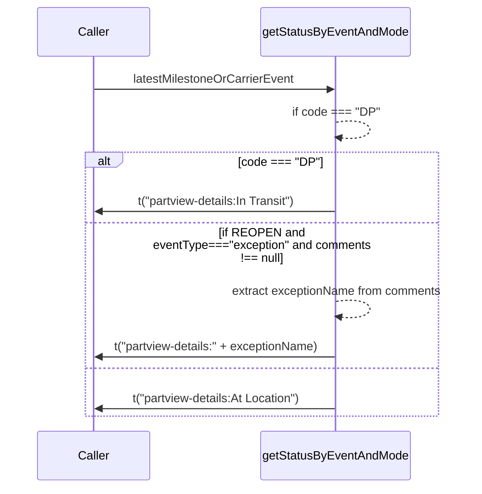
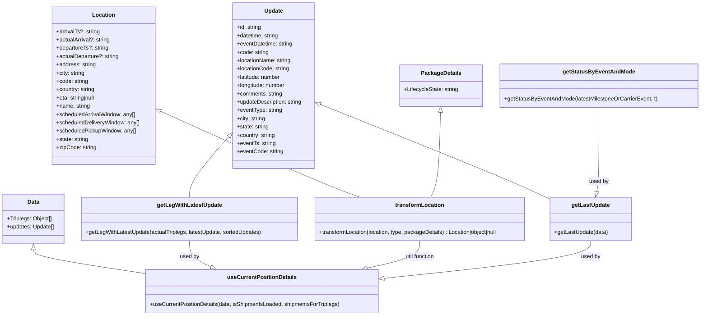

# Diagram: web/portal/src/pages/partview/utils/location.utils.ts


> Auto-generated by Obscura crawlers

## Diagram 1

```mermaid
flowchart LR
  A[Start: transformLocation(location, type, packageDetails)] --> B{location is nil?}
  B -- Yes --> C[Return null]
  B -- No --> D{type === "origin" ?}
  D -- Yes --> E[scheduledArrivalWindow = location.scheduledPickupWindow]
  D -- No --> F[scheduledArrivalWindow = location.scheduledDeliveryWindow]
  E --> G[eta = location.eta]
  F --> G
  G --> H{packageDetails.LifecycleState.toLowerCase() === "delivered"?}
  H -- Yes --> I[eta = null]
  H -- No --> I[eta unchanged]
  I --> J{type === "origin"?}
  J -- Yes --> K[Return origin object:
    name, city, state, postalCode, country, address,
    scheduledPickupWindow, scheduledDeliveryWindow,
    earliestArrivalDateTime = scheduledArrivalWindow[0],
    latestArrivalDateTime = scheduledArrivalWindow[1],
    actualDepartureDateTime = location.departureTs ? location.departureTs : location.actualDeparture,
    eta]
  J -- No --> L[Return destination object:
    name, city, state, postalCode, country, address,
    scheduledPickupWindow, scheduledDeliveryWindow,
    earliestArrivalDateTime = scheduledArrivalWindow[0],
    latestArrivalDateTime = scheduledArrivalWindow[1],
    actualArrivalDateTime = location.arrivalTs ? location.arrivalTs : location.actualArrival,
    eta]
```

> SVG rendering failed for this diagram.

## Diagram 2



### SVG

<svg id="container" width="678.5" xmlns="http://www.w3.org/2000/svg" height="662" viewBox="-50 -10 678.5 662" role="graphics-document document" aria-roledescription="sequence"><g><rect x="318" y="576" fill="#eaeaea" stroke="#666" width="214" height="65" name="getStatus" rx="3" ry="3" class="actor actor-bottom"></rect><text x="425" y="608.5" dominant-baseline="central" alignment-baseline="central" class="actor actor-box" style="text-anchor: middle; font-size: 16px; font-weight: 400;"><tspan x="425" dy="0">getStatusByEventAndMode</tspan></text></g><g><rect x="0" y="576" fill="#eaeaea" stroke="#666" width="150" height="65" name="Caller" rx="3" ry="3" class="actor actor-bottom"></rect><text x="75" y="608.5" dominant-baseline="central" alignment-baseline="central" class="actor actor-box" style="text-anchor: middle; font-size: 16px; font-weight: 400;"><tspan x="75" dy="0">Caller</tspan></text></g><g><line id="actor1" x1="425" y1="65" x2="425" y2="576" class="actor-line 200" stroke-width="0.5px" stroke="#999" name="getStatus"></line><g id="root-1"><rect x="318" y="0" fill="#eaeaea" stroke="#666" width="214" height="65" name="getStatus" rx="3" ry="3" class="actor actor-top"></rect><text x="425" y="32.5" dominant-baseline="central" alignment-baseline="central" class="actor actor-box" style="text-anchor: middle; font-size: 16px; font-weight: 400;"><tspan x="425" dy="0">getStatusByEventAndMode</tspan></text></g></g><g><line id="actor0" x1="75" y1="65" x2="75" y2="576" class="actor-line 200" stroke-width="0.5px" stroke="#999" name="Caller"></line><g id="root-0"><rect x="0" y="0" fill="#eaeaea" stroke="#666" width="150" height="65" name="Caller" rx="3" ry="3" class="actor actor-top"></rect><text x="75" y="32.5" dominant-baseline="central" alignment-baseline="central" class="actor actor-box" style="text-anchor: middle; font-size: 16px; font-weight: 400;"><tspan x="75" dy="0">Caller</tspan></text></g></g><style>#container{font-family:"trebuchet ms",verdana,arial,sans-serif;font-size:16px;fill:#333;}@keyframes edge-animation-frame{from{stroke-dashoffset:0;}}@keyframes dash{to{stroke-dashoffset:0;}}#container .edge-animation-slow{stroke-dasharray:9,5!important;stroke-dashoffset:900;animation:dash 50s linear infinite;stroke-linecap:round;}#container .edge-animation-fast{stroke-dasharray:9,5!important;stroke-dashoffset:900;animation:dash 20s linear infinite;stroke-linecap:round;}#container .error-icon{fill:#552222;}#container .error-text{fill:#552222;stroke:#552222;}#container .edge-thickness-normal{stroke-width:1px;}#container .edge-thickness-thick{stroke-width:3.5px;}#container .edge-pattern-solid{stroke-dasharray:0;}#container .edge-thickness-invisible{stroke-width:0;fill:none;}#container .edge-pattern-dashed{stroke-dasharray:3;}#container .edge-pattern-dotted{stroke-dasharray:2;}#container .marker{fill:#333333;stroke:#333333;}#container .marker.cross{stroke:#333333;}#container svg{font-family:"trebuchet ms",verdana,arial,sans-serif;font-size:16px;}#container p{margin:0;}#container .actor{stroke:hsl(259.6261682243, 59.7765363128%, 87.9019607843%);fill:#ECECFF;}#container text.actor&gt;tspan{fill:black;stroke:none;}#container .actor-line{stroke:hsl(259.6261682243, 59.7765363128%, 87.9019607843%);}#container .innerArc{stroke-width:1.5;stroke-dasharray:none;}#container .messageLine0{stroke-width:1.5;stroke-dasharray:none;stroke:#333;}#container .messageLine1{stroke-width:1.5;stroke-dasharray:2,2;stroke:#333;}#container #arrowhead path{fill:#333;stroke:#333;}#container .sequenceNumber{fill:white;}#container #sequencenumber{fill:#333;}#container #crosshead path{fill:#333;stroke:#333;}#container .messageText{fill:#333;stroke:none;}#container .labelBox{stroke:hsl(259.6261682243, 59.7765363128%, 87.9019607843%);fill:#ECECFF;}#container .labelText,#container .labelText&gt;tspan{fill:black;stroke:none;}#container .loopText,#container .loopText&gt;tspan{fill:black;stroke:none;}#container .loopLine{stroke-width:2px;stroke-dasharray:2,2;stroke:hsl(259.6261682243, 59.7765363128%, 87.9019607843%);fill:hsl(259.6261682243, 59.7765363128%, 87.9019607843%);}#container .note{stroke:#aaaa33;fill:#fff5ad;}#container .noteText,#container .noteText&gt;tspan{fill:black;stroke:none;}#container .activation0{fill:#f4f4f4;stroke:#666;}#container .activation1{fill:#f4f4f4;stroke:#666;}#container .activation2{fill:#f4f4f4;stroke:#666;}#container .actorPopupMenu{position:absolute;}#container .actorPopupMenuPanel{position:absolute;fill:#ECECFF;box-shadow:0px 8px 16px 0px rgba(0,0,0,0.2);filter:drop-shadow(3px 5px 2px rgb(0 0 0 / 0.4));}#container .actor-man line{stroke:hsl(259.6261682243, 59.7765363128%, 87.9019607843%);fill:#ECECFF;}#container .actor-man circle,#container line{stroke:hsl(259.6261682243, 59.7765363128%, 87.9019607843%);fill:#ECECFF;stroke-width:2px;}#container :root{--mermaid-font-family:"trebuchet ms",verdana,arial,sans-serif;}</style><g></g><defs><symbol id="computer" width="24" height="24"><path transform="scale(.5)" d="M2 2v13h20v-13h-20zm18 11h-16v-9h16v9zm-10.228 6l.466-1h3.524l.467 1h-4.457zm14.228 3h-24l2-6h2.104l-1.33 4h18.45l-1.297-4h2.073l2 6zm-5-10h-14v-7h14v7z"></path></symbol></defs><defs><symbol id="database" fill-rule="evenodd" clip-rule="evenodd"><path transform="scale(.5)" d="M12.258.001l.256.004.255.005.253.008.251.01.249.012.247.015.246.016.242.019.241.02.239.023.236.024.233.027.231.028.229.031.225.032.223.034.22.036.217.038.214.04.211.041.208.043.205.045.201.046.198.048.194.05.191.051.187.053.183.054.18.056.175.057.172.059.168.06.163.061.16.063.155.064.15.066.074.033.073.033.071.034.07.034.069.035.068.035.067.035.066.035.064.036.064.036.062.036.06.036.06.037.058.037.058.037.055.038.055.038.053.038.052.038.051.039.05.039.048.039.047.039.045.04.044.04.043.04.041.04.04.041.039.041.037.041.036.041.034.041.033.042.032.042.03.042.029.042.027.042.026.043.024.043.023.043.021.043.02.043.018.044.017.043.015.044.013.044.012.044.011.045.009.044.007.045.006.045.004.045.002.045.001.045v17l-.001.045-.002.045-.004.045-.006.045-.007.045-.009.044-.011.045-.012.044-.013.044-.015.044-.017.043-.018.044-.02.043-.021.043-.023.043-.024.043-.026.043-.027.042-.029.042-.03.042-.032.042-.033.042-.034.041-.036.041-.037.041-.039.041-.04.041-.041.04-.043.04-.044.04-.045.04-.047.039-.048.039-.05.039-.051.039-.052.038-.053.038-.055.038-.055.038-.058.037-.058.037-.06.037-.06.036-.062.036-.064.036-.064.036-.066.035-.067.035-.068.035-.069.035-.07.034-.071.034-.073.033-.074.033-.15.066-.155.064-.16.063-.163.061-.168.06-.172.059-.175.057-.18.056-.183.054-.187.053-.191.051-.194.05-.198.048-.201.046-.205.045-.208.043-.211.041-.214.04-.217.038-.22.036-.223.034-.225.032-.229.031-.231.028-.233.027-.236.024-.239.023-.241.02-.242.019-.246.016-.247.015-.249.012-.251.01-.253.008-.255.005-.256.004-.258.001-.258-.001-.256-.004-.255-.005-.253-.008-.251-.01-.249-.012-.247-.015-.245-.016-.243-.019-.241-.02-.238-.023-.236-.024-.234-.027-.231-.028-.228-.031-.226-.032-.223-.034-.22-.036-.217-.038-.214-.04-.211-.041-.208-.043-.204-.045-.201-.046-.198-.048-.195-.05-.19-.051-.187-.053-.184-.054-.179-.056-.176-.057-.172-.059-.167-.06-.164-.061-.159-.063-.155-.064-.151-.066-.074-.033-.072-.033-.072-.034-.07-.034-.069-.035-.068-.035-.067-.035-.066-.035-.064-.036-.063-.036-.062-.036-.061-.036-.06-.037-.058-.037-.057-.037-.056-.038-.055-.038-.053-.038-.052-.038-.051-.039-.049-.039-.049-.039-.046-.039-.046-.04-.044-.04-.043-.04-.041-.04-.04-.041-.039-.041-.037-.041-.036-.041-.034-.041-.033-.042-.032-.042-.03-.042-.029-.042-.027-.042-.026-.043-.024-.043-.023-.043-.021-.043-.02-.043-.018-.044-.017-.043-.015-.044-.013-.044-.012-.044-.011-.045-.009-.044-.007-.045-.006-.045-.004-.045-.002-.045-.001-.045v-17l.001-.045.002-.045.004-.045.006-.045.007-.045.009-.044.011-.045.012-.044.013-.044.015-.044.017-.043.018-.044.02-.043.021-.043.023-.043.024-.043.026-.043.027-.042.029-.042.03-.042.032-.042.033-.042.034-.041.036-.041.037-.041.039-.041.04-.041.041-.04.043-.04.044-.04.046-.04.046-.039.049-.039.049-.039.051-.039.052-.038.053-.038.055-.038.056-.038.057-.037.058-.037.06-.037.061-.036.062-.036.063-.036.064-.036.066-.035.067-.035.068-.035.069-.035.07-.034.072-.034.072-.033.074-.033.151-.066.155-.064.159-.063.164-.061.167-.06.172-.059.176-.057.179-.056.184-.054.187-.053.19-.051.195-.05.198-.048.201-.046.204-.045.208-.043.211-.041.214-.04.217-.038.22-.036.223-.034.226-.032.228-.031.231-.028.234-.027.236-.024.238-.023.241-.02.243-.019.245-.016.247-.015.249-.012.251-.01.253-.008.255-.005.256-.004.258-.001.258.001zm-9.258 20.499v.01l.001.021.003.021.004.022.005.021.006.022.007.022.009.023.01.022.011.023.012.023.013.023.015.023.016.024.017.023.018.024.019.024.021.024.022.025.023.024.024.025.052.049.056.05.061.051.066.051.07.051.075.051.079.052.084.052.088.052.092.052.097.052.102.051.105.052.11.052.114.051.119.051.123.051.127.05.131.05.135.05.139.048.144.049.147.047.152.047.155.047.16.045.163.045.167.043.171.043.176.041.178.041.183.039.187.039.19.037.194.035.197.035.202.033.204.031.209.03.212.029.216.027.219.025.222.024.226.021.23.02.233.018.236.016.24.015.243.012.246.01.249.008.253.005.256.004.259.001.26-.001.257-.004.254-.005.25-.008.247-.011.244-.012.241-.014.237-.016.233-.018.231-.021.226-.021.224-.024.22-.026.216-.027.212-.028.21-.031.205-.031.202-.034.198-.034.194-.036.191-.037.187-.039.183-.04.179-.04.175-.042.172-.043.168-.044.163-.045.16-.046.155-.046.152-.047.148-.048.143-.049.139-.049.136-.05.131-.05.126-.05.123-.051.118-.052.114-.051.11-.052.106-.052.101-.052.096-.052.092-.052.088-.053.083-.051.079-.052.074-.052.07-.051.065-.051.06-.051.056-.05.051-.05.023-.024.023-.025.021-.024.02-.024.019-.024.018-.024.017-.024.015-.023.014-.024.013-.023.012-.023.01-.023.01-.022.008-.022.006-.022.006-.022.004-.022.004-.021.001-.021.001-.021v-4.127l-.077.055-.08.053-.083.054-.085.053-.087.052-.09.052-.093.051-.095.05-.097.05-.1.049-.102.049-.105.048-.106.047-.109.047-.111.046-.114.045-.115.045-.118.044-.12.043-.122.042-.124.042-.126.041-.128.04-.13.04-.132.038-.134.038-.135.037-.138.037-.139.035-.142.035-.143.034-.144.033-.147.032-.148.031-.15.03-.151.03-.153.029-.154.027-.156.027-.158.026-.159.025-.161.024-.162.023-.163.022-.165.021-.166.02-.167.019-.169.018-.169.017-.171.016-.173.015-.173.014-.175.013-.175.012-.177.011-.178.01-.179.008-.179.008-.181.006-.182.005-.182.004-.184.003-.184.002h-.37l-.184-.002-.184-.003-.182-.004-.182-.005-.181-.006-.179-.008-.179-.008-.178-.01-.176-.011-.176-.012-.175-.013-.173-.014-.172-.015-.171-.016-.17-.017-.169-.018-.167-.019-.166-.02-.165-.021-.163-.022-.162-.023-.161-.024-.159-.025-.157-.026-.156-.027-.155-.027-.153-.029-.151-.03-.15-.03-.148-.031-.146-.032-.145-.033-.143-.034-.141-.035-.14-.035-.137-.037-.136-.037-.134-.038-.132-.038-.13-.04-.128-.04-.126-.041-.124-.042-.122-.042-.12-.044-.117-.043-.116-.045-.113-.045-.112-.046-.109-.047-.106-.047-.105-.048-.102-.049-.1-.049-.097-.05-.095-.05-.093-.052-.09-.051-.087-.052-.085-.053-.083-.054-.08-.054-.077-.054v4.127zm0-5.654v.011l.001.021.003.021.004.021.005.022.006.022.007.022.009.022.01.022.011.023.012.023.013.023.015.024.016.023.017.024.018.024.019.024.021.024.022.024.023.025.024.024.052.05.056.05.061.05.066.051.07.051.075.052.079.051.084.052.088.052.092.052.097.052.102.052.105.052.11.051.114.051.119.052.123.05.127.051.131.05.135.049.139.049.144.048.147.048.152.047.155.046.16.045.163.045.167.044.171.042.176.042.178.04.183.04.187.038.19.037.194.036.197.034.202.033.204.032.209.03.212.028.216.027.219.025.222.024.226.022.23.02.233.018.236.016.24.014.243.012.246.01.249.008.253.006.256.003.259.001.26-.001.257-.003.254-.006.25-.008.247-.01.244-.012.241-.015.237-.016.233-.018.231-.02.226-.022.224-.024.22-.025.216-.027.212-.029.21-.03.205-.032.202-.033.198-.035.194-.036.191-.037.187-.039.183-.039.179-.041.175-.042.172-.043.168-.044.163-.045.16-.045.155-.047.152-.047.148-.048.143-.048.139-.05.136-.049.131-.05.126-.051.123-.051.118-.051.114-.052.11-.052.106-.052.101-.052.096-.052.092-.052.088-.052.083-.052.079-.052.074-.051.07-.052.065-.051.06-.05.056-.051.051-.049.023-.025.023-.024.021-.025.02-.024.019-.024.018-.024.017-.024.015-.023.014-.023.013-.024.012-.022.01-.023.01-.023.008-.022.006-.022.006-.022.004-.021.004-.022.001-.021.001-.021v-4.139l-.077.054-.08.054-.083.054-.085.052-.087.053-.09.051-.093.051-.095.051-.097.05-.1.049-.102.049-.105.048-.106.047-.109.047-.111.046-.114.045-.115.044-.118.044-.12.044-.122.042-.124.042-.126.041-.128.04-.13.039-.132.039-.134.038-.135.037-.138.036-.139.036-.142.035-.143.033-.144.033-.147.033-.148.031-.15.03-.151.03-.153.028-.154.028-.156.027-.158.026-.159.025-.161.024-.162.023-.163.022-.165.021-.166.02-.167.019-.169.018-.169.017-.171.016-.173.015-.173.014-.175.013-.175.012-.177.011-.178.009-.179.009-.179.007-.181.007-.182.005-.182.004-.184.003-.184.002h-.37l-.184-.002-.184-.003-.182-.004-.182-.005-.181-.007-.179-.007-.179-.009-.178-.009-.176-.011-.176-.012-.175-.013-.173-.014-.172-.015-.171-.016-.17-.017-.169-.018-.167-.019-.166-.02-.165-.021-.163-.022-.162-.023-.161-.024-.159-.025-.157-.026-.156-.027-.155-.028-.153-.028-.151-.03-.15-.03-.148-.031-.146-.033-.145-.033-.143-.033-.141-.035-.14-.036-.137-.036-.136-.037-.134-.038-.132-.039-.13-.039-.128-.04-.126-.041-.124-.042-.122-.043-.12-.043-.117-.044-.116-.044-.113-.046-.112-.046-.109-.046-.106-.047-.105-.048-.102-.049-.1-.049-.097-.05-.095-.051-.093-.051-.09-.051-.087-.053-.085-.052-.083-.054-.08-.054-.077-.054v4.139zm0-5.666v.011l.001.02.003.022.004.021.005.022.006.021.007.022.009.023.01.022.011.023.012.023.013.023.015.023.016.024.017.024.018.023.019.024.021.025.022.024.023.024.024.025.052.05.056.05.061.05.066.051.07.051.075.052.079.051.084.052.088.052.092.052.097.052.102.052.105.051.11.052.114.051.119.051.123.051.127.05.131.05.135.05.139.049.144.048.147.048.152.047.155.046.16.045.163.045.167.043.171.043.176.042.178.04.183.04.187.038.19.037.194.036.197.034.202.033.204.032.209.03.212.028.216.027.219.025.222.024.226.021.23.02.233.018.236.017.24.014.243.012.246.01.249.008.253.006.256.003.259.001.26-.001.257-.003.254-.006.25-.008.247-.01.244-.013.241-.014.237-.016.233-.018.231-.02.226-.022.224-.024.22-.025.216-.027.212-.029.21-.03.205-.032.202-.033.198-.035.194-.036.191-.037.187-.039.183-.039.179-.041.175-.042.172-.043.168-.044.163-.045.16-.045.155-.047.152-.047.148-.048.143-.049.139-.049.136-.049.131-.051.126-.05.123-.051.118-.052.114-.051.11-.052.106-.052.101-.052.096-.052.092-.052.088-.052.083-.052.079-.052.074-.052.07-.051.065-.051.06-.051.056-.05.051-.049.023-.025.023-.025.021-.024.02-.024.019-.024.018-.024.017-.024.015-.023.014-.024.013-.023.012-.023.01-.022.01-.023.008-.022.006-.022.006-.022.004-.022.004-.021.001-.021.001-.021v-4.153l-.077.054-.08.054-.083.053-.085.053-.087.053-.09.051-.093.051-.095.051-.097.05-.1.049-.102.048-.105.048-.106.048-.109.046-.111.046-.114.046-.115.044-.118.044-.12.043-.122.043-.124.042-.126.041-.128.04-.13.039-.132.039-.134.038-.135.037-.138.036-.139.036-.142.034-.143.034-.144.033-.147.032-.148.032-.15.03-.151.03-.153.028-.154.028-.156.027-.158.026-.159.024-.161.024-.162.023-.163.023-.165.021-.166.02-.167.019-.169.018-.169.017-.171.016-.173.015-.173.014-.175.013-.175.012-.177.01-.178.01-.179.009-.179.007-.181.006-.182.006-.182.004-.184.003-.184.001-.185.001-.185-.001-.184-.001-.184-.003-.182-.004-.182-.006-.181-.006-.179-.007-.179-.009-.178-.01-.176-.01-.176-.012-.175-.013-.173-.014-.172-.015-.171-.016-.17-.017-.169-.018-.167-.019-.166-.02-.165-.021-.163-.023-.162-.023-.161-.024-.159-.024-.157-.026-.156-.027-.155-.028-.153-.028-.151-.03-.15-.03-.148-.032-.146-.032-.145-.033-.143-.034-.141-.034-.14-.036-.137-.036-.136-.037-.134-.038-.132-.039-.13-.039-.128-.041-.126-.041-.124-.041-.122-.043-.12-.043-.117-.044-.116-.044-.113-.046-.112-.046-.109-.046-.106-.048-.105-.048-.102-.048-.1-.05-.097-.049-.095-.051-.093-.051-.09-.052-.087-.052-.085-.053-.083-.053-.08-.054-.077-.054v4.153zm8.74-8.179l-.257.004-.254.005-.25.008-.247.011-.244.012-.241.014-.237.016-.233.018-.231.021-.226.022-.224.023-.22.026-.216.027-.212.028-.21.031-.205.032-.202.033-.198.034-.194.036-.191.038-.187.038-.183.04-.179.041-.175.042-.172.043-.168.043-.163.045-.16.046-.155.046-.152.048-.148.048-.143.048-.139.049-.136.05-.131.05-.126.051-.123.051-.118.051-.114.052-.11.052-.106.052-.101.052-.096.052-.092.052-.088.052-.083.052-.079.052-.074.051-.07.052-.065.051-.06.05-.056.05-.051.05-.023.025-.023.024-.021.024-.02.025-.019.024-.018.024-.017.023-.015.024-.014.023-.013.023-.012.023-.01.023-.01.022-.008.022-.006.023-.006.021-.004.022-.004.021-.001.021-.001.021.001.021.001.021.004.021.004.022.006.021.006.023.008.022.01.022.01.023.012.023.013.023.014.023.015.024.017.023.018.024.019.024.02.025.021.024.023.024.023.025.051.05.056.05.06.05.065.051.07.052.074.051.079.052.083.052.088.052.092.052.096.052.101.052.106.052.11.052.114.052.118.051.123.051.126.051.131.05.136.05.139.049.143.048.148.048.152.048.155.046.16.046.163.045.168.043.172.043.175.042.179.041.183.04.187.038.191.038.194.036.198.034.202.033.205.032.21.031.212.028.216.027.22.026.224.023.226.022.231.021.233.018.237.016.241.014.244.012.247.011.25.008.254.005.257.004.26.001.26-.001.257-.004.254-.005.25-.008.247-.011.244-.012.241-.014.237-.016.233-.018.231-.021.226-.022.224-.023.22-.026.216-.027.212-.028.21-.031.205-.032.202-.033.198-.034.194-.036.191-.038.187-.038.183-.04.179-.041.175-.042.172-.043.168-.043.163-.045.16-.046.155-.046.152-.048.148-.048.143-.048.139-.049.136-.05.131-.05.126-.051.123-.051.118-.051.114-.052.11-.052.106-.052.101-.052.096-.052.092-.052.088-.052.083-.052.079-.052.074-.051.07-.052.065-.051.06-.05.056-.05.051-.05.023-.025.023-.024.021-.024.02-.025.019-.024.018-.024.017-.023.015-.024.014-.023.013-.023.012-.023.01-.023.01-.022.008-.022.006-.023.006-.021.004-.022.004-.021.001-.021.001-.021-.001-.021-.001-.021-.004-.021-.004-.022-.006-.021-.006-.023-.008-.022-.01-.022-.01-.023-.012-.023-.013-.023-.014-.023-.015-.024-.017-.023-.018-.024-.019-.024-.02-.025-.021-.024-.023-.024-.023-.025-.051-.05-.056-.05-.06-.05-.065-.051-.07-.052-.074-.051-.079-.052-.083-.052-.088-.052-.092-.052-.096-.052-.101-.052-.106-.052-.11-.052-.114-.052-.118-.051-.123-.051-.126-.051-.131-.05-.136-.05-.139-.049-.143-.048-.148-.048-.152-.048-.155-.046-.16-.046-.163-.045-.168-.043-.172-.043-.175-.042-.179-.041-.183-.04-.187-.038-.191-.038-.194-.036-.198-.034-.202-.033-.205-.032-.21-.031-.212-.028-.216-.027-.22-.026-.224-.023-.226-.022-.231-.021-.233-.018-.237-.016-.241-.014-.244-.012-.247-.011-.25-.008-.254-.005-.257-.004-.26-.001-.26.001z"></path></symbol></defs><defs><symbol id="clock" width="24" height="24"><path transform="scale(.5)" d="M12 2c5.514 0 10 4.486 10 10s-4.486 10-10 10-10-4.486-10-10 4.486-10 10-10zm0-2c-6.627 0-12 5.373-12 12s5.373 12 12 12 12-5.373 12-12-5.373-12-12-12zm5.848 12.459c.202.038.202.333.001.372-1.907.361-6.045 1.111-6.547 1.111-.719 0-1.301-.582-1.301-1.301 0-.512.77-5.447 1.125-7.445.034-.192.312-.181.343.014l.985 6.238 5.394 1.011z"></path></symbol></defs><defs><marker id="arrowhead" refX="7.9" refY="5" markerUnits="userSpaceOnUse" markerWidth="12" markerHeight="12" orient="auto-start-reverse"><path d="M -1 0 L 10 5 L 0 10 z"></path></marker></defs><defs><marker id="crosshead" markerWidth="15" markerHeight="8" orient="auto" refX="4" refY="4.5"><path fill="none" stroke="#000000" stroke-width="1pt" d="M 1,2 L 6,7 M 6,2 L 1,7" style="stroke-dasharray: 0, 0;"></path></marker></defs><defs><marker id="filled-head" refX="15.5" refY="7" markerWidth="20" markerHeight="28" orient="auto"><path d="M 18,7 L9,13 L14,7 L9,1 Z"></path></marker></defs><defs><marker id="sequencenumber" refX="15" refY="15" markerWidth="60" markerHeight="40" orient="auto"><circle cx="15" cy="15" r="6"></circle></marker></defs><g><line x1="64" y1="201" x2="578.5" y2="201" class="loopLine"></line><line x1="578.5" y1="201" x2="578.5" y2="556" class="loopLine"></line><line x1="64" y1="556" x2="578.5" y2="556" class="loopLine"></line><line x1="64" y1="201" x2="64" y2="556" class="loopLine"></line><line x1="64" y1="299" x2="578.5" y2="299" class="loopLine" style="stroke-dasharray: 3, 3;"></line><line x1="64" y1="488" x2="578.5" y2="488" class="loopLine" style="stroke-dasharray: 3, 3;"></line><polygon points="64,201 114,201 114,214 105.6,221 64,221" class="labelBox"></polygon><text x="89" y="214" text-anchor="middle" dominant-baseline="middle" alignment-baseline="middle" class="labelText" style="font-size: 16px; font-weight: 400;">alt</text><text x="346.25" y="219" text-anchor="middle" class="loopText" style="font-size: 16px; font-weight: 400;"><tspan x="346.25">[code === "DP"]</tspan></text><text x="321.25" y="317" text-anchor="middle" class="loopText" style="font-size: 16px; font-weight: 400;">[if REOPEN and eventType==="exception"</text><text x="321.25" y="336" text-anchor="middle" class="loopText" style="font-size: 16px; font-weight: 400;">and comments !== null]</text></g><text x="249" y="80" text-anchor="middle" dominant-baseline="middle" alignment-baseline="middle" class="messageText" dy="1em" style="font-size: 16px; font-weight: 400;">latestMilestoneOrCarrierEvent</text><line x1="76" y1="113" x2="421" y2="113" class="messageLine0" stroke-width="2" stroke="none" marker-end="url(#arrowhead)" style="fill: none;"></line><text x="426" y="128" text-anchor="middle" dominant-baseline="middle" alignment-baseline="middle" class="messageText" dy="1em" style="font-size: 16px; font-weight: 400;">if code === "DP"</text><path d="M 426,161 C 486,151 486,191 426,181" class="messageLine1" stroke-width="2" stroke="none" marker-end="url(#arrowhead)" style="stroke-dasharray: 3, 3; fill: none;"></path><text x="252" y="251" text-anchor="middle" dominant-baseline="middle" alignment-baseline="middle" class="messageText" dy="1em" style="font-size: 16px; font-weight: 400;">t("partview-details:In Transit")</text><line x1="424" y1="284" x2="79" y2="284" class="messageLine0" stroke-width="2" stroke="none" marker-end="url(#arrowhead)" style="fill: none;"></line><text x="426" y="362" text-anchor="middle" dominant-baseline="middle" alignment-baseline="middle" class="messageText" dy="1em" style="font-size: 16px; font-weight: 400;">extract exceptionName from comments</text><path d="M 426,395 C 486,385 486,425 426,415" class="messageLine1" stroke-width="2" stroke="none" marker-end="url(#arrowhead)" style="stroke-dasharray: 3, 3; fill: none;"></path><text x="252" y="440" text-anchor="middle" dominant-baseline="middle" alignment-baseline="middle" class="messageText" dy="1em" style="font-size: 16px; font-weight: 400;">t("partview-details:" + exceptionName)</text><line x1="424" y1="473" x2="79" y2="473" class="messageLine0" stroke-width="2" stroke="none" marker-end="url(#arrowhead)" style="fill: none;"></line><text x="252" y="513" text-anchor="middle" dominant-baseline="middle" alignment-baseline="middle" class="messageText" dy="1em" style="font-size: 16px; font-weight: 400;">t("partview-details:At Location")</text><line x1="424" y1="546" x2="79" y2="546" class="messageLine0" stroke-width="2" stroke="none" marker-end="url(#arrowhead)" style="fill: none;"></line></svg>

## Diagram 3



### SVG

<svg id="container" width="2040.94140625" xmlns="http://www.w3.org/2000/svg" class="classDiagram" height="914" viewBox="0 0 2040.94140625 914" role="graphics-document document" aria-roledescription="class"><style>#container{font-family:"trebuchet ms",verdana,arial,sans-serif;font-size:16px;fill:#333;}@keyframes edge-animation-frame{from{stroke-dashoffset:0;}}@keyframes dash{to{stroke-dashoffset:0;}}#container .edge-animation-slow{stroke-dasharray:9,5!important;stroke-dashoffset:900;animation:dash 50s linear infinite;stroke-linecap:round;}#container .edge-animation-fast{stroke-dasharray:9,5!important;stroke-dashoffset:900;animation:dash 20s linear infinite;stroke-linecap:round;}#container .error-icon{fill:#552222;}#container .error-text{fill:#552222;stroke:#552222;}#container .edge-thickness-normal{stroke-width:1px;}#container .edge-thickness-thick{stroke-width:3.5px;}#container .edge-pattern-solid{stroke-dasharray:0;}#container .edge-thickness-invisible{stroke-width:0;fill:none;}#container .edge-pattern-dashed{stroke-dasharray:3;}#container .edge-pattern-dotted{stroke-dasharray:2;}#container .marker{fill:#333333;stroke:#333333;}#container .marker.cross{stroke:#333333;}#container svg{font-family:"trebuchet ms",verdana,arial,sans-serif;font-size:16px;}#container p{margin:0;}#container g.classGroup text{fill:#9370DB;stroke:none;font-family:"trebuchet ms",verdana,arial,sans-serif;font-size:10px;}#container g.classGroup text .title{font-weight:bolder;}#container .nodeLabel,#container .edgeLabel{color:#131300;}#container .edgeLabel .label rect{fill:#ECECFF;}#container .label text{fill:#131300;}#container .labelBkg{background:#ECECFF;}#container .edgeLabel .label span{background:#ECECFF;}#container .classTitle{font-weight:bolder;}#container .node rect,#container .node circle,#container .node ellipse,#container .node polygon,#container .node path{fill:#ECECFF;stroke:#9370DB;stroke-width:1px;}#container .divider{stroke:#9370DB;stroke-width:1;}#container g.clickable{cursor:pointer;}#container g.classGroup rect{fill:#ECECFF;stroke:#9370DB;}#container g.classGroup line{stroke:#9370DB;stroke-width:1;}#container .classLabel .box{stroke:none;stroke-width:0;fill:#ECECFF;opacity:0.5;}#container .classLabel .label{fill:#9370DB;font-size:10px;}#container .relation{stroke:#333333;stroke-width:1;fill:none;}#container .dashed-line{stroke-dasharray:3;}#container .dotted-line{stroke-dasharray:1 2;}#container #compositionStart,#container .composition{fill:#333333!important;stroke:#333333!important;stroke-width:1;}#container #compositionEnd,#container .composition{fill:#333333!important;stroke:#333333!important;stroke-width:1;}#container #dependencyStart,#container .dependency{fill:#333333!important;stroke:#333333!important;stroke-width:1;}#container #dependencyStart,#container .dependency{fill:#333333!important;stroke:#333333!important;stroke-width:1;}#container #extensionStart,#container .extension{fill:transparent!important;stroke:#333333!important;stroke-width:1;}#container #extensionEnd,#container .extension{fill:transparent!important;stroke:#333333!important;stroke-width:1;}#container #aggregationStart,#container .aggregation{fill:transparent!important;stroke:#333333!important;stroke-width:1;}#container #aggregationEnd,#container .aggregation{fill:transparent!important;stroke:#333333!important;stroke-width:1;}#container #lollipopStart,#container .lollipop{fill:#ECECFF!important;stroke:#333333!important;stroke-width:1;}#container #lollipopEnd,#container .lollipop{fill:#ECECFF!important;stroke:#333333!important;stroke-width:1;}#container .edgeTerminals{font-size:11px;line-height:initial;}#container .classTitleText{text-anchor:middle;font-size:18px;fill:#333;}#container .label-icon{display:inline-block;height:1em;overflow:visible;vertical-align:-0.125em;}#container .node .label-icon path{fill:currentColor;stroke:revert;stroke-width:revert;}#container :root{--mermaid-font-family:"trebuchet ms",verdana,arial,sans-serif;}</style><g><defs><marker id="container_class-aggregationStart" class="marker aggregation class" refX="18" refY="7" markerWidth="190" markerHeight="240" orient="auto"><path d="M 18,7 L9,13 L1,7 L9,1 Z"></path></marker></defs><defs><marker id="container_class-aggregationEnd" class="marker aggregation class" refX="1" refY="7" markerWidth="20" markerHeight="28" orient="auto"><path d="M 18,7 L9,13 L1,7 L9,1 Z"></path></marker></defs><defs><marker id="container_class-extensionStart" class="marker extension class" refX="18" refY="7" markerWidth="190" markerHeight="240" orient="auto"><path d="M 1,7 L18,13 V 1 Z"></path></marker></defs><defs><marker id="container_class-extensionEnd" class="marker extension class" refX="1" refY="7" markerWidth="20" markerHeight="28" orient="auto"><path d="M 1,1 V 13 L18,7 Z"></path></marker></defs><defs><marker id="container_class-compositionStart" class="marker composition class" refX="18" refY="7" markerWidth="190" markerHeight="240" orient="auto"><path d="M 18,7 L9,13 L1,7 L9,1 Z"></path></marker></defs><defs><marker id="container_class-compositionEnd" class="marker composition class" refX="1" refY="7" markerWidth="20" markerHeight="28" orient="auto"><path d="M 18,7 L9,13 L1,7 L9,1 Z"></path></marker></defs><defs><marker id="container_class-dependencyStart" class="marker dependency class" refX="6" refY="7" markerWidth="190" markerHeight="240" orient="auto"><path d="M 5,7 L9,13 L1,7 L9,1 Z"></path></marker></defs><defs><marker id="container_class-dependencyEnd" class="marker dependency class" refX="13" refY="7" markerWidth="20" markerHeight="28" orient="auto"><path d="M 18,7 L9,13 L14,7 L9,1 Z"></path></marker></defs><defs><marker id="container_class-lollipopStart" class="marker lollipop class" refX="13" refY="7" markerWidth="190" markerHeight="240" orient="auto"><circle stroke="black" fill="transparent" cx="7" cy="7" r="6"></circle></marker></defs><defs><marker id="container_class-lollipopEnd" class="marker lollipop class" refX="1" refY="7" markerWidth="190" markerHeight="240" orient="auto"><circle stroke="black" fill="transparent" cx="7" cy="7" r="6"></circle></marker></defs><g class="root"><g class="clusters"></g><g class="edgePaths"><path d="M470.801,322.288L545.927,356.073C621.053,389.859,771.305,457.429,867.727,498.881C964.15,540.333,1006.743,555.667,1028.04,563.333L1049.337,571" id="id_Location_transformLocation_1" class="edge-thickness-normal edge-pattern-solid relation" style=";;;" data-edge="true" data-et="edge" data-id="id_Location_transformLocation_1" data-points="W3sieCI6NDU1LjA2ODM1OTM3NSwieSI6MzE1LjIxMzEwNjEyNDk4NTc2fSx7IngiOjkyMS41NTY2NDA2MjUsInkiOjUyNX0seyJ4IjoxMDQ5LjMzNjcwNzk5ODg1MzIsInkiOjU3MX1d" marker-start="url(#container_class-extensionStart)"></path><path d="M1293.881,325.233L1292.399,358.527C1290.916,391.822,1287.951,458.411,1282.203,499.372C1276.455,540.333,1267.924,555.667,1263.658,563.333L1259.392,571" id="id_PackageDetails_transformLocation_2" class="edge-thickness-normal edge-pattern-solid relation" style=";;;" data-edge="true" data-et="edge" data-id="id_PackageDetails_transformLocation_2" data-points="W3sieCI6MTI5NC42NDg2OTEzMzU3NCwieSI6MzA4fSx7IngiOjEyODQuOTg2MzI4MTI1LCJ5Ijo1MjV9LHsieCI6MTI1OS4zOTIzOTg5MzkyMjAxLCJ5Ijo1NzF9XQ==" marker-start="url(#container_class-extensionStart)"></path><path d="M97.352,723.25L97.352,726.542C97.352,729.833,97.352,736.417,153.144,748.017C208.936,759.617,320.52,776.234,376.312,784.543L432.104,792.851" id="id_Data_useCurrentPositionDetails_3" class="edge-thickness-normal edge-pattern-solid relation" style=";;;" data-edge="true" data-et="edge" data-id="id_Data_useCurrentPositionDetails_3" data-points="W3sieCI6OTcuMzUxNTYyNSwieSI6NzA2fSx7IngiOjk3LjM1MTU2MjUsInkiOjc0M30seyJ4Ijo0MzIuMTAzNTE1NjI1LCJ5Ijo3OTIuODUxMjI1NTM1MTA4MX1d" marker-start="url(#container_class-extensionStart)"></path><path d="M940.491,302.883L1033.224,339.903C1125.957,376.922,1311.423,450.961,1422.777,496.868C1534.132,542.774,1571.374,560.548,1589.996,569.435L1608.617,578.322" id="id_Update_getLastUpdate_4" class="edge-thickness-normal edge-pattern-solid relation" style=";;;" data-edge="true" data-et="edge" data-id="id_Update_getLastUpdate_4" data-points="W3sieCI6OTI0LjQ3MDcwMzEyNSwieSI6Mjk2LjQ4NzgyNjAyMzMxNzd9LHsieCI6MTQ5Ni44ODg2NzE4NzUsInkiOjUyNX0seyJ4IjoxNjA4LjYxNzE4NzUsInkiOjU3OC4zMjIyNTg5OTQxNTkzfV0=" marker-start="url(#container_class-extensionStart)"></path><path d="M669.927,393.968L650.016,415.806C630.105,437.645,590.283,481.323,570.372,510.828C550.461,540.333,550.461,555.667,550.461,563.333L550.461,571" id="id_Update_getLegWithLatestUpdate_5" class="edge-thickness-normal edge-pattern-solid relation" style=";;;" data-edge="true" data-et="edge" data-id="id_Update_getLegWithLatestUpdate_5" data-points="W3sieCI6NjgxLjU0ODgyODEyNSwieSI6MzgxLjIyMDQ5NDE4MDQyNjE2fSx7IngiOjU1MC40NjA5Mzc1LCJ5Ijo1MjV9LHsieCI6NTUwLjQ2MDkzNzUsInkiOjU3MX1d" marker-start="url(#container_class-extensionStart)"></path><path d="M1749.438,311L1749.438,346.667C1749.438,382.333,1749.438,453.667,1748.36,494.193C1747.283,534.72,1745.129,544.439,1744.052,549.299L1742.975,554.159" id="id_getStatusByEventAndMode_getLastUpdate_6" class="edge-thickness-normal edge-pattern-solid relation" style=";;;" data-edge="true" data-et="edge" data-id="id_getStatusByEventAndMode_getLastUpdate_6" data-points="W3sieCI6MTc0OS40Mzc1LCJ5IjozMTF9LHsieCI6MTc0OS40Mzc1LCJ5Ijo1MjV9LHsieCI6MTczOS4yNDMxMTkyNjYwNTUxLCJ5Ijo1NzF9XQ==" marker-end="url(#container_class-extensionEnd)"></path><path d="M550.461,697L550.461,704.667C550.461,712.333,550.461,727.667,561.314,740.303C572.168,752.939,593.875,762.879,604.729,767.849L615.582,772.818" id="id_getLegWithLatestUpdate_useCurrentPositionDetails_7" class="edge-thickness-normal edge-pattern-solid relation" style=";;;" data-edge="true" data-et="edge" data-id="id_getLegWithLatestUpdate_useCurrentPositionDetails_7" data-points="W3sieCI6NTUwLjQ2MDkzNzUsInkiOjY5N30seyJ4Ijo1NTAuNDYwOTM3NSwieSI6NzQzfSx7IngiOjYzMS4yNjYxOTE0MDYyNSwieSI6NzgwfV0=" marker-end="url(#container_class-extensionEnd)"></path><path d="M1224.34,697L1224.34,704.667C1224.34,712.333,1224.34,727.667,1199.06,740.883C1173.779,754.1,1123.219,765.201,1097.939,770.751L1072.659,776.301" id="id_transformLocation_useCurrentPositionDetails_8" class="edge-thickness-normal edge-pattern-solid relation" style=";;;" data-edge="true" data-et="edge" data-id="id_transformLocation_useCurrentPositionDetails_8" data-points="W3sieCI6MTIyNC4zMzk4NDM3NSwieSI6Njk3fSx7IngiOjEyMjQuMzM5ODQzNzUsInkiOjc0M30seyJ4IjoxMDU1LjgwOTkwMjM0Mzc1LCJ5Ijo3ODB9XQ==" marker-end="url(#container_class-extensionEnd)"></path><path d="M1725.281,697L1725.281,704.667C1725.281,712.333,1725.281,727.667,1624.861,745.833C1524.441,763.999,1323.6,784.998,1223.18,795.498L1122.76,805.997" id="id_getLastUpdate_useCurrentPositionDetails_9" class="edge-thickness-normal edge-pattern-solid relation" style=";;;" data-edge="true" data-et="edge" data-id="id_getLastUpdate_useCurrentPositionDetails_9" data-points="W3sieCI6MTcyNS4yODEyNSwieSI6Njk3fSx7IngiOjE3MjUuMjgxMjUsInkiOjc0M30seyJ4IjoxMTA1LjYwMzUxNTYyNSwieSI6ODA3Ljc5MDg1NzkwODM1NDV9XQ==" marker-end="url(#container_class-extensionEnd)"></path></g><g class="edgeLabels"><g class="edgeLabel"><g class="label" data-id="id_Location_transformLocation_1" transform="translate(0, 0)"><foreignObject width="0" height="0"><div xmlns="http://www.w3.org/1999/xhtml" class="labelBkg" style="display: table-cell; white-space: nowrap; line-height: 1.5; max-width: 200px; text-align: center;"><span class="edgeLabel"></span></div></foreignObject></g></g><g class="edgeLabel"><g class="label" data-id="id_PackageDetails_transformLocation_2" transform="translate(0, 0)"><foreignObject width="0" height="0"><div xmlns="http://www.w3.org/1999/xhtml" class="labelBkg" style="display: table-cell; white-space: nowrap; line-height: 1.5; max-width: 200px; text-align: center;"><span class="edgeLabel"></span></div></foreignObject></g></g><g class="edgeLabel"><g class="label" data-id="id_Data_useCurrentPositionDetails_3" transform="translate(0, 0)"><foreignObject width="0" height="0"><div xmlns="http://www.w3.org/1999/xhtml" class="labelBkg" style="display: table-cell; white-space: nowrap; line-height: 1.5; max-width: 200px; text-align: center;"><span class="edgeLabel"></span></div></foreignObject></g></g><g class="edgeLabel"><g class="label" data-id="id_Update_getLastUpdate_4" transform="translate(0, 0)"><foreignObject width="0" height="0"><div xmlns="http://www.w3.org/1999/xhtml" class="labelBkg" style="display: table-cell; white-space: nowrap; line-height: 1.5; max-width: 200px; text-align: center;"><span class="edgeLabel"></span></div></foreignObject></g></g><g class="edgeLabel"><g class="label" data-id="id_Update_getLegWithLatestUpdate_5" transform="translate(0, 0)"><foreignObject width="0" height="0"><div xmlns="http://www.w3.org/1999/xhtml" class="labelBkg" style="display: table-cell; white-space: nowrap; line-height: 1.5; max-width: 200px; text-align: center;"><span class="edgeLabel"></span></div></foreignObject></g></g><g class="edgeLabel" transform="translate(1749.4375, 525)"><g class="label" data-id="id_getStatusByEventAndMode_getLastUpdate_6" transform="translate(-28.3125, -12)"><foreignObject width="56.625" height="24"><div xmlns="http://www.w3.org/1999/xhtml" class="labelBkg" style="display: table-cell; white-space: nowrap; line-height: 1.5; max-width: 200px; text-align: center;"><span class="edgeLabel"><p>used by</p></span></div></foreignObject></g></g><g class="edgeLabel" transform="translate(550.4609375, 743)"><g class="label" data-id="id_getLegWithLatestUpdate_useCurrentPositionDetails_7" transform="translate(-28.3125, -12)"><foreignObject width="56.625" height="24"><div xmlns="http://www.w3.org/1999/xhtml" class="labelBkg" style="display: table-cell; white-space: nowrap; line-height: 1.5; max-width: 200px; text-align: center;"><span class="edgeLabel"><p>used by</p></span></div></foreignObject></g></g><g class="edgeLabel" transform="translate(1224.33984375, 743)"><g class="label" data-id="id_transformLocation_useCurrentPositionDetails_8" transform="translate(-44.6171875, -12)"><foreignObject width="89.234375" height="24"><div xmlns="http://www.w3.org/1999/xhtml" class="labelBkg" style="display: table-cell; white-space: nowrap; line-height: 1.5; max-width: 200px; text-align: center;"><span class="edgeLabel"><p>util function</p></span></div></foreignObject></g></g><g class="edgeLabel" transform="translate(1725.28125, 743)"><g class="label" data-id="id_getLastUpdate_useCurrentPositionDetails_9" transform="translate(-28.3125, -12)"><foreignObject width="56.625" height="24"><div xmlns="http://www.w3.org/1999/xhtml" class="labelBkg" style="display: table-cell; white-space: nowrap; line-height: 1.5; max-width: 200px; text-align: center;"><span class="edgeLabel"><p>used by</p></span></div></foreignObject></g></g></g><g class="nodes"><g class="node default" id="classId-Location-0" transform="translate(305.611328125, 248)"><g class="basic label-container"><path d="M-149.45703125 -228 L149.45703125 -228 L149.45703125 228 L-149.45703125 228" stroke="none" stroke-width="0" fill="#ECECFF" style=""></path><path d="M-149.45703125 -228 C-43.40469981133295 -228, 62.64763162733411 -228, 149.45703125 -228 M-149.45703125 -228 C-54.25362011083864 -228, 40.94979102832272 -228, 149.45703125 -228 M149.45703125 -228 C149.45703125 -127.8918685787228, 149.45703125 -27.783737157445586, 149.45703125 228 M149.45703125 -228 C149.45703125 -118.89995061638606, 149.45703125 -9.799901232772129, 149.45703125 228 M149.45703125 228 C44.01271154542823 228, -61.431608159143536 228, -149.45703125 228 M149.45703125 228 C66.01326718000126 228, -17.43049688999747 228, -149.45703125 228 M-149.45703125 228 C-149.45703125 46.577852907256215, -149.45703125 -134.84429418548757, -149.45703125 -228 M-149.45703125 228 C-149.45703125 69.88722294182327, -149.45703125 -88.22555411635346, -149.45703125 -228" stroke="#9370DB" stroke-width="1.3" fill="none" stroke-dasharray="0 0" style=""></path></g><g class="annotation-group text" transform="translate(0, -204)"></g><g class="label-group text" transform="translate(-31.3515625, -204)"><g class="label" style="font-weight: bolder" transform="translate(0,-12)"><foreignObject width="62.703125" height="24"><div xmlns="http://www.w3.org/1999/xhtml" style="display: table-cell; white-space: nowrap; line-height: 1.5; max-width: 112px; text-align: center;"><span class="nodeLabel markdown-node-label" style=""><p>Location</p></span></div></foreignObject></g></g><g class="members-group text" transform="translate(-137.45703125, -156)"><g class="label" style="" transform="translate(0,-12)"><foreignObject width="125.6875" height="24"><div xmlns="http://www.w3.org/1999/xhtml" style="display: table-cell; white-space: nowrap; line-height: 1.5; max-width: 184px; text-align: center;"><span class="nodeLabel markdown-node-label" style=""><p>+arrivalTs?: string</p></span></div></foreignObject></g><g class="label" style="" transform="translate(0,12)"><foreignObject width="156.125" height="24"><div xmlns="http://www.w3.org/1999/xhtml" style="display: table-cell; white-space: nowrap; line-height: 1.5; max-width: 214px; text-align: center;"><span class="nodeLabel markdown-node-label" style=""><p>+actualArrival?: string</p></span></div></foreignObject></g><g class="label" style="" transform="translate(0,36)"><foreignObject width="151.53125" height="24"><div xmlns="http://www.w3.org/1999/xhtml" style="display: table-cell; white-space: nowrap; line-height: 1.5; max-width: 210px; text-align: center;"><span class="nodeLabel markdown-node-label" style=""><p>+departureTs?: string</p></span></div></foreignObject></g><g class="label" style="" transform="translate(0,60)"><foreignObject width="181.59375" height="24"><div xmlns="http://www.w3.org/1999/xhtml" style="display: table-cell; white-space: nowrap; line-height: 1.5; max-width: 240px; text-align: center;"><span class="nodeLabel markdown-node-label" style=""><p>+actualDeparture?: string</p></span></div></foreignObject></g><g class="label" style="" transform="translate(0,84)"><foreignObject width="114.5" height="24"><div xmlns="http://www.w3.org/1999/xhtml" style="display: table-cell; white-space: nowrap; line-height: 1.5; max-width: 173px; text-align: center;"><span class="nodeLabel markdown-node-label" style=""><p>+address: string</p></span></div></foreignObject></g><g class="label" style="" transform="translate(0,108)"><foreignObject width="83.5" height="24"><div xmlns="http://www.w3.org/1999/xhtml" style="display: table-cell; white-space: nowrap; line-height: 1.5; max-width: 142px; text-align: center;"><span class="nodeLabel markdown-node-label" style=""><p>+city: string</p></span></div></foreignObject></g><g class="label" style="" transform="translate(0,132)"><foreignObject width="92.65625" height="24"><div xmlns="http://www.w3.org/1999/xhtml" style="display: table-cell; white-space: nowrap; line-height: 1.5; max-width: 151px; text-align: center;"><span class="nodeLabel markdown-node-label" style=""><p>+code: string</p></span></div></foreignObject></g><g class="label" style="" transform="translate(0,156)"><foreignObject width="112.953125" height="24"><div xmlns="http://www.w3.org/1999/xhtml" style="display: table-cell; white-space: nowrap; line-height: 1.5; max-width: 171px; text-align: center;"><span class="nodeLabel markdown-node-label" style=""><p>+country: string</p></span></div></foreignObject></g><g class="label" style="" transform="translate(0,180)"><foreignObject width="115.296875" height="24"><div xmlns="http://www.w3.org/1999/xhtml" style="display: table-cell; white-space: nowrap; line-height: 1.5; max-width: 173px; text-align: center;"><span class="nodeLabel markdown-node-label" style=""><p>+eta: string|null</p></span></div></foreignObject></g><g class="label" style="" transform="translate(0,204)"><foreignObject width="98.21875" height="24"><div xmlns="http://www.w3.org/1999/xhtml" style="display: table-cell; white-space: nowrap; line-height: 1.5; max-width: 156px; text-align: center;"><span class="nodeLabel markdown-node-label" style=""><p>+name: string</p></span></div></foreignObject></g><g class="label" style="" transform="translate(0,228)"><foreignObject width="231.640625" height="24"><div xmlns="http://www.w3.org/1999/xhtml" style="display: table-cell; white-space: nowrap; line-height: 1.5; max-width: 289px; text-align: center;"><span class="nodeLabel markdown-node-label" style=""><p>+scheduledArrivalWindow: any[]</p></span></div></foreignObject></g><g class="label" style="" transform="translate(0,252)"><foreignObject width="243.5625" height="24"><div xmlns="http://www.w3.org/1999/xhtml" style="display: table-cell; white-space: nowrap; line-height: 1.5; max-width: 301px; text-align: center;"><span class="nodeLabel markdown-node-label" style=""><p>+scheduledDeliveryWindow: any[]</p></span></div></foreignObject></g><g class="label" style="" transform="translate(0,276)"><foreignObject width="233.109375" height="24"><div xmlns="http://www.w3.org/1999/xhtml" style="display: table-cell; white-space: nowrap; line-height: 1.5; max-width: 290px; text-align: center;"><span class="nodeLabel markdown-node-label" style=""><p>+scheduledPickupWindow: any[]</p></span></div></foreignObject></g><g class="label" style="" transform="translate(0,300)"><foreignObject width="93.796875" height="24"><div xmlns="http://www.w3.org/1999/xhtml" style="display: table-cell; white-space: nowrap; line-height: 1.5; max-width: 152px; text-align: center;"><span class="nodeLabel markdown-node-label" style=""><p>+state: string</p></span></div></foreignObject></g><g class="label" style="" transform="translate(0,324)"><foreignObject width="114.5" height="24"><div xmlns="http://www.w3.org/1999/xhtml" style="display: table-cell; white-space: nowrap; line-height: 1.5; max-width: 173px; text-align: center;"><span class="nodeLabel markdown-node-label" style=""><p>+zipCode: string</p></span></div></foreignObject></g></g><g class="methods-group text" transform="translate(-137.45703125, 228)"></g><g class="divider" style=""><path d="M-149.45703125 -180 C-50.519681436226435 -180, 48.41766837754713 -180, 149.45703125 -180 M-149.45703125 -180 C-55.54761031865604 -180, 38.36181061268792 -180, 149.45703125 -180" stroke="#9370DB" stroke-width="1.3" fill="none" stroke-dasharray="0 0" style=""></path></g><g class="divider" style=""><path d="M-149.45703125 204 C-39.685891617895024 204, 70.08524801420995 204, 149.45703125 204 M-149.45703125 204 C-64.49219483517767 204, 20.47264157964466 204, 149.45703125 204" stroke="#9370DB" stroke-width="1.3" fill="none" stroke-dasharray="0 0" style=""></path></g></g><g class="node default" id="classId-PackageDetails-1" transform="translate(1297.3203125, 248)"><g class="basic label-container"><path d="M-118.61328125 -60 L118.61328125 -60 L118.61328125 60 L-118.61328125 60" stroke="none" stroke-width="0" fill="#ECECFF" style=""></path><path d="M-118.61328125 -60 C-36.95852990040922 -60, 44.696221449181564 -60, 118.61328125 -60 M-118.61328125 -60 C-33.262222450134885 -60, 52.08883634973023 -60, 118.61328125 -60 M118.61328125 -60 C118.61328125 -24.56437996838713, 118.61328125 10.871240063225741, 118.61328125 60 M118.61328125 -60 C118.61328125 -35.01778748117545, 118.61328125 -10.035574962350907, 118.61328125 60 M118.61328125 60 C47.01321840267816 60, -24.586844444643674 60, -118.61328125 60 M118.61328125 60 C37.8481066856197 60, -42.917067878760605 60, -118.61328125 60 M-118.61328125 60 C-118.61328125 22.19592575314097, -118.61328125 -15.608148493718062, -118.61328125 -60 M-118.61328125 60 C-118.61328125 14.551975061965834, -118.61328125 -30.896049876068332, -118.61328125 -60" stroke="#9370DB" stroke-width="1.3" fill="none" stroke-dasharray="0 0" style=""></path></g><g class="annotation-group text" transform="translate(0, -36)"></g><g class="label-group text" transform="translate(-55.3515625, -36)"><g class="label" style="font-weight: bolder" transform="translate(0,-12)"><foreignObject width="110.703125" height="24"><div xmlns="http://www.w3.org/1999/xhtml" style="display: table-cell; white-space: nowrap; line-height: 1.5; max-width: 158px; text-align: center;"><span class="nodeLabel markdown-node-label" style=""><p>PackageDetails</p></span></div></foreignObject></g></g><g class="members-group text" transform="translate(-106.61328125, 12)"><g class="label" style="" transform="translate(0,-12)"><foreignObject width="157.875" height="24"><div xmlns="http://www.w3.org/1999/xhtml" style="display: table-cell; white-space: nowrap; line-height: 1.5; max-width: 216px; text-align: center;"><span class="nodeLabel markdown-node-label" style=""><p>+LifecycleState: string</p></span></div></foreignObject></g></g><g class="methods-group text" transform="translate(-106.61328125, 60)"></g><g class="divider" style=""><path d="M-118.61328125 -12 C-31.68862731552352 -12, 55.23602661895296 -12, 118.61328125 -12 M-118.61328125 -12 C-64.95298731655856 -12, -11.29269338311714 -12, 118.61328125 -12" stroke="#9370DB" stroke-width="1.3" fill="none" stroke-dasharray="0 0" style=""></path></g><g class="divider" style=""><path d="M-118.61328125 36 C-52.325738926363286 36, 13.961803397273428 36, 118.61328125 36 M-118.61328125 36 C-56.185864620553595 36, 6.2415520088928105 36, 118.61328125 36" stroke="#9370DB" stroke-width="1.3" fill="none" stroke-dasharray="0 0" style=""></path></g></g><g class="node default" id="classId-Update-2" transform="translate(803.009765625, 248)"><g class="basic label-container"><path d="M-121.4609375 -240 L121.4609375 -240 L121.4609375 240 L-121.4609375 240" stroke="none" stroke-width="0" fill="#ECECFF" style=""></path><path d="M-121.4609375 -240 C-39.346197342941934 -240, 42.76854281411613 -240, 121.4609375 -240 M-121.4609375 -240 C-56.324513935980534 -240, 8.811909628038933 -240, 121.4609375 -240 M121.4609375 -240 C121.4609375 -77.95170875100322, 121.4609375 84.09658249799355, 121.4609375 240 M121.4609375 -240 C121.4609375 -63.59341169448322, 121.4609375 112.81317661103355, 121.4609375 240 M121.4609375 240 C24.476551995111834 240, -72.50783350977633 240, -121.4609375 240 M121.4609375 240 C26.329698585494455 240, -68.80154032901109 240, -121.4609375 240 M-121.4609375 240 C-121.4609375 62.29743002109436, -121.4609375 -115.40513995781129, -121.4609375 -240 M-121.4609375 240 C-121.4609375 123.60385952822804, -121.4609375 7.207719056456085, -121.4609375 -240" stroke="#9370DB" stroke-width="1.3" fill="none" stroke-dasharray="0 0" style=""></path></g><g class="annotation-group text" transform="translate(0, -216)"></g><g class="label-group text" transform="translate(-26.53125, -216)"><g class="label" style="font-weight: bolder" transform="translate(0,-12)"><foreignObject width="53.0625" height="24"><div xmlns="http://www.w3.org/1999/xhtml" style="display: table-cell; white-space: nowrap; line-height: 1.5; max-width: 103px; text-align: center;"><span class="nodeLabel markdown-node-label" style=""><p>Update</p></span></div></foreignObject></g></g><g class="members-group text" transform="translate(-109.4609375, -168)"><g class="label" style="" transform="translate(0,-12)"><foreignObject width="71.78125" height="24"><div xmlns="http://www.w3.org/1999/xhtml" style="display: table-cell; white-space: nowrap; line-height: 1.5; max-width: 130px; text-align: center;"><span class="nodeLabel markdown-node-label" style=""><p>+id: string</p></span></div></foreignObject></g><g class="label" style="" transform="translate(0,12)"><foreignObject width="122.953125" height="24"><div xmlns="http://www.w3.org/1999/xhtml" style="display: table-cell; white-space: nowrap; line-height: 1.5; max-width: 181px; text-align: center;"><span class="nodeLabel markdown-node-label" style=""><p>+datetime: string</p></span></div></foreignObject></g><g class="label" style="" transform="translate(0,36)"><foreignObject width="163.859375" height="24"><div xmlns="http://www.w3.org/1999/xhtml" style="display: table-cell; white-space: nowrap; line-height: 1.5; max-width: 222px; text-align: center;"><span class="nodeLabel markdown-node-label" style=""><p>+eventDatetime: string</p></span></div></foreignObject></g><g class="label" style="" transform="translate(0,60)"><foreignObject width="92.65625" height="24"><div xmlns="http://www.w3.org/1999/xhtml" style="display: table-cell; white-space: nowrap; line-height: 1.5; max-width: 151px; text-align: center;"><span class="nodeLabel markdown-node-label" style=""><p>+code: string</p></span></div></foreignObject></g><g class="label" style="" transform="translate(0,84)"><foreignObject width="158.921875" height="24"><div xmlns="http://www.w3.org/1999/xhtml" style="display: table-cell; white-space: nowrap; line-height: 1.5; max-width: 217px; text-align: center;"><span class="nodeLabel markdown-node-label" style=""><p>+locationName: string</p></span></div></foreignObject></g><g class="label" style="" transform="translate(0,108)"><foreignObject width="153.125" height="24"><div xmlns="http://www.w3.org/1999/xhtml" style="display: table-cell; white-space: nowrap; line-height: 1.5; max-width: 211px; text-align: center;"><span class="nodeLabel markdown-node-label" style=""><p>+locationCode: string</p></span></div></foreignObject></g><g class="label" style="" transform="translate(0,132)"><foreignObject width="129.84375" height="24"><div xmlns="http://www.w3.org/1999/xhtml" style="display: table-cell; white-space: nowrap; line-height: 1.5; max-width: 188px; text-align: center;"><span class="nodeLabel markdown-node-label" style=""><p>+latitude: number</p></span></div></foreignObject></g><g class="label" style="" transform="translate(0,156)"><foreignObject width="142.40625" height="24"><div xmlns="http://www.w3.org/1999/xhtml" style="display: table-cell; white-space: nowrap; line-height: 1.5; max-width: 201px; text-align: center;"><span class="nodeLabel markdown-node-label" style=""><p>+longitude: number</p></span></div></foreignObject></g><g class="label" style="" transform="translate(0,180)"><foreignObject width="133.140625" height="24"><div xmlns="http://www.w3.org/1999/xhtml" style="display: table-cell; white-space: nowrap; line-height: 1.5; max-width: 191px; text-align: center;"><span class="nodeLabel markdown-node-label" style=""><p>+comments: string</p></span></div></foreignObject></g><g class="label" style="" transform="translate(0,204)"><foreignObject width="192.390625" height="24"><div xmlns="http://www.w3.org/1999/xhtml" style="display: table-cell; white-space: nowrap; line-height: 1.5; max-width: 250px; text-align: center;"><span class="nodeLabel markdown-node-label" style=""><p>+updateDescription: string</p></span></div></foreignObject></g><g class="label" style="" transform="translate(0,228)"><foreignObject width="131.765625" height="24"><div xmlns="http://www.w3.org/1999/xhtml" style="display: table-cell; white-space: nowrap; line-height: 1.5; max-width: 190px; text-align: center;"><span class="nodeLabel markdown-node-label" style=""><p>+eventType: string</p></span></div></foreignObject></g><g class="label" style="" transform="translate(0,252)"><foreignObject width="83.5" height="24"><div xmlns="http://www.w3.org/1999/xhtml" style="display: table-cell; white-space: nowrap; line-height: 1.5; max-width: 142px; text-align: center;"><span class="nodeLabel markdown-node-label" style=""><p>+city: string</p></span></div></foreignObject></g><g class="label" style="" transform="translate(0,276)"><foreignObject width="93.796875" height="24"><div xmlns="http://www.w3.org/1999/xhtml" style="display: table-cell; white-space: nowrap; line-height: 1.5; max-width: 152px; text-align: center;"><span class="nodeLabel markdown-node-label" style=""><p>+state: string</p></span></div></foreignObject></g><g class="label" style="" transform="translate(0,300)"><foreignObject width="112.953125" height="24"><div xmlns="http://www.w3.org/1999/xhtml" style="display: table-cell; white-space: nowrap; line-height: 1.5; max-width: 171px; text-align: center;"><span class="nodeLabel markdown-node-label" style=""><p>+country: string</p></span></div></foreignObject></g><g class="label" style="" transform="translate(0,324)"><foreignObject width="112.984375" height="24"><div xmlns="http://www.w3.org/1999/xhtml" style="display: table-cell; white-space: nowrap; line-height: 1.5; max-width: 171px; text-align: center;"><span class="nodeLabel markdown-node-label" style=""><p>+eventTs: string</p></span></div></foreignObject></g><g class="label" style="" transform="translate(0,348)"><foreignObject width="134.3125" height="24"><div xmlns="http://www.w3.org/1999/xhtml" style="display: table-cell; white-space: nowrap; line-height: 1.5; max-width: 192px; text-align: center;"><span class="nodeLabel markdown-node-label" style=""><p>+eventCode: string</p></span></div></foreignObject></g></g><g class="methods-group text" transform="translate(-109.4609375, 240)"></g><g class="divider" style=""><path d="M-121.4609375 -192 C-45.75906338573232 -192, 29.942810728535363 -192, 121.4609375 -192 M-121.4609375 -192 C-66.30512606614916 -192, -11.149314632298314 -192, 121.4609375 -192" stroke="#9370DB" stroke-width="1.3" fill="none" stroke-dasharray="0 0" style=""></path></g><g class="divider" style=""><path d="M-121.4609375 216 C-37.65098560422807 216, 46.15896629154386 216, 121.4609375 216 M-121.4609375 216 C-60.228879665077876 216, 1.0031781698442472 216, 121.4609375 216" stroke="#9370DB" stroke-width="1.3" fill="none" stroke-dasharray="0 0" style=""></path></g></g><g class="node default" id="classId-Data-3" transform="translate(97.3515625, 634)"><g class="basic label-container"><path d="M-89.3515625 -72 L89.3515625 -72 L89.3515625 72 L-89.3515625 72" stroke="none" stroke-width="0" fill="#ECECFF" style=""></path><path d="M-89.3515625 -72 C-38.03744973222812 -72, 13.276663035543763 -72, 89.3515625 -72 M-89.3515625 -72 C-25.66182631610659 -72, 38.02790986778682 -72, 89.3515625 -72 M89.3515625 -72 C89.3515625 -22.241705395060826, 89.3515625 27.516589209878347, 89.3515625 72 M89.3515625 -72 C89.3515625 -34.10696054882951, 89.3515625 3.786078902340975, 89.3515625 72 M89.3515625 72 C24.887669383745916 72, -39.57622373250817 72, -89.3515625 72 M89.3515625 72 C32.629970677245595 72, -24.09162114550881 72, -89.3515625 72 M-89.3515625 72 C-89.3515625 40.13216576616831, -89.3515625 8.26433153233662, -89.3515625 -72 M-89.3515625 72 C-89.3515625 37.3677002530874, -89.3515625 2.7354005061747984, -89.3515625 -72" stroke="#9370DB" stroke-width="1.3" fill="none" stroke-dasharray="0 0" style=""></path></g><g class="annotation-group text" transform="translate(0, -48)"></g><g class="label-group text" transform="translate(-16.890625, -48)"><g class="label" style="font-weight: bolder" transform="translate(0,-12)"><foreignObject width="33.78125" height="24"><div xmlns="http://www.w3.org/1999/xhtml" style="display: table-cell; white-space: nowrap; line-height: 1.5; max-width: 83px; text-align: center;"><span class="nodeLabel markdown-node-label" style=""><p>Data</p></span></div></foreignObject></g></g><g class="members-group text" transform="translate(-77.3515625, 0)"><g class="label" style="" transform="translate(0,-12)"><foreignObject width="129.765625" height="24"><div xmlns="http://www.w3.org/1999/xhtml" style="display: table-cell; white-space: nowrap; line-height: 1.5; max-width: 187px; text-align: center;"><span class="nodeLabel markdown-node-label" style=""><p>+Triplegs: Object[]</p></span></div></foreignObject></g><g class="label" style="" transform="translate(0,12)"><foreignObject width="137.8125" height="24"><div xmlns="http://www.w3.org/1999/xhtml" style="display: table-cell; white-space: nowrap; line-height: 1.5; max-width: 195px; text-align: center;"><span class="nodeLabel markdown-node-label" style=""><p>+updates: Update[]</p></span></div></foreignObject></g></g><g class="methods-group text" transform="translate(-77.3515625, 72)"></g><g class="divider" style=""><path d="M-89.3515625 -24 C-32.55482113230442 -24, 24.241920235391163 -24, 89.3515625 -24 M-89.3515625 -24 C-32.014044562933954 -24, 25.323473374132092 -24, 89.3515625 -24" stroke="#9370DB" stroke-width="1.3" fill="none" stroke-dasharray="0 0" style=""></path></g><g class="divider" style=""><path d="M-89.3515625 48 C-52.128505583792645 48, -14.90544866758529 48, 89.3515625 48 M-89.3515625 48 C-29.724228562161976 48, 29.90310537567605 48, 89.3515625 48" stroke="#9370DB" stroke-width="1.3" fill="none" stroke-dasharray="0 0" style=""></path></g></g><g class="node default" id="classId-transformLocation-4" transform="translate(1224.33984375, 634)"><g class="basic label-container"><path d="M-310.12109375 -63 L310.12109375 -63 L310.12109375 63 L-310.12109375 63" stroke="none" stroke-width="0" fill="#ECECFF" style=""></path><path d="M-310.12109375 -63 C-177.60353126700355 -63, -45.08596878400709 -63, 310.12109375 -63 M-310.12109375 -63 C-151.09721819884768 -63, 7.92665735230463 -63, 310.12109375 -63 M310.12109375 -63 C310.12109375 -35.90680105031832, 310.12109375 -8.813602100636643, 310.12109375 63 M310.12109375 -63 C310.12109375 -31.812851426619428, 310.12109375 -0.625702853238856, 310.12109375 63 M310.12109375 63 C140.74600615652756 63, -28.629081436944887 63, -310.12109375 63 M310.12109375 63 C139.453727044181 63, -31.213639661638013 63, -310.12109375 63 M-310.12109375 63 C-310.12109375 14.891068192206028, -310.12109375 -33.217863615587945, -310.12109375 -63 M-310.12109375 63 C-310.12109375 31.894541379778744, -310.12109375 0.7890827595574876, -310.12109375 -63" stroke="#9370DB" stroke-width="1.3" fill="none" stroke-dasharray="0 0" style=""></path></g><g class="annotation-group text" transform="translate(0, -39)"></g><g class="label-group text" transform="translate(-67.6328125, -39)"><g class="label" style="font-weight: bolder" transform="translate(0,-12)"><foreignObject width="135.265625" height="24"><div xmlns="http://www.w3.org/1999/xhtml" style="display: table-cell; white-space: nowrap; line-height: 1.5; max-width: 184px; text-align: center;"><span class="nodeLabel markdown-node-label" style=""><p>transformLocation</p></span></div></foreignObject></g></g><g class="members-group text" transform="translate(-298.12109375, 9)"></g><g class="methods-group text" transform="translate(-298.12109375, 39)"><g class="label" style="" transform="translate(0,-12)"><foreignObject width="528.609375" height="24"><div xmlns="http://www.w3.org/1999/xhtml" style="display: table-cell; white-space: nowrap; line-height: 1.5; max-width: 586px; text-align: center;"><span class="nodeLabel markdown-node-label" style=""><p>+transformLocation(location, type, packageDetails) : Location|object|null</p></span></div></foreignObject></g></g><g class="divider" style=""><path d="M-310.12109375 -15 C-162.72225018398538 -15, -15.323406617970761 -15, 310.12109375 -15 M-310.12109375 -15 C-63.977825156110924 -15, 182.16544343777815 -15, 310.12109375 -15" stroke="#9370DB" stroke-width="1.3" fill="none" stroke-dasharray="0 0" style=""></path></g><g class="divider" style=""><path d="M-310.12109375 9 C-67.81605890256904 9, 174.48897594486192 9, 310.12109375 9 M-310.12109375 9 C-146.22401235828272 9, 17.673069033434558 9, 310.12109375 9" stroke="#9370DB" stroke-width="1.3" fill="none" stroke-dasharray="0 0" style=""></path></g></g><g class="node default" id="classId-getLegWithLatestUpdate-5" transform="translate(550.4609375, 634)"><g class="basic label-container"><path d="M-313.7578125 -63 L313.7578125 -63 L313.7578125 63 L-313.7578125 63" stroke="none" stroke-width="0" fill="#ECECFF" style=""></path><path d="M-313.7578125 -63 C-119.46973022215192 -63, 74.81835205569615 -63, 313.7578125 -63 M-313.7578125 -63 C-139.39924440080515 -63, 34.95932369838971 -63, 313.7578125 -63 M313.7578125 -63 C313.7578125 -20.231368437997943, 313.7578125 22.537263124004113, 313.7578125 63 M313.7578125 -63 C313.7578125 -33.62376216307845, 313.7578125 -4.247524326156906, 313.7578125 63 M313.7578125 63 C95.82006324897594 63, -122.11768600204812 63, -313.7578125 63 M313.7578125 63 C180.43048301890136 63, 47.10315353780271 63, -313.7578125 63 M-313.7578125 63 C-313.7578125 27.050836416691723, -313.7578125 -8.898327166616554, -313.7578125 -63 M-313.7578125 63 C-313.7578125 33.617177593812755, -313.7578125 4.2343551876255106, -313.7578125 -63" stroke="#9370DB" stroke-width="1.3" fill="none" stroke-dasharray="0 0" style=""></path></g><g class="annotation-group text" transform="translate(0, -39)"></g><g class="label-group text" transform="translate(-90.453125, -39)"><g class="label" style="font-weight: bolder" transform="translate(0,-12)"><foreignObject width="180.90625" height="24"><div xmlns="http://www.w3.org/1999/xhtml" style="display: table-cell; white-space: nowrap; line-height: 1.5; max-width: 227px; text-align: center;"><span class="nodeLabel markdown-node-label" style=""><p>getLegWithLatestUpdate</p></span></div></foreignObject></g></g><g class="members-group text" transform="translate(-301.7578125, 9)"></g><g class="methods-group text" transform="translate(-301.7578125, 39)"><g class="label" style="" transform="translate(0,-12)"><foreignObject width="513.0625" height="24"><div xmlns="http://www.w3.org/1999/xhtml" style="display: table-cell; white-space: nowrap; line-height: 1.5; max-width: 570px; text-align: center;"><span class="nodeLabel markdown-node-label" style=""><p>+getLegWithLatestUpdate(actualTriplegs, latestUpdate, sortedUpdates)</p></span></div></foreignObject></g></g><g class="divider" style=""><path d="M-313.7578125 -15 C-176.35508308894302 -15, -38.95235367788604 -15, 313.7578125 -15 M-313.7578125 -15 C-108.15806960912155 -15, 97.44167328175689 -15, 313.7578125 -15" stroke="#9370DB" stroke-width="1.3" fill="none" stroke-dasharray="0 0" style=""></path></g><g class="divider" style=""><path d="M-313.7578125 9 C-118.62844226158907 9, 76.50092797682186 9, 313.7578125 9 M-313.7578125 9 C-165.68656133813926 9, -17.615310176278513 9, 313.7578125 9" stroke="#9370DB" stroke-width="1.3" fill="none" stroke-dasharray="0 0" style=""></path></g></g><g class="node default" id="classId-useCurrentPositionDetails-6" transform="translate(768.853515625, 843)"><g class="basic label-container"><path d="M-336.75 -63 L336.75 -63 L336.75 63 L-336.75 63" stroke="none" stroke-width="0" fill="#ECECFF" style=""></path><path d="M-336.75 -63 C-116.26437860833937 -63, 104.22124278332126 -63, 336.75 -63 M-336.75 -63 C-151.2031765589043 -63, 34.34364688219142 -63, 336.75 -63 M336.75 -63 C336.75 -13.383935936692225, 336.75 36.23212812661555, 336.75 63 M336.75 -63 C336.75 -14.526679240507775, 336.75 33.94664151898445, 336.75 63 M336.75 63 C113.09000510527926 63, -110.56998978944148 63, -336.75 63 M336.75 63 C156.4370989661261 63, -23.875802067747827 63, -336.75 63 M-336.75 63 C-336.75 35.341941281418066, -336.75 7.683882562836132, -336.75 -63 M-336.75 63 C-336.75 30.09286880050528, -336.75 -2.8142623989894417, -336.75 -63" stroke="#9370DB" stroke-width="1.3" fill="none" stroke-dasharray="0 0" style=""></path></g><g class="annotation-group text" transform="translate(0, -39)"></g><g class="label-group text" transform="translate(-95.6875, -39)"><g class="label" style="font-weight: bolder" transform="translate(0,-12)"><foreignObject width="191.375" height="24"><div xmlns="http://www.w3.org/1999/xhtml" style="display: table-cell; white-space: nowrap; line-height: 1.5; max-width: 238px; text-align: center;"><span class="nodeLabel markdown-node-label" style=""><p>useCurrentPositionDetails</p></span></div></foreignObject></g></g><g class="members-group text" transform="translate(-324.75, 9)"></g><g class="methods-group text" transform="translate(-324.75, 39)"><g class="label" style="" transform="translate(0,-12)"><foreignObject width="553.8125" height="24"><div xmlns="http://www.w3.org/1999/xhtml" style="display: table-cell; white-space: nowrap; line-height: 1.5; max-width: 611px; text-align: center;"><span class="nodeLabel markdown-node-label" style=""><p>+useCurrentPositionDetails(data, isShipmentsLoaded, shipmentsForTriplegs)</p></span></div></foreignObject></g></g><g class="divider" style=""><path d="M-336.75 -15 C-136.66047127983103 -15, 63.42905744033794 -15, 336.75 -15 M-336.75 -15 C-187.40922480408514 -15, -38.06844960817028 -15, 336.75 -15" stroke="#9370DB" stroke-width="1.3" fill="none" stroke-dasharray="0 0" style=""></path></g><g class="divider" style=""><path d="M-336.75 9 C-69.0248814529134 9, 198.7002370941732 9, 336.75 9 M-336.75 9 C-164.10434752719289 9, 8.541304945614229 9, 336.75 9" stroke="#9370DB" stroke-width="1.3" fill="none" stroke-dasharray="0 0" style=""></path></g></g><g class="node default" id="classId-getLastUpdate-7" transform="translate(1725.28125, 634)"><g class="basic label-container"><path d="M-116.6640625 -63 L116.6640625 -63 L116.6640625 63 L-116.6640625 63" stroke="none" stroke-width="0" fill="#ECECFF" style=""></path><path d="M-116.6640625 -63 C-45.80087388261023 -63, 25.062314734779534 -63, 116.6640625 -63 M-116.6640625 -63 C-27.464477621999976 -63, 61.73510725600005 -63, 116.6640625 -63 M116.6640625 -63 C116.6640625 -21.808427322201247, 116.6640625 19.383145355597506, 116.6640625 63 M116.6640625 -63 C116.6640625 -20.074663624546808, 116.6640625 22.850672750906384, 116.6640625 63 M116.6640625 63 C45.93945104523726 63, -24.785160409525474 63, -116.6640625 63 M116.6640625 63 C47.6957319602965 63, -21.272598579407003 63, -116.6640625 63 M-116.6640625 63 C-116.6640625 23.590373839737246, -116.6640625 -15.819252320525507, -116.6640625 -63 M-116.6640625 63 C-116.6640625 25.562113402947716, -116.6640625 -11.875773194104568, -116.6640625 -63" stroke="#9370DB" stroke-width="1.3" fill="none" stroke-dasharray="0 0" style=""></path></g><g class="annotation-group text" transform="translate(0, -39)"></g><g class="label-group text" transform="translate(-53.546875, -39)"><g class="label" style="font-weight: bolder" transform="translate(0,-12)"><foreignObject width="107.09375" height="24"><div xmlns="http://www.w3.org/1999/xhtml" style="display: table-cell; white-space: nowrap; line-height: 1.5; max-width: 155px; text-align: center;"><span class="nodeLabel markdown-node-label" style=""><p>getLastUpdate</p></span></div></foreignObject></g></g><g class="members-group text" transform="translate(-104.6640625, 9)"></g><g class="methods-group text" transform="translate(-104.6640625, 39)"><g class="label" style="" transform="translate(0,-12)"><foreignObject width="155.78125" height="24"><div xmlns="http://www.w3.org/1999/xhtml" style="display: table-cell; white-space: nowrap; line-height: 1.5; max-width: 213px; text-align: center;"><span class="nodeLabel markdown-node-label" style=""><p>+getLastUpdate(data)</p></span></div></foreignObject></g></g><g class="divider" style=""><path d="M-116.6640625 -15 C-66.67591740469828 -15, -16.687772309396564 -15, 116.6640625 -15 M-116.6640625 -15 C-53.29854000523075 -15, 10.066982489538503 -15, 116.6640625 -15" stroke="#9370DB" stroke-width="1.3" fill="none" stroke-dasharray="0 0" style=""></path></g><g class="divider" style=""><path d="M-116.6640625 9 C-61.96484641089106 9, -7.265630321782126 9, 116.6640625 9 M-116.6640625 9 C-23.7502900728374 9, 69.1634823543252 9, 116.6640625 9" stroke="#9370DB" stroke-width="1.3" fill="none" stroke-dasharray="0 0" style=""></path></g></g><g class="node default" id="classId-getStatusByEventAndMode-8" transform="translate(1749.4375, 248)"><g class="basic label-container"><path d="M-283.50390625 -63 L283.50390625 -63 L283.50390625 63 L-283.50390625 63" stroke="none" stroke-width="0" fill="#ECECFF" style=""></path><path d="M-283.50390625 -63 C-115.42618047311129 -63, 52.651545303777425 -63, 283.50390625 -63 M-283.50390625 -63 C-131.39053066055286 -63, 20.72284492889429 -63, 283.50390625 -63 M283.50390625 -63 C283.50390625 -22.99666504154836, 283.50390625 17.006669916903277, 283.50390625 63 M283.50390625 -63 C283.50390625 -36.31184072485009, 283.50390625 -9.623681449700186, 283.50390625 63 M283.50390625 63 C62.49156273444282 63, -158.52078078111435 63, -283.50390625 63 M283.50390625 63 C139.86878912631514 63, -3.7663279973697286 63, -283.50390625 63 M-283.50390625 63 C-283.50390625 17.173097485504442, -283.50390625 -28.653805028991115, -283.50390625 -63 M-283.50390625 63 C-283.50390625 29.14373814601352, -283.50390625 -4.712523707972963, -283.50390625 -63" stroke="#9370DB" stroke-width="1.3" fill="none" stroke-dasharray="0 0" style=""></path></g><g class="annotation-group text" transform="translate(0, -39)"></g><g class="label-group text" transform="translate(-98.8203125, -39)"><g class="label" style="font-weight: bolder" transform="translate(0,-12)"><foreignObject width="197.640625" height="24"><div xmlns="http://www.w3.org/1999/xhtml" style="display: table-cell; white-space: nowrap; line-height: 1.5; max-width: 244px; text-align: center;"><span class="nodeLabel markdown-node-label" style=""><p>getStatusByEventAndMode</p></span></div></foreignObject></g></g><g class="members-group text" transform="translate(-271.50390625, 9)"></g><g class="methods-group text" transform="translate(-271.50390625, 39)"><g class="label" style="" transform="translate(0,-12)"><foreignObject width="444.1875" height="24"><div xmlns="http://www.w3.org/1999/xhtml" style="display: table-cell; white-space: nowrap; line-height: 1.5; max-width: 502px; text-align: center;"><span class="nodeLabel markdown-node-label" style=""><p>+getStatusByEventAndMode(latestMilestoneOrCarrierEvent, t)</p></span></div></foreignObject></g></g><g class="divider" style=""><path d="M-283.50390625 -15 C-59.72251841511084 -15, 164.05886941977832 -15, 283.50390625 -15 M-283.50390625 -15 C-140.87858369000634 -15, 1.7467388699873254 -15, 283.50390625 -15" stroke="#9370DB" stroke-width="1.3" fill="none" stroke-dasharray="0 0" style=""></path></g><g class="divider" style=""><path d="M-283.50390625 9 C-59.01687258019467 9, 165.47016108961066 9, 283.50390625 9 M-283.50390625 9 C-64.39977965085382 9, 154.70434694829237 9, 283.50390625 9" stroke="#9370DB" stroke-width="1.3" fill="none" stroke-dasharray="0 0" style=""></path></g></g></g></g></g></svg>
