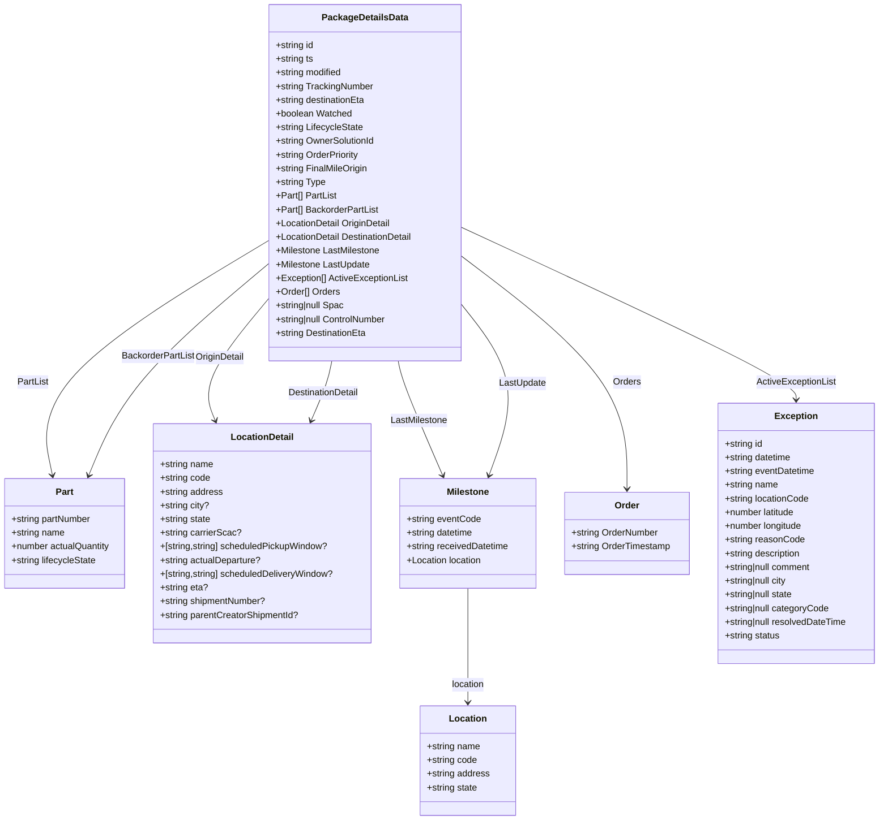

# Diagram: web/portal/src/pages/partview/utils/packageDetailsTypes.ts

> Auto-generated by Obscura crawlers

## Mermaid

### SVG

<svg id="container" width="1555.203125" xmlns="http://www.w3.org/2000/svg" class="classDiagram" height="1436" viewBox="0 0 1555.203125 1436" role="graphics-document document" aria-roledescription="class"><g><defs><marker id="container_class-aggregationStart" class="marker aggregation class" refX="18" refY="7" markerWidth="190" markerHeight="240" orient="auto"><path d="M 18,7 L9,13 L1,7 L9,1 Z"></path></marker></defs><defs><marker id="container_class-aggregationEnd" class="marker aggregation class" refX="1" refY="7" markerWidth="20" markerHeight="28" orient="auto"><path d="M 18,7 L9,13 L1,7 L9,1 Z"></path></marker></defs><defs><marker id="container_class-extensionStart" class="marker extension class" refX="18" refY="7" markerWidth="190" markerHeight="240" orient="auto"><path d="M 1,7 L18,13 V 1 Z"></path></marker></defs><defs><marker id="container_class-extensionEnd" class="marker extension class" refX="1" refY="7" markerWidth="20" markerHeight="28" orient="auto"><path d="M 1,1 V 13 L18,7 Z"></path></marker></defs><defs><marker id="container_class-compositionStart" class="marker composition class" refX="18" refY="7" markerWidth="190" markerHeight="240" orient="auto"><path d="M 18,7 L9,13 L1,7 L9,1 Z"></path></marker></defs><defs><marker id="container_class-compositionEnd" class="marker composition class" refX="1" refY="7" markerWidth="20" markerHeight="28" orient="auto"><path d="M 18,7 L9,13 L1,7 L9,1 Z"></path></marker></defs><defs><marker id="container_class-dependencyStart" class="marker dependency class" refX="6" refY="7" markerWidth="190" markerHeight="240" orient="auto"><path d="M 5,7 L9,13 L1,7 L9,1 Z"></path></marker></defs><defs><marker id="container_class-dependencyEnd" class="marker dependency class" refX="13" refY="7" markerWidth="20" markerHeight="28" orient="auto"><path d="M 18,7 L9,13 L14,7 L9,1 Z"></path></marker></defs><defs><marker id="container_class-lollipopStart" class="marker lollipop class" refX="13" refY="7" markerWidth="190" markerHeight="240" orient="auto"><circle stroke="black" fill="transparent" cx="7" cy="7" r="6"></circle></marker></defs><defs><marker id="container_class-lollipopEnd" class="marker lollipop class" refX="1" refY="7" markerWidth="190" markerHeight="240" orient="auto"><circle stroke="black" fill="transparent" cx="7" cy="7" r="6"></circle></marker></defs><g class="root"><g class="clusters"></g><g class="edgePaths"><path d="M477.154,420.924L407.584,462.27C338.013,503.616,198.872,586.308,135.027,654.842C71.183,723.376,82.635,777.753,88.361,804.941L94.088,832.129" id="id_PackageDetailsData_Part_1" class="edge-thickness-normal edge-pattern-solid relation" style=";;;" data-edge="true" data-et="edge" data-id="id_PackageDetailsData_Part_1" data-points="W3sieCI6NDc3LjE1NDI5Njg3NSwieSI6NDIwLjkyNDQ0NTE1Mzk3MzN9LHsieCI6NTkuNzMwNDY4NzUsInkiOjY2OX0seyJ4Ijo5NS4zMjQxMDA4MjU0NzE3LCJ5Ijo4Mzh9XQ==" marker-end="url(#container_class-dependencyEnd)"></path><path d="M477.154,461.058L435.431,495.715C393.707,530.372,310.26,599.686,257.097,661.588C203.933,723.489,181.054,777.979,169.614,805.223L158.175,832.468" id="id_PackageDetailsData_Part_2" class="edge-thickness-normal edge-pattern-solid relation" style=";;;" data-edge="true" data-et="edge" data-id="id_PackageDetailsData_Part_2" data-points="W3sieCI6NDc3LjE1NDI5Njg3NSwieSI6NDYxLjA1ODE0ODEyOTIwOTh9LHsieCI6MjI2LjgxMjUsInkiOjY2OX0seyJ4IjoxNTUuODUxOTMxMDE0MTUwOTUsInkiOjgzOH1d" marker-end="url(#container_class-dependencyEnd)"></path><path d="M477.154,522.511L456.681,546.926C436.207,571.341,395.26,620.17,379.508,655.83C363.755,691.489,373.198,713.979,377.92,725.223L382.641,736.468" id="id_PackageDetailsData_LocationDetail_3" class="edge-thickness-normal edge-pattern-solid relation" style=";;;" data-edge="true" data-et="edge" data-id="id_PackageDetailsData_LocationDetail_3" data-points="W3sieCI6NDc3LjE1NDI5Njg3NSwieSI6NTIyLjUxMDk3NDgyMDMxMn0seyJ4IjozNTQuMzEyNSwieSI6NjY5fSx7IngiOjM4NC45NjQxMDY3MjE2OTgxLCJ5Ijo3NDJ9XQ==" marker-end="url(#container_class-dependencyEnd)"></path><path d="M587.343,632L586.165,638.167C584.986,644.333,582.629,656.667,576.582,674.082C570.535,691.498,560.798,713.996,555.929,725.245L551.061,736.494" id="id_PackageDetailsData_LocationDetail_4" class="edge-thickness-normal edge-pattern-solid relation" style=";;;" data-edge="true" data-et="edge" data-id="id_PackageDetailsData_LocationDetail_4" data-points="W3sieCI6NTg3LjM0MzE2MjM4MzU5NiwieSI6NjMyfSx7IngiOjU4MC4yNzE0ODQzNzUsInkiOjY2OX0seyJ4Ijo1NDguNjc3Nzg1OTY2OTgxMSwieSI6NzQyfV0=" marker-end="url(#container_class-dependencyEnd)"></path><path d="M706.606,632L707.785,638.167C708.963,644.333,711.321,656.667,724.292,690.082C737.264,723.498,760.85,777.996,772.643,805.245L784.436,832.494" id="id_PackageDetailsData_Milestone_5" class="edge-thickness-normal edge-pattern-solid relation" style=";;;" data-edge="true" data-et="edge" data-id="id_PackageDetailsData_Milestone_5" data-points="W3sieCI6NzA2LjYwNjA1NjM2NjQwNCwieSI6NjMyfSx7IngiOjcxMy42Nzc3MzQzNzUsInkiOjY2OX0seyJ4Ijo3ODYuODE5MzEwMTQxNTA5NCwieSI6ODM4fV0=" marker-end="url(#container_class-dependencyEnd)"></path><path d="M816.795,532.477L834.981,555.231C853.167,577.984,889.538,623.492,897.702,673.474C905.865,723.456,885.821,777.913,875.798,805.141L865.776,832.369" id="id_PackageDetailsData_Milestone_6" class="edge-thickness-normal edge-pattern-solid relation" style=";;;" data-edge="true" data-et="edge" data-id="id_PackageDetailsData_Milestone_6" data-points="W3sieCI6ODE2Ljc5NDkyMTg3NSwieSI6NTMyLjQ3NjY0NDYxMDE2MDF9LHsieCI6OTI1LjkxMDE1NjI1LCJ5Ijo2Njl9LHsieCI6ODYzLjcwMzUwODI1NDcxNywieSI6ODM4fV0=" marker-end="url(#container_class-dependencyEnd)"></path><path d="M816.795,397.87L915.342,443.059C1013.889,488.247,1210.984,578.623,1309.531,628.978C1408.078,679.333,1408.078,689.667,1408.078,694.833L1408.078,700" id="id_PackageDetailsData_Exception_7" class="edge-thickness-normal edge-pattern-solid relation" style=";;;" data-edge="true" data-et="edge" data-id="id_PackageDetailsData_Exception_7" data-points="W3sieCI6ODE2Ljc5NDkyMTg3NSwieSI6Mzk3Ljg3MDIwNzk4ODUwMzV9LHsieCI6MTQwOC4wNzgxMjUsInkiOjY2OX0seyJ4IjoxNDA4LjA3ODEyNSwieSI6NzA2fV0=" marker-end="url(#container_class-dependencyEnd)"></path><path d="M816.795,448.331L865.463,485.109C914.132,521.888,1011.468,595.444,1060.136,663.389C1108.805,731.333,1108.805,793.667,1108.805,824.833L1108.805,856" id="id_PackageDetailsData_Order_8" class="edge-thickness-normal edge-pattern-solid relation" style=";;;" data-edge="true" data-et="edge" data-id="id_PackageDetailsData_Order_8" data-points="W3sieCI6ODE2Ljc5NDkyMTg3NSwieSI6NDQ4LjMzMTM3NTI2MDYxODJ9LHsieCI6MTEwOC44MDQ2ODc1LCJ5Ijo2Njl9LHsieCI6MTEwOC44MDQ2ODc1LCJ5Ijo4NjJ9XQ==" marker-end="url(#container_class-dependencyEnd)"></path><path d="M828.367,1030L828.367,1058.167C828.367,1086.333,828.367,1142.667,828.367,1176C828.367,1209.333,828.367,1219.667,828.367,1224.833L828.367,1230" id="id_Milestone_Location_9" class="edge-thickness-normal edge-pattern-solid relation" style=";;;" data-edge="true" data-et="edge" data-id="id_Milestone_Location_9" data-points="W3sieCI6ODI4LjM2NzE4NzUsInkiOjEwMzB9LHsieCI6ODI4LjM2NzE4NzUsInkiOjExOTl9LHsieCI6ODI4LjM2NzE4NzUsInkiOjEyMzZ9XQ==" marker-end="url(#container_class-dependencyEnd)"></path></g><g class="edgeLabels"><g class="edgeLabel" transform="translate(194.20864, 589.07944)"><g class="label" data-id="id_PackageDetailsData_Part_1" transform="translate(-27.40625, -12)"><foreignObject width="54.8125" height="24">

PartList

</foreignObject></g></g><g class="edgeLabel" transform="translate(281.48495, 623.58733)"><g class="label" data-id="id_PackageDetailsData_Part_2" transform="translate(-64.21875, -12)"><foreignObject width="128.4375" height="24">

BackorderPartList

</foreignObject></g></g><g class="edgeLabel" transform="translate(390.29674, 626.08874)"><g class="label" data-id="id_PackageDetailsData_LocationDetail_3" transform="translate(-43.28125, -12)"><foreignObject width="86.5625" height="24">

OriginDetail

</foreignObject></g></g><g class="edgeLabel" transform="translate(571.95562, 688.21454)"><g class="label" data-id="id_PackageDetailsData_LocationDetail_4" transform="translate(-63.234375, -12)"><foreignObject width="126.46875" height="24">

DestinationDetail

</foreignObject></g></g><g class="edgeLabel" transform="translate(742.76754, 736.21454)"><g class="label" data-id="id_PackageDetailsData_Milestone_5" transform="translate(-50.171875, -12)"><foreignObject width="100.34375" height="24">

LastMilestone

</foreignObject></g></g><g class="edgeLabel" transform="translate(924.99225, 671.49372)"><g class="label" data-id="id_PackageDetailsData_Milestone_6" transform="translate(-41.1171875, -12)"><foreignObject width="82.234375" height="24">

LastUpdate

</foreignObject></g></g><g class="edgeLabel" transform="translate(1408.078125, 669)"><g class="label" data-id="id_PackageDetailsData_Exception_7" transform="translate(-70.0546875, -12)"><foreignObject width="140.109375" height="24">

ActiveExceptionList

</foreignObject></g></g><g class="edgeLabel" transform="translate(1108.8046875, 669)"><g class="label" data-id="id_PackageDetailsData_Order_8" transform="translate(-24.234375, -12)"><foreignObject width="48.46875" height="24">

Orders

</foreignObject></g></g><g class="edgeLabel" transform="translate(828.3671875, 1199)"><g class="label" data-id="id_Milestone_Location_9" transform="translate(-29.578125, -12)"><foreignObject width="59.15625" height="24">

location

</foreignObject></g></g></g><g class="nodes"><g class="node default" id="classId-Part-0" transform="translate(115.54296875, 934)"><g class="basic label-container"><path d="M-107.54296875 -96 L107.54296875 -96 L107.54296875 96 L-107.54296875 96" stroke="none" stroke-width="0" fill="#ECECFF" style=""></path><path d="M-107.54296875 -96 C-60.01162996864879 -96, -12.480291187297581 -96, 107.54296875 -96 M-107.54296875 -96 C-35.20492541581399 -96, 37.13311791837202 -96, 107.54296875 -96 M107.54296875 -96 C107.54296875 -49.1396628664024, 107.54296875 -2.279325732804807, 107.54296875 96 M107.54296875 -96 C107.54296875 -55.42812482399855, 107.54296875 -14.856249647997103, 107.54296875 96 M107.54296875 96 C52.56999339931039 96, -2.4029819513792177 96, -107.54296875 96 M107.54296875 96 C64.40234073529072 96, 21.26171272058143 96, -107.54296875 96 M-107.54296875 96 C-107.54296875 34.70429925403967, -107.54296875 -26.591401491920664, -107.54296875 -96 M-107.54296875 96 C-107.54296875 31.720118514869768, -107.54296875 -32.559762970260465, -107.54296875 -96" stroke="#9370DB" stroke-width="1.3" fill="none" stroke-dasharray="0 0" style=""></path></g><g class="annotation-group text" transform="translate(0, -72)"></g><g class="label-group text" transform="translate(-15.0703125, -72)"><g class="label" style="font-weight: bolder" transform="translate(0,-12)"><foreignObject width="30.140625" height="24">

Part

</foreignObject></g></g><g class="members-group text" transform="translate(-95.54296875, -24)"><g class="label" style="" transform="translate(0,-12)"><foreignObject width="142.21875" height="24">

+string partNumber

</foreignObject></g><g class="label" style="" transform="translate(0,12)"><foreignObject width="94.375" height="24">

+string name

</foreignObject></g><g class="label" style="" transform="translate(0,36)"><foreignObject width="176.015625" height="24">

+number actualQuantity

</foreignObject></g><g class="label" style="" transform="translate(0,60)"><foreignObject width="150.765625" height="24">

+string lifecycleState

</foreignObject></g></g><g class="methods-group text" transform="translate(-95.54296875, 96)"></g><g class="divider" style=""><path d="M-107.54296875 -48 C-27.891428915158173 -48, 51.760110919683655 -48, 107.54296875 -48 M-107.54296875 -48 C-45.53021110657907 -48, 16.482546536841866 -48, 107.54296875 -48" stroke="#9370DB" stroke-width="1.3" fill="none" stroke-dasharray="0 0" style=""></path></g><g class="divider" style=""><path d="M-107.54296875 72 C-24.805327166319216 72, 57.93231441736157 72, 107.54296875 72 M-107.54296875 72 C-64.22472519983793 72, -20.906481649675854 72, 107.54296875 72" stroke="#9370DB" stroke-width="1.3" fill="none" stroke-dasharray="0 0" style=""></path></g></g><g class="node default" id="classId-LocationDetail-1" transform="translate(465.58203125, 934)"><g class="basic label-container"><path d="M-192.49609375 -192 L192.49609375 -192 L192.49609375 192 L-192.49609375 192" stroke="none" stroke-width="0" fill="#ECECFF" style=""></path><path d="M-192.49609375 -192 C-68.23210344637059 -192, 56.031886857258826 -192, 192.49609375 -192 M-192.49609375 -192 C-94.3204937378468 -192, 3.8551062743063937 -192, 192.49609375 -192 M192.49609375 -192 C192.49609375 -48.46909427210625, 192.49609375 95.0618114557875, 192.49609375 192 M192.49609375 -192 C192.49609375 -48.12850137150562, 192.49609375 95.74299725698876, 192.49609375 192 M192.49609375 192 C68.70262295359247 192, -55.090847842815066 192, -192.49609375 192 M192.49609375 192 C75.335224415152 192, -41.825644919696 192, -192.49609375 192 M-192.49609375 192 C-192.49609375 81.16650564019497, -192.49609375 -29.66698871961006, -192.49609375 -192 M-192.49609375 192 C-192.49609375 70.22180698348961, -192.49609375 -51.55638603302077, -192.49609375 -192" stroke="#9370DB" stroke-width="1.3" fill="none" stroke-dasharray="0 0" style=""></path></g><g class="annotation-group text" transform="translate(0, -168)"></g><g class="label-group text" transform="translate(-52.9765625, -168)"><g class="label" style="font-weight: bolder" transform="translate(0,-12)"><foreignObject width="105.953125" height="24">

LocationDetail

</foreignObject></g></g><g class="members-group text" transform="translate(-180.49609375, -120)"><g class="label" style="" transform="translate(0,-12)"><foreignObject width="94.375" height="24">

+string name

</foreignObject></g><g class="label" style="" transform="translate(0,12)"><foreignObject width="88.828125" height="24">

+string code

</foreignObject></g><g class="label" style="" transform="translate(0,36)"><foreignObject width="110.90625" height="24">

+string address

</foreignObject></g><g class="label" style="" transform="translate(0,60)"><foreignObject width="86.453125" height="24">

+string city?

</foreignObject></g><g class="label" style="" transform="translate(0,84)"><foreignObject width="89.953125" height="24">

+string state

</foreignObject></g><g class="label" style="" transform="translate(0,108)"><foreignObject width="141.15625" height="24">

+string carrierScac?

</foreignObject></g><g class="label" style="" transform="translate(0,132)"><foreignObject width="297.5625" height="24">

+[string,string] scheduledPickupWindow?

</foreignObject></g><g class="label" style="" transform="translate(0,156)"><foreignObject width="177.984375" height="24">

+string actualDeparture?

</foreignObject></g><g class="label" style="" transform="translate(0,180)"><foreignObject width="308.015625" height="24">

+[string,string] scheduledDeliveryWindow?

</foreignObject></g><g class="label" style="" transform="translate(0,204)"><foreignObject width="83.8125" height="24">

+string eta?

</foreignObject></g><g class="label" style="" transform="translate(0,228)"><foreignObject width="187.53125" height="24">

+string shipmentNumber?

</foreignObject></g><g class="label" style="" transform="translate(0,252)"><foreignObject width="245.546875" height="24">

+string parentCreatorShipmentId?

</foreignObject></g></g><g class="methods-group text" transform="translate(-180.49609375, 192)"></g><g class="divider" style=""><path d="M-192.49609375 -144 C-100.96840807140714 -144, -9.44072239281428 -144, 192.49609375 -144 M-192.49609375 -144 C-42.21365363482451 -144, 108.06878648035098 -144, 192.49609375 -144" stroke="#9370DB" stroke-width="1.3" fill="none" stroke-dasharray="0 0" style=""></path></g><g class="divider" style=""><path d="M-192.49609375 168 C-87.64741030153675 168, 17.201273146926496 168, 192.49609375 168 M-192.49609375 168 C-67.43739262248592 168, 57.62130850502817 168, 192.49609375 168" stroke="#9370DB" stroke-width="1.3" fill="none" stroke-dasharray="0 0" style=""></path></g></g><g class="node default" id="classId-Milestone-2" transform="translate(828.3671875, 934)"><g class="basic label-container"><path d="M-120.2890625 -96 L120.2890625 -96 L120.2890625 96 L-120.2890625 96" stroke="none" stroke-width="0" fill="#ECECFF" style=""></path><path d="M-120.2890625 -96 C-46.772738276725434 -96, 26.743585946549132 -96, 120.2890625 -96 M-120.2890625 -96 C-69.54889609408883 -96, -18.808729688177664 -96, 120.2890625 -96 M120.2890625 -96 C120.2890625 -20.08774398401306, 120.2890625 55.82451203197388, 120.2890625 96 M120.2890625 -96 C120.2890625 -38.91963043003612, 120.2890625 18.160739139927756, 120.2890625 96 M120.2890625 96 C68.63931549233264 96, 16.989568484665284 96, -120.2890625 96 M120.2890625 96 C39.79706032649162 96, -40.694941847016764 96, -120.2890625 96 M-120.2890625 96 C-120.2890625 23.053706818489886, -120.2890625 -49.89258636302023, -120.2890625 -96 M-120.2890625 96 C-120.2890625 23.95625413162334, -120.2890625 -48.08749173675332, -120.2890625 -96" stroke="#9370DB" stroke-width="1.3" fill="none" stroke-dasharray="0 0" style=""></path></g><g class="annotation-group text" transform="translate(0, -72)"></g><g class="label-group text" transform="translate(-35.8125, -72)"><g class="label" style="font-weight: bolder" transform="translate(0,-12)"><foreignObject width="71.625" height="24">

Milestone

</foreignObject></g></g><g class="members-group text" transform="translate(-108.2890625, -24)"><g class="label" style="" transform="translate(0,-12)"><foreignObject width="130.46875" height="24">

+string eventCode

</foreignObject></g><g class="label" style="" transform="translate(0,12)"><foreignObject width="119.109375" height="24">

+string datetime

</foreignObject></g><g class="label" style="" transform="translate(0,36)"><foreignObject width="180.765625" height="24">

+string receivedDatetime

</foreignObject></g><g class="label" style="" transform="translate(0,60)"><foreignObject width="133.5" height="24">

+Location location

</foreignObject></g></g><g class="methods-group text" transform="translate(-108.2890625, 96)"></g><g class="divider" style=""><path d="M-120.2890625 -48 C-60.63373015733716 -48, -0.9783978146743237 -48, 120.2890625 -48 M-120.2890625 -48 C-32.62134787963889 -48, 55.04636674072222 -48, 120.2890625 -48" stroke="#9370DB" stroke-width="1.3" fill="none" stroke-dasharray="0 0" style=""></path></g><g class="divider" style=""><path d="M-120.2890625 72 C-24.632731101610503 72, 71.023600296779 72, 120.2890625 72 M-120.2890625 72 C-51.25954647728135 72, 17.769969545437306 72, 120.2890625 72" stroke="#9370DB" stroke-width="1.3" fill="none" stroke-dasharray="0 0" style=""></path></g></g><g class="node default" id="classId-Location-3" transform="translate(828.3671875, 1332)"><g class="basic label-container"><path d="M-83.12890625 -96 L83.12890625 -96 L83.12890625 96 L-83.12890625 96" stroke="none" stroke-width="0" fill="#ECECFF" style=""></path><path d="M-83.12890625 -96 C-34.67119720238979 -96, 13.786511845220417 -96, 83.12890625 -96 M-83.12890625 -96 C-36.56637669683087 -96, 9.996152856338256 -96, 83.12890625 -96 M83.12890625 -96 C83.12890625 -37.74945594842096, 83.12890625 20.501088103158082, 83.12890625 96 M83.12890625 -96 C83.12890625 -43.60939172090066, 83.12890625 8.781216558198679, 83.12890625 96 M83.12890625 96 C42.6347990821916 96, 2.140691914383197 96, -83.12890625 96 M83.12890625 96 C32.711146910861174 96, -17.70661242827765 96, -83.12890625 96 M-83.12890625 96 C-83.12890625 51.0781801354646, -83.12890625 6.1563602709291985, -83.12890625 -96 M-83.12890625 96 C-83.12890625 41.735503255637965, -83.12890625 -12.528993488724069, -83.12890625 -96" stroke="#9370DB" stroke-width="1.3" fill="none" stroke-dasharray="0 0" style=""></path></g><g class="annotation-group text" transform="translate(0, -72)"></g><g class="label-group text" transform="translate(-31.3515625, -72)"><g class="label" style="font-weight: bolder" transform="translate(0,-12)"><foreignObject width="62.703125" height="24">

Location

</foreignObject></g></g><g class="members-group text" transform="translate(-71.12890625, -24)"><g class="label" style="" transform="translate(0,-12)"><foreignObject width="94.375" height="24">

+string name

</foreignObject></g><g class="label" style="" transform="translate(0,12)"><foreignObject width="88.828125" height="24">

+string code

</foreignObject></g><g class="label" style="" transform="translate(0,36)"><foreignObject width="110.90625" height="24">

+string address

</foreignObject></g><g class="label" style="" transform="translate(0,60)"><foreignObject width="89.953125" height="24">

+string state

</foreignObject></g></g><g class="methods-group text" transform="translate(-71.12890625, 96)"></g><g class="divider" style=""><path d="M-83.12890625 -48 C-19.163881791726475 -48, 44.80114266654705 -48, 83.12890625 -48 M-83.12890625 -48 C-35.15552477101007 -48, 12.817856707979857 -48, 83.12890625 -48" stroke="#9370DB" stroke-width="1.3" fill="none" stroke-dasharray="0 0" style=""></path></g><g class="divider" style=""><path d="M-83.12890625 72 C-26.334295522016717 72, 30.460315205966566 72, 83.12890625 72 M-83.12890625 72 C-34.39868042754505 72, 14.331545394909895 72, 83.12890625 72" stroke="#9370DB" stroke-width="1.3" fill="none" stroke-dasharray="0 0" style=""></path></g></g><g class="node default" id="classId-Order-4" transform="translate(1108.8046875, 934)"><g class="basic label-container"><path d="M-110.1484375 -72 L110.1484375 -72 L110.1484375 72 L-110.1484375 72" stroke="none" stroke-width="0" fill="#ECECFF" style=""></path><path d="M-110.1484375 -72 C-65.39120123302924 -72, -20.63396496605847 -72, 110.1484375 -72 M-110.1484375 -72 C-42.1802284387407 -72, 25.787980622518603 -72, 110.1484375 -72 M110.1484375 -72 C110.1484375 -32.4509580445317, 110.1484375 7.0980839109365945, 110.1484375 72 M110.1484375 -72 C110.1484375 -34.43405821134376, 110.1484375 3.131883577312479, 110.1484375 72 M110.1484375 72 C65.28298103066624 72, 20.417524561332456 72, -110.1484375 72 M110.1484375 72 C57.040567992347015 72, 3.932698484694029 72, -110.1484375 72 M-110.1484375 72 C-110.1484375 19.62729338625404, -110.1484375 -32.74541322749192, -110.1484375 -72 M-110.1484375 72 C-110.1484375 22.722413705977203, -110.1484375 -26.555172588045593, -110.1484375 -72" stroke="#9370DB" stroke-width="1.3" fill="none" stroke-dasharray="0 0" style=""></path></g><g class="annotation-group text" transform="translate(0, -48)"></g><g class="label-group text" transform="translate(-20.921875, -48)"><g class="label" style="font-weight: bolder" transform="translate(0,-12)"><foreignObject width="41.84375" height="24">

Order

</foreignObject></g></g><g class="members-group text" transform="translate(-98.1484375, 0)"><g class="label" style="" transform="translate(0,-12)"><foreignObject width="153.453125" height="24">

+string OrderNumber

</foreignObject></g><g class="label" style="" transform="translate(0,12)"><foreignObject width="175.375" height="24">

+string OrderTimestamp

</foreignObject></g></g><g class="methods-group text" transform="translate(-98.1484375, 72)"></g><g class="divider" style=""><path d="M-110.1484375 -24 C-48.5175843003116 -24, 13.113268899376806 -24, 110.1484375 -24 M-110.1484375 -24 C-48.25585310783046 -24, 13.636731284339078 -24, 110.1484375 -24" stroke="#9370DB" stroke-width="1.3" fill="none" stroke-dasharray="0 0" style=""></path></g><g class="divider" style=""><path d="M-110.1484375 48 C-55.27412300624532 48, -0.39980851249063676 48, 110.1484375 48 M-110.1484375 48 C-54.176718435678886 48, 1.795000628642228 48, 110.1484375 48" stroke="#9370DB" stroke-width="1.3" fill="none" stroke-dasharray="0 0" style=""></path></g></g><g class="node default" id="classId-Exception-5" transform="translate(1408.078125, 934)"><g class="basic label-container"><path d="M-139.125 -228 L139.125 -228 L139.125 228 L-139.125 228" stroke="none" stroke-width="0" fill="#ECECFF" style=""></path><path d="M-139.125 -228 C-42.07588072239888 -228, 54.973238555202244 -228, 139.125 -228 M-139.125 -228 C-81.95478119351392 -228, -24.78456238702786 -228, 139.125 -228 M139.125 -228 C139.125 -132.59538032546038, 139.125 -37.190760650920794, 139.125 228 M139.125 -228 C139.125 -46.50310478310442, 139.125 134.99379043379116, 139.125 228 M139.125 228 C66.13117940878972 228, -6.86264118242056 228, -139.125 228 M139.125 228 C81.46784621825101 228, 23.810692436502023 228, -139.125 228 M-139.125 228 C-139.125 82.15168333947554, -139.125 -63.69663332104892, -139.125 -228 M-139.125 228 C-139.125 77.1194808183391, -139.125 -73.7610383633218, -139.125 -228" stroke="#9370DB" stroke-width="1.3" fill="none" stroke-dasharray="0 0" style=""></path></g><g class="annotation-group text" transform="translate(0, -204)"></g><g class="label-group text" transform="translate(-35.703125, -204)"><g class="label" style="font-weight: bolder" transform="translate(0,-12)"><foreignObject width="71.40625" height="24">

Exception

</foreignObject></g></g><g class="members-group text" transform="translate(-127.125, -156)"><g class="label" style="" transform="translate(0,-12)"><foreignObject width="67.9375" height="24">

+string id

</foreignObject></g><g class="label" style="" transform="translate(0,12)"><foreignObject width="119.109375" height="24">

+string datetime

</foreignObject></g><g class="label" style="" transform="translate(0,36)"><foreignObject width="160.03125" height="24">

+string eventDatetime

</foreignObject></g><g class="label" style="" transform="translate(0,60)"><foreignObject width="94.375" height="24">

+string name

</foreignObject></g><g class="label" style="" transform="translate(0,84)"><foreignObject width="149.28125" height="24">

+string locationCode

</foreignObject></g><g class="label" style="" transform="translate(0,108)"><foreignObject width="126.015625" height="24">

+number latitude

</foreignObject></g><g class="label" style="" transform="translate(0,132)"><foreignObject width="138.5625" height="24">

+number longitude

</foreignObject></g><g class="label" style="" transform="translate(0,156)"><foreignObject width="139.125" height="24">

+string reasonCode

</foreignObject></g><g class="label" style="" transform="translate(0,180)"><foreignObject width="136.46875" height="24">

+string description

</foreignObject></g><g class="label" style="" transform="translate(0,204)"><foreignObject width="156.34375" height="24">

+string|null comment

</foreignObject></g><g class="label" style="" transform="translate(0,228)"><foreignObject width="114.109375" height="24">

+string|null city

</foreignObject></g><g class="label" style="" transform="translate(0,252)"><foreignObject width="124.46875" height="24">

+string|null state

</foreignObject></g><g class="label" style="" transform="translate(0,276)"><foreignObject width="186.546875" height="24">

+string|null categoryCode

</foreignObject></g><g class="label" style="" transform="translate(0,300)"><foreignObject width="218.546875" height="24">

+string|null resolvedDateTime

</foreignObject></g><g class="label" style="" transform="translate(0,324)"><foreignObject width="98.265625" height="24">

+string status

</foreignObject></g></g><g class="methods-group text" transform="translate(-127.125, 228)"></g><g class="divider" style=""><path d="M-139.125 -180 C-46.02675803178607 -180, 47.07148393642785 -180, 139.125 -180 M-139.125 -180 C-82.1314243421393 -180, -25.137848684278595 -180, 139.125 -180" stroke="#9370DB" stroke-width="1.3" fill="none" stroke-dasharray="0 0" style=""></path></g><g class="divider" style=""><path d="M-139.125 204 C-67.73488374886205 204, 3.655232502275908 204, 139.125 204 M-139.125 204 C-57.11634310853621 204, 24.892313782927573 204, 139.125 204" stroke="#9370DB" stroke-width="1.3" fill="none" stroke-dasharray="0 0" style=""></path></g></g><g class="node default" id="classId-PackageDetailsData-6" transform="translate(646.974609375, 320)"><g class="basic label-container"><path d="M-169.8203125 -312 L169.8203125 -312 L169.8203125 312 L-169.8203125 312" stroke="none" stroke-width="0" fill="#ECECFF" style=""></path><path d="M-169.8203125 -312 C-63.46828382234219 -312, 42.883744855315626 -312, 169.8203125 -312 M-169.8203125 -312 C-73.81216182477155 -312, 22.1959888504569 -312, 169.8203125 -312 M169.8203125 -312 C169.8203125 -163.2333924924066, 169.8203125 -14.466784984813216, 169.8203125 312 M169.8203125 -312 C169.8203125 -110.2407200611926, 169.8203125 91.51855987761479, 169.8203125 312 M169.8203125 312 C76.21024362558715 312, -17.399825248825692 312, -169.8203125 312 M169.8203125 312 C96.28274434738053 312, 22.745176194761058 312, -169.8203125 312 M-169.8203125 312 C-169.8203125 122.66077477103264, -169.8203125 -66.67845045793473, -169.8203125 -312 M-169.8203125 312 C-169.8203125 81.15797068261759, -169.8203125 -149.68405863476482, -169.8203125 -312" stroke="#9370DB" stroke-width="1.3" fill="none" stroke-dasharray="0 0" style=""></path></g><g class="annotation-group text" transform="translate(0, -288)"></g><g class="label-group text" transform="translate(-72.234375, -288)"><g class="label" style="font-weight: bolder" transform="translate(0,-12)"><foreignObject width="144.46875" height="24">

PackageDetailsData

</foreignObject></g></g><g class="members-group text" transform="translate(-157.8203125, -240)"><g class="label" style="" transform="translate(0,-12)"><foreignObject width="67.9375" height="24">

+string id

</foreignObject></g><g class="label" style="" transform="translate(0,12)"><foreignObject width="67.109375" height="24">

+string ts

</foreignObject></g><g class="label" style="" transform="translate(0,36)"><foreignObject width="118.484375" height="24">

+string modified

</foreignObject></g><g class="label" style="" transform="translate(0,60)"><foreignObject width="172.375" height="24">

+string TrackingNumber

</foreignObject></g><g class="label" style="" transform="translate(0,84)"><foreignObject width="159.703125" height="24">

+string destinationEta

</foreignObject></g><g class="label" style="" transform="translate(0,108)"><foreignObject width="133.953125" height="24">

+boolean Watched

</foreignObject></g><g class="label" style="" transform="translate(0,132)"><foreignObject width="154.046875" height="24">

+string LifecycleState

</foreignObject></g><g class="label" style="" transform="translate(0,156)"><foreignObject width="176.046875" height="24">

+string OwnerSolutionId

</foreignObject></g><g class="label" style="" transform="translate(0,180)"><foreignObject width="148.359375" height="24">

+string OrderPriority

</foreignObject></g><g class="label" style="" transform="translate(0,204)"><foreignObject width="162.53125" height="24">

+string FinalMileOrigin

</foreignObject></g><g class="label" style="" transform="translate(0,228)"><foreignObject width="87.59375" height="24">

+string Type

</foreignObject></g><g class="label" style="" transform="translate(0,252)"><foreignObject width="106.40625" height="24">

+Part[] PartList

</foreignObject></g><g class="label" style="" transform="translate(0,276)"><foreignObject width="180.046875" height="24">

+Part[] BackorderPartList

</foreignObject></g><g class="label" style="" transform="translate(0,300)"><foreignObject width="203.5" height="24">

+LocationDetail OriginDetail

</foreignObject></g><g class="label" style="" transform="translate(0,324)"><foreignObject width="243.40625" height="24">

+LocationDetail DestinationDetail

</foreignObject></g><g class="label" style="" transform="translate(0,348)"><foreignObject width="183.296875" height="24">

+Milestone LastMilestone

</foreignObject></g><g class="label" style="" transform="translate(0,372)"><foreignObject width="165.1875" height="24">

+Milestone LastUpdate

</foreignObject></g><g class="label" style="" transform="translate(0,396)"><foreignObject width="233.375" height="24">

+Exception[] ActiveExceptionList

</foreignObject></g><g class="label" style="" transform="translate(0,420)"><foreignObject width="112.234375" height="24">

+Order[] Orders

</foreignObject></g><g class="label" style="" transform="translate(0,444)"><foreignObject width="122.796875" height="24">

+string|null Spac

</foreignObject></g><g class="label" style="" transform="translate(0,468)"><foreignObject width="199.59375" height="24">

+string|null ControlNumber

</foreignObject></g><g class="label" style="" transform="translate(0,492)"><foreignObject width="160.4375" height="24">

+string DestinationEta

</foreignObject></g></g><g class="methods-group text" transform="translate(-157.8203125, 312)"></g><g class="divider" style=""><path d="M-169.8203125 -264 C-70.24504129582974 -264, 29.330229908340527 -264, 169.8203125 -264 M-169.8203125 -264 C-80.31715640708606 -264, 9.18599968582788 -264, 169.8203125 -264" stroke="#9370DB" stroke-width="1.3" fill="none" stroke-dasharray="0 0" style=""></path></g><g class="divider" style=""><path d="M-169.8203125 288 C-64.88552226265747 288, 40.04926797468505 288, 169.8203125 288 M-169.8203125 288 C-37.667474252078335 288, 94.48536399584333 288, 169.8203125 288" stroke="#9370DB" stroke-width="1.3" fill="none" stroke-dasharray="0 0" style=""></path></g></g></g></g></g></svg>
