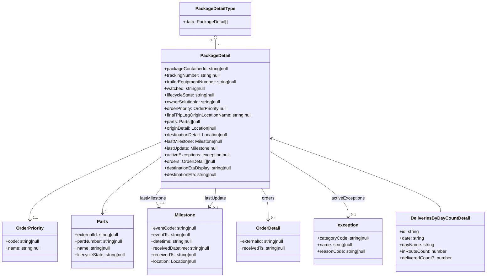
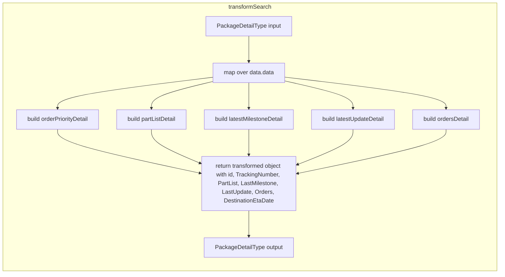

# Diagram: web/portal/src/pages/partview/utils/transformSearchResponse.ts


> Auto-generated by Obscura crawlers

## Diagram 1



### SVG

<svg id="container" width="1783.328125" xmlns="http://www.w3.org/2000/svg" class="classDiagram" height="1004" viewBox="0 0 1783.328125 1004" role="graphics-document document" aria-roledescription="class"><style>#container{font-family:"trebuchet ms",verdana,arial,sans-serif;font-size:16px;fill:#333;}@keyframes edge-animation-frame{from{stroke-dashoffset:0;}}@keyframes dash{to{stroke-dashoffset:0;}}#container .edge-animation-slow{stroke-dasharray:9,5!important;stroke-dashoffset:900;animation:dash 50s linear infinite;stroke-linecap:round;}#container .edge-animation-fast{stroke-dasharray:9,5!important;stroke-dashoffset:900;animation:dash 20s linear infinite;stroke-linecap:round;}#container .error-icon{fill:#552222;}#container .error-text{fill:#552222;stroke:#552222;}#container .edge-thickness-normal{stroke-width:1px;}#container .edge-thickness-thick{stroke-width:3.5px;}#container .edge-pattern-solid{stroke-dasharray:0;}#container .edge-thickness-invisible{stroke-width:0;fill:none;}#container .edge-pattern-dashed{stroke-dasharray:3;}#container .edge-pattern-dotted{stroke-dasharray:2;}#container .marker{fill:#333333;stroke:#333333;}#container .marker.cross{stroke:#333333;}#container svg{font-family:"trebuchet ms",verdana,arial,sans-serif;font-size:16px;}#container p{margin:0;}#container g.classGroup text{fill:#9370DB;stroke:none;font-family:"trebuchet ms",verdana,arial,sans-serif;font-size:10px;}#container g.classGroup text .title{font-weight:bolder;}#container .nodeLabel,#container .edgeLabel{color:#131300;}#container .edgeLabel .label rect{fill:#ECECFF;}#container .label text{fill:#131300;}#container .labelBkg{background:#ECECFF;}#container .edgeLabel .label span{background:#ECECFF;}#container .classTitle{font-weight:bolder;}#container .node rect,#container .node circle,#container .node ellipse,#container .node polygon,#container .node path{fill:#ECECFF;stroke:#9370DB;stroke-width:1px;}#container .divider{stroke:#9370DB;stroke-width:1;}#container g.clickable{cursor:pointer;}#container g.classGroup rect{fill:#ECECFF;stroke:#9370DB;}#container g.classGroup line{stroke:#9370DB;stroke-width:1;}#container .classLabel .box{stroke:none;stroke-width:0;fill:#ECECFF;opacity:0.5;}#container .classLabel .label{fill:#9370DB;font-size:10px;}#container .relation{stroke:#333333;stroke-width:1;fill:none;}#container .dashed-line{stroke-dasharray:3;}#container .dotted-line{stroke-dasharray:1 2;}#container #compositionStart,#container .composition{fill:#333333!important;stroke:#333333!important;stroke-width:1;}#container #compositionEnd,#container .composition{fill:#333333!important;stroke:#333333!important;stroke-width:1;}#container #dependencyStart,#container .dependency{fill:#333333!important;stroke:#333333!important;stroke-width:1;}#container #dependencyStart,#container .dependency{fill:#333333!important;stroke:#333333!important;stroke-width:1;}#container #extensionStart,#container .extension{fill:transparent!important;stroke:#333333!important;stroke-width:1;}#container #extensionEnd,#container .extension{fill:transparent!important;stroke:#333333!important;stroke-width:1;}#container #aggregationStart,#container .aggregation{fill:transparent!important;stroke:#333333!important;stroke-width:1;}#container #aggregationEnd,#container .aggregation{fill:transparent!important;stroke:#333333!important;stroke-width:1;}#container #lollipopStart,#container .lollipop{fill:#ECECFF!important;stroke:#333333!important;stroke-width:1;}#container #lollipopEnd,#container .lollipop{fill:#ECECFF!important;stroke:#333333!important;stroke-width:1;}#container .edgeTerminals{font-size:11px;line-height:initial;}#container .classTitleText{text-anchor:middle;font-size:18px;fill:#333;}#container .label-icon{display:inline-block;height:1em;overflow:visible;vertical-align:-0.125em;}#container .node .label-icon path{fill:currentColor;stroke:revert;stroke-width:revert;}#container :root{--mermaid-font-family:"trebuchet ms",verdana,arial,sans-serif;}</style><g><defs><marker id="container_class-aggregationStart" class="marker aggregation class" refX="18" refY="7" markerWidth="190" markerHeight="240" orient="auto"><path d="M 18,7 L9,13 L1,7 L9,1 Z"></path></marker></defs><defs><marker id="container_class-aggregationEnd" class="marker aggregation class" refX="1" refY="7" markerWidth="20" markerHeight="28" orient="auto"><path d="M 18,7 L9,13 L1,7 L9,1 Z"></path></marker></defs><defs><marker id="container_class-extensionStart" class="marker extension class" refX="18" refY="7" markerWidth="190" markerHeight="240" orient="auto"><path d="M 1,7 L18,13 V 1 Z"></path></marker></defs><defs><marker id="container_class-extensionEnd" class="marker extension class" refX="1" refY="7" markerWidth="20" markerHeight="28" orient="auto"><path d="M 1,1 V 13 L18,7 Z"></path></marker></defs><defs><marker id="container_class-compositionStart" class="marker composition class" refX="18" refY="7" markerWidth="190" markerHeight="240" orient="auto"><path d="M 18,7 L9,13 L1,7 L9,1 Z"></path></marker></defs><defs><marker id="container_class-compositionEnd" class="marker composition class" refX="1" refY="7" markerWidth="20" markerHeight="28" orient="auto"><path d="M 18,7 L9,13 L1,7 L9,1 Z"></path></marker></defs><defs><marker id="container_class-dependencyStart" class="marker dependency class" refX="6" refY="7" markerWidth="190" markerHeight="240" orient="auto"><path d="M 5,7 L9,13 L1,7 L9,1 Z"></path></marker></defs><defs><marker id="container_class-dependencyEnd" class="marker dependency class" refX="13" refY="7" markerWidth="20" markerHeight="28" orient="auto"><path d="M 18,7 L9,13 L14,7 L9,1 Z"></path></marker></defs><defs><marker id="container_class-lollipopStart" class="marker lollipop class" refX="13" refY="7" markerWidth="190" markerHeight="240" orient="auto"><circle stroke="black" fill="transparent" cx="7" cy="7" r="6"></circle></marker></defs><defs><marker id="container_class-lollipopEnd" class="marker lollipop class" refX="1" refY="7" markerWidth="190" markerHeight="240" orient="auto"><circle stroke="black" fill="transparent" cx="7" cy="7" r="6"></circle></marker></defs><g class="root"><g class="clusters"></g><g class="edgePaths"><path d="M796.576,145.25L796.576,146.542C796.576,147.833,796.576,150.417,796.576,155.875C796.576,161.333,796.576,169.667,796.576,173.833L796.576,178" id="id_PackageDetailType_PackageDetail_1" class="edge-thickness-normal edge-pattern-solid relation" style=";;;" data-edge="true" data-et="edge" data-id="id_PackageDetailType_PackageDetail_1" data-points="W3sieCI6Nzk2LjU3NjE3MTg3NSwieSI6MTI4fSx7IngiOjc5Ni41NzYxNzE4NzUsInkiOjE1M30seyJ4Ijo3OTYuNTc2MTcxODc1LCJ5IjoxNzh9XQ==" marker-start="url(#container_class-aggregationStart)"></path><path d="M596.576,514.253L515.571,548.377C434.566,582.502,272.557,650.751,191.552,698.042C110.547,745.333,110.547,771.667,110.547,784.833L110.547,798" id="id_PackageDetail_OrderPriority_2" class="edge-thickness-normal edge-pattern-solid relation" style=";;;" data-edge="true" data-et="edge" data-id="id_PackageDetail_OrderPriority_2" data-points="W3sieCI6NTk2LjU3NjE3MTg3NSwieSI6NTE0LjI1Mjk2MTU5MTEzMX0seyJ4IjoxMTAuNTQ2ODc1LCJ5Ijo3MTl9LHsieCI6MTEwLjU0Njg3NSwieSI6ODA0fV0=" marker-end="url(#container_class-dependencyEnd)"></path><path d="M596.576,568.455L560.332,593.546C524.089,618.637,451.601,668.818,415.357,703.076C379.113,737.333,379.113,755.667,379.113,764.833L379.113,774" id="id_PackageDetail_Parts_3" class="edge-thickness-normal edge-pattern-solid relation" style=";;;" data-edge="true" data-et="edge" data-id="id_PackageDetail_Parts_3" data-points="W3sieCI6NTk2LjU3NjE3MTg3NSwieSI6NTY4LjQ1NTQyMDM0NTE4NDJ9LHsieCI6Mzc5LjExMzI4MTI1LCJ5Ijo3MTl9LHsieCI6Mzc5LjExMzI4MTI1LCJ5Ijo3ODB9XQ==" marker-end="url(#container_class-dependencyEnd)"></path><path d="M596.576,680.827L591.503,687.189C586.43,693.551,576.285,706.276,575.262,718.006C574.239,729.737,582.34,740.474,586.391,745.842L590.441,751.21" id="id_PackageDetail_Milestone_4" class="edge-thickness-normal edge-pattern-solid relation" style=";;;" data-edge="true" data-et="edge" data-id="id_PackageDetail_Milestone_4" data-points="W3sieCI6NTk2LjU3NjE3MTg3NSwieSI6NjgwLjgyNzIzMDgxMDk1NzR9LHsieCI6NTY2LjEzODY3MTg3NSwieSI6NzE5fSx7IngiOjU5NC4wNTQ4MzY3ODM0Mzk0LCJ5Ijo3NTZ9XQ==" marker-end="url(#container_class-dependencyEnd)"></path><path d="M796.576,682L796.576,688.167C796.576,694.333,796.576,706.667,792.758,718.186C788.941,729.705,781.305,740.41,777.487,745.763L773.67,751.115" id="id_PackageDetail_Milestone_5" class="edge-thickness-normal edge-pattern-solid relation" style=";;;" data-edge="true" data-et="edge" data-id="id_PackageDetail_Milestone_5" data-points="W3sieCI6Nzk2LjU3NjE3MTg3NSwieSI6NjgyfSx7IngiOjc5Ni41NzYxNzE4NzUsInkiOjcxOX0seyJ4Ijo3NzAuMTg1NDEwMDMxODQ3MSwieSI6NzU2fV0=" marker-end="url(#container_class-dependencyEnd)"></path><path d="M966.5,682L970.658,688.167C974.816,694.333,983.133,706.667,987.291,726C991.449,745.333,991.449,771.667,991.449,784.833L991.449,798" id="id_PackageDetail_OrderDetail_6" class="edge-thickness-normal edge-pattern-solid relation" style=";;;" data-edge="true" data-et="edge" data-id="id_PackageDetail_OrderDetail_6" data-points="W3sieCI6OTY2LjUwMDA3NDM0MDM5OCwieSI6NjgyfSx7IngiOjk5MS40NDkyMTg3NSwieSI6NzE5fSx7IngiOjk5MS40NDkyMTg3NSwieSI6ODA0fV0=" marker-end="url(#container_class-dependencyEnd)"></path><path d="M996.576,548.597L1044.47,576.997C1092.365,605.398,1188.153,662.199,1236.047,701.766C1283.941,741.333,1283.941,763.667,1283.941,774.833L1283.941,786" id="id_PackageDetail_exception_7" class="edge-thickness-normal edge-pattern-solid relation" style=";;;" data-edge="true" data-et="edge" data-id="id_PackageDetail_exception_7" data-points="W3sieCI6OTk2LjU3NjE3MTg3NSwieSI6NTQ4LjU5Njg4Nzc2MTQ0MDV9LHsieCI6MTI4My45NDE0MDYyNSwieSI6NzE5fSx7IngiOjEyODMuOTQxNDA2MjUsInkiOjc5Mn1d" marker-end="url(#container_class-dependencyEnd)"></path><path d="M1002.235,502.429L1104.727,538.524C1207.218,574.619,1412.201,646.81,1514.692,691.071C1617.184,735.333,1617.184,751.667,1617.184,759.833L1617.184,768" id="id_PackageDetail_DeliveriesByDayCountDetail_8" class="edge-thickness-normal edge-pattern-solid relation" style=";;;" data-edge="true" data-et="edge" data-id="id_PackageDetail_DeliveriesByDayCountDetail_8" data-points="W3sieCI6OTk2LjU3NjE3MTg3NSwieSI6NTAwLjQzNTYyOTA5NTI1MzgzfSx7IngiOjE2MTcuMTgzNTkzNzUsInkiOjcxOX0seyJ4IjoxNjE3LjE4MzU5Mzc1LCJ5Ijo3Njh9XQ==" marker-start="url(#container_class-dependencyStart)"></path></g><g class="edgeLabels"><g class="edgeLabel"><g class="label" data-id="id_PackageDetailType_PackageDetail_1" transform="translate(0, 0)"><foreignObject width="0" height="0"><div xmlns="http://www.w3.org/1999/xhtml" class="labelBkg" style="display: table-cell; white-space: nowrap; line-height: 1.5; max-width: 200px; text-align: center;"><span class="edgeLabel"></span></div></foreignObject></g></g><g class="edgeLabel"><g class="label" data-id="id_PackageDetail_OrderPriority_2" transform="translate(0, 0)"><foreignObject width="0" height="0"><div xmlns="http://www.w3.org/1999/xhtml" class="labelBkg" style="display: table-cell; white-space: nowrap; line-height: 1.5; max-width: 200px; text-align: center;"><span class="edgeLabel"></span></div></foreignObject></g></g><g class="edgeLabel"><g class="label" data-id="id_PackageDetail_Parts_3" transform="translate(0, 0)"><foreignObject width="0" height="0"><div xmlns="http://www.w3.org/1999/xhtml" class="labelBkg" style="display: table-cell; white-space: nowrap; line-height: 1.5; max-width: 200px; text-align: center;"><span class="edgeLabel"></span></div></foreignObject></g></g><g class="edgeLabel" transform="translate(566.90932, 718.0335)"><g class="label" data-id="id_PackageDetail_Milestone_4" transform="translate(-48.5703125, -12)"><foreignObject width="97.140625" height="24"><div xmlns="http://www.w3.org/1999/xhtml" class="labelBkg" style="display: table-cell; white-space: nowrap; line-height: 1.5; max-width: 200px; text-align: center;"><span class="edgeLabel"><p>lastMilestone</p></span></div></foreignObject></g></g><g class="edgeLabel" transform="translate(796.576171875, 719)"><g class="label" data-id="id_PackageDetail_Milestone_5" transform="translate(-39.515625, -12)"><foreignObject width="79.03125" height="24"><div xmlns="http://www.w3.org/1999/xhtml" class="labelBkg" style="display: table-cell; white-space: nowrap; line-height: 1.5; max-width: 200px; text-align: center;"><span class="edgeLabel"><p>lastUpdate</p></span></div></foreignObject></g></g><g class="edgeLabel" transform="translate(991.44921875, 719)"><g class="label" data-id="id_PackageDetail_OrderDetail_6" transform="translate(-23.375, -12)"><foreignObject width="46.75" height="24"><div xmlns="http://www.w3.org/1999/xhtml" class="labelBkg" style="display: table-cell; white-space: nowrap; line-height: 1.5; max-width: 200px; text-align: center;"><span class="edgeLabel"><p>orders</p></span></div></foreignObject></g></g><g class="edgeLabel" transform="translate(1283.94140625, 719)"><g class="label" data-id="id_PackageDetail_exception_7" transform="translate(-60.6953125, -12)"><foreignObject width="121.390625" height="24"><div xmlns="http://www.w3.org/1999/xhtml" class="labelBkg" style="display: table-cell; white-space: nowrap; line-height: 1.5; max-width: 200px; text-align: center;"><span class="edgeLabel"><p>activeExceptions</p></span></div></foreignObject></g></g><g class="edgeLabel"><g class="label" data-id="id_PackageDetail_DeliveriesByDayCountDetail_8" transform="translate(0, 0)"><foreignObject width="0" height="0"><div xmlns="http://www.w3.org/1999/xhtml" class="labelBkg" style="display: table-cell; white-space: nowrap; line-height: 1.5; max-width: 200px; text-align: center;"><span class="edgeLabel"></span></div></foreignObject></g></g><g class="edgeTerminals" transform="translate(781.5761709375, 145.4999991964286)"><g class="inner" transform="translate(0, 0)"><foreignObject style="width: 9px; height: 12px;"><div xmlns="http://www.w3.org/1999/xhtml" style="display: inline-block; padding-right: 1px; white-space: nowrap;"><span class="edgeLabel">1</span></div></foreignObject></g></g><g class="edgeTerminals" transform="translate(120.54687749999984, 781.5000021428572)"><g class="inner" transform="translate(0, 0)"></g><foreignObject style="width: 36px; height: 12px;"><div xmlns="http://www.w3.org/1999/xhtml" style="display: inline-block; padding-right: 1px; white-space: nowrap;"><span class="edgeLabel">0..1</span></div></foreignObject></g><g class="edgeTerminals" transform="translate(389.113280625, 757.4999994642857)"><g class="inner" transform="translate(0, 0)"></g><foreignObject style="width: 9px; height: 12px;"><div xmlns="http://www.w3.org/1999/xhtml" style="display: inline-block; padding-right: 1px; white-space: nowrap;"><span class="edgeLabel">*</span></div></foreignObject></g><g class="edgeTerminals" transform="translate(590.4888677047834, 727.9957918968131)"><g class="inner" transform="translate(0, 0)"></g><foreignObject style="width: 36px; height: 12px;"><div xmlns="http://www.w3.org/1999/xhtml" style="display: inline-block; padding-right: 1px; white-space: nowrap;"><span class="edgeLabel">0..1</span></div></foreignObject></g><g class="edgeTerminals" transform="translate(787.5593372847939, 745.4630867096149)"><g class="inner" transform="translate(0, 0)"></g><foreignObject style="width: 36px; height: 12px;"><div xmlns="http://www.w3.org/1999/xhtml" style="display: inline-block; padding-right: 1px; white-space: nowrap;"><span class="edgeLabel">0..1</span></div></foreignObject></g><g class="edgeTerminals" transform="translate(1001.449219375, 781.5000005357143)"><g class="inner" transform="translate(0, 0)"></g><foreignObject style="width: 36px; height: 12px;"><div xmlns="http://www.w3.org/1999/xhtml" style="display: inline-block; padding-right: 1px; white-space: nowrap;"><span class="edgeLabel">0..*</span></div></foreignObject></g><g class="edgeTerminals" transform="translate(1293.941408125, 769.5000016071428)"><g class="inner" transform="translate(0, 0)"></g><foreignObject style="width: 36px; height: 12px;"><div xmlns="http://www.w3.org/1999/xhtml" style="display: inline-block; padding-right: 1px; white-space: nowrap;"><span class="edgeLabel">0..1</span></div></foreignObject></g><g class="edgeTerminals" transform="translate(806.5761709375, 155.4999991964286)"><g class="inner" transform="translate(0, 0)"></g><foreignObject style="width: 9px; height: 12px;"><div xmlns="http://www.w3.org/1999/xhtml" style="display: inline-block; padding-right: 1px; white-space: nowrap;"><span class="edgeLabel">*</span></div></foreignObject></g></g><g class="nodes"><g class="node default" id="classId-PackageDetailType-0" transform="translate(796.576171875, 68)"><g class="basic label-container"><path d="M-126.23828125 -60 L126.23828125 -60 L126.23828125 60 L-126.23828125 60" stroke="none" stroke-width="0" fill="#ECECFF" style=""></path><path d="M-126.23828125 -60 C-32.30125724254967 -60, 61.635766764900666 -60, 126.23828125 -60 M-126.23828125 -60 C-41.09634030125183 -60, 44.04560064749634 -60, 126.23828125 -60 M126.23828125 -60 C126.23828125 -30.805969345738085, 126.23828125 -1.611938691476169, 126.23828125 60 M126.23828125 -60 C126.23828125 -18.228454266510305, 126.23828125 23.54309146697939, 126.23828125 60 M126.23828125 60 C39.47392839816062 60, -47.29042445367875 60, -126.23828125 60 M126.23828125 60 C35.25832010548743 60, -55.721641039025144 60, -126.23828125 60 M-126.23828125 60 C-126.23828125 33.56183115011581, -126.23828125 7.123662300231622, -126.23828125 -60 M-126.23828125 60 C-126.23828125 25.897399428405663, -126.23828125 -8.205201143188674, -126.23828125 -60" stroke="#9370DB" stroke-width="1.3" fill="none" stroke-dasharray="0 0" style=""></path></g><g class="annotation-group text" transform="translate(0, -36)"></g><g class="label-group text" transform="translate(-68.8203125, -36)"><g class="label" style="font-weight: bolder" transform="translate(0,-12)"><foreignObject width="137.640625" height="24"><div xmlns="http://www.w3.org/1999/xhtml" style="display: table-cell; white-space: nowrap; line-height: 1.5; max-width: 184px; text-align: center;"><span class="nodeLabel markdown-node-label" style=""><p>PackageDetailType</p></span></div></foreignObject></g></g><g class="members-group text" transform="translate(-114.23828125, 12)"><g class="label" style="" transform="translate(0,-12)"><foreignObject width="159.65625" height="24"><div xmlns="http://www.w3.org/1999/xhtml" style="display: table-cell; white-space: nowrap; line-height: 1.5; max-width: 217px; text-align: center;"><span class="nodeLabel markdown-node-label" style=""><p>+data: PackageDetail[]</p></span></div></foreignObject></g></g><g class="methods-group text" transform="translate(-114.23828125, 60)"></g><g class="divider" style=""><path d="M-126.23828125 -12 C-70.99136885913244 -12, -15.744456468264872 -12, 126.23828125 -12 M-126.23828125 -12 C-46.32259150376606 -12, 33.593098242467875 -12, 126.23828125 -12" stroke="#9370DB" stroke-width="1.3" fill="none" stroke-dasharray="0 0" style=""></path></g><g class="divider" style=""><path d="M-126.23828125 36 C-25.405128530910048 36, 75.4280241881799 36, 126.23828125 36 M-126.23828125 36 C-57.190806253234854 36, 11.856668743530292 36, 126.23828125 36" stroke="#9370DB" stroke-width="1.3" fill="none" stroke-dasharray="0 0" style=""></path></g></g><g class="node default" id="classId-PackageDetail-1" transform="translate(796.576171875, 430)"><g class="basic label-container"><path d="M-200 -252 L200 -252 L200 252 L-200 252" stroke="none" stroke-width="0" fill="#ECECFF" style=""></path><path d="M-200 -252 C-114.01431002722651 -252, -28.02862005445303 -252, 200 -252 M-200 -252 C-57.5601540993118 -252, 84.8796918013764 -252, 200 -252 M200 -252 C200 -87.13635489358927, 200 77.72729021282146, 200 252 M200 -252 C200 -81.78854328524835, 200 88.4229134295033, 200 252 M200 252 C54.370938305321374 252, -91.25812338935725 252, -200 252 M200 252 C84.02662509614413 252, -31.94674980771174 252, -200 252 M-200 252 C-200 60.761529969273056, -200 -130.4769400614539, -200 -252 M-200 252 C-200 115.8090769208595, -200 -20.381846158281007, -200 -252" stroke="#9370DB" stroke-width="1.3" fill="none" stroke-dasharray="0 0" style=""></path></g><g class="annotation-group text" transform="translate(0, -228)"></g><g class="label-group text" transform="translate(-51.484375, -228)"><g class="label" style="font-weight: bolder" transform="translate(0,-12)"><foreignObject width="102.96875" height="24"><div xmlns="http://www.w3.org/1999/xhtml" style="display: table-cell; white-space: nowrap; line-height: 1.5; max-width: 151px; text-align: center;"><span class="nodeLabel markdown-node-label" style=""><p>PackageDetail</p></span></div></foreignObject></g></g><g class="members-group text" transform="translate(-188, -180)"><g class="label" style="" transform="translate(0,-12)"><foreignObject width="236" height="24"><div xmlns="http://www.w3.org/1999/xhtml" style="display: table-cell; white-space: nowrap; line-height: 1.5; max-width: 294px; text-align: center;"><span class="nodeLabel markdown-node-label" style=""><p>+packageContainerId: string|null</p></span></div></foreignObject></g><g class="label" style="" transform="translate(0,12)"><foreignObject width="208.796875" height="24"><div xmlns="http://www.w3.org/1999/xhtml" style="display: table-cell; white-space: nowrap; line-height: 1.5; max-width: 266px; text-align: center;"><span class="nodeLabel markdown-node-label" style=""><p>+trackingNumber: string|null</p></span></div></foreignObject></g><g class="label" style="" transform="translate(0,36)"><foreignObject width="273.484375" height="24"><div xmlns="http://www.w3.org/1999/xhtml" style="display: table-cell; white-space: nowrap; line-height: 1.5; max-width: 331px; text-align: center;"><span class="nodeLabel markdown-node-label" style=""><p>+trailerEquipmentNumber: string|null</p></span></div></foreignObject></g><g class="label" style="" transform="translate(0,60)"><foreignObject width="153.046875" height="24"><div xmlns="http://www.w3.org/1999/xhtml" style="display: table-cell; white-space: nowrap; line-height: 1.5; max-width: 211px; text-align: center;"><span class="nodeLabel markdown-node-label" style=""><p>+watched: string|null</p></span></div></foreignObject></g><g class="label" style="" transform="translate(0,84)"><foreignObject width="189.109375" height="24"><div xmlns="http://www.w3.org/1999/xhtml" style="display: table-cell; white-space: nowrap; line-height: 1.5; max-width: 247px; text-align: center;"><span class="nodeLabel markdown-node-label" style=""><p>+lifecycleState: string|null</p></span></div></foreignObject></g><g class="label" style="" transform="translate(0,108)"><foreignObject width="212.671875" height="24"><div xmlns="http://www.w3.org/1999/xhtml" style="display: table-cell; white-space: nowrap; line-height: 1.5; max-width: 270px; text-align: center;"><span class="nodeLabel markdown-node-label" style=""><p>+ownerSolutionId: string|null</p></span></div></foreignObject></g><g class="label" style="" transform="translate(0,132)"><foreignObject width="237.90625" height="24"><div xmlns="http://www.w3.org/1999/xhtml" style="display: table-cell; white-space: nowrap; line-height: 1.5; max-width: 296px; text-align: center;"><span class="nodeLabel markdown-node-label" style=""><p>+orderPriority: OrderPriority|null</p></span></div></foreignObject></g><g class="label" style="" transform="translate(0,156)"><foreignObject width="324.515625" height="24"><div xmlns="http://www.w3.org/1999/xhtml" style="display: table-cell; white-space: nowrap; line-height: 1.5; max-width: 382px; text-align: center;"><span class="nodeLabel markdown-node-label" style=""><p>+finalTripLegOriginLocationName: string|null</p></span></div></foreignObject></g><g class="label" style="" transform="translate(0,180)"><foreignObject width="134.90625" height="24"><div xmlns="http://www.w3.org/1999/xhtml" style="display: table-cell; white-space: nowrap; line-height: 1.5; max-width: 193px; text-align: center;"><span class="nodeLabel markdown-node-label" style=""><p>+parts: Parts[]|null</p></span></div></foreignObject></g><g class="label" style="" transform="translate(0,204)"><foreignObject width="197.6875" height="24"><div xmlns="http://www.w3.org/1999/xhtml" style="display: table-cell; white-space: nowrap; line-height: 1.5; max-width: 255px; text-align: center;"><span class="nodeLabel markdown-node-label" style=""><p>+originDetail: Location|null</p></span></div></foreignObject></g><g class="label" style="" transform="translate(0,228)"><foreignObject width="238.578125" height="24"><div xmlns="http://www.w3.org/1999/xhtml" style="display: table-cell; white-space: nowrap; line-height: 1.5; max-width: 296px; text-align: center;"><span class="nodeLabel markdown-node-label" style=""><p>+destinationDetail: Location|null</p></span></div></foreignObject></g><g class="label" style="" transform="translate(0,252)"><foreignObject width="218.453125" height="24"><div xmlns="http://www.w3.org/1999/xhtml" style="display: table-cell; white-space: nowrap; line-height: 1.5; max-width: 276px; text-align: center;"><span class="nodeLabel markdown-node-label" style=""><p>+lastMilestone: Milestone|null</p></span></div></foreignObject></g><g class="label" style="" transform="translate(0,276)"><foreignObject width="200.34375" height="24"><div xmlns="http://www.w3.org/1999/xhtml" style="display: table-cell; white-space: nowrap; line-height: 1.5; max-width: 258px; text-align: center;"><span class="nodeLabel markdown-node-label" style=""><p>+lastUpdate: Milestone|null</p></span></div></foreignObject></g><g class="label" style="" transform="translate(0,300)"><foreignObject width="242.46875" height="24"><div xmlns="http://www.w3.org/1999/xhtml" style="display: table-cell; white-space: nowrap; line-height: 1.5; max-width: 300px; text-align: center;"><span class="nodeLabel markdown-node-label" style=""><p>+activeExceptions: exception|null</p></span></div></foreignObject></g><g class="label" style="" transform="translate(0,324)"><foreignObject width="191.453125" height="24"><div xmlns="http://www.w3.org/1999/xhtml" style="display: table-cell; white-space: nowrap; line-height: 1.5; max-width: 249px; text-align: center;"><span class="nodeLabel markdown-node-label" style=""><p>+orders: OrderDetail[]|null</p></span></div></foreignObject></g><g class="label" style="" transform="translate(0,348)"><foreignObject width="250.859375" height="24"><div xmlns="http://www.w3.org/1999/xhtml" style="display: table-cell; white-space: nowrap; line-height: 1.5; max-width: 309px; text-align: center;"><span class="nodeLabel markdown-node-label" style=""><p>+destinationEtaDisplay: string|null</p></span></div></foreignObject></g><g class="label" style="" transform="translate(0,372)"><foreignObject width="198.0625" height="24"><div xmlns="http://www.w3.org/1999/xhtml" style="display: table-cell; white-space: nowrap; line-height: 1.5; max-width: 256px; text-align: center;"><span class="nodeLabel markdown-node-label" style=""><p>+destinationEta: string|null</p></span></div></foreignObject></g></g><g class="methods-group text" transform="translate(-188, 252)"></g><g class="divider" style=""><path d="M-200 -204 C-80.35381396950596 -204, 39.29237206098807 -204, 200 -204 M-200 -204 C-70.42431383455408 -204, 59.15137233089183 -204, 200 -204" stroke="#9370DB" stroke-width="1.3" fill="none" stroke-dasharray="0 0" style=""></path></g><g class="divider" style=""><path d="M-200 228 C-80.66662115597228 228, 38.66675768805544 228, 200 228 M-200 228 C-102.38628849820883 228, -4.772576996417655 228, 200 228" stroke="#9370DB" stroke-width="1.3" fill="none" stroke-dasharray="0 0" style=""></path></g></g><g class="node default" id="classId-OrderPriority-2" transform="translate(110.546875, 876)"><g class="basic label-container"><path d="M-102.546875 -72 L102.546875 -72 L102.546875 72 L-102.546875 72" stroke="none" stroke-width="0" fill="#ECECFF" style=""></path><path d="M-102.546875 -72 C-55.279100373151294 -72, -8.011325746302589 -72, 102.546875 -72 M-102.546875 -72 C-36.67956175925302 -72, 29.18775148149396 -72, 102.546875 -72 M102.546875 -72 C102.546875 -19.97477905972127, 102.546875 32.05044188055746, 102.546875 72 M102.546875 -72 C102.546875 -37.293835440012174, 102.546875 -2.5876708800243478, 102.546875 72 M102.546875 72 C59.06966208930402 72, 15.592449178608035 72, -102.546875 72 M102.546875 72 C39.09645723241531 72, -24.353960535169378 72, -102.546875 72 M-102.546875 72 C-102.546875 40.41542642565465, -102.546875 8.830852851309302, -102.546875 -72 M-102.546875 72 C-102.546875 39.99699794589973, -102.546875 7.993995891799457, -102.546875 -72" stroke="#9370DB" stroke-width="1.3" fill="none" stroke-dasharray="0 0" style=""></path></g><g class="annotation-group text" transform="translate(0, -48)"></g><g class="label-group text" transform="translate(-48.359375, -48)"><g class="label" style="font-weight: bolder" transform="translate(0,-12)"><foreignObject width="96.71875" height="24"><div xmlns="http://www.w3.org/1999/xhtml" style="display: table-cell; white-space: nowrap; line-height: 1.5; max-width: 145px; text-align: center;"><span class="nodeLabel markdown-node-label" style=""><p>OrderPriority</p></span></div></foreignObject></g></g><g class="members-group text" transform="translate(-90.546875, 0)"><g class="label" style="" transform="translate(0,-12)"><foreignObject width="127.171875" height="24"><div xmlns="http://www.w3.org/1999/xhtml" style="display: table-cell; white-space: nowrap; line-height: 1.5; max-width: 185px; text-align: center;"><span class="nodeLabel markdown-node-label" style=""><p>+code: string|null</p></span></div></foreignObject></g><g class="label" style="" transform="translate(0,12)"><foreignObject width="132.734375" height="24"><div xmlns="http://www.w3.org/1999/xhtml" style="display: table-cell; white-space: nowrap; line-height: 1.5; max-width: 190px; text-align: center;"><span class="nodeLabel markdown-node-label" style=""><p>+name: string|null</p></span></div></foreignObject></g></g><g class="methods-group text" transform="translate(-90.546875, 72)"></g><g class="divider" style=""><path d="M-102.546875 -24 C-25.257530361404136 -24, 52.03181427719173 -24, 102.546875 -24 M-102.546875 -24 C-56.7370797255554 -24, -10.927284451110793 -24, 102.546875 -24" stroke="#9370DB" stroke-width="1.3" fill="none" stroke-dasharray="0 0" style=""></path></g><g class="divider" style=""><path d="M-102.546875 48 C-37.290019318014444 48, 27.96683636397111 48, 102.546875 48 M-102.546875 48 C-26.0426981328378 48, 50.4614787343244 48, 102.546875 48" stroke="#9370DB" stroke-width="1.3" fill="none" stroke-dasharray="0 0" style=""></path></g></g><g class="node default" id="classId-Parts-3" transform="translate(379.11328125, 876)"><g class="basic label-container"><path d="M-116.01953125 -96 L116.01953125 -96 L116.01953125 96 L-116.01953125 96" stroke="none" stroke-width="0" fill="#ECECFF" style=""></path><path d="M-116.01953125 -96 C-47.31035827299837 -96, 21.398814704003257 -96, 116.01953125 -96 M-116.01953125 -96 C-58.67299011046166 -96, -1.3264489709233231 -96, 116.01953125 -96 M116.01953125 -96 C116.01953125 -21.987799254343656, 116.01953125 52.02440149131269, 116.01953125 96 M116.01953125 -96 C116.01953125 -21.610017794894162, 116.01953125 52.779964410211676, 116.01953125 96 M116.01953125 96 C26.22935798087623 96, -63.56081528824754 96, -116.01953125 96 M116.01953125 96 C24.063690342184785 96, -67.89215056563043 96, -116.01953125 96 M-116.01953125 96 C-116.01953125 21.759448575286697, -116.01953125 -52.481102849426605, -116.01953125 -96 M-116.01953125 96 C-116.01953125 56.51552008658618, -116.01953125 17.031040173172357, -116.01953125 -96" stroke="#9370DB" stroke-width="1.3" fill="none" stroke-dasharray="0 0" style=""></path></g><g class="annotation-group text" transform="translate(0, -72)"></g><g class="label-group text" transform="translate(-18.9296875, -72)"><g class="label" style="font-weight: bolder" transform="translate(0,-12)"><foreignObject width="37.859375" height="24"><div xmlns="http://www.w3.org/1999/xhtml" style="display: table-cell; white-space: nowrap; line-height: 1.5; max-width: 87px; text-align: center;"><span class="nodeLabel markdown-node-label" style=""><p>Parts</p></span></div></foreignObject></g></g><g class="members-group text" transform="translate(-104.01953125, -24)"><g class="label" style="" transform="translate(0,-12)"><foreignObject width="165.875" height="24"><div xmlns="http://www.w3.org/1999/xhtml" style="display: table-cell; white-space: nowrap; line-height: 1.5; max-width: 224px; text-align: center;"><span class="nodeLabel markdown-node-label" style=""><p>+externalId: string|null</p></span></div></foreignObject></g><g class="label" style="" transform="translate(0,12)"><foreignObject width="180.734375" height="24"><div xmlns="http://www.w3.org/1999/xhtml" style="display: table-cell; white-space: nowrap; line-height: 1.5; max-width: 238px; text-align: center;"><span class="nodeLabel markdown-node-label" style=""><p>+partNumber: string|null</p></span></div></foreignObject></g><g class="label" style="" transform="translate(0,36)"><foreignObject width="132.734375" height="24"><div xmlns="http://www.w3.org/1999/xhtml" style="display: table-cell; white-space: nowrap; line-height: 1.5; max-width: 190px; text-align: center;"><span class="nodeLabel markdown-node-label" style=""><p>+name: string|null</p></span></div></foreignObject></g><g class="label" style="" transform="translate(0,60)"><foreignObject width="189.109375" height="24"><div xmlns="http://www.w3.org/1999/xhtml" style="display: table-cell; white-space: nowrap; line-height: 1.5; max-width: 247px; text-align: center;"><span class="nodeLabel markdown-node-label" style=""><p>+lifecycleState: string|null</p></span></div></foreignObject></g></g><g class="methods-group text" transform="translate(-104.01953125, 96)"></g><g class="divider" style=""><path d="M-116.01953125 -48 C-52.54227117715977 -48, 10.934988895680462 -48, 116.01953125 -48 M-116.01953125 -48 C-40.96125598027591 -48, 34.097019289448184 -48, 116.01953125 -48" stroke="#9370DB" stroke-width="1.3" fill="none" stroke-dasharray="0 0" style=""></path></g><g class="divider" style=""><path d="M-116.01953125 72 C-57.365307580430155 72, 1.2889160891396898 72, 116.01953125 72 M-116.01953125 72 C-49.629371381459194 72, 16.760788487081612 72, 116.01953125 72" stroke="#9370DB" stroke-width="1.3" fill="none" stroke-dasharray="0 0" style=""></path></g></g><g class="node default" id="classId-Milestone-4" transform="translate(684.59375, 876)"><g class="basic label-container"><path d="M-139.4609375 -120 L139.4609375 -120 L139.4609375 120 L-139.4609375 120" stroke="none" stroke-width="0" fill="#ECECFF" style=""></path><path d="M-139.4609375 -120 C-83.11687073035202 -120, -26.772803960704053 -120, 139.4609375 -120 M-139.4609375 -120 C-52.3151741062687 -120, 34.8305892874626 -120, 139.4609375 -120 M139.4609375 -120 C139.4609375 -66.69233757307057, 139.4609375 -13.384675146141163, 139.4609375 120 M139.4609375 -120 C139.4609375 -50.297887083753196, 139.4609375 19.40422583249361, 139.4609375 120 M139.4609375 120 C60.23068030578288 120, -18.999576888434234 120, -139.4609375 120 M139.4609375 120 C77.79881530199961 120, 16.136693103999207 120, -139.4609375 120 M-139.4609375 120 C-139.4609375 50.88628609303362, -139.4609375 -18.227427813932763, -139.4609375 -120 M-139.4609375 120 C-139.4609375 52.94058872940515, -139.4609375 -14.1188225411897, -139.4609375 -120" stroke="#9370DB" stroke-width="1.3" fill="none" stroke-dasharray="0 0" style=""></path></g><g class="annotation-group text" transform="translate(0, -96)"></g><g class="label-group text" transform="translate(-35.8125, -96)"><g class="label" style="font-weight: bolder" transform="translate(0,-12)"><foreignObject width="71.625" height="24"><div xmlns="http://www.w3.org/1999/xhtml" style="display: table-cell; white-space: nowrap; line-height: 1.5; max-width: 121px; text-align: center;"><span class="nodeLabel markdown-node-label" style=""><p>Milestone</p></span></div></foreignObject></g></g><g class="members-group text" transform="translate(-127.4609375, -48)"><g class="label" style="" transform="translate(0,-12)"><foreignObject width="168.828125" height="24"><div xmlns="http://www.w3.org/1999/xhtml" style="display: table-cell; white-space: nowrap; line-height: 1.5; max-width: 226px; text-align: center;"><span class="nodeLabel markdown-node-label" style=""><p>+eventCode: string|null</p></span></div></foreignObject></g><g class="label" style="" transform="translate(0,12)"><foreignObject width="147.5" height="24"><div xmlns="http://www.w3.org/1999/xhtml" style="display: table-cell; white-space: nowrap; line-height: 1.5; max-width: 205px; text-align: center;"><span class="nodeLabel markdown-node-label" style=""><p>+eventTs: string|null</p></span></div></foreignObject></g><g class="label" style="" transform="translate(0,36)"><foreignObject width="157.46875" height="24"><div xmlns="http://www.w3.org/1999/xhtml" style="display: table-cell; white-space: nowrap; line-height: 1.5; max-width: 215px; text-align: center;"><span class="nodeLabel markdown-node-label" style=""><p>+datetime: string|null</p></span></div></foreignObject></g><g class="label" style="" transform="translate(0,60)"><foreignObject width="219.109375" height="24"><div xmlns="http://www.w3.org/1999/xhtml" style="display: table-cell; white-space: nowrap; line-height: 1.5; max-width: 277px; text-align: center;"><span class="nodeLabel markdown-node-label" style=""><p>+receivedDatetime: string|null</p></span></div></foreignObject></g><g class="label" style="" transform="translate(0,84)"><foreignObject width="168.234375" height="24"><div xmlns="http://www.w3.org/1999/xhtml" style="display: table-cell; white-space: nowrap; line-height: 1.5; max-width: 226px; text-align: center;"><span class="nodeLabel markdown-node-label" style=""><p>+receivedTs: string|null</p></span></div></foreignObject></g><g class="label" style="" transform="translate(0,108)"><foreignObject width="171.84375" height="24"><div xmlns="http://www.w3.org/1999/xhtml" style="display: table-cell; white-space: nowrap; line-height: 1.5; max-width: 230px; text-align: center;"><span class="nodeLabel markdown-node-label" style=""><p>+location: Location|null</p></span></div></foreignObject></g></g><g class="methods-group text" transform="translate(-127.4609375, 120)"></g><g class="divider" style=""><path d="M-139.4609375 -72 C-52.32689673929545 -72, 34.8071440214091 -72, 139.4609375 -72 M-139.4609375 -72 C-76.17848169831923 -72, -12.896025896638463 -72, 139.4609375 -72" stroke="#9370DB" stroke-width="1.3" fill="none" stroke-dasharray="0 0" style=""></path></g><g class="divider" style=""><path d="M-139.4609375 96 C-50.43824969952371 96, 38.58443810095258 96, 139.4609375 96 M-139.4609375 96 C-51.68413518556311 96, 36.092667128873785 96, 139.4609375 96" stroke="#9370DB" stroke-width="1.3" fill="none" stroke-dasharray="0 0" style=""></path></g></g><g class="node default" id="classId-exception-5" transform="translate(1283.94140625, 876)"><g class="basic label-container"><path d="M-125.09765625 -84 L125.09765625 -84 L125.09765625 84 L-125.09765625 84" stroke="none" stroke-width="0" fill="#ECECFF" style=""></path><path d="M-125.09765625 -84 C-27.615398000143017 -84, 69.86686024971397 -84, 125.09765625 -84 M-125.09765625 -84 C-64.14933462111877 -84, -3.201012992237537 -84, 125.09765625 -84 M125.09765625 -84 C125.09765625 -48.20981803617614, 125.09765625 -12.419636072352276, 125.09765625 84 M125.09765625 -84 C125.09765625 -35.28305275564734, 125.09765625 13.43389448870532, 125.09765625 84 M125.09765625 84 C43.63389442251804 84, -37.82986740496392 84, -125.09765625 84 M125.09765625 84 C54.709174733761316 84, -15.679306782477369 84, -125.09765625 84 M-125.09765625 84 C-125.09765625 43.5258265982545, -125.09765625 3.051653196508994, -125.09765625 -84 M-125.09765625 84 C-125.09765625 28.39705350399238, -125.09765625 -27.205892992015237, -125.09765625 -84" stroke="#9370DB" stroke-width="1.3" fill="none" stroke-dasharray="0 0" style=""></path></g><g class="annotation-group text" transform="translate(0, -60)"></g><g class="label-group text" transform="translate(-35.8046875, -60)"><g class="label" style="font-weight: bolder" transform="translate(0,-12)"><foreignObject width="71.609375" height="24"><div xmlns="http://www.w3.org/1999/xhtml" style="display: table-cell; white-space: nowrap; line-height: 1.5; max-width: 121px; text-align: center;"><span class="nodeLabel markdown-node-label" style=""><p>exception</p></span></div></foreignObject></g></g><g class="members-group text" transform="translate(-113.09765625, -12)"><g class="label" style="" transform="translate(0,-12)"><foreignObject width="190.390625" height="24"><div xmlns="http://www.w3.org/1999/xhtml" style="display: table-cell; white-space: nowrap; line-height: 1.5; max-width: 248px; text-align: center;"><span class="nodeLabel markdown-node-label" style=""><p>+categoryCode: string|null</p></span></div></foreignObject></g><g class="label" style="" transform="translate(0,12)"><foreignObject width="132.734375" height="24"><div xmlns="http://www.w3.org/1999/xhtml" style="display: table-cell; white-space: nowrap; line-height: 1.5; max-width: 190px; text-align: center;"><span class="nodeLabel markdown-node-label" style=""><p>+name: string|null</p></span></div></foreignObject></g><g class="label" style="" transform="translate(0,36)"><foreignObject width="177.484375" height="24"><div xmlns="http://www.w3.org/1999/xhtml" style="display: table-cell; white-space: nowrap; line-height: 1.5; max-width: 235px; text-align: center;"><span class="nodeLabel markdown-node-label" style=""><p>+reasonCode: string|null</p></span></div></foreignObject></g></g><g class="methods-group text" transform="translate(-113.09765625, 84)"></g><g class="divider" style=""><path d="M-125.09765625 -36 C-39.738366923826774 -36, 45.62092240234645 -36, 125.09765625 -36 M-125.09765625 -36 C-65.96772414998189 -36, -6.837792049963781 -36, 125.09765625 -36" stroke="#9370DB" stroke-width="1.3" fill="none" stroke-dasharray="0 0" style=""></path></g><g class="divider" style=""><path d="M-125.09765625 60 C-66.52122628182903 60, -7.9447963136580455 60, 125.09765625 60 M-125.09765625 60 C-36.84366726556364 60, 51.41032171887272 60, 125.09765625 60" stroke="#9370DB" stroke-width="1.3" fill="none" stroke-dasharray="0 0" style=""></path></g></g><g class="node default" id="classId-OrderDetail-6" transform="translate(991.44921875, 876)"><g class="basic label-container"><path d="M-117.39453125 -72 L117.39453125 -72 L117.39453125 72 L-117.39453125 72" stroke="none" stroke-width="0" fill="#ECECFF" style=""></path><path d="M-117.39453125 -72 C-42.69444166468398 -72, 32.00564792063204 -72, 117.39453125 -72 M-117.39453125 -72 C-46.67484694454754 -72, 24.04483736090492 -72, 117.39453125 -72 M117.39453125 -72 C117.39453125 -24.78277139298357, 117.39453125 22.43445721403286, 117.39453125 72 M117.39453125 -72 C117.39453125 -42.36809468308599, 117.39453125 -12.736189366171985, 117.39453125 72 M117.39453125 72 C31.926039995685727 72, -53.542451258628546 72, -117.39453125 72 M117.39453125 72 C48.92009808852781 72, -19.554335072944383 72, -117.39453125 72 M-117.39453125 72 C-117.39453125 42.96838163023954, -117.39453125 13.936763260479083, -117.39453125 -72 M-117.39453125 72 C-117.39453125 21.483361791427484, -117.39453125 -29.033276417145032, -117.39453125 -72" stroke="#9370DB" stroke-width="1.3" fill="none" stroke-dasharray="0 0" style=""></path></g><g class="annotation-group text" transform="translate(0, -48)"></g><g class="label-group text" transform="translate(-42.5546875, -48)"><g class="label" style="font-weight: bolder" transform="translate(0,-12)"><foreignObject width="85.109375" height="24"><div xmlns="http://www.w3.org/1999/xhtml" style="display: table-cell; white-space: nowrap; line-height: 1.5; max-width: 134px; text-align: center;"><span class="nodeLabel markdown-node-label" style=""><p>OrderDetail</p></span></div></foreignObject></g></g><g class="members-group text" transform="translate(-105.39453125, 0)"><g class="label" style="" transform="translate(0,-12)"><foreignObject width="165.875" height="24"><div xmlns="http://www.w3.org/1999/xhtml" style="display: table-cell; white-space: nowrap; line-height: 1.5; max-width: 224px; text-align: center;"><span class="nodeLabel markdown-node-label" style=""><p>+externalId: string|null</p></span></div></foreignObject></g><g class="label" style="" transform="translate(0,12)"><foreignObject width="168.234375" height="24"><div xmlns="http://www.w3.org/1999/xhtml" style="display: table-cell; white-space: nowrap; line-height: 1.5; max-width: 226px; text-align: center;"><span class="nodeLabel markdown-node-label" style=""><p>+receivedTs: string|null</p></span></div></foreignObject></g></g><g class="methods-group text" transform="translate(-105.39453125, 72)"></g><g class="divider" style=""><path d="M-117.39453125 -24 C-39.124570210541535 -24, 39.14539082891693 -24, 117.39453125 -24 M-117.39453125 -24 C-45.75804917461096 -24, 25.87843290077808 -24, 117.39453125 -24" stroke="#9370DB" stroke-width="1.3" fill="none" stroke-dasharray="0 0" style=""></path></g><g class="divider" style=""><path d="M-117.39453125 48 C-23.83660817723515 48, 69.7213148955297 48, 117.39453125 48 M-117.39453125 48 C-32.993269825805314 48, 51.40799159838937 48, 117.39453125 48" stroke="#9370DB" stroke-width="1.3" fill="none" stroke-dasharray="0 0" style=""></path></g></g><g class="node default" id="classId-DeliveriesByDayCountDetail-7" transform="translate(1617.18359375, 876)"><g class="basic label-container"><path d="M-158.14453125 -108 L158.14453125 -108 L158.14453125 108 L-158.14453125 108" stroke="none" stroke-width="0" fill="#ECECFF" style=""></path><path d="M-158.14453125 -108 C-59.09810183518681 -108, 39.94832757962638 -108, 158.14453125 -108 M-158.14453125 -108 C-32.47568738216536 -108, 93.19315648566928 -108, 158.14453125 -108 M158.14453125 -108 C158.14453125 -47.22285750768165, 158.14453125 13.554284984636695, 158.14453125 108 M158.14453125 -108 C158.14453125 -51.94513377925432, 158.14453125 4.10973244149136, 158.14453125 108 M158.14453125 108 C79.01219858118047 108, -0.12013408763905886 108, -158.14453125 108 M158.14453125 108 C82.04444275001347 108, 5.944354250026947 108, -158.14453125 108 M-158.14453125 108 C-158.14453125 48.84296493473896, -158.14453125 -10.314070130522083, -158.14453125 -108 M-158.14453125 108 C-158.14453125 53.58916465597719, -158.14453125 -0.8216706880456144, -158.14453125 -108" stroke="#9370DB" stroke-width="1.3" fill="none" stroke-dasharray="0 0" style=""></path></g><g class="annotation-group text" transform="translate(0, -84)"></g><g class="label-group text" transform="translate(-102.1015625, -84)"><g class="label" style="font-weight: bolder" transform="translate(0,-12)"><foreignObject width="204.203125" height="24"><div xmlns="http://www.w3.org/1999/xhtml" style="display: table-cell; white-space: nowrap; line-height: 1.5; max-width: 251px; text-align: center;"><span class="nodeLabel markdown-node-label" style=""><p>DeliveriesByDayCountDetail</p></span></div></foreignObject></g></g><g class="members-group text" transform="translate(-146.14453125, -36)"><g class="label" style="" transform="translate(0,-12)"><foreignObject width="71.78125" height="24"><div xmlns="http://www.w3.org/1999/xhtml" style="display: table-cell; white-space: nowrap; line-height: 1.5; max-width: 130px; text-align: center;"><span class="nodeLabel markdown-node-label" style=""><p>+id: string</p></span></div></foreignObject></g><g class="label" style="" transform="translate(0,12)"><foreignObject width="90.234375" height="24"><div xmlns="http://www.w3.org/1999/xhtml" style="display: table-cell; white-space: nowrap; line-height: 1.5; max-width: 148px; text-align: center;"><span class="nodeLabel markdown-node-label" style=""><p>+date: string</p></span></div></foreignObject></g><g class="label" style="" transform="translate(0,36)"><foreignObject width="125.671875" height="24"><div xmlns="http://www.w3.org/1999/xhtml" style="display: table-cell; white-space: nowrap; line-height: 1.5; max-width: 184px; text-align: center;"><span class="nodeLabel markdown-node-label" style=""><p>+dayName: string</p></span></div></foreignObject></g><g class="label" style="" transform="translate(0,60)"><foreignObject width="171.625" height="24"><div xmlns="http://www.w3.org/1999/xhtml" style="display: table-cell; white-space: nowrap; line-height: 1.5; max-width: 230px; text-align: center;"><span class="nodeLabel markdown-node-label" style=""><p>+inRouteCount: number</p></span></div></foreignObject></g><g class="label" style="" transform="translate(0,84)"><foreignObject width="190.1875" height="24"><div xmlns="http://www.w3.org/1999/xhtml" style="display: table-cell; white-space: nowrap; line-height: 1.5; max-width: 248px; text-align: center;"><span class="nodeLabel markdown-node-label" style=""><p>+deliveredCount?: number</p></span></div></foreignObject></g></g><g class="methods-group text" transform="translate(-146.14453125, 108)"></g><g class="divider" style=""><path d="M-158.14453125 -60 C-69.52265081544316 -60, 19.099229619113686 -60, 158.14453125 -60 M-158.14453125 -60 C-88.81300679940423 -60, -19.48148234880847 -60, 158.14453125 -60" stroke="#9370DB" stroke-width="1.3" fill="none" stroke-dasharray="0 0" style=""></path></g><g class="divider" style=""><path d="M-158.14453125 84 C-82.36961636175567 84, -6.59470147351135 84, 158.14453125 84 M-158.14453125 84 C-56.651444513741396 84, 44.84164222251721 84, 158.14453125 84" stroke="#9370DB" stroke-width="1.3" fill="none" stroke-dasharray="0 0" style=""></path></g></g></g></g></g></svg>

## Diagram 2



### SVG

<svg id="container" width="1419.44140625" xmlns="http://www.w3.org/2000/svg" class="flowchart" height="757" viewBox="0 0 1419.44140625 757" role="graphics-document document" aria-roledescription="flowchart-v2"><style>#container{font-family:"trebuchet ms",verdana,arial,sans-serif;font-size:16px;fill:#333;}@keyframes edge-animation-frame{from{stroke-dashoffset:0;}}@keyframes dash{to{stroke-dashoffset:0;}}#container .edge-animation-slow{stroke-dasharray:9,5!important;stroke-dashoffset:900;animation:dash 50s linear infinite;stroke-linecap:round;}#container .edge-animation-fast{stroke-dasharray:9,5!important;stroke-dashoffset:900;animation:dash 20s linear infinite;stroke-linecap:round;}#container .error-icon{fill:#552222;}#container .error-text{fill:#552222;stroke:#552222;}#container .edge-thickness-normal{stroke-width:1px;}#container .edge-thickness-thick{stroke-width:3.5px;}#container .edge-pattern-solid{stroke-dasharray:0;}#container .edge-thickness-invisible{stroke-width:0;fill:none;}#container .edge-pattern-dashed{stroke-dasharray:3;}#container .edge-pattern-dotted{stroke-dasharray:2;}#container .marker{fill:#333333;stroke:#333333;}#container .marker.cross{stroke:#333333;}#container svg{font-family:"trebuchet ms",verdana,arial,sans-serif;font-size:16px;}#container p{margin:0;}#container .label{font-family:"trebuchet ms",verdana,arial,sans-serif;color:#333;}#container .cluster-label text{fill:#333;}#container .cluster-label span{color:#333;}#container .cluster-label span p{background-color:transparent;}#container .label text,#container span{fill:#333;color:#333;}#container .node rect,#container .node circle,#container .node ellipse,#container .node polygon,#container .node path{fill:#ECECFF;stroke:#9370DB;stroke-width:1px;}#container .rough-node .label text,#container .node .label text,#container .image-shape .label,#container .icon-shape .label{text-anchor:middle;}#container .node .katex path{fill:#000;stroke:#000;stroke-width:1px;}#container .rough-node .label,#container .node .label,#container .image-shape .label,#container .icon-shape .label{text-align:center;}#container .node.clickable{cursor:pointer;}#container .root .anchor path{fill:#333333!important;stroke-width:0;stroke:#333333;}#container .arrowheadPath{fill:#333333;}#container .edgePath .path{stroke:#333333;stroke-width:2.0px;}#container .flowchart-link{stroke:#333333;fill:none;}#container .edgeLabel{background-color:rgba(232,232,232, 0.8);text-align:center;}#container .edgeLabel p{background-color:rgba(232,232,232, 0.8);}#container .edgeLabel rect{opacity:0.5;background-color:rgba(232,232,232, 0.8);fill:rgba(232,232,232, 0.8);}#container .labelBkg{background-color:rgba(232, 232, 232, 0.5);}#container .cluster rect{fill:#ffffde;stroke:#aaaa33;stroke-width:1px;}#container .cluster text{fill:#333;}#container .cluster span{color:#333;}#container div.mermaidTooltip{position:absolute;text-align:center;max-width:200px;padding:2px;font-family:"trebuchet ms",verdana,arial,sans-serif;font-size:12px;background:hsl(80, 100%, 96.2745098039%);border:1px solid #aaaa33;border-radius:2px;pointer-events:none;z-index:100;}#container .flowchartTitleText{text-anchor:middle;font-size:18px;fill:#333;}#container rect.text{fill:none;stroke-width:0;}#container .icon-shape,#container .image-shape{background-color:rgba(232,232,232, 0.8);text-align:center;}#container .icon-shape p,#container .image-shape p{background-color:rgba(232,232,232, 0.8);padding:2px;}#container .icon-shape rect,#container .image-shape rect{opacity:0.5;background-color:rgba(232,232,232, 0.8);fill:rgba(232,232,232, 0.8);}#container .label-icon{display:inline-block;height:1em;overflow:visible;vertical-align:-0.125em;}#container .node .label-icon path{fill:currentColor;stroke:revert;stroke-width:revert;}#container :root{--mermaid-font-family:"trebuchet ms",verdana,arial,sans-serif;}</style><g><marker id="container_flowchart-v2-pointEnd" class="marker flowchart-v2" viewBox="0 0 10 10" refX="5" refY="5" markerUnits="userSpaceOnUse" markerWidth="8" markerHeight="8" orient="auto"><path d="M 0 0 L 10 5 L 0 10 z" class="arrowMarkerPath" style="stroke-width: 1; stroke-dasharray: 1, 0;"></path></marker><marker id="container_flowchart-v2-pointStart" class="marker flowchart-v2" viewBox="0 0 10 10" refX="4.5" refY="5" markerUnits="userSpaceOnUse" markerWidth="8" markerHeight="8" orient="auto"><path d="M 0 5 L 10 10 L 10 0 z" class="arrowMarkerPath" style="stroke-width: 1; stroke-dasharray: 1, 0;"></path></marker><marker id="container_flowchart-v2-circleEnd" class="marker flowchart-v2" viewBox="0 0 10 10" refX="11" refY="5" markerUnits="userSpaceOnUse" markerWidth="11" markerHeight="11" orient="auto"><circle cx="5" cy="5" r="5" class="arrowMarkerPath" style="stroke-width: 1; stroke-dasharray: 1, 0;"></circle></marker><marker id="container_flowchart-v2-circleStart" class="marker flowchart-v2" viewBox="0 0 10 10" refX="-1" refY="5" markerUnits="userSpaceOnUse" markerWidth="11" markerHeight="11" orient="auto"><circle cx="5" cy="5" r="5" class="arrowMarkerPath" style="stroke-width: 1; stroke-dasharray: 1, 0;"></circle></marker><marker id="container_flowchart-v2-crossEnd" class="marker cross flowchart-v2" viewBox="0 0 11 11" refX="12" refY="5.2" markerUnits="userSpaceOnUse" markerWidth="11" markerHeight="11" orient="auto"><path d="M 1,1 l 9,9 M 10,1 l -9,9" class="arrowMarkerPath" style="stroke-width: 2; stroke-dasharray: 1, 0;"></path></marker><marker id="container_flowchart-v2-crossStart" class="marker cross flowchart-v2" viewBox="0 0 11 11" refX="-1" refY="5.2" markerUnits="userSpaceOnUse" markerWidth="11" markerHeight="11" orient="auto"><path d="M 1,1 l 9,9 M 10,1 l -9,9" class="arrowMarkerPath" style="stroke-width: 2; stroke-dasharray: 1, 0;"></path></marker><g class="root"><g class="clusters"></g><g class="edgePaths"></g><g class="edgeLabels"></g><g class="nodes"><g class="root" transform="translate(0, 0)"><g class="clusters"><g class="cluster" id="transformSearch" data-look="classic"><rect style="" x="8" y="8" width="1403.44140625" height="741"></rect><g class="cluster-label" transform="translate(649.673828125, 8)"><foreignObject width="120.09375" height="24"><div xmlns="http://www.w3.org/1999/xhtml" style="display: table-cell; white-space: nowrap; line-height: 1.5; max-width: 200px; text-align: center;"><span class="nodeLabel"><p>transformSearch</p></span></div></foreignObject></g></g></g><g class="edgePaths"><path d="M708.129,99.5L708.129,105.75C708.129,112,708.129,124.5,708.129,136.333C708.129,148.167,708.129,159.333,708.129,164.917L708.129,170.5" id="L_A_B_0" class="edge-thickness-normal edge-pattern-solid edge-thickness-normal edge-pattern-solid flowchart-link" style=";" data-edge="true" data-et="edge" data-id="L_A_B_0" data-points="W3sieCI6NzA4LjEyODkwNjI1LCJ5Ijo5OS41fSx7IngiOjcwOC4xMjg5MDYyNSwieSI6MTM3fSx7IngiOjcwOC4xMjg5MDYyNSwieSI6MTc0LjV9XQ==" marker-end="url(#container_flowchart-v2-pointEnd)"></path><path d="M607.449,213.381L533.133,222.151C458.818,230.921,310.186,248.46,235.87,262.813C161.555,277.167,161.555,288.333,161.555,293.917L161.555,299.5" id="L_B_C_0" class="edge-thickness-normal edge-pattern-solid edge-thickness-normal edge-pattern-solid flowchart-link" style=";" data-edge="true" data-et="edge" data-id="L_B_C_0" data-points="W3sieCI6NjA3LjQ0OTIxODc1LCJ5IjoyMTMuMzgwOTg0NTQxNDk3OH0seyJ4IjoxNjEuNTU0Njg3NSwieSI6MjY2fSx7IngiOjE2MS41NTQ2ODc1LCJ5IjozMDMuNX1d" marker-end="url(#container_flowchart-v2-pointEnd)"></path><path d="M607.449,224.861L577.899,231.717C548.349,238.574,489.249,252.287,459.699,264.727C430.148,277.167,430.148,288.333,430.148,293.917L430.148,299.5" id="L_B_D_0" class="edge-thickness-normal edge-pattern-solid edge-thickness-normal edge-pattern-solid flowchart-link" style=";" data-edge="true" data-et="edge" data-id="L_B_D_0" data-points="W3sieCI6NjA3LjQ0OTIxODc1LCJ5IjoyMjQuODYwNzc3MzcwMjYyNjR9LHsieCI6NDMwLjE0ODQzNzUsInkiOjI2Nn0seyJ4Ijo0MzAuMTQ4NDM3NSwieSI6MzAzLjV9XQ==" marker-end="url(#container_flowchart-v2-pointEnd)"></path><path d="M708.131,228.5L708.131,234.75C708.131,241,708.132,253.5,708.132,265.333C708.133,277.167,708.133,288.333,708.133,293.917L708.133,299.5" id="L_B_E_0" class="edge-thickness-normal edge-pattern-solid edge-thickness-normal edge-pattern-solid flowchart-link" style=";" data-edge="true" data-et="edge" data-id="L_B_E_0" data-points="W3sieCI6NzA4LjEzMDU0MTQyNDQxODcsInkiOjIyOC41fSx7IngiOjcwOC4xMzI4MTI1LCJ5IjoyNjZ9LHsieCI6NzA4LjEzMjgxMjUsInkiOjMwMy41fV0=" marker-end="url(#container_flowchart-v2-pointEnd)"></path><path d="M808.809,223.377L841.502,230.48C874.195,237.584,939.582,251.792,972.275,264.479C1004.969,277.167,1004.969,288.333,1004.969,293.917L1004.969,299.5" id="L_B_F_0" class="edge-thickness-normal edge-pattern-solid edge-thickness-normal edge-pattern-solid flowchart-link" style=";" data-edge="true" data-et="edge" data-id="L_B_F_0" data-points="W3sieCI6ODA4LjgwODU5Mzc1LCJ5IjoyMjMuMzc2NTc3NDg5NDM5NTR9LHsieCI6MTAwNC45Njg3NSwieSI6MjY2fSx7IngiOjEwMDQuOTY4NzUsInkiOjMwMy41fV0=" marker-end="url(#container_flowchart-v2-pointEnd)"></path><path d="M808.809,213.07L885.574,221.892C962.339,230.713,1115.868,248.357,1192.633,262.762C1269.398,277.167,1269.398,288.333,1269.398,293.917L1269.398,299.5" id="L_B_G_0" class="edge-thickness-normal edge-pattern-solid edge-thickness-normal edge-pattern-solid flowchart-link" style=";" data-edge="true" data-et="edge" data-id="L_B_G_0" data-points="W3sieCI6ODA4LjgwODU5Mzc1LCJ5IjoyMTMuMDY5OTEzMzUyMTI0NDR9LHsieCI6MTI2OS4zOTg0Mzc1LCJ5IjoyNjZ9LHsieCI6MTI2OS4zOTg0Mzc1LCJ5IjozMDMuNX1d" marker-end="url(#container_flowchart-v2-pointEnd)"></path><path d="M161.555,357.5L161.555,363.75C161.555,370,161.555,382.5,230.331,402.906C299.108,423.312,436.662,451.624,505.438,465.78L574.215,479.936" id="L_C_H_0" class="edge-thickness-normal edge-pattern-solid edge-thickness-normal edge-pattern-solid flowchart-link" style=";" data-edge="true" data-et="edge" data-id="L_C_H_0" data-points="W3sieCI6MTYxLjU1NDY4NzUsInkiOjM1Ny41fSx7IngiOjE2MS41NTQ2ODc1LCJ5IjozOTV9LHsieCI6NTc4LjEzMjgxMjUsInkiOjQ4MC43NDI2MTc0MjA4ODU2fV0=" marker-end="url(#container_flowchart-v2-pointEnd)"></path><path d="M430.148,357.5L430.148,363.75C430.148,370,430.148,382.5,454.195,398.481C478.241,414.463,526.333,433.926,550.379,443.657L574.425,453.389" id="L_D_H_0" class="edge-thickness-normal edge-pattern-solid edge-thickness-normal edge-pattern-solid flowchart-link" style=";" data-edge="true" data-et="edge" data-id="L_D_H_0" data-points="W3sieCI6NDMwLjE0ODQzNzUsInkiOjM1Ny41fSx7IngiOjQzMC4xNDg0Mzc1LCJ5IjozOTV9LHsieCI6NTc4LjEzMjgxMjUsInkiOjQ1NC44ODkxMjkzMzUwNTcxfV0=" marker-end="url(#container_flowchart-v2-pointEnd)"></path><path d="M708.133,357.5L708.133,363.75C708.133,370,708.133,382.5,708.133,394.333C708.133,406.167,708.133,417.333,708.133,422.917L708.133,428.5" id="L_E_H_0" class="edge-thickness-normal edge-pattern-solid edge-thickness-normal edge-pattern-solid flowchart-link" style=";" data-edge="true" data-et="edge" data-id="L_E_H_0" data-points="W3sieCI6NzA4LjEzMjgxMjUsInkiOjM1Ny41fSx7IngiOjcwOC4xMzI4MTI1LCJ5IjozOTV9LHsieCI6NzA4LjEzMjgxMjUsInkiOjQzMi41fV0=" marker-end="url(#container_flowchart-v2-pointEnd)"></path><path d="M1004.969,357.5L1004.969,363.75C1004.969,370,1004.969,382.5,977.786,399.052C950.604,415.604,896.238,436.209,869.056,446.511L841.873,456.813" id="L_F_H_0" class="edge-thickness-normal edge-pattern-solid edge-thickness-normal edge-pattern-solid flowchart-link" style=";" data-edge="true" data-et="edge" data-id="L_F_H_0" data-points="W3sieCI6MTAwNC45Njg3NSwieSI6MzU3LjV9LHsieCI6MTAwNC45Njg3NSwieSI6Mzk1fSx7IngiOjgzOC4xMzI4MTI1LCJ5Ijo0NTguMjMwMzU5MjU3Nzk3MX1d" marker-end="url(#container_flowchart-v2-pointEnd)"></path><path d="M1269.398,357.5L1269.398,363.75C1269.398,370,1269.398,382.5,1198.174,403.026C1126.951,423.552,984.503,452.104,913.279,466.381L842.055,480.657" id="L_G_H_0" class="edge-thickness-normal edge-pattern-solid edge-thickness-normal edge-pattern-solid flowchart-link" style=";" data-edge="true" data-et="edge" data-id="L_G_H_0" data-points="W3sieCI6MTI2OS4zOTg0Mzc1LCJ5IjozNTcuNX0seyJ4IjoxMjY5LjM5ODQzNzUsInkiOjM5NX0seyJ4Ijo4MzguMTMyODEyNSwieSI6NDgxLjQ0MjgxODk2MzgzNzM0fV0=" marker-end="url(#container_flowchart-v2-pointEnd)"></path><path d="M708.133,582.5L708.133,588.75C708.133,595,708.133,607.5,708.133,619.333C708.133,631.167,708.133,642.333,708.133,647.917L708.133,653.5" id="L_H_I_0" class="edge-thickness-normal edge-pattern-solid edge-thickness-normal edge-pattern-solid flowchart-link" style=";" data-edge="true" data-et="edge" data-id="L_H_I_0" data-points="W3sieCI6NzA4LjEzMjgxMjUsInkiOjU4Mi41fSx7IngiOjcwOC4xMzI4MTI1LCJ5Ijo2MjB9LHsieCI6NzA4LjEzMjgxMjUsInkiOjY1Ny41fV0=" marker-end="url(#container_flowchart-v2-pointEnd)"></path></g><g class="edgeLabels"><g class="edgeLabel"><g class="label" data-id="L_A_B_0" transform="translate(0, 0)"><foreignObject width="0" height="0"><div xmlns="http://www.w3.org/1999/xhtml" class="labelBkg" style="display: table-cell; white-space: nowrap; line-height: 1.5; max-width: 200px; text-align: center;"><span class="edgeLabel"></span></div></foreignObject></g></g><g class="edgeLabel"><g class="label" data-id="L_B_C_0" transform="translate(0, 0)"><foreignObject width="0" height="0"><div xmlns="http://www.w3.org/1999/xhtml" class="labelBkg" style="display: table-cell; white-space: nowrap; line-height: 1.5; max-width: 200px; text-align: center;"><span class="edgeLabel"></span></div></foreignObject></g></g><g class="edgeLabel"><g class="label" data-id="L_B_D_0" transform="translate(0, 0)"><foreignObject width="0" height="0"><div xmlns="http://www.w3.org/1999/xhtml" class="labelBkg" style="display: table-cell; white-space: nowrap; line-height: 1.5; max-width: 200px; text-align: center;"><span class="edgeLabel"></span></div></foreignObject></g></g><g class="edgeLabel"><g class="label" data-id="L_B_E_0" transform="translate(0, 0)"><foreignObject width="0" height="0"><div xmlns="http://www.w3.org/1999/xhtml" class="labelBkg" style="display: table-cell; white-space: nowrap; line-height: 1.5; max-width: 200px; text-align: center;"><span class="edgeLabel"></span></div></foreignObject></g></g><g class="edgeLabel"><g class="label" data-id="L_B_F_0" transform="translate(0, 0)"><foreignObject width="0" height="0"><div xmlns="http://www.w3.org/1999/xhtml" class="labelBkg" style="display: table-cell; white-space: nowrap; line-height: 1.5; max-width: 200px; text-align: center;"><span class="edgeLabel"></span></div></foreignObject></g></g><g class="edgeLabel"><g class="label" data-id="L_B_G_0" transform="translate(0, 0)"><foreignObject width="0" height="0"><div xmlns="http://www.w3.org/1999/xhtml" class="labelBkg" style="display: table-cell; white-space: nowrap; line-height: 1.5; max-width: 200px; text-align: center;"><span class="edgeLabel"></span></div></foreignObject></g></g><g class="edgeLabel"><g class="label" data-id="L_C_H_0" transform="translate(0, 0)"><foreignObject width="0" height="0"><div xmlns="http://www.w3.org/1999/xhtml" class="labelBkg" style="display: table-cell; white-space: nowrap; line-height: 1.5; max-width: 200px; text-align: center;"><span class="edgeLabel"></span></div></foreignObject></g></g><g class="edgeLabel"><g class="label" data-id="L_D_H_0" transform="translate(0, 0)"><foreignObject width="0" height="0"><div xmlns="http://www.w3.org/1999/xhtml" class="labelBkg" style="display: table-cell; white-space: nowrap; line-height: 1.5; max-width: 200px; text-align: center;"><span class="edgeLabel"></span></div></foreignObject></g></g><g class="edgeLabel"><g class="label" data-id="L_E_H_0" transform="translate(0, 0)"><foreignObject width="0" height="0"><div xmlns="http://www.w3.org/1999/xhtml" class="labelBkg" style="display: table-cell; white-space: nowrap; line-height: 1.5; max-width: 200px; text-align: center;"><span class="edgeLabel"></span></div></foreignObject></g></g><g class="edgeLabel"><g class="label" data-id="L_F_H_0" transform="translate(0, 0)"><foreignObject width="0" height="0"><div xmlns="http://www.w3.org/1999/xhtml" class="labelBkg" style="display: table-cell; white-space: nowrap; line-height: 1.5; max-width: 200px; text-align: center;"><span class="edgeLabel"></span></div></foreignObject></g></g><g class="edgeLabel"><g class="label" data-id="L_G_H_0" transform="translate(0, 0)"><foreignObject width="0" height="0"><div xmlns="http://www.w3.org/1999/xhtml" class="labelBkg" style="display: table-cell; white-space: nowrap; line-height: 1.5; max-width: 200px; text-align: center;"><span class="edgeLabel"></span></div></foreignObject></g></g><g class="edgeLabel"><g class="label" data-id="L_H_I_0" transform="translate(0, 0)"><foreignObject width="0" height="0"><div xmlns="http://www.w3.org/1999/xhtml" class="labelBkg" style="display: table-cell; white-space: nowrap; line-height: 1.5; max-width: 200px; text-align: center;"><span class="edgeLabel"></span></div></foreignObject></g></g></g><g class="nodes"><g class="node default" id="flowchart-A-0" transform="translate(708.12890625, 72.5)"><rect class="basic label-container" style="" x="-118.546875" y="-27" width="237.09375" height="54"></rect><g class="label" style="" transform="translate(-88.546875, -12)"><rect></rect><foreignObject width="177.09375" height="24"><div xmlns="http://www.w3.org/1999/xhtml" style="display: table-cell; white-space: nowrap; line-height: 1.5; max-width: 200px; text-align: center;"><span class="nodeLabel"><p>PackageDetailType input</p></span></div></foreignObject></g></g><g class="node default" id="flowchart-B-1" transform="translate(708.12890625, 201.5)"><rect class="basic label-container" style="" x="-100.6796875" y="-27" width="201.359375" height="54"></rect><g class="label" style="" transform="translate(-70.6796875, -12)"><rect></rect><foreignObject width="141.359375" height="24"><div xmlns="http://www.w3.org/1999/xhtml" style="display: table-cell; white-space: nowrap; line-height: 1.5; max-width: 200px; text-align: center;"><span class="nodeLabel"><p>map over data.data</p></span></div></foreignObject></g></g><g class="node default" id="flowchart-C-2" transform="translate(161.5546875, 330.5)"><rect class="basic label-container" style="" x="-118.5546875" y="-27" width="237.109375" height="54"></rect><g class="label" style="" transform="translate(-88.5546875, -12)"><rect></rect><foreignObject width="177.109375" height="24"><div xmlns="http://www.w3.org/1999/xhtml" style="display: table-cell; white-space: nowrap; line-height: 1.5; max-width: 200px; text-align: center;"><span class="nodeLabel"><p>build orderPriorityDetail</p></span></div></foreignObject></g></g><g class="node default" id="flowchart-D-3" transform="translate(430.1484375, 330.5)"><rect class="basic label-container" style="" x="-100.0390625" y="-27" width="200.078125" height="54"></rect><g class="label" style="" transform="translate(-70.0390625, -12)"><rect></rect><foreignObject width="140.078125" height="24"><div xmlns="http://www.w3.org/1999/xhtml" style="display: table-cell; white-space: nowrap; line-height: 1.5; max-width: 200px; text-align: center;"><span class="nodeLabel"><p>build partListDetail</p></span></div></foreignObject></g></g><g class="node default" id="flowchart-E-4" transform="translate(708.1328125, 330.5)"><rect class="basic label-container" style="" x="-127.9453125" y="-27" width="255.890625" height="54"></rect><g class="label" style="" transform="translate(-97.9453125, -12)"><rect></rect><foreignObject width="195.890625" height="24"><div xmlns="http://www.w3.org/1999/xhtml" style="display: table-cell; white-space: nowrap; line-height: 1.5; max-width: 200px; text-align: center;"><span class="nodeLabel"><p>build latestMilestoneDetail</p></span></div></foreignObject></g></g><g class="node default" id="flowchart-F-5" transform="translate(1004.96875, 330.5)"><rect class="basic label-container" style="" x="-118.890625" y="-27" width="237.78125" height="54"></rect><g class="label" style="" transform="translate(-88.890625, -12)"><rect></rect><foreignObject width="177.78125" height="24"><div xmlns="http://www.w3.org/1999/xhtml" style="display: table-cell; white-space: nowrap; line-height: 1.5; max-width: 200px; text-align: center;"><span class="nodeLabel"><p>build latestUpdateDetail</p></span></div></foreignObject></g></g><g class="node default" id="flowchart-G-6" transform="translate(1269.3984375, 330.5)"><rect class="basic label-container" style="" x="-95.5390625" y="-27" width="191.078125" height="54"></rect><g class="label" style="" transform="translate(-65.5390625, -12)"><rect></rect><foreignObject width="131.078125" height="24"><div xmlns="http://www.w3.org/1999/xhtml" style="display: table-cell; white-space: nowrap; line-height: 1.5; max-width: 200px; text-align: center;"><span class="nodeLabel"><p>build ordersDetail</p></span></div></foreignObject></g></g><g class="node default" id="flowchart-H-7" transform="translate(708.1328125, 507.5)"><rect class="basic label-container" style="" x="-130" y="-75" width="260" height="150"></rect><g class="label" style="" transform="translate(-100, -60)"><rect></rect><foreignObject width="200" height="120"><div xmlns="http://www.w3.org/1999/xhtml" style="display: table; white-space: break-spaces; line-height: 1.5; max-width: 200px; text-align: center; width: 200px;"><span class="nodeLabel"><p>return transformed object with id, TrackingNumber, PartList, LastMilestone, LastUpdate, Orders, DestinationEtaDate</p></span></div></foreignObject></g></g><g class="node default" id="flowchart-I-8" transform="translate(708.1328125, 684.5)"><rect class="basic label-container" style="" x="-123.8203125" y="-27" width="247.640625" height="54"></rect><g class="label" style="" transform="translate(-93.8203125, -12)"><rect></rect><foreignObject width="187.640625" height="24"><div xmlns="http://www.w3.org/1999/xhtml" style="display: table-cell; white-space: nowrap; line-height: 1.5; max-width: 200px; text-align: center;"><span class="nodeLabel"><p>PackageDetailType output</p></span></div></foreignObject></g></g></g></g></g></g></g></svg>

## Diagram 3

```mermaid
flowchart LR
    subgraph transformSearchForDeliveriesByDay
        P[PackageDetailType input]
        TZ[userPreferencesTimeZone, numberOfDays]
        V[validate data array]
        L[getDateList(numberOfDays) -> dateList]
        T[todaysDate & tomorrowDate]
        C[countByStatus(date, status)]
        M[map dateList -> for each date produce DeliveriesByDayCountDetail]
        O[return DeliveriesByDayCountDetail[]]
    end
    P & TZ --> V
    V --> L
    L --> T
    T --> M
    P --> C
    C --> M
    M --> O
```

> SVG rendering failed for this diagram.
