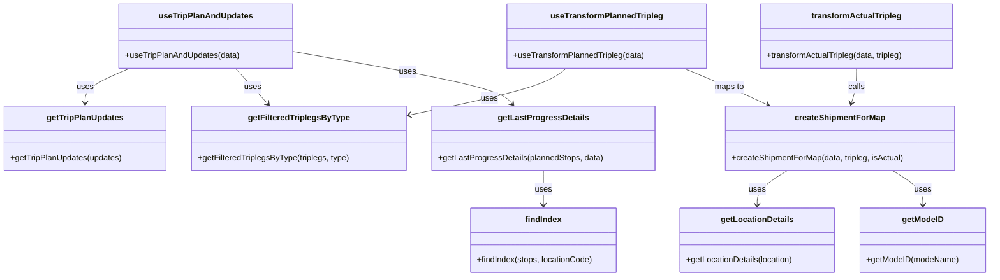
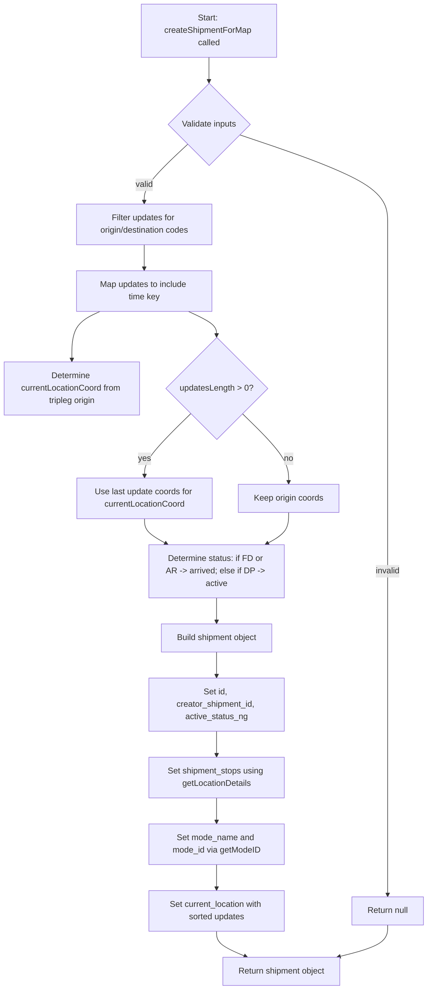

# Diagram: web/portal/src/pages/partview/utils/tripleg.utils.js

> Auto-generated by Obscura crawlers

## Diagram 1

### SVG

<svg id="container" width="1929.494140625" xmlns="http://www.w3.org/2000/svg" class="classDiagram" height="542" viewBox="0 0 1929.494140625 542" role="graphics-document document" aria-roledescription="class"><g><defs><marker id="container_class-aggregationStart" class="marker aggregation class" refX="18" refY="7" markerWidth="190" markerHeight="240" orient="auto"><path d="M 18,7 L9,13 L1,7 L9,1 Z"></path></marker></defs><defs><marker id="container_class-aggregationEnd" class="marker aggregation class" refX="1" refY="7" markerWidth="20" markerHeight="28" orient="auto"><path d="M 18,7 L9,13 L1,7 L9,1 Z"></path></marker></defs><defs><marker id="container_class-extensionStart" class="marker extension class" refX="18" refY="7" markerWidth="190" markerHeight="240" orient="auto"><path d="M 1,7 L18,13 V 1 Z"></path></marker></defs><defs><marker id="container_class-extensionEnd" class="marker extension class" refX="1" refY="7" markerWidth="20" markerHeight="28" orient="auto"><path d="M 1,1 V 13 L18,7 Z"></path></marker></defs><defs><marker id="container_class-compositionStart" class="marker composition class" refX="18" refY="7" markerWidth="190" markerHeight="240" orient="auto"><path d="M 18,7 L9,13 L1,7 L9,1 Z"></path></marker></defs><defs><marker id="container_class-compositionEnd" class="marker composition class" refX="1" refY="7" markerWidth="20" markerHeight="28" orient="auto"><path d="M 18,7 L9,13 L1,7 L9,1 Z"></path></marker></defs><defs><marker id="container_class-dependencyStart" class="marker dependency class" refX="6" refY="7" markerWidth="190" markerHeight="240" orient="auto"><path d="M 5,7 L9,13 L1,7 L9,1 Z"></path></marker></defs><defs><marker id="container_class-dependencyEnd" class="marker dependency class" refX="13" refY="7" markerWidth="20" markerHeight="28" orient="auto"><path d="M 18,7 L9,13 L14,7 L9,1 Z"></path></marker></defs><defs><marker id="container_class-lollipopStart" class="marker lollipop class" refX="13" refY="7" markerWidth="190" markerHeight="240" orient="auto"><circle stroke="black" fill="transparent" cx="7" cy="7" r="6"></circle></marker></defs><defs><marker id="container_class-lollipopEnd" class="marker lollipop class" refX="1" refY="7" markerWidth="190" markerHeight="240" orient="auto"><circle stroke="black" fill="transparent" cx="7" cy="7" r="6"></circle></marker></defs><g class="root"><g class="clusters"></g><g class="edgePaths"><path d="M253.044,134L238.549,140.167C224.054,146.333,195.064,158.667,180.569,170C166.074,181.333,166.074,191.667,166.074,196.833L166.074,202" id="id_useTripPlanAndUpdates_getTripPlanUpdates_1" class="edge-thickness-normal edge-pattern-solid relation" style=";;;" data-edge="true" data-et="edge" data-id="id_useTripPlanAndUpdates_getTripPlanUpdates_1" data-points="W3sieCI6MjUzLjA0MzczMDQ2ODc1LCJ5IjoxMzR9LHsieCI6MTY2LjA3NDIxODc1LCJ5IjoxNzF9LHsieCI6MTY2LjA3NDIxODc1LCJ5IjoyMDh9XQ==" marker-end="url(#container_class-dependencyEnd)"></path><path d="M459.961,134L465.719,140.167C471.478,146.333,482.996,158.667,493.56,170.252C504.124,181.837,513.734,192.674,518.54,198.092L523.345,203.511" id="id_useTripPlanAndUpdates_getFilteredTriplegsByType_2" class="edge-thickness-normal edge-pattern-solid relation" style=";;;" data-edge="true" data-et="edge" data-id="id_useTripPlanAndUpdates_getFilteredTriplegsByType_2" data-points="W3sieCI6NDU5Ljk2MDU4NTkzNzUsInkiOjEzNH0seyJ4Ijo0OTQuNTEzNjcxODc1LCJ5IjoxNzF9LHsieCI6NTI3LjMyNTg3ODkwNjI1LCJ5IjoyMDh9XQ==" marker-end="url(#container_class-dependencyEnd)"></path><path d="M569.268,100.592L635.943,112.327C702.619,124.061,835.971,147.531,907.452,164.684C978.933,181.837,988.543,192.674,993.348,198.092L998.153,203.511" id="id_useTripPlanAndUpdates_getLastProgressDetails_3" class="edge-thickness-normal edge-pattern-solid relation" style=";;;" data-edge="true" data-et="edge" data-id="id_useTripPlanAndUpdates_getLastProgressDetails_3" data-points="W3sieCI6NTY5LjI2NzU3ODEyNSwieSI6MTAwLjU5MjA0NzE4ODg3OTI2fSx7IngiOjk2OS4zMjIyNjU2MjUsInkiOjE3MX0seyJ4IjoxMDAyLjEzNDQ3MjY1NjI1LCJ5IjoyMDh9XQ==" marker-end="url(#container_class-dependencyEnd)"></path><path d="M1058.004,334L1058.004,340.167C1058.004,346.333,1058.004,358.667,1058.004,370C1058.004,381.333,1058.004,391.667,1058.004,396.833L1058.004,402" id="id_getLastProgressDetails_findIndex_4" class="edge-thickness-normal edge-pattern-solid relation" style=";;;" data-edge="true" data-et="edge" data-id="id_getLastProgressDetails_findIndex_4" data-points="W3sieCI6MTA1OC4wMDM5MDYyNSwieSI6MzM0fSx7IngiOjEwNTguMDAzOTA2MjUsInkiOjM3MX0seyJ4IjoxMDU4LjAwMzkwNjI1LCJ5Ijo0MDh9XQ==" marker-end="url(#container_class-dependencyEnd)"></path><path d="M1536.089,334L1526.103,340.167C1516.117,346.333,1496.146,358.667,1486.16,370C1476.174,381.333,1476.174,391.667,1476.174,396.833L1476.174,402" id="id_createShipmentForMap_getLocationDetails_5" class="edge-thickness-normal edge-pattern-solid relation" style=";;;" data-edge="true" data-et="edge" data-id="id_createShipmentForMap_getLocationDetails_5" data-points="W3sieCI6MTUzNi4wODkyNTc4MTI1LCJ5IjozMzR9LHsieCI6MTQ3Ni4xNzM4MjgxMjUsInkiOjM3MX0seyJ4IjoxNDc2LjE3MzgyODEyNSwieSI6NDA4fV0=" marker-end="url(#container_class-dependencyEnd)"></path><path d="M1740.126,334L1750.111,340.167C1760.097,346.333,1780.069,358.667,1790.055,370C1800.041,381.333,1800.041,391.667,1800.041,396.833L1800.041,402" id="id_createShipmentForMap_getModeID_6" class="edge-thickness-normal edge-pattern-solid relation" style=";;;" data-edge="true" data-et="edge" data-id="id_createShipmentForMap_getModeID_6" data-points="W3sieCI6MTc0MC4xMjU1ODU5Mzc1LCJ5IjozMzR9LHsieCI6MTgwMC4wNDEwMTU2MjUsInkiOjM3MX0seyJ4IjoxODAwLjA0MTAxNTYyNSwieSI6NDA4fV0=" marker-end="url(#container_class-dependencyEnd)"></path><path d="M1670.959,134L1670.959,140.167C1670.959,146.333,1670.959,158.667,1669.245,170.05C1667.532,181.433,1664.104,191.866,1662.39,197.083L1660.677,202.3" id="id_transformActualTripleg_createShipmentForMap_7" class="edge-thickness-normal edge-pattern-solid relation" style=";;;" data-edge="true" data-et="edge" data-id="id_transformActualTripleg_createShipmentForMap_7" data-points="W3sieCI6MTY3MC45NTg5ODQzNzUsInkiOjEzNH0seyJ4IjoxNjcwLjk1ODk4NDM3NSwieSI6MTcxfSx7IngiOjE2NTguODAzOTA2MjUsInkiOjIwOH1d" marker-end="url(#container_class-dependencyEnd)"></path><path d="M1101.648,134L1094.085,140.167C1086.522,146.333,1071.396,158.667,1020.806,173.928C970.217,189.19,884.165,207.38,841.139,216.475L798.112,225.57" id="id_useTransformPlannedTripleg_getFilteredTriplegsByType_8" class="edge-thickness-normal edge-pattern-solid relation" style=";;;" data-edge="true" data-et="edge" data-id="id_useTransformPlannedTripleg_getFilteredTriplegsByType_8" data-points="W3sieCI6MTEwMS42NDgwMDc4MTI1LCJ5IjoxMzR9LHsieCI6MTA1Ni4yNjk1MzEyNSwieSI6MTcxfSx7IngiOjc5Mi4yNDIxODc1LCJ5IjoyMjYuODEwOTc3MDY5ODYzODR9XQ==" marker-end="url(#container_class-dependencyEnd)"></path><path d="M1331.187,134L1346.092,140.167C1360.997,146.333,1390.807,158.667,1418.215,170.582C1445.624,182.498,1470.631,193.996,1483.134,199.745L1495.637,205.494" id="id_useTransformPlannedTripleg_createShipmentForMap_9" class="edge-thickness-normal edge-pattern-solid relation" style=";;;" data-edge="true" data-et="edge" data-id="id_useTransformPlannedTripleg_createShipmentForMap_9" data-points="W3sieCI6MTMzMS4xODcwMzEyNSwieSI6MTM0fSx7IngiOjE0MjAuNjE3MTg3NSwieSI6MTcxfSx7IngiOjE1MDEuMDg4NTc0MjE4NzUsInkiOjIwOH1d" marker-end="url(#container_class-dependencyEnd)"></path></g><g class="edgeLabels"><g class="edgeLabel" transform="translate(166.07421875, 171)"><g class="label" data-id="id_useTripPlanAndUpdates_getTripPlanUpdates_1" transform="translate(-16.4921875, -12)"><foreignObject width="32.984375" height="24">

uses

</foreignObject></g></g><g class="edgeLabel" transform="translate(494.11377, 170.57178)"><g class="label" data-id="id_useTripPlanAndUpdates_getFilteredTriplegsByType_2" transform="translate(-16.4921875, -12)"><foreignObject width="32.984375" height="24">

uses

</foreignObject></g></g><g class="edgeLabel" transform="translate(793.64736, 140.08195)"><g class="label" data-id="id_useTripPlanAndUpdates_getLastProgressDetails_3" transform="translate(-16.4921875, -12)"><foreignObject width="32.984375" height="24">

uses

</foreignObject></g></g><g class="edgeLabel" transform="translate(1058.00390625, 371)"><g class="label" data-id="id_getLastProgressDetails_findIndex_4" transform="translate(-16.4921875, -12)"><foreignObject width="32.984375" height="24">

uses

</foreignObject></g></g><g class="edgeLabel" transform="translate(1476.173828125, 371)"><g class="label" data-id="id_createShipmentForMap_getLocationDetails_5" transform="translate(-16.4921875, -12)"><foreignObject width="32.984375" height="24">

uses

</foreignObject></g></g><g class="edgeLabel" transform="translate(1800.041015625, 371)"><g class="label" data-id="id_createShipmentForMap_getModeID_6" transform="translate(-16.4921875, -12)"><foreignObject width="32.984375" height="24">

uses

</foreignObject></g></g><g class="edgeLabel" transform="translate(1670.958984375, 171)"><g class="label" data-id="id_transformActualTripleg_createShipmentForMap_7" transform="translate(-16.4453125, -12)"><foreignObject width="32.890625" height="24">

calls

</foreignObject></g></g><g class="edgeLabel" transform="translate(952.89838, 192.85094)"><g class="label" data-id="id_useTransformPlannedTripleg_getFilteredTriplegsByType_8" transform="translate(-16.4921875, -12)"><foreignObject width="32.984375" height="24">

uses

</foreignObject></g></g><g class="edgeLabel" transform="translate(1420.6171875, 171)"><g class="label" data-id="id_useTransformPlannedTripleg_createShipmentForMap_9" transform="translate(-29.2578125, -12)"><foreignObject width="58.515625" height="24">

maps to

</foreignObject></g></g></g><g class="nodes"><g class="node default" id="classId-getFilteredTriplegsByType-0" transform="translate(583.1953125, 271)"><g class="basic label-container"><path d="M-209.046875 -63 L209.046875 -63 L209.046875 63 L-209.046875 63" stroke="none" stroke-width="0" fill="#ECECFF" style=""></path><path d="M-209.046875 -63 C-112.86889956099498 -63, -16.69092412198995 -63, 209.046875 -63 M-209.046875 -63 C-47.065912019343955 -63, 114.91505096131209 -63, 209.046875 -63 M209.046875 -63 C209.046875 -13.978752478215299, 209.046875 35.0424950435694, 209.046875 63 M209.046875 -63 C209.046875 -34.947508525737206, 209.046875 -6.895017051474412, 209.046875 63 M209.046875 63 C76.61451524753105 63, -55.81784450493791 63, -209.046875 63 M209.046875 63 C99.21193573278343 63, -10.623003534433138 63, -209.046875 63 M-209.046875 63 C-209.046875 29.495309061006758, -209.046875 -4.009381877986485, -209.046875 -63 M-209.046875 63 C-209.046875 22.68309159062092, -209.046875 -17.633816818758163, -209.046875 -63" stroke="#9370DB" stroke-width="1.3" fill="none" stroke-dasharray="0 0" style=""></path></g><g class="annotation-group text" transform="translate(0, -39)"></g><g class="label-group text" transform="translate(-95.265625, -39)"><g class="label" style="font-weight: bolder" transform="translate(0,-12)"><foreignObject width="190.53125" height="24">

getFilteredTriplegsByType

</foreignObject></g></g><g class="members-group text" transform="translate(-197.046875, 9)"></g><g class="methods-group text" transform="translate(-197.046875, 39)"><g class="label" style="" transform="translate(0,-12)"><foreignObject width="298.828125" height="24">

+getFilteredTriplegsByType(triplegs, type)

</foreignObject></g></g><g class="divider" style=""><path d="M-209.046875 -15 C-46.82963571567262 -15, 115.38760356865475 -15, 209.046875 -15 M-209.046875 -15 C-124.6199007646808 -15, -40.192926529361614 -15, 209.046875 -15" stroke="#9370DB" stroke-width="1.3" fill="none" stroke-dasharray="0 0" style=""></path></g><g class="divider" style=""><path d="M-209.046875 9 C-105.87965205796998 9, -2.7124291159399547 9, 209.046875 9 M-209.046875 9 C-100.1369824712971 9, 8.772910057405795 9, 209.046875 9" stroke="#9370DB" stroke-width="1.3" fill="none" stroke-dasharray="0 0" style=""></path></g></g><g class="node default" id="classId-getTripPlanUpdates-1" transform="translate(166.07421875, 271)"><g class="basic label-container"><path d="M-158.07421875 -63 L158.07421875 -63 L158.07421875 63 L-158.07421875 63" stroke="none" stroke-width="0" fill="#ECECFF" style=""></path><path d="M-158.07421875 -63 C-74.82393346838516 -63, 8.426351813229672 -63, 158.07421875 -63 M-158.07421875 -63 C-56.616559077151294 -63, 44.84110059569741 -63, 158.07421875 -63 M158.07421875 -63 C158.07421875 -31.033291947078194, 158.07421875 0.9334161058436123, 158.07421875 63 M158.07421875 -63 C158.07421875 -37.731359990556435, 158.07421875 -12.462719981112869, 158.07421875 63 M158.07421875 63 C39.07206481851118 63, -79.93008911297764 63, -158.07421875 63 M158.07421875 63 C49.002469436686425 63, -60.06927987662715 63, -158.07421875 63 M-158.07421875 63 C-158.07421875 25.840138273294784, -158.07421875 -11.319723453410433, -158.07421875 -63 M-158.07421875 63 C-158.07421875 18.371511442900356, -158.07421875 -26.256977114199287, -158.07421875 -63" stroke="#9370DB" stroke-width="1.3" fill="none" stroke-dasharray="0 0" style=""></path></g><g class="annotation-group text" transform="translate(0, -39)"></g><g class="label-group text" transform="translate(-72.5078125, -39)"><g class="label" style="font-weight: bolder" transform="translate(0,-12)"><foreignObject width="145.015625" height="24">

getTripPlanUpdates

</foreignObject></g></g><g class="members-group text" transform="translate(-146.07421875, 9)"></g><g class="methods-group text" transform="translate(-146.07421875, 39)"><g class="label" style="" transform="translate(0,-12)"><foreignObject width="219.640625" height="24">

+getTripPlanUpdates(updates)

</foreignObject></g></g><g class="divider" style=""><path d="M-158.07421875 -15 C-79.97972524592498 -15, -1.8852317418499638 -15, 158.07421875 -15 M-158.07421875 -15 C-37.152631808446756 -15, 83.76895513310649 -15, 158.07421875 -15" stroke="#9370DB" stroke-width="1.3" fill="none" stroke-dasharray="0 0" style=""></path></g><g class="divider" style=""><path d="M-158.07421875 9 C-72.86061132487055 9, 12.352996100258906 9, 158.07421875 9 M-158.07421875 9 C-66.52475465207387 9, 25.024709445852267 9, 158.07421875 9" stroke="#9370DB" stroke-width="1.3" fill="none" stroke-dasharray="0 0" style=""></path></g></g><g class="node default" id="classId-findIndex-2" transform="translate(1058.00390625, 471)"><g class="basic label-container"><path d="M-143.73828125 -63 L143.73828125 -63 L143.73828125 63 L-143.73828125 63" stroke="none" stroke-width="0" fill="#ECECFF" style=""></path><path d="M-143.73828125 -63 C-85.89915760343115 -63, -28.0600339568623 -63, 143.73828125 -63 M-143.73828125 -63 C-74.56445772643943 -63, -5.390634202878857 -63, 143.73828125 -63 M143.73828125 -63 C143.73828125 -16.632853266168347, 143.73828125 29.734293467663306, 143.73828125 63 M143.73828125 -63 C143.73828125 -33.14083527949919, 143.73828125 -3.2816705589983854, 143.73828125 63 M143.73828125 63 C74.27099908782547 63, 4.803716925650946 63, -143.73828125 63 M143.73828125 63 C48.991885087323226 63, -45.75451107535355 63, -143.73828125 63 M-143.73828125 63 C-143.73828125 22.11294427911067, -143.73828125 -18.774111441778658, -143.73828125 -63 M-143.73828125 63 C-143.73828125 20.343800967139202, -143.73828125 -22.312398065721595, -143.73828125 -63" stroke="#9370DB" stroke-width="1.3" fill="none" stroke-dasharray="0 0" style=""></path></g><g class="annotation-group text" transform="translate(0, -39)"></g><g class="label-group text" transform="translate(-34.3828125, -39)"><g class="label" style="font-weight: bolder" transform="translate(0,-12)"><foreignObject width="68.765625" height="24">

findIndex

</foreignObject></g></g><g class="members-group text" transform="translate(-131.73828125, 9)"></g><g class="methods-group text" transform="translate(-131.73828125, 39)"><g class="label" style="" transform="translate(0,-12)"><foreignObject width="229.09375" height="24">

+findIndex(stops, locationCode)

</foreignObject></g></g><g class="divider" style=""><path d="M-143.73828125 -15 C-78.87994837403689 -15, -14.021615498073771 -15, 143.73828125 -15 M-143.73828125 -15 C-29.675544329558107 -15, 84.38719259088379 -15, 143.73828125 -15" stroke="#9370DB" stroke-width="1.3" fill="none" stroke-dasharray="0 0" style=""></path></g><g class="divider" style=""><path d="M-143.73828125 9 C-66.51044007089446 9, 10.717401108211078 9, 143.73828125 9 M-143.73828125 9 C-77.09803151724161 9, -10.457781784483217 9, 143.73828125 9" stroke="#9370DB" stroke-width="1.3" fill="none" stroke-dasharray="0 0" style=""></path></g></g><g class="node default" id="classId-getLastProgressDetails-3" transform="translate(1058.00390625, 271)"><g class="basic label-container"><path d="M-215.76171875 -63 L215.76171875 -63 L215.76171875 63 L-215.76171875 63" stroke="none" stroke-width="0" fill="#ECECFF" style=""></path><path d="M-215.76171875 -63 C-88.64040213933652 -63, 38.48091447132697 -63, 215.76171875 -63 M-215.76171875 -63 C-88.60163926168144 -63, 38.55844022663712 -63, 215.76171875 -63 M215.76171875 -63 C215.76171875 -19.6722121812072, 215.76171875 23.6555756375856, 215.76171875 63 M215.76171875 -63 C215.76171875 -30.966303930654355, 215.76171875 1.0673921386912895, 215.76171875 63 M215.76171875 63 C120.90502381708957 63, 26.048328884179142 63, -215.76171875 63 M215.76171875 63 C75.66436092026169 63, -64.43299690947663 63, -215.76171875 63 M-215.76171875 63 C-215.76171875 16.920177470542043, -215.76171875 -29.159645058915913, -215.76171875 -63 M-215.76171875 63 C-215.76171875 37.498489394848136, -215.76171875 11.996978789696264, -215.76171875 -63" stroke="#9370DB" stroke-width="1.3" fill="none" stroke-dasharray="0 0" style=""></path></g><g class="annotation-group text" transform="translate(0, -39)"></g><g class="label-group text" transform="translate(-84.2578125, -39)"><g class="label" style="font-weight: bolder" transform="translate(0,-12)"><foreignObject width="168.515625" height="24">

getLastProgressDetails

</foreignObject></g></g><g class="members-group text" transform="translate(-203.76171875, 9)"></g><g class="methods-group text" transform="translate(-203.76171875, 39)"><g class="label" style="" transform="translate(0,-12)"><foreignObject width="323.265625" height="24">

+getLastProgressDetails(plannedStops, data)

</foreignObject></g></g><g class="divider" style=""><path d="M-215.76171875 -15 C-61.509853035053 -15, 92.742012679894 -15, 215.76171875 -15 M-215.76171875 -15 C-116.57348948787927 -15, -17.385260225758543 -15, 215.76171875 -15" stroke="#9370DB" stroke-width="1.3" fill="none" stroke-dasharray="0 0" style=""></path></g><g class="divider" style=""><path d="M-215.76171875 9 C-116.75444761172811 9, -17.74717647345622 9, 215.76171875 9 M-215.76171875 9 C-61.526873818780956 9, 92.70797111243809 9, 215.76171875 9" stroke="#9370DB" stroke-width="1.3" fill="none" stroke-dasharray="0 0" style=""></path></g></g><g class="node default" id="classId-useTripPlanAndUpdates-4" transform="translate(401.126953125, 71)"><g class="basic label-container"><path d="M-168.140625 -63 L168.140625 -63 L168.140625 63 L-168.140625 63" stroke="none" stroke-width="0" fill="#ECECFF" style=""></path><path d="M-168.140625 -63 C-75.81343229354633 -63, 16.513760412907345 -63, 168.140625 -63 M-168.140625 -63 C-80.17447083377722 -63, 7.791683332445558 -63, 168.140625 -63 M168.140625 -63 C168.140625 -12.68243297030908, 168.140625 37.63513405938184, 168.140625 63 M168.140625 -63 C168.140625 -36.53515951168788, 168.140625 -10.070319023375767, 168.140625 63 M168.140625 63 C56.96976419709419 63, -54.201096605811614 63, -168.140625 63 M168.140625 63 C95.64735404531686 63, 23.15408309063372 63, -168.140625 63 M-168.140625 63 C-168.140625 33.30242931530935, -168.140625 3.6048586306186934, -168.140625 -63 M-168.140625 63 C-168.140625 19.512855255938305, -168.140625 -23.97428948812339, -168.140625 -63" stroke="#9370DB" stroke-width="1.3" fill="none" stroke-dasharray="0 0" style=""></path></g><g class="annotation-group text" transform="translate(0, -39)"></g><g class="label-group text" transform="translate(-87.765625, -39)"><g class="label" style="font-weight: bolder" transform="translate(0,-12)"><foreignObject width="175.53125" height="24">

useTripPlanAndUpdates

</foreignObject></g></g><g class="members-group text" transform="translate(-156.140625, 9)"></g><g class="methods-group text" transform="translate(-156.140625, 39)"><g class="label" style="" transform="translate(0,-12)"><foreignObject width="224.515625" height="24">

+useTripPlanAndUpdates(data)

</foreignObject></g></g><g class="divider" style=""><path d="M-168.140625 -15 C-73.78621118027304 -15, 20.568202639453915 -15, 168.140625 -15 M-168.140625 -15 C-96.40313892297235 -15, -24.66565284594469 -15, 168.140625 -15" stroke="#9370DB" stroke-width="1.3" fill="none" stroke-dasharray="0 0" style=""></path></g><g class="divider" style=""><path d="M-168.140625 9 C-75.36710616842198 9, 17.406412663156033 9, 168.140625 9 M-168.140625 9 C-44.023294358281944 9, 80.09403628343611 9, 168.140625 9" stroke="#9370DB" stroke-width="1.3" fill="none" stroke-dasharray="0 0" style=""></path></g></g><g class="node default" id="classId-getModeID-5" transform="translate(1800.041015625, 471)"><g class="basic label-container"><path d="M-121.453125 -63 L121.453125 -63 L121.453125 63 L-121.453125 63" stroke="none" stroke-width="0" fill="#ECECFF" style=""></path><path d="M-121.453125 -63 C-38.20820430577626 -63, 45.03671638844747 -63, 121.453125 -63 M-121.453125 -63 C-71.85534772298018 -63, -22.25757044596037 -63, 121.453125 -63 M121.453125 -63 C121.453125 -35.554771582252165, 121.453125 -8.10954316450433, 121.453125 63 M121.453125 -63 C121.453125 -27.75772516830662, 121.453125 7.484549663386758, 121.453125 63 M121.453125 63 C63.82218577353435 63, 6.191246547068701 63, -121.453125 63 M121.453125 63 C37.3599818812002 63, -46.7331612375996 63, -121.453125 63 M-121.453125 63 C-121.453125 22.085333234255238, -121.453125 -18.829333531489524, -121.453125 -63 M-121.453125 63 C-121.453125 34.4918412665655, -121.453125 5.9836825331310095, -121.453125 -63" stroke="#9370DB" stroke-width="1.3" fill="none" stroke-dasharray="0 0" style=""></path></g><g class="annotation-group text" transform="translate(0, -39)"></g><g class="label-group text" transform="translate(-39.46875, -39)"><g class="label" style="font-weight: bolder" transform="translate(0,-12)"><foreignObject width="78.9375" height="24">

getModeID

</foreignObject></g></g><g class="members-group text" transform="translate(-109.453125, 9)"></g><g class="methods-group text" transform="translate(-109.453125, 39)"><g class="label" style="" transform="translate(0,-12)"><foreignObject width="179.4375" height="24">

+getModeID(modeName)

</foreignObject></g></g><g class="divider" style=""><path d="M-121.453125 -15 C-63.75453496159201 -15, -6.055944923184015 -15, 121.453125 -15 M-121.453125 -15 C-42.82313920098903 -15, 35.806846598021934 -15, 121.453125 -15" stroke="#9370DB" stroke-width="1.3" fill="none" stroke-dasharray="0 0" style=""></path></g><g class="divider" style=""><path d="M-121.453125 9 C-63.841673783660696 9, -6.230222567321391 9, 121.453125 9 M-121.453125 9 C-63.44559274886512 9, -5.438060497730234 9, 121.453125 9" stroke="#9370DB" stroke-width="1.3" fill="none" stroke-dasharray="0 0" style=""></path></g></g><g class="node default" id="classId-getLocationDetails-6" transform="translate(1476.173828125, 471)"><g class="basic label-container"><path d="M-152.4140625 -63 L152.4140625 -63 L152.4140625 63 L-152.4140625 63" stroke="none" stroke-width="0" fill="#ECECFF" style=""></path><path d="M-152.4140625 -63 C-63.5232568376898 -63, 25.3675488246204 -63, 152.4140625 -63 M-152.4140625 -63 C-34.43435589758228 -63, 83.54535070483544 -63, 152.4140625 -63 M152.4140625 -63 C152.4140625 -18.51835950381775, 152.4140625 25.963280992364503, 152.4140625 63 M152.4140625 -63 C152.4140625 -20.70886177941147, 152.4140625 21.582276441177058, 152.4140625 63 M152.4140625 63 C34.93211210610485 63, -82.5498382877903 63, -152.4140625 63 M152.4140625 63 C88.85430956528278 63, 25.294556630565552 63, -152.4140625 63 M-152.4140625 63 C-152.4140625 27.977845232302037, -152.4140625 -7.044309535395925, -152.4140625 -63 M-152.4140625 63 C-152.4140625 35.58663624458373, -152.4140625 8.173272489167466, -152.4140625 -63" stroke="#9370DB" stroke-width="1.3" fill="none" stroke-dasharray="0 0" style=""></path></g><g class="annotation-group text" transform="translate(0, -39)"></g><g class="label-group text" transform="translate(-68.578125, -39)"><g class="label" style="font-weight: bolder" transform="translate(0,-12)"><foreignObject width="137.15625" height="24">

getLocationDetails

</foreignObject></g></g><g class="members-group text" transform="translate(-140.4140625, 9)"></g><g class="methods-group text" transform="translate(-140.4140625, 39)"><g class="label" style="" transform="translate(0,-12)"><foreignObject width="212.25" height="24">

+getLocationDetails(location)

</foreignObject></g></g><g class="divider" style=""><path d="M-152.4140625 -15 C-72.43254739633127 -15, 7.548967707337454 -15, 152.4140625 -15 M-152.4140625 -15 C-61.53545925663789 -15, 29.343143986724215 -15, 152.4140625 -15" stroke="#9370DB" stroke-width="1.3" fill="none" stroke-dasharray="0 0" style=""></path></g><g class="divider" style=""><path d="M-152.4140625 9 C-83.58437091484592 9, -14.75467932969184 9, 152.4140625 9 M-152.4140625 9 C-72.68077245937475 9, 7.052517581250498 9, 152.4140625 9" stroke="#9370DB" stroke-width="1.3" fill="none" stroke-dasharray="0 0" style=""></path></g></g><g class="node default" id="classId-createShipmentForMap-7" transform="translate(1638.107421875, 271)"><g class="basic label-container"><path d="M-224.42578125 -63 L224.42578125 -63 L224.42578125 63 L-224.42578125 63" stroke="none" stroke-width="0" fill="#ECECFF" style=""></path><path d="M-224.42578125 -63 C-91.92719328773188 -63, 40.571394674536236 -63, 224.42578125 -63 M-224.42578125 -63 C-132.02133540724867 -63, -39.61688956449731 -63, 224.42578125 -63 M224.42578125 -63 C224.42578125 -37.77031342995723, 224.42578125 -12.540626859914461, 224.42578125 63 M224.42578125 -63 C224.42578125 -15.24761679880919, 224.42578125 32.50476640238162, 224.42578125 63 M224.42578125 63 C112.34092068265403 63, 0.2560601153080597 63, -224.42578125 63 M224.42578125 63 C114.83399286444838 63, 5.242204478896753 63, -224.42578125 63 M-224.42578125 63 C-224.42578125 23.772844660431538, -224.42578125 -15.454310679136924, -224.42578125 -63 M-224.42578125 63 C-224.42578125 35.31280710705573, -224.42578125 7.625614214111458, -224.42578125 -63" stroke="#9370DB" stroke-width="1.3" fill="none" stroke-dasharray="0 0" style=""></path></g><g class="annotation-group text" transform="translate(0, -39)"></g><g class="label-group text" transform="translate(-84.9296875, -39)"><g class="label" style="font-weight: bolder" transform="translate(0,-12)"><foreignObject width="169.859375" height="24">

createShipmentForMap

</foreignObject></g></g><g class="members-group text" transform="translate(-212.42578125, 9)"></g><g class="methods-group text" transform="translate(-212.42578125, 39)"><g class="label" style="" transform="translate(0,-12)"><foreignObject width="339.921875" height="24">

+createShipmentForMap(data, tripleg, isActual)

</foreignObject></g></g><g class="divider" style=""><path d="M-224.42578125 -15 C-116.22740694748136 -15, -8.029032644962712 -15, 224.42578125 -15 M-224.42578125 -15 C-72.02864516914383 -15, 80.36849091171234 -15, 224.42578125 -15" stroke="#9370DB" stroke-width="1.3" fill="none" stroke-dasharray="0 0" style=""></path></g><g class="divider" style=""><path d="M-224.42578125 9 C-51.98319057971685 9, 120.4594000905663 9, 224.42578125 9 M-224.42578125 9 C-52.26375906734728 9, 119.89826311530544 9, 224.42578125 9" stroke="#9370DB" stroke-width="1.3" fill="none" stroke-dasharray="0 0" style=""></path></g></g><g class="node default" id="classId-transformActualTripleg-8" transform="translate(1670.958984375, 71)"><g class="basic label-container"><path d="M-190.71875 -63 L190.71875 -63 L190.71875 63 L-190.71875 63" stroke="none" stroke-width="0" fill="#ECECFF" style=""></path><path d="M-190.71875 -63 C-72.38739383423761 -63, 45.94396233152477 -63, 190.71875 -63 M-190.71875 -63 C-45.64828555320713 -63, 99.42217889358574 -63, 190.71875 -63 M190.71875 -63 C190.71875 -32.14799689085635, 190.71875 -1.2959937817126885, 190.71875 63 M190.71875 -63 C190.71875 -25.28168808273498, 190.71875 12.436623834530039, 190.71875 63 M190.71875 63 C92.95619397958157 63, -4.806362040836859 63, -190.71875 63 M190.71875 63 C104.57765692211156 63, 18.436563844223116 63, -190.71875 63 M-190.71875 63 C-190.71875 18.969794771208925, -190.71875 -25.06041045758215, -190.71875 -63 M-190.71875 63 C-190.71875 32.79703165202062, -190.71875 2.594063304041242, -190.71875 -63" stroke="#9370DB" stroke-width="1.3" fill="none" stroke-dasharray="0 0" style=""></path></g><g class="annotation-group text" transform="translate(0, -39)"></g><g class="label-group text" transform="translate(-84.671875, -39)"><g class="label" style="font-weight: bolder" transform="translate(0,-12)"><foreignObject width="169.34375" height="24">

transformActualTripleg

</foreignObject></g></g><g class="members-group text" transform="translate(-178.71875, 9)"></g><g class="methods-group text" transform="translate(-178.71875, 39)"><g class="label" style="" transform="translate(0,-12)"><foreignObject width="272.765625" height="24">

+transformActualTripleg(data, tripleg)

</foreignObject></g></g><g class="divider" style=""><path d="M-190.71875 -15 C-57.151039206917574 -15, 76.41667158616485 -15, 190.71875 -15 M-190.71875 -15 C-102.98763545612408 -15, -15.256520912248163 -15, 190.71875 -15" stroke="#9370DB" stroke-width="1.3" fill="none" stroke-dasharray="0 0" style=""></path></g><g class="divider" style=""><path d="M-190.71875 9 C-45.344613837688 9, 100.029522324624 9, 190.71875 9 M-190.71875 9 C-54.62837836867595 9, 81.4619932626481 9, 190.71875 9" stroke="#9370DB" stroke-width="1.3" fill="none" stroke-dasharray="0 0" style=""></path></g></g><g class="node default" id="classId-useTransformPlannedTripleg-9" transform="translate(1178.9140625, 71)"><g class="basic label-container"><path d="M-194.26171875 -63 L194.26171875 -63 L194.26171875 63 L-194.26171875 63" stroke="none" stroke-width="0" fill="#ECECFF" style=""></path><path d="M-194.26171875 -63 C-45.37724985513225 -63, 103.5072190397355 -63, 194.26171875 -63 M-194.26171875 -63 C-72.89659365938678 -63, 48.46853143122644 -63, 194.26171875 -63 M194.26171875 -63 C194.26171875 -27.189089982153988, 194.26171875 8.621820035692025, 194.26171875 63 M194.26171875 -63 C194.26171875 -19.12249039110626, 194.26171875 24.755019217787478, 194.26171875 63 M194.26171875 63 C58.983808282130525 63, -76.29410218573895 63, -194.26171875 63 M194.26171875 63 C85.54128892060506 63, -23.17914090878989 63, -194.26171875 63 M-194.26171875 63 C-194.26171875 31.602187780161834, -194.26171875 0.204375560323669, -194.26171875 -63 M-194.26171875 63 C-194.26171875 37.530163629860425, -194.26171875 12.060327259720857, -194.26171875 -63" stroke="#9370DB" stroke-width="1.3" fill="none" stroke-dasharray="0 0" style=""></path></g><g class="annotation-group text" transform="translate(0, -39)"></g><g class="label-group text" transform="translate(-105.5078125, -39)"><g class="label" style="font-weight: bolder" transform="translate(0,-12)"><foreignObject width="211.015625" height="24">

useTransformPlannedTripleg

</foreignObject></g></g><g class="members-group text" transform="translate(-182.26171875, 9)"></g><g class="methods-group text" transform="translate(-182.26171875, 39)"><g class="label" style="" transform="translate(0,-12)"><foreignObject width="259.015625" height="24">

+useTransformPlannedTripleg(data)

</foreignObject></g></g><g class="divider" style=""><path d="M-194.26171875 -15 C-93.0873825806132 -15, 8.08695358877361 -15, 194.26171875 -15 M-194.26171875 -15 C-104.44631840109271 -15, -14.630918052185422 -15, 194.26171875 -15" stroke="#9370DB" stroke-width="1.3" fill="none" stroke-dasharray="0 0" style=""></path></g><g class="divider" style=""><path d="M-194.26171875 9 C-57.604184937878955 9, 79.05334887424209 9, 194.26171875 9 M-194.26171875 9 C-106.12908526713518 9, -17.996451784270363 9, 194.26171875 9" stroke="#9370DB" stroke-width="1.3" fill="none" stroke-dasharray="0 0" style=""></path></g></g></g></g></g></svg>

## Diagram 2

### SVG

<svg id="container" width="824.33984375" xmlns="http://www.w3.org/2000/svg" class="flowchart" height="1903.125" viewBox="0 0 824.33984375 1903.125" role="graphics-document document" aria-roledescription="flowchart-v2"><g><marker id="container_flowchart-v2-pointEnd" class="marker flowchart-v2" viewBox="0 0 10 10" refX="5" refY="5" markerUnits="userSpaceOnUse" markerWidth="8" markerHeight="8" orient="auto"><path d="M 0 0 L 10 5 L 0 10 z" class="arrowMarkerPath" style="stroke-width: 1; stroke-dasharray: 1, 0;"></path></marker><marker id="container_flowchart-v2-pointStart" class="marker flowchart-v2" viewBox="0 0 10 10" refX="4.5" refY="5" markerUnits="userSpaceOnUse" markerWidth="8" markerHeight="8" orient="auto"><path d="M 0 5 L 10 10 L 10 0 z" class="arrowMarkerPath" style="stroke-width: 1; stroke-dasharray: 1, 0;"></path></marker><marker id="container_flowchart-v2-circleEnd" class="marker flowchart-v2" viewBox="0 0 10 10" refX="11" refY="5" markerUnits="userSpaceOnUse" markerWidth="11" markerHeight="11" orient="auto"><circle cx="5" cy="5" r="5" class="arrowMarkerPath" style="stroke-width: 1; stroke-dasharray: 1, 0;"></circle></marker><marker id="container_flowchart-v2-circleStart" class="marker flowchart-v2" viewBox="0 0 10 10" refX="-1" refY="5" markerUnits="userSpaceOnUse" markerWidth="11" markerHeight="11" orient="auto"><circle cx="5" cy="5" r="5" class="arrowMarkerPath" style="stroke-width: 1; stroke-dasharray: 1, 0;"></circle></marker><marker id="container_flowchart-v2-crossEnd" class="marker cross flowchart-v2" viewBox="0 0 11 11" refX="12" refY="5.2" markerUnits="userSpaceOnUse" markerWidth="11" markerHeight="11" orient="auto"><path d="M 1,1 l 9,9 M 10,1 l -9,9" class="arrowMarkerPath" style="stroke-width: 2; stroke-dasharray: 1, 0;"></path></marker><marker id="container_flowchart-v2-crossStart" class="marker cross flowchart-v2" viewBox="0 0 11 11" refX="-1" refY="5.2" markerUnits="userSpaceOnUse" markerWidth="11" markerHeight="11" orient="auto"><path d="M 1,1 l 9,9 M 10,1 l -9,9" class="arrowMarkerPath" style="stroke-width: 2; stroke-dasharray: 1, 0;"></path></marker><g class="root"><g class="clusters"></g><g class="edgePaths"><path d="M401.875,110L401.875,114.167C401.875,118.333,401.875,126.667,401.875,134.333C401.875,142,401.875,149,401.875,152.5L401.875,156" id="L_A_B_0" class="edge-thickness-normal edge-pattern-solid edge-thickness-normal edge-pattern-solid flowchart-link" style=";" data-edge="true" data-et="edge" data-id="L_A_B_0" data-points="W3sieCI6NDAxLjg3NSwieSI6MTEwfSx7IngiOjQwMS44NzUsInkiOjEzNX0seyJ4Ijo0MDEuODc1LCJ5IjoxNjB9XQ==" marker-end="url(#container_flowchart-v2-pointEnd)"></path><path d="M462.408,262.201L509.637,278.457C556.867,294.712,651.326,327.223,698.556,356.146C745.785,385.068,745.785,410.401,745.785,433.734C745.785,457.068,745.785,478.401,745.785,499.734C745.785,521.068,745.785,542.401,745.785,563.734C745.785,585.068,745.785,606.401,745.785,637.434C745.785,668.466,745.785,709.198,745.785,751.93C745.785,794.661,745.785,839.393,745.785,874.426C745.785,909.458,745.785,934.792,745.785,958.125C745.785,981.458,745.785,1002.792,745.785,1026.125C745.785,1049.458,745.785,1074.792,745.785,1100.125C745.785,1125.458,745.785,1150.792,745.785,1172.125C745.785,1193.458,745.785,1210.792,745.785,1228.125C745.785,1245.458,745.785,1262.792,745.785,1284.125C745.785,1305.458,745.785,1330.792,745.785,1356.125C745.785,1381.458,745.785,1406.792,745.785,1430.125C745.785,1453.458,745.785,1474.792,745.785,1496.125C745.785,1517.458,745.785,1538.792,745.785,1560.125C745.785,1581.458,745.785,1602.792,745.785,1624.125C745.785,1645.458,745.785,1666.792,745.785,1682.958C745.785,1699.125,745.785,1710.125,745.785,1715.625L745.785,1721.125" id="L_B_C_0" class="edge-thickness-normal edge-pattern-solid edge-thickness-normal edge-pattern-solid flowchart-link" style=";" data-edge="true" data-et="edge" data-id="L_B_C_0" data-points="W3sieCI6NDYyLjQwNzkzMDE2NjQ0NDE1LCJ5IjoyNjIuMjAxNDQ0ODMzNTU1ODV9LHsieCI6NzQ1Ljc4NTE1NjI1LCJ5IjozNTkuNzM0Mzc1fSx7IngiOjc0NS43ODUxNTYyNSwieSI6NDM1LjczNDM3NX0seyJ4Ijo3NDUuNzg1MTU2MjUsInkiOjQ5OS43MzQzNzV9LHsieCI6NzQ1Ljc4NTE1NjI1LCJ5Ijo1NjMuNzM0Mzc1fSx7IngiOjc0NS43ODUxNTYyNSwieSI6NjI3LjczNDM3NX0seyJ4Ijo3NDUuNzg1MTU2MjUsInkiOjc0OS45Mjk2ODc1fSx7IngiOjc0NS43ODUxNTYyNSwieSI6ODg0LjEyNX0seyJ4Ijo3NDUuNzg1MTU2MjUsInkiOjk2MC4xMjV9LHsieCI6NzQ1Ljc4NTE1NjI1LCJ5IjoxMDI0LjEyNX0seyJ4Ijo3NDUuNzg1MTU2MjUsInkiOjExMDAuMTI1fSx7IngiOjc0NS43ODUxNTYyNSwieSI6MTE3Ni4xMjV9LHsieCI6NzQ1Ljc4NTE1NjI1LCJ5IjoxMjI4LjEyNX0seyJ4Ijo3NDUuNzg1MTU2MjUsInkiOjEyODAuMTI1fSx7IngiOjc0NS43ODUxNTYyNSwieSI6MTM1Ni4xMjV9LHsieCI6NzQ1Ljc4NTE1NjI1LCJ5IjoxNDMyLjEyNX0seyJ4Ijo3NDUuNzg1MTU2MjUsInkiOjE0OTYuMTI1fSx7IngiOjc0NS43ODUxNTYyNSwieSI6MTU2MC4xMjV9LHsieCI6NzQ1Ljc4NTE1NjI1LCJ5IjoxNjI0LjEyNX0seyJ4Ijo3NDUuNzg1MTU2MjUsInkiOjE2ODguMTI1fSx7IngiOjc0NS43ODUxNTYyNSwieSI6MTcyNS4xMjV9XQ==" marker-end="url(#container_flowchart-v2-pointEnd)"></path><path d="M360.038,280.897L346.131,294.037C332.224,307.176,304.411,333.455,290.504,352.095C276.598,370.734,276.598,381.734,276.598,387.234L276.598,392.734" id="L_B_D_0" class="edge-thickness-normal edge-pattern-solid edge-thickness-normal edge-pattern-solid flowchart-link" style=";" data-edge="true" data-et="edge" data-id="L_B_D_0" data-points="W3sieCI6MzYwLjAzNzU1MzE4MzA2OCwieSI6MjgwLjg5NjkyODE4MzA2OH0seyJ4IjoyNzYuNTk3NjU2MjUsInkiOjM1OS43MzQzNzV9LHsieCI6Mjc2LjU5NzY1NjI1LCJ5IjozOTYuNzM0Mzc1fV0=" marker-end="url(#container_flowchart-v2-pointEnd)"></path><path d="M276.598,474.734L276.598,478.901C276.598,483.068,276.598,491.401,276.598,499.068C276.598,506.734,276.598,513.734,276.598,517.234L276.598,520.734" id="L_D_E_0" class="edge-thickness-normal edge-pattern-solid edge-thickness-normal edge-pattern-solid flowchart-link" style=";" data-edge="true" data-et="edge" data-id="L_D_E_0" data-points="W3sieCI6Mjc2LjU5NzY1NjI1LCJ5Ijo0NzQuNzM0Mzc1fSx7IngiOjI3Ni41OTc2NTYyNSwieSI6NDk5LjczNDM3NX0seyJ4IjoyNzYuNTk3NjU2MjUsInkiOjUyNC43MzQzNzV9XQ==" marker-end="url(#container_flowchart-v2-pointEnd)"></path><path d="M192.14,602.734L183.116,606.901C174.093,611.068,156.047,619.401,147.023,634.767C138,650.133,138,672.531,138,683.73L138,694.93" id="L_E_F_0" class="edge-thickness-normal edge-pattern-solid edge-thickness-normal edge-pattern-solid flowchart-link" style=";" data-edge="true" data-et="edge" data-id="L_E_F_0" data-points="W3sieCI6MTkyLjEzOTcwOTQ3MjY1NjI1LCJ5Ijo2MDIuNzM0Mzc1fSx7IngiOjEzOCwieSI6NjI3LjczNDM3NX0seyJ4IjoxMzgsInkiOjY5OC45Mjk2ODc1fV0=" marker-end="url(#container_flowchart-v2-pointEnd)"></path><path d="M361.056,602.734L370.079,606.901C379.102,611.068,397.149,619.401,406.172,627.068C415.195,634.734,415.195,641.734,415.195,645.234L415.195,648.734" id="L_E_G_0" class="edge-thickness-normal edge-pattern-solid edge-thickness-normal edge-pattern-solid flowchart-link" style=";" data-edge="true" data-et="edge" data-id="L_E_G_0" data-points="W3sieCI6MzYxLjA1NTYwMzAyNzM0Mzc1LCJ5Ijo2MDIuNzM0Mzc1fSx7IngiOjQxNS4xOTUzMTI1LCJ5Ijo2MjcuNzM0Mzc1fSx7IngiOjQxNS4xOTUzMTI1LCJ5Ijo2NTIuNzM0Mzc1fV0=" marker-end="url(#container_flowchart-v2-pointEnd)"></path><path d="M365.759,797.689L350.848,812.095C335.936,826.501,306.112,855.313,291.201,875.219C276.289,895.125,276.289,906.125,276.289,911.625L276.289,917.125" id="L_G_H_0" class="edge-thickness-normal edge-pattern-solid edge-thickness-normal edge-pattern-solid flowchart-link" style=";" data-edge="true" data-et="edge" data-id="L_G_H_0" data-points="W3sieCI6MzY1Ljc1OTM1ODE0ODk0MDEsInkiOjc5Ny42ODkwNDU2NDg5NDAxfSx7IngiOjI3Ni4yODkwNjI1LCJ5Ijo4ODQuMTI1fSx7IngiOjI3Ni4yODkwNjI1LCJ5Ijo5MjEuMTI1fV0=" marker-end="url(#container_flowchart-v2-pointEnd)"></path><path d="M464.631,797.689L479.543,812.095C494.455,826.501,524.278,855.313,539.19,877.219C554.102,899.125,554.102,914.125,554.102,921.625L554.102,929.125" id="L_G_H2_0" class="edge-thickness-normal edge-pattern-solid edge-thickness-normal edge-pattern-solid flowchart-link" style=";" data-edge="true" data-et="edge" data-id="L_G_H2_0" data-points="W3sieCI6NDY0LjYzMTI2Njg1MTA1OTksInkiOjc5Ny42ODkwNDU2NDg5NDAxfSx7IngiOjU1NC4xMDE1NjI1LCJ5Ijo4ODQuMTI1fSx7IngiOjU1NC4xMDE1NjI1LCJ5Ijo5MzMuMTI1fV0=" marker-end="url(#container_flowchart-v2-pointEnd)"></path><path d="M276.289,999.125L276.289,1003.292C276.289,1007.458,276.289,1015.792,283.32,1023.805C290.35,1031.818,304.412,1039.512,311.442,1043.358L318.473,1047.205" id="L_H_I_0" class="edge-thickness-normal edge-pattern-solid edge-thickness-normal edge-pattern-solid flowchart-link" style=";" data-edge="true" data-et="edge" data-id="L_H_I_0" data-points="W3sieCI6Mjc2LjI4OTA2MjUsInkiOjk5OS4xMjV9LHsieCI6Mjc2LjI4OTA2MjUsInkiOjEwMjQuMTI1fSx7IngiOjMyMS45ODE5MDc4OTQ3MzY4LCJ5IjoxMDQ5LjEyNX1d" marker-end="url(#container_flowchart-v2-pointEnd)"></path><path d="M554.102,987.125L554.102,993.292C554.102,999.458,554.102,1011.792,547.071,1021.805C540.04,1031.818,525.979,1039.512,518.948,1043.358L511.918,1047.205" id="L_H2_I_0" class="edge-thickness-normal edge-pattern-solid edge-thickness-normal edge-pattern-solid flowchart-link" style=";" data-edge="true" data-et="edge" data-id="L_H2_I_0" data-points="W3sieCI6NTU0LjEwMTU2MjUsInkiOjk4Ny4xMjV9LHsieCI6NTU0LjEwMTU2MjUsInkiOjEwMjQuMTI1fSx7IngiOjUwOC40MDg3MTcxMDUyNjMyLCJ5IjoxMDQ5LjEyNX1d" marker-end="url(#container_flowchart-v2-pointEnd)"></path><path d="M415.195,1151.125L415.195,1155.292C415.195,1159.458,415.195,1167.792,415.195,1175.458C415.195,1183.125,415.195,1190.125,415.195,1193.625L415.195,1197.125" id="L_I_J_0" class="edge-thickness-normal edge-pattern-solid edge-thickness-normal edge-pattern-solid flowchart-link" style=";" data-edge="true" data-et="edge" data-id="L_I_J_0" data-points="W3sieCI6NDE1LjE5NTMxMjUsInkiOjExNTEuMTI1fSx7IngiOjQxNS4xOTUzMTI1LCJ5IjoxMTc2LjEyNX0seyJ4Ijo0MTUuMTk1MzEyNSwieSI6MTIwMS4xMjV9XQ==" marker-end="url(#container_flowchart-v2-pointEnd)"></path><path d="M415.195,1255.125L415.195,1259.292C415.195,1263.458,415.195,1271.792,415.195,1279.458C415.195,1287.125,415.195,1294.125,415.195,1297.625L415.195,1301.125" id="L_J_K_0" class="edge-thickness-normal edge-pattern-solid edge-thickness-normal edge-pattern-solid flowchart-link" style=";" data-edge="true" data-et="edge" data-id="L_J_K_0" data-points="W3sieCI6NDE1LjE5NTMxMjUsInkiOjEyNTUuMTI1fSx7IngiOjQxNS4xOTUzMTI1LCJ5IjoxMjgwLjEyNX0seyJ4Ijo0MTUuMTk1MzEyNSwieSI6MTMwNS4xMjV9XQ==" marker-end="url(#container_flowchart-v2-pointEnd)"></path><path d="M415.195,1407.125L415.195,1411.292C415.195,1415.458,415.195,1423.792,415.195,1431.458C415.195,1439.125,415.195,1446.125,415.195,1449.625L415.195,1453.125" id="L_K_L_0" class="edge-thickness-normal edge-pattern-solid edge-thickness-normal edge-pattern-solid flowchart-link" style=";" data-edge="true" data-et="edge" data-id="L_K_L_0" data-points="W3sieCI6NDE1LjE5NTMxMjUsInkiOjE0MDcuMTI1fSx7IngiOjQxNS4xOTUzMTI1LCJ5IjoxNDMyLjEyNX0seyJ4Ijo0MTUuMTk1MzEyNSwieSI6MTQ1Ny4xMjV9XQ==" marker-end="url(#container_flowchart-v2-pointEnd)"></path><path d="M415.195,1535.125L415.195,1539.292C415.195,1543.458,415.195,1551.792,415.195,1559.458C415.195,1567.125,415.195,1574.125,415.195,1577.625L415.195,1581.125" id="L_L_M_0" class="edge-thickness-normal edge-pattern-solid edge-thickness-normal edge-pattern-solid flowchart-link" style=";" data-edge="true" data-et="edge" data-id="L_L_M_0" data-points="W3sieCI6NDE1LjE5NTMxMjUsInkiOjE1MzUuMTI1fSx7IngiOjQxNS4xOTUzMTI1LCJ5IjoxNTYwLjEyNX0seyJ4Ijo0MTUuMTk1MzEyNSwieSI6MTU4NS4xMjV9XQ==" marker-end="url(#container_flowchart-v2-pointEnd)"></path><path d="M415.195,1663.125L415.195,1667.292C415.195,1671.458,415.195,1679.792,415.195,1687.458C415.195,1695.125,415.195,1702.125,415.195,1705.625L415.195,1709.125" id="L_M_N_0" class="edge-thickness-normal edge-pattern-solid edge-thickness-normal edge-pattern-solid flowchart-link" style=";" data-edge="true" data-et="edge" data-id="L_M_N_0" data-points="W3sieCI6NDE1LjE5NTMxMjUsInkiOjE2NjMuMTI1fSx7IngiOjQxNS4xOTUzMTI1LCJ5IjoxNjg4LjEyNX0seyJ4Ijo0MTUuMTk1MzEyNSwieSI6MTcxMy4xMjV9XQ==" marker-end="url(#container_flowchart-v2-pointEnd)"></path><path d="M415.195,1791.125L415.195,1795.292C415.195,1799.458,415.195,1807.792,424.618,1815.869C434.04,1823.947,452.885,1831.769,462.308,1835.68L471.73,1839.592" id="L_N_O_0" class="edge-thickness-normal edge-pattern-solid edge-thickness-normal edge-pattern-solid flowchart-link" style=";" data-edge="true" data-et="edge" data-id="L_N_O_0" data-points="W3sieCI6NDE1LjE5NTMxMjUsInkiOjE3OTEuMTI1fSx7IngiOjQxNS4xOTUzMTI1LCJ5IjoxODE2LjEyNX0seyJ4Ijo0NzUuNDI0ODA0Njg3NSwieSI6MTg0MS4xMjV9XQ==" marker-end="url(#container_flowchart-v2-pointEnd)"></path><path d="M745.785,1779.125L745.785,1785.292C745.785,1791.458,745.785,1803.792,729.98,1813.961C714.175,1824.131,682.565,1832.137,666.76,1836.14L650.955,1840.143" id="L_C_O_0" class="edge-thickness-normal edge-pattern-solid edge-thickness-normal edge-pattern-solid flowchart-link" style=";" data-edge="true" data-et="edge" data-id="L_C_O_0" data-points="W3sieCI6NzQ1Ljc4NTE1NjI1LCJ5IjoxNzc5LjEyNX0seyJ4Ijo3NDUuNzg1MTU2MjUsInkiOjE4MTYuMTI1fSx7IngiOjY0Ny4wNzcyMjM1NTc2OTIzLCJ5IjoxODQxLjEyNX1d" marker-end="url(#container_flowchart-v2-pointEnd)"></path></g><g class="edgeLabels"><g class="edgeLabel"><g class="label" data-id="L_A_B_0" transform="translate(0, 0)"><foreignObject width="0" height="0">

</foreignObject></g></g><g class="edgeLabel" transform="translate(745.78515625, 1100.125)"><g class="label" data-id="L_B_C_0" transform="translate(-24.359375, -12)"><foreignObject width="48.71875" height="24">

invalid

</foreignObject></g></g><g class="edgeLabel" transform="translate(276.59765625, 359.734375)"><g class="label" data-id="L_B_D_0" transform="translate(-17.46875, -12)"><foreignObject width="34.9375" height="24">

valid

</foreignObject></g></g><g class="edgeLabel"><g class="label" data-id="L_D_E_0" transform="translate(0, 0)"><foreignObject width="0" height="0">

</foreignObject></g></g><g class="edgeLabel"><g class="label" data-id="L_E_F_0" transform="translate(0, 0)"><foreignObject width="0" height="0">

</foreignObject></g></g><g class="edgeLabel"><g class="label" data-id="L_E_G_0" transform="translate(0, 0)"><foreignObject width="0" height="0">

</foreignObject></g></g><g class="edgeLabel" transform="translate(276.2890625, 884.125)"><g class="label" data-id="L_G_H_0" transform="translate(-12.0078125, -12)"><foreignObject width="24.015625" height="24">

yes

</foreignObject></g></g><g class="edgeLabel" transform="translate(554.1015625, 884.125)"><g class="label" data-id="L_G_H2_0" transform="translate(-9.3671875, -12)"><foreignObject width="18.734375" height="24">

no

</foreignObject></g></g><g class="edgeLabel"><g class="label" data-id="L_H_I_0" transform="translate(0, 0)"><foreignObject width="0" height="0">

</foreignObject></g></g><g class="edgeLabel"><g class="label" data-id="L_H2_I_0" transform="translate(0, 0)"><foreignObject width="0" height="0">

</foreignObject></g></g><g class="edgeLabel"><g class="label" data-id="L_I_J_0" transform="translate(0, 0)"><foreignObject width="0" height="0">

</foreignObject></g></g><g class="edgeLabel"><g class="label" data-id="L_J_K_0" transform="translate(0, 0)"><foreignObject width="0" height="0">

</foreignObject></g></g><g class="edgeLabel"><g class="label" data-id="L_K_L_0" transform="translate(0, 0)"><foreignObject width="0" height="0">

</foreignObject></g></g><g class="edgeLabel"><g class="label" data-id="L_L_M_0" transform="translate(0, 0)"><foreignObject width="0" height="0">

</foreignObject></g></g><g class="edgeLabel"><g class="label" data-id="L_M_N_0" transform="translate(0, 0)"><foreignObject width="0" height="0">

</foreignObject></g></g><g class="edgeLabel"><g class="label" data-id="L_N_O_0" transform="translate(0, 0)"><foreignObject width="0" height="0">

</foreignObject></g></g><g class="edgeLabel"><g class="label" data-id="L_C_O_0" transform="translate(0, 0)"><foreignObject width="0" height="0">

</foreignObject></g></g></g><g class="nodes"><g class="node default" id="flowchart-A-0" transform="translate(401.875, 59)"><rect class="basic label-container" style="" x="-130" y="-51" width="260" height="102"></rect><g class="label" style="" transform="translate(-100, -36)"><rect></rect><foreignObject width="200" height="72">

Start: createShipmentForMap called

</foreignObject></g></g><g class="node default" id="flowchart-B-1" transform="translate(401.875, 241.3671875)"><polygon points="81.3671875,0 162.734375,-81.3671875 81.3671875,-162.734375 0,-81.3671875" class="label-container" transform="translate(-80.8671875, 81.3671875)"></polygon><g class="label" style="" transform="translate(-54.3671875, -12)"><rect></rect><foreignObject width="108.734375" height="24">

Validate inputs

</foreignObject></g></g><g class="node default" id="flowchart-C-3" transform="translate(745.78515625, 1752.125)"><rect class="basic label-container" style="" x="-70.5546875" y="-27" width="141.109375" height="54"></rect><g class="label" style="" transform="translate(-40.5546875, -12)"><rect></rect><foreignObject width="81.109375" height="24">

Return null

</foreignObject></g></g><g class="node default" id="flowchart-D-5" transform="translate(276.59765625, 435.734375)"><rect class="basic label-container" style="" x="-130" y="-39" width="260" height="78"></rect><g class="label" style="" transform="translate(-100, -24)"><rect></rect><foreignObject width="200" height="48">

Filter updates for origin/destination codes

</foreignObject></g></g><g class="node default" id="flowchart-E-7" transform="translate(276.59765625, 563.734375)"><rect class="basic label-container" style="" x="-130" y="-39" width="260" height="78"></rect><g class="label" style="" transform="translate(-100, -24)"><rect></rect><foreignObject width="200" height="48">

Map updates to include time key

</foreignObject></g></g><g class="node default" id="flowchart-F-9" transform="translate(138, 749.9296875)"><rect class="basic label-container" style="" x="-130" y="-51" width="260" height="102"></rect><g class="label" style="" transform="translate(-100, -36)"><rect></rect><foreignObject width="200" height="72">

Determine currentLocationCoord from tripleg origin

</foreignObject></g></g><g class="node default" id="flowchart-G-11" transform="translate(415.1953125, 749.9296875)"><polygon points="97.1953125,0 194.390625,-97.1953125 97.1953125,-194.390625 0,-97.1953125" class="label-container" transform="translate(-96.6953125, 97.1953125)"></polygon><g class="label" style="" transform="translate(-70.1953125, -12)"><rect></rect><foreignObject width="140.390625" height="24">

updatesLength &gt; 0?

</foreignObject></g></g><g class="node default" id="flowchart-H-13" transform="translate(276.2890625, 960.125)"><rect class="basic label-container" style="" x="-130" y="-39" width="260" height="78"></rect><g class="label" style="" transform="translate(-100, -24)"><rect></rect><foreignObject width="200" height="48">

Use last update coords for currentLocationCoord

</foreignObject></g></g><g class="node default" id="flowchart-H2-15" transform="translate(554.1015625, 960.125)"><rect class="basic label-container" style="" x="-97.8125" y="-27" width="195.625" height="54"></rect><g class="label" style="" transform="translate(-67.8125, -12)"><rect></rect><foreignObject width="135.625" height="24">

Keep origin coords

</foreignObject></g></g><g class="node default" id="flowchart-I-17" transform="translate(415.1953125, 1100.125)"><rect class="basic label-container" style="" x="-130" y="-51" width="260" height="102"></rect><g class="label" style="" transform="translate(-100, -36)"><rect></rect><foreignObject width="200" height="72">

Determine status: if FD or AR -&gt; arrived; else if DP -&gt; active

</foreignObject></g></g><g class="node default" id="flowchart-J-21" transform="translate(415.1953125, 1228.125)"><rect class="basic label-container" style="" x="-110.0703125" y="-27" width="220.140625" height="54"></rect><g class="label" style="" transform="translate(-80.0703125, -12)"><rect></rect><foreignObject width="160.140625" height="24">

Build shipment object

</foreignObject></g></g><g class="node default" id="flowchart-K-23" transform="translate(415.1953125, 1356.125)"><rect class="basic label-container" style="" x="-130" y="-51" width="260" height="102"></rect><g class="label" style="" transform="translate(-100, -36)"><rect></rect><foreignObject width="200" height="72">

Set id, creator_shipment_id, active_status_ng

</foreignObject></g></g><g class="node default" id="flowchart-L-25" transform="translate(415.1953125, 1496.125)"><rect class="basic label-container" style="" x="-130" y="-39" width="260" height="78"></rect><g class="label" style="" transform="translate(-100, -24)"><rect></rect><foreignObject width="200" height="48">

Set shipment_stops using getLocationDetails

</foreignObject></g></g><g class="node default" id="flowchart-M-27" transform="translate(415.1953125, 1624.125)"><rect class="basic label-container" style="" x="-130" y="-39" width="260" height="78"></rect><g class="label" style="" transform="translate(-100, -24)"><rect></rect><foreignObject width="200" height="48">

Set mode_name and mode_id via getModeID

</foreignObject></g></g><g class="node default" id="flowchart-N-29" transform="translate(415.1953125, 1752.125)"><rect class="basic label-container" style="" x="-130" y="-39" width="260" height="78"></rect><g class="label" style="" transform="translate(-100, -24)"><rect></rect><foreignObject width="200" height="48">

Set current_location with sorted updates

</foreignObject></g></g><g class="node default" id="flowchart-O-31" transform="translate(540.47265625, 1868.125)"><rect class="basic label-container" style="" x="-115.6015625" y="-27" width="231.203125" height="54"></rect><g class="label" style="" transform="translate(-85.6015625, -12)"><rect></rect><foreignObject width="171.203125" height="24">

Return shipment object

</foreignObject></g></g></g></g></g></svg>
