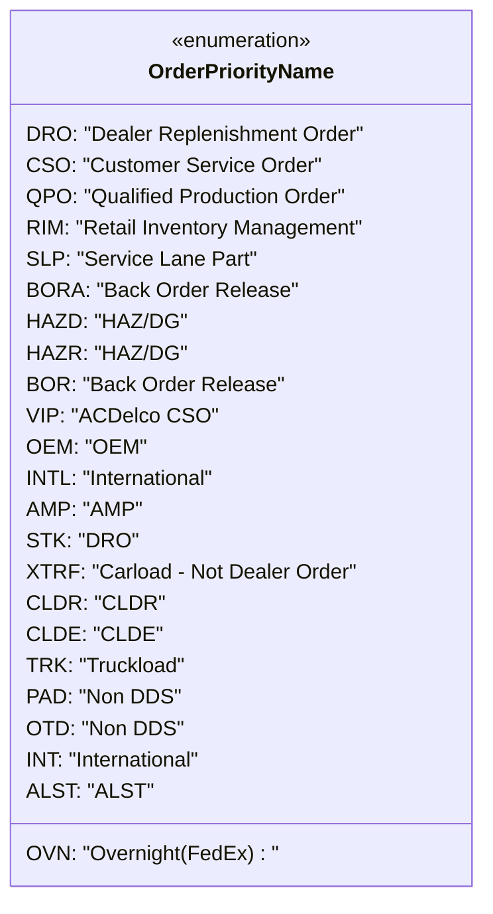

# Diagram: web/portal/src/pages/partview/utils/useOrderPriorityNameTranslation.ts


> Auto-generated by Obscura crawlers

## Diagram 1



### SVG

<svg id="container" width="369.140625" xmlns="http://www.w3.org/2000/svg" class="classDiagram" height="688" viewBox="0 0 369.140625 688" role="graphics-document document" aria-roledescription="class"><style>#container{font-family:"trebuchet ms",verdana,arial,sans-serif;font-size:16px;fill:#333;}@keyframes edge-animation-frame{from{stroke-dashoffset:0;}}@keyframes dash{to{stroke-dashoffset:0;}}#container .edge-animation-slow{stroke-dasharray:9,5!important;stroke-dashoffset:900;animation:dash 50s linear infinite;stroke-linecap:round;}#container .edge-animation-fast{stroke-dasharray:9,5!important;stroke-dashoffset:900;animation:dash 20s linear infinite;stroke-linecap:round;}#container .error-icon{fill:#552222;}#container .error-text{fill:#552222;stroke:#552222;}#container .edge-thickness-normal{stroke-width:1px;}#container .edge-thickness-thick{stroke-width:3.5px;}#container .edge-pattern-solid{stroke-dasharray:0;}#container .edge-thickness-invisible{stroke-width:0;fill:none;}#container .edge-pattern-dashed{stroke-dasharray:3;}#container .edge-pattern-dotted{stroke-dasharray:2;}#container .marker{fill:#333333;stroke:#333333;}#container .marker.cross{stroke:#333333;}#container svg{font-family:"trebuchet ms",verdana,arial,sans-serif;font-size:16px;}#container p{margin:0;}#container g.classGroup text{fill:#9370DB;stroke:none;font-family:"trebuchet ms",verdana,arial,sans-serif;font-size:10px;}#container g.classGroup text .title{font-weight:bolder;}#container .nodeLabel,#container .edgeLabel{color:#131300;}#container .edgeLabel .label rect{fill:#ECECFF;}#container .label text{fill:#131300;}#container .labelBkg{background:#ECECFF;}#container .edgeLabel .label span{background:#ECECFF;}#container .classTitle{font-weight:bolder;}#container .node rect,#container .node circle,#container .node ellipse,#container .node polygon,#container .node path{fill:#ECECFF;stroke:#9370DB;stroke-width:1px;}#container .divider{stroke:#9370DB;stroke-width:1;}#container g.clickable{cursor:pointer;}#container g.classGroup rect{fill:#ECECFF;stroke:#9370DB;}#container g.classGroup line{stroke:#9370DB;stroke-width:1;}#container .classLabel .box{stroke:none;stroke-width:0;fill:#ECECFF;opacity:0.5;}#container .classLabel .label{fill:#9370DB;font-size:10px;}#container .relation{stroke:#333333;stroke-width:1;fill:none;}#container .dashed-line{stroke-dasharray:3;}#container .dotted-line{stroke-dasharray:1 2;}#container #compositionStart,#container .composition{fill:#333333!important;stroke:#333333!important;stroke-width:1;}#container #compositionEnd,#container .composition{fill:#333333!important;stroke:#333333!important;stroke-width:1;}#container #dependencyStart,#container .dependency{fill:#333333!important;stroke:#333333!important;stroke-width:1;}#container #dependencyStart,#container .dependency{fill:#333333!important;stroke:#333333!important;stroke-width:1;}#container #extensionStart,#container .extension{fill:transparent!important;stroke:#333333!important;stroke-width:1;}#container #extensionEnd,#container .extension{fill:transparent!important;stroke:#333333!important;stroke-width:1;}#container #aggregationStart,#container .aggregation{fill:transparent!important;stroke:#333333!important;stroke-width:1;}#container #aggregationEnd,#container .aggregation{fill:transparent!important;stroke:#333333!important;stroke-width:1;}#container #lollipopStart,#container .lollipop{fill:#ECECFF!important;stroke:#333333!important;stroke-width:1;}#container #lollipopEnd,#container .lollipop{fill:#ECECFF!important;stroke:#333333!important;stroke-width:1;}#container .edgeTerminals{font-size:11px;line-height:initial;}#container .classTitleText{text-anchor:middle;font-size:18px;fill:#333;}#container .label-icon{display:inline-block;height:1em;overflow:visible;vertical-align:-0.125em;}#container .node .label-icon path{fill:currentColor;stroke:revert;stroke-width:revert;}#container :root{--mermaid-font-family:"trebuchet ms",verdana,arial,sans-serif;}</style><g><defs><marker id="container_class-aggregationStart" class="marker aggregation class" refX="18" refY="7" markerWidth="190" markerHeight="240" orient="auto"><path d="M 18,7 L9,13 L1,7 L9,1 Z"></path></marker></defs><defs><marker id="container_class-aggregationEnd" class="marker aggregation class" refX="1" refY="7" markerWidth="20" markerHeight="28" orient="auto"><path d="M 18,7 L9,13 L1,7 L9,1 Z"></path></marker></defs><defs><marker id="container_class-extensionStart" class="marker extension class" refX="18" refY="7" markerWidth="190" markerHeight="240" orient="auto"><path d="M 1,7 L18,13 V 1 Z"></path></marker></defs><defs><marker id="container_class-extensionEnd" class="marker extension class" refX="1" refY="7" markerWidth="20" markerHeight="28" orient="auto"><path d="M 1,1 V 13 L18,7 Z"></path></marker></defs><defs><marker id="container_class-compositionStart" class="marker composition class" refX="18" refY="7" markerWidth="190" markerHeight="240" orient="auto"><path d="M 18,7 L9,13 L1,7 L9,1 Z"></path></marker></defs><defs><marker id="container_class-compositionEnd" class="marker composition class" refX="1" refY="7" markerWidth="20" markerHeight="28" orient="auto"><path d="M 18,7 L9,13 L1,7 L9,1 Z"></path></marker></defs><defs><marker id="container_class-dependencyStart" class="marker dependency class" refX="6" refY="7" markerWidth="190" markerHeight="240" orient="auto"><path d="M 5,7 L9,13 L1,7 L9,1 Z"></path></marker></defs><defs><marker id="container_class-dependencyEnd" class="marker dependency class" refX="13" refY="7" markerWidth="20" markerHeight="28" orient="auto"><path d="M 18,7 L9,13 L14,7 L9,1 Z"></path></marker></defs><defs><marker id="container_class-lollipopStart" class="marker lollipop class" refX="13" refY="7" markerWidth="190" markerHeight="240" orient="auto"><circle stroke="black" fill="transparent" cx="7" cy="7" r="6"></circle></marker></defs><defs><marker id="container_class-lollipopEnd" class="marker lollipop class" refX="1" refY="7" markerWidth="190" markerHeight="240" orient="auto"><circle stroke="black" fill="transparent" cx="7" cy="7" r="6"></circle></marker></defs><g class="root"><g class="clusters"></g><g class="edgePaths"></g><g class="edgeLabels"></g><g class="nodes"><g class="node default" id="classId-OrderPriorityName-0" transform="translate(184.5703125, 344)"><g class="basic label-container"><path d="M-176.5703125 -336 L176.5703125 -336 L176.5703125 336 L-176.5703125 336" stroke="none" stroke-width="0" fill="#ECECFF" style=""></path><path d="M-176.5703125 -336 C-65.21623906046355 -336, 46.1378343790729 -336, 176.5703125 -336 M-176.5703125 -336 C-57.09877386427776 -336, 62.37276477144448 -336, 176.5703125 -336 M176.5703125 -336 C176.5703125 -75.70777300072723, 176.5703125 184.58445399854554, 176.5703125 336 M176.5703125 -336 C176.5703125 -153.65585924850197, 176.5703125 28.688281502996062, 176.5703125 336 M176.5703125 336 C36.19516550530071 336, -104.17998148939859 336, -176.5703125 336 M176.5703125 336 C92.49638758950447 336, 8.42246267900893 336, -176.5703125 336 M-176.5703125 336 C-176.5703125 123.66906416552274, -176.5703125 -88.66187166895452, -176.5703125 -336 M-176.5703125 336 C-176.5703125 167.79221186859976, -176.5703125 -0.4155762628004709, -176.5703125 -336" stroke="#9370DB" stroke-width="1.3" fill="none" stroke-dasharray="0 0" style=""></path></g><g class="annotation-group text" transform="translate(-55.5546875, -312)"><g class="label" style="" transform="translate(0,-12)"><foreignObject width="111.109375" height="24"><div xmlns="http://www.w3.org/1999/xhtml" style="display: table-cell; white-space: nowrap; line-height: 1.5; max-width: 161px; text-align: center;"><span class="nodeLabel markdown-node-label" style=""><p>«enumeration»</p></span></div></foreignObject></g></g><g class="label-group text" transform="translate(-69.21875, -288)"><g class="label" style="font-weight: bolder" transform="translate(0,-12)"><foreignObject width="138.4375" height="24"><div xmlns="http://www.w3.org/1999/xhtml" style="display: table-cell; white-space: nowrap; line-height: 1.5; max-width: 187px; text-align: center;"><span class="nodeLabel markdown-node-label" style=""><p>OrderPriorityName</p></span></div></foreignObject></g></g><g class="members-group text" transform="translate(-164.5703125, -240)"><g class="label" style="" transform="translate(0,-12)"><foreignObject width="257.765625" height="24"><div xmlns="http://www.w3.org/1999/xhtml" style="display: table-cell; white-space: nowrap; line-height: 1.5; max-width: 308px; text-align: center;"><span class="nodeLabel markdown-node-label" style=""><p>DRO: "Dealer Replenishment Order"</p></span></div></foreignObject></g><g class="label" style="" transform="translate(0,12)"><foreignObject width="220.234375" height="24"><div xmlns="http://www.w3.org/1999/xhtml" style="display: table-cell; white-space: nowrap; line-height: 1.5; max-width: 270px; text-align: center;"><span class="nodeLabel markdown-node-label" style=""><p>CSO: "Customer Service Order"</p></span></div></foreignObject></g><g class="label" style="" transform="translate(0,36)"><foreignObject width="247.203125" height="24"><div xmlns="http://www.w3.org/1999/xhtml" style="display: table-cell; white-space: nowrap; line-height: 1.5; max-width: 297px; text-align: center;"><span class="nodeLabel markdown-node-label" style=""><p>QPO: "Qualified Production Order"</p></span></div></foreignObject></g><g class="label" style="" transform="translate(0,60)"><foreignObject width="259.921875" height="24"><div xmlns="http://www.w3.org/1999/xhtml" style="display: table-cell; white-space: nowrap; line-height: 1.5; max-width: 310px; text-align: center;"><span class="nodeLabel markdown-node-label" style=""><p>RIM: "Retail Inventory Management"</p></span></div></foreignObject></g><g class="label" style="" transform="translate(0,84)"><foreignObject width="170.734375" height="24"><div xmlns="http://www.w3.org/1999/xhtml" style="display: table-cell; white-space: nowrap; line-height: 1.5; max-width: 221px; text-align: center;"><span class="nodeLabel markdown-node-label" style=""><p>SLP: "Service Lane Part"</p></span></div></foreignObject></g><g class="label" style="" transform="translate(0,108)"><foreignObject width="200.453125" height="24"><div xmlns="http://www.w3.org/1999/xhtml" style="display: table-cell; white-space: nowrap; line-height: 1.5; max-width: 250px; text-align: center;"><span class="nodeLabel markdown-node-label" style=""><p>BORA: "Back Order Release"</p></span></div></foreignObject></g><g class="label" style="" transform="translate(0,132)"><foreignObject width="116.515625" height="24"><div xmlns="http://www.w3.org/1999/xhtml" style="display: table-cell; white-space: nowrap; line-height: 1.5; max-width: 167px; text-align: center;"><span class="nodeLabel markdown-node-label" style=""><p>HAZD: "HAZ/DG"</p></span></div></foreignObject></g><g class="label" style="" transform="translate(0,156)"><foreignObject width="115.890625" height="24"><div xmlns="http://www.w3.org/1999/xhtml" style="display: table-cell; white-space: nowrap; line-height: 1.5; max-width: 166px; text-align: center;"><span class="nodeLabel markdown-node-label" style=""><p>HAZR: "HAZ/DG"</p></span></div></foreignObject></g><g class="label" style="" transform="translate(0,180)"><foreignObject width="191.21875" height="24"><div xmlns="http://www.w3.org/1999/xhtml" style="display: table-cell; white-space: nowrap; line-height: 1.5; max-width: 241px; text-align: center;"><span class="nodeLabel markdown-node-label" style=""><p>BOR: "Back Order Release"</p></span></div></foreignObject></g><g class="label" style="" transform="translate(0,204)"><foreignObject width="134.3125" height="24"><div xmlns="http://www.w3.org/1999/xhtml" style="display: table-cell; white-space: nowrap; line-height: 1.5; max-width: 184px; text-align: center;"><span class="nodeLabel markdown-node-label" style=""><p>VIP: "ACDelco CSO"</p></span></div></foreignObject></g><g class="label" style="" transform="translate(0,228)"><foreignObject width="85.015625" height="24"><div xmlns="http://www.w3.org/1999/xhtml" style="display: table-cell; white-space: nowrap; line-height: 1.5; max-width: 135px; text-align: center;"><span class="nodeLabel markdown-node-label" style=""><p>OEM: "OEM"</p></span></div></foreignObject></g><g class="label" style="" transform="translate(0,252)"><foreignObject width="147.359375" height="24"><div xmlns="http://www.w3.org/1999/xhtml" style="display: table-cell; white-space: nowrap; line-height: 1.5; max-width: 197px; text-align: center;"><span class="nodeLabel markdown-node-label" style=""><p>INTL: "International"</p></span></div></foreignObject></g><g class="label" style="" transform="translate(0,276)"><foreignObject width="82.125" height="24"><div xmlns="http://www.w3.org/1999/xhtml" style="display: table-cell; white-space: nowrap; line-height: 1.5; max-width: 132px; text-align: center;"><span class="nodeLabel markdown-node-label" style=""><p>AMP: "AMP"</p></span></div></foreignObject></g><g class="label" style="" transform="translate(0,300)"><foreignObject width="77.828125" height="24"><div xmlns="http://www.w3.org/1999/xhtml" style="display: table-cell; white-space: nowrap; line-height: 1.5; max-width: 128px; text-align: center;"><span class="nodeLabel markdown-node-label" style=""><p>STK: "DRO"</p></span></div></foreignObject></g><g class="label" style="" transform="translate(0,324)"><foreignObject width="248.390625" height="24"><div xmlns="http://www.w3.org/1999/xhtml" style="display: table-cell; white-space: nowrap; line-height: 1.5; max-width: 298px; text-align: center;"><span class="nodeLabel markdown-node-label" style=""><p>XTRF: "Carload - Not Dealer Order"</p></span></div></foreignObject></g><g class="label" style="" transform="translate(0,348)"><foreignObject width="94.6875" height="24"><div xmlns="http://www.w3.org/1999/xhtml" style="display: table-cell; white-space: nowrap; line-height: 1.5; max-width: 145px; text-align: center;"><span class="nodeLabel markdown-node-label" style=""><p>CLDR: "CLDR"</p></span></div></foreignObject></g><g class="label" style="" transform="translate(0,372)"><foreignObject width="92.4375" height="24"><div xmlns="http://www.w3.org/1999/xhtml" style="display: table-cell; white-space: nowrap; line-height: 1.5; max-width: 142px; text-align: center;"><span class="nodeLabel markdown-node-label" style=""><p>CLDE: "CLDE"</p></span></div></foreignObject></g><g class="label" style="" transform="translate(0,396)"><foreignObject width="119.578125" height="24"><div xmlns="http://www.w3.org/1999/xhtml" style="display: table-cell; white-space: nowrap; line-height: 1.5; max-width: 170px; text-align: center;"><span class="nodeLabel markdown-node-label" style=""><p>TRK: "Truckload"</p></span></div></foreignObject></g><g class="label" style="" transform="translate(0,420)"><foreignObject width="111.71875" height="24"><div xmlns="http://www.w3.org/1999/xhtml" style="display: table-cell; white-space: nowrap; line-height: 1.5; max-width: 162px; text-align: center;"><span class="nodeLabel markdown-node-label" style=""><p>PAD: "Non DDS"</p></span></div></foreignObject></g><g class="label" style="" transform="translate(0,444)"><foreignObject width="113" height="24"><div xmlns="http://www.w3.org/1999/xhtml" style="display: table-cell; white-space: nowrap; line-height: 1.5; max-width: 163px; text-align: center;"><span class="nodeLabel markdown-node-label" style=""><p>OTD: "Non DDS"</p></span></div></foreignObject></g><g class="label" style="" transform="translate(0,468)"><foreignObject width="138.75" height="24"><div xmlns="http://www.w3.org/1999/xhtml" style="display: table-cell; white-space: nowrap; line-height: 1.5; max-width: 189px; text-align: center;"><span class="nodeLabel markdown-node-label" style=""><p>INT: "International"</p></span></div></foreignObject></g><g class="label" style="" transform="translate(0,492)"><foreignObject width="86.96875" height="24"><div xmlns="http://www.w3.org/1999/xhtml" style="display: table-cell; white-space: nowrap; line-height: 1.5; max-width: 137px; text-align: center;"><span class="nodeLabel markdown-node-label" style=""><p>ALST: "ALST"</p></span></div></foreignObject></g></g><g class="methods-group text" transform="translate(-164.5703125, 312)"><g class="label" style="" transform="translate(0,-12)"><foreignObject width="187.40625" height="24"><div xmlns="http://www.w3.org/1999/xhtml" style="display: table-cell; white-space: nowrap; line-height: 1.5; max-width: 237px; text-align: center;"><span class="nodeLabel markdown-node-label" style=""><p>OVN: "Overnight(FedEx) : "</p></span></div></foreignObject></g></g><g class="divider" style=""><path d="M-176.5703125 -264 C-69.57329451689932 -264, 37.42372346620135 -264, 176.5703125 -264 M-176.5703125 -264 C-88.13569752655987 -264, 0.29891744688026733 -264, 176.5703125 -264" stroke="#9370DB" stroke-width="1.3" fill="none" stroke-dasharray="0 0" style=""></path></g><g class="divider" style=""><path d="M-176.5703125 288 C-91.9611762013306 288, -7.352039902661204 288, 176.5703125 288 M-176.5703125 288 C-94.04350623216253 288, -11.516699964325056 288, 176.5703125 288" stroke="#9370DB" stroke-width="1.3" fill="none" stroke-dasharray="0 0" style=""></path></g></g></g></g></g></svg>

## Diagram 2

```mermaid
flowchart TD
  A[useOrderPriorityNameTranslation] --> B[useTranslation("partview-search") -> t]
  A --> C[getTranslatedOrderPriorityName(orderPriorityNameCode)]
  C --> D{find "(" index}
  D --> E[orderPriorityName = substring(0, index)]
  D --> F[orderPriorityCode = substring(index, end)]
  E --> G{switch(orderPriorityName)}
  G --> |DRO| H[return t("Dealer Replenishment Order") + orderPriorityCode]
  G --> |CSO| I[return t("Customer Service Order") + orderPriorityCode]
  G --> |QPO| J[return t("Qualified Production Order") + orderPriorityCode]
  G --> |OVN| K[return t("Overnight (FedEx)") + orderPriorityCode]
  G --> |RIM| L[return t("Retail Inventory Management") + orderPriorityCode]
  G --> |BORA/BOR| M[return t("Back Order Release") + orderPriorityCode]
  G --> |HAZD/HAZR| N[return t("HAZ/DG") + orderPriorityCode]
  G --> |VIP| O[return t("ACDelco CSO") + orderPriorityCode]
  G --> |OEM| P[return t("OEM") + orderPriorityCode]
  G --> |INTL| Q[return t("International") + orderPriorityCode]
  G --> |AMP| R[return t("AMO") + orderPriorityCode]
  G --> |STK| S[return t("DRO") + orderPriorityCode]
  G --> |XTRF| T[return t("Carload - Not Dealer Order") + orderPriorityCode]
  G --> |CLDR| U[return t("CLDR") + orderPriorityCode]
  G --> |CLDE| V[return t("CLDE") + orderPriorityCode]
  G --> |TRK| W[return t("Truckload ?") + orderPriorityCode]
  G --> |PAD/OTD| X[return t("Non DDS") + orderPriorityCode]
  G --> |INT| Y[return t("INT") + orderPriorityCode]
  G --> |ALST| Z[return t("ALST") + orderPriorityCode]
  G --> |default| AA[return orderPriorityNameCode]
```

> SVG rendering failed for this diagram.
