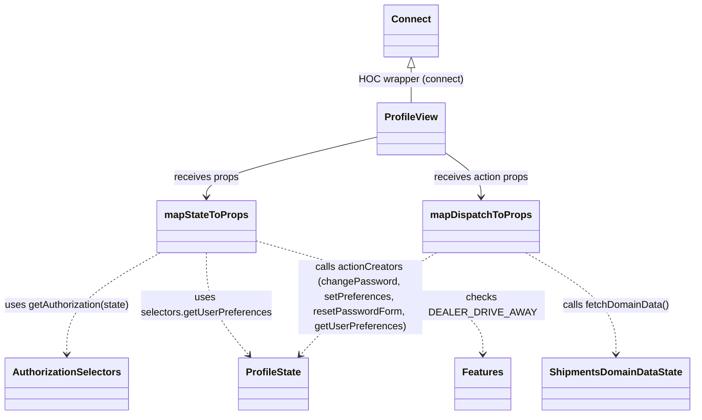

# Diagram: web/portal/src/pages/profile/Profile.page.container.js


> Auto-generated by Obscura crawlers

## Diagram 1

```mermaid
flowchart LR
    State[Redux State] -->|getAuthorization(state)| Auth[Authorization]
    State -->|state.profile + selectors| ProfileSlice[profile slice]
    Auth -->|hasFeatures(DEALER_DRIVE_AWAY)| HasDealerPickUp[hasDealerPickUpFeature]
    ProfileSlice -->|spread into props| MapState[mapStateToProps]
    ProfileSlice -->|selectors.getUserPreferences(state)| UserPrefs[userPreferences]
    UserPrefs --> MapState
    HasDealerPickUp --> MapState
    MapState -->|props| ConnectedView[ProfileView]
    MapDispatch[mapDispatchToProps] -->|props (actions)| ConnectedView
    MapDispatch -->|fetchDomainData()| FetchDomain[ShipmentsDomainDataState.actionCreators.fetchDomainData()]
    MapDispatch -->|changePassword(payload,userId)| ChangePwd[ProfileState.actionCreators.changePassword()]
    MapDispatch -->|setPreferences(payload)| SetPrefs[ProfileState.actionCreators.setPreferences()]
    MapDispatch -->|resetPasswordForm()| ResetForm[ProfileState.actionCreators.resetPasswordForm()]
    MapDispatch -->|getUserPreferences()| GetPrefs[ProfileState.actionCreators.getUserPreferences()]
    Connect[connect(mapStateToProps, mapDispatchToProps)] --> ConnectedView
    State --> MapDispatch
```

> SVG rendering failed for this diagram.

## Diagram 2



### SVG

<svg id="container" width="1108.59375" xmlns="http://www.w3.org/2000/svg" class="classDiagram" height="670" viewBox="0 0 1108.59375 670" role="graphics-document document" aria-roledescription="class"><style>#container{font-family:"trebuchet ms",verdana,arial,sans-serif;font-size:16px;fill:#333;}@keyframes edge-animation-frame{from{stroke-dashoffset:0;}}@keyframes dash{to{stroke-dashoffset:0;}}#container .edge-animation-slow{stroke-dasharray:9,5!important;stroke-dashoffset:900;animation:dash 50s linear infinite;stroke-linecap:round;}#container .edge-animation-fast{stroke-dasharray:9,5!important;stroke-dashoffset:900;animation:dash 20s linear infinite;stroke-linecap:round;}#container .error-icon{fill:#552222;}#container .error-text{fill:#552222;stroke:#552222;}#container .edge-thickness-normal{stroke-width:1px;}#container .edge-thickness-thick{stroke-width:3.5px;}#container .edge-pattern-solid{stroke-dasharray:0;}#container .edge-thickness-invisible{stroke-width:0;fill:none;}#container .edge-pattern-dashed{stroke-dasharray:3;}#container .edge-pattern-dotted{stroke-dasharray:2;}#container .marker{fill:#333333;stroke:#333333;}#container .marker.cross{stroke:#333333;}#container svg{font-family:"trebuchet ms",verdana,arial,sans-serif;font-size:16px;}#container p{margin:0;}#container g.classGroup text{fill:#9370DB;stroke:none;font-family:"trebuchet ms",verdana,arial,sans-serif;font-size:10px;}#container g.classGroup text .title{font-weight:bolder;}#container .nodeLabel,#container .edgeLabel{color:#131300;}#container .edgeLabel .label rect{fill:#ECECFF;}#container .label text{fill:#131300;}#container .labelBkg{background:#ECECFF;}#container .edgeLabel .label span{background:#ECECFF;}#container .classTitle{font-weight:bolder;}#container .node rect,#container .node circle,#container .node ellipse,#container .node polygon,#container .node path{fill:#ECECFF;stroke:#9370DB;stroke-width:1px;}#container .divider{stroke:#9370DB;stroke-width:1;}#container g.clickable{cursor:pointer;}#container g.classGroup rect{fill:#ECECFF;stroke:#9370DB;}#container g.classGroup line{stroke:#9370DB;stroke-width:1;}#container .classLabel .box{stroke:none;stroke-width:0;fill:#ECECFF;opacity:0.5;}#container .classLabel .label{fill:#9370DB;font-size:10px;}#container .relation{stroke:#333333;stroke-width:1;fill:none;}#container .dashed-line{stroke-dasharray:3;}#container .dotted-line{stroke-dasharray:1 2;}#container #compositionStart,#container .composition{fill:#333333!important;stroke:#333333!important;stroke-width:1;}#container #compositionEnd,#container .composition{fill:#333333!important;stroke:#333333!important;stroke-width:1;}#container #dependencyStart,#container .dependency{fill:#333333!important;stroke:#333333!important;stroke-width:1;}#container #dependencyStart,#container .dependency{fill:#333333!important;stroke:#333333!important;stroke-width:1;}#container #extensionStart,#container .extension{fill:transparent!important;stroke:#333333!important;stroke-width:1;}#container #extensionEnd,#container .extension{fill:transparent!important;stroke:#333333!important;stroke-width:1;}#container #aggregationStart,#container .aggregation{fill:transparent!important;stroke:#333333!important;stroke-width:1;}#container #aggregationEnd,#container .aggregation{fill:transparent!important;stroke:#333333!important;stroke-width:1;}#container #lollipopStart,#container .lollipop{fill:#ECECFF!important;stroke:#333333!important;stroke-width:1;}#container #lollipopEnd,#container .lollipop{fill:#ECECFF!important;stroke:#333333!important;stroke-width:1;}#container .edgeTerminals{font-size:11px;line-height:initial;}#container .classTitleText{text-anchor:middle;font-size:18px;fill:#333;}#container .label-icon{display:inline-block;height:1em;overflow:visible;vertical-align:-0.125em;}#container .node .label-icon path{fill:currentColor;stroke:revert;stroke-width:revert;}#container :root{--mermaid-font-family:"trebuchet ms",verdana,arial,sans-serif;}</style><g><defs><marker id="container_class-aggregationStart" class="marker aggregation class" refX="18" refY="7" markerWidth="190" markerHeight="240" orient="auto"><path d="M 18,7 L9,13 L1,7 L9,1 Z"></path></marker></defs><defs><marker id="container_class-aggregationEnd" class="marker aggregation class" refX="1" refY="7" markerWidth="20" markerHeight="28" orient="auto"><path d="M 18,7 L9,13 L1,7 L9,1 Z"></path></marker></defs><defs><marker id="container_class-extensionStart" class="marker extension class" refX="18" refY="7" markerWidth="190" markerHeight="240" orient="auto"><path d="M 1,7 L18,13 V 1 Z"></path></marker></defs><defs><marker id="container_class-extensionEnd" class="marker extension class" refX="1" refY="7" markerWidth="20" markerHeight="28" orient="auto"><path d="M 1,1 V 13 L18,7 Z"></path></marker></defs><defs><marker id="container_class-compositionStart" class="marker composition class" refX="18" refY="7" markerWidth="190" markerHeight="240" orient="auto"><path d="M 18,7 L9,13 L1,7 L9,1 Z"></path></marker></defs><defs><marker id="container_class-compositionEnd" class="marker composition class" refX="1" refY="7" markerWidth="20" markerHeight="28" orient="auto"><path d="M 18,7 L9,13 L1,7 L9,1 Z"></path></marker></defs><defs><marker id="container_class-dependencyStart" class="marker dependency class" refX="6" refY="7" markerWidth="190" markerHeight="240" orient="auto"><path d="M 5,7 L9,13 L1,7 L9,1 Z"></path></marker></defs><defs><marker id="container_class-dependencyEnd" class="marker dependency class" refX="13" refY="7" markerWidth="20" markerHeight="28" orient="auto"><path d="M 18,7 L9,13 L14,7 L9,1 Z"></path></marker></defs><defs><marker id="container_class-lollipopStart" class="marker lollipop class" refX="13" refY="7" markerWidth="190" markerHeight="240" orient="auto"><circle stroke="black" fill="transparent" cx="7" cy="7" r="6"></circle></marker></defs><defs><marker id="container_class-lollipopEnd" class="marker lollipop class" refX="1" refY="7" markerWidth="190" markerHeight="240" orient="auto"><circle stroke="black" fill="transparent" cx="7" cy="7" r="6"></circle></marker></defs><g class="root"><g class="clusters"></g><g class="edgePaths"><path d="M606.008,220.839L560.44,231.866C514.872,242.892,423.737,264.946,378.169,281.14C332.602,297.333,332.602,307.667,332.602,312.833L332.602,318" id="id_ProfileView_mapStateToProps_1" class="edge-thickness-normal edge-pattern-solid relation" style=";;;" data-edge="true" data-et="edge" data-id="id_ProfileView_mapStateToProps_1" data-points="W3sieCI6NjA2LjAwNzgxMjUsInkiOjIyMC44Mzg2NTc5NTU4MjM1OH0seyJ4IjozMzIuNjAxNTYyNSwieSI6Mjg3fSx7IngiOjMzMi42MDE1NjI1LCJ5IjozMjR9XQ==" marker-end="url(#container_class-dependencyEnd)"></path><path d="M712.117,245.322L721.992,252.269C731.866,259.215,751.615,273.107,761.489,285.22C771.363,297.333,771.363,307.667,771.363,312.833L771.363,318" id="id_ProfileView_mapDispatchToProps_2" class="edge-thickness-normal edge-pattern-solid relation" style=";;;" data-edge="true" data-et="edge" data-id="id_ProfileView_mapDispatchToProps_2" data-points="W3sieCI6NzEyLjExNzE4NzUsInkiOjI0NS4zMjIyNzIwNzkwMjg4M30seyJ4Ijo3NzEuMzYzMjgxMjUsInkiOjI4N30seyJ4Ijo3NzEuMzYzMjgxMjUsInkiOjMyNH1d" marker-end="url(#container_class-dependencyEnd)"></path><path d="M258.324,408L233.27,422.167C208.216,436.333,158.108,464.667,133.054,492C108,519.333,108,545.667,108,558.833L108,572" id="id_mapStateToProps_AuthorizationSelectors_3" class="edge-thickness-normal edge-pattern-dashed relation" style=";;;" data-edge="true" data-et="edge" data-id="id_mapStateToProps_AuthorizationSelectors_3" data-points="W3sieCI6MjU4LjMyMzg4MDQxMzM4NTg0LCJ5Ijo0MDh9LHsieCI6MTA4LCJ5Ijo0OTN9LHsieCI6MTA4LCJ5Ijo1Nzh9XQ==" marker-end="url(#container_class-dependencyEnd)"></path><path d="M332.602,408L332.602,422.167C332.602,436.333,332.602,464.667,344.056,492.24C355.51,519.813,378.419,546.626,389.873,560.032L401.327,573.438" id="id_mapStateToProps_ProfileState_4" class="edge-thickness-normal edge-pattern-dashed relation" style=";;;" data-edge="true" data-et="edge" data-id="id_mapStateToProps_ProfileState_4" data-points="W3sieCI6MzMyLjYwMTU2MjUsInkiOjQwOH0seyJ4IjozMzIuNjAxNTYyNSwieSI6NDkzfSx7IngiOjQwNS4yMjQ5MDE1NzQ4MDMxNCwieSI6NTc4fV0=" marker-end="url(#container_class-dependencyEnd)"></path><path d="M409.313,387.912L470.628,405.427C531.943,422.942,654.573,457.971,715.888,488.652C777.203,519.333,777.203,545.667,777.203,558.833L777.203,572" id="id_mapStateToProps_Features_5" class="edge-thickness-normal edge-pattern-dashed relation" style=";;;" data-edge="true" data-et="edge" data-id="id_mapStateToProps_Features_5" data-points="W3sieCI6NDA5LjMxMjUsInkiOjM4Ny45MTI0MDQwMTM0MjQ5fSx7IngiOjc3Ny4yMDMxMjUsInkiOjQ5M30seyJ4Ijo3NzcuMjAzMTI1LCJ5Ijo1Nzh9XQ==" marker-end="url(#container_class-dependencyEnd)"></path><path d="M842.188,408L866.077,422.167C889.966,436.333,937.745,464.667,961.634,492C985.523,519.333,985.523,545.667,985.523,558.833L985.523,572" id="id_mapDispatchToProps_ShipmentsDomainDataState_6" class="edge-thickness-normal edge-pattern-dashed relation" style=";;;" data-edge="true" data-et="edge" data-id="id_mapDispatchToProps_ShipmentsDomainDataState_6" data-points="W3sieCI6ODQyLjE4Nzg5OTg1MjM2MjIsInkiOjQwOH0seyJ4Ijo5ODUuNTIzNDM3NSwieSI6NDkzfSx7IngiOjk4NS41MjM0Mzc1LCJ5Ijo1Nzh9XQ==" marker-end="url(#container_class-dependencyEnd)"></path><path d="M700.539,408L676.649,422.167C652.76,436.333,604.982,464.667,568.817,492.262C532.652,519.857,508.102,546.714,495.826,560.143L483.551,573.571" id="id_mapDispatchToProps_ProfileState_7" class="edge-thickness-normal edge-pattern-dashed relation" style=";;;" data-edge="true" data-et="edge" data-id="id_mapDispatchToProps_ProfileState_7" data-points="W3sieCI6NzAwLjUzODY2MjY0NzYzNzgsInkiOjQwOH0seyJ4Ijo1NTcuMjAzMTI1LCJ5Ijo0OTN9LHsieCI6NDc5LjUwMjU4MzY2MTQxNzMsInkiOjU3OH1d" marker-end="url(#container_class-dependencyEnd)"></path><path d="M659.063,109.25L659.063,112.542C659.063,115.833,659.063,122.417,659.063,131.875C659.063,141.333,659.063,153.667,659.063,159.833L659.063,166" id="id_Connect_ProfileView_8" class="edge-thickness-normal edge-pattern-solid relation" style=";;;" data-edge="true" data-et="edge" data-id="id_Connect_ProfileView_8" data-points="W3sieCI6NjU5LjA2MjUsInkiOjkyfSx7IngiOjY1OS4wNjI1LCJ5IjoxMjl9LHsieCI6NjU5LjA2MjUsInkiOjE2Nn1d" marker-start="url(#container_class-extensionStart)"></path></g><g class="edgeLabels"><g class="edgeLabel" transform="translate(332.6015625, 287)"><g class="label" data-id="id_ProfileView_mapStateToProps_1" transform="translate(-52.375, -12)"><foreignObject width="104.75" height="24"><div xmlns="http://www.w3.org/1999/xhtml" class="labelBkg" style="display: table-cell; white-space: nowrap; line-height: 1.5; max-width: 200px; text-align: center;"><span class="edgeLabel"><p>receives props</p></span></div></foreignObject></g></g><g class="edgeLabel" transform="translate(771.36328125, 287)"><g class="label" data-id="id_ProfileView_mapDispatchToProps_2" transform="translate(-77.171875, -12)"><foreignObject width="154.34375" height="24"><div xmlns="http://www.w3.org/1999/xhtml" class="labelBkg" style="display: table-cell; white-space: nowrap; line-height: 1.5; max-width: 200px; text-align: center;"><span class="edgeLabel"><p>receives action props</p></span></div></foreignObject></g></g><g class="edgeLabel" transform="translate(108, 493)"><g class="label" data-id="id_mapStateToProps_AuthorizationSelectors_3" transform="translate(-100, -24)"><foreignObject width="200" height="48"><div xmlns="http://www.w3.org/1999/xhtml" class="labelBkg" style="display: table; white-space: break-spaces; line-height: 1.5; max-width: 200px; text-align: center; width: 200px;"><span class="edgeLabel"><p>uses getAuthorization(state)</p></span></div></foreignObject></g></g><g class="edgeLabel" transform="translate(332.6015625, 493)"><g class="label" data-id="id_mapStateToProps_ProfileState_4" transform="translate(-104.6015625, -24)"><foreignObject width="209.203125" height="48"><div xmlns="http://www.w3.org/1999/xhtml" class="labelBkg" style="display: table; white-space: break-spaces; line-height: 1.5; max-width: 200px; text-align: center; width: 200px;"><span class="edgeLabel"><p>uses selectors.getUserPreferences</p></span></div></foreignObject></g></g><g class="edgeLabel" transform="translate(777.203125, 493)"><g class="label" data-id="id_mapStateToProps_Features_5" transform="translate(-100, -24)"><foreignObject width="200" height="48"><div xmlns="http://www.w3.org/1999/xhtml" class="labelBkg" style="display: table; white-space: break-spaces; line-height: 1.5; max-width: 200px; text-align: center; width: 200px;"><span class="edgeLabel"><p>checks DEALER_DRIVE_AWAY</p></span></div></foreignObject></g></g><g class="edgeLabel" transform="translate(985.5234375, 493)"><g class="label" data-id="id_mapDispatchToProps_ShipmentsDomainDataState_6" transform="translate(-86.5703125, -12)"><foreignObject width="173.140625" height="24"><div xmlns="http://www.w3.org/1999/xhtml" class="labelBkg" style="display: table-cell; white-space: nowrap; line-height: 1.5; max-width: 200px; text-align: center;"><span class="edgeLabel"><p>calls fetchDomainData()</p></span></div></foreignObject></g></g><g class="edgeLabel" transform="translate(579.34344, 479.87048)"><g class="label" data-id="id_mapDispatchToProps_ProfileState_7" transform="translate(-100, -60)"><foreignObject width="200" height="120"><div xmlns="http://www.w3.org/1999/xhtml" class="labelBkg" style="display: table; white-space: break-spaces; line-height: 1.5; max-width: 200px; text-align: center; width: 200px;"><span class="edgeLabel"><p>calls actionCreators (changePassword, setPreferences, resetPasswordForm, getUserPreferences)</p></span></div></foreignObject></g></g><g class="edgeLabel" transform="translate(659.0625, 129)"><g class="label" data-id="id_Connect_ProfileView_8" transform="translate(-83.515625, -12)"><foreignObject width="167.03125" height="24"><div xmlns="http://www.w3.org/1999/xhtml" class="labelBkg" style="display: table-cell; white-space: nowrap; line-height: 1.5; max-width: 200px; text-align: center;"><span class="edgeLabel"><p>HOC wrapper (connect)</p></span></div></foreignObject></g></g></g><g class="nodes"><g class="node default" id="classId-ProfileView-0" transform="translate(659.0625, 208)"><g class="basic label-container"><path d="M-53.0546875 -42 L53.0546875 -42 L53.0546875 42 L-53.0546875 42" stroke="none" stroke-width="0" fill="#ECECFF" style=""></path><path d="M-53.0546875 -42 C-23.141811252500272 -42, 6.771064994999456 -42, 53.0546875 -42 M-53.0546875 -42 C-23.075973682589073 -42, 6.902740134821855 -42, 53.0546875 -42 M53.0546875 -42 C53.0546875 -15.658565025381897, 53.0546875 10.682869949236206, 53.0546875 42 M53.0546875 -42 C53.0546875 -18.016807118957363, 53.0546875 5.966385762085274, 53.0546875 42 M53.0546875 42 C10.78184126784317 42, -31.49100496431366 42, -53.0546875 42 M53.0546875 42 C31.292237021372653 42, 9.529786542745306 42, -53.0546875 42 M-53.0546875 42 C-53.0546875 22.823273619412223, -53.0546875 3.6465472388244464, -53.0546875 -42 M-53.0546875 42 C-53.0546875 20.88258138957497, -53.0546875 -0.23483722085006065, -53.0546875 -42" stroke="#9370DB" stroke-width="1.3" fill="none" stroke-dasharray="0 0" style=""></path></g><g class="annotation-group text" transform="translate(0, -18)"></g><g class="label-group text" transform="translate(-41.0546875, -18)"><g class="label" style="font-weight: bolder" transform="translate(0,-12)"><foreignObject width="82.109375" height="24"><div xmlns="http://www.w3.org/1999/xhtml" style="display: table-cell; white-space: nowrap; line-height: 1.5; max-width: 131px; text-align: center;"><span class="nodeLabel markdown-node-label" style=""><p>ProfileView</p></span></div></foreignObject></g></g><g class="members-group text" transform="translate(-41.0546875, 30)"></g><g class="methods-group text" transform="translate(-41.0546875, 60)"></g><g class="divider" style=""><path d="M-53.0546875 6 C-26.942262704999962 6, -0.8298379099999238 6, 53.0546875 6 M-53.0546875 6 C-26.185520007835596 6, 0.6836474843288087 6, 53.0546875 6" stroke="#9370DB" stroke-width="1.3" fill="none" stroke-dasharray="0 0" style=""></path></g><g class="divider" style=""><path d="M-53.0546875 24 C-14.57957427937184 24, 23.89553894125632 24, 53.0546875 24 M-53.0546875 24 C-21.6469538344569 24, 9.760779831086197 24, 53.0546875 24" stroke="#9370DB" stroke-width="1.3" fill="none" stroke-dasharray="0 0" style=""></path></g></g><g class="node default" id="classId-mapStateToProps-1" transform="translate(332.6015625, 366)"><g class="basic label-container"><path d="M-76.7109375 -42 L76.7109375 -42 L76.7109375 42 L-76.7109375 42" stroke="none" stroke-width="0" fill="#ECECFF" style=""></path><path d="M-76.7109375 -42 C-19.578196780638066 -42, 37.55454393872387 -42, 76.7109375 -42 M-76.7109375 -42 C-34.848813051574304 -42, 7.0133113968513925 -42, 76.7109375 -42 M76.7109375 -42 C76.7109375 -14.19262340533642, 76.7109375 13.61475318932716, 76.7109375 42 M76.7109375 -42 C76.7109375 -18.021014690312654, 76.7109375 5.9579706193746915, 76.7109375 42 M76.7109375 42 C26.599439478403482 42, -23.512058543193035 42, -76.7109375 42 M76.7109375 42 C44.75907511956833 42, 12.80721273913666 42, -76.7109375 42 M-76.7109375 42 C-76.7109375 9.979578564158913, -76.7109375 -22.040842871682173, -76.7109375 -42 M-76.7109375 42 C-76.7109375 20.754429278106006, -76.7109375 -0.4911414437879884, -76.7109375 -42" stroke="#9370DB" stroke-width="1.3" fill="none" stroke-dasharray="0 0" style=""></path></g><g class="annotation-group text" transform="translate(0, -18)"></g><g class="label-group text" transform="translate(-64.7109375, -18)"><g class="label" style="font-weight: bolder" transform="translate(0,-12)"><foreignObject width="129.421875" height="24"><div xmlns="http://www.w3.org/1999/xhtml" style="display: table-cell; white-space: nowrap; line-height: 1.5; max-width: 177px; text-align: center;"><span class="nodeLabel markdown-node-label" style=""><p>mapStateToProps</p></span></div></foreignObject></g></g><g class="members-group text" transform="translate(-64.7109375, 30)"></g><g class="methods-group text" transform="translate(-64.7109375, 60)"></g><g class="divider" style=""><path d="M-76.7109375 6 C-41.990176250579694 6, -7.269415001159388 6, 76.7109375 6 M-76.7109375 6 C-41.050102213860846 6, -5.3892669277216925 6, 76.7109375 6" stroke="#9370DB" stroke-width="1.3" fill="none" stroke-dasharray="0 0" style=""></path></g><g class="divider" style=""><path d="M-76.7109375 24 C-22.830836995716993 24, 31.049263508566014 24, 76.7109375 24 M-76.7109375 24 C-45.303218582437296 24, -13.895499664874599 24, 76.7109375 24" stroke="#9370DB" stroke-width="1.3" fill="none" stroke-dasharray="0 0" style=""></path></g></g><g class="node default" id="classId-mapDispatchToProps-2" transform="translate(771.36328125, 366)"><g class="basic label-container"><path d="M-89.1953125 -42 L89.1953125 -42 L89.1953125 42 L-89.1953125 42" stroke="none" stroke-width="0" fill="#ECECFF" style=""></path><path d="M-89.1953125 -42 C-49.54851565385633 -42, -9.901718807712655 -42, 89.1953125 -42 M-89.1953125 -42 C-22.642491250014487 -42, 43.910329999971026 -42, 89.1953125 -42 M89.1953125 -42 C89.1953125 -8.429813831189726, 89.1953125 25.140372337620548, 89.1953125 42 M89.1953125 -42 C89.1953125 -12.44168581947488, 89.1953125 17.11662836105024, 89.1953125 42 M89.1953125 42 C42.30733252598901 42, -4.580647448021978 42, -89.1953125 42 M89.1953125 42 C46.80923095048121 42, 4.423149400962416 42, -89.1953125 42 M-89.1953125 42 C-89.1953125 18.4701829077074, -89.1953125 -5.0596341845851995, -89.1953125 -42 M-89.1953125 42 C-89.1953125 20.885618817562786, -89.1953125 -0.22876236487442725, -89.1953125 -42" stroke="#9370DB" stroke-width="1.3" fill="none" stroke-dasharray="0 0" style=""></path></g><g class="annotation-group text" transform="translate(0, -18)"></g><g class="label-group text" transform="translate(-77.1953125, -18)"><g class="label" style="font-weight: bolder" transform="translate(0,-12)"><foreignObject width="154.390625" height="24"><div xmlns="http://www.w3.org/1999/xhtml" style="display: table-cell; white-space: nowrap; line-height: 1.5; max-width: 203px; text-align: center;"><span class="nodeLabel markdown-node-label" style=""><p>mapDispatchToProps</p></span></div></foreignObject></g></g><g class="members-group text" transform="translate(-77.1953125, 30)"></g><g class="methods-group text" transform="translate(-77.1953125, 60)"></g><g class="divider" style=""><path d="M-89.1953125 6 C-23.864304299126346 6, 41.46670390174731 6, 89.1953125 6 M-89.1953125 6 C-46.0267130249341 6, -2.858113549868193 6, 89.1953125 6" stroke="#9370DB" stroke-width="1.3" fill="none" stroke-dasharray="0 0" style=""></path></g><g class="divider" style=""><path d="M-89.1953125 24 C-26.754861591919585 24, 35.68558931616083 24, 89.1953125 24 M-89.1953125 24 C-18.902090409650427 24, 51.39113168069915 24, 89.1953125 24" stroke="#9370DB" stroke-width="1.3" fill="none" stroke-dasharray="0 0" style=""></path></g></g><g class="node default" id="classId-ShipmentsDomainDataState-3" transform="translate(985.5234375, 620)"><g class="basic label-container"><path d="M-115.0703125 -42 L115.0703125 -42 L115.0703125 42 L-115.0703125 42" stroke="none" stroke-width="0" fill="#ECECFF" style=""></path><path d="M-115.0703125 -42 C-58.94412523810416 -42, -2.817937976208313 -42, 115.0703125 -42 M-115.0703125 -42 C-40.916831193164896 -42, 33.23665011367021 -42, 115.0703125 -42 M115.0703125 -42 C115.0703125 -15.305854123217525, 115.0703125 11.38829175356495, 115.0703125 42 M115.0703125 -42 C115.0703125 -15.257609861085498, 115.0703125 11.484780277829003, 115.0703125 42 M115.0703125 42 C63.13726120420358 42, 11.204209908407165 42, -115.0703125 42 M115.0703125 42 C51.77859102991891 42, -11.513130440162186 42, -115.0703125 42 M-115.0703125 42 C-115.0703125 8.581266962563689, -115.0703125 -24.837466074872623, -115.0703125 -42 M-115.0703125 42 C-115.0703125 16.365067669511642, -115.0703125 -9.269864660976715, -115.0703125 -42" stroke="#9370DB" stroke-width="1.3" fill="none" stroke-dasharray="0 0" style=""></path></g><g class="annotation-group text" transform="translate(0, -18)"></g><g class="label-group text" transform="translate(-103.0703125, -18)"><g class="label" style="font-weight: bolder" transform="translate(0,-12)"><foreignObject width="206.140625" height="24"><div xmlns="http://www.w3.org/1999/xhtml" style="display: table-cell; white-space: nowrap; line-height: 1.5; max-width: 254px; text-align: center;"><span class="nodeLabel markdown-node-label" style=""><p>ShipmentsDomainDataState</p></span></div></foreignObject></g></g><g class="members-group text" transform="translate(-103.0703125, 30)"></g><g class="methods-group text" transform="translate(-103.0703125, 60)"></g><g class="divider" style=""><path d="M-115.0703125 6 C-59.635783940706645 6, -4.20125538141329 6, 115.0703125 6 M-115.0703125 6 C-62.84563367722489 6, -10.620954854449778 6, 115.0703125 6" stroke="#9370DB" stroke-width="1.3" fill="none" stroke-dasharray="0 0" style=""></path></g><g class="divider" style=""><path d="M-115.0703125 24 C-64.0069046313128 24, -12.943496762625628 24, 115.0703125 24 M-115.0703125 24 C-26.920467551924773 24, 61.229377396150454 24, 115.0703125 24" stroke="#9370DB" stroke-width="1.3" fill="none" stroke-dasharray="0 0" style=""></path></g></g><g class="node default" id="classId-ProfileState-4" transform="translate(441.109375, 620)"><g class="basic label-container"><path d="M-55.140625 -42 L55.140625 -42 L55.140625 42 L-55.140625 42" stroke="none" stroke-width="0" fill="#ECECFF" style=""></path><path d="M-55.140625 -42 C-13.090398471980173 -42, 28.959828056039655 -42, 55.140625 -42 M-55.140625 -42 C-19.472015478295063 -42, 16.196594043409874 -42, 55.140625 -42 M55.140625 -42 C55.140625 -16.93917334943642, 55.140625 8.12165330112716, 55.140625 42 M55.140625 -42 C55.140625 -12.686504721728877, 55.140625 16.626990556542246, 55.140625 42 M55.140625 42 C17.49695382533828 42, -20.14671734932344 42, -55.140625 42 M55.140625 42 C20.04687086462973 42, -15.046883270740537 42, -55.140625 42 M-55.140625 42 C-55.140625 13.046386757312678, -55.140625 -15.907226485374643, -55.140625 -42 M-55.140625 42 C-55.140625 16.435945320510896, -55.140625 -9.128109358978207, -55.140625 -42" stroke="#9370DB" stroke-width="1.3" fill="none" stroke-dasharray="0 0" style=""></path></g><g class="annotation-group text" transform="translate(0, -18)"></g><g class="label-group text" transform="translate(-43.140625, -18)"><g class="label" style="font-weight: bolder" transform="translate(0,-12)"><foreignObject width="86.28125" height="24"><div xmlns="http://www.w3.org/1999/xhtml" style="display: table-cell; white-space: nowrap; line-height: 1.5; max-width: 134px; text-align: center;"><span class="nodeLabel markdown-node-label" style=""><p>ProfileState</p></span></div></foreignObject></g></g><g class="members-group text" transform="translate(-43.140625, 30)"></g><g class="methods-group text" transform="translate(-43.140625, 60)"></g><g class="divider" style=""><path d="M-55.140625 6 C-17.83780741394169 6, 19.46501017211662 6, 55.140625 6 M-55.140625 6 C-11.88398841446012 6, 31.37264817107976 6, 55.140625 6" stroke="#9370DB" stroke-width="1.3" fill="none" stroke-dasharray="0 0" style=""></path></g><g class="divider" style=""><path d="M-55.140625 24 C-19.34491070642894 24, 16.45080358714212 24, 55.140625 24 M-55.140625 24 C-31.40982849035532 24, -7.67903198071064 24, 55.140625 24" stroke="#9370DB" stroke-width="1.3" fill="none" stroke-dasharray="0 0" style=""></path></g></g><g class="node default" id="classId-AuthorizationSelectors-5" transform="translate(108, 620)"><g class="basic label-container"><path d="M-95.875 -42 L95.875 -42 L95.875 42 L-95.875 42" stroke="none" stroke-width="0" fill="#ECECFF" style=""></path><path d="M-95.875 -42 C-25.20571552280596 -42, 45.46356895438808 -42, 95.875 -42 M-95.875 -42 C-21.636163305729667 -42, 52.602673388540666 -42, 95.875 -42 M95.875 -42 C95.875 -11.97908854377177, 95.875 18.04182291245646, 95.875 42 M95.875 -42 C95.875 -20.91261002801504, 95.875 0.17477994396991647, 95.875 42 M95.875 42 C50.74207776576528 42, 5.609155531530561 42, -95.875 42 M95.875 42 C21.268883402029147 42, -53.33723319594171 42, -95.875 42 M-95.875 42 C-95.875 24.85323876038944, -95.875 7.706477520778883, -95.875 -42 M-95.875 42 C-95.875 13.564288681867936, -95.875 -14.871422636264128, -95.875 -42" stroke="#9370DB" stroke-width="1.3" fill="none" stroke-dasharray="0 0" style=""></path></g><g class="annotation-group text" transform="translate(0, -18)"></g><g class="label-group text" transform="translate(-83.875, -18)"><g class="label" style="font-weight: bolder" transform="translate(0,-12)"><foreignObject width="167.75" height="24"><div xmlns="http://www.w3.org/1999/xhtml" style="display: table-cell; white-space: nowrap; line-height: 1.5; max-width: 215px; text-align: center;"><span class="nodeLabel markdown-node-label" style=""><p>AuthorizationSelectors</p></span></div></foreignObject></g></g><g class="members-group text" transform="translate(-83.875, 30)"></g><g class="methods-group text" transform="translate(-83.875, 60)"></g><g class="divider" style=""><path d="M-95.875 6 C-28.171694535576123 6, 39.531610928847755 6, 95.875 6 M-95.875 6 C-54.476645619966135 6, -13.07829123993227 6, 95.875 6" stroke="#9370DB" stroke-width="1.3" fill="none" stroke-dasharray="0 0" style=""></path></g><g class="divider" style=""><path d="M-95.875 24 C-52.79928727001806 24, -9.723574540036125 24, 95.875 24 M-95.875 24 C-49.836648499669685 24, -3.798296999339371 24, 95.875 24" stroke="#9370DB" stroke-width="1.3" fill="none" stroke-dasharray="0 0" style=""></path></g></g><g class="node default" id="classId-Features-6" transform="translate(777.203125, 620)"><g class="basic label-container"><path d="M-43.25 -42 L43.25 -42 L43.25 42 L-43.25 42" stroke="none" stroke-width="0" fill="#ECECFF" style=""></path><path d="M-43.25 -42 C-14.829887665803856 -42, 13.590224668392288 -42, 43.25 -42 M-43.25 -42 C-22.599489824592943 -42, -1.9489796491858868 -42, 43.25 -42 M43.25 -42 C43.25 -8.790290238474412, 43.25 24.419419523051175, 43.25 42 M43.25 -42 C43.25 -23.51689367344126, 43.25 -5.033787346882519, 43.25 42 M43.25 42 C24.111162547462193 42, 4.972325094924386 42, -43.25 42 M43.25 42 C25.678392098894577 42, 8.106784197789153 42, -43.25 42 M-43.25 42 C-43.25 8.809338647217999, -43.25 -24.381322705564003, -43.25 -42 M-43.25 42 C-43.25 15.103058427074153, -43.25 -11.793883145851694, -43.25 -42" stroke="#9370DB" stroke-width="1.3" fill="none" stroke-dasharray="0 0" style=""></path></g><g class="annotation-group text" transform="translate(0, -18)"></g><g class="label-group text" transform="translate(-31.25, -18)"><g class="label" style="font-weight: bolder" transform="translate(0,-12)"><foreignObject width="62.5" height="24"><div xmlns="http://www.w3.org/1999/xhtml" style="display: table-cell; white-space: nowrap; line-height: 1.5; max-width: 112px; text-align: center;"><span class="nodeLabel markdown-node-label" style=""><p>Features</p></span></div></foreignObject></g></g><g class="members-group text" transform="translate(-31.25, 30)"></g><g class="methods-group text" transform="translate(-31.25, 60)"></g><g class="divider" style=""><path d="M-43.25 6 C-12.274916446099276 6, 18.700167107801448 6, 43.25 6 M-43.25 6 C-11.611287780589748 6, 20.027424438820503 6, 43.25 6" stroke="#9370DB" stroke-width="1.3" fill="none" stroke-dasharray="0 0" style=""></path></g><g class="divider" style=""><path d="M-43.25 24 C-24.936675156406807 24, -6.6233503128136135 24, 43.25 24 M-43.25 24 C-21.813322891927825 24, -0.3766457838556505 24, 43.25 24" stroke="#9370DB" stroke-width="1.3" fill="none" stroke-dasharray="0 0" style=""></path></g></g><g class="node default" id="classId-Connect-7" transform="translate(659.0625, 50)"><g class="basic label-container"><path d="M-41.6875 -42 L41.6875 -42 L41.6875 42 L-41.6875 42" stroke="none" stroke-width="0" fill="#ECECFF" style=""></path><path d="M-41.6875 -42 C-20.92977787813818 -42, -0.17205575627635739 -42, 41.6875 -42 M-41.6875 -42 C-12.643423633123497 -42, 16.400652733753006 -42, 41.6875 -42 M41.6875 -42 C41.6875 -13.213864148737063, 41.6875 15.572271702525875, 41.6875 42 M41.6875 -42 C41.6875 -11.813347988536865, 41.6875 18.37330402292627, 41.6875 42 M41.6875 42 C9.367883350047528 42, -22.951733299904944 42, -41.6875 42 M41.6875 42 C23.623955524225565 42, 5.5604110484511295 42, -41.6875 42 M-41.6875 42 C-41.6875 12.115163499974525, -41.6875 -17.76967300005095, -41.6875 -42 M-41.6875 42 C-41.6875 8.913600629503271, -41.6875 -24.172798740993457, -41.6875 -42" stroke="#9370DB" stroke-width="1.3" fill="none" stroke-dasharray="0 0" style=""></path></g><g class="annotation-group text" transform="translate(0, -18)"></g><g class="label-group text" transform="translate(-29.6875, -18)"><g class="label" style="font-weight: bolder" transform="translate(0,-12)"><foreignObject width="59.375" height="24"><div xmlns="http://www.w3.org/1999/xhtml" style="display: table-cell; white-space: nowrap; line-height: 1.5; max-width: 109px; text-align: center;"><span class="nodeLabel markdown-node-label" style=""><p>Connect</p></span></div></foreignObject></g></g><g class="members-group text" transform="translate(-29.6875, 30)"></g><g class="methods-group text" transform="translate(-29.6875, 60)"></g><g class="divider" style=""><path d="M-41.6875 6 C-23.392606116013688 6, -5.0977122320273764 6, 41.6875 6 M-41.6875 6 C-22.83754545875839 6, -3.9875909175167834 6, 41.6875 6" stroke="#9370DB" stroke-width="1.3" fill="none" stroke-dasharray="0 0" style=""></path></g><g class="divider" style=""><path d="M-41.6875 24 C-22.863921128822202 24, -4.040342257644404 24, 41.6875 24 M-41.6875 24 C-14.144148972642025 24, 13.39920205471595 24, 41.6875 24" stroke="#9370DB" stroke-width="1.3" fill="none" stroke-dasharray="0 0" style=""></path></g></g></g></g></g></svg>
