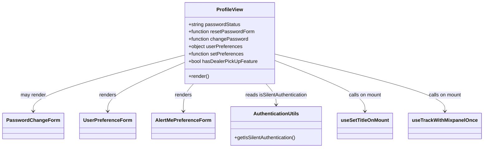

# Diagram: web/portal/src/pages/profile/Profile.page.js


> Auto-generated by Obscura crawlers

## Diagram 1



### SVG

<svg id="container" width="1513.5" xmlns="http://www.w3.org/2000/svg" class="classDiagram" height="504" viewBox="0 0 1513.5 504" role="graphics-document document" aria-roledescription="class"><style>#container{font-family:"trebuchet ms",verdana,arial,sans-serif;font-size:16px;fill:#333;}@keyframes edge-animation-frame{from{stroke-dashoffset:0;}}@keyframes dash{to{stroke-dashoffset:0;}}#container .edge-animation-slow{stroke-dasharray:9,5!important;stroke-dashoffset:900;animation:dash 50s linear infinite;stroke-linecap:round;}#container .edge-animation-fast{stroke-dasharray:9,5!important;stroke-dashoffset:900;animation:dash 20s linear infinite;stroke-linecap:round;}#container .error-icon{fill:#552222;}#container .error-text{fill:#552222;stroke:#552222;}#container .edge-thickness-normal{stroke-width:1px;}#container .edge-thickness-thick{stroke-width:3.5px;}#container .edge-pattern-solid{stroke-dasharray:0;}#container .edge-thickness-invisible{stroke-width:0;fill:none;}#container .edge-pattern-dashed{stroke-dasharray:3;}#container .edge-pattern-dotted{stroke-dasharray:2;}#container .marker{fill:#333333;stroke:#333333;}#container .marker.cross{stroke:#333333;}#container svg{font-family:"trebuchet ms",verdana,arial,sans-serif;font-size:16px;}#container p{margin:0;}#container g.classGroup text{fill:#9370DB;stroke:none;font-family:"trebuchet ms",verdana,arial,sans-serif;font-size:10px;}#container g.classGroup text .title{font-weight:bolder;}#container .nodeLabel,#container .edgeLabel{color:#131300;}#container .edgeLabel .label rect{fill:#ECECFF;}#container .label text{fill:#131300;}#container .labelBkg{background:#ECECFF;}#container .edgeLabel .label span{background:#ECECFF;}#container .classTitle{font-weight:bolder;}#container .node rect,#container .node circle,#container .node ellipse,#container .node polygon,#container .node path{fill:#ECECFF;stroke:#9370DB;stroke-width:1px;}#container .divider{stroke:#9370DB;stroke-width:1;}#container g.clickable{cursor:pointer;}#container g.classGroup rect{fill:#ECECFF;stroke:#9370DB;}#container g.classGroup line{stroke:#9370DB;stroke-width:1;}#container .classLabel .box{stroke:none;stroke-width:0;fill:#ECECFF;opacity:0.5;}#container .classLabel .label{fill:#9370DB;font-size:10px;}#container .relation{stroke:#333333;stroke-width:1;fill:none;}#container .dashed-line{stroke-dasharray:3;}#container .dotted-line{stroke-dasharray:1 2;}#container #compositionStart,#container .composition{fill:#333333!important;stroke:#333333!important;stroke-width:1;}#container #compositionEnd,#container .composition{fill:#333333!important;stroke:#333333!important;stroke-width:1;}#container #dependencyStart,#container .dependency{fill:#333333!important;stroke:#333333!important;stroke-width:1;}#container #dependencyStart,#container .dependency{fill:#333333!important;stroke:#333333!important;stroke-width:1;}#container #extensionStart,#container .extension{fill:transparent!important;stroke:#333333!important;stroke-width:1;}#container #extensionEnd,#container .extension{fill:transparent!important;stroke:#333333!important;stroke-width:1;}#container #aggregationStart,#container .aggregation{fill:transparent!important;stroke:#333333!important;stroke-width:1;}#container #aggregationEnd,#container .aggregation{fill:transparent!important;stroke:#333333!important;stroke-width:1;}#container #lollipopStart,#container .lollipop{fill:#ECECFF!important;stroke:#333333!important;stroke-width:1;}#container #lollipopEnd,#container .lollipop{fill:#ECECFF!important;stroke:#333333!important;stroke-width:1;}#container .edgeTerminals{font-size:11px;line-height:initial;}#container .classTitleText{text-anchor:middle;font-size:18px;fill:#333;}#container .label-icon{display:inline-block;height:1em;overflow:visible;vertical-align:-0.125em;}#container .node .label-icon path{fill:currentColor;stroke:revert;stroke-width:revert;}#container :root{--mermaid-font-family:"trebuchet ms",verdana,arial,sans-serif;}</style><g><defs><marker id="container_class-aggregationStart" class="marker aggregation class" refX="18" refY="7" markerWidth="190" markerHeight="240" orient="auto"><path d="M 18,7 L9,13 L1,7 L9,1 Z"></path></marker></defs><defs><marker id="container_class-aggregationEnd" class="marker aggregation class" refX="1" refY="7" markerWidth="20" markerHeight="28" orient="auto"><path d="M 18,7 L9,13 L1,7 L9,1 Z"></path></marker></defs><defs><marker id="container_class-extensionStart" class="marker extension class" refX="18" refY="7" markerWidth="190" markerHeight="240" orient="auto"><path d="M 1,7 L18,13 V 1 Z"></path></marker></defs><defs><marker id="container_class-extensionEnd" class="marker extension class" refX="1" refY="7" markerWidth="20" markerHeight="28" orient="auto"><path d="M 1,1 V 13 L18,7 Z"></path></marker></defs><defs><marker id="container_class-compositionStart" class="marker composition class" refX="18" refY="7" markerWidth="190" markerHeight="240" orient="auto"><path d="M 18,7 L9,13 L1,7 L9,1 Z"></path></marker></defs><defs><marker id="container_class-compositionEnd" class="marker composition class" refX="1" refY="7" markerWidth="20" markerHeight="28" orient="auto"><path d="M 18,7 L9,13 L1,7 L9,1 Z"></path></marker></defs><defs><marker id="container_class-dependencyStart" class="marker dependency class" refX="6" refY="7" markerWidth="190" markerHeight="240" orient="auto"><path d="M 5,7 L9,13 L1,7 L9,1 Z"></path></marker></defs><defs><marker id="container_class-dependencyEnd" class="marker dependency class" refX="13" refY="7" markerWidth="20" markerHeight="28" orient="auto"><path d="M 18,7 L9,13 L14,7 L9,1 Z"></path></marker></defs><defs><marker id="container_class-lollipopStart" class="marker lollipop class" refX="13" refY="7" markerWidth="190" markerHeight="240" orient="auto"><circle stroke="black" fill="transparent" cx="7" cy="7" r="6"></circle></marker></defs><defs><marker id="container_class-lollipopEnd" class="marker lollipop class" refX="1" refY="7" markerWidth="190" markerHeight="240" orient="auto"><circle stroke="black" fill="transparent" cx="7" cy="7" r="6"></circle></marker></defs><g class="root"><g class="clusters"></g><g class="edgePaths"><path d="M567.109,182.438L489.219,205.532C411.328,228.626,255.547,274.813,177.656,308.573C99.766,342.333,99.766,363.667,99.766,374.333L99.766,385" id="id_ProfileView_PasswordChangeForm_1" class="edge-thickness-normal edge-pattern-solid relation" style=";;;" data-edge="true" data-et="edge" data-id="id_ProfileView_PasswordChangeForm_1" data-points="W3sieCI6NTY3LjEwOTM3NSwieSI6MTgyLjQzODI4ODIzMzUyNTA3fSx7IngiOjk5Ljc2NTYyNSwieSI6MzIxfSx7IngiOjk5Ljc2NTYyNSwieSI6MzkxfV0=" marker-end="url(#container_class-dependencyEnd)"></path><path d="M567.109,207.732L527.215,226.61C487.32,245.488,407.531,283.244,367.637,312.789C327.742,342.333,327.742,363.667,327.742,374.333L327.742,385" id="id_ProfileView_UserPreferenceForm_2" class="edge-thickness-normal edge-pattern-solid relation" style=";;;" data-edge="true" data-et="edge" data-id="id_ProfileView_UserPreferenceForm_2" data-points="W3sieCI6NTY3LjEwOTM3NSwieSI6MjA3LjczMTk3NzgxODg1Mzk4fSx7IngiOjMyNy43NDIxODc1LCJ5IjozMjF9LHsieCI6MzI3Ljc0MjE4NzUsInkiOjM5MX1d" marker-end="url(#container_class-dependencyEnd)"></path><path d="M602.122,272L595.432,280.167C588.742,288.333,575.363,304.667,568.674,323.5C561.984,342.333,561.984,363.667,561.984,374.333L561.984,385" id="id_ProfileView_AlertMePreferenceForm_3" class="edge-thickness-normal edge-pattern-solid relation" style=";;;" data-edge="true" data-et="edge" data-id="id_ProfileView_AlertMePreferenceForm_3" data-points="W3sieCI6NjAyLjEyMTUyNTM3OTgzNDIsInkiOjI3Mn0seyJ4Ijo1NjEuOTg0Mzc1LCJ5IjozMjF9LHsieCI6NTYxLjk4NDM3NSwieSI6MzkxfV0=" marker-end="url(#container_class-dependencyEnd)"></path><path d="M818.371,272L825.06,280.167C831.75,288.333,845.129,304.667,851.818,320C858.508,335.333,858.508,349.667,858.508,356.833L858.508,364" id="id_ProfileView_AuthenticationUtils_4" class="edge-thickness-normal edge-pattern-solid relation" style=";;;" data-edge="true" data-et="edge" data-id="id_ProfileView_AuthenticationUtils_4" data-points="W3sieCI6ODE4LjM3MDY2MjEyMDE2NTgsInkiOjI3Mn0seyJ4Ijo4NTguNTA3ODEyNSwieSI6MzIxfSx7IngiOjg1OC41MDc4MTI1LCJ5IjozNzB9XQ==" marker-end="url(#container_class-dependencyEnd)"></path><path d="M853.383,199.777L901.762,219.98C950.141,240.184,1046.898,280.592,1095.277,311.463C1143.656,342.333,1143.656,363.667,1143.656,374.333L1143.656,385" id="id_ProfileView_useSetTitleOnMount_5" class="edge-thickness-normal edge-pattern-solid relation" style=";;;" data-edge="true" data-et="edge" data-id="id_ProfileView_useSetTitleOnMount_5" data-points="W3sieCI6ODUzLjM4MjgxMjUsInkiOjE5OS43NzY1MDg5NzIyNjc1NX0seyJ4IjoxMTQzLjY1NjI1LCJ5IjozMjF9LHsieCI6MTE0My42NTYyNSwieSI6MzkxfV0=" marker-end="url(#container_class-dependencyEnd)"></path><path d="M853.383,177.951L943.303,201.793C1033.224,225.634,1213.065,273.317,1302.986,307.825C1392.906,342.333,1392.906,363.667,1392.906,374.333L1392.906,385" id="id_ProfileView_useTrackWithMixpanelOnce_6" class="edge-thickness-normal edge-pattern-solid relation" style=";;;" data-edge="true" data-et="edge" data-id="id_ProfileView_useTrackWithMixpanelOnce_6" data-points="W3sieCI6ODUzLjM4MjgxMjUsInkiOjE3Ny45NTExNjE4NzI1MDAxN30seyJ4IjoxMzkyLjkwNjI1LCJ5IjozMjF9LHsieCI6MTM5Mi45MDYyNSwieSI6MzkxfV0=" marker-end="url(#container_class-dependencyEnd)"></path></g><g class="edgeLabels"><g class="edgeLabel" transform="translate(99.765625, 321)"><g class="label" data-id="id_ProfileView_PasswordChangeForm_1" transform="translate(-41.2734375, -12)"><foreignObject width="82.546875" height="24"><div xmlns="http://www.w3.org/1999/xhtml" class="labelBkg" style="display: table-cell; white-space: nowrap; line-height: 1.5; max-width: 200px; text-align: center;"><span class="edgeLabel"><p>may render</p></span></div></foreignObject></g></g><g class="edgeLabel" transform="translate(327.7421875, 321)"><g class="label" data-id="id_ProfileView_UserPreferenceForm_2" transform="translate(-27.75, -12)"><foreignObject width="55.5" height="24"><div xmlns="http://www.w3.org/1999/xhtml" class="labelBkg" style="display: table-cell; white-space: nowrap; line-height: 1.5; max-width: 200px; text-align: center;"><span class="edgeLabel"><p>renders</p></span></div></foreignObject></g></g><g class="edgeLabel" transform="translate(561.984375, 321)"><g class="label" data-id="id_ProfileView_AlertMePreferenceForm_3" transform="translate(-27.75, -12)"><foreignObject width="55.5" height="24"><div xmlns="http://www.w3.org/1999/xhtml" class="labelBkg" style="display: table-cell; white-space: nowrap; line-height: 1.5; max-width: 200px; text-align: center;"><span class="edgeLabel"><p>renders</p></span></div></foreignObject></g></g><g class="edgeLabel" transform="translate(858.5078125, 321)"><g class="label" data-id="id_ProfileView_AuthenticationUtils_4" transform="translate(-100, -24)"><foreignObject width="200" height="48"><div xmlns="http://www.w3.org/1999/xhtml" class="labelBkg" style="display: table; white-space: break-spaces; line-height: 1.5; max-width: 200px; text-align: center; width: 200px;"><span class="edgeLabel"><p>reads isSilentAuthentication</p></span></div></foreignObject></g></g><g class="edgeLabel" transform="translate(1143.65625, 321)"><g class="label" data-id="id_ProfileView_useSetTitleOnMount_5" transform="translate(-53.8046875, -12)"><foreignObject width="107.609375" height="24"><div xmlns="http://www.w3.org/1999/xhtml" class="labelBkg" style="display: table-cell; white-space: nowrap; line-height: 1.5; max-width: 200px; text-align: center;"><span class="edgeLabel"><p>calls on mount</p></span></div></foreignObject></g></g><g class="edgeLabel" transform="translate(1392.90625, 321)"><g class="label" data-id="id_ProfileView_useTrackWithMixpanelOnce_6" transform="translate(-53.8046875, -12)"><foreignObject width="107.609375" height="24"><div xmlns="http://www.w3.org/1999/xhtml" class="labelBkg" style="display: table-cell; white-space: nowrap; line-height: 1.5; max-width: 200px; text-align: center;"><span class="edgeLabel"><p>calls on mount</p></span></div></foreignObject></g></g></g><g class="nodes"><g class="node default" id="classId-ProfileView-0" transform="translate(710.24609375, 140)"><g class="basic label-container"><path d="M-143.13671875 -132 L143.13671875 -132 L143.13671875 132 L-143.13671875 132" stroke="none" stroke-width="0" fill="#ECECFF" style=""></path><path d="M-143.13671875 -132 C-38.60610109632421 -132, 65.92451655735158 -132, 143.13671875 -132 M-143.13671875 -132 C-80.39381722979789 -132, -17.650915709595765 -132, 143.13671875 -132 M143.13671875 -132 C143.13671875 -40.290809993958334, 143.13671875 51.41838001208333, 143.13671875 132 M143.13671875 -132 C143.13671875 -62.2070397685781, 143.13671875 7.585920462843802, 143.13671875 132 M143.13671875 132 C75.19180557719928 132, 7.246892404398551 132, -143.13671875 132 M143.13671875 132 C38.70931012521871 132, -65.71809849956259 132, -143.13671875 132 M-143.13671875 132 C-143.13671875 68.18041844295726, -143.13671875 4.360836885914537, -143.13671875 -132 M-143.13671875 132 C-143.13671875 56.296900275329506, -143.13671875 -19.40619944934099, -143.13671875 -132" stroke="#9370DB" stroke-width="1.3" fill="none" stroke-dasharray="0 0" style=""></path></g><g class="annotation-group text" transform="translate(0, -108)"></g><g class="label-group text" transform="translate(-41.0546875, -108)"><g class="label" style="font-weight: bolder" transform="translate(0,-12)"><foreignObject width="82.109375" height="24"><div xmlns="http://www.w3.org/1999/xhtml" style="display: table-cell; white-space: nowrap; line-height: 1.5; max-width: 131px; text-align: center;"><span class="nodeLabel markdown-node-label" style=""><p>ProfileView</p></span></div></foreignObject></g></g><g class="members-group text" transform="translate(-131.13671875, -60)"><g class="label" style="" transform="translate(0,-12)"><foreignObject width="168.15625" height="24"><div xmlns="http://www.w3.org/1999/xhtml" style="display: table-cell; white-space: nowrap; line-height: 1.5; max-width: 226px; text-align: center;"><span class="nodeLabel markdown-node-label" style=""><p>+string passwordStatus</p></span></div></foreignObject></g><g class="label" style="" transform="translate(0,12)"><foreignObject width="213.3125" height="24"><div xmlns="http://www.w3.org/1999/xhtml" style="display: table-cell; white-space: nowrap; line-height: 1.5; max-width: 271px; text-align: center;"><span class="nodeLabel markdown-node-label" style=""><p>+function resetPasswordForm</p></span></div></foreignObject></g><g class="label" style="" transform="translate(0,36)"><foreignObject width="192.296875" height="24"><div xmlns="http://www.w3.org/1999/xhtml" style="display: table-cell; white-space: nowrap; line-height: 1.5; max-width: 250px; text-align: center;"><span class="nodeLabel markdown-node-label" style=""><p>+function changePassword</p></span></div></foreignObject></g><g class="label" style="" transform="translate(0,60)"><foreignObject width="174.015625" height="24"><div xmlns="http://www.w3.org/1999/xhtml" style="display: table-cell; white-space: nowrap; line-height: 1.5; max-width: 231px; text-align: center;"><span class="nodeLabel markdown-node-label" style=""><p>+object userPreferences</p></span></div></foreignObject></g><g class="label" style="" transform="translate(0,84)"><foreignObject width="179.28125" height="24"><div xmlns="http://www.w3.org/1999/xhtml" style="display: table-cell; white-space: nowrap; line-height: 1.5; max-width: 237px; text-align: center;"><span class="nodeLabel markdown-node-label" style=""><p>+function setPreferences</p></span></div></foreignObject></g><g class="label" style="" transform="translate(0,108)"><foreignObject width="221.21875" height="24"><div xmlns="http://www.w3.org/1999/xhtml" style="display: table-cell; white-space: nowrap; line-height: 1.5; max-width: 279px; text-align: center;"><span class="nodeLabel markdown-node-label" style=""><p>+bool hasDealerPickUpFeature</p></span></div></foreignObject></g></g><g class="methods-group text" transform="translate(-131.13671875, 108)"><g class="label" style="" transform="translate(0,-12)"><foreignObject width="66.609375" height="24"><div xmlns="http://www.w3.org/1999/xhtml" style="display: table-cell; white-space: nowrap; line-height: 1.5; max-width: 124px; text-align: center;"><span class="nodeLabel markdown-node-label" style=""><p>+render()</p></span></div></foreignObject></g></g><g class="divider" style=""><path d="M-143.13671875 -84 C-74.29068455296972 -84, -5.444650355939444 -84, 143.13671875 -84 M-143.13671875 -84 C-60.84053156271179 -84, 21.455655624576423 -84, 143.13671875 -84" stroke="#9370DB" stroke-width="1.3" fill="none" stroke-dasharray="0 0" style=""></path></g><g class="divider" style=""><path d="M-143.13671875 84 C-79.41511421728664 84, -15.693509684573286 84, 143.13671875 84 M-143.13671875 84 C-56.241776130340014 84, 30.653166489319972 84, 143.13671875 84" stroke="#9370DB" stroke-width="1.3" fill="none" stroke-dasharray="0 0" style=""></path></g></g><g class="node default" id="classId-PasswordChangeForm-1" transform="translate(99.765625, 433)"><g class="basic label-container"><path d="M-91.765625 -42 L91.765625 -42 L91.765625 42 L-91.765625 42" stroke="none" stroke-width="0" fill="#ECECFF" style=""></path><path d="M-91.765625 -42 C-46.31404350690217 -42, -0.8624620138043468 -42, 91.765625 -42 M-91.765625 -42 C-33.496859967994716 -42, 24.771905064010568 -42, 91.765625 -42 M91.765625 -42 C91.765625 -20.55393447334435, 91.765625 0.8921310533113029, 91.765625 42 M91.765625 -42 C91.765625 -14.14668079712391, 91.765625 13.70663840575218, 91.765625 42 M91.765625 42 C27.51372944137006 42, -36.73816611725988 42, -91.765625 42 M91.765625 42 C33.235257965568195 42, -25.29510906886361 42, -91.765625 42 M-91.765625 42 C-91.765625 19.78023444683269, -91.765625 -2.43953110633462, -91.765625 -42 M-91.765625 42 C-91.765625 18.231809466741893, -91.765625 -5.536381066516213, -91.765625 -42" stroke="#9370DB" stroke-width="1.3" fill="none" stroke-dasharray="0 0" style=""></path></g><g class="annotation-group text" transform="translate(0, -18)"></g><g class="label-group text" transform="translate(-79.765625, -18)"><g class="label" style="font-weight: bolder" transform="translate(0,-12)"><foreignObject width="159.53125" height="24"><div xmlns="http://www.w3.org/1999/xhtml" style="display: table-cell; white-space: nowrap; line-height: 1.5; max-width: 207px; text-align: center;"><span class="nodeLabel markdown-node-label" style=""><p>PasswordChangeForm</p></span></div></foreignObject></g></g><g class="members-group text" transform="translate(-79.765625, 30)"></g><g class="methods-group text" transform="translate(-79.765625, 60)"></g><g class="divider" style=""><path d="M-91.765625 6 C-41.87671438356801 6, 8.012196232863985 6, 91.765625 6 M-91.765625 6 C-22.56271357423151 6, 46.64019785153698 6, 91.765625 6" stroke="#9370DB" stroke-width="1.3" fill="none" stroke-dasharray="0 0" style=""></path></g><g class="divider" style=""><path d="M-91.765625 24 C-32.3033534719079 24, 27.158918056184206 24, 91.765625 24 M-91.765625 24 C-19.281451122135636 24, 53.20272275572873 24, 91.765625 24" stroke="#9370DB" stroke-width="1.3" fill="none" stroke-dasharray="0 0" style=""></path></g></g><g class="node default" id="classId-UserPreferenceForm-2" transform="translate(327.7421875, 433)"><g class="basic label-container"><path d="M-86.2109375 -42 L86.2109375 -42 L86.2109375 42 L-86.2109375 42" stroke="none" stroke-width="0" fill="#ECECFF" style=""></path><path d="M-86.2109375 -42 C-51.18816118084134 -42, -16.165384861682682 -42, 86.2109375 -42 M-86.2109375 -42 C-24.728433012534005 -42, 36.75407147493199 -42, 86.2109375 -42 M86.2109375 -42 C86.2109375 -10.673957560900075, 86.2109375 20.65208487819985, 86.2109375 42 M86.2109375 -42 C86.2109375 -10.39902572595803, 86.2109375 21.20194854808394, 86.2109375 42 M86.2109375 42 C41.60933565571928 42, -2.9922661885614446 42, -86.2109375 42 M86.2109375 42 C43.8759029413157 42, 1.5408683826314018 42, -86.2109375 42 M-86.2109375 42 C-86.2109375 21.065672020900355, -86.2109375 0.13134404180070902, -86.2109375 -42 M-86.2109375 42 C-86.2109375 23.41999063874732, -86.2109375 4.839981277494637, -86.2109375 -42" stroke="#9370DB" stroke-width="1.3" fill="none" stroke-dasharray="0 0" style=""></path></g><g class="annotation-group text" transform="translate(0, -18)"></g><g class="label-group text" transform="translate(-74.2109375, -18)"><g class="label" style="font-weight: bolder" transform="translate(0,-12)"><foreignObject width="148.421875" height="24"><div xmlns="http://www.w3.org/1999/xhtml" style="display: table-cell; white-space: nowrap; line-height: 1.5; max-width: 197px; text-align: center;"><span class="nodeLabel markdown-node-label" style=""><p>UserPreferenceForm</p></span></div></foreignObject></g></g><g class="members-group text" transform="translate(-74.2109375, 30)"></g><g class="methods-group text" transform="translate(-74.2109375, 60)"></g><g class="divider" style=""><path d="M-86.2109375 6 C-27.896860624050134 6, 30.41721625189973 6, 86.2109375 6 M-86.2109375 6 C-41.78915706288982 6, 2.6326233742203584 6, 86.2109375 6" stroke="#9370DB" stroke-width="1.3" fill="none" stroke-dasharray="0 0" style=""></path></g><g class="divider" style=""><path d="M-86.2109375 24 C-38.09979119416235 24, 10.0113551116753 24, 86.2109375 24 M-86.2109375 24 C-41.928765137879275 24, 2.353407224241451 24, 86.2109375 24" stroke="#9370DB" stroke-width="1.3" fill="none" stroke-dasharray="0 0" style=""></path></g></g><g class="node default" id="classId-AlertMePreferenceForm-3" transform="translate(561.984375, 433)"><g class="basic label-container"><path d="M-98.03125 -42 L98.03125 -42 L98.03125 42 L-98.03125 42" stroke="none" stroke-width="0" fill="#ECECFF" style=""></path><path d="M-98.03125 -42 C-30.848921646911194 -42, 36.33340670617761 -42, 98.03125 -42 M-98.03125 -42 C-46.51184018197986 -42, 5.007569636040273 -42, 98.03125 -42 M98.03125 -42 C98.03125 -12.124194764666765, 98.03125 17.75161047066647, 98.03125 42 M98.03125 -42 C98.03125 -15.753245537633966, 98.03125 10.493508924732069, 98.03125 42 M98.03125 42 C42.41434058659037 42, -13.20256882681926 42, -98.03125 42 M98.03125 42 C57.646757162315915 42, 17.26226432463183 42, -98.03125 42 M-98.03125 42 C-98.03125 19.90425487912497, -98.03125 -2.19149024175006, -98.03125 -42 M-98.03125 42 C-98.03125 20.10259411050187, -98.03125 -1.7948117789962623, -98.03125 -42" stroke="#9370DB" stroke-width="1.3" fill="none" stroke-dasharray="0 0" style=""></path></g><g class="annotation-group text" transform="translate(0, -18)"></g><g class="label-group text" transform="translate(-86.03125, -18)"><g class="label" style="font-weight: bolder" transform="translate(0,-12)"><foreignObject width="172.0625" height="24"><div xmlns="http://www.w3.org/1999/xhtml" style="display: table-cell; white-space: nowrap; line-height: 1.5; max-width: 219px; text-align: center;"><span class="nodeLabel markdown-node-label" style=""><p>AlertMePreferenceForm</p></span></div></foreignObject></g></g><g class="members-group text" transform="translate(-86.03125, 30)"></g><g class="methods-group text" transform="translate(-86.03125, 60)"></g><g class="divider" style=""><path d="M-98.03125 6 C-43.68003218164892 6, 10.671185636702162 6, 98.03125 6 M-98.03125 6 C-39.65803411288208 6, 18.715181774235845 6, 98.03125 6" stroke="#9370DB" stroke-width="1.3" fill="none" stroke-dasharray="0 0" style=""></path></g><g class="divider" style=""><path d="M-98.03125 24 C-45.711341653495886 24, 6.608566693008228 24, 98.03125 24 M-98.03125 24 C-47.87733734186988 24, 2.276575316260235 24, 98.03125 24" stroke="#9370DB" stroke-width="1.3" fill="none" stroke-dasharray="0 0" style=""></path></g></g><g class="node default" id="classId-AuthenticationUtils-4" transform="translate(858.5078125, 433)"><g class="basic label-container"><path d="M-148.4921875 -63 L148.4921875 -63 L148.4921875 63 L-148.4921875 63" stroke="none" stroke-width="0" fill="#ECECFF" style=""></path><path d="M-148.4921875 -63 C-78.7921959990072 -63, -9.09220449801441 -63, 148.4921875 -63 M-148.4921875 -63 C-68.62913638039706 -63, 11.233914739205886 -63, 148.4921875 -63 M148.4921875 -63 C148.4921875 -19.09913239417871, 148.4921875 24.80173521164258, 148.4921875 63 M148.4921875 -63 C148.4921875 -33.699542469062806, 148.4921875 -4.399084938125604, 148.4921875 63 M148.4921875 63 C34.523953051309064 63, -79.44428139738187 63, -148.4921875 63 M148.4921875 63 C71.313383549818 63, -5.865420400364002 63, -148.4921875 63 M-148.4921875 63 C-148.4921875 30.93535564603689, -148.4921875 -1.1292887079262215, -148.4921875 -63 M-148.4921875 63 C-148.4921875 33.14790255421076, -148.4921875 3.2958051084215256, -148.4921875 -63" stroke="#9370DB" stroke-width="1.3" fill="none" stroke-dasharray="0 0" style=""></path></g><g class="annotation-group text" transform="translate(0, -39)"></g><g class="label-group text" transform="translate(-70.9375, -39)"><g class="label" style="font-weight: bolder" transform="translate(0,-12)"><foreignObject width="141.875" height="24"><div xmlns="http://www.w3.org/1999/xhtml" style="display: table-cell; white-space: nowrap; line-height: 1.5; max-width: 190px; text-align: center;"><span class="nodeLabel markdown-node-label" style=""><p>AuthenticationUtils</p></span></div></foreignObject></g></g><g class="members-group text" transform="translate(-136.4921875, 9)"></g><g class="methods-group text" transform="translate(-136.4921875, 39)"><g class="label" style="" transform="translate(0,-12)"><foreignObject width="202.046875" height="24"><div xmlns="http://www.w3.org/1999/xhtml" style="display: table-cell; white-space: nowrap; line-height: 1.5; max-width: 259px; text-align: center;"><span class="nodeLabel markdown-node-label" style=""><p>+getIsSilentAuthentication()</p></span></div></foreignObject></g></g><g class="divider" style=""><path d="M-148.4921875 -15 C-40.87592272580558 -15, 66.74034204838884 -15, 148.4921875 -15 M-148.4921875 -15 C-58.88433466876043 -15, 30.723518162479138 -15, 148.4921875 -15" stroke="#9370DB" stroke-width="1.3" fill="none" stroke-dasharray="0 0" style=""></path></g><g class="divider" style=""><path d="M-148.4921875 9 C-76.19293333381195 9, -3.893679167623901 9, 148.4921875 9 M-148.4921875 9 C-73.60647692039629 9, 1.2792336592074207 9, 148.4921875 9" stroke="#9370DB" stroke-width="1.3" fill="none" stroke-dasharray="0 0" style=""></path></g></g><g class="node default" id="classId-useSetTitleOnMount-5" transform="translate(1143.65625, 433)"><g class="basic label-container"><path d="M-86.65625 -42 L86.65625 -42 L86.65625 42 L-86.65625 42" stroke="none" stroke-width="0" fill="#ECECFF" style=""></path><path d="M-86.65625 -42 C-49.615040825743506 -42, -12.573831651487012 -42, 86.65625 -42 M-86.65625 -42 C-31.184076302066458 -42, 24.288097395867084 -42, 86.65625 -42 M86.65625 -42 C86.65625 -22.441953161525028, 86.65625 -2.8839063230500557, 86.65625 42 M86.65625 -42 C86.65625 -12.993042086506193, 86.65625 16.013915826987613, 86.65625 42 M86.65625 42 C36.728766572890144 42, -13.198716854219711 42, -86.65625 42 M86.65625 42 C34.566649494600426 42, -17.522951010799147 42, -86.65625 42 M-86.65625 42 C-86.65625 21.438524835763946, -86.65625 0.8770496715278924, -86.65625 -42 M-86.65625 42 C-86.65625 19.335238172255764, -86.65625 -3.3295236554884724, -86.65625 -42" stroke="#9370DB" stroke-width="1.3" fill="none" stroke-dasharray="0 0" style=""></path></g><g class="annotation-group text" transform="translate(0, -18)"></g><g class="label-group text" transform="translate(-74.65625, -18)"><g class="label" style="font-weight: bolder" transform="translate(0,-12)"><foreignObject width="149.3125" height="24"><div xmlns="http://www.w3.org/1999/xhtml" style="display: table-cell; white-space: nowrap; line-height: 1.5; max-width: 197px; text-align: center;"><span class="nodeLabel markdown-node-label" style=""><p>useSetTitleOnMount</p></span></div></foreignObject></g></g><g class="members-group text" transform="translate(-74.65625, 30)"></g><g class="methods-group text" transform="translate(-74.65625, 60)"></g><g class="divider" style=""><path d="M-86.65625 6 C-45.54800078189435 6, -4.439751563788704 6, 86.65625 6 M-86.65625 6 C-22.694511196915272 6, 41.267227606169456 6, 86.65625 6" stroke="#9370DB" stroke-width="1.3" fill="none" stroke-dasharray="0 0" style=""></path></g><g class="divider" style=""><path d="M-86.65625 24 C-49.5288285179817 24, -12.401407035963402 24, 86.65625 24 M-86.65625 24 C-17.830374168977443 24, 50.995501662045115 24, 86.65625 24" stroke="#9370DB" stroke-width="1.3" fill="none" stroke-dasharray="0 0" style=""></path></g></g><g class="node default" id="classId-useTrackWithMixpanelOnce-6" transform="translate(1392.90625, 433)"><g class="basic label-container"><path d="M-112.59375 -42 L112.59375 -42 L112.59375 42 L-112.59375 42" stroke="none" stroke-width="0" fill="#ECECFF" style=""></path><path d="M-112.59375 -42 C-66.34518071224379 -42, -20.096611424487577 -42, 112.59375 -42 M-112.59375 -42 C-29.885609998724007 -42, 52.822530002551986 -42, 112.59375 -42 M112.59375 -42 C112.59375 -12.90359420438051, 112.59375 16.19281159123898, 112.59375 42 M112.59375 -42 C112.59375 -22.467264319488535, 112.59375 -2.9345286389770706, 112.59375 42 M112.59375 42 C45.30078554042953 42, -21.99217891914094 42, -112.59375 42 M112.59375 42 C50.9387965794111 42, -10.716156841177806 42, -112.59375 42 M-112.59375 42 C-112.59375 15.96438246543904, -112.59375 -10.071235069121919, -112.59375 -42 M-112.59375 42 C-112.59375 16.702292719350062, -112.59375 -8.595414561299876, -112.59375 -42" stroke="#9370DB" stroke-width="1.3" fill="none" stroke-dasharray="0 0" style=""></path></g><g class="annotation-group text" transform="translate(0, -18)"></g><g class="label-group text" transform="translate(-100.59375, -18)"><g class="label" style="font-weight: bolder" transform="translate(0,-12)"><foreignObject width="201.1875" height="24"><div xmlns="http://www.w3.org/1999/xhtml" style="display: table-cell; white-space: nowrap; line-height: 1.5; max-width: 248px; text-align: center;"><span class="nodeLabel markdown-node-label" style=""><p>useTrackWithMixpanelOnce</p></span></div></foreignObject></g></g><g class="members-group text" transform="translate(-100.59375, 30)"></g><g class="methods-group text" transform="translate(-100.59375, 60)"></g><g class="divider" style=""><path d="M-112.59375 6 C-58.23687771342212 6, -3.880005426844235 6, 112.59375 6 M-112.59375 6 C-64.4000529563404 6, -16.20635591268082 6, 112.59375 6" stroke="#9370DB" stroke-width="1.3" fill="none" stroke-dasharray="0 0" style=""></path></g><g class="divider" style=""><path d="M-112.59375 24 C-60.065283395952875 24, -7.53681679190575 24, 112.59375 24 M-112.59375 24 C-52.9273402549249 24, 6.7390694901502 24, 112.59375 24" stroke="#9370DB" stroke-width="1.3" fill="none" stroke-dasharray="0 0" style=""></path></g></g></g></g></g></svg>

## Diagram 2

```mermaid
flowchart LR
    A[Mount ProfileView] --> B[useTranslation("profile")]
    B --> C[useSetTitleOnMount(t("profile:My Profile"))]
    C --> D[useTrackWithMixpanelOnce("Viewed Page: User / Profile")]
    D --> E{isSilentAuthentication?}
    E -- false --> F[Render PasswordChangeForm\n(passwordStatus, resetPasswordForm, changePassword)]
    E -- true --> G[Skip PasswordChangeForm]
    F --> H[Render UserPreferenceForm\n(userPreferences, setPreferences)]
    G --> H
    H --> I[Render AlertMePreferenceForm\n(userPreferences, setPreferences,\nhasDealerPickUpFeature)]
    I --> J[DOM: flex container layout responsive]
```

> SVG rendering failed for this diagram.
