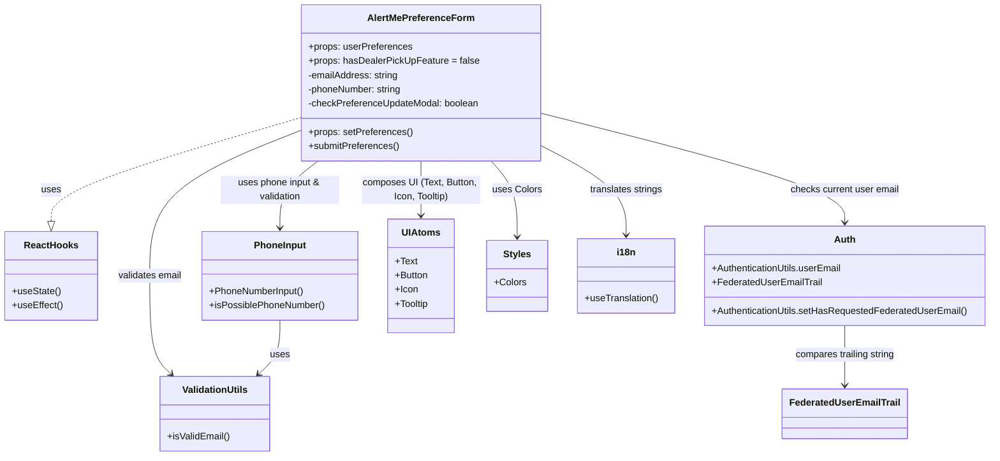

# Diagram: web/portal/src/pages/profile/components/AlertMePreferenceForm.organism.js

> Auto-generated by Obscura crawlers

## Mermaid

### SVG

<svg id="container" width="1665.5546875" xmlns="http://www.w3.org/2000/svg" class="classDiagram" height="770" viewBox="0 0 1665.5546875 770" role="graphics-document document" aria-roledescription="class"><g><defs><marker id="container_class-aggregationStart" class="marker aggregation class" refX="18" refY="7" markerWidth="190" markerHeight="240" orient="auto"><path d="M 18,7 L9,13 L1,7 L9,1 Z"></path></marker></defs><defs><marker id="container_class-aggregationEnd" class="marker aggregation class" refX="1" refY="7" markerWidth="20" markerHeight="28" orient="auto"><path d="M 18,7 L9,13 L1,7 L9,1 Z"></path></marker></defs><defs><marker id="container_class-extensionStart" class="marker extension class" refX="18" refY="7" markerWidth="190" markerHeight="240" orient="auto"><path d="M 1,7 L18,13 V 1 Z"></path></marker></defs><defs><marker id="container_class-extensionEnd" class="marker extension class" refX="1" refY="7" markerWidth="20" markerHeight="28" orient="auto"><path d="M 1,1 V 13 L18,7 Z"></path></marker></defs><defs><marker id="container_class-compositionStart" class="marker composition class" refX="18" refY="7" markerWidth="190" markerHeight="240" orient="auto"><path d="M 18,7 L9,13 L1,7 L9,1 Z"></path></marker></defs><defs><marker id="container_class-compositionEnd" class="marker composition class" refX="1" refY="7" markerWidth="20" markerHeight="28" orient="auto"><path d="M 18,7 L9,13 L1,7 L9,1 Z"></path></marker></defs><defs><marker id="container_class-dependencyStart" class="marker dependency class" refX="6" refY="7" markerWidth="190" markerHeight="240" orient="auto"><path d="M 5,7 L9,13 L1,7 L9,1 Z"></path></marker></defs><defs><marker id="container_class-dependencyEnd" class="marker dependency class" refX="13" refY="7" markerWidth="20" markerHeight="28" orient="auto"><path d="M 18,7 L9,13 L14,7 L9,1 Z"></path></marker></defs><defs><marker id="container_class-lollipopStart" class="marker lollipop class" refX="13" refY="7" markerWidth="190" markerHeight="240" orient="auto"><circle stroke="black" fill="transparent" cx="7" cy="7" r="6"></circle></marker></defs><defs><marker id="container_class-lollipopEnd" class="marker lollipop class" refX="1" refY="7" markerWidth="190" markerHeight="240" orient="auto"><circle stroke="black" fill="transparent" cx="7" cy="7" r="6"></circle></marker></defs><g class="root"><g class="clusters"></g><g class="edgePaths"><path d="M507.344,198.095L436.802,218.579C366.26,239.063,225.177,280.032,154.635,309.307C84.094,338.583,84.094,356.167,84.094,364.958L84.094,373.75" id="id_AlertMePreferenceForm_ReactHooks_1" class="edge-thickness-normal edge-pattern-dashed relation" style=";;;" data-edge="true" data-et="edge" data-id="id_AlertMePreferenceForm_ReactHooks_1" data-points="W3sieCI6NTA3LjM0Mzc1LCJ5IjoxOTguMDk0OTU2MzgyMjMyMDN9LHsieCI6ODQuMDkzNzUsInkiOjMyMX0seyJ4Ijo4NC4wOTM3NSwieSI6MzkxfV0=" marker-end="url(#container_class-extensionEnd)"></path><path d="M507.344,219.194L464.479,236.161C421.615,253.129,335.885,287.065,293.021,328.199C250.156,369.333,250.156,417.667,250.156,464C250.156,510.333,250.156,554.667,256.216,582.328C262.275,609.99,274.393,620.98,280.453,626.475L286.512,631.969" id="id_AlertMePreferenceForm_ValidationUtils_2" class="edge-thickness-normal edge-pattern-solid relation" style=";;;" data-edge="true" data-et="edge" data-id="id_AlertMePreferenceForm_ValidationUtils_2" data-points="W3sieCI6NTA3LjM0Mzc1LCJ5IjoyMTkuMTkzNjg1MDczODEwODN9LHsieCI6MjUwLjE1NjI1LCJ5IjozMjF9LHsieCI6MjUwLjE1NjI1LCJ5Ijo0NjZ9LHsieCI6MjUwLjE1NjI1LCJ5Ijo1OTl9LHsieCI6MjkwLjk1NjY5OTIxODc1MDAzLCJ5Ijo2MzZ9XQ==" marker-end="url(#container_class-dependencyEnd)"></path><path d="M534.78,272L524.1,280.167C513.42,288.333,492.06,304.667,481.379,323.5C470.699,342.333,470.699,363.667,470.699,374.333L470.699,385" id="id_AlertMePreferenceForm_PhoneInput_3" class="edge-thickness-normal edge-pattern-solid relation" style=";;;" data-edge="true" data-et="edge" data-id="id_AlertMePreferenceForm_PhoneInput_3" data-points="W3sieCI6NTM0Ljc4MDEyNzc2MjQzMSwieSI6MjcyfSx7IngiOjQ3MC42OTkyMTg3NSwieSI6MzIxfSx7IngiOjQ3MC42OTkyMTg3NSwieSI6MzkxfV0=" marker-end="url(#container_class-dependencyEnd)"></path><path d="M907.469,190.799L992.93,212.499C1078.392,234.199,1249.315,277.6,1334.777,308.467C1420.238,339.333,1420.238,357.667,1420.238,366.833L1420.238,376" id="id_AlertMePreferenceForm_Auth_4" class="edge-thickness-normal edge-pattern-solid relation" style=";;;" data-edge="true" data-et="edge" data-id="id_AlertMePreferenceForm_Auth_4" data-points="W3sieCI6OTA3LjQ2ODc1LCJ5IjoxOTAuNzk5MjIxODUzODUxfSx7IngiOjE0MjAuMjM4MjgxMjUsInkiOjMyMX0seyJ4IjoxNDIwLjIzODI4MTI1LCJ5IjozODJ9XQ==" marker-end="url(#container_class-dependencyEnd)"></path><path d="M707.406,272L707.406,280.167C707.406,288.333,707.406,304.667,707.406,320C707.406,335.333,707.406,349.667,707.406,356.833L707.406,364" id="id_AlertMePreferenceForm_UIAtoms_5" class="edge-thickness-normal edge-pattern-solid relation" style=";;;" data-edge="true" data-et="edge" data-id="id_AlertMePreferenceForm_UIAtoms_5" data-points="W3sieCI6NzA3LjQwNjI1LCJ5IjoyNzJ9LHsieCI6NzA3LjQwNjI1LCJ5IjozMjF9LHsieCI6NzA3LjQwNjI1LCJ5IjozNzB9XQ==" marker-end="url(#container_class-dependencyEnd)"></path><path d="M825.026,272L832.303,280.167C839.58,288.333,854.134,304.667,861.411,326C868.688,347.333,868.688,373.667,868.688,386.833L868.688,400" id="id_AlertMePreferenceForm_Styles_6" class="edge-thickness-normal edge-pattern-solid relation" style=";;;" data-edge="true" data-et="edge" data-id="id_AlertMePreferenceForm_Styles_6" data-points="W3sieCI6ODI1LjAyNTcyNTEzODEyMTUsInkiOjI3Mn0seyJ4Ijo4NjguNjg3NSwieSI6MzIxfSx7IngiOjg2OC42ODc1LCJ5Ijo0MDZ9XQ==" marker-end="url(#container_class-dependencyEnd)"></path><path d="M907.469,245.471L931.346,258.06C955.224,270.648,1002.979,295.824,1026.857,321.079C1050.734,346.333,1050.734,371.667,1050.734,384.333L1050.734,397" id="id_AlertMePreferenceForm_i18n_7" class="edge-thickness-normal edge-pattern-solid relation" style=";;;" data-edge="true" data-et="edge" data-id="id_AlertMePreferenceForm_i18n_7" data-points="W3sieCI6OTA3LjQ2ODc1LCJ5IjoyNDUuNDcxNDQyMjI0NTQ4M30seyJ4IjoxMDUwLjczNDM3NSwieSI6MzIxfSx7IngiOjEwNTAuNzM0Mzc1LCJ5Ijo0MDN9XQ==" marker-end="url(#container_class-dependencyEnd)"></path><path d="M470.699,541L470.699,550.667C470.699,560.333,470.699,579.667,464.64,594.828C458.581,609.99,446.462,620.98,440.403,626.475L434.343,631.969" id="id_PhoneInput_ValidationUtils_8" class="edge-thickness-normal edge-pattern-solid relation" style=";;;" data-edge="true" data-et="edge" data-id="id_PhoneInput_ValidationUtils_8" data-points="W3sieCI6NDcwLjY5OTIxODc1LCJ5Ijo1NDF9LHsieCI6NDcwLjY5OTIxODc1LCJ5Ijo1OTl9LHsieCI6NDI5Ljg5ODc2OTUzMTI0OTk3LCJ5Ijo2MzZ9XQ==" marker-end="url(#container_class-dependencyEnd)"></path><path d="M1420.238,550L1420.238,558.167C1420.238,566.333,1420.238,582.667,1420.238,599.5C1420.238,616.333,1420.238,633.667,1420.238,642.333L1420.238,651" id="id_Auth_FederatedUserEmailTrail_9" class="edge-thickness-normal edge-pattern-solid relation" style=";;;" data-edge="true" data-et="edge" data-id="id_Auth_FederatedUserEmailTrail_9" data-points="W3sieCI6MTQyMC4yMzgyODEyNSwieSI6NTUwfSx7IngiOjE0MjAuMjM4MjgxMjUsInkiOjU5OX0seyJ4IjoxNDIwLjIzODI4MTI1LCJ5Ijo2NTd9XQ==" marker-end="url(#container_class-dependencyEnd)"></path></g><g class="edgeLabels"><g class="edgeLabel" transform="translate(84.09375, 321)"><g class="label" data-id="id_AlertMePreferenceForm_ReactHooks_1" transform="translate(-16.4921875, -12)"><foreignObject width="32.984375" height="24">

uses

</foreignObject></g></g><g class="edgeLabel" transform="translate(250.15625, 466)"><g class="label" data-id="id_AlertMePreferenceForm_ValidationUtils_2" transform="translate(-54.96875, -12)"><foreignObject width="109.9375" height="24">

validates email

</foreignObject></g></g><g class="edgeLabel" transform="translate(470.69921875, 321)"><g class="label" data-id="id_AlertMePreferenceForm_PhoneInput_3" transform="translate(-100, -24)"><foreignObject width="200" height="48">

uses phone input &amp; validation

</foreignObject></g></g><g class="edgeLabel" transform="translate(1420.23828125, 321)"><g class="label" data-id="id_AlertMePreferenceForm_Auth_4" transform="translate(-93.1328125, -12)"><foreignObject width="186.265625" height="24">

checks current user email

</foreignObject></g></g><g class="edgeLabel" transform="translate(707.40625, 321)"><g class="label" data-id="id_AlertMePreferenceForm_UIAtoms_5" transform="translate(-100, -24)"><foreignObject width="200" height="48">

composes UI (Text, Button, Icon, Tooltip)

</foreignObject></g></g><g class="edgeLabel" transform="translate(868.6875, 321)"><g class="label" data-id="id_AlertMePreferenceForm_Styles_6" transform="translate(-41.28125, -12)"><foreignObject width="82.5625" height="24">

uses Colors

</foreignObject></g></g><g class="edgeLabel" transform="translate(1050.734375, 321)"><g class="label" data-id="id_AlertMePreferenceForm_i18n_7" transform="translate(-62.609375, -12)"><foreignObject width="125.21875" height="24">

translates strings

</foreignObject></g></g><g class="edgeLabel" transform="translate(470.69921875, 599)"><g class="label" data-id="id_PhoneInput_ValidationUtils_8" transform="translate(-16.4921875, -12)"><foreignObject width="32.984375" height="24">

uses

</foreignObject></g></g><g class="edgeLabel" transform="translate(1420.23828125, 599)"><g class="label" data-id="id_Auth_FederatedUserEmailTrail_9" transform="translate(-85.96875, -12)"><foreignObject width="171.9375" height="24">

compares trailing string

</foreignObject></g></g></g><g class="nodes"><g class="node default" id="classId-AlertMePreferenceForm-0" transform="translate(707.40625, 140)"><g class="basic label-container"><path d="M-200.0625 -132 L200.0625 -132 L200.0625 132 L-200.0625 132" stroke="none" stroke-width="0" fill="#ECECFF" style=""></path><path d="M-200.0625 -132 C-104.07805134478491 -132, -8.09360268956982 -132, 200.0625 -132 M-200.0625 -132 C-47.53516636997756 -132, 104.99216726004488 -132, 200.0625 -132 M200.0625 -132 C200.0625 -42.37326558606469, 200.0625 47.25346882787062, 200.0625 132 M200.0625 -132 C200.0625 -60.82836187003069, 200.0625 10.34327625993862, 200.0625 132 M200.0625 132 C47.566913830503864 132, -104.92867233899227 132, -200.0625 132 M200.0625 132 C40.18185610292849 132, -119.69878779414302 132, -200.0625 132 M-200.0625 132 C-200.0625 34.12513185809716, -200.0625 -63.749736283805674, -200.0625 -132 M-200.0625 132 C-200.0625 63.01890376929846, -200.0625 -5.9621924614030775, -200.0625 -132" stroke="#9370DB" stroke-width="1.3" fill="none" stroke-dasharray="0 0" style=""></path></g><g class="annotation-group text" transform="translate(0, -108)"></g><g class="label-group text" transform="translate(-86.03125, -108)"><g class="label" style="font-weight: bolder" transform="translate(0,-12)"><foreignObject width="172.0625" height="24">

AlertMePreferenceForm

</foreignObject></g></g><g class="members-group text" transform="translate(-188.0625, -60)"><g class="label" style="" transform="translate(0,-12)"><foreignObject width="173.890625" height="24">

+props: userPreferences

</foreignObject></g><g class="label" style="" transform="translate(0,12)"><foreignObject width="284.609375" height="24">

+props: hasDealerPickUpFeature = false

</foreignObject></g><g class="label" style="" transform="translate(0,36)"><foreignObject width="154.015625" height="24">

-emailAddress: string

</foreignObject></g><g class="label" style="" transform="translate(0,60)"><foreignObject width="161" height="24">

-phoneNumber: string

</foreignObject></g><g class="label" style="" transform="translate(0,84)"><foreignObject width="290.09375" height="24">

-checkPreferenceUpdateModal: boolean

</foreignObject></g></g><g class="methods-group text" transform="translate(-188.0625, 84)"><g class="label" style="" transform="translate(0,-12)"><foreignObject width="174.546875" height="24">

+props: setPreferences()

</foreignObject></g><g class="label" style="" transform="translate(0,12)"><foreignObject width="153.265625" height="24">

+submitPreferences()

</foreignObject></g></g><g class="divider" style=""><path d="M-200.0625 -84 C-62.47698489511379 -84, 75.10853020977243 -84, 200.0625 -84 M-200.0625 -84 C-111.71382610112494 -84, -23.365152202249874 -84, 200.0625 -84" stroke="#9370DB" stroke-width="1.3" fill="none" stroke-dasharray="0 0" style=""></path></g><g class="divider" style=""><path d="M-200.0625 60 C-94.64975621779904 60, 10.762987564401925 60, 200.0625 60 M-200.0625 60 C-72.13509297409935 60, 55.7923140518013 60, 200.0625 60" stroke="#9370DB" stroke-width="1.3" fill="none" stroke-dasharray="0 0" style=""></path></g></g><g class="node default" id="classId-ReactHooks-1" transform="translate(84.09375, 466)"><g class="basic label-container"><path d="M-76.09375 -75 L76.09375 -75 L76.09375 75 L-76.09375 75" stroke="none" stroke-width="0" fill="#ECECFF" style=""></path><path d="M-76.09375 -75 C-33.70851681121354 -75, 8.676716377572916 -75, 76.09375 -75 M-76.09375 -75 C-16.30956679418349 -75, 43.47461641163302 -75, 76.09375 -75 M76.09375 -75 C76.09375 -28.492728526544482, 76.09375 18.014542946911035, 76.09375 75 M76.09375 -75 C76.09375 -18.277959335149575, 76.09375 38.44408132970085, 76.09375 75 M76.09375 75 C21.348825639369153 75, -33.396098721261694 75, -76.09375 75 M76.09375 75 C35.838135030725915 75, -4.417479938548169 75, -76.09375 75 M-76.09375 75 C-76.09375 41.731646658394034, -76.09375 8.463293316788068, -76.09375 -75 M-76.09375 75 C-76.09375 32.855611165930235, -76.09375 -9.28877766813953, -76.09375 -75" stroke="#9370DB" stroke-width="1.3" fill="none" stroke-dasharray="0 0" style=""></path></g><g class="annotation-group text" transform="translate(0, -51)"></g><g class="label-group text" transform="translate(-43.375, -51)"><g class="label" style="font-weight: bolder" transform="translate(0,-12)"><foreignObject width="86.75" height="24">

ReactHooks

</foreignObject></g></g><g class="members-group text" transform="translate(-64.09375, -3)"></g><g class="methods-group text" transform="translate(-64.09375, 27)"><g class="label" style="" transform="translate(0,-12)"><foreignObject width="81.203125" height="24">

+useState()

</foreignObject></g><g class="label" style="" transform="translate(0,12)"><foreignObject width="84.8125" height="24">

+useEffect()

</foreignObject></g></g><g class="divider" style=""><path d="M-76.09375 -27 C-25.849458717028313 -27, 24.394832565943375 -27, 76.09375 -27 M-76.09375 -27 C-20.801128823959154 -27, 34.49149235208169 -27, 76.09375 -27" stroke="#9370DB" stroke-width="1.3" fill="none" stroke-dasharray="0 0" style=""></path></g><g class="divider" style=""><path d="M-76.09375 -3 C-36.19527813929374 -3, 3.703193721412518 -3, 76.09375 -3 M-76.09375 -3 C-28.83882671296155 -3, 18.416096574076903 -3, 76.09375 -3" stroke="#9370DB" stroke-width="1.3" fill="none" stroke-dasharray="0 0" style=""></path></g></g><g class="node default" id="classId-ValidationUtils-2" transform="translate(360.427734375, 699)"><g class="basic label-container"><path d="M-91.85546875 -63 L91.85546875 -63 L91.85546875 63 L-91.85546875 63" stroke="none" stroke-width="0" fill="#ECECFF" style=""></path><path d="M-91.85546875 -63 C-43.149333958817536 -63, 5.556800832364928 -63, 91.85546875 -63 M-91.85546875 -63 C-51.88812844608907 -63, -11.92078814217814 -63, 91.85546875 -63 M91.85546875 -63 C91.85546875 -31.304631862952423, 91.85546875 0.3907362740951541, 91.85546875 63 M91.85546875 -63 C91.85546875 -36.727501047869154, 91.85546875 -10.455002095738301, 91.85546875 63 M91.85546875 63 C51.315024670170246 63, 10.774580590340491 63, -91.85546875 63 M91.85546875 63 C23.318097013779393 63, -45.21927472244121 63, -91.85546875 63 M-91.85546875 63 C-91.85546875 19.324059895959465, -91.85546875 -24.35188020808107, -91.85546875 -63 M-91.85546875 63 C-91.85546875 19.62641202343481, -91.85546875 -23.74717595313038, -91.85546875 -63" stroke="#9370DB" stroke-width="1.3" fill="none" stroke-dasharray="0 0" style=""></path></g><g class="annotation-group text" transform="translate(0, -39)"></g><g class="label-group text" transform="translate(-53.7890625, -39)"><g class="label" style="font-weight: bolder" transform="translate(0,-12)"><foreignObject width="107.578125" height="24">

ValidationUtils

</foreignObject></g></g><g class="members-group text" transform="translate(-79.85546875, 9)"></g><g class="methods-group text" transform="translate(-79.85546875, 39)"><g class="label" style="" transform="translate(0,-12)"><foreignObject width="105.921875" height="24">

+isValidEmail()

</foreignObject></g></g><g class="divider" style=""><path d="M-91.85546875 -15 C-48.00120219427046 -15, -4.146935638540924 -15, 91.85546875 -15 M-91.85546875 -15 C-53.25309007619759 -15, -14.650711402395174 -15, 91.85546875 -15" stroke="#9370DB" stroke-width="1.3" fill="none" stroke-dasharray="0 0" style=""></path></g><g class="divider" style=""><path d="M-91.85546875 9 C-41.73136605157394 9, 8.392736646852114 9, 91.85546875 9 M-91.85546875 9 C-42.4051053758542 9, 7.0452579982916035 9, 91.85546875 9" stroke="#9370DB" stroke-width="1.3" fill="none" stroke-dasharray="0 0" style=""></path></g></g><g class="node default" id="classId-PhoneInput-3" transform="translate(470.69921875, 466)"><g class="basic label-container"><path d="M-130.57421875 -75 L130.57421875 -75 L130.57421875 75 L-130.57421875 75" stroke="none" stroke-width="0" fill="#ECECFF" style=""></path><path d="M-130.57421875 -75 C-74.1635228701106 -75, -17.752826990221195 -75, 130.57421875 -75 M-130.57421875 -75 C-75.36913091723238 -75, -20.164043084464765 -75, 130.57421875 -75 M130.57421875 -75 C130.57421875 -16.087255024392903, 130.57421875 42.825489951214195, 130.57421875 75 M130.57421875 -75 C130.57421875 -37.764521861563544, 130.57421875 -0.5290437231270886, 130.57421875 75 M130.57421875 75 C76.47940783141752 75, 22.384596912835022 75, -130.57421875 75 M130.57421875 75 C65.4743952119931 75, 0.3745716739861962 75, -130.57421875 75 M-130.57421875 75 C-130.57421875 15.866890422868394, -130.57421875 -43.26621915426321, -130.57421875 -75 M-130.57421875 75 C-130.57421875 21.963322954307266, -130.57421875 -31.073354091385468, -130.57421875 -75" stroke="#9370DB" stroke-width="1.3" fill="none" stroke-dasharray="0 0" style=""></path></g><g class="annotation-group text" transform="translate(0, -51)"></g><g class="label-group text" transform="translate(-42.3671875, -51)"><g class="label" style="font-weight: bolder" transform="translate(0,-12)"><foreignObject width="84.734375" height="24">

PhoneInput

</foreignObject></g></g><g class="members-group text" transform="translate(-118.57421875, -3)"></g><g class="methods-group text" transform="translate(-118.57421875, 27)"><g class="label" style="" transform="translate(0,-12)"><foreignObject width="161.1875" height="24">

+PhoneNumberInput()

</foreignObject></g><g class="label" style="" transform="translate(0,12)"><foreignObject width="194.78125" height="24">

+isPossiblePhoneNumber()

</foreignObject></g></g><g class="divider" style=""><path d="M-130.57421875 -27 C-35.811638140844096 -27, 58.95094246831181 -27, 130.57421875 -27 M-130.57421875 -27 C-36.667701762134286 -27, 57.23881522573143 -27, 130.57421875 -27" stroke="#9370DB" stroke-width="1.3" fill="none" stroke-dasharray="0 0" style=""></path></g><g class="divider" style=""><path d="M-130.57421875 -3 C-47.51526342562882 -3, 35.54369189874237 -3, 130.57421875 -3 M-130.57421875 -3 C-34.54559435280051 -3, 61.48303004439899 -3, 130.57421875 -3" stroke="#9370DB" stroke-width="1.3" fill="none" stroke-dasharray="0 0" style=""></path></g></g><g class="node default" id="classId-Auth-4" transform="translate(1420.23828125, 466)"><g class="basic label-container"><path d="M-237.31640625 -84 L237.31640625 -84 L237.31640625 84 L-237.31640625 84" stroke="none" stroke-width="0" fill="#ECECFF" style=""></path><path d="M-237.31640625 -84 C-141.3065094376127 -84, -45.29661262522541 -84, 237.31640625 -84 M-237.31640625 -84 C-110.8724326330211 -84, 15.571540983957789 -84, 237.31640625 -84 M237.31640625 -84 C237.31640625 -17.80955786331006, 237.31640625 48.38088427337988, 237.31640625 84 M237.31640625 -84 C237.31640625 -48.367174263204205, 237.31640625 -12.73434852640841, 237.31640625 84 M237.31640625 84 C73.09008796058669 84, -91.13623032882663 84, -237.31640625 84 M237.31640625 84 C72.00079260413662 84, -93.31482104172676 84, -237.31640625 84 M-237.31640625 84 C-237.31640625 37.896559614225, -237.31640625 -8.206880771550004, -237.31640625 -84 M-237.31640625 84 C-237.31640625 24.40266355872577, -237.31640625 -35.19467288254846, -237.31640625 -84" stroke="#9370DB" stroke-width="1.3" fill="none" stroke-dasharray="0 0" style=""></path></g><g class="annotation-group text" transform="translate(0, -60)"></g><g class="label-group text" transform="translate(-17.0078125, -60)"><g class="label" style="font-weight: bolder" transform="translate(0,-12)"><foreignObject width="34.015625" height="24">

Auth

</foreignObject></g></g><g class="members-group text" transform="translate(-225.31640625, -12)"><g class="label" style="" transform="translate(0,-12)"><foreignObject width="223.46875" height="24">

+AuthenticationUtils.userEmail

</foreignObject></g><g class="label" style="" transform="translate(0,12)"><foreignObject width="184.640625" height="24">

+FederatedUserEmailTrail

</foreignObject></g></g><g class="methods-group text" transform="translate(-225.31640625, 60)"><g class="label" style="" transform="translate(0,-12)"><foreignObject width="433.625" height="24">

+AuthenticationUtils.setHasRequestedFederatedUserEmail()

</foreignObject></g></g><g class="divider" style=""><path d="M-237.31640625 -36 C-126.12241978300406 -36, -14.928433316008125 -36, 237.31640625 -36 M-237.31640625 -36 C-78.89585743788388 -36, 79.52469137423225 -36, 237.31640625 -36" stroke="#9370DB" stroke-width="1.3" fill="none" stroke-dasharray="0 0" style=""></path></g><g class="divider" style=""><path d="M-237.31640625 36 C-120.82360201594572 36, -4.330797781891448 36, 237.31640625 36 M-237.31640625 36 C-62.552199939721135 36, 112.21200637055773 36, 237.31640625 36" stroke="#9370DB" stroke-width="1.3" fill="none" stroke-dasharray="0 0" style=""></path></g></g><g class="node default" id="classId-UIAtoms-5" transform="translate(707.40625, 466)"><g class="basic label-container"><path d="M-56.1328125 -96 L56.1328125 -96 L56.1328125 96 L-56.1328125 96" stroke="none" stroke-width="0" fill="#ECECFF" style=""></path><path d="M-56.1328125 -96 C-20.43073211743699 -96, 15.271348265126022 -96, 56.1328125 -96 M-56.1328125 -96 C-14.079744034477208 -96, 27.973324431045583 -96, 56.1328125 -96 M56.1328125 -96 C56.1328125 -19.91457426360546, 56.1328125 56.17085147278908, 56.1328125 96 M56.1328125 -96 C56.1328125 -34.38973233695573, 56.1328125 27.220535326088537, 56.1328125 96 M56.1328125 96 C15.108804736682124 96, -25.91520302663575 96, -56.1328125 96 M56.1328125 96 C19.119512060864793 96, -17.893788378270415 96, -56.1328125 96 M-56.1328125 96 C-56.1328125 19.277577204724025, -56.1328125 -57.44484559055195, -56.1328125 -96 M-56.1328125 96 C-56.1328125 56.412029547612086, -56.1328125 16.82405909522417, -56.1328125 -96" stroke="#9370DB" stroke-width="1.3" fill="none" stroke-dasharray="0 0" style=""></path></g><g class="annotation-group text" transform="translate(0, -72)"></g><g class="label-group text" transform="translate(-30.515625, -72)"><g class="label" style="font-weight: bolder" transform="translate(0,-12)"><foreignObject width="61.03125" height="24">

UIAtoms

</foreignObject></g></g><g class="members-group text" transform="translate(-44.1328125, -24)"><g class="label" style="" transform="translate(0,-12)"><foreignObject width="36.703125" height="24">

+Text

</foreignObject></g><g class="label" style="" transform="translate(0,12)"><foreignObject width="57.0625" height="24">

+Button

</foreignObject></g><g class="label" style="" transform="translate(0,36)"><foreignObject width="38.765625" height="24">

+Icon

</foreignObject></g><g class="label" style="" transform="translate(0,60)"><foreignObject width="57.75" height="24">

+Tooltip

</foreignObject></g></g><g class="methods-group text" transform="translate(-44.1328125, 96)"></g><g class="divider" style=""><path d="M-56.1328125 -48 C-19.92769434093173 -48, 16.27742381813654 -48, 56.1328125 -48 M-56.1328125 -48 C-15.042397052714918 -48, 26.048018394570164 -48, 56.1328125 -48" stroke="#9370DB" stroke-width="1.3" fill="none" stroke-dasharray="0 0" style=""></path></g><g class="divider" style=""><path d="M-56.1328125 72 C-23.77944536915117 72, 8.573921761697662 72, 56.1328125 72 M-56.1328125 72 C-11.854410930659775 72, 32.42399063868045 72, 56.1328125 72" stroke="#9370DB" stroke-width="1.3" fill="none" stroke-dasharray="0 0" style=""></path></g></g><g class="node default" id="classId-Styles-6" transform="translate(868.6875, 466)"><g class="basic label-container"><path d="M-49.859375 -60 L49.859375 -60 L49.859375 60 L-49.859375 60" stroke="none" stroke-width="0" fill="#ECECFF" style=""></path><path d="M-49.859375 -60 C-17.45269845687457 -60, 14.953978086250856 -60, 49.859375 -60 M-49.859375 -60 C-28.851808869377916 -60, -7.844242738755831 -60, 49.859375 -60 M49.859375 -60 C49.859375 -33.84433032952708, 49.859375 -7.688660659054165, 49.859375 60 M49.859375 -60 C49.859375 -16.982249241689118, 49.859375 26.035501516621764, 49.859375 60 M49.859375 60 C25.12837958877267 60, 0.39738417754534083 60, -49.859375 60 M49.859375 60 C25.72865214263427 60, 1.5979292852685418 60, -49.859375 60 M-49.859375 60 C-49.859375 27.51616820254536, -49.859375 -4.967663594909283, -49.859375 -60 M-49.859375 60 C-49.859375 26.912129819344322, -49.859375 -6.175740361311355, -49.859375 -60" stroke="#9370DB" stroke-width="1.3" fill="none" stroke-dasharray="0 0" style=""></path></g><g class="annotation-group text" transform="translate(0, -36)"></g><g class="label-group text" transform="translate(-22.390625, -36)"><g class="label" style="font-weight: bolder" transform="translate(0,-12)"><foreignObject width="44.78125" height="24">

Styles

</foreignObject></g></g><g class="members-group text" transform="translate(-37.859375, 12)"><g class="label" style="" transform="translate(0,-12)"><foreignObject width="53.328125" height="24">

+Colors

</foreignObject></g></g><g class="methods-group text" transform="translate(-37.859375, 60)"></g><g class="divider" style=""><path d="M-49.859375 -12 C-21.09804917538114 -12, 7.663276649237723 -12, 49.859375 -12 M-49.859375 -12 C-14.561508038017081 -12, 20.736358923965838 -12, 49.859375 -12" stroke="#9370DB" stroke-width="1.3" fill="none" stroke-dasharray="0 0" style=""></path></g><g class="divider" style=""><path d="M-49.859375 36 C-28.429853802403212 36, -7.000332604806424 36, 49.859375 36 M-49.859375 36 C-22.432431222051516 36, 4.994512555896968 36, 49.859375 36" stroke="#9370DB" stroke-width="1.3" fill="none" stroke-dasharray="0 0" style=""></path></g></g><g class="node default" id="classId-i18n-7" transform="translate(1050.734375, 466)"><g class="basic label-container"><path d="M-82.1875 -63 L82.1875 -63 L82.1875 63 L-82.1875 63" stroke="none" stroke-width="0" fill="#ECECFF" style=""></path><path d="M-82.1875 -63 C-27.45092406345146 -63, 27.28565187309708 -63, 82.1875 -63 M-82.1875 -63 C-33.171038214204174 -63, 15.845423571591652 -63, 82.1875 -63 M82.1875 -63 C82.1875 -18.942434162246435, 82.1875 25.11513167550713, 82.1875 63 M82.1875 -63 C82.1875 -37.418514260175954, 82.1875 -11.8370285203519, 82.1875 63 M82.1875 63 C16.491602169078917 63, -49.20429566184217 63, -82.1875 63 M82.1875 63 C40.68467678411663 63, -0.8181464317667348 63, -82.1875 63 M-82.1875 63 C-82.1875 26.545829720363088, -82.1875 -9.908340559273825, -82.1875 -63 M-82.1875 63 C-82.1875 20.961715557152537, -82.1875 -21.076568885694925, -82.1875 -63" stroke="#9370DB" stroke-width="1.3" fill="none" stroke-dasharray="0 0" style=""></path></g><g class="annotation-group text" transform="translate(0, -39)"></g><g class="label-group text" transform="translate(-15.234375, -39)"><g class="label" style="font-weight: bolder" transform="translate(0,-12)"><foreignObject width="30.46875" height="24">

i18n

</foreignObject></g></g><g class="members-group text" transform="translate(-70.1875, 9)"></g><g class="methods-group text" transform="translate(-70.1875, 39)"><g class="label" style="" transform="translate(0,-12)"><foreignObject width="125.140625" height="24">

+useTranslation()

</foreignObject></g></g><g class="divider" style=""><path d="M-82.1875 -15 C-25.48599652711418 -15, 31.215506945771637 -15, 82.1875 -15 M-82.1875 -15 C-39.21196458231295 -15, 3.7635708353740966 -15, 82.1875 -15" stroke="#9370DB" stroke-width="1.3" fill="none" stroke-dasharray="0 0" style=""></path></g><g class="divider" style=""><path d="M-82.1875 9 C-21.336670989180483 9, 39.514158021639034 9, 82.1875 9 M-82.1875 9 C-39.604307120827826 9, 2.9788857583443473 9, 82.1875 9" stroke="#9370DB" stroke-width="1.3" fill="none" stroke-dasharray="0 0" style=""></path></g></g><g class="node default" id="classId-FederatedUserEmailTrail-8" transform="translate(1420.23828125, 699)"><g class="basic label-container"><path d="M-101.3046875 -42 L101.3046875 -42 L101.3046875 42 L-101.3046875 42" stroke="none" stroke-width="0" fill="#ECECFF" style=""></path><path d="M-101.3046875 -42 C-48.670482897926036 -42, 3.963721704147929 -42, 101.3046875 -42 M-101.3046875 -42 C-34.43025973585799 -42, 32.444168028284025 -42, 101.3046875 -42 M101.3046875 -42 C101.3046875 -10.147688335131416, 101.3046875 21.704623329737167, 101.3046875 42 M101.3046875 -42 C101.3046875 -17.97913253560355, 101.3046875 6.0417349287928985, 101.3046875 42 M101.3046875 42 C59.424483363468816 42, 17.544279226937633 42, -101.3046875 42 M101.3046875 42 C24.897676044738176 42, -51.50933541052365 42, -101.3046875 42 M-101.3046875 42 C-101.3046875 20.617019489887657, -101.3046875 -0.7659610202246867, -101.3046875 -42 M-101.3046875 42 C-101.3046875 14.52990287307205, -101.3046875 -12.9401942538559, -101.3046875 -42" stroke="#9370DB" stroke-width="1.3" fill="none" stroke-dasharray="0 0" style=""></path></g><g class="annotation-group text" transform="translate(0, -18)"></g><g class="label-group text" transform="translate(-89.3046875, -18)"><g class="label" style="font-weight: bolder" transform="translate(0,-12)"><foreignObject width="178.609375" height="24">

FederatedUserEmailTrail

</foreignObject></g></g><g class="members-group text" transform="translate(-89.3046875, 30)"></g><g class="methods-group text" transform="translate(-89.3046875, 60)"></g><g class="divider" style=""><path d="M-101.3046875 6 C-20.65316329231713 6, 59.99836091536574 6, 101.3046875 6 M-101.3046875 6 C-27.072958971661663 6, 47.158769556676674 6, 101.3046875 6" stroke="#9370DB" stroke-width="1.3" fill="none" stroke-dasharray="0 0" style=""></path></g><g class="divider" style=""><path d="M-101.3046875 24 C-54.38766718893652 24, -7.470646877873037 24, 101.3046875 24 M-101.3046875 24 C-46.07787285416311 24, 9.148941791673778 24, 101.3046875 24" stroke="#9370DB" stroke-width="1.3" fill="none" stroke-dasharray="0 0" style=""></path></g></g></g></g></g></svg>
