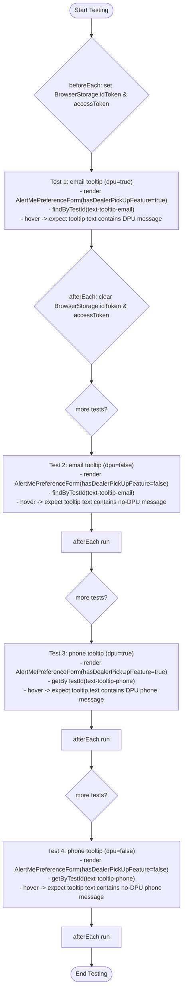

# Diagram: web/portal/src/pages/profile/tests/AlertMePreferenceForm.organism.test.tsx

> Auto-generated by Obscura crawlers

## Mermaid

### SVG

<svg id="container" width="502.59375" xmlns="http://www.w3.org/2000/svg" class="flowchart" height="2426.6875" viewBox="0 0 502.59375 2426.6875" role="graphics-document document" aria-roledescription="flowchart-v2"><g><marker id="container_flowchart-v2-pointEnd" class="marker flowchart-v2" viewBox="0 0 10 10" refX="5" refY="5" markerUnits="userSpaceOnUse" markerWidth="8" markerHeight="8" orient="auto"><path d="M 0 0 L 10 5 L 0 10 z" class="arrowMarkerPath" style="stroke-width: 1; stroke-dasharray: 1, 0;"></path></marker><marker id="container_flowchart-v2-pointStart" class="marker flowchart-v2" viewBox="0 0 10 10" refX="4.5" refY="5" markerUnits="userSpaceOnUse" markerWidth="8" markerHeight="8" orient="auto"><path d="M 0 5 L 10 10 L 10 0 z" class="arrowMarkerPath" style="stroke-width: 1; stroke-dasharray: 1, 0;"></path></marker><marker id="container_flowchart-v2-circleEnd" class="marker flowchart-v2" viewBox="0 0 10 10" refX="11" refY="5" markerUnits="userSpaceOnUse" markerWidth="11" markerHeight="11" orient="auto"><circle cx="5" cy="5" r="5" class="arrowMarkerPath" style="stroke-width: 1; stroke-dasharray: 1, 0;"></circle></marker><marker id="container_flowchart-v2-circleStart" class="marker flowchart-v2" viewBox="0 0 10 10" refX="-1" refY="5" markerUnits="userSpaceOnUse" markerWidth="11" markerHeight="11" orient="auto"><circle cx="5" cy="5" r="5" class="arrowMarkerPath" style="stroke-width: 1; stroke-dasharray: 1, 0;"></circle></marker><marker id="container_flowchart-v2-crossEnd" class="marker cross flowchart-v2" viewBox="0 0 11 11" refX="12" refY="5.2" markerUnits="userSpaceOnUse" markerWidth="11" markerHeight="11" orient="auto"><path d="M 1,1 l 9,9 M 10,1 l -9,9" class="arrowMarkerPath" style="stroke-width: 2; stroke-dasharray: 1, 0;"></path></marker><marker id="container_flowchart-v2-crossStart" class="marker cross flowchart-v2" viewBox="0 0 11 11" refX="-1" refY="5.2" markerUnits="userSpaceOnUse" markerWidth="11" markerHeight="11" orient="auto"><path d="M 1,1 l 9,9 M 10,1 l -9,9" class="arrowMarkerPath" style="stroke-width: 2; stroke-dasharray: 1, 0;"></path></marker><g class="root"><g class="clusters"></g><g class="edgePaths"><path d="M251.797,47.5L251.714,51.583C251.63,55.667,251.464,63.833,251.38,71.417C251.297,79,251.297,86,251.297,89.5L251.297,93" id="L_Start_Setup_0" class="edge-thickness-normal edge-pattern-solid edge-thickness-normal edge-pattern-solid flowchart-link" style=";" data-edge="true" data-et="edge" data-id="L_Start_Setup_0" data-points="W3sieCI6MjUxLjc5Njg3NSwieSI6NDcuNX0seyJ4IjoyNTEuMjk2ODc1LCJ5Ijo3Mn0seyJ4IjoyNTEuMjk2ODc1LCJ5Ijo5N31d" marker-end="url(#container_flowchart-v2-pointEnd)"></path><path d="M251.297,399L251.297,403.167C251.297,407.333,251.297,415.667,251.297,423.333C251.297,431,251.297,438,251.297,441.5L251.297,445" id="L_Setup_T1_0" class="edge-thickness-normal edge-pattern-solid edge-thickness-normal edge-pattern-solid flowchart-link" style=";" data-edge="true" data-et="edge" data-id="L_Setup_T1_0" data-points="W3sieCI6MjUxLjI5Njg3NSwieSI6Mzk5fSx7IngiOjI1MS4yOTY4NzUsInkiOjQyNH0seyJ4IjoyNTEuMjk2ODc1LCJ5Ijo0NDl9XQ==" marker-end="url(#container_flowchart-v2-pointEnd)"></path><path d="M251.297,575L251.297,579.167C251.297,583.333,251.297,591.667,251.297,599.333C251.297,607,251.297,614,251.297,617.5L251.297,621" id="L_T1_Teardown_0" class="edge-thickness-normal edge-pattern-solid edge-thickness-normal edge-pattern-solid flowchart-link" style=";" data-edge="true" data-et="edge" data-id="L_T1_Teardown_0" data-points="W3sieCI6MjUxLjI5Njg3NSwieSI6NTc1fSx7IngiOjI1MS4yOTY4NzUsInkiOjYwMH0seyJ4IjoyNTEuMjk2ODc1LCJ5Ijo2MjV9XQ==" marker-end="url(#container_flowchart-v2-pointEnd)"></path><path d="M251.297,927L251.297,931.167C251.297,935.333,251.297,943.667,251.297,951.333C251.297,959,251.297,966,251.297,969.5L251.297,973" id="L_Teardown_Setup2_0" class="edge-thickness-normal edge-pattern-solid edge-thickness-normal edge-pattern-solid flowchart-link" style=";" data-edge="true" data-et="edge" data-id="L_Teardown_Setup2_0" data-points="W3sieCI6MjUxLjI5Njg3NSwieSI6OTI3fSx7IngiOjI1MS4yOTY4NzUsInkiOjk1Mn0seyJ4IjoyNTEuMjk2ODc1LCJ5Ijo5Nzd9XQ==" marker-end="url(#container_flowchart-v2-pointEnd)"></path><path d="M251.297,1114.563L251.297,1118.729C251.297,1122.896,251.297,1131.229,251.297,1138.896C251.297,1146.563,251.297,1153.563,251.297,1157.063L251.297,1160.563" id="L_Setup2_T2_0" class="edge-thickness-normal edge-pattern-solid edge-thickness-normal edge-pattern-solid flowchart-link" style=";" data-edge="true" data-et="edge" data-id="L_Setup2_T2_0" data-points="W3sieCI6MjUxLjI5Njg3NSwieSI6MTExNC41NjI1fSx7IngiOjI1MS4yOTY4NzUsInkiOjExMzkuNTYyNX0seyJ4IjoyNTEuMjk2ODc1LCJ5IjoxMTY0LjU2MjV9XQ==" marker-end="url(#container_flowchart-v2-pointEnd)"></path><path d="M251.297,1290.563L251.297,1294.729C251.297,1298.896,251.297,1307.229,251.297,1314.896C251.297,1322.563,251.297,1329.563,251.297,1333.063L251.297,1336.563" id="L_T2_Teardown2_0" class="edge-thickness-normal edge-pattern-solid edge-thickness-normal edge-pattern-solid flowchart-link" style=";" data-edge="true" data-et="edge" data-id="L_T2_Teardown2_0" data-points="W3sieCI6MjUxLjI5Njg3NSwieSI6MTI5MC41NjI1fSx7IngiOjI1MS4yOTY4NzUsInkiOjEzMTUuNTYyNX0seyJ4IjoyNTEuMjk2ODc1LCJ5IjoxMzQwLjU2MjV9XQ==" marker-end="url(#container_flowchart-v2-pointEnd)"></path><path d="M251.297,1394.563L251.297,1398.729C251.297,1402.896,251.297,1411.229,251.297,1418.896C251.297,1426.563,251.297,1433.563,251.297,1437.063L251.297,1440.563" id="L_Teardown2_Setup3_0" class="edge-thickness-normal edge-pattern-solid edge-thickness-normal edge-pattern-solid flowchart-link" style=";" data-edge="true" data-et="edge" data-id="L_Teardown2_Setup3_0" data-points="W3sieCI6MjUxLjI5Njg3NSwieSI6MTM5NC41NjI1fSx7IngiOjI1MS4yOTY4NzUsInkiOjE0MTkuNTYyNX0seyJ4IjoyNTEuMjk2ODc1LCJ5IjoxNDQ0LjU2MjV9XQ==" marker-end="url(#container_flowchart-v2-pointEnd)"></path><path d="M251.297,1582.125L251.297,1586.292C251.297,1590.458,251.297,1598.792,251.297,1606.458C251.297,1614.125,251.297,1621.125,251.297,1624.625L251.297,1628.125" id="L_Setup3_T3_0" class="edge-thickness-normal edge-pattern-solid edge-thickness-normal edge-pattern-solid flowchart-link" style=";" data-edge="true" data-et="edge" data-id="L_Setup3_T3_0" data-points="W3sieCI6MjUxLjI5Njg3NSwieSI6MTU4Mi4xMjV9LHsieCI6MjUxLjI5Njg3NSwieSI6MTYwNy4xMjV9LHsieCI6MjUxLjI5Njg3NSwieSI6MTYzMi4xMjV9XQ==" marker-end="url(#container_flowchart-v2-pointEnd)"></path><path d="M251.297,1758.125L251.297,1762.292C251.297,1766.458,251.297,1774.792,251.297,1782.458C251.297,1790.125,251.297,1797.125,251.297,1800.625L251.297,1804.125" id="L_T3_Teardown3_0" class="edge-thickness-normal edge-pattern-solid edge-thickness-normal edge-pattern-solid flowchart-link" style=";" data-edge="true" data-et="edge" data-id="L_T3_Teardown3_0" data-points="W3sieCI6MjUxLjI5Njg3NSwieSI6MTc1OC4xMjV9LHsieCI6MjUxLjI5Njg3NSwieSI6MTc4My4xMjV9LHsieCI6MjUxLjI5Njg3NSwieSI6MTgwOC4xMjV9XQ==" marker-end="url(#container_flowchart-v2-pointEnd)"></path><path d="M251.297,1862.125L251.297,1866.292C251.297,1870.458,251.297,1878.792,251.297,1886.458C251.297,1894.125,251.297,1901.125,251.297,1904.625L251.297,1908.125" id="L_Teardown3_Setup4_0" class="edge-thickness-normal edge-pattern-solid edge-thickness-normal edge-pattern-solid flowchart-link" style=";" data-edge="true" data-et="edge" data-id="L_Teardown3_Setup4_0" data-points="W3sieCI6MjUxLjI5Njg3NSwieSI6MTg2Mi4xMjV9LHsieCI6MjUxLjI5Njg3NSwieSI6MTg4Ny4xMjV9LHsieCI6MjUxLjI5Njg3NSwieSI6MTkxMi4xMjV9XQ==" marker-end="url(#container_flowchart-v2-pointEnd)"></path><path d="M251.297,2049.688L251.297,2053.854C251.297,2058.021,251.297,2066.354,251.297,2074.021C251.297,2081.688,251.297,2088.688,251.297,2092.188L251.297,2095.688" id="L_Setup4_T4_0" class="edge-thickness-normal edge-pattern-solid edge-thickness-normal edge-pattern-solid flowchart-link" style=";" data-edge="true" data-et="edge" data-id="L_Setup4_T4_0" data-points="W3sieCI6MjUxLjI5Njg3NSwieSI6MjA0OS42ODc1fSx7IngiOjI1MS4yOTY4NzUsInkiOjIwNzQuNjg3NX0seyJ4IjoyNTEuMjk2ODc1LCJ5IjoyMDk5LjY4NzV9XQ==" marker-end="url(#container_flowchart-v2-pointEnd)"></path><path d="M251.297,2225.688L251.297,2229.854C251.297,2234.021,251.297,2242.354,251.297,2250.021C251.297,2257.688,251.297,2264.688,251.297,2268.188L251.297,2271.688" id="L_T4_Teardown4_0" class="edge-thickness-normal edge-pattern-solid edge-thickness-normal edge-pattern-solid flowchart-link" style=";" data-edge="true" data-et="edge" data-id="L_T4_Teardown4_0" data-points="W3sieCI6MjUxLjI5Njg3NSwieSI6MjIyNS42ODc1fSx7IngiOjI1MS4yOTY4NzUsInkiOjIyNTAuNjg3NX0seyJ4IjoyNTEuMjk2ODc1LCJ5IjoyMjc1LjY4NzV9XQ==" marker-end="url(#container_flowchart-v2-pointEnd)"></path><path d="M251.297,2329.688L251.297,2333.854C251.297,2338.021,251.297,2346.354,251.367,2354.104C251.437,2361.854,251.578,2369.021,251.648,2372.605L251.718,2376.188" id="L_Teardown4_End_0" class="edge-thickness-normal edge-pattern-solid edge-thickness-normal edge-pattern-solid flowchart-link" style=";" data-edge="true" data-et="edge" data-id="L_Teardown4_End_0" data-points="W3sieCI6MjUxLjI5Njg3NSwieSI6MjMyOS42ODc1fSx7IngiOjI1MS4yOTY4NzUsInkiOjIzNTQuNjg3NX0seyJ4IjoyNTEuNzk2ODc1LCJ5IjoyMzgwLjE4NzQ5OTk5OTk5OX1d" marker-end="url(#container_flowchart-v2-pointEnd)"></path></g><g class="edgeLabels"><g class="edgeLabel"><g class="label" data-id="L_Start_Setup_0" transform="translate(0, 0)"><foreignObject width="0" height="0">

</foreignObject></g></g><g class="edgeLabel"><g class="label" data-id="L_Setup_T1_0" transform="translate(0, 0)"><foreignObject width="0" height="0">

</foreignObject></g></g><g class="edgeLabel"><g class="label" data-id="L_T1_Teardown_0" transform="translate(0, 0)"><foreignObject width="0" height="0">

</foreignObject></g></g><g class="edgeLabel"><g class="label" data-id="L_Teardown_Setup2_0" transform="translate(0, 0)"><foreignObject width="0" height="0">

</foreignObject></g></g><g class="edgeLabel"><g class="label" data-id="L_Setup2_T2_0" transform="translate(0, 0)"><foreignObject width="0" height="0">

</foreignObject></g></g><g class="edgeLabel"><g class="label" data-id="L_T2_Teardown2_0" transform="translate(0, 0)"><foreignObject width="0" height="0">

</foreignObject></g></g><g class="edgeLabel"><g class="label" data-id="L_Teardown2_Setup3_0" transform="translate(0, 0)"><foreignObject width="0" height="0">

</foreignObject></g></g><g class="edgeLabel"><g class="label" data-id="L_Setup3_T3_0" transform="translate(0, 0)"><foreignObject width="0" height="0">

</foreignObject></g></g><g class="edgeLabel"><g class="label" data-id="L_T3_Teardown3_0" transform="translate(0, 0)"><foreignObject width="0" height="0">

</foreignObject></g></g><g class="edgeLabel"><g class="label" data-id="L_Teardown3_Setup4_0" transform="translate(0, 0)"><foreignObject width="0" height="0">

</foreignObject></g></g><g class="edgeLabel"><g class="label" data-id="L_Setup4_T4_0" transform="translate(0, 0)"><foreignObject width="0" height="0">

</foreignObject></g></g><g class="edgeLabel"><g class="label" data-id="L_T4_Teardown4_0" transform="translate(0, 0)"><foreignObject width="0" height="0">

</foreignObject></g></g><g class="edgeLabel"><g class="label" data-id="L_Teardown4_End_0" transform="translate(0, 0)"><foreignObject width="0" height="0">

</foreignObject></g></g></g><g class="nodes"><g class="node default" id="flowchart-Start-0" transform="translate(251.296875, 27.5)"><g class="basic label-container outer-path"><path d="M-38.3046875 -19.5 C-19.162447249961918 -19.5, -0.020206999923836122 -19.5, 38.3046875 -19.5 C38.3046875 -19.5, 38.3046875 -19.5, 38.3046875 -19.5 C38.70768657647342 -19.487076604007616, 39.11068565294684 -19.474153208015228, 39.5540567896239 -19.45993515863156 C40.04250550792235 -19.412815098222836, 40.53095422622081 -19.365695037814113, 40.798292152847864 -19.3399052695533 C41.07503739772793 -19.29516324455252, 41.35178264260799 -19.250421219551736, 42.03228075967676 -19.140403561325776 C42.36503450973135 -19.064454689296962, 42.69778825978595 -18.988505817268152, 43.25095188623539 -18.862249829261074 C43.60388732530745 -18.757500443540415, 43.956822764379496 -18.652751057819753, 44.449297751460605 -18.50658706670804 C44.697740958950305 -18.415157669767996, 44.946184166440005 -18.323728272827953, 45.6223940951478 -18.074876768247425 C46.009828461408866 -17.903371067135783, 46.397262827669934 -17.73186536602414, 46.76542041279238 -17.568892924097174 C47.109860866849296 -17.389198559840324, 47.454301320906204 -17.209504195583474, 47.87367976407678 -16.990714730406097 C48.29163084874048 -16.73735032672976, 48.70958193340418 -16.483985923053424, 48.9426180736057 -16.342718045390892 C49.182181062201295 -16.17560927506124, 49.42174405079688 -16.00850050473159, 49.96784284457871 -15.627565626425154 C50.18197295625737 -15.456802560603007, 50.396103067936025 -15.286039494780862, 50.945141208501866 -14.848196188198123 C51.31391455282764 -14.51328599408947, 51.682687897153414 -14.178375799980818, 51.87049723676799 -14.007812326905688 C52.08925241871758 -13.781929641408285, 52.30800760066717 -13.55604695591088, 52.74010844296865 -13.10986736009568 C52.97517464324295 -12.833745225607775, 53.210240843517255 -12.557623091119867, 53.55040140812658 -12.158051136245305 C53.795109199623475 -11.830164988977888, 54.039816991120375 -11.502278841710469, 54.298046464640635 -11.156274872382312 C54.43919210894056 -10.93943725982523, 54.58033775324048 -10.722599647268147, 54.97997137860425 -10.108655082055241 C55.14914944654098 -9.808262291296556, 55.318327514477716 -9.50786950053787, 55.593373974273504 -9.019496659696287 C55.772754517953956 -8.647009122615051, 55.95213506163441 -8.274521585533815, 56.13573364880834 -7.893275190886684 C56.27867685800057 -7.540202700562935, 56.4216200671928 -7.187130210239186, 56.604821729970325 -6.734618561215508 C56.70687930494275 -6.427237406064882, 56.80893687991518 -6.119856250914256, 56.99871063421488 -5.548287939305138 C57.090463471524494 -5.198394604712343, 57.18221630883411 -4.848501270119547, 57.31578178754556 -4.339158212148133 C57.39639347021135 -3.9252342589444633, 57.47700515287714 -3.5113103057407935, 57.554732276581774 -3.1121979531509023 C57.601517465661125 -2.7493412654320095, 57.64830265474048 -2.3864845777131167, 57.71458020250937 -1.872449005199798 C57.738229803700875 -1.5040873770276053, 57.761879404892376 -1.1357257488554124, 57.79466871591342 -0.6250057626472757 C57.79466871591342 -0.36340676826503665, 57.79466871591342 -0.1018077738827976, 57.79466871591342 0.625005762647271 C57.770157624866776 1.006785790695327, 57.74564653382013 1.3885658187433831, 57.71458020250937 1.8724490051997846 C57.6804065148443 2.1374933783721204, 57.64623282717923 2.4025377515444566, 57.554732276581774 3.1121979531508885 C57.47975996049212 3.497164950866674, 57.40478764440246 3.882131948582459, 57.31578178754556 4.339158212148129 C57.21460682415746 4.724982197053488, 57.11343186076935 5.110806181958846, 56.99871063421489 5.548287939305125 C56.85589979015194 5.978411447804746, 56.713088946088995 6.408534956304365, 56.604821729970325 6.734618561215495 C56.46905625763947 7.069961902719544, 56.33329078530862 7.405305244223592, 56.13573364880834 7.893275190886679 C56.015584794727005 8.142766857160218, 55.89543594064567 8.392258523433759, 55.593373974273504 9.019496659696284 C55.410399284425445 9.34438674971798, 55.22742459457739 9.669276839739677, 54.97997137860425 10.108655082055236 C54.712635717587375 10.519354447053635, 54.44530005657051 10.930053812052035, 54.29804646464064 11.156274872382301 C54.12139765687328 11.392968181753115, 53.94474884910592 11.629661491123928, 53.55040140812658 12.158051136245302 C53.32841784014788 12.418805666415931, 53.10643427216918 12.67956019658656, 52.74010844296866 13.10986736009567 C52.52291561977828 13.334136781902151, 52.305722796587894 13.558406203708632, 51.87049723676799 14.007812326905684 C51.55739707536213 14.292161609318171, 51.244296913956276 14.57651089173066, 50.94514120850189 14.848196188198111 C50.57681394531393 15.141927378990392, 50.20848668212597 15.435658569782671, 49.96784284457871 15.627565626425152 C49.592559521253726 15.889347027023431, 49.21727619792875 16.15112842762171, 48.94261807360571 16.34271804539089 C48.652050252957046 16.51886196583416, 48.36148243230838 16.695005886277432, 47.87367976407678 16.990714730406093 C47.46211618397267 17.205427186527356, 47.05055260386856 17.420139642648618, 46.76542041279239 17.56889292409717 C46.423952251448256 17.720050749831106, 46.082484090104124 17.87120857556504, 45.622394095147804 18.07487676824742 C45.3087964525329 18.190283599594537, 44.995198809918 18.30569043094165, 44.44929775146062 18.506587066708033 C44.00942500245817 18.637138989672785, 43.569552253455726 18.767690912637537, 43.25095188623541 18.86224982926107 C42.875353277391135 18.947977760719795, 42.499754668546856 19.03370569217852, 42.032280759676766 19.140403561325773 C41.642471573152946 19.203424887587556, 41.25266238662912 19.266446213849335, 40.79829215284788 19.3399052695533 C40.36232711028844 19.38196229288433, 39.92636206772901 19.424019316215364, 39.5540567896239 19.45993515863156 C39.243781768887075 19.4698850746329, 38.93350674815026 19.479834990634238, 38.30468750000001 19.5 C38.30468750000001 19.5, 38.30468750000001 19.5, 38.3046875 19.5 C17.994002203327064 19.5, -2.3166830933458726 19.5, -38.30468749999999 19.5 C-38.67113380165519 19.488248780350375, -39.03758010331039 19.47649756070075, -39.55405678962389 19.45993515863156 C-39.92469052822273 19.424180567621214, -40.295324266821574 19.388425976610872, -40.79829215284787 19.3399052695533 C-41.061520387069834 19.297348570009735, -41.32474862129179 19.254791870466175, -42.03228075967676 19.140403561325773 C-42.48646075410531 19.036739941398903, -42.94064074853385 18.933076321472033, -43.250951886235384 18.862249829261074 C-43.57722581409249 18.765413440119882, -43.9034997419496 18.668577050978687, -44.44929775146059 18.506587066708043 C-44.78981230253404 18.38127456423101, -45.13032685360748 18.25596206175398, -45.6223940951478 18.074876768247425 C-45.85469740264062 17.97204298505313, -46.08700071013344 17.869209201858837, -46.76542041279238 17.568892924097174 C-46.99812750070561 17.44748978538885, -47.230834588618826 17.326086646680523, -47.87367976407678 16.990714730406097 C-48.15138246220396 16.822369722839202, -48.42908516033114 16.654024715272307, -48.942618073605686 16.3427180453909 C-49.23398471070412 16.139473292409463, -49.52535134780256 15.93622853942803, -49.96784284457871 15.627565626425156 C-50.28848433564509 15.371862569928146, -50.60912582671146 15.116159513431136, -50.945141208501866 14.848196188198125 C-51.203831693406535 14.613260334382865, -51.462522178311204 14.378324480567603, -51.870497236767974 14.007812326905697 C-52.18865153979354 13.679291888077744, -52.5068058428191 13.35077144924979, -52.740108442968655 13.109867360095677 C-52.97640185620527 12.832303671431841, -53.21269526944189 12.554739982768005, -53.550401408126575 12.158051136245307 C-53.82732060966644 11.787004634040146, -54.10423981120629 11.415958131834984, -54.298046464640635 11.156274872382316 C-54.50490372476103 10.838486571885463, -54.71176098488142 10.52069827138861, -54.97997137860425 10.108655082055249 C-55.20716167192269 9.70525571075652, -55.434351965241135 9.30185633945779, -55.593373974273504 9.019496659696289 C-55.79959386874055 8.59127663643658, -56.00581376320759 8.163056613176874, -56.13573364880834 7.893275190886686 C-56.314511462286525 7.451690535161687, -56.49328927576471 7.010105879436688, -56.604821729970325 6.73461856121551 C-56.70957469049241 6.419119334240682, -56.814327651014494 6.1036201072658525, -56.99871063421488 5.5482879393051325 C-57.10220557427827 5.153616877852657, -57.205700514341665 4.75894581640018, -57.31578178754556 4.339158212148136 C-57.404673860965204 3.8827162024846187, -57.493565934384854 3.4262741928211016, -57.554732276581774 3.112197953150904 C-57.601449495549005 2.749868428199423, -57.648166714516236 2.387538903247941, -57.71458020250937 1.872449005199809 C-57.73253924091705 1.592722485725289, -57.75049827932473 1.3129959662507689, -57.79466871591342 0.6250057626472781 C-57.79466871591342 0.2764112484184481, -57.79466871591342 -0.07218326581038192, -57.79466871591342 -0.6250057626472687 C-57.7642371114894 -1.0990025655002722, -57.733805507065384 -1.5729993683532757, -57.71458020250937 -1.8724490051997822 C-57.65550277871194 -2.330641838015763, -57.59642535491451 -2.788834670831744, -57.554732276581774 -3.112197953150895 C-57.47144834845907 -3.5398433219965364, -57.388164420336366 -3.9674886908421776, -57.31578178754556 -4.339158212148126 C-57.22500254733755 -4.685338799032837, -57.13422330712955 -5.031519385917548, -56.99871063421489 -5.548287939305123 C-56.881710462124765 -5.900673816194714, -56.764710290034635 -6.253059693084304, -56.60482172997033 -6.734618561215485 C-56.42772988573799 -7.172038840307256, -56.250638041505646 -7.609459119399028, -56.13573364880834 -7.893275190886676 C-55.94654996685903 -8.286119154336754, -55.75736628490972 -8.678963117786832, -55.593373974273504 -9.019496659696282 C-55.40033412349591 -9.36225846215644, -55.207294272718315 -9.705020264616598, -54.97997137860425 -10.108655082055243 C-54.83246019950806 -10.33527186544482, -54.68494902041187 -10.561888648834397, -54.29804646464064 -11.156274872382308 C-54.07485535828743 -11.455330621767535, -53.85166425193422 -11.754386371152764, -53.55040140812659 -12.158051136245302 C-53.2724342837887 -12.48456713727003, -52.994467159450814 -12.811083138294757, -52.74010844296866 -13.10986736009567 C-52.5406463406895 -13.315828356842058, -52.341184238410335 -13.521789353588447, -51.870497236767996 -14.007812326905677 C-51.67601147392876 -14.184439150904968, -51.481525711089525 -14.36106597490426, -50.94514120850189 -14.848196188198107 C-50.57668938681569 -15.142026711078099, -50.20823756512949 -15.43585723395809, -49.96784284457872 -15.627565626425149 C-49.72155280718911 -15.799366894784258, -49.4752627697995 -15.97116816314337, -48.942618073605715 -16.342718045390885 C-48.62332650790043 -16.53627446888694, -48.30403494219515 -16.729830892382996, -47.87367976407679 -16.99071473040609 C-47.44880298978494 -17.21237267140759, -47.023926215493084 -17.434030612409085, -46.76542041279239 -17.56889292409717 C-46.42706385833567 -17.718673333764585, -46.08870730387896 -17.868453743432, -45.622394095147804 -18.07487676824742 C-45.2362784862812 -18.216970881523892, -44.8501628774146 -18.359064994800367, -44.44929775146062 -18.506587066708033 C-44.173110812533096 -18.588557900446894, -43.89692387360557 -18.67052873418576, -43.25095188623541 -18.862249829261067 C-42.840410085411285 -18.955953316263553, -42.429868284587165 -19.049656803266043, -42.032280759676766 -19.140403561325773 C-41.614359328037054 -19.207969857364173, -41.19643789639735 -19.275536153402577, -40.79829215284788 -19.3399052695533 C-40.35512524250508 -19.38265704840788, -39.91195833216228 -19.425408827262462, -39.5540567896239 -19.45993515863156 C-39.10427904759715 -19.474358655379092, -38.654501305570406 -19.488782152126625, -38.30468750000001 -19.5 C-38.30468750000001 -19.5, -38.3046875 -19.5, -38.3046875 -19.5" stroke="none" stroke-width="0" fill="#ECECFF" style=""></path><path d="M-38.3046875 -19.5 C-9.872949550746718 -19.5, 18.558788398506564 -19.5, 38.3046875 -19.5 M-38.3046875 -19.5 C-17.50477537578566 -19.5, 3.295136748428682 -19.5, 38.3046875 -19.5 M38.3046875 -19.5 C38.3046875 -19.5, 38.3046875 -19.5, 38.3046875 -19.5 M38.3046875 -19.5 C38.3046875 -19.5, 38.3046875 -19.5, 38.3046875 -19.5 M38.3046875 -19.5 C38.690105536753656 -19.487640393732008, 39.07552357350731 -19.47528078746402, 39.5540567896239 -19.45993515863156 M38.3046875 -19.5 C38.77476586731274 -19.484925501712315, 39.24484423462548 -19.469851003424633, 39.5540567896239 -19.45993515863156 M39.5540567896239 -19.45993515863156 C39.91408578702209 -19.425203594250775, 40.27411478442027 -19.39047202986999, 40.798292152847864 -19.3399052695533 M39.5540567896239 -19.45993515863156 C39.95933045008561 -19.420838896019706, 40.36460411054732 -19.38174263340785, 40.798292152847864 -19.3399052695533 M40.798292152847864 -19.3399052695533 C41.162645733715415 -19.280999408202852, 41.52699931458297 -19.22209354685241, 42.03228075967676 -19.140403561325776 M40.798292152847864 -19.3399052695533 C41.19230928616716 -19.27620363508674, 41.586326419486454 -19.212502000620184, 42.03228075967676 -19.140403561325776 M42.03228075967676 -19.140403561325776 C42.41926190828527 -19.05207763944388, 42.80624305689378 -18.96375171756198, 43.25095188623539 -18.862249829261074 M42.03228075967676 -19.140403561325776 C42.380496037606896 -19.060925696455268, 42.72871131553704 -18.981447831584763, 43.25095188623539 -18.862249829261074 M43.25095188623539 -18.862249829261074 C43.69867168850448 -18.729368942076807, 44.146391490773574 -18.596488054892543, 44.449297751460605 -18.50658706670804 M43.25095188623539 -18.862249829261074 C43.54773784203693 -18.774165315440452, 43.84452379783846 -18.686080801619827, 44.449297751460605 -18.50658706670804 M44.449297751460605 -18.50658706670804 C44.81790307589956 -18.37093689996424, 45.186508400338504 -18.235286733220438, 45.6223940951478 -18.074876768247425 M44.449297751460605 -18.50658706670804 C44.862039683878464 -18.354694220233668, 45.274781616296316 -18.2028013737593, 45.6223940951478 -18.074876768247425 M45.6223940951478 -18.074876768247425 C45.89047954796888 -17.956203290755937, 46.15856500078997 -17.837529813264446, 46.76542041279238 -17.568892924097174 M45.6223940951478 -18.074876768247425 C46.02058269352074 -17.89861048759282, 46.41877129189367 -17.722344206938217, 46.76542041279238 -17.568892924097174 M46.76542041279238 -17.568892924097174 C47.12780627542057 -17.379836451683275, 47.49019213804875 -17.190779979269372, 47.87367976407678 -16.990714730406097 M46.76542041279238 -17.568892924097174 C47.10229411044057 -17.393146131812017, 47.43916780808875 -17.217399339526864, 47.87367976407678 -16.990714730406097 M47.87367976407678 -16.990714730406097 C48.204037453418486 -16.790449957729884, 48.53439514276018 -16.59018518505367, 48.9426180736057 -16.342718045390892 M47.87367976407678 -16.990714730406097 C48.09819797450792 -16.854610471827286, 48.32271618493905 -16.718506213248475, 48.9426180736057 -16.342718045390892 M48.9426180736057 -16.342718045390892 C49.197834163516305 -16.16469034919572, 49.453050253426916 -15.986662653000549, 49.96784284457871 -15.627565626425154 M48.9426180736057 -16.342718045390892 C49.332437704918924 -16.07079674560665, 49.72225733623214 -15.798875445822409, 49.96784284457871 -15.627565626425154 M49.96784284457871 -15.627565626425154 C50.22796977235589 -15.42012132379112, 50.48809670013306 -15.212677021157084, 50.945141208501866 -14.848196188198123 M49.96784284457871 -15.627565626425154 C50.17244780969918 -15.464398611508367, 50.377052774819646 -15.301231596591581, 50.945141208501866 -14.848196188198123 M50.945141208501866 -14.848196188198123 C51.30520391044701 -14.52119676902859, 51.66526661239216 -14.194197349859056, 51.87049723676799 -14.007812326905688 M50.945141208501866 -14.848196188198123 C51.14749096453421 -14.664427493650715, 51.34984072056655 -14.480658799103306, 51.87049723676799 -14.007812326905688 M51.87049723676799 -14.007812326905688 C52.196009572258106 -13.671694115452377, 52.52152190774822 -13.335575903999066, 52.74010844296865 -13.10986736009568 M51.87049723676799 -14.007812326905688 C52.13939146267831 -13.730156962026761, 52.408285688588634 -13.452501597147833, 52.74010844296865 -13.10986736009568 M52.74010844296865 -13.10986736009568 C52.93770029837699 -12.877764723437963, 53.13529215378533 -12.645662086780245, 53.55040140812658 -12.158051136245305 M52.74010844296865 -13.10986736009568 C53.056650933304184 -12.738038539169613, 53.37319342363971 -12.366209718243548, 53.55040140812658 -12.158051136245305 M53.55040140812658 -12.158051136245305 C53.70661495292442 -11.948739217562906, 53.86282849772225 -11.739427298880505, 54.298046464640635 -11.156274872382312 M53.55040140812658 -12.158051136245305 C53.80765774628574 -11.813351079646567, 54.06491408444491 -11.468651023047832, 54.298046464640635 -11.156274872382312 M54.298046464640635 -11.156274872382312 C54.54883924392501 -10.770989816110765, 54.799632023209384 -10.385704759839218, 54.97997137860425 -10.108655082055241 M54.298046464640635 -11.156274872382312 C54.44144140465113 -10.935981737593316, 54.58483634466163 -10.715688602804319, 54.97997137860425 -10.108655082055241 M54.97997137860425 -10.108655082055241 C55.18252357348013 -9.749003149419284, 55.38507576835602 -9.389351216783327, 55.593373974273504 -9.019496659696287 M54.97997137860425 -10.108655082055241 C55.220557138710056 -9.681470703037446, 55.46114289881587 -9.254286324019652, 55.593373974273504 -9.019496659696287 M55.593373974273504 -9.019496659696287 C55.71703367781309 -8.762714639402535, 55.840693381352686 -8.505932619108783, 56.13573364880834 -7.893275190886684 M55.593373974273504 -9.019496659696287 C55.7254125401276 -8.74531575252753, 55.857451105981696 -8.471134845358772, 56.13573364880834 -7.893275190886684 M56.13573364880834 -7.893275190886684 C56.27375339364601 -7.55236375270741, 56.411773138483674 -7.211452314528136, 56.604821729970325 -6.734618561215508 M56.13573364880834 -7.893275190886684 C56.28606437103702 -7.521955400535049, 56.43639509326571 -7.1506356101834125, 56.604821729970325 -6.734618561215508 M56.604821729970325 -6.734618561215508 C56.725225302454014 -6.371982184598726, 56.845628874937695 -6.009345807981942, 56.99871063421488 -5.548287939305138 M56.604821729970325 -6.734618561215508 C56.71731426602715 -6.3958089658639485, 56.82980680208397 -6.056999370512388, 56.99871063421488 -5.548287939305138 M56.99871063421488 -5.548287939305138 C57.07111394743443 -5.2721827262045675, 57.14351726065397 -4.996077513103997, 57.31578178754556 -4.339158212148133 M56.99871063421488 -5.548287939305138 C57.08247681396891 -5.2288511914110645, 57.16624299372294 -4.90941444351699, 57.31578178754556 -4.339158212148133 M57.31578178754556 -4.339158212148133 C57.37734306564309 -4.023054060098068, 57.43890434374061 -3.7069499080480024, 57.554732276581774 -3.1121979531509023 M57.31578178754556 -4.339158212148133 C57.37340289768481 -4.043285989809007, 57.431024007824064 -3.7474137674698818, 57.554732276581774 -3.1121979531509023 M57.554732276581774 -3.1121979531509023 C57.606029313246175 -2.7143482665274736, 57.65732634991057 -2.3164985799040454, 57.71458020250937 -1.872449005199798 M57.554732276581774 -3.1121979531509023 C57.60771553388355 -2.7012702722458886, 57.66069879118533 -2.2903425913408744, 57.71458020250937 -1.872449005199798 M57.71458020250937 -1.872449005199798 C57.73086395230555 -1.6188164581180118, 57.74714770210173 -1.3651839110362256, 57.79466871591342 -0.6250057626472757 M57.71458020250937 -1.872449005199798 C57.742334353961134 -1.440155693590718, 57.7700885054129 -1.007862381981638, 57.79466871591342 -0.6250057626472757 M57.79466871591342 -0.6250057626472757 C57.79466871591342 -0.27273604393554846, 57.79466871591342 0.07953367477617879, 57.79466871591342 0.625005762647271 M57.79466871591342 -0.6250057626472757 C57.79466871591342 -0.2647576708013174, 57.79466871591342 0.0954904210446409, 57.79466871591342 0.625005762647271 M57.79466871591342 0.625005762647271 C57.76623535906037 1.067878246626058, 57.73780200220732 1.5107507306048447, 57.71458020250937 1.8724490051997846 M57.79466871591342 0.625005762647271 C57.77514453108719 0.9291107009540966, 57.75562034626096 1.2332156392609221, 57.71458020250937 1.8724490051997846 M57.71458020250937 1.8724490051997846 C57.68153374161884 2.128750830104845, 57.648487280728325 2.385052655009905, 57.554732276581774 3.1121979531508885 M57.71458020250937 1.8724490051997846 C57.6552407326046 2.3326742158774465, 57.595901262699826 2.792899426555108, 57.554732276581774 3.1121979531508885 M57.554732276581774 3.1121979531508885 C57.466523375009906 3.5651320197644956, 57.37831447343804 4.018066086378102, 57.31578178754556 4.339158212148129 M57.554732276581774 3.1121979531508885 C57.46842193063073 3.555383337911409, 57.3821115846797 3.9985687226719295, 57.31578178754556 4.339158212148129 M57.31578178754556 4.339158212148129 C57.20798526109939 4.750233086797476, 57.10018873465322 5.161307961446822, 56.99871063421489 5.548287939305125 M57.31578178754556 4.339158212148129 C57.22087190097549 4.7010907438448655, 57.12596201440542 5.063023275541602, 56.99871063421489 5.548287939305125 M56.99871063421489 5.548287939305125 C56.88170465511737 5.900691305975755, 56.764698676019854 6.253094672646385, 56.604821729970325 6.734618561215495 M56.99871063421489 5.548287939305125 C56.8571474529768 5.974653686164342, 56.71558427173871 6.401019433023558, 56.604821729970325 6.734618561215495 M56.604821729970325 6.734618561215495 C56.43910612402824 7.143939311785716, 56.27339051808617 7.553260062355938, 56.13573364880834 7.893275190886679 M56.604821729970325 6.734618561215495 C56.421074011544455 7.188478978247863, 56.23732629311858 7.642339395280231, 56.13573364880834 7.893275190886679 M56.13573364880834 7.893275190886679 C55.97265215126537 8.23191740991972, 55.809570653722396 8.570559628952763, 55.593373974273504 9.019496659696284 M56.13573364880834 7.893275190886679 C55.98050813321541 8.215604295309381, 55.82528261762247 8.537933399732085, 55.593373974273504 9.019496659696284 M55.593373974273504 9.019496659696284 C55.45200481743764 9.270511912837774, 55.310635660601775 9.521527165979265, 54.97997137860425 10.108655082055236 M55.593373974273504 9.019496659696284 C55.46900899623106 9.240319271530243, 55.34464401818862 9.461141883364203, 54.97997137860425 10.108655082055236 M54.97997137860425 10.108655082055236 C54.81470385544563 10.362550378170702, 54.64943633228701 10.61644567428617, 54.29804646464064 11.156274872382301 M54.97997137860425 10.108655082055236 C54.78411192525152 10.409547798032335, 54.58825247189879 10.710440514009434, 54.29804646464064 11.156274872382301 M54.29804646464064 11.156274872382301 C54.11189386687795 11.405702394533774, 53.925741269115264 11.655129916685247, 53.55040140812658 12.158051136245302 M54.29804646464064 11.156274872382301 C54.13888374953318 11.369538410604658, 53.97972103442572 11.582801948827015, 53.55040140812658 12.158051136245302 M53.55040140812658 12.158051136245302 C53.27049310002374 12.486847362176828, 52.9905847919209 12.815643588108353, 52.74010844296866 13.10986736009567 M53.55040140812658 12.158051136245302 C53.33136229559145 12.415346941507657, 53.11232318305631 12.672642746770013, 52.74010844296866 13.10986736009567 M52.74010844296866 13.10986736009567 C52.55717732802664 13.298758755197158, 52.37424621308462 13.487650150298645, 51.87049723676799 14.007812326905684 M52.74010844296866 13.10986736009567 C52.5233834674694 13.333653690750062, 52.30665849197013 13.557440021404453, 51.87049723676799 14.007812326905684 M51.87049723676799 14.007812326905684 C51.666515600273804 14.19306305211135, 51.46253396377962 14.378313777317016, 50.94514120850189 14.848196188198111 M51.87049723676799 14.007812326905684 C51.5636304689158 14.286500606219287, 51.25676370106361 14.56518888553289, 50.94514120850189 14.848196188198111 M50.94514120850189 14.848196188198111 C50.607001897641226 15.117853290344522, 50.268862586780564 15.387510392490933, 49.96784284457871 15.627565626425152 M50.94514120850189 14.848196188198111 C50.56141614689787 15.154206713474574, 50.17769108529385 15.460217238751039, 49.96784284457871 15.627565626425152 M49.96784284457871 15.627565626425152 C49.69951585955264 15.814738915491372, 49.43118887452657 16.00191220455759, 48.94261807360571 16.34271804539089 M49.96784284457871 15.627565626425152 C49.70655303114898 15.809830089220016, 49.44526321771924 15.992094552014882, 48.94261807360571 16.34271804539089 M48.94261807360571 16.34271804539089 C48.56737331915199 16.570193620723682, 48.192128564698265 16.797669196056475, 47.87367976407678 16.990714730406093 M48.94261807360571 16.34271804539089 C48.71406174019605 16.481270237849923, 48.485505406786395 16.619822430308957, 47.87367976407678 16.990714730406093 M47.87367976407678 16.990714730406093 C47.531432776679445 17.169264764511627, 47.18918578928211 17.34781479861716, 46.76542041279239 17.56889292409717 M47.87367976407678 16.990714730406093 C47.467153078709025 17.202799441769685, 47.06062639334126 17.414884153133276, 46.76542041279239 17.56889292409717 M46.76542041279239 17.56889292409717 C46.53059798641225 17.67284184649587, 46.29577556003211 17.776790768894575, 45.622394095147804 18.07487676824742 M46.76542041279239 17.56889292409717 C46.38171084387917 17.738749767915102, 45.99800127496596 17.90860661173304, 45.622394095147804 18.07487676824742 M45.622394095147804 18.07487676824742 C45.332054354124416 18.181724476815173, 45.041714613101036 18.28857218538292, 44.44929775146062 18.506587066708033 M45.622394095147804 18.07487676824742 C45.28618405474619 18.198605171006758, 44.949974014344576 18.322333573766098, 44.44929775146062 18.506587066708033 M44.44929775146062 18.506587066708033 C44.12935705274345 18.601543786684292, 43.80941635402628 18.696500506660552, 43.25095188623541 18.86224982926107 M44.44929775146062 18.506587066708033 C44.06093967034998 18.621849706648504, 43.67258158923934 18.737112346588976, 43.25095188623541 18.86224982926107 M43.25095188623541 18.86224982926107 C42.8481936311435 18.954176772742564, 42.445435376051584 19.046103716224053, 42.032280759676766 19.140403561325773 M43.25095188623541 18.86224982926107 C42.876397538654466 18.947739414900884, 42.50184319107351 19.033229000540693, 42.032280759676766 19.140403561325773 M42.032280759676766 19.140403561325773 C41.59027158934101 19.211864176153348, 41.148262419005256 19.283324790980924, 40.79829215284788 19.3399052695533 M42.032280759676766 19.140403561325773 C41.726928963667255 19.189770471666044, 41.421577167657745 19.23913738200632, 40.79829215284788 19.3399052695533 M40.79829215284788 19.3399052695533 C40.52412858849765 19.366353498876236, 40.24996502414742 19.392801728199178, 39.5540567896239 19.45993515863156 M40.79829215284788 19.3399052695533 C40.37186923661488 19.381041775433708, 39.945446320381876 19.422178281314114, 39.5540567896239 19.45993515863156 M39.5540567896239 19.45993515863156 C39.0571164157487 19.475871069185978, 38.5601760418735 19.491806979740396, 38.30468750000001 19.5 M39.5540567896239 19.45993515863156 C39.22059229554627 19.470628715907367, 38.88712780146864 19.481322273183174, 38.30468750000001 19.5 M38.30468750000001 19.5 C38.30468750000001 19.5, 38.30468750000001 19.5, 38.3046875 19.5 M38.30468750000001 19.5 C38.30468750000001 19.5, 38.30468750000001 19.5, 38.3046875 19.5 M38.3046875 19.5 C19.847923559958524 19.5, 1.3911596199170475 19.5, -38.30468749999999 19.5 M38.3046875 19.5 C8.760935594047378 19.5, -20.782816311905243 19.5, -38.30468749999999 19.5 M-38.30468749999999 19.5 C-38.61904486115314 19.489919171287305, -38.933402222306285 19.479838342574606, -39.55405678962389 19.45993515863156 M-38.30468749999999 19.5 C-38.71049304355473 19.486986606070772, -39.11629858710946 19.473973212141544, -39.55405678962389 19.45993515863156 M-39.55405678962389 19.45993515863156 C-39.89405081588707 19.427136343820592, -40.234044842150254 19.394337529009622, -40.79829215284787 19.3399052695533 M-39.55405678962389 19.45993515863156 C-39.9676470965231 19.42003659914011, -40.38123740342232 19.380138039648664, -40.79829215284787 19.3399052695533 M-40.79829215284787 19.3399052695533 C-41.27378416025601 19.26303140929114, -41.749276167664135 19.186157549028984, -42.03228075967676 19.140403561325773 M-40.79829215284787 19.3399052695533 C-41.14924107141904 19.283166570048223, -41.50018998999021 19.226427870543148, -42.03228075967676 19.140403561325773 M-42.03228075967676 19.140403561325773 C-42.35689675064357 19.066312079704907, -42.681512741610376 18.99222059808404, -43.250951886235384 18.862249829261074 M-42.03228075967676 19.140403561325773 C-42.28445512205955 19.082846408703404, -42.53662948444234 19.025289256081034, -43.250951886235384 18.862249829261074 M-43.250951886235384 18.862249829261074 C-43.618920160693804 18.753038776906703, -43.986888435152224 18.643827724552335, -44.44929775146059 18.506587066708043 M-43.250951886235384 18.862249829261074 C-43.65295366457459 18.742937811600395, -44.054955442913794 18.623625793939716, -44.44929775146059 18.506587066708043 M-44.44929775146059 18.506587066708043 C-44.79387272716737 18.379780290431793, -45.138447702874146 18.25297351415554, -45.6223940951478 18.074876768247425 M-44.44929775146059 18.506587066708043 C-44.74971566008704 18.396030499300807, -45.050133568713484 18.28547393189357, -45.6223940951478 18.074876768247425 M-45.6223940951478 18.074876768247425 C-45.963920765463946 17.923693042327184, -46.3054474357801 17.772509316406943, -46.76542041279238 17.568892924097174 M-45.6223940951478 18.074876768247425 C-45.99556416474647 17.9096854481329, -46.36873423434513 17.744494128018378, -46.76542041279238 17.568892924097174 M-46.76542041279238 17.568892924097174 C-46.995124272606304 17.449056567564593, -47.22482813242023 17.329220211032013, -47.87367976407678 16.990714730406097 M-46.76542041279238 17.568892924097174 C-47.18964745624025 17.34757394726081, -47.61387449968812 17.126254970424448, -47.87367976407678 16.990714730406097 M-47.87367976407678 16.990714730406097 C-48.287705329976674 16.739729999273287, -48.70173089587657 16.488745268140477, -48.942618073605686 16.3427180453909 M-47.87367976407678 16.990714730406097 C-48.09831682004939 16.854538426961632, -48.322953876022 16.718362123517164, -48.942618073605686 16.3427180453909 M-48.942618073605686 16.3427180453909 C-49.23321440669175 16.140010623142576, -49.52381073977781 15.937303200894249, -49.96784284457871 15.627565626425156 M-48.942618073605686 16.3427180453909 C-49.23934702926101 16.135732771115205, -49.536075984916344 15.928747496839513, -49.96784284457871 15.627565626425156 M-49.96784284457871 15.627565626425156 C-50.20490374414763 15.43851586747442, -50.441964643716545 15.249466108523684, -50.945141208501866 14.848196188198125 M-49.96784284457871 15.627565626425156 C-50.1961209553754 15.445519907800449, -50.424399066172086 15.263474189175742, -50.945141208501866 14.848196188198125 M-50.945141208501866 14.848196188198125 C-51.26535199645631 14.557389222891079, -51.585562784410754 14.266582257584034, -51.870497236767974 14.007812326905697 M-50.945141208501866 14.848196188198125 C-51.22897118002053 14.590429317794403, -51.512801151539186 14.332662447390682, -51.870497236767974 14.007812326905697 M-51.870497236767974 14.007812326905697 C-52.105755234181316 13.764889129535621, -52.341013231594665 13.521965932165546, -52.740108442968655 13.109867360095677 M-51.870497236767974 14.007812326905697 C-52.05958888497571 13.812559675418171, -52.248680533183446 13.617307023930644, -52.740108442968655 13.109867360095677 M-52.740108442968655 13.109867360095677 C-52.941575908803685 12.87321221090229, -53.14304337463871 12.636557061708901, -53.550401408126575 12.158051136245307 M-52.740108442968655 13.109867360095677 C-52.93725216840226 12.878291122405596, -53.13439589383587 12.646714884715514, -53.550401408126575 12.158051136245307 M-53.550401408126575 12.158051136245307 C-53.741581013050144 11.901887882468028, -53.93276061797372 11.64572462869075, -54.298046464640635 11.156274872382316 M-53.550401408126575 12.158051136245307 C-53.775530653971146 11.856398456509803, -54.00065989981572 11.554745776774297, -54.298046464640635 11.156274872382316 M-54.298046464640635 11.156274872382316 C-54.500596119744195 10.84510420994523, -54.703145774847755 10.533933547508143, -54.97997137860425 10.108655082055249 M-54.298046464640635 11.156274872382316 C-54.54007907532143 10.784447787520513, -54.782111686002224 10.41262070265871, -54.97997137860425 10.108655082055249 M-54.97997137860425 10.108655082055249 C-55.19774229042731 9.721980776417375, -55.415513202250374 9.335306470779502, -55.593373974273504 9.019496659696289 M-54.97997137860425 10.108655082055249 C-55.13192880818241 9.838839278480926, -55.283886237760576 9.569023474906603, -55.593373974273504 9.019496659696289 M-55.593373974273504 9.019496659696289 C-55.785927600324726 8.61965493521333, -55.978481226375955 8.219813210730369, -56.13573364880834 7.893275190886686 M-55.593373974273504 9.019496659696289 C-55.723182358728785 8.749946771920415, -55.85299074318406 8.48039688414454, -56.13573364880834 7.893275190886686 M-56.13573364880834 7.893275190886686 C-56.27844181299966 7.540783266259465, -56.421149977190986 7.188291341632245, -56.604821729970325 6.73461856121551 M-56.13573364880834 7.893275190886686 C-56.25722686269275 7.593184603680699, -56.37872007657716 7.293094016474713, -56.604821729970325 6.73461856121551 M-56.604821729970325 6.73461856121551 C-56.73047366393379 6.356174956034471, -56.856125597897254 5.977731350853433, -56.99871063421488 5.5482879393051325 M-56.604821729970325 6.73461856121551 C-56.697720199619276 6.454823171993952, -56.79061866926822 6.1750277827723945, -56.99871063421488 5.5482879393051325 M-56.99871063421488 5.5482879393051325 C-57.06242980460215 5.305299126555351, -57.12614897498941 5.062310313805568, -57.31578178754556 4.339158212148136 M-56.99871063421488 5.5482879393051325 C-57.10611795404877 5.1386972781516365, -57.21352527388266 4.7291066169981395, -57.31578178754556 4.339158212148136 M-57.31578178754556 4.339158212148136 C-57.381224285017275 4.003124818907611, -57.44666678248899 3.6670914256670866, -57.554732276581774 3.112197953150904 M-57.31578178754556 4.339158212148136 C-57.387732813453184 3.9697049009672107, -57.4596838393608 3.6002515897862857, -57.554732276581774 3.112197953150904 M-57.554732276581774 3.112197953150904 C-57.616514384784985 2.633028122184029, -57.678296492988196 2.153858291217154, -57.71458020250937 1.872449005199809 M-57.554732276581774 3.112197953150904 C-57.61153023960074 2.671684168002262, -57.6683282026197 2.231170382853619, -57.71458020250937 1.872449005199809 M-57.71458020250937 1.872449005199809 C-57.737890225705605 1.5093765784063542, -57.761200248901844 1.1463041516128993, -57.79466871591342 0.6250057626472781 M-57.71458020250937 1.872449005199809 C-57.7377238623383 1.511967822138229, -57.76086752216723 1.151486639076649, -57.79466871591342 0.6250057626472781 M-57.79466871591342 0.6250057626472781 C-57.79466871591342 0.3362512936313723, -57.79466871591342 0.04749682461546645, -57.79466871591342 -0.6250057626472687 M-57.79466871591342 0.6250057626472781 C-57.79466871591342 0.2371948876661391, -57.79466871591342 -0.15061598731499992, -57.79466871591342 -0.6250057626472687 M-57.79466871591342 -0.6250057626472687 C-57.77320080053248 -0.9593858732948002, -57.75173288515154 -1.2937659839423317, -57.71458020250937 -1.8724490051997822 M-57.79466871591342 -0.6250057626472687 C-57.763533804426125 -1.1099571407100624, -57.73239889293883 -1.594908518772856, -57.71458020250937 -1.8724490051997822 M-57.71458020250937 -1.8724490051997822 C-57.65451300511755 -2.3383183265609286, -57.594445807725734 -2.804187647922075, -57.554732276581774 -3.112197953150895 M-57.71458020250937 -1.8724490051997822 C-57.66405789134052 -2.2642900738665572, -57.61353558017168 -2.656131142533332, -57.554732276581774 -3.112197953150895 M-57.554732276581774 -3.112197953150895 C-57.46748799418709 -3.5601789041620147, -57.380243711792396 -4.008159855173134, -57.31578178754556 -4.339158212148126 M-57.554732276581774 -3.112197953150895 C-57.484536772411985 -3.472637031237689, -57.414341268242204 -3.833076109324483, -57.31578178754556 -4.339158212148126 M-57.31578178754556 -4.339158212148126 C-57.21828987631129 -4.710937122946028, -57.12079796507701 -5.08271603374393, -56.99871063421489 -5.548287939305123 M-57.31578178754556 -4.339158212148126 C-57.23318423292986 -4.654138485904409, -57.15058667831416 -4.969118759660692, -56.99871063421489 -5.548287939305123 M-56.99871063421489 -5.548287939305123 C-56.86914439308848 -5.938520814000783, -56.73957815196208 -6.328753688696443, -56.60482172997033 -6.734618561215485 M-56.99871063421489 -5.548287939305123 C-56.85071612441155 -5.994023823109833, -56.70272161460821 -6.439759706914543, -56.60482172997033 -6.734618561215485 M-56.60482172997033 -6.734618561215485 C-56.45731931178619 -7.098952385895567, -56.30981689360205 -7.463286210575649, -56.13573364880834 -7.893275190886676 M-56.60482172997033 -6.734618561215485 C-56.501382549375464 -6.9901153371453155, -56.397943368780595 -7.245612113075145, -56.13573364880834 -7.893275190886676 M-56.13573364880834 -7.893275190886676 C-56.01439987227752 -8.14522737397985, -55.893066095746704 -8.397179557073022, -55.593373974273504 -9.019496659696282 M-56.13573364880834 -7.893275190886676 C-55.92111640687213 -8.338932485840562, -55.70649916493592 -8.784589780794448, -55.593373974273504 -9.019496659696282 M-55.593373974273504 -9.019496659696282 C-55.37632622594447 -9.404886915322274, -55.15927847761542 -9.790277170948267, -54.97997137860425 -10.108655082055243 M-55.593373974273504 -9.019496659696282 C-55.357357339075875 -9.43856809476554, -55.12134070387824 -9.857639529834795, -54.97997137860425 -10.108655082055243 M-54.97997137860425 -10.108655082055243 C-54.80576841283266 -10.376277617526535, -54.63156544706108 -10.643900152997826, -54.29804646464064 -11.156274872382308 M-54.97997137860425 -10.108655082055243 C-54.82194793155289 -10.351421531963148, -54.66392448450154 -10.594187981871054, -54.29804646464064 -11.156274872382308 M-54.29804646464064 -11.156274872382308 C-54.080638107272 -11.447582264947476, -53.86322974990336 -11.738889657512644, -53.55040140812659 -12.158051136245302 M-54.29804646464064 -11.156274872382308 C-54.1389313522655 -11.369474627280058, -53.97981623989036 -11.582674382177805, -53.55040140812659 -12.158051136245302 M-53.55040140812659 -12.158051136245302 C-53.37342603513286 -12.365936479547738, -53.19645066213913 -12.573821822850174, -52.74010844296866 -13.10986736009567 M-53.55040140812659 -12.158051136245302 C-53.344350209968944 -12.400090598246592, -53.1382990118113 -12.642130060247883, -52.74010844296866 -13.10986736009567 M-52.74010844296866 -13.10986736009567 C-52.511580389911586 -13.345841337379191, -52.28305233685451 -13.58181531466271, -51.870497236767996 -14.007812326905677 M-52.74010844296866 -13.10986736009567 C-52.52844472156067 -13.328427530364134, -52.31678100015267 -13.5469877006326, -51.870497236767996 -14.007812326905677 M-51.870497236767996 -14.007812326905677 C-51.50332223493617 -14.341270948651152, -51.136147233104346 -14.674729570396629, -50.94514120850189 -14.848196188198107 M-51.870497236767996 -14.007812326905677 C-51.50622679206276 -14.33863310671915, -51.141956347357535 -14.669453886532624, -50.94514120850189 -14.848196188198107 M-50.94514120850189 -14.848196188198107 C-50.637194216709716 -15.093775719338755, -50.32924722491754 -15.339355250479402, -49.96784284457872 -15.627565626425149 M-50.94514120850189 -14.848196188198107 C-50.68710596993379 -15.053972424350091, -50.429070731365684 -15.259748660502074, -49.96784284457872 -15.627565626425149 M-49.96784284457872 -15.627565626425149 C-49.69481747023424 -15.818016308489893, -49.42179209588976 -16.008466990554638, -48.942618073605715 -16.342718045390885 M-49.96784284457872 -15.627565626425149 C-49.69119553093069 -15.820542816556824, -49.414548217282665 -16.0135200066885, -48.942618073605715 -16.342718045390885 M-48.942618073605715 -16.342718045390885 C-48.55699118761293 -16.576487329874837, -48.171364301620144 -16.810256614358785, -47.87367976407679 -16.99071473040609 M-48.942618073605715 -16.342718045390885 C-48.62836590211074 -16.533219558501887, -48.31411373061576 -16.723721071612886, -47.87367976407679 -16.99071473040609 M-47.87367976407679 -16.99071473040609 C-47.600678518380874 -17.133139305420006, -47.327677272684966 -17.275563880433918, -46.76542041279239 -17.56889292409717 M-47.87367976407679 -16.99071473040609 C-47.606365515068404 -17.130172402890818, -47.33905126606001 -17.26963007537555, -46.76542041279239 -17.56889292409717 M-46.76542041279239 -17.56889292409717 C-46.51883425660644 -17.678049300722257, -46.2722481004205 -17.787205677347345, -45.622394095147804 -18.07487676824742 M-46.76542041279239 -17.56889292409717 C-46.53164726512282 -17.67237736193645, -46.297874117453254 -17.77586179977573, -45.622394095147804 -18.07487676824742 M-45.622394095147804 -18.07487676824742 C-45.26690683395113 -18.205699366456017, -44.91141957275446 -18.336521964664612, -44.44929775146062 -18.506587066708033 M-45.622394095147804 -18.07487676824742 C-45.2986045184978 -18.19403432553266, -44.97481494184778 -18.3131918828179, -44.44929775146062 -18.506587066708033 M-44.44929775146062 -18.506587066708033 C-44.03651363055078 -18.62909922704601, -43.62372950964094 -18.75161138738398, -43.25095188623541 -18.862249829261067 M-44.44929775146062 -18.506587066708033 C-44.093477498460565 -18.61219265005983, -43.737657245460504 -18.717798233411624, -43.25095188623541 -18.862249829261067 M-43.25095188623541 -18.862249829261067 C-43.00622650386586 -18.91810680080455, -42.7615011214963 -18.97396377234804, -42.032280759676766 -19.140403561325773 M-43.25095188623541 -18.862249829261067 C-42.82256415201705 -18.96002653410519, -42.3941764177987 -19.05780323894931, -42.032280759676766 -19.140403561325773 M-42.032280759676766 -19.140403561325773 C-41.58420918699843 -19.212844298349463, -41.13613761432009 -19.285285035373153, -40.79829215284788 -19.3399052695533 M-42.032280759676766 -19.140403561325773 C-41.676498921219135 -19.197923609838238, -41.3207170827615 -19.255443658350703, -40.79829215284788 -19.3399052695533 M-40.79829215284788 -19.3399052695533 C-40.3565873188039 -19.38251600366574, -39.91488248475992 -19.425126737778175, -39.5540567896239 -19.45993515863156 M-40.79829215284788 -19.3399052695533 C-40.40829700831695 -19.377527632108414, -40.01830186378602 -19.41514999466353, -39.5540567896239 -19.45993515863156 M-39.5540567896239 -19.45993515863156 C-39.21010591374191 -19.470964993761328, -38.86615503785992 -19.481994828891096, -38.30468750000001 -19.5 M-39.5540567896239 -19.45993515863156 C-39.127459021324306 -19.473615318738744, -38.70086125302471 -19.48729547884593, -38.30468750000001 -19.5 M-38.30468750000001 -19.5 C-38.30468750000001 -19.5, -38.3046875 -19.5, -38.3046875 -19.5 M-38.30468750000001 -19.5 C-38.30468750000001 -19.5, -38.3046875 -19.5, -38.3046875 -19.5" stroke="#9370DB" stroke-width="1.3" fill="none" stroke-dasharray="0 0" style=""></path></g><g class="label" style="" transform="translate(-45.4296875, -12)"><rect></rect><foreignObject width="90.859375" height="24">

Start Testing

</foreignObject></g></g><g class="node default" id="flowchart-Setup-1" transform="translate(251.296875, 248)"><polygon points="151,0 302,-151 151,-302 0,-151" class="label-container" transform="translate(-150.5, 151)"></polygon><g class="label" style="" transform="translate(-100, -36)"><rect></rect><foreignObject width="200" height="72">

beforeEach: set BrowserStorage.idToken &amp; accessToken

</foreignObject></g></g><g class="node default" id="flowchart-T1-2" transform="translate(251.296875, 512)"><rect class="basic label-container" style="" x="-241.0703125" y="-63" width="482.140625" height="126"></rect><g class="label" style="" transform="translate(-211.0703125, -48)"><rect></rect><foreignObject width="422.140625" height="96">

Test 1: email tooltip (dpu=true)\n- render AlertMePreferenceForm(hasDealerPickUpFeature=true)\n- findByTestId(text-tooltip-email)\n- hover -&gt; expect tooltip text contains DPU message

</foreignObject></g></g><g class="node default" id="flowchart-T2-3" transform="translate(251.296875, 1227.5625)"><rect class="basic label-container" style="" x="-243.296875" y="-63" width="486.59375" height="126"></rect><g class="label" style="" transform="translate(-213.296875, -48)"><rect></rect><foreignObject width="426.59375" height="96">

Test 2: email tooltip (dpu=false)\n- render AlertMePreferenceForm(hasDealerPickUpFeature=false)\n- findByTestId(text-tooltip-email)\n- hover -&gt; expect tooltip text contains no-DPU message

</foreignObject></g></g><g class="node default" id="flowchart-T3-4" transform="translate(251.296875, 1695.125)"><rect class="basic label-container" style="" x="-241.0703125" y="-63" width="482.140625" height="126"></rect><g class="label" style="" transform="translate(-211.0703125, -48)"><rect></rect><foreignObject width="422.140625" height="96">

Test 3: phone tooltip (dpu=true)\n- render AlertMePreferenceForm(hasDealerPickUpFeature=true)\n- getByTestId(text-tooltip-phone)\n- hover -&gt; expect tooltip text contains DPU phone message

</foreignObject></g></g><g class="node default" id="flowchart-T4-5" transform="translate(251.296875, 2162.6875)"><rect class="basic label-container" style="" x="-243.296875" y="-63" width="486.59375" height="126"></rect><g class="label" style="" transform="translate(-213.296875, -48)"><rect></rect><foreignObject width="426.59375" height="96">

Test 4: phone tooltip (dpu=false)\n- render AlertMePreferenceForm(hasDealerPickUpFeature=false)\n- getByTestId(text-tooltip-phone)\n- hover -&gt; expect tooltip text contains no-DPU phone message

</foreignObject></g></g><g class="node default" id="flowchart-Teardown-6" transform="translate(251.296875, 776)"><polygon points="151,0 302,-151 151,-302 0,-151" class="label-container" transform="translate(-150.5, 151)"></polygon><g class="label" style="" transform="translate(-100, -36)"><rect></rect><foreignObject width="200" height="72">

afterEach: clear BrowserStorage.idToken &amp; accessToken

</foreignObject></g></g><g class="node default" id="flowchart-End-7" transform="translate(251.296875, 2399.1875)"><g class="basic label-container outer-path"><path d="M-34.453125 -19.5 C-9.238573094295646 -19.5, 15.975978811408709 -19.5, 34.453125 -19.5 C34.453125 -19.5, 34.453125 -19.5, 34.453125 -19.5 C34.7926868803465 -19.489110911414393, 35.132248760693 -19.478221822828786, 35.7024942896239 -19.45993515863156 C36.01058983063377 -19.430213552329437, 36.31868537164364 -19.400491946027312, 36.946729652847864 -19.3399052695533 C37.31994484780214 -19.279566731160156, 37.69316004275641 -19.219228192767012, 38.18071825967676 -19.140403561325776 C38.48261183869133 -19.071498321955414, 38.7845054177059 -19.00259308258505, 39.39938938623539 -18.862249829261074 C39.87710787413051 -18.720465489649317, 40.35482636202563 -18.57868115003756, 40.597735251460605 -18.50658706670804 C40.981082381896535 -18.36551177908559, 41.364429512332464 -18.22443649146314, 41.7708315951478 -18.074876768247425 C42.017755691240644 -17.965570795650184, 42.264679787333485 -17.856264823052943, 42.91385791279238 -17.568892924097174 C43.19717969840448 -17.421084130019604, 43.480501484016585 -17.273275335942035, 44.02211726407678 -16.990714730406097 C44.42773500245846 -16.74482687372471, 44.83335274084015 -16.498939017043316, 45.0910555736057 -16.342718045390892 C45.45445301618945 -16.08922772066622, 45.817850458773194 -15.835737395941544, 46.11628034457871 -15.627565626425154 C46.328760010416495 -15.458118747240896, 46.54123967625428 -15.288671868056635, 47.093578708501866 -14.848196188198123 C47.41814860186593 -14.55343039869367, 47.74271849523 -14.258664609189218, 48.01893473676799 -14.007812326905688 C48.31517199964261 -13.701923031456039, 48.611409262517235 -13.39603373600639, 48.88854594296865 -13.10986736009568 C49.05101096747451 -12.919026697789311, 49.21347599198038 -12.72818603548294, 49.69883890812658 -12.158051136245305 C49.924033962307135 -11.856310279334844, 50.14922901648769 -11.554569422424384, 50.446483964640635 -11.156274872382312 C50.610371421157744 -10.904499729227982, 50.77425887767485 -10.652724586073653, 51.12840887860425 -10.108655082055241 C51.27666938834809 -9.845403534000491, 51.424929898091925 -9.58215198594574, 51.741811474273504 -9.019496659696287 C51.89944179933392 -8.692173916959684, 52.05707212439433 -8.36485117422308, 52.28417114880834 -7.893275190886684 C52.39922828846234 -7.609081831462845, 52.51428542811634 -7.324888472039006, 52.753259229970325 -6.734618561215508 C52.86041400040823 -6.411885465450684, 52.96756877084613 -6.08915236968586, 53.14714813421488 -5.548287939305138 C53.23222209530267 -5.223864054389436, 53.317296056390454 -4.899440169473735, 53.46421928754556 -4.339158212148133 C53.53535283984577 -3.9739024551681457, 53.60648639214598 -3.608646698188158, 53.703169776581774 -3.1121979531509023 C53.765778837812725 -2.6266144378012046, 53.828387899043676 -2.141030922451507, 53.86301770250937 -1.872449005199798 C53.89012959346774 -1.4501594191986207, 53.91724148442612 -1.0278698331974434, 53.94310621591342 -0.6250057626472757 C53.94310621591342 -0.3247227939676054, 53.94310621591342 -0.02443982528793509, 53.94310621591342 0.625005762647271 C53.92319446493586 0.93514735659876, 53.90328271395831 1.2452889505502491, 53.86301770250937 1.8724490051997846 C53.827824681851226 2.1453991237763383, 53.792631661193084 2.418349242352892, 53.703169776581774 3.1121979531508885 C53.63062893920595 3.4846798215643586, 53.55808810183012 3.8571616899778283, 53.46421928754556 4.339158212148129 C53.34310257939961 4.80102871262199, 53.221985871253665 5.262899213095853, 53.14714813421489 5.548287939305125 C53.04746393050741 5.848520878351071, 52.94777972679993 6.148753817397015, 52.753259229970325 6.734618561215495 C52.649877389265306 6.989973706508818, 52.54649554856028 7.245328851802141, 52.28417114880834 7.893275190886679 C52.10845624098503 8.25815095667853, 51.932741333161715 8.623026722470382, 51.741811474273504 9.019496659696284 C51.58795265120772 9.29268857994484, 51.43409382814194 9.565880500193396, 51.12840887860425 10.108655082055236 C50.875267708468314 10.497547897306019, 50.62212653833238 10.886440712556801, 50.44648396464064 11.156274872382301 C50.24446654677816 11.426959808152647, 50.042449128915685 11.697644743922991, 49.69883890812658 12.158051136245302 C49.384880847877135 12.52684413853402, 49.07092278762769 12.895637140822739, 48.88854594296866 13.10986736009567 C48.60437833624794 13.403293744629215, 48.32021072952722 13.69672012916276, 48.01893473676799 14.007812326905684 C47.72582272034393 14.274008904903042, 47.43271070391987 14.5402054829004, 47.09357870850189 14.848196188198111 C46.803190904804204 15.079772734103019, 46.51280310110653 15.311349280007924, 46.11628034457871 15.627565626425152 C45.86475701483629 15.803017412984008, 45.613233685093874 15.978469199542864, 45.09105557360571 16.34271804539089 C44.77124936418056 16.536586448934308, 44.45144315475542 16.730454852477727, 44.02211726407678 16.990714730406093 C43.67259710360118 17.17305917424787, 43.323076943125564 17.35540361808965, 42.91385791279239 17.56889292409717 C42.49431946790289 17.754610148483962, 42.074781023013394 17.94032737287075, 41.770831595147804 18.07487676824742 C41.45001987552235 18.192938446620616, 41.1292081558969 18.31100012499381, 40.59773525146062 18.506587066708033 C40.23558431565173 18.61407156348706, 39.87343337984283 18.721556060266085, 39.39938938623541 18.86224982926107 C39.06463538852684 18.938655244764067, 38.72988139081827 19.015060660267064, 38.180718259676766 19.140403561325773 C37.806540000830225 19.200897800420346, 37.432361741983684 19.26139203951492, 36.94672965284788 19.3399052695533 C36.6097191345679 19.37241626893732, 36.27270861628791 19.404927268321345, 35.7024942896239 19.45993515863156 C35.421275389234715 19.468953301407655, 35.140056488845524 19.477971444183755, 34.45312500000001 19.5 C34.45312500000001 19.5, 34.453125 19.5, 34.453125 19.5 C8.306686796233585 19.5, -17.83975140753283 19.5, -34.45312499999999 19.5 C-34.87493485873057 19.486473378833594, -35.29674471746115 19.472946757667188, -35.70249428962389 19.45993515863156 C-36.033155947669 19.428036626158775, -36.36381760571411 19.396138093685988, -36.94672965284787 19.3399052695533 C-37.239740637639024 19.29253352586639, -37.532751622430176 19.24516178217948, -38.18071825967676 19.140403561325773 C-38.611291280286466 19.042128079123152, -39.04186430089618 18.94385259692053, -39.399389386235384 18.862249829261074 C-39.868596728186006 18.722991553089727, -40.337804070136634 18.58373327691838, -40.59773525146059 18.506587066708043 C-41.02206089676952 18.350431306811092, -41.44638654207844 18.19427554691414, -41.7708315951478 18.074876768247425 C-42.08965495068984 17.93374312630778, -42.408478306231885 17.79260948436813, -42.91385791279238 17.568892924097174 C-43.23410755302426 17.40181889191789, -43.55435719325613 17.234744859738605, -44.02211726407678 16.990714730406097 C-44.41013185702839 16.755498003931983, -44.798146449979996 16.520281277457872, -45.091055573605686 16.3427180453909 C-45.41989964039761 16.11333065982707, -45.74874370718954 15.88394327426324, -46.11628034457871 15.627565626425156 C-46.44948165041726 15.361846451878042, -46.78268295625581 15.09612727733093, -47.093578708501866 14.848196188198125 C-47.41943142248337 14.552265374950489, -47.74528413646487 14.256334561702852, -48.018934736767974 14.007812326905697 C-48.197599335084796 13.82332646050726, -48.37626393340162 13.638840594108823, -48.888545942968655 13.109867360095677 C-49.189838283105736 12.75595223335084, -49.49113062324281 12.402037106606004, -49.698838908126575 12.158051136245307 C-49.87556654738285 11.921252199861046, -50.05229418663913 11.684453263476787, -50.446483964640635 11.156274872382316 C-50.64125480721248 10.857054554897573, -50.83602564978433 10.55783423741283, -51.12840887860425 10.108655082055249 C-51.32544378329306 9.758799656832648, -51.522478687981874 9.40894423161005, -51.741811474273504 9.019496659696289 C-51.863685113993725 8.766423439139109, -51.98555875371394 8.513350218581927, -52.28417114880834 7.893275190886686 C-52.43430998697974 7.522429357866369, -52.584448825151135 7.151583524846053, -52.753259229970325 6.73461856121551 C-52.86717717978125 6.3915158467454445, -52.98109512959217 6.048413132275379, -53.14714813421488 5.5482879393051325 C-53.223117068678484 5.258585467050938, -53.299086003142094 4.968882994796745, -53.46421928754556 4.339158212148136 C-53.52212292798565 4.041835256427007, -53.580026568425744 3.7445123007058765, -53.703169776581774 3.112197953150904 C-53.752947316050815 2.726133186716043, -53.80272485551985 2.340068420281182, -53.86301770250937 1.872449005199809 C-53.889319680782584 1.4627744630197135, -53.9156216590558 1.053099920839618, -53.94310621591342 0.6250057626472781 C-53.94310621591342 0.22240910304934575, -53.94310621591342 -0.18018755654858665, -53.94310621591342 -0.6250057626472687 C-53.91572117939174 -1.0515498112760173, -53.88833614287006 -1.478093859904766, -53.86301770250937 -1.8724490051997822 C-53.7999007735595 -2.3619714422875866, -53.736783844609626 -2.851493879375391, -53.703169776581774 -3.112197953150895 C-53.633812818694864 -3.4683312733019473, -53.56445586080795 -3.824464593453, -53.46421928754556 -4.339158212148126 C-53.34697428854582 -4.786264207638145, -53.22972928954608 -5.233370203128164, -53.14714813421489 -5.548287939305123 C-53.044720882097536 -5.856782503116206, -52.94229362998018 -6.16527706692729, -52.75325922997033 -6.734618561215485 C-52.57410348632284 -7.177136711765451, -52.39494774267535 -7.619654862315417, -52.28417114880834 -7.893275190886676 C-52.16552467897443 -8.139647124124565, -52.04687820914052 -8.386019057362452, -51.741811474273504 -9.019496659696282 C-51.56508482065047 -9.333292728718188, -51.38835816702743 -9.647088797740095, -51.12840887860425 -10.108655082055243 C-50.87159716260472 -10.50318684143207, -50.614785446605204 -10.897718600808899, -50.44648396464064 -11.156274872382308 C-50.19766633967226 -11.489667822087991, -49.94884871470387 -11.823060771793672, -49.69883890812659 -12.158051136245302 C-49.38381707020328 -12.528093712320398, -49.06879523227997 -12.898136288395497, -48.88854594296866 -13.10986736009567 C-48.64641130275599 -13.35989125573892, -48.40427666254333 -13.609915151382168, -48.018934736767996 -14.007812326905677 C-47.71287088801549 -14.285771416337026, -47.40680703926298 -14.563730505768374, -47.09357870850189 -14.848196188198107 C-46.88634897278225 -15.013456387819653, -46.679119237062615 -15.178716587441198, -46.11628034457872 -15.627565626425149 C-45.860722072676815 -15.805832013964631, -45.60516380077491 -15.984098401504115, -45.091055573605715 -16.342718045390885 C-44.83083609607812 -16.500464621887502, -44.57061661855053 -16.65821119838412, -44.02211726407679 -16.99071473040609 C-43.720961941714485 -17.147827269183317, -43.41980661935218 -17.30493980796054, -42.91385791279239 -17.56889292409717 C-42.62949150633066 -17.69477349680804, -42.34512509986893 -17.820654069518913, -41.770831595147804 -18.07487676824742 C-41.37635785365352 -18.22004675159261, -40.98188411215925 -18.365216734937796, -40.59773525146062 -18.506587066708033 C-40.209348628219985 -18.621858177802867, -39.82096200497935 -18.737129288897698, -39.39938938623541 -18.862249829261067 C-39.130662715741735 -18.92358493819584, -38.86193604524806 -18.984920047130615, -38.180718259676766 -19.140403561325773 C-37.891320016353845 -19.187191224989327, -37.60192177303093 -19.23397888865288, -36.94672965284788 -19.3399052695533 C-36.50178922285301 -19.382828137715745, -36.056848792858155 -19.425751005878194, -35.7024942896239 -19.45993515863156 C-35.38932876841499 -19.46997776735702, -35.07616324720608 -19.480020376082482, -34.45312500000001 -19.5 C-34.45312500000001 -19.5, -34.453125 -19.5, -34.453125 -19.5" stroke="none" stroke-width="0" fill="#ECECFF" style=""></path><path d="M-34.453125 -19.5 C-11.76447328307631 -19.5, 10.92417843384738 -19.5, 34.453125 -19.5 M-34.453125 -19.5 C-19.661296684193147 -19.5, -4.869468368386293 -19.5, 34.453125 -19.5 M34.453125 -19.5 C34.453125 -19.5, 34.453125 -19.5, 34.453125 -19.5 M34.453125 -19.5 C34.453125 -19.5, 34.453125 -19.5, 34.453125 -19.5 M34.453125 -19.5 C34.77603805285874 -19.48964480690695, 35.098951105717475 -19.479289613813897, 35.7024942896239 -19.45993515863156 M34.453125 -19.5 C34.795099118968984 -19.489033555616906, 35.13707323793797 -19.478067111233813, 35.7024942896239 -19.45993515863156 M35.7024942896239 -19.45993515863156 C36.083316981770395 -19.423197651526483, 36.4641396739169 -19.386460144421406, 36.946729652847864 -19.3399052695533 M35.7024942896239 -19.45993515863156 C36.032833351549144 -19.428067746618478, 36.363172413474395 -19.396200334605396, 36.946729652847864 -19.3399052695533 M36.946729652847864 -19.3399052695533 C37.311343532100054 -19.28095732517867, 37.675957411352236 -19.222009380804042, 38.18071825967676 -19.140403561325776 M36.946729652847864 -19.3399052695533 C37.40688499985753 -19.26551092160679, 37.867040346867206 -19.19111657366028, 38.18071825967676 -19.140403561325776 M38.18071825967676 -19.140403561325776 C38.5692578360131 -19.051721938484693, 38.95779741234944 -18.963040315643607, 39.39938938623539 -18.862249829261074 M38.18071825967676 -19.140403561325776 C38.56226874699254 -19.05331715244557, 38.94381923430832 -18.966230743565358, 39.39938938623539 -18.862249829261074 M39.39938938623539 -18.862249829261074 C39.65770643849017 -18.785582684085732, 39.916023490744955 -18.708915538910393, 40.597735251460605 -18.50658706670804 M39.39938938623539 -18.862249829261074 C39.751825138436246 -18.757648747980873, 40.10426089063711 -18.653047666700676, 40.597735251460605 -18.50658706670804 M40.597735251460605 -18.50658706670804 C40.85505606203781 -18.41189062976813, 41.11237687261501 -18.31719419282822, 41.7708315951478 -18.074876768247425 M40.597735251460605 -18.50658706670804 C40.95700472109403 -18.374372580832365, 41.31627419072746 -18.242158094956693, 41.7708315951478 -18.074876768247425 M41.7708315951478 -18.074876768247425 C42.080682570040366 -17.93771493306508, 42.39053354493294 -17.80055309788274, 42.91385791279238 -17.568892924097174 M41.7708315951478 -18.074876768247425 C42.227952140100214 -17.872523062996166, 42.68507268505263 -17.67016935774491, 42.91385791279238 -17.568892924097174 M42.91385791279238 -17.568892924097174 C43.23858421043879 -17.399483422612164, 43.56331050808519 -17.230073921127158, 44.02211726407678 -16.990714730406097 M42.91385791279238 -17.568892924097174 C43.240081863337885 -17.398702098054, 43.56630581388338 -17.228511272010824, 44.02211726407678 -16.990714730406097 M44.02211726407678 -16.990714730406097 C44.32650213743445 -16.80619483141261, 44.63088701079213 -16.621674932419122, 45.0910555736057 -16.342718045390892 M44.02211726407678 -16.990714730406097 C44.4302246954053 -16.743317607229276, 44.83833212673382 -16.495920484052455, 45.0910555736057 -16.342718045390892 M45.0910555736057 -16.342718045390892 C45.453505980231945 -16.08988833195364, 45.8159563868582 -15.837058618516393, 46.11628034457871 -15.627565626425154 M45.0910555736057 -16.342718045390892 C45.34007008855413 -16.169016299427483, 45.589084603502556 -15.995314553464077, 46.11628034457871 -15.627565626425154 M46.11628034457871 -15.627565626425154 C46.4722227855539 -15.343711001773594, 46.828165226529094 -15.059856377122031, 47.093578708501866 -14.848196188198123 M46.11628034457871 -15.627565626425154 C46.438837369373616 -15.370334982754136, 46.76139439416852 -15.113104339083119, 47.093578708501866 -14.848196188198123 M47.093578708501866 -14.848196188198123 C47.43089892933058 -14.541850888645454, 47.7682191501593 -14.235505589092785, 48.01893473676799 -14.007812326905688 M47.093578708501866 -14.848196188198123 C47.38871359020723 -14.580162497474369, 47.683848471912604 -14.312128806750616, 48.01893473676799 -14.007812326905688 M48.01893473676799 -14.007812326905688 C48.26836488426819 -13.750255221015768, 48.517795031768394 -13.49269811512585, 48.88854594296865 -13.10986736009568 M48.01893473676799 -14.007812326905688 C48.219816260485416 -13.80038566098762, 48.42069778420285 -13.592958995069553, 48.88854594296865 -13.10986736009568 M48.88854594296865 -13.10986736009568 C49.175087862683085 -12.773278916501981, 49.46162978239752 -12.436690472908282, 49.69883890812658 -12.158051136245305 M48.88854594296865 -13.10986736009568 C49.100225937002584 -12.861215994170545, 49.31190593103651 -12.61256462824541, 49.69883890812658 -12.158051136245305 M49.69883890812658 -12.158051136245305 C49.90973562632316 -11.875468746948165, 50.12063234451974 -11.592886357651027, 50.446483964640635 -11.156274872382312 M49.69883890812658 -12.158051136245305 C49.8703037893932 -11.928303816120076, 50.041768670659806 -11.698556495994847, 50.446483964640635 -11.156274872382312 M50.446483964640635 -11.156274872382312 C50.63782272125894 -10.862327160566325, 50.82916147787726 -10.56837944875034, 51.12840887860425 -10.108655082055241 M50.446483964640635 -11.156274872382312 C50.698703962420964 -10.768797225239155, 50.95092396020129 -10.381319578095997, 51.12840887860425 -10.108655082055241 M51.12840887860425 -10.108655082055241 C51.330295652854986 -9.75018467112037, 51.53218242710573 -9.391714260185502, 51.741811474273504 -9.019496659696287 M51.12840887860425 -10.108655082055241 C51.33227125862242 -9.746676783028512, 51.5361336386406 -9.384698484001783, 51.741811474273504 -9.019496659696287 M51.741811474273504 -9.019496659696287 C51.9553804332325 -8.57601614677425, 52.16894939219149 -8.132535633852212, 52.28417114880834 -7.893275190886684 M51.741811474273504 -9.019496659696287 C51.90070049877372 -8.689560200641068, 52.05958952327395 -8.359623741585848, 52.28417114880834 -7.893275190886684 M52.28417114880834 -7.893275190886684 C52.433343706856775 -7.524816088451838, 52.582516264905216 -7.156356986016991, 52.753259229970325 -6.734618561215508 M52.28417114880834 -7.893275190886684 C52.44958282090068 -7.484705162801484, 52.61499449299302 -7.076135134716285, 52.753259229970325 -6.734618561215508 M52.753259229970325 -6.734618561215508 C52.861102441875204 -6.409811989440394, 52.96894565378009 -6.08500541766528, 53.14714813421488 -5.548287939305138 M52.753259229970325 -6.734618561215508 C52.874972269982656 -6.368038277037768, 52.99668530999498 -6.001457992860028, 53.14714813421488 -5.548287939305138 M53.14714813421488 -5.548287939305138 C53.21981268136061 -5.27118652802454, 53.29247722850633 -4.994085116743943, 53.46421928754556 -4.339158212148133 M53.14714813421488 -5.548287939305138 C53.216332816946256 -5.28445675921922, 53.28551749967764 -5.020625579133304, 53.46421928754556 -4.339158212148133 M53.46421928754556 -4.339158212148133 C53.543760502993194 -3.930730881866368, 53.62330171844083 -3.5223035515846033, 53.703169776581774 -3.1121979531509023 M53.46421928754556 -4.339158212148133 C53.54464624112152 -3.926182803778224, 53.625073194697485 -3.5132073954083145, 53.703169776581774 -3.1121979531509023 M53.703169776581774 -3.1121979531509023 C53.74776455243544 -2.766329677864404, 53.79235932828911 -2.4204614025779057, 53.86301770250937 -1.872449005199798 M53.703169776581774 -3.1121979531509023 C53.74296636686163 -2.8035434576659943, 53.78276295714148 -2.494888962181087, 53.86301770250937 -1.872449005199798 M53.86301770250937 -1.872449005199798 C53.88937037967097 -1.4619847869096312, 53.91572305683258 -1.0515205686194644, 53.94310621591342 -0.6250057626472757 M53.86301770250937 -1.872449005199798 C53.88369222393481 -1.5504266458252554, 53.90436674536025 -1.2284042864507128, 53.94310621591342 -0.6250057626472757 M53.94310621591342 -0.6250057626472757 C53.94310621591342 -0.14344217731994763, 53.94310621591342 0.33812140800738044, 53.94310621591342 0.625005762647271 M53.94310621591342 -0.6250057626472757 C53.94310621591342 -0.23824650545543613, 53.94310621591342 0.14851275173640344, 53.94310621591342 0.625005762647271 M53.94310621591342 0.625005762647271 C53.91342695728011 1.087284172527394, 53.8837476986468 1.5495625824075172, 53.86301770250937 1.8724490051997846 M53.94310621591342 0.625005762647271 C53.925090647312075 0.9056127855183962, 53.90707507871073 1.1862198083895212, 53.86301770250937 1.8724490051997846 M53.86301770250937 1.8724490051997846 C53.82273050134013 2.184908581860663, 53.7824433001709 2.497368158521541, 53.703169776581774 3.1121979531508885 M53.86301770250937 1.8724490051997846 C53.811542904342 2.271677374937249, 53.760068106174636 2.6709057446747138, 53.703169776581774 3.1121979531508885 M53.703169776581774 3.1121979531508885 C53.622301142326855 3.5274412984580037, 53.541432508071935 3.942684643765119, 53.46421928754556 4.339158212148129 M53.703169776581774 3.1121979531508885 C53.6458367783792 3.406590781587661, 53.58850378017662 3.7009836100244335, 53.46421928754556 4.339158212148129 M53.46421928754556 4.339158212148129 C53.35214857431434 4.766532413453141, 53.24007786108312 5.193906614758152, 53.14714813421489 5.548287939305125 M53.46421928754556 4.339158212148129 C53.39062658039298 4.619799099801943, 53.31703387324041 4.900439987455757, 53.14714813421489 5.548287939305125 M53.14714813421489 5.548287939305125 C53.00428957568571 5.978555156174757, 52.861431017156534 6.408822373044388, 52.753259229970325 6.734618561215495 M53.14714813421489 5.548287939305125 C53.01557322531055 5.9445706013101764, 52.883998316406206 6.3408532633152275, 52.753259229970325 6.734618561215495 M52.753259229970325 6.734618561215495 C52.588380306768315 7.141872689241592, 52.4235013835663 7.549126817267688, 52.28417114880834 7.893275190886679 M52.753259229970325 6.734618561215495 C52.61333513876292 7.080233771746048, 52.47341104755552 7.425848982276602, 52.28417114880834 7.893275190886679 M52.28417114880834 7.893275190886679 C52.15685003843125 8.157660200820056, 52.02952892805416 8.422045210753433, 51.741811474273504 9.019496659696284 M52.28417114880834 7.893275190886679 C52.08088909021103 8.315394735103276, 51.877607031613714 8.737514279319871, 51.741811474273504 9.019496659696284 M51.741811474273504 9.019496659696284 C51.52966557363309 9.39618318838522, 51.317519672992674 9.772869717074155, 51.12840887860425 10.108655082055236 M51.741811474273504 9.019496659696284 C51.51704834808143 9.418586349984814, 51.29228522188936 9.817676040273344, 51.12840887860425 10.108655082055236 M51.12840887860425 10.108655082055236 C50.959204610148575 10.368598276111108, 50.7900003416929 10.62854147016698, 50.44648396464064 11.156274872382301 M51.12840887860425 10.108655082055236 C50.92132799579722 10.426786927049864, 50.714247112990186 10.74491877204449, 50.44648396464064 11.156274872382301 M50.44648396464064 11.156274872382301 C50.14978597386062 11.553823150284519, 49.8530879830806 11.951371428186736, 49.69883890812658 12.158051136245302 M50.44648396464064 11.156274872382301 C50.288931846934524 11.367380356815303, 50.13137972922841 11.578485841248304, 49.69883890812658 12.158051136245302 M49.69883890812658 12.158051136245302 C49.39326253268263 12.516998534630108, 49.08768615723868 12.875945933014915, 48.88854594296866 13.10986736009567 M49.69883890812658 12.158051136245302 C49.50800108410943 12.382220103315653, 49.317163260092286 12.606389070386005, 48.88854594296866 13.10986736009567 M48.88854594296866 13.10986736009567 C48.5575992546339 13.45159698702974, 48.22665256629914 13.793326613963812, 48.01893473676799 14.007812326905684 M48.88854594296866 13.10986736009567 C48.67499527082775 13.330375961917413, 48.46144459868683 13.550884563739155, 48.01893473676799 14.007812326905684 M48.01893473676799 14.007812326905684 C47.78413618192927 14.221050161980878, 47.54933762709055 14.434287997056071, 47.09357870850189 14.848196188198111 M48.01893473676799 14.007812326905684 C47.76588708307724 14.237623510713595, 47.512839429386496 14.467434694521506, 47.09357870850189 14.848196188198111 M47.09357870850189 14.848196188198111 C46.852835792450364 15.04018225731115, 46.61209287639884 15.232168326424189, 46.11628034457871 15.627565626425152 M47.09357870850189 14.848196188198111 C46.83409126903433 15.055130515922722, 46.57460382956677 15.262064843647334, 46.11628034457871 15.627565626425152 M46.11628034457871 15.627565626425152 C45.89203386018808 15.783990266462206, 45.667787375797445 15.94041490649926, 45.09105557360571 16.34271804539089 M46.11628034457871 15.627565626425152 C45.77090356777792 15.868485514801687, 45.42552679097713 16.109405403178222, 45.09105557360571 16.34271804539089 M45.09105557360571 16.34271804539089 C44.68227244134239 16.590524782445243, 44.27348930907908 16.838331519499594, 44.02211726407678 16.990714730406093 M45.09105557360571 16.34271804539089 C44.851500220482436 16.487937908237736, 44.611944867359156 16.63315777108458, 44.02211726407678 16.990714730406093 M44.02211726407678 16.990714730406093 C43.65927207642891 17.18001083238855, 43.29642688878105 17.36930693437101, 42.91385791279239 17.56889292409717 M44.02211726407678 16.990714730406093 C43.64694274622772 17.186443036057202, 43.27176822837866 17.38217134170831, 42.91385791279239 17.56889292409717 M42.91385791279239 17.56889292409717 C42.64404813426578 17.68832970942819, 42.37423835573918 17.807766494759203, 41.770831595147804 18.07487676824742 M42.91385791279239 17.56889292409717 C42.586397897320055 17.71384975919054, 42.25893788184773 17.858806594283916, 41.770831595147804 18.07487676824742 M41.770831595147804 18.07487676824742 C41.371826190607614 18.221714445483737, 40.97282078606743 18.368552122720054, 40.59773525146062 18.506587066708033 M41.770831595147804 18.07487676824742 C41.526571754010064 18.16476664769933, 41.28231191287232 18.254656527151237, 40.59773525146062 18.506587066708033 M40.59773525146062 18.506587066708033 C40.22906595921849 18.616006177460893, 39.86039666697635 18.725425288213756, 39.39938938623541 18.86224982926107 M40.59773525146062 18.506587066708033 C40.22370200546083 18.617598170780198, 39.84966875946104 18.728609274852364, 39.39938938623541 18.86224982926107 M39.39938938623541 18.86224982926107 C38.97335436479015 18.95948954276762, 38.54731934334488 19.056729256274167, 38.180718259676766 19.140403561325773 M39.39938938623541 18.86224982926107 C39.14717671539235 18.91981572553951, 38.89496404454929 18.97738162181795, 38.180718259676766 19.140403561325773 M38.180718259676766 19.140403561325773 C37.76064354872431 19.20831798286453, 37.340568837771855 19.276232404403284, 36.94672965284788 19.3399052695533 M38.180718259676766 19.140403561325773 C37.71786707167286 19.215233751937674, 37.25501588366896 19.290063942549573, 36.94672965284788 19.3399052695533 M36.94672965284788 19.3399052695533 C36.47183134254777 19.38571813839917, 35.99693303224767 19.43153100724504, 35.7024942896239 19.45993515863156 M36.94672965284788 19.3399052695533 C36.59810457360835 19.373536711664535, 36.249479494368835 19.40716815377577, 35.7024942896239 19.45993515863156 M35.7024942896239 19.45993515863156 C35.28850655895793 19.473210939375782, 34.874518828291954 19.486486720120006, 34.45312500000001 19.5 M35.7024942896239 19.45993515863156 C35.25298794621847 19.474349952153553, 34.80348160281304 19.488764745675542, 34.45312500000001 19.5 M34.45312500000001 19.5 C34.45312500000001 19.5, 34.453125 19.5, 34.453125 19.5 M34.45312500000001 19.5 C34.45312500000001 19.5, 34.453125 19.5, 34.453125 19.5 M34.453125 19.5 C19.26638155311573 19.5, 4.07963810623146 19.5, -34.45312499999999 19.5 M34.453125 19.5 C9.505478754410099 19.5, -15.442167491179802 19.5, -34.45312499999999 19.5 M-34.45312499999999 19.5 C-34.837945650129534 19.487659550758302, -35.222766300259075 19.475319101516604, -35.70249428962389 19.45993515863156 M-34.45312499999999 19.5 C-34.86355486664613 19.48683831302993, -35.273984733292274 19.47367662605986, -35.70249428962389 19.45993515863156 M-35.70249428962389 19.45993515863156 C-36.09651424121326 19.421924527780057, -36.49053419280262 19.38391389692855, -36.94672965284787 19.3399052695533 M-35.70249428962389 19.45993515863156 C-35.974676125675735 19.433678104254188, -36.24685796172757 19.407421049876817, -36.94672965284787 19.3399052695533 M-36.94672965284787 19.3399052695533 C-37.37004528438239 19.271466881108548, -37.79336091591692 19.203028492663798, -38.18071825967676 19.140403561325773 M-36.94672965284787 19.3399052695533 C-37.2022859804674 19.298588904372693, -37.45784230808693 19.257272539192087, -38.18071825967676 19.140403561325773 M-38.18071825967676 19.140403561325773 C-38.649481202697956 19.033411478545265, -39.118244145719146 18.926419395764754, -39.399389386235384 18.862249829261074 M-38.18071825967676 19.140403561325773 C-38.55047518316734 19.056008956428467, -38.92023210665793 18.971614351531166, -39.399389386235384 18.862249829261074 M-39.399389386235384 18.862249829261074 C-39.8367839348724 18.732433423156447, -40.27417848350942 18.60261701705182, -40.59773525146059 18.506587066708043 M-39.399389386235384 18.862249829261074 C-39.64487028607154 18.78939238674524, -39.89035118590769 18.716534944229412, -40.59773525146059 18.506587066708043 M-40.59773525146059 18.506587066708043 C-40.977840318009044 18.366704888565497, -41.35794538455749 18.226822710422947, -41.7708315951478 18.074876768247425 M-40.59773525146059 18.506587066708043 C-41.02349961392822 18.34990184559733, -41.44926397639586 18.19321662448662, -41.7708315951478 18.074876768247425 M-41.7708315951478 18.074876768247425 C-42.22306592477333 17.87468604557695, -42.675300254398856 17.67449532290648, -42.91385791279238 17.568892924097174 M-41.7708315951478 18.074876768247425 C-42.025439724998755 17.96216930184423, -42.28004785484971 17.849461835441037, -42.91385791279238 17.568892924097174 M-42.91385791279238 17.568892924097174 C-43.26387994660076 17.386286653259155, -43.61390198040913 17.20368038242114, -44.02211726407678 16.990714730406097 M-42.91385791279238 17.568892924097174 C-43.198434703320274 17.420429394758905, -43.483011493848174 17.271965865420636, -44.02211726407678 16.990714730406097 M-44.02211726407678 16.990714730406097 C-44.373723062057955 16.777569229404886, -44.725328860039134 16.56442372840368, -45.091055573605686 16.3427180453909 M-44.02211726407678 16.990714730406097 C-44.372193818808604 16.778496265649473, -44.72227037354043 16.566277800892852, -45.091055573605686 16.3427180453909 M-45.091055573605686 16.3427180453909 C-45.363748155537216 16.15249950490708, -45.636440737468746 15.96228096442326, -46.11628034457871 15.627565626425156 M-45.091055573605686 16.3427180453909 C-45.493749658610376 16.06181608403761, -45.896443743615066 15.780914122684317, -46.11628034457871 15.627565626425156 M-46.11628034457871 15.627565626425156 C-46.31882916775603 15.466038329991795, -46.52137799093335 15.304511033558434, -47.093578708501866 14.848196188198125 M-46.11628034457871 15.627565626425156 C-46.33889294310502 15.450038003070459, -46.56150554163134 15.27251037971576, -47.093578708501866 14.848196188198125 M-47.093578708501866 14.848196188198125 C-47.41589586825368 14.555476271756254, -47.7382130280055 14.26275635531438, -48.018934736767974 14.007812326905697 M-47.093578708501866 14.848196188198125 C-47.44186741235082 14.531889602576637, -47.79015611619976 14.215583016955149, -48.018934736767974 14.007812326905697 M-48.018934736767974 14.007812326905697 C-48.23588775115659 13.78379052737571, -48.452840765545204 13.559768727845725, -48.888545942968655 13.109867360095677 M-48.018934736767974 14.007812326905697 C-48.285753971259304 13.732299561026847, -48.55257320575063 13.456786795148, -48.888545942968655 13.109867360095677 M-48.888545942968655 13.109867360095677 C-49.20573052232697 12.737284304867552, -49.52291510168527 12.364701249639428, -49.698838908126575 12.158051136245307 M-48.888545942968655 13.109867360095677 C-49.10007361915247 12.861394915384418, -49.31160129533629 12.612922470673157, -49.698838908126575 12.158051136245307 M-49.698838908126575 12.158051136245307 C-49.936294128298854 11.839882773830036, -50.173749348471134 11.521714411414765, -50.446483964640635 11.156274872382316 M-49.698838908126575 12.158051136245307 C-49.97361659081089 11.789874074210188, -50.248394273495215 11.421697012175068, -50.446483964640635 11.156274872382316 M-50.446483964640635 11.156274872382316 C-50.60469936095033 10.913213536868012, -50.76291475726002 10.670152201353707, -51.12840887860425 10.108655082055249 M-50.446483964640635 11.156274872382316 C-50.64285168793822 10.854601317280332, -50.839219411235796 10.552927762178351, -51.12840887860425 10.108655082055249 M-51.12840887860425 10.108655082055249 C-51.33311480391977 9.745178982934855, -51.53782072923529 9.38170288381446, -51.741811474273504 9.019496659696289 M-51.12840887860425 10.108655082055249 C-51.305141869560664 9.794847760456209, -51.481874860517074 9.481040438857168, -51.741811474273504 9.019496659696289 M-51.741811474273504 9.019496659696289 C-51.897529468474765 8.696144912906039, -52.053247462676026 8.372793166115787, -52.28417114880834 7.893275190886686 M-51.741811474273504 9.019496659696289 C-51.94455963127515 8.598485773566772, -52.147307788276784 8.177474887437253, -52.28417114880834 7.893275190886686 M-52.28417114880834 7.893275190886686 C-52.39216162737741 7.626536620967211, -52.50015210594648 7.3597980510477345, -52.753259229970325 6.73461856121551 M-52.28417114880834 7.893275190886686 C-52.39877388460618 7.610204217772863, -52.51337662040402 7.32713324465904, -52.753259229970325 6.73461856121551 M-52.753259229970325 6.73461856121551 C-52.87917731156249 6.355373361781685, -53.00509539315466 5.97612816234786, -53.14714813421488 5.5482879393051325 M-52.753259229970325 6.73461856121551 C-52.83631846784188 6.4844573704387685, -52.91937770571344 6.234296179662027, -53.14714813421488 5.5482879393051325 M-53.14714813421488 5.5482879393051325 C-53.22457093900022 5.2530412294027595, -53.30199374378557 4.957794519500387, -53.46421928754556 4.339158212148136 M-53.14714813421488 5.5482879393051325 C-53.24372535373638 5.179997144437957, -53.34030257325787 4.811706349570782, -53.46421928754556 4.339158212148136 M-53.46421928754556 4.339158212148136 C-53.546768880624604 3.9152834985499045, -53.629318473703655 3.4914087849516737, -53.703169776581774 3.112197953150904 M-53.46421928754556 4.339158212148136 C-53.52235500386069 4.040643595857948, -53.58049072017582 3.74212897956776, -53.703169776581774 3.112197953150904 M-53.703169776581774 3.112197953150904 C-53.74014646078645 2.8254140923316675, -53.777123144991116 2.538630231512431, -53.86301770250937 1.872449005199809 M-53.703169776581774 3.112197953150904 C-53.746366506436175 2.7771726465593236, -53.789563236290576 2.4421473399677436, -53.86301770250937 1.872449005199809 M-53.86301770250937 1.872449005199809 C-53.884962070446406 1.5306477614054517, -53.906906438383444 1.1888465176110945, -53.94310621591342 0.6250057626472781 M-53.86301770250937 1.872449005199809 C-53.88784228692948 1.4857860648127295, -53.912666871349586 1.0991231244256496, -53.94310621591342 0.6250057626472781 M-53.94310621591342 0.6250057626472781 C-53.94310621591342 0.2525373220245534, -53.94310621591342 -0.1199311185981713, -53.94310621591342 -0.6250057626472687 M-53.94310621591342 0.6250057626472781 C-53.94310621591342 0.2366942132467304, -53.94310621591342 -0.15161733615381734, -53.94310621591342 -0.6250057626472687 M-53.94310621591342 -0.6250057626472687 C-53.92108361337794 -0.9680255734622052, -53.89906101084245 -1.3110453842771417, -53.86301770250937 -1.8724490051997822 M-53.94310621591342 -0.6250057626472687 C-53.911969985252064 -1.1099776879109118, -53.880833754590704 -1.5949496131745549, -53.86301770250937 -1.8724490051997822 M-53.86301770250937 -1.8724490051997822 C-53.82823435565859 -2.142221774625658, -53.793451008807814 -2.4119945440515336, -53.703169776581774 -3.112197953150895 M-53.86301770250937 -1.8724490051997822 C-53.826750088447454 -2.153733458013525, -53.79048247438554 -2.435017910827267, -53.703169776581774 -3.112197953150895 M-53.703169776581774 -3.112197953150895 C-53.62207711316525 -3.5285916408542994, -53.54098444974871 -3.9449853285577037, -53.46421928754556 -4.339158212148126 M-53.703169776581774 -3.112197953150895 C-53.627577841513244 -3.500346563366669, -53.55198590644471 -3.8884951735824425, -53.46421928754556 -4.339158212148126 M-53.46421928754556 -4.339158212148126 C-53.345339846489935 -4.792497043568897, -53.22646040543431 -5.245835874989668, -53.14714813421489 -5.548287939305123 M-53.46421928754556 -4.339158212148126 C-53.34937934313394 -4.7770926921363905, -53.23453939872232 -5.215027172124655, -53.14714813421489 -5.548287939305123 M-53.14714813421489 -5.548287939305123 C-53.02928767971161 -5.903264849755753, -52.91142722520832 -6.258241760206383, -52.75325922997033 -6.734618561215485 M-53.14714813421489 -5.548287939305123 C-53.027884996791414 -5.907489507224204, -52.90862185936793 -6.266691075143285, -52.75325922997033 -6.734618561215485 M-52.75325922997033 -6.734618561215485 C-52.578320581478266 -7.166720405199574, -52.40338193298619 -7.598822249183662, -52.28417114880834 -7.893275190886676 M-52.75325922997033 -6.734618561215485 C-52.64768675611904 -6.99538461273309, -52.54211428226776 -7.256150664250693, -52.28417114880834 -7.893275190886676 M-52.28417114880834 -7.893275190886676 C-52.08097245119472 -8.315221634236995, -51.8777737535811 -8.737168077587311, -51.741811474273504 -9.019496659696282 M-52.28417114880834 -7.893275190886676 C-52.11785988749516 -8.23862408349443, -51.95154862618198 -8.583972976102185, -51.741811474273504 -9.019496659696282 M-51.741811474273504 -9.019496659696282 C-51.54361320773425 -9.3714177516875, -51.345414941194996 -9.723338843678722, -51.12840887860425 -10.108655082055243 M-51.741811474273504 -9.019496659696282 C-51.499367978860974 -9.449979635867257, -51.256924483448444 -9.880462612038233, -51.12840887860425 -10.108655082055243 M-51.12840887860425 -10.108655082055243 C-50.93216620252585 -10.410136531048678, -50.73592352644746 -10.711617980042114, -50.44648396464064 -11.156274872382308 M-51.12840887860425 -10.108655082055243 C-50.8699893746255 -10.505656835519687, -50.61156987064675 -10.90265858898413, -50.44648396464064 -11.156274872382308 M-50.44648396464064 -11.156274872382308 C-50.23853841513086 -11.434902964496134, -50.03059286562108 -11.713531056609959, -49.69883890812659 -12.158051136245302 M-50.44648396464064 -11.156274872382308 C-50.24115139069515 -11.43140181528696, -50.035818816749654 -11.706528758191613, -49.69883890812659 -12.158051136245302 M-49.69883890812659 -12.158051136245302 C-49.40631940345274 -12.50166119126655, -49.113799898778886 -12.845271246287798, -48.88854594296866 -13.10986736009567 M-49.69883890812659 -12.158051136245302 C-49.44618723835056 -12.454830163851497, -49.19353556857453 -12.751609191457694, -48.88854594296866 -13.10986736009567 M-48.88854594296866 -13.10986736009567 C-48.58411400797713 -13.424218327301125, -48.27968207298559 -13.73856929450658, -48.018934736767996 -14.007812326905677 M-48.88854594296866 -13.10986736009567 C-48.55529397443393 -13.453977378103232, -48.2220420058992 -13.798087396110793, -48.018934736767996 -14.007812326905677 M-48.018934736767996 -14.007812326905677 C-47.65891775332447 -14.334770225741691, -47.29890076988094 -14.661728124577706, -47.09357870850189 -14.848196188198107 M-48.018934736767996 -14.007812326905677 C-47.650686199989615 -14.34224590468544, -47.282437663211226 -14.676679482465204, -47.09357870850189 -14.848196188198107 M-47.09357870850189 -14.848196188198107 C-46.80511431497728 -15.078238865674086, -46.51664992145267 -15.308281543150065, -46.11628034457872 -15.627565626425149 M-47.09357870850189 -14.848196188198107 C-46.83021325274577 -15.058223130714499, -46.56684779698965 -15.26825007323089, -46.11628034457872 -15.627565626425149 M-46.11628034457872 -15.627565626425149 C-45.882882126307024 -15.790374119845458, -45.64948390803532 -15.953182613265769, -45.091055573605715 -16.342718045390885 M-46.11628034457872 -15.627565626425149 C-45.84490996642523 -15.816861854790691, -45.573539588271736 -16.006158083156233, -45.091055573605715 -16.342718045390885 M-45.091055573605715 -16.342718045390885 C-44.828149877391354 -16.502093023441397, -44.56524418117699 -16.661468001491905, -44.02211726407679 -16.99071473040609 M-45.091055573605715 -16.342718045390885 C-44.680377059184835 -16.59167377424766, -44.26969854476395 -16.84062950310443, -44.02211726407679 -16.99071473040609 M-44.02211726407679 -16.99071473040609 C-43.6757494485289 -17.17141459791825, -43.329381632981004 -17.35211446543041, -42.91385791279239 -17.56889292409717 M-44.02211726407679 -16.99071473040609 C-43.73775282568027 -17.13906747577344, -43.45338838728374 -17.287420221140792, -42.91385791279239 -17.56889292409717 M-42.91385791279239 -17.56889292409717 C-42.68327143166826 -17.670966719185888, -42.45268495054413 -17.77304051427461, -41.770831595147804 -18.07487676824742 M-42.91385791279239 -17.56889292409717 C-42.47196485564168 -17.764505872205987, -42.03007179849097 -17.960118820314804, -41.770831595147804 -18.07487676824742 M-41.770831595147804 -18.07487676824742 C-41.531878039209815 -18.16281388569506, -41.292924483271825 -18.250751003142696, -40.59773525146062 -18.506587066708033 M-41.770831595147804 -18.07487676824742 C-41.461866569394445 -18.18857875376605, -41.152901543641086 -18.302280739284672, -40.59773525146062 -18.506587066708033 M-40.59773525146062 -18.506587066708033 C-40.33072729609148 -18.585833626308236, -40.06371934072234 -18.665080185908437, -39.39938938623541 -18.862249829261067 M-40.59773525146062 -18.506587066708033 C-40.1585609078166 -18.636931706628406, -39.719386564172574 -18.76727634654878, -39.39938938623541 -18.862249829261067 M-39.39938938623541 -18.862249829261067 C-38.95090862757647 -18.964612635814515, -38.50242786891752 -19.066975442367966, -38.180718259676766 -19.140403561325773 M-39.39938938623541 -18.862249829261067 C-39.1044237997754 -18.92957379954023, -38.80945821331538 -18.99689776981939, -38.180718259676766 -19.140403561325773 M-38.180718259676766 -19.140403561325773 C-37.85602092396046 -19.19289810849894, -37.53132358824414 -19.24539265567211, -36.94672965284788 -19.3399052695533 M-38.180718259676766 -19.140403561325773 C-37.75819416181233 -19.20871398074518, -37.33567006394789 -19.277024400164585, -36.94672965284788 -19.3399052695533 M-36.94672965284788 -19.3399052695533 C-36.565332435029674 -19.376698200458957, -36.18393521721147 -19.413491131364616, -35.7024942896239 -19.45993515863156 M-36.94672965284788 -19.3399052695533 C-36.590037885745325 -19.37431489534107, -36.23334611864277 -19.40872452112884, -35.7024942896239 -19.45993515863156 M-35.7024942896239 -19.45993515863156 C-35.38119823396689 -19.470238497771646, -35.05990217830988 -19.480541836911733, -34.45312500000001 -19.5 M-35.7024942896239 -19.45993515863156 C-35.30994533298892 -19.47252343962065, -34.91739637635394 -19.485111720609744, -34.45312500000001 -19.5 M-34.45312500000001 -19.5 C-34.45312500000001 -19.5, -34.453125 -19.5, -34.453125 -19.5 M-34.45312500000001 -19.5 C-34.45312500000001 -19.5, -34.453125 -19.5, -34.453125 -19.5" stroke="#9370DB" stroke-width="1.3" fill="none" stroke-dasharray="0 0" style=""></path></g><g class="label" style="" transform="translate(-41.578125, -12)"><rect></rect><foreignObject width="83.15625" height="24">

End Testing

</foreignObject></g></g><g class="node default" id="flowchart-Setup2-15" transform="translate(251.296875, 1045.78125)"><polygon points="68.78125,0 137.5625,-68.78125 68.78125,-137.5625 0,-68.78125" class="label-container" transform="translate(-68.28125, 68.78125)"></polygon><g class="label" style="" transform="translate(-41.78125, -12)"><rect></rect><foreignObject width="83.5625" height="24">

more tests?

</foreignObject></g></g><g class="node default" id="flowchart-Teardown2-19" transform="translate(251.296875, 1367.5625)"><rect class="basic label-container" style="" x="-78.8515625" y="-27" width="157.703125" height="54"></rect><g class="label" style="" transform="translate(-48.8515625, -12)"><rect></rect><foreignObject width="97.703125" height="24">

afterEach run

</foreignObject></g></g><g class="node default" id="flowchart-Setup3-21" transform="translate(251.296875, 1513.34375)"><polygon points="68.78125,0 137.5625,-68.78125 68.78125,-137.5625 0,-68.78125" class="label-container" transform="translate(-68.28125, 68.78125)"></polygon><g class="label" style="" transform="translate(-41.78125, -12)"><rect></rect><foreignObject width="83.5625" height="24">

more tests?

</foreignObject></g></g><g class="node default" id="flowchart-Teardown3-25" transform="translate(251.296875, 1835.125)"><rect class="basic label-container" style="" x="-78.8515625" y="-27" width="157.703125" height="54"></rect><g class="label" style="" transform="translate(-48.8515625, -12)"><rect></rect><foreignObject width="97.703125" height="24">

afterEach run

</foreignObject></g></g><g class="node default" id="flowchart-Setup4-27" transform="translate(251.296875, 1980.90625)"><polygon points="68.78125,0 137.5625,-68.78125 68.78125,-137.5625 0,-68.78125" class="label-container" transform="translate(-68.28125, 68.78125)"></polygon><g class="label" style="" transform="translate(-41.78125, -12)"><rect></rect><foreignObject width="83.5625" height="24">

more tests?

</foreignObject></g></g><g class="node default" id="flowchart-Teardown4-31" transform="translate(251.296875, 2302.6875)"><rect class="basic label-container" style="" x="-78.8515625" y="-27" width="157.703125" height="54"></rect><g class="label" style="" transform="translate(-48.8515625, -12)"><rect></rect><foreignObject width="97.703125" height="24">

afterEach run

</foreignObject></g></g></g></g></g></svg>
