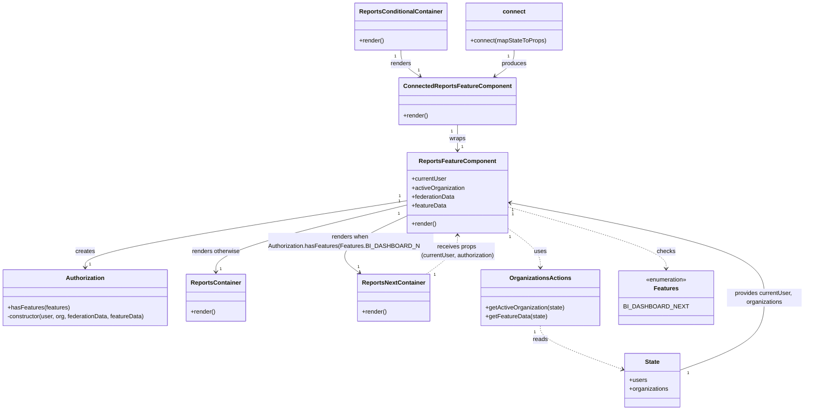

# Diagram: web/portal/src/pages/reports/bi-dashboard-next/Reports.page.container.tsx

> Auto-generated by Obscura crawlers

## Mermaid

### SVG

<svg id="container" width="2111.294921875" xmlns="http://www.w3.org/2000/svg" class="classDiagram" height="1122" viewBox="0 0 2111.294921875 1122" role="graphics-document document" aria-roledescription="class"><g><defs><marker id="container_class-aggregationStart" class="marker aggregation class" refX="18" refY="7" markerWidth="190" markerHeight="240" orient="auto"><path d="M 18,7 L9,13 L1,7 L9,1 Z"></path></marker></defs><defs><marker id="container_class-aggregationEnd" class="marker aggregation class" refX="1" refY="7" markerWidth="20" markerHeight="28" orient="auto"><path d="M 18,7 L9,13 L1,7 L9,1 Z"></path></marker></defs><defs><marker id="container_class-extensionStart" class="marker extension class" refX="18" refY="7" markerWidth="190" markerHeight="240" orient="auto"><path d="M 1,7 L18,13 V 1 Z"></path></marker></defs><defs><marker id="container_class-extensionEnd" class="marker extension class" refX="1" refY="7" markerWidth="20" markerHeight="28" orient="auto"><path d="M 1,1 V 13 L18,7 Z"></path></marker></defs><defs><marker id="container_class-compositionStart" class="marker composition class" refX="18" refY="7" markerWidth="190" markerHeight="240" orient="auto"><path d="M 18,7 L9,13 L1,7 L9,1 Z"></path></marker></defs><defs><marker id="container_class-compositionEnd" class="marker composition class" refX="1" refY="7" markerWidth="20" markerHeight="28" orient="auto"><path d="M 18,7 L9,13 L1,7 L9,1 Z"></path></marker></defs><defs><marker id="container_class-dependencyStart" class="marker dependency class" refX="6" refY="7" markerWidth="190" markerHeight="240" orient="auto"><path d="M 5,7 L9,13 L1,7 L9,1 Z"></path></marker></defs><defs><marker id="container_class-dependencyEnd" class="marker dependency class" refX="13" refY="7" markerWidth="20" markerHeight="28" orient="auto"><path d="M 18,7 L9,13 L14,7 L9,1 Z"></path></marker></defs><defs><marker id="container_class-lollipopStart" class="marker lollipop class" refX="13" refY="7" markerWidth="190" markerHeight="240" orient="auto"><circle stroke="black" fill="transparent" cx="7" cy="7" r="6"></circle></marker></defs><defs><marker id="container_class-lollipopEnd" class="marker lollipop class" refX="1" refY="7" markerWidth="190" markerHeight="240" orient="auto"><circle stroke="black" fill="transparent" cx="7" cy="7" r="6"></circle></marker></defs><g class="root"><g class="clusters"></g><g class="edgePaths"><path d="M1059.33,134L1059.33,140.167C1059.33,146.333,1059.33,158.667,1067.642,170.441C1075.954,182.215,1092.577,193.43,1100.889,199.037L1109.201,204.644" id="id_ReportsConditionalContainer_ConnectedReportsFeatureComponent_1" class="edge-thickness-normal edge-pattern-solid relation" style=";;;" data-edge="true" data-et="edge" data-id="id_ReportsConditionalContainer_ConnectedReportsFeatureComponent_1" data-points="W3sieCI6MTA1OS4zMzAwNzgxMjUsInkiOjEzNH0seyJ4IjoxMDU5LjMzMDA3ODEyNSwieSI6MTcxfSx7IngiOjExMTQuMTc0NjI4OTA2MjUsInkiOjIwOH1d" marker-end="url(#container_class-dependencyEnd)"></path><path d="M1207.559,334L1207.559,340.167C1207.559,346.333,1207.559,358.667,1207.559,370C1207.559,381.333,1207.559,391.667,1207.559,396.833L1207.559,402" id="id_ConnectedReportsFeatureComponent_ReportsFeatureComponent_2" class="edge-thickness-normal edge-pattern-solid relation" style=";;;" data-edge="true" data-et="edge" data-id="id_ConnectedReportsFeatureComponent_ReportsFeatureComponent_2" data-points="W3sieCI6MTIwNy41NTg1OTM3NSwieSI6MzM0fSx7IngiOjEyMDcuNTU4NTkzNzUsInkiOjM3MX0seyJ4IjoxMjA3LjU1ODU5Mzc1LCJ5Ijo0MDh9XQ==" marker-end="url(#container_class-dependencyEnd)"></path><path d="M1074.918,538.957L934.281,563.297C793.645,587.638,512.371,636.319,371.734,669.826C231.098,703.333,231.098,721.667,231.098,730.833L231.098,740" id="id_ReportsFeatureComponent_Authorization_3" class="edge-thickness-normal edge-pattern-solid relation" style=";;;" data-edge="true" data-et="edge" data-id="id_ReportsFeatureComponent_Authorization_3" data-points="W3sieCI6MTA3NC45MTc5Njg3NSwieSI6NTM4Ljk1NjY0MzQ5MDkyM30seyJ4IjoyMzEuMDk3NjU2MjUsInkiOjY4NX0seyJ4IjoyMzEuMDk3NjU2MjUsInkiOjc0Nn1d" marker-end="url(#container_class-dependencyEnd)"></path><path d="M1074.918,583.909L1042.009,600.757C1009.1,617.606,943.283,651.303,924.367,679.682C905.452,708.061,933.439,731.123,947.432,742.654L961.426,754.184" id="id_ReportsFeatureComponent_ReportsNextContainer_4" class="edge-thickness-normal edge-pattern-solid relation" style=";;;" data-edge="true" data-et="edge" data-id="id_ReportsFeatureComponent_ReportsNextContainer_4" data-points="W3sieCI6MTA3NC45MTc5Njg3NSwieSI6NTgzLjkwODc4NTM4Mjk0MDR9LHsieCI6ODc3LjQ2NDg0Mzc1LCJ5Ijo2ODV9LHsieCI6OTY2LjA1NjE4MTA2NjE3NjUsInkiOjc1OH1d" marker-end="url(#container_class-dependencyEnd)"></path><path d="M1074.918,551.818L992.719,574.015C910.52,596.212,746.121,640.606,663.922,673.97C581.723,707.333,581.723,729.667,581.723,740.833L581.723,752" id="id_ReportsFeatureComponent_ReportsContainer_5" class="edge-thickness-normal edge-pattern-solid relation" style=";;;" data-edge="true" data-et="edge" data-id="id_ReportsFeatureComponent_ReportsContainer_5" data-points="W3sieCI6MTA3NC45MTc5Njg3NSwieSI6NTUxLjgxODExODI2NjgxODF9LHsieCI6NTgxLjcyMjY1NjI1LCJ5Ijo2ODV9LHsieCI6NTgxLjcyMjY1NjI1LCJ5Ijo3NTh9XQ==" marker-end="url(#container_class-dependencyEnd)"></path><path d="M1340.199,557.269L1408.622,578.557C1477.045,599.846,1613.891,642.423,1682.313,673.378C1750.736,704.333,1750.736,723.667,1750.736,733.333L1750.736,743" id="id_ReportsFeatureComponent_Features_6" class="edge-thickness-normal edge-pattern-dashed relation" style=";;;" data-edge="true" data-et="edge" data-id="id_ReportsFeatureComponent_Features_6" data-points="W3sieCI6MTM0MC4xOTkyMTg3NSwieSI6NTU3LjI2ODc0OTA3ODU5Mn0seyJ4IjoxNzUwLjczNjMyODEyNSwieSI6Njg1fSx7IngiOjE3NTAuNzM2MzI4MTI1LCJ5Ijo3NDl9XQ==" marker-end="url(#container_class-dependencyEnd)"></path><path d="M1340.199,618.615L1354.501,629.679C1368.803,640.743,1397.406,662.872,1411.708,683.102C1426.01,703.333,1426.01,721.667,1426.01,730.833L1426.01,740" id="id_ReportsFeatureComponent_OrganizationsActions_7" class="edge-thickness-normal edge-pattern-dashed relation" style=";;;" data-edge="true" data-et="edge" data-id="id_ReportsFeatureComponent_OrganizationsActions_7" data-points="W3sieCI6MTM0MC4xOTkyMTg3NSwieSI6NjE4LjYxNDUzNTkyODU0NTN9LHsieCI6MTQyNi4wMDk3NjU2MjUsInkiOjY4NX0seyJ4IjoxNDI2LjAwOTc2NTYyNSwieSI6NzQ2fV0=" marker-end="url(#container_class-dependencyEnd)"></path><path d="M1355.787,134L1355.787,140.167C1355.787,146.333,1355.787,158.667,1347.475,170.441C1339.164,182.215,1322.54,193.43,1314.228,199.037L1305.916,204.644" id="id_connect_ConnectedReportsFeatureComponent_8" class="edge-thickness-normal edge-pattern-solid relation" style=";;;" data-edge="true" data-et="edge" data-id="id_connect_ConnectedReportsFeatureComponent_8" data-points="W3sieCI6MTM1NS43ODcxMDkzNzUsInkiOjEzNH0seyJ4IjoxMzU1Ljc4NzEwOTM3NSwieSI6MTcxfSx7IngiOjEzMDAuOTQyNTU4NTkzNzUsInkiOjIwOH1d" marker-end="url(#container_class-dependencyEnd)"></path><path d="M1426.01,896L1426.01,902.167C1426.01,908.333,1426.01,920.667,1460.754,939.954C1495.499,959.241,1564.988,985.482,1599.732,998.603L1634.477,1011.723" id="id_OrganizationsActions_State_9" class="edge-thickness-normal edge-pattern-dashed relation" style=";;;" data-edge="true" data-et="edge" data-id="id_OrganizationsActions_State_9" data-points="W3sieCI6MTQyNi4wMDk3NjU2MjUsInkiOjg5Nn0seyJ4IjoxNDI2LjAwOTc2NTYyNSwieSI6OTMzfSx7IngiOjE2NDAuMDg5ODQzNzUsInkiOjEwMTMuODQyOTg4MTI0NjQwNn1d" marker-end="url(#container_class-dependencyEnd)"></path><path d="M1789.215,1013.843L1824.895,1000.369C1860.575,986.895,1931.935,959.948,1967.615,927.807C2003.295,895.667,2003.295,858.333,2003.295,817C2003.295,775.667,2003.295,730.333,1893.757,684.403C1784.219,638.472,1565.144,591.945,1455.606,568.681L1346.068,545.417" id="id_State_ReportsFeatureComponent_10" class="edge-thickness-normal edge-pattern-solid relation" style=";;;" data-edge="true" data-et="edge" data-id="id_State_ReportsFeatureComponent_10" data-points="W3sieCI6MTc4OS4yMTQ4NDM3NSwieSI6MTAxMy44NDI5ODgxMjQ2NDA2fSx7IngiOjIwMDMuMjk0OTIxODc1LCJ5Ijo5MzN9LHsieCI6MjAwMy4yOTQ5MjE4NzUsInkiOjgyMX0seyJ4IjoyMDAzLjI5NDkyMTg3NSwieSI6Njg1fSx7IngiOjEzNDAuMTk5MjE4NzUsInkiOjU0NC4xNzA0NjkwNzcxMzcyfV0=" marker-end="url(#container_class-dependencyEnd)"></path><path d="M1118.967,758L1133.732,745.833C1148.498,733.667,1178.028,709.333,1192.793,688C1207.559,666.667,1207.559,648.333,1207.559,639.167L1207.559,630" id="id_ReportsNextContainer_ReportsFeatureComponent_11" class="edge-thickness-normal edge-pattern-dashed relation" style=";;;" data-edge="true" data-et="edge" data-id="id_ReportsNextContainer_ReportsFeatureComponent_11" data-points="W3sieCI6MTExOC45NjcyNTY0MzM4MjM0LCJ5Ijo3NTh9LHsieCI6MTIwNy41NTg1OTM3NSwieSI6Njg1fSx7IngiOjEyMDcuNTU4NTkzNzUsInkiOjYyNH1d" marker-end="url(#container_class-dependencyEnd)"></path></g><g class="edgeLabels"><g class="edgeLabel" transform="translate(1059.330078125, 171)"><g class="label" data-id="id_ReportsConditionalContainer_ConnectedReportsFeatureComponent_1" transform="translate(-27.75, -12)"><foreignObject width="55.5" height="24">

renders

</foreignObject></g></g><g class="edgeLabel" transform="translate(1207.55859375, 371)"><g class="label" data-id="id_ConnectedReportsFeatureComponent_ReportsFeatureComponent_2" transform="translate(-21.390625, -12)"><foreignObject width="42.78125" height="24">

wraps

</foreignObject></g></g><g class="edgeLabel" transform="translate(231.09765625, 685)"><g class="label" data-id="id_ReportsFeatureComponent_Authorization_3" transform="translate(-26.171875, -12)"><foreignObject width="52.34375" height="24">

creates

</foreignObject></g></g><g class="edgeLabel" transform="translate(925.1015, 660.61119)"><g class="label" data-id="id_ReportsFeatureComponent_ReportsNextContainer_4" transform="translate(-210.09375, -24)"><foreignObject width="420.1875" height="48">

renders when Authorization.hasFeatures(Features.BI_DASHBOARD_NEXT)

</foreignObject></g></g><g class="edgeLabel" transform="translate(581.72265625, 685)"><g class="label" data-id="id_ReportsFeatureComponent_ReportsContainer_5" transform="translate(-65.6484375, -12)"><foreignObject width="131.296875" height="24">

renders otherwise

</foreignObject></g></g><g class="edgeLabel" transform="translate(1750.736328125, 685)"><g class="label" data-id="id_ReportsFeatureComponent_Features_6" transform="translate(-24.4921875, -12)"><foreignObject width="48.984375" height="24">

checks

</foreignObject></g></g><g class="edgeLabel" transform="translate(1426.009765625, 685)"><g class="label" data-id="id_ReportsFeatureComponent_OrganizationsActions_7" transform="translate(-16.4921875, -12)"><foreignObject width="32.984375" height="24">

uses

</foreignObject></g></g><g class="edgeLabel" transform="translate(1355.787109375, 171)"><g class="label" data-id="id_connect_ConnectedReportsFeatureComponent_8" transform="translate(-33.4765625, -12)"><foreignObject width="66.953125" height="24">

produces

</foreignObject></g></g><g class="edgeLabel" transform="translate(1426.009765625, 933)"><g class="label" data-id="id_OrganizationsActions_State_9" transform="translate(-20.0078125, -12)"><foreignObject width="40.015625" height="24">

reads

</foreignObject></g></g><g class="edgeLabel" transform="translate(2003.294921875, 821)"><g class="label" data-id="id_State_ReportsFeatureComponent_10" transform="translate(-100, -24)"><foreignObject width="200" height="48">

provides currentUser, organizations

</foreignObject></g></g><g class="edgeLabel" transform="translate(1207.55859375, 685)"><g class="label" data-id="id_ReportsNextContainer_ReportsFeatureComponent_11" transform="translate(-100, -36)"><foreignObject width="200" height="72">

receives props (currentUser, authorization)

</foreignObject></g></g><g class="edgeTerminals" transform="translate(1044.3300790624999, 151.5000008035714)"><g class="inner" transform="translate(0, 0)"><foreignObject style="width: 9px; height: 12px;">
1
</foreignObject></g></g><g class="edgeTerminals" transform="translate(1192.558591875, 351.4999983928572)"><g class="inner" transform="translate(0, 0)"><foreignObject style="width: 9px; height: 12px;">
1
</foreignObject></g></g><g class="edgeTerminals" transform="translate(1055.1162433620245, 527.1608071493505)"><g class="inner" transform="translate(0, 0)"><foreignObject style="width: 9px; height: 12px;">
1
</foreignObject></g></g><g class="edgeTerminals" transform="translate(1052.5050052837107, 578.5320697149531)"><g class="inner" transform="translate(0, 0)"><foreignObject style="width: 9px; height: 12px;">
1
</foreignObject></g></g><g class="edgeTerminals" transform="translate(1054.1126110067776, 541.8990898129088)"><g class="inner" transform="translate(0, 0)"><foreignObject style="width: 9px; height: 12px;">
1
</foreignObject></g></g><g class="edgeTerminals" transform="translate(1352.4528415712798, 576.7905007769621)"><g class="inner" transform="translate(0, 0)"><foreignObject style="width: 9px; height: 12px;">
1
</foreignObject></g></g><g class="edgeTerminals" transform="translate(1344.8622655149034, 641.1867743875142)"><g class="inner" transform="translate(0, 0)"><foreignObject style="width: 9px; height: 12px;">
1
</foreignObject></g></g><g class="edgeTerminals" transform="translate(1340.7871096875, 151.50000026785713)"><g class="inner" transform="translate(0, 0)"><foreignObject style="width: 9px; height: 12px;">
1
</foreignObject></g></g><g class="edgeTerminals" transform="translate(1411.0097678125, 913.500001875)"><g class="inner" transform="translate(0, 0)"><foreignObject style="width: 9px; height: 12px;">
1
</foreignObject></g></g><g class="edgeTerminals" transform="translate(1810.8855973815441, 1021.6933671419029)"><g class="inner" transform="translate(0, 0)"><foreignObject style="width: 9px; height: 12px;">
1
</foreignObject></g></g><g class="edgeTerminals" transform="translate(1142.0117739292114, 758.447503516251)"><g class="inner" transform="translate(0, 0)"><foreignObject style="width: 9px; height: 12px;">
1
</foreignObject></g></g><g class="edgeTerminals" transform="translate(1103.0562788976138, 180.77803380482965)"><g class="inner" transform="translate(0, 0)"></g><foreignObject style="width: 9px; height: 12px;">
1
</foreignObject></g><g class="edgeTerminals" transform="translate(1217.558591875, 385.4999983928572)"><g class="inner" transform="translate(0, 0)"></g><foreignObject style="width: 9px; height: 12px;">
1
</foreignObject></g><g class="edgeTerminals" transform="translate(241.09765812499992, 723.5000016071428)"><g class="inner" transform="translate(0, 0)"></g><foreignObject style="width: 9px; height: 12px;">
1
</foreignObject></g><g class="edgeTerminals" transform="translate(957.0894867712196, 730.2950369170386)"><g class="inner" transform="translate(0, 0)"></g><foreignObject style="width: 9px; height: 12px;">
1
</foreignObject></g><g class="edgeTerminals" transform="translate(591.7226581249998, 735.5000016071428)"><g class="inner" transform="translate(0, 0)"></g><foreignObject style="width: 9px; height: 12px;">
1
</foreignObject></g><g class="edgeTerminals" transform="translate(1318.8388382446233, 205.64771653028808)"><g class="inner" transform="translate(0, 0)"></g><foreignObject style="width: 9px; height: 12px;">
1
</foreignObject></g><g class="edgeTerminals" transform="translate(1349.2011847173444, 557.4787992490109)"><g class="inner" transform="translate(0, 0)"></g><foreignObject style="width: 9px; height: 12px;">
1
</foreignObject></g></g><g class="nodes"><g class="node default" id="classId-ReportsConditionalContainer-0" transform="translate(1059.330078125, 71)"><g class="basic label-container"><path d="M-118.5390625 -63 L118.5390625 -63 L118.5390625 63 L-118.5390625 63" stroke="none" stroke-width="0" fill="#ECECFF" style=""></path><path d="M-118.5390625 -63 C-29.976967787609865 -63, 58.58512692478027 -63, 118.5390625 -63 M-118.5390625 -63 C-34.14952146615643 -63, 50.24001956768714 -63, 118.5390625 -63 M118.5390625 -63 C118.5390625 -25.23348503787625, 118.5390625 12.5330299242475, 118.5390625 63 M118.5390625 -63 C118.5390625 -26.915291406410375, 118.5390625 9.16941718717925, 118.5390625 63 M118.5390625 63 C32.15452260179896 63, -54.23001729640208 63, -118.5390625 63 M118.5390625 63 C64.18216132677182 63, 9.825260153543638 63, -118.5390625 63 M-118.5390625 63 C-118.5390625 31.14878353041907, -118.5390625 -0.7024329391618593, -118.5390625 -63 M-118.5390625 63 C-118.5390625 13.02678395681896, -118.5390625 -36.94643208636208, -118.5390625 -63" stroke="#9370DB" stroke-width="1.3" fill="none" stroke-dasharray="0 0" style=""></path></g><g class="annotation-group text" transform="translate(0, -39)"></g><g class="label-group text" transform="translate(-106.5390625, -39)"><g class="label" style="font-weight: bolder" transform="translate(0,-12)"><foreignObject width="213.078125" height="24">

ReportsConditionalContainer

</foreignObject></g></g><g class="members-group text" transform="translate(-106.5390625, 9)"></g><g class="methods-group text" transform="translate(-106.5390625, 39)"><g class="label" style="" transform="translate(0,-12)"><foreignObject width="66.609375" height="24">

+render()

</foreignObject></g></g><g class="divider" style=""><path d="M-118.5390625 -15 C-34.2371737424951 -15, 50.064715015009796 -15, 118.5390625 -15 M-118.5390625 -15 C-67.62707439257713 -15, -16.715086285154257 -15, 118.5390625 -15" stroke="#9370DB" stroke-width="1.3" fill="none" stroke-dasharray="0 0" style=""></path></g><g class="divider" style=""><path d="M-118.5390625 9 C-50.29680121752736 9, 17.94546006494528 9, 118.5390625 9 M-118.5390625 9 C-48.153694052225546 9, 22.231674395548907 9, 118.5390625 9" stroke="#9370DB" stroke-width="1.3" fill="none" stroke-dasharray="0 0" style=""></path></g></g><g class="node default" id="classId-ConnectedReportsFeatureComponent-1" transform="translate(1207.55859375, 271)"><g class="basic label-container"><path d="M-149.0390625 -63 L149.0390625 -63 L149.0390625 63 L-149.0390625 63" stroke="none" stroke-width="0" fill="#ECECFF" style=""></path><path d="M-149.0390625 -63 C-63.6345248335069 -63, 21.770012832986197 -63, 149.0390625 -63 M-149.0390625 -63 C-40.95704240166843 -63, 67.12497769666314 -63, 149.0390625 -63 M149.0390625 -63 C149.0390625 -29.146010292525986, 149.0390625 4.707979414948028, 149.0390625 63 M149.0390625 -63 C149.0390625 -27.944541390218383, 149.0390625 7.110917219563234, 149.0390625 63 M149.0390625 63 C89.06116149721825 63, 29.083260494436516 63, -149.0390625 63 M149.0390625 63 C51.561861970895535 63, -45.91533855820893 63, -149.0390625 63 M-149.0390625 63 C-149.0390625 18.228980686924615, -149.0390625 -26.54203862615077, -149.0390625 -63 M-149.0390625 63 C-149.0390625 34.97035414116009, -149.0390625 6.940708282320166, -149.0390625 -63" stroke="#9370DB" stroke-width="1.3" fill="none" stroke-dasharray="0 0" style=""></path></g><g class="annotation-group text" transform="translate(0, -39)"></g><g class="label-group text" transform="translate(-137.0390625, -39)"><g class="label" style="font-weight: bolder" transform="translate(0,-12)"><foreignObject width="274.078125" height="24">

ConnectedReportsFeatureComponent

</foreignObject></g></g><g class="members-group text" transform="translate(-137.0390625, 9)"></g><g class="methods-group text" transform="translate(-137.0390625, 39)"><g class="label" style="" transform="translate(0,-12)"><foreignObject width="66.609375" height="24">

+render()

</foreignObject></g></g><g class="divider" style=""><path d="M-149.0390625 -15 C-69.60034114053498 -15, 9.838380218930041 -15, 149.0390625 -15 M-149.0390625 -15 C-31.640619925969006 -15, 85.75782264806199 -15, 149.0390625 -15" stroke="#9370DB" stroke-width="1.3" fill="none" stroke-dasharray="0 0" style=""></path></g><g class="divider" style=""><path d="M-149.0390625 9 C-33.71497623049338 9, 81.60911003901325 9, 149.0390625 9 M-149.0390625 9 C-63.734162359357484 9, 21.570737781285032 9, 149.0390625 9" stroke="#9370DB" stroke-width="1.3" fill="none" stroke-dasharray="0 0" style=""></path></g></g><g class="node default" id="classId-ReportsFeatureComponent-2" transform="translate(1207.55859375, 516)"><g class="basic label-container"><path d="M-132.640625 -108 L132.640625 -108 L132.640625 108 L-132.640625 108" stroke="none" stroke-width="0" fill="#ECECFF" style=""></path><path d="M-132.640625 -108 C-69.1669734933023 -108, -5.693321986604602 -108, 132.640625 -108 M-132.640625 -108 C-38.356888992960606 -108, 55.92684701407879 -108, 132.640625 -108 M132.640625 -108 C132.640625 -29.49203418506019, 132.640625 49.01593162987962, 132.640625 108 M132.640625 -108 C132.640625 -41.267344385200474, 132.640625 25.465311229599052, 132.640625 108 M132.640625 108 C32.54273716237742 108, -67.55515067524516 108, -132.640625 108 M132.640625 108 C44.405654725496134 108, -43.82931554900773 108, -132.640625 108 M-132.640625 108 C-132.640625 39.1125883253968, -132.640625 -29.7748233492064, -132.640625 -108 M-132.640625 108 C-132.640625 60.641675260347576, -132.640625 13.283350520695151, -132.640625 -108" stroke="#9370DB" stroke-width="1.3" fill="none" stroke-dasharray="0 0" style=""></path></g><g class="annotation-group text" transform="translate(0, -84)"></g><g class="label-group text" transform="translate(-98.28125, -84)"><g class="label" style="font-weight: bolder" transform="translate(0,-12)"><foreignObject width="196.5625" height="24">

ReportsFeatureComponent

</foreignObject></g></g><g class="members-group text" transform="translate(-120.640625, -36)"><g class="label" style="" transform="translate(0,-12)"><foreignObject width="93.421875" height="24">

+currentUser

</foreignObject></g><g class="label" style="" transform="translate(0,12)"><foreignObject width="143" height="24">

+activeOrganization

</foreignObject></g><g class="label" style="" transform="translate(0,36)"><foreignObject width="116.5" height="24">

+federationData

</foreignObject></g><g class="label" style="" transform="translate(0,60)"><foreignObject width="92.9375" height="24">

+featureData

</foreignObject></g></g><g class="methods-group text" transform="translate(-120.640625, 84)"><g class="label" style="" transform="translate(0,-12)"><foreignObject width="66.609375" height="24">

+render()

</foreignObject></g></g><g class="divider" style=""><path d="M-132.640625 -60 C-45.10513414905725 -60, 42.4303567018855 -60, 132.640625 -60 M-132.640625 -60 C-74.08231104862935 -60, -15.5239970972587 -60, 132.640625 -60" stroke="#9370DB" stroke-width="1.3" fill="none" stroke-dasharray="0 0" style=""></path></g><g class="divider" style=""><path d="M-132.640625 60 C-64.62513321626487 60, 3.3903585674702583 60, 132.640625 60 M-132.640625 60 C-36.6617783031719 60, 59.3170683936562 60, 132.640625 60" stroke="#9370DB" stroke-width="1.3" fill="none" stroke-dasharray="0 0" style=""></path></g></g><g class="node default" id="classId-Authorization-3" transform="translate(231.09765625, 821)"><g class="basic label-container"><path d="M-223.09765625 -75 L223.09765625 -75 L223.09765625 75 L-223.09765625 75" stroke="none" stroke-width="0" fill="#ECECFF" style=""></path><path d="M-223.09765625 -75 C-65.13712806541247 -75, 92.82340011917506 -75, 223.09765625 -75 M-223.09765625 -75 C-73.02270239171321 -75, 77.05225146657358 -75, 223.09765625 -75 M223.09765625 -75 C223.09765625 -15.40694253227636, 223.09765625 44.18611493544728, 223.09765625 75 M223.09765625 -75 C223.09765625 -16.5891564714062, 223.09765625 41.8216870571876, 223.09765625 75 M223.09765625 75 C111.20684637752096 75, -0.6839634949580784 75, -223.09765625 75 M223.09765625 75 C80.10525647116262 75, -62.88714330767476 75, -223.09765625 75 M-223.09765625 75 C-223.09765625 34.28346603049393, -223.09765625 -6.433067939012133, -223.09765625 -75 M-223.09765625 75 C-223.09765625 18.857392818973928, -223.09765625 -37.285214362052145, -223.09765625 -75" stroke="#9370DB" stroke-width="1.3" fill="none" stroke-dasharray="0 0" style=""></path></g><g class="annotation-group text" transform="translate(0, -51)"></g><g class="label-group text" transform="translate(-49.7109375, -51)"><g class="label" style="font-weight: bolder" transform="translate(0,-12)"><foreignObject width="99.421875" height="24">

Authorization

</foreignObject></g></g><g class="members-group text" transform="translate(-211.09765625, -3)"></g><g class="methods-group text" transform="translate(-211.09765625, 27)"><g class="label" style="" transform="translate(0,-12)"><foreignObject width="164.734375" height="24">

+hasFeatures(features)

</foreignObject></g><g class="label" style="" transform="translate(0,12)"><foreignObject width="372.484375" height="24">

-constructor(user, org, federationData, featureData)

</foreignObject></g></g><g class="divider" style=""><path d="M-223.09765625 -27 C-56.08431409948207 -27, 110.92902805103586 -27, 223.09765625 -27 M-223.09765625 -27 C-125.7872516892441 -27, -28.476847128488203 -27, 223.09765625 -27" stroke="#9370DB" stroke-width="1.3" fill="none" stroke-dasharray="0 0" style=""></path></g><g class="divider" style=""><path d="M-223.09765625 -3 C-120.77268641731824 -3, -18.44771658463648 -3, 223.09765625 -3 M-223.09765625 -3 C-46.123026711218245 -3, 130.8516028275635 -3, 223.09765625 -3" stroke="#9370DB" stroke-width="1.3" fill="none" stroke-dasharray="0 0" style=""></path></g></g><g class="node default" id="classId-ReportsContainer-4" transform="translate(581.72265625, 821)"><g class="basic label-container"><path d="M-77.52734375 -63 L77.52734375 -63 L77.52734375 63 L-77.52734375 63" stroke="none" stroke-width="0" fill="#ECECFF" style=""></path><path d="M-77.52734375 -63 C-39.74870132886823 -63, -1.9700589077364583 -63, 77.52734375 -63 M-77.52734375 -63 C-26.278516323732333 -63, 24.970311102535334 -63, 77.52734375 -63 M77.52734375 -63 C77.52734375 -15.474679009663419, 77.52734375 32.05064198067316, 77.52734375 63 M77.52734375 -63 C77.52734375 -23.244698328011467, 77.52734375 16.510603343977067, 77.52734375 63 M77.52734375 63 C29.786598697065436 63, -17.954146355869128 63, -77.52734375 63 M77.52734375 63 C41.116710906353966 63, 4.706078062707931 63, -77.52734375 63 M-77.52734375 63 C-77.52734375 16.10800027413157, -77.52734375 -30.78399945173686, -77.52734375 -63 M-77.52734375 63 C-77.52734375 27.841519332839745, -77.52734375 -7.31696133432051, -77.52734375 -63" stroke="#9370DB" stroke-width="1.3" fill="none" stroke-dasharray="0 0" style=""></path></g><g class="annotation-group text" transform="translate(0, -39)"></g><g class="label-group text" transform="translate(-64.4453125, -39)"><g class="label" style="font-weight: bolder" transform="translate(0,-12)"><foreignObject width="128.890625" height="24">

ReportsContainer

</foreignObject></g></g><g class="members-group text" transform="translate(-65.52734375, 9)"></g><g class="methods-group text" transform="translate(-65.52734375, 39)"><g class="label" style="" transform="translate(0,-12)"><foreignObject width="66.609375" height="24">

+render()

</foreignObject></g></g><g class="divider" style=""><path d="M-77.52734375 -15 C-39.49399306895003 -15, -1.4606423879000658 -15, 77.52734375 -15 M-77.52734375 -15 C-31.65951816437955 -15, 14.208307421240903 -15, 77.52734375 -15" stroke="#9370DB" stroke-width="1.3" fill="none" stroke-dasharray="0 0" style=""></path></g><g class="divider" style=""><path d="M-77.52734375 9 C-31.212967840687654 9, 15.101408068624693 9, 77.52734375 9 M-77.52734375 9 C-36.3505731862265 9, 4.826197377547004 9, 77.52734375 9" stroke="#9370DB" stroke-width="1.3" fill="none" stroke-dasharray="0 0" style=""></path></g></g><g class="node default" id="classId-ReportsNextContainer-5" transform="translate(1042.51171875, 821)"><g class="basic label-container"><path d="M-93.2421875 -63 L93.2421875 -63 L93.2421875 63 L-93.2421875 63" stroke="none" stroke-width="0" fill="#ECECFF" style=""></path><path d="M-93.2421875 -63 C-23.15249886091388 -63, 46.93718977817224 -63, 93.2421875 -63 M-93.2421875 -63 C-28.747951420448146 -63, 35.74628465910371 -63, 93.2421875 -63 M93.2421875 -63 C93.2421875 -35.46787993872529, 93.2421875 -7.935759877450586, 93.2421875 63 M93.2421875 -63 C93.2421875 -25.10307226146795, 93.2421875 12.793855477064099, 93.2421875 63 M93.2421875 63 C37.77101152418469 63, -17.700164451630613 63, -93.2421875 63 M93.2421875 63 C21.766051730234054 63, -49.71008403953189 63, -93.2421875 63 M-93.2421875 63 C-93.2421875 36.73809214978266, -93.2421875 10.476184299565318, -93.2421875 -63 M-93.2421875 63 C-93.2421875 14.185366618873736, -93.2421875 -34.62926676225253, -93.2421875 -63" stroke="#9370DB" stroke-width="1.3" fill="none" stroke-dasharray="0 0" style=""></path></g><g class="annotation-group text" transform="translate(0, -39)"></g><g class="label-group text" transform="translate(-81.2421875, -39)"><g class="label" style="font-weight: bolder" transform="translate(0,-12)"><foreignObject width="162.484375" height="24">

ReportsNextContainer

</foreignObject></g></g><g class="members-group text" transform="translate(-81.2421875, 9)"></g><g class="methods-group text" transform="translate(-81.2421875, 39)"><g class="label" style="" transform="translate(0,-12)"><foreignObject width="66.609375" height="24">

+render()

</foreignObject></g></g><g class="divider" style=""><path d="M-93.2421875 -15 C-23.386952713927002 -15, 46.468282072145996 -15, 93.2421875 -15 M-93.2421875 -15 C-22.459945606981833 -15, 48.322296286036334 -15, 93.2421875 -15" stroke="#9370DB" stroke-width="1.3" fill="none" stroke-dasharray="0 0" style=""></path></g><g class="divider" style=""><path d="M-93.2421875 9 C-55.21966033754957 9, -17.19713317509914 9, 93.2421875 9 M-93.2421875 9 C-25.215326635747687 9, 42.81153422850463 9, 93.2421875 9" stroke="#9370DB" stroke-width="1.3" fill="none" stroke-dasharray="0 0" style=""></path></g></g><g class="node default" id="classId-OrganizationsActions-6" transform="translate(1426.009765625, 821)"><g class="basic label-container"><path d="M-157.16796875 -75 L157.16796875 -75 L157.16796875 75 L-157.16796875 75" stroke="none" stroke-width="0" fill="#ECECFF" style=""></path><path d="M-157.16796875 -75 C-37.93755324234651 -75, 81.29286226530698 -75, 157.16796875 -75 M-157.16796875 -75 C-43.298137568860426 -75, 70.57169361227915 -75, 157.16796875 -75 M157.16796875 -75 C157.16796875 -31.101075551855118, 157.16796875 12.797848896289764, 157.16796875 75 M157.16796875 -75 C157.16796875 -43.831757561046985, 157.16796875 -12.663515122093969, 157.16796875 75 M157.16796875 75 C62.33129755864044 75, -32.50537363271911 75, -157.16796875 75 M157.16796875 75 C88.10921724586653 75, 19.050465741733063 75, -157.16796875 75 M-157.16796875 75 C-157.16796875 17.772406905954142, -157.16796875 -39.455186188091716, -157.16796875 -75 M-157.16796875 75 C-157.16796875 24.005464873090766, -157.16796875 -26.98907025381847, -157.16796875 -75" stroke="#9370DB" stroke-width="1.3" fill="none" stroke-dasharray="0 0" style=""></path></g><g class="annotation-group text" transform="translate(0, -51)"></g><g class="label-group text" transform="translate(-77.6015625, -51)"><g class="label" style="font-weight: bolder" transform="translate(0,-12)"><foreignObject width="155.203125" height="24">

OrganizationsActions

</foreignObject></g></g><g class="members-group text" transform="translate(-145.16796875, -3)"></g><g class="methods-group text" transform="translate(-145.16796875, 27)"><g class="label" style="" transform="translate(0,-12)"><foreignObject width="212.734375" height="24">

+getActiveOrganization(state)

</foreignObject></g><g class="label" style="" transform="translate(0,12)"><foreignObject width="164.296875" height="24">

+getFeatureData(state)

</foreignObject></g></g><g class="divider" style=""><path d="M-157.16796875 -27 C-48.826378984491726 -27, 59.51521078101655 -27, 157.16796875 -27 M-157.16796875 -27 C-61.39677929281909 -27, 34.37441016436182 -27, 157.16796875 -27" stroke="#9370DB" stroke-width="1.3" fill="none" stroke-dasharray="0 0" style=""></path></g><g class="divider" style=""><path d="M-157.16796875 -3 C-67.5601067377156 -3, 22.0477552745688 -3, 157.16796875 -3 M-157.16796875 -3 C-47.532537868613716 -3, 62.10289301277257 -3, 157.16796875 -3" stroke="#9370DB" stroke-width="1.3" fill="none" stroke-dasharray="0 0" style=""></path></g></g><g class="node default" id="classId-connect-7" transform="translate(1355.787109375, 71)"><g class="basic label-container"><path d="M-127.91796875 -63 L127.91796875 -63 L127.91796875 63 L-127.91796875 63" stroke="none" stroke-width="0" fill="#ECECFF" style=""></path><path d="M-127.91796875 -63 C-72.97450033250328 -63, -18.03103191500658 -63, 127.91796875 -63 M-127.91796875 -63 C-54.51495750231909 -63, 18.888053745361816 -63, 127.91796875 -63 M127.91796875 -63 C127.91796875 -14.7294636690443, 127.91796875 33.5410726619114, 127.91796875 63 M127.91796875 -63 C127.91796875 -26.913324145472686, 127.91796875 9.173351709054629, 127.91796875 63 M127.91796875 63 C62.7813692100769 63, -2.3552303298461936 63, -127.91796875 63 M127.91796875 63 C27.675504205983003 63, -72.566960338034 63, -127.91796875 63 M-127.91796875 63 C-127.91796875 35.79645081892073, -127.91796875 8.592901637841464, -127.91796875 -63 M-127.91796875 63 C-127.91796875 14.876096850561268, -127.91796875 -33.247806298877464, -127.91796875 -63" stroke="#9370DB" stroke-width="1.3" fill="none" stroke-dasharray="0 0" style=""></path></g><g class="annotation-group text" transform="translate(0, -39)"></g><g class="label-group text" transform="translate(-28.9140625, -39)"><g class="label" style="font-weight: bolder" transform="translate(0,-12)"><foreignObject width="57.828125" height="24">

connect

</foreignObject></g></g><g class="members-group text" transform="translate(-115.91796875, 9)"></g><g class="methods-group text" transform="translate(-115.91796875, 39)"><g class="label" style="" transform="translate(0,-12)"><foreignObject width="202.921875" height="24">

+connect(mapStateToProps)

</foreignObject></g></g><g class="divider" style=""><path d="M-127.91796875 -15 C-35.39135379583652 -15, 57.135261158326955 -15, 127.91796875 -15 M-127.91796875 -15 C-45.46454567118191 -15, 36.98887740763618 -15, 127.91796875 -15" stroke="#9370DB" stroke-width="1.3" fill="none" stroke-dasharray="0 0" style=""></path></g><g class="divider" style=""><path d="M-127.91796875 9 C-40.0501475725073 9, 47.8176736049854 9, 127.91796875 9 M-127.91796875 9 C-48.359481242439855 9, 31.19900626512029 9, 127.91796875 9" stroke="#9370DB" stroke-width="1.3" fill="none" stroke-dasharray="0 0" style=""></path></g></g><g class="node default" id="classId-Features-8" transform="translate(1750.736328125, 821)"><g class="basic label-container"><path d="M-117.55859375 -72 L117.55859375 -72 L117.55859375 72 L-117.55859375 72" stroke="none" stroke-width="0" fill="#ECECFF" style=""></path><path d="M-117.55859375 -72 C-68.29097091756938 -72, -19.023348085138764 -72, 117.55859375 -72 M-117.55859375 -72 C-67.04464802625554 -72, -16.530702302511074 -72, 117.55859375 -72 M117.55859375 -72 C117.55859375 -22.6790094970829, 117.55859375 26.641981005834197, 117.55859375 72 M117.55859375 -72 C117.55859375 -29.51220496133959, 117.55859375 12.975590077320817, 117.55859375 72 M117.55859375 72 C70.02463134792733 72, 22.49066894585465 72, -117.55859375 72 M117.55859375 72 C65.24528528288185 72, 12.931976815763704 72, -117.55859375 72 M-117.55859375 72 C-117.55859375 21.5928956566472, -117.55859375 -28.814208686705598, -117.55859375 -72 M-117.55859375 72 C-117.55859375 16.531127070707875, -117.55859375 -38.93774585858425, -117.55859375 -72" stroke="#9370DB" stroke-width="1.3" fill="none" stroke-dasharray="0 0" style=""></path></g><g class="annotation-group text" transform="translate(-55.5546875, -48)"><g class="label" style="" transform="translate(0,-12)"><foreignObject width="111.109375" height="24">

«enumeration»

</foreignObject></g></g><g class="label-group text" transform="translate(-31.25, -24)"><g class="label" style="font-weight: bolder" transform="translate(0,-12)"><foreignObject width="62.5" height="24">

Features

</foreignObject></g></g><g class="members-group text" transform="translate(-105.55859375, 24)"><g class="label" style="" transform="translate(0,-12)"><foreignObject width="155.5625" height="24">

BI_DASHBOARD_NEXT

</foreignObject></g></g><g class="methods-group text" transform="translate(-105.55859375, 72)"></g><g class="divider" style=""><path d="M-117.55859375 0 C-67.92977852555333 0, -18.30096330110665 0, 117.55859375 0 M-117.55859375 0 C-26.892417264217656 0, 63.77375922156469 0, 117.55859375 0" stroke="#9370DB" stroke-width="1.3" fill="none" stroke-dasharray="0 0" style=""></path></g><g class="divider" style=""><path d="M-117.55859375 48 C-60.05664648338391 48, -2.5546992167678155 48, 117.55859375 48 M-117.55859375 48 C-42.34509903296359 48, 32.86839568407282 48, 117.55859375 48" stroke="#9370DB" stroke-width="1.3" fill="none" stroke-dasharray="0 0" style=""></path></g></g><g class="node default" id="classId-State-9" transform="translate(1714.65234375, 1042)"><g class="basic label-container"><path d="M-74.5625 -72 L74.5625 -72 L74.5625 72 L-74.5625 72" stroke="none" stroke-width="0" fill="#ECECFF" style=""></path><path d="M-74.5625 -72 C-22.62599456349426 -72, 29.31051087301148 -72, 74.5625 -72 M-74.5625 -72 C-43.54791196004612 -72, -12.53332392009225 -72, 74.5625 -72 M74.5625 -72 C74.5625 -25.809030845124077, 74.5625 20.381938309751845, 74.5625 72 M74.5625 -72 C74.5625 -34.94653090542097, 74.5625 2.1069381891580576, 74.5625 72 M74.5625 72 C35.32108378810447 72, -3.9203324237910664 72, -74.5625 72 M74.5625 72 C16.178133161982686 72, -42.20623367603463 72, -74.5625 72 M-74.5625 72 C-74.5625 31.07862006915986, -74.5625 -9.842759861680278, -74.5625 -72 M-74.5625 72 C-74.5625 29.578680459415402, -74.5625 -12.842639081169196, -74.5625 -72" stroke="#9370DB" stroke-width="1.3" fill="none" stroke-dasharray="0 0" style=""></path></g><g class="annotation-group text" transform="translate(0, -48)"></g><g class="label-group text" transform="translate(-19.3125, -48)"><g class="label" style="font-weight: bolder" transform="translate(0,-12)"><foreignObject width="38.625" height="24">

State

</foreignObject></g></g><g class="members-group text" transform="translate(-62.5625, 0)"><g class="label" style="" transform="translate(0,-12)"><foreignObject width="46.90625" height="24">

+users

</foreignObject></g><g class="label" style="" transform="translate(0,12)"><foreignObject width="105.8125" height="24">

+organizations

</foreignObject></g></g><g class="methods-group text" transform="translate(-62.5625, 72)"></g><g class="divider" style=""><path d="M-74.5625 -24 C-19.49212405699423 -24, 35.57825188601154 -24, 74.5625 -24 M-74.5625 -24 C-24.252697535509597 -24, 26.057104928980806 -24, 74.5625 -24" stroke="#9370DB" stroke-width="1.3" fill="none" stroke-dasharray="0 0" style=""></path></g><g class="divider" style=""><path d="M-74.5625 48 C-21.281385464478717 48, 31.999729071042566 48, 74.5625 48 M-74.5625 48 C-22.10836091920126 48, 30.34577816159748 48, 74.5625 48" stroke="#9370DB" stroke-width="1.3" fill="none" stroke-dasharray="0 0" style=""></path></g></g></g></g></g></svg>
