# Diagram: web/portal/src/pages/reports/bi-dashboard-next/Reports.page.tsx


> Auto-generated by Obscura crawlers

## Diagram 1

```mermaid
classDiagram
class Reports {
  +props: currentUser
  +props: authorization
  +state: activeTab: ReportTabType
  +state: viewMode: string
  +state: currentSection: enum
  +state: fade: boolean
  +state: searchValue: string
  +state: selectedTags: string[]
  +state: criteria: ReportCriteriaDTO
  +state: debouncedCriteria: ReportCriteriaDTO
  +state: sortBy: string
  +state: sortDirection: string
  +refs: prevViewMode
  +hooks: useSetTitleOnMount(), useSetDescriptionOnMount(), useTrackWithMixpanelOnce()
  +hooks: useReportsData(), useNewlyPublishedNotifications()
  +methods: handleBannerDismiss(ids)
  +methods: handleReportNavigation(reportNumber)
  +methods: handleSelectReport(report)
  +methods: handleSelectFilterSet(filterSet)
  +methods: handleViewModeChange(value)
  +methods: handleTagClick(tag)
  +methods: handleAllClick()
  +methods: handleArchiveClick()
  +methods: handleRecentlyAddedClick()
  +methods: handleFavoritesClick()
  +methods: handleScheduledEmailClick()
  +methods: handleOpenedThisWeekClick()
  +methods: handleTagFilter(tagName)
  +methods: handleSearchChange(e)
  +methods: handleSelectTag(tag)
  +methods: loadMore()
}
class ReportsTopBar {
  +props: activeTab, onTabChange, searchValue, onSearchChange, onSelectTag, onSelectReport, onSelectFilterSet, viewMode, onViewModeChange, authorization
}
class ReportsLeftNavbar {
  +props: selectedTags, criteria, onAllClick, onTagClick, onArchiveClick, onRecentlyAddedClick, onFavoritesClick, onScheduledEmailClick, onOpenedThisWeekClick
}
class ReportsContent {
  +props: viewMode, fade, isLoading, reports, loadMore, isFetchingNextPage, onTagClick, refetch, currentSection, activeTab
}
class NotificationNewlyPublishedBanner {
  +props: notifications, onDismiss, onReportClick, onTagClick
}
Reports "1" --> "1" ReportsTopBar : renders
Reports "1" --> "1" ReportsLeftNavbar : renders (conditionally)
Reports "1" --> "1" ReportsContent : renders
Reports "1" --> "0..1" NotificationNewlyPublishedBanner : renders when notifications
Reports ..> BrowserStorage : uses
Reports ..> useReportsData : calls
Reports ..> useNewlyPublishedNotifications : calls
Reports ..> useTranslation : calls
Reports ..> useDispatch : calls
```



### SVG

<svg id="container" width="5187.2890625" xmlns="http://www.w3.org/2000/svg" class="classDiagram" height="1050" viewBox="0 0 5187.2890625 1050" role="graphics-document document" aria-roledescription="class"><style>#container{font-family:"trebuchet ms",verdana,arial,sans-serif;font-size:16px;fill:#333;}@keyframes edge-animation-frame{from{stroke-dashoffset:0;}}@keyframes dash{to{stroke-dashoffset:0;}}#container .edge-animation-slow{stroke-dasharray:9,5!important;stroke-dashoffset:900;animation:dash 50s linear infinite;stroke-linecap:round;}#container .edge-animation-fast{stroke-dasharray:9,5!important;stroke-dashoffset:900;animation:dash 20s linear infinite;stroke-linecap:round;}#container .error-icon{fill:#552222;}#container .error-text{fill:#552222;stroke:#552222;}#container .edge-thickness-normal{stroke-width:1px;}#container .edge-thickness-thick{stroke-width:3.5px;}#container .edge-pattern-solid{stroke-dasharray:0;}#container .edge-thickness-invisible{stroke-width:0;fill:none;}#container .edge-pattern-dashed{stroke-dasharray:3;}#container .edge-pattern-dotted{stroke-dasharray:2;}#container .marker{fill:#333333;stroke:#333333;}#container .marker.cross{stroke:#333333;}#container svg{font-family:"trebuchet ms",verdana,arial,sans-serif;font-size:16px;}#container p{margin:0;}#container g.classGroup text{fill:#9370DB;stroke:none;font-family:"trebuchet ms",verdana,arial,sans-serif;font-size:10px;}#container g.classGroup text .title{font-weight:bolder;}#container .nodeLabel,#container .edgeLabel{color:#131300;}#container .edgeLabel .label rect{fill:#ECECFF;}#container .label text{fill:#131300;}#container .labelBkg{background:#ECECFF;}#container .edgeLabel .label span{background:#ECECFF;}#container .classTitle{font-weight:bolder;}#container .node rect,#container .node circle,#container .node ellipse,#container .node polygon,#container .node path{fill:#ECECFF;stroke:#9370DB;stroke-width:1px;}#container .divider{stroke:#9370DB;stroke-width:1;}#container g.clickable{cursor:pointer;}#container g.classGroup rect{fill:#ECECFF;stroke:#9370DB;}#container g.classGroup line{stroke:#9370DB;stroke-width:1;}#container .classLabel .box{stroke:none;stroke-width:0;fill:#ECECFF;opacity:0.5;}#container .classLabel .label{fill:#9370DB;font-size:10px;}#container .relation{stroke:#333333;stroke-width:1;fill:none;}#container .dashed-line{stroke-dasharray:3;}#container .dotted-line{stroke-dasharray:1 2;}#container #compositionStart,#container .composition{fill:#333333!important;stroke:#333333!important;stroke-width:1;}#container #compositionEnd,#container .composition{fill:#333333!important;stroke:#333333!important;stroke-width:1;}#container #dependencyStart,#container .dependency{fill:#333333!important;stroke:#333333!important;stroke-width:1;}#container #dependencyStart,#container .dependency{fill:#333333!important;stroke:#333333!important;stroke-width:1;}#container #extensionStart,#container .extension{fill:transparent!important;stroke:#333333!important;stroke-width:1;}#container #extensionEnd,#container .extension{fill:transparent!important;stroke:#333333!important;stroke-width:1;}#container #aggregationStart,#container .aggregation{fill:transparent!important;stroke:#333333!important;stroke-width:1;}#container #aggregationEnd,#container .aggregation{fill:transparent!important;stroke:#333333!important;stroke-width:1;}#container #lollipopStart,#container .lollipop{fill:#ECECFF!important;stroke:#333333!important;stroke-width:1;}#container #lollipopEnd,#container .lollipop{fill:#ECECFF!important;stroke:#333333!important;stroke-width:1;}#container .edgeTerminals{font-size:11px;line-height:initial;}#container .classTitleText{text-anchor:middle;font-size:18px;fill:#333;}#container .label-icon{display:inline-block;height:1em;overflow:visible;vertical-align:-0.125em;}#container .node .label-icon path{fill:currentColor;stroke:revert;stroke-width:revert;}#container :root{--mermaid-font-family:"trebuchet ms",verdana,arial,sans-serif;}</style><g><defs><marker id="container_class-aggregationStart" class="marker aggregation class" refX="18" refY="7" markerWidth="190" markerHeight="240" orient="auto"><path d="M 18,7 L9,13 L1,7 L9,1 Z"></path></marker></defs><defs><marker id="container_class-aggregationEnd" class="marker aggregation class" refX="1" refY="7" markerWidth="20" markerHeight="28" orient="auto"><path d="M 18,7 L9,13 L1,7 L9,1 Z"></path></marker></defs><defs><marker id="container_class-extensionStart" class="marker extension class" refX="18" refY="7" markerWidth="190" markerHeight="240" orient="auto"><path d="M 1,7 L18,13 V 1 Z"></path></marker></defs><defs><marker id="container_class-extensionEnd" class="marker extension class" refX="1" refY="7" markerWidth="20" markerHeight="28" orient="auto"><path d="M 1,1 V 13 L18,7 Z"></path></marker></defs><defs><marker id="container_class-compositionStart" class="marker composition class" refX="18" refY="7" markerWidth="190" markerHeight="240" orient="auto"><path d="M 18,7 L9,13 L1,7 L9,1 Z"></path></marker></defs><defs><marker id="container_class-compositionEnd" class="marker composition class" refX="1" refY="7" markerWidth="20" markerHeight="28" orient="auto"><path d="M 18,7 L9,13 L1,7 L9,1 Z"></path></marker></defs><defs><marker id="container_class-dependencyStart" class="marker dependency class" refX="6" refY="7" markerWidth="190" markerHeight="240" orient="auto"><path d="M 5,7 L9,13 L1,7 L9,1 Z"></path></marker></defs><defs><marker id="container_class-dependencyEnd" class="marker dependency class" refX="13" refY="7" markerWidth="20" markerHeight="28" orient="auto"><path d="M 18,7 L9,13 L14,7 L9,1 Z"></path></marker></defs><defs><marker id="container_class-lollipopStart" class="marker lollipop class" refX="13" refY="7" markerWidth="190" markerHeight="240" orient="auto"><circle stroke="black" fill="transparent" cx="7" cy="7" r="6"></circle></marker></defs><defs><marker id="container_class-lollipopEnd" class="marker lollipop class" refX="1" refY="7" markerWidth="190" markerHeight="240" orient="auto"><circle stroke="black" fill="transparent" cx="7" cy="7" r="6"></circle></marker></defs><g class="root"><g class="clusters"></g><g class="edgePaths"><path d="M3910.367,472.147L3361.626,540.956C2812.885,609.765,1715.404,747.382,1166.663,821.358C617.922,895.333,617.922,905.667,617.922,910.833L617.922,916" id="id_Reports_ReportsTopBar_1" class="edge-thickness-normal edge-pattern-solid relation" style=";;;" data-edge="true" data-et="edge" data-id="id_Reports_ReportsTopBar_1" data-points="W3sieCI6MzkxMC4zNjcxODc1LCJ5Ijo0NzIuMTQ3NDY2ODcwMTY4OH0seyJ4Ijo2MTcuOTIxODc1LCJ5Ijo4ODV9LHsieCI6NjE3LjkyMTg3NSwieSI6OTIyfV0=" marker-end="url(#container_class-dependencyEnd)"></path><path d="M3910.367,496.026L3574.841,560.855C3239.315,625.684,2568.263,755.342,2232.737,825.338C1897.211,895.333,1897.211,905.667,1897.211,910.833L1897.211,916" id="id_Reports_ReportsLeftNavbar_2" class="edge-thickness-normal edge-pattern-solid relation" style=";;;" data-edge="true" data-et="edge" data-id="id_Reports_ReportsLeftNavbar_2" data-points="W3sieCI6MzkxMC4zNjcxODc1LCJ5Ijo0OTYuMDI1Njc0NzMzODU1NDV9LHsieCI6MTg5Ny4yMTA5Mzc1LCJ5Ijo4ODV9LHsieCI6MTg5Ny4yMTA5Mzc1LCJ5Ijo5MjJ9XQ==" marker-end="url(#container_class-dependencyEnd)"></path><path d="M3910.367,559.737L3765.489,613.948C3620.611,668.158,3330.854,776.579,3185.976,835.956C3041.098,895.333,3041.098,905.667,3041.098,910.833L3041.098,916" id="id_Reports_ReportsContent_3" class="edge-thickness-normal edge-pattern-solid relation" style=";;;" data-edge="true" data-et="edge" data-id="id_Reports_ReportsContent_3" data-points="W3sieCI6MzkxMC4zNjcxODc1LCJ5Ijo1NTkuNzM3Mzk3NzczMzIxNH0seyJ4IjozMDQxLjA5NzY1NjI1LCJ5Ijo4ODV9LHsieCI6MzA0MS4wOTc2NTYyNSwieSI6OTIyfV0=" marker-end="url(#container_class-dependencyEnd)"></path><path d="M3910.367,821.893L3900.966,832.411C3891.565,842.929,3872.763,863.964,3863.362,879.649C3853.961,895.333,3853.961,905.667,3853.961,910.833L3853.961,916" id="id_Reports_NotificationNewlyPublishedBanner_4" class="edge-thickness-normal edge-pattern-solid relation" style=";;;" data-edge="true" data-et="edge" data-id="id_Reports_NotificationNewlyPublishedBanner_4" data-points="W3sieCI6MzkxMC4zNjcxODc1LCJ5Ijo4MjEuODkzMTgxNjAwODQxNn0seyJ4IjozODUzLjk2MDkzNzUsInkiOjg4NX0seyJ4IjozODUzLjk2MDkzNzUsInkiOjkyMn1d" marker-end="url(#container_class-dependencyEnd)"></path><path d="M4262.438,848L4262.438,854.167C4262.438,860.333,4262.438,872.667,4262.438,887C4262.438,901.333,4262.438,917.667,4262.438,925.833L4262.438,934" id="id_Reports_BrowserStorage_5" class="edge-thickness-normal edge-pattern-dashed relation" style=";;;" data-edge="true" data-et="edge" data-id="id_Reports_BrowserStorage_5" data-points="W3sieCI6NDI2Mi40Mzc1LCJ5Ijo4NDh9LHsieCI6NDI2Mi40Mzc1LCJ5Ijo4ODV9LHsieCI6NDI2Mi40Mzc1LCJ5Ijo5NDB9XQ==" marker-end="url(#container_class-dependencyEnd)"></path><path d="M4437.715,848L4440.289,854.167C4442.862,860.333,4448.009,872.667,4450.583,887C4453.156,901.333,4453.156,917.667,4453.156,925.833L4453.156,934" id="id_Reports_useReportsData_6" class="edge-thickness-normal edge-pattern-dashed relation" style=";;;" data-edge="true" data-et="edge" data-id="id_Reports_useReportsData_6" data-points="W3sieCI6NDQzNy43MTUxMjU4MjA1NjksInkiOjg0OH0seyJ4Ijo0NDUzLjE1NjI1LCJ5Ijo4ODV9LHsieCI6NDQ1My4xNTYyNSwieSI6OTQwfV0=" marker-end="url(#container_class-dependencyEnd)"></path><path d="M4614.508,792.566L4629.385,807.972C4644.263,823.377,4674.018,854.189,4688.896,877.761C4703.773,901.333,4703.773,917.667,4703.773,925.833L4703.773,934" id="id_Reports_useNewlyPublishedNotifications_7" class="edge-thickness-normal edge-pattern-dashed relation" style=";;;" data-edge="true" data-et="edge" data-id="id_Reports_useNewlyPublishedNotifications_7" data-points="W3sieCI6NDYxNC41MDc4MTI1LCJ5Ijo3OTIuNTY2MTI1NTc3NTI1Nn0seyJ4Ijo0NzAzLjc3MzQzNzUsInkiOjg4NX0seyJ4Ijo0NzAzLjc3MzQzNzUsInkiOjk0MH1d" marker-end="url(#container_class-dependencyEnd)"></path><path d="M4614.508,662.047L4670.405,699.206C4726.302,736.364,4838.096,810.682,4893.993,856.008C4949.891,901.333,4949.891,917.667,4949.891,925.833L4949.891,934" id="id_Reports_useTranslation_8" class="edge-thickness-normal edge-pattern-dashed relation" style=";;;" data-edge="true" data-et="edge" data-id="id_Reports_useTranslation_8" data-points="W3sieCI6NDYxNC41MDc4MTI1LCJ5Ijo2NjIuMDQ2Njk2MzY1NjYxM30seyJ4Ijo0OTQ5Ljg5MDYyNSwieSI6ODg1fSx7IngiOjQ5NDkuODkwNjI1LCJ5Ijo5NDB9XQ==" marker-end="url(#container_class-dependencyEnd)"></path><path d="M4614.508,615.046L4699.195,660.038C4783.883,705.031,4953.258,795.015,5037.945,848.174C5122.633,901.333,5122.633,917.667,5122.633,925.833L5122.633,934" id="id_Reports_useDispatch_9" class="edge-thickness-normal edge-pattern-dashed relation" style=";;;" data-edge="true" data-et="edge" data-id="id_Reports_useDispatch_9" data-points="W3sieCI6NDYxNC41MDc4MTI1LCJ5Ijo2MTUuMDQ2MDQ2OTU1MTc5MX0seyJ4Ijo1MTIyLjYzMjgxMjUsInkiOjg4NX0seyJ4Ijo1MTIyLjYzMjgxMjUsInkiOjk0MH1d" marker-end="url(#container_class-dependencyEnd)"></path></g><g class="edgeLabels"><g class="edgeLabel" transform="translate(617.921875, 885)"><g class="label" data-id="id_Reports_ReportsTopBar_1" transform="translate(-27.75, -12)"><foreignObject width="55.5" height="24"><div xmlns="http://www.w3.org/1999/xhtml" class="labelBkg" style="display: table-cell; white-space: nowrap; line-height: 1.5; max-width: 200px; text-align: center;"><span class="edgeLabel"><p>renders</p></span></div></foreignObject></g></g><g class="edgeLabel" transform="translate(1897.2109375, 885)"><g class="label" data-id="id_Reports_ReportsLeftNavbar_2" transform="translate(-82.4375, -12)"><foreignObject width="164.875" height="24"><div xmlns="http://www.w3.org/1999/xhtml" class="labelBkg" style="display: table-cell; white-space: nowrap; line-height: 1.5; max-width: 200px; text-align: center;"><span class="edgeLabel"><p>renders (conditionally)</p></span></div></foreignObject></g></g><g class="edgeLabel" transform="translate(3041.09765625, 885)"><g class="label" data-id="id_Reports_ReportsContent_3" transform="translate(-27.75, -12)"><foreignObject width="55.5" height="24"><div xmlns="http://www.w3.org/1999/xhtml" class="labelBkg" style="display: table-cell; white-space: nowrap; line-height: 1.5; max-width: 200px; text-align: center;"><span class="edgeLabel"><p>renders</p></span></div></foreignObject></g></g><g class="edgeLabel" transform="translate(3853.9609375, 885)"><g class="label" data-id="id_Reports_NotificationNewlyPublishedBanner_4" transform="translate(-96.8984375, -12)"><foreignObject width="193.796875" height="24"><div xmlns="http://www.w3.org/1999/xhtml" class="labelBkg" style="display: table-cell; white-space: nowrap; line-height: 1.5; max-width: 200px; text-align: center;"><span class="edgeLabel"><p>renders when notifications</p></span></div></foreignObject></g></g><g class="edgeLabel" transform="translate(4262.4375, 885)"><g class="label" data-id="id_Reports_BrowserStorage_5" transform="translate(-16.4921875, -12)"><foreignObject width="32.984375" height="24"><div xmlns="http://www.w3.org/1999/xhtml" class="labelBkg" style="display: table-cell; white-space: nowrap; line-height: 1.5; max-width: 200px; text-align: center;"><span class="edgeLabel"><p>uses</p></span></div></foreignObject></g></g><g class="edgeLabel" transform="translate(4453.15625, 885)"><g class="label" data-id="id_Reports_useReportsData_6" transform="translate(-16.4453125, -12)"><foreignObject width="32.890625" height="24"><div xmlns="http://www.w3.org/1999/xhtml" class="labelBkg" style="display: table-cell; white-space: nowrap; line-height: 1.5; max-width: 200px; text-align: center;"><span class="edgeLabel"><p>calls</p></span></div></foreignObject></g></g><g class="edgeLabel" transform="translate(4703.7734375, 885)"><g class="label" data-id="id_Reports_useNewlyPublishedNotifications_7" transform="translate(-16.4453125, -12)"><foreignObject width="32.890625" height="24"><div xmlns="http://www.w3.org/1999/xhtml" class="labelBkg" style="display: table-cell; white-space: nowrap; line-height: 1.5; max-width: 200px; text-align: center;"><span class="edgeLabel"><p>calls</p></span></div></foreignObject></g></g><g class="edgeLabel" transform="translate(4949.890625, 885)"><g class="label" data-id="id_Reports_useTranslation_8" transform="translate(-16.4453125, -12)"><foreignObject width="32.890625" height="24"><div xmlns="http://www.w3.org/1999/xhtml" class="labelBkg" style="display: table-cell; white-space: nowrap; line-height: 1.5; max-width: 200px; text-align: center;"><span class="edgeLabel"><p>calls</p></span></div></foreignObject></g></g><g class="edgeLabel" transform="translate(5122.6328125, 885)"><g class="label" data-id="id_Reports_useDispatch_9" transform="translate(-16.4453125, -12)"><foreignObject width="32.890625" height="24"><div xmlns="http://www.w3.org/1999/xhtml" class="labelBkg" style="display: table-cell; white-space: nowrap; line-height: 1.5; max-width: 200px; text-align: center;"><span class="edgeLabel"><p>calls</p></span></div></foreignObject></g></g><g class="edgeTerminals" transform="translate(3891.136875868676, 459.4413629038534)"><g class="inner" transform="translate(0, 0)"><foreignObject style="width: 9px; height: 12px;"><div xmlns="http://www.w3.org/1999/xhtml" style="display: inline-block; padding-right: 1px; white-space: nowrap;"><span class="edgeLabel">1</span></div></foreignObject></g></g><g class="edgeTerminals" transform="translate(3890.3393604828634, 484.6179477464259)"><g class="inner" transform="translate(0, 0)"><foreignObject style="width: 9px; height: 12px;"><div xmlns="http://www.w3.org/1999/xhtml" style="display: inline-block; padding-right: 1px; white-space: nowrap;"><span class="edgeLabel">1</span></div></foreignObject></g></g><g class="edgeTerminals" transform="translate(3888.72026642053, 551.821539386495)"><g class="inner" transform="translate(0, 0)"><foreignObject style="width: 9px; height: 12px;"><div xmlns="http://www.w3.org/1999/xhtml" style="display: inline-block; padding-right: 1px; white-space: nowrap;"><span class="edgeLabel">1</span></div></foreignObject></g></g><g class="edgeTerminals" transform="translate(3887.5212056206146, 824.9445972921727)"><g class="inner" transform="translate(0, 0)"><foreignObject style="width: 9px; height: 12px;"><div xmlns="http://www.w3.org/1999/xhtml" style="display: inline-block; padding-right: 1px; white-space: nowrap;"><span class="edgeLabel">1</span></div></foreignObject></g></g><g class="edgeTerminals" transform="translate(627.9218774999998, 899.5000021428572)"><g class="inner" transform="translate(0, 0)"></g><foreignObject style="width: 9px; height: 12px;"><div xmlns="http://www.w3.org/1999/xhtml" style="display: inline-block; padding-right: 1px; white-space: nowrap;"><span class="edgeLabel">1</span></div></foreignObject></g><g class="edgeTerminals" transform="translate(1907.21093875, 899.5000010714285)"><g class="inner" transform="translate(0, 0)"></g><foreignObject style="width: 9px; height: 12px;"><div xmlns="http://www.w3.org/1999/xhtml" style="display: inline-block; padding-right: 1px; white-space: nowrap;"><span class="edgeLabel">1</span></div></foreignObject></g><g class="edgeTerminals" transform="translate(3051.0976581249997, 899.5000016071428)"><g class="inner" transform="translate(0, 0)"></g><foreignObject style="width: 9px; height: 12px;"><div xmlns="http://www.w3.org/1999/xhtml" style="display: inline-block; padding-right: 1px; white-space: nowrap;"><span class="edgeLabel">1</span></div></foreignObject></g><g class="edgeTerminals" transform="translate(3863.96093875, 899.5000010714285)"><g class="inner" transform="translate(0, 0)"></g><foreignObject style="width: 36px; height: 12px;"><div xmlns="http://www.w3.org/1999/xhtml" style="display: inline-block; padding-right: 1px; white-space: nowrap;"><span class="edgeLabel">0..1</span></div></foreignObject></g></g><g class="nodes"><g class="node default" id="classId-Reports-0" transform="translate(4262.4375, 428)"><g class="basic label-container"><path d="M-352.0703125 -420 L352.0703125 -420 L352.0703125 420 L-352.0703125 420" stroke="none" stroke-width="0" fill="#ECECFF" style=""></path><path d="M-352.0703125 -420 C-210.3519302437985 -420, -68.63354798759701 -420, 352.0703125 -420 M-352.0703125 -420 C-99.26709458166417 -420, 153.53612333667166 -420, 352.0703125 -420 M352.0703125 -420 C352.0703125 -167.83825182327396, 352.0703125 84.32349635345207, 352.0703125 420 M352.0703125 -420 C352.0703125 -153.9532237558313, 352.0703125 112.09355248833742, 352.0703125 420 M352.0703125 420 C145.04370287461765 420, -61.9829067507647 420, -352.0703125 420 M352.0703125 420 C203.0170776019618 420, 53.9638427039236 420, -352.0703125 420 M-352.0703125 420 C-352.0703125 216.19846278420502, -352.0703125 12.39692556841004, -352.0703125 -420 M-352.0703125 420 C-352.0703125 194.2606924707133, -352.0703125 -31.478615058573382, -352.0703125 -420" stroke="#9370DB" stroke-width="1.3" fill="none" stroke-dasharray="0 0" style=""></path></g><g class="annotation-group text" transform="translate(0, -396)"></g><g class="label-group text" transform="translate(-28.84375, -396)"><g class="label" style="font-weight: bolder" transform="translate(0,-12)"><foreignObject width="57.6875" height="24"><div xmlns="http://www.w3.org/1999/xhtml" style="display: table-cell; white-space: nowrap; line-height: 1.5; max-width: 106px; text-align: center;"><span class="nodeLabel markdown-node-label" style=""><p>Reports</p></span></div></foreignObject></g></g><g class="members-group text" transform="translate(-340.0703125, -348)"><g class="label" style="" transform="translate(0,-12)"><foreignObject width="143.015625" height="24"><div xmlns="http://www.w3.org/1999/xhtml" style="display: table-cell; white-space: nowrap; line-height: 1.5; max-width: 201px; text-align: center;"><span class="nodeLabel markdown-node-label" style=""><p>+props: currentUser</p></span></div></foreignObject></g><g class="label" style="" transform="translate(0,12)"><foreignObject width="155.25" height="24"><div xmlns="http://www.w3.org/1999/xhtml" style="display: table-cell; white-space: nowrap; line-height: 1.5; max-width: 213px; text-align: center;"><span class="nodeLabel markdown-node-label" style=""><p>+props: authorization</p></span></div></foreignObject></g><g class="label" style="" transform="translate(0,36)"><foreignObject width="237.46875" height="24"><div xmlns="http://www.w3.org/1999/xhtml" style="display: table-cell; white-space: nowrap; line-height: 1.5; max-width: 295px; text-align: center;"><span class="nodeLabel markdown-node-label" style=""><p>+state: activeTab: ReportTabType</p></span></div></foreignObject></g><g class="label" style="" transform="translate(0,60)"><foreignObject width="174.53125" height="24"><div xmlns="http://www.w3.org/1999/xhtml" style="display: table-cell; white-space: nowrap; line-height: 1.5; max-width: 233px; text-align: center;"><span class="nodeLabel markdown-node-label" style=""><p>+state: viewMode: string</p></span></div></foreignObject></g><g class="label" style="" transform="translate(0,84)"><foreignObject width="208.015625" height="24"><div xmlns="http://www.w3.org/1999/xhtml" style="display: table-cell; white-space: nowrap; line-height: 1.5; max-width: 265px; text-align: center;"><span class="nodeLabel markdown-node-label" style=""><p>+state: currentSection: enum</p></span></div></foreignObject></g><g class="label" style="" transform="translate(0,108)"><foreignObject width="151.6875" height="24"><div xmlns="http://www.w3.org/1999/xhtml" style="display: table-cell; white-space: nowrap; line-height: 1.5; max-width: 209px; text-align: center;"><span class="nodeLabel markdown-node-label" style=""><p>+state: fade: boolean</p></span></div></foreignObject></g><g class="label" style="" transform="translate(0,132)"><foreignObject width="188.859375" height="24"><div xmlns="http://www.w3.org/1999/xhtml" style="display: table-cell; white-space: nowrap; line-height: 1.5; max-width: 247px; text-align: center;"><span class="nodeLabel markdown-node-label" style=""><p>+state: searchValue: string</p></span></div></foreignObject></g><g class="label" style="" transform="translate(0,156)"><foreignObject width="204.875" height="24"><div xmlns="http://www.w3.org/1999/xhtml" style="display: table-cell; white-space: nowrap; line-height: 1.5; max-width: 262px; text-align: center;"><span class="nodeLabel markdown-node-label" style=""><p>+state: selectedTags: string[]</p></span></div></foreignObject></g><g class="label" style="" transform="translate(0,180)"><foreignObject width="242.78125" height="24"><div xmlns="http://www.w3.org/1999/xhtml" style="display: table-cell; white-space: nowrap; line-height: 1.5; max-width: 300px; text-align: center;"><span class="nodeLabel markdown-node-label" style=""><p>+state: criteria: ReportCriteriaDTO</p></span></div></foreignObject></g><g class="label" style="" transform="translate(0,204)"><foreignObject width="325.28125" height="24"><div xmlns="http://www.w3.org/1999/xhtml" style="display: table-cell; white-space: nowrap; line-height: 1.5; max-width: 383px; text-align: center;"><span class="nodeLabel markdown-node-label" style=""><p>+state: debouncedCriteria: ReportCriteriaDTO</p></span></div></foreignObject></g><g class="label" style="" transform="translate(0,228)"><foreignObject width="148.3125" height="24"><div xmlns="http://www.w3.org/1999/xhtml" style="display: table-cell; white-space: nowrap; line-height: 1.5; max-width: 206px; text-align: center;"><span class="nodeLabel markdown-node-label" style=""><p>+state: sortBy: string</p></span></div></foreignObject></g><g class="label" style="" transform="translate(0,252)"><foreignObject width="196.53125" height="24"><div xmlns="http://www.w3.org/1999/xhtml" style="display: table-cell; white-space: nowrap; line-height: 1.5; max-width: 255px; text-align: center;"><span class="nodeLabel markdown-node-label" style=""><p>+state: sortDirection: string</p></span></div></foreignObject></g><g class="label" style="" transform="translate(0,276)"><foreignObject width="148.640625" height="24"><div xmlns="http://www.w3.org/1999/xhtml" style="display: table-cell; white-space: nowrap; line-height: 1.5; max-width: 206px; text-align: center;"><span class="nodeLabel markdown-node-label" style=""><p>+refs: prevViewMode</p></span></div></foreignObject></g></g><g class="methods-group text" transform="translate(-340.0703125, -12)"><g class="label" style="" transform="translate(0,-12)"><foreignObject width="651.296875" height="24"><div xmlns="http://www.w3.org/1999/xhtml" style="display: table-cell; white-space: nowrap; line-height: 1.5; max-width: 709px; text-align: center;"><span class="nodeLabel markdown-node-label" style=""><p>+hooks: useSetTitleOnMount(), useSetDescriptionOnMount(), useTrackWithMixpanelOnce()</p></span></div></foreignObject></g><g class="label" style="" transform="translate(0,12)"><foreignObject width="437.15625" height="24"><div xmlns="http://www.w3.org/1999/xhtml" style="display: table-cell; white-space: nowrap; line-height: 1.5; max-width: 495px; text-align: center;"><span class="nodeLabel markdown-node-label" style=""><p>+hooks: useReportsData(), useNewlyPublishedNotifications()</p></span></div></foreignObject></g><g class="label" style="" transform="translate(0,36)"><foreignObject width="269.6875" height="24"><div xmlns="http://www.w3.org/1999/xhtml" style="display: table-cell; white-space: nowrap; line-height: 1.5; max-width: 327px; text-align: center;"><span class="nodeLabel markdown-node-label" style=""><p>+methods: handleBannerDismiss(ids)</p></span></div></foreignObject></g><g class="label" style="" transform="translate(0,60)"><foreignObject width="370.796875" height="24"><div xmlns="http://www.w3.org/1999/xhtml" style="display: table-cell; white-space: nowrap; line-height: 1.5; max-width: 428px; text-align: center;"><span class="nodeLabel markdown-node-label" style=""><p>+methods: handleReportNavigation(reportNumber)</p></span></div></foreignObject></g><g class="label" style="" transform="translate(0,84)"><foreignObject width="279.125" height="24"><div xmlns="http://www.w3.org/1999/xhtml" style="display: table-cell; white-space: nowrap; line-height: 1.5; max-width: 336px; text-align: center;"><span class="nodeLabel markdown-node-label" style=""><p>+methods: handleSelectReport(report)</p></span></div></foreignObject></g><g class="label" style="" transform="translate(0,108)"><foreignObject width="302.625" height="24"><div xmlns="http://www.w3.org/1999/xhtml" style="display: table-cell; white-space: nowrap; line-height: 1.5; max-width: 360px; text-align: center;"><span class="nodeLabel markdown-node-label" style=""><p>+methods: handleSelectFilterSet(filterSet)</p></span></div></foreignObject></g><g class="label" style="" transform="translate(0,132)"><foreignObject width="306.359375" height="24"><div xmlns="http://www.w3.org/1999/xhtml" style="display: table-cell; white-space: nowrap; line-height: 1.5; max-width: 364px; text-align: center;"><span class="nodeLabel markdown-node-label" style=""><p>+methods: handleViewModeChange(value)</p></span></div></foreignObject></g><g class="label" style="" transform="translate(0,156)"><foreignObject width="221.46875" height="24"><div xmlns="http://www.w3.org/1999/xhtml" style="display: table-cell; white-space: nowrap; line-height: 1.5; max-width: 279px; text-align: center;"><span class="nodeLabel markdown-node-label" style=""><p>+methods: handleTagClick(tag)</p></span></div></foreignObject></g><g class="label" style="" transform="translate(0,180)"><foreignObject width="193.140625" height="24"><div xmlns="http://www.w3.org/1999/xhtml" style="display: table-cell; white-space: nowrap; line-height: 1.5; max-width: 251px; text-align: center;"><span class="nodeLabel markdown-node-label" style=""><p>+methods: handleAllClick()</p></span></div></foreignObject></g><g class="label" style="" transform="translate(0,204)"><foreignObject width="227.53125" height="24"><div xmlns="http://www.w3.org/1999/xhtml" style="display: table-cell; white-space: nowrap; line-height: 1.5; max-width: 285px; text-align: center;"><span class="nodeLabel markdown-node-label" style=""><p>+methods: handleArchiveClick()</p></span></div></foreignObject></g><g class="label" style="" transform="translate(0,228)"><foreignObject width="282.796875" height="24"><div xmlns="http://www.w3.org/1999/xhtml" style="display: table-cell; white-space: nowrap; line-height: 1.5; max-width: 340px; text-align: center;"><span class="nodeLabel markdown-node-label" style=""><p>+methods: handleRecentlyAddedClick()</p></span></div></foreignObject></g><g class="label" style="" transform="translate(0,252)"><foreignObject width="239.53125" height="24"><div xmlns="http://www.w3.org/1999/xhtml" style="display: table-cell; white-space: nowrap; line-height: 1.5; max-width: 297px; text-align: center;"><span class="nodeLabel markdown-node-label" style=""><p>+methods: handleFavoritesClick()</p></span></div></foreignObject></g><g class="label" style="" transform="translate(0,276)"><foreignObject width="290.859375" height="24"><div xmlns="http://www.w3.org/1999/xhtml" style="display: table-cell; white-space: nowrap; line-height: 1.5; max-width: 348px; text-align: center;"><span class="nodeLabel markdown-node-label" style=""><p>+methods: handleScheduledEmailClick()</p></span></div></foreignObject></g><g class="label" style="" transform="translate(0,300)"><foreignObject width="299.875" height="24"><div xmlns="http://www.w3.org/1999/xhtml" style="display: table-cell; white-space: nowrap; line-height: 1.5; max-width: 357px; text-align: center;"><span class="nodeLabel markdown-node-label" style=""><p>+methods: handleOpenedThisWeekClick()</p></span></div></foreignObject></g><g class="label" style="" transform="translate(0,324)"><foreignObject width="266.609375" height="24"><div xmlns="http://www.w3.org/1999/xhtml" style="display: table-cell; white-space: nowrap; line-height: 1.5; max-width: 324px; text-align: center;"><span class="nodeLabel markdown-node-label" style=""><p>+methods: handleTagFilter(tagName)</p></span></div></foreignObject></g><g class="label" style="" transform="translate(0,348)"><foreignObject width="251.21875" height="24"><div xmlns="http://www.w3.org/1999/xhtml" style="display: table-cell; white-space: nowrap; line-height: 1.5; max-width: 309px; text-align: center;"><span class="nodeLabel markdown-node-label" style=""><p>+methods: handleSearchChange(e)</p></span></div></foreignObject></g><g class="label" style="" transform="translate(0,372)"><foreignObject width="231.8125" height="24"><div xmlns="http://www.w3.org/1999/xhtml" style="display: table-cell; white-space: nowrap; line-height: 1.5; max-width: 289px; text-align: center;"><span class="nodeLabel markdown-node-label" style=""><p>+methods: handleSelectTag(tag)</p></span></div></foreignObject></g><g class="label" style="" transform="translate(0,396)"><foreignObject width="158.6875" height="24"><div xmlns="http://www.w3.org/1999/xhtml" style="display: table-cell; white-space: nowrap; line-height: 1.5; max-width: 216px; text-align: center;"><span class="nodeLabel markdown-node-label" style=""><p>+methods: loadMore()</p></span></div></foreignObject></g></g><g class="divider" style=""><path d="M-352.0703125 -372 C-154.03171839829108 -372, 44.00687570341785 -372, 352.0703125 -372 M-352.0703125 -372 C-110.20097800398227 -372, 131.66835649203546 -372, 352.0703125 -372" stroke="#9370DB" stroke-width="1.3" fill="none" stroke-dasharray="0 0" style=""></path></g><g class="divider" style=""><path d="M-352.0703125 -36 C-177.7851137017985 -36, -3.4999149035970163 -36, 352.0703125 -36 M-352.0703125 -36 C-185.68045715514762 -36, -19.290601810295243 -36, 352.0703125 -36" stroke="#9370DB" stroke-width="1.3" fill="none" stroke-dasharray="0 0" style=""></path></g></g><g class="node default" id="classId-ReportsTopBar-1" transform="translate(617.921875, 982)"><g class="basic label-container"><path d="M-609.921875 -60 L609.921875 -60 L609.921875 60 L-609.921875 60" stroke="none" stroke-width="0" fill="#ECECFF" style=""></path><path d="M-609.921875 -60 C-235.5760419705798 -60, 138.76979105884038 -60, 609.921875 -60 M-609.921875 -60 C-243.2739667180042 -60, 123.3739415639916 -60, 609.921875 -60 M609.921875 -60 C609.921875 -31.88005425252583, 609.921875 -3.7601085050516616, 609.921875 60 M609.921875 -60 C609.921875 -27.198795619120162, 609.921875 5.602408761759676, 609.921875 60 M609.921875 60 C171.67755601075214 60, -266.5667629784957 60, -609.921875 60 M609.921875 60 C339.29059838986046 60, 68.65932177972093 60, -609.921875 60 M-609.921875 60 C-609.921875 26.94061430410185, -609.921875 -6.118771391796301, -609.921875 -60 M-609.921875 60 C-609.921875 31.41196144648708, -609.921875 2.82392289297416, -609.921875 -60" stroke="#9370DB" stroke-width="1.3" fill="none" stroke-dasharray="0 0" style=""></path></g><g class="annotation-group text" transform="translate(0, -36)"></g><g class="label-group text" transform="translate(-54.703125, -36)"><g class="label" style="font-weight: bolder" transform="translate(0,-12)"><foreignObject width="109.40625" height="24"><div xmlns="http://www.w3.org/1999/xhtml" style="display: table-cell; white-space: nowrap; line-height: 1.5; max-width: 158px; text-align: center;"><span class="nodeLabel markdown-node-label" style=""><p>ReportsTopBar</p></span></div></foreignObject></g></g><g class="members-group text" transform="translate(-597.921875, 12)"><g class="label" style="" transform="translate(0,-12)"><foreignObject width="1141.140625" height="24"><div xmlns="http://www.w3.org/1999/xhtml" style="display: table-cell; white-space: nowrap; line-height: 1.5; max-width: 1199px; text-align: center;"><span class="nodeLabel markdown-node-label" style=""><p>+props: activeTab, onTabChange, searchValue, onSearchChange, onSelectTag, onSelectReport, onSelectFilterSet, viewMode, onViewModeChange, authorization</p></span></div></foreignObject></g></g><g class="methods-group text" transform="translate(-597.921875, 60)"></g><g class="divider" style=""><path d="M-609.921875 -12 C-299.1606869301752 -12, 11.600501139649623 -12, 609.921875 -12 M-609.921875 -12 C-187.48133100091053 -12, 234.95921299817894 -12, 609.921875 -12" stroke="#9370DB" stroke-width="1.3" fill="none" stroke-dasharray="0 0" style=""></path></g><g class="divider" style=""><path d="M-609.921875 36 C-158.38365547540582 36, 293.15456404918837 36, 609.921875 36 M-609.921875 36 C-272.9663274133585 36, 63.989220173283 36, 609.921875 36" stroke="#9370DB" stroke-width="1.3" fill="none" stroke-dasharray="0 0" style=""></path></g></g><g class="node default" id="classId-ReportsLeftNavbar-2" transform="translate(1897.2109375, 982)"><g class="basic label-container"><path d="M-619.3671875 -60 L619.3671875 -60 L619.3671875 60 L-619.3671875 60" stroke="none" stroke-width="0" fill="#ECECFF" style=""></path><path d="M-619.3671875 -60 C-211.30101196936602 -60, 196.76516356126797 -60, 619.3671875 -60 M-619.3671875 -60 C-158.77489224540483 -60, 301.81740300919034 -60, 619.3671875 -60 M619.3671875 -60 C619.3671875 -13.136118839564126, 619.3671875 33.72776232087175, 619.3671875 60 M619.3671875 -60 C619.3671875 -18.83928775321315, 619.3671875 22.3214244935737, 619.3671875 60 M619.3671875 60 C171.8726678809751 60, -275.6218517380498 60, -619.3671875 60 M619.3671875 60 C363.63148167996087 60, 107.89577585992168 60, -619.3671875 60 M-619.3671875 60 C-619.3671875 20.315542786973708, -619.3671875 -19.368914426052584, -619.3671875 -60 M-619.3671875 60 C-619.3671875 32.17251734237195, -619.3671875 4.3450346847438865, -619.3671875 -60" stroke="#9370DB" stroke-width="1.3" fill="none" stroke-dasharray="0 0" style=""></path></g><g class="annotation-group text" transform="translate(0, -36)"></g><g class="label-group text" transform="translate(-69.0625, -36)"><g class="label" style="font-weight: bolder" transform="translate(0,-12)"><foreignObject width="138.125" height="24"><div xmlns="http://www.w3.org/1999/xhtml" style="display: table-cell; white-space: nowrap; line-height: 1.5; max-width: 186px; text-align: center;"><span class="nodeLabel markdown-node-label" style=""><p>ReportsLeftNavbar</p></span></div></foreignObject></g></g><g class="members-group text" transform="translate(-607.3671875, 12)"><g class="label" style="" transform="translate(0,-12)"><foreignObject width="1145.671875" height="24"><div xmlns="http://www.w3.org/1999/xhtml" style="display: table-cell; white-space: nowrap; line-height: 1.5; max-width: 1204px; text-align: center;"><span class="nodeLabel markdown-node-label" style=""><p>+props: selectedTags, criteria, onAllClick, onTagClick, onArchiveClick, onRecentlyAddedClick, onFavoritesClick, onScheduledEmailClick, onOpenedThisWeekClick</p></span></div></foreignObject></g></g><g class="methods-group text" transform="translate(-607.3671875, 60)"></g><g class="divider" style=""><path d="M-619.3671875 -12 C-322.835445695903 -12, -26.30370389180598 -12, 619.3671875 -12 M-619.3671875 -12 C-245.8201865569702 -12, 127.72681438605957 -12, 619.3671875 -12" stroke="#9370DB" stroke-width="1.3" fill="none" stroke-dasharray="0 0" style=""></path></g><g class="divider" style=""><path d="M-619.3671875 36 C-193.90869998518497 36, 231.54978752963007 36, 619.3671875 36 M-619.3671875 36 C-176.4713404114451 36, 266.4245066771098 36, 619.3671875 36" stroke="#9370DB" stroke-width="1.3" fill="none" stroke-dasharray="0 0" style=""></path></g></g><g class="node default" id="classId-ReportsContent-3" transform="translate(3041.09765625, 982)"><g class="basic label-container"><path d="M-474.51953125 -60 L474.51953125 -60 L474.51953125 60 L-474.51953125 60" stroke="none" stroke-width="0" fill="#ECECFF" style=""></path><path d="M-474.51953125 -60 C-234.99924654216125 -60, 4.52103816567751 -60, 474.51953125 -60 M-474.51953125 -60 C-180.8023012462317 -60, 112.91492875753659 -60, 474.51953125 -60 M474.51953125 -60 C474.51953125 -19.301072509018816, 474.51953125 21.397854981962368, 474.51953125 60 M474.51953125 -60 C474.51953125 -27.259396085015503, 474.51953125 5.481207829968994, 474.51953125 60 M474.51953125 60 C191.23101330160597 60, -92.05750464678806 60, -474.51953125 60 M474.51953125 60 C170.1967238299796 60, -134.12608359004082 60, -474.51953125 60 M-474.51953125 60 C-474.51953125 24.5842112540849, -474.51953125 -10.831577491830203, -474.51953125 -60 M-474.51953125 60 C-474.51953125 21.37215043046728, -474.51953125 -17.25569913906544, -474.51953125 -60" stroke="#9370DB" stroke-width="1.3" fill="none" stroke-dasharray="0 0" style=""></path></g><g class="annotation-group text" transform="translate(0, -36)"></g><g class="label-group text" transform="translate(-57.6328125, -36)"><g class="label" style="font-weight: bolder" transform="translate(0,-12)"><foreignObject width="115.265625" height="24"><div xmlns="http://www.w3.org/1999/xhtml" style="display: table-cell; white-space: nowrap; line-height: 1.5; max-width: 163px; text-align: center;"><span class="nodeLabel markdown-node-label" style=""><p>ReportsContent</p></span></div></foreignObject></g></g><g class="members-group text" transform="translate(-462.51953125, 12)"><g class="label" style="" transform="translate(0,-12)"><foreignObject width="867.40625" height="24"><div xmlns="http://www.w3.org/1999/xhtml" style="display: table-cell; white-space: nowrap; line-height: 1.5; max-width: 925px; text-align: center;"><span class="nodeLabel markdown-node-label" style=""><p>+props: viewMode, fade, isLoading, reports, loadMore, isFetchingNextPage, onTagClick, refetch, currentSection, activeTab</p></span></div></foreignObject></g></g><g class="methods-group text" transform="translate(-462.51953125, 60)"></g><g class="divider" style=""><path d="M-474.51953125 -12 C-184.61861702928826 -12, 105.28229719142348 -12, 474.51953125 -12 M-474.51953125 -12 C-265.75490353882907 -12, -56.99027582765814 -12, 474.51953125 -12" stroke="#9370DB" stroke-width="1.3" fill="none" stroke-dasharray="0 0" style=""></path></g><g class="divider" style=""><path d="M-474.51953125 36 C-252.24681236716665 36, -29.97409348433331 36, 474.51953125 36 M-474.51953125 36 C-189.21921997379968 36, 96.08109130240064 36, 474.51953125 36" stroke="#9370DB" stroke-width="1.3" fill="none" stroke-dasharray="0 0" style=""></path></g></g><g class="node default" id="classId-NotificationNewlyPublishedBanner-4" transform="translate(3853.9609375, 982)"><g class="basic label-container"><path d="M-288.34375 -60 L288.34375 -60 L288.34375 60 L-288.34375 60" stroke="none" stroke-width="0" fill="#ECECFF" style=""></path><path d="M-288.34375 -60 C-162.7263560154236 -60, -37.10896203084718 -60, 288.34375 -60 M-288.34375 -60 C-137.5441368148847 -60, 13.25547637023061 -60, 288.34375 -60 M288.34375 -60 C288.34375 -19.003556601312383, 288.34375 21.992886797375235, 288.34375 60 M288.34375 -60 C288.34375 -22.15224133156969, 288.34375 15.695517336860618, 288.34375 60 M288.34375 60 C64.92738678109023 60, -158.48897643781953 60, -288.34375 60 M288.34375 60 C90.35134139038595 60, -107.64106721922809 60, -288.34375 60 M-288.34375 60 C-288.34375 16.139763379620675, -288.34375 -27.72047324075865, -288.34375 -60 M-288.34375 60 C-288.34375 24.711488517221248, -288.34375 -10.577022965557504, -288.34375 -60" stroke="#9370DB" stroke-width="1.3" fill="none" stroke-dasharray="0 0" style=""></path></g><g class="annotation-group text" transform="translate(0, -36)"></g><g class="label-group text" transform="translate(-127.484375, -36)"><g class="label" style="font-weight: bolder" transform="translate(0,-12)"><foreignObject width="254.96875" height="24"><div xmlns="http://www.w3.org/1999/xhtml" style="display: table-cell; white-space: nowrap; line-height: 1.5; max-width: 303px; text-align: center;"><span class="nodeLabel markdown-node-label" style=""><p>NotificationNewlyPublishedBanner</p></span></div></foreignObject></g></g><g class="members-group text" transform="translate(-276.34375, 12)"><g class="label" style="" transform="translate(0,-12)"><foreignObject width="425.203125" height="24"><div xmlns="http://www.w3.org/1999/xhtml" style="display: table-cell; white-space: nowrap; line-height: 1.5; max-width: 483px; text-align: center;"><span class="nodeLabel markdown-node-label" style=""><p>+props: notifications, onDismiss, onReportClick, onTagClick</p></span></div></foreignObject></g></g><g class="methods-group text" transform="translate(-276.34375, 60)"></g><g class="divider" style=""><path d="M-288.34375 -12 C-146.3500793784329 -12, -4.35640875686579 -12, 288.34375 -12 M-288.34375 -12 C-58.11829652533058 -12, 172.10715694933884 -12, 288.34375 -12" stroke="#9370DB" stroke-width="1.3" fill="none" stroke-dasharray="0 0" style=""></path></g><g class="divider" style=""><path d="M-288.34375 36 C-62.676130458079 36, 162.991489083842 36, 288.34375 36 M-288.34375 36 C-119.1627713292292 36, 50.0182073415416 36, 288.34375 36" stroke="#9370DB" stroke-width="1.3" fill="none" stroke-dasharray="0 0" style=""></path></g></g><g class="node default" id="classId-BrowserStorage-5" transform="translate(4262.4375, 982)"><g class="basic label-container"><path d="M-70.1328125 -42 L70.1328125 -42 L70.1328125 42 L-70.1328125 42" stroke="none" stroke-width="0" fill="#ECECFF" style=""></path><path d="M-70.1328125 -42 C-26.044166873665546 -42, 18.04447875266891 -42, 70.1328125 -42 M-70.1328125 -42 C-39.978810170082994 -42, -9.824807840165988 -42, 70.1328125 -42 M70.1328125 -42 C70.1328125 -15.544268655903767, 70.1328125 10.911462688192465, 70.1328125 42 M70.1328125 -42 C70.1328125 -20.72909783476569, 70.1328125 0.5418043304686222, 70.1328125 42 M70.1328125 42 C25.59115317880272 42, -18.95050614239456 42, -70.1328125 42 M70.1328125 42 C29.59014008079143 42, -10.952532338417143 42, -70.1328125 42 M-70.1328125 42 C-70.1328125 13.05487768954568, -70.1328125 -15.89024462090864, -70.1328125 -42 M-70.1328125 42 C-70.1328125 16.547464305307994, -70.1328125 -8.905071389384013, -70.1328125 -42" stroke="#9370DB" stroke-width="1.3" fill="none" stroke-dasharray="0 0" style=""></path></g><g class="annotation-group text" transform="translate(0, -18)"></g><g class="label-group text" transform="translate(-58.1328125, -18)"><g class="label" style="font-weight: bolder" transform="translate(0,-12)"><foreignObject width="116.265625" height="24"><div xmlns="http://www.w3.org/1999/xhtml" style="display: table-cell; white-space: nowrap; line-height: 1.5; max-width: 163px; text-align: center;"><span class="nodeLabel markdown-node-label" style=""><p>BrowserStorage</p></span></div></foreignObject></g></g><g class="members-group text" transform="translate(-58.1328125, 30)"></g><g class="methods-group text" transform="translate(-58.1328125, 60)"></g><g class="divider" style=""><path d="M-70.1328125 6 C-28.77343374453325 6, 12.5859450109335 6, 70.1328125 6 M-70.1328125 6 C-40.681717859694515 6, -11.230623219389038 6, 70.1328125 6" stroke="#9370DB" stroke-width="1.3" fill="none" stroke-dasharray="0 0" style=""></path></g><g class="divider" style=""><path d="M-70.1328125 24 C-23.736299898699883 24, 22.660212702600234 24, 70.1328125 24 M-70.1328125 24 C-14.318363941545265 24, 41.49608461690947 24, 70.1328125 24" stroke="#9370DB" stroke-width="1.3" fill="none" stroke-dasharray="0 0" style=""></path></g></g><g class="node default" id="classId-useReportsData-6" transform="translate(4453.15625, 982)"><g class="basic label-container"><path d="M-70.5859375 -42 L70.5859375 -42 L70.5859375 42 L-70.5859375 42" stroke="none" stroke-width="0" fill="#ECECFF" style=""></path><path d="M-70.5859375 -42 C-27.775223856542127 -42, 15.035489786915747 -42, 70.5859375 -42 M-70.5859375 -42 C-31.094006692791076 -42, 8.397924114417847 -42, 70.5859375 -42 M70.5859375 -42 C70.5859375 -22.856637023889352, 70.5859375 -3.713274047778704, 70.5859375 42 M70.5859375 -42 C70.5859375 -19.389379172283963, 70.5859375 3.221241655432074, 70.5859375 42 M70.5859375 42 C19.49333164808833 42, -31.59927420382334 42, -70.5859375 42 M70.5859375 42 C24.47853236769415 42, -21.6288727646117 42, -70.5859375 42 M-70.5859375 42 C-70.5859375 23.73020496450217, -70.5859375 5.460409929004342, -70.5859375 -42 M-70.5859375 42 C-70.5859375 12.304896420793987, -70.5859375 -17.390207158412025, -70.5859375 -42" stroke="#9370DB" stroke-width="1.3" fill="none" stroke-dasharray="0 0" style=""></path></g><g class="annotation-group text" transform="translate(0, -18)"></g><g class="label-group text" transform="translate(-58.5859375, -18)"><g class="label" style="font-weight: bolder" transform="translate(0,-12)"><foreignObject width="117.171875" height="24"><div xmlns="http://www.w3.org/1999/xhtml" style="display: table-cell; white-space: nowrap; line-height: 1.5; max-width: 165px; text-align: center;"><span class="nodeLabel markdown-node-label" style=""><p>useReportsData</p></span></div></foreignObject></g></g><g class="members-group text" transform="translate(-58.5859375, 30)"></g><g class="methods-group text" transform="translate(-58.5859375, 60)"></g><g class="divider" style=""><path d="M-70.5859375 6 C-37.577623692297095 6, -4.56930988459419 6, 70.5859375 6 M-70.5859375 6 C-37.26649265561229 6, -3.9470478112245786 6, 70.5859375 6" stroke="#9370DB" stroke-width="1.3" fill="none" stroke-dasharray="0 0" style=""></path></g><g class="divider" style=""><path d="M-70.5859375 24 C-38.258355103889585 24, -5.93077270777917 24, 70.5859375 24 M-70.5859375 24 C-18.611828062559084 24, 33.36228137488183 24, 70.5859375 24" stroke="#9370DB" stroke-width="1.3" fill="none" stroke-dasharray="0 0" style=""></path></g></g><g class="node default" id="classId-useNewlyPublishedNotifications-7" transform="translate(4703.7734375, 982)"><g class="basic label-container"><path d="M-130.03125 -42 L130.03125 -42 L130.03125 42 L-130.03125 42" stroke="none" stroke-width="0" fill="#ECECFF" style=""></path><path d="M-130.03125 -42 C-45.40415283072909 -42, 39.22294433854182 -42, 130.03125 -42 M-130.03125 -42 C-48.45659468905869 -42, 33.11806062188262 -42, 130.03125 -42 M130.03125 -42 C130.03125 -15.026892158811961, 130.03125 11.946215682376078, 130.03125 42 M130.03125 -42 C130.03125 -22.427439630591046, 130.03125 -2.8548792611820915, 130.03125 42 M130.03125 42 C76.48919577598627 42, 22.947141551972535 42, -130.03125 42 M130.03125 42 C60.02797263952847 42, -9.975304720943058 42, -130.03125 42 M-130.03125 42 C-130.03125 22.048916175898906, -130.03125 2.0978323517978126, -130.03125 -42 M-130.03125 42 C-130.03125 22.952468129617138, -130.03125 3.904936259234276, -130.03125 -42" stroke="#9370DB" stroke-width="1.3" fill="none" stroke-dasharray="0 0" style=""></path></g><g class="annotation-group text" transform="translate(0, -18)"></g><g class="label-group text" transform="translate(-118.03125, -18)"><g class="label" style="font-weight: bolder" transform="translate(0,-12)"><foreignObject width="236.0625" height="24"><div xmlns="http://www.w3.org/1999/xhtml" style="display: table-cell; white-space: nowrap; line-height: 1.5; max-width: 283px; text-align: center;"><span class="nodeLabel markdown-node-label" style=""><p>useNewlyPublishedNotifications</p></span></div></foreignObject></g></g><g class="members-group text" transform="translate(-118.03125, 30)"></g><g class="methods-group text" transform="translate(-118.03125, 60)"></g><g class="divider" style=""><path d="M-130.03125 6 C-35.47933464846206 6, 59.072580703075886 6, 130.03125 6 M-130.03125 6 C-53.032372227732 6, 23.966505544536005 6, 130.03125 6" stroke="#9370DB" stroke-width="1.3" fill="none" stroke-dasharray="0 0" style=""></path></g><g class="divider" style=""><path d="M-130.03125 24 C-68.83686921563296 24, -7.642488431265903 24, 130.03125 24 M-130.03125 24 C-62.690231201903444 24, 4.650787596193112 24, 130.03125 24" stroke="#9370DB" stroke-width="1.3" fill="none" stroke-dasharray="0 0" style=""></path></g></g><g class="node default" id="classId-useTranslation-8" transform="translate(4949.890625, 982)"><g class="basic label-container"><path d="M-66.0859375 -42 L66.0859375 -42 L66.0859375 42 L-66.0859375 42" stroke="none" stroke-width="0" fill="#ECECFF" style=""></path><path d="M-66.0859375 -42 C-30.746527105444244 -42, 4.592883289111512 -42, 66.0859375 -42 M-66.0859375 -42 C-28.85459452515986 -42, 8.376748449680278 -42, 66.0859375 -42 M66.0859375 -42 C66.0859375 -12.836990491332031, 66.0859375 16.326019017335938, 66.0859375 42 M66.0859375 -42 C66.0859375 -15.461524363384132, 66.0859375 11.076951273231735, 66.0859375 42 M66.0859375 42 C15.748523127351312 42, -34.588891245297376 42, -66.0859375 42 M66.0859375 42 C24.41590742050196 42, -17.25412265899608 42, -66.0859375 42 M-66.0859375 42 C-66.0859375 9.194613465658016, -66.0859375 -23.61077306868397, -66.0859375 -42 M-66.0859375 42 C-66.0859375 20.8601786599316, -66.0859375 -0.2796426801368028, -66.0859375 -42" stroke="#9370DB" stroke-width="1.3" fill="none" stroke-dasharray="0 0" style=""></path></g><g class="annotation-group text" transform="translate(0, -18)"></g><g class="label-group text" transform="translate(-54.0859375, -18)"><g class="label" style="font-weight: bolder" transform="translate(0,-12)"><foreignObject width="108.171875" height="24"><div xmlns="http://www.w3.org/1999/xhtml" style="display: table-cell; white-space: nowrap; line-height: 1.5; max-width: 157px; text-align: center;"><span class="nodeLabel markdown-node-label" style=""><p>useTranslation</p></span></div></foreignObject></g></g><g class="members-group text" transform="translate(-54.0859375, 30)"></g><g class="methods-group text" transform="translate(-54.0859375, 60)"></g><g class="divider" style=""><path d="M-66.0859375 6 C-27.08857498332288 6, 11.908787533354243 6, 66.0859375 6 M-66.0859375 6 C-30.21600559854359 6, 5.653926302912822 6, 66.0859375 6" stroke="#9370DB" stroke-width="1.3" fill="none" stroke-dasharray="0 0" style=""></path></g><g class="divider" style=""><path d="M-66.0859375 24 C-33.24093168520771 24, -0.39592587041542515 24, 66.0859375 24 M-66.0859375 24 C-22.525733619527493 24, 21.034470260945014 24, 66.0859375 24" stroke="#9370DB" stroke-width="1.3" fill="none" stroke-dasharray="0 0" style=""></path></g></g><g class="node default" id="classId-useDispatch-9" transform="translate(5122.6328125, 982)"><g class="basic label-container"><path d="M-56.65625 -42 L56.65625 -42 L56.65625 42 L-56.65625 42" stroke="none" stroke-width="0" fill="#ECECFF" style=""></path><path d="M-56.65625 -42 C-17.970751478371078 -42, 20.714747043257844 -42, 56.65625 -42 M-56.65625 -42 C-24.685459359715612 -42, 7.285331280568776 -42, 56.65625 -42 M56.65625 -42 C56.65625 -14.59910467610623, 56.65625 12.801790647787541, 56.65625 42 M56.65625 -42 C56.65625 -20.204936874058014, 56.65625 1.590126251883973, 56.65625 42 M56.65625 42 C26.399353004215286 42, -3.857543991569429 42, -56.65625 42 M56.65625 42 C25.873398676772954 42, -4.909452646454092 42, -56.65625 42 M-56.65625 42 C-56.65625 19.525143920335235, -56.65625 -2.949712159329529, -56.65625 -42 M-56.65625 42 C-56.65625 13.134288965080014, -56.65625 -15.731422069839972, -56.65625 -42" stroke="#9370DB" stroke-width="1.3" fill="none" stroke-dasharray="0 0" style=""></path></g><g class="annotation-group text" transform="translate(0, -18)"></g><g class="label-group text" transform="translate(-44.65625, -18)"><g class="label" style="font-weight: bolder" transform="translate(0,-12)"><foreignObject width="89.3125" height="24"><div xmlns="http://www.w3.org/1999/xhtml" style="display: table-cell; white-space: nowrap; line-height: 1.5; max-width: 138px; text-align: center;"><span class="nodeLabel markdown-node-label" style=""><p>useDispatch</p></span></div></foreignObject></g></g><g class="members-group text" transform="translate(-44.65625, 30)"></g><g class="methods-group text" transform="translate(-44.65625, 60)"></g><g class="divider" style=""><path d="M-56.65625 6 C-32.21129495946931 6, -7.766339918938627 6, 56.65625 6 M-56.65625 6 C-15.756560883057837 6, 25.143128233884326 6, 56.65625 6" stroke="#9370DB" stroke-width="1.3" fill="none" stroke-dasharray="0 0" style=""></path></g><g class="divider" style=""><path d="M-56.65625 24 C-28.361665441409986 24, -0.06708088281997249 24, 56.65625 24 M-56.65625 24 C-19.18405329357818 24, 18.288143412843638 24, 56.65625 24" stroke="#9370DB" stroke-width="1.3" fill="none" stroke-dasharray="0 0" style=""></path></g></g></g></g></g></svg>

## Diagram 2

```mermaid
flowchart LR
  subgraph Initialization
    A[useSetTitleOnMount + useSetDescriptionOnMount + useTrackWithMixpanelOnce] --> B[determine hasReportBuilderPermission]
    B --> C[set initial state: activeTab, viewMode, criteria, etc.]
    C --> D[BrowserStorage.pruneOldReports()]
  end

  subgraph Effects
    E[criteria changes] -->|debounce 500ms| F[setDebouncedCriteria]
    G[activeTab or currentUser changes] --> H[setCriteria isPrivate based on tab]
    I[viewMode changes] --> J[BrowserStorage.reportsViewMode = viewMode]
  end

  subgraph DataFetching
    F --> K[useReportsData(debouncedCriteria, sortBy, sortDirection)]
    K --> L{reports data}
    L --> M[unifiedItems / isLoading / isError / fetchNextPage / hasNextPage]
  end

  subgraph UI
    N[ReportsTopBar] --> O[onTabChange / onSearchChange / onSelectTag / onSelectReport / onViewModeChange]
    P[ReportsLeftNavbar] --> Q[onAllClick/onTagClick/...]
    R[NotificationNewlyPublishedBanner] --> S[onDismiss/onReportClick/onTagClick]
    T[ReportsContent] --> U[renders reports, loadMore, refetch, onTagClick]
  end

  M --> T
  R --> T
  O --> ReportsTopBar
  Q --> ReportsLeftNavbar
  S --> NotificationNewlyPublishedBanner

  subgraph UserActions
    clickTag[User clicks tag] -->|handleTagClick| UpdateCriteria1[update selectedTags + criteria.tagNamesIn]
    clickSearch[User types search] -->|handleSearchChange| UpdateCriteria2[update searchValue and reset criteria when empty]
    changeView[User changes view mode] -->|handleViewModeChange| ViewTransition[fade + setViewMode after timeout]
    selectReport[User selects report] -->|handleSelectReport / handleReportNavigation| DispatchReportDetail[dispatch REPORT_DETAIL]
  end

  UpdateCriteria1 --> F
  UpdateCriteria2 --> F
  ViewTransition --> J
  DispatchReportDetail --> V[dispatch to redux]
```

> SVG rendering failed for this diagram.
