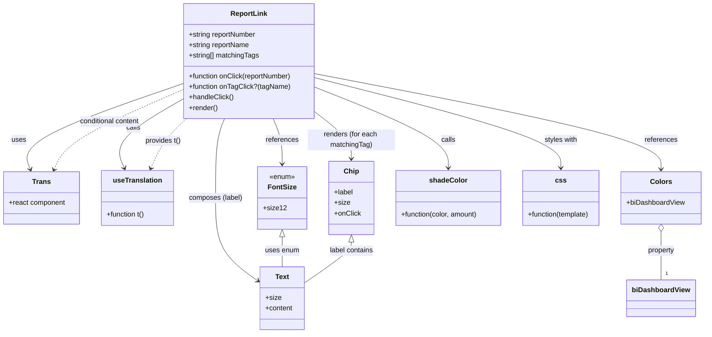

# Diagram: web/portal/src/pages/reports/bi-dashboard-next/components/atoms/Reports.ReportLink.atom.tsx

> Auto-generated by Obscura crawlers

## Mermaid

### SVG

<svg id="container" width="1616.375" xmlns="http://www.w3.org/2000/svg" class="classDiagram" height="764" viewBox="0 0 1616.375 764" role="graphics-document document" aria-roledescription="class"><g><defs><marker id="container_class-aggregationStart" class="marker aggregation class" refX="18" refY="7" markerWidth="190" markerHeight="240" orient="auto"><path d="M 18,7 L9,13 L1,7 L9,1 Z"></path></marker></defs><defs><marker id="container_class-aggregationEnd" class="marker aggregation class" refX="1" refY="7" markerWidth="20" markerHeight="28" orient="auto"><path d="M 18,7 L9,13 L1,7 L9,1 Z"></path></marker></defs><defs><marker id="container_class-extensionStart" class="marker extension class" refX="18" refY="7" markerWidth="190" markerHeight="240" orient="auto"><path d="M 1,7 L18,13 V 1 Z"></path></marker></defs><defs><marker id="container_class-extensionEnd" class="marker extension class" refX="1" refY="7" markerWidth="20" markerHeight="28" orient="auto"><path d="M 1,1 V 13 L18,7 Z"></path></marker></defs><defs><marker id="container_class-compositionStart" class="marker composition class" refX="18" refY="7" markerWidth="190" markerHeight="240" orient="auto"><path d="M 18,7 L9,13 L1,7 L9,1 Z"></path></marker></defs><defs><marker id="container_class-compositionEnd" class="marker composition class" refX="1" refY="7" markerWidth="20" markerHeight="28" orient="auto"><path d="M 18,7 L9,13 L1,7 L9,1 Z"></path></marker></defs><defs><marker id="container_class-dependencyStart" class="marker dependency class" refX="6" refY="7" markerWidth="190" markerHeight="240" orient="auto"><path d="M 5,7 L9,13 L1,7 L9,1 Z"></path></marker></defs><defs><marker id="container_class-dependencyEnd" class="marker dependency class" refX="13" refY="7" markerWidth="20" markerHeight="28" orient="auto"><path d="M 18,7 L9,13 L14,7 L9,1 Z"></path></marker></defs><defs><marker id="container_class-lollipopStart" class="marker lollipop class" refX="13" refY="7" markerWidth="190" markerHeight="240" orient="auto"><circle stroke="black" fill="transparent" cx="7" cy="7" r="6"></circle></marker></defs><defs><marker id="container_class-lollipopEnd" class="marker lollipop class" refX="1" refY="7" markerWidth="190" markerHeight="240" orient="auto"><circle stroke="black" fill="transparent" cx="7" cy="7" r="6"></circle></marker></defs><g class="root"><g class="clusters"></g><g class="edgePaths"><path d="M419.535,191.874L356.566,213.395C293.596,234.916,167.658,277.958,109.232,310.719C50.806,343.479,59.893,365.958,64.437,377.198L68.98,388.437" id="id_ReportLink_Trans_1" class="edge-thickness-normal edge-pattern-solid relation" style=";;;" data-edge="true" data-et="edge" data-id="id_ReportLink_Trans_1" data-points="W3sieCI6NDE5LjUzNTE1NjI1LCJ5IjoxOTEuODc0MTA4NDQwMjIyMTZ9LHsieCI6NDEuNzE4NzUsInkiOjMyMX0seyJ4Ijo3MS4yMjkyMDU4MjcwNjc2NywieSI6Mzk0fV0=" marker-end="url(#container_class-dependencyEnd)"></path><path d="M419.535,228.161L392.896,243.634C366.257,259.108,312.979,290.054,290.924,316.274C268.87,342.494,278.038,363.987,282.622,374.734L287.206,385.481" id="id_ReportLink_useTranslation_2" class="edge-thickness-normal edge-pattern-solid relation" style=";;;" data-edge="true" data-et="edge" data-id="id_ReportLink_useTranslation_2" data-points="W3sieCI6NDE5LjUzNTE1NjI1LCJ5IjoyMjguMTYxMzA2Njk5NTkzMjR9LHsieCI6MjU5LjcwMTE3MTg3NSwieSI6MzIxfSx7IngiOjI4OS41NjAzNDEyODI4OTQ3NCwieSI6MzkxfV0=" marker-end="url(#container_class-dependencyEnd)"></path><path d="M723.098,258.222L736.531,268.685C749.964,279.148,776.829,300.074,790.262,317.704C803.695,335.333,803.695,349.667,803.695,356.833L803.695,364" id="id_ReportLink_Chip_3" class="edge-thickness-normal edge-pattern-solid relation" style=";;;" data-edge="true" data-et="edge" data-id="id_ReportLink_Chip_3" data-points="W3sieCI6NzIzLjA5NzY1NjI1LCJ5IjoyNTguMjIyNDYxMjk1MzY1NX0seyJ4Ijo4MDMuNjk1MzEyNSwieSI6MzIxfSx7IngiOjgwMy42OTUzMTI1LCJ5IjozNzB9XQ==" marker-end="url(#container_class-dependencyEnd)"></path><path d="M516.948,272L513.584,280.167C510.22,288.333,503.493,304.667,500.129,335C496.766,365.333,496.766,409.667,496.766,452C496.766,494.333,496.766,534.667,512.239,566.145C527.712,597.623,558.659,620.247,574.132,631.558L589.606,642.87" id="id_ReportLink_Text_4" class="edge-thickness-normal edge-pattern-solid relation" style=";;;" data-edge="true" data-et="edge" data-id="id_ReportLink_Text_4" data-points="W3sieCI6NTE2Ljk0Nzg4MDY5NzUxMzgsInkiOjI3Mn0seyJ4Ijo0OTYuNzY1NjI1LCJ5IjozMjF9LHsieCI6NDk2Ljc2NTYyNSwieSI6NDU0fSx7IngiOjQ5Ni43NjU2MjUsInkiOjU3NX0seyJ4Ijo1OTQuNDQ5MjE4NzUsInkiOjY0Ni40MTExMzQzOTg3NDI0fV0=" marker-end="url(#container_class-dependencyEnd)"></path><path d="M625.685,272L629.049,280.167C632.412,288.333,639.14,304.667,642.503,322C645.867,339.333,645.867,357.667,645.867,366.833L645.867,376" id="id_ReportLink_FontSize_5" class="edge-thickness-normal edge-pattern-solid relation" style=";;;" data-edge="true" data-et="edge" data-id="id_ReportLink_FontSize_5" data-points="W3sieCI6NjI1LjY4NDkzMTgwMjQ4NjIsInkiOjI3Mn0seyJ4Ijo2NDUuODY3MTg3NSwieSI6MzIxfSx7IngiOjY0NS44NjcxODc1LCJ5IjozODJ9XQ==" marker-end="url(#container_class-dependencyEnd)"></path><path d="M723.098,169.022L855.569,194.352C988.04,219.681,1252.983,270.341,1385.454,306.837C1517.926,343.333,1517.926,365.667,1517.926,376.833L1517.926,388" id="id_ReportLink_Colors_6" class="edge-thickness-normal edge-pattern-solid relation" style=";;;" data-edge="true" data-et="edge" data-id="id_ReportLink_Colors_6" data-points="W3sieCI6NzIzLjA5NzY1NjI1LCJ5IjoxNjkuMDIxOTAzODM0NDA5fSx7IngiOjE1MTcuOTI1NzgxMjUsInkiOjMyMX0seyJ4IjoxNTE3LjkyNTc4MTI1LCJ5IjozOTR9XQ==" marker-end="url(#container_class-dependencyEnd)"></path><path d="M723.098,200.41L773.595,220.508C824.092,240.607,925.087,280.803,975.585,311.568C1026.082,342.333,1026.082,363.667,1026.082,374.333L1026.082,385" id="id_ReportLink_shadeColor_7" class="edge-thickness-normal edge-pattern-solid relation" style=";;;" data-edge="true" data-et="edge" data-id="id_ReportLink_shadeColor_7" data-points="W3sieCI6NzIzLjA5NzY1NjI1LCJ5IjoyMDAuNDEwMDMyNjQwNDM5OH0seyJ4IjoxMDI2LjA4MjAzMTI1LCJ5IjozMjF9LHsieCI6MTAyNi4wODIwMzEyNSwieSI6MzkxfV0=" marker-end="url(#container_class-dependencyEnd)"></path><path d="M723.098,178.344L817.214,202.12C911.329,225.896,1099.561,273.448,1193.677,307.891C1287.793,342.333,1287.793,363.667,1287.793,374.333L1287.793,385" id="id_ReportLink_css_8" class="edge-thickness-normal edge-pattern-solid relation" style=";;;" data-edge="true" data-et="edge" data-id="id_ReportLink_css_8" data-points="W3sieCI6NzIzLjA5NzY1NjI1LCJ5IjoxNzguMzQzNzYxMjQ0ODA2OTZ9LHsieCI6MTI4Ny43OTI5Njg3NSwieSI6MzIxfSx7IngiOjEyODcuNzkyOTY4NzUsInkiOjM5MX1d" marker-end="url(#container_class-dependencyEnd)"></path><path d="M1517.926,531.25L1517.926,538.542C1517.926,545.833,1517.926,560.417,1517.926,578.875C1517.926,597.333,1517.926,619.667,1517.926,630.833L1517.926,642" id="id_Colors_biDashboardView_9" class="edge-thickness-normal edge-pattern-solid relation" style=";;;" data-edge="true" data-et="edge" data-id="id_Colors_biDashboardView_9" data-points="W3sieCI6MTUxNy45MjU3ODEyNSwieSI6NTE0fSx7IngiOjE1MTcuOTI1NzgxMjUsInkiOjU3NX0seyJ4IjoxNTE3LjkyNTc4MTI1LCJ5Ijo2NDJ9XQ==" marker-start="url(#container_class-aggregationStart)"></path><path d="M645.867,543.25L645.867,548.542C645.867,553.833,645.867,564.417,645.867,575.875C645.867,587.333,645.867,599.667,645.867,605.833L645.867,612" id="id_FontSize_Text_10" class="edge-thickness-normal edge-pattern-solid relation" style=";;;" data-edge="true" data-et="edge" data-id="id_FontSize_Text_10" data-points="W3sieCI6NjQ1Ljg2NzE4NzUsInkiOjUyNn0seyJ4Ijo2NDUuODY3MTg3NSwieSI6NTc1fSx7IngiOjY0NS44NjcxODc1LCJ5Ijo2MTJ9XQ==" marker-start="url(#container_class-extensionStart)"></path><path d="M803.695,555.25L803.695,558.542C803.695,561.833,803.695,568.417,785.96,583.957C768.225,599.496,732.755,623.993,715.02,636.241L697.285,648.489" id="id_Chip_Text_11" class="edge-thickness-normal edge-pattern-solid relation" style=";;;" data-edge="true" data-et="edge" data-id="id_Chip_Text_11" data-points="W3sieCI6ODAzLjY5NTMxMjUsInkiOjUzOH0seyJ4Ijo4MDMuNjk1MzEyNSwieSI6NTc1fSx7IngiOjY5Ny4yODUxNTYyNSwieSI6NjQ4LjQ4OTQ4MTIzOTQ4MTN9XQ==" marker-start="url(#container_class-extensionStart)"></path><path d="M123.432,388.481L128.23,377.234C133.027,365.987,142.622,343.494,191.972,313.005C241.323,282.517,330.429,244.034,374.982,224.793L419.535,205.551" id="id_Trans_ReportLink_12" class="edge-thickness-normal edge-pattern-dashed relation" style=";;;" data-edge="true" data-et="edge" data-id="id_Trans_ReportLink_12" data-points="W3sieCI6MTIxLjA3Nzk0ODc3ODE5NTQ5LCJ5IjozOTR9LHsieCI6MTUyLjIxNjc5Njg3NSwieSI6MzIxfSx7IngiOjQxOS41MzUxNTYyNSwieSI6MjA1LjU1MTAxODUwNjAwNDc3fV0=" marker-start="url(#container_class-dependencyStart)"></path><path d="M347.023,385.522L351.827,374.768C356.631,364.014,366.238,342.507,379.862,323.587C393.485,304.667,411.124,288.333,419.944,280.167L428.763,272" id="id_useTranslation_ReportLink_13" class="edge-thickness-normal edge-pattern-dashed relation" style=";;;" data-edge="true" data-et="edge" data-id="id_useTranslation_ReportLink_13" data-points="W3sieCI6MzQ0LjU3NjE3MTg3NSwieSI6MzkxfSx7IngiOjM3NS44NDU3MDMxMjUsInkiOjMyMX0seyJ4Ijo0MjguNzYzMTg2MjkxNDM2NDUsInkiOjI3Mn1d" marker-start="url(#container_class-dependencyStart)"></path></g><g class="edgeLabels"><g class="edgeLabel" transform="translate(41.71875, 321)"><g class="label" data-id="id_ReportLink_Trans_1" transform="translate(-16.4921875, -12)"><foreignObject width="32.984375" height="24">

uses

</foreignObject></g></g><g class="edgeLabel" transform="translate(306.71477, 293.69241)"><g class="label" data-id="id_ReportLink_useTranslation_2" transform="translate(-16.4453125, -12)"><foreignObject width="32.890625" height="24">

calls

</foreignObject></g></g><g class="edgeLabel" transform="translate(803.6953125, 321)"><g class="label" data-id="id_ReportLink_Chip_3" transform="translate(-100, -24)"><foreignObject width="200" height="48">

renders (for each matchingTag)

</foreignObject></g></g><g class="edgeLabel" transform="translate(496.765625, 454)"><g class="label" data-id="id_ReportLink_Text_4" transform="translate(-61.8671875, -12)"><foreignObject width="123.734375" height="24">

composes (label)

</foreignObject></g></g><g class="edgeLabel" transform="translate(645.8671875, 321)"><g class="label" data-id="id_ReportLink_FontSize_5" transform="translate(-37.828125, -12)"><foreignObject width="75.65625" height="24">

references

</foreignObject></g></g><g class="edgeLabel" transform="translate(1517.92578125, 321)"><g class="label" data-id="id_ReportLink_Colors_6" transform="translate(-37.828125, -12)"><foreignObject width="75.65625" height="24">

references

</foreignObject></g></g><g class="edgeLabel" transform="translate(1026.08203125, 321)"><g class="label" data-id="id_ReportLink_shadeColor_7" transform="translate(-16.4453125, -12)"><foreignObject width="32.890625" height="24">

calls

</foreignObject></g></g><g class="edgeLabel" transform="translate(1287.79296875, 321)"><g class="label" data-id="id_ReportLink_css_8" transform="translate(-38.609375, -12)"><foreignObject width="77.21875" height="24">

styles with

</foreignObject></g></g><g class="edgeLabel" transform="translate(1517.92578125, 575)"><g class="label" data-id="id_Colors_biDashboardView_9" transform="translate(-31.2578125, -12)"><foreignObject width="62.515625" height="24">

property

</foreignObject></g></g><g class="edgeLabel" transform="translate(645.8671875, 575)"><g class="label" data-id="id_FontSize_Text_10" transform="translate(-39.171875, -12)"><foreignObject width="78.34375" height="24">

uses enum

</foreignObject></g></g><g class="edgeLabel" transform="translate(803.6953125, 575)"><g class="label" data-id="id_Chip_Text_11" transform="translate(-51.125, -12)"><foreignObject width="102.25" height="24">

label contains

</foreignObject></g></g><g class="edgeLabel" transform="translate(249.44627, 279.00871)"><g class="label" data-id="id_Trans_ReportLink_12" transform="translate(-71.0390625, -12)"><foreignObject width="142.078125" height="24">

conditional content

</foreignObject></g></g><g class="edgeLabel" transform="translate(374.91844, 323.07578)"><g class="label" data-id="id_useTranslation_ReportLink_13" transform="translate(-41.5078125, -12)"><foreignObject width="83.015625" height="24">

provides t()

</foreignObject></g></g><g class="edgeTerminals" transform="translate(1527.925780625, 619.4999994642857)"><g class="inner" transform="translate(0, 0)"></g><foreignObject style="width: 9px; height: 12px;">
1
</foreignObject></g></g><g class="nodes"><g class="node default" id="classId-ReportLink-0" transform="translate(571.31640625, 140)"><g class="basic label-container"><path d="M-151.78125 -132 L151.78125 -132 L151.78125 132 L-151.78125 132" stroke="none" stroke-width="0" fill="#ECECFF" style=""></path><path d="M-151.78125 -132 C-35.653548273694284 -132, 80.47415345261143 -132, 151.78125 -132 M-151.78125 -132 C-59.84302469289129 -132, 32.09520061421742 -132, 151.78125 -132 M151.78125 -132 C151.78125 -28.075056974577095, 151.78125 75.84988605084581, 151.78125 132 M151.78125 -132 C151.78125 -35.82828730372739, 151.78125 60.343425392545214, 151.78125 132 M151.78125 132 C70.56766529328027 132, -10.645919413439458 132, -151.78125 132 M151.78125 132 C73.41908067987825 132, -4.943088640243502 132, -151.78125 132 M-151.78125 132 C-151.78125 49.0761511418558, -151.78125 -33.847697716288394, -151.78125 -132 M-151.78125 132 C-151.78125 27.184545084141334, -151.78125 -77.63090983171733, -151.78125 -132" stroke="#9370DB" stroke-width="1.3" fill="none" stroke-dasharray="0 0" style=""></path></g><g class="annotation-group text" transform="translate(0, -108)"></g><g class="label-group text" transform="translate(-40.375, -108)"><g class="label" style="font-weight: bolder" transform="translate(0,-12)"><foreignObject width="80.75" height="24">

ReportLink

</foreignObject></g></g><g class="members-group text" transform="translate(-139.78125, -60)"><g class="label" style="" transform="translate(0,-12)"><foreignObject width="157.4375" height="24">

+string reportNumber

</foreignObject></g><g class="label" style="" transform="translate(0,12)"><foreignObject width="141.140625" height="24">

+string reportName

</foreignObject></g><g class="label" style="" transform="translate(0,36)"><foreignObject width="163.046875" height="24">

+string[] matchingTags

</foreignObject></g></g><g class="methods-group text" transform="translate(-139.78125, 36)"><g class="label" style="" transform="translate(0,-12)"><foreignObject width="239.1875" height="24">

+function onClick(reportNumber)

</foreignObject></g><g class="label" style="" transform="translate(0,12)"><foreignObject width="231.5" height="24">

+function onTagClick?(tagName)

</foreignObject></g><g class="label" style="" transform="translate(0,36)"><foreignObject width="102.546875" height="24">

+handleClick()

</foreignObject></g><g class="label" style="" transform="translate(0,60)"><foreignObject width="66.609375" height="24">

+render()

</foreignObject></g></g><g class="divider" style=""><path d="M-151.78125 -84 C-55.19511827406443 -84, 41.391013451871146 -84, 151.78125 -84 M-151.78125 -84 C-74.84459169586611 -84, 2.0920666082677712 -84, 151.78125 -84" stroke="#9370DB" stroke-width="1.3" fill="none" stroke-dasharray="0 0" style=""></path></g><g class="divider" style=""><path d="M-151.78125 12 C-45.45537405021375 12, 60.8705018995725 12, 151.78125 12 M-151.78125 12 C-77.4151672827782 12, -3.0490845655563987 12, 151.78125 12" stroke="#9370DB" stroke-width="1.3" fill="none" stroke-dasharray="0 0" style=""></path></g></g><g class="node default" id="classId-Trans-1" transform="translate(95.484375, 454)"><g class="basic label-container"><path d="M-87.484375 -60 L87.484375 -60 L87.484375 60 L-87.484375 60" stroke="none" stroke-width="0" fill="#ECECFF" style=""></path><path d="M-87.484375 -60 C-33.097879009806476 -60, 21.288616980387047 -60, 87.484375 -60 M-87.484375 -60 C-20.201941684526204 -60, 47.08049163094759 -60, 87.484375 -60 M87.484375 -60 C87.484375 -14.104155794845134, 87.484375 31.79168841030973, 87.484375 60 M87.484375 -60 C87.484375 -20.202584975836544, 87.484375 19.594830048326912, 87.484375 60 M87.484375 60 C26.716561875107146 60, -34.05125124978571 60, -87.484375 60 M87.484375 60 C19.39756877413869 60, -48.68923745172262 60, -87.484375 60 M-87.484375 60 C-87.484375 27.610344216777882, -87.484375 -4.779311566444235, -87.484375 -60 M-87.484375 60 C-87.484375 30.964446292250784, -87.484375 1.9288925845015683, -87.484375 -60" stroke="#9370DB" stroke-width="1.3" fill="none" stroke-dasharray="0 0" style=""></path></g><g class="annotation-group text" transform="translate(0, -36)"></g><g class="label-group text" transform="translate(-19.875, -36)"><g class="label" style="font-weight: bolder" transform="translate(0,-12)"><foreignObject width="39.75" height="24">

Trans

</foreignObject></g></g><g class="members-group text" transform="translate(-75.484375, 12)"><g class="label" style="" transform="translate(0,-12)"><foreignObject width="131.09375" height="24">

+react component

</foreignObject></g></g><g class="methods-group text" transform="translate(-75.484375, 60)"></g><g class="divider" style=""><path d="M-87.484375 -12 C-51.94785885552393 -12, -16.411342711047865 -12, 87.484375 -12 M-87.484375 -12 C-46.750343409319626 -12, -6.016311818639252 -12, 87.484375 -12" stroke="#9370DB" stroke-width="1.3" fill="none" stroke-dasharray="0 0" style=""></path></g><g class="divider" style=""><path d="M-87.484375 36 C-26.71307901757188 36, 34.05821696485624 36, 87.484375 36 M-87.484375 36 C-24.810258802249123 36, 37.86385739550175 36, 87.484375 36" stroke="#9370DB" stroke-width="1.3" fill="none" stroke-dasharray="0 0" style=""></path></g></g><g class="node default" id="classId-useTranslation-2" transform="translate(316.43359375, 454)"><g class="basic label-container"><path d="M-83.46484375 -63 L83.46484375 -63 L83.46484375 63 L-83.46484375 63" stroke="none" stroke-width="0" fill="#ECECFF" style=""></path><path d="M-83.46484375 -63 C-27.447407484158994 -63, 28.570028781682012 -63, 83.46484375 -63 M-83.46484375 -63 C-40.65137049076779 -63, 2.162102768464422 -63, 83.46484375 -63 M83.46484375 -63 C83.46484375 -30.538502679054822, 83.46484375 1.9229946418903552, 83.46484375 63 M83.46484375 -63 C83.46484375 -25.35341656732559, 83.46484375 12.293166865348823, 83.46484375 63 M83.46484375 63 C20.66782987717177 63, -42.12918399565646 63, -83.46484375 63 M83.46484375 63 C17.004070620215657 63, -49.456702509568686 63, -83.46484375 63 M-83.46484375 63 C-83.46484375 17.71097209570702, -83.46484375 -27.578055808585958, -83.46484375 -63 M-83.46484375 63 C-83.46484375 16.812748255609613, -83.46484375 -29.374503488780775, -83.46484375 -63" stroke="#9370DB" stroke-width="1.3" fill="none" stroke-dasharray="0 0" style=""></path></g><g class="annotation-group text" transform="translate(0, -39)"></g><g class="label-group text" transform="translate(-54.0859375, -39)"><g class="label" style="font-weight: bolder" transform="translate(0,-12)"><foreignObject width="108.171875" height="24">

useTranslation

</foreignObject></g></g><g class="members-group text" transform="translate(-71.46484375, 9)"></g><g class="methods-group text" transform="translate(-71.46484375, 39)"><g class="label" style="" transform="translate(0,-12)"><foreignObject width="88.84375" height="24">

+function t()

</foreignObject></g></g><g class="divider" style=""><path d="M-83.46484375 -15 C-25.872174584228688 -15, 31.720494581542624 -15, 83.46484375 -15 M-83.46484375 -15 C-34.32110455483456 -15, 14.822634640330875 -15, 83.46484375 -15" stroke="#9370DB" stroke-width="1.3" fill="none" stroke-dasharray="0 0" style=""></path></g><g class="divider" style=""><path d="M-83.46484375 9 C-33.86628765856943 9, 15.732268432861133 9, 83.46484375 9 M-83.46484375 9 C-38.04961695322796 9, 7.365609843544078 9, 83.46484375 9" stroke="#9370DB" stroke-width="1.3" fill="none" stroke-dasharray="0 0" style=""></path></g></g><g class="node default" id="classId-Chip-3" transform="translate(803.6953125, 454)"><g class="basic label-container"><path d="M-50.359375 -84 L50.359375 -84 L50.359375 84 L-50.359375 84" stroke="none" stroke-width="0" fill="#ECECFF" style=""></path><path d="M-50.359375 -84 C-21.968016238260923 -84, 6.423342523478155 -84, 50.359375 -84 M-50.359375 -84 C-15.591228538432958 -84, 19.176917923134084 -84, 50.359375 -84 M50.359375 -84 C50.359375 -17.131743061148313, 50.359375 49.73651387770337, 50.359375 84 M50.359375 -84 C50.359375 -44.75304112388604, 50.359375 -5.506082247772085, 50.359375 84 M50.359375 84 C20.615402052351648 84, -9.128570895296704 84, -50.359375 84 M50.359375 84 C19.9967621310513 84, -10.365850737897397 84, -50.359375 84 M-50.359375 84 C-50.359375 49.046763731690724, -50.359375 14.093527463381449, -50.359375 -84 M-50.359375 84 C-50.359375 32.25348634388086, -50.359375 -19.493027312238283, -50.359375 -84" stroke="#9370DB" stroke-width="1.3" fill="none" stroke-dasharray="0 0" style=""></path></g><g class="annotation-group text" transform="translate(0, -60)"></g><g class="label-group text" transform="translate(-16.171875, -60)"><g class="label" style="font-weight: bolder" transform="translate(0,-12)"><foreignObject width="32.34375" height="24">

Chip

</foreignObject></g></g><g class="members-group text" transform="translate(-38.359375, -12)"><g class="label" style="" transform="translate(0,-12)"><foreignObject width="44.21875" height="24">

+label

</foreignObject></g><g class="label" style="" transform="translate(0,12)"><foreignObject width="35.578125" height="24">

+size

</foreignObject></g><g class="label" style="" transform="translate(0,36)"><foreignObject width="60.546875" height="24">

+onClick

</foreignObject></g></g><g class="methods-group text" transform="translate(-38.359375, 84)"></g><g class="divider" style=""><path d="M-50.359375 -36 C-12.862831672760308 -36, 24.633711654479384 -36, 50.359375 -36 M-50.359375 -36 C-27.655447473892348 -36, -4.951519947784696 -36, 50.359375 -36" stroke="#9370DB" stroke-width="1.3" fill="none" stroke-dasharray="0 0" style=""></path></g><g class="divider" style=""><path d="M-50.359375 60 C-29.791478551957926 60, -9.223582103915852 60, 50.359375 60 M-50.359375 60 C-21.593984777053766 60, 7.171405445892468 60, 50.359375 60" stroke="#9370DB" stroke-width="1.3" fill="none" stroke-dasharray="0 0" style=""></path></g></g><g class="node default" id="classId-Text-4" transform="translate(645.8671875, 684)"><g class="basic label-container"><path d="M-51.41796875 -72 L51.41796875 -72 L51.41796875 72 L-51.41796875 72" stroke="none" stroke-width="0" fill="#ECECFF" style=""></path><path d="M-51.41796875 -72 C-21.15718749416009 -72, 9.103593761679818 -72, 51.41796875 -72 M-51.41796875 -72 C-14.069337794333492 -72, 23.279293161333015 -72, 51.41796875 -72 M51.41796875 -72 C51.41796875 -39.281466495095906, 51.41796875 -6.562932990191811, 51.41796875 72 M51.41796875 -72 C51.41796875 -20.1721528262744, 51.41796875 31.655694347451202, 51.41796875 72 M51.41796875 72 C26.119879113361353 72, 0.8217894767227065 72, -51.41796875 72 M51.41796875 72 C19.152653435171267 72, -13.112661879657466 72, -51.41796875 72 M-51.41796875 72 C-51.41796875 24.1268777930121, -51.41796875 -23.746244413975802, -51.41796875 -72 M-51.41796875 72 C-51.41796875 23.752975582360293, -51.41796875 -24.494048835279415, -51.41796875 -72" stroke="#9370DB" stroke-width="1.3" fill="none" stroke-dasharray="0 0" style=""></path></g><g class="annotation-group text" transform="translate(0, -48)"></g><g class="label-group text" transform="translate(-15.3828125, -48)"><g class="label" style="font-weight: bolder" transform="translate(0,-12)"><foreignObject width="30.765625" height="24">

Text

</foreignObject></g></g><g class="members-group text" transform="translate(-39.41796875, 0)"><g class="label" style="" transform="translate(0,-12)"><foreignObject width="35.578125" height="24">

+size

</foreignObject></g><g class="label" style="" transform="translate(0,12)"><foreignObject width="63.453125" height="24">

+content

</foreignObject></g></g><g class="methods-group text" transform="translate(-39.41796875, 72)"></g><g class="divider" style=""><path d="M-51.41796875 -24 C-21.995451032599746 -24, 7.427066684800508 -24, 51.41796875 -24 M-51.41796875 -24 C-24.18982560813235 -24, 3.0383175337353023 -24, 51.41796875 -24" stroke="#9370DB" stroke-width="1.3" fill="none" stroke-dasharray="0 0" style=""></path></g><g class="divider" style=""><path d="M-51.41796875 48 C-23.47850456997014 48, 4.460959610059717 48, 51.41796875 48 M-51.41796875 48 C-27.071372239162805 48, -2.7247757283256107 48, 51.41796875 48" stroke="#9370DB" stroke-width="1.3" fill="none" stroke-dasharray="0 0" style=""></path></g></g><g class="node default" id="classId-FontSize-5" transform="translate(645.8671875, 454)"><g class="basic label-container"><path d="M-52.234375 -72 L52.234375 -72 L52.234375 72 L-52.234375 72" stroke="none" stroke-width="0" fill="#ECECFF" style=""></path><path d="M-52.234375 -72 C-10.528356826402238 -72, 31.177661347195524 -72, 52.234375 -72 M-52.234375 -72 C-11.40926511474538 -72, 29.41584477050924 -72, 52.234375 -72 M52.234375 -72 C52.234375 -40.15757193615286, 52.234375 -8.315143872305725, 52.234375 72 M52.234375 -72 C52.234375 -31.2815659938288, 52.234375 9.436868012342401, 52.234375 72 M52.234375 72 C22.03275493042928 72, -8.168865139141438 72, -52.234375 72 M52.234375 72 C15.705433811064132 72, -20.823507377871735 72, -52.234375 72 M-52.234375 72 C-52.234375 21.896218345778905, -52.234375 -28.20756330844219, -52.234375 -72 M-52.234375 72 C-52.234375 30.8097569097136, -52.234375 -10.380486180572802, -52.234375 -72" stroke="#9370DB" stroke-width="1.3" fill="none" stroke-dasharray="0 0" style=""></path></g><g class="annotation-group text" transform="translate(-29.53125, -48)"><g class="label" style="" transform="translate(0,-12)"><foreignObject width="59.0625" height="24">

«enum»

</foreignObject></g></g><g class="label-group text" transform="translate(-30.84375, -24)"><g class="label" style="font-weight: bolder" transform="translate(0,-12)"><foreignObject width="61.6875" height="24">

FontSize

</foreignObject></g></g><g class="members-group text" transform="translate(-40.234375, 24)"><g class="label" style="" transform="translate(0,-12)"><foreignObject width="49.625" height="24">

+size12

</foreignObject></g></g><g class="methods-group text" transform="translate(-40.234375, 72)"></g><g class="divider" style=""><path d="M-52.234375 0 C-31.004819097101667 0, -9.775263194203333 0, 52.234375 0 M-52.234375 0 C-28.631883043740633 0, -5.029391087481265 0, 52.234375 0" stroke="#9370DB" stroke-width="1.3" fill="none" stroke-dasharray="0 0" style=""></path></g><g class="divider" style=""><path d="M-52.234375 48 C-20.56046700617845 48, 11.113440987643102 48, 52.234375 48 M-52.234375 48 C-26.686233729507926 48, -1.1380924590158514 48, 52.234375 48" stroke="#9370DB" stroke-width="1.3" fill="none" stroke-dasharray="0 0" style=""></path></g></g><g class="node default" id="classId-Colors-6" transform="translate(1517.92578125, 454)"><g class="basic label-container"><path d="M-90.44921875 -60 L90.44921875 -60 L90.44921875 60 L-90.44921875 60" stroke="none" stroke-width="0" fill="#ECECFF" style=""></path><path d="M-90.44921875 -60 C-21.40190136086865 -60, 47.6454160282627 -60, 90.44921875 -60 M-90.44921875 -60 C-49.51146082570934 -60, -8.573702901418685 -60, 90.44921875 -60 M90.44921875 -60 C90.44921875 -25.55946495601504, 90.44921875 8.881070087969917, 90.44921875 60 M90.44921875 -60 C90.44921875 -21.22302033688876, 90.44921875 17.553959326222483, 90.44921875 60 M90.44921875 60 C26.126611239846383 60, -38.19599627030723 60, -90.44921875 60 M90.44921875 60 C52.46554951731332 60, 14.48188028462664 60, -90.44921875 60 M-90.44921875 60 C-90.44921875 16.843181008971897, -90.44921875 -26.313637982056207, -90.44921875 -60 M-90.44921875 60 C-90.44921875 28.083488833792643, -90.44921875 -3.833022332414714, -90.44921875 -60" stroke="#9370DB" stroke-width="1.3" fill="none" stroke-dasharray="0 0" style=""></path></g><g class="annotation-group text" transform="translate(0, -36)"></g><g class="label-group text" transform="translate(-23.1015625, -36)"><g class="label" style="font-weight: bolder" transform="translate(0,-12)"><foreignObject width="46.203125" height="24">

Colors

</foreignObject></g></g><g class="members-group text" transform="translate(-78.44921875, 12)"><g class="label" style="" transform="translate(0,-12)"><foreignObject width="133.796875" height="24">

+biDashboardView

</foreignObject></g></g><g class="methods-group text" transform="translate(-78.44921875, 60)"></g><g class="divider" style=""><path d="M-90.44921875 -12 C-44.654723838202706 -12, 1.1397710735945878 -12, 90.44921875 -12 M-90.44921875 -12 C-51.566402810750205 -12, -12.68358687150041 -12, 90.44921875 -12" stroke="#9370DB" stroke-width="1.3" fill="none" stroke-dasharray="0 0" style=""></path></g><g class="divider" style=""><path d="M-90.44921875 36 C-41.603963887062136 36, 7.241290975875728 36, 90.44921875 36 M-90.44921875 36 C-37.977566459238545 36, 14.49408583152291 36, 90.44921875 36" stroke="#9370DB" stroke-width="1.3" fill="none" stroke-dasharray="0 0" style=""></path></g></g><g class="node default" id="classId-shadeColor-7" transform="translate(1026.08203125, 454)"><g class="basic label-container"><path d="M-122.02734375 -63 L122.02734375 -63 L122.02734375 63 L-122.02734375 63" stroke="none" stroke-width="0" fill="#ECECFF" style=""></path><path d="M-122.02734375 -63 C-68.8446102152509 -63, -15.661876680501777 -63, 122.02734375 -63 M-122.02734375 -63 C-29.534808774373502 -63, 62.957726201252996 -63, 122.02734375 -63 M122.02734375 -63 C122.02734375 -21.09088103158001, 122.02734375 20.818237936839978, 122.02734375 63 M122.02734375 -63 C122.02734375 -24.072939751679307, 122.02734375 14.854120496641386, 122.02734375 63 M122.02734375 63 C30.401244957524426 63, -61.22485383495115 63, -122.02734375 63 M122.02734375 63 C31.430059647376495 63, -59.16722445524701 63, -122.02734375 63 M-122.02734375 63 C-122.02734375 35.86582188335909, -122.02734375 8.731643766718172, -122.02734375 -63 M-122.02734375 63 C-122.02734375 14.63570442507853, -122.02734375 -33.72859114984294, -122.02734375 -63" stroke="#9370DB" stroke-width="1.3" fill="none" stroke-dasharray="0 0" style=""></path></g><g class="annotation-group text" transform="translate(0, -39)"></g><g class="label-group text" transform="translate(-41.4140625, -39)"><g class="label" style="font-weight: bolder" transform="translate(0,-12)"><foreignObject width="82.828125" height="24">

shadeColor

</foreignObject></g></g><g class="members-group text" transform="translate(-110.02734375, 9)"></g><g class="methods-group text" transform="translate(-110.02734375, 39)"><g class="label" style="" transform="translate(0,-12)"><foreignObject width="178.640625" height="24">

+function(color, amount)

</foreignObject></g></g><g class="divider" style=""><path d="M-122.02734375 -15 C-44.0119789974883 -15, 34.0033857550234 -15, 122.02734375 -15 M-122.02734375 -15 C-55.998669948091475 -15, 10.03000385381705 -15, 122.02734375 -15" stroke="#9370DB" stroke-width="1.3" fill="none" stroke-dasharray="0 0" style=""></path></g><g class="divider" style=""><path d="M-122.02734375 9 C-60.98690010986575 9, 0.053543530268498785 9, 122.02734375 9 M-122.02734375 9 C-69.76050000397773 9, -17.49365625795545 9, 122.02734375 9" stroke="#9370DB" stroke-width="1.3" fill="none" stroke-dasharray="0 0" style=""></path></g></g><g class="node default" id="classId-css-8" transform="translate(1287.79296875, 454)"><g class="basic label-container"><path d="M-89.68359375 -63 L89.68359375 -63 L89.68359375 63 L-89.68359375 63" stroke="none" stroke-width="0" fill="#ECECFF" style=""></path><path d="M-89.68359375 -63 C-23.27046372606891 -63, 43.14266629786218 -63, 89.68359375 -63 M-89.68359375 -63 C-28.016630475692722 -63, 33.650332798614556 -63, 89.68359375 -63 M89.68359375 -63 C89.68359375 -23.46411223256547, 89.68359375 16.07177553486906, 89.68359375 63 M89.68359375 -63 C89.68359375 -30.306566488126037, 89.68359375 2.386867023747925, 89.68359375 63 M89.68359375 63 C40.303919393583605 63, -9.07575496283279 63, -89.68359375 63 M89.68359375 63 C18.592027755379505 63, -52.49953823924099 63, -89.68359375 63 M-89.68359375 63 C-89.68359375 24.450525578065786, -89.68359375 -14.098948843868428, -89.68359375 -63 M-89.68359375 63 C-89.68359375 34.0499403681484, -89.68359375 5.099880736296797, -89.68359375 -63" stroke="#9370DB" stroke-width="1.3" fill="none" stroke-dasharray="0 0" style=""></path></g><g class="annotation-group text" transform="translate(0, -39)"></g><g class="label-group text" transform="translate(-11.5078125, -39)"><g class="label" style="font-weight: bolder" transform="translate(0,-12)"><foreignObject width="23.015625" height="24">

css

</foreignObject></g></g><g class="members-group text" transform="translate(-77.68359375, 9)"></g><g class="methods-group text" transform="translate(-77.68359375, 39)"><g class="label" style="" transform="translate(0,-12)"><foreignObject width="143.859375" height="24">

+function(template)

</foreignObject></g></g><g class="divider" style=""><path d="M-89.68359375 -15 C-37.114401184786644 -15, 15.454791380426713 -15, 89.68359375 -15 M-89.68359375 -15 C-44.6016310673443 -15, 0.4803316153113997 -15, 89.68359375 -15" stroke="#9370DB" stroke-width="1.3" fill="none" stroke-dasharray="0 0" style=""></path></g><g class="divider" style=""><path d="M-89.68359375 9 C-27.288665117558047 9, 35.106263514883906 9, 89.68359375 9 M-89.68359375 9 C-24.46560627539678 9, 40.75238119920644 9, 89.68359375 9" stroke="#9370DB" stroke-width="1.3" fill="none" stroke-dasharray="0 0" style=""></path></g></g><g class="node default" id="classId-biDashboardView-9" transform="translate(1517.92578125, 684)"><g class="basic label-container"><path d="M-75.6953125 -42 L75.6953125 -42 L75.6953125 42 L-75.6953125 42" stroke="none" stroke-width="0" fill="#ECECFF" style=""></path><path d="M-75.6953125 -42 C-23.415820254732182 -42, 28.863671990535636 -42, 75.6953125 -42 M-75.6953125 -42 C-29.02389747519861 -42, 17.64751754960278 -42, 75.6953125 -42 M75.6953125 -42 C75.6953125 -23.744207464632503, 75.6953125 -5.488414929265005, 75.6953125 42 M75.6953125 -42 C75.6953125 -19.476543504717327, 75.6953125 3.046912990565346, 75.6953125 42 M75.6953125 42 C20.046526007596235 42, -35.60226048480753 42, -75.6953125 42 M75.6953125 42 C39.61219551892517 42, 3.5290785378503386 42, -75.6953125 42 M-75.6953125 42 C-75.6953125 24.948512350029194, -75.6953125 7.897024700058388, -75.6953125 -42 M-75.6953125 42 C-75.6953125 23.731164622679042, -75.6953125 5.4623292453580845, -75.6953125 -42" stroke="#9370DB" stroke-width="1.3" fill="none" stroke-dasharray="0 0" style=""></path></g><g class="annotation-group text" transform="translate(0, -18)"></g><g class="label-group text" transform="translate(-63.6953125, -18)"><g class="label" style="font-weight: bolder" transform="translate(0,-12)"><foreignObject width="127.390625" height="24">

biDashboardView

</foreignObject></g></g><g class="members-group text" transform="translate(-63.6953125, 30)"></g><g class="methods-group text" transform="translate(-63.6953125, 60)"></g><g class="divider" style=""><path d="M-75.6953125 6 C-30.28121874213209 6, 15.13287501573582 6, 75.6953125 6 M-75.6953125 6 C-26.661635260093654 6, 22.372041979812693 6, 75.6953125 6" stroke="#9370DB" stroke-width="1.3" fill="none" stroke-dasharray="0 0" style=""></path></g><g class="divider" style=""><path d="M-75.6953125 24 C-28.130325395528594 24, 19.434661708942812 24, 75.6953125 24 M-75.6953125 24 C-26.783519171747564 24, 22.128274156504872 24, 75.6953125 24" stroke="#9370DB" stroke-width="1.3" fill="none" stroke-dasharray="0 0" style=""></path></g></g></g></g></g></svg>
