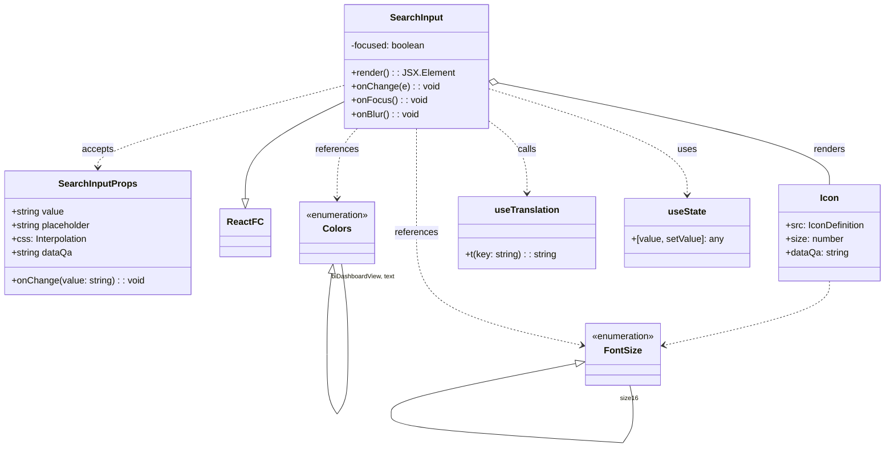

# Diagram: web/portal/src/pages/reports/bi-dashboard-next/components/atoms/Reports.SearchInput.atom.tsx

> Auto-generated by Obscura crawlers

## Mermaid

```mermaid
classDiagram
class SearchInputProps {
  +string value
  +onChange(value: string): void
  +string placeholder
  +css: Interpolation<Theme>
  +string dataQa
}
class SearchInput {
  -focused: boolean
  +render(): JSX.Element
  +onChange(e): void
  +onFocus(): void
  +onBlur(): void
}
class ReactFC
class Icon {
  +src: IconDefinition
  +size: number
  +dataQa: string
}
class Colors <<enumeration>>
class FontSize <<enumeration>>
class useTranslation { +t(key: string): string }
class useState { +[value, setValue]: any }

SearchInput --|> ReactFC
SearchInput ..> SearchInputProps : accepts
SearchInput o-- Icon : renders
SearchInput ..> useTranslation : calls
SearchInput ..> useState : uses
SearchInput ..> Colors : references
SearchInput ..> FontSize : references
Icon ..> FontSize
Colors <|-- "biDashboardView, text" Colors
FontSize <|-- "size16" FontSize
```

> SVG rendering failed for this diagram.
