# Diagram: web/portal/src/pages/reports/bi-dashboard-next/components/modals/ReportFilterSet.modal.container.tsx

> Auto-generated by Obscura crawlers

## Mermaid

```mermaid
classDiagram
    class ReportFilterSetModal
    class ReduxConnect
    class mapStateToProps
    class mapDispatchToProps
    class ShipmentsSearchBarState
    class FinishedVehicleSearchBarState
    class ContainerTrackingSearchBarState
    class ShipmentFilterSectionContainer
    class FinishedVehicleFilterSectionContainer
    class ContainerTrackingFilterSectionContainer
    class LocationsState
    class OrganizationsState

    ReportFilterSetModal --> ReduxConnect : connected via
    ReduxConnect --> mapStateToProps
    ReduxConnect --> mapDispatchToProps

    mapStateToProps --> OrganizationsState : solutionId = getSolutionId(state)
    mapStateToProps --> ShipmentsSearchBarState : shipmentSearchFilters = selectors.getSearchFilters(state)
    mapStateToProps --> FinishedVehicleSearchBarState : finishedVehicleSearchFilters = selectors.getSearchFilters(state)
    mapStateToProps --> ContainerTrackingSearchBarState : containerTrackingSearchFilters = selectors.getSearchFilters(state)
    mapStateToProps --> ShipmentFilterSectionContainer : includes
    mapStateToProps --> FinishedVehicleFilterSectionContainer : includes
    mapStateToProps --> ContainerTrackingFilterSectionContainer : includes
    mapStateToProps --> LocationsState : locations = getLocations(state)

    mapDispatchToProps --> ShipmentsSearchBarState : set/clearShipmentSearchFilters -> actionCreators
    mapDispatchToProps --> FinishedVehicleSearchBarState : set/clearFinishedVehicleSearchFilters -> actionCreators
    mapDispatchToProps --> ContainerTrackingSearchBarState : set/clearContainerTrackingSearchFilters -> actionCreators
    mapDispatchToProps --> LocationsState : fetchLocationDetails(locationId) -> dispatch(fetchLocationDetails)

    ShipmentsSearchBarState : +selectors.getSearchFilters(state)
    ShipmentsSearchBarState : +actionCreators.setSearchFilter(key,value)
    ShipmentsSearchBarState : +actionCreators.clearSearchFilters()

    FinishedVehicleSearchBarState : +selectors.getSearchFilters(state)
    FinishedVehicleSearchBarState : +actionCreators.setSearchFilter(key,value)
    FinishedVehicleSearchBarState : +actionCreators.clearSearchFilters()

    ContainerTrackingSearchBarState : +selectors.getSearchFilters(state)
    ContainerTrackingSearchBarState : +actionCreators.setSearchFilter(key,value)
    ContainerTrackingSearchBarState : +actionCreators.clearSearchFilters()

    LocationsState : +getLocations(state)
    LocationsState : +fetchLocationDetails(locationId)

    OrganizationsState : +getSolutionId(state)
```

### SVG

<svg id="container" width="3236.97265625" xmlns="http://www.w3.org/2000/svg" class="classDiagram" height="688" viewBox="0 0 3236.97265625 688" role="graphics-document document" aria-roledescription="class"><g><defs><marker id="container_class-aggregationStart" class="marker aggregation class" refX="18" refY="7" markerWidth="190" markerHeight="240" orient="auto"><path d="M 18,7 L9,13 L1,7 L9,1 Z"></path></marker></defs><defs><marker id="container_class-aggregationEnd" class="marker aggregation class" refX="1" refY="7" markerWidth="20" markerHeight="28" orient="auto"><path d="M 18,7 L9,13 L1,7 L9,1 Z"></path></marker></defs><defs><marker id="container_class-extensionStart" class="marker extension class" refX="18" refY="7" markerWidth="190" markerHeight="240" orient="auto"><path d="M 1,7 L18,13 V 1 Z"></path></marker></defs><defs><marker id="container_class-extensionEnd" class="marker extension class" refX="1" refY="7" markerWidth="20" markerHeight="28" orient="auto"><path d="M 1,1 V 13 L18,7 Z"></path></marker></defs><defs><marker id="container_class-compositionStart" class="marker composition class" refX="18" refY="7" markerWidth="190" markerHeight="240" orient="auto"><path d="M 18,7 L9,13 L1,7 L9,1 Z"></path></marker></defs><defs><marker id="container_class-compositionEnd" class="marker composition class" refX="1" refY="7" markerWidth="20" markerHeight="28" orient="auto"><path d="M 18,7 L9,13 L1,7 L9,1 Z"></path></marker></defs><defs><marker id="container_class-dependencyStart" class="marker dependency class" refX="6" refY="7" markerWidth="190" markerHeight="240" orient="auto"><path d="M 5,7 L9,13 L1,7 L9,1 Z"></path></marker></defs><defs><marker id="container_class-dependencyEnd" class="marker dependency class" refX="13" refY="7" markerWidth="20" markerHeight="28" orient="auto"><path d="M 18,7 L9,13 L14,7 L9,1 Z"></path></marker></defs><defs><marker id="container_class-lollipopStart" class="marker lollipop class" refX="13" refY="7" markerWidth="190" markerHeight="240" orient="auto"><circle stroke="black" fill="transparent" cx="7" cy="7" r="6"></circle></marker></defs><defs><marker id="container_class-lollipopEnd" class="marker lollipop class" refX="1" refY="7" markerWidth="190" markerHeight="240" orient="auto"><circle stroke="black" fill="transparent" cx="7" cy="7" r="6"></circle></marker></defs><g class="root"><g class="clusters"></g><g class="edgePaths"><path d="M1795.311,92L1795.311,98.167C1795.311,104.333,1795.311,116.667,1795.311,128C1795.311,139.333,1795.311,149.667,1795.311,154.833L1795.311,160" id="id_ReportFilterSetModal_ReduxConnect_1" class="edge-thickness-normal edge-pattern-solid relation" style=";;;" data-edge="true" data-et="edge" data-id="id_ReportFilterSetModal_ReduxConnect_1" data-points="W3sieCI6MTc5NS4zMTA1NDY4NzUsInkiOjkyfSx7IngiOjE3OTUuMzEwNTQ2ODc1LCJ5IjoxMjl9LHsieCI6MTc5NS4zMTA1NDY4NzUsInkiOjE2Nn1d" marker-end="url(#container_class-dependencyEnd)"></path><path d="M1730.92,221.768L1689.427,230.64C1647.934,239.512,1564.947,257.256,1523.454,269.295C1481.961,281.333,1481.961,287.667,1481.961,290.833L1481.961,294" id="id_ReduxConnect_mapStateToProps_2" class="edge-thickness-normal edge-pattern-solid relation" style=";;;" data-edge="true" data-et="edge" data-id="id_ReduxConnect_mapStateToProps_2" data-points="W3sieCI6MTczMC45MTk5MjE4NzUsInkiOjIyMS43Njc5MTg0NzE2NTUxOH0seyJ4IjoxNDgxLjk2MDkzNzUsInkiOjI3NX0seyJ4IjoxNDgxLjk2MDkzNzUsInkiOjMwMH1d" marker-end="url(#container_class-dependencyEnd)"></path><path d="M1859.701,228.555L1883.95,236.296C1908.198,244.037,1956.695,259.518,1980.943,270.426C2005.191,281.333,2005.191,287.667,2005.191,290.833L2005.191,294" id="id_ReduxConnect_mapDispatchToProps_3" class="edge-thickness-normal edge-pattern-solid relation" style=";;;" data-edge="true" data-et="edge" data-id="id_ReduxConnect_mapDispatchToProps_3" data-points="W3sieCI6MTg1OS43MDExNzE4NzUsInkiOjIyOC41NTUzMzczODQ0OTA4M30seyJ4IjoyMDA1LjE5MTQwNjI1LCJ5IjoyNzV9LHsieCI6MjAwNS4xOTE0MDYyNSwieSI6MzAwfV0=" marker-end="url(#container_class-dependencyEnd)"></path><path d="M1405.25,347.849L1192.895,364.041C980.54,380.233,555.831,412.616,343.476,441.975C131.121,471.333,131.121,497.667,131.121,510.833L131.121,524" id="id_mapStateToProps_OrganizationsState_4" class="edge-thickness-normal edge-pattern-solid relation" style=";;;" data-edge="true" data-et="edge" data-id="id_mapStateToProps_OrganizationsState_4" data-points="W3sieCI6MTQwNS4yNSwieSI6MzQ3Ljg0OTEyMTY0MDE4MzM0fSx7IngiOjEzMS4xMjEwOTM3NSwieSI6NDQ1fSx7IngiOjEzMS4xMjEwOTM3NSwieSI6NTMwfV0=" marker-end="url(#container_class-dependencyEnd)"></path><path d="M1405.25,357.218L1331.5,371.848C1257.751,386.479,1110.251,415.739,1027.558,439.81C944.866,463.881,926.979,482.763,918.036,492.203L909.093,501.644" id="id_mapStateToProps_ShipmentsSearchBarState_5" class="edge-thickness-normal edge-pattern-solid relation" style=";;;" data-edge="true" data-et="edge" data-id="id_mapStateToProps_ShipmentsSearchBarState_5" data-points="W3sieCI6MTQwNS4yNSwieSI6MzU3LjIxNzgxNTU2MjI4NDl9LHsieCI6OTYyLjc1MTk1MzEyNSwieSI6NDQ1fSx7IngiOjkwNC45NjYzMzQ5ODczMzEsInkiOjUwNn1d" marker-end="url(#container_class-dependencyEnd)"></path><path d="M1558.672,364.807L1603.627,378.172C1648.581,391.538,1738.491,418.269,1772.628,441.141C1806.766,464.013,1785.131,483.026,1774.313,492.533L1763.496,502.039" id="id_mapStateToProps_FinishedVehicleSearchBarState_6" class="edge-thickness-normal edge-pattern-solid relation" style=";;;" data-edge="true" data-et="edge" data-id="id_mapStateToProps_FinishedVehicleSearchBarState_6" data-points="W3sieCI6MTU1OC42NzE4NzUsInkiOjM2NC44MDY5NDc5MTMyMDE4NH0seyJ4IjoxODI4LjQwMDM5MDYyNSwieSI6NDQ1fSx7IngiOjE3NTguOTg4OTAxNDk5MTU1NCwieSI6NTA2fV0=" marker-end="url(#container_class-dependencyEnd)"></path><path d="M1558.672,348.361L1752.903,364.468C1947.134,380.574,2335.596,412.787,2517.543,438.446C2699.49,464.106,2674.922,483.211,2662.638,492.764L2650.354,502.317" id="id_mapStateToProps_ContainerTrackingSearchBarState_7" class="edge-thickness-normal edge-pattern-solid relation" style=";;;" data-edge="true" data-et="edge" data-id="id_mapStateToProps_ContainerTrackingSearchBarState_7" data-points="W3sieCI6MTU1OC42NzE4NzUsInkiOjM0OC4zNjExOTU5MzU1NTUxfSx7IngiOjI3MjQuMDU4NTkzNzUsInkiOjQ0NX0seyJ4IjoyNjQ1LjYxNzM3MjI1NTA2NzUsInkiOjUwNn1d" marker-end="url(#container_class-dependencyEnd)"></path><path d="M1405.25,349.534L1243.254,365.445C1081.258,381.356,757.266,413.178,595.27,445.756C433.273,478.333,433.273,511.667,433.273,528.333L433.273,545" id="id_mapStateToProps_ShipmentFilterSectionContainer_8" class="edge-thickness-normal edge-pattern-solid relation" style=";;;" data-edge="true" data-et="edge" data-id="id_mapStateToProps_ShipmentFilterSectionContainer_8" data-points="W3sieCI6MTQwNS4yNSwieSI6MzQ5LjUzNDM5NTY3MzE2Mjg2fSx7IngiOjQzMy4yNzM0Mzc1LCJ5Ijo0NDV9LHsieCI6NDMzLjI3MzQzNzUsInkiOjU1MX1d" marker-end="url(#container_class-dependencyEnd)"></path><path d="M1405.25,374.686L1377.747,386.405C1350.243,398.124,1295.237,421.562,1267.734,449.948C1240.23,478.333,1240.23,511.667,1240.23,528.333L1240.23,545" id="id_mapStateToProps_FinishedVehicleFilterSectionContainer_9" class="edge-thickness-normal edge-pattern-solid relation" style=";;;" data-edge="true" data-et="edge" data-id="id_mapStateToProps_FinishedVehicleFilterSectionContainer_9" data-points="W3sieCI6MTQwNS4yNSwieSI6Mzc0LjY4NjEwMTE5MDk1NzF9LHsieCI6MTI0MC4yMzA0Njg3NSwieSI6NDQ1fSx7IngiOjEyNDAuMjMwNDY4NzUsInkiOjU1MX1d" marker-end="url(#container_class-dependencyEnd)"></path><path d="M1558.672,354.799L1648.772,369.833C1738.872,384.866,1919.073,414.933,2009.173,446.633C2099.273,478.333,2099.273,511.667,2099.273,528.333L2099.273,545" id="id_mapStateToProps_ContainerTrackingFilterSectionContainer_10" class="edge-thickness-normal edge-pattern-solid relation" style=";;;" data-edge="true" data-et="edge" data-id="id_mapStateToProps_ContainerTrackingFilterSectionContainer_10" data-points="W3sieCI6MTU1OC42NzE4NzUsInkiOjM1NC43OTkzOTUwNTkyMjg1fSx7IngiOjIwOTkuMjczNDM3NSwieSI6NDQ1fSx7IngiOjIwOTkuMjczNDM3NSwieSI6NTUxfV0=" marker-end="url(#container_class-dependencyEnd)"></path><path d="M1558.672,346.556L1834.941,362.963C2111.21,379.371,2663.747,412.185,2928.662,440.049C3193.576,467.913,3170.867,490.826,3159.513,502.282L3148.158,513.738" id="id_mapStateToProps_LocationsState_11" class="edge-thickness-normal edge-pattern-solid relation" style=";;;" data-edge="true" data-et="edge" data-id="id_mapStateToProps_LocationsState_11" data-points="W3sieCI6MTU1OC42NzE4NzUsInkiOjM0Ni41NTU3OTU1NTI1NzI1fSx7IngiOjMyMTYuMjg1MTU2MjUsInkiOjQ0NX0seyJ4IjozMTQzLjkzNDQ2NDczODE3NiwieSI6NTE4fV0=" marker-end="url(#container_class-dependencyEnd)"></path><path d="M1915.996,349.1L1715.203,365.083C1514.41,381.067,1112.823,413.033,919.075,438.384C725.327,463.735,739.418,482.47,746.464,491.837L753.509,501.205" id="id_mapDispatchToProps_ShipmentsSearchBarState_12" class="edge-thickness-normal edge-pattern-solid relation" style=";;;" data-edge="true" data-et="edge" data-id="id_mapDispatchToProps_ShipmentsSearchBarState_12" data-points="W3sieCI6MTkxNS45OTYwOTM3NSwieSI6MzQ5LjEwMDAyNzkyNDMxNzU0fSx7IngiOjcxMS4yMzYzMjgxMjUsInkiOjQ0NX0seyJ4Ijo3NTcuMTE1OTMzODA0ODk4NiwieSI6NTA2fV0=" marker-end="url(#container_class-dependencyEnd)"></path><path d="M1915.996,362.42L1855.877,376.183C1795.758,389.947,1675.521,417.473,1622.017,440.587C1568.514,463.701,1581.744,482.401,1588.36,491.752L1594.975,501.102" id="id_mapDispatchToProps_FinishedVehicleSearchBarState_13" class="edge-thickness-normal edge-pattern-solid relation" style=";;;" data-edge="true" data-et="edge" data-id="id_mapDispatchToProps_FinishedVehicleSearchBarState_13" data-points="W3sieCI6MTkxNS45OTYwOTM3NSwieSI6MzYyLjQxOTk4MTUwNjY0NDE1fSx7IngiOjE1NTUuMjgzMjAzMTI1LCJ5Ijo0NDV9LHsieCI6MTU5OC40NDAyODQ1MjI4MDQsInkiOjUwNn1d" marker-end="url(#container_class-dependencyEnd)"></path><path d="M2094.387,363.029L2152.333,376.691C2210.28,390.353,2326.173,417.676,2389.891,440.655C2453.608,463.633,2465.15,482.266,2470.921,491.583L2476.692,500.899" id="id_mapDispatchToProps_ContainerTrackingSearchBarState_14" class="edge-thickness-normal edge-pattern-solid relation" style=";;;" data-edge="true" data-et="edge" data-id="id_mapDispatchToProps_ContainerTrackingSearchBarState_14" data-points="W3sieCI6MjA5NC4zODY3MTg3NSwieSI6MzYzLjAyOTE2NjY2NjY2NjY0fSx7IngiOjI0NDIuMDY2NDA2MjUsInkiOjQ0NX0seyJ4IjoyNDc5Ljg1MTY5NDQ2NzkwNTQsInkiOjUwNn1d" marker-end="url(#container_class-dependencyEnd)"></path><path d="M2094.387,351.445L2241.643,367.037C2388.9,382.63,2683.413,413.815,2837.679,440.724C2991.945,467.633,3005.965,490.266,3012.975,501.583L3019.985,512.899" id="id_mapDispatchToProps_LocationsState_15" class="edge-thickness-normal edge-pattern-solid relation" style=";;;" data-edge="true" data-et="edge" data-id="id_mapDispatchToProps_LocationsState_15" data-points="W3sieCI6MjA5NC4zODY3MTg3NSwieSI6MzUxLjQ0NDYzMDk1MzMzNzF9LHsieCI6Mjk3Ny45MjU3ODEyNSwieSI6NDQ1fSx7IngiOjMwMjMuMTQ0MjQwOTIwNjA4LCJ5Ijo1MTh9XQ==" marker-end="url(#container_class-dependencyEnd)"></path></g><g class="edgeLabels"><g class="edgeLabel" transform="translate(1795.310546875, 129)"><g class="label" data-id="id_ReportFilterSetModal_ReduxConnect_1" transform="translate(-50.4765625, -12)"><foreignObject width="100.953125" height="24">

connected via

</foreignObject></g></g><g class="edgeLabel"><g class="label" data-id="id_ReduxConnect_mapStateToProps_2" transform="translate(0, 0)"><foreignObject width="0" height="0">

</foreignObject></g></g><g class="edgeLabel"><g class="label" data-id="id_ReduxConnect_mapDispatchToProps_3" transform="translate(0, 0)"><foreignObject width="0" height="0">

</foreignObject></g></g><g class="edgeLabel" transform="translate(131.12109375, 445)"><g class="label" data-id="id_mapStateToProps_OrganizationsState_4" transform="translate(-100, -24)"><foreignObject width="200" height="48">

solutionId = getSolutionId(state)

</foreignObject></g></g><g class="edgeLabel" transform="translate(1142.7916, 409.28397)"><g class="label" data-id="id_mapStateToProps_ShipmentsSearchBarState_5" transform="translate(-115.515625, -24)"><foreignObject width="231.03125" height="48">

shipmentSearchFilters = selectors.getSearchFilters(state)

</foreignObject></g></g><g class="edgeLabel" transform="translate(1737.82345, 418.07055)"><g class="label" data-id="id_mapStateToProps_FinishedVehicleSearchBarState_6" transform="translate(-115.515625, -24)"><foreignObject width="231.03125" height="48">

finishedVehicleSearchFilters = selectors.getSearchFilters(state)

</foreignObject></g></g><g class="edgeLabel" transform="translate(2190.87935, 400.78652)"><g class="label" data-id="id_mapStateToProps_ContainerTrackingSearchBarState_7" transform="translate(-115.5078125, -36)"><foreignObject width="231.015625" height="72">

containerTrackingSearchFilters = selectors.getSearchFilters(state)

</foreignObject></g></g><g class="edgeLabel" transform="translate(433.2734375, 445)"><g class="label" data-id="id_mapStateToProps_ShipmentFilterSectionContainer_8" transform="translate(-30.6484375, -12)"><foreignObject width="61.296875" height="24">

includes

</foreignObject></g></g><g class="edgeLabel" transform="translate(1240.23046875, 445)"><g class="label" data-id="id_mapStateToProps_FinishedVehicleFilterSectionContainer_9" transform="translate(-30.6484375, -12)"><foreignObject width="61.296875" height="24">

includes

</foreignObject></g></g><g class="edgeLabel" transform="translate(2099.2734375, 445)"><g class="label" data-id="id_mapStateToProps_ContainerTrackingFilterSectionContainer_10" transform="translate(-30.6484375, -12)"><foreignObject width="61.296875" height="24">

includes

</foreignObject></g></g><g class="edgeLabel" transform="translate(2438.77787, 398.82452)"><g class="label" data-id="id_mapStateToProps_LocationsState_11" transform="translate(-100, -24)"><foreignObject width="200" height="48">

locations = getLocations(state)

</foreignObject></g></g><g class="edgeLabel" transform="translate(1275.57263, 400.07832)"><g class="label" data-id="id_mapDispatchToProps_ShipmentsSearchBarState_12" transform="translate(-116, -24)"><foreignObject width="232" height="48">

set/clearShipmentSearchFilters -&gt; actionCreators

</foreignObject></g></g><g class="edgeLabel" transform="translate(1699.22033, 412.04767)"><g class="label" data-id="id_mapDispatchToProps_FinishedVehicleSearchBarState_13" transform="translate(-137.6015625, -24)"><foreignObject width="275.203125" height="48">

set/clearFinishedVehicleSearchFilters -&gt; actionCreators

</foreignObject></g></g><g class="edgeLabel" transform="translate(2303.14649, 412.24749)"><g class="label" data-id="id_mapDispatchToProps_ContainerTrackingSearchBarState_14" transform="translate(-146.484375, -24)"><foreignObject width="292.96875" height="48">

set/clearContainerTrackingSearchFilters -&gt; actionCreators

</foreignObject></g></g><g class="edgeLabel" transform="translate(2578.85271, 402.74332)"><g class="label" data-id="id_mapDispatchToProps_LocationsState_15" transform="translate(-118.359375, -36)"><foreignObject width="236.71875" height="72">

fetchLocationDetails(locationId) -&gt; dispatch(fetchLocationDetails)

</foreignObject></g></g></g><g class="nodes"><g class="node default" id="classId-ReportFilterSetModal-0" transform="translate(1795.310546875, 50)"><g class="basic label-container"><path d="M-90.3671875 -42 L90.3671875 -42 L90.3671875 42 L-90.3671875 42" stroke="none" stroke-width="0" fill="#ECECFF" style=""></path><path d="M-90.3671875 -42 C-18.6498858470038 -42, 53.0674158059924 -42, 90.3671875 -42 M-90.3671875 -42 C-45.14266466693935 -42, 0.08185816612129315 -42, 90.3671875 -42 M90.3671875 -42 C90.3671875 -23.962439317624003, 90.3671875 -5.924878635248007, 90.3671875 42 M90.3671875 -42 C90.3671875 -17.226972961331857, 90.3671875 7.5460540773362865, 90.3671875 42 M90.3671875 42 C25.501274391715597 42, -39.364638716568805 42, -90.3671875 42 M90.3671875 42 C22.550365172098196 42, -45.26645715580361 42, -90.3671875 42 M-90.3671875 42 C-90.3671875 20.27572890094475, -90.3671875 -1.448542198110502, -90.3671875 -42 M-90.3671875 42 C-90.3671875 24.80984324103317, -90.3671875 7.619686482066342, -90.3671875 -42" stroke="#9370DB" stroke-width="1.3" fill="none" stroke-dasharray="0 0" style=""></path></g><g class="annotation-group text" transform="translate(0, -18)"></g><g class="label-group text" transform="translate(-78.3671875, -18)"><g class="label" style="font-weight: bolder" transform="translate(0,-12)"><foreignObject width="156.734375" height="24">

ReportFilterSetModal

</foreignObject></g></g><g class="members-group text" transform="translate(-78.3671875, 30)"></g><g class="methods-group text" transform="translate(-78.3671875, 60)"></g><g class="divider" style=""><path d="M-90.3671875 6 C-22.264294396819693 6, 45.838598706360614 6, 90.3671875 6 M-90.3671875 6 C-23.12284168479472 6, 44.12150413041056 6, 90.3671875 6" stroke="#9370DB" stroke-width="1.3" fill="none" stroke-dasharray="0 0" style=""></path></g><g class="divider" style=""><path d="M-90.3671875 24 C-37.23749218308876 24, 15.892203133822477 24, 90.3671875 24 M-90.3671875 24 C-23.178408445556755 24, 44.01037060888649 24, 90.3671875 24" stroke="#9370DB" stroke-width="1.3" fill="none" stroke-dasharray="0 0" style=""></path></g></g><g class="node default" id="classId-ReduxConnect-1" transform="translate(1795.310546875, 208)"><g class="basic label-container"><path d="M-64.390625 -42 L64.390625 -42 L64.390625 42 L-64.390625 42" stroke="none" stroke-width="0" fill="#ECECFF" style=""></path><path d="M-64.390625 -42 C-37.906818660623415 -42, -11.423012321246837 -42, 64.390625 -42 M-64.390625 -42 C-33.88326126196639 -42, -3.375897523932778 -42, 64.390625 -42 M64.390625 -42 C64.390625 -16.09274254248839, 64.390625 9.814514915023217, 64.390625 42 M64.390625 -42 C64.390625 -11.413302194501885, 64.390625 19.17339561099623, 64.390625 42 M64.390625 42 C28.188405416113255 42, -8.01381416777349 42, -64.390625 42 M64.390625 42 C26.611515736906142 42, -11.167593526187716 42, -64.390625 42 M-64.390625 42 C-64.390625 12.913470907455967, -64.390625 -16.173058185088067, -64.390625 -42 M-64.390625 42 C-64.390625 17.954029195531803, -64.390625 -6.091941608936395, -64.390625 -42" stroke="#9370DB" stroke-width="1.3" fill="none" stroke-dasharray="0 0" style=""></path></g><g class="annotation-group text" transform="translate(0, -18)"></g><g class="label-group text" transform="translate(-52.390625, -18)"><g class="label" style="font-weight: bolder" transform="translate(0,-12)"><foreignObject width="104.78125" height="24">

ReduxConnect

</foreignObject></g></g><g class="members-group text" transform="translate(-52.390625, 30)"></g><g class="methods-group text" transform="translate(-52.390625, 60)"></g><g class="divider" style=""><path d="M-64.390625 6 C-26.627865174428322 6, 11.134894651143355 6, 64.390625 6 M-64.390625 6 C-25.7892646982883 6, 12.812095603423401 6, 64.390625 6" stroke="#9370DB" stroke-width="1.3" fill="none" stroke-dasharray="0 0" style=""></path></g><g class="divider" style=""><path d="M-64.390625 24 C-38.28303500249931 24, -12.175445004998622 24, 64.390625 24 M-64.390625 24 C-26.39492506259245 24, 11.600774874815102 24, 64.390625 24" stroke="#9370DB" stroke-width="1.3" fill="none" stroke-dasharray="0 0" style=""></path></g></g><g class="node default" id="classId-mapStateToProps-2" transform="translate(1481.9609375, 342)"><g class="basic label-container"><path d="M-76.7109375 -42 L76.7109375 -42 L76.7109375 42 L-76.7109375 42" stroke="none" stroke-width="0" fill="#ECECFF" style=""></path><path d="M-76.7109375 -42 C-35.08458606976191 -42, 6.541765360476177 -42, 76.7109375 -42 M-76.7109375 -42 C-20.26921803831955 -42, 36.1725014233609 -42, 76.7109375 -42 M76.7109375 -42 C76.7109375 -22.445943837266817, 76.7109375 -2.891887674533635, 76.7109375 42 M76.7109375 -42 C76.7109375 -20.4879298624324, 76.7109375 1.0241402751352027, 76.7109375 42 M76.7109375 42 C18.267574656487326 42, -40.17578818702535 42, -76.7109375 42 M76.7109375 42 C23.141943478566 42, -30.427050542868002 42, -76.7109375 42 M-76.7109375 42 C-76.7109375 23.518680077135052, -76.7109375 5.037360154270104, -76.7109375 -42 M-76.7109375 42 C-76.7109375 16.692281804952852, -76.7109375 -8.615436390094295, -76.7109375 -42" stroke="#9370DB" stroke-width="1.3" fill="none" stroke-dasharray="0 0" style=""></path></g><g class="annotation-group text" transform="translate(0, -18)"></g><g class="label-group text" transform="translate(-64.7109375, -18)"><g class="label" style="font-weight: bolder" transform="translate(0,-12)"><foreignObject width="129.421875" height="24">

mapStateToProps

</foreignObject></g></g><g class="members-group text" transform="translate(-64.7109375, 30)"></g><g class="methods-group text" transform="translate(-64.7109375, 60)"></g><g class="divider" style=""><path d="M-76.7109375 6 C-29.91123522228809 6, 16.888467055423817 6, 76.7109375 6 M-76.7109375 6 C-32.56627101918087 6, 11.578395461638266 6, 76.7109375 6" stroke="#9370DB" stroke-width="1.3" fill="none" stroke-dasharray="0 0" style=""></path></g><g class="divider" style=""><path d="M-76.7109375 24 C-41.45621288998039 24, -6.201488279960785 24, 76.7109375 24 M-76.7109375 24 C-18.648963942852447 24, 39.413009614295106 24, 76.7109375 24" stroke="#9370DB" stroke-width="1.3" fill="none" stroke-dasharray="0 0" style=""></path></g></g><g class="node default" id="classId-mapDispatchToProps-3" transform="translate(2005.19140625, 342)"><g class="basic label-container"><path d="M-89.1953125 -42 L89.1953125 -42 L89.1953125 42 L-89.1953125 42" stroke="none" stroke-width="0" fill="#ECECFF" style=""></path><path d="M-89.1953125 -42 C-49.05172034478924 -42, -8.908128189578477 -42, 89.1953125 -42 M-89.1953125 -42 C-44.15766369716579 -42, 0.8799851056684247 -42, 89.1953125 -42 M89.1953125 -42 C89.1953125 -13.225498714900159, 89.1953125 15.549002570199683, 89.1953125 42 M89.1953125 -42 C89.1953125 -22.80910058399335, 89.1953125 -3.6182011679866974, 89.1953125 42 M89.1953125 42 C44.92888998800196 42, 0.6624674760039255 42, -89.1953125 42 M89.1953125 42 C50.029572732877845 42, 10.863832965755691 42, -89.1953125 42 M-89.1953125 42 C-89.1953125 15.301919504625605, -89.1953125 -11.39616099074879, -89.1953125 -42 M-89.1953125 42 C-89.1953125 23.72054306199848, -89.1953125 5.441086123996961, -89.1953125 -42" stroke="#9370DB" stroke-width="1.3" fill="none" stroke-dasharray="0 0" style=""></path></g><g class="annotation-group text" transform="translate(0, -18)"></g><g class="label-group text" transform="translate(-77.1953125, -18)"><g class="label" style="font-weight: bolder" transform="translate(0,-12)"><foreignObject width="154.390625" height="24">

mapDispatchToProps

</foreignObject></g></g><g class="members-group text" transform="translate(-77.1953125, 30)"></g><g class="methods-group text" transform="translate(-77.1953125, 60)"></g><g class="divider" style=""><path d="M-89.1953125 6 C-26.547911171035317 6, 36.09949015792937 6, 89.1953125 6 M-89.1953125 6 C-26.776474999300873 6, 35.64236250139825 6, 89.1953125 6" stroke="#9370DB" stroke-width="1.3" fill="none" stroke-dasharray="0 0" style=""></path></g><g class="divider" style=""><path d="M-89.1953125 24 C-24.12649468018283 24, 40.94232313963434 24, 89.1953125 24 M-89.1953125 24 C-43.99795218467764 24, 1.199408130644727 24, 89.1953125 24" stroke="#9370DB" stroke-width="1.3" fill="none" stroke-dasharray="0 0" style=""></path></g></g><g class="node default" id="classId-ShipmentsSearchBarState-4" transform="translate(822.55078125, 593)"><g class="basic label-container"><path d="M-210.24609375 -87 L210.24609375 -87 L210.24609375 87 L-210.24609375 87" stroke="none" stroke-width="0" fill="#ECECFF" style=""></path><path d="M-210.24609375 -87 C-64.55233061173786 -87, 81.14143252652428 -87, 210.24609375 -87 M-210.24609375 -87 C-68.74174852704351 -87, 72.76259669591298 -87, 210.24609375 -87 M210.24609375 -87 C210.24609375 -39.763988603925625, 210.24609375 7.472022792148749, 210.24609375 87 M210.24609375 -87 C210.24609375 -28.72330919505883, 210.24609375 29.553381609882337, 210.24609375 87 M210.24609375 87 C91.44916724039966 87, -27.34775926920068 87, -210.24609375 87 M210.24609375 87 C90.95302195426706 87, -28.340049841465884 87, -210.24609375 87 M-210.24609375 87 C-210.24609375 17.74825281413196, -210.24609375 -51.50349437173608, -210.24609375 -87 M-210.24609375 87 C-210.24609375 19.90522053155314, -210.24609375 -47.18955893689372, -210.24609375 -87" stroke="#9370DB" stroke-width="1.3" fill="none" stroke-dasharray="0 0" style=""></path></g><g class="annotation-group text" transform="translate(0, -63)"></g><g class="label-group text" transform="translate(-95.5234375, -63)"><g class="label" style="font-weight: bolder" transform="translate(0,-12)"><foreignObject width="191.046875" height="24">

ShipmentsSearchBarState

</foreignObject></g></g><g class="members-group text" transform="translate(-198.24609375, -15)"></g><g class="methods-group text" transform="translate(-198.24609375, 15)"><g class="label" style="" transform="translate(0,-12)"><foreignObject width="239.015625" height="24">

+selectors.getSearchFilters(state)

</foreignObject></g><g class="label" style="" transform="translate(0,12)"><foreignObject width="300.96875" height="24">

+actionCreators.setSearchFilter(key,value)

</foreignObject></g><g class="label" style="" transform="translate(0,36)"><foreignObject width="255.6875" height="24">

+actionCreators.clearSearchFilters()

</foreignObject></g></g><g class="divider" style=""><path d="M-210.24609375 -39 C-93.47914355096731 -39, 23.287806648065384 -39, 210.24609375 -39 M-210.24609375 -39 C-99.30643028746412 -39, 11.633233175071751 -39, 210.24609375 -39" stroke="#9370DB" stroke-width="1.3" fill="none" stroke-dasharray="0 0" style=""></path></g><g class="divider" style=""><path d="M-210.24609375 -15 C-49.270263933475206 -15, 111.70556588304959 -15, 210.24609375 -15 M-210.24609375 -15 C-94.55064906643082 -15, 21.144795617138357 -15, 210.24609375 -15" stroke="#9370DB" stroke-width="1.3" fill="none" stroke-dasharray="0 0" style=""></path></g></g><g class="node default" id="classId-FinishedVehicleSearchBarState-5" transform="translate(1659.9921875, 593)"><g class="basic label-container"><path d="M-219.12109375 -87 L219.12109375 -87 L219.12109375 87 L-219.12109375 87" stroke="none" stroke-width="0" fill="#ECECFF" style=""></path><path d="M-219.12109375 -87 C-67.88630792112863 -87, 83.34847790774273 -87, 219.12109375 -87 M-219.12109375 -87 C-123.53675330917024 -87, -27.952412868340474 -87, 219.12109375 -87 M219.12109375 -87 C219.12109375 -47.00717802961738, 219.12109375 -7.014356059234757, 219.12109375 87 M219.12109375 -87 C219.12109375 -30.000343613608386, 219.12109375 26.999312772783227, 219.12109375 87 M219.12109375 87 C100.9969929278128 87, -17.127107894374404 87, -219.12109375 87 M219.12109375 87 C122.97977838577148 87, 26.838463021542964 87, -219.12109375 87 M-219.12109375 87 C-219.12109375 21.71462502990174, -219.12109375 -43.57074994019652, -219.12109375 -87 M-219.12109375 87 C-219.12109375 25.701475214760897, -219.12109375 -35.597049570478205, -219.12109375 -87" stroke="#9370DB" stroke-width="1.3" fill="none" stroke-dasharray="0 0" style=""></path></g><g class="annotation-group text" transform="translate(0, -63)"></g><g class="label-group text" transform="translate(-113.2734375, -63)"><g class="label" style="font-weight: bolder" transform="translate(0,-12)"><foreignObject width="226.546875" height="24">

FinishedVehicleSearchBarState

</foreignObject></g></g><g class="members-group text" transform="translate(-207.12109375, -15)"></g><g class="methods-group text" transform="translate(-207.12109375, 15)"><g class="label" style="" transform="translate(0,-12)"><foreignObject width="239.015625" height="24">

+selectors.getSearchFilters(state)

</foreignObject></g><g class="label" style="" transform="translate(0,12)"><foreignObject width="300.96875" height="24">

+actionCreators.setSearchFilter(key,value)

</foreignObject></g><g class="label" style="" transform="translate(0,36)"><foreignObject width="255.6875" height="24">

+actionCreators.clearSearchFilters()

</foreignObject></g></g><g class="divider" style=""><path d="M-219.12109375 -39 C-99.16466946453204 -39, 20.79175482093592 -39, 219.12109375 -39 M-219.12109375 -39 C-125.273812396794 -39, -31.426531043588 -39, 219.12109375 -39" stroke="#9370DB" stroke-width="1.3" fill="none" stroke-dasharray="0 0" style=""></path></g><g class="divider" style=""><path d="M-219.12109375 -15 C-97.20241556187536 -15, 24.71626262624929 -15, 219.12109375 -15 M-219.12109375 -15 C-123.80235104692052 -15, -28.48360834384104 -15, 219.12109375 -15" stroke="#9370DB" stroke-width="1.3" fill="none" stroke-dasharray="0 0" style=""></path></g></g><g class="node default" id="classId-ContainerTrackingSearchBarState-6" transform="translate(2533.7421875, 593)"><g class="basic label-container"><path d="M-224.0234375 -87 L224.0234375 -87 L224.0234375 87 L-224.0234375 87" stroke="none" stroke-width="0" fill="#ECECFF" style=""></path><path d="M-224.0234375 -87 C-117.91055524869948 -87, -11.797672997398962 -87, 224.0234375 -87 M-224.0234375 -87 C-59.24934517708573 -87, 105.52474714582854 -87, 224.0234375 -87 M224.0234375 -87 C224.0234375 -43.058484841620285, 224.0234375 0.8830303167594309, 224.0234375 87 M224.0234375 -87 C224.0234375 -25.915887698865717, 224.0234375 35.168224602268566, 224.0234375 87 M224.0234375 87 C60.833483160155396 87, -102.35647117968921 87, -224.0234375 87 M224.0234375 87 C96.30798197913674 87, -31.407473541726517 87, -224.0234375 87 M-224.0234375 87 C-224.0234375 30.299052596924795, -224.0234375 -26.40189480615041, -224.0234375 -87 M-224.0234375 87 C-224.0234375 36.98699647909484, -224.0234375 -13.026007041810317, -224.0234375 -87" stroke="#9370DB" stroke-width="1.3" fill="none" stroke-dasharray="0 0" style=""></path></g><g class="annotation-group text" transform="translate(0, -63)"></g><g class="label-group text" transform="translate(-123.078125, -63)"><g class="label" style="font-weight: bolder" transform="translate(0,-12)"><foreignObject width="246.15625" height="24">

ContainerTrackingSearchBarState

</foreignObject></g></g><g class="members-group text" transform="translate(-212.0234375, -15)"></g><g class="methods-group text" transform="translate(-212.0234375, 15)"><g class="label" style="" transform="translate(0,-12)"><foreignObject width="239.015625" height="24">

+selectors.getSearchFilters(state)

</foreignObject></g><g class="label" style="" transform="translate(0,12)"><foreignObject width="300.96875" height="24">

+actionCreators.setSearchFilter(key,value)

</foreignObject></g><g class="label" style="" transform="translate(0,36)"><foreignObject width="255.6875" height="24">

+actionCreators.clearSearchFilters()

</foreignObject></g></g><g class="divider" style=""><path d="M-224.0234375 -39 C-100.00239738532288 -39, 24.01864272935424 -39, 224.0234375 -39 M-224.0234375 -39 C-62.28559634823827 -39, 99.45224480352346 -39, 224.0234375 -39" stroke="#9370DB" stroke-width="1.3" fill="none" stroke-dasharray="0 0" style=""></path></g><g class="divider" style=""><path d="M-224.0234375 -15 C-130.4274389132505 -15, -36.831440326500996 -15, 224.0234375 -15 M-224.0234375 -15 C-84.33579748427903 -15, 55.351842531441946 -15, 224.0234375 -15" stroke="#9370DB" stroke-width="1.3" fill="none" stroke-dasharray="0 0" style=""></path></g></g><g class="node default" id="classId-ShipmentFilterSectionContainer-7" transform="translate(433.2734375, 593)"><g class="basic label-container"><path d="M-129.03125 -42 L129.03125 -42 L129.03125 42 L-129.03125 42" stroke="none" stroke-width="0" fill="#ECECFF" style=""></path><path d="M-129.03125 -42 C-63.2936291535605 -42, 2.4439916928789955 -42, 129.03125 -42 M-129.03125 -42 C-45.49986948587302 -42, 38.03151102825396 -42, 129.03125 -42 M129.03125 -42 C129.03125 -15.660751012055336, 129.03125 10.678497975889329, 129.03125 42 M129.03125 -42 C129.03125 -24.864578536959524, 129.03125 -7.729157073919048, 129.03125 42 M129.03125 42 C47.872844957875174 42, -33.28556008424965 42, -129.03125 42 M129.03125 42 C61.211748115588065 42, -6.607753768823869 42, -129.03125 42 M-129.03125 42 C-129.03125 22.38296220747614, -129.03125 2.7659244149522806, -129.03125 -42 M-129.03125 42 C-129.03125 21.397119521807777, -129.03125 0.7942390436155549, -129.03125 -42" stroke="#9370DB" stroke-width="1.3" fill="none" stroke-dasharray="0 0" style=""></path></g><g class="annotation-group text" transform="translate(0, -18)"></g><g class="label-group text" transform="translate(-117.03125, -18)"><g class="label" style="font-weight: bolder" transform="translate(0,-12)"><foreignObject width="234.0625" height="24">

ShipmentFilterSectionContainer

</foreignObject></g></g><g class="members-group text" transform="translate(-117.03125, 30)"></g><g class="methods-group text" transform="translate(-117.03125, 60)"></g><g class="divider" style=""><path d="M-129.03125 6 C-60.164460378568805 6, 8.70232924286239 6, 129.03125 6 M-129.03125 6 C-32.44021270168129 6, 64.15082459663742 6, 129.03125 6" stroke="#9370DB" stroke-width="1.3" fill="none" stroke-dasharray="0 0" style=""></path></g><g class="divider" style=""><path d="M-129.03125 24 C-40.52119341152367 24, 47.98886317695266 24, 129.03125 24 M-129.03125 24 C-58.60842970811369 24, 11.81439058377262 24, 129.03125 24" stroke="#9370DB" stroke-width="1.3" fill="none" stroke-dasharray="0 0" style=""></path></g></g><g class="node default" id="classId-FinishedVehicleFilterSectionContainer-8" transform="translate(1240.23046875, 593)"><g class="basic label-container"><path d="M-150.640625 -42 L150.640625 -42 L150.640625 42 L-150.640625 42" stroke="none" stroke-width="0" fill="#ECECFF" style=""></path><path d="M-150.640625 -42 C-83.87734459419205 -42, -17.114064188384106 -42, 150.640625 -42 M-150.640625 -42 C-48.08221666545596 -42, 54.47619166908808 -42, 150.640625 -42 M150.640625 -42 C150.640625 -24.374513967832666, 150.640625 -6.749027935665332, 150.640625 42 M150.640625 -42 C150.640625 -14.280952385974746, 150.640625 13.438095228050507, 150.640625 42 M150.640625 42 C30.138269430110853 42, -90.3640861397783 42, -150.640625 42 M150.640625 42 C80.57899191188905 42, 10.517358823778096 42, -150.640625 42 M-150.640625 42 C-150.640625 16.6315516502173, -150.640625 -8.7368966995654, -150.640625 -42 M-150.640625 42 C-150.640625 23.854186331236246, -150.640625 5.708372662472492, -150.640625 -42" stroke="#9370DB" stroke-width="1.3" fill="none" stroke-dasharray="0 0" style=""></path></g><g class="annotation-group text" transform="translate(0, -18)"></g><g class="label-group text" transform="translate(-138.640625, -18)"><g class="label" style="font-weight: bolder" transform="translate(0,-12)"><foreignObject width="277.28125" height="24">

FinishedVehicleFilterSectionContainer

</foreignObject></g></g><g class="members-group text" transform="translate(-138.640625, 30)"></g><g class="methods-group text" transform="translate(-138.640625, 60)"></g><g class="divider" style=""><path d="M-150.640625 6 C-78.1549295322265 6, -5.669234064453008 6, 150.640625 6 M-150.640625 6 C-82.79402286641893 6, -14.947420732837855 6, 150.640625 6" stroke="#9370DB" stroke-width="1.3" fill="none" stroke-dasharray="0 0" style=""></path></g><g class="divider" style=""><path d="M-150.640625 24 C-80.36331436906706 24, -10.08600373813411 24, 150.640625 24 M-150.640625 24 C-65.80263687896063 24, 19.035351242078747 24, 150.640625 24" stroke="#9370DB" stroke-width="1.3" fill="none" stroke-dasharray="0 0" style=""></path></g></g><g class="node default" id="classId-ContainerTrackingFilterSectionContainer-9" transform="translate(2099.2734375, 593)"><g class="basic label-container"><path d="M-160.4453125 -42 L160.4453125 -42 L160.4453125 42 L-160.4453125 42" stroke="none" stroke-width="0" fill="#ECECFF" style=""></path><path d="M-160.4453125 -42 C-70.82695431120753 -42, 18.79140387758494 -42, 160.4453125 -42 M-160.4453125 -42 C-42.90599037132304 -42, 74.63333175735391 -42, 160.4453125 -42 M160.4453125 -42 C160.4453125 -17.41189116752656, 160.4453125 7.176217664946883, 160.4453125 42 M160.4453125 -42 C160.4453125 -20.05783373388851, 160.4453125 1.8843325322229774, 160.4453125 42 M160.4453125 42 C44.08610842266715 42, -72.2730956546657 42, -160.4453125 42 M160.4453125 42 C53.23859963606388 42, -53.96811322787224 42, -160.4453125 42 M-160.4453125 42 C-160.4453125 8.657346527816152, -160.4453125 -24.685306944367696, -160.4453125 -42 M-160.4453125 42 C-160.4453125 23.342991594347108, -160.4453125 4.685983188694216, -160.4453125 -42" stroke="#9370DB" stroke-width="1.3" fill="none" stroke-dasharray="0 0" style=""></path></g><g class="annotation-group text" transform="translate(0, -18)"></g><g class="label-group text" transform="translate(-148.4453125, -18)"><g class="label" style="font-weight: bolder" transform="translate(0,-12)"><foreignObject width="296.890625" height="24">

ContainerTrackingFilterSectionContainer

</foreignObject></g></g><g class="members-group text" transform="translate(-148.4453125, 30)"></g><g class="methods-group text" transform="translate(-148.4453125, 60)"></g><g class="divider" style=""><path d="M-160.4453125 6 C-87.34170168841248 6, -14.23809087682497 6, 160.4453125 6 M-160.4453125 6 C-81.47418242907302 6, -2.50305235814605 6, 160.4453125 6" stroke="#9370DB" stroke-width="1.3" fill="none" stroke-dasharray="0 0" style=""></path></g><g class="divider" style=""><path d="M-160.4453125 24 C-32.33030926666669 24, 95.78469396666662 24, 160.4453125 24 M-160.4453125 24 C-84.75649779112933 24, -9.067683082258668 24, 160.4453125 24" stroke="#9370DB" stroke-width="1.3" fill="none" stroke-dasharray="0 0" style=""></path></g></g><g class="node default" id="classId-LocationsState-10" transform="translate(3069.6015625, 593)"><g class="basic label-container"><path d="M-159.37109375 -75 L159.37109375 -75 L159.37109375 75 L-159.37109375 75" stroke="none" stroke-width="0" fill="#ECECFF" style=""></path><path d="M-159.37109375 -75 C-35.70541220322086 -75, 87.96026934355828 -75, 159.37109375 -75 M-159.37109375 -75 C-65.61004866440203 -75, 28.15099642119594 -75, 159.37109375 -75 M159.37109375 -75 C159.37109375 -28.658639042954846, 159.37109375 17.68272191409031, 159.37109375 75 M159.37109375 -75 C159.37109375 -18.026375241521876, 159.37109375 38.94724951695625, 159.37109375 75 M159.37109375 75 C64.93516039852808 75, -29.500772952943834 75, -159.37109375 75 M159.37109375 75 C47.2097759568435 75, -64.951541836313 75, -159.37109375 75 M-159.37109375 75 C-159.37109375 16.163113218528153, -159.37109375 -42.673773562943694, -159.37109375 -75 M-159.37109375 75 C-159.37109375 25.621931298507675, -159.37109375 -23.75613740298465, -159.37109375 -75" stroke="#9370DB" stroke-width="1.3" fill="none" stroke-dasharray="0 0" style=""></path></g><g class="annotation-group text" transform="translate(0, -51)"></g><g class="label-group text" transform="translate(-54.5234375, -51)"><g class="label" style="font-weight: bolder" transform="translate(0,-12)"><foreignObject width="109.046875" height="24">

LocationsState

</foreignObject></g></g><g class="members-group text" transform="translate(-147.37109375, -3)"></g><g class="methods-group text" transform="translate(-147.37109375, 27)"><g class="label" style="" transform="translate(0,-12)"><foreignObject width="146.59375" height="24">

+getLocations(state)

</foreignObject></g><g class="label" style="" transform="translate(0,12)"><foreignObject width="240.21875" height="24">

+fetchLocationDetails(locationId)

</foreignObject></g></g><g class="divider" style=""><path d="M-159.37109375 -27 C-88.39862708696381 -27, -17.426160423927627 -27, 159.37109375 -27 M-159.37109375 -27 C-87.5936952495662 -27, -15.816296749132391 -27, 159.37109375 -27" stroke="#9370DB" stroke-width="1.3" fill="none" stroke-dasharray="0 0" style=""></path></g><g class="divider" style=""><path d="M-159.37109375 -3 C-85.69546750624666 -3, -12.019841262493316 -3, 159.37109375 -3 M-159.37109375 -3 C-80.98715889119163 -3, -2.6032240323832525 -3, 159.37109375 -3" stroke="#9370DB" stroke-width="1.3" fill="none" stroke-dasharray="0 0" style=""></path></g></g><g class="node default" id="classId-OrganizationsState-11" transform="translate(131.12109375, 593)"><g class="basic label-container"><path d="M-123.12109375 -63 L123.12109375 -63 L123.12109375 63 L-123.12109375 63" stroke="none" stroke-width="0" fill="#ECECFF" style=""></path><path d="M-123.12109375 -63 C-37.08933560866254 -63, 48.942422532674925 -63, 123.12109375 -63 M-123.12109375 -63 C-67.32103566666979 -63, -11.520977583339558 -63, 123.12109375 -63 M123.12109375 -63 C123.12109375 -17.466730298516786, 123.12109375 28.066539402966427, 123.12109375 63 M123.12109375 -63 C123.12109375 -33.86160824952243, 123.12109375 -4.723216499044874, 123.12109375 63 M123.12109375 63 C44.26812550305762 63, -34.584842743884764 63, -123.12109375 63 M123.12109375 63 C34.95088404007106 63, -53.21932566985788 63, -123.12109375 63 M-123.12109375 63 C-123.12109375 26.465019231052025, -123.12109375 -10.06996153789595, -123.12109375 -63 M-123.12109375 63 C-123.12109375 17.104668495870307, -123.12109375 -28.790663008259386, -123.12109375 -63" stroke="#9370DB" stroke-width="1.3" fill="none" stroke-dasharray="0 0" style=""></path></g><g class="annotation-group text" transform="translate(0, -39)"></g><g class="label-group text" transform="translate(-69.8671875, -39)"><g class="label" style="font-weight: bolder" transform="translate(0,-12)"><foreignObject width="139.734375" height="24">

OrganizationsState

</foreignObject></g></g><g class="members-group text" transform="translate(-111.12109375, 9)"></g><g class="methods-group text" transform="translate(-111.12109375, 39)"><g class="label" style="" transform="translate(0,-12)"><foreignObject width="152.375" height="24">

+getSolutionId(state)

</foreignObject></g></g><g class="divider" style=""><path d="M-123.12109375 -15 C-39.47076815781759 -15, 44.179557434364824 -15, 123.12109375 -15 M-123.12109375 -15 C-33.53277258845543 -15, 56.05554857308914 -15, 123.12109375 -15" stroke="#9370DB" stroke-width="1.3" fill="none" stroke-dasharray="0 0" style=""></path></g><g class="divider" style=""><path d="M-123.12109375 9 C-66.99541299083802 9, -10.869732231676025 9, 123.12109375 9 M-123.12109375 9 C-40.43229760181033 9, 42.25649854637933 9, 123.12109375 9" stroke="#9370DB" stroke-width="1.3" fill="none" stroke-dasharray="0 0" style=""></path></g></g></g></g></g></svg>
