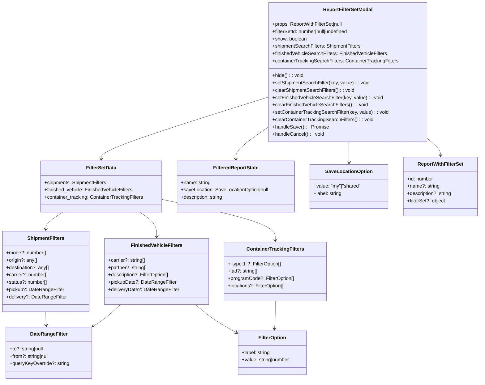

# Diagram: web/portal/src/pages/reports/bi-dashboard-next/components/modals/ReportFilterSet.modal.tsx


> Auto-generated by Obscura crawlers

## Diagram 1



### SVG

<svg id="container" width="1565.775390625" xmlns="http://www.w3.org/2000/svg" class="classDiagram" height="1246" viewBox="0 0 1565.775390625 1246" role="graphics-document document" aria-roledescription="class"><style>#container{font-family:"trebuchet ms",verdana,arial,sans-serif;font-size:16px;fill:#333;}@keyframes edge-animation-frame{from{stroke-dashoffset:0;}}@keyframes dash{to{stroke-dashoffset:0;}}#container .edge-animation-slow{stroke-dasharray:9,5!important;stroke-dashoffset:900;animation:dash 50s linear infinite;stroke-linecap:round;}#container .edge-animation-fast{stroke-dasharray:9,5!important;stroke-dashoffset:900;animation:dash 20s linear infinite;stroke-linecap:round;}#container .error-icon{fill:#552222;}#container .error-text{fill:#552222;stroke:#552222;}#container .edge-thickness-normal{stroke-width:1px;}#container .edge-thickness-thick{stroke-width:3.5px;}#container .edge-pattern-solid{stroke-dasharray:0;}#container .edge-thickness-invisible{stroke-width:0;fill:none;}#container .edge-pattern-dashed{stroke-dasharray:3;}#container .edge-pattern-dotted{stroke-dasharray:2;}#container .marker{fill:#333333;stroke:#333333;}#container .marker.cross{stroke:#333333;}#container svg{font-family:"trebuchet ms",verdana,arial,sans-serif;font-size:16px;}#container p{margin:0;}#container g.classGroup text{fill:#9370DB;stroke:none;font-family:"trebuchet ms",verdana,arial,sans-serif;font-size:10px;}#container g.classGroup text .title{font-weight:bolder;}#container .nodeLabel,#container .edgeLabel{color:#131300;}#container .edgeLabel .label rect{fill:#ECECFF;}#container .label text{fill:#131300;}#container .labelBkg{background:#ECECFF;}#container .edgeLabel .label span{background:#ECECFF;}#container .classTitle{font-weight:bolder;}#container .node rect,#container .node circle,#container .node ellipse,#container .node polygon,#container .node path{fill:#ECECFF;stroke:#9370DB;stroke-width:1px;}#container .divider{stroke:#9370DB;stroke-width:1;}#container g.clickable{cursor:pointer;}#container g.classGroup rect{fill:#ECECFF;stroke:#9370DB;}#container g.classGroup line{stroke:#9370DB;stroke-width:1;}#container .classLabel .box{stroke:none;stroke-width:0;fill:#ECECFF;opacity:0.5;}#container .classLabel .label{fill:#9370DB;font-size:10px;}#container .relation{stroke:#333333;stroke-width:1;fill:none;}#container .dashed-line{stroke-dasharray:3;}#container .dotted-line{stroke-dasharray:1 2;}#container #compositionStart,#container .composition{fill:#333333!important;stroke:#333333!important;stroke-width:1;}#container #compositionEnd,#container .composition{fill:#333333!important;stroke:#333333!important;stroke-width:1;}#container #dependencyStart,#container .dependency{fill:#333333!important;stroke:#333333!important;stroke-width:1;}#container #dependencyStart,#container .dependency{fill:#333333!important;stroke:#333333!important;stroke-width:1;}#container #extensionStart,#container .extension{fill:transparent!important;stroke:#333333!important;stroke-width:1;}#container #extensionEnd,#container .extension{fill:transparent!important;stroke:#333333!important;stroke-width:1;}#container #aggregationStart,#container .aggregation{fill:transparent!important;stroke:#333333!important;stroke-width:1;}#container #aggregationEnd,#container .aggregation{fill:transparent!important;stroke:#333333!important;stroke-width:1;}#container #lollipopStart,#container .lollipop{fill:#ECECFF!important;stroke:#333333!important;stroke-width:1;}#container #lollipopEnd,#container .lollipop{fill:#ECECFF!important;stroke:#333333!important;stroke-width:1;}#container .edgeTerminals{font-size:11px;line-height:initial;}#container .classTitleText{text-anchor:middle;font-size:18px;fill:#333;}#container .label-icon{display:inline-block;height:1em;overflow:visible;vertical-align:-0.125em;}#container .node .label-icon path{fill:currentColor;stroke:revert;stroke-width:revert;}#container :root{--mermaid-font-family:"trebuchet ms",verdana,arial,sans-serif;}</style><g><defs><marker id="container_class-aggregationStart" class="marker aggregation class" refX="18" refY="7" markerWidth="190" markerHeight="240" orient="auto"><path d="M 18,7 L9,13 L1,7 L9,1 Z"></path></marker></defs><defs><marker id="container_class-aggregationEnd" class="marker aggregation class" refX="1" refY="7" markerWidth="20" markerHeight="28" orient="auto"><path d="M 18,7 L9,13 L1,7 L9,1 Z"></path></marker></defs><defs><marker id="container_class-extensionStart" class="marker extension class" refX="18" refY="7" markerWidth="190" markerHeight="240" orient="auto"><path d="M 1,7 L18,13 V 1 Z"></path></marker></defs><defs><marker id="container_class-extensionEnd" class="marker extension class" refX="1" refY="7" markerWidth="20" markerHeight="28" orient="auto"><path d="M 1,1 V 13 L18,7 Z"></path></marker></defs><defs><marker id="container_class-compositionStart" class="marker composition class" refX="18" refY="7" markerWidth="190" markerHeight="240" orient="auto"><path d="M 18,7 L9,13 L1,7 L9,1 Z"></path></marker></defs><defs><marker id="container_class-compositionEnd" class="marker composition class" refX="1" refY="7" markerWidth="20" markerHeight="28" orient="auto"><path d="M 18,7 L9,13 L1,7 L9,1 Z"></path></marker></defs><defs><marker id="container_class-dependencyStart" class="marker dependency class" refX="6" refY="7" markerWidth="190" markerHeight="240" orient="auto"><path d="M 5,7 L9,13 L1,7 L9,1 Z"></path></marker></defs><defs><marker id="container_class-dependencyEnd" class="marker dependency class" refX="13" refY="7" markerWidth="20" markerHeight="28" orient="auto"><path d="M 18,7 L9,13 L14,7 L9,1 Z"></path></marker></defs><defs><marker id="container_class-lollipopStart" class="marker lollipop class" refX="13" refY="7" markerWidth="190" markerHeight="240" orient="auto"><circle stroke="black" fill="transparent" cx="7" cy="7" r="6"></circle></marker></defs><defs><marker id="container_class-lollipopEnd" class="marker lollipop class" refX="1" refY="7" markerWidth="190" markerHeight="240" orient="auto"><circle stroke="black" fill="transparent" cx="7" cy="7" r="6"></circle></marker></defs><g class="root"><g class="clusters"></g><g class="edgePaths"><path d="M870.385,415.811L852.9,428.01C835.415,440.208,800.445,464.604,782.96,481.969C765.475,499.333,765.475,509.667,765.475,514.833L765.475,520" id="id_ReportFilterSetModal_FilteredReportState_1" class="edge-thickness-normal edge-pattern-solid relation" style=";;;" data-edge="true" data-et="edge" data-id="id_ReportFilterSetModal_FilteredReportState_1" data-points="W3sieCI6ODcwLjM4NDc2NTYyNSwieSI6NDE1LjgxMTQ5Mjg5MDk5NTN9LHsieCI6NzY1LjQ3NDYwOTM3NSwieSI6NDg5fSx7IngiOjc2NS40NzQ2MDkzNzUsInkiOjUyNn1d" marker-end="url(#container_class-dependencyEnd)"></path><path d="M870.385,317.074L779.288,345.728C688.191,374.382,505.997,431.691,414.9,465.512C323.803,499.333,323.803,509.667,323.803,514.833L323.803,520" id="id_ReportFilterSetModal_FilterSetData_2" class="edge-thickness-normal edge-pattern-solid relation" style=";;;" data-edge="true" data-et="edge" data-id="id_ReportFilterSetModal_FilterSetData_2" data-points="W3sieCI6ODcwLjM4NDc2NTYyNSwieSI6MzE3LjA3MzU4MTQwNTI4Nzc3fSx7IngiOjMyMy44MDI3MzQzNzUsInkiOjQ4OX0seyJ4IjozMjMuODAyNzM0Mzc1LCJ5Ijo1MjZ9XQ==" marker-end="url(#container_class-dependencyEnd)"></path><path d="M1135.534,464L1135.669,468.167C1135.805,472.333,1136.075,480.667,1136.21,492C1136.346,503.333,1136.346,517.667,1136.346,524.833L1136.346,532" id="id_ReportFilterSetModal_SaveLocationOption_3" class="edge-thickness-normal edge-pattern-solid relation" style=";;;" data-edge="true" data-et="edge" data-id="id_ReportFilterSetModal_SaveLocationOption_3" data-points="W3sieCI6MTEzNS41MzM5NTk2NzE0NDI3LCJ5Ijo0NjR9LHsieCI6MTEzNi4zNDU3MDMxMjUsInkiOjQ4OX0seyJ4IjoxMTM2LjM0NTcwMzEyNSwieSI6NTM4fV0=" marker-end="url(#container_class-dependencyEnd)"></path><path d="M1385.877,447.905L1394.208,454.755C1402.538,461.604,1419.2,475.302,1427.531,485.318C1435.861,495.333,1435.861,501.667,1435.861,504.833L1435.861,508" id="id_ReportFilterSetModal_ReportWithFilterSet_4" class="edge-thickness-normal edge-pattern-solid relation" style=";;;" data-edge="true" data-et="edge" data-id="id_ReportFilterSetModal_ReportWithFilterSet_4" data-points="W3sieCI6MTM4NS44NzY5NTMxMjUsInkiOjQ0Ny45MDU0NDQzNDQzMDQ5NX0seyJ4IjoxNDM1Ljg2MTMyODEyNSwieSI6NDg5fSx7IngiOjE0MzUuODYxMzI4MTI1LCJ5Ijo1MTR9XQ==" marker-end="url(#container_class-dependencyEnd)"></path><path d="M200.773,694L191.742,700.167C182.71,706.333,164.646,718.667,155.614,728C146.582,737.333,146.582,743.667,146.582,746.833L146.582,750" id="id_FilterSetData_ShipmentFilters_5" class="edge-thickness-normal edge-pattern-solid relation" style=";;;" data-edge="true" data-et="edge" data-id="id_FilterSetData_ShipmentFilters_5" data-points="W3sieCI6MjAwLjc3MzQ4NTkyNDU4NjgsInkiOjY5NH0seyJ4IjoxNDYuNTgyMDMxMjUsInkiOjczMX0seyJ4IjoxNDYuNTgyMDMxMjUsInkiOjc1Nn1d" marker-end="url(#container_class-dependencyEnd)"></path><path d="M446.832,694L455.864,700.167C464.896,706.333,482.96,718.667,491.992,732C501.023,745.333,501.023,759.667,501.023,766.833L501.023,774" id="id_FilterSetData_FinishedVehicleFilters_6" class="edge-thickness-normal edge-pattern-solid relation" style=";;;" data-edge="true" data-et="edge" data-id="id_FilterSetData_FinishedVehicleFilters_6" data-points="W3sieCI6NDQ2LjgzMTk4MjgyNTQxMzIsInkiOjY5NH0seyJ4Ijo1MDEuMDIzNDM3NSwieSI6NzMxfSx7IngiOjUwMS4wMjM0Mzc1LCJ5Ijo3ODB9XQ==" marker-end="url(#container_class-dependencyEnd)"></path><path d="M522.205,653.02L582.145,666.016C642.085,679.013,761.964,705.007,821.904,727.17C881.844,749.333,881.844,767.667,881.844,776.833L881.844,786" id="id_FilterSetData_ContainerTrackingFilters_7" class="edge-thickness-normal edge-pattern-solid relation" style=";;;" data-edge="true" data-et="edge" data-id="id_FilterSetData_ContainerTrackingFilters_7" data-points="W3sieCI6NTIyLjIwNTA3ODEyNSwieSI6NjUzLjAxOTU2ODMxNDEwMX0seyJ4Ijo4ODEuODQzNzUsInkiOjczMX0seyJ4Ijo4ODEuODQzNzUsInkiOjc5Mn1d" marker-end="url(#container_class-dependencyEnd)"></path><path d="M146.582,1020L146.582,1024.167C146.582,1028.333,146.582,1036.667,146.873,1044.004C147.164,1051.342,147.746,1057.683,148.037,1060.854L148.327,1064.025" id="id_ShipmentFilters_DateRangeFilter_8" class="edge-thickness-normal edge-pattern-solid relation" style=";;;" data-edge="true" data-et="edge" data-id="id_ShipmentFilters_DateRangeFilter_8" data-points="W3sieCI6MTQ2LjU4MjAzMTI1LCJ5IjoxMDIwfSx7IngiOjE0Ni41ODIwMzEyNSwieSI6MTA0NX0seyJ4IjoxNDguODc1NjA5MjMxNjUxMzcsInkiOjEwNzB9XQ==" marker-end="url(#container_class-dependencyEnd)"></path><path d="M385.993,996L377.294,1004.167C368.596,1012.333,351.199,1028.667,336.578,1040.476C321.957,1052.286,310.112,1059.571,304.189,1063.214L298.266,1066.857" id="id_FinishedVehicleFilters_DateRangeFilter_9" class="edge-thickness-normal edge-pattern-solid relation" style=";;;" data-edge="true" data-et="edge" data-id="id_FinishedVehicleFilters_DateRangeFilter_9" data-points="W3sieCI6Mzg1Ljk5MjYzNTM1MDMxODQ0LCJ5Ijo5OTZ9LHsieCI6MzMzLjgwMjczNDM3NSwieSI6MTA0NX0seyJ4IjoyOTMuMTU1Nzg0MTE2OTcyNSwieSI6MTA3MH1d" marker-end="url(#container_class-dependencyEnd)"></path><path d="M625.127,996L634.512,1004.167C643.896,1012.333,662.665,1028.667,683.96,1043.652C705.255,1058.637,729.077,1072.273,740.988,1079.092L752.898,1085.91" id="id_FinishedVehicleFilters_FilterOption_10" class="edge-thickness-normal edge-pattern-solid relation" style=";;;" data-edge="true" data-et="edge" data-id="id_FinishedVehicleFilters_FilterOption_10" data-points="W3sieCI6NjI1LjEyNzIzOTI1MTU5MjMsInkiOjk5Nn0seyJ4Ijo2ODEuNDMzNTkzNzUsInkiOjEwNDV9LHsieCI6NzU4LjEwNTQ2ODc1LCJ5IjoxMDg4Ljg5MDY5NjQ4MTY5MDR9XQ==" marker-end="url(#container_class-dependencyEnd)"></path><path d="M881.844,984L881.844,994.167C881.844,1004.333,881.844,1024.667,881.369,1040.004C880.895,1055.342,879.946,1065.683,879.472,1070.854L878.997,1076.025" id="id_ContainerTrackingFilters_FilterOption_11" class="edge-thickness-normal edge-pattern-solid relation" style=";;;" data-edge="true" data-et="edge" data-id="id_ContainerTrackingFilters_FilterOption_11" data-points="W3sieCI6ODgxLjg0Mzc1LCJ5Ijo5ODR9LHsieCI6ODgxLjg0Mzc1LCJ5IjoxMDQ1fSx7IngiOjg3OC40NDkyNTQ1ODcxNTYsInkiOjEwODJ9XQ==" marker-end="url(#container_class-dependencyEnd)"></path></g><g class="edgeLabels"><g class="edgeLabel"><g class="label" data-id="id_ReportFilterSetModal_FilteredReportState_1" transform="translate(0, 0)"><foreignObject width="0" height="0"><div xmlns="http://www.w3.org/1999/xhtml" class="labelBkg" style="display: table-cell; white-space: nowrap; line-height: 1.5; max-width: 200px; text-align: center;"><span class="edgeLabel"></span></div></foreignObject></g></g><g class="edgeLabel"><g class="label" data-id="id_ReportFilterSetModal_FilterSetData_2" transform="translate(0, 0)"><foreignObject width="0" height="0"><div xmlns="http://www.w3.org/1999/xhtml" class="labelBkg" style="display: table-cell; white-space: nowrap; line-height: 1.5; max-width: 200px; text-align: center;"><span class="edgeLabel"></span></div></foreignObject></g></g><g class="edgeLabel"><g class="label" data-id="id_ReportFilterSetModal_SaveLocationOption_3" transform="translate(0, 0)"><foreignObject width="0" height="0"><div xmlns="http://www.w3.org/1999/xhtml" class="labelBkg" style="display: table-cell; white-space: nowrap; line-height: 1.5; max-width: 200px; text-align: center;"><span class="edgeLabel"></span></div></foreignObject></g></g><g class="edgeLabel"><g class="label" data-id="id_ReportFilterSetModal_ReportWithFilterSet_4" transform="translate(0, 0)"><foreignObject width="0" height="0"><div xmlns="http://www.w3.org/1999/xhtml" class="labelBkg" style="display: table-cell; white-space: nowrap; line-height: 1.5; max-width: 200px; text-align: center;"><span class="edgeLabel"></span></div></foreignObject></g></g><g class="edgeLabel"><g class="label" data-id="id_FilterSetData_ShipmentFilters_5" transform="translate(0, 0)"><foreignObject width="0" height="0"><div xmlns="http://www.w3.org/1999/xhtml" class="labelBkg" style="display: table-cell; white-space: nowrap; line-height: 1.5; max-width: 200px; text-align: center;"><span class="edgeLabel"></span></div></foreignObject></g></g><g class="edgeLabel"><g class="label" data-id="id_FilterSetData_FinishedVehicleFilters_6" transform="translate(0, 0)"><foreignObject width="0" height="0"><div xmlns="http://www.w3.org/1999/xhtml" class="labelBkg" style="display: table-cell; white-space: nowrap; line-height: 1.5; max-width: 200px; text-align: center;"><span class="edgeLabel"></span></div></foreignObject></g></g><g class="edgeLabel"><g class="label" data-id="id_FilterSetData_ContainerTrackingFilters_7" transform="translate(0, 0)"><foreignObject width="0" height="0"><div xmlns="http://www.w3.org/1999/xhtml" class="labelBkg" style="display: table-cell; white-space: nowrap; line-height: 1.5; max-width: 200px; text-align: center;"><span class="edgeLabel"></span></div></foreignObject></g></g><g class="edgeLabel"><g class="label" data-id="id_ShipmentFilters_DateRangeFilter_8" transform="translate(0, 0)"><foreignObject width="0" height="0"><div xmlns="http://www.w3.org/1999/xhtml" class="labelBkg" style="display: table-cell; white-space: nowrap; line-height: 1.5; max-width: 200px; text-align: center;"><span class="edgeLabel"></span></div></foreignObject></g></g><g class="edgeLabel"><g class="label" data-id="id_FinishedVehicleFilters_DateRangeFilter_9" transform="translate(0, 0)"><foreignObject width="0" height="0"><div xmlns="http://www.w3.org/1999/xhtml" class="labelBkg" style="display: table-cell; white-space: nowrap; line-height: 1.5; max-width: 200px; text-align: center;"><span class="edgeLabel"></span></div></foreignObject></g></g><g class="edgeLabel"><g class="label" data-id="id_FinishedVehicleFilters_FilterOption_10" transform="translate(0, 0)"><foreignObject width="0" height="0"><div xmlns="http://www.w3.org/1999/xhtml" class="labelBkg" style="display: table-cell; white-space: nowrap; line-height: 1.5; max-width: 200px; text-align: center;"><span class="edgeLabel"></span></div></foreignObject></g></g><g class="edgeLabel"><g class="label" data-id="id_ContainerTrackingFilters_FilterOption_11" transform="translate(0, 0)"><foreignObject width="0" height="0"><div xmlns="http://www.w3.org/1999/xhtml" class="labelBkg" style="display: table-cell; white-space: nowrap; line-height: 1.5; max-width: 200px; text-align: center;"><span class="edgeLabel"></span></div></foreignObject></g></g></g><g class="nodes"><g class="node default" id="classId-ReportFilterSetModal-0" transform="translate(1128.130859375, 236)"><g class="basic label-container"><path d="M-257.74609375 -228 L257.74609375 -228 L257.74609375 228 L-257.74609375 228" stroke="none" stroke-width="0" fill="#ECECFF" style=""></path><path d="M-257.74609375 -228 C-77.35792768972883 -228, 103.03023837054235 -228, 257.74609375 -228 M-257.74609375 -228 C-70.10462459107649 -228, 117.53684456784703 -228, 257.74609375 -228 M257.74609375 -228 C257.74609375 -124.88471765681801, 257.74609375 -21.769435313636023, 257.74609375 228 M257.74609375 -228 C257.74609375 -120.99480517543316, 257.74609375 -13.989610350866315, 257.74609375 228 M257.74609375 228 C153.6197140707361 228, 49.49333439147219 228, -257.74609375 228 M257.74609375 228 C86.79060235871123 228, -84.16488903257755 228, -257.74609375 228 M-257.74609375 228 C-257.74609375 89.53280140554844, -257.74609375 -48.93439718890312, -257.74609375 -228 M-257.74609375 228 C-257.74609375 96.44691849225492, -257.74609375 -35.106163015490154, -257.74609375 -228" stroke="#9370DB" stroke-width="1.3" fill="none" stroke-dasharray="0 0" style=""></path></g><g class="annotation-group text" transform="translate(0, -204)"></g><g class="label-group text" transform="translate(-78.3671875, -204)"><g class="label" style="font-weight: bolder" transform="translate(0,-12)"><foreignObject width="156.734375" height="24"><div xmlns="http://www.w3.org/1999/xhtml" style="display: table-cell; white-space: nowrap; line-height: 1.5; max-width: 204px; text-align: center;"><span class="nodeLabel markdown-node-label" style=""><p>ReportFilterSetModal</p></span></div></foreignObject></g></g><g class="members-group text" transform="translate(-245.74609375, -156)"><g class="label" style="" transform="translate(0,-12)"><foreignObject width="234.09375" height="24"><div xmlns="http://www.w3.org/1999/xhtml" style="display: table-cell; white-space: nowrap; line-height: 1.5; max-width: 292px; text-align: center;"><span class="nodeLabel markdown-node-label" style=""><p>+props: ReportWithFilterSet|null</p></span></div></foreignObject></g><g class="label" style="" transform="translate(0,12)"><foreignObject width="259.25" height="24"><div xmlns="http://www.w3.org/1999/xhtml" style="display: table-cell; white-space: nowrap; line-height: 1.5; max-width: 317px; text-align: center;"><span class="nodeLabel markdown-node-label" style=""><p>+filterSetId: number|null|undefined</p></span></div></foreignObject></g><g class="label" style="" transform="translate(0,36)"><foreignObject width="113.234375" height="24"><div xmlns="http://www.w3.org/1999/xhtml" style="display: table-cell; white-space: nowrap; line-height: 1.5; max-width: 171px; text-align: center;"><span class="nodeLabel markdown-node-label" style=""><p>+show: boolean</p></span></div></foreignObject></g><g class="label" style="" transform="translate(0,60)"><foreignObject width="291.234375" height="24"><div xmlns="http://www.w3.org/1999/xhtml" style="display: table-cell; white-space: nowrap; line-height: 1.5; max-width: 349px; text-align: center;"><span class="nodeLabel markdown-node-label" style=""><p>+shipmentSearchFilters: ShipmentFilters</p></span></div></foreignObject></g><g class="label" style="" transform="translate(0,84)"><foreignObject width="376.078125" height="24"><div xmlns="http://www.w3.org/1999/xhtml" style="display: table-cell; white-space: nowrap; line-height: 1.5; max-width: 433px; text-align: center;"><span class="nodeLabel markdown-node-label" style=""><p>+finishedVehicleSearchFilters: FinishedVehicleFilters</p></span></div></foreignObject></g><g class="label" style="" transform="translate(0,108)"><foreignObject width="413.125" height="24"><div xmlns="http://www.w3.org/1999/xhtml" style="display: table-cell; white-space: nowrap; line-height: 1.5; max-width: 470px; text-align: center;"><span class="nodeLabel markdown-node-label" style=""><p>+containerTrackingSearchFilters: ContainerTrackingFilters</p></span></div></foreignObject></g></g><g class="methods-group text" transform="translate(-245.74609375, 12)"><g class="label" style="" transform="translate(0,-12)"><foreignObject width="102.171875" height="24"><div xmlns="http://www.w3.org/1999/xhtml" style="display: table-cell; white-space: nowrap; line-height: 1.5; max-width: 160px; text-align: center;"><span class="nodeLabel markdown-node-label" style=""><p>+hide() : : void</p></span></div></foreignObject></g><g class="label" style="" transform="translate(0,12)"><foreignObject width="318.1875" height="24"><div xmlns="http://www.w3.org/1999/xhtml" style="display: table-cell; white-space: nowrap; line-height: 1.5; max-width: 376px; text-align: center;"><span class="nodeLabel markdown-node-label" style=""><p>+setShipmentSearchFilter(key, value) : : void</p></span></div></foreignObject></g><g class="label" style="" transform="translate(0,36)"><foreignObject width="268.25" height="24"><div xmlns="http://www.w3.org/1999/xhtml" style="display: table-cell; white-space: nowrap; line-height: 1.5; max-width: 326px; text-align: center;"><span class="nodeLabel markdown-node-label" style=""><p>+clearShipmentSearchFilters() : : void</p></span></div></foreignObject></g><g class="label" style="" transform="translate(0,60)"><foreignObject width="361.40625" height="24"><div xmlns="http://www.w3.org/1999/xhtml" style="display: table-cell; white-space: nowrap; line-height: 1.5; max-width: 419px; text-align: center;"><span class="nodeLabel markdown-node-label" style=""><p>+setFinishedVehicleSearchFilter(key, value) : : void</p></span></div></foreignObject></g><g class="label" style="" transform="translate(0,84)"><foreignObject width="311.46875" height="24"><div xmlns="http://www.w3.org/1999/xhtml" style="display: table-cell; white-space: nowrap; line-height: 1.5; max-width: 369px; text-align: center;"><span class="nodeLabel markdown-node-label" style=""><p>+clearFinishedVehicleSearchFilters() : : void</p></span></div></foreignObject></g><g class="label" style="" transform="translate(0,108)"><foreignObject width="379.15625" height="24"><div xmlns="http://www.w3.org/1999/xhtml" style="display: table-cell; white-space: nowrap; line-height: 1.5; max-width: 437px; text-align: center;"><span class="nodeLabel markdown-node-label" style=""><p>+setContainerTrackingSearchFilter(key, value) : : void</p></span></div></foreignObject></g><g class="label" style="" transform="translate(0,132)"><foreignObject width="329.21875" height="24"><div xmlns="http://www.w3.org/1999/xhtml" style="display: table-cell; white-space: nowrap; line-height: 1.5; max-width: 387px; text-align: center;"><span class="nodeLabel markdown-node-label" style=""><p>+clearContainerTrackingSearchFilters() : : void</p></span></div></foreignObject></g><g class="label" style="" transform="translate(0,156)"><foreignObject width="181.25" height="24"><div xmlns="http://www.w3.org/1999/xhtml" style="display: table-cell; white-space: nowrap; line-height: 1.5; max-width: 239px; text-align: center;"><span class="nodeLabel markdown-node-label" style=""><p>+handleSave() : : Promise</p></span></div></foreignObject></g><g class="label" style="" transform="translate(0,180)"><foreignObject width="167.953125" height="24"><div xmlns="http://www.w3.org/1999/xhtml" style="display: table-cell; white-space: nowrap; line-height: 1.5; max-width: 225px; text-align: center;"><span class="nodeLabel markdown-node-label" style=""><p>+handleCancel() : : void</p></span></div></foreignObject></g></g><g class="divider" style=""><path d="M-257.74609375 -180 C-68.8425998941963 -180, 120.0608939616074 -180, 257.74609375 -180 M-257.74609375 -180 C-52.225051904187836 -180, 153.29598994162433 -180, 257.74609375 -180" stroke="#9370DB" stroke-width="1.3" fill="none" stroke-dasharray="0 0" style=""></path></g><g class="divider" style=""><path d="M-257.74609375 -12 C-146.59645352379806 -12, -35.44681329759612 -12, 257.74609375 -12 M-257.74609375 -12 C-126.97386670056684 -12, 3.7983603488663107 -12, 257.74609375 -12" stroke="#9370DB" stroke-width="1.3" fill="none" stroke-dasharray="0 0" style=""></path></g></g><g class="node default" id="classId-FilterSetData-1" transform="translate(323.802734375, 610)"><g class="basic label-container"><path d="M-198.40234375 -84 L198.40234375 -84 L198.40234375 84 L-198.40234375 84" stroke="none" stroke-width="0" fill="#ECECFF" style=""></path><path d="M-198.40234375 -84 C-62.79613235646147 -84, 72.81007903707706 -84, 198.40234375 -84 M-198.40234375 -84 C-58.26006809733374 -84, 81.88220755533251 -84, 198.40234375 -84 M198.40234375 -84 C198.40234375 -32.35995422652301, 198.40234375 19.280091546953983, 198.40234375 84 M198.40234375 -84 C198.40234375 -39.6017013656213, 198.40234375 4.796597268757395, 198.40234375 84 M198.40234375 84 C54.847687975890864 84, -88.70696779821827 84, -198.40234375 84 M198.40234375 84 C63.928962095027856 84, -70.54441955994429 84, -198.40234375 84 M-198.40234375 84 C-198.40234375 18.537596086951666, -198.40234375 -46.92480782609667, -198.40234375 -84 M-198.40234375 84 C-198.40234375 23.713222728364165, -198.40234375 -36.57355454327167, -198.40234375 -84" stroke="#9370DB" stroke-width="1.3" fill="none" stroke-dasharray="0 0" style=""></path></g><g class="annotation-group text" transform="translate(0, -60)"></g><g class="label-group text" transform="translate(-47.8359375, -60)"><g class="label" style="font-weight: bolder" transform="translate(0,-12)"><foreignObject width="95.671875" height="24"><div xmlns="http://www.w3.org/1999/xhtml" style="display: table-cell; white-space: nowrap; line-height: 1.5; max-width: 143px; text-align: center;"><span class="nodeLabel markdown-node-label" style=""><p>FilterSetData</p></span></div></foreignObject></g></g><g class="members-group text" transform="translate(-186.40234375, -12)"><g class="label" style="" transform="translate(0,-12)"><foreignObject width="205.84375" height="24"><div xmlns="http://www.w3.org/1999/xhtml" style="display: table-cell; white-space: nowrap; line-height: 1.5; max-width: 263px; text-align: center;"><span class="nodeLabel markdown-node-label" style=""><p>+shipments: ShipmentFilters</p></span></div></foreignObject></g><g class="label" style="" transform="translate(0,12)"><foreignObject width="290.359375" height="24"><div xmlns="http://www.w3.org/1999/xhtml" style="display: table-cell; white-space: nowrap; line-height: 1.5; max-width: 348px; text-align: center;"><span class="nodeLabel markdown-node-label" style=""><p>+finished_vehicle: FinishedVehicleFilters</p></span></div></foreignObject></g><g class="label" style="" transform="translate(0,36)"><foreignObject width="324.96875" height="24"><div xmlns="http://www.w3.org/1999/xhtml" style="display: table-cell; white-space: nowrap; line-height: 1.5; max-width: 382px; text-align: center;"><span class="nodeLabel markdown-node-label" style=""><p>+container_tracking: ContainerTrackingFilters</p></span></div></foreignObject></g></g><g class="methods-group text" transform="translate(-186.40234375, 84)"></g><g class="divider" style=""><path d="M-198.40234375 -36 C-89.43728362851762 -36, 19.52777649296476 -36, 198.40234375 -36 M-198.40234375 -36 C-89.70660338402755 -36, 18.98913698194491 -36, 198.40234375 -36" stroke="#9370DB" stroke-width="1.3" fill="none" stroke-dasharray="0 0" style=""></path></g><g class="divider" style=""><path d="M-198.40234375 60 C-82.89749623971377 60, 32.60735127057245 60, 198.40234375 60 M-198.40234375 60 C-104.32581636122954 60, -10.249288972459084 60, 198.40234375 60" stroke="#9370DB" stroke-width="1.3" fill="none" stroke-dasharray="0 0" style=""></path></g></g><g class="node default" id="classId-FilteredReportState-2" transform="translate(765.474609375, 610)"><g class="basic label-container"><path d="M-193.26953125 -84 L193.26953125 -84 L193.26953125 84 L-193.26953125 84" stroke="none" stroke-width="0" fill="#ECECFF" style=""></path><path d="M-193.26953125 -84 C-83.57384084460149 -84, 26.121849560797017 -84, 193.26953125 -84 M-193.26953125 -84 C-81.47478136069427 -84, 30.31996852861147 -84, 193.26953125 -84 M193.26953125 -84 C193.26953125 -33.29342652607146, 193.26953125 17.413146947857086, 193.26953125 84 M193.26953125 -84 C193.26953125 -45.921535905602624, 193.26953125 -7.843071811205249, 193.26953125 84 M193.26953125 84 C107.78994979284839 84, 22.31036833569678 84, -193.26953125 84 M193.26953125 84 C71.90703171048904 84, -49.45546782902193 84, -193.26953125 84 M-193.26953125 84 C-193.26953125 47.977377980271015, -193.26953125 11.95475596054203, -193.26953125 -84 M-193.26953125 84 C-193.26953125 38.1331512547415, -193.26953125 -7.733697490517002, -193.26953125 -84" stroke="#9370DB" stroke-width="1.3" fill="none" stroke-dasharray="0 0" style=""></path></g><g class="annotation-group text" transform="translate(0, -60)"></g><g class="label-group text" transform="translate(-72.1328125, -60)"><g class="label" style="font-weight: bolder" transform="translate(0,-12)"><foreignObject width="144.265625" height="24"><div xmlns="http://www.w3.org/1999/xhtml" style="display: table-cell; white-space: nowrap; line-height: 1.5; max-width: 191px; text-align: center;"><span class="nodeLabel markdown-node-label" style=""><p>FilteredReportState</p></span></div></foreignObject></g></g><g class="members-group text" transform="translate(-181.26953125, -12)"><g class="label" style="" transform="translate(0,-12)"><foreignObject width="98.21875" height="24"><div xmlns="http://www.w3.org/1999/xhtml" style="display: table-cell; white-space: nowrap; line-height: 1.5; max-width: 156px; text-align: center;"><span class="nodeLabel markdown-node-label" style=""><p>+name: string</p></span></div></foreignObject></g><g class="label" style="" transform="translate(0,12)"><foreignObject width="290.40625" height="24"><div xmlns="http://www.w3.org/1999/xhtml" style="display: table-cell; white-space: nowrap; line-height: 1.5; max-width: 348px; text-align: center;"><span class="nodeLabel markdown-node-label" style=""><p>+saveLocation: SaveLocationOption|null</p></span></div></foreignObject></g><g class="label" style="" transform="translate(0,36)"><foreignObject width="140.3125" height="24"><div xmlns="http://www.w3.org/1999/xhtml" style="display: table-cell; white-space: nowrap; line-height: 1.5; max-width: 198px; text-align: center;"><span class="nodeLabel markdown-node-label" style=""><p>+description: string</p></span></div></foreignObject></g></g><g class="methods-group text" transform="translate(-181.26953125, 84)"></g><g class="divider" style=""><path d="M-193.26953125 -36 C-59.73576693759691 -36, 73.79799737480619 -36, 193.26953125 -36 M-193.26953125 -36 C-76.2041548567142 -36, 40.861221536571605 -36, 193.26953125 -36" stroke="#9370DB" stroke-width="1.3" fill="none" stroke-dasharray="0 0" style=""></path></g><g class="divider" style=""><path d="M-193.26953125 60 C-72.74335536534653 60, 47.78282051930694 60, 193.26953125 60 M-193.26953125 60 C-77.02717709098884 60, 39.215177068022314 60, 193.26953125 60" stroke="#9370DB" stroke-width="1.3" fill="none" stroke-dasharray="0 0" style=""></path></g></g><g class="node default" id="classId-SaveLocationOption-3" transform="translate(1136.345703125, 610)"><g class="basic label-container"><path d="M-127.6015625 -72 L127.6015625 -72 L127.6015625 72 L-127.6015625 72" stroke="none" stroke-width="0" fill="#ECECFF" style=""></path><path d="M-127.6015625 -72 C-51.732367985772456 -72, 24.13682652845509 -72, 127.6015625 -72 M-127.6015625 -72 C-32.997618950171145 -72, 61.60632459965771 -72, 127.6015625 -72 M127.6015625 -72 C127.6015625 -42.96527785273888, 127.6015625 -13.930555705477765, 127.6015625 72 M127.6015625 -72 C127.6015625 -38.35570100752942, 127.6015625 -4.711402015058837, 127.6015625 72 M127.6015625 72 C62.164438211697174 72, -3.272686076605652 72, -127.6015625 72 M127.6015625 72 C52.926153022305655 72, -21.74925645538869 72, -127.6015625 72 M-127.6015625 72 C-127.6015625 17.740221432664363, -127.6015625 -36.519557134671274, -127.6015625 -72 M-127.6015625 72 C-127.6015625 35.3701413338686, -127.6015625 -1.2597173322627953, -127.6015625 -72" stroke="#9370DB" stroke-width="1.3" fill="none" stroke-dasharray="0 0" style=""></path></g><g class="annotation-group text" transform="translate(0, -48)"></g><g class="label-group text" transform="translate(-73.578125, -48)"><g class="label" style="font-weight: bolder" transform="translate(0,-12)"><foreignObject width="147.15625" height="24"><div xmlns="http://www.w3.org/1999/xhtml" style="display: table-cell; white-space: nowrap; line-height: 1.5; max-width: 195px; text-align: center;"><span class="nodeLabel markdown-node-label" style=""><p>SaveLocationOption</p></span></div></foreignObject></g></g><g class="members-group text" transform="translate(-115.6015625, 0)"><g class="label" style="" transform="translate(0,-12)"><foreignObject width="157.625" height="24"><div xmlns="http://www.w3.org/1999/xhtml" style="display: table-cell; white-space: nowrap; line-height: 1.5; max-width: 215px; text-align: center;"><span class="nodeLabel markdown-node-label" style=""><p>+value: "my"|"shared"</p></span></div></foreignObject></g><g class="label" style="" transform="translate(0,12)"><foreignObject width="94.09375" height="24"><div xmlns="http://www.w3.org/1999/xhtml" style="display: table-cell; white-space: nowrap; line-height: 1.5; max-width: 152px; text-align: center;"><span class="nodeLabel markdown-node-label" style=""><p>+label: string</p></span></div></foreignObject></g></g><g class="methods-group text" transform="translate(-115.6015625, 72)"></g><g class="divider" style=""><path d="M-127.6015625 -24 C-25.733522725873087 -24, 76.13451704825383 -24, 127.6015625 -24 M-127.6015625 -24 C-73.31298770947384 -24, -19.024412918947704 -24, 127.6015625 -24" stroke="#9370DB" stroke-width="1.3" fill="none" stroke-dasharray="0 0" style=""></path></g><g class="divider" style=""><path d="M-127.6015625 48 C-74.55142604950868 48, -21.50128959901734 48, 127.6015625 48 M-127.6015625 48 C-63.171106683435525 48, 1.25934913312895 48, 127.6015625 48" stroke="#9370DB" stroke-width="1.3" fill="none" stroke-dasharray="0 0" style=""></path></g></g><g class="node default" id="classId-ReportWithFilterSet-4" transform="translate(1435.861328125, 610)"><g class="basic label-container"><path d="M-121.9140625 -96 L121.9140625 -96 L121.9140625 96 L-121.9140625 96" stroke="none" stroke-width="0" fill="#ECECFF" style=""></path><path d="M-121.9140625 -96 C-56.496766362814 -96, 8.920529774372 -96, 121.9140625 -96 M-121.9140625 -96 C-41.53222613383733 -96, 38.84961023232535 -96, 121.9140625 -96 M121.9140625 -96 C121.9140625 -31.29509712462493, 121.9140625 33.40980575075014, 121.9140625 96 M121.9140625 -96 C121.9140625 -30.458507125901633, 121.9140625 35.082985748196734, 121.9140625 96 M121.9140625 96 C34.21731305991584 96, -53.47943638016832 96, -121.9140625 96 M121.9140625 96 C54.12060512265772 96, -13.672852254684557 96, -121.9140625 96 M-121.9140625 96 C-121.9140625 39.30152066342209, -121.9140625 -17.396958673155822, -121.9140625 -96 M-121.9140625 96 C-121.9140625 52.08873888141584, -121.9140625 8.177477762831685, -121.9140625 -96" stroke="#9370DB" stroke-width="1.3" fill="none" stroke-dasharray="0 0" style=""></path></g><g class="annotation-group text" transform="translate(0, -72)"></g><g class="label-group text" transform="translate(-72.65625, -72)"><g class="label" style="font-weight: bolder" transform="translate(0,-12)"><foreignObject width="145.3125" height="24"><div xmlns="http://www.w3.org/1999/xhtml" style="display: table-cell; white-space: nowrap; line-height: 1.5; max-width: 192px; text-align: center;"><span class="nodeLabel markdown-node-label" style=""><p>ReportWithFilterSet</p></span></div></foreignObject></g></g><g class="members-group text" transform="translate(-109.9140625, -24)"><g class="label" style="" transform="translate(0,-12)"><foreignObject width="86.953125" height="24"><div xmlns="http://www.w3.org/1999/xhtml" style="display: table-cell; white-space: nowrap; line-height: 1.5; max-width: 145px; text-align: center;"><span class="nodeLabel markdown-node-label" style=""><p>+id: number</p></span></div></foreignObject></g><g class="label" style="" transform="translate(0,12)"><foreignObject width="104.921875" height="24"><div xmlns="http://www.w3.org/1999/xhtml" style="display: table-cell; white-space: nowrap; line-height: 1.5; max-width: 163px; text-align: center;"><span class="nodeLabel markdown-node-label" style=""><p>+name?: string</p></span></div></foreignObject></g><g class="label" style="" transform="translate(0,36)"><foreignObject width="147.171875" height="24"><div xmlns="http://www.w3.org/1999/xhtml" style="display: table-cell; white-space: nowrap; line-height: 1.5; max-width: 205px; text-align: center;"><span class="nodeLabel markdown-node-label" style=""><p>+description?: string</p></span></div></foreignObject></g><g class="label" style="" transform="translate(0,60)"><foreignObject width="125.703125" height="24"><div xmlns="http://www.w3.org/1999/xhtml" style="display: table-cell; white-space: nowrap; line-height: 1.5; max-width: 183px; text-align: center;"><span class="nodeLabel markdown-node-label" style=""><p>+filterSet?: object</p></span></div></foreignObject></g></g><g class="methods-group text" transform="translate(-109.9140625, 96)"></g><g class="divider" style=""><path d="M-121.9140625 -48 C-69.81731938944043 -48, -17.720576278880856 -48, 121.9140625 -48 M-121.9140625 -48 C-35.91616758017321 -48, 50.08172733965358 -48, 121.9140625 -48" stroke="#9370DB" stroke-width="1.3" fill="none" stroke-dasharray="0 0" style=""></path></g><g class="divider" style=""><path d="M-121.9140625 72 C-34.114426015536864 72, 53.68521046892627 72, 121.9140625 72 M-121.9140625 72 C-29.85909681227308 72, 62.19586887545384 72, 121.9140625 72" stroke="#9370DB" stroke-width="1.3" fill="none" stroke-dasharray="0 0" style=""></path></g></g><g class="node default" id="classId-ShipmentFilters-5" transform="translate(146.58203125, 888)"><g class="basic label-container"><path d="M-138.58203125 -132 L138.58203125 -132 L138.58203125 132 L-138.58203125 132" stroke="none" stroke-width="0" fill="#ECECFF" style=""></path><path d="M-138.58203125 -132 C-29.66008155740512 -132, 79.26186813518976 -132, 138.58203125 -132 M-138.58203125 -132 C-75.29354230013678 -132, -12.005053350273542 -132, 138.58203125 -132 M138.58203125 -132 C138.58203125 -71.92462989890987, 138.58203125 -11.849259797819741, 138.58203125 132 M138.58203125 -132 C138.58203125 -55.74455058198731, 138.58203125 20.510898836025376, 138.58203125 132 M138.58203125 132 C48.68589122575274 132, -41.21024879849452 132, -138.58203125 132 M138.58203125 132 C60.59322739983742 132, -17.395576450325166 132, -138.58203125 132 M-138.58203125 132 C-138.58203125 76.26869539185931, -138.58203125 20.53739078371862, -138.58203125 -132 M-138.58203125 132 C-138.58203125 29.579348981729026, -138.58203125 -72.84130203654195, -138.58203125 -132" stroke="#9370DB" stroke-width="1.3" fill="none" stroke-dasharray="0 0" style=""></path></g><g class="annotation-group text" transform="translate(0, -108)"></g><g class="label-group text" transform="translate(-57.7421875, -108)"><g class="label" style="font-weight: bolder" transform="translate(0,-12)"><foreignObject width="115.484375" height="24"><div xmlns="http://www.w3.org/1999/xhtml" style="display: table-cell; white-space: nowrap; line-height: 1.5; max-width: 164px; text-align: center;"><span class="nodeLabel markdown-node-label" style=""><p>ShipmentFilters</p></span></div></foreignObject></g></g><g class="members-group text" transform="translate(-126.58203125, -60)"><g class="label" style="" transform="translate(0,-12)"><foreignObject width="131.21875" height="24"><div xmlns="http://www.w3.org/1999/xhtml" style="display: table-cell; white-space: nowrap; line-height: 1.5; max-width: 189px; text-align: center;"><span class="nodeLabel markdown-node-label" style=""><p>+mode?: number[]</p></span></div></foreignObject></g><g class="label" style="" transform="translate(0,12)"><foreignObject width="101.3125" height="24"><div xmlns="http://www.w3.org/1999/xhtml" style="display: table-cell; white-space: nowrap; line-height: 1.5; max-width: 159px; text-align: center;"><span class="nodeLabel markdown-node-label" style=""><p>+origin?: any[]</p></span></div></foreignObject></g><g class="label" style="" transform="translate(0,36)"><foreignObject width="142.21875" height="24"><div xmlns="http://www.w3.org/1999/xhtml" style="display: table-cell; white-space: nowrap; line-height: 1.5; max-width: 200px; text-align: center;"><span class="nodeLabel markdown-node-label" style=""><p>+destination?: any[]</p></span></div></foreignObject></g><g class="label" style="" transform="translate(0,60)"><foreignObject width="137.984375" height="24"><div xmlns="http://www.w3.org/1999/xhtml" style="display: table-cell; white-space: nowrap; line-height: 1.5; max-width: 195px; text-align: center;"><span class="nodeLabel markdown-node-label" style=""><p>+carrier?: number[]</p></span></div></foreignObject></g><g class="label" style="" transform="translate(0,84)"><foreignObject width="134.4375" height="24"><div xmlns="http://www.w3.org/1999/xhtml" style="display: table-cell; white-space: nowrap; line-height: 1.5; max-width: 192px; text-align: center;"><span class="nodeLabel markdown-node-label" style=""><p>+status?: number[]</p></span></div></foreignObject></g><g class="label" style="" transform="translate(0,108)"><foreignObject width="185.75" height="24"><div xmlns="http://www.w3.org/1999/xhtml" style="display: table-cell; white-space: nowrap; line-height: 1.5; max-width: 244px; text-align: center;"><span class="nodeLabel markdown-node-label" style=""><p>+pickup?: DateRangeFilter</p></span></div></foreignObject></g><g class="label" style="" transform="translate(0,132)"><foreignObject width="195.421875" height="24"><div xmlns="http://www.w3.org/1999/xhtml" style="display: table-cell; white-space: nowrap; line-height: 1.5; max-width: 254px; text-align: center;"><span class="nodeLabel markdown-node-label" style=""><p>+delivery?: DateRangeFilter</p></span></div></foreignObject></g></g><g class="methods-group text" transform="translate(-126.58203125, 132)"></g><g class="divider" style=""><path d="M-138.58203125 -84 C-44.70977336901423 -84, 49.16248451197154 -84, 138.58203125 -84 M-138.58203125 -84 C-40.50675246538759 -84, 57.568526319224816 -84, 138.58203125 -84" stroke="#9370DB" stroke-width="1.3" fill="none" stroke-dasharray="0 0" style=""></path></g><g class="divider" style=""><path d="M-138.58203125 108 C-40.92747477335861 108, 56.72708170328278 108, 138.58203125 108 M-138.58203125 108 C-45.42598723995164 108, 47.73005677009672 108, 138.58203125 108" stroke="#9370DB" stroke-width="1.3" fill="none" stroke-dasharray="0 0" style=""></path></g></g><g class="node default" id="classId-FinishedVehicleFilters-6" transform="translate(501.0234375, 888)"><g class="basic label-container"><path d="M-165.859375 -108 L165.859375 -108 L165.859375 108 L-165.859375 108" stroke="none" stroke-width="0" fill="#ECECFF" style=""></path><path d="M-165.859375 -108 C-45.86843575025702 -108, 74.12250349948596 -108, 165.859375 -108 M-165.859375 -108 C-46.92589325939521 -108, 72.00758848120958 -108, 165.859375 -108 M165.859375 -108 C165.859375 -50.65973601049082, 165.859375 6.680527979018365, 165.859375 108 M165.859375 -108 C165.859375 -26.099492829725477, 165.859375 55.801014340549045, 165.859375 108 M165.859375 108 C42.94495636100133 108, -79.96946227799734 108, -165.859375 108 M165.859375 108 C36.01230443614847 108, -93.83476612770306 108, -165.859375 108 M-165.859375 108 C-165.859375 52.497862423746376, -165.859375 -3.0042751525072475, -165.859375 -108 M-165.859375 108 C-165.859375 54.88433266363195, -165.859375 1.7686653272639035, -165.859375 -108" stroke="#9370DB" stroke-width="1.3" fill="none" stroke-dasharray="0 0" style=""></path></g><g class="annotation-group text" transform="translate(0, -84)"></g><g class="label-group text" transform="translate(-79.359375, -84)"><g class="label" style="font-weight: bolder" transform="translate(0,-12)"><foreignObject width="158.71875" height="24"><div xmlns="http://www.w3.org/1999/xhtml" style="display: table-cell; white-space: nowrap; line-height: 1.5; max-width: 207px; text-align: center;"><span class="nodeLabel markdown-node-label" style=""><p>FinishedVehicleFilters</p></span></div></foreignObject></g></g><g class="members-group text" transform="translate(-153.859375, -36)"><g class="label" style="" transform="translate(0,-12)"><foreignObject width="122.828125" height="24"><div xmlns="http://www.w3.org/1999/xhtml" style="display: table-cell; white-space: nowrap; line-height: 1.5; max-width: 180px; text-align: center;"><span class="nodeLabel markdown-node-label" style=""><p>+carrier?: string[]</p></span></div></foreignObject></g><g class="label" style="" transform="translate(0,12)"><foreignObject width="129.140625" height="24"><div xmlns="http://www.w3.org/1999/xhtml" style="display: table-cell; white-space: nowrap; line-height: 1.5; max-width: 187px; text-align: center;"><span class="nodeLabel markdown-node-label" style=""><p>+partner?: string[]</p></span></div></foreignObject></g><g class="label" style="" transform="translate(0,36)"><foreignObject width="202.359375" height="24"><div xmlns="http://www.w3.org/1999/xhtml" style="display: table-cell; white-space: nowrap; line-height: 1.5; max-width: 260px; text-align: center;"><span class="nodeLabel markdown-node-label" style=""><p>+description?: FilterOption[]</p></span></div></foreignObject></g><g class="label" style="" transform="translate(0,60)"><foreignObject width="218.859375" height="24"><div xmlns="http://www.w3.org/1999/xhtml" style="display: table-cell; white-space: nowrap; line-height: 1.5; max-width: 277px; text-align: center;"><span class="nodeLabel markdown-node-label" style=""><p>+pickupDate?: DateRangeFilter</p></span></div></foreignObject></g><g class="label" style="" transform="translate(0,84)"><foreignObject width="228.359375" height="24"><div xmlns="http://www.w3.org/1999/xhtml" style="display: table-cell; white-space: nowrap; line-height: 1.5; max-width: 287px; text-align: center;"><span class="nodeLabel markdown-node-label" style=""><p>+deliveryDate?: DateRangeFilter</p></span></div></foreignObject></g></g><g class="methods-group text" transform="translate(-153.859375, 108)"></g><g class="divider" style=""><path d="M-165.859375 -60 C-45.35153308477379 -60, 75.15630883045242 -60, 165.859375 -60 M-165.859375 -60 C-35.05951308798316 -60, 95.74034882403367 -60, 165.859375 -60" stroke="#9370DB" stroke-width="1.3" fill="none" stroke-dasharray="0 0" style=""></path></g><g class="divider" style=""><path d="M-165.859375 84 C-98.90864209696922 84, -31.957909193938434 84, 165.859375 84 M-165.859375 84 C-62.264387977378476 84, 41.33059904524305 84, 165.859375 84" stroke="#9370DB" stroke-width="1.3" fill="none" stroke-dasharray="0 0" style=""></path></g></g><g class="node default" id="classId-ContainerTrackingFilters-7" transform="translate(881.84375, 888)"><g class="basic label-container"><path d="M-164.9609375 -96 L164.9609375 -96 L164.9609375 96 L-164.9609375 96" stroke="none" stroke-width="0" fill="#ECECFF" style=""></path><path d="M-164.9609375 -96 C-73.81722060646847 -96, 17.326496287063065 -96, 164.9609375 -96 M-164.9609375 -96 C-81.80147286825162 -96, 1.3579917634967558 -96, 164.9609375 -96 M164.9609375 -96 C164.9609375 -23.98418278641178, 164.9609375 48.03163442717644, 164.9609375 96 M164.9609375 -96 C164.9609375 -21.64032766539522, 164.9609375 52.71934466920956, 164.9609375 96 M164.9609375 96 C55.05326028363321 96, -54.854416932733585 96, -164.9609375 96 M164.9609375 96 C91.17676388497888 96, 17.392590269957765 96, -164.9609375 96 M-164.9609375 96 C-164.9609375 51.737958480120646, -164.9609375 7.4759169602412925, -164.9609375 -96 M-164.9609375 96 C-164.9609375 47.06123182058446, -164.9609375 -1.8775363588310796, -164.9609375 -96" stroke="#9370DB" stroke-width="1.3" fill="none" stroke-dasharray="0 0" style=""></path></g><g class="annotation-group text" transform="translate(0, -72)"></g><g class="label-group text" transform="translate(-89.15625, -72)"><g class="label" style="font-weight: bolder" transform="translate(0,-12)"><foreignObject width="178.3125" height="24"><div xmlns="http://www.w3.org/1999/xhtml" style="display: table-cell; white-space: nowrap; line-height: 1.5; max-width: 225px; text-align: center;"><span class="nodeLabel markdown-node-label" style=""><p>ContainerTrackingFilters</p></span></div></foreignObject></g></g><g class="members-group text" transform="translate(-152.9609375, -24)"><g class="label" style="" transform="translate(0,-12)"><foreignObject width="175.078125" height="24"><div xmlns="http://www.w3.org/1999/xhtml" style="display: table-cell; white-space: nowrap; line-height: 1.5; max-width: 232px; text-align: center;"><span class="nodeLabel markdown-node-label" style=""><p>+"type:1"?: FilterOption[]</p></span></div></foreignObject></g><g class="label" style="" transform="translate(0,12)"><foreignObject width="98.234375" height="24"><div xmlns="http://www.w3.org/1999/xhtml" style="display: table-cell; white-space: nowrap; line-height: 1.5; max-width: 156px; text-align: center;"><span class="nodeLabel markdown-node-label" style=""><p>+lad?: string[]</p></span></div></foreignObject></g><g class="label" style="" transform="translate(0,36)"><foreignObject width="216.765625" height="24"><div xmlns="http://www.w3.org/1999/xhtml" style="display: table-cell; white-space: nowrap; line-height: 1.5; max-width: 274px; text-align: center;"><span class="nodeLabel markdown-node-label" style=""><p>+programCode?: FilterOption[]</p></span></div></foreignObject></g><g class="label" style="" transform="translate(0,60)"><foreignObject width="186.375" height="24"><div xmlns="http://www.w3.org/1999/xhtml" style="display: table-cell; white-space: nowrap; line-height: 1.5; max-width: 244px; text-align: center;"><span class="nodeLabel markdown-node-label" style=""><p>+locations?: FilterOption[]</p></span></div></foreignObject></g></g><g class="methods-group text" transform="translate(-152.9609375, 96)"></g><g class="divider" style=""><path d="M-164.9609375 -48 C-95.23238543167861 -48, -25.503833363357217 -48, 164.9609375 -48 M-164.9609375 -48 C-88.80095531080251 -48, -12.640973121605015 -48, 164.9609375 -48" stroke="#9370DB" stroke-width="1.3" fill="none" stroke-dasharray="0 0" style=""></path></g><g class="divider" style=""><path d="M-164.9609375 72 C-42.16344174177587 72, 80.63405401644826 72, 164.9609375 72 M-164.9609375 72 C-48.218619425498034 72, 68.52369864900393 72, 164.9609375 72" stroke="#9370DB" stroke-width="1.3" fill="none" stroke-dasharray="0 0" style=""></path></g></g><g class="node default" id="classId-DateRangeFilter-8" transform="translate(156.58203125, 1154)"><g class="basic label-container"><path d="M-138.38671875 -84 L138.38671875 -84 L138.38671875 84 L-138.38671875 84" stroke="none" stroke-width="0" fill="#ECECFF" style=""></path><path d="M-138.38671875 -84 C-54.66502668478532 -84, 29.056665380429365 -84, 138.38671875 -84 M-138.38671875 -84 C-47.64114304069487 -84, 43.10443266861026 -84, 138.38671875 -84 M138.38671875 -84 C138.38671875 -22.491344296134663, 138.38671875 39.01731140773067, 138.38671875 84 M138.38671875 -84 C138.38671875 -44.797107444122034, 138.38671875 -5.594214888244068, 138.38671875 84 M138.38671875 84 C65.17265708632866 84, -8.04140457734269 84, -138.38671875 84 M138.38671875 84 C67.80817465578569 84, -2.7703694384286166 84, -138.38671875 84 M-138.38671875 84 C-138.38671875 27.253615315889874, -138.38671875 -29.49276936822025, -138.38671875 -84 M-138.38671875 84 C-138.38671875 36.202129135914284, -138.38671875 -11.595741728171433, -138.38671875 -84" stroke="#9370DB" stroke-width="1.3" fill="none" stroke-dasharray="0 0" style=""></path></g><g class="annotation-group text" transform="translate(0, -60)"></g><g class="label-group text" transform="translate(-58.2421875, -60)"><g class="label" style="font-weight: bolder" transform="translate(0,-12)"><foreignObject width="116.484375" height="24"><div xmlns="http://www.w3.org/1999/xhtml" style="display: table-cell; white-space: nowrap; line-height: 1.5; max-width: 165px; text-align: center;"><span class="nodeLabel markdown-node-label" style=""><p>DateRangeFilter</p></span></div></foreignObject></g></g><g class="members-group text" transform="translate(-126.38671875, -12)"><g class="label" style="" transform="translate(0,-12)"><foreignObject width="113.71875" height="24"><div xmlns="http://www.w3.org/1999/xhtml" style="display: table-cell; white-space: nowrap; line-height: 1.5; max-width: 171px; text-align: center;"><span class="nodeLabel markdown-node-label" style=""><p>+to?: string|null</p></span></div></foreignObject></g><g class="label" style="" transform="translate(0,12)"><foreignObject width="132.953125" height="24"><div xmlns="http://www.w3.org/1999/xhtml" style="display: table-cell; white-space: nowrap; line-height: 1.5; max-width: 191px; text-align: center;"><span class="nodeLabel markdown-node-label" style=""><p>+from?: string|null</p></span></div></foreignObject></g><g class="label" style="" transform="translate(0,36)"><foreignObject width="194.53125" height="24"><div xmlns="http://www.w3.org/1999/xhtml" style="display: table-cell; white-space: nowrap; line-height: 1.5; max-width: 253px; text-align: center;"><span class="nodeLabel markdown-node-label" style=""><p>+queryKeyOverride?: string</p></span></div></foreignObject></g></g><g class="methods-group text" transform="translate(-126.38671875, 84)"></g><g class="divider" style=""><path d="M-138.38671875 -36 C-42.99262024452511 -36, 52.40147826094977 -36, 138.38671875 -36 M-138.38671875 -36 C-74.50066799782175 -36, -10.614617245643515 -36, 138.38671875 -36" stroke="#9370DB" stroke-width="1.3" fill="none" stroke-dasharray="0 0" style=""></path></g><g class="divider" style=""><path d="M-138.38671875 60 C-61.427844397313635 60, 15.53102995537273 60, 138.38671875 60 M-138.38671875 60 C-79.99605243808972 60, -21.605386126179454 60, 138.38671875 60" stroke="#9370DB" stroke-width="1.3" fill="none" stroke-dasharray="0 0" style=""></path></g></g><g class="node default" id="classId-FilterOption-9" transform="translate(871.84375, 1154)"><g class="basic label-container"><path d="M-113.73828125 -72 L113.73828125 -72 L113.73828125 72 L-113.73828125 72" stroke="none" stroke-width="0" fill="#ECECFF" style=""></path><path d="M-113.73828125 -72 C-45.35771618364406 -72, 23.022848882711884 -72, 113.73828125 -72 M-113.73828125 -72 C-42.14040739439203 -72, 29.457466461215944 -72, 113.73828125 -72 M113.73828125 -72 C113.73828125 -22.269378022076864, 113.73828125 27.46124395584627, 113.73828125 72 M113.73828125 -72 C113.73828125 -19.878621750446023, 113.73828125 32.242756499107955, 113.73828125 72 M113.73828125 72 C64.24013005524424 72, 14.741978860488487 72, -113.73828125 72 M113.73828125 72 C50.39392621959669 72, -12.950428810806613 72, -113.73828125 72 M-113.73828125 72 C-113.73828125 24.15879505570767, -113.73828125 -23.682409888584658, -113.73828125 -72 M-113.73828125 72 C-113.73828125 24.74029107653297, -113.73828125 -22.51941784693406, -113.73828125 -72" stroke="#9370DB" stroke-width="1.3" fill="none" stroke-dasharray="0 0" style=""></path></g><g class="annotation-group text" transform="translate(0, -48)"></g><g class="label-group text" transform="translate(-43.8046875, -48)"><g class="label" style="font-weight: bolder" transform="translate(0,-12)"><foreignObject width="87.609375" height="24"><div xmlns="http://www.w3.org/1999/xhtml" style="display: table-cell; white-space: nowrap; line-height: 1.5; max-width: 137px; text-align: center;"><span class="nodeLabel markdown-node-label" style=""><p>FilterOption</p></span></div></foreignObject></g></g><g class="members-group text" transform="translate(-101.73828125, 0)"><g class="label" style="" transform="translate(0,-12)"><foreignObject width="94.09375" height="24"><div xmlns="http://www.w3.org/1999/xhtml" style="display: table-cell; white-space: nowrap; line-height: 1.5; max-width: 152px; text-align: center;"><span class="nodeLabel markdown-node-label" style=""><p>+label: string</p></span></div></foreignObject></g><g class="label" style="" transform="translate(0,12)"><foreignObject width="159.671875" height="24"><div xmlns="http://www.w3.org/1999/xhtml" style="display: table-cell; white-space: nowrap; line-height: 1.5; max-width: 218px; text-align: center;"><span class="nodeLabel markdown-node-label" style=""><p>+value: string|number</p></span></div></foreignObject></g></g><g class="methods-group text" transform="translate(-101.73828125, 72)"></g><g class="divider" style=""><path d="M-113.73828125 -24 C-42.6357994132165 -24, 28.466682423566994 -24, 113.73828125 -24 M-113.73828125 -24 C-32.15239520219545 -24, 49.4334908456091 -24, 113.73828125 -24" stroke="#9370DB" stroke-width="1.3" fill="none" stroke-dasharray="0 0" style=""></path></g><g class="divider" style=""><path d="M-113.73828125 48 C-37.13962144535283 48, 39.45903835929434 48, 113.73828125 48 M-113.73828125 48 C-61.622468360923186 48, -9.506655471846372 48, 113.73828125 48" stroke="#9370DB" stroke-width="1.3" fill="none" stroke-dasharray="0 0" style=""></path></g></g></g></g></g></svg>

## Diagram 2

```mermaid
flowchart TD
  A[User clicks "Save"] --> B[Validate report name]
  B -->|empty| E[Show error: "Report Name is required"]
  B --> C[Validate save location]
  C -->|missing| F[Show error: "Please select where to save"]
  C --> D[Check any filters selected]
  D -->|none| G[Show error: "Please select at least one filter"]
  D --> H[Build payload with filters & metadata]
  H --> I[submitFilterSet(filterSetId, payload, reportId, onSuccess)]
  I --> J{submitFilterSet result}
  J -->|success| K[onSuccess -> clearForm & hide modal]
  J -->|failure| L[Show submission error Toast]
```

> SVG rendering failed for this diagram.
