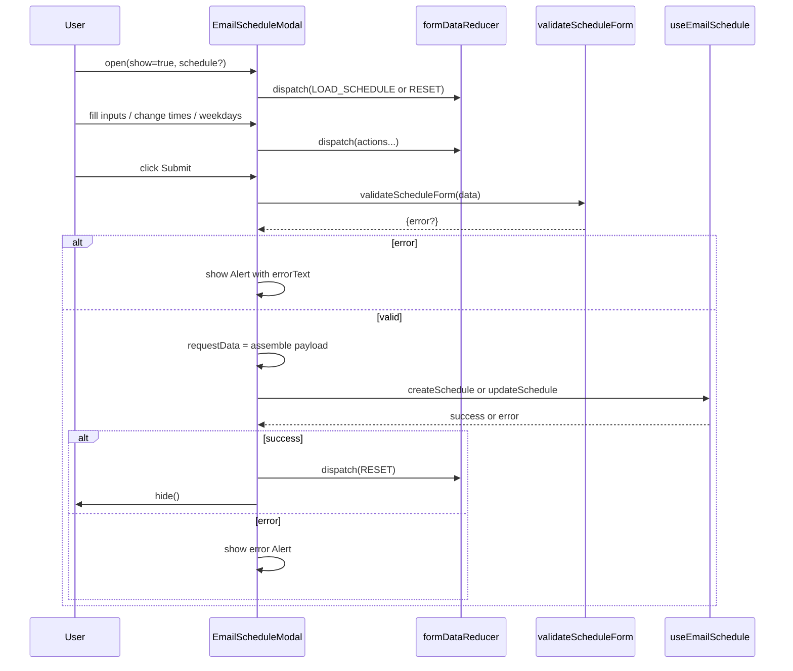
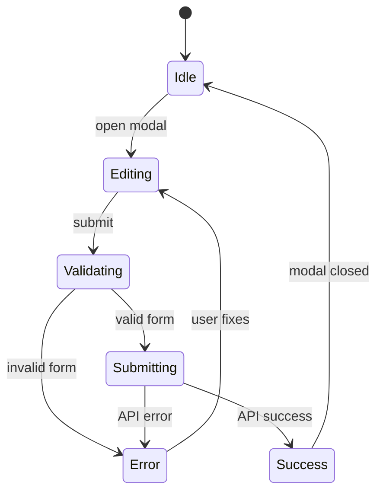

# Diagram: web/portal/src/pages/reports/bi-dashboard-next/components/modals/Reports.EmailSchedule.modal.tsx


> Auto-generated by Obscura crawlers

## Diagram 1

```mermaid
classDiagram
    class EmailScheduleModal {
        +show: boolean
        +hide(): void
        +item: UnifiedReportItemDTO
        +schedule?: EmailScheduleDTO
        -data: FormData (useReducer)
        -dispatch(action: FormDataAction)
        -handleSubmit()
        -handleDelete()
    }
    class formDataReducer {
        +(state: FormData, action: FormDataAction): FormData
        -cases: NAME, EMAIL, BODY, PATTERN, REPEAT, TIME, ADD_TIME, REMOVE_TIME, ADD_WEEKDAY, REMOVE_WEEKDAY, PAUSE, LOAD_SCHEDULE, RESET
    }
    class FormData {
        +name
        +email
        +body
        +pattern
        +repeat
        +repeatMonth
        +time[]
        +weekday[]
        +onDay
        +weekNum
        +dateFrom
        +dateTo
        +paused
        +timezone
    }
    class EmailForm {
        +props: {email, body, dispatch}
        +renders email input
        +renders body textarea
    }
    class RepeatTimeForm {
        +props: {data, dispatch}
        +handleTimeChange(index, time)
        +handleAddTime()
        +handleRemoveTime(index)
    }
    class DaysCheckboxForm {
        +props: {data, dispatch}
        +handleCheckboxChange(e)
    }
    class getPatternDetails {
        +(data: FormData): EmailScheduleDetails
        -handles patterns: daily, weekly, monthly_day, monthly_weekday, yearly_day, yearly_weekday
    }
    class createSampleDateTimeGenerator {
        +(data: FormData): Generator<Moment|null>
        -yields sample moments based on pattern, repeat, times, weekdays, date range
    }
    class getSampleSchedule {
        +(data: FormData): string[]
        -consumes generator and returns up to 5 formatted samples
    }

    EmailScheduleModal "1" --> "1" formDataReducer : uses
    EmailScheduleModal "1" --> "1" EmailForm : composes
    EmailScheduleModal "1" --> "1" RepeatTimeForm : composes
    EmailScheduleModal "1" --> "1" DaysCheckboxForm : composes
    EmailScheduleModal "1" --> "1" getPatternDetails : computes details
    EmailScheduleModal "1" --> "1" getSampleSchedule : shows samples
    getSampleSchedule "1" --> "1" createSampleDateTimeGenerator : iterates
```

> SVG rendering failed for this diagram.

## Diagram 2

```mermaid
flowchart TD
    subgraph UI
        A[User opens EmailScheduleModal]
        B[Fill Schedule Name / Pause toggle]
        C[EmailForm: enter recipients & body]
        D[Repeat pattern selector]
        E[RepeatTimeForm: set times / add/remove times]
        F[DaysCheckboxForm: select weekdays]
        G[Date range inputs]
        H[Submit button]
        I[Delete button]
    end

    subgraph Reducer
        R1[RESET -> default state]
        R2[LOAD_SCHEDULE -> populate FormData]
        R3[NAME / EMAIL / BODY / PATTERN / REPEAT / ON_DAY / DATE_FROM / DATE_TO]
        R4[TIME / ADD_TIME / REMOVE_TIME]
        R5[ADD_WEEKDAY / REMOVE_WEEKDAY]
        R6[PAUSE]
    end

    A --> R1
    A -->|schedule provided| R2
    B --> R3
    C --> R3
    D --> R3
    E --> R4
    F --> R5
    G --> R3
    H --> J{validateScheduleForm}
    J -- invalid --> K[show error Alert]
    J -- valid --> L[getPatternDetails]
    L --> M[format requestData]
    M --> N{schedule exists?}
    N -- yes --> O[updateSchedule(item, schedule.id, requestData)]
    N -- no --> P[createSchedule(item, requestData)]
    O --> Q[reset form & hide modal]
    P --> Q
    I --> S{confirmDelete}
    S -- confirm --> T[deleteSchedule(item, schedule.id)]
    T --> Q
```

> SVG rendering failed for this diagram.

## Diagram 3



### SVG

<svg id="container" width="1352" xmlns="http://www.w3.org/2000/svg" height="1163" viewBox="-50 -10 1352 1163" role="graphics-document document" aria-roledescription="sequence"><g><rect x="1100" y="1077" fill="#eaeaea" stroke="#666" width="152" height="65" name="API" rx="3" ry="3" class="actor actor-bottom"></rect><text x="1176" y="1109.5" dominant-baseline="central" alignment-baseline="central" class="actor actor-box" style="text-anchor: middle; font-size: 16px; font-weight: 400;"><tspan x="1176" dy="0">useEmailSchedule</tspan></text></g><g><rect x="869" y="1077" fill="#eaeaea" stroke="#666" width="181" height="65" name="Validator" rx="3" ry="3" class="actor actor-bottom"></rect><text x="959.5" y="1109.5" dominant-baseline="central" alignment-baseline="central" class="actor actor-box" style="text-anchor: middle; font-size: 16px; font-weight: 400;"><tspan x="959.5" dy="0">validateScheduleForm</tspan></text></g><g><rect x="669" y="1077" fill="#eaeaea" stroke="#666" width="150" height="65" name="Reducer" rx="3" ry="3" class="actor actor-bottom"></rect><text x="744" y="1109.5" dominant-baseline="central" alignment-baseline="central" class="actor actor-box" style="text-anchor: middle; font-size: 16px; font-weight: 400;"><tspan x="744" dy="0">formDataReducer</tspan></text></g><g><rect x="328" y="1077" fill="#eaeaea" stroke="#666" width="172" height="65" name="Modal" rx="3" ry="3" class="actor actor-bottom"></rect><text x="414" y="1109.5" dominant-baseline="central" alignment-baseline="central" class="actor actor-box" style="text-anchor: middle; font-size: 16px; font-weight: 400;"><tspan x="414" dy="0">EmailScheduleModal</tspan></text></g><g><rect x="0" y="1077" fill="#eaeaea" stroke="#666" width="150" height="65" name="User" rx="3" ry="3" class="actor actor-bottom"></rect><text x="75" y="1109.5" dominant-baseline="central" alignment-baseline="central" class="actor actor-box" style="text-anchor: middle; font-size: 16px; font-weight: 400;"><tspan x="75" dy="0">User</tspan></text></g><g><line id="actor4" x1="1176" y1="65" x2="1176" y2="1077" class="actor-line 200" stroke-width="0.5px" stroke="#999" name="API"></line><g id="root-4"><rect x="1100" y="0" fill="#eaeaea" stroke="#666" width="152" height="65" name="API" rx="3" ry="3" class="actor actor-top"></rect><text x="1176" y="32.5" dominant-baseline="central" alignment-baseline="central" class="actor actor-box" style="text-anchor: middle; font-size: 16px; font-weight: 400;"><tspan x="1176" dy="0">useEmailSchedule</tspan></text></g></g><g><line id="actor3" x1="959.5" y1="65" x2="959.5" y2="1077" class="actor-line 200" stroke-width="0.5px" stroke="#999" name="Validator"></line><g id="root-3"><rect x="869" y="0" fill="#eaeaea" stroke="#666" width="181" height="65" name="Validator" rx="3" ry="3" class="actor actor-top"></rect><text x="959.5" y="32.5" dominant-baseline="central" alignment-baseline="central" class="actor actor-box" style="text-anchor: middle; font-size: 16px; font-weight: 400;"><tspan x="959.5" dy="0">validateScheduleForm</tspan></text></g></g><g><line id="actor2" x1="744" y1="65" x2="744" y2="1077" class="actor-line 200" stroke-width="0.5px" stroke="#999" name="Reducer"></line><g id="root-2"><rect x="669" y="0" fill="#eaeaea" stroke="#666" width="150" height="65" name="Reducer" rx="3" ry="3" class="actor actor-top"></rect><text x="744" y="32.5" dominant-baseline="central" alignment-baseline="central" class="actor actor-box" style="text-anchor: middle; font-size: 16px; font-weight: 400;"><tspan x="744" dy="0">formDataReducer</tspan></text></g></g><g><line id="actor1" x1="414" y1="65" x2="414" y2="1077" class="actor-line 200" stroke-width="0.5px" stroke="#999" name="Modal"></line><g id="root-1"><rect x="328" y="0" fill="#eaeaea" stroke="#666" width="172" height="65" name="Modal" rx="3" ry="3" class="actor actor-top"></rect><text x="414" y="32.5" dominant-baseline="central" alignment-baseline="central" class="actor actor-box" style="text-anchor: middle; font-size: 16px; font-weight: 400;"><tspan x="414" dy="0">EmailScheduleModal</tspan></text></g></g><g><line id="actor0" x1="75" y1="65" x2="75" y2="1077" class="actor-line 200" stroke-width="0.5px" stroke="#999" name="User"></line><g id="root-0"><rect x="0" y="0" fill="#eaeaea" stroke="#666" width="150" height="65" name="User" rx="3" ry="3" class="actor actor-top"></rect><text x="75" y="32.5" dominant-baseline="central" alignment-baseline="central" class="actor actor-box" style="text-anchor: middle; font-size: 16px; font-weight: 400;"><tspan x="75" dy="0">User</tspan></text></g></g><style>#container{font-family:"trebuchet ms",verdana,arial,sans-serif;font-size:16px;fill:#333;}@keyframes edge-animation-frame{from{stroke-dashoffset:0;}}@keyframes dash{to{stroke-dashoffset:0;}}#container .edge-animation-slow{stroke-dasharray:9,5!important;stroke-dashoffset:900;animation:dash 50s linear infinite;stroke-linecap:round;}#container .edge-animation-fast{stroke-dasharray:9,5!important;stroke-dashoffset:900;animation:dash 20s linear infinite;stroke-linecap:round;}#container .error-icon{fill:#552222;}#container .error-text{fill:#552222;stroke:#552222;}#container .edge-thickness-normal{stroke-width:1px;}#container .edge-thickness-thick{stroke-width:3.5px;}#container .edge-pattern-solid{stroke-dasharray:0;}#container .edge-thickness-invisible{stroke-width:0;fill:none;}#container .edge-pattern-dashed{stroke-dasharray:3;}#container .edge-pattern-dotted{stroke-dasharray:2;}#container .marker{fill:#333333;stroke:#333333;}#container .marker.cross{stroke:#333333;}#container svg{font-family:"trebuchet ms",verdana,arial,sans-serif;font-size:16px;}#container p{margin:0;}#container .actor{stroke:hsl(259.6261682243, 59.7765363128%, 87.9019607843%);fill:#ECECFF;}#container text.actor&gt;tspan{fill:black;stroke:none;}#container .actor-line{stroke:hsl(259.6261682243, 59.7765363128%, 87.9019607843%);}#container .innerArc{stroke-width:1.5;stroke-dasharray:none;}#container .messageLine0{stroke-width:1.5;stroke-dasharray:none;stroke:#333;}#container .messageLine1{stroke-width:1.5;stroke-dasharray:2,2;stroke:#333;}#container #arrowhead path{fill:#333;stroke:#333;}#container .sequenceNumber{fill:white;}#container #sequencenumber{fill:#333;}#container #crosshead path{fill:#333;stroke:#333;}#container .messageText{fill:#333;stroke:none;}#container .labelBox{stroke:hsl(259.6261682243, 59.7765363128%, 87.9019607843%);fill:#ECECFF;}#container .labelText,#container .labelText&gt;tspan{fill:black;stroke:none;}#container .loopText,#container .loopText&gt;tspan{fill:black;stroke:none;}#container .loopLine{stroke-width:2px;stroke-dasharray:2,2;stroke:hsl(259.6261682243, 59.7765363128%, 87.9019607843%);fill:hsl(259.6261682243, 59.7765363128%, 87.9019607843%);}#container .note{stroke:#aaaa33;fill:#fff5ad;}#container .noteText,#container .noteText&gt;tspan{fill:black;stroke:none;}#container .activation0{fill:#f4f4f4;stroke:#666;}#container .activation1{fill:#f4f4f4;stroke:#666;}#container .activation2{fill:#f4f4f4;stroke:#666;}#container .actorPopupMenu{position:absolute;}#container .actorPopupMenuPanel{position:absolute;fill:#ECECFF;box-shadow:0px 8px 16px 0px rgba(0,0,0,0.2);filter:drop-shadow(3px 5px 2px rgb(0 0 0 / 0.4));}#container .actor-man line{stroke:hsl(259.6261682243, 59.7765363128%, 87.9019607843%);fill:#ECECFF;}#container .actor-man circle,#container line{stroke:hsl(259.6261682243, 59.7765363128%, 87.9019607843%);fill:#ECECFF;stroke-width:2px;}#container :root{--mermaid-font-family:"trebuchet ms",verdana,arial,sans-serif;}</style><g></g><defs><symbol id="computer" width="24" height="24"><path transform="scale(.5)" d="M2 2v13h20v-13h-20zm18 11h-16v-9h16v9zm-10.228 6l.466-1h3.524l.467 1h-4.457zm14.228 3h-24l2-6h2.104l-1.33 4h18.45l-1.297-4h2.073l2 6zm-5-10h-14v-7h14v7z"></path></symbol></defs><defs><symbol id="database" fill-rule="evenodd" clip-rule="evenodd"><path transform="scale(.5)" d="M12.258.001l.256.004.255.005.253.008.251.01.249.012.247.015.246.016.242.019.241.02.239.023.236.024.233.027.231.028.229.031.225.032.223.034.22.036.217.038.214.04.211.041.208.043.205.045.201.046.198.048.194.05.191.051.187.053.183.054.18.056.175.057.172.059.168.06.163.061.16.063.155.064.15.066.074.033.073.033.071.034.07.034.069.035.068.035.067.035.066.035.064.036.064.036.062.036.06.036.06.037.058.037.058.037.055.038.055.038.053.038.052.038.051.039.05.039.048.039.047.039.045.04.044.04.043.04.041.04.04.041.039.041.037.041.036.041.034.041.033.042.032.042.03.042.029.042.027.042.026.043.024.043.023.043.021.043.02.043.018.044.017.043.015.044.013.044.012.044.011.045.009.044.007.045.006.045.004.045.002.045.001.045v17l-.001.045-.002.045-.004.045-.006.045-.007.045-.009.044-.011.045-.012.044-.013.044-.015.044-.017.043-.018.044-.02.043-.021.043-.023.043-.024.043-.026.043-.027.042-.029.042-.03.042-.032.042-.033.042-.034.041-.036.041-.037.041-.039.041-.04.041-.041.04-.043.04-.044.04-.045.04-.047.039-.048.039-.05.039-.051.039-.052.038-.053.038-.055.038-.055.038-.058.037-.058.037-.06.037-.06.036-.062.036-.064.036-.064.036-.066.035-.067.035-.068.035-.069.035-.07.034-.071.034-.073.033-.074.033-.15.066-.155.064-.16.063-.163.061-.168.06-.172.059-.175.057-.18.056-.183.054-.187.053-.191.051-.194.05-.198.048-.201.046-.205.045-.208.043-.211.041-.214.04-.217.038-.22.036-.223.034-.225.032-.229.031-.231.028-.233.027-.236.024-.239.023-.241.02-.242.019-.246.016-.247.015-.249.012-.251.01-.253.008-.255.005-.256.004-.258.001-.258-.001-.256-.004-.255-.005-.253-.008-.251-.01-.249-.012-.247-.015-.245-.016-.243-.019-.241-.02-.238-.023-.236-.024-.234-.027-.231-.028-.228-.031-.226-.032-.223-.034-.22-.036-.217-.038-.214-.04-.211-.041-.208-.043-.204-.045-.201-.046-.198-.048-.195-.05-.19-.051-.187-.053-.184-.054-.179-.056-.176-.057-.172-.059-.167-.06-.164-.061-.159-.063-.155-.064-.151-.066-.074-.033-.072-.033-.072-.034-.07-.034-.069-.035-.068-.035-.067-.035-.066-.035-.064-.036-.063-.036-.062-.036-.061-.036-.06-.037-.058-.037-.057-.037-.056-.038-.055-.038-.053-.038-.052-.038-.051-.039-.049-.039-.049-.039-.046-.039-.046-.04-.044-.04-.043-.04-.041-.04-.04-.041-.039-.041-.037-.041-.036-.041-.034-.041-.033-.042-.032-.042-.03-.042-.029-.042-.027-.042-.026-.043-.024-.043-.023-.043-.021-.043-.02-.043-.018-.044-.017-.043-.015-.044-.013-.044-.012-.044-.011-.045-.009-.044-.007-.045-.006-.045-.004-.045-.002-.045-.001-.045v-17l.001-.045.002-.045.004-.045.006-.045.007-.045.009-.044.011-.045.012-.044.013-.044.015-.044.017-.043.018-.044.02-.043.021-.043.023-.043.024-.043.026-.043.027-.042.029-.042.03-.042.032-.042.033-.042.034-.041.036-.041.037-.041.039-.041.04-.041.041-.04.043-.04.044-.04.046-.04.046-.039.049-.039.049-.039.051-.039.052-.038.053-.038.055-.038.056-.038.057-.037.058-.037.06-.037.061-.036.062-.036.063-.036.064-.036.066-.035.067-.035.068-.035.069-.035.07-.034.072-.034.072-.033.074-.033.151-.066.155-.064.159-.063.164-.061.167-.06.172-.059.176-.057.179-.056.184-.054.187-.053.19-.051.195-.05.198-.048.201-.046.204-.045.208-.043.211-.041.214-.04.217-.038.22-.036.223-.034.226-.032.228-.031.231-.028.234-.027.236-.024.238-.023.241-.02.243-.019.245-.016.247-.015.249-.012.251-.01.253-.008.255-.005.256-.004.258-.001.258.001zm-9.258 20.499v.01l.001.021.003.021.004.022.005.021.006.022.007.022.009.023.01.022.011.023.012.023.013.023.015.023.016.024.017.023.018.024.019.024.021.024.022.025.023.024.024.025.052.049.056.05.061.051.066.051.07.051.075.051.079.052.084.052.088.052.092.052.097.052.102.051.105.052.11.052.114.051.119.051.123.051.127.05.131.05.135.05.139.048.144.049.147.047.152.047.155.047.16.045.163.045.167.043.171.043.176.041.178.041.183.039.187.039.19.037.194.035.197.035.202.033.204.031.209.03.212.029.216.027.219.025.222.024.226.021.23.02.233.018.236.016.24.015.243.012.246.01.249.008.253.005.256.004.259.001.26-.001.257-.004.254-.005.25-.008.247-.011.244-.012.241-.014.237-.016.233-.018.231-.021.226-.021.224-.024.22-.026.216-.027.212-.028.21-.031.205-.031.202-.034.198-.034.194-.036.191-.037.187-.039.183-.04.179-.04.175-.042.172-.043.168-.044.163-.045.16-.046.155-.046.152-.047.148-.048.143-.049.139-.049.136-.05.131-.05.126-.05.123-.051.118-.052.114-.051.11-.052.106-.052.101-.052.096-.052.092-.052.088-.053.083-.051.079-.052.074-.052.07-.051.065-.051.06-.051.056-.05.051-.05.023-.024.023-.025.021-.024.02-.024.019-.024.018-.024.017-.024.015-.023.014-.024.013-.023.012-.023.01-.023.01-.022.008-.022.006-.022.006-.022.004-.022.004-.021.001-.021.001-.021v-4.127l-.077.055-.08.053-.083.054-.085.053-.087.052-.09.052-.093.051-.095.05-.097.05-.1.049-.102.049-.105.048-.106.047-.109.047-.111.046-.114.045-.115.045-.118.044-.12.043-.122.042-.124.042-.126.041-.128.04-.13.04-.132.038-.134.038-.135.037-.138.037-.139.035-.142.035-.143.034-.144.033-.147.032-.148.031-.15.03-.151.03-.153.029-.154.027-.156.027-.158.026-.159.025-.161.024-.162.023-.163.022-.165.021-.166.02-.167.019-.169.018-.169.017-.171.016-.173.015-.173.014-.175.013-.175.012-.177.011-.178.01-.179.008-.179.008-.181.006-.182.005-.182.004-.184.003-.184.002h-.37l-.184-.002-.184-.003-.182-.004-.182-.005-.181-.006-.179-.008-.179-.008-.178-.01-.176-.011-.176-.012-.175-.013-.173-.014-.172-.015-.171-.016-.17-.017-.169-.018-.167-.019-.166-.02-.165-.021-.163-.022-.162-.023-.161-.024-.159-.025-.157-.026-.156-.027-.155-.027-.153-.029-.151-.03-.15-.03-.148-.031-.146-.032-.145-.033-.143-.034-.141-.035-.14-.035-.137-.037-.136-.037-.134-.038-.132-.038-.13-.04-.128-.04-.126-.041-.124-.042-.122-.042-.12-.044-.117-.043-.116-.045-.113-.045-.112-.046-.109-.047-.106-.047-.105-.048-.102-.049-.1-.049-.097-.05-.095-.05-.093-.052-.09-.051-.087-.052-.085-.053-.083-.054-.08-.054-.077-.054v4.127zm0-5.654v.011l.001.021.003.021.004.021.005.022.006.022.007.022.009.022.01.022.011.023.012.023.013.023.015.024.016.023.017.024.018.024.019.024.021.024.022.024.023.025.024.024.052.05.056.05.061.05.066.051.07.051.075.052.079.051.084.052.088.052.092.052.097.052.102.052.105.052.11.051.114.051.119.052.123.05.127.051.131.05.135.049.139.049.144.048.147.048.152.047.155.046.16.045.163.045.167.044.171.042.176.042.178.04.183.04.187.038.19.037.194.036.197.034.202.033.204.032.209.03.212.028.216.027.219.025.222.024.226.022.23.02.233.018.236.016.24.014.243.012.246.01.249.008.253.006.256.003.259.001.26-.001.257-.003.254-.006.25-.008.247-.01.244-.012.241-.015.237-.016.233-.018.231-.02.226-.022.224-.024.22-.025.216-.027.212-.029.21-.03.205-.032.202-.033.198-.035.194-.036.191-.037.187-.039.183-.039.179-.041.175-.042.172-.043.168-.044.163-.045.16-.045.155-.047.152-.047.148-.048.143-.048.139-.05.136-.049.131-.05.126-.051.123-.051.118-.051.114-.052.11-.052.106-.052.101-.052.096-.052.092-.052.088-.052.083-.052.079-.052.074-.051.07-.052.065-.051.06-.05.056-.051.051-.049.023-.025.023-.024.021-.025.02-.024.019-.024.018-.024.017-.024.015-.023.014-.023.013-.024.012-.022.01-.023.01-.023.008-.022.006-.022.006-.022.004-.021.004-.022.001-.021.001-.021v-4.139l-.077.054-.08.054-.083.054-.085.052-.087.053-.09.051-.093.051-.095.051-.097.05-.1.049-.102.049-.105.048-.106.047-.109.047-.111.046-.114.045-.115.044-.118.044-.12.044-.122.042-.124.042-.126.041-.128.04-.13.039-.132.039-.134.038-.135.037-.138.036-.139.036-.142.035-.143.033-.144.033-.147.033-.148.031-.15.03-.151.03-.153.028-.154.028-.156.027-.158.026-.159.025-.161.024-.162.023-.163.022-.165.021-.166.02-.167.019-.169.018-.169.017-.171.016-.173.015-.173.014-.175.013-.175.012-.177.011-.178.009-.179.009-.179.007-.181.007-.182.005-.182.004-.184.003-.184.002h-.37l-.184-.002-.184-.003-.182-.004-.182-.005-.181-.007-.179-.007-.179-.009-.178-.009-.176-.011-.176-.012-.175-.013-.173-.014-.172-.015-.171-.016-.17-.017-.169-.018-.167-.019-.166-.02-.165-.021-.163-.022-.162-.023-.161-.024-.159-.025-.157-.026-.156-.027-.155-.028-.153-.028-.151-.03-.15-.03-.148-.031-.146-.033-.145-.033-.143-.033-.141-.035-.14-.036-.137-.036-.136-.037-.134-.038-.132-.039-.13-.039-.128-.04-.126-.041-.124-.042-.122-.043-.12-.043-.117-.044-.116-.044-.113-.046-.112-.046-.109-.046-.106-.047-.105-.048-.102-.049-.1-.049-.097-.05-.095-.051-.093-.051-.09-.051-.087-.053-.085-.052-.083-.054-.08-.054-.077-.054v4.139zm0-5.666v.011l.001.02.003.022.004.021.005.022.006.021.007.022.009.023.01.022.011.023.012.023.013.023.015.023.016.024.017.024.018.023.019.024.021.025.022.024.023.024.024.025.052.05.056.05.061.05.066.051.07.051.075.052.079.051.084.052.088.052.092.052.097.052.102.052.105.051.11.052.114.051.119.051.123.051.127.05.131.05.135.05.139.049.144.048.147.048.152.047.155.046.16.045.163.045.167.043.171.043.176.042.178.04.183.04.187.038.19.037.194.036.197.034.202.033.204.032.209.03.212.028.216.027.219.025.222.024.226.021.23.02.233.018.236.017.24.014.243.012.246.01.249.008.253.006.256.003.259.001.26-.001.257-.003.254-.006.25-.008.247-.01.244-.013.241-.014.237-.016.233-.018.231-.02.226-.022.224-.024.22-.025.216-.027.212-.029.21-.03.205-.032.202-.033.198-.035.194-.036.191-.037.187-.039.183-.039.179-.041.175-.042.172-.043.168-.044.163-.045.16-.045.155-.047.152-.047.148-.048.143-.049.139-.049.136-.049.131-.051.126-.05.123-.051.118-.052.114-.051.11-.052.106-.052.101-.052.096-.052.092-.052.088-.052.083-.052.079-.052.074-.052.07-.051.065-.051.06-.051.056-.05.051-.049.023-.025.023-.025.021-.024.02-.024.019-.024.018-.024.017-.024.015-.023.014-.024.013-.023.012-.023.01-.022.01-.023.008-.022.006-.022.006-.022.004-.022.004-.021.001-.021.001-.021v-4.153l-.077.054-.08.054-.083.053-.085.053-.087.053-.09.051-.093.051-.095.051-.097.05-.1.049-.102.048-.105.048-.106.048-.109.046-.111.046-.114.046-.115.044-.118.044-.12.043-.122.043-.124.042-.126.041-.128.04-.13.039-.132.039-.134.038-.135.037-.138.036-.139.036-.142.034-.143.034-.144.033-.147.032-.148.032-.15.03-.151.03-.153.028-.154.028-.156.027-.158.026-.159.024-.161.024-.162.023-.163.023-.165.021-.166.02-.167.019-.169.018-.169.017-.171.016-.173.015-.173.014-.175.013-.175.012-.177.01-.178.01-.179.009-.179.007-.181.006-.182.006-.182.004-.184.003-.184.001-.185.001-.185-.001-.184-.001-.184-.003-.182-.004-.182-.006-.181-.006-.179-.007-.179-.009-.178-.01-.176-.01-.176-.012-.175-.013-.173-.014-.172-.015-.171-.016-.17-.017-.169-.018-.167-.019-.166-.02-.165-.021-.163-.023-.162-.023-.161-.024-.159-.024-.157-.026-.156-.027-.155-.028-.153-.028-.151-.03-.15-.03-.148-.032-.146-.032-.145-.033-.143-.034-.141-.034-.14-.036-.137-.036-.136-.037-.134-.038-.132-.039-.13-.039-.128-.041-.126-.041-.124-.041-.122-.043-.12-.043-.117-.044-.116-.044-.113-.046-.112-.046-.109-.046-.106-.048-.105-.048-.102-.048-.1-.05-.097-.049-.095-.051-.093-.051-.09-.052-.087-.052-.085-.053-.083-.053-.08-.054-.077-.054v4.153zm8.74-8.179l-.257.004-.254.005-.25.008-.247.011-.244.012-.241.014-.237.016-.233.018-.231.021-.226.022-.224.023-.22.026-.216.027-.212.028-.21.031-.205.032-.202.033-.198.034-.194.036-.191.038-.187.038-.183.04-.179.041-.175.042-.172.043-.168.043-.163.045-.16.046-.155.046-.152.048-.148.048-.143.048-.139.049-.136.05-.131.05-.126.051-.123.051-.118.051-.114.052-.11.052-.106.052-.101.052-.096.052-.092.052-.088.052-.083.052-.079.052-.074.051-.07.052-.065.051-.06.05-.056.05-.051.05-.023.025-.023.024-.021.024-.02.025-.019.024-.018.024-.017.023-.015.024-.014.023-.013.023-.012.023-.01.023-.01.022-.008.022-.006.023-.006.021-.004.022-.004.021-.001.021-.001.021.001.021.001.021.004.021.004.022.006.021.006.023.008.022.01.022.01.023.012.023.013.023.014.023.015.024.017.023.018.024.019.024.02.025.021.024.023.024.023.025.051.05.056.05.06.05.065.051.07.052.074.051.079.052.083.052.088.052.092.052.096.052.101.052.106.052.11.052.114.052.118.051.123.051.126.051.131.05.136.05.139.049.143.048.148.048.152.048.155.046.16.046.163.045.168.043.172.043.175.042.179.041.183.04.187.038.191.038.194.036.198.034.202.033.205.032.21.031.212.028.216.027.22.026.224.023.226.022.231.021.233.018.237.016.241.014.244.012.247.011.25.008.254.005.257.004.26.001.26-.001.257-.004.254-.005.25-.008.247-.011.244-.012.241-.014.237-.016.233-.018.231-.021.226-.022.224-.023.22-.026.216-.027.212-.028.21-.031.205-.032.202-.033.198-.034.194-.036.191-.038.187-.038.183-.04.179-.041.175-.042.172-.043.168-.043.163-.045.16-.046.155-.046.152-.048.148-.048.143-.048.139-.049.136-.05.131-.05.126-.051.123-.051.118-.051.114-.052.11-.052.106-.052.101-.052.096-.052.092-.052.088-.052.083-.052.079-.052.074-.051.07-.052.065-.051.06-.05.056-.05.051-.05.023-.025.023-.024.021-.024.02-.025.019-.024.018-.024.017-.023.015-.024.014-.023.013-.023.012-.023.01-.023.01-.022.008-.022.006-.023.006-.021.004-.022.004-.021.001-.021.001-.021-.001-.021-.001-.021-.004-.021-.004-.022-.006-.021-.006-.023-.008-.022-.01-.022-.01-.023-.012-.023-.013-.023-.014-.023-.015-.024-.017-.023-.018-.024-.019-.024-.02-.025-.021-.024-.023-.024-.023-.025-.051-.05-.056-.05-.06-.05-.065-.051-.07-.052-.074-.051-.079-.052-.083-.052-.088-.052-.092-.052-.096-.052-.101-.052-.106-.052-.11-.052-.114-.052-.118-.051-.123-.051-.126-.051-.131-.05-.136-.05-.139-.049-.143-.048-.148-.048-.152-.048-.155-.046-.16-.046-.163-.045-.168-.043-.172-.043-.175-.042-.179-.041-.183-.04-.187-.038-.191-.038-.194-.036-.198-.034-.202-.033-.205-.032-.21-.031-.212-.028-.216-.027-.22-.026-.224-.023-.226-.022-.231-.021-.233-.018-.237-.016-.241-.014-.244-.012-.247-.011-.25-.008-.254-.005-.257-.004-.26-.001-.26.001z"></path></symbol></defs><defs><symbol id="clock" width="24" height="24"><path transform="scale(.5)" d="M12 2c5.514 0 10 4.486 10 10s-4.486 10-10 10-10-4.486-10-10 4.486-10 10-10zm0-2c-6.627 0-12 5.373-12 12s5.373 12 12 12 12-5.373 12-12-5.373-12-12-12zm5.848 12.459c.202.038.202.333.001.372-1.907.361-6.045 1.111-6.547 1.111-.719 0-1.301-.582-1.301-1.301 0-.512.77-5.447 1.125-7.445.034-.192.312-.181.343.014l.985 6.238 5.394 1.011z"></path></symbol></defs><defs><marker id="arrowhead" refX="7.9" refY="5" markerUnits="userSpaceOnUse" markerWidth="12" markerHeight="12" orient="auto-start-reverse"><path d="M -1 0 L 10 5 L 0 10 z"></path></marker></defs><defs><marker id="crosshead" markerWidth="15" markerHeight="8" orient="auto" refX="4" refY="4.5"><path fill="none" stroke="#000000" stroke-width="1pt" d="M 1,2 L 6,7 M 6,2 L 1,7" style="stroke-dasharray: 0, 0;"></path></marker></defs><defs><marker id="filled-head" refX="15.5" refY="7" markerWidth="20" markerHeight="28" orient="auto"><path d="M 18,7 L9,13 L14,7 L9,1 Z"></path></marker></defs><defs><marker id="sequencenumber" refX="15" refY="15" markerWidth="60" markerHeight="40" orient="auto"><circle cx="15" cy="15" r="6"></circle></marker></defs><g><line x1="64" y1="753" x2="755" y2="753" class="loopLine"></line><line x1="755" y1="753" x2="755" y2="1047" class="loopLine"></line><line x1="64" y1="1047" x2="755" y2="1047" class="loopLine"></line><line x1="64" y1="753" x2="64" y2="1047" class="loopLine"></line><line x1="64" y1="899" x2="755" y2="899" class="loopLine" style="stroke-dasharray: 3, 3;"></line><polygon points="64,753 114,753 114,766 105.6,773 64,773" class="labelBox"></polygon><text x="89" y="766" text-anchor="middle" dominant-baseline="middle" alignment-baseline="middle" class="labelText" style="font-size: 16px; font-weight: 400;">alt</text><text x="434.5" y="771" text-anchor="middle" class="loopText" style="font-size: 16px; font-weight: 400;"><tspan x="434.5">[success]</tspan></text><text x="409.5" y="917" text-anchor="middle" class="loopText" style="font-size: 16px; font-weight: 400;">[error]</text></g><g><line x1="54" y1="411" x2="1187" y2="411" class="loopLine"></line><line x1="1187" y1="411" x2="1187" y2="1057" class="loopLine"></line><line x1="54" y1="1057" x2="1187" y2="1057" class="loopLine"></line><line x1="54" y1="411" x2="54" y2="1057" class="loopLine"></line><line x1="54" y1="539" x2="1187" y2="539" class="loopLine" style="stroke-dasharray: 3, 3;"></line><polygon points="54,411 104,411 104,424 95.6,431 54,431" class="labelBox"></polygon><text x="79" y="424" text-anchor="middle" dominant-baseline="middle" alignment-baseline="middle" class="labelText" style="font-size: 16px; font-weight: 400;">alt</text><text x="645.5" y="429" text-anchor="middle" class="loopText" style="font-size: 16px; font-weight: 400;"><tspan x="645.5">[error]</tspan></text><text x="620.5" y="557" text-anchor="middle" class="loopText" style="font-size: 16px; font-weight: 400;">[valid]</text></g><text x="243" y="80" text-anchor="middle" dominant-baseline="middle" alignment-baseline="middle" class="messageText" dy="1em" style="font-size: 16px; font-weight: 400;">open(show=true, schedule?)</text><line x1="76" y1="113" x2="410" y2="113" class="messageLine0" stroke-width="2" stroke="none" marker-end="url(#arrowhead)" style="fill: none;"></line><text x="578" y="128" text-anchor="middle" dominant-baseline="middle" alignment-baseline="middle" class="messageText" dy="1em" style="font-size: 16px; font-weight: 400;">dispatch(LOAD_SCHEDULE or RESET)</text><line x1="415" y1="161" x2="740" y2="161" class="messageLine0" stroke-width="2" stroke="none" marker-end="url(#arrowhead)" style="fill: none;"></line><text x="243" y="176" text-anchor="middle" dominant-baseline="middle" alignment-baseline="middle" class="messageText" dy="1em" style="font-size: 16px; font-weight: 400;">fill inputs / change times / weekdays</text><line x1="76" y1="209" x2="410" y2="209" class="messageLine0" stroke-width="2" stroke="none" marker-end="url(#arrowhead)" style="fill: none;"></line><text x="578" y="224" text-anchor="middle" dominant-baseline="middle" alignment-baseline="middle" class="messageText" dy="1em" style="font-size: 16px; font-weight: 400;">dispatch(actions...)</text><line x1="415" y1="257" x2="740" y2="257" class="messageLine0" stroke-width="2" stroke="none" marker-end="url(#arrowhead)" style="fill: none;"></line><text x="243" y="272" text-anchor="middle" dominant-baseline="middle" alignment-baseline="middle" class="messageText" dy="1em" style="font-size: 16px; font-weight: 400;">click Submit</text><line x1="76" y1="305" x2="410" y2="305" class="messageLine0" stroke-width="2" stroke="none" marker-end="url(#arrowhead)" style="fill: none;"></line><text x="685" y="320" text-anchor="middle" dominant-baseline="middle" alignment-baseline="middle" class="messageText" dy="1em" style="font-size: 16px; font-weight: 400;">validateScheduleForm(data)</text><line x1="415" y1="353" x2="955.5" y2="353" class="messageLine0" stroke-width="2" stroke="none" marker-end="url(#arrowhead)" style="fill: none;"></line><text x="688" y="368" text-anchor="middle" dominant-baseline="middle" alignment-baseline="middle" class="messageText" dy="1em" style="font-size: 16px; font-weight: 400;">{error?}</text><line x1="958.5" y1="401" x2="418" y2="401" class="messageLine1" stroke-width="2" stroke="none" marker-end="url(#arrowhead)" style="stroke-dasharray: 3, 3; fill: none;"></line><text x="415" y="461" text-anchor="middle" dominant-baseline="middle" alignment-baseline="middle" class="messageText" dy="1em" style="font-size: 16px; font-weight: 400;">show Alert with errorText</text><path d="M 415,494 C 475,484 475,524 415,514" class="messageLine0" stroke-width="2" stroke="none" marker-end="url(#arrowhead)" style="fill: none;"></path><text x="415" y="584" text-anchor="middle" dominant-baseline="middle" alignment-baseline="middle" class="messageText" dy="1em" style="font-size: 16px; font-weight: 400;">requestData = assemble payload</text><path d="M 415,617 C 475,607 475,647 415,637" class="messageLine0" stroke-width="2" stroke="none" marker-end="url(#arrowhead)" style="fill: none;"></path><text x="794" y="662" text-anchor="middle" dominant-baseline="middle" alignment-baseline="middle" class="messageText" dy="1em" style="font-size: 16px; font-weight: 400;">createSchedule or updateSchedule</text><line x1="415" y1="695" x2="1172" y2="695" class="messageLine0" stroke-width="2" stroke="none" marker-end="url(#arrowhead)" style="fill: none;"></line><text x="797" y="710" text-anchor="middle" dominant-baseline="middle" alignment-baseline="middle" class="messageText" dy="1em" style="font-size: 16px; font-weight: 400;">success or error</text><line x1="1175" y1="743" x2="418" y2="743" class="messageLine1" stroke-width="2" stroke="none" marker-end="url(#arrowhead)" style="stroke-dasharray: 3, 3; fill: none;"></line><text x="578" y="803" text-anchor="middle" dominant-baseline="middle" alignment-baseline="middle" class="messageText" dy="1em" style="font-size: 16px; font-weight: 400;">dispatch(RESET)</text><line x1="415" y1="836" x2="740" y2="836" class="messageLine0" stroke-width="2" stroke="none" marker-end="url(#arrowhead)" style="fill: none;"></line><text x="246" y="851" text-anchor="middle" dominant-baseline="middle" alignment-baseline="middle" class="messageText" dy="1em" style="font-size: 16px; font-weight: 400;">hide()</text><line x1="413" y1="884" x2="79" y2="884" class="messageLine0" stroke-width="2" stroke="none" marker-end="url(#arrowhead)" style="fill: none;"></line><text x="415" y="944" text-anchor="middle" dominant-baseline="middle" alignment-baseline="middle" class="messageText" dy="1em" style="font-size: 16px; font-weight: 400;">show error Alert</text><path d="M 415,977 C 475,967 475,1007 415,997" class="messageLine0" stroke-width="2" stroke="none" marker-end="url(#arrowhead)" style="fill: none;"></path></svg>

## Diagram 4



### SVG

<svg id="container" width="448.5390625" xmlns="http://www.w3.org/2000/svg" class="statediagram" height="576" viewBox="0 0 448.5390625 576" role="graphics-document document" aria-roledescription="stateDiagram"><style>#container{font-family:"trebuchet ms",verdana,arial,sans-serif;font-size:16px;fill:#333;}@keyframes edge-animation-frame{from{stroke-dashoffset:0;}}@keyframes dash{to{stroke-dashoffset:0;}}#container .edge-animation-slow{stroke-dasharray:9,5!important;stroke-dashoffset:900;animation:dash 50s linear infinite;stroke-linecap:round;}#container .edge-animation-fast{stroke-dasharray:9,5!important;stroke-dashoffset:900;animation:dash 20s linear infinite;stroke-linecap:round;}#container .error-icon{fill:#552222;}#container .error-text{fill:#552222;stroke:#552222;}#container .edge-thickness-normal{stroke-width:1px;}#container .edge-thickness-thick{stroke-width:3.5px;}#container .edge-pattern-solid{stroke-dasharray:0;}#container .edge-thickness-invisible{stroke-width:0;fill:none;}#container .edge-pattern-dashed{stroke-dasharray:3;}#container .edge-pattern-dotted{stroke-dasharray:2;}#container .marker{fill:#333333;stroke:#333333;}#container .marker.cross{stroke:#333333;}#container svg{font-family:"trebuchet ms",verdana,arial,sans-serif;font-size:16px;}#container p{margin:0;}#container defs #statediagram-barbEnd{fill:#333333;stroke:#333333;}#container g.stateGroup text{fill:#9370DB;stroke:none;font-size:10px;}#container g.stateGroup text{fill:#333;stroke:none;font-size:10px;}#container g.stateGroup .state-title{font-weight:bolder;fill:#131300;}#container g.stateGroup rect{fill:#ECECFF;stroke:#9370DB;}#container g.stateGroup line{stroke:#333333;stroke-width:1;}#container .transition{stroke:#333333;stroke-width:1;fill:none;}#container .stateGroup .composit{fill:white;border-bottom:1px;}#container .stateGroup .alt-composit{fill:#e0e0e0;border-bottom:1px;}#container .state-note{stroke:#aaaa33;fill:#fff5ad;}#container .state-note text{fill:black;stroke:none;font-size:10px;}#container .stateLabel .box{stroke:none;stroke-width:0;fill:#ECECFF;opacity:0.5;}#container .edgeLabel .label rect{fill:#ECECFF;opacity:0.5;}#container .edgeLabel{background-color:rgba(232,232,232, 0.8);text-align:center;}#container .edgeLabel p{background-color:rgba(232,232,232, 0.8);}#container .edgeLabel rect{opacity:0.5;background-color:rgba(232,232,232, 0.8);fill:rgba(232,232,232, 0.8);}#container .edgeLabel .label text{fill:#333;}#container .label div .edgeLabel{color:#333;}#container .stateLabel text{fill:#131300;font-size:10px;font-weight:bold;}#container .node circle.state-start{fill:#333333;stroke:#333333;}#container .node .fork-join{fill:#333333;stroke:#333333;}#container .node circle.state-end{fill:#9370DB;stroke:white;stroke-width:1.5;}#container .end-state-inner{fill:white;stroke-width:1.5;}#container .node rect{fill:#ECECFF;stroke:#9370DB;stroke-width:1px;}#container .node polygon{fill:#ECECFF;stroke:#9370DB;stroke-width:1px;}#container #statediagram-barbEnd{fill:#333333;}#container .statediagram-cluster rect{fill:#ECECFF;stroke:#9370DB;stroke-width:1px;}#container .cluster-label,#container .nodeLabel{color:#131300;}#container .statediagram-cluster rect.outer{rx:5px;ry:5px;}#container .statediagram-state .divider{stroke:#9370DB;}#container .statediagram-state .title-state{rx:5px;ry:5px;}#container .statediagram-cluster.statediagram-cluster .inner{fill:white;}#container .statediagram-cluster.statediagram-cluster-alt .inner{fill:#f0f0f0;}#container .statediagram-cluster .inner{rx:0;ry:0;}#container .statediagram-state rect.basic{rx:5px;ry:5px;}#container .statediagram-state rect.divider{stroke-dasharray:10,10;fill:#f0f0f0;}#container .note-edge{stroke-dasharray:5;}#container .statediagram-note rect{fill:#fff5ad;stroke:#aaaa33;stroke-width:1px;rx:0;ry:0;}#container .statediagram-note rect{fill:#fff5ad;stroke:#aaaa33;stroke-width:1px;rx:0;ry:0;}#container .statediagram-note text{fill:black;}#container .statediagram-note .nodeLabel{color:black;}#container .statediagram .edgeLabel{color:red;}#container #dependencyStart,#container #dependencyEnd{fill:#333333;stroke:#333333;stroke-width:1;}#container .statediagramTitleText{text-anchor:middle;font-size:18px;fill:#333;}#container :root{--mermaid-font-family:"trebuchet ms",verdana,arial,sans-serif;}</style><g><defs><marker id="container_stateDiagram-barbEnd" refX="19" refY="7" markerWidth="20" markerHeight="14" markerUnits="userSpaceOnUse" orient="auto"><path d="M 19,7 L9,13 L14,7 L9,1 Z"></path></marker></defs><g class="root"><g class="clusters"></g><g class="edgePaths"><path d="M221.75,22L221.75,26.167C221.75,30.333,221.75,38.667,221.833,47.083C221.917,55.5,222.083,64,222.167,68.25L222.25,72.5" id="edge0" class="edge-thickness-normal edge-pattern-solid transition" style="fill:none;;;fill:none" data-edge="true" data-et="edge" data-id="edge0" data-points="W3sieCI6MjIxLjc1LCJ5IjoyMn0seyJ4IjoyMjEuNzUsInkiOjQ3fSx7IngiOjIyMi4yNSwieSI6NzIuNX1d" marker-end="url(#container_stateDiagram-barbEnd)"></path><path d="M202.129,111.244L195.201,117.537C188.273,123.83,174.418,136.415,167.574,148.957C160.729,161.5,160.896,174,160.979,180.25L161.063,186.5" id="edge1" class="edge-thickness-normal edge-pattern-solid transition" style="fill:none;;;fill:none" data-edge="true" data-et="edge" data-id="edge1" data-points="W3sieCI6MjAyLjEyODY0NjUyNzMwNTI1LCJ5IjoxMTEuMjQ0MzA0NzY3MjA5MDJ9LHsieCI6MTYwLjU2MjUsInkiOjE0OX0seyJ4IjoxNjEuMDYyNSwieSI6MTg2LjV9XQ==" marker-end="url(#container_stateDiagram-barbEnd)"></path><path d="M145.05,226.5L140.029,232.583C135.008,238.667,124.967,250.833,120.03,263.167C115.092,275.5,115.259,288,115.342,294.25L115.426,300.5" id="edge2" class="edge-thickness-normal edge-pattern-solid transition" style="fill:none;;;fill:none" data-edge="true" data-et="edge" data-id="edge2" data-points="W3sieCI6MTQ1LjA0OTYxNjIyODA3MDE2LCJ5IjoyMjYuNX0seyJ4IjoxMTQuOTI1NzgxMjUsInkiOjI2M30seyJ4IjoxMTUuNDI1NzgxMjUsInkiOjMwMC41fV0=" marker-end="url(#container_stateDiagram-barbEnd)"></path><path d="M93.24,340.5L86.316,346.583C79.392,352.667,65.543,364.833,58.619,380.417C51.695,396,51.695,415,51.695,434C51.695,453,51.695,472,68.539,489.138C85.383,506.276,119.07,521.551,135.914,529.189L152.758,536.827" id="edge3" class="edge-thickness-normal edge-pattern-solid transition" style="fill:none;;;fill:none" data-edge="true" data-et="edge" data-id="edge3" data-points="W3sieCI6OTMuMjM5NjUxODY0MDM1MDgsInkiOjM0MC41fSx7IngiOjUxLjY5NTMxMjUsInkiOjM3N30seyJ4Ijo1MS42OTUzMTI1LCJ5Ijo0MzR9LHsieCI6NTEuNjk1MzEyNSwieSI6NDkxfSx7IngiOjE1Mi43NTc4MTI1LCJ5Ijo1MzYuODI2NzQzNjgzMjAyNn1d" marker-end="url(#container_stateDiagram-barbEnd)"></path><path d="M137.612,340.5L144.369,346.583C151.127,352.667,164.641,364.833,171.482,377.167C178.323,389.5,178.49,402,178.573,408.25L178.656,414.5" id="edge4" class="edge-thickness-normal edge-pattern-solid transition" style="fill:none;;;fill:none" data-edge="true" data-et="edge" data-id="edge4" data-points="W3sieCI6MTM3LjYxMTkxMDYzNTk2NDksInkiOjM0MC41fSx7IngiOjE3OC4xNTYyNSwieSI6Mzc3fSx7IngiOjE3OC42NTYyNSwieSI6NDE0LjV9XQ==" marker-end="url(#container_stateDiagram-barbEnd)"></path><path d="M225.696,452.087L243.183,458.572C260.67,465.058,295.643,478.029,316.524,490.764C337.404,503.5,344.19,516,347.583,522.25L350.976,528.5" id="edge5" class="edge-thickness-normal edge-pattern-solid transition" style="fill:none;;;fill:none" data-edge="true" data-et="edge" data-id="edge5" data-points="W3sieCI6MjI1LjY5NTk5NTgyMTIzODE0LCJ5Ijo0NTIuMDg2NTczNjg3NTA5Nzd9LHsieCI6MzMwLjYxNzE4NzUsInkiOjQ5MX0seyJ4IjozNTAuOTc2Mjg4Mzc3MTkzLCJ5Ijo1MjguNX1d" marker-end="url(#container_stateDiagram-barbEnd)"></path><path d="M178.656,454.5L178.573,460.583C178.49,466.667,178.323,478.833,178.323,491.167C178.323,503.5,178.49,516,178.573,522.25L178.656,528.5" id="edge6" class="edge-thickness-normal edge-pattern-solid transition" style="fill:none;;;fill:none" data-edge="true" data-et="edge" data-id="edge6" data-points="W3sieCI6MTc4LjY1NjI1LCJ5Ijo0NTQuNX0seyJ4IjoxNzguMTU2MjUsInkiOjQ5MX0seyJ4IjoxNzguNjU2MjUsInkiOjUyOC41fV0=" marker-end="url(#container_stateDiagram-barbEnd)"></path><path d="M204.429,532.405L215.263,525.504C226.096,518.603,247.763,504.802,258.596,488.401C269.43,472,269.43,453,269.43,434C269.43,415,269.43,396,269.43,377C269.43,358,269.43,339,269.43,320C269.43,301,269.43,282,256.816,265.935C244.202,249.871,218.974,236.742,206.361,230.177L193.747,223.613" id="edge7" class="edge-thickness-normal edge-pattern-solid transition" style="fill:none;;;fill:none" data-edge="true" data-et="edge" data-id="edge7" data-points="W3sieCI6MjA0LjQyOTQwMTU4MTgxMDU0LCJ5Ijo1MzIuNDA0NzQwNzM5NDZ9LHsieCI6MjY5LjQyOTY4NzUsInkiOjQ5MX0seyJ4IjoyNjkuNDI5Njg3NSwieSI6NDM0fSx7IngiOjI2OS40Mjk2ODc1LCJ5IjozNzd9LHsieCI6MjY5LjQyOTY4NzUsInkiOjMyMH0seyJ4IjoyNjkuNDI5Njg3NSwieSI6MjYzfSx7IngiOjE5My43NDY3MTU2MDI4Mzc4LCJ5IjoyMjMuNjEyNTk2ODQ1MjMxNzZ9XQ==" marker-end="url(#container_stateDiagram-barbEnd)"></path><path d="M372.446,528.5L375.672,522.25C378.899,516,385.352,503.5,388.578,487.75C391.805,472,391.805,453,391.805,434C391.805,415,391.805,396,391.805,377C391.805,358,391.805,339,391.805,320C391.805,301,391.805,282,391.805,263C391.805,244,391.805,225,391.805,206C391.805,187,391.805,168,367.181,150.302C342.557,132.604,293.31,116.208,268.686,108.009L244.063,99.811" id="edge8" class="edge-thickness-normal edge-pattern-solid transition" style="fill:none;;;fill:none" data-edge="true" data-et="edge" data-id="edge8" data-points="W3sieCI6MzcyLjQ0NTU4NjYyMjgwNywieSI6NTI4LjV9LHsieCI6MzkxLjgwNDY4NzUsInkiOjQ5MX0seyJ4IjozOTEuODA0Njg3NSwieSI6NDM0fSx7IngiOjM5MS44MDQ2ODc1LCJ5IjozNzd9LHsieCI6MzkxLjgwNDY4NzUsInkiOjMyMH0seyJ4IjozOTEuODA0Njg3NSwieSI6MjYzfSx7IngiOjM5MS44MDQ2ODc1LCJ5IjoyMDZ9LHsieCI6MzkxLjgwNDY4NzUsInkiOjE0OX0seyJ4IjoyNDQuMDYyNSwieSI6OTkuODExMjUwOTc2MjQ4NDR9XQ==" marker-end="url(#container_stateDiagram-barbEnd)"></path></g><g class="edgeLabels"><g class="edgeLabel"><g class="label" data-id="edge0" transform="translate(0, 0)"><foreignObject width="0" height="0"><div xmlns="http://www.w3.org/1999/xhtml" class="labelBkg" style="display: table-cell; white-space: nowrap; line-height: 1.5; max-width: 200px; text-align: center;"><span class="edgeLabel"></span></div></foreignObject></g></g><g class="edgeLabel" transform="translate(160.5625, 149)"><g class="label" data-id="edge1" transform="translate(-43.5234375, -12)"><foreignObject width="87.046875" height="24"><div xmlns="http://www.w3.org/1999/xhtml" class="labelBkg" style="display: table-cell; white-space: nowrap; line-height: 1.5; max-width: 200px; text-align: center;"><span class="edgeLabel"><p>open modal</p></span></div></foreignObject></g></g><g class="edgeLabel" transform="translate(114.92578125, 263)"><g class="label" data-id="edge2" transform="translate(-25.1484375, -12)"><foreignObject width="50.296875" height="24"><div xmlns="http://www.w3.org/1999/xhtml" class="labelBkg" style="display: table-cell; white-space: nowrap; line-height: 1.5; max-width: 200px; text-align: center;"><span class="edgeLabel"><p>submit</p></span></div></foreignObject></g></g><g class="edgeLabel" transform="translate(51.6953125, 434)"><g class="label" data-id="edge3" transform="translate(-43.6953125, -12)"><foreignObject width="87.390625" height="24"><div xmlns="http://www.w3.org/1999/xhtml" class="labelBkg" style="display: table-cell; white-space: nowrap; line-height: 1.5; max-width: 200px; text-align: center;"><span class="edgeLabel"><p>invalid form</p></span></div></foreignObject></g></g><g class="edgeLabel" transform="translate(178.15625, 377)"><g class="label" data-id="edge4" transform="translate(-36.8046875, -12)"><foreignObject width="73.609375" height="24"><div xmlns="http://www.w3.org/1999/xhtml" class="labelBkg" style="display: table-cell; white-space: nowrap; line-height: 1.5; max-width: 200px; text-align: center;"><span class="edgeLabel"><p>valid form</p></span></div></foreignObject></g></g><g class="edgeLabel" transform="translate(330.6171875, 491)"><g class="label" data-id="edge5" transform="translate(-41.1875, -12)"><foreignObject width="82.375" height="24"><div xmlns="http://www.w3.org/1999/xhtml" class="labelBkg" style="display: table-cell; white-space: nowrap; line-height: 1.5; max-width: 200px; text-align: center;"><span class="edgeLabel"><p>API success</p></span></div></foreignObject></g></g><g class="edgeLabel" transform="translate(178.15625, 491)"><g class="label" data-id="edge6" transform="translate(-31.7734375, -12)"><foreignObject width="63.546875" height="24"><div xmlns="http://www.w3.org/1999/xhtml" class="labelBkg" style="display: table-cell; white-space: nowrap; line-height: 1.5; max-width: 200px; text-align: center;"><span class="edgeLabel"><p>API error</p></span></div></foreignObject></g></g><g class="edgeLabel" transform="translate(269.4296875, 377)"><g class="label" data-id="edge7" transform="translate(-34.46875, -12)"><foreignObject width="68.9375" height="24"><div xmlns="http://www.w3.org/1999/xhtml" class="labelBkg" style="display: table-cell; white-space: nowrap; line-height: 1.5; max-width: 200px; text-align: center;"><span class="edgeLabel"><p>user fixes</p></span></div></foreignObject></g></g><g class="edgeLabel" transform="translate(391.8046875, 320)"><g class="label" data-id="edge8" transform="translate(-48.734375, -12)"><foreignObject width="97.46875" height="24"><div xmlns="http://www.w3.org/1999/xhtml" class="labelBkg" style="display: table-cell; white-space: nowrap; line-height: 1.5; max-width: 200px; text-align: center;"><span class="edgeLabel"><p>modal closed</p></span></div></foreignObject></g></g></g><g class="nodes"><g class="node default" id="state-root_start-0" transform="translate(221.75, 15)"><circle class="state-start" r="7" width="14" height="14"></circle></g><g class="node  statediagram-state" id="state-Idle-8" transform="translate(221.75, 92)"><g class="basic label-container outer-path"><path d="M-16.8125 -20 C-5.3553342259853185 -20, 6.101831548029363 -20, 16.8125 -20 C16.8125 -20, 16.8125 -20, 16.8125 -20 C16.972793707443035 -19.993370203219374, 17.133087414886074 -19.986740406438752, 17.225396727361662 -19.982922465033347 C17.38354814450097 -19.963208911445534, 17.541699561640275 -19.94349535785772, 17.63547295140367 -19.931806517013612 C17.73097898968401 -19.911781006651733, 17.826485027964356 -19.891755496289854, 18.039927435703998 -19.847001329696653 C18.143898846800223 -19.81604769948985, 18.247870257896448 -19.785094069283048, 18.435997346023417 -19.729086208503173 C18.53367717554929 -19.690971420747694, 18.631357005075166 -19.65285663299221, 18.820977123264846 -19.578866633275286 C18.96614476954907 -19.5078984954109, 19.1113124158333 -19.436930357546508, 19.19223696518537 -19.397368756032446 C19.31315832240857 -19.32531526676869, 19.43407967963177 -19.25326177750493, 19.547240790612136 -19.185832391312644 C19.670940338218045 -19.097512611893936, 19.794639885823955 -19.00919283247523, 19.88356356344834 -18.94570254698197 C19.963104276118504 -18.878334999787704, 20.04264498878867 -18.810967452593435, 20.198907858128706 -18.678619553365657 C20.269185676826037 -18.608341734668326, 20.33946349552337 -18.538063915970994, 20.491119553365657 -18.386407858128706 C20.576569883596157 -18.285516843871722, 20.662020213826658 -18.18462582961474, 20.75820254698197 -18.07106356344834 C20.838769867784034 -17.958222009714518, 20.9193371885861 -17.845380455980695, 20.998332391312644 -17.734740790612136 C21.047061464915963 -17.65296285346362, 21.095790538519285 -17.571184916315108, 21.209868756032446 -17.37973696518537 C21.268507340026833 -17.259789824453406, 21.32714592402122 -17.139842683721447, 21.391366633275286 -17.008477123264846 C21.424970195104237 -16.922358574947804, 21.458573756933188 -16.83624002663076, 21.541586208503173 -16.623497346023417 C21.56856060228444 -16.53289195446947, 21.5955349960657 -16.442286562915523, 21.659501329696653 -16.227427435703994 C21.691682928655638 -16.073946352497735, 21.723864527614626 -15.92046526929148, 21.744306517013612 -15.82297295140367 C21.75474667700734 -15.739217067878435, 21.76518683700107 -15.655461184353198, 21.795422465033347 -15.412896727361662 C21.800419897850727 -15.292069941790157, 21.805417330668107 -15.171243156218651, 21.8125 -15 C21.8125 -15, 21.8125 -15, 21.8125 -15 C21.8125 -6.8834596796464815, 21.8125 1.233080640707037, 21.8125 15 C21.8125 15, 21.8125 15, 21.8125 15 C21.80624240830145 15.15129461825385, 21.7999848166029 15.3025892365077, 21.795422465033347 15.412896727361662 C21.78147111482297 15.524821033496993, 21.767519764612597 15.636745339632322, 21.744306517013612 15.822972951403669 C21.727114972273604 15.904963187875396, 21.709923427533592 15.98695342434712, 21.659501329696653 16.227427435703994 C21.626151919723767 16.339446129180065, 21.592802509750882 16.451464822656135, 21.541586208503173 16.623497346023417 C21.50285632498402 16.722753530892607, 21.464126441464863 16.822009715761798, 21.391366633275286 17.008477123264846 C21.3401468201997 17.11324892552785, 21.28892700712411 17.21802072779085, 21.209868756032446 17.379736965185366 C21.15898926047976 17.4651237760106, 21.10810976492707 17.550510586835838, 20.998332391312644 17.734740790612133 C20.94782052373097 17.805487062961394, 20.8973086561493 17.876233335310655, 20.75820254698197 18.07106356344834 C20.653281897855667 18.194943139785842, 20.548361248729364 18.31882271612334, 20.491119553365657 18.386407858128706 C20.387763053986426 18.489764357507937, 20.284406554607198 18.593120856887165, 20.198907858128706 18.678619553365657 C20.09991482278744 18.76246237745388, 20.000921787446174 18.8463052015421, 19.88356356344834 18.94570254698197 C19.78466623580348 19.016313881717977, 19.68576890815862 19.086925216453984, 19.547240790612136 19.185832391312644 C19.46793114419319 19.233090682883187, 19.388621497774242 19.280348974453734, 19.19223696518537 19.397368756032446 C19.09603194537743 19.444400524361928, 18.999826925569486 19.491432292691414, 18.820977123264846 19.578866633275286 C18.732798782955072 19.613273928433877, 18.644620442645294 19.647681223592468, 18.435997346023417 19.729086208503173 C18.348651488350203 19.755090197003533, 18.26130563067699 19.781094185503896, 18.039927435703998 19.847001329696653 C17.883438765275038 19.879813553380284, 17.726950094846075 19.912625777063916, 17.63547295140367 19.931806517013612 C17.538291793539273 19.943920135708524, 17.441110635674878 19.956033754403435, 17.225396727361662 19.982922465033347 C17.124248858801586 19.9871059718225, 17.02310099024151 19.991289478611655, 16.8125 20 C16.8125 20, 16.8125 20, 16.8125 20 C8.149695712652424 20, -0.5131085746951527 20, -16.8125 20 C-16.8125 20, -16.8125 20, -16.8125 20 C-16.916830777318964 19.99568484713079, -17.021161554637924 19.99136969426158, -17.225396727361662 19.982922465033347 C-17.36865968796474 19.965064755617377, -17.511922648567822 19.947207046201406, -17.63547295140367 19.931806517013612 C-17.738217828424272 19.910263181781062, -17.84096270544487 19.88871984654851, -18.039927435703994 19.847001329696653 C-18.17649255118448 19.806344133269647, -18.313057666664967 19.76568693684264, -18.435997346023417 19.729086208503173 C-18.5480986342355 19.68534415010628, -18.660199922447585 19.641602091709384, -18.820977123264846 19.578866633275286 C-18.944513128403965 19.518473560381043, -19.068049133543088 19.4580804874868, -19.19223696518537 19.397368756032446 C-19.273068355890178 19.349203701685816, -19.353899746594987 19.301038647339187, -19.547240790612133 19.185832391312644 C-19.63675952608608 19.121917242680986, -19.726278261560026 19.05800209404933, -19.88356356344834 18.94570254698197 C-19.96347170939678 18.878023799675407, -20.043379855345226 18.81034505236884, -20.198907858128706 18.67861955336566 C-20.288406312222936 18.58912109927143, -20.377904766317165 18.499622645177197, -20.491119553365657 18.386407858128706 C-20.54805906757215 18.319179500741473, -20.604998581778645 18.25195114335424, -20.758202546981966 18.07106356344834 C-20.82616076722986 17.975882153846825, -20.894118987477757 17.880700744245313, -20.998332391312644 17.734740790612133 C-21.04304409785156 17.659704865305866, -21.087755804390476 17.584668939999602, -21.209868756032446 17.37973696518537 C-21.25568208011025 17.286024312930916, -21.301495404188056 17.192311660676467, -21.391366633275286 17.00847712326485 C-21.435639669932012 16.895015054396318, -21.47991270658874 16.78155298552779, -21.541586208503173 16.623497346023417 C-21.585680022308328 16.47538883625228, -21.629773836113483 16.32728032648114, -21.659501329696653 16.227427435703994 C-21.687975145297848 16.091629582183533, -21.716448960899044 15.955831728663068, -21.744306517013612 15.82297295140367 C-21.757574545999447 15.71653057015527, -21.770842574985277 15.610088188906868, -21.795422465033347 15.412896727361664 C-21.801562865780095 15.26443552508794, -21.80770326652684 15.115974322814216, -21.8125 15 C-21.8125 15, -21.8125 15, -21.8125 15 C-21.8125 3.511062293414019, -21.8125 -7.977875413171962, -21.8125 -15 C-21.8125 -15, -21.8125 -15, -21.8125 -15 C-21.80764743125198 -15.11732429529602, -21.802794862503955 -15.234648590592041, -21.795422465033347 -15.41289672736166 C-21.78338482331428 -15.509468362120735, -21.771347181595214 -15.60603999687981, -21.744306517013612 -15.822972951403669 C-21.715550006255537 -15.960119039949701, -21.686793495497458 -16.097265128495735, -21.659501329696653 -16.227427435703994 C-21.62311474136532 -16.34964783145437, -21.586728153033988 -16.471868227204745, -21.541586208503173 -16.623497346023417 C-21.50363594620995 -16.72075553292572, -21.465685683916732 -16.81801371982802, -21.39136663327529 -17.008477123264846 C-21.325070122344474 -17.14408880391896, -21.258773611413663 -17.279700484573073, -21.209868756032446 -17.379736965185366 C-21.15363813901323 -17.474104116546652, -21.09740752199401 -17.56847126790794, -20.998332391312644 -17.734740790612133 C-20.92278390788525 -17.840553025241668, -20.847235424457857 -17.946365259871207, -20.75820254698197 -18.07106356344834 C-20.674853785499057 -18.16947326017381, -20.59150502401614 -18.267882956899278, -20.49111955336566 -18.386407858128706 C-20.400545374672493 -18.476982036821873, -20.309971195979326 -18.567556215515037, -20.198907858128706 -18.678619553365657 C-20.13141909448019 -18.735779620424996, -20.06393033083167 -18.792939687484335, -19.88356356344834 -18.945702546981966 C-19.809145772635688 -18.998835828360978, -19.734727981823035 -19.05196910973999, -19.547240790612136 -19.185832391312644 C-19.474432506610377 -19.229216711751175, -19.401624222608618 -19.272601032189705, -19.192236965185366 -19.397368756032446 C-19.053542509684107 -19.465172343753142, -18.91484805418285 -19.53297593147384, -18.82097712326485 -19.578866633275286 C-18.716484426671638 -19.619639810009723, -18.611991730078426 -19.66041298674416, -18.43599734602342 -19.729086208503173 C-18.298129266682302 -19.77013131407837, -18.160261187341185 -19.81117641965357, -18.039927435703994 -19.847001329696653 C-17.908413602354532 -19.87457688072872, -17.776899769005073 -19.90215243176079, -17.635472951403674 -19.931806517013612 C-17.484173292771473 -19.950665999794197, -17.332873634139272 -19.96952548257478, -17.225396727361662 -19.982922465033347 C-17.117561628415764 -19.987382557717172, -17.009726529469862 -19.991842650400997, -16.8125 -20 C-16.8125 -20, -16.8125 -20, -16.8125 -20" stroke="none" stroke-width="0" fill="#ECECFF" style=""></path><path d="M-16.8125 -20 C-9.097354264960687 -20, -1.3822085299213747 -20, 16.8125 -20 M-16.8125 -20 C-4.699845038158957 -20, 7.412809923682087 -20, 16.8125 -20 M16.8125 -20 C16.8125 -20, 16.8125 -20, 16.8125 -20 M16.8125 -20 C16.8125 -20, 16.8125 -20, 16.8125 -20 M16.8125 -20 C16.912522571611728 -19.995863035836905, 17.012545143223452 -19.991726071673813, 17.225396727361662 -19.982922465033347 M16.8125 -20 C16.919619936443127 -19.995569486656088, 17.026739872886253 -19.99113897331218, 17.225396727361662 -19.982922465033347 M17.225396727361662 -19.982922465033347 C17.378108144579127 -19.96388700672863, 17.530819561796594 -19.94485154842391, 17.63547295140367 -19.931806517013612 M17.225396727361662 -19.982922465033347 C17.341129009196383 -19.968496451147054, 17.456861291031103 -19.95407043726076, 17.63547295140367 -19.931806517013612 M17.63547295140367 -19.931806517013612 C17.765255030165598 -19.904594076734135, 17.895037108927525 -19.877381636454658, 18.039927435703998 -19.847001329696653 M17.63547295140367 -19.931806517013612 C17.719167929468373 -19.914257525550347, 17.802862907533076 -19.896708534087082, 18.039927435703998 -19.847001329696653 M18.039927435703998 -19.847001329696653 C18.158585834879215 -19.81167519369181, 18.277244234054436 -19.776349057686964, 18.435997346023417 -19.729086208503173 M18.039927435703998 -19.847001329696653 C18.183025890324327 -19.804399073934412, 18.32612434494466 -19.76179681817217, 18.435997346023417 -19.729086208503173 M18.435997346023417 -19.729086208503173 C18.55010501246657 -19.684561258891115, 18.664212678909724 -19.640036309279058, 18.820977123264846 -19.578866633275286 M18.435997346023417 -19.729086208503173 C18.57507257464133 -19.67481888589884, 18.714147803259245 -19.620551563294512, 18.820977123264846 -19.578866633275286 M18.820977123264846 -19.578866633275286 C18.954839876897537 -19.5134251206664, 19.088702630530232 -19.447983608057513, 19.19223696518537 -19.397368756032446 M18.820977123264846 -19.578866633275286 C18.927237796709782 -19.526918955430883, 19.033498470154722 -19.474971277586484, 19.19223696518537 -19.397368756032446 M19.19223696518537 -19.397368756032446 C19.312985714840003 -19.325418118554957, 19.433734464494634 -19.25346748107747, 19.547240790612136 -19.185832391312644 M19.19223696518537 -19.397368756032446 C19.27198887139744 -19.349846934825884, 19.351740777609514 -19.30232511361932, 19.547240790612136 -19.185832391312644 M19.547240790612136 -19.185832391312644 C19.67211790329002 -19.09667184659268, 19.7969950159679 -19.00751130187272, 19.88356356344834 -18.94570254698197 M19.547240790612136 -19.185832391312644 C19.651784375403242 -19.111189706459765, 19.75632796019435 -19.036547021606886, 19.88356356344834 -18.94570254698197 M19.88356356344834 -18.94570254698197 C19.989784007074757 -18.855738420325572, 20.096004450701177 -18.76577429366918, 20.198907858128706 -18.678619553365657 M19.88356356344834 -18.94570254698197 C19.97148212525841 -18.871239323518626, 20.059400687068482 -18.796776100055283, 20.198907858128706 -18.678619553365657 M20.198907858128706 -18.678619553365657 C20.271182987849578 -18.606344423644785, 20.34345811757045 -18.534069293923913, 20.491119553365657 -18.386407858128706 M20.198907858128706 -18.678619553365657 C20.294789476725416 -18.582737934768947, 20.39067109532213 -18.486856316172233, 20.491119553365657 -18.386407858128706 M20.491119553365657 -18.386407858128706 C20.594304964851556 -18.264577073001785, 20.697490376337456 -18.142746287874864, 20.75820254698197 -18.07106356344834 M20.491119553365657 -18.386407858128706 C20.560408508002638 -18.304598543977736, 20.629697462639616 -18.222789229826766, 20.75820254698197 -18.07106356344834 M20.75820254698197 -18.07106356344834 C20.831490135921634 -17.968417908572036, 20.904777724861297 -17.865772253695727, 20.998332391312644 -17.734740790612136 M20.75820254698197 -18.07106356344834 C20.818361493708572 -17.98680571607251, 20.87852044043517 -17.90254786869668, 20.998332391312644 -17.734740790612136 M20.998332391312644 -17.734740790612136 C21.056709365983238 -17.636771586346224, 21.115086340653832 -17.538802382080316, 21.209868756032446 -17.37973696518537 M20.998332391312644 -17.734740790612136 C21.062365257320668 -17.62727977597289, 21.126398123328688 -17.519818761333646, 21.209868756032446 -17.37973696518537 M21.209868756032446 -17.37973696518537 C21.266609412879344 -17.263672096485774, 21.323350069726242 -17.147607227786175, 21.391366633275286 -17.008477123264846 M21.209868756032446 -17.37973696518537 C21.261915921682892 -17.273272786180446, 21.313963087333338 -17.16680860717552, 21.391366633275286 -17.008477123264846 M21.391366633275286 -17.008477123264846 C21.44318089130026 -16.875688560375334, 21.49499514932523 -16.74289999748582, 21.541586208503173 -16.623497346023417 M21.391366633275286 -17.008477123264846 C21.44728962363867 -16.865158781829585, 21.503212614002056 -16.721840440394324, 21.541586208503173 -16.623497346023417 M21.541586208503173 -16.623497346023417 C21.56774999467115 -16.535614737446323, 21.593913780839127 -16.44773212886923, 21.659501329696653 -16.227427435703994 M21.541586208503173 -16.623497346023417 C21.57760731487914 -16.50250458252088, 21.613628421255108 -16.381511819018346, 21.659501329696653 -16.227427435703994 M21.659501329696653 -16.227427435703994 C21.688088579812895 -16.09108858817436, 21.716675829929134 -15.954749740644731, 21.744306517013612 -15.82297295140367 M21.659501329696653 -16.227427435703994 C21.679381851333833 -16.132612880359233, 21.69926237297101 -16.03779832501447, 21.744306517013612 -15.82297295140367 M21.744306517013612 -15.82297295140367 C21.75898880375579 -15.705184727947268, 21.773671090497967 -15.587396504490865, 21.795422465033347 -15.412896727361662 M21.744306517013612 -15.82297295140367 C21.75548059918639 -15.733329198288116, 21.76665468135917 -15.643685445172562, 21.795422465033347 -15.412896727361662 M21.795422465033347 -15.412896727361662 C21.800440516375335 -15.291571431826586, 21.805458567717324 -15.170246136291508, 21.8125 -15 M21.795422465033347 -15.412896727361662 C21.799284074350933 -15.319531622111208, 21.803145683668514 -15.226166516860754, 21.8125 -15 M21.8125 -15 C21.8125 -15, 21.8125 -15, 21.8125 -15 M21.8125 -15 C21.8125 -15, 21.8125 -15, 21.8125 -15 M21.8125 -15 C21.8125 -8.225213043700904, 21.8125 -1.4504260874018087, 21.8125 15 M21.8125 -15 C21.8125 -5.863666931724923, 21.8125 3.2726661365501535, 21.8125 15 M21.8125 15 C21.8125 15, 21.8125 15, 21.8125 15 M21.8125 15 C21.8125 15, 21.8125 15, 21.8125 15 M21.8125 15 C21.807006205172996 15.132827712506302, 21.80151241034599 15.265655425012604, 21.795422465033347 15.412896727361662 M21.8125 15 C21.80902838102079 15.083936008209674, 21.805556762041583 15.167872016419349, 21.795422465033347 15.412896727361662 M21.795422465033347 15.412896727361662 C21.77976979332168 15.538469836349323, 21.764117121610013 15.664042945336984, 21.744306517013612 15.822972951403669 M21.795422465033347 15.412896727361662 C21.776830971683726 15.562046448485331, 21.7582394783341 15.711196169609002, 21.744306517013612 15.822972951403669 M21.744306517013612 15.822972951403669 C21.721928320339945 15.929699465212202, 21.69955012366628 16.036425979020738, 21.659501329696653 16.227427435703994 M21.744306517013612 15.822972951403669 C21.713195605316233 15.971347692911493, 21.682084693618854 16.119722434419316, 21.659501329696653 16.227427435703994 M21.659501329696653 16.227427435703994 C21.617240634655552 16.369378608085867, 21.57497993961445 16.511329780467737, 21.541586208503173 16.623497346023417 M21.659501329696653 16.227427435703994 C21.630753018887596 16.323991309520444, 21.602004708078535 16.420555183336894, 21.541586208503173 16.623497346023417 M21.541586208503173 16.623497346023417 C21.4850396723465 16.768413698371944, 21.428493136189825 16.91333005072047, 21.391366633275286 17.008477123264846 M21.541586208503173 16.623497346023417 C21.487901097362524 16.76108049453622, 21.434215986221872 16.898663643049026, 21.391366633275286 17.008477123264846 M21.391366633275286 17.008477123264846 C21.34820065170951 17.096774549856846, 21.305034670143737 17.18507197644885, 21.209868756032446 17.379736965185366 M21.391366633275286 17.008477123264846 C21.330405591721618 17.13317492686639, 21.269444550167954 17.25787273046793, 21.209868756032446 17.379736965185366 M21.209868756032446 17.379736965185366 C21.13190646588709 17.51057456976126, 21.05394417574174 17.641412174337155, 20.998332391312644 17.734740790612133 M21.209868756032446 17.379736965185366 C21.16214533449834 17.459827200400962, 21.11442191296424 17.539917435616555, 20.998332391312644 17.734740790612133 M20.998332391312644 17.734740790612133 C20.924037242429755 17.83879762099163, 20.849742093546865 17.94285445137113, 20.75820254698197 18.07106356344834 M20.998332391312644 17.734740790612133 C20.931812801647993 17.827907272713936, 20.86529321198334 17.92107375481574, 20.75820254698197 18.07106356344834 M20.75820254698197 18.07106356344834 C20.697095873983827 18.143212075923625, 20.635989200985684 18.215360588398912, 20.491119553365657 18.386407858128706 M20.75820254698197 18.07106356344834 C20.702758038052202 18.136526771440813, 20.647313529122435 18.201989979433282, 20.491119553365657 18.386407858128706 M20.491119553365657 18.386407858128706 C20.415445501431503 18.46208191006286, 20.33977144949735 18.537755961997014, 20.198907858128706 18.678619553365657 M20.491119553365657 18.386407858128706 C20.431463671465966 18.446063740028396, 20.37180778956628 18.505719621928083, 20.198907858128706 18.678619553365657 M20.198907858128706 18.678619553365657 C20.096108642726893 18.765686047524856, 19.99330942732508 18.85275254168405, 19.88356356344834 18.94570254698197 M20.198907858128706 18.678619553365657 C20.124218896296245 18.741877877213017, 20.049529934463784 18.805136201060378, 19.88356356344834 18.94570254698197 M19.88356356344834 18.94570254698197 C19.765295614719985 19.030144239341826, 19.647027665991626 19.114585931701683, 19.547240790612136 19.185832391312644 M19.88356356344834 18.94570254698197 C19.776851059381386 19.02189381043297, 19.67013855531443 19.098085073883972, 19.547240790612136 19.185832391312644 M19.547240790612136 19.185832391312644 C19.468764204033288 19.232594286964193, 19.390287617454444 19.279356182615746, 19.19223696518537 19.397368756032446 M19.547240790612136 19.185832391312644 C19.452029534044243 19.242565985860715, 19.356818277476354 19.299299580408785, 19.19223696518537 19.397368756032446 M19.19223696518537 19.397368756032446 C19.06866651698113 19.4577786671152, 18.94509606877689 19.518188578197954, 18.820977123264846 19.578866633275286 M19.19223696518537 19.397368756032446 C19.10323634283999 19.440878509054524, 19.014235720494607 19.484388262076607, 18.820977123264846 19.578866633275286 M18.820977123264846 19.578866633275286 C18.70472206608388 19.62422949735338, 18.588467008902917 19.669592361431476, 18.435997346023417 19.729086208503173 M18.820977123264846 19.578866633275286 C18.71056289879596 19.621950397356823, 18.600148674327073 19.66503416143836, 18.435997346023417 19.729086208503173 M18.435997346023417 19.729086208503173 C18.306225839918028 19.767720859788692, 18.17645433381264 19.80635551107421, 18.039927435703998 19.847001329696653 M18.435997346023417 19.729086208503173 C18.34950274090227 19.754836768138507, 18.263008135781124 19.780587327773844, 18.039927435703998 19.847001329696653 M18.039927435703998 19.847001329696653 C17.888607730990262 19.878729735243187, 17.73728802627653 19.91045814078972, 17.63547295140367 19.931806517013612 M18.039927435703998 19.847001329696653 C17.893293241205225 19.87774728706452, 17.746659046706455 19.908493244432382, 17.63547295140367 19.931806517013612 M17.63547295140367 19.931806517013612 C17.476259303940882 19.951652477473164, 17.317045656478093 19.971498437932716, 17.225396727361662 19.982922465033347 M17.63547295140367 19.931806517013612 C17.50426153284009 19.948162003280977, 17.37305011427651 19.964517489548342, 17.225396727361662 19.982922465033347 M17.225396727361662 19.982922465033347 C17.065572319875745 19.989532851424165, 16.905747912389824 19.996143237814987, 16.8125 20 M17.225396727361662 19.982922465033347 C17.08471063608407 19.98874128481055, 16.944024544806474 19.994560104587755, 16.8125 20 M16.8125 20 C16.8125 20, 16.8125 20, 16.8125 20 M16.8125 20 C16.8125 20, 16.8125 20, 16.8125 20 M16.8125 20 C5.589082684123488 20, -5.634334631753024 20, -16.8125 20 M16.8125 20 C3.942622799459116 20, -8.927254401081768 20, -16.8125 20 M-16.8125 20 C-16.8125 20, -16.8125 20, -16.8125 20 M-16.8125 20 C-16.8125 20, -16.8125 20, -16.8125 20 M-16.8125 20 C-16.97201944047526 19.993402227138045, -17.13153888095052 19.98680445427609, -17.225396727361662 19.982922465033347 M-16.8125 20 C-16.89698160697791 19.996505814888813, -16.981463213955816 19.99301162977763, -17.225396727361662 19.982922465033347 M-17.225396727361662 19.982922465033347 C-17.363254551820347 19.965738505135146, -17.501112376279032 19.948554545236945, -17.63547295140367 19.931806517013612 M-17.225396727361662 19.982922465033347 C-17.36291722236227 19.965780553208244, -17.500437717362882 19.94863864138314, -17.63547295140367 19.931806517013612 M-17.63547295140367 19.931806517013612 C-17.7898997529907 19.899426621762846, -17.944326554577724 19.867046726512083, -18.039927435703994 19.847001329696653 M-17.63547295140367 19.931806517013612 C-17.730830094438893 19.91181222670156, -17.826187237474116 19.891817936389508, -18.039927435703994 19.847001329696653 M-18.039927435703994 19.847001329696653 C-18.14996269961427 19.81424241228969, -18.25999796352455 19.78148349488273, -18.435997346023417 19.729086208503173 M-18.039927435703994 19.847001329696653 C-18.123222788762806 19.82220322866731, -18.206518141821622 19.79740512763797, -18.435997346023417 19.729086208503173 M-18.435997346023417 19.729086208503173 C-18.524036826092633 19.694733096778585, -18.612076306161853 19.660379985053996, -18.820977123264846 19.578866633275286 M-18.435997346023417 19.729086208503173 C-18.51712529033834 19.697429986398664, -18.598253234653257 19.665773764294155, -18.820977123264846 19.578866633275286 M-18.820977123264846 19.578866633275286 C-18.966471315951154 19.507738856602423, -19.11196550863746 19.43661107992956, -19.19223696518537 19.397368756032446 M-18.820977123264846 19.578866633275286 C-18.939074553052066 19.52113231786068, -19.05717198283929 19.463398002446077, -19.19223696518537 19.397368756032446 M-19.19223696518537 19.397368756032446 C-19.266458581338362 19.353142272428336, -19.340680197491352 19.30891578882423, -19.547240790612133 19.185832391312644 M-19.19223696518537 19.397368756032446 C-19.301687144821965 19.33215060495922, -19.41113732445856 19.266932453886, -19.547240790612133 19.185832391312644 M-19.547240790612133 19.185832391312644 C-19.662001095541946 19.103895108488334, -19.77676140047176 19.02195782566402, -19.88356356344834 18.94570254698197 M-19.547240790612133 19.185832391312644 C-19.624579141781805 19.130613869918587, -19.70191749295148 19.07539534852453, -19.88356356344834 18.94570254698197 M-19.88356356344834 18.94570254698197 C-19.95675662391444 18.88371118696374, -20.02994968438054 18.821719826945507, -20.198907858128706 18.67861955336566 M-19.88356356344834 18.94570254698197 C-19.94778800503663 18.891307219677497, -20.012012446624922 18.836911892373028, -20.198907858128706 18.67861955336566 M-20.198907858128706 18.67861955336566 C-20.301278807870613 18.57624860362375, -20.40364975761252 18.473877653881843, -20.491119553365657 18.386407858128706 M-20.198907858128706 18.67861955336566 C-20.269671952422673 18.607855459071693, -20.34043604671664 18.537091364777723, -20.491119553365657 18.386407858128706 M-20.491119553365657 18.386407858128706 C-20.552133929875154 18.314368319911644, -20.61314830638465 18.24232878169458, -20.758202546981966 18.07106356344834 M-20.491119553365657 18.386407858128706 C-20.555949441880518 18.309863353399606, -20.620779330395383 18.233318848670503, -20.758202546981966 18.07106356344834 M-20.758202546981966 18.07106356344834 C-20.817527907556254 17.987973226120776, -20.87685326813054 17.90488288879321, -20.998332391312644 17.734740790612133 M-20.758202546981966 18.07106356344834 C-20.83633683944278 17.96162967793002, -20.914471131903593 17.8521957924117, -20.998332391312644 17.734740790612133 M-20.998332391312644 17.734740790612133 C-21.06083535392101 17.629847285158036, -21.123338316529377 17.524953779703942, -21.209868756032446 17.37973696518537 M-20.998332391312644 17.734740790612133 C-21.042762531720545 17.660177394243167, -21.087192672128445 17.5856139978742, -21.209868756032446 17.37973696518537 M-21.209868756032446 17.37973696518537 C-21.247549608950166 17.30265954857765, -21.285230461867886 17.22558213196993, -21.391366633275286 17.00847712326485 M-21.209868756032446 17.37973696518537 C-21.259774167251575 17.277653814893743, -21.3096795784707 17.17557066460212, -21.391366633275286 17.00847712326485 M-21.391366633275286 17.00847712326485 C-21.450503958656434 16.85692114717218, -21.50964128403758 16.70536517107951, -21.541586208503173 16.623497346023417 M-21.391366633275286 17.00847712326485 C-21.42503935517274 16.92218133288248, -21.458712077070192 16.83588554250011, -21.541586208503173 16.623497346023417 M-21.541586208503173 16.623497346023417 C-21.580981480433053 16.491170960210066, -21.62037675236293 16.358844574396716, -21.659501329696653 16.227427435703994 M-21.541586208503173 16.623497346023417 C-21.569423926103525 16.52999210087867, -21.597261643703877 16.43648685573392, -21.659501329696653 16.227427435703994 M-21.659501329696653 16.227427435703994 C-21.681826091965426 16.120955762257925, -21.7041508542342 16.014484088811855, -21.744306517013612 15.82297295140367 M-21.659501329696653 16.227427435703994 C-21.689657038472397 16.083608265822086, -21.719812747248145 15.939789095940176, -21.744306517013612 15.82297295140367 M-21.744306517013612 15.82297295140367 C-21.762059323538583 15.680551571228985, -21.779812130063554 15.5381301910543, -21.795422465033347 15.412896727361664 M-21.744306517013612 15.82297295140367 C-21.76088493893044 15.689973037998879, -21.77746336084727 15.556973124594087, -21.795422465033347 15.412896727361664 M-21.795422465033347 15.412896727361664 C-21.800522959495673 15.289578140953676, -21.805623453958 15.16625955454569, -21.8125 15 M-21.795422465033347 15.412896727361664 C-21.799729150823445 15.308770665141417, -21.80403583661354 15.204644602921169, -21.8125 15 M-21.8125 15 C-21.8125 15, -21.8125 15, -21.8125 15 M-21.8125 15 C-21.8125 15, -21.8125 15, -21.8125 15 M-21.8125 15 C-21.8125 6.281649309389973, -21.8125 -2.436701381220054, -21.8125 -15 M-21.8125 15 C-21.8125 8.811928966368331, -21.8125 2.623857932736664, -21.8125 -15 M-21.8125 -15 C-21.8125 -15, -21.8125 -15, -21.8125 -15 M-21.8125 -15 C-21.8125 -15, -21.8125 -15, -21.8125 -15 M-21.8125 -15 C-21.808236682196508 -15.103077520977271, -21.803973364393013 -15.206155041954542, -21.795422465033347 -15.41289672736166 M-21.8125 -15 C-21.808221622039095 -15.103441642012317, -21.803943244078194 -15.206883284024633, -21.795422465033347 -15.41289672736166 M-21.795422465033347 -15.41289672736166 C-21.78385637718403 -15.50568533475195, -21.772290289334716 -15.59847394214224, -21.744306517013612 -15.822972951403669 M-21.795422465033347 -15.41289672736166 C-21.775360698755524 -15.573841670799808, -21.755298932477697 -15.734786614237956, -21.744306517013612 -15.822972951403669 M-21.744306517013612 -15.822972951403669 C-21.72573900832258 -15.911525460866384, -21.707171499631553 -16.0000779703291, -21.659501329696653 -16.227427435703994 M-21.744306517013612 -15.822972951403669 C-21.72550048974317 -15.912663008133068, -21.706694462472722 -16.002353064862465, -21.659501329696653 -16.227427435703994 M-21.659501329696653 -16.227427435703994 C-21.612997540501706 -16.383630910114483, -21.566493751306762 -16.539834384524973, -21.541586208503173 -16.623497346023417 M-21.659501329696653 -16.227427435703994 C-21.634036517635785 -16.31296223164165, -21.60857170557492 -16.398497027579307, -21.541586208503173 -16.623497346023417 M-21.541586208503173 -16.623497346023417 C-21.487972323682317 -16.76089795712267, -21.43435843886146 -16.898298568221918, -21.39136663327529 -17.008477123264846 M-21.541586208503173 -16.623497346023417 C-21.504104703529837 -16.71955421087221, -21.4666231985565 -16.81561107572101, -21.39136663327529 -17.008477123264846 M-21.39136663327529 -17.008477123264846 C-21.321468105605657 -17.151456846925104, -21.25156957793602 -17.294436570585365, -21.209868756032446 -17.379736965185366 M-21.39136663327529 -17.008477123264846 C-21.351590308541038 -17.089840895984118, -21.31181398380679 -17.17120466870339, -21.209868756032446 -17.379736965185366 M-21.209868756032446 -17.379736965185366 C-21.125261188082 -17.521726784866008, -21.040653620131557 -17.663716604546646, -20.998332391312644 -17.734740790612133 M-21.209868756032446 -17.379736965185366 C-21.16662099198312 -17.452316077996546, -21.12337322793379 -17.524895190807726, -20.998332391312644 -17.734740790612133 M-20.998332391312644 -17.734740790612133 C-20.9159091901156 -17.850181666567785, -20.83348598891855 -17.965622542523437, -20.75820254698197 -18.07106356344834 M-20.998332391312644 -17.734740790612133 C-20.94254201215486 -17.81288007841382, -20.886751632997075 -17.89101936621551, -20.75820254698197 -18.07106356344834 M-20.75820254698197 -18.07106356344834 C-20.704623679494507 -18.134324012752273, -20.651044812007044 -18.197584462056206, -20.49111955336566 -18.386407858128706 M-20.75820254698197 -18.07106356344834 C-20.679353745553133 -18.164160167377712, -20.6005049441243 -18.257256771307084, -20.49111955336566 -18.386407858128706 M-20.49111955336566 -18.386407858128706 C-20.404326052796392 -18.473201358697974, -20.317532552227124 -18.559994859267242, -20.198907858128706 -18.678619553365657 M-20.49111955336566 -18.386407858128706 C-20.420965243276868 -18.456562168217495, -20.35081093318808 -18.526716478306287, -20.198907858128706 -18.678619553365657 M-20.198907858128706 -18.678619553365657 C-20.099733503482526 -18.762615947071513, -20.000559148836345 -18.84661234077737, -19.88356356344834 -18.945702546981966 M-20.198907858128706 -18.678619553365657 C-20.129187296100046 -18.73766985723147, -20.05946673407139 -18.79672016109728, -19.88356356344834 -18.945702546981966 M-19.88356356344834 -18.945702546981966 C-19.77708298582083 -19.021728218138012, -19.670602408193318 -19.09775388929406, -19.547240790612136 -19.185832391312644 M-19.88356356344834 -18.945702546981966 C-19.799810172210137 -19.00550131894913, -19.716056780971932 -19.065300090916292, -19.547240790612136 -19.185832391312644 M-19.547240790612136 -19.185832391312644 C-19.424630575998528 -19.258892221148837, -19.302020361384923 -19.331952050985027, -19.192236965185366 -19.397368756032446 M-19.547240790612136 -19.185832391312644 C-19.461042760243586 -19.237195268792206, -19.374844729875033 -19.288558146271765, -19.192236965185366 -19.397368756032446 M-19.192236965185366 -19.397368756032446 C-19.114323286469197 -19.435458432583545, -19.036409607753033 -19.473548109134647, -18.82097712326485 -19.578866633275286 M-19.192236965185366 -19.397368756032446 C-19.080464578709368 -19.452010946189127, -18.96869219223337 -19.506653136345808, -18.82097712326485 -19.578866633275286 M-18.82097712326485 -19.578866633275286 C-18.687010790552353 -19.631140458511275, -18.55304445783986 -19.683414283747265, -18.43599734602342 -19.729086208503173 M-18.82097712326485 -19.578866633275286 C-18.675753456256107 -19.635533083984484, -18.530529789247364 -19.692199534693682, -18.43599734602342 -19.729086208503173 M-18.43599734602342 -19.729086208503173 C-18.2941344038569 -19.771320636271085, -18.15227146169038 -19.813555064038994, -18.039927435703994 -19.847001329696653 M-18.43599734602342 -19.729086208503173 C-18.30102042117894 -19.769270580091824, -18.16604349633446 -19.80945495168048, -18.039927435703994 -19.847001329696653 M-18.039927435703994 -19.847001329696653 C-17.893006022576824 -19.87780751047785, -17.74608460944965 -19.90861369125905, -17.635472951403674 -19.931806517013612 M-18.039927435703994 -19.847001329696653 C-17.887882011790452 -19.878881902557602, -17.735836587876914 -19.910762475418554, -17.635472951403674 -19.931806517013612 M-17.635472951403674 -19.931806517013612 C-17.535510391331563 -19.94426683713215, -17.435547831259452 -19.956727157250693, -17.225396727361662 -19.982922465033347 M-17.635472951403674 -19.931806517013612 C-17.542261506784435 -19.943425311468552, -17.449050062165195 -19.955044105923488, -17.225396727361662 -19.982922465033347 M-17.225396727361662 -19.982922465033347 C-17.141360446447003 -19.986398231322312, -17.057324165532343 -19.989873997611276, -16.8125 -20 M-17.225396727361662 -19.982922465033347 C-17.126861816728166 -19.986997899083242, -17.028326906094673 -19.991073333133134, -16.8125 -20 M-16.8125 -20 C-16.8125 -20, -16.8125 -20, -16.8125 -20 M-16.8125 -20 C-16.8125 -20, -16.8125 -20, -16.8125 -20" stroke="#9370DB" stroke-width="1.3" fill="none" stroke-dasharray="0 0" style=""></path></g><g class="label" style="" transform="translate(-13.8125, -12)"><rect></rect><foreignObject width="27.625" height="24"><div xmlns="http://www.w3.org/1999/xhtml" style="display: table-cell; white-space: nowrap; line-height: 1.5; max-width: 200px; text-align: center;"><span class="nodeLabel"><p>Idle</p></span></div></foreignObject></g></g><g class="node  statediagram-state" id="state-Editing-7" transform="translate(160.5625, 206)"><g class="basic label-container outer-path"><path d="M-28.15625 -20 C-15.931028435941405 -20, -3.7058068718828103 -20, 28.15625 -20 C28.15625 -20, 28.15625 -20, 28.15625 -20 C28.30129336564166 -19.99400096202202, 28.446336731283317 -19.98800192404404, 28.569146727361662 -19.982922465033347 C28.71835384917271 -19.964323816695504, 28.867560970983757 -19.94572516835766, 28.97922295140367 -19.931806517013612 C29.110806361139325 -19.90421637734749, 29.242389770874983 -19.876626237681364, 29.383677435703998 -19.847001329696653 C29.50252724952277 -19.81161820708337, 29.621377063341544 -19.77623508447009, 29.779747346023417 -19.729086208503173 C29.924115949134606 -19.672753404762144, 30.0684845522458 -19.616420601021115, 30.164727123264846 -19.578866633275286 C30.259883439941852 -19.532347544666663, 30.355039756618858 -19.48582845605804, 30.53598696518537 -19.397368756032446 C30.65447934301042 -19.32676262433236, 30.772971720835468 -19.256156492632275, 30.890990790612136 -19.185832391312644 C30.96837735183165 -19.130579448604603, 31.04576391305116 -19.075326505896566, 31.22731356344834 -18.94570254698197 C31.334703135172756 -18.854748219336997, 31.44209270689717 -18.763793891692025, 31.542657858128706 -18.678619553365657 C31.649610574871147 -18.571666836623216, 31.756563291613592 -18.46471411988077, 31.834869553365657 -18.386407858128706 C31.934940005428583 -18.268254898642777, 32.03501045749151 -18.15010193915685, 32.10195254698197 -18.07106356344834 C32.18401217986214 -17.956131896603246, 32.2660718127423 -17.841200229758147, 32.342082391312644 -17.734740790612136 C32.40745286631036 -17.6250349784465, 32.472823341308064 -17.515329166280868, 32.55361875603245 -17.37973696518537 C32.61991008959746 -17.244135875002275, 32.68620142316247 -17.108534784819184, 32.73511663327529 -17.008477123264846 C32.77634348093638 -16.90282176773041, 32.817570328597476 -16.79716641219597, 32.885336208503176 -16.623497346023417 C32.92974980473678 -16.474314706009476, 32.97416340097038 -16.32513206599554, 33.00325132969665 -16.227427435703994 C33.03158089142152 -16.092317560466523, 33.05991045314639 -15.957207685229053, 33.08805651701361 -15.82297295140367 C33.10011561151613 -15.726229212305867, 33.11217470601865 -15.629485473208065, 33.13917246503335 -15.412896727361662 C33.144259651460374 -15.289899899581883, 33.14934683788739 -15.166903071802105, 33.15625 -15 C33.15625 -15, 33.15625 -15, 33.15625 -15 C33.15625 -8.315910915075246, 33.15625 -1.631821830150491, 33.15625 15 C33.15625 15, 33.15625 15, 33.15625 15 C33.14993259930505 15.152740666464377, 33.14361519861011 15.305481332928753, 33.13917246503335 15.412896727361662 C33.12317816205553 15.541210563364384, 33.10718385907771 15.669524399367107, 33.08805651701361 15.822972951403669 C33.058663742508514 15.9631535209033, 33.02927096800342 16.10333409040293, 33.00325132969665 16.227427435703994 C32.97141609668769 16.334360098412876, 32.93958086367872 16.44129276112176, 32.885336208503176 16.623497346023417 C32.84497356886941 16.726937926197536, 32.80461092923565 16.830378506371652, 32.73511663327529 17.008477123264846 C32.68205930325081 17.117007626523886, 32.62900197322633 17.225538129782922, 32.55361875603245 17.379736965185366 C32.47745651331014 17.507553700408724, 32.401294270587826 17.63537043563208, 32.342082391312644 17.734740790612133 C32.24938150764298 17.864576456508022, 32.15668062397331 17.99441212240391, 32.10195254698197 18.07106356344834 C32.04277559907739 18.140933653811018, 31.983598651172812 18.210803744173695, 31.834869553365657 18.386407858128706 C31.734181005798078 18.487096405696285, 31.6334924582305 18.587784953263863, 31.542657858128706 18.678619553365657 C31.436727397912264 18.768338076602102, 31.330796937695826 18.858056599838548, 31.22731356344834 18.94570254698197 C31.149242553419604 19.001444176746865, 31.07117154339087 19.05718580651176, 30.890990790612136 19.185832391312644 C30.778665284905617 19.25276386483664, 30.666339779199102 19.319695338360642, 30.53598696518537 19.397368756032446 C30.401018305698486 19.46335091306958, 30.266049646211602 19.529333070106713, 30.164727123264846 19.578866633275286 C30.045865154261083 19.625246717503185, 29.92700318525732 19.671626801731087, 29.779747346023417 19.729086208503173 C29.675644241805283 19.76007904545107, 29.571541137587147 19.79107188239897, 29.383677435703998 19.847001329696653 C29.248900572738844 19.875261066090786, 29.11412370977369 19.903520802484916, 28.97922295140367 19.931806517013612 C28.82501679317413 19.95102829459118, 28.670810634944583 19.97025007216875, 28.569146727361662 19.982922465033347 C28.432767723106867 19.988563142373565, 28.29638871885207 19.994203819713782, 28.15625 20 C28.15625 20, 28.15625 20, 28.15625 20 C9.661208680222902 20, -8.833832639554196 20, -28.15625 20 C-28.15625 20, -28.15625 20, -28.15625 20 C-28.304769351471105 19.99385719418466, -28.453288702942206 19.98771438836932, -28.569146727361662 19.982922465033347 C-28.720473820124973 19.964059562591885, -28.871800912888283 19.945196660150426, -28.97922295140367 19.931806517013612 C-29.12788588122101 19.90063517858215, -29.276548811038356 19.86946384015069, -29.383677435703994 19.847001329696653 C-29.498838134290565 19.812716504273762, -29.61399883287714 19.778431678850872, -29.779747346023417 19.729086208503173 C-29.9218815704024 19.673625262048922, -30.064015794781387 19.618164315594672, -30.164727123264846 19.578866633275286 C-30.2451425931016 19.539553905571275, -30.325558062938352 19.50024117786726, -30.53598696518537 19.397368756032446 C-30.65915109500237 19.323978864376926, -30.782315224819367 19.250588972721403, -30.890990790612133 19.185832391312644 C-30.9883145758706 19.11634454424625, -31.08563836112907 19.046856697179855, -31.22731356344834 18.94570254698197 C-31.302229589812196 18.882251909286502, -31.37714561617605 18.818801271591035, -31.542657858128706 18.67861955336566 C-31.633773114656243 18.58750429683812, -31.724888371183784 18.496389040310582, -31.834869553365657 18.386407858128706 C-31.90842666607858 18.299559139260055, -31.981983778791502 18.212710420391403, -32.10195254698197 18.07106356344834 C-32.16780138519217 17.97883652721039, -32.23365022340238 17.886609490972443, -32.342082391312644 17.734740790612133 C-32.40261532190964 17.633153425457714, -32.46314825250665 17.531566060303295, -32.55361875603244 17.37973696518537 C-32.59447554322882 17.296163071174412, -32.63533233042519 17.212589177163455, -32.73511663327528 17.00847712326485 C-32.77356901948101 16.909932103060765, -32.812021405686735 16.81138708285668, -32.885336208503176 16.623497346023417 C-32.927664900889994 16.481317774583413, -32.969993593276804 16.33913820314341, -33.00325132969665 16.227427435703994 C-33.02057935458749 16.144786295546233, -33.03790737947833 16.062145155388475, -33.08805651701361 15.82297295140367 C-33.10360991221344 15.698196285379245, -33.119163307413274 15.573419619354821, -33.13917246503335 15.412896727361664 C-33.14487286806966 15.275073688911812, -33.15057327110598 15.137250650461961, -33.15625 15 C-33.15625 15, -33.15625 15, -33.15625 15 C-33.15625 5.216051771961293, -33.15625 -4.567896456077413, -33.15625 -15 C-33.15625 -15, -33.15625 -15, -33.15625 -15 C-33.15256633203327 -15.089062880042185, -33.148882664066534 -15.178125760084368, -33.13917246503335 -15.41289672736166 C-33.12712347374642 -15.509559413702693, -33.115074482459505 -15.606222100043727, -33.08805651701361 -15.822972951403669 C-33.05510710363407 -15.980115909494323, -33.02215769025454 -16.13725886758498, -33.00325132969665 -16.227427435703994 C-32.96971852155694 -16.34006215276342, -32.936185713417224 -16.45269686982284, -32.885336208503176 -16.623497346023417 C-32.845794746488565 -16.724833428322228, -32.806253284473954 -16.826169510621035, -32.73511663327529 -17.008477123264846 C-32.69699166142081 -17.08646299967804, -32.65886668956634 -17.16444887609123, -32.55361875603245 -17.379736965185366 C-32.49270282722633 -17.481967084267925, -32.43178689842021 -17.58419720335048, -32.342082391312644 -17.734740790612133 C-32.252204982471774 -17.860621933961685, -32.162327573630904 -17.986503077311237, -32.10195254698197 -18.07106356344834 C-32.04404875679758 -18.139430439331306, -31.986144966613185 -18.207797315214272, -31.83486955336566 -18.386407858128706 C-31.761560625745496 -18.45971678574887, -31.688251698125327 -18.533025713369035, -31.542657858128706 -18.678619553365657 C-31.43813385467746 -18.76714686848584, -31.333609851226214 -18.855674183606023, -31.22731356344834 -18.945702546981966 C-31.13967795211609 -19.008273170819223, -31.052042340783842 -19.07084379465648, -30.890990790612136 -19.185832391312644 C-30.7894087378307 -19.246362156422435, -30.68782668504927 -19.306891921532223, -30.535986965185366 -19.397368756032446 C-30.437179889470393 -19.445672591982145, -30.33837281375542 -19.493976427931845, -30.16472712326485 -19.578866633275286 C-30.03957921895571 -19.627699497070594, -29.91443131464657 -19.676532360865906, -29.77974734602342 -19.729086208503173 C-29.62407848507122 -19.775430836375627, -29.468409624119015 -19.82177546424808, -29.383677435703994 -19.847001329696653 C-29.278857299770163 -19.868979800964777, -29.17403716383633 -19.890958272232897, -28.979222951403674 -19.931806517013612 C-28.842652286580762 -19.948830032630536, -28.706081621757846 -19.965853548247463, -28.569146727361662 -19.982922465033347 C-28.478950175606982 -19.986653022008948, -28.388753623852303 -19.99038357898455, -28.15625 -20 C-28.15625 -20, -28.15625 -20, -28.15625 -20" stroke="none" stroke-width="0" fill="#ECECFF" style=""></path><path d="M-28.15625 -20 C-15.510951094246288 -20, -2.865652188492575 -20, 28.15625 -20 M-28.15625 -20 C-7.545087961113431 -20, 13.066074077773138 -20, 28.15625 -20 M28.15625 -20 C28.15625 -20, 28.15625 -20, 28.15625 -20 M28.15625 -20 C28.15625 -20, 28.15625 -20, 28.15625 -20 M28.15625 -20 C28.30019618592405 -19.994046341710813, 28.444142371848105 -19.98809268342163, 28.569146727361662 -19.982922465033347 M28.15625 -20 C28.25750342301556 -19.995812127446275, 28.35875684603112 -19.991624254892546, 28.569146727361662 -19.982922465033347 M28.569146727361662 -19.982922465033347 C28.683532098968435 -19.968664343331877, 28.797917470575207 -19.95440622163041, 28.97922295140367 -19.931806517013612 M28.569146727361662 -19.982922465033347 C28.724643520755002 -19.963539809950387, 28.880140314148342 -19.944157154867426, 28.97922295140367 -19.931806517013612 M28.97922295140367 -19.931806517013612 C29.09875202052886 -19.906743906780672, 29.21828108965405 -19.881681296547733, 29.383677435703998 -19.847001329696653 M28.97922295140367 -19.931806517013612 C29.127769318189326 -19.900659619279732, 29.276315684974982 -19.869512721545853, 29.383677435703998 -19.847001329696653 M29.383677435703998 -19.847001329696653 C29.502610875098714 -19.81159331067073, 29.62154431449343 -19.776185291644808, 29.779747346023417 -19.729086208503173 M29.383677435703998 -19.847001329696653 C29.48163231642893 -19.81783889818839, 29.579587197153856 -19.78867646668013, 29.779747346023417 -19.729086208503173 M29.779747346023417 -19.729086208503173 C29.903506242357814 -19.680795337301472, 30.02726513869221 -19.63250446609977, 30.164727123264846 -19.578866633275286 M29.779747346023417 -19.729086208503173 C29.85925171743265 -19.698063506512348, 29.938756088841885 -19.667040804521523, 30.164727123264846 -19.578866633275286 M30.164727123264846 -19.578866633275286 C30.2666522139616 -19.52903849268365, 30.368577304658352 -19.479210352092014, 30.53598696518537 -19.397368756032446 M30.164727123264846 -19.578866633275286 C30.257650907694305 -19.53343896317751, 30.350574692123764 -19.488011293079733, 30.53598696518537 -19.397368756032446 M30.53598696518537 -19.397368756032446 C30.640428496029926 -19.33513511183419, 30.744870026874487 -19.272901467635936, 30.890990790612136 -19.185832391312644 M30.53598696518537 -19.397368756032446 C30.636018399760736 -19.337762958820704, 30.736049834336104 -19.278157161608966, 30.890990790612136 -19.185832391312644 M30.890990790612136 -19.185832391312644 C30.95858446182099 -19.13757143768098, 31.026178133029845 -19.089310484049314, 31.22731356344834 -18.94570254698197 M30.890990790612136 -19.185832391312644 C30.96024106336196 -19.136388646914845, 31.029491336111786 -19.086944902517047, 31.22731356344834 -18.94570254698197 M31.22731356344834 -18.94570254698197 C31.32623383874054 -18.861921347511817, 31.425154114032736 -18.77814014804167, 31.542657858128706 -18.678619553365657 M31.22731356344834 -18.94570254698197 C31.346904684087306 -18.84441403455602, 31.46649580472627 -18.74312552213007, 31.542657858128706 -18.678619553365657 M31.542657858128706 -18.678619553365657 C31.642883756896605 -18.578393654597757, 31.7431096556645 -18.478167755829862, 31.834869553365657 -18.386407858128706 M31.542657858128706 -18.678619553365657 C31.619361250196782 -18.60191616129758, 31.696064642264858 -18.525212769229505, 31.834869553365657 -18.386407858128706 M31.834869553365657 -18.386407858128706 C31.92682540287065 -18.277835791778635, 32.018781252375646 -18.169263725428564, 32.10195254698197 -18.07106356344834 M31.834869553365657 -18.386407858128706 C31.901327690071604 -18.30794088439314, 31.96778582677755 -18.22947391065757, 32.10195254698197 -18.07106356344834 M32.10195254698197 -18.07106356344834 C32.163548904653965 -17.984792496781893, 32.22514526232595 -17.898521430115448, 32.342082391312644 -17.734740790612136 M32.10195254698197 -18.07106356344834 C32.19409238388001 -17.942013692447915, 32.286232220778054 -17.812963821447493, 32.342082391312644 -17.734740790612136 M32.342082391312644 -17.734740790612136 C32.391571441090186 -17.651687448880402, 32.44106049086773 -17.56863410714867, 32.55361875603245 -17.37973696518537 M32.342082391312644 -17.734740790612136 C32.41457539796372 -17.613081828041278, 32.48706840461481 -17.49142286547042, 32.55361875603245 -17.37973696518537 M32.55361875603245 -17.37973696518537 C32.61421885958526 -17.25577747206535, 32.674818963138065 -17.131817978945328, 32.73511663327529 -17.008477123264846 M32.55361875603245 -17.37973696518537 C32.59629026601161 -17.292450996390397, 32.638961775990765 -17.20516502759542, 32.73511663327529 -17.008477123264846 M32.73511663327529 -17.008477123264846 C32.7925576630432 -16.861268380256348, 32.849998692811106 -16.714059637247853, 32.885336208503176 -16.623497346023417 M32.73511663327529 -17.008477123264846 C32.768771106381344 -16.922228100526684, 32.8024255794874 -16.835979077788522, 32.885336208503176 -16.623497346023417 M32.885336208503176 -16.623497346023417 C32.918295298405596 -16.512789714553133, 32.951254388308016 -16.40208208308285, 33.00325132969665 -16.227427435703994 M32.885336208503176 -16.623497346023417 C32.91139233495201 -16.535976360068364, 32.93744846140085 -16.448455374113312, 33.00325132969665 -16.227427435703994 M33.00325132969665 -16.227427435703994 C33.02058633216301 -16.14475301796263, 33.037921334629374 -16.062078600221263, 33.08805651701361 -15.82297295140367 M33.00325132969665 -16.227427435703994 C33.025082576761555 -16.123309444191687, 33.04691382382645 -16.01919145267938, 33.08805651701361 -15.82297295140367 M33.08805651701361 -15.82297295140367 C33.10738777003518 -15.667888529570662, 33.12671902305676 -15.512804107737656, 33.13917246503335 -15.412896727361662 M33.08805651701361 -15.82297295140367 C33.108089930913934 -15.662255464099278, 33.12812334481425 -15.501537976794886, 33.13917246503335 -15.412896727361662 M33.13917246503335 -15.412896727361662 C33.14369000910325 -15.303672581967243, 33.14820755317316 -15.194448436572825, 33.15625 -15 M33.13917246503335 -15.412896727361662 C33.14566552397498 -15.25590903605835, 33.15215858291661 -15.098921344755036, 33.15625 -15 M33.15625 -15 C33.15625 -15, 33.15625 -15, 33.15625 -15 M33.15625 -15 C33.15625 -15, 33.15625 -15, 33.15625 -15 M33.15625 -15 C33.15625 -7.898282236218991, 33.15625 -0.7965644724379821, 33.15625 15 M33.15625 -15 C33.15625 -5.059741072818923, 33.15625 4.880517854362154, 33.15625 15 M33.15625 15 C33.15625 15, 33.15625 15, 33.15625 15 M33.15625 15 C33.15625 15, 33.15625 15, 33.15625 15 M33.15625 15 C33.152174094501284 15.098546309215081, 33.14809818900257 15.197092618430162, 33.13917246503335 15.412896727361662 M33.15625 15 C33.15064817636422 15.13543960829159, 33.14504635272845 15.270879216583177, 33.13917246503335 15.412896727361662 M33.13917246503335 15.412896727361662 C33.125586178544935 15.52189232027854, 33.11199989205653 15.630887913195421, 33.08805651701361 15.822972951403669 M33.13917246503335 15.412896727361662 C33.128634080539534 15.497440614116092, 33.11809569604572 15.581984500870522, 33.08805651701361 15.822972951403669 M33.08805651701361 15.822972951403669 C33.0632194880094 15.941426174316868, 33.038382459005184 16.059879397230066, 33.00325132969665 16.227427435703994 M33.08805651701361 15.822972951403669 C33.058966943620575 15.961707488493058, 33.02987737022754 16.100442025582446, 33.00325132969665 16.227427435703994 M33.00325132969665 16.227427435703994 C32.958000289738166 16.379422999604664, 32.91274924977968 16.531418563505333, 32.885336208503176 16.623497346023417 M33.00325132969665 16.227427435703994 C32.96243116572526 16.36453994951675, 32.92161100175387 16.501652463329506, 32.885336208503176 16.623497346023417 M32.885336208503176 16.623497346023417 C32.828783196318945 16.76843029500818, 32.77223018413472 16.913363243992947, 32.73511663327529 17.008477123264846 M32.885336208503176 16.623497346023417 C32.837611126349955 16.745806249295857, 32.78988604419674 16.868115152568297, 32.73511663327529 17.008477123264846 M32.73511663327529 17.008477123264846 C32.66450623562644 17.152913000241977, 32.59389583797759 17.297348877219104, 32.55361875603245 17.379736965185366 M32.73511663327529 17.008477123264846 C32.698580879743496 17.083212201639967, 32.6620451262117 17.157947280015083, 32.55361875603245 17.379736965185366 M32.55361875603245 17.379736965185366 C32.501288734959985 17.467558071925072, 32.44895871388752 17.555379178664783, 32.342082391312644 17.734740790612133 M32.55361875603245 17.379736965185366 C32.50362710293446 17.463633784120972, 32.45363544983647 17.54753060305658, 32.342082391312644 17.734740790612133 M32.342082391312644 17.734740790612133 C32.283919649168965 17.81620277951253, 32.225756907025286 17.897664768412923, 32.10195254698197 18.07106356344834 M32.342082391312644 17.734740790612133 C32.26538419600923 17.842163296914407, 32.18868600070582 17.949585803216685, 32.10195254698197 18.07106356344834 M32.10195254698197 18.07106356344834 C32.046613163370004 18.136402650212624, 31.991273779758043 18.20174173697691, 31.834869553365657 18.386407858128706 M32.10195254698197 18.07106356344834 C32.034481167891045 18.150726870207233, 31.96700978880012 18.23039017696612, 31.834869553365657 18.386407858128706 M31.834869553365657 18.386407858128706 C31.749408123555416 18.471869287938947, 31.66394669374517 18.557330717749192, 31.542657858128706 18.678619553365657 M31.834869553365657 18.386407858128706 C31.728745421040166 18.492531990454196, 31.622621288714676 18.598656122779687, 31.542657858128706 18.678619553365657 M31.542657858128706 18.678619553365657 C31.44195753051134 18.763908380250733, 31.34125720289397 18.84919720713581, 31.22731356344834 18.94570254698197 M31.542657858128706 18.678619553365657 C31.45110695825334 18.75615921024058, 31.359556058377972 18.833698867115505, 31.22731356344834 18.94570254698197 M31.22731356344834 18.94570254698197 C31.121473970039716 19.02127056420218, 31.01563437663109 19.09683858142239, 30.890990790612136 19.185832391312644 M31.22731356344834 18.94570254698197 C31.144687529298825 19.004696401458922, 31.06206149514931 19.063690255935875, 30.890990790612136 19.185832391312644 M30.890990790612136 19.185832391312644 C30.777203415941024 19.253634949665365, 30.66341604126991 19.321437508018082, 30.53598696518537 19.397368756032446 M30.890990790612136 19.185832391312644 C30.786565596534007 19.24805630091106, 30.68214040245588 19.31028021050948, 30.53598696518537 19.397368756032446 M30.53598696518537 19.397368756032446 C30.432899711062287 19.44776504370349, 30.3298124569392 19.498161331374533, 30.164727123264846 19.578866633275286 M30.53598696518537 19.397368756032446 C30.410438064544024 19.458745873575513, 30.284889163902683 19.52012299111858, 30.164727123264846 19.578866633275286 M30.164727123264846 19.578866633275286 C30.079368717474086 19.612173586570073, 29.994010311683326 19.64548053986486, 29.779747346023417 19.729086208503173 M30.164727123264846 19.578866633275286 C30.0551111034681 19.62163893692726, 29.945495083671354 19.66441124057923, 29.779747346023417 19.729086208503173 M29.779747346023417 19.729086208503173 C29.642965292303813 19.769807990242242, 29.506183238584207 19.81052977198131, 29.383677435703998 19.847001329696653 M29.779747346023417 19.729086208503173 C29.627536114948416 19.774401455361343, 29.47532488387342 19.819716702219512, 29.383677435703998 19.847001329696653 M29.383677435703998 19.847001329696653 C29.251550773390015 19.874705377449974, 29.119424111076036 19.9024094252033, 28.97922295140367 19.931806517013612 M29.383677435703998 19.847001329696653 C29.241453293956923 19.87682259624218, 29.099229152209848 19.90664386278771, 28.97922295140367 19.931806517013612 M28.97922295140367 19.931806517013612 C28.849395570578217 19.947989483156835, 28.71956818975276 19.964172449300058, 28.569146727361662 19.982922465033347 M28.97922295140367 19.931806517013612 C28.840278916190663 19.949125872941142, 28.701334880977658 19.96644522886867, 28.569146727361662 19.982922465033347 M28.569146727361662 19.982922465033347 C28.44970380857541 19.987862660697104, 28.33026088978916 19.99280285636086, 28.15625 20 M28.569146727361662 19.982922465033347 C28.480097718533944 19.986605559282406, 28.39104870970623 19.990288653531465, 28.15625 20 M28.15625 20 C28.15625 20, 28.15625 20, 28.15625 20 M28.15625 20 C28.15625 20, 28.15625 20, 28.15625 20 M28.15625 20 C12.058594673452188 20, -4.039060653095625 20, -28.15625 20 M28.15625 20 C13.408963493174037 20, -1.3383230136519266 20, -28.15625 20 M-28.15625 20 C-28.15625 20, -28.15625 20, -28.15625 20 M-28.15625 20 C-28.15625 20, -28.15625 20, -28.15625 20 M-28.15625 20 C-28.254912555143115 19.995919286534136, -28.35357511028623 19.99183857306827, -28.569146727361662 19.982922465033347 M-28.15625 20 C-28.300034186512764 19.994053042056027, -28.443818373025533 19.988106084112054, -28.569146727361662 19.982922465033347 M-28.569146727361662 19.982922465033347 C-28.705528258463687 19.965922524910145, -28.84190978956571 19.948922584786942, -28.97922295140367 19.931806517013612 M-28.569146727361662 19.982922465033347 C-28.65770461603516 19.971883735722116, -28.746262504708664 19.96084500641088, -28.97922295140367 19.931806517013612 M-28.97922295140367 19.931806517013612 C-29.118884678087124 19.902522532406817, -29.25854640477058 19.87323854780002, -29.383677435703994 19.847001329696653 M-28.97922295140367 19.931806517013612 C-29.08633759302932 19.909346938494743, -29.193452234654973 19.886887359975873, -29.383677435703994 19.847001329696653 M-29.383677435703994 19.847001329696653 C-29.479254784012202 19.818546720256556, -29.574832132320406 19.790092110816456, -29.779747346023417 19.729086208503173 M-29.383677435703994 19.847001329696653 C-29.479547120641516 19.81845968787117, -29.57541680557904 19.789918046045685, -29.779747346023417 19.729086208503173 M-29.779747346023417 19.729086208503173 C-29.88663776794685 19.687377436441626, -29.993528189870286 19.64566866438008, -30.164727123264846 19.578866633275286 M-29.779747346023417 19.729086208503173 C-29.905060240370283 19.680188965395367, -30.03037313471715 19.63129172228756, -30.164727123264846 19.578866633275286 M-30.164727123264846 19.578866633275286 C-30.243000845696606 19.54060094207699, -30.32127456812837 19.502335250878687, -30.53598696518537 19.397368756032446 M-30.164727123264846 19.578866633275286 C-30.305121452181297 19.51023202807949, -30.445515781097743 19.441597422883696, -30.53598696518537 19.397368756032446 M-30.53598696518537 19.397368756032446 C-30.67512721407645 19.3144591637168, -30.81426746296753 19.231549571401153, -30.890990790612133 19.185832391312644 M-30.53598696518537 19.397368756032446 C-30.64403486916835 19.332986179882237, -30.752082773151333 19.268603603732025, -30.890990790612133 19.185832391312644 M-30.890990790612133 19.185832391312644 C-31.023479764302085 19.09123708229028, -31.155968737992037 18.99664177326792, -31.22731356344834 18.94570254698197 M-30.890990790612133 19.185832391312644 C-30.982039419029242 19.12082492011482, -31.073088047446348 19.055817448917, -31.22731356344834 18.94570254698197 M-31.22731356344834 18.94570254698197 C-31.328116485725566 18.860326826852447, -31.428919408002788 18.774951106722924, -31.542657858128706 18.67861955336566 M-31.22731356344834 18.94570254698197 C-31.319616874696663 18.86752563018096, -31.411920185944986 18.78934871337995, -31.542657858128706 18.67861955336566 M-31.542657858128706 18.67861955336566 C-31.608195092351767 18.6130823191426, -31.673732326574825 18.547545084919538, -31.834869553365657 18.386407858128706 M-31.542657858128706 18.67861955336566 C-31.60621825969789 18.615059151796473, -31.669778661267078 18.55149875022729, -31.834869553365657 18.386407858128706 M-31.834869553365657 18.386407858128706 C-31.907857945197506 18.30023062673548, -31.98084633702935 18.214053395342255, -32.10195254698197 18.07106356344834 M-31.834869553365657 18.386407858128706 C-31.91856787877499 18.28758543205522, -32.00226620418432 18.188763005981734, -32.10195254698197 18.07106356344834 M-32.10195254698197 18.07106356344834 C-32.18481815208407 17.95500306227086, -32.26768375718618 17.838942561093372, -32.342082391312644 17.734740790612133 M-32.10195254698197 18.07106356344834 C-32.159107658209706 17.991012849454606, -32.21626276943745 17.91096213546087, -32.342082391312644 17.734740790612133 M-32.342082391312644 17.734740790612133 C-32.38446112656275 17.66362009630284, -32.42683986181286 17.592499401993546, -32.55361875603244 17.37973696518537 M-32.342082391312644 17.734740790612133 C-32.41715900020242 17.608745984039544, -32.4922356090922 17.482751177466955, -32.55361875603244 17.37973696518537 M-32.55361875603244 17.37973696518537 C-32.621364186142316 17.241161472978497, -32.68910961625219 17.10258598077163, -32.73511663327528 17.00847712326485 M-32.55361875603244 17.37973696518537 C-32.60222078081037 17.280319934473056, -32.6508228055883 17.180902903760746, -32.73511663327528 17.00847712326485 M-32.73511663327528 17.00847712326485 C-32.77269981579005 16.912159681209715, -32.81028299830482 16.815842239154584, -32.885336208503176 16.623497346023417 M-32.73511663327528 17.00847712326485 C-32.793347699384384 16.859243690636617, -32.851578765493485 16.71001025800839, -32.885336208503176 16.623497346023417 M-32.885336208503176 16.623497346023417 C-32.927404150596175 16.48219361938128, -32.96947209268918 16.340889892739142, -33.00325132969665 16.227427435703994 M-32.885336208503176 16.623497346023417 C-32.9320769951851 16.466497811086814, -32.97881778186702 16.30949827615021, -33.00325132969665 16.227427435703994 M-33.00325132969665 16.227427435703994 C-33.03453663111837 16.078220991463642, -33.06582193254009 15.929014547223288, -33.08805651701361 15.82297295140367 M-33.00325132969665 16.227427435703994 C-33.032960496380895 16.085737922710425, -33.062669663065144 15.944048409716856, -33.08805651701361 15.82297295140367 M-33.08805651701361 15.82297295140367 C-33.1025810329898 15.706450439383504, -33.11710554896598 15.589927927363338, -33.13917246503335 15.412896727361664 M-33.08805651701361 15.82297295140367 C-33.105830462444885 15.680381984960658, -33.12360440787616 15.537791018517643, -33.13917246503335 15.412896727361664 M-33.13917246503335 15.412896727361664 C-33.142618318995524 15.329583659830096, -33.1460641729577 15.246270592298528, -33.15625 15 M-33.13917246503335 15.412896727361664 C-33.144970149369904 15.272721643925117, -33.15076783370647 15.132546560488569, -33.15625 15 M-33.15625 15 C-33.15625 15, -33.15625 15, -33.15625 15 M-33.15625 15 C-33.15625 15, -33.15625 15, -33.15625 15 M-33.15625 15 C-33.15625 5.49336534833073, -33.15625 -4.013269303338539, -33.15625 -15 M-33.15625 15 C-33.15625 3.300691960439753, -33.15625 -8.398616079120494, -33.15625 -15 M-33.15625 -15 C-33.15625 -15, -33.15625 -15, -33.15625 -15 M-33.15625 -15 C-33.15625 -15, -33.15625 -15, -33.15625 -15 M-33.15625 -15 C-33.14994936462439 -15.15233531841497, -33.14364872924878 -15.304670636829938, -33.13917246503335 -15.41289672736166 M-33.15625 -15 C-33.15171613866778 -15.109618660423877, -33.14718227733555 -15.219237320847752, -33.13917246503335 -15.41289672736166 M-33.13917246503335 -15.41289672736166 C-33.126889248365856 -15.51143848008725, -33.114606031698365 -15.60998023281284, -33.08805651701361 -15.822972951403669 M-33.13917246503335 -15.41289672736166 C-33.11994826126456 -15.56712234964056, -33.10072405749577 -15.721347971919457, -33.08805651701361 -15.822972951403669 M-33.08805651701361 -15.822972951403669 C-33.06062386784148 -15.95380525453198, -33.03319121866935 -16.084637557660294, -33.00325132969665 -16.227427435703994 M-33.08805651701361 -15.822972951403669 C-33.059782077396044 -15.957819937256833, -33.031507637778475 -16.092666923109995, -33.00325132969665 -16.227427435703994 M-33.00325132969665 -16.227427435703994 C-32.95876980374322 -16.376838247624693, -32.9142882777898 -16.526249059545393, -32.885336208503176 -16.623497346023417 M-33.00325132969665 -16.227427435703994 C-32.95670380193984 -16.383777825354045, -32.910156274183024 -16.540128215004092, -32.885336208503176 -16.623497346023417 M-32.885336208503176 -16.623497346023417 C-32.8333416113629 -16.756748078455974, -32.78134701422261 -16.88999881088853, -32.73511663327529 -17.008477123264846 M-32.885336208503176 -16.623497346023417 C-32.8307069356198 -16.763500173708152, -32.77607766273642 -16.903503001392885, -32.73511663327529 -17.008477123264846 M-32.73511663327529 -17.008477123264846 C-32.66308895663982 -17.15581209074663, -32.591061280004354 -17.303147058228415, -32.55361875603245 -17.379736965185366 M-32.73511663327529 -17.008477123264846 C-32.676707440737836 -17.127955036271768, -32.618298248200375 -17.24743294927869, -32.55361875603245 -17.379736965185366 M-32.55361875603245 -17.379736965185366 C-32.48103400733114 -17.501549890782044, -32.40844925862983 -17.623362816378727, -32.342082391312644 -17.734740790612133 M-32.55361875603245 -17.379736965185366 C-32.505158833351395 -17.46106320880521, -32.45669891067034 -17.542389452425056, -32.342082391312644 -17.734740790612133 M-32.342082391312644 -17.734740790612133 C-32.27617053489561 -17.827056089340395, -32.21025867847859 -17.919371388068658, -32.10195254698197 -18.07106356344834 M-32.342082391312644 -17.734740790612133 C-32.25980647144644 -17.849975386229275, -32.17753055158023 -17.965209981846414, -32.10195254698197 -18.07106356344834 M-32.10195254698197 -18.07106356344834 C-32.04649454910935 -18.136542697805552, -31.991036551236718 -18.202021832162764, -31.83486955336566 -18.386407858128706 M-32.10195254698197 -18.07106356344834 C-32.020336712891876 -18.1674271966674, -31.93872087880178 -18.26379082988646, -31.83486955336566 -18.386407858128706 M-31.83486955336566 -18.386407858128706 C-31.746931242470293 -18.47434616902407, -31.65899293157493 -18.562284479919438, -31.542657858128706 -18.678619553365657 M-31.83486955336566 -18.386407858128706 C-31.721424669572205 -18.49985274192216, -31.60797978577875 -18.613297625715617, -31.542657858128706 -18.678619553365657 M-31.542657858128706 -18.678619553365657 C-31.465904005955814 -18.743626750120868, -31.389150153782918 -18.808633946876082, -31.22731356344834 -18.945702546981966 M-31.542657858128706 -18.678619553365657 C-31.44815117439398 -18.758662631469242, -31.353644490659256 -18.838705709572825, -31.22731356344834 -18.945702546981966 M-31.22731356344834 -18.945702546981966 C-31.09657722463639 -19.039046498753457, -30.96584088582444 -19.132390450524944, -30.890990790612136 -19.185832391312644 M-31.22731356344834 -18.945702546981966 C-31.142583353199427 -19.00619875431755, -31.057853142950517 -19.06669496165313, -30.890990790612136 -19.185832391312644 M-30.890990790612136 -19.185832391312644 C-30.788680268366786 -19.24679623000466, -30.68636974612144 -19.307760068696673, -30.535986965185366 -19.397368756032446 M-30.890990790612136 -19.185832391312644 C-30.755573591651554 -19.26652352739892, -30.62015639269097 -19.347214663485193, -30.535986965185366 -19.397368756032446 M-30.535986965185366 -19.397368756032446 C-30.39837380096966 -19.46464373265426, -30.260760636753954 -19.531918709276074, -30.16472712326485 -19.578866633275286 M-30.535986965185366 -19.397368756032446 C-30.433438860236706 -19.44750146973285, -30.33089075528805 -19.49763418343325, -30.16472712326485 -19.578866633275286 M-30.16472712326485 -19.578866633275286 C-30.08083199061025 -19.611602615620555, -29.99693685795565 -19.644338597965824, -29.77974734602342 -19.729086208503173 M-30.16472712326485 -19.578866633275286 C-30.038820944628856 -19.62799537663108, -29.912914765992866 -19.677124119986875, -29.77974734602342 -19.729086208503173 M-29.77974734602342 -19.729086208503173 C-29.644926226387113 -19.769224194871626, -29.510105106750807 -19.80936218124008, -29.383677435703994 -19.847001329696653 M-29.77974734602342 -19.729086208503173 C-29.649629149781024 -19.767824073914422, -29.519510953538628 -19.806561939325668, -29.383677435703994 -19.847001329696653 M-29.383677435703994 -19.847001329696653 C-29.254400738676402 -19.87410780256988, -29.125124041648814 -19.901214275443113, -28.979222951403674 -19.931806517013612 M-29.383677435703994 -19.847001329696653 C-29.244425204168554 -19.876199452200094, -29.105172972633113 -19.90539757470354, -28.979222951403674 -19.931806517013612 M-28.979222951403674 -19.931806517013612 C-28.856823571609734 -19.947063583793845, -28.734424191815794 -19.96232065057408, -28.569146727361662 -19.982922465033347 M-28.979222951403674 -19.931806517013612 C-28.850263629635815 -19.94788127970815, -28.721304307867953 -19.963956042402682, -28.569146727361662 -19.982922465033347 M-28.569146727361662 -19.982922465033347 C-28.410984355708795 -19.989464109113623, -28.252821984055927 -19.9960057531939, -28.15625 -20 M-28.569146727361662 -19.982922465033347 C-28.482961816618953 -19.986487099309358, -28.396776905876244 -19.99005173358537, -28.15625 -20 M-28.15625 -20 C-28.15625 -20, -28.15625 -20, -28.15625 -20 M-28.15625 -20 C-28.15625 -20, -28.15625 -20, -28.15625 -20" stroke="#9370DB" stroke-width="1.3" fill="none" stroke-dasharray="0 0" style=""></path></g><g class="label" style="" transform="translate(-25.15625, -12)"><rect></rect><foreignObject width="50.3125" height="24"><div xmlns="http://www.w3.org/1999/xhtml" style="display: table-cell; white-space: nowrap; line-height: 1.5; max-width: 200px; text-align: center;"><span class="nodeLabel"><p>Editing</p></span></div></foreignObject></g></g><g class="node  statediagram-state" id="state-Validating-4" transform="translate(114.92578125, 320)"><g class="basic label-container outer-path"><path d="M-39.1328125 -20 C-19.95835275822456 -20, -0.7838930164491202 -20, 39.1328125 -20 C39.1328125 -20, 39.1328125 -20, 39.1328125 -20 C39.29024875900397 -19.993488388161033, 39.44768501800795 -19.986976776322063, 39.54570922736166 -19.982922465033347 C39.69606203592346 -19.964181006990955, 39.84641484448526 -19.945439548948563, 39.95578545140367 -19.931806517013612 C40.100823393434524 -19.901395258591617, 40.24586133546537 -19.870984000169617, 40.360239935703994 -19.847001329696653 C40.476886372662925 -19.812274180795825, 40.59353280962185 -19.777547031895, 40.75630984602342 -19.729086208503173 C40.86389419554042 -19.687106665054383, 40.97147854505741 -19.645127121605594, 41.141289623264846 -19.578866633275286 C41.23245645590374 -19.534297884570023, 41.32362328854263 -19.489729135864756, 41.512549465185366 -19.397368756032446 C41.649963240762695 -19.31548791851441, 41.787377016340024 -19.233607080996375, 41.867553290612136 -19.185832391312644 C41.93842070018264 -19.13523403341741, 42.00928810975314 -19.08463567552218, 42.20387606344834 -18.94570254698197 C42.306946470736065 -18.85840636501184, 42.4100168780238 -18.771110183041714, 42.519220358128706 -18.678619553365657 C42.62738806572833 -18.570451845766026, 42.73555577332797 -18.4622841381664, 42.81143205336566 -18.386407858128706 C42.878292047039146 -18.307466412768136, 42.94515204071263 -18.228524967407566, 43.07851504698197 -18.07106356344834 C43.15985303102676 -17.957142628684473, 43.24119101507156 -17.843221693920604, 43.318644891312644 -17.734740790612136 C43.39264258426265 -17.610556638611584, 43.46664027721266 -17.48637248661103, 43.53018125603245 -17.37973696518537 C43.599518841193756 -17.23790466776574, 43.66885642635506 -17.09607237034611, 43.71167913327529 -17.008477123264846 C43.75878034656049 -16.887767058875227, 43.8058815598457 -16.76705699448561, 43.861898708503176 -16.623497346023417 C43.898091340143694 -16.501928439313282, 43.93428397178421 -16.380359532603148, 43.97981382969665 -16.227427435703994 C44.01194364030145 -16.074193342484406, 44.044073450906254 -15.920959249264817, 44.06461901701361 -15.82297295140367 C44.08338607312527 -15.672414783066804, 44.10215312923693 -15.521856614729938, 44.11573496503335 -15.412896727361662 C44.11939579784566 -15.3243859504507, 44.12305663065798 -15.235875173539739, 44.1328125 -15 C44.1328125 -15, 44.1328125 -15, 44.1328125 -15 C44.1328125 -6.0464685447286985, 44.1328125 2.907062910542603, 44.1328125 15 C44.1328125 15, 44.1328125 15, 44.1328125 15 C44.1288385314185 15.09608170178787, 44.124864562837004 15.192163403575739, 44.11573496503335 15.412896727361662 C44.10243807356908 15.519570657013837, 44.08914118210482 15.626244586666013, 44.06461901701361 15.822972951403669 C44.03856335639233 15.94723809500033, 44.012507695771056 16.071503238596993, 43.97981382969665 16.227427435703994 C43.951941872227366 16.32104769054114, 43.924069914758086 16.414667945378287, 43.861898708503176 16.623497346023417 C43.80860519385864 16.76007691872652, 43.7553116792141 16.89665649142962, 43.71167913327529 17.008477123264846 C43.66213538268495 17.109820484915897, 43.61259163209461 17.211163846566944, 43.53018125603245 17.379736965185366 C43.473195878383294 17.4753707683172, 43.416210500734145 17.571004571449038, 43.318644891312644 17.734740790612133 C43.22474833159124 17.866251105014346, 43.13085177186985 17.99776141941656, 43.07851504698197 18.07106356344834 C43.015634666032085 18.145306288944973, 42.9527542850822 18.219549014441604, 42.81143205336566 18.386407858128706 C42.731109312541996 18.46673059895237, 42.65078657171833 18.54705333977603, 42.519220358128706 18.678619553365657 C42.454849848822924 18.73313859371621, 42.39047933951714 18.787657634066758, 42.20387606344834 18.94570254698197 C42.122447312617545 19.00384155760009, 42.04101856178675 19.061980568218214, 41.867553290612136 19.185832391312644 C41.74843472023538 19.256811652783494, 41.629316149858624 19.327790914254344, 41.512549465185366 19.397368756032446 C41.4121308574949 19.44646042195898, 41.311712249804444 19.495552087885518, 41.141289623264846 19.578866633275286 C41.035629054142234 19.6200955152848, 40.92996848501963 19.66132439729431, 40.75630984602342 19.729086208503173 C40.61652543396791 19.77070183104615, 40.4767410219124 19.81231745358913, 40.360239935703994 19.847001329696653 C40.204223244377076 19.879714589769513, 40.04820655305016 19.912427849842377, 39.95578545140367 19.931806517013612 C39.86018156232393 19.943723529359552, 39.7645776732442 19.95564054170549, 39.54570922736166 19.982922465033347 C39.45971155117208 19.98647935523096, 39.37371387498249 19.99003624542857, 39.1328125 20 C39.1328125 20, 39.1328125 20, 39.1328125 20 C13.60188455200084 20, -11.92904339599832 20, -39.1328125 20 C-39.1328125 20, -39.1328125 20, -39.1328125 20 C-39.23894095682126 19.995610494556587, -39.34506941364252 19.99122098911317, -39.54570922736166 19.982922465033347 C-39.68193540816183 19.96594188930508, -39.818161588961985 19.94896131357681, -39.95578545140367 19.931806517013612 C-40.058760423479015 19.910214935921577, -40.161735395554366 19.888623354829537, -40.360239935703994 19.847001329696653 C-40.45988226454047 19.817336523119256, -40.55952459337694 19.787671716541855, -40.75630984602342 19.729086208503173 C-40.8915969448568 19.67629701872758, -41.026884043690174 19.623507828951986, -41.141289623264846 19.578866633275286 C-41.23834125028987 19.53142098389698, -41.3353928773149 19.483975334518675, -41.512549465185366 19.397368756032446 C-41.65328290303285 19.313509829157532, -41.79401634088035 19.229650902282618, -41.867553290612136 19.185832391312644 C-41.97743306655827 19.107379739205484, -42.087312842504396 19.028927087098328, -42.20387606344834 18.94570254698197 C-42.2910196467187 18.871895696859973, -42.37816322998906 18.798088846737976, -42.519220358128706 18.67861955336566 C-42.582653916963345 18.615185994531025, -42.64608747579798 18.551752435696386, -42.81143205336566 18.386407858128706 C-42.88070850998199 18.304613300362824, -42.949984966598336 18.22281874259694, -43.07851504698197 18.07106356344834 C-43.14122768737228 17.983229045557664, -43.20394032776259 17.895394527666983, -43.318644891312644 17.734740790612133 C-43.401560735835055 17.59559004916427, -43.48447658035746 17.456439307716405, -43.53018125603244 17.37973696518537 C-43.5682107772697 17.301946336130435, -43.60624029850695 17.2241557070755, -43.71167913327528 17.00847712326485 C-43.747474503304424 16.91674145193714, -43.78326987333357 16.825005780609427, -43.861898708503176 16.623497346023417 C-43.90575475971801 16.47618746671522, -43.94961081093284 16.328877587407028, -43.97981382969665 16.227427435703994 C-44.00638478866552 16.10070472159744, -44.0329557476344 15.973982007490887, -44.06461901701361 15.82297295140367 C-44.08278092740067 15.67726954725202, -44.10094283778773 15.53156614310037, -44.11573496503335 15.412896727361664 C-44.12206703584685 15.25980137013234, -44.128399106660346 15.106706012903016, -44.1328125 15 C-44.1328125 15, -44.1328125 15, -44.1328125 15 C-44.1328125 3.1540256325619396, -44.1328125 -8.69194873487612, -44.1328125 -15 C-44.1328125 -15, -44.1328125 -15, -44.1328125 -15 C-44.12648683167579 -15.152940559310304, -44.12016116335158 -15.305881118620608, -44.11573496503335 -15.41289672736166 C-44.10206734366861 -15.52254482698652, -44.088399722303876 -15.632192926611381, -44.06461901701361 -15.822972951403669 C-44.03978723946744 -15.94140112896505, -44.01495546192126 -16.059829306526428, -43.97981382969665 -16.227427435703994 C-43.94040413460754 -16.359802268055226, -43.90099443951842 -16.492177100406455, -43.861898708503176 -16.623497346023417 C-43.80300201607333 -16.774436632714266, -43.74410532364348 -16.925375919405116, -43.71167913327529 -17.008477123264846 C-43.642006836883716 -17.15099408344927, -43.57233454049214 -17.293511043633693, -43.53018125603245 -17.379736965185366 C-43.464487039249356 -17.489986086168912, -43.39879282246626 -17.60023520715246, -43.318644891312644 -17.734740790612133 C-43.26991305976511 -17.8029939673763, -43.22118122821758 -17.871247144140465, -43.07851504698197 -18.07106356344834 C-43.02222802390791 -18.137521526011273, -42.96594100083384 -18.203979488574205, -42.81143205336566 -18.386407858128706 C-42.73862192722711 -18.45921798426725, -42.665811801088566 -18.5320281104058, -42.519220358128706 -18.678619553365657 C-42.42300151260124 -18.760112758536305, -42.32678266707378 -18.841605963706954, -42.20387606344834 -18.945702546981966 C-42.07636143624604 -19.036746240876834, -41.948846809043744 -19.1277899347717, -41.867553290612136 -19.185832391312644 C-41.79474222634254 -19.229218368431212, -41.72193116207294 -19.27260434554978, -41.512549465185366 -19.397368756032446 C-41.37819545989048 -19.46305042694507, -41.24384145459558 -19.52873209785769, -41.141289623264846 -19.578866633275286 C-41.004224766504905 -19.6323495063464, -40.86715990974497 -19.685832379417516, -40.75630984602342 -19.729086208503173 C-40.61887400971822 -19.77000262975109, -40.481438173413025 -19.810919050999008, -40.360239935703994 -19.847001329696653 C-40.271288304281136 -19.865652525462263, -40.18233667285827 -19.884303721227877, -39.95578545140367 -19.931806517013612 C-39.837472940521806 -19.94655415611522, -39.71916042963994 -19.96130179521683, -39.54570922736166 -19.982922465033347 C-39.38281216897128 -19.989659937205634, -39.2199151105809 -19.996397409377916, -39.1328125 -20 C-39.1328125 -20, -39.1328125 -20, -39.1328125 -20" stroke="none" stroke-width="0" fill="#ECECFF" style=""></path><path d="M-39.1328125 -20 C-15.648110432032961 -20, 7.836591635934077 -20, 39.1328125 -20 M-39.1328125 -20 C-10.332896551974734 -20, 18.46701939605053 -20, 39.1328125 -20 M39.1328125 -20 C39.1328125 -20, 39.1328125 -20, 39.1328125 -20 M39.1328125 -20 C39.1328125 -20, 39.1328125 -20, 39.1328125 -20 M39.1328125 -20 C39.241807562867706 -19.995491930853486, 39.350802625735405 -19.990983861706972, 39.54570922736166 -19.982922465033347 M39.1328125 -20 C39.25798851200676 -19.994822681846642, 39.38316452401352 -19.989645363693285, 39.54570922736166 -19.982922465033347 M39.54570922736166 -19.982922465033347 C39.677132643753346 -19.966540553264267, 39.80855606014503 -19.95015864149519, 39.95578545140367 -19.931806517013612 M39.54570922736166 -19.982922465033347 C39.647578417213516 -19.97022448376061, 39.74944760706537 -19.957526502487873, 39.95578545140367 -19.931806517013612 M39.95578545140367 -19.931806517013612 C40.08043829746001 -19.905669563735202, 40.20509114351636 -19.879532610456796, 40.360239935703994 -19.847001329696653 M39.95578545140367 -19.931806517013612 C40.08275027536772 -19.905184792946038, 40.209715099331774 -19.878563068878464, 40.360239935703994 -19.847001329696653 M40.360239935703994 -19.847001329696653 C40.479981736170004 -19.811352651152788, 40.59972353663602 -19.77570397260892, 40.75630984602342 -19.729086208503173 M40.360239935703994 -19.847001329696653 C40.451986556050585 -19.81968717738315, 40.543733176397176 -19.792373025069647, 40.75630984602342 -19.729086208503173 M40.75630984602342 -19.729086208503173 C40.896958176095715 -19.67420505980657, 41.037606506168004 -19.61932391110997, 41.141289623264846 -19.578866633275286 M40.75630984602342 -19.729086208503173 C40.87346967329134 -19.68337030204162, 40.99062950055925 -19.637654395580064, 41.141289623264846 -19.578866633275286 M41.141289623264846 -19.578866633275286 C41.22066468819322 -19.540062528538325, 41.30003975312158 -19.501258423801364, 41.512549465185366 -19.397368756032446 M41.141289623264846 -19.578866633275286 C41.24877180063831 -19.52632179854765, 41.35625397801177 -19.47377696382001, 41.512549465185366 -19.397368756032446 M41.512549465185366 -19.397368756032446 C41.60515345816573 -19.342188753366123, 41.697757451146096 -19.287008750699798, 41.867553290612136 -19.185832391312644 M41.512549465185366 -19.397368756032446 C41.61573454068635 -19.33588379671243, 41.71891961618732 -19.27439883739241, 41.867553290612136 -19.185832391312644 M41.867553290612136 -19.185832391312644 C41.97376447248726 -19.10999906502679, 42.079975654362386 -19.03416573874094, 42.20387606344834 -18.94570254698197 M41.867553290612136 -19.185832391312644 C42.00117692551976 -19.090426949752214, 42.13480056042739 -18.995021508191783, 42.20387606344834 -18.94570254698197 M42.20387606344834 -18.94570254698197 C42.28424463236442 -18.877633841313703, 42.3646132012805 -18.809565135645432, 42.519220358128706 -18.678619553365657 M42.20387606344834 -18.94570254698197 C42.326965022498776 -18.841451516540374, 42.45005398154921 -18.73720048609878, 42.519220358128706 -18.678619553365657 M42.519220358128706 -18.678619553365657 C42.58840492574221 -18.609434985752152, 42.657589493355715 -18.54025041813865, 42.81143205336566 -18.386407858128706 M42.519220358128706 -18.678619553365657 C42.622035130176464 -18.575804781317895, 42.72484990222423 -18.472990009270134, 42.81143205336566 -18.386407858128706 M42.81143205336566 -18.386407858128706 C42.90618294828922 -18.274535687888882, 43.00093384321279 -18.16266351764906, 43.07851504698197 -18.07106356344834 M42.81143205336566 -18.386407858128706 C42.902865797759766 -18.2784522401182, 42.994299542153875 -18.170496622107695, 43.07851504698197 -18.07106356344834 M43.07851504698197 -18.07106356344834 C43.16615082992269 -17.948322012515973, 43.253786612863415 -17.825580461583606, 43.318644891312644 -17.734740790612136 M43.07851504698197 -18.07106356344834 C43.140557341027375 -17.98416792403029, 43.20259963507278 -17.897272284612246, 43.318644891312644 -17.734740790612136 M43.318644891312644 -17.734740790612136 C43.370358142862706 -17.647954756684374, 43.42207139441277 -17.561168722756612, 43.53018125603245 -17.37973696518537 M43.318644891312644 -17.734740790612136 C43.389763095059365 -17.615389045010343, 43.460881298806086 -17.496037299408552, 43.53018125603245 -17.37973696518537 M43.53018125603245 -17.37973696518537 C43.568817853368444 -17.300704542122283, 43.60745445070444 -17.2216721190592, 43.71167913327529 -17.008477123264846 M43.53018125603245 -17.37973696518537 C43.58279299234778 -17.27211793842696, 43.6354047286631 -17.164498911668552, 43.71167913327529 -17.008477123264846 M43.71167913327529 -17.008477123264846 C43.767108794675046 -16.86642307560911, 43.8225384560748 -16.724369027953372, 43.861898708503176 -16.623497346023417 M43.71167913327529 -17.008477123264846 C43.74529987778339 -16.92231453951513, 43.77892062229149 -16.836151955765413, 43.861898708503176 -16.623497346023417 M43.861898708503176 -16.623497346023417 C43.88801506281992 -16.535774058226178, 43.91413141713666 -16.448050770428935, 43.97981382969665 -16.227427435703994 M43.861898708503176 -16.623497346023417 C43.90468951363372 -16.47976556523899, 43.94748031876426 -16.336033784454557, 43.97981382969665 -16.227427435703994 M43.97981382969665 -16.227427435703994 C44.00454057397286 -16.109500184776753, 44.02926731824906 -15.991572933849513, 44.06461901701361 -15.82297295140367 M43.97981382969665 -16.227427435703994 C43.99916279904976 -16.135147969446734, 44.01851176840288 -16.042868503189478, 44.06461901701361 -15.82297295140367 M44.06461901701361 -15.82297295140367 C44.083061912505045 -15.675015352326989, 44.10150480799648 -15.527057753250308, 44.11573496503335 -15.412896727361662 M44.06461901701361 -15.82297295140367 C44.075027510464764 -15.739471111806262, 44.08543600391591 -15.655969272208853, 44.11573496503335 -15.412896727361662 M44.11573496503335 -15.412896727361662 C44.11963234025406 -15.318666882300745, 44.12352971547476 -15.224437037239827, 44.1328125 -15 M44.11573496503335 -15.412896727361662 C44.12225543073014 -15.255246401811817, 44.128775896426944 -15.09759607626197, 44.1328125 -15 M44.1328125 -15 C44.1328125 -15, 44.1328125 -15, 44.1328125 -15 M44.1328125 -15 C44.1328125 -15, 44.1328125 -15, 44.1328125 -15 M44.1328125 -15 C44.1328125 -6.22660864930614, 44.1328125 2.54678270138772, 44.1328125 15 M44.1328125 -15 C44.1328125 -8.716033545619432, 44.1328125 -2.4320670912388618, 44.1328125 15 M44.1328125 15 C44.1328125 15, 44.1328125 15, 44.1328125 15 M44.1328125 15 C44.1328125 15, 44.1328125 15, 44.1328125 15 M44.1328125 15 C44.128797954156006 15.097062769542836, 44.12478340831201 15.19412553908567, 44.11573496503335 15.412896727361662 M44.1328125 15 C44.12906384837817 15.090634039965018, 44.12531519675635 15.181268079930033, 44.11573496503335 15.412896727361662 M44.11573496503335 15.412896727361662 C44.102929596384925 15.515627429348916, 44.0901242277365 15.618358131336171, 44.06461901701361 15.822972951403669 M44.11573496503335 15.412896727361662 C44.096489110120245 15.567296045323609, 44.077243255207144 15.721695363285557, 44.06461901701361 15.822972951403669 M44.06461901701361 15.822972951403669 C44.04542107542705 15.914532133214104, 44.02622313384048 16.006091315024538, 43.97981382969665 16.227427435703994 M44.06461901701361 15.822972951403669 C44.04589428625767 15.91227528727674, 44.02716955550172 16.001577623149814, 43.97981382969665 16.227427435703994 M43.97981382969665 16.227427435703994 C43.95506093517243 16.31057094278878, 43.93030804064822 16.39371444987356, 43.861898708503176 16.623497346023417 M43.97981382969665 16.227427435703994 C43.94836982838451 16.333045974308142, 43.916925827072355 16.438664512912293, 43.861898708503176 16.623497346023417 M43.861898708503176 16.623497346023417 C43.8151202716075 16.743380205420948, 43.76834183471181 16.86326306481848, 43.71167913327529 17.008477123264846 M43.861898708503176 16.623497346023417 C43.819596204609944 16.731909372224834, 43.77729370071671 16.84032139842625, 43.71167913327529 17.008477123264846 M43.71167913327529 17.008477123264846 C43.65685684789293 17.120617900413134, 43.60203456251057 17.23275867756142, 43.53018125603245 17.379736965185366 M43.71167913327529 17.008477123264846 C43.65742605926532 17.11945355994072, 43.60317298525534 17.23042999661659, 43.53018125603245 17.379736965185366 M43.53018125603245 17.379736965185366 C43.474119157194494 17.47382130654809, 43.41805705835654 17.567905647910813, 43.318644891312644 17.734740790612133 M43.53018125603245 17.379736965185366 C43.4826754971387 17.459461915358453, 43.43516973824495 17.539186865531537, 43.318644891312644 17.734740790612133 M43.318644891312644 17.734740790612133 C43.23214292212618 17.855894336576718, 43.14564095293971 17.9770478825413, 43.07851504698197 18.07106356344834 M43.318644891312644 17.734740790612133 C43.23399195695524 17.853304602166506, 43.149339022597836 17.97186841372088, 43.07851504698197 18.07106356344834 M43.07851504698197 18.07106356344834 C42.98611239977456 18.180163162848814, 42.893709752567155 18.289262762249287, 42.81143205336566 18.386407858128706 M43.07851504698197 18.07106356344834 C43.01867370539377 18.14171810195095, 42.95883236380558 18.212372640453562, 42.81143205336566 18.386407858128706 M42.81143205336566 18.386407858128706 C42.72372442576101 18.474115485733346, 42.636016798156376 18.56182311333799, 42.519220358128706 18.678619553365657 M42.81143205336566 18.386407858128706 C42.69484881995129 18.50299109154307, 42.57826558653693 18.619574324957433, 42.519220358128706 18.678619553365657 M42.519220358128706 18.678619553365657 C42.44567746837212 18.740907203679082, 42.37213457861552 18.80319485399251, 42.20387606344834 18.94570254698197 M42.519220358128706 18.678619553365657 C42.408751272367574 18.772182096353934, 42.29828218660645 18.86574463934221, 42.20387606344834 18.94570254698197 M42.20387606344834 18.94570254698197 C42.10565710895348 19.01582953259843, 42.00743815445862 19.085956518214893, 41.867553290612136 19.185832391312644 M42.20387606344834 18.94570254698197 C42.108584470914344 19.01373943633158, 42.01329287838034 19.081776325681194, 41.867553290612136 19.185832391312644 M41.867553290612136 19.185832391312644 C41.73373204812869 19.26557254375524, 41.599910805645244 19.345312696197837, 41.512549465185366 19.397368756032446 M41.867553290612136 19.185832391312644 C41.78039621416767 19.237766736213025, 41.693239137723204 19.289701081113403, 41.512549465185366 19.397368756032446 M41.512549465185366 19.397368756032446 C41.36710290188068 19.46847324811947, 41.22165633857598 19.539577740206497, 41.141289623264846 19.578866633275286 M41.512549465185366 19.397368756032446 C41.418018054640605 19.443582346648366, 41.323486644095844 19.489795937264283, 41.141289623264846 19.578866633275286 M41.141289623264846 19.578866633275286 C40.99326308828471 19.63662676646074, 40.84523655330458 19.694386899646194, 40.75630984602342 19.729086208503173 M41.141289623264846 19.578866633275286 C41.03154620310721 19.62168864870234, 40.921802782949584 19.664510664129388, 40.75630984602342 19.729086208503173 M40.75630984602342 19.729086208503173 C40.64700264484719 19.761628372242953, 40.53769544367096 19.794170535982733, 40.360239935703994 19.847001329696653 M40.75630984602342 19.729086208503173 C40.64596051246933 19.76193862849427, 40.53561117891524 19.79479104848537, 40.360239935703994 19.847001329696653 M40.360239935703994 19.847001329696653 C40.1998037872937 19.88064125247284, 40.03936763888341 19.91428117524903, 39.95578545140367 19.931806517013612 M40.360239935703994 19.847001329696653 C40.2587628423015 19.868278838658547, 40.15728574889901 19.889556347620445, 39.95578545140367 19.931806517013612 M39.95578545140367 19.931806517013612 C39.80952316401711 19.95003809212325, 39.663260876630545 19.968269667232892, 39.54570922736166 19.982922465033347 M39.95578545140367 19.931806517013612 C39.82530052467134 19.94807144616865, 39.694815597939005 19.96433637532369, 39.54570922736166 19.982922465033347 M39.54570922736166 19.982922465033347 C39.45085838445862 19.986845524914795, 39.35600754155558 19.99076858479624, 39.1328125 20 M39.54570922736166 19.982922465033347 C39.40899072761716 19.988577184010886, 39.272272227872655 19.99423190298842, 39.1328125 20 M39.1328125 20 C39.1328125 20, 39.1328125 20, 39.1328125 20 M39.1328125 20 C39.1328125 20, 39.1328125 20, 39.1328125 20 M39.1328125 20 C13.969416992726284 20, -11.193978514547432 20, -39.1328125 20 M39.1328125 20 C22.381224037481218 20, 5.629635574962435 20, -39.1328125 20 M-39.1328125 20 C-39.1328125 20, -39.1328125 20, -39.1328125 20 M-39.1328125 20 C-39.1328125 20, -39.1328125 20, -39.1328125 20 M-39.1328125 20 C-39.21694823333725 19.99652012032841, -39.301083966674504 19.99304024065682, -39.54570922736166 19.982922465033347 M-39.1328125 20 C-39.27275357805857 19.994211994197467, -39.41269465611714 19.988423988394935, -39.54570922736166 19.982922465033347 M-39.54570922736166 19.982922465033347 C-39.671332362202264 19.967263557605612, -39.79695549704286 19.95160465017788, -39.95578545140367 19.931806517013612 M-39.54570922736166 19.982922465033347 C-39.67621328040892 19.96665515178564, -39.80671733345618 19.95038783853793, -39.95578545140367 19.931806517013612 M-39.95578545140367 19.931806517013612 C-40.09540184593471 19.902532037559624, -40.235018240465756 19.873257558105635, -40.360239935703994 19.847001329696653 M-39.95578545140367 19.931806517013612 C-40.052551082844566 19.911516897739432, -40.14931671428546 19.891227278465248, -40.360239935703994 19.847001329696653 M-40.360239935703994 19.847001329696653 C-40.48845466292183 19.808830151566795, -40.61666939013966 19.770658973436934, -40.75630984602342 19.729086208503173 M-40.360239935703994 19.847001329696653 C-40.48225642154781 19.81067544797473, -40.604272907391625 19.77434956625281, -40.75630984602342 19.729086208503173 M-40.75630984602342 19.729086208503173 C-40.90674730188976 19.670385331068687, -41.0571847577561 19.611684453634197, -41.141289623264846 19.578866633275286 M-40.75630984602342 19.729086208503173 C-40.839337194525136 19.696688836585103, -40.92236454302685 19.664291464667038, -41.141289623264846 19.578866633275286 M-41.141289623264846 19.578866633275286 C-41.268167519317885 19.51683980946493, -41.39504541537092 19.454812985654577, -41.512549465185366 19.397368756032446 M-41.141289623264846 19.578866633275286 C-41.242696412311716 19.52929187492057, -41.34410320135859 19.479717116565855, -41.512549465185366 19.397368756032446 M-41.512549465185366 19.397368756032446 C-41.61129007248997 19.338532124921972, -41.71003067979458 19.2796954938115, -41.867553290612136 19.185832391312644 M-41.512549465185366 19.397368756032446 C-41.64488057870234 19.318516527724615, -41.77721169221932 19.239664299416788, -41.867553290612136 19.185832391312644 M-41.867553290612136 19.185832391312644 C-41.9699533484039 19.11272015532093, -42.07235340619567 19.039607919329214, -42.20387606344834 18.94570254698197 M-41.867553290612136 19.185832391312644 C-41.94519572908689 19.130396755755857, -42.02283816756164 19.074961120199067, -42.20387606344834 18.94570254698197 M-42.20387606344834 18.94570254698197 C-42.31651330627856 18.850303668628154, -42.429150549108776 18.754904790274338, -42.519220358128706 18.67861955336566 M-42.20387606344834 18.94570254698197 C-42.31550599192369 18.851156820367216, -42.427135920399046 18.756611093752465, -42.519220358128706 18.67861955336566 M-42.519220358128706 18.67861955336566 C-42.6304527465921 18.56738716490227, -42.741685135055484 18.45615477643888, -42.81143205336566 18.386407858128706 M-42.519220358128706 18.67861955336566 C-42.588560728184106 18.609279183310257, -42.657901098239506 18.539938813254857, -42.81143205336566 18.386407858128706 M-42.81143205336566 18.386407858128706 C-42.90773576492811 18.272702280747797, -43.004039476490576 18.15899670336689, -43.07851504698197 18.07106356344834 M-42.81143205336566 18.386407858128706 C-42.879401604963405 18.306156360202472, -42.947371156561154 18.225904862276234, -43.07851504698197 18.07106356344834 M-43.07851504698197 18.07106356344834 C-43.12660595837964 18.003708051206335, -43.174696869777314 17.936352538964332, -43.318644891312644 17.734740790612133 M-43.07851504698197 18.07106356344834 C-43.16014735553724 17.95673040155896, -43.24177966409252 17.842397239669584, -43.318644891312644 17.734740790612133 M-43.318644891312644 17.734740790612133 C-43.38715437606202 17.619767040371787, -43.45566386081139 17.504793290131445, -43.53018125603244 17.37973696518537 M-43.318644891312644 17.734740790612133 C-43.37093551669801 17.64698579836599, -43.42322614208338 17.55923080611985, -43.53018125603244 17.37973696518537 M-43.53018125603244 17.37973696518537 C-43.591366805899895 17.25457992248775, -43.65255235576734 17.12942287979013, -43.71167913327528 17.00847712326485 M-43.53018125603244 17.37973696518537 C-43.60271068304434 17.231375650904013, -43.675240110056244 17.083014336622654, -43.71167913327528 17.00847712326485 M-43.71167913327528 17.00847712326485 C-43.76664596238459 16.86760921311356, -43.82161279149389 16.72674130296227, -43.861898708503176 16.623497346023417 M-43.71167913327528 17.00847712326485 C-43.744060061543514 16.925491916225994, -43.77644098981175 16.84250670918714, -43.861898708503176 16.623497346023417 M-43.861898708503176 16.623497346023417 C-43.88906722321874 16.53223991374509, -43.9162357379343 16.440982481466765, -43.97981382969665 16.227427435703994 M-43.861898708503176 16.623497346023417 C-43.893204553021434 16.518342867909666, -43.92451039753969 16.413188389795916, -43.97981382969665 16.227427435703994 M-43.97981382969665 16.227427435703994 C-44.00507901113347 16.106932260207373, -44.03034419257028 15.986437084710747, -44.06461901701361 15.82297295140367 M-43.97981382969665 16.227427435703994 C-44.00899378054612 16.0882618687603, -44.03817373139559 15.949096301816605, -44.06461901701361 15.82297295140367 M-44.06461901701361 15.82297295140367 C-44.080561803643164 15.695072403824458, -44.09650459027272 15.567171856245245, -44.11573496503335 15.412896727361664 M-44.06461901701361 15.82297295140367 C-44.084241776557356 15.665549926873707, -44.1038645361011 15.508126902343742, -44.11573496503335 15.412896727361664 M-44.11573496503335 15.412896727361664 C-44.12232045844938 15.253674176516231, -44.12890595186542 15.094451625670798, -44.1328125 15 M-44.11573496503335 15.412896727361664 C-44.12207014546742 15.259726186438707, -44.12840532590148 15.106555645515751, -44.1328125 15 M-44.1328125 15 C-44.1328125 15, -44.1328125 15, -44.1328125 15 M-44.1328125 15 C-44.1328125 15, -44.1328125 15, -44.1328125 15 M-44.1328125 15 C-44.1328125 8.864575383572786, -44.1328125 2.7291507671455726, -44.1328125 -15 M-44.1328125 15 C-44.1328125 8.374918854863587, -44.1328125 1.7498377097271742, -44.1328125 -15 M-44.1328125 -15 C-44.1328125 -15, -44.1328125 -15, -44.1328125 -15 M-44.1328125 -15 C-44.1328125 -15, -44.1328125 -15, -44.1328125 -15 M-44.1328125 -15 C-44.126768340450006 -15.146134304670866, -44.12072418090001 -15.292268609341734, -44.11573496503335 -15.41289672736166 M-44.1328125 -15 C-44.12912346986793 -15.089192525247167, -44.12543443973585 -15.178385050494335, -44.11573496503335 -15.41289672736166 M-44.11573496503335 -15.41289672736166 C-44.095522632417364 -15.575049584920794, -44.07531029980138 -15.737202442479928, -44.06461901701361 -15.822972951403669 M-44.11573496503335 -15.41289672736166 C-44.09768781858221 -15.55767944113541, -44.07964067213108 -15.702462154909158, -44.06461901701361 -15.822972951403669 M-44.06461901701361 -15.822972951403669 C-44.03695062544536 -15.95492956157343, -44.0092822338771 -16.086886171743192, -43.97981382969665 -16.227427435703994 M-44.06461901701361 -15.822972951403669 C-44.045278571210936 -15.915211766984875, -44.02593812540827 -16.007450582566083, -43.97981382969665 -16.227427435703994 M-43.97981382969665 -16.227427435703994 C-43.936508137976986 -16.372888690054776, -43.89320244625733 -16.518349944405557, -43.861898708503176 -16.623497346023417 M-43.97981382969665 -16.227427435703994 C-43.95084061408283 -16.324746751443023, -43.921867398469 -16.42206606718205, -43.861898708503176 -16.623497346023417 M-43.861898708503176 -16.623497346023417 C-43.81563419477591 -16.742063133217847, -43.76936968104864 -16.860628920412278, -43.71167913327529 -17.008477123264846 M-43.861898708503176 -16.623497346023417 C-43.80274450684613 -16.775096572304523, -43.74359030518909 -16.92669579858563, -43.71167913327529 -17.008477123264846 M-43.71167913327529 -17.008477123264846 C-43.66510004834069 -17.103756164388198, -43.61852096340609 -17.199035205511546, -43.53018125603245 -17.379736965185366 M-43.71167913327529 -17.008477123264846 C-43.656543858725016 -17.12125812998919, -43.60140858417474 -17.234039136713534, -43.53018125603245 -17.379736965185366 M-43.53018125603245 -17.379736965185366 C-43.45299617472861 -17.509270245030805, -43.37581109342478 -17.63880352487625, -43.318644891312644 -17.734740790612133 M-43.53018125603245 -17.379736965185366 C-43.4722731372547 -17.476919327738475, -43.414365018476964 -17.574101690291585, -43.318644891312644 -17.734740790612133 M-43.318644891312644 -17.734740790612133 C-43.26503359707257 -17.8098280800926, -43.21142230283251 -17.884915369573072, -43.07851504698197 -18.07106356344834 M-43.318644891312644 -17.734740790612133 C-43.238795353653366 -17.846577026504065, -43.15894581599408 -17.958413262395997, -43.07851504698197 -18.07106356344834 M-43.07851504698197 -18.07106356344834 C-42.981163843057715 -18.186005912723786, -42.88381263913347 -18.30094826199923, -42.81143205336566 -18.386407858128706 M-43.07851504698197 -18.07106356344834 C-42.97982583043573 -18.187585701241357, -42.881136613889495 -18.304107839034376, -42.81143205336566 -18.386407858128706 M-42.81143205336566 -18.386407858128706 C-42.71781210941418 -18.48002780208018, -42.62419216546271 -18.57364774603165, -42.519220358128706 -18.678619553365657 M-42.81143205336566 -18.386407858128706 C-42.700370517049734 -18.49746939444463, -42.58930898073381 -18.60853093076055, -42.519220358128706 -18.678619553365657 M-42.519220358128706 -18.678619553365657 C-42.422720178940246 -18.760351035992567, -42.32621999975179 -18.842082518619478, -42.20387606344834 -18.945702546981966 M-42.519220358128706 -18.678619553365657 C-42.41377427261662 -18.767927832154196, -42.308328187104536 -18.857236110942733, -42.20387606344834 -18.945702546981966 M-42.20387606344834 -18.945702546981966 C-42.13495986294011 -18.99490776838386, -42.066043662431866 -19.044112989785756, -41.867553290612136 -19.185832391312644 M-42.20387606344834 -18.945702546981966 C-42.08628819625548 -19.029658670458474, -41.96870032906262 -19.113614793934985, -41.867553290612136 -19.185832391312644 M-41.867553290612136 -19.185832391312644 C-41.786088668794335 -19.234374769502214, -41.704624046976534 -19.282917147691787, -41.512549465185366 -19.397368756032446 M-41.867553290612136 -19.185832391312644 C-41.774190311326095 -19.241464651651917, -41.68082733204005 -19.297096911991186, -41.512549465185366 -19.397368756032446 M-41.512549465185366 -19.397368756032446 C-41.392785828005366 -19.455917630606674, -41.273022190825365 -19.5144665051809, -41.141289623264846 -19.578866633275286 M-41.512549465185366 -19.397368756032446 C-41.42512570724365 -19.44010762702084, -41.337701949301945 -19.482846498009234, -41.141289623264846 -19.578866633275286 M-41.141289623264846 -19.578866633275286 C-41.016173744492974 -19.627687000667176, -40.8910578657211 -19.676507368059067, -40.75630984602342 -19.729086208503173 M-41.141289623264846 -19.578866633275286 C-41.0623728351805 -19.609660059541273, -40.98345604709615 -19.64045348580726, -40.75630984602342 -19.729086208503173 M-40.75630984602342 -19.729086208503173 C-40.63240859431413 -19.765973209334774, -40.508507342604844 -19.802860210166376, -40.360239935703994 -19.847001329696653 M-40.75630984602342 -19.729086208503173 C-40.63838000231788 -19.764195444147084, -40.520450158612334 -19.799304679790993, -40.360239935703994 -19.847001329696653 M-40.360239935703994 -19.847001329696653 C-40.24823449212796 -19.870486401544518, -40.136229048551925 -19.893971473392384, -39.95578545140367 -19.931806517013612 M-40.360239935703994 -19.847001329696653 C-40.261090711723455 -19.867790735769248, -40.161941487742915 -19.88858014184184, -39.95578545140367 -19.931806517013612 M-39.95578545140367 -19.931806517013612 C-39.81005022313879 -19.949972394272248, -39.66431499487391 -19.968138271530883, -39.54570922736166 -19.982922465033347 M-39.95578545140367 -19.931806517013612 C-39.821117172703616 -19.94859290044762, -39.68644889400356 -19.965379283881628, -39.54570922736166 -19.982922465033347 M-39.54570922736166 -19.982922465033347 C-39.38900782496535 -19.9894036829782, -39.23230642256903 -19.99588490092305, -39.1328125 -20 M-39.54570922736166 -19.982922465033347 C-39.445056173125955 -19.98708550615066, -39.34440311889024 -19.991248547267976, -39.1328125 -20 M-39.1328125 -20 C-39.1328125 -20, -39.1328125 -20, -39.1328125 -20 M-39.1328125 -20 C-39.1328125 -20, -39.1328125 -20, -39.1328125 -20" stroke="#9370DB" stroke-width="1.3" fill="none" stroke-dasharray="0 0" style=""></path></g><g class="label" style="" transform="translate(-36.1328125, -12)"><rect></rect><foreignObject width="72.265625" height="24"><div xmlns="http://www.w3.org/1999/xhtml" style="display: table-cell; white-space: nowrap; line-height: 1.5; max-width: 200px; text-align: center;"><span class="nodeLabel"><p>Validating</p></span></div></foreignObject></g></g><g class="node  statediagram-state" id="state-Error-7" transform="translate(178.15625, 548)"><g class="basic label-container outer-path"><path d="M-20.8984375 -20 C-10.002745662828211 -20, 0.892946174343578 -20, 20.8984375 -20 C20.8984375 -20, 20.8984375 -20, 20.8984375 -20 C21.06030273084872 -19.993305204530518, 21.222167961697437 -19.98661040906104, 21.311334227361662 -19.982922465033347 C21.40766264935828 -19.970915139753505, 21.5039910713549 -19.958907814473662, 21.72141045140367 -19.931806517013612 C21.871811792710332 -19.90027067202404, 22.022213134016997 -19.868734827034462, 22.125864935703998 -19.847001329696653 C22.2806250116504 -19.80092725884281, 22.435385087596806 -19.754853187988967, 22.521934846023417 -19.729086208503173 C22.607308356156242 -19.695773361475823, 22.692681866289067 -19.662460514448473, 22.906914623264846 -19.578866633275286 C22.986414404742682 -19.540001558332477, 23.06591418622052 -19.501136483389665, 23.27817446518537 -19.397368756032446 C23.407894715739825 -19.320072264368324, 23.537614966294285 -19.2427757727042, 23.633178290612136 -19.185832391312644 C23.715204813419103 -19.12726657970697, 23.797231336226066 -19.068700768101294, 23.96950106344834 -18.94570254698197 C24.036151210328907 -18.889252752093903, 24.102801357209472 -18.83280295720584, 24.284845358128706 -18.678619553365657 C24.373092411518332 -18.59037249997603, 24.461339464907958 -18.502125446586405, 24.577057053365657 -18.386407858128706 C24.671091054659676 -18.275382122597847, 24.765125055953693 -18.164356387066988, 24.84414004698197 -18.07106356344834 C24.895703094434502 -17.998845022086027, 24.947266141887035 -17.926626480723712, 25.084269891312644 -17.734740790612136 C25.16739119193182 -17.59524524934507, 25.250512492550996 -17.455749708078006, 25.295806256032446 -17.37973696518537 C25.34086820375768 -17.287561277826136, 25.38593015148291 -17.195385590466902, 25.477304133275286 -17.008477123264846 C25.530097887706344 -16.873178326222085, 25.5828916421374 -16.737879529179324, 25.627523708503173 -16.623497346023417 C25.65334911013407 -16.53675135107058, 25.679174511764966 -16.45000535611775, 25.745438829696653 -16.227427435703994 C25.773252663036978 -16.094777181916665, 25.801066496377306 -15.962126928129335, 25.830244017013612 -15.82297295140367 C25.85042123455241 -15.661101803542158, 25.870598452091205 -15.499230655680647, 25.881359965033347 -15.412896727361662 C25.8859669291524 -15.30151060450821, 25.890573893271455 -15.190124481654754, 25.8984375 -15 C25.8984375 -15, 25.8984375 -15, 25.8984375 -15 C25.8984375 -8.863155528026727, 25.8984375 -2.726311056053456, 25.8984375 15 C25.8984375 15, 25.8984375 15, 25.8984375 15 C25.89423153512353 15.101690855049208, 25.890025570247065 15.203381710098416, 25.881359965033347 15.412896727361662 C25.864199937779556 15.550562552868332, 25.847039910525762 15.688228378375003, 25.830244017013612 15.822972951403669 C25.812616578796746 15.90704205919176, 25.79498914057988 15.991111166979852, 25.745438829696653 16.227427435703994 C25.719478969949908 16.314625067506682, 25.693519110203162 16.40182269930937, 25.627523708503173 16.623497346023417 C25.571401732120574 16.767325644920852, 25.51527975573797 16.911153943818285, 25.477304133275286 17.008477123264846 C25.413623576742413 17.13873778367011, 25.349943020209537 17.268998444075372, 25.295806256032446 17.379736965185366 C25.21275143717863 17.519120935654403, 25.12969661832481 17.65850490612344, 25.084269891312644 17.734740790612133 C24.990868371750448 17.865557758131654, 24.89746685218825 17.996374725651176, 24.84414004698197 18.07106356344834 C24.741836759426317 18.19185282681891, 24.639533471870664 18.312642090189474, 24.577057053365657 18.386407858128706 C24.485121140050243 18.47834377144412, 24.393185226734833 18.57027968475953, 24.284845358128706 18.678619553365657 C24.19443686635772 18.755191639932203, 24.104028374586733 18.831763726498746, 23.96950106344834 18.94570254698197 C23.85809727806541 19.02524332091249, 23.746693492682486 19.104784094843012, 23.633178290612136 19.185832391312644 C23.53835715574422 19.242333523784815, 23.4435360208763 19.298834656256986, 23.27817446518537 19.397368756032446 C23.133811330767482 19.46794359201101, 22.989448196349596 19.53851842798958, 22.906914623264846 19.578866633275286 C22.783041791339542 19.627201962282516, 22.65916895941424 19.675537291289746, 22.521934846023417 19.729086208503173 C22.42473959801585 19.758022487553, 22.327544350008285 19.786958766602826, 22.125864935703998 19.847001329696653 C22.00481103401219 19.872383663696933, 21.883757132320383 19.897765997697217, 21.72141045140367 19.931806517013612 C21.615920403856258 19.944955837727413, 21.510430356308845 19.958105158441214, 21.311334227361662 19.982922465033347 C21.202070955328857 19.987441627392986, 21.09280768329605 19.991960789752625, 20.8984375 20 C20.8984375 20, 20.8984375 20, 20.8984375 20 C7.0352585927246505 20, -6.827920314550699 20, -20.8984375 20 C-20.8984375 20, -20.8984375 20, -20.8984375 20 C-21.063563221398066 19.993170349643872, -21.228688942796133 19.986340699287744, -21.311334227361662 19.982922465033347 C-21.443942333039914 19.9663928818987, -21.576550438718165 19.94986329876405, -21.72141045140367 19.931806517013612 C-21.806648469512336 19.913933984076472, -21.891886487620997 19.89606145113933, -22.125864935703994 19.847001329696653 C-22.26638795026811 19.805165815659656, -22.406910964832225 19.763330301622656, -22.521934846023417 19.729086208503173 C-22.63328445544352 19.68563745608107, -22.74463406486362 19.64218870365897, -22.906914623264846 19.578866633275286 C-23.03295795389698 19.517247803638316, -23.15900128452911 19.455628974001346, -23.27817446518537 19.397368756032446 C-23.349196073152974 19.355049063426424, -23.420217681120583 19.312729370820403, -23.633178290612133 19.185832391312644 C-23.742557210530986 19.10773734353554, -23.85193613044984 19.029642295758435, -23.96950106344834 18.94570254698197 C-24.051258143345873 18.87645783250095, -24.133015223243408 18.807213118019927, -24.284845358128706 18.67861955336566 C-24.378937150882184 18.58452776061218, -24.473028943635665 18.4904359678587, -24.577057053365657 18.386407858128706 C-24.669641761857804 18.277093299375533, -24.76222647034995 18.16777874062236, -24.844140046981966 18.07106356344834 C-24.903297829814633 17.98820793335129, -24.9624556126473 17.905352303254244, -25.084269891312644 17.734740790612133 C-25.139467953717908 17.64210648947923, -25.194666016123172 17.54947218834632, -25.295806256032446 17.37973696518537 C-25.351133076349754 17.266564145332026, -25.40645989666706 17.15339132547868, -25.477304133275286 17.00847712326485 C-25.516040366985028 16.909204664251934, -25.55477660069477 16.809932205239015, -25.627523708503173 16.623497346023417 C-25.657805394097117 16.521782957095848, -25.688087079691066 16.42006856816828, -25.745438829696653 16.227427435703994 C-25.772706417740824 16.097382345192017, -25.799974005784996 15.967337254680043, -25.830244017013612 15.82297295140367 C-25.845743283870075 15.698630528458427, -25.861242550726534 15.574288105513183, -25.881359965033347 15.412896727361664 C-25.88799313483095 15.252521467887037, -25.894626304628552 15.092146208412409, -25.8984375 15 C-25.8984375 15, -25.8984375 15, -25.8984375 15 C-25.8984375 3.4666910393063155, -25.8984375 -8.066617921387369, -25.8984375 -15 C-25.8984375 -15, -25.8984375 -15, -25.8984375 -15 C-25.893917605360265 -15.10928097693318, -25.88939771072053 -15.218561953866361, -25.881359965033347 -15.41289672736166 C-25.871112484037482 -15.495106849163648, -25.860865003041617 -15.577316970965633, -25.830244017013612 -15.822972951403669 C-25.807308497170524 -15.932357461287777, -25.78437297732744 -16.041741971171884, -25.745438829696653 -16.227427435703994 C-25.718054835429626 -16.319408651037122, -25.690670841162596 -16.41138986637025, -25.627523708503173 -16.623497346023417 C-25.570762848463435 -16.768962963410374, -25.514001988423697 -16.91442858079733, -25.47730413327529 -17.008477123264846 C-25.43229500446109 -17.10054476781466, -25.387285875646892 -17.192612412364472, -25.295806256032446 -17.379736965185366 C-25.2314604085393 -17.487723230528687, -25.16711456104615 -17.59570949587201, -25.084269891312644 -17.734740790612133 C-25.01304342800168 -17.834499659430925, -24.941816964690712 -17.934258528249714, -24.84414004698197 -18.07106356344834 C-24.746131320732975 -18.186782247865626, -24.648122594483983 -18.302500932282914, -24.57705705336566 -18.386407858128706 C-24.510070652675026 -18.45339425881934, -24.44308425198439 -18.52038065950997, -24.284845358128706 -18.678619553365657 C-24.16541837887286 -18.779769045131584, -24.045991399617016 -18.88091853689751, -23.96950106344834 -18.945702546981966 C-23.894553236010676 -18.99921426723736, -23.81960540857301 -19.052725987492753, -23.633178290612136 -19.185832391312644 C-23.49282675095712 -19.26946375625852, -23.352475211302107 -19.3530951212044, -23.278174465185366 -19.397368756032446 C-23.162484052005624 -19.453926352730356, -23.04679363882588 -19.510483949428266, -22.90691462326485 -19.578866633275286 C-22.79868859669728 -19.621096559886176, -22.69046257012971 -19.663326486497066, -22.52193484602342 -19.729086208503173 C-22.408212923264404 -19.76294269180348, -22.294491000505392 -19.796799175103793, -22.125864935703994 -19.847001329696653 C-22.005678315675443 -19.872201813855323, -21.88549169564689 -19.897402298013994, -21.721410451403674 -19.931806517013612 C-21.62374257801313 -19.943980804735588, -21.52607470462258 -19.956155092457564, -21.311334227361662 -19.982922465033347 C-21.190839302584518 -19.98790617198674, -21.07034437780737 -19.992889878940137, -20.8984375 -20 C-20.8984375 -20, -20.8984375 -20, -20.8984375 -20" stroke="none" stroke-width="0" fill="#ECECFF" style=""></path><path d="M-20.8984375 -20 C-6.240241128834445 -20, 8.41795524233111 -20, 20.8984375 -20 M-20.8984375 -20 C-8.350963832253257 -20, 4.196509835493487 -20, 20.8984375 -20 M20.8984375 -20 C20.8984375 -20, 20.8984375 -20, 20.8984375 -20 M20.8984375 -20 C20.8984375 -20, 20.8984375 -20, 20.8984375 -20 M20.8984375 -20 C21.01519836598855 -19.995170734860512, 21.1319592319771 -19.990341469721024, 21.311334227361662 -19.982922465033347 M20.8984375 -20 C21.03778284751093 -19.994236633795175, 21.177128195021858 -19.988473267590354, 21.311334227361662 -19.982922465033347 M21.311334227361662 -19.982922465033347 C21.398968731096122 -19.97199883553473, 21.486603234830582 -19.961075206036117, 21.72141045140367 -19.931806517013612 M21.311334227361662 -19.982922465033347 C21.45222092036458 -19.96536095706484, 21.5931076133675 -19.94779944909633, 21.72141045140367 -19.931806517013612 M21.72141045140367 -19.931806517013612 C21.857219910288304 -19.903330268023446, 21.993029369172937 -19.874854019033275, 22.125864935703998 -19.847001329696653 M21.72141045140367 -19.931806517013612 C21.82916357758679 -19.909213062361342, 21.93691670376991 -19.88661960770907, 22.125864935703998 -19.847001329696653 M22.125864935703998 -19.847001329696653 C22.27498273826237 -19.802607036409906, 22.424100540820742 -19.75821274312316, 22.521934846023417 -19.729086208503173 M22.125864935703998 -19.847001329696653 C22.221989712761644 -19.818383743656582, 22.318114489819287 -19.789766157616516, 22.521934846023417 -19.729086208503173 M22.521934846023417 -19.729086208503173 C22.673503343013074 -19.669943997452858, 22.825071840002728 -19.610801786402547, 22.906914623264846 -19.578866633275286 M22.521934846023417 -19.729086208503173 C22.669092701214318 -19.671665035223306, 22.816250556405222 -19.614243861943443, 22.906914623264846 -19.578866633275286 M22.906914623264846 -19.578866633275286 C23.05356595858995 -19.507173164036477, 23.200217293915053 -19.435479694797667, 23.27817446518537 -19.397368756032446 M22.906914623264846 -19.578866633275286 C23.021504162937454 -19.522847220841058, 23.13609370261006 -19.466827808406826, 23.27817446518537 -19.397368756032446 M23.27817446518537 -19.397368756032446 C23.35627048259926 -19.350833630381423, 23.434366500013148 -19.304298504730397, 23.633178290612136 -19.185832391312644 M23.27817446518537 -19.397368756032446 C23.370793050043915 -19.342180058494, 23.463411634902457 -19.286991360955554, 23.633178290612136 -19.185832391312644 M23.633178290612136 -19.185832391312644 C23.73843000824054 -19.11068410933189, 23.843681725868944 -19.035535827351133, 23.96950106344834 -18.94570254698197 M23.633178290612136 -19.185832391312644 C23.7408516790147 -19.108955069632568, 23.848525067417263 -19.032077747952496, 23.96950106344834 -18.94570254698197 M23.96950106344834 -18.94570254698197 C24.087530715506073 -18.845736530983416, 24.205560367563802 -18.74577051498486, 24.284845358128706 -18.678619553365657 M23.96950106344834 -18.94570254698197 C24.05954295341006 -18.869440956309393, 24.149584843371777 -18.793179365636817, 24.284845358128706 -18.678619553365657 M24.284845358128706 -18.678619553365657 C24.360418473953757 -18.603046437540605, 24.435991589778812 -18.52747332171555, 24.577057053365657 -18.386407858128706 M24.284845358128706 -18.678619553365657 C24.35933941113725 -18.604125500357114, 24.43383346414579 -18.529631447348574, 24.577057053365657 -18.386407858128706 M24.577057053365657 -18.386407858128706 C24.643068090679797 -18.30846877364753, 24.709079127993938 -18.230529689166357, 24.84414004698197 -18.07106356344834 M24.577057053365657 -18.386407858128706 C24.631646037130615 -18.32195476678958, 24.686235020895573 -18.25750167545046, 24.84414004698197 -18.07106356344834 M24.84414004698197 -18.07106356344834 C24.908994327070072 -17.980229492530068, 24.973848607158175 -17.889395421611795, 25.084269891312644 -17.734740790612136 M24.84414004698197 -18.07106356344834 C24.91923932689084 -17.965880477491844, 24.994338606799708 -17.86069739153535, 25.084269891312644 -17.734740790612136 M25.084269891312644 -17.734740790612136 C25.14370251346911 -17.63499998127831, 25.203135135625576 -17.535259171944478, 25.295806256032446 -17.37973696518537 M25.084269891312644 -17.734740790612136 C25.13529950785048 -17.649102044267085, 25.18632912438832 -17.563463297922038, 25.295806256032446 -17.37973696518537 M25.295806256032446 -17.37973696518537 C25.357567721741855 -17.25340186780362, 25.41932918745126 -17.127066770421877, 25.477304133275286 -17.008477123264846 M25.295806256032446 -17.37973696518537 C25.353584209042882 -17.261550273269155, 25.411362162053322 -17.14336358135294, 25.477304133275286 -17.008477123264846 M25.477304133275286 -17.008477123264846 C25.513481692064737 -16.915761986087993, 25.54965925085419 -16.82304684891114, 25.627523708503173 -16.623497346023417 M25.477304133275286 -17.008477123264846 C25.529199593147304 -16.875480457876446, 25.58109505301932 -16.74248379248805, 25.627523708503173 -16.623497346023417 M25.627523708503173 -16.623497346023417 C25.658351708971598 -16.51994791777984, 25.689179709440026 -16.416398489536267, 25.745438829696653 -16.227427435703994 M25.627523708503173 -16.623497346023417 C25.67435667610489 -16.466188180835278, 25.72118964370661 -16.30887901564714, 25.745438829696653 -16.227427435703994 M25.745438829696653 -16.227427435703994 C25.772405260104193 -16.098818631821064, 25.79937169051173 -15.970209827938135, 25.830244017013612 -15.82297295140367 M25.745438829696653 -16.227427435703994 C25.778239488100258 -16.070993922624677, 25.811040146503863 -15.91456040954536, 25.830244017013612 -15.82297295140367 M25.830244017013612 -15.82297295140367 C25.847883913935014 -15.68145738527887, 25.865523810856416 -15.53994181915407, 25.881359965033347 -15.412896727361662 M25.830244017013612 -15.82297295140367 C25.846833530328187 -15.689884057579214, 25.863423043642758 -15.556795163754757, 25.881359965033347 -15.412896727361662 M25.881359965033347 -15.412896727361662 C25.8869848670225 -15.27689913593027, 25.892609769011646 -15.140901544498876, 25.8984375 -15 M25.881359965033347 -15.412896727361662 C25.885921931498366 -15.302598547476913, 25.890483897963385 -15.192300367592164, 25.8984375 -15 M25.8984375 -15 C25.8984375 -15, 25.8984375 -15, 25.8984375 -15 M25.8984375 -15 C25.8984375 -15, 25.8984375 -15, 25.8984375 -15 M25.8984375 -15 C25.8984375 -5.27547042243318, 25.8984375 4.449059155133639, 25.8984375 15 M25.8984375 -15 C25.8984375 -6.734176468899854, 25.8984375 1.5316470622002925, 25.8984375 15 M25.8984375 15 C25.8984375 15, 25.8984375 15, 25.8984375 15 M25.8984375 15 C25.8984375 15, 25.8984375 15, 25.8984375 15 M25.8984375 15 C25.892030856936792 15.15489834799565, 25.885624213873587 15.309796695991299, 25.881359965033347 15.412896727361662 M25.8984375 15 C25.89480616957731 15.087797474894671, 25.89117483915462 15.17559494978934, 25.881359965033347 15.412896727361662 M25.881359965033347 15.412896727361662 C25.864262370964237 15.550061684438404, 25.847164776895127 15.687226641515146, 25.830244017013612 15.822972951403669 M25.881359965033347 15.412896727361662 C25.870913064912415 15.496706683363703, 25.86046616479148 15.580516639365742, 25.830244017013612 15.822972951403669 M25.830244017013612 15.822972951403669 C25.797436708659173 15.97943817955279, 25.76462940030473 16.13590340770191, 25.745438829696653 16.227427435703994 M25.830244017013612 15.822972951403669 C25.80540900902765 15.941416535638853, 25.78057400104169 16.059860119874035, 25.745438829696653 16.227427435703994 M25.745438829696653 16.227427435703994 C25.710737721971196 16.34398640189676, 25.67603661424574 16.460545368089527, 25.627523708503173 16.623497346023417 M25.745438829696653 16.227427435703994 C25.719270700080585 16.31532463366605, 25.693102570464514 16.40322183162811, 25.627523708503173 16.623497346023417 M25.627523708503173 16.623497346023417 C25.571840170854166 16.766202022744864, 25.516156633205163 16.90890669946631, 25.477304133275286 17.008477123264846 M25.627523708503173 16.623497346023417 C25.57354620511931 16.761829831634856, 25.519568701735444 16.9001623172463, 25.477304133275286 17.008477123264846 M25.477304133275286 17.008477123264846 C25.410042022312993 17.146063970353364, 25.342779911350704 17.283650817441877, 25.295806256032446 17.379736965185366 M25.477304133275286 17.008477123264846 C25.427869745777656 17.109596779134165, 25.378435358280026 17.21071643500348, 25.295806256032446 17.379736965185366 M25.295806256032446 17.379736965185366 C25.228553815276562 17.492601123408228, 25.161301374520683 17.605465281631094, 25.084269891312644 17.734740790612133 M25.295806256032446 17.379736965185366 C25.238825171870143 17.47536356291657, 25.181844087707844 17.57099016064777, 25.084269891312644 17.734740790612133 M25.084269891312644 17.734740790612133 C24.993679952697672 17.86161989400294, 24.903090014082697 17.988498997393744, 24.84414004698197 18.07106356344834 M25.084269891312644 17.734740790612133 C25.022263665311804 17.821585913590656, 24.96025743931096 17.908431036569183, 24.84414004698197 18.07106356344834 M24.84414004698197 18.07106356344834 C24.75451648186758 18.176881906821933, 24.66489291675319 18.28270025019552, 24.577057053365657 18.386407858128706 M24.84414004698197 18.07106356344834 C24.74469920333758 18.18847314567921, 24.645258359693187 18.30588272791008, 24.577057053365657 18.386407858128706 M24.577057053365657 18.386407858128706 C24.495575650019607 18.467889261474756, 24.414094246673557 18.549370664820806, 24.284845358128706 18.678619553365657 M24.577057053365657 18.386407858128706 C24.50941498291225 18.454049928582112, 24.441772912458845 18.521691999035518, 24.284845358128706 18.678619553365657 M24.284845358128706 18.678619553365657 C24.19619651378007 18.753701294588403, 24.107547669431433 18.82878303581115, 23.96950106344834 18.94570254698197 M24.284845358128706 18.678619553365657 C24.19563071500833 18.754180501703576, 24.106416071887956 18.829741450041496, 23.96950106344834 18.94570254698197 M23.96950106344834 18.94570254698197 C23.84526077297028 19.03440840939059, 23.72102048249222 19.123114271799214, 23.633178290612136 19.185832391312644 M23.96950106344834 18.94570254698197 C23.86315319084143 19.021633468574464, 23.75680531823452 19.09756439016696, 23.633178290612136 19.185832391312644 M23.633178290612136 19.185832391312644 C23.529047524486586 19.24788085993184, 23.424916758361032 19.309929328551036, 23.27817446518537 19.397368756032446 M23.633178290612136 19.185832391312644 C23.5535907995251 19.23325624236969, 23.474003308438068 19.28068009342674, 23.27817446518537 19.397368756032446 M23.27817446518537 19.397368756032446 C23.198947757365243 19.436100333398603, 23.119721049545113 19.47483191076476, 22.906914623264846 19.578866633275286 M23.27817446518537 19.397368756032446 C23.147625814427673 19.461190102469672, 23.017077163669974 19.525011448906895, 22.906914623264846 19.578866633275286 M22.906914623264846 19.578866633275286 C22.82308517291637 19.611576986305174, 22.739255722567894 19.644287339335065, 22.521934846023417 19.729086208503173 M22.906914623264846 19.578866633275286 C22.79049383749657 19.62429416484882, 22.674073051728293 19.669721696422354, 22.521934846023417 19.729086208503173 M22.521934846023417 19.729086208503173 C22.37048183598737 19.77417572317778, 22.219028825951327 19.819265237852385, 22.125864935703998 19.847001329696653 M22.521934846023417 19.729086208503173 C22.365243468314517 19.775735252803504, 22.208552090605615 19.822384297103834, 22.125864935703998 19.847001329696653 M22.125864935703998 19.847001329696653 C21.96923411081037 19.879843360037082, 21.812603285916737 19.91268539037751, 21.72141045140367 19.931806517013612 M22.125864935703998 19.847001329696653 C21.9669962712489 19.880312585649758, 21.808127606793803 19.913623841602863, 21.72141045140367 19.931806517013612 M21.72141045140367 19.931806517013612 C21.605986681781236 19.946194074892748, 21.490562912158797 19.960581632771888, 21.311334227361662 19.982922465033347 M21.72141045140367 19.931806517013612 C21.613505580466505 19.945256845149036, 21.50560070952934 19.95870717328446, 21.311334227361662 19.982922465033347 M21.311334227361662 19.982922465033347 C21.168671433496105 19.988823041834348, 21.026008639630547 19.994723618635348, 20.8984375 20 M21.311334227361662 19.982922465033347 C21.17948041486236 19.988375979058105, 21.04762660236306 19.993829493082863, 20.8984375 20 M20.8984375 20 C20.8984375 20, 20.8984375 20, 20.8984375 20 M20.8984375 20 C20.8984375 20, 20.8984375 20, 20.8984375 20 M20.8984375 20 C8.828258499549854 20, -3.2419205009002923 20, -20.8984375 20 M20.8984375 20 C5.510764219996824 20, -9.876909060006351 20, -20.8984375 20 M-20.8984375 20 C-20.8984375 20, -20.8984375 20, -20.8984375 20 M-20.8984375 20 C-20.8984375 20, -20.8984375 20, -20.8984375 20 M-20.8984375 20 C-20.99833037294428 19.99586840021347, -21.098223245888562 19.991736800426946, -21.311334227361662 19.982922465033347 M-20.8984375 20 C-20.99734714272541 19.995909066916138, -21.09625678545082 19.991818133832275, -21.311334227361662 19.982922465033347 M-21.311334227361662 19.982922465033347 C-21.41746752100085 19.969692963777824, -21.523600814640044 19.9564634625223, -21.72141045140367 19.931806517013612 M-21.311334227361662 19.982922465033347 C-21.425047801397717 19.96874808281174, -21.538761375433772 19.95457370059013, -21.72141045140367 19.931806517013612 M-21.72141045140367 19.931806517013612 C-21.86109833191762 19.90251704852524, -22.000786212431574 19.87322758003687, -22.125864935703994 19.847001329696653 M-21.72141045140367 19.931806517013612 C-21.85431195830998 19.903940001434254, -21.987213465216296 19.876073485854896, -22.125864935703994 19.847001329696653 M-22.125864935703994 19.847001329696653 C-22.217764870679723 19.819641533640453, -22.30966480565545 19.792281737584258, -22.521934846023417 19.729086208503173 M-22.125864935703994 19.847001329696653 C-22.271739972323537 19.803572449658216, -22.41761500894308 19.76014356961978, -22.521934846023417 19.729086208503173 M-22.521934846023417 19.729086208503173 C-22.674856754713115 19.66941589456874, -22.827778663402817 19.609745580634307, -22.906914623264846 19.578866633275286 M-22.521934846023417 19.729086208503173 C-22.66481977370667 19.673332336710615, -22.807704701389927 19.617578464918058, -22.906914623264846 19.578866633275286 M-22.906914623264846 19.578866633275286 C-23.013088449932326 19.5269614122333, -23.119262276599805 19.475056191191317, -23.27817446518537 19.397368756032446 M-22.906914623264846 19.578866633275286 C-22.99192332803742 19.537308409839184, -23.076932032809996 19.49575018640308, -23.27817446518537 19.397368756032446 M-23.27817446518537 19.397368756032446 C-23.361476473291855 19.34773153325739, -23.444778481398338 19.298094310482334, -23.633178290612133 19.185832391312644 M-23.27817446518537 19.397368756032446 C-23.383740602160763 19.334464992033727, -23.489306739136158 19.271561228035008, -23.633178290612133 19.185832391312644 M-23.633178290612133 19.185832391312644 C-23.74069523138629 19.109066771092266, -23.848212172160448 19.032301150871888, -23.96950106344834 18.94570254698197 M-23.633178290612133 19.185832391312644 C-23.759800858649417 19.09542561541956, -23.8864234266867 19.00501883952648, -23.96950106344834 18.94570254698197 M-23.96950106344834 18.94570254698197 C-24.063583534628524 18.866018758584612, -24.157666005808707 18.78633497018726, -24.284845358128706 18.67861955336566 M-23.96950106344834 18.94570254698197 C-24.04808597984792 18.879144517935142, -24.1266708962475 18.812586488888314, -24.284845358128706 18.67861955336566 M-24.284845358128706 18.67861955336566 C-24.39329162847211 18.570173283022253, -24.501737898815517 18.461727012678846, -24.577057053365657 18.386407858128706 M-24.284845358128706 18.67861955336566 C-24.372170537061837 18.591294374432525, -24.459495715994972 18.503969195499394, -24.577057053365657 18.386407858128706 M-24.577057053365657 18.386407858128706 C-24.641660539132918 18.310130666618576, -24.706264024900182 18.233853475108443, -24.844140046981966 18.07106356344834 M-24.577057053365657 18.386407858128706 C-24.64308025887144 18.308454406690807, -24.70910346437722 18.23050095525291, -24.844140046981966 18.07106356344834 M-24.844140046981966 18.07106356344834 C-24.89277400277069 18.002947470213666, -24.94140795855941 17.93483137697899, -25.084269891312644 17.734740790612133 M-24.844140046981966 18.07106356344834 C-24.92425658780842 17.95885336635309, -25.004373128634867 17.84664316925784, -25.084269891312644 17.734740790612133 M-25.084269891312644 17.734740790612133 C-25.155675979171885 17.614905913132, -25.227082067031127 17.49507103565187, -25.295806256032446 17.37973696518537 M-25.084269891312644 17.734740790612133 C-25.128673272226496 17.660222302468597, -25.17307665314035 17.585703814325058, -25.295806256032446 17.37973696518537 M-25.295806256032446 17.37973696518537 C-25.350207179951994 17.268458096685553, -25.404608103871546 17.157179228185733, -25.477304133275286 17.00847712326485 M-25.295806256032446 17.37973696518537 C-25.3504226212856 17.268017404393877, -25.40503898653875 17.15629784360238, -25.477304133275286 17.00847712326485 M-25.477304133275286 17.00847712326485 C-25.531171610241653 16.870426611195363, -25.585039087208024 16.732376099125876, -25.627523708503173 16.623497346023417 M-25.477304133275286 17.00847712326485 C-25.51465992681098 16.9127424292196, -25.55201572034668 16.817007735174343, -25.627523708503173 16.623497346023417 M-25.627523708503173 16.623497346023417 C-25.661458062752274 16.509513859358155, -25.69539241700138 16.395530372692892, -25.745438829696653 16.227427435703994 M-25.627523708503173 16.623497346023417 C-25.67380991287325 16.468024726156433, -25.72009611724333 16.312552106289452, -25.745438829696653 16.227427435703994 M-25.745438829696653 16.227427435703994 C-25.768847716678643 16.115785334414134, -25.792256603660633 16.004143233124275, -25.830244017013612 15.82297295140367 M-25.745438829696653 16.227427435703994 C-25.768768166272018 16.116164727700145, -25.792097502847387 16.004902019696296, -25.830244017013612 15.82297295140367 M-25.830244017013612 15.82297295140367 C-25.845328287369913 15.701959825954988, -25.860412557726214 15.580946700506304, -25.881359965033347 15.412896727361664 M-25.830244017013612 15.82297295140367 C-25.84207965084437 15.728021919123377, -25.85391528467512 15.63307088684308, -25.881359965033347 15.412896727361664 M-25.881359965033347 15.412896727361664 C-25.88624817818532 15.294710629834304, -25.89113639133729 15.176524532306944, -25.8984375 15 M-25.881359965033347 15.412896727361664 C-25.887617584177143 15.261601445542903, -25.893875203320942 15.110306163724141, -25.8984375 15 M-25.8984375 15 C-25.8984375 15, -25.8984375 15, -25.8984375 15 M-25.8984375 15 C-25.8984375 15, -25.8984375 15, -25.8984375 15 M-25.8984375 15 C-25.8984375 8.634285967396089, -25.8984375 2.2685719347921793, -25.8984375 -15 M-25.8984375 15 C-25.8984375 6.645926200206889, -25.8984375 -1.7081475995862228, -25.8984375 -15 M-25.8984375 -15 C-25.8984375 -15, -25.8984375 -15, -25.8984375 -15 M-25.8984375 -15 C-25.8984375 -15, -25.8984375 -15, -25.8984375 -15 M-25.8984375 -15 C-25.89281339593427 -15.135978299421838, -25.887189291868534 -15.271956598843676, -25.881359965033347 -15.41289672736166 M-25.8984375 -15 C-25.89461474262521 -15.092425751879942, -25.890791985250416 -15.184851503759882, -25.881359965033347 -15.41289672736166 M-25.881359965033347 -15.41289672736166 C-25.87017727425776 -15.50260954274585, -25.858994583482172 -15.592322358130039, -25.830244017013612 -15.822972951403669 M-25.881359965033347 -15.41289672736166 C-25.86294995473902 -15.560590505889612, -25.844539944444687 -15.708284284417566, -25.830244017013612 -15.822972951403669 M-25.830244017013612 -15.822972951403669 C-25.80509033175386 -15.94293637724886, -25.779936646494107 -16.06289980309405, -25.745438829696653 -16.227427435703994 M-25.830244017013612 -15.822972951403669 C-25.810931252445375 -15.915079749124253, -25.79161848787714 -16.00718654684484, -25.745438829696653 -16.227427435703994 M-25.745438829696653 -16.227427435703994 C-25.708662979361364 -16.35095533947741, -25.671887129026075 -16.474483243250823, -25.627523708503173 -16.623497346023417 M-25.745438829696653 -16.227427435703994 C-25.707465507603914 -16.354977576208224, -25.669492185511174 -16.48252771671245, -25.627523708503173 -16.623497346023417 M-25.627523708503173 -16.623497346023417 C-25.59418310693854 -16.708941984939322, -25.56084250537391 -16.794386623855225, -25.47730413327529 -17.008477123264846 M-25.627523708503173 -16.623497346023417 C-25.580500419367286 -16.744007707933513, -25.5334771302314 -16.86451806984361, -25.47730413327529 -17.008477123264846 M-25.47730413327529 -17.008477123264846 C-25.42093198095577 -17.123788203905534, -25.364559828636256 -17.23909928454622, -25.295806256032446 -17.379736965185366 M-25.47730413327529 -17.008477123264846 C-25.413949164755476 -17.138071782744387, -25.350594196235658 -17.26766644222393, -25.295806256032446 -17.379736965185366 M-25.295806256032446 -17.379736965185366 C-25.25303987415865 -17.451508214469005, -25.210273492284852 -17.523279463752644, -25.084269891312644 -17.734740790612133 M-25.295806256032446 -17.379736965185366 C-25.211576693621023 -17.521092409719387, -25.127347131209596 -17.662447854253408, -25.084269891312644 -17.734740790612133 M-25.084269891312644 -17.734740790612133 C-24.988853659728303 -17.86837953788853, -24.893437428143958 -18.00201828516493, -24.84414004698197 -18.07106356344834 M-25.084269891312644 -17.734740790612133 C-25.028564239126922 -17.81276141090601, -24.9728585869412 -17.890782031199883, -24.84414004698197 -18.07106356344834 M-24.84414004698197 -18.07106356344834 C-24.763002256653202 -18.166862771464952, -24.681864466324434 -18.262661979481567, -24.57705705336566 -18.386407858128706 M-24.84414004698197 -18.07106356344834 C-24.778638040708454 -18.148401636115537, -24.71313603443494 -18.225739708782733, -24.57705705336566 -18.386407858128706 M-24.57705705336566 -18.386407858128706 C-24.5087063527903 -18.454758558704068, -24.440355652214937 -18.523109259279426, -24.284845358128706 -18.678619553365657 M-24.57705705336566 -18.386407858128706 C-24.4971420692052 -18.466322842289163, -24.417227085044743 -18.546237826449623, -24.284845358128706 -18.678619553365657 M-24.284845358128706 -18.678619553365657 C-24.208947710601628 -18.742901581776902, -24.13305006307455 -18.80718361018815, -23.96950106344834 -18.945702546981966 M-24.284845358128706 -18.678619553365657 C-24.187772064730517 -18.76083643896767, -24.090698771332328 -18.84305332456968, -23.96950106344834 -18.945702546981966 M-23.96950106344834 -18.945702546981966 C-23.87402501684045 -19.013871134009012, -23.778548970232556 -19.082039721036054, -23.633178290612136 -19.185832391312644 M-23.96950106344834 -18.945702546981966 C-23.83589152442448 -19.041097924274837, -23.702281985400614 -19.136493301567707, -23.633178290612136 -19.185832391312644 M-23.633178290612136 -19.185832391312644 C-23.527943001318498 -19.24853901288398, -23.42270771202486 -19.311245634455315, -23.278174465185366 -19.397368756032446 M-23.633178290612136 -19.185832391312644 C-23.55059672092574 -19.235040325968882, -23.468015151239342 -19.284248260625123, -23.278174465185366 -19.397368756032446 M-23.278174465185366 -19.397368756032446 C-23.14629796002664 -19.461839250930836, -23.01442145486791 -19.526309745829224, -22.90691462326485 -19.578866633275286 M-23.278174465185366 -19.397368756032446 C-23.181369310380415 -19.444693912484524, -23.084564155575467 -19.492019068936607, -22.90691462326485 -19.578866633275286 M-22.90691462326485 -19.578866633275286 C-22.77918307024793 -19.62870763992475, -22.651451517231013 -19.678548646574217, -22.52193484602342 -19.729086208503173 M-22.90691462326485 -19.578866633275286 C-22.816433200703962 -19.614172593916923, -22.725951778143074 -19.64947855455856, -22.52193484602342 -19.729086208503173 M-22.52193484602342 -19.729086208503173 C-22.423345491691503 -19.758437530988285, -22.32475613735959 -19.787788853473398, -22.125864935703994 -19.847001329696653 M-22.52193484602342 -19.729086208503173 C-22.373598234888274 -19.773247931026663, -22.225261623753127 -19.817409653550158, -22.125864935703994 -19.847001329696653 M-22.125864935703994 -19.847001329696653 C-21.99094076532388 -19.87529195320764, -21.856016594943767 -19.903582576718627, -21.721410451403674 -19.931806517013612 M-22.125864935703994 -19.847001329696653 C-21.970997549394284 -19.879473605849068, -21.81613016308457 -19.911945882001486, -21.721410451403674 -19.931806517013612 M-21.721410451403674 -19.931806517013612 C-21.596812531005448 -19.947337631594376, -21.47221461060722 -19.962868746175136, -21.311334227361662 -19.982922465033347 M-21.721410451403674 -19.931806517013612 C-21.614848483009112 -19.945089452521668, -21.508286514614547 -19.958372388029723, -21.311334227361662 -19.982922465033347 M-21.311334227361662 -19.982922465033347 C-21.20472633030626 -19.987331800271527, -21.098118433250864 -19.991741135509706, -20.8984375 -20 M-21.311334227361662 -19.982922465033347 C-21.153437205866492 -19.98945313414992, -20.99554018437132 -19.99598380326649, -20.8984375 -20 M-20.8984375 -20 C-20.8984375 -20, -20.8984375 -20, -20.8984375 -20 M-20.8984375 -20 C-20.8984375 -20, -20.8984375 -20, -20.8984375 -20" stroke="#9370DB" stroke-width="1.3" fill="none" stroke-dasharray="0 0" style=""></path></g><g class="label" style="" transform="translate(-17.8984375, -12)"><rect></rect><foreignObject width="35.796875" height="24"><div xmlns="http://www.w3.org/1999/xhtml" style="display: table-cell; white-space: nowrap; line-height: 1.5; max-width: 200px; text-align: center;"><span class="nodeLabel"><p>Error</p></span></div></foreignObject></g></g><g class="node  statediagram-state" id="state-Submitting-6" transform="translate(178.15625, 434)"><g class="basic label-container outer-path"><path d="M-42.765625 -20 C-12.308495010946103 -20, 18.148634978107793 -20, 42.765625 -20 C42.765625 -20, 42.765625 -20, 42.765625 -20 C42.9224772018092 -19.993512544945297, 43.0793294036184 -19.987025089890594, 43.17852172736166 -19.982922465033347 C43.33371542362624 -19.963577590968086, 43.48890911989081 -19.944232716902825, 43.58859795140367 -19.931806517013612 C43.68191982558505 -19.912238977703442, 43.775241699766426 -19.892671438393272, 43.993052435703994 -19.847001329696653 C44.09194873925499 -19.817558624469694, 44.19084504280599 -19.788115919242735, 44.38912234602342 -19.729086208503173 C44.475726423025264 -19.695293192793514, 44.5623305000271 -19.66150017708386, 44.774102123264846 -19.578866633275286 C44.882720459742686 -19.5257663642066, 44.99133879622053 -19.472666095137917, 45.145361965185366 -19.397368756032446 C45.27035622504766 -19.322888343574, 45.395350484909955 -19.248407931115555, 45.500365790612136 -19.185832391312644 C45.592608029895004 -19.119972698337005, 45.68485026917787 -19.054113005361366, 45.83668856344834 -18.94570254698197 C45.914081054346816 -18.88015445081762, 45.991473545245285 -18.81460635465327, 46.152032858128706 -18.678619553365657 C46.26151493209326 -18.569137479401096, 46.37099700605783 -18.459655405436536, 46.44424455336566 -18.386407858128706 C46.50946892034489 -18.30939759355684, 46.57469328732411 -18.232387328984977, 46.71132754698197 -18.07106356344834 C46.766111188831694 -17.994334298977606, 46.82089483068142 -17.917605034506867, 46.951457391312644 -17.734740790612136 C47.00334362998581 -17.64766444683372, 47.05522986865896 -17.560588103055306, 47.16299375603245 -17.37973696518537 C47.21744685947644 -17.268351361762317, 47.27189996292042 -17.156965758339265, 47.34449163327529 -17.008477123264846 C47.382125962261696 -16.912028604036664, 47.419760291248096 -16.81558008480848, 47.494711208503176 -16.623497346023417 C47.52700597140285 -16.515021149620466, 47.559300734302525 -16.40654495321752, 47.61262632969665 -16.227427435703994 C47.64389235198554 -16.07831293786423, 47.67515837427443 -15.929198440024466, 47.69743151701361 -15.82297295140367 C47.715765516333256 -15.675888968735773, 47.7340995156529 -15.528804986067877, 47.74854746503335 -15.412896727361662 C47.753118135213406 -15.302388111048963, 47.75768880539347 -15.191879494736263, 47.765625 -15 C47.765625 -15, 47.765625 -15, 47.765625 -15 C47.765625 -3.6843303420182085, 47.765625 7.631339315963583, 47.765625 15 C47.765625 15, 47.765625 15, 47.765625 15 C47.762033816574665 15.08682680999178, 47.75844263314932 15.173653619983563, 47.74854746503335 15.412896727361662 C47.7322262390449 15.543833293822184, 47.71590501305646 15.674769860282705, 47.69743151701361 15.822972951403669 C47.674346461012945 15.933070631925242, 47.65126140501227 16.043168312446813, 47.61262632969665 16.227427435703994 C47.56996164199572 16.370735595509792, 47.52729695429478 16.51404375531559, 47.494711208503176 16.623497346023417 C47.46052609503551 16.71110628345909, 47.426340981567854 16.798715220894767, 47.34449163327529 17.008477123264846 C47.28260289112283 17.135072568772127, 47.220714148970366 17.26166801427941, 47.16299375603245 17.379736965185366 C47.08099410211843 17.517350140403277, 46.99899444820442 17.654963315621185, 46.951457391312644 17.734740790612133 C46.86807476773124 17.85152542122489, 46.78469214414983 17.968310051837648, 46.71132754698197 18.07106356344834 C46.643641219840724 18.15098065889068, 46.57595489269948 18.23089775433302, 46.44424455336566 18.386407858128706 C46.36457359694625 18.466078814548116, 46.28490264052684 18.54574977096752, 46.152032858128706 18.678619553365657 C46.038941818481845 18.774402778017556, 45.92585077883499 18.870186002669453, 45.83668856344834 18.94570254698197 C45.722463354549674 19.02725777858335, 45.60823814565101 19.108813010184736, 45.500365790612136 19.185832391312644 C45.41761120264251 19.23514342248797, 45.334856614672894 19.284454453663294, 45.145361965185366 19.397368756032446 C45.03967481669523 19.4490360546112, 44.933987668205106 19.500703353189948, 44.774102123264846 19.578866633275286 C44.68618071452274 19.61317367342507, 44.598259305780644 19.64748071357485, 44.38912234602342 19.729086208503173 C44.25625670753404 19.768642022910505, 44.123391069044665 19.808197837317838, 43.993052435703994 19.847001329696653 C43.91201842055391 19.863992375909767, 43.83098440540383 19.88098342212288, 43.58859795140367 19.931806517013612 C43.5054114996003 19.942175697417234, 43.42222504779693 19.952544877820856, 43.17852172736166 19.982922465033347 C43.093762191151356 19.986428145382614, 43.00900265494105 19.98993382573188, 42.765625 20 C42.765625 20, 42.765625 20, 42.765625 20 C12.100893653106205 20, -18.56383769378759 20, -42.765625 20 C-42.765625 20, -42.765625 20, -42.765625 20 C-42.883082133964884 19.995141937003993, -43.00053926792977 19.990283874007986, -43.17852172736166 19.982922465033347 C-43.260783369214444 19.97266856206985, -43.343045011067225 19.96241465910635, -43.58859795140367 19.931806517013612 C-43.7165019397314 19.90498787088713, -43.844405928059125 19.878169224760647, -43.993052435703994 19.847001329696653 C-44.144446613700325 19.80192933007914, -44.29584079169666 19.75685733046163, -44.38912234602342 19.729086208503173 C-44.509247535514376 19.682213214111616, -44.62937272500533 19.635340219720057, -44.774102123264846 19.578866633275286 C-44.850685819789746 19.54142714539861, -44.927269516314645 19.50398765752194, -45.145361965185366 19.397368756032446 C-45.255597725532105 19.331682500460865, -45.365833485878845 19.26599624488928, -45.500365790612136 19.185832391312644 C-45.577179857169575 19.130988201936784, -45.65399392372701 19.076144012560924, -45.83668856344834 18.94570254698197 C-45.91020216795244 18.88343970001218, -45.983715772456534 18.821176853042388, -46.152032858128706 18.67861955336566 C-46.25925220476937 18.571400206725, -46.36647155141002 18.46418086008434, -46.44424455336566 18.386407858128706 C-46.51880780752115 18.29837119030359, -46.59337106167664 18.210334522478476, -46.71132754698197 18.07106356344834 C-46.759603779224776 18.00344849321315, -46.807880011467574 17.935833422977957, -46.951457391312644 17.734740790612133 C-46.995374207616635 17.661038863243135, -47.03929102392062 17.58733693587414, -47.16299375603244 17.37973696518537 C-47.22344640742923 17.256079090271392, -47.283899058826016 17.13242121535741, -47.34449163327528 17.00847712326485 C-47.38337867640695 16.90881817282716, -47.422265719538615 16.809159222389475, -47.494711208503176 16.623497346023417 C-47.538796735731154 16.475416670374354, -47.58288226295914 16.327335994725296, -47.61262632969665 16.227427435703994 C-47.63083175839266 16.14060176492055, -47.64903718708867 16.053776094137106, -47.69743151701361 15.82297295140367 C-47.7143351770068 15.687363824877798, -47.731238837 15.551754698351925, -47.74854746503335 15.412896727361664 C-47.753693820228186 15.288469330671337, -47.75884017542302 15.164041933981007, -47.765625 15 C-47.765625 15, -47.765625 15, -47.765625 15 C-47.765625 3.0330719962161083, -47.765625 -8.933856007567783, -47.765625 -15 C-47.765625 -15, -47.765625 -15, -47.765625 -15 C-47.75971340397541 -15.142929214128639, -47.753801807950815 -15.285858428257278, -47.74854746503335 -15.41289672736166 C-47.72853192887508 -15.573470790994213, -47.70851639271681 -15.734044854626765, -47.69743151701361 -15.822972951403669 C-47.66424000235023 -15.981270543461905, -47.63104848768686 -16.139568135520143, -47.61262632969665 -16.227427435703994 C-47.58719623305209 -16.312845624613804, -47.56176613640752 -16.39826381352361, -47.494711208503176 -16.623497346023417 C-47.45992132747441 -16.71265616988769, -47.42513144644565 -16.801814993751965, -47.34449163327529 -17.008477123264846 C-47.28138628718532 -17.13756117190281, -47.21828094109535 -17.26664522054077, -47.16299375603245 -17.379736965185366 C-47.100963557857206 -17.483837069549736, -47.03893335968197 -17.587937173914106, -46.951457391312644 -17.734740790612133 C-46.9025059767103 -17.80330151257989, -46.85355456210795 -17.871862234547642, -46.71132754698197 -18.07106356344834 C-46.6169635028091 -18.182478979869906, -46.522599458636236 -18.293894396291474, -46.44424455336566 -18.386407858128706 C-46.35322067158119 -18.477431739913175, -46.26219678979672 -18.56845562169764, -46.152032858128706 -18.678619553365657 C-46.04047173810739 -18.773107002192607, -45.92891061808608 -18.867594451019553, -45.83668856344834 -18.945702546981966 C-45.76004671003228 -19.000423778538227, -45.68340485661622 -19.055145010094485, -45.500365790612136 -19.185832391312644 C-45.41871506155167 -19.234485665348235, -45.33706433249122 -19.28313893938382, -45.145361965185366 -19.397368756032446 C-45.01100586733393 -19.46305144993363, -44.87664976948249 -19.528734143834814, -44.774102123264846 -19.578866633275286 C-44.66902843267963 -19.61986651456889, -44.56395474209442 -19.6608663958625, -44.38912234602342 -19.729086208503173 C-44.266652446413694 -19.765547077351773, -44.144182546803975 -19.802007946200376, -43.993052435703994 -19.847001329696653 C-43.87551547475726 -19.871646238769667, -43.75797851381052 -19.896291147842682, -43.58859795140367 -19.931806517013612 C-43.446857200639826 -19.949474483171, -43.30511644987599 -19.967142449328385, -43.17852172736166 -19.982922465033347 C-43.06962718032978 -19.98742637681414, -42.9607326332979 -19.991930288594933, -42.765625 -20 C-42.765625 -20, -42.765625 -20, -42.765625 -20" stroke="none" stroke-width="0" fill="#ECECFF" style=""></path><path d="M-42.765625 -20 C-13.539951830676578 -20, 15.685721338646843 -20, 42.765625 -20 M-42.765625 -20 C-21.17387163984353 -20, 0.41788172031294124 -20, 42.765625 -20 M42.765625 -20 C42.765625 -20, 42.765625 -20, 42.765625 -20 M42.765625 -20 C42.765625 -20, 42.765625 -20, 42.765625 -20 M42.765625 -20 C42.864170331455846 -19.995924134941706, 42.962715662911684 -19.991848269883413, 43.17852172736166 -19.982922465033347 M42.765625 -20 C42.87250413012053 -19.995579446479265, 42.979383260241065 -19.991158892958527, 43.17852172736166 -19.982922465033347 M43.17852172736166 -19.982922465033347 C43.29072173530195 -19.968936748628824, 43.402921743242246 -19.954951032224297, 43.58859795140367 -19.931806517013612 M43.17852172736166 -19.982922465033347 C43.291705426906894 -19.96881413159814, 43.40488912645212 -19.954705798162934, 43.58859795140367 -19.931806517013612 M43.58859795140367 -19.931806517013612 C43.692897887260166 -19.90993712023153, 43.79719782311666 -19.888067723449442, 43.993052435703994 -19.847001329696653 M43.58859795140367 -19.931806517013612 C43.715289485787835 -19.905242095745027, 43.841981020172 -19.878677674476442, 43.993052435703994 -19.847001329696653 M43.993052435703994 -19.847001329696653 C44.14140933607615 -19.802833566805592, 44.2897662364483 -19.758665803914536, 44.38912234602342 -19.729086208503173 M43.993052435703994 -19.847001329696653 C44.1500195953701 -19.800270181550363, 44.306986755036206 -19.75353903340407, 44.38912234602342 -19.729086208503173 M44.38912234602342 -19.729086208503173 C44.50086323860576 -19.685484776917384, 44.6126041311881 -19.641883345331596, 44.774102123264846 -19.578866633275286 M44.38912234602342 -19.729086208503173 C44.52497149270125 -19.676077706978123, 44.66082063937908 -19.623069205453078, 44.774102123264846 -19.578866633275286 M44.774102123264846 -19.578866633275286 C44.88769521792386 -19.523334353125065, 45.00128831258288 -19.467802072974845, 45.145361965185366 -19.397368756032446 M44.774102123264846 -19.578866633275286 C44.916042870620075 -19.509476030171083, 45.0579836179753 -19.44008542706688, 45.145361965185366 -19.397368756032446 M45.145361965185366 -19.397368756032446 C45.26505562644686 -19.32604681477499, 45.38474928770835 -19.254724873517535, 45.500365790612136 -19.185832391312644 M45.145361965185366 -19.397368756032446 C45.2449894738442 -19.338003646424273, 45.344616982503034 -19.278638536816104, 45.500365790612136 -19.185832391312644 M45.500365790612136 -19.185832391312644 C45.59937174557055 -19.115143498165487, 45.69837770052897 -19.044454605018327, 45.83668856344834 -18.94570254698197 M45.500365790612136 -19.185832391312644 C45.5708772015618 -19.135488211547198, 45.64138861251146 -19.085144031781752, 45.83668856344834 -18.94570254698197 M45.83668856344834 -18.94570254698197 C45.921735911207136 -18.87367111777355, 46.00678325896594 -18.801639688565135, 46.152032858128706 -18.678619553365657 M45.83668856344834 -18.94570254698197 C45.92676766339043 -18.869409441063624, 46.01684676333251 -18.793116335145278, 46.152032858128706 -18.678619553365657 M46.152032858128706 -18.678619553365657 C46.219679051027825 -18.610973360466538, 46.287325243926944 -18.543327167567416, 46.44424455336566 -18.386407858128706 M46.152032858128706 -18.678619553365657 C46.248153139902634 -18.58249927159173, 46.34427342167656 -18.4863789898178, 46.44424455336566 -18.386407858128706 M46.44424455336566 -18.386407858128706 C46.513440307206345 -18.30470858594998, 46.58263606104703 -18.223009313771257, 46.71132754698197 -18.07106356344834 M46.44424455336566 -18.386407858128706 C46.54827691509862 -18.263577080734688, 46.65230927683158 -18.140746303340666, 46.71132754698197 -18.07106356344834 M46.71132754698197 -18.07106356344834 C46.77833715148781 -17.977210772859642, 46.84534675599366 -17.883357982270947, 46.951457391312644 -17.734740790612136 M46.71132754698197 -18.07106356344834 C46.788209755616826 -17.963383330439736, 46.86509196425168 -17.85570309743113, 46.951457391312644 -17.734740790612136 M46.951457391312644 -17.734740790612136 C47.015758417292055 -17.626829745474375, 47.080059443271466 -17.518918700336616, 47.16299375603245 -17.37973696518537 M46.951457391312644 -17.734740790612136 C47.00034594379689 -17.65269521336837, 47.04923449628113 -17.57064963612461, 47.16299375603245 -17.37973696518537 M47.16299375603245 -17.37973696518537 C47.221845518461656 -17.259353760995175, 47.28069728089086 -17.138970556804985, 47.34449163327529 -17.008477123264846 M47.16299375603245 -17.37973696518537 C47.21926634034367 -17.26462955416099, 47.275538924654896 -17.149522143136615, 47.34449163327529 -17.008477123264846 M47.34449163327529 -17.008477123264846 C47.38184226643045 -16.91275565414149, 47.41919289958561 -16.81703418501813, 47.494711208503176 -16.623497346023417 M47.34449163327529 -17.008477123264846 C47.38438855360461 -16.906230079377924, 47.42428547393393 -16.803983035490997, 47.494711208503176 -16.623497346023417 M47.494711208503176 -16.623497346023417 C47.519354745018966 -16.540721166013828, 47.54399828153476 -16.457944986004243, 47.61262632969665 -16.227427435703994 M47.494711208503176 -16.623497346023417 C47.536283194510695 -16.48385950650679, 47.57785518051821 -16.34422166699016, 47.61262632969665 -16.227427435703994 M47.61262632969665 -16.227427435703994 C47.637935681359245 -16.106721602741086, 47.66324503302184 -15.986015769778176, 47.69743151701361 -15.82297295140367 M47.61262632969665 -16.227427435703994 C47.64517797555498 -16.07218151790948, 47.67772962141331 -15.916935600114968, 47.69743151701361 -15.82297295140367 M47.69743151701361 -15.82297295140367 C47.71015337252303 -15.720912231174145, 47.72287522803244 -15.61885151094462, 47.74854746503335 -15.412896727361662 M47.69743151701361 -15.82297295140367 C47.71062394063762 -15.717137111997845, 47.723816364261616 -15.611301272592017, 47.74854746503335 -15.412896727361662 M47.74854746503335 -15.412896727361662 C47.7535347421587 -15.292315483785053, 47.758522019284044 -15.171734240208444, 47.765625 -15 M47.74854746503335 -15.412896727361662 C47.7541024603353 -15.278589323795352, 47.759657455637246 -15.144281920229043, 47.765625 -15 M47.765625 -15 C47.765625 -15, 47.765625 -15, 47.765625 -15 M47.765625 -15 C47.765625 -15, 47.765625 -15, 47.765625 -15 M47.765625 -15 C47.765625 -5.232896072842294, 47.765625 4.534207854315412, 47.765625 15 M47.765625 -15 C47.765625 -3.708282016463601, 47.765625 7.583435967072798, 47.765625 15 M47.765625 15 C47.765625 15, 47.765625 15, 47.765625 15 M47.765625 15 C47.765625 15, 47.765625 15, 47.765625 15 M47.765625 15 C47.75946109208969 15.149029553088122, 47.753297184179374 15.298059106176241, 47.74854746503335 15.412896727361662 M47.765625 15 C47.76009936675481 15.133597494485869, 47.75457373350962 15.267194988971738, 47.74854746503335 15.412896727361662 M47.74854746503335 15.412896727361662 C47.729309736442005 15.567230852140804, 47.71007200785066 15.721564976919948, 47.69743151701361 15.822972951403669 M47.74854746503335 15.412896727361662 C47.738285590444214 15.495222321351983, 47.72802371585509 15.577547915342304, 47.69743151701361 15.822972951403669 M47.69743151701361 15.822972951403669 C47.665436253060676 15.975565362216612, 47.63344098910774 16.128157773029553, 47.61262632969665 16.227427435703994 M47.69743151701361 15.822972951403669 C47.67555404167183 15.927311415678062, 47.65367656633005 16.031649879952454, 47.61262632969665 16.227427435703994 M47.61262632969665 16.227427435703994 C47.57879174677768 16.341075796378806, 47.54495716385872 16.45472415705362, 47.494711208503176 16.623497346023417 M47.61262632969665 16.227427435703994 C47.566379947819954 16.38276629417361, 47.52013356594326 16.538105152643226, 47.494711208503176 16.623497346023417 M47.494711208503176 16.623497346023417 C47.44847350142078 16.741994433674826, 47.40223579433838 16.860491521326235, 47.34449163327529 17.008477123264846 M47.494711208503176 16.623497346023417 C47.451095474231515 16.73527489324822, 47.407479739959854 16.847052440473025, 47.34449163327529 17.008477123264846 M47.34449163327529 17.008477123264846 C47.302139513591676 17.0951097687679, 47.25978739390807 17.18174241427096, 47.16299375603245 17.379736965185366 M47.34449163327529 17.008477123264846 C47.286162005466956 17.127792284017005, 47.22783237765862 17.24710744476916, 47.16299375603245 17.379736965185366 M47.16299375603245 17.379736965185366 C47.09165171098842 17.49946436495394, 47.02030966594439 17.619191764722515, 46.951457391312644 17.734740790612133 M47.16299375603245 17.379736965185366 C47.106888368696936 17.473893954020543, 47.05078298136143 17.56805094285572, 46.951457391312644 17.734740790612133 M46.951457391312644 17.734740790612133 C46.8857151152985 17.826818577208257, 46.819972839284354 17.91889636380438, 46.71132754698197 18.07106356344834 M46.951457391312644 17.734740790612133 C46.858875422056386 17.86440990650938, 46.76629345280013 17.994079022406623, 46.71132754698197 18.07106356344834 M46.71132754698197 18.07106356344834 C46.61147818977936 18.18895547672597, 46.511628832576754 18.306847390003597, 46.44424455336566 18.386407858128706 M46.71132754698197 18.07106356344834 C46.63516183844606 18.160992245585216, 46.55899612991015 18.250920927722092, 46.44424455336566 18.386407858128706 M46.44424455336566 18.386407858128706 C46.359288721032776 18.471363690461583, 46.2743328886999 18.55631952279446, 46.152032858128706 18.678619553365657 M46.44424455336566 18.386407858128706 C46.34797145674608 18.482680954748282, 46.251698360126504 18.578954051367855, 46.152032858128706 18.678619553365657 M46.152032858128706 18.678619553365657 C46.05302345092118 18.76247624371728, 45.954014043713656 18.846332934068904, 45.83668856344834 18.94570254698197 M46.152032858128706 18.678619553365657 C46.08555198558107 18.734925980206977, 46.019071113033434 18.791232407048298, 45.83668856344834 18.94570254698197 M45.83668856344834 18.94570254698197 C45.76275821849294 18.99848779870829, 45.68882787353754 19.05127305043461, 45.500365790612136 19.185832391312644 M45.83668856344834 18.94570254698197 C45.73481384180341 19.018439700174216, 45.63293912015848 19.091176853366463, 45.500365790612136 19.185832391312644 M45.500365790612136 19.185832391312644 C45.428051376769034 19.228922429012446, 45.35573696292593 19.272012466712244, 45.145361965185366 19.397368756032446 M45.500365790612136 19.185832391312644 C45.3784623859078 19.25847105385979, 45.25655898120347 19.331109716406935, 45.145361965185366 19.397368756032446 M45.145361965185366 19.397368756032446 C45.05396847474338 19.442048310985726, 44.9625749843014 19.486727865939006, 44.774102123264846 19.578866633275286 M45.145361965185366 19.397368756032446 C45.031282969423955 19.453138578757102, 44.917203973662545 19.508908401481758, 44.774102123264846 19.578866633275286 M44.774102123264846 19.578866633275286 C44.623729328590336 19.637542279834427, 44.473356533915826 19.69621792639357, 44.38912234602342 19.729086208503173 M44.774102123264846 19.578866633275286 C44.62332565323129 19.637699794448313, 44.472549183197735 19.69653295562134, 44.38912234602342 19.729086208503173 M44.38912234602342 19.729086208503173 C44.30801365879355 19.753233310909515, 44.22690497156368 19.77738041331586, 43.993052435703994 19.847001329696653 M44.38912234602342 19.729086208503173 C44.264390776553626 19.766220405642315, 44.139659207083824 19.803354602781457, 43.993052435703994 19.847001329696653 M43.993052435703994 19.847001329696653 C43.849227228153325 19.87715830443841, 43.705402020602655 19.907315279180168, 43.58859795140367 19.931806517013612 M43.993052435703994 19.847001329696653 C43.86271248963282 19.874330742450155, 43.73237254356164 19.901660155203658, 43.58859795140367 19.931806517013612 M43.58859795140367 19.931806517013612 C43.47664748282338 19.94576112836935, 43.36469701424309 19.95971573972509, 43.17852172736166 19.982922465033347 M43.58859795140367 19.931806517013612 C43.463249239956234 19.94743121760106, 43.33790052850879 19.96305591818851, 43.17852172736166 19.982922465033347 M43.17852172736166 19.982922465033347 C43.091668642126386 19.986514735210797, 43.0048155568911 19.990107005388243, 42.765625 20 M43.17852172736166 19.982922465033347 C43.05957953915872 19.987841950326985, 42.94063735095577 19.99276143562062, 42.765625 20 M42.765625 20 C42.765625 20, 42.765625 20, 42.765625 20 M42.765625 20 C42.765625 20, 42.765625 20, 42.765625 20 M42.765625 20 C9.7909743160888 20, -23.1836763678224 20, -42.765625 20 M42.765625 20 C22.697450179342816 20, 2.629275358685632 20, -42.765625 20 M-42.765625 20 C-42.765625 20, -42.765625 20, -42.765625 20 M-42.765625 20 C-42.765625 20, -42.765625 20, -42.765625 20 M-42.765625 20 C-42.90600708812279 19.994193753886286, -43.04638917624558 19.988387507772572, -43.17852172736166 19.982922465033347 M-42.765625 20 C-42.8633250548503 19.995959095840718, -42.96102510970059 19.991918191681435, -43.17852172736166 19.982922465033347 M-43.17852172736166 19.982922465033347 C-43.27079996313869 19.97141999493928, -43.36307819891572 19.95991752484521, -43.58859795140367 19.931806517013612 M-43.17852172736166 19.982922465033347 C-43.287676464828735 19.969316341197445, -43.396831202295814 19.955710217361542, -43.58859795140367 19.931806517013612 M-43.58859795140367 19.931806517013612 C-43.74710822671889 19.89857040736082, -43.90561850203412 19.86533429770802, -43.993052435703994 19.847001329696653 M-43.58859795140367 19.931806517013612 C-43.73426926336995 19.90126245488168, -43.87994057533623 19.870718392749747, -43.993052435703994 19.847001329696653 M-43.993052435703994 19.847001329696653 C-44.13693387060406 19.8041659706055, -44.28081530550412 19.76133061151435, -44.38912234602342 19.729086208503173 M-43.993052435703994 19.847001329696653 C-44.132323888945294 19.8055384216093, -44.2715953421866 19.76407551352195, -44.38912234602342 19.729086208503173 M-44.38912234602342 19.729086208503173 C-44.50031295691482 19.685699497499492, -44.61150356780621 19.642312786495815, -44.774102123264846 19.578866633275286 M-44.38912234602342 19.729086208503173 C-44.526818697709366 19.675356925347295, -44.664515049395305 19.621627642191413, -44.774102123264846 19.578866633275286 M-44.774102123264846 19.578866633275286 C-44.90094204634456 19.51685837332041, -45.027781969424275 19.454850113365538, -45.145361965185366 19.397368756032446 M-44.774102123264846 19.578866633275286 C-44.86134572030669 19.53621583758402, -44.94858931734853 19.493565041892754, -45.145361965185366 19.397368756032446 M-45.145361965185366 19.397368756032446 C-45.238587073943656 19.341818648695913, -45.33181218270195 19.286268541359377, -45.500365790612136 19.185832391312644 M-45.145361965185366 19.397368756032446 C-45.230999352719955 19.3463399491699, -45.316636740254545 19.29531114230735, -45.500365790612136 19.185832391312644 M-45.500365790612136 19.185832391312644 C-45.61398688112537 19.104708491947935, -45.7276079716386 19.02358459258323, -45.83668856344834 18.94570254698197 M-45.500365790612136 19.185832391312644 C-45.62586242406089 19.096229517264177, -45.751359057509646 19.00662664321571, -45.83668856344834 18.94570254698197 M-45.83668856344834 18.94570254698197 C-45.908466934954774 18.88490936739306, -45.98024530646121 18.824116187804147, -46.152032858128706 18.67861955336566 M-45.83668856344834 18.94570254698197 C-45.93733131766631 18.86046248227881, -46.03797407188429 18.775222417575645, -46.152032858128706 18.67861955336566 M-46.152032858128706 18.67861955336566 C-46.264423884784094 18.566228526710272, -46.37681491143948 18.453837500054885, -46.44424455336566 18.386407858128706 M-46.152032858128706 18.67861955336566 C-46.22365687456119 18.60699553693317, -46.29528089099369 18.53537152050068, -46.44424455336566 18.386407858128706 M-46.44424455336566 18.386407858128706 C-46.50440715527212 18.315374008285072, -46.56456975717858 18.24434015844144, -46.71132754698197 18.07106356344834 M-46.44424455336566 18.386407858128706 C-46.53677553853708 18.277156730380455, -46.6293065237085 18.1679056026322, -46.71132754698197 18.07106356344834 M-46.71132754698197 18.07106356344834 C-46.80456377827773 17.94047809654983, -46.897800009573494 17.809892629651312, -46.951457391312644 17.734740790612133 M-46.71132754698197 18.07106356344834 C-46.76684773933142 17.99330269581686, -46.822367931680866 17.915541828185376, -46.951457391312644 17.734740790612133 M-46.951457391312644 17.734740790612133 C-47.03425293587976 17.59579193853862, -47.11704848044688 17.456843086465113, -47.16299375603244 17.37973696518537 M-46.951457391312644 17.734740790612133 C-47.00529519073467 17.64438930531222, -47.05913299015669 17.554037820012308, -47.16299375603244 17.37973696518537 M-47.16299375603244 17.37973696518537 C-47.22157766374158 17.25990166658252, -47.28016157145071 17.140066367979667, -47.34449163327528 17.00847712326485 M-47.16299375603244 17.37973696518537 C-47.206780168110306 17.290170427696093, -47.25056658018817 17.200603890206814, -47.34449163327528 17.00847712326485 M-47.34449163327528 17.00847712326485 C-47.377820622133406 16.92306224516512, -47.41114961099154 16.83764736706539, -47.494711208503176 16.623497346023417 M-47.34449163327528 17.00847712326485 C-47.37896281849079 16.92013504677194, -47.4134340037063 16.83179297027903, -47.494711208503176 16.623497346023417 M-47.494711208503176 16.623497346023417 C-47.52297179651117 16.5285717042176, -47.55123238451917 16.433646062411782, -47.61262632969665 16.227427435703994 M-47.494711208503176 16.623497346023417 C-47.53160947561548 16.49955825154431, -47.56850774272779 16.37561915706521, -47.61262632969665 16.227427435703994 M-47.61262632969665 16.227427435703994 C-47.64443575809821 16.075721315275803, -47.67624518649978 15.924015194847614, -47.69743151701361 15.82297295140367 M-47.61262632969665 16.227427435703994 C-47.634484573409395 16.123180691274232, -47.656342817122145 16.018933946844474, -47.69743151701361 15.82297295140367 M-47.69743151701361 15.82297295140367 C-47.70830914375319 15.735707503481557, -47.719186770492776 15.648442055559444, -47.74854746503335 15.412896727361664 M-47.69743151701361 15.82297295140367 C-47.71599981979513 15.67400927594617, -47.734568122576654 15.525045600488673, -47.74854746503335 15.412896727361664 M-47.74854746503335 15.412896727361664 C-47.75290273381438 15.307596036718616, -47.757258002595414 15.202295346075568, -47.765625 15 M-47.74854746503335 15.412896727361664 C-47.75441035003815 15.27114523710805, -47.76027323504295 15.129393746854435, -47.765625 15 M-47.765625 15 C-47.765625 15, -47.765625 15, -47.765625 15 M-47.765625 15 C-47.765625 15, -47.765625 15, -47.765625 15 M-47.765625 15 C-47.765625 4.065942517296831, -47.765625 -6.868114965406338, -47.765625 -15 M-47.765625 15 C-47.765625 5.219200027585826, -47.765625 -4.561599944828348, -47.765625 -15 M-47.765625 -15 C-47.765625 -15, -47.765625 -15, -47.765625 -15 M-47.765625 -15 C-47.765625 -15, -47.765625 -15, -47.765625 -15 M-47.765625 -15 C-47.76052720194085 -15.123253393389831, -47.7554294038817 -15.24650678677966, -47.74854746503335 -15.41289672736166 M-47.765625 -15 C-47.76180945126974 -15.09225146292416, -47.75799390253948 -15.184502925848323, -47.74854746503335 -15.41289672736166 M-47.74854746503335 -15.41289672736166 C-47.73479761161286 -15.523204531290611, -47.72104775819238 -15.633512335219562, -47.69743151701361 -15.822972951403669 M-47.74854746503335 -15.41289672736166 C-47.733779062906464 -15.531375809017103, -47.71901066077958 -15.649854890672547, -47.69743151701361 -15.822972951403669 M-47.69743151701361 -15.822972951403669 C-47.67884937834978 -15.911595234406095, -47.66026723968595 -16.00021751740852, -47.61262632969665 -16.227427435703994 M-47.69743151701361 -15.822972951403669 C-47.668739578182276 -15.959811082309889, -47.64004763935094 -16.096649213216107, -47.61262632969665 -16.227427435703994 M-47.61262632969665 -16.227427435703994 C-47.5840314977778 -16.32347578301576, -47.55543666585894 -16.419524130327524, -47.494711208503176 -16.623497346023417 M-47.61262632969665 -16.227427435703994 C-47.56825652700165 -16.376462975814782, -47.52388672430666 -16.525498515925573, -47.494711208503176 -16.623497346023417 M-47.494711208503176 -16.623497346023417 C-47.44459701259948 -16.75192902309593, -47.394482816695785 -16.880360700168442, -47.34449163327529 -17.008477123264846 M-47.494711208503176 -16.623497346023417 C-47.43923961906803 -16.765658846024824, -47.38376802963288 -16.90782034602623, -47.34449163327529 -17.008477123264846 M-47.34449163327529 -17.008477123264846 C-47.295614403637344 -17.108457094516062, -47.2467371739994 -17.208437065767278, -47.16299375603245 -17.379736965185366 M-47.34449163327529 -17.008477123264846 C-47.283175450951575 -17.133901378922747, -47.22185926862786 -17.25932563458065, -47.16299375603245 -17.379736965185366 M-47.16299375603245 -17.379736965185366 C-47.10289048681269 -17.480603265511228, -47.04278721759293 -17.58146956583709, -46.951457391312644 -17.734740790612133 M-47.16299375603245 -17.379736965185366 C-47.10267556465036 -17.480963951438188, -47.04235737326828 -17.58219093769101, -46.951457391312644 -17.734740790612133 M-46.951457391312644 -17.734740790612133 C-46.89579303260383 -17.812703575793126, -46.840128673895016 -17.89066636097412, -46.71132754698197 -18.07106356344834 M-46.951457391312644 -17.734740790612133 C-46.89526697672098 -17.813440362899616, -46.839076562129314 -17.892139935187103, -46.71132754698197 -18.07106356344834 M-46.71132754698197 -18.07106356344834 C-46.645112545780094 -18.14924346763671, -46.57889754457821 -18.227423371825076, -46.44424455336566 -18.386407858128706 M-46.71132754698197 -18.07106356344834 C-46.63186723707067 -18.164882174078635, -46.552406927159375 -18.258700784708925, -46.44424455336566 -18.386407858128706 M-46.44424455336566 -18.386407858128706 C-46.365881223218715 -18.464771188275645, -46.28751789307178 -18.543134518422587, -46.152032858128706 -18.678619553365657 M-46.44424455336566 -18.386407858128706 C-46.339655497210146 -18.490996914284217, -46.235066441054634 -18.59558597043973, -46.152032858128706 -18.678619553365657 M-46.152032858128706 -18.678619553365657 C-46.05291064172854 -18.762571788229696, -45.95378842532837 -18.846524023093735, -45.83668856344834 -18.945702546981966 M-46.152032858128706 -18.678619553365657 C-46.0602411368934 -18.756363175528122, -45.9684494156581 -18.834106797690584, -45.83668856344834 -18.945702546981966 M-45.83668856344834 -18.945702546981966 C-45.754455937554184 -19.004415513363472, -45.67222331166003 -19.063128479744975, -45.500365790612136 -19.185832391312644 M-45.83668856344834 -18.945702546981966 C-45.725011711477684 -19.025438286708738, -45.61333485950703 -19.105174026435513, -45.500365790612136 -19.185832391312644 M-45.500365790612136 -19.185832391312644 C-45.362117798919435 -19.268210313740187, -45.223869807226734 -19.35058823616773, -45.145361965185366 -19.397368756032446 M-45.500365790612136 -19.185832391312644 C-45.41248408742925 -19.23819852002786, -45.32460238424636 -19.290564648743075, -45.145361965185366 -19.397368756032446 M-45.145361965185366 -19.397368756032446 C-45.01165391115112 -19.462734640616002, -44.87794585711688 -19.52810052519956, -44.774102123264846 -19.578866633275286 M-45.145361965185366 -19.397368756032446 C-45.050444493451955 -19.443771080463105, -44.95552702171855 -19.49017340489376, -44.774102123264846 -19.578866633275286 M-44.774102123264846 -19.578866633275286 C-44.621758531225446 -19.638311287352526, -44.46941493918604 -19.697755941429765, -44.38912234602342 -19.729086208503173 M-44.774102123264846 -19.578866633275286 C-44.67337657318987 -19.6181698648769, -44.57265102311489 -19.65747309647852, -44.38912234602342 -19.729086208503173 M-44.38912234602342 -19.729086208503173 C-44.24322022324657 -19.772523152440023, -44.097318100469714 -19.815960096376873, -43.993052435703994 -19.847001329696653 M-44.38912234602342 -19.729086208503173 C-44.23461725078913 -19.775084368310033, -44.080112155554836 -19.821082528116893, -43.993052435703994 -19.847001329696653 M-43.993052435703994 -19.847001329696653 C-43.90929848504243 -19.864562686413162, -43.82554453438085 -19.88212404312967, -43.58859795140367 -19.931806517013612 M-43.993052435703994 -19.847001329696653 C-43.884524750359134 -19.869757192326457, -43.77599706501427 -19.892513054956265, -43.58859795140367 -19.931806517013612 M-43.58859795140367 -19.931806517013612 C-43.44328524116279 -19.94991972745548, -43.29797253092191 -19.96803293789735, -43.17852172736166 -19.982922465033347 M-43.58859795140367 -19.931806517013612 C-43.442441078352935 -19.950024952239993, -43.2962842053022 -19.968243387466377, -43.17852172736166 -19.982922465033347 M-43.17852172736166 -19.982922465033347 C-43.05515181665791 -19.98802508228425, -42.93178190595416 -19.993127699535147, -42.765625 -20 M-43.17852172736166 -19.982922465033347 C-43.03037754613825 -19.989049753692463, -42.88223336491483 -19.995177042351578, -42.765625 -20 M-42.765625 -20 C-42.765625 -20, -42.765625 -20, -42.765625 -20 M-42.765625 -20 C-42.765625 -20, -42.765625 -20, -42.765625 -20" stroke="#9370DB" stroke-width="1.3" fill="none" stroke-dasharray="0 0" style=""></path></g><g class="label" style="" transform="translate(-39.765625, -12)"><rect></rect><foreignObject width="79.53125" height="24"><div xmlns="http://www.w3.org/1999/xhtml" style="display: table-cell; white-space: nowrap; line-height: 1.5; max-width: 200px; text-align: center;"><span class="nodeLabel"><p>Submitting</p></span></div></foreignObject></g></g><g class="node  statediagram-state" id="state-Success-8" transform="translate(361.2109375, 548)"><g class="basic label-container outer-path"><path d="M-31.1015625 -20 C-13.954970618045163 -20, 3.191621263909674 -20, 31.1015625 -20 C31.1015625 -20, 31.1015625 -20, 31.1015625 -20 C31.218713982726147 -19.99515457883274, 31.335865465452294 -19.99030915766548, 31.514459227361662 -19.982922465033347 C31.6590849259581 -19.96489489050365, 31.803710624554544 -19.946867315973957, 31.92453545140367 -19.931806517013612 C32.08523684466549 -19.898110978240588, 32.245938237927305 -19.864415439467564, 32.328989935703994 -19.847001329696653 C32.43082699107607 -19.81668312471991, 32.53266404644813 -19.786364919743164, 32.72505984602342 -19.729086208503173 C32.83427736086019 -19.68646940196911, 32.94349487569696 -19.643852595435042, 33.110039623264846 -19.578866633275286 C33.243462961268754 -19.513639937877542, 33.37688629927267 -19.448413242479802, 33.481299465185366 -19.397368756032446 C33.58795618566965 -19.333815145315555, 33.69461290615393 -19.27026153459866, 33.836303290612136 -19.185832391312644 C33.9449276748242 -19.108276071675434, 34.05355205903626 -19.030719752038223, 34.17262606344834 -18.94570254698197 C34.29357631183529 -18.843262912072557, 34.414526560222235 -18.740823277163145, 34.487970358128706 -18.678619553365657 C34.600734143883386 -18.565855767610973, 34.71349792963807 -18.45309198185629, 34.78018205336566 -18.386407858128706 C34.88677027087045 -18.260559387527195, 34.99335848837524 -18.13471091692568, 35.04726504698197 -18.07106356344834 C35.12759290457998 -17.95855739879956, 35.207920762177984 -17.846051234150774, 35.287394891312644 -17.734740790612136 C35.33309304542969 -17.65804939266747, 35.37879119954675 -17.581357994722797, 35.49893125603245 -17.37973696518537 C35.541666433083876 -17.2923207633125, 35.5844016101353 -17.20490456143963, 35.68042913327529 -17.008477123264846 C35.73093715181343 -16.879036165279043, 35.78144517035157 -16.749595207293236, 35.830648708503176 -16.623497346023417 C35.855029004254845 -16.54160537615401, 35.87940930000651 -16.4597134062846, 35.94856382969665 -16.227427435703994 C35.97240929341187 -16.11370320449873, 35.99625475712708 -15.999978973293462, 36.03336901701361 -15.82297295140367 C36.05380488827727 -15.65902676146751, 36.074240759540935 -15.49508057153135, 36.08448496503335 -15.412896727361662 C36.0894404359196 -15.293084487746057, 36.09439590680584 -15.17327224813045, 36.1015625 -15 C36.1015625 -15, 36.1015625 -15, 36.1015625 -15 C36.1015625 -6.614405452990171, 36.1015625 1.7711890940196575, 36.1015625 15 C36.1015625 15, 36.1015625 15, 36.1015625 15 C36.096638061521396 15.119061945174076, 36.0917136230428 15.23812389034815, 36.08448496503335 15.412896727361662 C36.065281931588316 15.566952511326571, 36.04607889814329 15.72100829529148, 36.03336901701361 15.822972951403669 C36.00646624835569 15.951278138480516, 35.979563479697774 16.079583325557362, 35.94856382969665 16.227427435703994 C35.92245271823982 16.315133113045235, 35.89634160678299 16.402838790386475, 35.830648708503176 16.623497346023417 C35.774151699263655 16.76828677176132, 35.71765469002413 16.91307619749923, 35.68042913327529 17.008477123264846 C35.61363008922919 17.145116751836447, 35.5468310451831 17.281756380408048, 35.49893125603245 17.379736965185366 C35.41689087742436 17.51741848525834, 35.33485049881626 17.655100005331313, 35.287394891312644 17.734740790612133 C35.200899481154025 17.85588515008664, 35.114404070995406 17.977029509561145, 35.04726504698197 18.07106356344834 C34.960072086468955 18.17401209739195, 34.87287912595593 18.276960631335566, 34.78018205336566 18.386407858128706 C34.70215531002768 18.464434601466685, 34.6241285666897 18.542461344804668, 34.487970358128706 18.678619553365657 C34.39146376975928 18.760356464291952, 34.29495718138985 18.84209337521825, 34.17262606344834 18.94570254698197 C34.073719728100414 19.016320313094354, 33.97481339275249 19.086938079206735, 33.836303290612136 19.185832391312644 C33.75281006700408 19.23558355379534, 33.669316843396025 19.285334716278037, 33.481299465185366 19.397368756032446 C33.38618741500713 19.443866204068474, 33.2910753648289 19.490363652104506, 33.110039623264846 19.578866633275286 C32.98399656382455 19.628048787686662, 32.857953504384255 19.677230942098035, 32.72505984602342 19.729086208503173 C32.617905947707506 19.76098730620606, 32.5107520493916 19.79288840390895, 32.328989935703994 19.847001329696653 C32.233974033318106 19.866924069368743, 32.13895813093222 19.886846809040836, 31.92453545140367 19.931806517013612 C31.807640318526698 19.94637748013116, 31.690745185649725 19.960948443248707, 31.514459227361662 19.982922465033347 C31.350968390688784 19.98968449605706, 31.187477554015906 19.99644652708077, 31.1015625 20 C31.1015625 20, 31.1015625 20, 31.1015625 20 C12.397489726334264 20, -6.306583047331472 20, -31.1015625 20 C-31.1015625 20, -31.1015625 20, -31.1015625 20 C-31.254641206548147 19.99366861786377, -31.407719913096294 19.987337235727537, -31.514459227361662 19.982922465033347 C-31.617192678300732 19.970116753728437, -31.719926129239806 19.957311042423527, -31.92453545140367 19.931806517013612 C-32.05897396325934 19.903617725386646, -32.19341247511501 19.875428933759682, -32.328989935703994 19.847001329696653 C-32.45404414752237 19.809771077768588, -32.57909835934074 19.772540825840522, -32.72505984602342 19.729086208503173 C-32.83177142658175 19.687447220558834, -32.93848300714009 19.6458082326145, -33.110039623264846 19.578866633275286 C-33.22320426895763 19.52354380906158, -33.33636891465041 19.468220984847868, -33.481299465185366 19.397368756032446 C-33.578048099129695 19.33971908340825, -33.674796733074025 19.282069410784054, -33.836303290612136 19.185832391312644 C-33.929267277288034 19.11945738060317, -34.02223126396394 19.053082369893698, -34.17262606344834 18.94570254698197 C-34.277511542029934 18.856869078043374, -34.38239702061153 18.768035609104782, -34.487970358128706 18.67861955336566 C-34.57751526488127 18.589074646613092, -34.667060171633835 18.499529739860527, -34.78018205336566 18.386407858128706 C-34.867235264276445 18.283624326228658, -34.95428847518723 18.180840794328606, -35.04726504698197 18.07106356344834 C-35.126300609826814 17.96036737021697, -35.20533617267165 17.849671176985602, -35.287394891312644 17.734740790612133 C-35.331497922683134 17.66072635403911, -35.375600954053624 17.58671191746609, -35.49893125603244 17.37973696518537 C-35.55756665617293 17.25979633713065, -35.61620205631342 17.13985570907593, -35.68042913327528 17.00847712326485 C-35.717407661472585 16.913709277419752, -35.75438618966989 16.818941431574657, -35.830648708503176 16.623497346023417 C-35.863887241610065 16.511851081375188, -35.897125774716955 16.40020481672696, -35.94856382969665 16.227427435703994 C-35.96727848962644 16.138173129803267, -35.98599314955622 16.048918823902536, -36.03336901701361 15.82297295140367 C-36.04925581899027 15.69552153909345, -36.06514262096693 15.568070126783228, -36.08448496503335 15.412896727361664 C-36.088887417635654 15.306455237099359, -36.09328987023796 15.200013746837053, -36.1015625 15 C-36.1015625 15, -36.1015625 15, -36.1015625 15 C-36.1015625 7.75381645013311, -36.1015625 0.5076329002662199, -36.1015625 -15 C-36.1015625 -15, -36.1015625 -15, -36.1015625 -15 C-36.096502763973206 -15.122333138292912, -36.09144302794641 -15.244666276585825, -36.08448496503335 -15.41289672736166 C-36.06962077464852 -15.532144267563757, -36.05475658426369 -15.651391807765854, -36.03336901701361 -15.822972951403669 C-36.007138508326584 -15.948071983663281, -35.980907999639555 -16.07317101592289, -35.94856382969665 -16.227427435703994 C-35.924338997537895 -16.308797212569832, -35.900114165379144 -16.390166989435674, -35.830648708503176 -16.623497346023417 C-35.77993687522223 -16.75346063642937, -35.7292250419413 -16.883423926835324, -35.68042913327529 -17.008477123264846 C-35.62153448222113 -17.128948057539613, -35.56263983116697 -17.24941899181438, -35.49893125603245 -17.379736965185366 C-35.44921113185588 -17.463178099794796, -35.399491007679316 -17.54661923440423, -35.287394891312644 -17.734740790612133 C-35.22609378249006 -17.82059833553585, -35.16479267366747 -17.906455880459568, -35.04726504698197 -18.07106356344834 C-34.98116680789802 -18.14910560686458, -34.915068568814064 -18.227147650280816, -34.78018205336566 -18.386407858128706 C-34.707890356571816 -18.45869955492255, -34.63559865977797 -18.53099125171639, -34.487970358128706 -18.678619553365657 C-34.368392924436435 -18.77989647353908, -34.248815490744164 -18.881173393712505, -34.17262606344834 -18.945702546981966 C-34.055186537240886 -19.02955275703063, -33.93774701103343 -19.113402967079292, -33.836303290612136 -19.185832391312644 C-33.70310478801952 -19.2652014713238, -33.5699062854269 -19.34457055133495, -33.481299465185366 -19.397368756032446 C-33.40111342302618 -19.436569323379324, -33.320927380867005 -19.475769890726202, -33.110039623264846 -19.578866633275286 C-32.995389957767344 -19.623603071574625, -32.88074029226984 -19.668339509873963, -32.72505984602342 -19.729086208503173 C-32.62178802642812 -19.759831561296142, -32.51851620683282 -19.790576914089115, -32.328989935703994 -19.847001329696653 C-32.21896832088342 -19.87007043639704, -32.108946706062845 -19.893139543097423, -31.924535451403674 -19.931806517013612 C-31.78255789360994 -19.94950400113649, -31.640580335816207 -19.96720148525937, -31.514459227361662 -19.982922465033347 C-31.36305461191499 -19.989184606249445, -31.21164999646832 -19.995446747465543, -31.1015625 -20 C-31.1015625 -20, -31.1015625 -20, -31.1015625 -20" stroke="none" stroke-width="0" fill="#ECECFF" style=""></path><path d="M-31.1015625 -20 C-12.47990146489078 -20, 6.14175957021844 -20, 31.1015625 -20 M-31.1015625 -20 C-8.359452685737832 -20, 14.382657128524336 -20, 31.1015625 -20 M31.1015625 -20 C31.1015625 -20, 31.1015625 -20, 31.1015625 -20 M31.1015625 -20 C31.1015625 -20, 31.1015625 -20, 31.1015625 -20 M31.1015625 -20 C31.18479723730248 -19.996557385800063, 31.268031974604963 -19.993114771600123, 31.514459227361662 -19.982922465033347 M31.1015625 -20 C31.203748444356354 -19.99577355807832, 31.30593438871271 -19.99154711615664, 31.514459227361662 -19.982922465033347 M31.514459227361662 -19.982922465033347 C31.61728993115905 -19.97010463117229, 31.720120634956437 -19.957286797311234, 31.92453545140367 -19.931806517013612 M31.514459227361662 -19.982922465033347 C31.65741182821237 -19.965103441920167, 31.800364429063077 -19.947284418806984, 31.92453545140367 -19.931806517013612 M31.92453545140367 -19.931806517013612 C32.00570682111682 -19.914786670577232, 32.08687819082996 -19.89776682414085, 32.328989935703994 -19.847001329696653 M31.92453545140367 -19.931806517013612 C32.038227308138474 -19.90796784151101, 32.15191916487328 -19.884129166008407, 32.328989935703994 -19.847001329696653 M32.328989935703994 -19.847001329696653 C32.482675046353854 -19.801247289877526, 32.63636015700372 -19.755493250058404, 32.72505984602342 -19.729086208503173 M32.328989935703994 -19.847001329696653 C32.47249359696509 -19.804278438690712, 32.61599725822617 -19.76155554768477, 32.72505984602342 -19.729086208503173 M32.72505984602342 -19.729086208503173 C32.84901661334346 -19.680718127803285, 32.9729733806635 -19.632350047103397, 33.110039623264846 -19.578866633275286 M32.72505984602342 -19.729086208503173 C32.851945338209326 -19.67957533581441, 32.97883083039524 -19.63006446312565, 33.110039623264846 -19.578866633275286 M33.110039623264846 -19.578866633275286 C33.1950700523502 -19.53729778946981, 33.28010048143555 -19.49572894566434, 33.481299465185366 -19.397368756032446 M33.110039623264846 -19.578866633275286 C33.18479004747439 -19.54232337762218, 33.259540471683934 -19.50578012196907, 33.481299465185366 -19.397368756032446 M33.481299465185366 -19.397368756032446 C33.61233576103079 -19.319288071588645, 33.74337205687622 -19.241207387144843, 33.836303290612136 -19.185832391312644 M33.481299465185366 -19.397368756032446 C33.555553619088776 -19.353122884137434, 33.62980777299218 -19.308877012242423, 33.836303290612136 -19.185832391312644 M33.836303290612136 -19.185832391312644 C33.92014602256977 -19.125969831297866, 34.0039887545274 -19.066107271283084, 34.17262606344834 -18.94570254698197 M33.836303290612136 -19.185832391312644 C33.95034272027521 -19.104409803535965, 34.064382149938275 -19.022987215759287, 34.17262606344834 -18.94570254698197 M34.17262606344834 -18.94570254698197 C34.270573444217646 -18.862745347140255, 34.36852082498695 -18.779788147298543, 34.487970358128706 -18.678619553365657 M34.17262606344834 -18.94570254698197 C34.26561749001322 -18.86694282623683, 34.3586089165781 -18.788183105491687, 34.487970358128706 -18.678619553365657 M34.487970358128706 -18.678619553365657 C34.59681657030449 -18.569773341189872, 34.705662782480275 -18.460927129014085, 34.78018205336566 -18.386407858128706 M34.487970358128706 -18.678619553365657 C34.58161085384844 -18.584979057645924, 34.67525134956817 -18.491338561926188, 34.78018205336566 -18.386407858128706 M34.78018205336566 -18.386407858128706 C34.860585098764204 -18.291476161811932, 34.94098814416275 -18.196544465495162, 35.04726504698197 -18.07106356344834 M34.78018205336566 -18.386407858128706 C34.879456120785115 -18.26919518821453, 34.978730188204565 -18.15198251830035, 35.04726504698197 -18.07106356344834 M35.04726504698197 -18.07106356344834 C35.11060429960118 -17.982351420525656, 35.173943552220386 -17.893639277602972, 35.287394891312644 -17.734740790612136 M35.04726504698197 -18.07106356344834 C35.13139495563243 -17.953232294975045, 35.215524864282884 -17.83540102650175, 35.287394891312644 -17.734740790612136 M35.287394891312644 -17.734740790612136 C35.35899781150919 -17.614575585848545, 35.43060073170573 -17.494410381084958, 35.49893125603245 -17.37973696518537 M35.287394891312644 -17.734740790612136 C35.342724625776064 -17.641885515253783, 35.39805436023949 -17.54903023989543, 35.49893125603245 -17.37973696518537 M35.49893125603245 -17.37973696518537 C35.560083226873395 -17.254648609484313, 35.62123519771435 -17.129560253783257, 35.68042913327529 -17.008477123264846 M35.49893125603245 -17.37973696518537 C35.56184452643906 -17.25104581363758, 35.624757796845664 -17.122354662089794, 35.68042913327529 -17.008477123264846 M35.68042913327529 -17.008477123264846 C35.71813118340197 -16.911855049628333, 35.75583323352865 -16.81523297599182, 35.830648708503176 -16.623497346023417 M35.68042913327529 -17.008477123264846 C35.72477832774778 -16.89481987864174, 35.769127522220266 -16.78116263401863, 35.830648708503176 -16.623497346023417 M35.830648708503176 -16.623497346023417 C35.86964144138299 -16.49252306504484, 35.90863417426281 -16.36154878406626, 35.94856382969665 -16.227427435703994 M35.830648708503176 -16.623497346023417 C35.85463209340907 -16.542938576183822, 35.87861547831496 -16.462379806344224, 35.94856382969665 -16.227427435703994 M35.94856382969665 -16.227427435703994 C35.97115405161427 -16.119689727139406, 35.99374427353189 -16.011952018574814, 36.03336901701361 -15.82297295140367 M35.94856382969665 -16.227427435703994 C35.9790736888995 -16.081919244986345, 36.00958354810234 -15.936411054268698, 36.03336901701361 -15.82297295140367 M36.03336901701361 -15.82297295140367 C36.04531088089846 -15.727169691567198, 36.05725274478331 -15.631366431730727, 36.08448496503335 -15.412896727361662 M36.03336901701361 -15.82297295140367 C36.04958942345168 -15.692845206888748, 36.06580982988975 -15.562717462373824, 36.08448496503335 -15.412896727361662 M36.08448496503335 -15.412896727361662 C36.0910686813224 -15.253717143485238, 36.09765239761145 -15.094537559608813, 36.1015625 -15 M36.08448496503335 -15.412896727361662 C36.09087095842665 -15.258497642353483, 36.09725695181994 -15.104098557345305, 36.1015625 -15 M36.1015625 -15 C36.1015625 -15, 36.1015625 -15, 36.1015625 -15 M36.1015625 -15 C36.1015625 -15, 36.1015625 -15, 36.1015625 -15 M36.1015625 -15 C36.1015625 -4.150051307318298, 36.1015625 6.699897385363403, 36.1015625 15 M36.1015625 -15 C36.1015625 -4.853340198543139, 36.1015625 5.293319602913723, 36.1015625 15 M36.1015625 15 C36.1015625 15, 36.1015625 15, 36.1015625 15 M36.1015625 15 C36.1015625 15, 36.1015625 15, 36.1015625 15 M36.1015625 15 C36.09674841481675 15.116393848484925, 36.091934329633496 15.23278769696985, 36.08448496503335 15.412896727361662 M36.1015625 15 C36.0964245741692 15.124223593458165, 36.0912866483384 15.24844718691633, 36.08448496503335 15.412896727361662 M36.08448496503335 15.412896727361662 C36.06464558633322 15.57205757284861, 36.044806207633094 15.731218418335557, 36.03336901701361 15.822972951403669 M36.08448496503335 15.412896727361662 C36.07292655789264 15.505623716487834, 36.06136815075194 15.598350705614006, 36.03336901701361 15.822972951403669 M36.03336901701361 15.822972951403669 C36.00771326888207 15.945330824880187, 35.98205752075053 16.067688698356708, 35.94856382969665 16.227427435703994 M36.03336901701361 15.822972951403669 C36.00969251734495 15.935891356120289, 35.98601601767629 16.048809760836907, 35.94856382969665 16.227427435703994 M35.94856382969665 16.227427435703994 C35.92334516661048 16.312135431810166, 35.89812650352431 16.396843427916338, 35.830648708503176 16.623497346023417 M35.94856382969665 16.227427435703994 C35.919624600625895 16.324632592657213, 35.89068537155513 16.42183774961043, 35.830648708503176 16.623497346023417 M35.830648708503176 16.623497346023417 C35.78639641578213 16.736906252740972, 35.74214412306109 16.85031515945853, 35.68042913327529 17.008477123264846 M35.830648708503176 16.623497346023417 C35.772707569378646 16.771987759469457, 35.71476643025411 16.920478172915494, 35.68042913327529 17.008477123264846 M35.68042913327529 17.008477123264846 C35.616049729055554 17.140167299462206, 35.55167032483582 17.271857475659566, 35.49893125603245 17.379736965185366 M35.68042913327529 17.008477123264846 C35.61750364956786 17.13719325751878, 35.55457816586043 17.265909391772713, 35.49893125603245 17.379736965185366 M35.49893125603245 17.379736965185366 C35.433924969190976 17.48883159076467, 35.368918682349495 17.59792621634397, 35.287394891312644 17.734740790612133 M35.49893125603245 17.379736965185366 C35.4477310137325 17.46566205850601, 35.39653077143255 17.551587151826656, 35.287394891312644 17.734740790612133 M35.287394891312644 17.734740790612133 C35.21751225718245 17.83261750955674, 35.147629623052254 17.93049422850135, 35.04726504698197 18.07106356344834 M35.287394891312644 17.734740790612133 C35.208815574833565 17.844797971049164, 35.13023625835449 17.954855151486193, 35.04726504698197 18.07106356344834 M35.04726504698197 18.07106356344834 C34.96541790524821 18.16770030108621, 34.88357076351445 18.264337038724083, 34.78018205336566 18.386407858128706 M35.04726504698197 18.07106356344834 C34.96267226083619 18.17094207731774, 34.878079474690416 18.270820591187135, 34.78018205336566 18.386407858128706 M34.78018205336566 18.386407858128706 C34.71414610376836 18.452443807726002, 34.648110154171064 18.5184797573233, 34.487970358128706 18.678619553365657 M34.78018205336566 18.386407858128706 C34.69291555178316 18.473674359711207, 34.605649050200654 18.56094086129371, 34.487970358128706 18.678619553365657 M34.487970358128706 18.678619553365657 C34.38318047573904 18.76737205645978, 34.27839059334938 18.8561245595539, 34.17262606344834 18.94570254698197 M34.487970358128706 18.678619553365657 C34.383829301013584 18.76682252948377, 34.279688243898455 18.85502550560188, 34.17262606344834 18.94570254698197 M34.17262606344834 18.94570254698197 C34.07923438060042 19.012382926888844, 33.985842697752496 19.079063306795717, 33.836303290612136 19.185832391312644 M34.17262606344834 18.94570254698197 C34.05551725091187 19.029316632008047, 33.9384084383754 19.11293071703413, 33.836303290612136 19.185832391312644 M33.836303290612136 19.185832391312644 C33.75905937135733 19.231859776668923, 33.681815452102526 19.277887162025202, 33.481299465185366 19.397368756032446 M33.836303290612136 19.185832391312644 C33.75969647783707 19.23148014360863, 33.683089665062 19.277127895904613, 33.481299465185366 19.397368756032446 M33.481299465185366 19.397368756032446 C33.402211758491894 19.436032379888488, 33.32312405179843 19.474696003744533, 33.110039623264846 19.578866633275286 M33.481299465185366 19.397368756032446 C33.40122986750431 19.436512397142735, 33.32116026982326 19.475656038253025, 33.110039623264846 19.578866633275286 M33.110039623264846 19.578866633275286 C33.01483351443421 19.61601617222021, 32.91962740560358 19.65316571116513, 32.72505984602342 19.729086208503173 M33.110039623264846 19.578866633275286 C32.96580463313801 19.635147301068034, 32.82156964301117 19.691427968860786, 32.72505984602342 19.729086208503173 M32.72505984602342 19.729086208503173 C32.62457133831892 19.75900293344441, 32.524082830614425 19.78891965838565, 32.328989935703994 19.847001329696653 M32.72505984602342 19.729086208503173 C32.61113923442687 19.763001844033294, 32.49721862283033 19.79691747956342, 32.328989935703994 19.847001329696653 M32.328989935703994 19.847001329696653 C32.20874582180253 19.87221386905276, 32.08850170790107 19.897426408408865, 31.92453545140367 19.931806517013612 M32.328989935703994 19.847001329696653 C32.21420505423903 19.871069188384464, 32.09942017277406 19.895137047072275, 31.92453545140367 19.931806517013612 M31.92453545140367 19.931806517013612 C31.788029325513097 19.94882198786101, 31.651523199622524 19.965837458708407, 31.514459227361662 19.982922465033347 M31.92453545140367 19.931806517013612 C31.76932365360175 19.951153647433152, 31.614111855799827 19.97050077785269, 31.514459227361662 19.982922465033347 M31.514459227361662 19.982922465033347 C31.421795140662255 19.98675508000919, 31.32913105396285 19.99058769498503, 31.1015625 20 M31.514459227361662 19.982922465033347 C31.393562216928796 19.987922802372477, 31.272665206495926 19.992923139711607, 31.1015625 20 M31.1015625 20 C31.1015625 20, 31.1015625 20, 31.1015625 20 M31.1015625 20 C31.1015625 20, 31.1015625 20, 31.1015625 20 M31.1015625 20 C16.775226076669647 20, 2.448889653339293 20, -31.1015625 20 M31.1015625 20 C9.221767903793413 20, -12.658026692413173 20, -31.1015625 20 M-31.1015625 20 C-31.1015625 20, -31.1015625 20, -31.1015625 20 M-31.1015625 20 C-31.1015625 20, -31.1015625 20, -31.1015625 20 M-31.1015625 20 C-31.252112066227774 19.993773223881192, -31.402661632455548 19.987546447762387, -31.514459227361662 19.982922465033347 M-31.1015625 20 C-31.239745261154724 19.994284718722554, -31.37792802230945 19.98856943744511, -31.514459227361662 19.982922465033347 M-31.514459227361662 19.982922465033347 C-31.651595215386106 19.96582848195284, -31.788731203410553 19.948734498872334, -31.92453545140367 19.931806517013612 M-31.514459227361662 19.982922465033347 C-31.671617888803713 19.963332658314144, -31.828776550245763 19.943742851594944, -31.92453545140367 19.931806517013612 M-31.92453545140367 19.931806517013612 C-32.04193386592604 19.907190658070903, -32.1593322804484 19.882574799128193, -32.328989935703994 19.847001329696653 M-31.92453545140367 19.931806517013612 C-32.03999019004751 19.907598204045446, -32.155444928691345 19.883389891077275, -32.328989935703994 19.847001329696653 M-32.328989935703994 19.847001329696653 C-32.43836265056805 19.814439661686947, -32.5477353654321 19.78187799367724, -32.72505984602342 19.729086208503173 M-32.328989935703994 19.847001329696653 C-32.48678261282445 19.80002441435588, -32.644575289944896 19.753047499015114, -32.72505984602342 19.729086208503173 M-32.72505984602342 19.729086208503173 C-32.805044754907485 19.697876000207817, -32.88502966379155 19.666665791912457, -33.110039623264846 19.578866633275286 M-32.72505984602342 19.729086208503173 C-32.824245741492 19.690383751993245, -32.92343163696058 19.65168129548332, -33.110039623264846 19.578866633275286 M-33.110039623264846 19.578866633275286 C-33.23463010745044 19.517958056987133, -33.35922059163603 19.457049480698984, -33.481299465185366 19.397368756032446 M-33.110039623264846 19.578866633275286 C-33.2078275653364 19.531061021404845, -33.30561550740796 19.483255409534404, -33.481299465185366 19.397368756032446 M-33.481299465185366 19.397368756032446 C-33.61075583268355 19.32022950453994, -33.74021220018174 19.243090253047434, -33.836303290612136 19.185832391312644 M-33.481299465185366 19.397368756032446 C-33.61497672329029 19.3177143996569, -33.748653981395215 19.238060043281354, -33.836303290612136 19.185832391312644 M-33.836303290612136 19.185832391312644 C-33.9703813669575 19.090102484802127, -34.10445944330285 18.994372578291614, -34.17262606344834 18.94570254698197 M-33.836303290612136 19.185832391312644 C-33.96609526449915 19.09316270313771, -34.09588723838617 19.000493014962778, -34.17262606344834 18.94570254698197 M-34.17262606344834 18.94570254698197 C-34.24570929527183 18.88380420707905, -34.31879252709532 18.821905867176124, -34.487970358128706 18.67861955336566 M-34.17262606344834 18.94570254698197 C-34.25916188582228 18.872410444081844, -34.34569770819622 18.79911834118172, -34.487970358128706 18.67861955336566 M-34.487970358128706 18.67861955336566 C-34.568313309850645 18.59827660164372, -34.64865626157258 18.517933649921783, -34.78018205336566 18.386407858128706 M-34.487970358128706 18.67861955336566 C-34.5821318012549 18.584458110239463, -34.6762932443811 18.490296667113267, -34.78018205336566 18.386407858128706 M-34.78018205336566 18.386407858128706 C-34.873104171630246 18.27669492041, -34.966026289894835 18.166981982691297, -35.04726504698197 18.07106356344834 M-34.78018205336566 18.386407858128706 C-34.86379269520933 18.28768895984557, -34.947403337053 18.188970061562436, -35.04726504698197 18.07106356344834 M-35.04726504698197 18.07106356344834 C-35.13632145971965 17.9463322966861, -35.225377872457344 17.821601029923862, -35.287394891312644 17.734740790612133 M-35.04726504698197 18.07106356344834 C-35.12146852611568 17.967135124541034, -35.195672005249385 17.863206685633724, -35.287394891312644 17.734740790612133 M-35.287394891312644 17.734740790612133 C-35.36109060956177 17.61106341754832, -35.4347863278109 17.48738604448451, -35.49893125603244 17.37973696518537 M-35.287394891312644 17.734740790612133 C-35.353961067499164 17.623028332938254, -35.42052724368568 17.51131587526438, -35.49893125603244 17.37973696518537 M-35.49893125603244 17.37973696518537 C-35.53867009059729 17.29844987983333, -35.578408925162144 17.217162794481293, -35.68042913327528 17.00847712326485 M-35.49893125603244 17.37973696518537 C-35.55265565693663 17.2698419466322, -35.606380057840816 17.15994692807903, -35.68042913327528 17.00847712326485 M-35.68042913327528 17.00847712326485 C-35.732470713268135 16.875105984100426, -35.78451229326099 16.741734844936, -35.830648708503176 16.623497346023417 M-35.68042913327528 17.00847712326485 C-35.73704482094751 16.86338355077033, -35.79366050861974 16.718289978275813, -35.830648708503176 16.623497346023417 M-35.830648708503176 16.623497346023417 C-35.866042512600345 16.50461165373272, -35.901436316697506 16.38572596144202, -35.94856382969665 16.227427435703994 M-35.830648708503176 16.623497346023417 C-35.8743752963185 16.47662232660863, -35.91810188413382 16.329747307193845, -35.94856382969665 16.227427435703994 M-35.94856382969665 16.227427435703994 C-35.9681297112249 16.134113467847175, -35.987695592753134 16.040799499990356, -36.03336901701361 15.82297295140367 M-35.94856382969665 16.227427435703994 C-35.965965920807186 16.14443305754702, -35.98336801191771 16.06143867939004, -36.03336901701361 15.82297295140367 M-36.03336901701361 15.82297295140367 C-36.05293285920341 15.666022589652606, -36.072496701393206 15.509072227901543, -36.08448496503335 15.412896727361664 M-36.03336901701361 15.82297295140367 C-36.05264655935393 15.66831942196751, -36.07192410169425 15.51366589253135, -36.08448496503335 15.412896727361664 M-36.08448496503335 15.412896727361664 C-36.090836695828145 15.259326035609321, -36.09718842662294 15.105755343856977, -36.1015625 15 M-36.08448496503335 15.412896727361664 C-36.08853539738457 15.31496630206999, -36.09258582973578 15.217035876778317, -36.1015625 15 M-36.1015625 15 C-36.1015625 15, -36.1015625 15, -36.1015625 15 M-36.1015625 15 C-36.1015625 15, -36.1015625 15, -36.1015625 15 M-36.1015625 15 C-36.1015625 5.78370988572502, -36.1015625 -3.432580228549959, -36.1015625 -15 M-36.1015625 15 C-36.1015625 6.905285985284738, -36.1015625 -1.1894280294305233, -36.1015625 -15 M-36.1015625 -15 C-36.1015625 -15, -36.1015625 -15, -36.1015625 -15 M-36.1015625 -15 C-36.1015625 -15, -36.1015625 -15, -36.1015625 -15 M-36.1015625 -15 C-36.097344527694524 -15.101981167916472, -36.09312655538905 -15.203962335832944, -36.08448496503335 -15.41289672736166 M-36.1015625 -15 C-36.09600058941959 -15.134474599584399, -36.090438678839185 -15.2689491991688, -36.08448496503335 -15.41289672736166 M-36.08448496503335 -15.41289672736166 C-36.070772239019064 -15.522906677741323, -36.05705951300478 -15.632916628120986, -36.03336901701361 -15.822972951403669 M-36.08448496503335 -15.41289672736166 C-36.07258017917572 -15.508402529790267, -36.0606753933181 -15.603908332218872, -36.03336901701361 -15.822972951403669 M-36.03336901701361 -15.822972951403669 C-36.009192207636865 -15.938277442530532, -35.98501539826012 -16.053581933657394, -35.94856382969665 -16.227427435703994 M-36.03336901701361 -15.822972951403669 C-36.01419045989447 -15.91443968444979, -35.99501190277533 -16.00590641749591, -35.94856382969665 -16.227427435703994 M-35.94856382969665 -16.227427435703994 C-35.907573232834615 -16.365112423505085, -35.86658263597257 -16.502797411306172, -35.830648708503176 -16.623497346023417 M-35.94856382969665 -16.227427435703994 C-35.92288903437436 -16.313667552983667, -35.897214239052055 -16.399907670263342, -35.830648708503176 -16.623497346023417 M-35.830648708503176 -16.623497346023417 C-35.79676738261632 -16.710327742613064, -35.762886056729464 -16.797158139202715, -35.68042913327529 -17.008477123264846 M-35.830648708503176 -16.623497346023417 C-35.79550813692847 -16.71355491273165, -35.76036756535376 -16.80361247943988, -35.68042913327529 -17.008477123264846 M-35.68042913327529 -17.008477123264846 C-35.643759754395944 -17.083485536657225, -35.6070903755166 -17.1584939500496, -35.49893125603245 -17.379736965185366 M-35.68042913327529 -17.008477123264846 C-35.633628819574106 -17.104208695063257, -35.58682850587292 -17.199940266861667, -35.49893125603245 -17.379736965185366 M-35.49893125603245 -17.379736965185366 C-35.41628734855077 -17.51843133739449, -35.33364344106908 -17.657125709603612, -35.287394891312644 -17.734740790612133 M-35.49893125603245 -17.379736965185366 C-35.41515823587614 -17.52032623295706, -35.33138521571983 -17.660915500728755, -35.287394891312644 -17.734740790612133 M-35.287394891312644 -17.734740790612133 C-35.206265629828096 -17.848369391241476, -35.12513636834355 -17.961997991870824, -35.04726504698197 -18.07106356344834 M-35.287394891312644 -17.734740790612133 C-35.191883696490486 -17.86851254217856, -35.09637250166832 -18.002284293744992, -35.04726504698197 -18.07106356344834 M-35.04726504698197 -18.07106356344834 C-34.97133374314146 -18.160715484484335, -34.895402439300945 -18.25036740552033, -34.78018205336566 -18.386407858128706 M-35.04726504698197 -18.07106356344834 C-34.9682548076052 -18.16435077680266, -34.88924456822842 -18.25763799015698, -34.78018205336566 -18.386407858128706 M-34.78018205336566 -18.386407858128706 C-34.69531711771179 -18.471272793782575, -34.61045218205792 -18.556137729436443, -34.487970358128706 -18.678619553365657 M-34.78018205336566 -18.386407858128706 C-34.68481732126737 -18.481772590226996, -34.58945258916908 -18.577137322325285, -34.487970358128706 -18.678619553365657 M-34.487970358128706 -18.678619553365657 C-34.377558287248526 -18.772133807213013, -34.267146216368346 -18.86564806106037, -34.17262606344834 -18.945702546981966 M-34.487970358128706 -18.678619553365657 C-34.38540542098928 -18.765487623958254, -34.28284048384985 -18.85235569455085, -34.17262606344834 -18.945702546981966 M-34.17262606344834 -18.945702546981966 C-34.05233152764334 -19.031591194702987, -33.93203699183834 -19.11747984242401, -33.836303290612136 -19.185832391312644 M-34.17262606344834 -18.945702546981966 C-34.08926974530165 -19.005217814210962, -34.00591342715496 -19.064733081439954, -33.836303290612136 -19.185832391312644 M-33.836303290612136 -19.185832391312644 C-33.73213120407445 -19.2479054815532, -33.62795911753677 -19.309978571793756, -33.481299465185366 -19.397368756032446 M-33.836303290612136 -19.185832391312644 C-33.70176456796711 -19.2660000691346, -33.56722584532208 -19.346167746956553, -33.481299465185366 -19.397368756032446 M-33.481299465185366 -19.397368756032446 C-33.3713393848174 -19.451124963719757, -33.261379304449434 -19.50488117140707, -33.110039623264846 -19.578866633275286 M-33.481299465185366 -19.397368756032446 C-33.36217426337159 -19.455605518574497, -33.24304906155782 -19.51384228111655, -33.110039623264846 -19.578866633275286 M-33.110039623264846 -19.578866633275286 C-33.009884955755346 -19.617947105808607, -32.90973028824585 -19.65702757834193, -32.72505984602342 -19.729086208503173 M-33.110039623264846 -19.578866633275286 C-33.005165583606946 -19.61978861053531, -32.900291543949045 -19.660710587795332, -32.72505984602342 -19.729086208503173 M-32.72505984602342 -19.729086208503173 C-32.62253013729734 -19.759610625317915, -32.52000042857126 -19.790135042132658, -32.328989935703994 -19.847001329696653 M-32.72505984602342 -19.729086208503173 C-32.60873993023602 -19.76371614783945, -32.49242001444862 -19.798346087175727, -32.328989935703994 -19.847001329696653 M-32.328989935703994 -19.847001329696653 C-32.17144650734902 -19.88003471286043, -32.01390307899405 -19.9130680960242, -31.924535451403674 -19.931806517013612 M-32.328989935703994 -19.847001329696653 C-32.199211350108925 -19.874213037536062, -32.06943276451386 -19.901424745375472, -31.924535451403674 -19.931806517013612 M-31.924535451403674 -19.931806517013612 C-31.794549120357157 -19.948009296281228, -31.664562789310637 -19.964212075548843, -31.514459227361662 -19.982922465033347 M-31.924535451403674 -19.931806517013612 C-31.79752827305218 -19.947637945285063, -31.670521094700682 -19.963469373556514, -31.514459227361662 -19.982922465033347 M-31.514459227361662 -19.982922465033347 C-31.375561217639135 -19.988667329210383, -31.236663207916607 -19.99441219338742, -31.1015625 -20 M-31.514459227361662 -19.982922465033347 C-31.406087397547424 -19.987404757070095, -31.297715567733185 -19.991887049106843, -31.1015625 -20 M-31.1015625 -20 C-31.1015625 -20, -31.1015625 -20, -31.1015625 -20 M-31.1015625 -20 C-31.1015625 -20, -31.1015625 -20, -31.1015625 -20" stroke="#9370DB" stroke-width="1.3" fill="none" stroke-dasharray="0 0" style=""></path></g><g class="label" style="" transform="translate(-28.1015625, -12)"><rect></rect><foreignObject width="56.203125" height="24"><div xmlns="http://www.w3.org/1999/xhtml" style="display: table-cell; white-space: nowrap; line-height: 1.5; max-width: 200px; text-align: center;"><span class="nodeLabel"><p>Success</p></span></div></foreignObject></g></g></g></g></g></svg>
