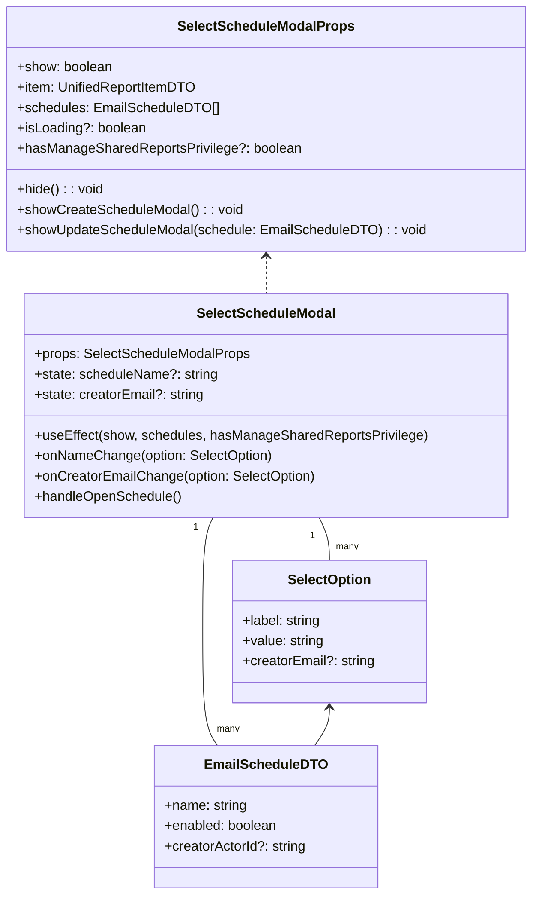

# Diagram: web/portal/src/pages/reports/bi-dashboard-next/components/modals/Reports.SelectSchedule.modal.tsx


> Auto-generated by Obscura crawlers

## Diagram 1

```mermaid
flowchart TD
  A[Modal visible? show=true] --> B{schedules.length === 0}
  B -- yes --> C[Show empty state\n"Create Schedule" primary button enabled]
  B -- no --> D[Show creatorEmailOptions? hasManageSharedReportsPrivilege && creatorEmailOptions.length>0]
  D -- yes --> E[Creator Email Select (creatorEmail)] --> F[Filter nameOptions by creatorEmail]
  D -- no --> F
  F --> G[Schedule Name Select (scheduleName)\ndisabled when isScheduleNameSelectDisabled]
  G --> H[Buttons]
  H --> I[Create Schedule -> showCreateScheduleModal()]
  H --> J[Open Schedule -> handleOpenSchedule()\ndisabled when isOpenDisabled]
  H --> K[Cancel -> hide()]
  A -- no --> L[On hide: setScheduleName=undefined\nsetCreatorEmail=undefined]
```

> SVG rendering failed for this diagram.

## Diagram 2



### SVG

<svg id="container" width="619.859375" xmlns="http://www.w3.org/2000/svg" class="classDiagram" height="1054" viewBox="0 0 619.859375 1054" role="graphics-document document" aria-roledescription="class"><style>#container{font-family:"trebuchet ms",verdana,arial,sans-serif;font-size:16px;fill:#333;}@keyframes edge-animation-frame{from{stroke-dashoffset:0;}}@keyframes dash{to{stroke-dashoffset:0;}}#container .edge-animation-slow{stroke-dasharray:9,5!important;stroke-dashoffset:900;animation:dash 50s linear infinite;stroke-linecap:round;}#container .edge-animation-fast{stroke-dasharray:9,5!important;stroke-dashoffset:900;animation:dash 20s linear infinite;stroke-linecap:round;}#container .error-icon{fill:#552222;}#container .error-text{fill:#552222;stroke:#552222;}#container .edge-thickness-normal{stroke-width:1px;}#container .edge-thickness-thick{stroke-width:3.5px;}#container .edge-pattern-solid{stroke-dasharray:0;}#container .edge-thickness-invisible{stroke-width:0;fill:none;}#container .edge-pattern-dashed{stroke-dasharray:3;}#container .edge-pattern-dotted{stroke-dasharray:2;}#container .marker{fill:#333333;stroke:#333333;}#container .marker.cross{stroke:#333333;}#container svg{font-family:"trebuchet ms",verdana,arial,sans-serif;font-size:16px;}#container p{margin:0;}#container g.classGroup text{fill:#9370DB;stroke:none;font-family:"trebuchet ms",verdana,arial,sans-serif;font-size:10px;}#container g.classGroup text .title{font-weight:bolder;}#container .nodeLabel,#container .edgeLabel{color:#131300;}#container .edgeLabel .label rect{fill:#ECECFF;}#container .label text{fill:#131300;}#container .labelBkg{background:#ECECFF;}#container .edgeLabel .label span{background:#ECECFF;}#container .classTitle{font-weight:bolder;}#container .node rect,#container .node circle,#container .node ellipse,#container .node polygon,#container .node path{fill:#ECECFF;stroke:#9370DB;stroke-width:1px;}#container .divider{stroke:#9370DB;stroke-width:1;}#container g.clickable{cursor:pointer;}#container g.classGroup rect{fill:#ECECFF;stroke:#9370DB;}#container g.classGroup line{stroke:#9370DB;stroke-width:1;}#container .classLabel .box{stroke:none;stroke-width:0;fill:#ECECFF;opacity:0.5;}#container .classLabel .label{fill:#9370DB;font-size:10px;}#container .relation{stroke:#333333;stroke-width:1;fill:none;}#container .dashed-line{stroke-dasharray:3;}#container .dotted-line{stroke-dasharray:1 2;}#container #compositionStart,#container .composition{fill:#333333!important;stroke:#333333!important;stroke-width:1;}#container #compositionEnd,#container .composition{fill:#333333!important;stroke:#333333!important;stroke-width:1;}#container #dependencyStart,#container .dependency{fill:#333333!important;stroke:#333333!important;stroke-width:1;}#container #dependencyStart,#container .dependency{fill:#333333!important;stroke:#333333!important;stroke-width:1;}#container #extensionStart,#container .extension{fill:transparent!important;stroke:#333333!important;stroke-width:1;}#container #extensionEnd,#container .extension{fill:transparent!important;stroke:#333333!important;stroke-width:1;}#container #aggregationStart,#container .aggregation{fill:transparent!important;stroke:#333333!important;stroke-width:1;}#container #aggregationEnd,#container .aggregation{fill:transparent!important;stroke:#333333!important;stroke-width:1;}#container #lollipopStart,#container .lollipop{fill:#ECECFF!important;stroke:#333333!important;stroke-width:1;}#container #lollipopEnd,#container .lollipop{fill:#ECECFF!important;stroke:#333333!important;stroke-width:1;}#container .edgeTerminals{font-size:11px;line-height:initial;}#container .classTitleText{text-anchor:middle;font-size:18px;fill:#333;}#container .label-icon{display:inline-block;height:1em;overflow:visible;vertical-align:-0.125em;}#container .node .label-icon path{fill:currentColor;stroke:revert;stroke-width:revert;}#container :root{--mermaid-font-family:"trebuchet ms",verdana,arial,sans-serif;}</style><g><defs><marker id="container_class-aggregationStart" class="marker aggregation class" refX="18" refY="7" markerWidth="190" markerHeight="240" orient="auto"><path d="M 18,7 L9,13 L1,7 L9,1 Z"></path></marker></defs><defs><marker id="container_class-aggregationEnd" class="marker aggregation class" refX="1" refY="7" markerWidth="20" markerHeight="28" orient="auto"><path d="M 18,7 L9,13 L1,7 L9,1 Z"></path></marker></defs><defs><marker id="container_class-extensionStart" class="marker extension class" refX="18" refY="7" markerWidth="190" markerHeight="240" orient="auto"><path d="M 1,7 L18,13 V 1 Z"></path></marker></defs><defs><marker id="container_class-extensionEnd" class="marker extension class" refX="1" refY="7" markerWidth="20" markerHeight="28" orient="auto"><path d="M 1,1 V 13 L18,7 Z"></path></marker></defs><defs><marker id="container_class-compositionStart" class="marker composition class" refX="18" refY="7" markerWidth="190" markerHeight="240" orient="auto"><path d="M 18,7 L9,13 L1,7 L9,1 Z"></path></marker></defs><defs><marker id="container_class-compositionEnd" class="marker composition class" refX="1" refY="7" markerWidth="20" markerHeight="28" orient="auto"><path d="M 18,7 L9,13 L1,7 L9,1 Z"></path></marker></defs><defs><marker id="container_class-dependencyStart" class="marker dependency class" refX="6" refY="7" markerWidth="190" markerHeight="240" orient="auto"><path d="M 5,7 L9,13 L1,7 L9,1 Z"></path></marker></defs><defs><marker id="container_class-dependencyEnd" class="marker dependency class" refX="13" refY="7" markerWidth="20" markerHeight="28" orient="auto"><path d="M 18,7 L9,13 L14,7 L9,1 Z"></path></marker></defs><defs><marker id="container_class-lollipopStart" class="marker lollipop class" refX="13" refY="7" markerWidth="190" markerHeight="240" orient="auto"><circle stroke="black" fill="transparent" cx="7" cy="7" r="6"></circle></marker></defs><defs><marker id="container_class-lollipopEnd" class="marker lollipop class" refX="1" refY="7" markerWidth="190" markerHeight="240" orient="auto"><circle stroke="black" fill="transparent" cx="7" cy="7" r="6"></circle></marker></defs><g class="root"><g class="clusters"></g><g class="edgePaths"><path d="M372.585,610L374.562,614.167C376.54,618.333,380.496,626.667,382.473,635C384.451,643.333,384.451,651.667,384.451,655.833L384.451,660" id="id_SelectScheduleModal_SelectOption_1" class="edge-thickness-normal edge-pattern-solid relation" style=";;;" data-edge="true" data-et="edge" data-id="id_SelectScheduleModal_SelectOption_1" data-points="W3sieCI6MzcyLjU4NDY5MzQ3MTMzNzYsInkiOjYxMH0seyJ4IjozODQuNDUxMTcxODc1LCJ5Ijo2MzV9LHsieCI6Mzg0LjQ1MTE3MTg3NSwieSI6NjYwfV0="></path><path d="M247.275,610L245.297,614.167C243.319,618.333,239.364,626.667,237.386,649C235.408,671.333,235.408,707.667,235.408,744C235.408,780.333,235.408,816.667,238.257,839C241.106,861.333,246.803,869.667,249.652,873.833L252.5,878" id="id_SelectScheduleModal_EmailScheduleDTO_2" class="edge-thickness-normal edge-pattern-solid relation" style=";;;" data-edge="true" data-et="edge" data-id="id_SelectScheduleModal_EmailScheduleDTO_2" data-points="W3sieCI6MjQ3LjI3NDY4MTUyODY2MjQzLCJ5Ijo2MTB9LHsieCI6MjM1LjQwODIwMzEyNSwieSI6NjM1fSx7IngiOjIzNS40MDgyMDMxMjUsInkiOjc0NH0seyJ4IjoyMzUuNDA4MjAzMTI1LCJ5Ijo4NTN9LHsieCI6MjUyLjUwMDI4NjY5NzI0NzcsInkiOjg3OH1d"></path><path d="M309.93,302L309.93,305.167C309.93,308.333,309.93,314.667,309.93,322C309.93,329.333,309.93,337.667,309.93,341.833L309.93,346" id="id_SelectScheduleModalProps_SelectScheduleModal_3" class="edge-thickness-normal edge-pattern-dashed relation" style=";;;" data-edge="true" data-et="edge" data-id="id_SelectScheduleModalProps_SelectScheduleModal_3" data-points="W3sieCI6MzA5LjkyOTY4NzUsInkiOjI5Nn0seyJ4IjozMDkuOTI5Njg3NSwieSI6MzIxfSx7IngiOjMwOS45Mjk2ODc1LCJ5IjozNDZ9XQ==" marker-start="url(#container_class-dependencyStart)"></path><path d="M384.451,834L384.451,837.167C384.451,840.333,384.451,846.667,381.602,854C378.754,861.333,373.056,869.667,370.208,873.833L367.359,878" id="id_SelectOption_EmailScheduleDTO_4" class="edge-thickness-normal edge-pattern-solid relation" style=";;;" data-edge="true" data-et="edge" data-id="id_SelectOption_EmailScheduleDTO_4" data-points="W3sieCI6Mzg0LjQ1MTE3MTg3NSwieSI6ODI4fSx7IngiOjM4NC40NTExNzE4NzUsInkiOjg1M30seyJ4IjozNjcuMzU5MDg4MzAyNzUyMywieSI6ODc4fV0=" marker-start="url(#container_class-dependencyStart)"></path></g><g class="edgeLabels"><g class="edgeLabel"><g class="label" data-id="id_SelectScheduleModal_SelectOption_1" transform="translate(0, 0)"><foreignObject width="0" height="0"><div xmlns="http://www.w3.org/1999/xhtml" class="labelBkg" style="display: table-cell; white-space: nowrap; line-height: 1.5; max-width: 200px; text-align: center;"><span class="edgeLabel"></span></div></foreignObject></g></g><g class="edgeLabel"><g class="label" data-id="id_SelectScheduleModal_EmailScheduleDTO_2" transform="translate(0, 0)"><foreignObject width="0" height="0"><div xmlns="http://www.w3.org/1999/xhtml" class="labelBkg" style="display: table-cell; white-space: nowrap; line-height: 1.5; max-width: 200px; text-align: center;"><span class="edgeLabel"></span></div></foreignObject></g></g><g class="edgeLabel"><g class="label" data-id="id_SelectScheduleModalProps_SelectScheduleModal_3" transform="translate(0, 0)"><foreignObject width="0" height="0"><div xmlns="http://www.w3.org/1999/xhtml" class="labelBkg" style="display: table-cell; white-space: nowrap; line-height: 1.5; max-width: 200px; text-align: center;"><span class="edgeLabel"></span></div></foreignObject></g></g><g class="edgeLabel"><g class="label" data-id="id_SelectOption_EmailScheduleDTO_4" transform="translate(0, 0)"><foreignObject width="0" height="0"><div xmlns="http://www.w3.org/1999/xhtml" class="labelBkg" style="display: table-cell; white-space: nowrap; line-height: 1.5; max-width: 200px; text-align: center;"><span class="edgeLabel"></span></div></foreignObject></g></g><g class="edgeTerminals" transform="translate(364.43666946433024, 631.3322858457499)"><g class="inner" transform="translate(0, 0)"><foreignObject style="width: 9px; height: 12px;"><div xmlns="http://www.w3.org/1999/xhtml" style="display: inline-block; padding-right: 1px; white-space: nowrap;"><span class="edgeLabel">1</span></div></foreignObject></g></g><g class="edgeTerminals" transform="translate(227.26017919754324, 620.994382234913)"><g class="inner" transform="translate(0, 0)"><foreignObject style="width: 9px; height: 12px;"><div xmlns="http://www.w3.org/1999/xhtml" style="display: inline-block; padding-right: 1px; white-space: nowrap;"><span class="edgeLabel">1</span></div></foreignObject></g></g><g class="edgeTerminals" transform="translate(392.1894875880524, 636.1079398025123)"><g class="inner" transform="translate(0, 0)"></g><foreignObject style="width: 36px; height: 12px;"><div xmlns="http://www.w3.org/1999/xhtml" style="display: inline-block; padding-right: 1px; white-space: nowrap;"><span class="edgeLabel">many</span></div></foreignObject></g><g class="edgeTerminals" transform="translate(251.9567855236303, 850.6632582239255)"><g class="inner" transform="translate(0, 0)"></g><foreignObject style="width: 36px; height: 12px;"><div xmlns="http://www.w3.org/1999/xhtml" style="display: inline-block; padding-right: 1px; white-space: nowrap;"><span class="edgeLabel">many</span></div></foreignObject></g></g><g class="nodes"><g class="node default" id="classId-SelectOption-0" transform="translate(384.451171875, 744)"><g class="basic label-container"><path d="M-114.04296875 -84 L114.04296875 -84 L114.04296875 84 L-114.04296875 84" stroke="none" stroke-width="0" fill="#ECECFF" style=""></path><path d="M-114.04296875 -84 C-35.7108579869584 -84, 42.621252776083196 -84, 114.04296875 -84 M-114.04296875 -84 C-39.96844744730204 -84, 34.10607385539592 -84, 114.04296875 -84 M114.04296875 -84 C114.04296875 -20.32487408033873, 114.04296875 43.35025183932254, 114.04296875 84 M114.04296875 -84 C114.04296875 -17.8795677446776, 114.04296875 48.2408645106448, 114.04296875 84 M114.04296875 84 C51.2283343397933 84, -11.586300070413401 84, -114.04296875 84 M114.04296875 84 C41.42902547323945 84, -31.184917803521103 84, -114.04296875 84 M-114.04296875 84 C-114.04296875 48.91922570817741, -114.04296875 13.838451416354815, -114.04296875 -84 M-114.04296875 84 C-114.04296875 20.465246051235532, -114.04296875 -43.069507897528936, -114.04296875 -84" stroke="#9370DB" stroke-width="1.3" fill="none" stroke-dasharray="0 0" style=""></path></g><g class="annotation-group text" transform="translate(0, -60)"></g><g class="label-group text" transform="translate(-47.6015625, -60)"><g class="label" style="font-weight: bolder" transform="translate(0,-12)"><foreignObject width="95.203125" height="24"><div xmlns="http://www.w3.org/1999/xhtml" style="display: table-cell; white-space: nowrap; line-height: 1.5; max-width: 144px; text-align: center;"><span class="nodeLabel markdown-node-label" style=""><p>SelectOption</p></span></div></foreignObject></g></g><g class="members-group text" transform="translate(-102.04296875, -12)"><g class="label" style="" transform="translate(0,-12)"><foreignObject width="94.09375" height="24"><div xmlns="http://www.w3.org/1999/xhtml" style="display: table-cell; white-space: nowrap; line-height: 1.5; max-width: 152px; text-align: center;"><span class="nodeLabel markdown-node-label" style=""><p>+label: string</p></span></div></foreignObject></g><g class="label" style="" transform="translate(0,12)"><foreignObject width="96.421875" height="24"><div xmlns="http://www.w3.org/1999/xhtml" style="display: table-cell; white-space: nowrap; line-height: 1.5; max-width: 154px; text-align: center;"><span class="nodeLabel markdown-node-label" style=""><p>+value: string</p></span></div></foreignObject></g><g class="label" style="" transform="translate(0,36)"><foreignObject width="156.484375" height="24"><div xmlns="http://www.w3.org/1999/xhtml" style="display: table-cell; white-space: nowrap; line-height: 1.5; max-width: 215px; text-align: center;"><span class="nodeLabel markdown-node-label" style=""><p>+creatorEmail?: string</p></span></div></foreignObject></g></g><g class="methods-group text" transform="translate(-102.04296875, 84)"></g><g class="divider" style=""><path d="M-114.04296875 -36 C-51.83255330584708 -36, 10.377862138305844 -36, 114.04296875 -36 M-114.04296875 -36 C-63.46387506835685 -36, -12.884781386713698 -36, 114.04296875 -36" stroke="#9370DB" stroke-width="1.3" fill="none" stroke-dasharray="0 0" style=""></path></g><g class="divider" style=""><path d="M-114.04296875 60 C-50.280275120275626 60, 13.482418509448749 60, 114.04296875 60 M-114.04296875 60 C-32.833864948914595 60, 48.37523885217081 60, 114.04296875 60" stroke="#9370DB" stroke-width="1.3" fill="none" stroke-dasharray="0 0" style=""></path></g></g><g class="node default" id="classId-SelectScheduleModal-1" transform="translate(309.9296875, 478)"><g class="basic label-container"><path d="M-282.25390625 -132 L282.25390625 -132 L282.25390625 132 L-282.25390625 132" stroke="none" stroke-width="0" fill="#ECECFF" style=""></path><path d="M-282.25390625 -132 C-129.68958790440635 -132, 22.874730441187296 -132, 282.25390625 -132 M-282.25390625 -132 C-108.53950009053307 -132, 65.17490606893386 -132, 282.25390625 -132 M282.25390625 -132 C282.25390625 -62.28218128245135, 282.25390625 7.435637435097306, 282.25390625 132 M282.25390625 -132 C282.25390625 -77.12822856008879, 282.25390625 -22.256457120177558, 282.25390625 132 M282.25390625 132 C149.7583596662084 132, 17.262813082416812 132, -282.25390625 132 M282.25390625 132 C93.206089941197 132, -95.84172636760599 132, -282.25390625 132 M-282.25390625 132 C-282.25390625 27.076673477320284, -282.25390625 -77.84665304535943, -282.25390625 -132 M-282.25390625 132 C-282.25390625 72.42001180280289, -282.25390625 12.84002360560578, -282.25390625 -132" stroke="#9370DB" stroke-width="1.3" fill="none" stroke-dasharray="0 0" style=""></path></g><g class="annotation-group text" transform="translate(0, -108)"></g><g class="label-group text" transform="translate(-78.6796875, -108)"><g class="label" style="font-weight: bolder" transform="translate(0,-12)"><foreignObject width="157.359375" height="24"><div xmlns="http://www.w3.org/1999/xhtml" style="display: table-cell; white-space: nowrap; line-height: 1.5; max-width: 206px; text-align: center;"><span class="nodeLabel markdown-node-label" style=""><p>SelectScheduleModal</p></span></div></foreignObject></g></g><g class="members-group text" transform="translate(-270.25390625, -60)"><g class="label" style="" transform="translate(0,-12)"><foreignObject width="254.046875" height="24"><div xmlns="http://www.w3.org/1999/xhtml" style="display: table-cell; white-space: nowrap; line-height: 1.5; max-width: 311px; text-align: center;"><span class="nodeLabel markdown-node-label" style=""><p>+props: SelectScheduleModalProps</p></span></div></foreignObject></g><g class="label" style="" transform="translate(0,12)"><foreignObject width="216.078125" height="24"><div xmlns="http://www.w3.org/1999/xhtml" style="display: table-cell; white-space: nowrap; line-height: 1.5; max-width: 274px; text-align: center;"><span class="nodeLabel markdown-node-label" style=""><p>+state: scheduleName?: string</p></span></div></foreignObject></g><g class="label" style="" transform="translate(0,36)"><foreignObject width="200.671875" height="24"><div xmlns="http://www.w3.org/1999/xhtml" style="display: table-cell; white-space: nowrap; line-height: 1.5; max-width: 259px; text-align: center;"><span class="nodeLabel markdown-node-label" style=""><p>+state: creatorEmail?: string</p></span></div></foreignObject></g></g><g class="methods-group text" transform="translate(-270.25390625, 36)"><g class="label" style="" transform="translate(0,-12)"><foreignObject width="461.828125" height="24"><div xmlns="http://www.w3.org/1999/xhtml" style="display: table-cell; white-space: nowrap; line-height: 1.5; max-width: 519px; text-align: center;"><span class="nodeLabel markdown-node-label" style=""><p>+useEffect(show, schedules, hasManageSharedReportsPrivilege)</p></span></div></foreignObject></g><g class="label" style="" transform="translate(0,12)"><foreignObject width="281.890625" height="24"><div xmlns="http://www.w3.org/1999/xhtml" style="display: table-cell; white-space: nowrap; line-height: 1.5; max-width: 339px; text-align: center;"><span class="nodeLabel markdown-node-label" style=""><p>+onNameChange(option: SelectOption)</p></span></div></foreignObject></g><g class="label" style="" transform="translate(0,36)"><foreignObject width="332.578125" height="24"><div xmlns="http://www.w3.org/1999/xhtml" style="display: table-cell; white-space: nowrap; line-height: 1.5; max-width: 390px; text-align: center;"><span class="nodeLabel markdown-node-label" style=""><p>+onCreatorEmailChange(option: SelectOption)</p></span></div></foreignObject></g><g class="label" style="" transform="translate(0,60)"><foreignObject width="174.0625" height="24"><div xmlns="http://www.w3.org/1999/xhtml" style="display: table-cell; white-space: nowrap; line-height: 1.5; max-width: 231px; text-align: center;"><span class="nodeLabel markdown-node-label" style=""><p>+handleOpenSchedule()</p></span></div></foreignObject></g></g><g class="divider" style=""><path d="M-282.25390625 -84 C-69.99027325520285 -84, 142.2733597395943 -84, 282.25390625 -84 M-282.25390625 -84 C-59.38042822284237 -84, 163.49304980431526 -84, 282.25390625 -84" stroke="#9370DB" stroke-width="1.3" fill="none" stroke-dasharray="0 0" style=""></path></g><g class="divider" style=""><path d="M-282.25390625 12 C-87.43285569401053 12, 107.38819486197895 12, 282.25390625 12 M-282.25390625 12 C-112.99038777717601 12, 56.27313069564798 12, 282.25390625 12" stroke="#9370DB" stroke-width="1.3" fill="none" stroke-dasharray="0 0" style=""></path></g></g><g class="node default" id="classId-SelectScheduleModalProps-2" transform="translate(309.9296875, 152)"><g class="basic label-container"><path d="M-301.9296875 -144 L301.9296875 -144 L301.9296875 144 L-301.9296875 144" stroke="none" stroke-width="0" fill="#ECECFF" style=""></path><path d="M-301.9296875 -144 C-102.39158746176503 -144, 97.14651257646995 -144, 301.9296875 -144 M-301.9296875 -144 C-140.84356992975864 -144, 20.242547640482712 -144, 301.9296875 -144 M301.9296875 -144 C301.9296875 -52.765898653883184, 301.9296875 38.46820269223363, 301.9296875 144 M301.9296875 -144 C301.9296875 -63.681340423852774, 301.9296875 16.637319152294452, 301.9296875 144 M301.9296875 144 C125.08204393328543 144, -51.76559963342913 144, -301.9296875 144 M301.9296875 144 C76.37007937596297 144, -149.18952874807405 144, -301.9296875 144 M-301.9296875 144 C-301.9296875 57.562858234401574, -301.9296875 -28.874283531196852, -301.9296875 -144 M-301.9296875 144 C-301.9296875 70.93452020791287, -301.9296875 -2.1309595841742635, -301.9296875 -144" stroke="#9370DB" stroke-width="1.3" fill="none" stroke-dasharray="0 0" style=""></path></g><g class="annotation-group text" transform="translate(0, -120)"></g><g class="label-group text" transform="translate(-99.59375, -120)"><g class="label" style="font-weight: bolder" transform="translate(0,-12)"><foreignObject width="199.1875" height="24"><div xmlns="http://www.w3.org/1999/xhtml" style="display: table-cell; white-space: nowrap; line-height: 1.5; max-width: 246px; text-align: center;"><span class="nodeLabel markdown-node-label" style=""><p>SelectScheduleModalProps</p></span></div></foreignObject></g></g><g class="members-group text" transform="translate(-289.9296875, -72)"><g class="label" style="" transform="translate(0,-12)"><foreignObject width="113.234375" height="24"><div xmlns="http://www.w3.org/1999/xhtml" style="display: table-cell; white-space: nowrap; line-height: 1.5; max-width: 171px; text-align: center;"><span class="nodeLabel markdown-node-label" style=""><p>+show: boolean</p></span></div></foreignObject></g><g class="label" style="" transform="translate(0,12)"><foreignObject width="210.703125" height="24"><div xmlns="http://www.w3.org/1999/xhtml" style="display: table-cell; white-space: nowrap; line-height: 1.5; max-width: 268px; text-align: center;"><span class="nodeLabel markdown-node-label" style=""><p>+item: UnifiedReportItemDTO</p></span></div></foreignObject></g><g class="label" style="" transform="translate(0,36)"><foreignObject width="234.484375" height="24"><div xmlns="http://www.w3.org/1999/xhtml" style="display: table-cell; white-space: nowrap; line-height: 1.5; max-width: 292px; text-align: center;"><span class="nodeLabel markdown-node-label" style=""><p>+schedules: EmailScheduleDTO[]</p></span></div></foreignObject></g><g class="label" style="" transform="translate(0,60)"><foreignObject width="151.75" height="24"><div xmlns="http://www.w3.org/1999/xhtml" style="display: table-cell; white-space: nowrap; line-height: 1.5; max-width: 209px; text-align: center;"><span class="nodeLabel markdown-node-label" style=""><p>+isLoading?: boolean</p></span></div></foreignObject></g><g class="label" style="" transform="translate(0,84)"><foreignObject width="332.84375" height="24"><div xmlns="http://www.w3.org/1999/xhtml" style="display: table-cell; white-space: nowrap; line-height: 1.5; max-width: 390px; text-align: center;"><span class="nodeLabel markdown-node-label" style=""><p>+hasManageSharedReportsPrivilege?: boolean</p></span></div></foreignObject></g></g><g class="methods-group text" transform="translate(-289.9296875, 72)"><g class="label" style="" transform="translate(0,-12)"><foreignObject width="102.171875" height="24"><div xmlns="http://www.w3.org/1999/xhtml" style="display: table-cell; white-space: nowrap; line-height: 1.5; max-width: 160px; text-align: center;"><span class="nodeLabel markdown-node-label" style=""><p>+hide() : : void</p></span></div></foreignObject></g><g class="label" style="" transform="translate(0,12)"><foreignObject width="264.859375" height="24"><div xmlns="http://www.w3.org/1999/xhtml" style="display: table-cell; white-space: nowrap; line-height: 1.5; max-width: 322px; text-align: center;"><span class="nodeLabel markdown-node-label" style=""><p>+showCreateScheduleModal() : : void</p></span></div></foreignObject></g><g class="label" style="" transform="translate(0,36)"><foreignObject width="480.265625" height="24"><div xmlns="http://www.w3.org/1999/xhtml" style="display: table-cell; white-space: nowrap; line-height: 1.5; max-width: 538px; text-align: center;"><span class="nodeLabel markdown-node-label" style=""><p>+showUpdateScheduleModal(schedule: EmailScheduleDTO) : : void</p></span></div></foreignObject></g></g><g class="divider" style=""><path d="M-301.9296875 -96 C-166.52586618060297 -96, -31.12204486120595 -96, 301.9296875 -96 M-301.9296875 -96 C-178.16215205506663 -96, -54.394616610133255 -96, 301.9296875 -96" stroke="#9370DB" stroke-width="1.3" fill="none" stroke-dasharray="0 0" style=""></path></g><g class="divider" style=""><path d="M-301.9296875 48 C-113.20728942970041 48, 75.51510864059918 48, 301.9296875 48 M-301.9296875 48 C-122.31123818497761 48, 57.30721113004478 48, 301.9296875 48" stroke="#9370DB" stroke-width="1.3" fill="none" stroke-dasharray="0 0" style=""></path></g></g><g class="node default" id="classId-EmailScheduleDTO-3" transform="translate(309.9296875, 962)"><g class="basic label-container"><path d="M-130.421875 -84 L130.421875 -84 L130.421875 84 L-130.421875 84" stroke="none" stroke-width="0" fill="#ECECFF" style=""></path><path d="M-130.421875 -84 C-58.55160015627146 -84, 13.318674687457076 -84, 130.421875 -84 M-130.421875 -84 C-55.003713639915205 -84, 20.41444772016959 -84, 130.421875 -84 M130.421875 -84 C130.421875 -28.270968538528955, 130.421875 27.45806292294209, 130.421875 84 M130.421875 -84 C130.421875 -28.137013797736458, 130.421875 27.725972404527084, 130.421875 84 M130.421875 84 C34.666159819657636 84, -61.08955536068473 84, -130.421875 84 M130.421875 84 C34.99000994080292 84, -60.44185511839416 84, -130.421875 84 M-130.421875 84 C-130.421875 49.64828284298939, -130.421875 15.296565685978777, -130.421875 -84 M-130.421875 84 C-130.421875 23.035433531397665, -130.421875 -37.92913293720467, -130.421875 -84" stroke="#9370DB" stroke-width="1.3" fill="none" stroke-dasharray="0 0" style=""></path></g><g class="annotation-group text" transform="translate(0, -60)"></g><g class="label-group text" transform="translate(-67.96875, -60)"><g class="label" style="font-weight: bolder" transform="translate(0,-12)"><foreignObject width="135.9375" height="24"><div xmlns="http://www.w3.org/1999/xhtml" style="display: table-cell; white-space: nowrap; line-height: 1.5; max-width: 185px; text-align: center;"><span class="nodeLabel markdown-node-label" style=""><p>EmailScheduleDTO</p></span></div></foreignObject></g></g><g class="members-group text" transform="translate(-118.421875, -12)"><g class="label" style="" transform="translate(0,-12)"><foreignObject width="98.21875" height="24"><div xmlns="http://www.w3.org/1999/xhtml" style="display: table-cell; white-space: nowrap; line-height: 1.5; max-width: 156px; text-align: center;"><span class="nodeLabel markdown-node-label" style=""><p>+name: string</p></span></div></foreignObject></g><g class="label" style="" transform="translate(0,12)"><foreignObject width="134.71875" height="24"><div xmlns="http://www.w3.org/1999/xhtml" style="display: table-cell; white-space: nowrap; line-height: 1.5; max-width: 192px; text-align: center;"><span class="nodeLabel markdown-node-label" style=""><p>+enabled: boolean</p></span></div></foreignObject></g><g class="label" style="" transform="translate(0,36)"><foreignObject width="168.875" height="24"><div xmlns="http://www.w3.org/1999/xhtml" style="display: table-cell; white-space: nowrap; line-height: 1.5; max-width: 227px; text-align: center;"><span class="nodeLabel markdown-node-label" style=""><p>+creatorActorId?: string</p></span></div></foreignObject></g></g><g class="methods-group text" transform="translate(-118.421875, 84)"></g><g class="divider" style=""><path d="M-130.421875 -36 C-57.15427378321532 -36, 16.113327433569367 -36, 130.421875 -36 M-130.421875 -36 C-45.588927322152784 -36, 39.24402035569443 -36, 130.421875 -36" stroke="#9370DB" stroke-width="1.3" fill="none" stroke-dasharray="0 0" style=""></path></g><g class="divider" style=""><path d="M-130.421875 60 C-39.90297348673012 60, 50.61592802653976 60, 130.421875 60 M-130.421875 60 C-42.62310930570034 60, 45.17565638859932 60, 130.421875 60" stroke="#9370DB" stroke-width="1.3" fill="none" stroke-dasharray="0 0" style=""></path></g></g></g></g></g></svg>
