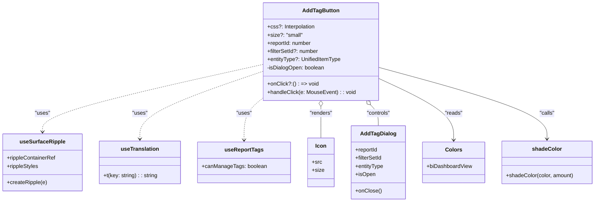

# Diagram: web/portal/src/pages/reports/bi-dashboard-next/components/molecules/Reports.AddTagButton.molecule.tsx

> Auto-generated by Obscura crawlers

## Mermaid

### SVG

<svg id="container" width="1733.4453125" xmlns="http://www.w3.org/2000/svg" class="classDiagram" height="594" viewBox="0 0 1733.4453125 594" role="graphics-document document" aria-roledescription="class"><g><defs><marker id="container_class-aggregationStart" class="marker aggregation class" refX="18" refY="7" markerWidth="190" markerHeight="240" orient="auto"><path d="M 18,7 L9,13 L1,7 L9,1 Z"></path></marker></defs><defs><marker id="container_class-aggregationEnd" class="marker aggregation class" refX="1" refY="7" markerWidth="20" markerHeight="28" orient="auto"><path d="M 18,7 L9,13 L1,7 L9,1 Z"></path></marker></defs><defs><marker id="container_class-extensionStart" class="marker extension class" refX="18" refY="7" markerWidth="190" markerHeight="240" orient="auto"><path d="M 1,7 L18,13 V 1 Z"></path></marker></defs><defs><marker id="container_class-extensionEnd" class="marker extension class" refX="1" refY="7" markerWidth="20" markerHeight="28" orient="auto"><path d="M 1,1 V 13 L18,7 Z"></path></marker></defs><defs><marker id="container_class-compositionStart" class="marker composition class" refX="18" refY="7" markerWidth="190" markerHeight="240" orient="auto"><path d="M 18,7 L9,13 L1,7 L9,1 Z"></path></marker></defs><defs><marker id="container_class-compositionEnd" class="marker composition class" refX="1" refY="7" markerWidth="20" markerHeight="28" orient="auto"><path d="M 18,7 L9,13 L1,7 L9,1 Z"></path></marker></defs><defs><marker id="container_class-dependencyStart" class="marker dependency class" refX="6" refY="7" markerWidth="190" markerHeight="240" orient="auto"><path d="M 5,7 L9,13 L1,7 L9,1 Z"></path></marker></defs><defs><marker id="container_class-dependencyEnd" class="marker dependency class" refX="13" refY="7" markerWidth="20" markerHeight="28" orient="auto"><path d="M 18,7 L9,13 L14,7 L9,1 Z"></path></marker></defs><defs><marker id="container_class-lollipopStart" class="marker lollipop class" refX="13" refY="7" markerWidth="190" markerHeight="240" orient="auto"><circle stroke="black" fill="transparent" cx="7" cy="7" r="6"></circle></marker></defs><defs><marker id="container_class-lollipopEnd" class="marker lollipop class" refX="1" refY="7" markerWidth="190" markerHeight="240" orient="auto"><circle stroke="black" fill="transparent" cx="7" cy="7" r="6"></circle></marker></defs><g class="root"><g class="clusters"></g><g class="edgePaths"><path d="M766.742,189.349L659.693,213.291C552.643,237.233,338.544,285.116,231.495,318.225C124.445,351.333,124.445,369.667,124.445,378.833L124.445,388" id="id_AddTagButton_useSurfaceRipple_1" class="edge-thickness-normal edge-pattern-dashed relation" style=";;;" data-edge="true" data-et="edge" data-id="id_AddTagButton_useSurfaceRipple_1" data-points="W3sieCI6NzY2Ljc0MjE4NzUsInkiOjE4OS4zNDkwMTIyMDY4MzU2Mn0seyJ4IjoxMjQuNDQ1MzEyNSwieSI6MzMzfSx7IngiOjEyNC40NDUzMTI1LCJ5IjozOTR9XQ==" marker-end="url(#container_class-dependencyEnd)"></path><path d="M766.742,209.729L707.311,230.274C647.879,250.82,529.016,291.91,469.584,325.122C410.152,358.333,410.152,383.667,410.152,396.333L410.152,409" id="id_AddTagButton_useTranslation_2" class="edge-thickness-normal edge-pattern-dashed relation" style=";;;" data-edge="true" data-et="edge" data-id="id_AddTagButton_useTranslation_2" data-points="W3sieCI6NzY2Ljc0MjE4NzUsInkiOjIwOS43MjkzODI3MTIzNjUxNX0seyJ4Ijo0MTAuMTUyMzQzNzUsInkiOjMzM30seyJ4Ijo0MTAuMTUyMzQzNzUsInkiOjQxNX1d" marker-end="url(#container_class-dependencyEnd)"></path><path d="M766.742,288.843L757.761,296.203C748.78,303.562,730.818,318.281,721.837,338.807C712.855,359.333,712.855,385.667,712.855,398.833L712.855,412" id="id_AddTagButton_useReportTags_3" class="edge-thickness-normal edge-pattern-dashed relation" style=";;;" data-edge="true" data-et="edge" data-id="id_AddTagButton_useReportTags_3" data-points="W3sieCI6NzY2Ljc0MjE4NzUsInkiOjI4OC44NDMxMTg4NzY2NjY4fSx7IngiOjcxMi44NTU0Njg3NSwieSI6MzMzfSx7IngiOjcxMi44NTU0Njg3NSwieSI6NDE4fV0=" marker-end="url(#container_class-dependencyEnd)"></path><path d="M933.738,313.25L933.738,316.542C933.738,319.833,933.738,326.417,933.738,341.875C933.738,357.333,933.738,381.667,933.738,393.833L933.738,406" id="id_AddTagButton_Icon_4" class="edge-thickness-normal edge-pattern-solid relation" style=";;;" data-edge="true" data-et="edge" data-id="id_AddTagButton_Icon_4" data-points="W3sieCI6OTMzLjczODI4MTI1LCJ5IjoyOTZ9LHsieCI6OTMzLjczODI4MTI1LCJ5IjozMzN9LHsieCI6OTMzLjczODI4MTI1LCJ5Ijo0MDZ9XQ==" marker-start="url(#container_class-aggregationStart)"></path><path d="M1077.754,308.701L1081.476,312.751C1085.198,316.801,1092.642,324.9,1096.364,335.117C1100.086,345.333,1100.086,357.667,1100.086,363.833L1100.086,370" id="id_AddTagButton_AddTagDialog_5" class="edge-thickness-normal edge-pattern-solid relation" style=";;;" data-edge="true" data-et="edge" data-id="id_AddTagButton_AddTagDialog_5" data-points="W3sieCI6MTA2Ni4wODExNjc5OTAzMzE2LCJ5IjoyOTZ9LHsieCI6MTEwMC4wODU5Mzc1LCJ5IjozMzN9LHsieCI6MTEwMC4wODU5Mzc1LCJ5IjozNzB9XQ==" marker-start="url(#container_class-aggregationStart)"></path><path d="M1100.734,230.367L1137.186,247.472C1173.637,264.578,1246.539,298.789,1282.99,329.061C1319.441,359.333,1319.441,385.667,1319.441,398.833L1319.441,412" id="id_AddTagButton_Colors_6" class="edge-thickness-normal edge-pattern-solid relation" style=";;;" data-edge="true" data-et="edge" data-id="id_AddTagButton_Colors_6" data-points="W3sieCI6MTEwMC43MzQzNzUsInkiOjIzMC4zNjY3MzA4MDgxODMxfSx7IngiOjEzMTkuNDQxNDA2MjUsInkiOjMzM30seyJ4IjoxMzE5LjQ0MTQwNjI1LCJ5Ijo0MTh9XQ==" marker-end="url(#container_class-dependencyEnd)"></path><path d="M1100.734,197.872L1182.723,220.393C1264.712,242.915,1428.69,287.957,1510.679,323.145C1592.668,358.333,1592.668,383.667,1592.668,396.333L1592.668,409" id="id_AddTagButton_shadeColor_7" class="edge-thickness-normal edge-pattern-solid relation" style=";;;" data-edge="true" data-et="edge" data-id="id_AddTagButton_shadeColor_7" data-points="W3sieCI6MTEwMC43MzQzNzUsInkiOjE5Ny44NzE4MDMyMzIwNDA2fSx7IngiOjE1OTIuNjY3OTY4NzUsInkiOjMzM30seyJ4IjoxNTkyLjY2Nzk2ODc1LCJ5Ijo0MTV9XQ==" marker-end="url(#container_class-dependencyEnd)"></path></g><g class="edgeLabels"><g class="edgeLabel" transform="translate(124.4453125, 333)"><g class="label" data-id="id_AddTagButton_useSurfaceRipple_1" transform="translate(-22.7578125, -12)"><foreignObject width="45.515625" height="24">

"uses"

</foreignObject></g></g><g class="edgeLabel" transform="translate(410.15234375, 333)"><g class="label" data-id="id_AddTagButton_useTranslation_2" transform="translate(-22.7578125, -12)"><foreignObject width="45.515625" height="24">

"uses"

</foreignObject></g></g><g class="edgeLabel" transform="translate(712.85546875, 333)"><g class="label" data-id="id_AddTagButton_useReportTags_3" transform="translate(-22.7578125, -12)"><foreignObject width="45.515625" height="24">

"uses"

</foreignObject></g></g><g class="edgeLabel" transform="translate(933.73828125, 333)"><g class="label" data-id="id_AddTagButton_Icon_4" transform="translate(-34.015625, -12)"><foreignObject width="68.03125" height="24">

"renders"

</foreignObject></g></g><g class="edgeLabel" transform="translate(1100.0859375, 333)"><g class="label" data-id="id_AddTagButton_AddTagDialog_5" transform="translate(-35.703125, -12)"><foreignObject width="71.40625" height="24">

"controls"

</foreignObject></g></g><g class="edgeLabel" transform="translate(1319.44140625, 333)"><g class="label" data-id="id_AddTagButton_Colors_6" transform="translate(-26.265625, -12)"><foreignObject width="52.53125" height="24">

"reads"

</foreignObject></g></g><g class="edgeLabel" transform="translate(1592.66796875, 333)"><g class="label" data-id="id_AddTagButton_shadeColor_7" transform="translate(-22.625, -12)"><foreignObject width="45.25" height="24">

"calls"

</foreignObject></g></g></g><g class="nodes"><g class="node default" id="classId-AddTagButton-0" transform="translate(933.73828125, 152)"><g class="basic label-container"><path d="M-166.99609375 -144 L166.99609375 -144 L166.99609375 144 L-166.99609375 144" stroke="none" stroke-width="0" fill="#ECECFF" style=""></path><path d="M-166.99609375 -144 C-78.69417034871029 -144, 9.607753052579426 -144, 166.99609375 -144 M-166.99609375 -144 C-98.71292755026612 -144, -30.42976135053223 -144, 166.99609375 -144 M166.99609375 -144 C166.99609375 -32.22920657444219, 166.99609375 79.54158685111562, 166.99609375 144 M166.99609375 -144 C166.99609375 -36.97948295477494, 166.99609375 70.04103409045013, 166.99609375 144 M166.99609375 144 C58.48672058905889 144, -50.02265257188222 144, -166.99609375 144 M166.99609375 144 C40.70836032584259 144, -85.57937309831482 144, -166.99609375 144 M-166.99609375 144 C-166.99609375 36.94719539419005, -166.99609375 -70.1056092116199, -166.99609375 -144 M-166.99609375 144 C-166.99609375 48.5042813177255, -166.99609375 -46.991437364549, -166.99609375 -144" stroke="#9370DB" stroke-width="1.3" fill="none" stroke-dasharray="0 0" style=""></path></g><g class="annotation-group text" transform="translate(0, -120)"></g><g class="label-group text" transform="translate(-51.7890625, -120)"><g class="label" style="font-weight: bolder" transform="translate(0,-12)"><foreignObject width="103.578125" height="24">

AddTagButton

</foreignObject></g></g><g class="members-group text" transform="translate(-154.99609375, -72)"><g class="label" style="" transform="translate(0,-12)"><foreignObject width="141.0625" height="24">

+css?: Interpolation

</foreignObject></g><g class="label" style="" transform="translate(0,12)"><foreignObject width="101.828125" height="24">

+size?: "small"

</foreignObject></g><g class="label" style="" transform="translate(0,36)"><foreignObject width="132.375" height="24">

+reportId: number

</foreignObject></g><g class="label" style="" transform="translate(0,60)"><foreignObject width="151.796875" height="24">

+filterSetId?: number

</foreignObject></g><g class="label" style="" transform="translate(0,84)"><foreignObject width="216.84375" height="24">

+entityType?: UnifiedItemType

</foreignObject></g><g class="label" style="" transform="translate(0,108)"><foreignObject width="170.265625" height="24">

-isDialogOpen: boolean

</foreignObject></g></g><g class="methods-group text" transform="translate(-154.99609375, 96)"><g class="label" style="" transform="translate(0,-12)"><foreignObject width="145.5" height="24">

+onClick?:() : =&gt; void

</foreignObject></g><g class="label" style="" transform="translate(0,12)"><foreignObject width="258.203125" height="24">

+handleClick(e: MouseEvent) : : void

</foreignObject></g></g><g class="divider" style=""><path d="M-166.99609375 -96 C-43.956117648340026 -96, 79.08385845331995 -96, 166.99609375 -96 M-166.99609375 -96 C-45.58821760044958 -96, 75.81965854910084 -96, 166.99609375 -96" stroke="#9370DB" stroke-width="1.3" fill="none" stroke-dasharray="0 0" style=""></path></g><g class="divider" style=""><path d="M-166.99609375 72 C-95.54113615497221 72, -24.086178559944415 72, 166.99609375 72 M-166.99609375 72 C-44.67029156649362 72, 77.65551061701277 72, 166.99609375 72" stroke="#9370DB" stroke-width="1.3" fill="none" stroke-dasharray="0 0" style=""></path></g></g><g class="node default" id="classId-useSurfaceRipple-1" transform="translate(124.4453125, 478)"><g class="basic label-container"><path d="M-116.4453125 -84 L116.4453125 -84 L116.4453125 84 L-116.4453125 84" stroke="none" stroke-width="0" fill="#ECECFF" style=""></path><path d="M-116.4453125 -84 C-51.71861569314568 -84, 13.008081113708641 -84, 116.4453125 -84 M-116.4453125 -84 C-57.24182872642458 -84, 1.9616550471508418 -84, 116.4453125 -84 M116.4453125 -84 C116.4453125 -42.954824093070556, 116.4453125 -1.909648186141112, 116.4453125 84 M116.4453125 -84 C116.4453125 -49.15820004664809, 116.4453125 -14.316400093296181, 116.4453125 84 M116.4453125 84 C34.849586801063325 84, -46.74613889787335 84, -116.4453125 84 M116.4453125 84 C62.583912549056464 84, 8.722512598112928 84, -116.4453125 84 M-116.4453125 84 C-116.4453125 23.036562423757417, -116.4453125 -37.92687515248517, -116.4453125 -84 M-116.4453125 84 C-116.4453125 21.176201270872276, -116.4453125 -41.64759745825545, -116.4453125 -84" stroke="#9370DB" stroke-width="1.3" fill="none" stroke-dasharray="0 0" style=""></path></g><g class="annotation-group text" transform="translate(0, -60)"></g><g class="label-group text" transform="translate(-63.84375, -60)"><g class="label" style="font-weight: bolder" transform="translate(0,-12)"><foreignObject width="127.6875" height="24">

useSurfaceRipple

</foreignObject></g></g><g class="members-group text" transform="translate(-104.4453125, -12)"><g class="label" style="" transform="translate(0,-12)"><foreignObject width="145.046875" height="24">

+rippleContainerRef

</foreignObject></g><g class="label" style="" transform="translate(0,12)"><foreignObject width="94.109375" height="24">

+rippleStyles

</foreignObject></g></g><g class="methods-group text" transform="translate(-104.4453125, 60)"><g class="label" style="" transform="translate(0,-12)"><foreignObject width="118.46875" height="24">

+createRipple(e)

</foreignObject></g></g><g class="divider" style=""><path d="M-116.4453125 -36 C-61.675396118226 -36, -6.905479736451994 -36, 116.4453125 -36 M-116.4453125 -36 C-50.022256356133255 -36, 16.40079978773349 -36, 116.4453125 -36" stroke="#9370DB" stroke-width="1.3" fill="none" stroke-dasharray="0 0" style=""></path></g><g class="divider" style=""><path d="M-116.4453125 36 C-48.210114744131275 36, 20.02508301173745 36, 116.4453125 36 M-116.4453125 36 C-41.83439588068221 36, 32.77652073863558 36, 116.4453125 36" stroke="#9370DB" stroke-width="1.3" fill="none" stroke-dasharray="0 0" style=""></path></g></g><g class="node default" id="classId-useTranslation-2" transform="translate(410.15234375, 478)"><g class="basic label-container"><path d="M-119.26171875 -63 L119.26171875 -63 L119.26171875 63 L-119.26171875 63" stroke="none" stroke-width="0" fill="#ECECFF" style=""></path><path d="M-119.26171875 -63 C-24.613500436648707 -63, 70.03471787670259 -63, 119.26171875 -63 M-119.26171875 -63 C-47.492275220829114 -63, 24.27716830834177 -63, 119.26171875 -63 M119.26171875 -63 C119.26171875 -23.91895669375692, 119.26171875 15.162086612486164, 119.26171875 63 M119.26171875 -63 C119.26171875 -30.832657400083015, 119.26171875 1.3346851998339702, 119.26171875 63 M119.26171875 63 C56.364457562191234 63, -6.532803625617532 63, -119.26171875 63 M119.26171875 63 C61.26345759850761 63, 3.2651964470152137 63, -119.26171875 63 M-119.26171875 63 C-119.26171875 31.273968222805898, -119.26171875 -0.45206355438820367, -119.26171875 -63 M-119.26171875 63 C-119.26171875 30.244460805975166, -119.26171875 -2.5110783880496683, -119.26171875 -63" stroke="#9370DB" stroke-width="1.3" fill="none" stroke-dasharray="0 0" style=""></path></g><g class="annotation-group text" transform="translate(0, -39)"></g><g class="label-group text" transform="translate(-54.0859375, -39)"><g class="label" style="font-weight: bolder" transform="translate(0,-12)"><foreignObject width="108.171875" height="24">

useTranslation

</foreignObject></g></g><g class="members-group text" transform="translate(-107.26171875, 9)"></g><g class="methods-group text" transform="translate(-107.26171875, 39)"><g class="label" style="" transform="translate(0,-12)"><foreignObject width="160.4375" height="24">

+t(key: string) : : string

</foreignObject></g></g><g class="divider" style=""><path d="M-119.26171875 -15 C-46.38500263895821 -15, 26.491713472083575 -15, 119.26171875 -15 M-119.26171875 -15 C-34.55416468330786 -15, 50.15338938338428 -15, 119.26171875 -15" stroke="#9370DB" stroke-width="1.3" fill="none" stroke-dasharray="0 0" style=""></path></g><g class="divider" style=""><path d="M-119.26171875 9 C-67.13800073279572 9, -15.01428271559142 9, 119.26171875 9 M-119.26171875 9 C-59.34955249179305 9, 0.5626137664139037 9, 119.26171875 9" stroke="#9370DB" stroke-width="1.3" fill="none" stroke-dasharray="0 0" style=""></path></g></g><g class="node default" id="classId-useReportTags-3" transform="translate(712.85546875, 478)"><g class="basic label-container"><path d="M-133.44140625 -60 L133.44140625 -60 L133.44140625 60 L-133.44140625 60" stroke="none" stroke-width="0" fill="#ECECFF" style=""></path><path d="M-133.44140625 -60 C-59.280755676445395 -60, 14.87989489710921 -60, 133.44140625 -60 M-133.44140625 -60 C-68.29341855949949 -60, -3.1454308689989716 -60, 133.44140625 -60 M133.44140625 -60 C133.44140625 -34.536908202825174, 133.44140625 -9.07381640565034, 133.44140625 60 M133.44140625 -60 C133.44140625 -31.060861626979108, 133.44140625 -2.1217232539582156, 133.44140625 60 M133.44140625 60 C54.007705962421554 60, -25.425994325156893 60, -133.44140625 60 M133.44140625 60 C29.405610893676965 60, -74.63018446264607 60, -133.44140625 60 M-133.44140625 60 C-133.44140625 28.700175646944885, -133.44140625 -2.59964870611023, -133.44140625 -60 M-133.44140625 60 C-133.44140625 20.55517170400381, -133.44140625 -18.889656591992377, -133.44140625 -60" stroke="#9370DB" stroke-width="1.3" fill="none" stroke-dasharray="0 0" style=""></path></g><g class="annotation-group text" transform="translate(0, -36)"></g><g class="label-group text" transform="translate(-54.2578125, -36)"><g class="label" style="font-weight: bolder" transform="translate(0,-12)"><foreignObject width="108.515625" height="24">

useReportTags

</foreignObject></g></g><g class="members-group text" transform="translate(-121.44140625, 12)"><g class="label" style="" transform="translate(0,-12)"><foreignObject width="188.625" height="24">

+canManageTags: boolean

</foreignObject></g></g><g class="methods-group text" transform="translate(-121.44140625, 60)"></g><g class="divider" style=""><path d="M-133.44140625 -12 C-63.38702317170542 -12, 6.667359906589155 -12, 133.44140625 -12 M-133.44140625 -12 C-63.431733721879255 -12, 6.577938806241491 -12, 133.44140625 -12" stroke="#9370DB" stroke-width="1.3" fill="none" stroke-dasharray="0 0" style=""></path></g><g class="divider" style=""><path d="M-133.44140625 36 C-64.08205125773308 36, 5.277303734533831 36, 133.44140625 36 M-133.44140625 36 C-35.832892391459154 36, 61.77562146708169 36, 133.44140625 36" stroke="#9370DB" stroke-width="1.3" fill="none" stroke-dasharray="0 0" style=""></path></g></g><g class="node default" id="classId-Icon-4" transform="translate(933.73828125, 478)"><g class="basic label-container"><path d="M-37.44140625 -72 L37.44140625 -72 L37.44140625 72 L-37.44140625 72" stroke="none" stroke-width="0" fill="#ECECFF" style=""></path><path d="M-37.44140625 -72 C-15.944557734332165 -72, 5.552290781335671 -72, 37.44140625 -72 M-37.44140625 -72 C-10.399125532743895 -72, 16.64315518451221 -72, 37.44140625 -72 M37.44140625 -72 C37.44140625 -41.132915206263064, 37.44140625 -10.265830412526135, 37.44140625 72 M37.44140625 -72 C37.44140625 -38.03358901307559, 37.44140625 -4.067178026151183, 37.44140625 72 M37.44140625 72 C20.90688842348298 72, 4.372370596965958 72, -37.44140625 72 M37.44140625 72 C16.978976760277305 72, -3.483452729445389 72, -37.44140625 72 M-37.44140625 72 C-37.44140625 19.041460980129337, -37.44140625 -33.91707803974133, -37.44140625 -72 M-37.44140625 72 C-37.44140625 33.31779516255358, -37.44140625 -5.3644096748928405, -37.44140625 -72" stroke="#9370DB" stroke-width="1.3" fill="none" stroke-dasharray="0 0" style=""></path></g><g class="annotation-group text" transform="translate(0, -48)"></g><g class="label-group text" transform="translate(-15.3046875, -48)"><g class="label" style="font-weight: bolder" transform="translate(0,-12)"><foreignObject width="30.609375" height="24">

Icon

</foreignObject></g></g><g class="members-group text" transform="translate(-25.44140625, 0)"><g class="label" style="" transform="translate(0,-12)"><foreignObject width="28.8125" height="24">

+src

</foreignObject></g><g class="label" style="" transform="translate(0,12)"><foreignObject width="35.578125" height="24">

+size

</foreignObject></g></g><g class="methods-group text" transform="translate(-25.44140625, 72)"></g><g class="divider" style=""><path d="M-37.44140625 -24 C-20.031300302325437 -24, -2.621194354650875 -24, 37.44140625 -24 M-37.44140625 -24 C-22.009314614792757 -24, -6.5772229795855175 -24, 37.44140625 -24" stroke="#9370DB" stroke-width="1.3" fill="none" stroke-dasharray="0 0" style=""></path></g><g class="divider" style=""><path d="M-37.44140625 48 C-9.701784651722857 48, 18.037836946554286 48, 37.44140625 48 M-37.44140625 48 C-15.931917719797486 48, 5.577570810405028 48, 37.44140625 48" stroke="#9370DB" stroke-width="1.3" fill="none" stroke-dasharray="0 0" style=""></path></g></g><g class="node default" id="classId-AddTagDialog-5" transform="translate(1100.0859375, 478)"><g class="basic label-container"><path d="M-78.90625 -108 L78.90625 -108 L78.90625 108 L-78.90625 108" stroke="none" stroke-width="0" fill="#ECECFF" style=""></path><path d="M-78.90625 -108 C-26.984835682824887 -108, 24.936578634350226 -108, 78.90625 -108 M-78.90625 -108 C-23.05659131080003 -108, 32.79306737839994 -108, 78.90625 -108 M78.90625 -108 C78.90625 -51.79565427452285, 78.90625 4.408691450954294, 78.90625 108 M78.90625 -108 C78.90625 -58.9679863518076, 78.90625 -9.935972703615207, 78.90625 108 M78.90625 108 C25.761478732032558 108, -27.383292535934885 108, -78.90625 108 M78.90625 108 C30.520600746919023 108, -17.865048506161955 108, -78.90625 108 M-78.90625 108 C-78.90625 60.007855259554475, -78.90625 12.01571051910895, -78.90625 -108 M-78.90625 108 C-78.90625 61.503876478615204, -78.90625 15.007752957230409, -78.90625 -108" stroke="#9370DB" stroke-width="1.3" fill="none" stroke-dasharray="0 0" style=""></path></g><g class="annotation-group text" transform="translate(0, -84)"></g><g class="label-group text" transform="translate(-50.140625, -84)"><g class="label" style="font-weight: bolder" transform="translate(0,-12)"><foreignObject width="100.28125" height="24">

AddTagDialog

</foreignObject></g></g><g class="members-group text" transform="translate(-66.90625, -36)"><g class="label" style="" transform="translate(0,-12)"><foreignObject width="67.5" height="24">

+reportId

</foreignObject></g><g class="label" style="" transform="translate(0,12)"><foreignObject width="79.578125" height="24">

+filterSetId

</foreignObject></g><g class="label" style="" transform="translate(0,36)"><foreignObject width="83.671875" height="24">

+entityType

</foreignObject></g><g class="label" style="" transform="translate(0,60)"><foreignObject width="58.640625" height="24">

+isOpen

</foreignObject></g></g><g class="methods-group text" transform="translate(-66.90625, 84)"><g class="label" style="" transform="translate(0,-12)"><foreignObject width="76.03125" height="24">

+onClose()

</foreignObject></g></g><g class="divider" style=""><path d="M-78.90625 -60 C-28.71192625376179 -60, 21.482397492476423 -60, 78.90625 -60 M-78.90625 -60 C-27.300955670416762 -60, 24.304338659166476 -60, 78.90625 -60" stroke="#9370DB" stroke-width="1.3" fill="none" stroke-dasharray="0 0" style=""></path></g><g class="divider" style=""><path d="M-78.90625 60 C-40.15050245806981 60, -1.3947549161396182 60, 78.90625 60 M-78.90625 60 C-19.169105776827088 60, 40.568038446345824 60, 78.90625 60" stroke="#9370DB" stroke-width="1.3" fill="none" stroke-dasharray="0 0" style=""></path></g></g><g class="node default" id="classId-Colors-6" transform="translate(1319.44140625, 478)"><g class="basic label-container"><path d="M-90.44921875 -60 L90.44921875 -60 L90.44921875 60 L-90.44921875 60" stroke="none" stroke-width="0" fill="#ECECFF" style=""></path><path d="M-90.44921875 -60 C-48.47891842389186 -60, -6.5086180977837245 -60, 90.44921875 -60 M-90.44921875 -60 C-44.036901192883626 -60, 2.3754163642327484 -60, 90.44921875 -60 M90.44921875 -60 C90.44921875 -22.668868601196195, 90.44921875 14.66226279760761, 90.44921875 60 M90.44921875 -60 C90.44921875 -27.241791152018344, 90.44921875 5.516417695963312, 90.44921875 60 M90.44921875 60 C36.92326005773049 60, -16.602698634539024 60, -90.44921875 60 M90.44921875 60 C34.09519423627967 60, -22.258830277440666 60, -90.44921875 60 M-90.44921875 60 C-90.44921875 22.049956185973606, -90.44921875 -15.900087628052788, -90.44921875 -60 M-90.44921875 60 C-90.44921875 30.383335239043944, -90.44921875 0.7666704780878888, -90.44921875 -60" stroke="#9370DB" stroke-width="1.3" fill="none" stroke-dasharray="0 0" style=""></path></g><g class="annotation-group text" transform="translate(0, -36)"></g><g class="label-group text" transform="translate(-23.1015625, -36)"><g class="label" style="font-weight: bolder" transform="translate(0,-12)"><foreignObject width="46.203125" height="24">

Colors

</foreignObject></g></g><g class="members-group text" transform="translate(-78.44921875, 12)"><g class="label" style="" transform="translate(0,-12)"><foreignObject width="133.796875" height="24">

+biDashboardView

</foreignObject></g></g><g class="methods-group text" transform="translate(-78.44921875, 60)"></g><g class="divider" style=""><path d="M-90.44921875 -12 C-45.53931409316552 -12, -0.629409436331045 -12, 90.44921875 -12 M-90.44921875 -12 C-48.259239072087595 -12, -6.069259394175191 -12, 90.44921875 -12" stroke="#9370DB" stroke-width="1.3" fill="none" stroke-dasharray="0 0" style=""></path></g><g class="divider" style=""><path d="M-90.44921875 36 C-29.631644081961753 36, 31.185930586076495 36, 90.44921875 36 M-90.44921875 36 C-43.520257644646165 36, 3.4087034607076703 36, 90.44921875 36" stroke="#9370DB" stroke-width="1.3" fill="none" stroke-dasharray="0 0" style=""></path></g></g><g class="node default" id="classId-shadeColor-7" transform="translate(1592.66796875, 478)"><g class="basic label-container"><path d="M-132.77734375 -63 L132.77734375 -63 L132.77734375 63 L-132.77734375 63" stroke="none" stroke-width="0" fill="#ECECFF" style=""></path><path d="M-132.77734375 -63 C-47.75887850391476 -63, 37.259586742170484 -63, 132.77734375 -63 M-132.77734375 -63 C-29.806383475875563 -63, 73.16457679824887 -63, 132.77734375 -63 M132.77734375 -63 C132.77734375 -32.11581476575539, 132.77734375 -1.2316295315107837, 132.77734375 63 M132.77734375 -63 C132.77734375 -20.073878539054057, 132.77734375 22.852242921891886, 132.77734375 63 M132.77734375 63 C73.32942203307383 63, 13.881500316147651 63, -132.77734375 63 M132.77734375 63 C65.45302082284762 63, -1.8713021043047604 63, -132.77734375 63 M-132.77734375 63 C-132.77734375 33.35633945766607, -132.77734375 3.712678915332141, -132.77734375 -63 M-132.77734375 63 C-132.77734375 28.07609852583198, -132.77734375 -6.847802948336039, -132.77734375 -63" stroke="#9370DB" stroke-width="1.3" fill="none" stroke-dasharray="0 0" style=""></path></g><g class="annotation-group text" transform="translate(0, -39)"></g><g class="label-group text" transform="translate(-41.4140625, -39)"><g class="label" style="font-weight: bolder" transform="translate(0,-12)"><foreignObject width="82.828125" height="24">

shadeColor

</foreignObject></g></g><g class="members-group text" transform="translate(-120.77734375, 9)"></g><g class="methods-group text" transform="translate(-120.77734375, 39)"><g class="label" style="" transform="translate(0,-12)"><foreignObject width="200.140625" height="24">

+shadeColor(color, amount)

</foreignObject></g></g><g class="divider" style=""><path d="M-132.77734375 -15 C-42.80444409277406 -15, 47.168455564451875 -15, 132.77734375 -15 M-132.77734375 -15 C-68.46814141843855 -15, -4.158939086877098 -15, 132.77734375 -15" stroke="#9370DB" stroke-width="1.3" fill="none" stroke-dasharray="0 0" style=""></path></g><g class="divider" style=""><path d="M-132.77734375 9 C-51.54592163966079 9, 29.68550047067842 9, 132.77734375 9 M-132.77734375 9 C-48.13478296278818 9, 36.50777782442364 9, 132.77734375 9" stroke="#9370DB" stroke-width="1.3" fill="none" stroke-dasharray="0 0" style=""></path></g></g></g></g></g></svg>
