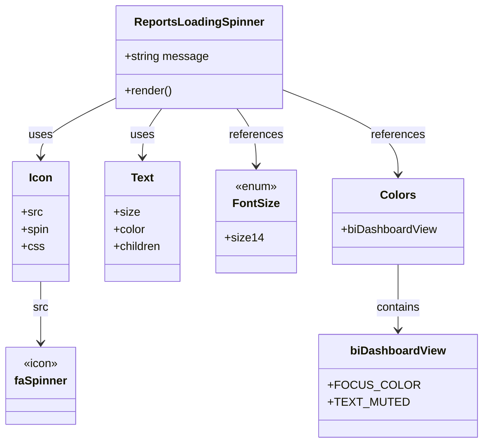

# Diagram: web/portal/src/pages/reports/bi-dashboard-next/components/molecules/Reports.LoadingSpinner.molecule.tsx


> Auto-generated by Obscura crawlers

## Diagram 1



### SVG

<svg id="container" width="653.61328125" xmlns="http://www.w3.org/2000/svg" class="classDiagram" height="620" viewBox="0 0 653.61328125 620" role="graphics-document document" aria-roledescription="class"><style>#container{font-family:"trebuchet ms",verdana,arial,sans-serif;font-size:16px;fill:#333;}@keyframes edge-animation-frame{from{stroke-dashoffset:0;}}@keyframes dash{to{stroke-dashoffset:0;}}#container .edge-animation-slow{stroke-dasharray:9,5!important;stroke-dashoffset:900;animation:dash 50s linear infinite;stroke-linecap:round;}#container .edge-animation-fast{stroke-dasharray:9,5!important;stroke-dashoffset:900;animation:dash 20s linear infinite;stroke-linecap:round;}#container .error-icon{fill:#552222;}#container .error-text{fill:#552222;stroke:#552222;}#container .edge-thickness-normal{stroke-width:1px;}#container .edge-thickness-thick{stroke-width:3.5px;}#container .edge-pattern-solid{stroke-dasharray:0;}#container .edge-thickness-invisible{stroke-width:0;fill:none;}#container .edge-pattern-dashed{stroke-dasharray:3;}#container .edge-pattern-dotted{stroke-dasharray:2;}#container .marker{fill:#333333;stroke:#333333;}#container .marker.cross{stroke:#333333;}#container svg{font-family:"trebuchet ms",verdana,arial,sans-serif;font-size:16px;}#container p{margin:0;}#container g.classGroup text{fill:#9370DB;stroke:none;font-family:"trebuchet ms",verdana,arial,sans-serif;font-size:10px;}#container g.classGroup text .title{font-weight:bolder;}#container .nodeLabel,#container .edgeLabel{color:#131300;}#container .edgeLabel .label rect{fill:#ECECFF;}#container .label text{fill:#131300;}#container .labelBkg{background:#ECECFF;}#container .edgeLabel .label span{background:#ECECFF;}#container .classTitle{font-weight:bolder;}#container .node rect,#container .node circle,#container .node ellipse,#container .node polygon,#container .node path{fill:#ECECFF;stroke:#9370DB;stroke-width:1px;}#container .divider{stroke:#9370DB;stroke-width:1;}#container g.clickable{cursor:pointer;}#container g.classGroup rect{fill:#ECECFF;stroke:#9370DB;}#container g.classGroup line{stroke:#9370DB;stroke-width:1;}#container .classLabel .box{stroke:none;stroke-width:0;fill:#ECECFF;opacity:0.5;}#container .classLabel .label{fill:#9370DB;font-size:10px;}#container .relation{stroke:#333333;stroke-width:1;fill:none;}#container .dashed-line{stroke-dasharray:3;}#container .dotted-line{stroke-dasharray:1 2;}#container #compositionStart,#container .composition{fill:#333333!important;stroke:#333333!important;stroke-width:1;}#container #compositionEnd,#container .composition{fill:#333333!important;stroke:#333333!important;stroke-width:1;}#container #dependencyStart,#container .dependency{fill:#333333!important;stroke:#333333!important;stroke-width:1;}#container #dependencyStart,#container .dependency{fill:#333333!important;stroke:#333333!important;stroke-width:1;}#container #extensionStart,#container .extension{fill:transparent!important;stroke:#333333!important;stroke-width:1;}#container #extensionEnd,#container .extension{fill:transparent!important;stroke:#333333!important;stroke-width:1;}#container #aggregationStart,#container .aggregation{fill:transparent!important;stroke:#333333!important;stroke-width:1;}#container #aggregationEnd,#container .aggregation{fill:transparent!important;stroke:#333333!important;stroke-width:1;}#container #lollipopStart,#container .lollipop{fill:#ECECFF!important;stroke:#333333!important;stroke-width:1;}#container #lollipopEnd,#container .lollipop{fill:#ECECFF!important;stroke:#333333!important;stroke-width:1;}#container .edgeTerminals{font-size:11px;line-height:initial;}#container .classTitleText{text-anchor:middle;font-size:18px;fill:#333;}#container .label-icon{display:inline-block;height:1em;overflow:visible;vertical-align:-0.125em;}#container .node .label-icon path{fill:currentColor;stroke:revert;stroke-width:revert;}#container :root{--mermaid-font-family:"trebuchet ms",verdana,arial,sans-serif;}</style><g><defs><marker id="container_class-aggregationStart" class="marker aggregation class" refX="18" refY="7" markerWidth="190" markerHeight="240" orient="auto"><path d="M 18,7 L9,13 L1,7 L9,1 Z"></path></marker></defs><defs><marker id="container_class-aggregationEnd" class="marker aggregation class" refX="1" refY="7" markerWidth="20" markerHeight="28" orient="auto"><path d="M 18,7 L9,13 L1,7 L9,1 Z"></path></marker></defs><defs><marker id="container_class-extensionStart" class="marker extension class" refX="18" refY="7" markerWidth="190" markerHeight="240" orient="auto"><path d="M 1,7 L18,13 V 1 Z"></path></marker></defs><defs><marker id="container_class-extensionEnd" class="marker extension class" refX="1" refY="7" markerWidth="20" markerHeight="28" orient="auto"><path d="M 1,1 V 13 L18,7 Z"></path></marker></defs><defs><marker id="container_class-compositionStart" class="marker composition class" refX="18" refY="7" markerWidth="190" markerHeight="240" orient="auto"><path d="M 18,7 L9,13 L1,7 L9,1 Z"></path></marker></defs><defs><marker id="container_class-compositionEnd" class="marker composition class" refX="1" refY="7" markerWidth="20" markerHeight="28" orient="auto"><path d="M 18,7 L9,13 L1,7 L9,1 Z"></path></marker></defs><defs><marker id="container_class-dependencyStart" class="marker dependency class" refX="6" refY="7" markerWidth="190" markerHeight="240" orient="auto"><path d="M 5,7 L9,13 L1,7 L9,1 Z"></path></marker></defs><defs><marker id="container_class-dependencyEnd" class="marker dependency class" refX="13" refY="7" markerWidth="20" markerHeight="28" orient="auto"><path d="M 18,7 L9,13 L14,7 L9,1 Z"></path></marker></defs><defs><marker id="container_class-lollipopStart" class="marker lollipop class" refX="13" refY="7" markerWidth="190" markerHeight="240" orient="auto"><circle stroke="black" fill="transparent" cx="7" cy="7" r="6"></circle></marker></defs><defs><marker id="container_class-lollipopEnd" class="marker lollipop class" refX="1" refY="7" markerWidth="190" markerHeight="240" orient="auto"><circle stroke="black" fill="transparent" cx="7" cy="7" r="6"></circle></marker></defs><g class="root"><g class="clusters"></g><g class="edgePaths"><path d="M162.76,135.984L144.884,144.82C127.009,153.656,91.258,171.328,73.383,185.331C55.508,199.333,55.508,209.667,55.508,214.833L55.508,220" id="id_ReportsLoadingSpinner_Icon_1" class="edge-thickness-normal edge-pattern-solid relation" style=";;;" data-edge="true" data-et="edge" data-id="id_ReportsLoadingSpinner_Icon_1" data-points="W3sieCI6MTYyLjc1OTc2NTYyNSwieSI6MTM1Ljk4NDM3NTY5MTk3NzkzfSx7IngiOjU1LjUwNzgxMjUsInkiOjE4OX0seyJ4Ijo1NS41MDc4MTI1LCJ5IjoyMjZ9XQ==" marker-end="url(#container_class-dependencyEnd)"></path><path d="M224.504,152L220.092,158.167C215.68,164.333,206.855,176.667,202.443,188C198.031,199.333,198.031,209.667,198.031,214.833L198.031,220" id="id_ReportsLoadingSpinner_Text_2" class="edge-thickness-normal edge-pattern-solid relation" style=";;;" data-edge="true" data-et="edge" data-id="id_ReportsLoadingSpinner_Text_2" data-points="W3sieCI6MjI0LjUwMzY3MzMwODQ4NjI0LCJ5IjoxNTJ9LHsieCI6MTk4LjAzMTI1LCJ5IjoxODl9LHsieCI6MTk4LjAzMTI1LCJ5IjoyMjZ9XQ==" marker-end="url(#container_class-dependencyEnd)"></path><path d="M327.531,152L331.944,158.167C336.356,164.333,345.18,176.667,349.592,190C354.004,203.333,354.004,217.667,354.004,224.833L354.004,232" id="id_ReportsLoadingSpinner_FontSize_3" class="edge-thickness-normal edge-pattern-solid relation" style=";;;" data-edge="true" data-et="edge" data-id="id_ReportsLoadingSpinner_FontSize_3" data-points="W3sieCI6MzI3LjUzMTQ4Mjk0MTUxMzgsInkiOjE1Mn0seyJ4IjozNTQuMDAzOTA2MjUsInkiOjE4OX0seyJ4IjozNTQuMDAzOTA2MjUsInkiOjIzOH1d" marker-end="url(#container_class-dependencyEnd)"></path><path d="M389.275,125.559L415.56,136.133C441.845,146.706,494.415,167.853,520.7,187.593C546.984,207.333,546.984,225.667,546.984,234.833L546.984,244" id="id_ReportsLoadingSpinner_Colors_4" class="edge-thickness-normal edge-pattern-solid relation" style=";;;" data-edge="true" data-et="edge" data-id="id_ReportsLoadingSpinner_Colors_4" data-points="W3sieCI6Mzg5LjI3NTM5MDYyNSwieSI6MTI1LjU1OTQ2MjI4NDIxMDkxfSx7IngiOjU0Ni45ODQzNzUsInkiOjE4OX0seyJ4Ijo1NDYuOTg0Mzc1LCJ5IjoyNTB9XQ==" marker-end="url(#container_class-dependencyEnd)"></path><path d="M55.508,394L55.508,400.167C55.508,406.333,55.508,418.667,55.508,433C55.508,447.333,55.508,463.667,55.508,471.833L55.508,480" id="id_Icon_faSpinner_5" class="edge-thickness-normal edge-pattern-solid relation" style=";;;" data-edge="true" data-et="edge" data-id="id_Icon_faSpinner_5" data-points="W3sieCI6NTUuNTA3ODEyNSwieSI6Mzk0fSx7IngiOjU1LjUwNzgxMjUsInkiOjQzMX0seyJ4Ijo1NS41MDc4MTI1LCJ5Ijo0ODZ9XQ==" marker-end="url(#container_class-dependencyEnd)"></path><path d="M546.984,370L546.984,380.167C546.984,390.333,546.984,410.667,546.984,426C546.984,441.333,546.984,451.667,546.984,456.833L546.984,462" id="id_Colors_biDashboardView_6" class="edge-thickness-normal edge-pattern-solid relation" style=";;;" data-edge="true" data-et="edge" data-id="id_Colors_biDashboardView_6" data-points="W3sieCI6NTQ2Ljk4NDM3NSwieSI6MzcwfSx7IngiOjU0Ni45ODQzNzUsInkiOjQzMX0seyJ4Ijo1NDYuOTg0Mzc1LCJ5Ijo0Njh9XQ==" marker-end="url(#container_class-dependencyEnd)"></path></g><g class="edgeLabels"><g class="edgeLabel" transform="translate(55.5078125, 189)"><g class="label" data-id="id_ReportsLoadingSpinner_Icon_1" transform="translate(-16.4921875, -12)"><foreignObject width="32.984375" height="24"><div xmlns="http://www.w3.org/1999/xhtml" class="labelBkg" style="display: table-cell; white-space: nowrap; line-height: 1.5; max-width: 200px; text-align: center;"><span class="edgeLabel"><p>uses</p></span></div></foreignObject></g></g><g class="edgeLabel" transform="translate(198.03125, 189)"><g class="label" data-id="id_ReportsLoadingSpinner_Text_2" transform="translate(-16.4921875, -12)"><foreignObject width="32.984375" height="24"><div xmlns="http://www.w3.org/1999/xhtml" class="labelBkg" style="display: table-cell; white-space: nowrap; line-height: 1.5; max-width: 200px; text-align: center;"><span class="edgeLabel"><p>uses</p></span></div></foreignObject></g></g><g class="edgeLabel" transform="translate(354.00390625, 189)"><g class="label" data-id="id_ReportsLoadingSpinner_FontSize_3" transform="translate(-37.828125, -12)"><foreignObject width="75.65625" height="24"><div xmlns="http://www.w3.org/1999/xhtml" class="labelBkg" style="display: table-cell; white-space: nowrap; line-height: 1.5; max-width: 200px; text-align: center;"><span class="edgeLabel"><p>references</p></span></div></foreignObject></g></g><g class="edgeLabel" transform="translate(546.984375, 189)"><g class="label" data-id="id_ReportsLoadingSpinner_Colors_4" transform="translate(-37.828125, -12)"><foreignObject width="75.65625" height="24"><div xmlns="http://www.w3.org/1999/xhtml" class="labelBkg" style="display: table-cell; white-space: nowrap; line-height: 1.5; max-width: 200px; text-align: center;"><span class="edgeLabel"><p>references</p></span></div></foreignObject></g></g><g class="edgeLabel" transform="translate(55.5078125, 431)"><g class="label" data-id="id_Icon_faSpinner_5" transform="translate(-10.4140625, -12)"><foreignObject width="20.828125" height="24"><div xmlns="http://www.w3.org/1999/xhtml" class="labelBkg" style="display: table-cell; white-space: nowrap; line-height: 1.5; max-width: 200px; text-align: center;"><span class="edgeLabel"><p>src</p></span></div></foreignObject></g></g><g class="edgeLabel" transform="translate(546.984375, 431)"><g class="label" data-id="id_Colors_biDashboardView_6" transform="translate(-30.890625, -12)"><foreignObject width="61.78125" height="24"><div xmlns="http://www.w3.org/1999/xhtml" class="labelBkg" style="display: table-cell; white-space: nowrap; line-height: 1.5; max-width: 200px; text-align: center;"><span class="edgeLabel"><p>contains</p></span></div></foreignObject></g></g></g><g class="nodes"><g class="node default" id="classId-ReportsLoadingSpinner-0" transform="translate(276.017578125, 80)"><g class="basic label-container"><path d="M-113.2578125 -72 L113.2578125 -72 L113.2578125 72 L-113.2578125 72" stroke="none" stroke-width="0" fill="#ECECFF" style=""></path><path d="M-113.2578125 -72 C-37.4903026755246 -72, 38.277207148950794 -72, 113.2578125 -72 M-113.2578125 -72 C-29.49249986406791 -72, 54.27281277186418 -72, 113.2578125 -72 M113.2578125 -72 C113.2578125 -40.52220660452832, 113.2578125 -9.044413209056636, 113.2578125 72 M113.2578125 -72 C113.2578125 -36.986521476591044, 113.2578125 -1.9730429531820874, 113.2578125 72 M113.2578125 72 C31.687002719322194 72, -49.88380706135561 72, -113.2578125 72 M113.2578125 72 C66.99342522858475 72, 20.72903795716951 72, -113.2578125 72 M-113.2578125 72 C-113.2578125 29.38171734898259, -113.2578125 -13.236565302034819, -113.2578125 -72 M-113.2578125 72 C-113.2578125 26.1507405068309, -113.2578125 -19.6985189863382, -113.2578125 -72" stroke="#9370DB" stroke-width="1.3" fill="none" stroke-dasharray="0 0" style=""></path></g><g class="annotation-group text" transform="translate(0, -48)"></g><g class="label-group text" transform="translate(-86.265625, -48)"><g class="label" style="font-weight: bolder" transform="translate(0,-12)"><foreignObject width="172.53125" height="24"><div xmlns="http://www.w3.org/1999/xhtml" style="display: table-cell; white-space: nowrap; line-height: 1.5; max-width: 221px; text-align: center;"><span class="nodeLabel markdown-node-label" style=""><p>ReportsLoadingSpinner</p></span></div></foreignObject></g></g><g class="members-group text" transform="translate(-101.2578125, 0)"><g class="label" style="" transform="translate(0,-12)"><foreignObject width="116.25" height="24"><div xmlns="http://www.w3.org/1999/xhtml" style="display: table-cell; white-space: nowrap; line-height: 1.5; max-width: 174px; text-align: center;"><span class="nodeLabel markdown-node-label" style=""><p>+string message</p></span></div></foreignObject></g></g><g class="methods-group text" transform="translate(-101.2578125, 48)"><g class="label" style="" transform="translate(0,-12)"><foreignObject width="66.609375" height="24"><div xmlns="http://www.w3.org/1999/xhtml" style="display: table-cell; white-space: nowrap; line-height: 1.5; max-width: 124px; text-align: center;"><span class="nodeLabel markdown-node-label" style=""><p>+render()</p></span></div></foreignObject></g></g><g class="divider" style=""><path d="M-113.2578125 -24 C-26.757506754685494 -24, 59.74279899062901 -24, 113.2578125 -24 M-113.2578125 -24 C-55.054876866385634 -24, 3.148058767228733 -24, 113.2578125 -24" stroke="#9370DB" stroke-width="1.3" fill="none" stroke-dasharray="0 0" style=""></path></g><g class="divider" style=""><path d="M-113.2578125 24 C-34.17550727073191 24, 44.906797958536174 24, 113.2578125 24 M-113.2578125 24 C-35.02352235162054 24, 43.210767796758915 24, 113.2578125 24" stroke="#9370DB" stroke-width="1.3" fill="none" stroke-dasharray="0 0" style=""></path></g></g><g class="node default" id="classId-Icon-1" transform="translate(55.5078125, 310)"><g class="basic label-container"><path d="M-39.08203125 -84 L39.08203125 -84 L39.08203125 84 L-39.08203125 84" stroke="none" stroke-width="0" fill="#ECECFF" style=""></path><path d="M-39.08203125 -84 C-9.017687520485374 -84, 21.04665620902925 -84, 39.08203125 -84 M-39.08203125 -84 C-20.32720667025949 -84, -1.5723820905189783 -84, 39.08203125 -84 M39.08203125 -84 C39.08203125 -24.53306856016504, 39.08203125 34.93386287966992, 39.08203125 84 M39.08203125 -84 C39.08203125 -29.188197919146887, 39.08203125 25.623604161706226, 39.08203125 84 M39.08203125 84 C15.168768823445774 84, -8.744493603108452 84, -39.08203125 84 M39.08203125 84 C20.756779273547206 84, 2.431527297094412 84, -39.08203125 84 M-39.08203125 84 C-39.08203125 32.91118380799842, -39.08203125 -18.17763238400316, -39.08203125 -84 M-39.08203125 84 C-39.08203125 44.34909023299197, -39.08203125 4.698180465983938, -39.08203125 -84" stroke="#9370DB" stroke-width="1.3" fill="none" stroke-dasharray="0 0" style=""></path></g><g class="annotation-group text" transform="translate(0, -60)"></g><g class="label-group text" transform="translate(-15.3046875, -60)"><g class="label" style="font-weight: bolder" transform="translate(0,-12)"><foreignObject width="30.609375" height="24"><div xmlns="http://www.w3.org/1999/xhtml" style="display: table-cell; white-space: nowrap; line-height: 1.5; max-width: 81px; text-align: center;"><span class="nodeLabel markdown-node-label" style=""><p>Icon</p></span></div></foreignObject></g></g><g class="members-group text" transform="translate(-27.08203125, -12)"><g class="label" style="" transform="translate(0,-12)"><foreignObject width="28.8125" height="24"><div xmlns="http://www.w3.org/1999/xhtml" style="display: table-cell; white-space: nowrap; line-height: 1.5; max-width: 87px; text-align: center;"><span class="nodeLabel markdown-node-label" style=""><p>+src</p></span></div></foreignObject></g><g class="label" style="" transform="translate(0,12)"><foreignObject width="38.859375" height="24"><div xmlns="http://www.w3.org/1999/xhtml" style="display: table-cell; white-space: nowrap; line-height: 1.5; max-width: 96px; text-align: center;"><span class="nodeLabel markdown-node-label" style=""><p>+spin</p></span></div></foreignObject></g><g class="label" style="" transform="translate(0,36)"><foreignObject width="30.421875" height="24"><div xmlns="http://www.w3.org/1999/xhtml" style="display: table-cell; white-space: nowrap; line-height: 1.5; max-width: 88px; text-align: center;"><span class="nodeLabel markdown-node-label" style=""><p>+css</p></span></div></foreignObject></g></g><g class="methods-group text" transform="translate(-27.08203125, 84)"></g><g class="divider" style=""><path d="M-39.08203125 -36 C-12.360695274990011 -36, 14.360640700019978 -36, 39.08203125 -36 M-39.08203125 -36 C-9.86124922500015 -36, 19.3595327999997 -36, 39.08203125 -36" stroke="#9370DB" stroke-width="1.3" fill="none" stroke-dasharray="0 0" style=""></path></g><g class="divider" style=""><path d="M-39.08203125 60 C-17.302123536483016 60, 4.477784177033968 60, 39.08203125 60 M-39.08203125 60 C-14.558360743613555 60, 9.96530976277289 60, 39.08203125 60" stroke="#9370DB" stroke-width="1.3" fill="none" stroke-dasharray="0 0" style=""></path></g></g><g class="node default" id="classId-Text-2" transform="translate(198.03125, 310)"><g class="basic label-container"><path d="M-53.44140625 -84 L53.44140625 -84 L53.44140625 84 L-53.44140625 84" stroke="none" stroke-width="0" fill="#ECECFF" style=""></path><path d="M-53.44140625 -84 C-13.194543662261658 -84, 27.052318925476683 -84, 53.44140625 -84 M-53.44140625 -84 C-15.18644429947934 -84, 23.06851765104132 -84, 53.44140625 -84 M53.44140625 -84 C53.44140625 -34.299068028037695, 53.44140625 15.40186394392461, 53.44140625 84 M53.44140625 -84 C53.44140625 -43.04916920211603, 53.44140625 -2.0983384042320665, 53.44140625 84 M53.44140625 84 C27.32024519796711 84, 1.199084145934222 84, -53.44140625 84 M53.44140625 84 C17.402635062380433 84, -18.636136125239133 84, -53.44140625 84 M-53.44140625 84 C-53.44140625 44.40743636605714, -53.44140625 4.8148727321142815, -53.44140625 -84 M-53.44140625 84 C-53.44140625 46.536406652349804, -53.44140625 9.072813304699608, -53.44140625 -84" stroke="#9370DB" stroke-width="1.3" fill="none" stroke-dasharray="0 0" style=""></path></g><g class="annotation-group text" transform="translate(0, -60)"></g><g class="label-group text" transform="translate(-15.3828125, -60)"><g class="label" style="font-weight: bolder" transform="translate(0,-12)"><foreignObject width="30.765625" height="24"><div xmlns="http://www.w3.org/1999/xhtml" style="display: table-cell; white-space: nowrap; line-height: 1.5; max-width: 80px; text-align: center;"><span class="nodeLabel markdown-node-label" style=""><p>Text</p></span></div></foreignObject></g></g><g class="members-group text" transform="translate(-41.44140625, -12)"><g class="label" style="" transform="translate(0,-12)"><foreignObject width="35.578125" height="24"><div xmlns="http://www.w3.org/1999/xhtml" style="display: table-cell; white-space: nowrap; line-height: 1.5; max-width: 93px; text-align: center;"><span class="nodeLabel markdown-node-label" style=""><p>+size</p></span></div></foreignObject></g><g class="label" style="" transform="translate(0,12)"><foreignObject width="44.796875" height="24"><div xmlns="http://www.w3.org/1999/xhtml" style="display: table-cell; white-space: nowrap; line-height: 1.5; max-width: 103px; text-align: center;"><span class="nodeLabel markdown-node-label" style=""><p>+color</p></span></div></foreignObject></g><g class="label" style="" transform="translate(0,36)"><foreignObject width="67.5" height="24"><div xmlns="http://www.w3.org/1999/xhtml" style="display: table-cell; white-space: nowrap; line-height: 1.5; max-width: 125px; text-align: center;"><span class="nodeLabel markdown-node-label" style=""><p>+children</p></span></div></foreignObject></g></g><g class="methods-group text" transform="translate(-41.44140625, 84)"></g><g class="divider" style=""><path d="M-53.44140625 -36 C-22.595161694304863 -36, 8.251082861390273 -36, 53.44140625 -36 M-53.44140625 -36 C-30.40795106907108 -36, -7.374495888142157 -36, 53.44140625 -36" stroke="#9370DB" stroke-width="1.3" fill="none" stroke-dasharray="0 0" style=""></path></g><g class="divider" style=""><path d="M-53.44140625 60 C-13.596414403620507 60, 26.248577442758986 60, 53.44140625 60 M-53.44140625 60 C-15.527675948309572 60, 22.386054353380857 60, 53.44140625 60" stroke="#9370DB" stroke-width="1.3" fill="none" stroke-dasharray="0 0" style=""></path></g></g><g class="node default" id="classId-FontSize-3" transform="translate(354.00390625, 310)"><g class="basic label-container"><path d="M-52.53125 -72 L52.53125 -72 L52.53125 72 L-52.53125 72" stroke="none" stroke-width="0" fill="#ECECFF" style=""></path><path d="M-52.53125 -72 C-29.007266589346052 -72, -5.483283178692105 -72, 52.53125 -72 M-52.53125 -72 C-11.915845735906991 -72, 28.699558528186017 -72, 52.53125 -72 M52.53125 -72 C52.53125 -32.329179921794825, 52.53125 7.3416401564103495, 52.53125 72 M52.53125 -72 C52.53125 -23.39561534018093, 52.53125 25.208769319638137, 52.53125 72 M52.53125 72 C24.20495943277527 72, -4.121331134449463 72, -52.53125 72 M52.53125 72 C24.707979003310435 72, -3.115291993379131 72, -52.53125 72 M-52.53125 72 C-52.53125 27.40131192829285, -52.53125 -17.197376143414303, -52.53125 -72 M-52.53125 72 C-52.53125 24.058436289209133, -52.53125 -23.883127421581733, -52.53125 -72" stroke="#9370DB" stroke-width="1.3" fill="none" stroke-dasharray="0 0" style=""></path></g><g class="annotation-group text" transform="translate(-29.53125, -48)"><g class="label" style="" transform="translate(0,-12)"><foreignObject width="59.0625" height="24"><div xmlns="http://www.w3.org/1999/xhtml" style="display: table-cell; white-space: nowrap; line-height: 1.5; max-width: 109px; text-align: center;"><span class="nodeLabel markdown-node-label" style=""><p>«enum»</p></span></div></foreignObject></g></g><g class="label-group text" transform="translate(-30.84375, -24)"><g class="label" style="font-weight: bolder" transform="translate(0,-12)"><foreignObject width="61.6875" height="24"><div xmlns="http://www.w3.org/1999/xhtml" style="display: table-cell; white-space: nowrap; line-height: 1.5; max-width: 111px; text-align: center;"><span class="nodeLabel markdown-node-label" style=""><p>FontSize</p></span></div></foreignObject></g></g><g class="members-group text" transform="translate(-40.53125, 24)"><g class="label" style="" transform="translate(0,-12)"><foreignObject width="50.21875" height="24"><div xmlns="http://www.w3.org/1999/xhtml" style="display: table-cell; white-space: nowrap; line-height: 1.5; max-width: 108px; text-align: center;"><span class="nodeLabel markdown-node-label" style=""><p>+size14</p></span></div></foreignObject></g></g><g class="methods-group text" transform="translate(-40.53125, 72)"></g><g class="divider" style=""><path d="M-52.53125 0 C-23.267575928143913 0, 5.9960981437121745 0, 52.53125 0 M-52.53125 0 C-11.194326275040453 0, 30.142597449919094 0, 52.53125 0" stroke="#9370DB" stroke-width="1.3" fill="none" stroke-dasharray="0 0" style=""></path></g><g class="divider" style=""><path d="M-52.53125 48 C-25.141860657323534 48, 2.2475286853529326 48, 52.53125 48 M-52.53125 48 C-29.412504699612324 48, -6.293759399224648 48, 52.53125 48" stroke="#9370DB" stroke-width="1.3" fill="none" stroke-dasharray="0 0" style=""></path></g></g><g class="node default" id="classId-Colors-4" transform="translate(546.984375, 310)"><g class="basic label-container"><path d="M-90.44921875 -60 L90.44921875 -60 L90.44921875 60 L-90.44921875 60" stroke="none" stroke-width="0" fill="#ECECFF" style=""></path><path d="M-90.44921875 -60 C-46.93759906094711 -60, -3.425979371894215 -60, 90.44921875 -60 M-90.44921875 -60 C-40.75402801953847 -60, 8.941162710923066 -60, 90.44921875 -60 M90.44921875 -60 C90.44921875 -27.58510499692965, 90.44921875 4.829790006140698, 90.44921875 60 M90.44921875 -60 C90.44921875 -31.672862195330556, 90.44921875 -3.345724390661111, 90.44921875 60 M90.44921875 60 C36.77712765119361 60, -16.89496344761278 60, -90.44921875 60 M90.44921875 60 C47.73437705873962 60, 5.019535367479236 60, -90.44921875 60 M-90.44921875 60 C-90.44921875 25.575200636453943, -90.44921875 -8.849598727092115, -90.44921875 -60 M-90.44921875 60 C-90.44921875 28.90497759885363, -90.44921875 -2.1900448022927392, -90.44921875 -60" stroke="#9370DB" stroke-width="1.3" fill="none" stroke-dasharray="0 0" style=""></path></g><g class="annotation-group text" transform="translate(0, -36)"></g><g class="label-group text" transform="translate(-23.1015625, -36)"><g class="label" style="font-weight: bolder" transform="translate(0,-12)"><foreignObject width="46.203125" height="24"><div xmlns="http://www.w3.org/1999/xhtml" style="display: table-cell; white-space: nowrap; line-height: 1.5; max-width: 95px; text-align: center;"><span class="nodeLabel markdown-node-label" style=""><p>Colors</p></span></div></foreignObject></g></g><g class="members-group text" transform="translate(-78.44921875, 12)"><g class="label" style="" transform="translate(0,-12)"><foreignObject width="133.796875" height="24"><div xmlns="http://www.w3.org/1999/xhtml" style="display: table-cell; white-space: nowrap; line-height: 1.5; max-width: 192px; text-align: center;"><span class="nodeLabel markdown-node-label" style=""><p>+biDashboardView</p></span></div></foreignObject></g></g><g class="methods-group text" transform="translate(-78.44921875, 60)"></g><g class="divider" style=""><path d="M-90.44921875 -12 C-40.90471360225982 -12, 8.639791545480364 -12, 90.44921875 -12 M-90.44921875 -12 C-25.891133075586666 -12, 38.66695259882667 -12, 90.44921875 -12" stroke="#9370DB" stroke-width="1.3" fill="none" stroke-dasharray="0 0" style=""></path></g><g class="divider" style=""><path d="M-90.44921875 36 C-36.88791659386248 36, 16.673385562275044 36, 90.44921875 36 M-90.44921875 36 C-53.75167075351383 36, -17.054122757027656 36, 90.44921875 36" stroke="#9370DB" stroke-width="1.3" fill="none" stroke-dasharray="0 0" style=""></path></g></g><g class="node default" id="classId-faSpinner-5" transform="translate(55.5078125, 540)"><g class="basic label-container"><path d="M-47.5078125 -54 L47.5078125 -54 L47.5078125 54 L-47.5078125 54" stroke="none" stroke-width="0" fill="#ECECFF" style=""></path><path d="M-47.5078125 -54 C-12.663994178283694 -54, 22.17982414343261 -54, 47.5078125 -54 M-47.5078125 -54 C-14.8513058252217 -54, 17.8052008495566 -54, 47.5078125 -54 M47.5078125 -54 C47.5078125 -20.966980663740422, 47.5078125 12.066038672519156, 47.5078125 54 M47.5078125 -54 C47.5078125 -31.656791823047357, 47.5078125 -9.313583646094713, 47.5078125 54 M47.5078125 54 C21.252727951424365 54, -5.00235659715127 54, -47.5078125 54 M47.5078125 54 C14.347580017580484 54, -18.812652464839033 54, -47.5078125 54 M-47.5078125 54 C-47.5078125 19.721070672655593, -47.5078125 -14.557858654688815, -47.5078125 -54 M-47.5078125 54 C-47.5078125 17.131483011323198, -47.5078125 -19.737033977353605, -47.5078125 -54" stroke="#9370DB" stroke-width="1.3" fill="none" stroke-dasharray="0 0" style=""></path></g><g class="annotation-group text" transform="translate(-24.4140625, -30)"><g class="label" style="" transform="translate(0,-12)"><foreignObject width="48.828125" height="24"><div xmlns="http://www.w3.org/1999/xhtml" style="display: table-cell; white-space: nowrap; line-height: 1.5; max-width: 99px; text-align: center;"><span class="nodeLabel markdown-node-label" style=""><p>«icon»</p></span></div></foreignObject></g></g><g class="label-group text" transform="translate(-35.5078125, -6)"><g class="label" style="font-weight: bolder" transform="translate(0,-12)"><foreignObject width="71.015625" height="24"><div xmlns="http://www.w3.org/1999/xhtml" style="display: table-cell; white-space: nowrap; line-height: 1.5; max-width: 121px; text-align: center;"><span class="nodeLabel markdown-node-label" style=""><p>faSpinner</p></span></div></foreignObject></g></g><g class="members-group text" transform="translate(-35.5078125, 42)"></g><g class="methods-group text" transform="translate(-35.5078125, 72)"></g><g class="divider" style=""><path d="M-47.5078125 18 C-11.34795270551043 18, 24.81190708897914 18, 47.5078125 18 M-47.5078125 18 C-23.05150830723176 18, 1.4047958855364797 18, 47.5078125 18" stroke="#9370DB" stroke-width="1.3" fill="none" stroke-dasharray="0 0" style=""></path></g><g class="divider" style=""><path d="M-47.5078125 36 C-12.626978149254782 36, 22.253856201490436 36, 47.5078125 36 M-47.5078125 36 C-27.53890906433781 36, -7.5700056286756165 36, 47.5078125 36" stroke="#9370DB" stroke-width="1.3" fill="none" stroke-dasharray="0 0" style=""></path></g></g><g class="node default" id="classId-biDashboardView-6" transform="translate(546.984375, 540)"><g class="basic label-container"><path d="M-98.62890625 -72 L98.62890625 -72 L98.62890625 72 L-98.62890625 72" stroke="none" stroke-width="0" fill="#ECECFF" style=""></path><path d="M-98.62890625 -72 C-54.468159659039785 -72, -10.307413068079569 -72, 98.62890625 -72 M-98.62890625 -72 C-32.52048029483326 -72, 33.587945660333475 -72, 98.62890625 -72 M98.62890625 -72 C98.62890625 -14.503397503735812, 98.62890625 42.993204992528376, 98.62890625 72 M98.62890625 -72 C98.62890625 -15.072379863575172, 98.62890625 41.855240272849656, 98.62890625 72 M98.62890625 72 C49.733933794041015 72, 0.8389613380820293 72, -98.62890625 72 M98.62890625 72 C49.01515753540747 72, -0.598591179185064 72, -98.62890625 72 M-98.62890625 72 C-98.62890625 39.308386049107604, -98.62890625 6.616772098215208, -98.62890625 -72 M-98.62890625 72 C-98.62890625 40.18849657996266, -98.62890625 8.376993159925313, -98.62890625 -72" stroke="#9370DB" stroke-width="1.3" fill="none" stroke-dasharray="0 0" style=""></path></g><g class="annotation-group text" transform="translate(0, -48)"></g><g class="label-group text" transform="translate(-63.6953125, -48)"><g class="label" style="font-weight: bolder" transform="translate(0,-12)"><foreignObject width="127.390625" height="24"><div xmlns="http://www.w3.org/1999/xhtml" style="display: table-cell; white-space: nowrap; line-height: 1.5; max-width: 176px; text-align: center;"><span class="nodeLabel markdown-node-label" style=""><p>biDashboardView</p></span></div></foreignObject></g></g><g class="members-group text" transform="translate(-86.62890625, 0)"><g class="label" style="" transform="translate(0,-12)"><foreignObject width="109.5625" height="24"><div xmlns="http://www.w3.org/1999/xhtml" style="display: table-cell; white-space: nowrap; line-height: 1.5; max-width: 167px; text-align: center;"><span class="nodeLabel markdown-node-label" style=""><p>+FOCUS_COLOR</p></span></div></foreignObject></g><g class="label" style="" transform="translate(0,12)"><foreignObject width="98.625" height="24"><div xmlns="http://www.w3.org/1999/xhtml" style="display: table-cell; white-space: nowrap; line-height: 1.5; max-width: 156px; text-align: center;"><span class="nodeLabel markdown-node-label" style=""><p>+TEXT_MUTED</p></span></div></foreignObject></g></g><g class="methods-group text" transform="translate(-86.62890625, 72)"></g><g class="divider" style=""><path d="M-98.62890625 -24 C-43.6923057393246 -24, 11.244294771350795 -24, 98.62890625 -24 M-98.62890625 -24 C-27.765148967477018 -24, 43.098608315045965 -24, 98.62890625 -24" stroke="#9370DB" stroke-width="1.3" fill="none" stroke-dasharray="0 0" style=""></path></g><g class="divider" style=""><path d="M-98.62890625 48 C-49.43634562028027 48, -0.24378499056054181 48, 98.62890625 48 M-98.62890625 48 C-38.95593169479342 48, 20.71704286041316 48, 98.62890625 48" stroke="#9370DB" stroke-width="1.3" fill="none" stroke-dasharray="0 0" style=""></path></g></g></g></g></g></svg>

## Diagram 2

```mermaid
flowchart LR
    A[ReportsLoadingSpinner Component] --> B[Container div (flex, centered, padding)]
    B --> C[Icon (faSpinner) | spin=true, marginRight:8, color=Colors.biDashboardView.FOCUS_COLOR]
    B --> D[Text | size=FontSize.size14, color=Colors.biDashboardView.TEXT_MUTED]
    D --> E[message prop displayed]
    C --- faSpinner[faSpinner icon import]
    B --- Styles[Colors import]
```

> SVG rendering failed for this diagram.
