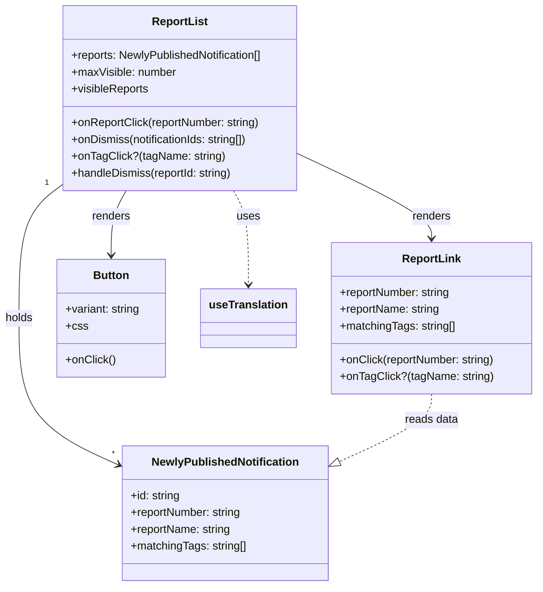
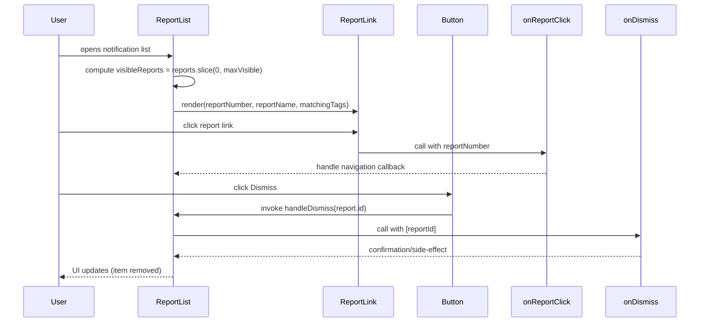

# Diagram: web/portal/src/pages/reports/bi-dashboard-next/components/molecules/Reports.NotificationReportList.molecule.tsx

> Auto-generated by Obscura crawlers

## Diagram 1

### SVG

<svg id="container" width="769.5859375" xmlns="http://www.w3.org/2000/svg" class="classDiagram" height="836" viewBox="0 0 769.5859375 836" role="graphics-document document" aria-roledescription="class"><g><defs><marker id="container_class-aggregationStart" class="marker aggregation class" refX="18" refY="7" markerWidth="190" markerHeight="240" orient="auto"><path d="M 18,7 L9,13 L1,7 L9,1 Z"></path></marker></defs><defs><marker id="container_class-aggregationEnd" class="marker aggregation class" refX="1" refY="7" markerWidth="20" markerHeight="28" orient="auto"><path d="M 18,7 L9,13 L1,7 L9,1 Z"></path></marker></defs><defs><marker id="container_class-extensionStart" class="marker extension class" refX="18" refY="7" markerWidth="190" markerHeight="240" orient="auto"><path d="M 1,7 L18,13 V 1 Z"></path></marker></defs><defs><marker id="container_class-extensionEnd" class="marker extension class" refX="1" refY="7" markerWidth="20" markerHeight="28" orient="auto"><path d="M 1,1 V 13 L18,7 Z"></path></marker></defs><defs><marker id="container_class-compositionStart" class="marker composition class" refX="18" refY="7" markerWidth="190" markerHeight="240" orient="auto"><path d="M 18,7 L9,13 L1,7 L9,1 Z"></path></marker></defs><defs><marker id="container_class-compositionEnd" class="marker composition class" refX="1" refY="7" markerWidth="20" markerHeight="28" orient="auto"><path d="M 18,7 L9,13 L1,7 L9,1 Z"></path></marker></defs><defs><marker id="container_class-dependencyStart" class="marker dependency class" refX="6" refY="7" markerWidth="190" markerHeight="240" orient="auto"><path d="M 5,7 L9,13 L1,7 L9,1 Z"></path></marker></defs><defs><marker id="container_class-dependencyEnd" class="marker dependency class" refX="13" refY="7" markerWidth="20" markerHeight="28" orient="auto"><path d="M 18,7 L9,13 L14,7 L9,1 Z"></path></marker></defs><defs><marker id="container_class-lollipopStart" class="marker lollipop class" refX="13" refY="7" markerWidth="190" markerHeight="240" orient="auto"><circle stroke="black" fill="transparent" cx="7" cy="7" r="6"></circle></marker></defs><defs><marker id="container_class-lollipopEnd" class="marker lollipop class" refX="1" refY="7" markerWidth="190" markerHeight="240" orient="auto"><circle stroke="black" fill="transparent" cx="7" cy="7" r="6"></circle></marker></defs><g class="root"><g class="clusters"></g><g class="edgePaths"><path d="M88.471,264.937L78.424,272.28C68.376,279.624,48.282,294.312,38.235,325.823C28.188,357.333,28.188,405.667,28.188,454C28.188,502.333,28.188,550.667,52.012,585.592C75.837,620.518,123.487,642.036,147.312,652.795L171.137,663.555" id="id_ReportList_NewlyPublishedNotification_1" class="edge-thickness-normal edge-pattern-solid relation" style=";;;" data-edge="true" data-et="edge" data-id="id_ReportList_NewlyPublishedNotification_1" data-points="W3sieCI6ODguNDcwNzAzMTI1LCJ5IjoyNjQuOTM2NTY4MTQxMzA4ODR9LHsieCI6MjguMTg3NSwieSI6MzA5fSx7IngiOjI4LjE4NzUsInkiOjQ1NH0seyJ4IjoyOC4xODc1LCJ5Ijo1OTl9LHsieCI6MTc2LjYwNTQ2ODc1LCJ5Ijo2NjYuMDIzOTEzNzM1NDc2Nn1d" marker-end="url(#container_class-dependencyEnd)"></path><path d="M430.322,220.729L461.472,235.44C492.621,250.152,554.92,279.576,586.069,299.455C617.219,319.333,617.219,329.667,617.219,334.833L617.219,340" id="id_ReportList_ReportLink_2" class="edge-thickness-normal edge-pattern-solid relation" style=";;;" data-edge="true" data-et="edge" data-id="id_ReportList_ReportLink_2" data-points="W3sieCI6NDMwLjMyMjI2NTYyNSwieSI6MjIwLjcyODUwNjMxODA1OX0seyJ4Ijo2MTcuMjE4NzUsInkiOjMwOX0seyJ4Ijo2MTcuMjE4NzUsInkiOjM0Nn1d" marker-end="url(#container_class-dependencyEnd)"></path><path d="M183.345,272L179.792,278.167C176.239,284.333,169.133,296.667,165.58,312C162.027,327.333,162.027,345.667,162.027,354.833L162.027,364" id="id_ReportList_Button_3" class="edge-thickness-normal edge-pattern-solid relation" style=";;;" data-edge="true" data-et="edge" data-id="id_ReportList_Button_3" data-points="W3sieCI6MTgzLjM0NDg0NzkxMDUwMjk1LCJ5IjoyNzJ9LHsieCI6MTYyLjAyNzM0Mzc1LCJ5IjozMDl9LHsieCI6MTYyLjAyNzM0Mzc1LCJ5IjozNzB9XQ==" marker-end="url(#container_class-dependencyEnd)"></path><path d="M335.448,272L339.001,278.167C342.554,284.333,349.66,296.667,353.213,319C356.766,341.333,356.766,373.667,356.766,389.833L356.766,406" id="id_ReportList_useTranslation_4" class="edge-thickness-normal edge-pattern-dashed relation" style=";;;" data-edge="true" data-et="edge" data-id="id_ReportList_useTranslation_4" data-points="W3sieCI6MzM1LjQ0ODEyMDgzOTQ5NzA1LCJ5IjoyNzJ9LHsieCI6MzU2Ljc2NTYyNSwieSI6MzA5fSx7IngiOjM1Ni43NjU2MjUsInkiOjQxMn1d" marker-end="url(#container_class-dependencyEnd)"></path><path d="M617.219,562L617.219,568.167C617.219,574.333,617.219,586.667,595.103,602.821C572.987,618.975,528.754,638.95,506.638,648.937L484.522,658.924" id="id_ReportLink_NewlyPublishedNotification_5" class="edge-thickness-normal edge-pattern-dashed relation" style=";;;" data-edge="true" data-et="edge" data-id="id_ReportLink_NewlyPublishedNotification_5" data-points="W3sieCI6NjE3LjIxODc1LCJ5Ijo1NjJ9LHsieCI6NjE3LjIxODc1LCJ5Ijo1OTl9LHsieCI6NDY4LjgwMDc4MTI1LCJ5Ijo2NjYuMDIzOTEzNzM1NDc2Nn1d" marker-end="url(#container_class-extensionEnd)"></path></g><g class="edgeLabels"><g class="edgeLabel" transform="translate(28.1875, 454)"><g class="label" data-id="id_ReportList_NewlyPublishedNotification_1" transform="translate(-20.1875, -12)"><foreignObject width="40.375" height="24">

holds

</foreignObject></g></g><g class="edgeLabel" transform="translate(617.21875, 309)"><g class="label" data-id="id_ReportList_ReportLink_2" transform="translate(-27.75, -12)"><foreignObject width="55.5" height="24">

renders

</foreignObject></g></g><g class="edgeLabel" transform="translate(162.02734375, 309)"><g class="label" data-id="id_ReportList_Button_3" transform="translate(-27.75, -12)"><foreignObject width="55.5" height="24">

renders

</foreignObject></g></g><g class="edgeLabel" transform="translate(356.765625, 309)"><g class="label" data-id="id_ReportList_useTranslation_4" transform="translate(-16.4921875, -12)"><foreignObject width="32.984375" height="24">

uses

</foreignObject></g></g><g class="edgeLabel" transform="translate(617.21875, 599)"><g class="label" data-id="id_ReportLink_NewlyPublishedNotification_5" transform="translate(-38.4453125, -12)"><foreignObject width="76.890625" height="24">

reads data

</foreignObject></g></g><g class="edgeTerminals" transform="translate(65.49091156944908, 263.1535547333934)"><g class="inner" transform="translate(0, 0)"><foreignObject style="width: 9px; height: 12px;">
1
</foreignObject></g></g><g class="edgeTerminals" transform="translate(161.82986913684448, 640.150780455328)"><g class="inner" transform="translate(0, 0)"></g><foreignObject style="width: 9px; height: 12px;">
*
</foreignObject></g></g><g class="nodes"><g class="node default" id="classId-ReportList-0" transform="translate(259.396484375, 140)"><g class="basic label-container"><path d="M-170.92578125 -132 L170.92578125 -132 L170.92578125 132 L-170.92578125 132" stroke="none" stroke-width="0" fill="#ECECFF" style=""></path><path d="M-170.92578125 -132 C-55.705311381743655 -132, 59.51515848651269 -132, 170.92578125 -132 M-170.92578125 -132 C-76.55859420256438 -132, 17.808592844871242 -132, 170.92578125 -132 M170.92578125 -132 C170.92578125 -35.47846678741814, 170.92578125 61.043066425163715, 170.92578125 132 M170.92578125 -132 C170.92578125 -68.34622435035485, 170.92578125 -4.69244870070969, 170.92578125 132 M170.92578125 132 C79.44035041813845 132, -12.045080413723099 132, -170.92578125 132 M170.92578125 132 C86.42912751225916 132, 1.9324737745183143 132, -170.92578125 132 M-170.92578125 132 C-170.92578125 42.01197893339115, -170.92578125 -47.9760421332177, -170.92578125 -132 M-170.92578125 132 C-170.92578125 51.177476958036294, -170.92578125 -29.64504608392741, -170.92578125 -132" stroke="#9370DB" stroke-width="1.3" fill="none" stroke-dasharray="0 0" style=""></path></g><g class="annotation-group text" transform="translate(0, -108)"></g><g class="label-group text" transform="translate(-38.2890625, -108)"><g class="label" style="font-weight: bolder" transform="translate(0,-12)"><foreignObject width="76.578125" height="24">

ReportList

</foreignObject></g></g><g class="members-group text" transform="translate(-158.92578125, -60)"><g class="label" style="" transform="translate(0,-12)"><foreignObject width="279.5625" height="24">

+reports: NewlyPublishedNotification[]

</foreignObject></g><g class="label" style="" transform="translate(0,12)"><foreignObject width="151.265625" height="24">

+maxVisible: number

</foreignObject></g><g class="label" style="" transform="translate(0,36)"><foreignObject width="111.46875" height="24">

+visibleReports

</foreignObject></g></g><g class="methods-group text" transform="translate(-158.92578125, 36)"><g class="label" style="" transform="translate(0,-12)"><foreignObject width="273.328125" height="24">

+onReportClick(reportNumber: string)

</foreignObject></g><g class="label" style="" transform="translate(0,12)"><foreignObject width="257.5625" height="24">

+onDismiss(notificationIds: string[])

</foreignObject></g><g class="label" style="" transform="translate(0,36)"><foreignObject width="216.5" height="24">

+onTagClick?(tagName: string)

</foreignObject></g><g class="label" style="" transform="translate(0,60)"><foreignObject width="233.21875" height="24">

+handleDismiss(reportId: string)

</foreignObject></g></g><g class="divider" style=""><path d="M-170.92578125 -84 C-66.1960635726329 -84, 38.53365410473421 -84, 170.92578125 -84 M-170.92578125 -84 C-88.87411843815575 -84, -6.822455626311495 -84, 170.92578125 -84" stroke="#9370DB" stroke-width="1.3" fill="none" stroke-dasharray="0 0" style=""></path></g><g class="divider" style=""><path d="M-170.92578125 12 C-65.52206915502522 12, 39.88164293994956 12, 170.92578125 12 M-170.92578125 12 C-93.56191148919835 12, -16.198041728396703 12, 170.92578125 12" stroke="#9370DB" stroke-width="1.3" fill="none" stroke-dasharray="0 0" style=""></path></g></g><g class="node default" id="classId-NewlyPublishedNotification-1" transform="translate(322.703125, 732)"><g class="basic label-container"><path d="M-146.09765625 -96 L146.09765625 -96 L146.09765625 96 L-146.09765625 96" stroke="none" stroke-width="0" fill="#ECECFF" style=""></path><path d="M-146.09765625 -96 C-47.733949267362505 -96, 50.62975771527499 -96, 146.09765625 -96 M-146.09765625 -96 C-72.43106872546863 -96, 1.2355187990627314 -96, 146.09765625 -96 M146.09765625 -96 C146.09765625 -43.4038082451358, 146.09765625 9.192383509728401, 146.09765625 96 M146.09765625 -96 C146.09765625 -35.32555087968663, 146.09765625 25.34889824062674, 146.09765625 96 M146.09765625 96 C85.45096825551714 96, 24.80428026103428 96, -146.09765625 96 M146.09765625 96 C48.01110045789464 96, -50.075455334210716 96, -146.09765625 96 M-146.09765625 96 C-146.09765625 53.7038999919089, -146.09765625 11.407799983817796, -146.09765625 -96 M-146.09765625 96 C-146.09765625 33.21985066834168, -146.09765625 -29.560298663316644, -146.09765625 -96" stroke="#9370DB" stroke-width="1.3" fill="none" stroke-dasharray="0 0" style=""></path></g><g class="annotation-group text" transform="translate(0, -72)"></g><g class="label-group text" transform="translate(-101.3046875, -72)"><g class="label" style="font-weight: bolder" transform="translate(0,-12)"><foreignObject width="202.609375" height="24">

NewlyPublishedNotification

</foreignObject></g></g><g class="members-group text" transform="translate(-134.09765625, -24)"><g class="label" style="" transform="translate(0,-12)"><foreignObject width="71.78125" height="24">

+id: string

</foreignObject></g><g class="label" style="" transform="translate(0,12)"><foreignObject width="161.4375" height="24">

+reportNumber: string

</foreignObject></g><g class="label" style="" transform="translate(0,36)"><foreignObject width="144.984375" height="24">

+reportName: string

</foreignObject></g><g class="label" style="" transform="translate(0,60)"><foreignObject width="166.890625" height="24">

+matchingTags: string[]

</foreignObject></g></g><g class="methods-group text" transform="translate(-134.09765625, 96)"></g><g class="divider" style=""><path d="M-146.09765625 -48 C-86.29607491826192 -48, -26.49449358652386 -48, 146.09765625 -48 M-146.09765625 -48 C-57.938231012624456 -48, 30.221194224751088 -48, 146.09765625 -48" stroke="#9370DB" stroke-width="1.3" fill="none" stroke-dasharray="0 0" style=""></path></g><g class="divider" style=""><path d="M-146.09765625 72 C-67.24123062590058 72, 11.615194998198831 72, 146.09765625 72 M-146.09765625 72 C-80.62409342773589 72, -15.150530605471772 72, 146.09765625 72" stroke="#9370DB" stroke-width="1.3" fill="none" stroke-dasharray="0 0" style=""></path></g></g><g class="node default" id="classId-ReportLink-2" transform="translate(617.21875, 454)"><g class="basic label-container"><path d="M-144.3671875 -108 L144.3671875 -108 L144.3671875 108 L-144.3671875 108" stroke="none" stroke-width="0" fill="#ECECFF" style=""></path><path d="M-144.3671875 -108 C-36.02048981009014 -108, 72.32620787981972 -108, 144.3671875 -108 M-144.3671875 -108 C-47.78017637516166 -108, 48.80683474967668 -108, 144.3671875 -108 M144.3671875 -108 C144.3671875 -42.34230817878178, 144.3671875 23.315383642436444, 144.3671875 108 M144.3671875 -108 C144.3671875 -51.762927164045024, 144.3671875 4.474145671909952, 144.3671875 108 M144.3671875 108 C75.30811027851931 108, 6.249033057038616 108, -144.3671875 108 M144.3671875 108 C76.75286581609858 108, 9.138544132197154 108, -144.3671875 108 M-144.3671875 108 C-144.3671875 55.20880157566573, -144.3671875 2.4176031513314626, -144.3671875 -108 M-144.3671875 108 C-144.3671875 57.14359437132968, -144.3671875 6.287188742659353, -144.3671875 -108" stroke="#9370DB" stroke-width="1.3" fill="none" stroke-dasharray="0 0" style=""></path></g><g class="annotation-group text" transform="translate(0, -84)"></g><g class="label-group text" transform="translate(-40.375, -84)"><g class="label" style="font-weight: bolder" transform="translate(0,-12)"><foreignObject width="80.75" height="24">

ReportLink

</foreignObject></g></g><g class="members-group text" transform="translate(-132.3671875, -36)"><g class="label" style="" transform="translate(0,-12)"><foreignObject width="161.4375" height="24">

+reportNumber: string

</foreignObject></g><g class="label" style="" transform="translate(0,12)"><foreignObject width="144.984375" height="24">

+reportName: string

</foreignObject></g><g class="label" style="" transform="translate(0,36)"><foreignObject width="166.890625" height="24">

+matchingTags: string[]

</foreignObject></g></g><g class="methods-group text" transform="translate(-132.3671875, 60)"><g class="label" style="" transform="translate(0,-12)"><foreignObject width="224.359375" height="24">

+onClick(reportNumber: string)

</foreignObject></g><g class="label" style="" transform="translate(0,12)"><foreignObject width="216.5" height="24">

+onTagClick?(tagName: string)

</foreignObject></g></g><g class="divider" style=""><path d="M-144.3671875 -60 C-70.20385405385014 -60, 3.959479392299727 -60, 144.3671875 -60 M-144.3671875 -60 C-83.37858335470608 -60, -22.389979209412147 -60, 144.3671875 -60" stroke="#9370DB" stroke-width="1.3" fill="none" stroke-dasharray="0 0" style=""></path></g><g class="divider" style=""><path d="M-144.3671875 36 C-40.42198673841038 36, 63.523214023179236 36, 144.3671875 36 M-144.3671875 36 C-53.292497588056094 36, 37.78219232388781 36, 144.3671875 36" stroke="#9370DB" stroke-width="1.3" fill="none" stroke-dasharray="0 0" style=""></path></g></g><g class="node default" id="classId-Button-3" transform="translate(162.02734375, 454)"><g class="basic label-container"><path d="M-78.65234375 -84 L78.65234375 -84 L78.65234375 84 L-78.65234375 84" stroke="none" stroke-width="0" fill="#ECECFF" style=""></path><path d="M-78.65234375 -84 C-46.20539568335033 -84, -13.758447616700664 -84, 78.65234375 -84 M-78.65234375 -84 C-16.557459297961124 -84, 45.53742515407775 -84, 78.65234375 -84 M78.65234375 -84 C78.65234375 -16.84875771195692, 78.65234375 50.30248457608616, 78.65234375 84 M78.65234375 -84 C78.65234375 -39.20604956657086, 78.65234375 5.587900866858277, 78.65234375 84 M78.65234375 84 C20.15923478015982 84, -38.33387418968036 84, -78.65234375 84 M78.65234375 84 C38.464334803487745 84, -1.7236741430245104 84, -78.65234375 84 M-78.65234375 84 C-78.65234375 36.97384377106736, -78.65234375 -10.052312457865284, -78.65234375 -84 M-78.65234375 84 C-78.65234375 45.644999674110124, -78.65234375 7.289999348220249, -78.65234375 -84" stroke="#9370DB" stroke-width="1.3" fill="none" stroke-dasharray="0 0" style=""></path></g><g class="annotation-group text" transform="translate(0, -60)"></g><g class="label-group text" transform="translate(-24.8359375, -60)"><g class="label" style="font-weight: bolder" transform="translate(0,-12)"><foreignObject width="49.671875" height="24">

Button

</foreignObject></g></g><g class="members-group text" transform="translate(-66.65234375, -12)"><g class="label" style="" transform="translate(0,-12)"><foreignObject width="108.46875" height="24">

+variant: string

</foreignObject></g><g class="label" style="" transform="translate(0,12)"><foreignObject width="30.421875" height="24">

+css

</foreignObject></g></g><g class="methods-group text" transform="translate(-66.65234375, 60)"><g class="label" style="" transform="translate(0,-12)"><foreignObject width="70.921875" height="24">

+onClick()

</foreignObject></g></g><g class="divider" style=""><path d="M-78.65234375 -36 C-39.85408622838913 -36, -1.0558287067782572 -36, 78.65234375 -36 M-78.65234375 -36 C-38.98579409616976 -36, 0.6807555576604756 -36, 78.65234375 -36" stroke="#9370DB" stroke-width="1.3" fill="none" stroke-dasharray="0 0" style=""></path></g><g class="divider" style=""><path d="M-78.65234375 36 C-19.07076800594897 36, 40.51080773810206 36, 78.65234375 36 M-78.65234375 36 C-31.774530003744125 36, 15.10328374251175 36, 78.65234375 36" stroke="#9370DB" stroke-width="1.3" fill="none" stroke-dasharray="0 0" style=""></path></g></g><g class="node default" id="classId-useTranslation-4" transform="translate(356.765625, 454)"><g class="basic label-container"><path d="M-66.0859375 -42 L66.0859375 -42 L66.0859375 42 L-66.0859375 42" stroke="none" stroke-width="0" fill="#ECECFF" style=""></path><path d="M-66.0859375 -42 C-24.34601479394731 -42, 17.393907912105377 -42, 66.0859375 -42 M-66.0859375 -42 C-35.89412585778892 -42, -5.70231421557785 -42, 66.0859375 -42 M66.0859375 -42 C66.0859375 -10.574224230987394, 66.0859375 20.851551538025213, 66.0859375 42 M66.0859375 -42 C66.0859375 -20.223697794454225, 66.0859375 1.5526044110915507, 66.0859375 42 M66.0859375 42 C15.043803114397377 42, -35.998331271205245 42, -66.0859375 42 M66.0859375 42 C22.319736594541602 42, -21.446464310916795 42, -66.0859375 42 M-66.0859375 42 C-66.0859375 22.79629352364394, -66.0859375 3.5925870472878785, -66.0859375 -42 M-66.0859375 42 C-66.0859375 16.817198676274607, -66.0859375 -8.365602647450785, -66.0859375 -42" stroke="#9370DB" stroke-width="1.3" fill="none" stroke-dasharray="0 0" style=""></path></g><g class="annotation-group text" transform="translate(0, -18)"></g><g class="label-group text" transform="translate(-54.0859375, -18)"><g class="label" style="font-weight: bolder" transform="translate(0,-12)"><foreignObject width="108.171875" height="24">

useTranslation

</foreignObject></g></g><g class="members-group text" transform="translate(-54.0859375, 30)"></g><g class="methods-group text" transform="translate(-54.0859375, 60)"></g><g class="divider" style=""><path d="M-66.0859375 6 C-23.039497429630302 6, 20.006942640739396 6, 66.0859375 6 M-66.0859375 6 C-33.273297984977134 6, -0.46065846995426796 6, 66.0859375 6" stroke="#9370DB" stroke-width="1.3" fill="none" stroke-dasharray="0 0" style=""></path></g><g class="divider" style=""><path d="M-66.0859375 24 C-27.50784650255806 24, 11.07024449488388 24, 66.0859375 24 M-66.0859375 24 C-38.616108593559204 24, -11.146279687118408 24, 66.0859375 24" stroke="#9370DB" stroke-width="1.3" fill="none" stroke-dasharray="0 0" style=""></path></g></g></g></g></g></svg>

## Diagram 2

### SVG

<svg id="container" width="1546" xmlns="http://www.w3.org/2000/svg" height="729" viewBox="-50 -10 1546 729" role="graphics-document document" aria-roledescription="sequence"><g><rect x="1296" y="643" fill="#eaeaea" stroke="#666" width="150" height="65" name="onDismiss" rx="3" ry="3" class="actor actor-bottom"></rect><text x="1371" y="675.5" dominant-baseline="central" alignment-baseline="central" class="actor actor-box" style="text-anchor: middle; font-size: 16px; font-weight: 400;"><tspan x="1371" dy="0">onDismiss</tspan></text></g><g><rect x="1096" y="643" fill="#eaeaea" stroke="#666" width="150" height="65" name="onReportClick" rx="3" ry="3" class="actor actor-bottom"></rect><text x="1171" y="675.5" dominant-baseline="central" alignment-baseline="central" class="actor actor-box" style="text-anchor: middle; font-size: 16px; font-weight: 400;"><tspan x="1171" dy="0">onReportClick</tspan></text></g><g><rect x="896" y="643" fill="#eaeaea" stroke="#666" width="150" height="65" name="Button" rx="3" ry="3" class="actor actor-bottom"></rect><text x="971" y="675.5" dominant-baseline="central" alignment-baseline="central" class="actor actor-box" style="text-anchor: middle; font-size: 16px; font-weight: 400;"><tspan x="971" dy="0">Button</tspan></text></g><g><rect x="696" y="643" fill="#eaeaea" stroke="#666" width="150" height="65" name="ReportLink" rx="3" ry="3" class="actor actor-bottom"></rect><text x="771" y="675.5" dominant-baseline="central" alignment-baseline="central" class="actor actor-box" style="text-anchor: middle; font-size: 16px; font-weight: 400;"><tspan x="771" dy="0">ReportLink</tspan></text></g><g><rect x="263" y="643" fill="#eaeaea" stroke="#666" width="150" height="65" name="ReportList" rx="3" ry="3" class="actor actor-bottom"></rect><text x="338" y="675.5" dominant-baseline="central" alignment-baseline="central" class="actor actor-box" style="text-anchor: middle; font-size: 16px; font-weight: 400;"><tspan x="338" dy="0">ReportList</tspan></text></g><g><rect x="0" y="643" fill="#eaeaea" stroke="#666" width="150" height="65" name="User" rx="3" ry="3" class="actor actor-bottom"></rect><text x="75" y="675.5" dominant-baseline="central" alignment-baseline="central" class="actor actor-box" style="text-anchor: middle; font-size: 16px; font-weight: 400;"><tspan x="75" dy="0">User</tspan></text></g><g><line id="actor5" x1="1371" y1="65" x2="1371" y2="643" class="actor-line 200" stroke-width="0.5px" stroke="#999" name="onDismiss"></line><g id="root-5"><rect x="1296" y="0" fill="#eaeaea" stroke="#666" width="150" height="65" name="onDismiss" rx="3" ry="3" class="actor actor-top"></rect><text x="1371" y="32.5" dominant-baseline="central" alignment-baseline="central" class="actor actor-box" style="text-anchor: middle; font-size: 16px; font-weight: 400;"><tspan x="1371" dy="0">onDismiss</tspan></text></g></g><g><line id="actor4" x1="1171" y1="65" x2="1171" y2="643" class="actor-line 200" stroke-width="0.5px" stroke="#999" name="onReportClick"></line><g id="root-4"><rect x="1096" y="0" fill="#eaeaea" stroke="#666" width="150" height="65" name="onReportClick" rx="3" ry="3" class="actor actor-top"></rect><text x="1171" y="32.5" dominant-baseline="central" alignment-baseline="central" class="actor actor-box" style="text-anchor: middle; font-size: 16px; font-weight: 400;"><tspan x="1171" dy="0">onReportClick</tspan></text></g></g><g><line id="actor3" x1="971" y1="65" x2="971" y2="643" class="actor-line 200" stroke-width="0.5px" stroke="#999" name="Button"></line><g id="root-3"><rect x="896" y="0" fill="#eaeaea" stroke="#666" width="150" height="65" name="Button" rx="3" ry="3" class="actor actor-top"></rect><text x="971" y="32.5" dominant-baseline="central" alignment-baseline="central" class="actor actor-box" style="text-anchor: middle; font-size: 16px; font-weight: 400;"><tspan x="971" dy="0">Button</tspan></text></g></g><g><line id="actor2" x1="771" y1="65" x2="771" y2="643" class="actor-line 200" stroke-width="0.5px" stroke="#999" name="ReportLink"></line><g id="root-2"><rect x="696" y="0" fill="#eaeaea" stroke="#666" width="150" height="65" name="ReportLink" rx="3" ry="3" class="actor actor-top"></rect><text x="771" y="32.5" dominant-baseline="central" alignment-baseline="central" class="actor actor-box" style="text-anchor: middle; font-size: 16px; font-weight: 400;"><tspan x="771" dy="0">ReportLink</tspan></text></g></g><g><line id="actor1" x1="338" y1="65" x2="338" y2="643" class="actor-line 200" stroke-width="0.5px" stroke="#999" name="ReportList"></line><g id="root-1"><rect x="263" y="0" fill="#eaeaea" stroke="#666" width="150" height="65" name="ReportList" rx="3" ry="3" class="actor actor-top"></rect><text x="338" y="32.5" dominant-baseline="central" alignment-baseline="central" class="actor actor-box" style="text-anchor: middle; font-size: 16px; font-weight: 400;"><tspan x="338" dy="0">ReportList</tspan></text></g></g><g><line id="actor0" x1="75" y1="65" x2="75" y2="643" class="actor-line 200" stroke-width="0.5px" stroke="#999" name="User"></line><g id="root-0"><rect x="0" y="0" fill="#eaeaea" stroke="#666" width="150" height="65" name="User" rx="3" ry="3" class="actor actor-top"></rect><text x="75" y="32.5" dominant-baseline="central" alignment-baseline="central" class="actor actor-box" style="text-anchor: middle; font-size: 16px; font-weight: 400;"><tspan x="75" dy="0">User</tspan></text></g></g><g></g><defs><symbol id="computer" width="24" height="24"><path transform="scale(.5)" d="M2 2v13h20v-13h-20zm18 11h-16v-9h16v9zm-10.228 6l.466-1h3.524l.467 1h-4.457zm14.228 3h-24l2-6h2.104l-1.33 4h18.45l-1.297-4h2.073l2 6zm-5-10h-14v-7h14v7z"></path></symbol></defs><defs><symbol id="database" fill-rule="evenodd" clip-rule="evenodd"><path transform="scale(.5)" d="M12.258.001l.256.004.255.005.253.008.251.01.249.012.247.015.246.016.242.019.241.02.239.023.236.024.233.027.231.028.229.031.225.032.223.034.22.036.217.038.214.04.211.041.208.043.205.045.201.046.198.048.194.05.191.051.187.053.183.054.18.056.175.057.172.059.168.06.163.061.16.063.155.064.15.066.074.033.073.033.071.034.07.034.069.035.068.035.067.035.066.035.064.036.064.036.062.036.06.036.06.037.058.037.058.037.055.038.055.038.053.038.052.038.051.039.05.039.048.039.047.039.045.04.044.04.043.04.041.04.04.041.039.041.037.041.036.041.034.041.033.042.032.042.03.042.029.042.027.042.026.043.024.043.023.043.021.043.02.043.018.044.017.043.015.044.013.044.012.044.011.045.009.044.007.045.006.045.004.045.002.045.001.045v17l-.001.045-.002.045-.004.045-.006.045-.007.045-.009.044-.011.045-.012.044-.013.044-.015.044-.017.043-.018.044-.02.043-.021.043-.023.043-.024.043-.026.043-.027.042-.029.042-.03.042-.032.042-.033.042-.034.041-.036.041-.037.041-.039.041-.04.041-.041.04-.043.04-.044.04-.045.04-.047.039-.048.039-.05.039-.051.039-.052.038-.053.038-.055.038-.055.038-.058.037-.058.037-.06.037-.06.036-.062.036-.064.036-.064.036-.066.035-.067.035-.068.035-.069.035-.07.034-.071.034-.073.033-.074.033-.15.066-.155.064-.16.063-.163.061-.168.06-.172.059-.175.057-.18.056-.183.054-.187.053-.191.051-.194.05-.198.048-.201.046-.205.045-.208.043-.211.041-.214.04-.217.038-.22.036-.223.034-.225.032-.229.031-.231.028-.233.027-.236.024-.239.023-.241.02-.242.019-.246.016-.247.015-.249.012-.251.01-.253.008-.255.005-.256.004-.258.001-.258-.001-.256-.004-.255-.005-.253-.008-.251-.01-.249-.012-.247-.015-.245-.016-.243-.019-.241-.02-.238-.023-.236-.024-.234-.027-.231-.028-.228-.031-.226-.032-.223-.034-.22-.036-.217-.038-.214-.04-.211-.041-.208-.043-.204-.045-.201-.046-.198-.048-.195-.05-.19-.051-.187-.053-.184-.054-.179-.056-.176-.057-.172-.059-.167-.06-.164-.061-.159-.063-.155-.064-.151-.066-.074-.033-.072-.033-.072-.034-.07-.034-.069-.035-.068-.035-.067-.035-.066-.035-.064-.036-.063-.036-.062-.036-.061-.036-.06-.037-.058-.037-.057-.037-.056-.038-.055-.038-.053-.038-.052-.038-.051-.039-.049-.039-.049-.039-.046-.039-.046-.04-.044-.04-.043-.04-.041-.04-.04-.041-.039-.041-.037-.041-.036-.041-.034-.041-.033-.042-.032-.042-.03-.042-.029-.042-.027-.042-.026-.043-.024-.043-.023-.043-.021-.043-.02-.043-.018-.044-.017-.043-.015-.044-.013-.044-.012-.044-.011-.045-.009-.044-.007-.045-.006-.045-.004-.045-.002-.045-.001-.045v-17l.001-.045.002-.045.004-.045.006-.045.007-.045.009-.044.011-.045.012-.044.013-.044.015-.044.017-.043.018-.044.02-.043.021-.043.023-.043.024-.043.026-.043.027-.042.029-.042.03-.042.032-.042.033-.042.034-.041.036-.041.037-.041.039-.041.04-.041.041-.04.043-.04.044-.04.046-.04.046-.039.049-.039.049-.039.051-.039.052-.038.053-.038.055-.038.056-.038.057-.037.058-.037.06-.037.061-.036.062-.036.063-.036.064-.036.066-.035.067-.035.068-.035.069-.035.07-.034.072-.034.072-.033.074-.033.151-.066.155-.064.159-.063.164-.061.167-.06.172-.059.176-.057.179-.056.184-.054.187-.053.19-.051.195-.05.198-.048.201-.046.204-.045.208-.043.211-.041.214-.04.217-.038.22-.036.223-.034.226-.032.228-.031.231-.028.234-.027.236-.024.238-.023.241-.02.243-.019.245-.016.247-.015.249-.012.251-.01.253-.008.255-.005.256-.004.258-.001.258.001zm-9.258 20.499v.01l.001.021.003.021.004.022.005.021.006.022.007.022.009.023.01.022.011.023.012.023.013.023.015.023.016.024.017.023.018.024.019.024.021.024.022.025.023.024.024.025.052.049.056.05.061.051.066.051.07.051.075.051.079.052.084.052.088.052.092.052.097.052.102.051.105.052.11.052.114.051.119.051.123.051.127.05.131.05.135.05.139.048.144.049.147.047.152.047.155.047.16.045.163.045.167.043.171.043.176.041.178.041.183.039.187.039.19.037.194.035.197.035.202.033.204.031.209.03.212.029.216.027.219.025.222.024.226.021.23.02.233.018.236.016.24.015.243.012.246.01.249.008.253.005.256.004.259.001.26-.001.257-.004.254-.005.25-.008.247-.011.244-.012.241-.014.237-.016.233-.018.231-.021.226-.021.224-.024.22-.026.216-.027.212-.028.21-.031.205-.031.202-.034.198-.034.194-.036.191-.037.187-.039.183-.04.179-.04.175-.042.172-.043.168-.044.163-.045.16-.046.155-.046.152-.047.148-.048.143-.049.139-.049.136-.05.131-.05.126-.05.123-.051.118-.052.114-.051.11-.052.106-.052.101-.052.096-.052.092-.052.088-.053.083-.051.079-.052.074-.052.07-.051.065-.051.06-.051.056-.05.051-.05.023-.024.023-.025.021-.024.02-.024.019-.024.018-.024.017-.024.015-.023.014-.024.013-.023.012-.023.01-.023.01-.022.008-.022.006-.022.006-.022.004-.022.004-.021.001-.021.001-.021v-4.127l-.077.055-.08.053-.083.054-.085.053-.087.052-.09.052-.093.051-.095.05-.097.05-.1.049-.102.049-.105.048-.106.047-.109.047-.111.046-.114.045-.115.045-.118.044-.12.043-.122.042-.124.042-.126.041-.128.04-.13.04-.132.038-.134.038-.135.037-.138.037-.139.035-.142.035-.143.034-.144.033-.147.032-.148.031-.15.03-.151.03-.153.029-.154.027-.156.027-.158.026-.159.025-.161.024-.162.023-.163.022-.165.021-.166.02-.167.019-.169.018-.169.017-.171.016-.173.015-.173.014-.175.013-.175.012-.177.011-.178.01-.179.008-.179.008-.181.006-.182.005-.182.004-.184.003-.184.002h-.37l-.184-.002-.184-.003-.182-.004-.182-.005-.181-.006-.179-.008-.179-.008-.178-.01-.176-.011-.176-.012-.175-.013-.173-.014-.172-.015-.171-.016-.17-.017-.169-.018-.167-.019-.166-.02-.165-.021-.163-.022-.162-.023-.161-.024-.159-.025-.157-.026-.156-.027-.155-.027-.153-.029-.151-.03-.15-.03-.148-.031-.146-.032-.145-.033-.143-.034-.141-.035-.14-.035-.137-.037-.136-.037-.134-.038-.132-.038-.13-.04-.128-.04-.126-.041-.124-.042-.122-.042-.12-.044-.117-.043-.116-.045-.113-.045-.112-.046-.109-.047-.106-.047-.105-.048-.102-.049-.1-.049-.097-.05-.095-.05-.093-.052-.09-.051-.087-.052-.085-.053-.083-.054-.08-.054-.077-.054v4.127zm0-5.654v.011l.001.021.003.021.004.021.005.022.006.022.007.022.009.022.01.022.011.023.012.023.013.023.015.024.016.023.017.024.018.024.019.024.021.024.022.024.023.025.024.024.052.05.056.05.061.05.066.051.07.051.075.052.079.051.084.052.088.052.092.052.097.052.102.052.105.052.11.051.114.051.119.052.123.05.127.051.131.05.135.049.139.049.144.048.147.048.152.047.155.046.16.045.163.045.167.044.171.042.176.042.178.04.183.04.187.038.19.037.194.036.197.034.202.033.204.032.209.03.212.028.216.027.219.025.222.024.226.022.23.02.233.018.236.016.24.014.243.012.246.01.249.008.253.006.256.003.259.001.26-.001.257-.003.254-.006.25-.008.247-.01.244-.012.241-.015.237-.016.233-.018.231-.02.226-.022.224-.024.22-.025.216-.027.212-.029.21-.03.205-.032.202-.033.198-.035.194-.036.191-.037.187-.039.183-.039.179-.041.175-.042.172-.043.168-.044.163-.045.16-.045.155-.047.152-.047.148-.048.143-.048.139-.05.136-.049.131-.05.126-.051.123-.051.118-.051.114-.052.11-.052.106-.052.101-.052.096-.052.092-.052.088-.052.083-.052.079-.052.074-.051.07-.052.065-.051.06-.05.056-.051.051-.049.023-.025.023-.024.021-.025.02-.024.019-.024.018-.024.017-.024.015-.023.014-.023.013-.024.012-.022.01-.023.01-.023.008-.022.006-.022.006-.022.004-.021.004-.022.001-.021.001-.021v-4.139l-.077.054-.08.054-.083.054-.085.052-.087.053-.09.051-.093.051-.095.051-.097.05-.1.049-.102.049-.105.048-.106.047-.109.047-.111.046-.114.045-.115.044-.118.044-.12.044-.122.042-.124.042-.126.041-.128.04-.13.039-.132.039-.134.038-.135.037-.138.036-.139.036-.142.035-.143.033-.144.033-.147.033-.148.031-.15.03-.151.03-.153.028-.154.028-.156.027-.158.026-.159.025-.161.024-.162.023-.163.022-.165.021-.166.02-.167.019-.169.018-.169.017-.171.016-.173.015-.173.014-.175.013-.175.012-.177.011-.178.009-.179.009-.179.007-.181.007-.182.005-.182.004-.184.003-.184.002h-.37l-.184-.002-.184-.003-.182-.004-.182-.005-.181-.007-.179-.007-.179-.009-.178-.009-.176-.011-.176-.012-.175-.013-.173-.014-.172-.015-.171-.016-.17-.017-.169-.018-.167-.019-.166-.02-.165-.021-.163-.022-.162-.023-.161-.024-.159-.025-.157-.026-.156-.027-.155-.028-.153-.028-.151-.03-.15-.03-.148-.031-.146-.033-.145-.033-.143-.033-.141-.035-.14-.036-.137-.036-.136-.037-.134-.038-.132-.039-.13-.039-.128-.04-.126-.041-.124-.042-.122-.043-.12-.043-.117-.044-.116-.044-.113-.046-.112-.046-.109-.046-.106-.047-.105-.048-.102-.049-.1-.049-.097-.05-.095-.051-.093-.051-.09-.051-.087-.053-.085-.052-.083-.054-.08-.054-.077-.054v4.139zm0-5.666v.011l.001.02.003.022.004.021.005.022.006.021.007.022.009.023.01.022.011.023.012.023.013.023.015.023.016.024.017.024.018.023.019.024.021.025.022.024.023.024.024.025.052.05.056.05.061.05.066.051.07.051.075.052.079.051.084.052.088.052.092.052.097.052.102.052.105.051.11.052.114.051.119.051.123.051.127.05.131.05.135.05.139.049.144.048.147.048.152.047.155.046.16.045.163.045.167.043.171.043.176.042.178.04.183.04.187.038.19.037.194.036.197.034.202.033.204.032.209.03.212.028.216.027.219.025.222.024.226.021.23.02.233.018.236.017.24.014.243.012.246.01.249.008.253.006.256.003.259.001.26-.001.257-.003.254-.006.25-.008.247-.01.244-.013.241-.014.237-.016.233-.018.231-.02.226-.022.224-.024.22-.025.216-.027.212-.029.21-.03.205-.032.202-.033.198-.035.194-.036.191-.037.187-.039.183-.039.179-.041.175-.042.172-.043.168-.044.163-.045.16-.045.155-.047.152-.047.148-.048.143-.049.139-.049.136-.049.131-.051.126-.05.123-.051.118-.052.114-.051.11-.052.106-.052.101-.052.096-.052.092-.052.088-.052.083-.052.079-.052.074-.052.07-.051.065-.051.06-.051.056-.05.051-.049.023-.025.023-.025.021-.024.02-.024.019-.024.018-.024.017-.024.015-.023.014-.024.013-.023.012-.023.01-.022.01-.023.008-.022.006-.022.006-.022.004-.022.004-.021.001-.021.001-.021v-4.153l-.077.054-.08.054-.083.053-.085.053-.087.053-.09.051-.093.051-.095.051-.097.05-.1.049-.102.048-.105.048-.106.048-.109.046-.111.046-.114.046-.115.044-.118.044-.12.043-.122.043-.124.042-.126.041-.128.04-.13.039-.132.039-.134.038-.135.037-.138.036-.139.036-.142.034-.143.034-.144.033-.147.032-.148.032-.15.03-.151.03-.153.028-.154.028-.156.027-.158.026-.159.024-.161.024-.162.023-.163.023-.165.021-.166.02-.167.019-.169.018-.169.017-.171.016-.173.015-.173.014-.175.013-.175.012-.177.01-.178.01-.179.009-.179.007-.181.006-.182.006-.182.004-.184.003-.184.001-.185.001-.185-.001-.184-.001-.184-.003-.182-.004-.182-.006-.181-.006-.179-.007-.179-.009-.178-.01-.176-.01-.176-.012-.175-.013-.173-.014-.172-.015-.171-.016-.17-.017-.169-.018-.167-.019-.166-.02-.165-.021-.163-.023-.162-.023-.161-.024-.159-.024-.157-.026-.156-.027-.155-.028-.153-.028-.151-.03-.15-.03-.148-.032-.146-.032-.145-.033-.143-.034-.141-.034-.14-.036-.137-.036-.136-.037-.134-.038-.132-.039-.13-.039-.128-.041-.126-.041-.124-.041-.122-.043-.12-.043-.117-.044-.116-.044-.113-.046-.112-.046-.109-.046-.106-.048-.105-.048-.102-.048-.1-.05-.097-.049-.095-.051-.093-.051-.09-.052-.087-.052-.085-.053-.083-.053-.08-.054-.077-.054v4.153zm8.74-8.179l-.257.004-.254.005-.25.008-.247.011-.244.012-.241.014-.237.016-.233.018-.231.021-.226.022-.224.023-.22.026-.216.027-.212.028-.21.031-.205.032-.202.033-.198.034-.194.036-.191.038-.187.038-.183.04-.179.041-.175.042-.172.043-.168.043-.163.045-.16.046-.155.046-.152.048-.148.048-.143.048-.139.049-.136.05-.131.05-.126.051-.123.051-.118.051-.114.052-.11.052-.106.052-.101.052-.096.052-.092.052-.088.052-.083.052-.079.052-.074.051-.07.052-.065.051-.06.05-.056.05-.051.05-.023.025-.023.024-.021.024-.02.025-.019.024-.018.024-.017.023-.015.024-.014.023-.013.023-.012.023-.01.023-.01.022-.008.022-.006.023-.006.021-.004.022-.004.021-.001.021-.001.021.001.021.001.021.004.021.004.022.006.021.006.023.008.022.01.022.01.023.012.023.013.023.014.023.015.024.017.023.018.024.019.024.02.025.021.024.023.024.023.025.051.05.056.05.06.05.065.051.07.052.074.051.079.052.083.052.088.052.092.052.096.052.101.052.106.052.11.052.114.052.118.051.123.051.126.051.131.05.136.05.139.049.143.048.148.048.152.048.155.046.16.046.163.045.168.043.172.043.175.042.179.041.183.04.187.038.191.038.194.036.198.034.202.033.205.032.21.031.212.028.216.027.22.026.224.023.226.022.231.021.233.018.237.016.241.014.244.012.247.011.25.008.254.005.257.004.26.001.26-.001.257-.004.254-.005.25-.008.247-.011.244-.012.241-.014.237-.016.233-.018.231-.021.226-.022.224-.023.22-.026.216-.027.212-.028.21-.031.205-.032.202-.033.198-.034.194-.036.191-.038.187-.038.183-.04.179-.041.175-.042.172-.043.168-.043.163-.045.16-.046.155-.046.152-.048.148-.048.143-.048.139-.049.136-.05.131-.05.126-.051.123-.051.118-.051.114-.052.11-.052.106-.052.101-.052.096-.052.092-.052.088-.052.083-.052.079-.052.074-.051.07-.052.065-.051.06-.05.056-.05.051-.05.023-.025.023-.024.021-.024.02-.025.019-.024.018-.024.017-.023.015-.024.014-.023.013-.023.012-.023.01-.023.01-.022.008-.022.006-.023.006-.021.004-.022.004-.021.001-.021.001-.021-.001-.021-.001-.021-.004-.021-.004-.022-.006-.021-.006-.023-.008-.022-.01-.022-.01-.023-.012-.023-.013-.023-.014-.023-.015-.024-.017-.023-.018-.024-.019-.024-.02-.025-.021-.024-.023-.024-.023-.025-.051-.05-.056-.05-.06-.05-.065-.051-.07-.052-.074-.051-.079-.052-.083-.052-.088-.052-.092-.052-.096-.052-.101-.052-.106-.052-.11-.052-.114-.052-.118-.051-.123-.051-.126-.051-.131-.05-.136-.05-.139-.049-.143-.048-.148-.048-.152-.048-.155-.046-.16-.046-.163-.045-.168-.043-.172-.043-.175-.042-.179-.041-.183-.04-.187-.038-.191-.038-.194-.036-.198-.034-.202-.033-.205-.032-.21-.031-.212-.028-.216-.027-.22-.026-.224-.023-.226-.022-.231-.021-.233-.018-.237-.016-.241-.014-.244-.012-.247-.011-.25-.008-.254-.005-.257-.004-.26-.001-.26.001z"></path></symbol></defs><defs><symbol id="clock" width="24" height="24"><path transform="scale(.5)" d="M12 2c5.514 0 10 4.486 10 10s-4.486 10-10 10-10-4.486-10-10 4.486-10 10-10zm0-2c-6.627 0-12 5.373-12 12s5.373 12 12 12 12-5.373 12-12-5.373-12-12-12zm5.848 12.459c.202.038.202.333.001.372-1.907.361-6.045 1.111-6.547 1.111-.719 0-1.301-.582-1.301-1.301 0-.512.77-5.447 1.125-7.445.034-.192.312-.181.343.014l.985 6.238 5.394 1.011z"></path></symbol></defs><defs><marker id="arrowhead" refX="7.9" refY="5" markerUnits="userSpaceOnUse" markerWidth="12" markerHeight="12" orient="auto-start-reverse"><path d="M -1 0 L 10 5 L 0 10 z"></path></marker></defs><defs><marker id="crosshead" markerWidth="15" markerHeight="8" orient="auto" refX="4" refY="4.5"><path fill="none" stroke="#000000" stroke-width="1pt" d="M 1,2 L 6,7 M 6,2 L 1,7" style="stroke-dasharray: 0, 0;"></path></marker></defs><defs><marker id="filled-head" refX="15.5" refY="7" markerWidth="20" markerHeight="28" orient="auto"><path d="M 18,7 L9,13 L14,7 L9,1 Z"></path></marker></defs><defs><marker id="sequencenumber" refX="15" refY="15" markerWidth="60" markerHeight="40" orient="auto"><circle cx="15" cy="15" r="6"></circle></marker></defs><text x="205" y="80" text-anchor="middle" dominant-baseline="middle" alignment-baseline="middle" class="messageText" dy="1em" style="font-size: 16px; font-weight: 400;">opens notification list</text><line x1="76" y1="113" x2="334" y2="113" class="messageLine0" stroke-width="2" stroke="none" marker-end="url(#arrowhead)" style="fill: none;"></line><text x="339" y="128" text-anchor="middle" dominant-baseline="middle" alignment-baseline="middle" class="messageText" dy="1em" style="font-size: 16px; font-weight: 400;">compute visibleReports = reports.slice(0, maxVisible)</text><path d="M 339,161 C 399,151 399,191 339,181" class="messageLine0" stroke-width="2" stroke="none" marker-end="url(#arrowhead)" style="fill: none;"></path><text x="553" y="206" text-anchor="middle" dominant-baseline="middle" alignment-baseline="middle" class="messageText" dy="1em" style="font-size: 16px; font-weight: 400;">render(reportNumber, reportName, matchingTags)</text><line x1="339" y1="239" x2="767" y2="239" class="messageLine0" stroke-width="2" stroke="none" marker-end="url(#arrowhead)" style="fill: none;"></line><text x="422" y="254" text-anchor="middle" dominant-baseline="middle" alignment-baseline="middle" class="messageText" dy="1em" style="font-size: 16px; font-weight: 400;">click report link</text><line x1="76" y1="287" x2="767" y2="287" class="messageLine0" stroke-width="2" stroke="none" marker-end="url(#arrowhead)" style="fill: none;"></line><text x="970" y="302" text-anchor="middle" dominant-baseline="middle" alignment-baseline="middle" class="messageText" dy="1em" style="font-size: 16px; font-weight: 400;">call with reportNumber</text><line x1="772" y1="335" x2="1167" y2="335" class="messageLine0" stroke-width="2" stroke="none" marker-end="url(#arrowhead)" style="fill: none;"></line><text x="756" y="350" text-anchor="middle" dominant-baseline="middle" alignment-baseline="middle" class="messageText" dy="1em" style="font-size: 16px; font-weight: 400;">handle navigation callback</text><line x1="1170" y1="383" x2="342" y2="383" class="messageLine1" stroke-width="2" stroke="none" marker-end="url(#arrowhead)" style="stroke-dasharray: 3, 3; fill: none;"></line><text x="522" y="398" text-anchor="middle" dominant-baseline="middle" alignment-baseline="middle" class="messageText" dy="1em" style="font-size: 16px; font-weight: 400;">click Dismiss</text><line x1="76" y1="431" x2="967" y2="431" class="messageLine0" stroke-width="2" stroke="none" marker-end="url(#arrowhead)" style="fill: none;"></line><text x="656" y="446" text-anchor="middle" dominant-baseline="middle" alignment-baseline="middle" class="messageText" dy="1em" style="font-size: 16px; font-weight: 400;">invoke handleDismiss(report.id)</text><line x1="970" y1="479" x2="342" y2="479" class="messageLine0" stroke-width="2" stroke="none" marker-end="url(#arrowhead)" style="fill: none;"></line><text x="853" y="494" text-anchor="middle" dominant-baseline="middle" alignment-baseline="middle" class="messageText" dy="1em" style="font-size: 16px; font-weight: 400;">call with [reportId]</text><line x1="339" y1="527" x2="1367" y2="527" class="messageLine0" stroke-width="2" stroke="none" marker-end="url(#arrowhead)" style="fill: none;"></line><text x="856" y="542" text-anchor="middle" dominant-baseline="middle" alignment-baseline="middle" class="messageText" dy="1em" style="font-size: 16px; font-weight: 400;">confirmation/side-effect</text><line x1="1370" y1="575" x2="342" y2="575" class="messageLine1" stroke-width="2" stroke="none" marker-end="url(#arrowhead)" style="stroke-dasharray: 3, 3; fill: none;"></line><text x="208" y="590" text-anchor="middle" dominant-baseline="middle" alignment-baseline="middle" class="messageText" dy="1em" style="font-size: 16px; font-weight: 400;">UI updates (item removed)</text><line x1="337" y1="623" x2="79" y2="623" class="messageLine1" stroke-width="2" stroke="none" marker-end="url(#arrowhead)" style="stroke-dasharray: 3, 3; fill: none;"></line></svg>
