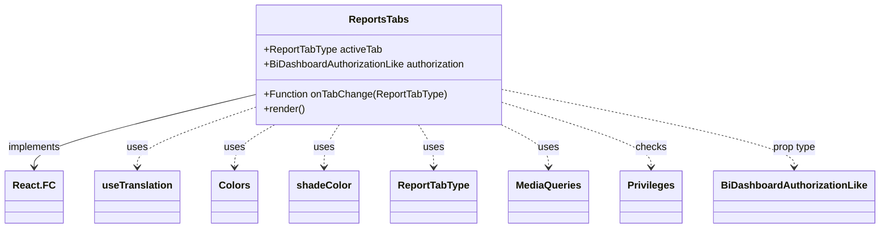

# Diagram: web/portal/src/pages/reports/bi-dashboard-next/components/molecules/Reports.Tabs.molecule.tsx


> Auto-generated by Obscura crawlers

## Diagram 1



### SVG

<svg id="container" width="1362.9765625" xmlns="http://www.w3.org/2000/svg" class="classDiagram" height="366" viewBox="0 0 1362.9765625 366" role="graphics-document document" aria-roledescription="class"><style>#container{font-family:"trebuchet ms",verdana,arial,sans-serif;font-size:16px;fill:#333;}@keyframes edge-animation-frame{from{stroke-dashoffset:0;}}@keyframes dash{to{stroke-dashoffset:0;}}#container .edge-animation-slow{stroke-dasharray:9,5!important;stroke-dashoffset:900;animation:dash 50s linear infinite;stroke-linecap:round;}#container .edge-animation-fast{stroke-dasharray:9,5!important;stroke-dashoffset:900;animation:dash 20s linear infinite;stroke-linecap:round;}#container .error-icon{fill:#552222;}#container .error-text{fill:#552222;stroke:#552222;}#container .edge-thickness-normal{stroke-width:1px;}#container .edge-thickness-thick{stroke-width:3.5px;}#container .edge-pattern-solid{stroke-dasharray:0;}#container .edge-thickness-invisible{stroke-width:0;fill:none;}#container .edge-pattern-dashed{stroke-dasharray:3;}#container .edge-pattern-dotted{stroke-dasharray:2;}#container .marker{fill:#333333;stroke:#333333;}#container .marker.cross{stroke:#333333;}#container svg{font-family:"trebuchet ms",verdana,arial,sans-serif;font-size:16px;}#container p{margin:0;}#container g.classGroup text{fill:#9370DB;stroke:none;font-family:"trebuchet ms",verdana,arial,sans-serif;font-size:10px;}#container g.classGroup text .title{font-weight:bolder;}#container .nodeLabel,#container .edgeLabel{color:#131300;}#container .edgeLabel .label rect{fill:#ECECFF;}#container .label text{fill:#131300;}#container .labelBkg{background:#ECECFF;}#container .edgeLabel .label span{background:#ECECFF;}#container .classTitle{font-weight:bolder;}#container .node rect,#container .node circle,#container .node ellipse,#container .node polygon,#container .node path{fill:#ECECFF;stroke:#9370DB;stroke-width:1px;}#container .divider{stroke:#9370DB;stroke-width:1;}#container g.clickable{cursor:pointer;}#container g.classGroup rect{fill:#ECECFF;stroke:#9370DB;}#container g.classGroup line{stroke:#9370DB;stroke-width:1;}#container .classLabel .box{stroke:none;stroke-width:0;fill:#ECECFF;opacity:0.5;}#container .classLabel .label{fill:#9370DB;font-size:10px;}#container .relation{stroke:#333333;stroke-width:1;fill:none;}#container .dashed-line{stroke-dasharray:3;}#container .dotted-line{stroke-dasharray:1 2;}#container #compositionStart,#container .composition{fill:#333333!important;stroke:#333333!important;stroke-width:1;}#container #compositionEnd,#container .composition{fill:#333333!important;stroke:#333333!important;stroke-width:1;}#container #dependencyStart,#container .dependency{fill:#333333!important;stroke:#333333!important;stroke-width:1;}#container #dependencyStart,#container .dependency{fill:#333333!important;stroke:#333333!important;stroke-width:1;}#container #extensionStart,#container .extension{fill:transparent!important;stroke:#333333!important;stroke-width:1;}#container #extensionEnd,#container .extension{fill:transparent!important;stroke:#333333!important;stroke-width:1;}#container #aggregationStart,#container .aggregation{fill:transparent!important;stroke:#333333!important;stroke-width:1;}#container #aggregationEnd,#container .aggregation{fill:transparent!important;stroke:#333333!important;stroke-width:1;}#container #lollipopStart,#container .lollipop{fill:#ECECFF!important;stroke:#333333!important;stroke-width:1;}#container #lollipopEnd,#container .lollipop{fill:#ECECFF!important;stroke:#333333!important;stroke-width:1;}#container .edgeTerminals{font-size:11px;line-height:initial;}#container .classTitleText{text-anchor:middle;font-size:18px;fill:#333;}#container .label-icon{display:inline-block;height:1em;overflow:visible;vertical-align:-0.125em;}#container .node .label-icon path{fill:currentColor;stroke:revert;stroke-width:revert;}#container :root{--mermaid-font-family:"trebuchet ms",verdana,arial,sans-serif;}</style><g><defs><marker id="container_class-aggregationStart" class="marker aggregation class" refX="18" refY="7" markerWidth="190" markerHeight="240" orient="auto"><path d="M 18,7 L9,13 L1,7 L9,1 Z"></path></marker></defs><defs><marker id="container_class-aggregationEnd" class="marker aggregation class" refX="1" refY="7" markerWidth="20" markerHeight="28" orient="auto"><path d="M 18,7 L9,13 L1,7 L9,1 Z"></path></marker></defs><defs><marker id="container_class-extensionStart" class="marker extension class" refX="18" refY="7" markerWidth="190" markerHeight="240" orient="auto"><path d="M 1,7 L18,13 V 1 Z"></path></marker></defs><defs><marker id="container_class-extensionEnd" class="marker extension class" refX="1" refY="7" markerWidth="20" markerHeight="28" orient="auto"><path d="M 1,1 V 13 L18,7 Z"></path></marker></defs><defs><marker id="container_class-compositionStart" class="marker composition class" refX="18" refY="7" markerWidth="190" markerHeight="240" orient="auto"><path d="M 18,7 L9,13 L1,7 L9,1 Z"></path></marker></defs><defs><marker id="container_class-compositionEnd" class="marker composition class" refX="1" refY="7" markerWidth="20" markerHeight="28" orient="auto"><path d="M 18,7 L9,13 L1,7 L9,1 Z"></path></marker></defs><defs><marker id="container_class-dependencyStart" class="marker dependency class" refX="6" refY="7" markerWidth="190" markerHeight="240" orient="auto"><path d="M 5,7 L9,13 L1,7 L9,1 Z"></path></marker></defs><defs><marker id="container_class-dependencyEnd" class="marker dependency class" refX="13" refY="7" markerWidth="20" markerHeight="28" orient="auto"><path d="M 18,7 L9,13 L14,7 L9,1 Z"></path></marker></defs><defs><marker id="container_class-lollipopStart" class="marker lollipop class" refX="13" refY="7" markerWidth="190" markerHeight="240" orient="auto"><circle stroke="black" fill="transparent" cx="7" cy="7" r="6"></circle></marker></defs><defs><marker id="container_class-lollipopEnd" class="marker lollipop class" refX="1" refY="7" markerWidth="190" markerHeight="240" orient="auto"><circle stroke="black" fill="transparent" cx="7" cy="7" r="6"></circle></marker></defs><g class="root"><g class="clusters"></g><g class="edgePaths"><path d="M385.301,153.751L329.594,167.626C273.888,181.501,162.475,209.25,106.769,228.292C51.063,247.333,51.063,257.667,51.063,262.833L51.063,268" id="id_ReportsTabs_React.FC_1" class="edge-thickness-normal edge-pattern-solid relation" style=";;;" data-edge="true" data-et="edge" data-id="id_ReportsTabs_React.FC_1" data-points="W3sieCI6Mzg1LjMwMDc4MTI1LCJ5IjoxNTMuNzUwOTUwOTg3NTY0fSx7IngiOjUxLjA2MjUsInkiOjIzN30seyJ4Ijo1MS4wNjI1LCJ5IjoyNzR9XQ==" marker-end="url(#container_class-dependencyEnd)"></path><path d="M385.301,174.823L356.074,185.186C326.846,195.548,268.392,216.274,239.165,231.804C209.938,247.333,209.938,257.667,209.938,262.833L209.938,268" id="id_ReportsTabs_useTranslation_2" class="edge-thickness-normal edge-pattern-dashed relation" style=";;;" data-edge="true" data-et="edge" data-id="id_ReportsTabs_useTranslation_2" data-points="W3sieCI6Mzg1LjMwMDc4MTI1LCJ5IjoxNzQuODIyNjI0NjUxMTQzNDN9LHsieCI6MjA5LjkzNzUsInkiOjIzN30seyJ4IjoyMDkuOTM3NSwieSI6Mjc0fV0=" marker-end="url(#container_class-dependencyEnd)"></path><path d="M423.419,200L413.037,206.167C402.654,212.333,381.89,224.667,371.507,236C361.125,247.333,361.125,257.667,361.125,262.833L361.125,268" id="id_ReportsTabs_Colors_3" class="edge-thickness-normal edge-pattern-dashed relation" style=";;;" data-edge="true" data-et="edge" data-id="id_ReportsTabs_Colors_3" data-points="W3sieCI6NDIzLjQxOTA1NTQ1MTEyNzg2LCJ5IjoyMDB9LHsieCI6MzYxLjEyNSwieSI6MjM3fSx7IngiOjM2MS4xMjUsInkiOjI3NH1d" marker-end="url(#container_class-dependencyEnd)"></path><path d="M523.4,200L519.44,206.167C515.48,212.333,507.561,224.667,503.601,236C499.641,247.333,499.641,257.667,499.641,262.833L499.641,268" id="id_ReportsTabs_shadeColor_4" class="edge-thickness-normal edge-pattern-dashed relation" style=";;;" data-edge="true" data-et="edge" data-id="id_ReportsTabs_shadeColor_4" data-points="W3sieCI6NTIzLjQwMDI1ODQ1ODY0NjYsInkiOjIwMH0seyJ4Ijo0OTkuNjQwNjI1LCJ5IjoyMzd9LHsieCI6NDk5LjY0MDYyNSwieSI6Mjc0fV0=" marker-end="url(#container_class-dependencyEnd)"></path><path d="M646.693,200L650.653,206.167C654.613,212.333,662.533,224.667,666.493,236C670.453,247.333,670.453,257.667,670.453,262.833L670.453,268" id="id_ReportsTabs_ReportTabType_5" class="edge-thickness-normal edge-pattern-dashed relation" style=";;;" data-edge="true" data-et="edge" data-id="id_ReportsTabs_ReportTabType_5" data-points="W3sieCI6NjQ2LjY5MzQ5MTU0MTM1MzQsInkiOjIwMH0seyJ4Ijo2NzAuNDUzMTI1LCJ5IjoyMzd9LHsieCI6NjcwLjQ1MzEyNSwieSI6Mjc0fV0=" marker-end="url(#container_class-dependencyEnd)"></path><path d="M776.477,200L788.774,206.167C801.071,212.333,825.664,224.667,837.961,236C850.258,247.333,850.258,257.667,850.258,262.833L850.258,268" id="id_ReportsTabs_MediaQueries_6" class="edge-thickness-normal edge-pattern-dashed relation" style=";;;" data-edge="true" data-et="edge" data-id="id_ReportsTabs_MediaQueries_6" data-points="W3sieCI6Nzc2LjQ3NzMyNjEyNzgxOTUsInkiOjIwMH0seyJ4Ijo4NTAuMjU3ODEyNSwieSI6MjM3fSx7IngiOjg1MC4yNTc4MTI1LCJ5IjoyNzR9XQ==" marker-end="url(#container_class-dependencyEnd)"></path><path d="M784.793,166.457L822.394,178.214C859.995,189.971,935.197,213.486,972.798,230.41C1010.398,247.333,1010.398,257.667,1010.398,262.833L1010.398,268" id="id_ReportsTabs_Privileges_7" class="edge-thickness-normal edge-pattern-dashed relation" style=";;;" data-edge="true" data-et="edge" data-id="id_ReportsTabs_Privileges_7" data-points="W3sieCI6Nzg0Ljc5Mjk2ODc1LCJ5IjoxNjYuNDU3MTEyNjgyNTIzNjR9LHsieCI6MTAxMC4zOTg0Mzc1LCJ5IjoyMzd9LHsieCI6MTAxMC4zOTg0Mzc1LCJ5IjoyNzR9XQ==" marker-end="url(#container_class-dependencyEnd)"></path><path d="M784.793,145.092L859.253,160.41C933.714,175.728,1082.634,206.364,1157.094,226.849C1231.555,247.333,1231.555,257.667,1231.555,262.833L1231.555,268" id="id_ReportsTabs_BiDashboardAuthorizationLike_8" class="edge-thickness-normal edge-pattern-dashed relation" style=";;;" data-edge="true" data-et="edge" data-id="id_ReportsTabs_BiDashboardAuthorizationLike_8" data-points="W3sieCI6Nzg0Ljc5Mjk2ODc1LCJ5IjoxNDUuMDkxODkzOTQ5NDY0MDd9LHsieCI6MTIzMS41NTQ2ODc1LCJ5IjoyMzd9LHsieCI6MTIzMS41NTQ2ODc1LCJ5IjoyNzR9XQ==" marker-end="url(#container_class-dependencyEnd)"></path></g><g class="edgeLabels"><g class="edgeLabel" transform="translate(51.0625, 237)"><g class="label" data-id="id_ReportsTabs_React.FC_1" transform="translate(-43.0625, -12)"><foreignObject width="86.125" height="24"><div xmlns="http://www.w3.org/1999/xhtml" class="labelBkg" style="display: table-cell; white-space: nowrap; line-height: 1.5; max-width: 200px; text-align: center;"><span class="edgeLabel"><p>implements</p></span></div></foreignObject></g></g><g class="edgeLabel" transform="translate(209.9375, 237)"><g class="label" data-id="id_ReportsTabs_useTranslation_2" transform="translate(-16.4921875, -12)"><foreignObject width="32.984375" height="24"><div xmlns="http://www.w3.org/1999/xhtml" class="labelBkg" style="display: table-cell; white-space: nowrap; line-height: 1.5; max-width: 200px; text-align: center;"><span class="edgeLabel"><p>uses</p></span></div></foreignObject></g></g><g class="edgeLabel" transform="translate(361.125, 237)"><g class="label" data-id="id_ReportsTabs_Colors_3" transform="translate(-16.4921875, -12)"><foreignObject width="32.984375" height="24"><div xmlns="http://www.w3.org/1999/xhtml" class="labelBkg" style="display: table-cell; white-space: nowrap; line-height: 1.5; max-width: 200px; text-align: center;"><span class="edgeLabel"><p>uses</p></span></div></foreignObject></g></g><g class="edgeLabel" transform="translate(499.640625, 237)"><g class="label" data-id="id_ReportsTabs_shadeColor_4" transform="translate(-16.4921875, -12)"><foreignObject width="32.984375" height="24"><div xmlns="http://www.w3.org/1999/xhtml" class="labelBkg" style="display: table-cell; white-space: nowrap; line-height: 1.5; max-width: 200px; text-align: center;"><span class="edgeLabel"><p>uses</p></span></div></foreignObject></g></g><g class="edgeLabel" transform="translate(670.453125, 237)"><g class="label" data-id="id_ReportsTabs_ReportTabType_5" transform="translate(-16.4921875, -12)"><foreignObject width="32.984375" height="24"><div xmlns="http://www.w3.org/1999/xhtml" class="labelBkg" style="display: table-cell; white-space: nowrap; line-height: 1.5; max-width: 200px; text-align: center;"><span class="edgeLabel"><p>uses</p></span></div></foreignObject></g></g><g class="edgeLabel" transform="translate(850.2578125, 237)"><g class="label" data-id="id_ReportsTabs_MediaQueries_6" transform="translate(-16.4921875, -12)"><foreignObject width="32.984375" height="24"><div xmlns="http://www.w3.org/1999/xhtml" class="labelBkg" style="display: table-cell; white-space: nowrap; line-height: 1.5; max-width: 200px; text-align: center;"><span class="edgeLabel"><p>uses</p></span></div></foreignObject></g></g><g class="edgeLabel" transform="translate(1010.3984375, 237)"><g class="label" data-id="id_ReportsTabs_Privileges_7" transform="translate(-24.4921875, -12)"><foreignObject width="48.984375" height="24"><div xmlns="http://www.w3.org/1999/xhtml" class="labelBkg" style="display: table-cell; white-space: nowrap; line-height: 1.5; max-width: 200px; text-align: center;"><span class="edgeLabel"><p>checks</p></span></div></foreignObject></g></g><g class="edgeLabel" transform="translate(1231.5546875, 237)"><g class="label" data-id="id_ReportsTabs_BiDashboardAuthorizationLike_8" transform="translate(-35.046875, -12)"><foreignObject width="70.09375" height="24"><div xmlns="http://www.w3.org/1999/xhtml" class="labelBkg" style="display: table-cell; white-space: nowrap; line-height: 1.5; max-width: 200px; text-align: center;"><span class="edgeLabel"><p>prop type</p></span></div></foreignObject></g></g></g><g class="nodes"><g class="node default" id="classId-ReportsTabs-0" transform="translate(585.046875, 104)"><g class="basic label-container"><path d="M-199.74609375 -96 L199.74609375 -96 L199.74609375 96 L-199.74609375 96" stroke="none" stroke-width="0" fill="#ECECFF" style=""></path><path d="M-199.74609375 -96 C-112.37361970120689 -96, -25.001145652413783 -96, 199.74609375 -96 M-199.74609375 -96 C-109.09311811662076 -96, -18.440142483241516 -96, 199.74609375 -96 M199.74609375 -96 C199.74609375 -24.7668709984339, 199.74609375 46.4662580031322, 199.74609375 96 M199.74609375 -96 C199.74609375 -21.69760189502695, 199.74609375 52.6047962099461, 199.74609375 96 M199.74609375 96 C79.67476104549537 96, -40.396571659009254 96, -199.74609375 96 M199.74609375 96 C52.908956100966435 96, -93.92818154806713 96, -199.74609375 96 M-199.74609375 96 C-199.74609375 21.614539104788918, -199.74609375 -52.770921790422165, -199.74609375 -96 M-199.74609375 96 C-199.74609375 50.44230276543343, -199.74609375 4.884605530866864, -199.74609375 -96" stroke="#9370DB" stroke-width="1.3" fill="none" stroke-dasharray="0 0" style=""></path></g><g class="annotation-group text" transform="translate(0, -72)"></g><g class="label-group text" transform="translate(-45.7890625, -72)"><g class="label" style="font-weight: bolder" transform="translate(0,-12)"><foreignObject width="91.578125" height="24"><div xmlns="http://www.w3.org/1999/xhtml" style="display: table-cell; white-space: nowrap; line-height: 1.5; max-width: 140px; text-align: center;"><span class="nodeLabel markdown-node-label" style=""><p>ReportsTabs</p></span></div></foreignObject></g></g><g class="members-group text" transform="translate(-187.74609375, -24)"><g class="label" style="" transform="translate(0,-12)"><foreignObject width="189.453125" height="24"><div xmlns="http://www.w3.org/1999/xhtml" style="display: table-cell; white-space: nowrap; line-height: 1.5; max-width: 247px; text-align: center;"><span class="nodeLabel markdown-node-label" style=""><p>+ReportTabType activeTab</p></span></div></foreignObject></g><g class="label" style="" transform="translate(0,12)"><foreignObject width="329.703125" height="24"><div xmlns="http://www.w3.org/1999/xhtml" style="display: table-cell; white-space: nowrap; line-height: 1.5; max-width: 387px; text-align: center;"><span class="nodeLabel markdown-node-label" style=""><p>+BiDashboardAuthorizationLike authorization</p></span></div></foreignObject></g></g><g class="methods-group text" transform="translate(-187.74609375, 48)"><g class="label" style="" transform="translate(0,-12)"><foreignObject width="291.015625" height="24"><div xmlns="http://www.w3.org/1999/xhtml" style="display: table-cell; white-space: nowrap; line-height: 1.5; max-width: 348px; text-align: center;"><span class="nodeLabel markdown-node-label" style=""><p>+Function onTabChange(ReportTabType)</p></span></div></foreignObject></g><g class="label" style="" transform="translate(0,12)"><foreignObject width="66.609375" height="24"><div xmlns="http://www.w3.org/1999/xhtml" style="display: table-cell; white-space: nowrap; line-height: 1.5; max-width: 124px; text-align: center;"><span class="nodeLabel markdown-node-label" style=""><p>+render()</p></span></div></foreignObject></g></g><g class="divider" style=""><path d="M-199.74609375 -48 C-112.16909218668131 -48, -24.592090623362623 -48, 199.74609375 -48 M-199.74609375 -48 C-86.5743715953078 -48, 26.59735055938441 -48, 199.74609375 -48" stroke="#9370DB" stroke-width="1.3" fill="none" stroke-dasharray="0 0" style=""></path></g><g class="divider" style=""><path d="M-199.74609375 24 C-97.9954989561993 24, 3.7550958376014023 24, 199.74609375 24 M-199.74609375 24 C-67.93762279994186 24, 63.870848150116274 24, 199.74609375 24" stroke="#9370DB" stroke-width="1.3" fill="none" stroke-dasharray="0 0" style=""></path></g></g><g class="node default" id="classId-React.FC-1" transform="translate(51.0625, 316)"><g class="basic label-container"><path d="M-42.7890625 -42 L42.7890625 -42 L42.7890625 42 L-42.7890625 42" stroke="none" stroke-width="0" fill="#ECECFF" style=""></path><path d="M-42.7890625 -42 C-20.832056663752855 -42, 1.12494917249429 -42, 42.7890625 -42 M-42.7890625 -42 C-16.667942258127344 -42, 9.453177983745313 -42, 42.7890625 -42 M42.7890625 -42 C42.7890625 -24.287244563669145, 42.7890625 -6.574489127338289, 42.7890625 42 M42.7890625 -42 C42.7890625 -10.827648074837207, 42.7890625 20.344703850325587, 42.7890625 42 M42.7890625 42 C17.546628257655183 42, -7.695805984689635 42, -42.7890625 42 M42.7890625 42 C10.0688719279145 42, -22.651318644171 42, -42.7890625 42 M-42.7890625 42 C-42.7890625 18.502833862132597, -42.7890625 -4.994332275734806, -42.7890625 -42 M-42.7890625 42 C-42.7890625 17.2130147447284, -42.7890625 -7.573970510543198, -42.7890625 -42" stroke="#9370DB" stroke-width="1.3" fill="none" stroke-dasharray="0 0" style=""></path></g><g class="annotation-group text" transform="translate(0, -18)"></g><g class="label-group text" transform="translate(-30.7890625, -18)"><g class="label" style="font-weight: bolder" transform="translate(0,-12)"><foreignObject width="61.578125" height="24"><div xmlns="http://www.w3.org/1999/xhtml" style="display: table-cell; white-space: nowrap; line-height: 1.5; max-width: 111px; text-align: center;"><span class="nodeLabel markdown-node-label" style=""><p>React.FC</p></span></div></foreignObject></g></g><g class="members-group text" transform="translate(-30.7890625, 30)"></g><g class="methods-group text" transform="translate(-30.7890625, 60)"></g><g class="divider" style=""><path d="M-42.7890625 6 C-8.966834068609138 6, 24.855394362781723 6, 42.7890625 6 M-42.7890625 6 C-25.52661918765286 6, -8.264175875305718 6, 42.7890625 6" stroke="#9370DB" stroke-width="1.3" fill="none" stroke-dasharray="0 0" style=""></path></g><g class="divider" style=""><path d="M-42.7890625 24 C-9.19597956556521 24, 24.39710336886958 24, 42.7890625 24 M-42.7890625 24 C-11.435504462894759 24, 19.918053574210482 24, 42.7890625 24" stroke="#9370DB" stroke-width="1.3" fill="none" stroke-dasharray="0 0" style=""></path></g></g><g class="node default" id="classId-useTranslation-2" transform="translate(209.9375, 316)"><g class="basic label-container"><path d="M-66.0859375 -42 L66.0859375 -42 L66.0859375 42 L-66.0859375 42" stroke="none" stroke-width="0" fill="#ECECFF" style=""></path><path d="M-66.0859375 -42 C-35.70664411783354 -42, -5.327350735667082 -42, 66.0859375 -42 M-66.0859375 -42 C-21.173100723277564 -42, 23.739736053444872 -42, 66.0859375 -42 M66.0859375 -42 C66.0859375 -23.246680481753074, 66.0859375 -4.493360963506149, 66.0859375 42 M66.0859375 -42 C66.0859375 -24.922243441960678, 66.0859375 -7.8444868839213555, 66.0859375 42 M66.0859375 42 C38.91707020970214 42, 11.748202919404278 42, -66.0859375 42 M66.0859375 42 C35.64666034550986 42, 5.207383191019723 42, -66.0859375 42 M-66.0859375 42 C-66.0859375 22.392173485830217, -66.0859375 2.784346971660433, -66.0859375 -42 M-66.0859375 42 C-66.0859375 15.81959306138814, -66.0859375 -10.36081387722372, -66.0859375 -42" stroke="#9370DB" stroke-width="1.3" fill="none" stroke-dasharray="0 0" style=""></path></g><g class="annotation-group text" transform="translate(0, -18)"></g><g class="label-group text" transform="translate(-54.0859375, -18)"><g class="label" style="font-weight: bolder" transform="translate(0,-12)"><foreignObject width="108.171875" height="24"><div xmlns="http://www.w3.org/1999/xhtml" style="display: table-cell; white-space: nowrap; line-height: 1.5; max-width: 157px; text-align: center;"><span class="nodeLabel markdown-node-label" style=""><p>useTranslation</p></span></div></foreignObject></g></g><g class="members-group text" transform="translate(-54.0859375, 30)"></g><g class="methods-group text" transform="translate(-54.0859375, 60)"></g><g class="divider" style=""><path d="M-66.0859375 6 C-32.25099412939271 6, 1.583949241214583 6, 66.0859375 6 M-66.0859375 6 C-13.585922572200595 6, 38.91409235559881 6, 66.0859375 6" stroke="#9370DB" stroke-width="1.3" fill="none" stroke-dasharray="0 0" style=""></path></g><g class="divider" style=""><path d="M-66.0859375 24 C-30.43287628207611 24, 5.220184935847783 24, 66.0859375 24 M-66.0859375 24 C-21.938965055436803 24, 22.208007389126394 24, 66.0859375 24" stroke="#9370DB" stroke-width="1.3" fill="none" stroke-dasharray="0 0" style=""></path></g></g><g class="node default" id="classId-Colors-3" transform="translate(361.125, 316)"><g class="basic label-container"><path d="M-35.1015625 -42 L35.1015625 -42 L35.1015625 42 L-35.1015625 42" stroke="none" stroke-width="0" fill="#ECECFF" style=""></path><path d="M-35.1015625 -42 C-7.3874035804173594 -42, 20.32675533916528 -42, 35.1015625 -42 M-35.1015625 -42 C-9.271026693593026 -42, 16.55950911281395 -42, 35.1015625 -42 M35.1015625 -42 C35.1015625 -8.405718685785509, 35.1015625 25.188562628428983, 35.1015625 42 M35.1015625 -42 C35.1015625 -10.325888004479015, 35.1015625 21.34822399104197, 35.1015625 42 M35.1015625 42 C16.77401846495617 42, -1.5535255700876576 42, -35.1015625 42 M35.1015625 42 C12.131307219352049 42, -10.838948061295902 42, -35.1015625 42 M-35.1015625 42 C-35.1015625 10.27706135195422, -35.1015625 -21.44587729609156, -35.1015625 -42 M-35.1015625 42 C-35.1015625 17.81167549316028, -35.1015625 -6.37664901367944, -35.1015625 -42" stroke="#9370DB" stroke-width="1.3" fill="none" stroke-dasharray="0 0" style=""></path></g><g class="annotation-group text" transform="translate(0, -18)"></g><g class="label-group text" transform="translate(-23.1015625, -18)"><g class="label" style="font-weight: bolder" transform="translate(0,-12)"><foreignObject width="46.203125" height="24"><div xmlns="http://www.w3.org/1999/xhtml" style="display: table-cell; white-space: nowrap; line-height: 1.5; max-width: 95px; text-align: center;"><span class="nodeLabel markdown-node-label" style=""><p>Colors</p></span></div></foreignObject></g></g><g class="members-group text" transform="translate(-23.1015625, 30)"></g><g class="methods-group text" transform="translate(-23.1015625, 60)"></g><g class="divider" style=""><path d="M-35.1015625 6 C-8.954169666667418 6, 17.193223166665163 6, 35.1015625 6 M-35.1015625 6 C-11.958580804551211 6, 11.184400890897578 6, 35.1015625 6" stroke="#9370DB" stroke-width="1.3" fill="none" stroke-dasharray="0 0" style=""></path></g><g class="divider" style=""><path d="M-35.1015625 24 C-18.533069722150756 24, -1.9645769443015126 24, 35.1015625 24 M-35.1015625 24 C-16.940991142813893 24, 1.2195802143722148 24, 35.1015625 24" stroke="#9370DB" stroke-width="1.3" fill="none" stroke-dasharray="0 0" style=""></path></g></g><g class="node default" id="classId-shadeColor-4" transform="translate(499.640625, 316)"><g class="basic label-container"><path d="M-53.4140625 -42 L53.4140625 -42 L53.4140625 42 L-53.4140625 42" stroke="none" stroke-width="0" fill="#ECECFF" style=""></path><path d="M-53.4140625 -42 C-20.956180465689975 -42, 11.50170156862005 -42, 53.4140625 -42 M-53.4140625 -42 C-21.128812285925406 -42, 11.156437928149188 -42, 53.4140625 -42 M53.4140625 -42 C53.4140625 -14.893793115348942, 53.4140625 12.212413769302117, 53.4140625 42 M53.4140625 -42 C53.4140625 -21.11021490753455, 53.4140625 -0.22042981506910309, 53.4140625 42 M53.4140625 42 C27.725929448724546 42, 2.0377963974490925 42, -53.4140625 42 M53.4140625 42 C27.391359038857118 42, 1.368655577714236 42, -53.4140625 42 M-53.4140625 42 C-53.4140625 16.89500155003264, -53.4140625 -8.209996899934723, -53.4140625 -42 M-53.4140625 42 C-53.4140625 18.65908598984123, -53.4140625 -4.681828020317539, -53.4140625 -42" stroke="#9370DB" stroke-width="1.3" fill="none" stroke-dasharray="0 0" style=""></path></g><g class="annotation-group text" transform="translate(0, -18)"></g><g class="label-group text" transform="translate(-41.4140625, -18)"><g class="label" style="font-weight: bolder" transform="translate(0,-12)"><foreignObject width="82.828125" height="24"><div xmlns="http://www.w3.org/1999/xhtml" style="display: table-cell; white-space: nowrap; line-height: 1.5; max-width: 133px; text-align: center;"><span class="nodeLabel markdown-node-label" style=""><p>shadeColor</p></span></div></foreignObject></g></g><g class="members-group text" transform="translate(-41.4140625, 30)"></g><g class="methods-group text" transform="translate(-41.4140625, 60)"></g><g class="divider" style=""><path d="M-53.4140625 6 C-31.399642640388016 6, -9.385222780776033 6, 53.4140625 6 M-53.4140625 6 C-19.06173977068611 6, 15.29058295862778 6, 53.4140625 6" stroke="#9370DB" stroke-width="1.3" fill="none" stroke-dasharray="0 0" style=""></path></g><g class="divider" style=""><path d="M-53.4140625 24 C-17.78466209891493 24, 17.844738302170143 24, 53.4140625 24 M-53.4140625 24 C-25.676577374930066 24, 2.0609077501398687 24, 53.4140625 24" stroke="#9370DB" stroke-width="1.3" fill="none" stroke-dasharray="0 0" style=""></path></g></g><g class="node default" id="classId-ReportTabType-5" transform="translate(670.453125, 316)"><g class="basic label-container"><path d="M-67.3984375 -42 L67.3984375 -42 L67.3984375 42 L-67.3984375 42" stroke="none" stroke-width="0" fill="#ECECFF" style=""></path><path d="M-67.3984375 -42 C-29.299746941215524 -42, 8.798943617568952 -42, 67.3984375 -42 M-67.3984375 -42 C-14.58987445556668 -42, 38.21868858886664 -42, 67.3984375 -42 M67.3984375 -42 C67.3984375 -14.134557579143937, 67.3984375 13.730884841712125, 67.3984375 42 M67.3984375 -42 C67.3984375 -21.48848049610554, 67.3984375 -0.9769609922110831, 67.3984375 42 M67.3984375 42 C21.358234074517412 42, -24.681969350965176 42, -67.3984375 42 M67.3984375 42 C34.9427897540026 42, 2.4871420080051934 42, -67.3984375 42 M-67.3984375 42 C-67.3984375 22.056493881641334, -67.3984375 2.1129877632826677, -67.3984375 -42 M-67.3984375 42 C-67.3984375 19.50255092943219, -67.3984375 -2.9948981411356215, -67.3984375 -42" stroke="#9370DB" stroke-width="1.3" fill="none" stroke-dasharray="0 0" style=""></path></g><g class="annotation-group text" transform="translate(0, -18)"></g><g class="label-group text" transform="translate(-55.3984375, -18)"><g class="label" style="font-weight: bolder" transform="translate(0,-12)"><foreignObject width="110.796875" height="24"><div xmlns="http://www.w3.org/1999/xhtml" style="display: table-cell; white-space: nowrap; line-height: 1.5; max-width: 158px; text-align: center;"><span class="nodeLabel markdown-node-label" style=""><p>ReportTabType</p></span></div></foreignObject></g></g><g class="members-group text" transform="translate(-55.3984375, 30)"></g><g class="methods-group text" transform="translate(-55.3984375, 60)"></g><g class="divider" style=""><path d="M-67.3984375 6 C-37.85198094554964 6, -8.305524391099283 6, 67.3984375 6 M-67.3984375 6 C-31.35270732980853 6, 4.6930228403829375 6, 67.3984375 6" stroke="#9370DB" stroke-width="1.3" fill="none" stroke-dasharray="0 0" style=""></path></g><g class="divider" style=""><path d="M-67.3984375 24 C-32.475119019436015 24, 2.4481994611279703 24, 67.3984375 24 M-67.3984375 24 C-26.00262554525024 24, 15.39318640949952 24, 67.3984375 24" stroke="#9370DB" stroke-width="1.3" fill="none" stroke-dasharray="0 0" style=""></path></g></g><g class="node default" id="classId-MediaQueries-6" transform="translate(850.2578125, 316)"><g class="basic label-container"><path d="M-62.40625 -42 L62.40625 -42 L62.40625 42 L-62.40625 42" stroke="none" stroke-width="0" fill="#ECECFF" style=""></path><path d="M-62.40625 -42 C-37.39177885785131 -42, -12.377307715702614 -42, 62.40625 -42 M-62.40625 -42 C-16.77496457079613 -42, 28.85632085840774 -42, 62.40625 -42 M62.40625 -42 C62.40625 -14.87048450842856, 62.40625 12.259030983142878, 62.40625 42 M62.40625 -42 C62.40625 -23.621838314743414, 62.40625 -5.243676629486828, 62.40625 42 M62.40625 42 C33.699439941522016 42, 4.9926298830440246 42, -62.40625 42 M62.40625 42 C23.093397242604752 42, -16.219455514790496 42, -62.40625 42 M-62.40625 42 C-62.40625 8.748447001157814, -62.40625 -24.503105997684372, -62.40625 -42 M-62.40625 42 C-62.40625 14.921367486155034, -62.40625 -12.157265027689931, -62.40625 -42" stroke="#9370DB" stroke-width="1.3" fill="none" stroke-dasharray="0 0" style=""></path></g><g class="annotation-group text" transform="translate(0, -18)"></g><g class="label-group text" transform="translate(-50.40625, -18)"><g class="label" style="font-weight: bolder" transform="translate(0,-12)"><foreignObject width="100.8125" height="24"><div xmlns="http://www.w3.org/1999/xhtml" style="display: table-cell; white-space: nowrap; line-height: 1.5; max-width: 150px; text-align: center;"><span class="nodeLabel markdown-node-label" style=""><p>MediaQueries</p></span></div></foreignObject></g></g><g class="members-group text" transform="translate(-50.40625, 30)"></g><g class="methods-group text" transform="translate(-50.40625, 60)"></g><g class="divider" style=""><path d="M-62.40625 6 C-35.11656172531295 6, -7.8268734506258895 6, 62.40625 6 M-62.40625 6 C-23.325832192593523 6, 15.754585614812953 6, 62.40625 6" stroke="#9370DB" stroke-width="1.3" fill="none" stroke-dasharray="0 0" style=""></path></g><g class="divider" style=""><path d="M-62.40625 24 C-24.89981880629962 24, 12.606612387400759 24, 62.40625 24 M-62.40625 24 C-33.21754987857297 24, -4.028849757145927 24, 62.40625 24" stroke="#9370DB" stroke-width="1.3" fill="none" stroke-dasharray="0 0" style=""></path></g></g><g class="node default" id="classId-Privileges-7" transform="translate(1010.3984375, 316)"><g class="basic label-container"><path d="M-47.734375 -42 L47.734375 -42 L47.734375 42 L-47.734375 42" stroke="none" stroke-width="0" fill="#ECECFF" style=""></path><path d="M-47.734375 -42 C-23.411038414670234 -42, 0.9122981706595326 -42, 47.734375 -42 M-47.734375 -42 C-20.579020085168263 -42, 6.576334829663473 -42, 47.734375 -42 M47.734375 -42 C47.734375 -17.86240199848597, 47.734375 6.275196003028057, 47.734375 42 M47.734375 -42 C47.734375 -11.768877597493102, 47.734375 18.462244805013796, 47.734375 42 M47.734375 42 C25.32117000499772 42, 2.9079650099954435 42, -47.734375 42 M47.734375 42 C11.256033126468886 42, -25.22230874706223 42, -47.734375 42 M-47.734375 42 C-47.734375 17.353556638665456, -47.734375 -7.292886722669088, -47.734375 -42 M-47.734375 42 C-47.734375 12.698166107021294, -47.734375 -16.603667785957413, -47.734375 -42" stroke="#9370DB" stroke-width="1.3" fill="none" stroke-dasharray="0 0" style=""></path></g><g class="annotation-group text" transform="translate(0, -18)"></g><g class="label-group text" transform="translate(-35.734375, -18)"><g class="label" style="font-weight: bolder" transform="translate(0,-12)"><foreignObject width="71.46875" height="24"><div xmlns="http://www.w3.org/1999/xhtml" style="display: table-cell; white-space: nowrap; line-height: 1.5; max-width: 120px; text-align: center;"><span class="nodeLabel markdown-node-label" style=""><p>Privileges</p></span></div></foreignObject></g></g><g class="members-group text" transform="translate(-35.734375, 30)"></g><g class="methods-group text" transform="translate(-35.734375, 60)"></g><g class="divider" style=""><path d="M-47.734375 6 C-13.584432880810965 6, 20.56550923837807 6, 47.734375 6 M-47.734375 6 C-15.015960022445178 6, 17.702454955109644 6, 47.734375 6" stroke="#9370DB" stroke-width="1.3" fill="none" stroke-dasharray="0 0" style=""></path></g><g class="divider" style=""><path d="M-47.734375 24 C-27.620719548074792 24, -7.507064096149584 24, 47.734375 24 M-47.734375 24 C-15.597118467840438 24, 16.540138064319123 24, 47.734375 24" stroke="#9370DB" stroke-width="1.3" fill="none" stroke-dasharray="0 0" style=""></path></g></g><g class="node default" id="classId-BiDashboardAuthorizationLike-8" transform="translate(1231.5546875, 316)"><g class="basic label-container"><path d="M-123.421875 -42 L123.421875 -42 L123.421875 42 L-123.421875 42" stroke="none" stroke-width="0" fill="#ECECFF" style=""></path><path d="M-123.421875 -42 C-39.60954694953638 -42, 44.20278110092724 -42, 123.421875 -42 M-123.421875 -42 C-64.4038754313248 -42, -5.385875862649613 -42, 123.421875 -42 M123.421875 -42 C123.421875 -20.9654201092755, 123.421875 0.06915978144900237, 123.421875 42 M123.421875 -42 C123.421875 -13.764149542190914, 123.421875 14.471700915618172, 123.421875 42 M123.421875 42 C63.232397607931155 42, 3.04292021586231 42, -123.421875 42 M123.421875 42 C51.310161128361756 42, -20.80155274327649 42, -123.421875 42 M-123.421875 42 C-123.421875 24.311392227572412, -123.421875 6.622784455144824, -123.421875 -42 M-123.421875 42 C-123.421875 23.97151793168261, -123.421875 5.943035863365218, -123.421875 -42" stroke="#9370DB" stroke-width="1.3" fill="none" stroke-dasharray="0 0" style=""></path></g><g class="annotation-group text" transform="translate(0, -18)"></g><g class="label-group text" transform="translate(-111.421875, -18)"><g class="label" style="font-weight: bolder" transform="translate(0,-12)"><foreignObject width="222.84375" height="24"><div xmlns="http://www.w3.org/1999/xhtml" style="display: table-cell; white-space: nowrap; line-height: 1.5; max-width: 270px; text-align: center;"><span class="nodeLabel markdown-node-label" style=""><p>BiDashboardAuthorizationLike</p></span></div></foreignObject></g></g><g class="members-group text" transform="translate(-111.421875, 30)"></g><g class="methods-group text" transform="translate(-111.421875, 60)"></g><g class="divider" style=""><path d="M-123.421875 6 C-49.745355043296925 6, 23.93116491340615 6, 123.421875 6 M-123.421875 6 C-54.45163377755878 6, 14.518607444882434 6, 123.421875 6" stroke="#9370DB" stroke-width="1.3" fill="none" stroke-dasharray="0 0" style=""></path></g><g class="divider" style=""><path d="M-123.421875 24 C-41.95858404584841 24, 39.50470690830318 24, 123.421875 24 M-123.421875 24 C-63.06032332049721 24, -2.6987716409944227 24, 123.421875 24" stroke="#9370DB" stroke-width="1.3" fill="none" stroke-dasharray="0 0" style=""></path></g></g></g></g></g></svg>

## Diagram 2

```mermaid
flowchart TD
    Start([Start Rendering ReportsTabs])
    A{authorization?.hasPrivileges?}
    B[hasReportBuilderPermission = true]
    C[hasReportBuilderPermission = false]
    D[Render "Organization Reports" tab]
    E[Render "My Reports" tab]
    F[Apply activeTab styling (PUBLIC or MY)]
    G[Attach onClick handlers to change tab]
    End([Finish Rendering])

    Start --> A
    A -- yes --> B
    A -- no --> C
    B --> D
    B --> E
    C --> D
    D --> F
    E --> F
    F --> G
    G --> End
```

> SVG rendering failed for this diagram.
