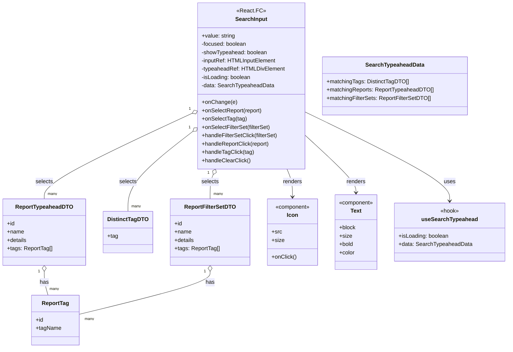

# Diagram: web/portal/src/pages/reports/bi-dashboard-next/components/molecules/Reports.TypeaheadSearchInput.molecule.tsx

> Auto-generated by Obscura crawlers

## Mermaid

### SVG

<svg id="container" width="1437.34375" xmlns="http://www.w3.org/2000/svg" class="classDiagram" height="1004" viewBox="0 0 1437.34375 1004" role="graphics-document document" aria-roledescription="class"><g><defs><marker id="container_class-aggregationStart" class="marker aggregation class" refX="18" refY="7" markerWidth="190" markerHeight="240" orient="auto"><path d="M 18,7 L9,13 L1,7 L9,1 Z"></path></marker></defs><defs><marker id="container_class-aggregationEnd" class="marker aggregation class" refX="1" refY="7" markerWidth="20" markerHeight="28" orient="auto"><path d="M 18,7 L9,13 L1,7 L9,1 Z"></path></marker></defs><defs><marker id="container_class-extensionStart" class="marker extension class" refX="18" refY="7" markerWidth="190" markerHeight="240" orient="auto"><path d="M 1,7 L18,13 V 1 Z"></path></marker></defs><defs><marker id="container_class-extensionEnd" class="marker extension class" refX="1" refY="7" markerWidth="20" markerHeight="28" orient="auto"><path d="M 1,1 V 13 L18,7 Z"></path></marker></defs><defs><marker id="container_class-compositionStart" class="marker composition class" refX="18" refY="7" markerWidth="190" markerHeight="240" orient="auto"><path d="M 18,7 L9,13 L1,7 L9,1 Z"></path></marker></defs><defs><marker id="container_class-compositionEnd" class="marker composition class" refX="1" refY="7" markerWidth="20" markerHeight="28" orient="auto"><path d="M 18,7 L9,13 L1,7 L9,1 Z"></path></marker></defs><defs><marker id="container_class-dependencyStart" class="marker dependency class" refX="6" refY="7" markerWidth="190" markerHeight="240" orient="auto"><path d="M 5,7 L9,13 L1,7 L9,1 Z"></path></marker></defs><defs><marker id="container_class-dependencyEnd" class="marker dependency class" refX="13" refY="7" markerWidth="20" markerHeight="28" orient="auto"><path d="M 18,7 L9,13 L14,7 L9,1 Z"></path></marker></defs><defs><marker id="container_class-lollipopStart" class="marker lollipop class" refX="13" refY="7" markerWidth="190" markerHeight="240" orient="auto"><circle stroke="black" fill="transparent" cx="7" cy="7" r="6"></circle></marker></defs><defs><marker id="container_class-lollipopEnd" class="marker lollipop class" refX="1" refY="7" markerWidth="190" markerHeight="240" orient="auto"><circle stroke="black" fill="transparent" cx="7" cy="7" r="6"></circle></marker></defs><g class="root"><g class="clusters"></g><g class="edgePaths"><path d="M856.646,321.94L926.224,355.783C995.802,389.627,1134.958,457.313,1204.535,500.323C1274.113,543.333,1274.113,561.667,1274.113,570.833L1274.113,580" id="id_SearchInput_useSearchTypeahead_1" class="edge-thickness-normal edge-pattern-solid relation" style=";;;" data-edge="true" data-et="edge" data-id="id_SearchInput_useSearchTypeahead_1" data-points="W3sieCI6ODU2LjY0NjQ4NDM3NSwieSI6MzIxLjk0MDAwODE2MjYyMTR9LHsieCI6MTI3NC4xMTMyODEyNSwieSI6NTI1fSx7IngiOjEyNzQuMTEzMjgxMjUsInkiOjU4Nn1d" marker-end="url(#container_class-dependencyEnd)"></path><path d="M806.232,488L808.842,494.167C811.453,500.333,816.674,512.667,819.284,526C821.895,539.333,821.895,553.667,821.895,560.833L821.895,568" id="id_SearchInput_Icon_2" class="edge-thickness-normal edge-pattern-solid relation" style=";;;" data-edge="true" data-et="edge" data-id="id_SearchInput_Icon_2" data-points="W3sieCI6ODA2LjIzMTY3NDQ2OTc2NTQsInkiOjQ4OH0seyJ4Ijo4MjEuODk0NTMxMjUsInkiOjUyNX0seyJ4Ijo4MjEuODk0NTMxMjUsInkiOjU3NH1d" marker-end="url(#container_class-dependencyEnd)"></path><path d="M856.646,387.411L881.651,410.342C906.655,433.274,956.663,479.137,981.668,507.235C1006.672,535.333,1006.672,545.667,1006.672,550.833L1006.672,556" id="id_SearchInput_Text_3" class="edge-thickness-normal edge-pattern-solid relation" style=";;;" data-edge="true" data-et="edge" data-id="id_SearchInput_Text_3" data-points="W3sieCI6ODU2LjY0NjQ4NDM3NSwieSI6Mzg3LjQxMDgzNjU3MTk3NTQ0fSx7IngiOjEwMDYuNjcxODc1LCJ5Ijo1MjV9LHsieCI6MTAwNi42NzE4NzUsInkiOjU2Mn1d" marker-end="url(#container_class-dependencyEnd)"></path><path d="M537.056,327.996L468.274,360.83C399.493,393.664,261.93,459.332,193.149,500.333C124.367,541.333,124.367,557.667,124.367,565.833L124.367,574" id="id_SearchInput_ReportTypeaheadDTO_4" class="edge-thickness-normal edge-pattern-solid relation" style=";;;" data-edge="true" data-et="edge" data-id="id_SearchInput_ReportTypeaheadDTO_4" data-points="W3sieCI6NTUyLjYyMzA0Njg3NSwieSI6MzIwLjU2NTIyMjgwNjAxOTU2fSx7IngiOjEyNC4zNjcxODc1LCJ5Ijo1MjV9LHsieCI6MTI0LjM2NzE4NzUsInkiOjU3NH1d" marker-start="url(#container_class-aggregationStart)"></path><path d="M539.148,380.272L508.97,404.393C478.792,428.515,418.435,476.757,388.257,515.045C358.078,553.333,358.078,581.667,358.078,595.833L358.078,610" id="id_SearchInput_DistinctTagDTO_5" class="edge-thickness-normal edge-pattern-solid relation" style=";;;" data-edge="true" data-et="edge" data-id="id_SearchInput_DistinctTagDTO_5" data-points="W3sieCI6NTUyLjYyMzA0Njg3NSwieSI6MzY5LjUwMTc3MjQ2MDA4NDQ1fSx7IngiOjM1OC4wNzgxMjUsInkiOjUyNX0seyJ4IjozNTguMDc4MTI1LCJ5Ijo2MTB9XQ==" marker-start="url(#container_class-aggregationStart)"></path><path d="M596.313,503.885L594.824,507.404C593.334,510.924,590.354,517.962,588.865,529.648C587.375,541.333,587.375,557.667,587.375,565.833L587.375,574" id="id_SearchInput_ReportFilterSetDTO_6" class="edge-thickness-normal edge-pattern-solid relation" style=";;;" data-edge="true" data-et="edge" data-id="id_SearchInput_ReportFilterSetDTO_6" data-points="W3sieCI6NjAzLjAzNzg1Njc4MDIzNDYsInkiOjQ4OH0seyJ4Ijo1ODcuMzc1LCJ5Ijo1MjV9LHsieCI6NTg3LjM3NSwieSI6NTc0fV0=" marker-start="url(#container_class-aggregationStart)"></path><path d="M124.367,783.25L124.367,788.542C124.367,793.833,124.367,804.417,125.932,815.875C127.497,827.333,130.628,839.667,132.193,845.833L133.758,852" id="id_ReportTypeaheadDTO_ReportTag_7" class="edge-thickness-normal edge-pattern-solid relation" style=";;;" data-edge="true" data-et="edge" data-id="id_ReportTypeaheadDTO_ReportTag_7" data-points="W3sieCI6MTI0LjM2NzE4NzUsInkiOjc2Nn0seyJ4IjoxMjQuMzY3MTg3NSwieSI6ODE1fSx7IngiOjEzMy43NTc3NDA4MjU2ODgwNywieSI6ODUyfV0=" marker-start="url(#container_class-aggregationStart)"></path><path d="M587.375,783.25L587.375,788.542C587.375,793.833,587.375,804.417,525.993,825.077C464.612,845.737,341.849,876.474,280.467,891.843L219.086,907.211" id="id_ReportFilterSetDTO_ReportTag_8" class="edge-thickness-normal edge-pattern-solid relation" style=";;;" data-edge="true" data-et="edge" data-id="id_ReportFilterSetDTO_ReportTag_8" data-points="W3sieCI6NTg3LjM3NSwieSI6NzY2fSx7IngiOjU4Ny4zNzUsInkiOjgxNX0seyJ4IjoyMTkuMDg1OTM3NSwieSI6OTA3LjIxMTA1ODA3MTkyNTl9XQ==" marker-start="url(#container_class-aggregationStart)"></path></g><g class="edgeLabels"><g class="edgeLabel" transform="translate(1274.11328125, 525)"><g class="label" data-id="id_SearchInput_useSearchTypeahead_1" transform="translate(-16.4921875, -12)"><foreignObject width="32.984375" height="24">

uses

</foreignObject></g></g><g class="edgeLabel" transform="translate(821.89453125, 525)"><g class="label" data-id="id_SearchInput_Icon_2" transform="translate(-27.75, -12)"><foreignObject width="55.5" height="24">

renders

</foreignObject></g></g><g class="edgeLabel" transform="translate(1006.671875, 525)"><g class="label" data-id="id_SearchInput_Text_3" transform="translate(-27.75, -12)"><foreignObject width="55.5" height="24">

renders

</foreignObject></g></g><g class="edgeLabel" transform="translate(124.3671875, 525)"><g class="label" data-id="id_SearchInput_ReportTypeaheadDTO_4" transform="translate(-25.2109375, -12)"><foreignObject width="50.421875" height="24">

selects

</foreignObject></g></g><g class="edgeLabel" transform="translate(358.078125, 525)"><g class="label" data-id="id_SearchInput_DistinctTagDTO_5" transform="translate(-25.2109375, -12)"><foreignObject width="50.421875" height="24">

selects

</foreignObject></g></g><g class="edgeLabel" transform="translate(587.375, 525)"><g class="label" data-id="id_SearchInput_ReportFilterSetDTO_6" transform="translate(-25.2109375, -12)"><foreignObject width="50.421875" height="24">

selects

</foreignObject></g></g><g class="edgeLabel" transform="translate(124.3671875, 815)"><g class="label" data-id="id_ReportTypeaheadDTO_ReportTag_7" transform="translate(-12.703125, -12)"><foreignObject width="25.40625" height="24">

has

</foreignObject></g></g><g class="edgeLabel" transform="translate(587.375, 815)"><g class="label" data-id="id_ReportFilterSetDTO_ReportTag_8" transform="translate(-12.703125, -12)"><foreignObject width="25.40625" height="24">

has

</foreignObject></g></g><g class="edgeTerminals" transform="translate(530.3682298410769, 314.5674673813297)"><g class="inner" transform="translate(0, 0)"><foreignObject style="width: 9px; height: 12px;">
1
</foreignObject></g></g><g class="edgeTerminals" transform="translate(529.5877552067672, 368.71095989237244)"><g class="inner" transform="translate(0, 0)"><foreignObject style="width: 9px; height: 12px;">
1
</foreignObject></g></g><g class="edgeTerminals" transform="translate(582.4025268010009, 498.26806763096664)"><g class="inner" transform="translate(0, 0)"><foreignObject style="width: 9px; height: 12px;">
1
</foreignObject></g></g><g class="edgeTerminals" transform="translate(109.36718875000004, 783.5000010714285)"><g class="inner" transform="translate(0, 0)"><foreignObject style="width: 9px; height: 12px;">
1
</foreignObject></g></g><g class="edgeTerminals" transform="translate(572.375, 783.5)"><g class="inner" transform="translate(0, 0)"><foreignObject style="width: 9px; height: 12px;">
1
</foreignObject></g></g><g class="edgeTerminals" transform="translate(134.36718874999997, 551.5000010714285)"><g class="inner" transform="translate(0, 0)"></g><foreignObject style="width: 36px; height: 12px;">
many
</foreignObject></g><g class="edgeTerminals" transform="translate(368.0781274999998, 587.5000021428572)"><g class="inner" transform="translate(0, 0)"></g><foreignObject style="width: 36px; height: 12px;">
many
</foreignObject></g><g class="edgeTerminals" transform="translate(597.375, 551.5)"><g class="inner" transform="translate(0, 0)"></g><foreignObject style="width: 36px; height: 12px;">
many
</foreignObject></g><g class="edgeTerminals" transform="translate(138.991799952216, 826.347783334469)"><g class="inner" transform="translate(0, 0)"></g><foreignObject style="width: 36px; height: 12px;">
many
</foreignObject></g><g class="edgeTerminals" transform="translate(234.70511888409277, 912.5115103761221)"><g class="inner" transform="translate(0, 0)"></g><foreignObject style="width: 36px; height: 12px;">
many
</foreignObject></g></g><g class="nodes"><g class="node default" id="classId-SearchInput-0" transform="translate(704.634765625, 248)"><g class="basic label-container"><path d="M-152.01171875 -240 L152.01171875 -240 L152.01171875 240 L-152.01171875 240" stroke="none" stroke-width="0" fill="#ECECFF" style=""></path><path d="M-152.01171875 -240 C-58.6768406984842 -240, 34.6580373530316 -240, 152.01171875 -240 M-152.01171875 -240 C-78.18410309168527 -240, -4.356487433370546 -240, 152.01171875 -240 M152.01171875 -240 C152.01171875 -56.33623368667264, 152.01171875 127.32753262665472, 152.01171875 240 M152.01171875 -240 C152.01171875 -114.2253568677359, 152.01171875 11.549286264528206, 152.01171875 240 M152.01171875 240 C55.66280913780565 240, -40.686100474388695 240, -152.01171875 240 M152.01171875 240 C65.45701056692553 240, -21.097697616148935 240, -152.01171875 240 M-152.01171875 240 C-152.01171875 124.94731347804523, -152.01171875 9.894626956090462, -152.01171875 -240 M-152.01171875 240 C-152.01171875 57.713524816659145, -152.01171875 -124.57295036668171, -152.01171875 -240" stroke="#9370DB" stroke-width="1.3" fill="none" stroke-dasharray="0 0" style=""></path></g><g class="annotation-group text" transform="translate(-39.2578125, -216)"><g class="label" style="" transform="translate(0,-12)"><foreignObject width="78.515625" height="24">

«React.FC»

</foreignObject></g></g><g class="label-group text" transform="translate(-44.1171875, -192)"><g class="label" style="font-weight: bolder" transform="translate(0,-12)"><foreignObject width="88.234375" height="24">

SearchInput

</foreignObject></g></g><g class="members-group text" transform="translate(-140.01171875, -144)"><g class="label" style="" transform="translate(0,-12)"><foreignObject width="96.421875" height="24">

+value: string

</foreignObject></g><g class="label" style="" transform="translate(0,12)"><foreignObject width="130.84375" height="24">

-focused: boolean

</foreignObject></g><g class="label" style="" transform="translate(0,36)"><foreignObject width="190.125" height="24">

-showTypeahead: boolean

</foreignObject></g><g class="label" style="" transform="translate(0,60)"><foreignObject width="213.921875" height="24">

-inputRef: HTMLInputElement

</foreignObject></g><g class="label" style="" transform="translate(0,84)"><foreignObject width="235.90625" height="24">

-typeaheadRef: HTMLDivElement

</foreignObject></g><g class="label" style="" transform="translate(0,108)"><foreignObject width="143.1875" height="24">

-isLoading: boolean

</foreignObject></g><g class="label" style="" transform="translate(0,132)"><foreignObject width="207.578125" height="24">

-data: SearchTypeaheadData

</foreignObject></g></g><g class="methods-group text" transform="translate(-140.01171875, 48)"><g class="label" style="" transform="translate(0,-12)"><foreignObject width="98.84375" height="24">

+onChange(e)

</foreignObject></g><g class="label" style="" transform="translate(0,12)"><foreignObject width="175.453125" height="24">

+onSelectReport(report)

</foreignObject></g><g class="label" style="" transform="translate(0,36)"><foreignObject width="128.140625" height="24">

+onSelectTag(tag)

</foreignObject></g><g class="label" style="" transform="translate(0,60)"><foreignObject width="198.953125" height="24">

+onSelectFilterSet(filterSet)

</foreignObject></g><g class="label" style="" transform="translate(0,84)"><foreignObject width="220.234375" height="24">

+handleFilterSetClick(filterSet)

</foreignObject></g><g class="label" style="" transform="translate(0,108)"><foreignObject width="196.734375" height="24">

+handleReportClick(report)

</foreignObject></g><g class="label" style="" transform="translate(0,132)"><foreignObject width="149.421875" height="24">

+handleTagClick(tag)

</foreignObject></g><g class="label" style="" transform="translate(0,156)"><foreignObject width="139.40625" height="24">

+handleClearClick()

</foreignObject></g></g><g class="divider" style=""><path d="M-152.01171875 -168 C-62.693290383122175 -168, 26.62513798375565 -168, 152.01171875 -168 M-152.01171875 -168 C-58.86918996340644 -168, 34.27333882318712 -168, 152.01171875 -168" stroke="#9370DB" stroke-width="1.3" fill="none" stroke-dasharray="0 0" style=""></path></g><g class="divider" style=""><path d="M-152.01171875 24 C-42.47000509110025 24, 67.0717085677995 24, 152.01171875 24 M-152.01171875 24 C-87.16252720935168 24, -22.31333566870336 24, 152.01171875 24" stroke="#9370DB" stroke-width="1.3" fill="none" stroke-dasharray="0 0" style=""></path></g></g><g class="node default" id="classId-SearchTypeaheadData-1" transform="translate(1112.314453125, 248)"><g class="basic label-container"><path d="M-205.66796875 -84 L205.66796875 -84 L205.66796875 84 L-205.66796875 84" stroke="none" stroke-width="0" fill="#ECECFF" style=""></path><path d="M-205.66796875 -84 C-47.37703906516941 -84, 110.91389061966117 -84, 205.66796875 -84 M-205.66796875 -84 C-75.95763772934001 -84, 53.752693291319986 -84, 205.66796875 -84 M205.66796875 -84 C205.66796875 -31.646924018976215, 205.66796875 20.70615196204757, 205.66796875 84 M205.66796875 -84 C205.66796875 -47.10349428691885, 205.66796875 -10.206988573837705, 205.66796875 84 M205.66796875 84 C97.94287897551601 84, -9.78221079896798 84, -205.66796875 84 M205.66796875 84 C85.22983573906174 84, -35.20829727187652 84, -205.66796875 84 M-205.66796875 84 C-205.66796875 39.17765792984651, -205.66796875 -5.644684140306978, -205.66796875 -84 M-205.66796875 84 C-205.66796875 41.37809939029459, -205.66796875 -1.2438012194108268, -205.66796875 -84" stroke="#9370DB" stroke-width="1.3" fill="none" stroke-dasharray="0 0" style=""></path></g><g class="annotation-group text" transform="translate(0, -60)"></g><g class="label-group text" transform="translate(-81.3828125, -60)"><g class="label" style="font-weight: bolder" transform="translate(0,-12)"><foreignObject width="162.765625" height="24">

SearchTypeaheadData

</foreignObject></g></g><g class="members-group text" transform="translate(-193.66796875, -12)"><g class="label" style="" transform="translate(0,-12)"><foreignObject width="233.5" height="24">

+matchingTags: DistinctTagDTO[]

</foreignObject></g><g class="label" style="" transform="translate(0,12)"><foreignObject width="305.953125" height="24">

+matchingReports: ReportTypeaheadDTO[]

</foreignObject></g><g class="label" style="" transform="translate(0,36)"><foreignObject width="298.8125" height="24">

+matchingFilterSets: ReportFilterSetDTO[]

</foreignObject></g></g><g class="methods-group text" transform="translate(-193.66796875, 84)"></g><g class="divider" style=""><path d="M-205.66796875 -36 C-108.44433754428722 -36, -11.220706338574445 -36, 205.66796875 -36 M-205.66796875 -36 C-88.2412583582699 -36, 29.185452033460194 -36, 205.66796875 -36" stroke="#9370DB" stroke-width="1.3" fill="none" stroke-dasharray="0 0" style=""></path></g><g class="divider" style=""><path d="M-205.66796875 60 C-77.79296849645023 60, 50.08203175709954 60, 205.66796875 60 M-205.66796875 60 C-103.02434651295479 60, -0.3807242759095857 60, 205.66796875 60" stroke="#9370DB" stroke-width="1.3" fill="none" stroke-dasharray="0 0" style=""></path></g></g><g class="node default" id="classId-ReportTypeaheadDTO-2" transform="translate(124.3671875, 670)"><g class="basic label-container"><path d="M-116.3671875 -96 L116.3671875 -96 L116.3671875 96 L-116.3671875 96" stroke="none" stroke-width="0" fill="#ECECFF" style=""></path><path d="M-116.3671875 -96 C-34.37891588469414 -96, 47.609355730611725 -96, 116.3671875 -96 M-116.3671875 -96 C-29.051954967183704 -96, 58.26327756563259 -96, 116.3671875 -96 M116.3671875 -96 C116.3671875 -19.352664608138326, 116.3671875 57.29467078372335, 116.3671875 96 M116.3671875 -96 C116.3671875 -43.787376024639606, 116.3671875 8.425247950720788, 116.3671875 96 M116.3671875 96 C27.539138617904342 96, -61.288910264191315 96, -116.3671875 96 M116.3671875 96 C35.35317259506536 96, -45.66084230986928 96, -116.3671875 96 M-116.3671875 96 C-116.3671875 32.39282671260324, -116.3671875 -31.214346574793524, -116.3671875 -96 M-116.3671875 96 C-116.3671875 51.28841024710385, -116.3671875 6.576820494207695, -116.3671875 -96" stroke="#9370DB" stroke-width="1.3" fill="none" stroke-dasharray="0 0" style=""></path></g><g class="annotation-group text" transform="translate(0, -72)"></g><g class="label-group text" transform="translate(-79.25, -72)"><g class="label" style="font-weight: bolder" transform="translate(0,-12)"><foreignObject width="158.5" height="24">

ReportTypeaheadDTO

</foreignObject></g></g><g class="members-group text" transform="translate(-104.3671875, -24)"><g class="label" style="" transform="translate(0,-12)"><foreignObject width="22.078125" height="24">

+id

</foreignObject></g><g class="label" style="" transform="translate(0,12)"><foreignObject width="48.5" height="24">

+name

</foreignObject></g><g class="label" style="" transform="translate(0,36)"><foreignObject width="57.3125" height="24">

+details

</foreignObject></g><g class="label" style="" transform="translate(0,60)"><foreignObject width="129.484375" height="24">

+tags: ReportTag[]

</foreignObject></g></g><g class="methods-group text" transform="translate(-104.3671875, 96)"></g><g class="divider" style=""><path d="M-116.3671875 -48 C-38.59417974282958 -48, 39.17882801434084 -48, 116.3671875 -48 M-116.3671875 -48 C-53.42615153212432 -48, 9.514884435751355 -48, 116.3671875 -48" stroke="#9370DB" stroke-width="1.3" fill="none" stroke-dasharray="0 0" style=""></path></g><g class="divider" style=""><path d="M-116.3671875 72 C-60.40628177437169 72, -4.445376048743384 72, 116.3671875 72 M-116.3671875 72 C-49.715208785488585 72, 16.93676992902283 72, 116.3671875 72" stroke="#9370DB" stroke-width="1.3" fill="none" stroke-dasharray="0 0" style=""></path></g></g><g class="node default" id="classId-ReportTag-3" transform="translate(152.03125, 924)"><g class="basic label-container"><path d="M-67.0546875 -72 L67.0546875 -72 L67.0546875 72 L-67.0546875 72" stroke="none" stroke-width="0" fill="#ECECFF" style=""></path><path d="M-67.0546875 -72 C-35.15007185647464 -72, -3.2454562129492857 -72, 67.0546875 -72 M-67.0546875 -72 C-36.514489777762 -72, -5.974292055524003 -72, 67.0546875 -72 M67.0546875 -72 C67.0546875 -31.63579390742145, 67.0546875 8.728412185157097, 67.0546875 72 M67.0546875 -72 C67.0546875 -32.16077412698163, 67.0546875 7.6784517460367425, 67.0546875 72 M67.0546875 72 C30.454187124232618 72, -6.146313251534764 72, -67.0546875 72 M67.0546875 72 C38.23843800603872 72, 9.42218851207744 72, -67.0546875 72 M-67.0546875 72 C-67.0546875 41.523866213305695, -67.0546875 11.047732426611383, -67.0546875 -72 M-67.0546875 72 C-67.0546875 23.264836418567015, -67.0546875 -25.47032716286597, -67.0546875 -72" stroke="#9370DB" stroke-width="1.3" fill="none" stroke-dasharray="0 0" style=""></path></g><g class="annotation-group text" transform="translate(0, -48)"></g><g class="label-group text" transform="translate(-37.609375, -48)"><g class="label" style="font-weight: bolder" transform="translate(0,-12)"><foreignObject width="75.21875" height="24">

ReportTag

</foreignObject></g></g><g class="members-group text" transform="translate(-55.0546875, 0)"><g class="label" style="" transform="translate(0,-12)"><foreignObject width="22.078125" height="24">

+id

</foreignObject></g><g class="label" style="" transform="translate(0,12)"><foreignObject width="72.5" height="24">

+tagName

</foreignObject></g></g><g class="methods-group text" transform="translate(-55.0546875, 72)"></g><g class="divider" style=""><path d="M-67.0546875 -24 C-33.57831571097355 -24, -0.10194392194709678 -24, 67.0546875 -24 M-67.0546875 -24 C-18.446100689538078 -24, 30.162486120923845 -24, 67.0546875 -24" stroke="#9370DB" stroke-width="1.3" fill="none" stroke-dasharray="0 0" style=""></path></g><g class="divider" style=""><path d="M-67.0546875 48 C-14.614761158130165 48, 37.82516518373967 48, 67.0546875 48 M-67.0546875 48 C-30.725186436032764 48, 5.604314627934471 48, 67.0546875 48" stroke="#9370DB" stroke-width="1.3" fill="none" stroke-dasharray="0 0" style=""></path></g></g><g class="node default" id="classId-DistinctTagDTO-4" transform="translate(358.078125, 670)"><g class="basic label-container"><path d="M-67.34375 -60 L67.34375 -60 L67.34375 60 L-67.34375 60" stroke="none" stroke-width="0" fill="#ECECFF" style=""></path><path d="M-67.34375 -60 C-26.57191201485235 -60, 14.199925970295297 -60, 67.34375 -60 M-67.34375 -60 C-35.37789477961146 -60, -3.4120395592229187 -60, 67.34375 -60 M67.34375 -60 C67.34375 -27.115907562382624, 67.34375 5.768184875234752, 67.34375 60 M67.34375 -60 C67.34375 -26.816853415736894, 67.34375 6.366293168526212, 67.34375 60 M67.34375 60 C26.562048318602073 60, -14.219653362795853 60, -67.34375 60 M67.34375 60 C35.39635385218187 60, 3.4489577043637354 60, -67.34375 60 M-67.34375 60 C-67.34375 22.937307227287093, -67.34375 -14.125385545425814, -67.34375 -60 M-67.34375 60 C-67.34375 25.76785873317258, -67.34375 -8.464282533654838, -67.34375 -60" stroke="#9370DB" stroke-width="1.3" fill="none" stroke-dasharray="0 0" style=""></path></g><g class="annotation-group text" transform="translate(0, -36)"></g><g class="label-group text" transform="translate(-55.34375, -36)"><g class="label" style="font-weight: bolder" transform="translate(0,-12)"><foreignObject width="110.6875" height="24">

DistinctTagDTO

</foreignObject></g></g><g class="members-group text" transform="translate(-55.34375, 12)"><g class="label" style="" transform="translate(0,-12)"><foreignObject width="30.4375" height="24">

+tag

</foreignObject></g></g><g class="methods-group text" transform="translate(-55.34375, 60)"></g><g class="divider" style=""><path d="M-67.34375 -12 C-37.20771341833324 -12, -7.071676836666484 -12, 67.34375 -12 M-67.34375 -12 C-37.75932546745104 -12, -8.174900934902084 -12, 67.34375 -12" stroke="#9370DB" stroke-width="1.3" fill="none" stroke-dasharray="0 0" style=""></path></g><g class="divider" style=""><path d="M-67.34375 36 C-24.095771881086243 36, 19.152206237827514 36, 67.34375 36 M-67.34375 36 C-14.629325638017562 36, 38.085098723964876 36, 67.34375 36" stroke="#9370DB" stroke-width="1.3" fill="none" stroke-dasharray="0 0" style=""></path></g></g><g class="node default" id="classId-ReportFilterSetDTO-5" transform="translate(587.375, 670)"><g class="basic label-container"><path d="M-111.953125 -96 L111.953125 -96 L111.953125 96 L-111.953125 96" stroke="none" stroke-width="0" fill="#ECECFF" style=""></path><path d="M-111.953125 -96 C-43.622115723411184 -96, 24.70889355317763 -96, 111.953125 -96 M-111.953125 -96 C-25.140900331034715 -96, 61.67132433793057 -96, 111.953125 -96 M111.953125 -96 C111.953125 -32.20190038614867, 111.953125 31.596199227702655, 111.953125 96 M111.953125 -96 C111.953125 -34.90976838574705, 111.953125 26.1804632285059, 111.953125 96 M111.953125 96 C49.66185739121558 96, -12.629410217568847 96, -111.953125 96 M111.953125 96 C57.32537843366216 96, 2.6976318673243185 96, -111.953125 96 M-111.953125 96 C-111.953125 54.66468309996398, -111.953125 13.32936619992796, -111.953125 -96 M-111.953125 96 C-111.953125 26.276928602536785, -111.953125 -43.44614279492643, -111.953125 -96" stroke="#9370DB" stroke-width="1.3" fill="none" stroke-dasharray="0 0" style=""></path></g><g class="annotation-group text" transform="translate(0, -72)"></g><g class="label-group text" transform="translate(-70.421875, -72)"><g class="label" style="font-weight: bolder" transform="translate(0,-12)"><foreignObject width="140.84375" height="24">

ReportFilterSetDTO

</foreignObject></g></g><g class="members-group text" transform="translate(-99.953125, -24)"><g class="label" style="" transform="translate(0,-12)"><foreignObject width="22.078125" height="24">

+id

</foreignObject></g><g class="label" style="" transform="translate(0,12)"><foreignObject width="48.5" height="24">

+name

</foreignObject></g><g class="label" style="" transform="translate(0,36)"><foreignObject width="57.3125" height="24">

+details

</foreignObject></g><g class="label" style="" transform="translate(0,60)"><foreignObject width="129.484375" height="24">

+tags: ReportTag[]

</foreignObject></g></g><g class="methods-group text" transform="translate(-99.953125, 96)"></g><g class="divider" style=""><path d="M-111.953125 -48 C-26.218629950131458 -48, 59.515865099737084 -48, 111.953125 -48 M-111.953125 -48 C-48.16553809986296 -48, 15.622048800274086 -48, 111.953125 -48" stroke="#9370DB" stroke-width="1.3" fill="none" stroke-dasharray="0 0" style=""></path></g><g class="divider" style=""><path d="M-111.953125 72 C-62.610318101086456 72, -13.267511202172912 72, 111.953125 72 M-111.953125 72 C-35.9002836697323 72, 40.15255766053539 72, 111.953125 72" stroke="#9370DB" stroke-width="1.3" fill="none" stroke-dasharray="0 0" style=""></path></g></g><g class="node default" id="classId-Icon-6" transform="translate(821.89453125, 670)"><g class="basic label-container"><path d="M-72.56640625 -96 L72.56640625 -96 L72.56640625 96 L-72.56640625 96" stroke="none" stroke-width="0" fill="#ECECFF" style=""></path><path d="M-72.56640625 -96 C-33.62345674450006 -96, 5.3194927609998786 -96, 72.56640625 -96 M-72.56640625 -96 C-32.43316967067069 -96, 7.700066908658627 -96, 72.56640625 -96 M72.56640625 -96 C72.56640625 -23.1645117241807, 72.56640625 49.6709765516386, 72.56640625 96 M72.56640625 -96 C72.56640625 -42.24272455753051, 72.56640625 11.514550884938984, 72.56640625 96 M72.56640625 96 C37.44408612058092 96, 2.32176599116184 96, -72.56640625 96 M72.56640625 96 C29.874711397833515 96, -12.81698345433297 96, -72.56640625 96 M-72.56640625 96 C-72.56640625 26.78904899077544, -72.56640625 -42.42190201844912, -72.56640625 -96 M-72.56640625 96 C-72.56640625 46.90149177556266, -72.56640625 -2.1970164488746775, -72.56640625 -96" stroke="#9370DB" stroke-width="1.3" fill="none" stroke-dasharray="0 0" style=""></path></g><g class="annotation-group text" transform="translate(-50.2109375, -72)"><g class="label" style="" transform="translate(0,-12)"><foreignObject width="100.421875" height="24">

«component»

</foreignObject></g></g><g class="label-group text" transform="translate(-15.3046875, -48)"><g class="label" style="font-weight: bolder" transform="translate(0,-12)"><foreignObject width="30.609375" height="24">

Icon

</foreignObject></g></g><g class="members-group text" transform="translate(-60.56640625, 0)"><g class="label" style="" transform="translate(0,-12)"><foreignObject width="28.8125" height="24">

+src

</foreignObject></g><g class="label" style="" transform="translate(0,12)"><foreignObject width="35.578125" height="24">

+size

</foreignObject></g></g><g class="methods-group text" transform="translate(-60.56640625, 72)"><g class="label" style="" transform="translate(0,-12)"><foreignObject width="70.921875" height="24">

+onClick()

</foreignObject></g></g><g class="divider" style=""><path d="M-72.56640625 -24 C-40.64997006802568 -24, -8.733533886051355 -24, 72.56640625 -24 M-72.56640625 -24 C-24.351724096069034 -24, 23.86295805786193 -24, 72.56640625 -24" stroke="#9370DB" stroke-width="1.3" fill="none" stroke-dasharray="0 0" style=""></path></g><g class="divider" style=""><path d="M-72.56640625 48 C-41.8046032418737 48, -11.0428002337474 48, 72.56640625 48 M-72.56640625 48 C-17.106080404408658 48, 38.354245441182684 48, 72.56640625 48" stroke="#9370DB" stroke-width="1.3" fill="none" stroke-dasharray="0 0" style=""></path></g></g><g class="node default" id="classId-Text-7" transform="translate(1006.671875, 670)"><g class="basic label-container"><path d="M-62.2109375 -108 L62.2109375 -108 L62.2109375 108 L-62.2109375 108" stroke="none" stroke-width="0" fill="#ECECFF" style=""></path><path d="M-62.2109375 -108 C-26.771386064177968 -108, 8.668165371644065 -108, 62.2109375 -108 M-62.2109375 -108 C-18.241705037909874 -108, 25.727527424180252 -108, 62.2109375 -108 M62.2109375 -108 C62.2109375 -40.82893757166502, 62.2109375 26.342124856669955, 62.2109375 108 M62.2109375 -108 C62.2109375 -59.212549259666545, 62.2109375 -10.42509851933309, 62.2109375 108 M62.2109375 108 C36.29782655279779 108, 10.384715605595567 108, -62.2109375 108 M62.2109375 108 C24.593748460937626 108, -13.023440578124749 108, -62.2109375 108 M-62.2109375 108 C-62.2109375 39.66063990298977, -62.2109375 -28.678720194020457, -62.2109375 -108 M-62.2109375 108 C-62.2109375 58.49679836662899, -62.2109375 8.993596733257974, -62.2109375 -108" stroke="#9370DB" stroke-width="1.3" fill="none" stroke-dasharray="0 0" style=""></path></g><g class="annotation-group text" transform="translate(-50.2109375, -84)"><g class="label" style="" transform="translate(0,-12)"><foreignObject width="100.421875" height="24">

«component»

</foreignObject></g></g><g class="label-group text" transform="translate(-15.3828125, -60)"><g class="label" style="font-weight: bolder" transform="translate(0,-12)"><foreignObject width="30.765625" height="24">

Text

</foreignObject></g></g><g class="members-group text" transform="translate(-50.2109375, -12)"><g class="label" style="" transform="translate(0,-12)"><foreignObject width="47.28125" height="24">

+block

</foreignObject></g><g class="label" style="" transform="translate(0,12)"><foreignObject width="35.578125" height="24">

+size

</foreignObject></g><g class="label" style="" transform="translate(0,36)"><foreignObject width="41.015625" height="24">

+bold

</foreignObject></g><g class="label" style="" transform="translate(0,60)"><foreignObject width="44.796875" height="24">

+color

</foreignObject></g></g><g class="methods-group text" transform="translate(-50.2109375, 108)"></g><g class="divider" style=""><path d="M-62.2109375 -36 C-36.20816388866234 -36, -10.205390277324689 -36, 62.2109375 -36 M-62.2109375 -36 C-23.97650389579843 -36, 14.25792970840314 -36, 62.2109375 -36" stroke="#9370DB" stroke-width="1.3" fill="none" stroke-dasharray="0 0" style=""></path></g><g class="divider" style=""><path d="M-62.2109375 84 C-25.358912199357412 84, 11.493113101285175 84, 62.2109375 84 M-62.2109375 84 C-26.410765801255344 84, 9.389405897489311 84, 62.2109375 84" stroke="#9370DB" stroke-width="1.3" fill="none" stroke-dasharray="0 0" style=""></path></g></g><g class="node default" id="classId-useSearchTypeahead-8" transform="translate(1274.11328125, 670)"><g class="basic label-container"><path d="M-155.23046875 -84 L155.23046875 -84 L155.23046875 84 L-155.23046875 84" stroke="none" stroke-width="0" fill="#ECECFF" style=""></path><path d="M-155.23046875 -84 C-53.723429405123895 -84, 47.78360993975221 -84, 155.23046875 -84 M-155.23046875 -84 C-32.77350023664924 -84, 89.68346827670152 -84, 155.23046875 -84 M155.23046875 -84 C155.23046875 -27.059647756534133, 155.23046875 29.880704486931734, 155.23046875 84 M155.23046875 -84 C155.23046875 -37.81483417101555, 155.23046875 8.370331657968904, 155.23046875 84 M155.23046875 84 C73.07461421484646 84, -9.081240320307074 84, -155.23046875 84 M155.23046875 84 C85.22655397115194 84, 15.222639192303888 84, -155.23046875 84 M-155.23046875 84 C-155.23046875 40.90537032178395, -155.23046875 -2.1892593564321032, -155.23046875 -84 M-155.23046875 84 C-155.23046875 27.06082542253837, -155.23046875 -29.878349154923256, -155.23046875 -84" stroke="#9370DB" stroke-width="1.3" fill="none" stroke-dasharray="0 0" style=""></path></g><g class="annotation-group text" transform="translate(-27.2578125, -60)"><g class="label" style="" transform="translate(0,-12)"><foreignObject width="54.515625" height="24">

«hook»

</foreignObject></g></g><g class="label-group text" transform="translate(-77.3515625, -36)"><g class="label" style="font-weight: bolder" transform="translate(0,-12)"><foreignObject width="154.703125" height="24">

useSearchTypeahead

</foreignObject></g></g><g class="members-group text" transform="translate(-143.23046875, 12)"><g class="label" style="" transform="translate(0,-12)"><foreignObject width="144.734375" height="24">

+isLoading: boolean

</foreignObject></g><g class="label" style="" transform="translate(0,12)"><foreignObject width="209.109375" height="24">

+data: SearchTypeaheadData

</foreignObject></g></g><g class="methods-group text" transform="translate(-143.23046875, 84)"></g><g class="divider" style=""><path d="M-155.23046875 -12 C-62.3268872476108 -12, 30.576694254778403 -12, 155.23046875 -12 M-155.23046875 -12 C-79.74470380491533 -12, -4.258938859830664 -12, 155.23046875 -12" stroke="#9370DB" stroke-width="1.3" fill="none" stroke-dasharray="0 0" style=""></path></g><g class="divider" style=""><path d="M-155.23046875 60 C-43.31222284286915 60, 68.6060230642617 60, 155.23046875 60 M-155.23046875 60 C-73.9544033316072 60, 7.321662086785608 60, 155.23046875 60" stroke="#9370DB" stroke-width="1.3" fill="none" stroke-dasharray="0 0" style=""></path></g></g></g></g></g></svg>
