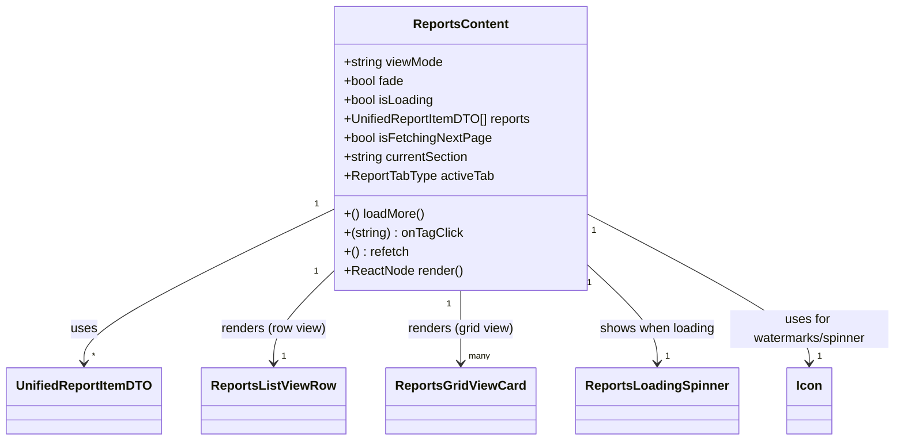

# Diagram: web/portal/src/pages/reports/bi-dashboard-next/components/organisms/Reports.Content.organism.tsx


> Auto-generated by Obscura crawlers

## Diagram 1



### SVG

<svg id="container" width="1099.796875" xmlns="http://www.w3.org/2000/svg" class="classDiagram" height="558" viewBox="0 0 1099.796875 558" role="graphics-document document" aria-roledescription="class"><style>#container{font-family:"trebuchet ms",verdana,arial,sans-serif;font-size:16px;fill:#333;}@keyframes edge-animation-frame{from{stroke-dashoffset:0;}}@keyframes dash{to{stroke-dashoffset:0;}}#container .edge-animation-slow{stroke-dasharray:9,5!important;stroke-dashoffset:900;animation:dash 50s linear infinite;stroke-linecap:round;}#container .edge-animation-fast{stroke-dasharray:9,5!important;stroke-dashoffset:900;animation:dash 20s linear infinite;stroke-linecap:round;}#container .error-icon{fill:#552222;}#container .error-text{fill:#552222;stroke:#552222;}#container .edge-thickness-normal{stroke-width:1px;}#container .edge-thickness-thick{stroke-width:3.5px;}#container .edge-pattern-solid{stroke-dasharray:0;}#container .edge-thickness-invisible{stroke-width:0;fill:none;}#container .edge-pattern-dashed{stroke-dasharray:3;}#container .edge-pattern-dotted{stroke-dasharray:2;}#container .marker{fill:#333333;stroke:#333333;}#container .marker.cross{stroke:#333333;}#container svg{font-family:"trebuchet ms",verdana,arial,sans-serif;font-size:16px;}#container p{margin:0;}#container g.classGroup text{fill:#9370DB;stroke:none;font-family:"trebuchet ms",verdana,arial,sans-serif;font-size:10px;}#container g.classGroup text .title{font-weight:bolder;}#container .nodeLabel,#container .edgeLabel{color:#131300;}#container .edgeLabel .label rect{fill:#ECECFF;}#container .label text{fill:#131300;}#container .labelBkg{background:#ECECFF;}#container .edgeLabel .label span{background:#ECECFF;}#container .classTitle{font-weight:bolder;}#container .node rect,#container .node circle,#container .node ellipse,#container .node polygon,#container .node path{fill:#ECECFF;stroke:#9370DB;stroke-width:1px;}#container .divider{stroke:#9370DB;stroke-width:1;}#container g.clickable{cursor:pointer;}#container g.classGroup rect{fill:#ECECFF;stroke:#9370DB;}#container g.classGroup line{stroke:#9370DB;stroke-width:1;}#container .classLabel .box{stroke:none;stroke-width:0;fill:#ECECFF;opacity:0.5;}#container .classLabel .label{fill:#9370DB;font-size:10px;}#container .relation{stroke:#333333;stroke-width:1;fill:none;}#container .dashed-line{stroke-dasharray:3;}#container .dotted-line{stroke-dasharray:1 2;}#container #compositionStart,#container .composition{fill:#333333!important;stroke:#333333!important;stroke-width:1;}#container #compositionEnd,#container .composition{fill:#333333!important;stroke:#333333!important;stroke-width:1;}#container #dependencyStart,#container .dependency{fill:#333333!important;stroke:#333333!important;stroke-width:1;}#container #dependencyStart,#container .dependency{fill:#333333!important;stroke:#333333!important;stroke-width:1;}#container #extensionStart,#container .extension{fill:transparent!important;stroke:#333333!important;stroke-width:1;}#container #extensionEnd,#container .extension{fill:transparent!important;stroke:#333333!important;stroke-width:1;}#container #aggregationStart,#container .aggregation{fill:transparent!important;stroke:#333333!important;stroke-width:1;}#container #aggregationEnd,#container .aggregation{fill:transparent!important;stroke:#333333!important;stroke-width:1;}#container #lollipopStart,#container .lollipop{fill:#ECECFF!important;stroke:#333333!important;stroke-width:1;}#container #lollipopEnd,#container .lollipop{fill:#ECECFF!important;stroke:#333333!important;stroke-width:1;}#container .edgeTerminals{font-size:11px;line-height:initial;}#container .classTitleText{text-anchor:middle;font-size:18px;fill:#333;}#container .label-icon{display:inline-block;height:1em;overflow:visible;vertical-align:-0.125em;}#container .node .label-icon path{fill:currentColor;stroke:revert;stroke-width:revert;}#container :root{--mermaid-font-family:"trebuchet ms",verdana,arial,sans-serif;}</style><g><defs><marker id="container_class-aggregationStart" class="marker aggregation class" refX="18" refY="7" markerWidth="190" markerHeight="240" orient="auto"><path d="M 18,7 L9,13 L1,7 L9,1 Z"></path></marker></defs><defs><marker id="container_class-aggregationEnd" class="marker aggregation class" refX="1" refY="7" markerWidth="20" markerHeight="28" orient="auto"><path d="M 18,7 L9,13 L1,7 L9,1 Z"></path></marker></defs><defs><marker id="container_class-extensionStart" class="marker extension class" refX="18" refY="7" markerWidth="190" markerHeight="240" orient="auto"><path d="M 1,7 L18,13 V 1 Z"></path></marker></defs><defs><marker id="container_class-extensionEnd" class="marker extension class" refX="1" refY="7" markerWidth="20" markerHeight="28" orient="auto"><path d="M 1,1 V 13 L18,7 Z"></path></marker></defs><defs><marker id="container_class-compositionStart" class="marker composition class" refX="18" refY="7" markerWidth="190" markerHeight="240" orient="auto"><path d="M 18,7 L9,13 L1,7 L9,1 Z"></path></marker></defs><defs><marker id="container_class-compositionEnd" class="marker composition class" refX="1" refY="7" markerWidth="20" markerHeight="28" orient="auto"><path d="M 18,7 L9,13 L1,7 L9,1 Z"></path></marker></defs><defs><marker id="container_class-dependencyStart" class="marker dependency class" refX="6" refY="7" markerWidth="190" markerHeight="240" orient="auto"><path d="M 5,7 L9,13 L1,7 L9,1 Z"></path></marker></defs><defs><marker id="container_class-dependencyEnd" class="marker dependency class" refX="13" refY="7" markerWidth="20" markerHeight="28" orient="auto"><path d="M 18,7 L9,13 L14,7 L9,1 Z"></path></marker></defs><defs><marker id="container_class-lollipopStart" class="marker lollipop class" refX="13" refY="7" markerWidth="190" markerHeight="240" orient="auto"><circle stroke="black" fill="transparent" cx="7" cy="7" r="6"></circle></marker></defs><defs><marker id="container_class-lollipopEnd" class="marker lollipop class" refX="1" refY="7" markerWidth="190" markerHeight="240" orient="auto"><circle stroke="black" fill="transparent" cx="7" cy="7" r="6"></circle></marker></defs><g class="root"><g class="clusters"></g><g class="edgePaths"><path d="M400.441,267.767L350.706,292.639C300.971,317.511,201.501,367.256,151.766,399.294C102.031,431.333,102.031,445.667,102.031,452.833L102.031,460" id="id_ReportsContent_UnifiedReportItemDTO_1" class="edge-thickness-normal edge-pattern-solid relation" style=";;;" data-edge="true" data-et="edge" data-id="id_ReportsContent_UnifiedReportItemDTO_1" data-points="W3sieCI6NDAwLjQ0MTQwNjI1LCJ5IjoyNjcuNzY2OTIwMzA3NzgxNTZ9LHsieCI6MTAyLjAzMTI1LCJ5Ijo0MTd9LHsieCI6MTAyLjAzMTI1LCJ5Ijo0NjZ9XQ==" marker-end="url(#container_class-dependencyEnd)"></path><path d="M400.441,348.893L389.188,360.244C377.935,371.595,355.428,394.298,344.175,412.815C332.922,431.333,332.922,445.667,332.922,452.833L332.922,460" id="id_ReportsContent_ReportsListViewRow_2" class="edge-thickness-normal edge-pattern-solid relation" style=";;;" data-edge="true" data-et="edge" data-id="id_ReportsContent_ReportsListViewRow_2" data-points="W3sieCI6NDAwLjQ0MTQwNjI1LCJ5IjozNDguODkyNjE1MDI0NjA1MX0seyJ4IjozMzIuOTIxODc1LCJ5Ijo0MTd9LHsieCI6MzMyLjkyMTg3NSwieSI6NDY2fV0=" marker-end="url(#container_class-dependencyEnd)"></path><path d="M559.945,368L559.945,376.167C559.945,384.333,559.945,400.667,559.945,416C559.945,431.333,559.945,445.667,559.945,452.833L559.945,460" id="id_ReportsContent_ReportsGridViewCard_3" class="edge-thickness-normal edge-pattern-solid relation" style=";;;" data-edge="true" data-et="edge" data-id="id_ReportsContent_ReportsGridViewCard_3" data-points="W3sieCI6NTU5Ljk0NTMxMjUsInkiOjM2OH0seyJ4Ijo1NTkuOTQ1MzEyNSwieSI6NDE3fSx7IngiOjU1OS45NDUzMTI1LCJ5Ijo0NjZ9XQ==" marker-end="url(#container_class-dependencyEnd)"></path><path d="M719.449,341.196L732.604,353.83C745.758,366.464,772.066,391.732,785.221,411.533C798.375,431.333,798.375,445.667,798.375,452.833L798.375,460" id="id_ReportsContent_ReportsLoadingSpinner_4" class="edge-thickness-normal edge-pattern-solid relation" style=";;;" data-edge="true" data-et="edge" data-id="id_ReportsContent_ReportsLoadingSpinner_4" data-points="W3sieCI6NzE5LjQ0OTIxODc1LCJ5IjozNDEuMTk1NjY0OTk1NTc2NX0seyJ4Ijo3OTguMzc1LCJ5Ijo0MTd9LHsieCI6Nzk4LjM3NSwieSI6NDY2fV0=" marker-end="url(#container_class-dependencyEnd)"></path><path d="M719.449,272.581L764.84,296.651C810.232,320.721,901.014,368.86,946.406,400.097C991.797,431.333,991.797,445.667,991.797,452.833L991.797,460" id="id_ReportsContent_Icon_5" class="edge-thickness-normal edge-pattern-solid relation" style=";;;" data-edge="true" data-et="edge" data-id="id_ReportsContent_Icon_5" data-points="W3sieCI6NzE5LjQ0OTIxODc1LCJ5IjoyNzIuNTgwOTAxNjQwODI3MX0seyJ4Ijo5OTEuNzk2ODc1LCJ5Ijo0MTd9LHsieCI6OTkxLjc5Njg3NSwieSI6NDY2fV0=" marker-end="url(#container_class-dependencyEnd)"></path></g><g class="edgeLabels"><g class="edgeLabel" transform="translate(102.03125, 417)"><g class="label" data-id="id_ReportsContent_UnifiedReportItemDTO_1" transform="translate(-16.4921875, -12)"><foreignObject width="32.984375" height="24"><div xmlns="http://www.w3.org/1999/xhtml" class="labelBkg" style="display: table-cell; white-space: nowrap; line-height: 1.5; max-width: 200px; text-align: center;"><span class="edgeLabel"><p>uses</p></span></div></foreignObject></g></g><g class="edgeLabel" transform="translate(332.921875, 417)"><g class="label" data-id="id_ReportsContent_ReportsListViewRow_2" transform="translate(-66.71875, -12)"><foreignObject width="133.4375" height="24"><div xmlns="http://www.w3.org/1999/xhtml" class="labelBkg" style="display: table-cell; white-space: nowrap; line-height: 1.5; max-width: 200px; text-align: center;"><span class="edgeLabel"><p>renders (row view)</p></span></div></foreignObject></g></g><g class="edgeLabel" transform="translate(559.9453125, 417)"><g class="label" data-id="id_ReportsContent_ReportsGridViewCard_3" transform="translate(-67.75, -12)"><foreignObject width="135.5" height="24"><div xmlns="http://www.w3.org/1999/xhtml" class="labelBkg" style="display: table-cell; white-space: nowrap; line-height: 1.5; max-width: 200px; text-align: center;"><span class="edgeLabel"><p>renders (grid view)</p></span></div></foreignObject></g></g><g class="edgeLabel" transform="translate(798.375, 417)"><g class="label" data-id="id_ReportsContent_ReportsLoadingSpinner_4" transform="translate(-73.421875, -12)"><foreignObject width="146.84375" height="24"><div xmlns="http://www.w3.org/1999/xhtml" class="labelBkg" style="display: table-cell; white-space: nowrap; line-height: 1.5; max-width: 200px; text-align: center;"><span class="edgeLabel"><p>shows when loading</p></span></div></foreignObject></g></g><g class="edgeLabel" transform="translate(991.796875, 417)"><g class="label" data-id="id_ReportsContent_Icon_5" transform="translate(-100, -24)"><foreignObject width="200" height="48"><div xmlns="http://www.w3.org/1999/xhtml" class="labelBkg" style="display: table; white-space: break-spaces; line-height: 1.5; max-width: 200px; text-align: center; width: 200px;"><span class="edgeLabel"><p>uses for watermarks/spinner</p></span></div></foreignObject></g></g><g class="edgeTerminals" transform="translate(378.08030567416324, 262.1784315954443)"><g class="inner" transform="translate(0, 0)"><foreignObject style="width: 9px; height: 12px;"><div xmlns="http://www.w3.org/1999/xhtml" style="display: inline-block; padding-right: 1px; white-space: nowrap;"><span class="edgeLabel">1</span></div></foreignObject></g></g><g class="edgeTerminals" transform="translate(377.4683134553618, 350.7599730079303)"><g class="inner" transform="translate(0, 0)"><foreignObject style="width: 9px; height: 12px;"><div xmlns="http://www.w3.org/1999/xhtml" style="display: inline-block; padding-right: 1px; white-space: nowrap;"><span class="edgeLabel">1</span></div></foreignObject></g></g><g class="edgeTerminals" transform="translate(544.94531125, 385.4999989285714)"><g class="inner" transform="translate(0, 0)"><foreignObject style="width: 9px; height: 12px;"><div xmlns="http://www.w3.org/1999/xhtml" style="display: inline-block; padding-right: 1px; white-space: nowrap;"><span class="edgeLabel">1</span></div></foreignObject></g></g><g class="edgeTerminals" transform="translate(721.6801394855966, 364.13630577352086)"><g class="inner" transform="translate(0, 0)"><foreignObject style="width: 9px; height: 12px;"><div xmlns="http://www.w3.org/1999/xhtml" style="display: inline-block; padding-right: 1px; white-space: nowrap;"><span class="edgeLabel">1</span></div></foreignObject></g></g><g class="edgeTerminals" transform="translate(727.8827370708133, 294.03144227220673)"><g class="inner" transform="translate(0, 0)"><foreignObject style="width: 9px; height: 12px;"><div xmlns="http://www.w3.org/1999/xhtml" style="display: inline-block; padding-right: 1px; white-space: nowrap;"><span class="edgeLabel">1</span></div></foreignObject></g></g><g class="edgeTerminals" transform="translate(112.03125, 443.5)"><g class="inner" transform="translate(0, 0)"></g><foreignObject style="width: 9px; height: 12px;"><div xmlns="http://www.w3.org/1999/xhtml" style="display: inline-block; padding-right: 1px; white-space: nowrap;"><span class="edgeLabel">*</span></div></foreignObject></g><g class="edgeTerminals" transform="translate(342.9218774999998, 443.5000021428571)"><g class="inner" transform="translate(0, 0)"></g><foreignObject style="width: 9px; height: 12px;"><div xmlns="http://www.w3.org/1999/xhtml" style="display: inline-block; padding-right: 1px; white-space: nowrap;"><span class="edgeLabel">1</span></div></foreignObject></g><g class="edgeTerminals" transform="translate(569.94531125, 443.4999989285714)"><g class="inner" transform="translate(0, 0)"></g><foreignObject style="width: 36px; height: 12px;"><div xmlns="http://www.w3.org/1999/xhtml" style="display: inline-block; padding-right: 1px; white-space: nowrap;"><span class="edgeLabel">many</span></div></foreignObject></g><g class="edgeTerminals" transform="translate(808.375, 443.5)"><g class="inner" transform="translate(0, 0)"></g><foreignObject style="width: 9px; height: 12px;"><div xmlns="http://www.w3.org/1999/xhtml" style="display: inline-block; padding-right: 1px; white-space: nowrap;"><span class="edgeLabel">1</span></div></foreignObject></g><g class="edgeTerminals" transform="translate(1001.7968774999998, 443.5000021428571)"><g class="inner" transform="translate(0, 0)"></g><foreignObject style="width: 9px; height: 12px;"><div xmlns="http://www.w3.org/1999/xhtml" style="display: inline-block; padding-right: 1px; white-space: nowrap;"><span class="edgeLabel">1</span></div></foreignObject></g></g><g class="nodes"><g class="node default" id="classId-ReportsContent-0" transform="translate(559.9453125, 188)"><g class="basic label-container"><path d="M-159.50390625 -180 L159.50390625 -180 L159.50390625 180 L-159.50390625 180" stroke="none" stroke-width="0" fill="#ECECFF" style=""></path><path d="M-159.50390625 -180 C-49.24601363318369 -180, 61.01187898363261 -180, 159.50390625 -180 M-159.50390625 -180 C-45.979928188944 -180, 67.544049872112 -180, 159.50390625 -180 M159.50390625 -180 C159.50390625 -45.3532809494223, 159.50390625 89.2934381011554, 159.50390625 180 M159.50390625 -180 C159.50390625 -39.60344141481178, 159.50390625 100.79311717037643, 159.50390625 180 M159.50390625 180 C87.28232963032079 180, 15.060753010641577 180, -159.50390625 180 M159.50390625 180 C37.36103606307631 180, -84.78183412384737 180, -159.50390625 180 M-159.50390625 180 C-159.50390625 39.539632341016755, -159.50390625 -100.92073531796649, -159.50390625 -180 M-159.50390625 180 C-159.50390625 37.88015233322031, -159.50390625 -104.23969533355938, -159.50390625 -180" stroke="#9370DB" stroke-width="1.3" fill="none" stroke-dasharray="0 0" style=""></path></g><g class="annotation-group text" transform="translate(0, -156)"></g><g class="label-group text" transform="translate(-57.6328125, -156)"><g class="label" style="font-weight: bolder" transform="translate(0,-12)"><foreignObject width="115.265625" height="24"><div xmlns="http://www.w3.org/1999/xhtml" style="display: table-cell; white-space: nowrap; line-height: 1.5; max-width: 163px; text-align: center;"><span class="nodeLabel markdown-node-label" style=""><p>ReportsContent</p></span></div></foreignObject></g></g><g class="members-group text" transform="translate(-147.50390625, -108)"><g class="label" style="" transform="translate(0,-12)"><foreignObject width="126.515625" height="24"><div xmlns="http://www.w3.org/1999/xhtml" style="display: table-cell; white-space: nowrap; line-height: 1.5; max-width: 184px; text-align: center;"><span class="nodeLabel markdown-node-label" style=""><p>+string viewMode</p></span></div></foreignObject></g><g class="label" style="" transform="translate(0,12)"><foreignObject width="77.109375" height="24"><div xmlns="http://www.w3.org/1999/xhtml" style="display: table-cell; white-space: nowrap; line-height: 1.5; max-width: 134px; text-align: center;"><span class="nodeLabel markdown-node-label" style=""><p>+bool fade</p></span></div></foreignObject></g><g class="label" style="" transform="translate(0,36)"><foreignObject width="114.328125" height="24"><div xmlns="http://www.w3.org/1999/xhtml" style="display: table-cell; white-space: nowrap; line-height: 1.5; max-width: 172px; text-align: center;"><span class="nodeLabel markdown-node-label" style=""><p>+bool isLoading</p></span></div></foreignObject></g><g class="label" style="" transform="translate(0,60)"><foreignObject width="237.375" height="24"><div xmlns="http://www.w3.org/1999/xhtml" style="display: table-cell; white-space: nowrap; line-height: 1.5; max-width: 295px; text-align: center;"><span class="nodeLabel markdown-node-label" style=""><p>+UnifiedReportItemDTO[] reports</p></span></div></foreignObject></g><g class="label" style="" transform="translate(0,84)"><foreignObject width="184.671875" height="24"><div xmlns="http://www.w3.org/1999/xhtml" style="display: table-cell; white-space: nowrap; line-height: 1.5; max-width: 242px; text-align: center;"><span class="nodeLabel markdown-node-label" style=""><p>+bool isFetchingNextPage</p></span></div></foreignObject></g><g class="label" style="" transform="translate(0,108)"><foreignObject width="160.5" height="24"><div xmlns="http://www.w3.org/1999/xhtml" style="display: table-cell; white-space: nowrap; line-height: 1.5; max-width: 218px; text-align: center;"><span class="nodeLabel markdown-node-label" style=""><p>+string currentSection</p></span></div></foreignObject></g><g class="label" style="" transform="translate(0,132)"><foreignObject width="189.453125" height="24"><div xmlns="http://www.w3.org/1999/xhtml" style="display: table-cell; white-space: nowrap; line-height: 1.5; max-width: 247px; text-align: center;"><span class="nodeLabel markdown-node-label" style=""><p>+ReportTabType activeTab</p></span></div></foreignObject></g></g><g class="methods-group text" transform="translate(-147.50390625, 84)"><g class="label" style="" transform="translate(0,-12)"><foreignObject width="101.234375" height="24"><div xmlns="http://www.w3.org/1999/xhtml" style="display: table-cell; white-space: nowrap; line-height: 1.5; max-width: 159px; text-align: center;"><span class="nodeLabel markdown-node-label" style=""><p>+() loadMore()</p></span></div></foreignObject></g><g class="label" style="" transform="translate(0,12)"><foreignObject width="149.203125" height="24"><div xmlns="http://www.w3.org/1999/xhtml" style="display: table-cell; white-space: nowrap; line-height: 1.5; max-width: 200px; text-align: center;"><span class="nodeLabel markdown-node-label" style=""><p>+(string) : onTagClick</p></span></div></foreignObject></g><g class="label" style="" transform="translate(0,36)"><foreignObject width="81.578125" height="24"><div xmlns="http://www.w3.org/1999/xhtml" style="display: table-cell; white-space: nowrap; line-height: 1.5; max-width: 132px; text-align: center;"><span class="nodeLabel markdown-node-label" style=""><p>+() : refetch</p></span></div></foreignObject></g><g class="label" style="" transform="translate(0,60)"><foreignObject width="149.546875" height="24"><div xmlns="http://www.w3.org/1999/xhtml" style="display: table-cell; white-space: nowrap; line-height: 1.5; max-width: 207px; text-align: center;"><span class="nodeLabel markdown-node-label" style=""><p>+ReactNode render()</p></span></div></foreignObject></g></g><g class="divider" style=""><path d="M-159.50390625 -132 C-53.52560951354782 -132, 52.45268722290436 -132, 159.50390625 -132 M-159.50390625 -132 C-37.33620131287232 -132, 84.83150362425536 -132, 159.50390625 -132" stroke="#9370DB" stroke-width="1.3" fill="none" stroke-dasharray="0 0" style=""></path></g><g class="divider" style=""><path d="M-159.50390625 60 C-93.46308022427885 60, -27.42225419855771 60, 159.50390625 60 M-159.50390625 60 C-70.20118596638964 60, 19.10153431722071 60, 159.50390625 60" stroke="#9370DB" stroke-width="1.3" fill="none" stroke-dasharray="0 0" style=""></path></g></g><g class="node default" id="classId-UnifiedReportItemDTO-1" transform="translate(102.03125, 508)"><g class="basic label-container"><path d="M-94.03125 -42 L94.03125 -42 L94.03125 42 L-94.03125 42" stroke="none" stroke-width="0" fill="#ECECFF" style=""></path><path d="M-94.03125 -42 C-35.06519835013044 -42, 23.900853299739126 -42, 94.03125 -42 M-94.03125 -42 C-26.190094847011295 -42, 41.65106030597741 -42, 94.03125 -42 M94.03125 -42 C94.03125 -15.861146775521334, 94.03125 10.277706448957332, 94.03125 42 M94.03125 -42 C94.03125 -22.747293660957006, 94.03125 -3.494587321914011, 94.03125 42 M94.03125 42 C23.485762323995587 42, -47.059725352008826 42, -94.03125 42 M94.03125 42 C24.923426434585963 42, -44.184397130828074 42, -94.03125 42 M-94.03125 42 C-94.03125 14.47008081737905, -94.03125 -13.059838365241902, -94.03125 -42 M-94.03125 42 C-94.03125 19.207274439148513, -94.03125 -3.585451121702974, -94.03125 -42" stroke="#9370DB" stroke-width="1.3" fill="none" stroke-dasharray="0 0" style=""></path></g><g class="annotation-group text" transform="translate(0, -18)"></g><g class="label-group text" transform="translate(-82.03125, -18)"><g class="label" style="font-weight: bolder" transform="translate(0,-12)"><foreignObject width="164.0625" height="24"><div xmlns="http://www.w3.org/1999/xhtml" style="display: table-cell; white-space: nowrap; line-height: 1.5; max-width: 212px; text-align: center;"><span class="nodeLabel markdown-node-label" style=""><p>UnifiedReportItemDTO</p></span></div></foreignObject></g></g><g class="members-group text" transform="translate(-82.03125, 30)"></g><g class="methods-group text" transform="translate(-82.03125, 60)"></g><g class="divider" style=""><path d="M-94.03125 6 C-45.907999023019016 6, 2.2152519539619675 6, 94.03125 6 M-94.03125 6 C-22.567490080920436 6, 48.89626983815913 6, 94.03125 6" stroke="#9370DB" stroke-width="1.3" fill="none" stroke-dasharray="0 0" style=""></path></g><g class="divider" style=""><path d="M-94.03125 24 C-26.242017806487993 24, 41.54721438702401 24, 94.03125 24 M-94.03125 24 C-27.87339308410634 24, 38.28446383178732 24, 94.03125 24" stroke="#9370DB" stroke-width="1.3" fill="none" stroke-dasharray="0 0" style=""></path></g></g><g class="node default" id="classId-ReportsListViewRow-2" transform="translate(332.921875, 508)"><g class="basic label-container"><path d="M-86.859375 -42 L86.859375 -42 L86.859375 42 L-86.859375 42" stroke="none" stroke-width="0" fill="#ECECFF" style=""></path><path d="M-86.859375 -42 C-36.88597139403525 -42, 13.087432211929496 -42, 86.859375 -42 M-86.859375 -42 C-20.63209911936609 -42, 45.59517676126782 -42, 86.859375 -42 M86.859375 -42 C86.859375 -11.462828931337643, 86.859375 19.074342137324713, 86.859375 42 M86.859375 -42 C86.859375 -14.183487168900736, 86.859375 13.633025662198527, 86.859375 42 M86.859375 42 C36.022070297835214 42, -14.815234404329573 42, -86.859375 42 M86.859375 42 C41.37718008490144 42, -4.1050148301971205 42, -86.859375 42 M-86.859375 42 C-86.859375 8.997500261771819, -86.859375 -24.004999476456362, -86.859375 -42 M-86.859375 42 C-86.859375 20.24018970834778, -86.859375 -1.5196205833044374, -86.859375 -42" stroke="#9370DB" stroke-width="1.3" fill="none" stroke-dasharray="0 0" style=""></path></g><g class="annotation-group text" transform="translate(0, -18)"></g><g class="label-group text" transform="translate(-74.859375, -18)"><g class="label" style="font-weight: bolder" transform="translate(0,-12)"><foreignObject width="149.71875" height="24"><div xmlns="http://www.w3.org/1999/xhtml" style="display: table-cell; white-space: nowrap; line-height: 1.5; max-width: 197px; text-align: center;"><span class="nodeLabel markdown-node-label" style=""><p>ReportsListViewRow</p></span></div></foreignObject></g></g><g class="members-group text" transform="translate(-74.859375, 30)"></g><g class="methods-group text" transform="translate(-74.859375, 60)"></g><g class="divider" style=""><path d="M-86.859375 6 C-52.09981881145416 6, -17.340262622908327 6, 86.859375 6 M-86.859375 6 C-34.210811293438326 6, 18.43775241312335 6, 86.859375 6" stroke="#9370DB" stroke-width="1.3" fill="none" stroke-dasharray="0 0" style=""></path></g><g class="divider" style=""><path d="M-86.859375 24 C-17.641936087390945 24, 51.57550282521811 24, 86.859375 24 M-86.859375 24 C-42.51605376555963 24, 1.8272674688807342 24, 86.859375 24" stroke="#9370DB" stroke-width="1.3" fill="none" stroke-dasharray="0 0" style=""></path></g></g><g class="node default" id="classId-ReportsGridViewCard-3" transform="translate(559.9453125, 508)"><g class="basic label-container"><path d="M-90.1640625 -42 L90.1640625 -42 L90.1640625 42 L-90.1640625 42" stroke="none" stroke-width="0" fill="#ECECFF" style=""></path><path d="M-90.1640625 -42 C-44.16760704534311 -42, 1.8288484093137782 -42, 90.1640625 -42 M-90.1640625 -42 C-23.107156510898847 -42, 43.94974947820231 -42, 90.1640625 -42 M90.1640625 -42 C90.1640625 -13.225692296372788, 90.1640625 15.548615407254424, 90.1640625 42 M90.1640625 -42 C90.1640625 -10.211014764843174, 90.1640625 21.57797047031365, 90.1640625 42 M90.1640625 42 C36.72587423400828 42, -16.71231403198344 42, -90.1640625 42 M90.1640625 42 C20.590338034991845 42, -48.98338643001631 42, -90.1640625 42 M-90.1640625 42 C-90.1640625 19.260658746763475, -90.1640625 -3.4786825064730493, -90.1640625 -42 M-90.1640625 42 C-90.1640625 13.956843039271352, -90.1640625 -14.086313921457297, -90.1640625 -42" stroke="#9370DB" stroke-width="1.3" fill="none" stroke-dasharray="0 0" style=""></path></g><g class="annotation-group text" transform="translate(0, -18)"></g><g class="label-group text" transform="translate(-78.1640625, -18)"><g class="label" style="font-weight: bolder" transform="translate(0,-12)"><foreignObject width="156.328125" height="24"><div xmlns="http://www.w3.org/1999/xhtml" style="display: table-cell; white-space: nowrap; line-height: 1.5; max-width: 203px; text-align: center;"><span class="nodeLabel markdown-node-label" style=""><p>ReportsGridViewCard</p></span></div></foreignObject></g></g><g class="members-group text" transform="translate(-78.1640625, 30)"></g><g class="methods-group text" transform="translate(-78.1640625, 60)"></g><g class="divider" style=""><path d="M-90.1640625 6 C-36.565737083212305 6, 17.03258833357539 6, 90.1640625 6 M-90.1640625 6 C-19.59426001695762 6, 50.97554246608476 6, 90.1640625 6" stroke="#9370DB" stroke-width="1.3" fill="none" stroke-dasharray="0 0" style=""></path></g><g class="divider" style=""><path d="M-90.1640625 24 C-39.506589278130335 24, 11.15088394373933 24, 90.1640625 24 M-90.1640625 24 C-41.23810141881035 24, 7.687859662379296 24, 90.1640625 24" stroke="#9370DB" stroke-width="1.3" fill="none" stroke-dasharray="0 0" style=""></path></g></g><g class="node default" id="classId-ReportsLoadingSpinner-4" transform="translate(798.375, 508)"><g class="basic label-container"><path d="M-98.265625 -42 L98.265625 -42 L98.265625 42 L-98.265625 42" stroke="none" stroke-width="0" fill="#ECECFF" style=""></path><path d="M-98.265625 -42 C-30.549303131268076 -42, 37.16701873746385 -42, 98.265625 -42 M-98.265625 -42 C-57.506402874673284 -42, -16.74718074934657 -42, 98.265625 -42 M98.265625 -42 C98.265625 -17.869465971730527, 98.265625 6.261068056538946, 98.265625 42 M98.265625 -42 C98.265625 -18.07401055278921, 98.265625 5.851978894421578, 98.265625 42 M98.265625 42 C21.05816390416217 42, -56.14929719167566 42, -98.265625 42 M98.265625 42 C54.1365880542704 42, 10.007551108540795 42, -98.265625 42 M-98.265625 42 C-98.265625 21.546208531175385, -98.265625 1.0924170623507692, -98.265625 -42 M-98.265625 42 C-98.265625 15.121245149559158, -98.265625 -11.757509700881684, -98.265625 -42" stroke="#9370DB" stroke-width="1.3" fill="none" stroke-dasharray="0 0" style=""></path></g><g class="annotation-group text" transform="translate(0, -18)"></g><g class="label-group text" transform="translate(-86.265625, -18)"><g class="label" style="font-weight: bolder" transform="translate(0,-12)"><foreignObject width="172.53125" height="24"><div xmlns="http://www.w3.org/1999/xhtml" style="display: table-cell; white-space: nowrap; line-height: 1.5; max-width: 221px; text-align: center;"><span class="nodeLabel markdown-node-label" style=""><p>ReportsLoadingSpinner</p></span></div></foreignObject></g></g><g class="members-group text" transform="translate(-86.265625, 30)"></g><g class="methods-group text" transform="translate(-86.265625, 60)"></g><g class="divider" style=""><path d="M-98.265625 6 C-51.46823901029254 6, -4.670853020585085 6, 98.265625 6 M-98.265625 6 C-25.645873115320228 6, 46.973878769359544 6, 98.265625 6" stroke="#9370DB" stroke-width="1.3" fill="none" stroke-dasharray="0 0" style=""></path></g><g class="divider" style=""><path d="M-98.265625 24 C-28.427652028819068 24, 41.410320942361864 24, 98.265625 24 M-98.265625 24 C-21.59917148249663 24, 55.06728203500674 24, 98.265625 24" stroke="#9370DB" stroke-width="1.3" fill="none" stroke-dasharray="0 0" style=""></path></g></g><g class="node default" id="classId-Icon-5" transform="translate(991.796875, 508)"><g class="basic label-container"><path d="M-27.3046875 -42 L27.3046875 -42 L27.3046875 42 L-27.3046875 42" stroke="none" stroke-width="0" fill="#ECECFF" style=""></path><path d="M-27.3046875 -42 C-12.311976518411596 -42, 2.680734463176808 -42, 27.3046875 -42 M-27.3046875 -42 C-13.753925965334059 -42, -0.2031644306681173 -42, 27.3046875 -42 M27.3046875 -42 C27.3046875 -20.11473570388836, 27.3046875 1.770528592223279, 27.3046875 42 M27.3046875 -42 C27.3046875 -14.61266570094364, 27.3046875 12.774668598112719, 27.3046875 42 M27.3046875 42 C6.97442445206562 42, -13.35583859586876 42, -27.3046875 42 M27.3046875 42 C10.753442950107818 42, -5.797801599784364 42, -27.3046875 42 M-27.3046875 42 C-27.3046875 13.873982966771038, -27.3046875 -14.252034066457924, -27.3046875 -42 M-27.3046875 42 C-27.3046875 13.238114188357219, -27.3046875 -15.523771623285562, -27.3046875 -42" stroke="#9370DB" stroke-width="1.3" fill="none" stroke-dasharray="0 0" style=""></path></g><g class="annotation-group text" transform="translate(0, -18)"></g><g class="label-group text" transform="translate(-15.3046875, -18)"><g class="label" style="font-weight: bolder" transform="translate(0,-12)"><foreignObject width="30.609375" height="24"><div xmlns="http://www.w3.org/1999/xhtml" style="display: table-cell; white-space: nowrap; line-height: 1.5; max-width: 81px; text-align: center;"><span class="nodeLabel markdown-node-label" style=""><p>Icon</p></span></div></foreignObject></g></g><g class="members-group text" transform="translate(-15.3046875, 30)"></g><g class="methods-group text" transform="translate(-15.3046875, 60)"></g><g class="divider" style=""><path d="M-27.3046875 6 C-11.591607996724576 6, 4.121471506550847 6, 27.3046875 6 M-27.3046875 6 C-13.023337753888205 6, 1.2580119922235902 6, 27.3046875 6" stroke="#9370DB" stroke-width="1.3" fill="none" stroke-dasharray="0 0" style=""></path></g><g class="divider" style=""><path d="M-27.3046875 24 C-9.806952975468558 24, 7.6907815490628835 24, 27.3046875 24 M-27.3046875 24 C-13.596707311995242 24, 0.11127287600951519 24, 27.3046875 24" stroke="#9370DB" stroke-width="1.3" fill="none" stroke-dasharray="0 0" style=""></path></g></g></g></g></g></svg>

## Diagram 2

```mermaid
flowchart LR
Start([Start: ReportsContent render]) --> CheckLoading{isLoading?}
CheckLoading -- yes --> LoadingSpinner[ReportsLoadingSpinner\n"Loading reports..."]
LoadingSpinner --> End1([End])
CheckLoading -- no --> CheckEmpty{reports.length == 0?}
CheckEmpty -- yes --> EmptyView[No-reports message\nIcon watermark + message]
EmptyView --> ChoiceTab{activeTab == MY?}
ChoiceTab -- yes --> CreateReportButton[Create Report button -> /report_builder]
ChoiceTab -- no --> SectionSwitch{currentSection}
SectionSwitch -->|favorites| MsgFav["No favorites message"]
SectionSwitch -->|recentlyOpened| MsgRecent["No recent reports message"]
SectionSwitch -->|scheduled| MsgScheduled["No scheduled reports message"]
SectionSwitch -->|openedThisWeek| MsgOpened["No opened this week message"]
SectionSwitch -->|all| MsgAll["No reports match search"]
MsgFav --> End2([End])
MsgRecent --> End2
MsgScheduled --> End2
MsgOpened --> End2
MsgAll --> End2
CheckEmpty -- no --> ViewMode{viewMode == "row"?}
ViewMode -- yes --> Virtuoso[Virtuoso list\nitemContent: ReportsListViewRow\nendReached: loadMore()]
Virtuoso --> FooterCheck{isFetchingNextPage?}
FooterCheck -- yes --> LoadingMore[ReportsLoadingSpinner\n"Loading more reports..."]
FooterCheck -- no --> End3([End])
LoadingMore --> End3
ViewMode -- no --> GridContainer[Grid of ReportsGridViewCard\nonScroll: loadMore when near bottom]
GridContainer --> FetchMoreCheck{isFetchingNextPage?}
FetchMoreCheck -- yes --> SpinnerRow[Icon faSpinner + "Loading more reports..."]
FetchMoreCheck -- no --> End4([End])
```

> SVG rendering failed for this diagram.
