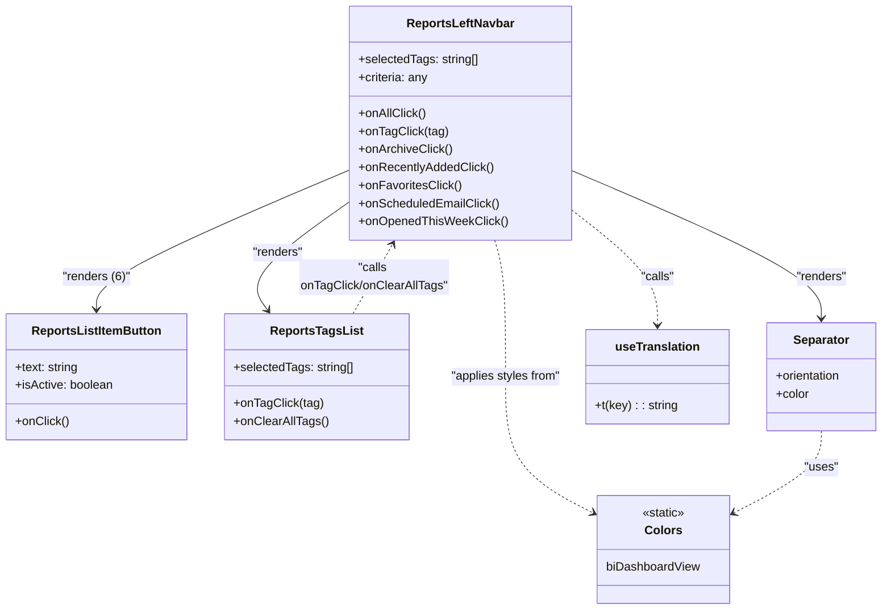

# Diagram: web/portal/src/pages/reports/bi-dashboard-next/components/organisms/Reports.LeftNavbar.organism.tsx

> Auto-generated by Obscura crawlers

## Mermaid

### SVG

<svg id="container" width="1177.4296875" xmlns="http://www.w3.org/2000/svg" class="classDiagram" height="812" viewBox="0 0 1177.4296875 812" role="graphics-document document" aria-roledescription="class"><g><defs><marker id="container_class-aggregationStart" class="marker aggregation class" refX="18" refY="7" markerWidth="190" markerHeight="240" orient="auto"><path d="M 18,7 L9,13 L1,7 L9,1 Z"></path></marker></defs><defs><marker id="container_class-aggregationEnd" class="marker aggregation class" refX="1" refY="7" markerWidth="20" markerHeight="28" orient="auto"><path d="M 18,7 L9,13 L1,7 L9,1 Z"></path></marker></defs><defs><marker id="container_class-extensionStart" class="marker extension class" refX="18" refY="7" markerWidth="190" markerHeight="240" orient="auto"><path d="M 1,7 L18,13 V 1 Z"></path></marker></defs><defs><marker id="container_class-extensionEnd" class="marker extension class" refX="1" refY="7" markerWidth="20" markerHeight="28" orient="auto"><path d="M 1,1 V 13 L18,7 Z"></path></marker></defs><defs><marker id="container_class-compositionStart" class="marker composition class" refX="18" refY="7" markerWidth="190" markerHeight="240" orient="auto"><path d="M 18,7 L9,13 L1,7 L9,1 Z"></path></marker></defs><defs><marker id="container_class-compositionEnd" class="marker composition class" refX="1" refY="7" markerWidth="20" markerHeight="28" orient="auto"><path d="M 18,7 L9,13 L1,7 L9,1 Z"></path></marker></defs><defs><marker id="container_class-dependencyStart" class="marker dependency class" refX="6" refY="7" markerWidth="190" markerHeight="240" orient="auto"><path d="M 5,7 L9,13 L1,7 L9,1 Z"></path></marker></defs><defs><marker id="container_class-dependencyEnd" class="marker dependency class" refX="13" refY="7" markerWidth="20" markerHeight="28" orient="auto"><path d="M 18,7 L9,13 L14,7 L9,1 Z"></path></marker></defs><defs><marker id="container_class-lollipopStart" class="marker lollipop class" refX="13" refY="7" markerWidth="190" markerHeight="240" orient="auto"><circle stroke="black" fill="transparent" cx="7" cy="7" r="6"></circle></marker></defs><defs><marker id="container_class-lollipopEnd" class="marker lollipop class" refX="1" refY="7" markerWidth="190" markerHeight="240" orient="auto"><circle stroke="black" fill="transparent" cx="7" cy="7" r="6"></circle></marker></defs><g class="root"><g class="clusters"></g><g class="edgePaths"><path d="M466.391,225.293L409.874,249.245C353.357,273.196,240.323,321.098,183.806,352.216C127.289,383.333,127.289,397.667,127.289,404.833L127.289,412" id="id_ReportsLeftNavbar_ReportsListItemButton_1" class="edge-thickness-normal edge-pattern-solid relation" style=";;;" data-edge="true" data-et="edge" data-id="id_ReportsLeftNavbar_ReportsListItemButton_1" data-points="W3sieCI6NDY2LjM5MDYyNSwieSI6MjI1LjI5MzQwNDE3OTcyMTU2fSx7IngiOjEyNy4yODkwNjI1LCJ5IjozNjl9LHsieCI6MTI3LjI4OTA2MjUsInkiOjQxOH1d" marker-end="url(#container_class-dependencyEnd)"></path><path d="M466.391,266.804L442.428,283.837C418.465,300.869,370.539,334.935,351.863,359.322C333.187,383.709,343.761,398.419,349.047,405.773L354.334,413.128" id="id_ReportsLeftNavbar_ReportsTagsList_2" class="edge-thickness-normal edge-pattern-solid relation" style=";;;" data-edge="true" data-et="edge" data-id="id_ReportsLeftNavbar_ReportsTagsList_2" data-points="W3sieCI6NDY2LjM5MDYyNSwieSI6MjY2LjgwNDAzMDcxNzk3MTZ9LHsieCI6MzIyLjYxMzI4MTI1LCJ5IjozNjl9LHsieCI6MzU3LjgzNjM0ODY4NDIxMDUsInkiOjQxOH1d" marker-end="url(#container_class-dependencyEnd)"></path><path d="M755.656,225.317L812.143,249.264C868.629,273.211,981.602,321.106,1038.088,354.219C1094.574,387.333,1094.574,405.667,1094.574,414.833L1094.574,424" id="id_ReportsLeftNavbar_Separator_3" class="edge-thickness-normal edge-pattern-solid relation" style=";;;" data-edge="true" data-et="edge" data-id="id_ReportsLeftNavbar_Separator_3" data-points="W3sieCI6NzU1LjY1NjI1LCJ5IjoyMjUuMzE2Njc1OTU2NjY4Mn0seyJ4IjoxMDk0LjU3NDIxODc1LCJ5IjozNjl9LHsieCI6MTA5NC41NzQyMTg3NSwieSI6NDMwfV0=" marker-end="url(#container_class-dependencyEnd)"></path><path d="M755.656,276.172L775.605,291.643C795.553,307.115,835.451,338.057,855.399,364.195C875.348,390.333,875.348,411.667,875.348,422.333L875.348,433" id="id_ReportsLeftNavbar_useTranslation_4" class="edge-thickness-normal edge-pattern-dashed relation" style=";;;" data-edge="true" data-et="edge" data-id="id_ReportsLeftNavbar_useTranslation_4" data-points="W3sieCI6NzU1LjY1NjI1LCJ5IjoyNzYuMTcxODExOTYxNTE3NDV9LHsieCI6ODc1LjM0NzY1NjI1LCJ5IjozNjl9LHsieCI6ODc1LjM0NzY1NjI1LCJ5Ijo0Mzl9XQ==" marker-end="url(#container_class-dependencyEnd)"></path><path d="M656.682,320L659.072,328.167C661.462,336.333,666.243,352.667,668.633,383C671.023,413.333,671.023,457.667,671.023,500C671.023,542.333,671.023,582.667,690.527,612.872C710.031,643.077,749.038,663.154,768.542,673.193L788.046,683.231" id="id_ReportsLeftNavbar_Colors_5" class="edge-thickness-normal edge-pattern-dashed relation" style=";;;" data-edge="true" data-et="edge" data-id="id_ReportsLeftNavbar_Colors_5" data-points="W3sieCI6NjU2LjY4MTk3NDA4NTM2NTgsInkiOjMyMH0seyJ4Ijo2NzEuMDIzNDM3NSwieSI6MzY5fSx7IngiOjY3MS4wMjM0Mzc1LCJ5Ijo1MDJ9LHsieCI6NjcxLjAyMzQzNzUsInkiOjYyM30seyJ4Ijo3OTMuMzgwODU5Mzc1LCJ5Ijo2ODUuOTc2OTA2NTQ3MTQxNH1d" marker-end="url(#container_class-dependencyEnd)"></path><path d="M1094.574,574L1094.574,582.167C1094.574,590.333,1094.574,606.667,1075.07,624.872C1055.567,643.077,1016.559,663.154,997.055,673.193L977.552,683.231" id="id_Separator_Colors_6" class="edge-thickness-normal edge-pattern-dashed relation" style=";;;" data-edge="true" data-et="edge" data-id="id_Separator_Colors_6" data-points="W3sieCI6MTA5NC41NzQyMTg3NSwieSI6NTc0fSx7IngiOjEwOTQuNTc0MjE4NzUsInkiOjYyM30seyJ4Ijo5NzIuMjE2Nzk2ODc1LCJ5Ijo2ODUuOTc2OTA2NTQ3MTQxNH1d" marker-end="url(#container_class-dependencyEnd)"></path><path d="M466.855,418L471.584,409.833C476.312,401.667,485.769,385.333,494.619,369.871C503.469,354.408,511.711,339.816,515.833,332.52L519.954,325.224" id="id_ReportsTagsList_ReportsLeftNavbar_7" class="edge-thickness-normal edge-pattern-dashed relation" style=";;;" data-edge="true" data-et="edge" data-id="id_ReportsTagsList_ReportsLeftNavbar_7" data-points="W3sieCI6NDY2Ljg1NTI2MzE1Nzg5NDc0LCJ5Ijo0MTh9LHsieCI6NDk1LjIyNjU2MjUsInkiOjM2OX0seyJ4Ijo1MjIuOTA0ODM5OTM5MDI0NCwieSI6MzIwfV0=" marker-end="url(#container_class-dependencyEnd)"></path></g><g class="edgeLabels"><g class="edgeLabel" transform="translate(127.2890625, 369)"><g class="label" data-id="id_ReportsLeftNavbar_ReportsListItemButton_1" transform="translate(-45.703125, -12)"><foreignObject width="91.40625" height="24">

"renders (6)"

</foreignObject></g></g><g class="edgeLabel" transform="translate(369.90853, 335.38285)"><g class="label" data-id="id_ReportsLeftNavbar_ReportsTagsList_2" transform="translate(-34.015625, -12)"><foreignObject width="68.03125" height="24">

"renders"

</foreignObject></g></g><g class="edgeLabel" transform="translate(1094.57421875, 369)"><g class="label" data-id="id_ReportsLeftNavbar_Separator_3" transform="translate(-34.015625, -12)"><foreignObject width="68.03125" height="24">

"renders"

</foreignObject></g></g><g class="edgeLabel" transform="translate(875.34765625, 369)"><g class="label" data-id="id_ReportsLeftNavbar_useTranslation_4" transform="translate(-22.625, -12)"><foreignObject width="45.25" height="24">

"calls"

</foreignObject></g></g><g class="edgeLabel" transform="translate(671.0234375, 502)"><g class="label" data-id="id_ReportsLeftNavbar_Colors_5" transform="translate(-74.953125, -12)"><foreignObject width="149.90625" height="24">

"applies styles from"

</foreignObject></g></g><g class="edgeLabel" transform="translate(1094.57421875, 623)"><g class="label" data-id="id_Separator_Colors_6" transform="translate(-22.7578125, -12)"><foreignObject width="45.515625" height="24">

"uses"

</foreignObject></g></g><g class="edgeLabel" transform="translate(495.2265625, 369)"><g class="label" data-id="id_ReportsTagsList_ReportsLeftNavbar_7" transform="translate(-100, -24)"><foreignObject width="200" height="48">

"calls onTagClick/onClearAllTags"

</foreignObject></g></g></g><g class="nodes"><g class="node default" id="classId-ReportsLeftNavbar-0" transform="translate(611.0234375, 164)"><g class="basic label-container"><path d="M-144.6328125 -156 L144.6328125 -156 L144.6328125 156 L-144.6328125 156" stroke="none" stroke-width="0" fill="#ECECFF" style=""></path><path d="M-144.6328125 -156 C-41.23996191597034 -156, 62.15288866805932 -156, 144.6328125 -156 M-144.6328125 -156 C-57.41836112525861 -156, 29.796090249482774 -156, 144.6328125 -156 M144.6328125 -156 C144.6328125 -35.010356944606144, 144.6328125 85.97928611078771, 144.6328125 156 M144.6328125 -156 C144.6328125 -45.42795450352449, 144.6328125 65.14409099295102, 144.6328125 156 M144.6328125 156 C52.86878182440232 156, -38.89524885119536 156, -144.6328125 156 M144.6328125 156 C72.38167084990536 156, 0.13052919981072364 156, -144.6328125 156 M-144.6328125 156 C-144.6328125 34.33172410701037, -144.6328125 -87.33655178597925, -144.6328125 -156 M-144.6328125 156 C-144.6328125 77.39524618424802, -144.6328125 -1.2095076315039535, -144.6328125 -156" stroke="#9370DB" stroke-width="1.3" fill="none" stroke-dasharray="0 0" style=""></path></g><g class="annotation-group text" transform="translate(0, -132)"></g><g class="label-group text" transform="translate(-69.0625, -132)"><g class="label" style="font-weight: bolder" transform="translate(0,-12)"><foreignObject width="138.125" height="24">

ReportsLeftNavbar

</foreignObject></g></g><g class="members-group text" transform="translate(-132.6328125, -84)"><g class="label" style="" transform="translate(0,-12)"><foreignObject width="160.703125" height="24">

+selectedTags: string[]

</foreignObject></g><g class="label" style="" transform="translate(0,12)"><foreignObject width="93.890625" height="24">

+criteria: any

</foreignObject></g></g><g class="methods-group text" transform="translate(-132.6328125, -12)"><g class="label" style="" transform="translate(0,-12)"><foreignObject width="89.46875" height="24">

+onAllClick()

</foreignObject></g><g class="label" style="" transform="translate(0,12)"><foreignObject width="117.78125" height="24">

+onTagClick(tag)

</foreignObject></g><g class="label" style="" transform="translate(0,36)"><foreignObject width="123.84375" height="24">

+onArchiveClick()

</foreignObject></g><g class="label" style="" transform="translate(0,60)"><foreignObject width="179.109375" height="24">

+onRecentlyAddedClick()

</foreignObject></g><g class="label" style="" transform="translate(0,84)"><foreignObject width="135.84375" height="24">

+onFavoritesClick()

</foreignObject></g><g class="label" style="" transform="translate(0,108)"><foreignObject width="187.171875" height="24">

+onScheduledEmailClick()

</foreignObject></g><g class="label" style="" transform="translate(0,132)"><foreignObject width="196.203125" height="24">

+onOpenedThisWeekClick()

</foreignObject></g></g><g class="divider" style=""><path d="M-144.6328125 -108 C-36.33307430800649 -108, 71.96666388398702 -108, 144.6328125 -108 M-144.6328125 -108 C-74.23198039049805 -108, -3.8311482809961035 -108, 144.6328125 -108" stroke="#9370DB" stroke-width="1.3" fill="none" stroke-dasharray="0 0" style=""></path></g><g class="divider" style=""><path d="M-144.6328125 -36 C-60.80707456901925 -36, 23.0186633619615 -36, 144.6328125 -36 M-144.6328125 -36 C-83.42161195338551 -36, -22.210411406771 -36, 144.6328125 -36" stroke="#9370DB" stroke-width="1.3" fill="none" stroke-dasharray="0 0" style=""></path></g></g><g class="node default" id="classId-ReportsListItemButton-1" transform="translate(127.2890625, 502)"><g class="basic label-container"><path d="M-119.2890625 -84 L119.2890625 -84 L119.2890625 84 L-119.2890625 84" stroke="none" stroke-width="0" fill="#ECECFF" style=""></path><path d="M-119.2890625 -84 C-26.4123673169279 -84, 66.4643278661442 -84, 119.2890625 -84 M-119.2890625 -84 C-44.775459472616674 -84, 29.73814355476665 -84, 119.2890625 -84 M119.2890625 -84 C119.2890625 -41.06272545112903, 119.2890625 1.8745490977419337, 119.2890625 84 M119.2890625 -84 C119.2890625 -28.03946426100707, 119.2890625 27.921071477985862, 119.2890625 84 M119.2890625 84 C51.94003364359352 84, -15.408995212812954 84, -119.2890625 84 M119.2890625 84 C67.20758200580981 84, 15.126101511619623 84, -119.2890625 84 M-119.2890625 84 C-119.2890625 32.20674156680276, -119.2890625 -19.586516866394476, -119.2890625 -84 M-119.2890625 84 C-119.2890625 27.546506151150062, -119.2890625 -28.906987697699876, -119.2890625 -84" stroke="#9370DB" stroke-width="1.3" fill="none" stroke-dasharray="0 0" style=""></path></g><g class="annotation-group text" transform="translate(0, -60)"></g><g class="label-group text" transform="translate(-83.453125, -60)"><g class="label" style="font-weight: bolder" transform="translate(0,-12)"><foreignObject width="166.90625" height="24">

ReportsListItemButton

</foreignObject></g></g><g class="members-group text" transform="translate(-107.2890625, -12)"><g class="label" style="" transform="translate(0,-12)"><foreignObject width="85.34375" height="24">

+text: string

</foreignObject></g><g class="label" style="" transform="translate(0,12)"><foreignObject width="131.125" height="24">

+isActive: boolean

</foreignObject></g></g><g class="methods-group text" transform="translate(-107.2890625, 60)"><g class="label" style="" transform="translate(0,-12)"><foreignObject width="70.921875" height="24">

+onClick()

</foreignObject></g></g><g class="divider" style=""><path d="M-119.2890625 -36 C-50.50579502994783 -36, 18.277472440104333 -36, 119.2890625 -36 M-119.2890625 -36 C-47.972861961098275 -36, 23.34333857780345 -36, 119.2890625 -36" stroke="#9370DB" stroke-width="1.3" fill="none" stroke-dasharray="0 0" style=""></path></g><g class="divider" style=""><path d="M-119.2890625 36 C-24.489413273874817 36, 70.31023595225037 36, 119.2890625 36 M-119.2890625 36 C-41.760133207377436 36, 35.76879608524513 36, 119.2890625 36" stroke="#9370DB" stroke-width="1.3" fill="none" stroke-dasharray="0 0" style=""></path></g></g><g class="node default" id="classId-ReportsTagsList-2" transform="translate(418.21875, 502)"><g class="basic label-container"><path d="M-121.640625 -84 L121.640625 -84 L121.640625 84 L-121.640625 84" stroke="none" stroke-width="0" fill="#ECECFF" style=""></path><path d="M-121.640625 -84 C-34.861482207715696 -84, 51.91766058456861 -84, 121.640625 -84 M-121.640625 -84 C-64.0538467122501 -84, -6.467068424500226 -84, 121.640625 -84 M121.640625 -84 C121.640625 -36.77650415192464, 121.640625 10.446991696150718, 121.640625 84 M121.640625 -84 C121.640625 -34.966328440273216, 121.640625 14.067343119453568, 121.640625 84 M121.640625 84 C41.330878275941984 84, -38.97886844811603 84, -121.640625 84 M121.640625 84 C63.8848561991942 84, 6.129087398388407 84, -121.640625 84 M-121.640625 84 C-121.640625 29.878462431430073, -121.640625 -24.243075137139854, -121.640625 -84 M-121.640625 84 C-121.640625 20.56735725194344, -121.640625 -42.86528549611312, -121.640625 -84" stroke="#9370DB" stroke-width="1.3" fill="none" stroke-dasharray="0 0" style=""></path></g><g class="annotation-group text" transform="translate(0, -60)"></g><g class="label-group text" transform="translate(-58.578125, -60)"><g class="label" style="font-weight: bolder" transform="translate(0,-12)"><foreignObject width="117.15625" height="24">

ReportsTagsList

</foreignObject></g></g><g class="members-group text" transform="translate(-109.640625, -12)"><g class="label" style="" transform="translate(0,-12)"><foreignObject width="160.703125" height="24">

+selectedTags: string[]

</foreignObject></g></g><g class="methods-group text" transform="translate(-109.640625, 36)"><g class="label" style="" transform="translate(0,-12)"><foreignObject width="117.78125" height="24">

+onTagClick(tag)

</foreignObject></g><g class="label" style="" transform="translate(0,12)"><foreignObject width="124.171875" height="24">

+onClearAllTags()

</foreignObject></g></g><g class="divider" style=""><path d="M-121.640625 -36 C-25.159360326065382 -36, 71.32190434786924 -36, 121.640625 -36 M-121.640625 -36 C-59.27187192900126 -36, 3.0968811419974855 -36, 121.640625 -36" stroke="#9370DB" stroke-width="1.3" fill="none" stroke-dasharray="0 0" style=""></path></g><g class="divider" style=""><path d="M-121.640625 12 C-47.17936889306287 12, 27.281887213874256 12, 121.640625 12 M-121.640625 12 C-62.44914175865474 12, -3.25765851730948 12, 121.640625 12" stroke="#9370DB" stroke-width="1.3" fill="none" stroke-dasharray="0 0" style=""></path></g></g><g class="node default" id="classId-Separator-3" transform="translate(1094.57421875, 502)"><g class="basic label-container"><path d="M-74.85546875 -72 L74.85546875 -72 L74.85546875 72 L-74.85546875 72" stroke="none" stroke-width="0" fill="#ECECFF" style=""></path><path d="M-74.85546875 -72 C-18.79322131197197 -72, 37.26902612605606 -72, 74.85546875 -72 M-74.85546875 -72 C-44.76332182740577 -72, -14.671174904811537 -72, 74.85546875 -72 M74.85546875 -72 C74.85546875 -16.368988195779778, 74.85546875 39.262023608440444, 74.85546875 72 M74.85546875 -72 C74.85546875 -33.41205395579477, 74.85546875 5.175892088410464, 74.85546875 72 M74.85546875 72 C38.26227071206461 72, 1.6690726741292252 72, -74.85546875 72 M74.85546875 72 C38.43019609653808 72, 2.0049234430761658 72, -74.85546875 72 M-74.85546875 72 C-74.85546875 19.538963271208118, -74.85546875 -32.922073457583764, -74.85546875 -72 M-74.85546875 72 C-74.85546875 28.101601081556296, -74.85546875 -15.796797836887407, -74.85546875 -72" stroke="#9370DB" stroke-width="1.3" fill="none" stroke-dasharray="0 0" style=""></path></g><g class="annotation-group text" transform="translate(0, -48)"></g><g class="label-group text" transform="translate(-36.2109375, -48)"><g class="label" style="font-weight: bolder" transform="translate(0,-12)"><foreignObject width="72.421875" height="24">

Separator

</foreignObject></g></g><g class="members-group text" transform="translate(-62.85546875, 0)"><g class="label" style="" transform="translate(0,-12)"><foreignObject width="89.5" height="24">

+orientation

</foreignObject></g><g class="label" style="" transform="translate(0,12)"><foreignObject width="44.796875" height="24">

+color

</foreignObject></g></g><g class="methods-group text" transform="translate(-62.85546875, 72)"></g><g class="divider" style=""><path d="M-74.85546875 -24 C-33.43733590595924 -24, 7.980796938081525 -24, 74.85546875 -24 M-74.85546875 -24 C-17.19977745101312 -24, 40.45591384797376 -24, 74.85546875 -24" stroke="#9370DB" stroke-width="1.3" fill="none" stroke-dasharray="0 0" style=""></path></g><g class="divider" style=""><path d="M-74.85546875 48 C-17.033554615191242 48, 40.788359519617515 48, 74.85546875 48 M-74.85546875 48 C-40.379172740315234 48, -5.902876730630467 48, 74.85546875 48" stroke="#9370DB" stroke-width="1.3" fill="none" stroke-dasharray="0 0" style=""></path></g></g><g class="node default" id="classId-Colors-4" transform="translate(882.798828125, 732)"><g class="basic label-container"><path d="M-89.41796875 -72 L89.41796875 -72 L89.41796875 72 L-89.41796875 72" stroke="none" stroke-width="0" fill="#ECECFF" style=""></path><path d="M-89.41796875 -72 C-48.13376613169546 -72, -6.849563513390919 -72, 89.41796875 -72 M-89.41796875 -72 C-38.27420708077816 -72, 12.869554588443677 -72, 89.41796875 -72 M89.41796875 -72 C89.41796875 -33.16628700641772, 89.41796875 5.667425987164563, 89.41796875 72 M89.41796875 -72 C89.41796875 -35.4579457024563, 89.41796875 1.0841085950874003, 89.41796875 72 M89.41796875 72 C23.07442688384228 72, -43.26911498231544 72, -89.41796875 72 M89.41796875 72 C30.14248651940313 72, -29.132995711193743 72, -89.41796875 72 M-89.41796875 72 C-89.41796875 34.095999280893295, -89.41796875 -3.8080014382134095, -89.41796875 -72 M-89.41796875 72 C-89.41796875 18.474876929452293, -89.41796875 -35.050246141095414, -89.41796875 -72" stroke="#9370DB" stroke-width="1.3" fill="none" stroke-dasharray="0 0" style=""></path></g><g class="annotation-group text" transform="translate(-29.0234375, -48)"><g class="label" style="" transform="translate(0,-12)"><foreignObject width="58.046875" height="24">

«static»

</foreignObject></g></g><g class="label-group text" transform="translate(-23.1015625, -24)"><g class="label" style="font-weight: bolder" transform="translate(0,-12)"><foreignObject width="46.203125" height="24">

Colors

</foreignObject></g></g><g class="members-group text" transform="translate(-77.41796875, 24)"><g class="label" style="" transform="translate(0,-12)"><foreignObject width="125.8125" height="24">

biDashboardView

</foreignObject></g></g><g class="methods-group text" transform="translate(-77.41796875, 72)"></g><g class="divider" style=""><path d="M-89.41796875 0 C-45.77589804164694 0, -2.1338273332938797 0, 89.41796875 0 M-89.41796875 0 C-49.57225974358703 0, -9.726550737174065 0, 89.41796875 0" stroke="#9370DB" stroke-width="1.3" fill="none" stroke-dasharray="0 0" style=""></path></g><g class="divider" style=""><path d="M-89.41796875 48 C-36.487851237230245 48, 16.44226627553951 48, 89.41796875 48 M-89.41796875 48 C-18.237641158129563 48, 52.942686433740874 48, 89.41796875 48" stroke="#9370DB" stroke-width="1.3" fill="none" stroke-dasharray="0 0" style=""></path></g></g><g class="node default" id="classId-useTranslation-5" transform="translate(875.34765625, 502)"><g class="basic label-container"><path d="M-94.37109375 -63 L94.37109375 -63 L94.37109375 63 L-94.37109375 63" stroke="none" stroke-width="0" fill="#ECECFF" style=""></path><path d="M-94.37109375 -63 C-45.64823211523788 -63, 3.074629519524237 -63, 94.37109375 -63 M-94.37109375 -63 C-42.44390591052823 -63, 9.48328192894354 -63, 94.37109375 -63 M94.37109375 -63 C94.37109375 -28.395632354914497, 94.37109375 6.208735290171006, 94.37109375 63 M94.37109375 -63 C94.37109375 -30.568232740039427, 94.37109375 1.8635345199211457, 94.37109375 63 M94.37109375 63 C30.88335878592433 63, -32.60437617815134 63, -94.37109375 63 M94.37109375 63 C22.889961732707633 63, -48.591170284584734 63, -94.37109375 63 M-94.37109375 63 C-94.37109375 28.676779634160795, -94.37109375 -5.64644073167841, -94.37109375 -63 M-94.37109375 63 C-94.37109375 32.950632394308904, -94.37109375 2.9012647886178087, -94.37109375 -63" stroke="#9370DB" stroke-width="1.3" fill="none" stroke-dasharray="0 0" style=""></path></g><g class="annotation-group text" transform="translate(0, -39)"></g><g class="label-group text" transform="translate(-54.0859375, -39)"><g class="label" style="font-weight: bolder" transform="translate(0,-12)"><foreignObject width="108.171875" height="24">

useTranslation

</foreignObject></g></g><g class="members-group text" transform="translate(-82.37109375, 9)"></g><g class="methods-group text" transform="translate(-82.37109375, 39)"><g class="label" style="" transform="translate(0,-12)"><foreignObject width="110.65625" height="24">

+t(key) : : string

</foreignObject></g></g><g class="divider" style=""><path d="M-94.37109375 -15 C-40.991293530597076 -15, 12.388506688805847 -15, 94.37109375 -15 M-94.37109375 -15 C-19.68885832557862 -15, 54.99337709884276 -15, 94.37109375 -15" stroke="#9370DB" stroke-width="1.3" fill="none" stroke-dasharray="0 0" style=""></path></g><g class="divider" style=""><path d="M-94.37109375 9 C-21.62944599304879 9, 51.11220176390242 9, 94.37109375 9 M-94.37109375 9 C-19.356048643180756 9, 55.65899646363849 9, 94.37109375 9" stroke="#9370DB" stroke-width="1.3" fill="none" stroke-dasharray="0 0" style=""></path></g></g></g></g></g></svg>
