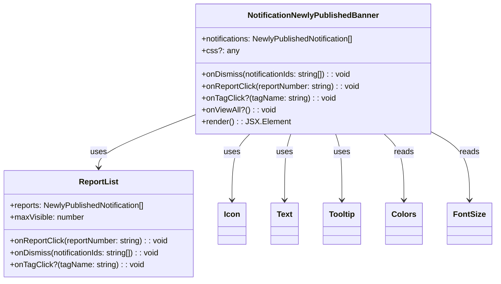

# Diagram: web/portal/src/pages/reports/bi-dashboard-next/components/organisms/Reports.NewlyPublishedBanner.organism.tsx


> Auto-generated by Obscura crawlers

## Diagram 1



### SVG

<svg id="container" width="993.9609375" xmlns="http://www.w3.org/2000/svg" class="classDiagram" height="570" viewBox="0 0 993.9609375 570" role="graphics-document document" aria-roledescription="class"><style>#container{font-family:"trebuchet ms",verdana,arial,sans-serif;font-size:16px;fill:#333;}@keyframes edge-animation-frame{from{stroke-dashoffset:0;}}@keyframes dash{to{stroke-dashoffset:0;}}#container .edge-animation-slow{stroke-dasharray:9,5!important;stroke-dashoffset:900;animation:dash 50s linear infinite;stroke-linecap:round;}#container .edge-animation-fast{stroke-dasharray:9,5!important;stroke-dashoffset:900;animation:dash 20s linear infinite;stroke-linecap:round;}#container .error-icon{fill:#552222;}#container .error-text{fill:#552222;stroke:#552222;}#container .edge-thickness-normal{stroke-width:1px;}#container .edge-thickness-thick{stroke-width:3.5px;}#container .edge-pattern-solid{stroke-dasharray:0;}#container .edge-thickness-invisible{stroke-width:0;fill:none;}#container .edge-pattern-dashed{stroke-dasharray:3;}#container .edge-pattern-dotted{stroke-dasharray:2;}#container .marker{fill:#333333;stroke:#333333;}#container .marker.cross{stroke:#333333;}#container svg{font-family:"trebuchet ms",verdana,arial,sans-serif;font-size:16px;}#container p{margin:0;}#container g.classGroup text{fill:#9370DB;stroke:none;font-family:"trebuchet ms",verdana,arial,sans-serif;font-size:10px;}#container g.classGroup text .title{font-weight:bolder;}#container .nodeLabel,#container .edgeLabel{color:#131300;}#container .edgeLabel .label rect{fill:#ECECFF;}#container .label text{fill:#131300;}#container .labelBkg{background:#ECECFF;}#container .edgeLabel .label span{background:#ECECFF;}#container .classTitle{font-weight:bolder;}#container .node rect,#container .node circle,#container .node ellipse,#container .node polygon,#container .node path{fill:#ECECFF;stroke:#9370DB;stroke-width:1px;}#container .divider{stroke:#9370DB;stroke-width:1;}#container g.clickable{cursor:pointer;}#container g.classGroup rect{fill:#ECECFF;stroke:#9370DB;}#container g.classGroup line{stroke:#9370DB;stroke-width:1;}#container .classLabel .box{stroke:none;stroke-width:0;fill:#ECECFF;opacity:0.5;}#container .classLabel .label{fill:#9370DB;font-size:10px;}#container .relation{stroke:#333333;stroke-width:1;fill:none;}#container .dashed-line{stroke-dasharray:3;}#container .dotted-line{stroke-dasharray:1 2;}#container #compositionStart,#container .composition{fill:#333333!important;stroke:#333333!important;stroke-width:1;}#container #compositionEnd,#container .composition{fill:#333333!important;stroke:#333333!important;stroke-width:1;}#container #dependencyStart,#container .dependency{fill:#333333!important;stroke:#333333!important;stroke-width:1;}#container #dependencyStart,#container .dependency{fill:#333333!important;stroke:#333333!important;stroke-width:1;}#container #extensionStart,#container .extension{fill:transparent!important;stroke:#333333!important;stroke-width:1;}#container #extensionEnd,#container .extension{fill:transparent!important;stroke:#333333!important;stroke-width:1;}#container #aggregationStart,#container .aggregation{fill:transparent!important;stroke:#333333!important;stroke-width:1;}#container #aggregationEnd,#container .aggregation{fill:transparent!important;stroke:#333333!important;stroke-width:1;}#container #lollipopStart,#container .lollipop{fill:#ECECFF!important;stroke:#333333!important;stroke-width:1;}#container #lollipopEnd,#container .lollipop{fill:#ECECFF!important;stroke:#333333!important;stroke-width:1;}#container .edgeTerminals{font-size:11px;line-height:initial;}#container .classTitleText{text-anchor:middle;font-size:18px;fill:#333;}#container .label-icon{display:inline-block;height:1em;overflow:visible;vertical-align:-0.125em;}#container .node .label-icon path{fill:currentColor;stroke:revert;stroke-width:revert;}#container :root{--mermaid-font-family:"trebuchet ms",verdana,arial,sans-serif;}</style><g><defs><marker id="container_class-aggregationStart" class="marker aggregation class" refX="18" refY="7" markerWidth="190" markerHeight="240" orient="auto"><path d="M 18,7 L9,13 L1,7 L9,1 Z"></path></marker></defs><defs><marker id="container_class-aggregationEnd" class="marker aggregation class" refX="1" refY="7" markerWidth="20" markerHeight="28" orient="auto"><path d="M 18,7 L9,13 L1,7 L9,1 Z"></path></marker></defs><defs><marker id="container_class-extensionStart" class="marker extension class" refX="18" refY="7" markerWidth="190" markerHeight="240" orient="auto"><path d="M 1,7 L18,13 V 1 Z"></path></marker></defs><defs><marker id="container_class-extensionEnd" class="marker extension class" refX="1" refY="7" markerWidth="20" markerHeight="28" orient="auto"><path d="M 1,1 V 13 L18,7 Z"></path></marker></defs><defs><marker id="container_class-compositionStart" class="marker composition class" refX="18" refY="7" markerWidth="190" markerHeight="240" orient="auto"><path d="M 18,7 L9,13 L1,7 L9,1 Z"></path></marker></defs><defs><marker id="container_class-compositionEnd" class="marker composition class" refX="1" refY="7" markerWidth="20" markerHeight="28" orient="auto"><path d="M 18,7 L9,13 L1,7 L9,1 Z"></path></marker></defs><defs><marker id="container_class-dependencyStart" class="marker dependency class" refX="6" refY="7" markerWidth="190" markerHeight="240" orient="auto"><path d="M 5,7 L9,13 L1,7 L9,1 Z"></path></marker></defs><defs><marker id="container_class-dependencyEnd" class="marker dependency class" refX="13" refY="7" markerWidth="20" markerHeight="28" orient="auto"><path d="M 18,7 L9,13 L14,7 L9,1 Z"></path></marker></defs><defs><marker id="container_class-lollipopStart" class="marker lollipop class" refX="13" refY="7" markerWidth="190" markerHeight="240" orient="auto"><circle stroke="black" fill="transparent" cx="7" cy="7" r="6"></circle></marker></defs><defs><marker id="container_class-lollipopEnd" class="marker lollipop class" refX="1" refY="7" markerWidth="190" markerHeight="240" orient="auto"><circle stroke="black" fill="transparent" cx="7" cy="7" r="6"></circle></marker></defs><g class="root"><g class="clusters"></g><g class="edgePaths"><path d="M396.57,232.941L364.079,245.617C331.587,258.294,266.604,283.647,234.113,301.49C201.621,319.333,201.621,329.667,201.621,334.833L201.621,340" id="id_NotificationNewlyPublishedBanner_ReportList_1" class="edge-thickness-normal edge-pattern-solid relation" style=";;;" data-edge="true" data-et="edge" data-id="id_NotificationNewlyPublishedBanner_ReportList_1" data-points="W3sieCI6Mzk2LjU3MDMxMjUsInkiOjIzMi45NDA3Nzk2ODQ1NTUxfSx7IngiOjIwMS42MjEwOTM3NSwieSI6MzA5fSx7IngiOjIwMS42MjEwOTM3NSwieSI6MzQ2fV0=" marker-end="url(#container_class-dependencyEnd)"></path><path d="M508.067,272L502.147,278.167C496.227,284.333,484.387,296.667,478.467,319C472.547,341.333,472.547,373.667,472.547,389.833L472.547,406" id="id_NotificationNewlyPublishedBanner_Icon_2" class="edge-thickness-normal edge-pattern-solid relation" style=";;;" data-edge="true" data-et="edge" data-id="id_NotificationNewlyPublishedBanner_Icon_2" data-points="W3sieCI6NTA4LjA2NzM1MzkyMDExODM2LCJ5IjoyNzJ9LHsieCI6NDcyLjU0Njg3NSwieSI6MzA5fSx7IngiOjQ3Mi41NDY4NzUsInkiOjQxMn1d" marker-end="url(#container_class-dependencyEnd)"></path><path d="M589.835,272L587.735,278.167C585.635,284.333,581.435,296.667,579.334,319C577.234,341.333,577.234,373.667,577.234,389.833L577.234,406" id="id_NotificationNewlyPublishedBanner_Text_3" class="edge-thickness-normal edge-pattern-solid relation" style=";;;" data-edge="true" data-et="edge" data-id="id_NotificationNewlyPublishedBanner_Text_3" data-points="W3sieCI6NTg5LjgzNTEwNTM5OTQwODIsInkiOjI3Mn0seyJ4Ijo1NzcuMjM0Mzc1LCJ5IjozMDl9LHsieCI6NTc3LjIzNDM3NSwieSI6NDEyfV0=" marker-end="url(#container_class-dependencyEnd)"></path><path d="M679.743,272L681.843,278.167C683.943,284.333,688.144,296.667,690.244,319C692.344,341.333,692.344,373.667,692.344,389.833L692.344,406" id="id_NotificationNewlyPublishedBanner_Tooltip_4" class="edge-thickness-normal edge-pattern-solid relation" style=";;;" data-edge="true" data-et="edge" data-id="id_NotificationNewlyPublishedBanner_Tooltip_4" data-points="W3sieCI6Njc5Ljc0MzAxOTYwMDU5MTgsInkiOjI3Mn0seyJ4Ijo2OTIuMzQzNzUsInkiOjMwOX0seyJ4Ijo2OTIuMzQzNzUsInkiOjQxMn1d" marker-end="url(#container_class-dependencyEnd)"></path><path d="M775.68,272L782.262,278.167C788.844,284.333,802.008,296.667,808.59,319C815.172,341.333,815.172,373.667,815.172,389.833L815.172,406" id="id_NotificationNewlyPublishedBanner_Colors_5" class="edge-thickness-normal edge-pattern-solid relation" style=";;;" data-edge="true" data-et="edge" data-id="id_NotificationNewlyPublishedBanner_Colors_5" data-points="W3sieCI6Nzc1LjY3OTc3OTk1NTYyMTQsInkiOjI3Mn0seyJ4Ijo4MTUuMTcxODc1LCJ5IjozMDl9LHsieCI6ODE1LjE3MTg3NSwieSI6NDEyfV0=" marker-end="url(#container_class-dependencyEnd)"></path><path d="M873.008,270.572L884.693,276.977C896.378,283.381,919.747,296.191,931.432,318.762C943.117,341.333,943.117,373.667,943.117,389.833L943.117,406" id="id_NotificationNewlyPublishedBanner_FontSize_6" class="edge-thickness-normal edge-pattern-solid relation" style=";;;" data-edge="true" data-et="edge" data-id="id_NotificationNewlyPublishedBanner_FontSize_6" data-points="W3sieCI6ODczLjAwNzgxMjUsInkiOjI3MC41NzE4MzM5ODM2ODIxNX0seyJ4Ijo5NDMuMTE3MTg3NSwieSI6MzA5fSx7IngiOjk0My4xMTcxODc1LCJ5Ijo0MTJ9XQ==" marker-end="url(#container_class-dependencyEnd)"></path></g><g class="edgeLabels"><g class="edgeLabel" transform="translate(201.62109375, 309)"><g class="label" data-id="id_NotificationNewlyPublishedBanner_ReportList_1" transform="translate(-16.4921875, -12)"><foreignObject width="32.984375" height="24"><div xmlns="http://www.w3.org/1999/xhtml" class="labelBkg" style="display: table-cell; white-space: nowrap; line-height: 1.5; max-width: 200px; text-align: center;"><span class="edgeLabel"><p>uses</p></span></div></foreignObject></g></g><g class="edgeLabel" transform="translate(472.546875, 309)"><g class="label" data-id="id_NotificationNewlyPublishedBanner_Icon_2" transform="translate(-16.4921875, -12)"><foreignObject width="32.984375" height="24"><div xmlns="http://www.w3.org/1999/xhtml" class="labelBkg" style="display: table-cell; white-space: nowrap; line-height: 1.5; max-width: 200px; text-align: center;"><span class="edgeLabel"><p>uses</p></span></div></foreignObject></g></g><g class="edgeLabel" transform="translate(577.234375, 309)"><g class="label" data-id="id_NotificationNewlyPublishedBanner_Text_3" transform="translate(-16.4921875, -12)"><foreignObject width="32.984375" height="24"><div xmlns="http://www.w3.org/1999/xhtml" class="labelBkg" style="display: table-cell; white-space: nowrap; line-height: 1.5; max-width: 200px; text-align: center;"><span class="edgeLabel"><p>uses</p></span></div></foreignObject></g></g><g class="edgeLabel" transform="translate(692.34375, 309)"><g class="label" data-id="id_NotificationNewlyPublishedBanner_Tooltip_4" transform="translate(-16.4921875, -12)"><foreignObject width="32.984375" height="24"><div xmlns="http://www.w3.org/1999/xhtml" class="labelBkg" style="display: table-cell; white-space: nowrap; line-height: 1.5; max-width: 200px; text-align: center;"><span class="edgeLabel"><p>uses</p></span></div></foreignObject></g></g><g class="edgeLabel" transform="translate(815.171875, 309)"><g class="label" data-id="id_NotificationNewlyPublishedBanner_Colors_5" transform="translate(-20.0078125, -12)"><foreignObject width="40.015625" height="24"><div xmlns="http://www.w3.org/1999/xhtml" class="labelBkg" style="display: table-cell; white-space: nowrap; line-height: 1.5; max-width: 200px; text-align: center;"><span class="edgeLabel"><p>reads</p></span></div></foreignObject></g></g><g class="edgeLabel" transform="translate(943.1171875, 309)"><g class="label" data-id="id_NotificationNewlyPublishedBanner_FontSize_6" transform="translate(-20.0078125, -12)"><foreignObject width="40.015625" height="24"><div xmlns="http://www.w3.org/1999/xhtml" class="labelBkg" style="display: table-cell; white-space: nowrap; line-height: 1.5; max-width: 200px; text-align: center;"><span class="edgeLabel"><p>reads</p></span></div></foreignObject></g></g></g><g class="nodes"><g class="node default" id="classId-NotificationNewlyPublishedBanner-0" transform="translate(634.7890625, 140)"><g class="basic label-container"><path d="M-238.21875 -132 L238.21875 -132 L238.21875 132 L-238.21875 132" stroke="none" stroke-width="0" fill="#ECECFF" style=""></path><path d="M-238.21875 -132 C-92.79174918489969 -132, 52.63525163020063 -132, 238.21875 -132 M-238.21875 -132 C-90.36295131093368 -132, 57.49284737813264 -132, 238.21875 -132 M238.21875 -132 C238.21875 -65.9260672000465, 238.21875 0.14786559990699288, 238.21875 132 M238.21875 -132 C238.21875 -30.506876934695143, 238.21875 70.98624613060971, 238.21875 132 M238.21875 132 C140.43425860738176 132, 42.6497672147635 132, -238.21875 132 M238.21875 132 C52.73998775568464 132, -132.73877448863072 132, -238.21875 132 M-238.21875 132 C-238.21875 74.28293499472711, -238.21875 16.565869989454228, -238.21875 -132 M-238.21875 132 C-238.21875 31.831460192513802, -238.21875 -68.3370796149724, -238.21875 -132" stroke="#9370DB" stroke-width="1.3" fill="none" stroke-dasharray="0 0" style=""></path></g><g class="annotation-group text" transform="translate(0, -108)"></g><g class="label-group text" transform="translate(-127.484375, -108)"><g class="label" style="font-weight: bolder" transform="translate(0,-12)"><foreignObject width="254.96875" height="24"><div xmlns="http://www.w3.org/1999/xhtml" style="display: table-cell; white-space: nowrap; line-height: 1.5; max-width: 303px; text-align: center;"><span class="nodeLabel markdown-node-label" style=""><p>NotificationNewlyPublishedBanner</p></span></div></foreignObject></g></g><g class="members-group text" transform="translate(-226.21875, -60)"><g class="label" style="" transform="translate(0,-12)"><foreignObject width="317.75" height="24"><div xmlns="http://www.w3.org/1999/xhtml" style="display: table-cell; white-space: nowrap; line-height: 1.5; max-width: 375px; text-align: center;"><span class="nodeLabel markdown-node-label" style=""><p>+notifications: NewlyPublishedNotification[]</p></span></div></foreignObject></g><g class="label" style="" transform="translate(0,12)"><foreignObject width="71.203125" height="24"><div xmlns="http://www.w3.org/1999/xhtml" style="display: table-cell; white-space: nowrap; line-height: 1.5; max-width: 129px; text-align: center;"><span class="nodeLabel markdown-node-label" style=""><p>+css?: any</p></span></div></foreignObject></g></g><g class="methods-group text" transform="translate(-226.21875, 12)"><g class="label" style="" transform="translate(0,-12)"><foreignObject width="309.1875" height="24"><div xmlns="http://www.w3.org/1999/xhtml" style="display: table-cell; white-space: nowrap; line-height: 1.5; max-width: 367px; text-align: center;"><span class="nodeLabel markdown-node-label" style=""><p>+onDismiss(notificationIds: string[]) : : void</p></span></div></foreignObject></g><g class="label" style="" transform="translate(0,12)"><foreignObject width="324.953125" height="24"><div xmlns="http://www.w3.org/1999/xhtml" style="display: table-cell; white-space: nowrap; line-height: 1.5; max-width: 382px; text-align: center;"><span class="nodeLabel markdown-node-label" style=""><p>+onReportClick(reportNumber: string) : : void</p></span></div></foreignObject></g><g class="label" style="" transform="translate(0,36)"><foreignObject width="268.140625" height="24"><div xmlns="http://www.w3.org/1999/xhtml" style="display: table-cell; white-space: nowrap; line-height: 1.5; max-width: 326px; text-align: center;"><span class="nodeLabel markdown-node-label" style=""><p>+onTagClick?(tagName: string) : : void</p></span></div></foreignObject></g><g class="label" style="" transform="translate(0,60)"><foreignObject width="147.953125" height="24"><div xmlns="http://www.w3.org/1999/xhtml" style="display: table-cell; white-space: nowrap; line-height: 1.5; max-width: 205px; text-align: center;"><span class="nodeLabel markdown-node-label" style=""><p>+onViewAll?() : : void</p></span></div></foreignObject></g><g class="label" style="" transform="translate(0,84)"><foreignObject width="172.34375" height="24"><div xmlns="http://www.w3.org/1999/xhtml" style="display: table-cell; white-space: nowrap; line-height: 1.5; max-width: 230px; text-align: center;"><span class="nodeLabel markdown-node-label" style=""><p>+render() : : JSX.Element</p></span></div></foreignObject></g></g><g class="divider" style=""><path d="M-238.21875 -84 C-121.23402538528376 -84, -4.249300770567515 -84, 238.21875 -84 M-238.21875 -84 C-74.25772659498608 -84, 89.70329681002784 -84, 238.21875 -84" stroke="#9370DB" stroke-width="1.3" fill="none" stroke-dasharray="0 0" style=""></path></g><g class="divider" style=""><path d="M-238.21875 -12 C-87.68285788984016 -12, 62.85303422031967 -12, 238.21875 -12 M-238.21875 -12 C-115.91086443121503 -12, 6.397021137569936 -12, 238.21875 -12" stroke="#9370DB" stroke-width="1.3" fill="none" stroke-dasharray="0 0" style=""></path></g></g><g class="node default" id="classId-ReportList-1" transform="translate(201.62109375, 454)"><g class="basic label-container"><path d="M-193.62109375 -108 L193.62109375 -108 L193.62109375 108 L-193.62109375 108" stroke="none" stroke-width="0" fill="#ECECFF" style=""></path><path d="M-193.62109375 -108 C-44.372767405429414 -108, 104.87555893914117 -108, 193.62109375 -108 M-193.62109375 -108 C-68.98974858838494 -108, 55.64159657323012 -108, 193.62109375 -108 M193.62109375 -108 C193.62109375 -51.97768210659109, 193.62109375 4.044635786817821, 193.62109375 108 M193.62109375 -108 C193.62109375 -21.93853067387674, 193.62109375 64.12293865224652, 193.62109375 108 M193.62109375 108 C44.487449932865786 108, -104.64619388426843 108, -193.62109375 108 M193.62109375 108 C40.98604579993503 108, -111.64900215012995 108, -193.62109375 108 M-193.62109375 108 C-193.62109375 25.274532813122775, -193.62109375 -57.45093437375445, -193.62109375 -108 M-193.62109375 108 C-193.62109375 29.53244537109022, -193.62109375 -48.93510925781956, -193.62109375 -108" stroke="#9370DB" stroke-width="1.3" fill="none" stroke-dasharray="0 0" style=""></path></g><g class="annotation-group text" transform="translate(0, -84)"></g><g class="label-group text" transform="translate(-38.2890625, -84)"><g class="label" style="font-weight: bolder" transform="translate(0,-12)"><foreignObject width="76.578125" height="24"><div xmlns="http://www.w3.org/1999/xhtml" style="display: table-cell; white-space: nowrap; line-height: 1.5; max-width: 125px; text-align: center;"><span class="nodeLabel markdown-node-label" style=""><p>ReportList</p></span></div></foreignObject></g></g><g class="members-group text" transform="translate(-181.62109375, -36)"><g class="label" style="" transform="translate(0,-12)"><foreignObject width="279.5625" height="24"><div xmlns="http://www.w3.org/1999/xhtml" style="display: table-cell; white-space: nowrap; line-height: 1.5; max-width: 337px; text-align: center;"><span class="nodeLabel markdown-node-label" style=""><p>+reports: NewlyPublishedNotification[]</p></span></div></foreignObject></g><g class="label" style="" transform="translate(0,12)"><foreignObject width="151.265625" height="24"><div xmlns="http://www.w3.org/1999/xhtml" style="display: table-cell; white-space: nowrap; line-height: 1.5; max-width: 209px; text-align: center;"><span class="nodeLabel markdown-node-label" style=""><p>+maxVisible: number</p></span></div></foreignObject></g></g><g class="methods-group text" transform="translate(-181.62109375, 36)"><g class="label" style="" transform="translate(0,-12)"><foreignObject width="324.953125" height="24"><div xmlns="http://www.w3.org/1999/xhtml" style="display: table-cell; white-space: nowrap; line-height: 1.5; max-width: 382px; text-align: center;"><span class="nodeLabel markdown-node-label" style=""><p>+onReportClick(reportNumber: string) : : void</p></span></div></foreignObject></g><g class="label" style="" transform="translate(0,12)"><foreignObject width="309.1875" height="24"><div xmlns="http://www.w3.org/1999/xhtml" style="display: table-cell; white-space: nowrap; line-height: 1.5; max-width: 367px; text-align: center;"><span class="nodeLabel markdown-node-label" style=""><p>+onDismiss(notificationIds: string[]) : : void</p></span></div></foreignObject></g><g class="label" style="" transform="translate(0,36)"><foreignObject width="268.140625" height="24"><div xmlns="http://www.w3.org/1999/xhtml" style="display: table-cell; white-space: nowrap; line-height: 1.5; max-width: 326px; text-align: center;"><span class="nodeLabel markdown-node-label" style=""><p>+onTagClick?(tagName: string) : : void</p></span></div></foreignObject></g></g><g class="divider" style=""><path d="M-193.62109375 -60 C-90.62879713958709 -60, 12.363499470825815 -60, 193.62109375 -60 M-193.62109375 -60 C-41.17375634936823 -60, 111.27358105126353 -60, 193.62109375 -60" stroke="#9370DB" stroke-width="1.3" fill="none" stroke-dasharray="0 0" style=""></path></g><g class="divider" style=""><path d="M-193.62109375 12 C-79.39485293602628 12, 34.831387877947435 12, 193.62109375 12 M-193.62109375 12 C-54.28313638477553 12, 85.05482098044894 12, 193.62109375 12" stroke="#9370DB" stroke-width="1.3" fill="none" stroke-dasharray="0 0" style=""></path></g></g><g class="node default" id="classId-Icon-2" transform="translate(472.546875, 454)"><g class="basic label-container"><path d="M-27.3046875 -42 L27.3046875 -42 L27.3046875 42 L-27.3046875 42" stroke="none" stroke-width="0" fill="#ECECFF" style=""></path><path d="M-27.3046875 -42 C-5.9359077838457175 -42, 15.432871932308565 -42, 27.3046875 -42 M-27.3046875 -42 C-11.324970055655792 -42, 4.654747388688417 -42, 27.3046875 -42 M27.3046875 -42 C27.3046875 -10.845818501711395, 27.3046875 20.30836299657721, 27.3046875 42 M27.3046875 -42 C27.3046875 -19.383369949655673, 27.3046875 3.2332601006886534, 27.3046875 42 M27.3046875 42 C12.41645009518663 42, -2.471787309626741 42, -27.3046875 42 M27.3046875 42 C8.943248377309146 42, -9.418190745381708 42, -27.3046875 42 M-27.3046875 42 C-27.3046875 17.205953457414058, -27.3046875 -7.588093085171884, -27.3046875 -42 M-27.3046875 42 C-27.3046875 12.027021809091977, -27.3046875 -17.945956381816046, -27.3046875 -42" stroke="#9370DB" stroke-width="1.3" fill="none" stroke-dasharray="0 0" style=""></path></g><g class="annotation-group text" transform="translate(0, -18)"></g><g class="label-group text" transform="translate(-15.3046875, -18)"><g class="label" style="font-weight: bolder" transform="translate(0,-12)"><foreignObject width="30.609375" height="24"><div xmlns="http://www.w3.org/1999/xhtml" style="display: table-cell; white-space: nowrap; line-height: 1.5; max-width: 81px; text-align: center;"><span class="nodeLabel markdown-node-label" style=""><p>Icon</p></span></div></foreignObject></g></g><g class="members-group text" transform="translate(-15.3046875, 30)"></g><g class="methods-group text" transform="translate(-15.3046875, 60)"></g><g class="divider" style=""><path d="M-27.3046875 6 C-15.859257395681103 6, -4.413827291362207 6, 27.3046875 6 M-27.3046875 6 C-15.11452610325662 6, -2.9243647065132414 6, 27.3046875 6" stroke="#9370DB" stroke-width="1.3" fill="none" stroke-dasharray="0 0" style=""></path></g><g class="divider" style=""><path d="M-27.3046875 24 C-8.747372966609099 24, 9.809941566781802 24, 27.3046875 24 M-27.3046875 24 C-9.528451844994908 24, 8.247783810010183 24, 27.3046875 24" stroke="#9370DB" stroke-width="1.3" fill="none" stroke-dasharray="0 0" style=""></path></g></g><g class="node default" id="classId-Text-3" transform="translate(577.234375, 454)"><g class="basic label-container"><path d="M-27.3828125 -42 L27.3828125 -42 L27.3828125 42 L-27.3828125 42" stroke="none" stroke-width="0" fill="#ECECFF" style=""></path><path d="M-27.3828125 -42 C-13.277174564227337 -42, 0.8284633715453253 -42, 27.3828125 -42 M-27.3828125 -42 C-8.080009082735735 -42, 11.22279433452853 -42, 27.3828125 -42 M27.3828125 -42 C27.3828125 -18.23145621562221, 27.3828125 5.537087568755581, 27.3828125 42 M27.3828125 -42 C27.3828125 -17.96255560287175, 27.3828125 6.074888794256502, 27.3828125 42 M27.3828125 42 C12.35529411624675 42, -2.6722242675065004 42, -27.3828125 42 M27.3828125 42 C10.21944166282416 42, -6.9439291743516804 42, -27.3828125 42 M-27.3828125 42 C-27.3828125 23.331794687879544, -27.3828125 4.663589375759088, -27.3828125 -42 M-27.3828125 42 C-27.3828125 13.248913773361515, -27.3828125 -15.50217245327697, -27.3828125 -42" stroke="#9370DB" stroke-width="1.3" fill="none" stroke-dasharray="0 0" style=""></path></g><g class="annotation-group text" transform="translate(0, -18)"></g><g class="label-group text" transform="translate(-15.3828125, -18)"><g class="label" style="font-weight: bolder" transform="translate(0,-12)"><foreignObject width="30.765625" height="24"><div xmlns="http://www.w3.org/1999/xhtml" style="display: table-cell; white-space: nowrap; line-height: 1.5; max-width: 80px; text-align: center;"><span class="nodeLabel markdown-node-label" style=""><p>Text</p></span></div></foreignObject></g></g><g class="members-group text" transform="translate(-15.3828125, 30)"></g><g class="methods-group text" transform="translate(-15.3828125, 60)"></g><g class="divider" style=""><path d="M-27.3828125 6 C-8.284291284407619 6, 10.814229931184762 6, 27.3828125 6 M-27.3828125 6 C-6.177790348275071 6, 15.027231803449858 6, 27.3828125 6" stroke="#9370DB" stroke-width="1.3" fill="none" stroke-dasharray="0 0" style=""></path></g><g class="divider" style=""><path d="M-27.3828125 24 C-16.161059865685 24, -4.939307231370002 24, 27.3828125 24 M-27.3828125 24 C-10.068748073325303 24, 7.245316353349395 24, 27.3828125 24" stroke="#9370DB" stroke-width="1.3" fill="none" stroke-dasharray="0 0" style=""></path></g></g><g class="node default" id="classId-Tooltip-4" transform="translate(692.34375, 454)"><g class="basic label-container"><path d="M-37.7265625 -42 L37.7265625 -42 L37.7265625 42 L-37.7265625 42" stroke="none" stroke-width="0" fill="#ECECFF" style=""></path><path d="M-37.7265625 -42 C-18.02663008263988 -42, 1.6733023347202405 -42, 37.7265625 -42 M-37.7265625 -42 C-10.189649684344367 -42, 17.347263131311266 -42, 37.7265625 -42 M37.7265625 -42 C37.7265625 -9.172804826705573, 37.7265625 23.654390346588855, 37.7265625 42 M37.7265625 -42 C37.7265625 -10.402638901329308, 37.7265625 21.194722197341385, 37.7265625 42 M37.7265625 42 C21.21110753940977 42, 4.695652578819541 42, -37.7265625 42 M37.7265625 42 C10.052944490087782 42, -17.620673519824436 42, -37.7265625 42 M-37.7265625 42 C-37.7265625 13.63915506821849, -37.7265625 -14.721689863563022, -37.7265625 -42 M-37.7265625 42 C-37.7265625 21.742023564466432, -37.7265625 1.4840471289328647, -37.7265625 -42" stroke="#9370DB" stroke-width="1.3" fill="none" stroke-dasharray="0 0" style=""></path></g><g class="annotation-group text" transform="translate(0, -18)"></g><g class="label-group text" transform="translate(-25.7265625, -18)"><g class="label" style="font-weight: bolder" transform="translate(0,-12)"><foreignObject width="51.453125" height="24"><div xmlns="http://www.w3.org/1999/xhtml" style="display: table-cell; white-space: nowrap; line-height: 1.5; max-width: 101px; text-align: center;"><span class="nodeLabel markdown-node-label" style=""><p>Tooltip</p></span></div></foreignObject></g></g><g class="members-group text" transform="translate(-25.7265625, 30)"></g><g class="methods-group text" transform="translate(-25.7265625, 60)"></g><g class="divider" style=""><path d="M-37.7265625 6 C-20.392085324549193 6, -3.0576081490983853 6, 37.7265625 6 M-37.7265625 6 C-21.526829861143973 6, -5.3270972222879465 6, 37.7265625 6" stroke="#9370DB" stroke-width="1.3" fill="none" stroke-dasharray="0 0" style=""></path></g><g class="divider" style=""><path d="M-37.7265625 24 C-9.202874319163882 24, 19.320813861672235 24, 37.7265625 24 M-37.7265625 24 C-11.791630379664046 24, 14.143301740671909 24, 37.7265625 24" stroke="#9370DB" stroke-width="1.3" fill="none" stroke-dasharray="0 0" style=""></path></g></g><g class="node default" id="classId-Colors-5" transform="translate(815.171875, 454)"><g class="basic label-container"><path d="M-35.1015625 -42 L35.1015625 -42 L35.1015625 42 L-35.1015625 42" stroke="none" stroke-width="0" fill="#ECECFF" style=""></path><path d="M-35.1015625 -42 C-8.246911237450977 -42, 18.607740025098046 -42, 35.1015625 -42 M-35.1015625 -42 C-10.674129159935038 -42, 13.753304180129923 -42, 35.1015625 -42 M35.1015625 -42 C35.1015625 -10.749089921488071, 35.1015625 20.501820157023857, 35.1015625 42 M35.1015625 -42 C35.1015625 -23.79297516073127, 35.1015625 -5.585950321462541, 35.1015625 42 M35.1015625 42 C11.657794536713705 42, -11.785973426572589 42, -35.1015625 42 M35.1015625 42 C20.149686107703126 42, 5.197809715406255 42, -35.1015625 42 M-35.1015625 42 C-35.1015625 24.760091959149538, -35.1015625 7.520183918299075, -35.1015625 -42 M-35.1015625 42 C-35.1015625 24.821268671973154, -35.1015625 7.642537343946309, -35.1015625 -42" stroke="#9370DB" stroke-width="1.3" fill="none" stroke-dasharray="0 0" style=""></path></g><g class="annotation-group text" transform="translate(0, -18)"></g><g class="label-group text" transform="translate(-23.1015625, -18)"><g class="label" style="font-weight: bolder" transform="translate(0,-12)"><foreignObject width="46.203125" height="24"><div xmlns="http://www.w3.org/1999/xhtml" style="display: table-cell; white-space: nowrap; line-height: 1.5; max-width: 95px; text-align: center;"><span class="nodeLabel markdown-node-label" style=""><p>Colors</p></span></div></foreignObject></g></g><g class="members-group text" transform="translate(-23.1015625, 30)"></g><g class="methods-group text" transform="translate(-23.1015625, 60)"></g><g class="divider" style=""><path d="M-35.1015625 6 C-8.018209208066267 6, 19.065144083867466 6, 35.1015625 6 M-35.1015625 6 C-12.703085976540645 6, 9.69539054691871 6, 35.1015625 6" stroke="#9370DB" stroke-width="1.3" fill="none" stroke-dasharray="0 0" style=""></path></g><g class="divider" style=""><path d="M-35.1015625 24 C-14.640163299697534 24, 5.821235900604933 24, 35.1015625 24 M-35.1015625 24 C-13.287930665421683 24, 8.525701169156633 24, 35.1015625 24" stroke="#9370DB" stroke-width="1.3" fill="none" stroke-dasharray="0 0" style=""></path></g></g><g class="node default" id="classId-FontSize-6" transform="translate(943.1171875, 454)"><g class="basic label-container"><path d="M-42.84375 -42 L42.84375 -42 L42.84375 42 L-42.84375 42" stroke="none" stroke-width="0" fill="#ECECFF" style=""></path><path d="M-42.84375 -42 C-22.893972341345183 -42, -2.944194682690366 -42, 42.84375 -42 M-42.84375 -42 C-12.607175999211432 -42, 17.629398001577137 -42, 42.84375 -42 M42.84375 -42 C42.84375 -19.924648698366372, 42.84375 2.1507026032672556, 42.84375 42 M42.84375 -42 C42.84375 -24.448190829211814, 42.84375 -6.896381658423628, 42.84375 42 M42.84375 42 C16.05675297703805 42, -10.730244045923897 42, -42.84375 42 M42.84375 42 C19.82664419855232 42, -3.190461602895361 42, -42.84375 42 M-42.84375 42 C-42.84375 24.403552689828388, -42.84375 6.807105379656775, -42.84375 -42 M-42.84375 42 C-42.84375 14.74667780008988, -42.84375 -12.506644399820239, -42.84375 -42" stroke="#9370DB" stroke-width="1.3" fill="none" stroke-dasharray="0 0" style=""></path></g><g class="annotation-group text" transform="translate(0, -18)"></g><g class="label-group text" transform="translate(-30.84375, -18)"><g class="label" style="font-weight: bolder" transform="translate(0,-12)"><foreignObject width="61.6875" height="24"><div xmlns="http://www.w3.org/1999/xhtml" style="display: table-cell; white-space: nowrap; line-height: 1.5; max-width: 111px; text-align: center;"><span class="nodeLabel markdown-node-label" style=""><p>FontSize</p></span></div></foreignObject></g></g><g class="members-group text" transform="translate(-30.84375, 30)"></g><g class="methods-group text" transform="translate(-30.84375, 60)"></g><g class="divider" style=""><path d="M-42.84375 6 C-22.93490969062013 6, -3.026069381240262 6, 42.84375 6 M-42.84375 6 C-20.065137741408222 6, 2.713474517183556 6, 42.84375 6" stroke="#9370DB" stroke-width="1.3" fill="none" stroke-dasharray="0 0" style=""></path></g><g class="divider" style=""><path d="M-42.84375 24 C-22.335628290914823 24, -1.8275065818296454 24, 42.84375 24 M-42.84375 24 C-21.325039497383337 24, 0.1936710052333268 24, 42.84375 24" stroke="#9370DB" stroke-width="1.3" fill="none" stroke-dasharray="0 0" style=""></path></g></g></g></g></g></svg>

## Diagram 2

```mermaid
flowchart TD
    A[Start: NotificationNewlyPublishedBanner render] --> B{notifications.length === 0}
    B -- Yes --> C[Render container with Text: "No new notifications"]
    B -- No --> D[Render banner container with aria attributes]
    D --> E[Title area with Icon(faBell) and Text "Newly Published"]
    D --> F[Info Tooltip with Icon(faCircleInfo)]
    D --> G[Render ReportList with maxVisible=2]
    C --> H[End]
    G --> H[End]
```

> SVG rendering failed for this diagram.
