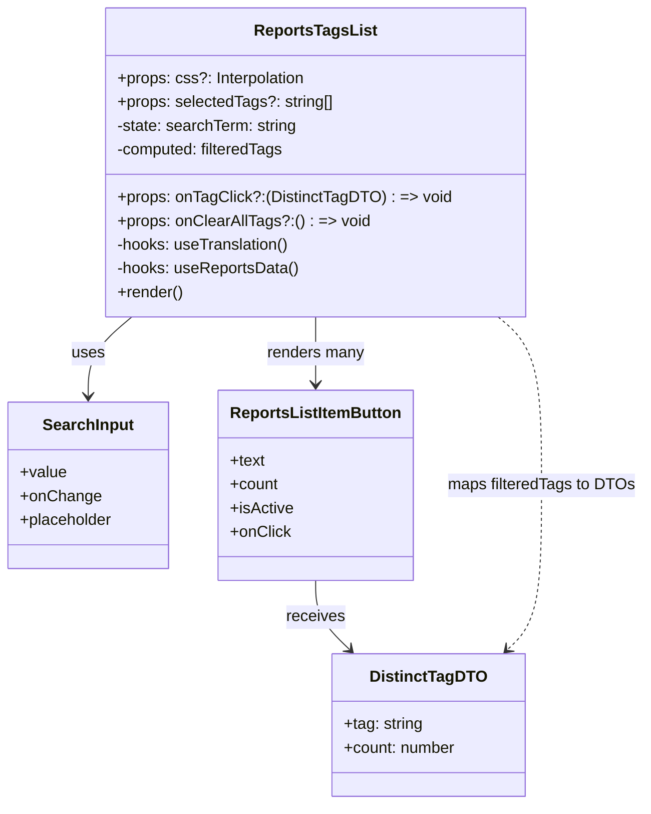

# Diagram: web/portal/src/pages/reports/bi-dashboard-next/components/organisms/Reports.TagsList.organism.tsx


> Auto-generated by Obscura crawlers

## Diagram 1

```mermaid
flowchart LR
  A[useReportsData] --> B{isLoadingDistinctTags?}
  B -- Yes --> C[Render: "Loading tags..."]
  B -- No --> D{distinctTagsError?}
  D -- Yes --> E[Render: "Error loading tags: message"]
  D -- No --> F{distinctTags.length == 0?}
  F -- Yes --> G[Render: "No tags found"]
  F -- No --> H[Render: Tags List UI]
  H --> I[Title Text: "Tags"]
  H --> J[SearchInput]
  J --> K[setSearchTerm]
  K --> L[useMemo filteredTags]
  A --> L
  L --> M[Map filteredTags -> ReportsListItemButton items]
  M --> N{selectedTags includes tag?}
  N -- True --> O[isActive = true]
  O --> P[onClick -> onTagClick(tag)]
  H --> Q{selectedTags.length > 0 and onClearAllTags?}
  Q -- True --> R[Clear All Button]
  R --> S[onClick -> onClearAllTags() + setSearchTerm("")]
```

> SVG rendering failed for this diagram.

## Diagram 2



### SVG

<svg id="container" width="641.4921875" xmlns="http://www.w3.org/2000/svg" class="classDiagram" height="812" viewBox="0 0 641.4921875 812" role="graphics-document document" aria-roledescription="class"><style>#container{font-family:"trebuchet ms",verdana,arial,sans-serif;font-size:16px;fill:#333;}@keyframes edge-animation-frame{from{stroke-dashoffset:0;}}@keyframes dash{to{stroke-dashoffset:0;}}#container .edge-animation-slow{stroke-dasharray:9,5!important;stroke-dashoffset:900;animation:dash 50s linear infinite;stroke-linecap:round;}#container .edge-animation-fast{stroke-dasharray:9,5!important;stroke-dashoffset:900;animation:dash 20s linear infinite;stroke-linecap:round;}#container .error-icon{fill:#552222;}#container .error-text{fill:#552222;stroke:#552222;}#container .edge-thickness-normal{stroke-width:1px;}#container .edge-thickness-thick{stroke-width:3.5px;}#container .edge-pattern-solid{stroke-dasharray:0;}#container .edge-thickness-invisible{stroke-width:0;fill:none;}#container .edge-pattern-dashed{stroke-dasharray:3;}#container .edge-pattern-dotted{stroke-dasharray:2;}#container .marker{fill:#333333;stroke:#333333;}#container .marker.cross{stroke:#333333;}#container svg{font-family:"trebuchet ms",verdana,arial,sans-serif;font-size:16px;}#container p{margin:0;}#container g.classGroup text{fill:#9370DB;stroke:none;font-family:"trebuchet ms",verdana,arial,sans-serif;font-size:10px;}#container g.classGroup text .title{font-weight:bolder;}#container .nodeLabel,#container .edgeLabel{color:#131300;}#container .edgeLabel .label rect{fill:#ECECFF;}#container .label text{fill:#131300;}#container .labelBkg{background:#ECECFF;}#container .edgeLabel .label span{background:#ECECFF;}#container .classTitle{font-weight:bolder;}#container .node rect,#container .node circle,#container .node ellipse,#container .node polygon,#container .node path{fill:#ECECFF;stroke:#9370DB;stroke-width:1px;}#container .divider{stroke:#9370DB;stroke-width:1;}#container g.clickable{cursor:pointer;}#container g.classGroup rect{fill:#ECECFF;stroke:#9370DB;}#container g.classGroup line{stroke:#9370DB;stroke-width:1;}#container .classLabel .box{stroke:none;stroke-width:0;fill:#ECECFF;opacity:0.5;}#container .classLabel .label{fill:#9370DB;font-size:10px;}#container .relation{stroke:#333333;stroke-width:1;fill:none;}#container .dashed-line{stroke-dasharray:3;}#container .dotted-line{stroke-dasharray:1 2;}#container #compositionStart,#container .composition{fill:#333333!important;stroke:#333333!important;stroke-width:1;}#container #compositionEnd,#container .composition{fill:#333333!important;stroke:#333333!important;stroke-width:1;}#container #dependencyStart,#container .dependency{fill:#333333!important;stroke:#333333!important;stroke-width:1;}#container #dependencyStart,#container .dependency{fill:#333333!important;stroke:#333333!important;stroke-width:1;}#container #extensionStart,#container .extension{fill:transparent!important;stroke:#333333!important;stroke-width:1;}#container #extensionEnd,#container .extension{fill:transparent!important;stroke:#333333!important;stroke-width:1;}#container #aggregationStart,#container .aggregation{fill:transparent!important;stroke:#333333!important;stroke-width:1;}#container #aggregationEnd,#container .aggregation{fill:transparent!important;stroke:#333333!important;stroke-width:1;}#container #lollipopStart,#container .lollipop{fill:#ECECFF!important;stroke:#333333!important;stroke-width:1;}#container #lollipopEnd,#container .lollipop{fill:#ECECFF!important;stroke:#333333!important;stroke-width:1;}#container .edgeTerminals{font-size:11px;line-height:initial;}#container .classTitleText{text-anchor:middle;font-size:18px;fill:#333;}#container .label-icon{display:inline-block;height:1em;overflow:visible;vertical-align:-0.125em;}#container .node .label-icon path{fill:currentColor;stroke:revert;stroke-width:revert;}#container :root{--mermaid-font-family:"trebuchet ms",verdana,arial,sans-serif;}</style><g><defs><marker id="container_class-aggregationStart" class="marker aggregation class" refX="18" refY="7" markerWidth="190" markerHeight="240" orient="auto"><path d="M 18,7 L9,13 L1,7 L9,1 Z"></path></marker></defs><defs><marker id="container_class-aggregationEnd" class="marker aggregation class" refX="1" refY="7" markerWidth="20" markerHeight="28" orient="auto"><path d="M 18,7 L9,13 L1,7 L9,1 Z"></path></marker></defs><defs><marker id="container_class-extensionStart" class="marker extension class" refX="18" refY="7" markerWidth="190" markerHeight="240" orient="auto"><path d="M 1,7 L18,13 V 1 Z"></path></marker></defs><defs><marker id="container_class-extensionEnd" class="marker extension class" refX="1" refY="7" markerWidth="20" markerHeight="28" orient="auto"><path d="M 1,1 V 13 L18,7 Z"></path></marker></defs><defs><marker id="container_class-compositionStart" class="marker composition class" refX="18" refY="7" markerWidth="190" markerHeight="240" orient="auto"><path d="M 18,7 L9,13 L1,7 L9,1 Z"></path></marker></defs><defs><marker id="container_class-compositionEnd" class="marker composition class" refX="1" refY="7" markerWidth="20" markerHeight="28" orient="auto"><path d="M 18,7 L9,13 L1,7 L9,1 Z"></path></marker></defs><defs><marker id="container_class-dependencyStart" class="marker dependency class" refX="6" refY="7" markerWidth="190" markerHeight="240" orient="auto"><path d="M 5,7 L9,13 L1,7 L9,1 Z"></path></marker></defs><defs><marker id="container_class-dependencyEnd" class="marker dependency class" refX="13" refY="7" markerWidth="20" markerHeight="28" orient="auto"><path d="M 18,7 L9,13 L14,7 L9,1 Z"></path></marker></defs><defs><marker id="container_class-lollipopStart" class="marker lollipop class" refX="13" refY="7" markerWidth="190" markerHeight="240" orient="auto"><circle stroke="black" fill="transparent" cx="7" cy="7" r="6"></circle></marker></defs><defs><marker id="container_class-lollipopEnd" class="marker lollipop class" refX="1" refY="7" markerWidth="190" markerHeight="240" orient="auto"><circle stroke="black" fill="transparent" cx="7" cy="7" r="6"></circle></marker></defs><g class="root"><g class="clusters"></g><g class="edgePaths"><path d="M132.865,320L125.617,326.167C118.37,332.333,103.874,344.667,96.627,358C89.379,371.333,89.379,385.667,89.379,392.833L89.379,400" id="id_ReportsTagsList_SearchInput_1" class="edge-thickness-normal edge-pattern-solid relation" style=";;;" data-edge="true" data-et="edge" data-id="id_ReportsTagsList_SearchInput_1" data-points="W3sieCI6MTMyLjg2NDgzOTcwMjA3MjU0LCJ5IjozMjB9LHsieCI6ODkuMzc4OTA2MjUsInkiOjM1N30seyJ4Ijo4OS4zNzg5MDYyNSwieSI6NDA2fV0=" marker-end="url(#container_class-dependencyEnd)"></path><path d="M316.211,320L316.211,326.167C316.211,332.333,316.211,344.667,316.211,356C316.211,367.333,316.211,377.667,316.211,382.833L316.211,388" id="id_ReportsTagsList_ReportsListItemButton_2" class="edge-thickness-normal edge-pattern-solid relation" style=";;;" data-edge="true" data-et="edge" data-id="id_ReportsTagsList_ReportsListItemButton_2" data-points="W3sieCI6MzE2LjIxMDkzNzUsInkiOjMyMH0seyJ4IjozMTYuMjEwOTM3NSwieSI6MzU3fSx7IngiOjMxNi4yMTA5Mzc1LCJ5IjozOTR9XQ==" marker-end="url(#container_class-dependencyEnd)"></path><path d="M316.211,586L316.211,592.167C316.211,598.333,316.211,610.667,321.827,622.302C327.443,633.938,338.676,644.876,344.292,650.345L349.908,655.814" id="id_ReportsListItemButton_DistinctTagDTO_3" class="edge-thickness-normal edge-pattern-solid relation" style=";;;" data-edge="true" data-et="edge" data-id="id_ReportsListItemButton_DistinctTagDTO_3" data-points="W3sieCI6MzE2LjIxMDkzNzUsInkiOjU4Nn0seyJ4IjozMTYuMjEwOTM3NSwieSI6NjIzfSx7IngiOjM1NC4yMDY3NDQ1NTI3NTIzLCJ5Ijo2NjB9XQ==" marker-end="url(#container_class-dependencyEnd)"></path><path d="M497.161,320L504.314,326.167C511.466,332.333,525.772,344.667,532.925,373C540.078,401.333,540.078,445.667,540.078,490C540.078,534.333,540.078,578.667,534.462,606.302C528.846,633.938,517.613,644.876,511.997,650.345L506.381,655.814" id="id_ReportsTagsList_DistinctTagDTO_4" class="edge-thickness-normal edge-pattern-dashed relation" style=";;;" data-edge="true" data-et="edge" data-id="id_ReportsTagsList_DistinctTagDTO_4" data-points="W3sieCI6NDk3LjE2MDU4MTI4MjM4MzQsInkiOjMyMH0seyJ4Ijo1NDAuMDc4MTI1LCJ5IjozNTd9LHsieCI6NTQwLjA3ODEyNSwieSI6NDkwfSx7IngiOjU0MC4wNzgxMjUsInkiOjYyM30seyJ4Ijo1MDIuMDgyMzE3OTQ3MjQ3NywieSI6NjYwfV0=" marker-end="url(#container_class-dependencyEnd)"></path></g><g class="edgeLabels"><g class="edgeLabel" transform="translate(89.37890625, 357)"><g class="label" data-id="id_ReportsTagsList_SearchInput_1" transform="translate(-16.4921875, -12)"><foreignObject width="32.984375" height="24"><div xmlns="http://www.w3.org/1999/xhtml" class="labelBkg" style="display: table-cell; white-space: nowrap; line-height: 1.5; max-width: 200px; text-align: center;"><span class="edgeLabel"><p>uses</p></span></div></foreignObject></g></g><g class="edgeLabel" transform="translate(316.2109375, 357)"><g class="label" data-id="id_ReportsTagsList_ReportsListItemButton_2" transform="translate(-49.640625, -12)"><foreignObject width="99.28125" height="24"><div xmlns="http://www.w3.org/1999/xhtml" class="labelBkg" style="display: table-cell; white-space: nowrap; line-height: 1.5; max-width: 200px; text-align: center;"><span class="edgeLabel"><p>renders many</p></span></div></foreignObject></g></g><g class="edgeLabel" transform="translate(316.2109375, 623)"><g class="label" data-id="id_ReportsListItemButton_DistinctTagDTO_3" transform="translate(-29.4921875, -12)"><foreignObject width="58.984375" height="24"><div xmlns="http://www.w3.org/1999/xhtml" class="labelBkg" style="display: table-cell; white-space: nowrap; line-height: 1.5; max-width: 200px; text-align: center;"><span class="edgeLabel"><p>receives</p></span></div></foreignObject></g></g><g class="edgeLabel" transform="translate(540.078125, 490)"><g class="label" data-id="id_ReportsTagsList_DistinctTagDTO_4" transform="translate(-93.4140625, -12)"><foreignObject width="186.828125" height="24"><div xmlns="http://www.w3.org/1999/xhtml" class="labelBkg" style="display: table-cell; white-space: nowrap; line-height: 1.5; max-width: 200px; text-align: center;"><span class="edgeLabel"><p>maps filteredTags to DTOs</p></span></div></foreignObject></g></g></g><g class="nodes"><g class="node default" id="classId-ReportsTagsList-0" transform="translate(316.2109375, 164)"><g class="basic label-container"><path d="M-205.125 -156 L205.125 -156 L205.125 156 L-205.125 156" stroke="none" stroke-width="0" fill="#ECECFF" style=""></path><path d="M-205.125 -156 C-75.80102152187433 -156, 53.522956956251335 -156, 205.125 -156 M-205.125 -156 C-62.78709770836434 -156, 79.55080458327132 -156, 205.125 -156 M205.125 -156 C205.125 -57.97075475672277, 205.125 40.05849048655446, 205.125 156 M205.125 -156 C205.125 -47.59678459752358, 205.125 60.80643080495284, 205.125 156 M205.125 156 C92.70011201896915 156, -19.7247759620617 156, -205.125 156 M205.125 156 C90.23471395882869 156, -24.655572082342616 156, -205.125 156 M-205.125 156 C-205.125 58.93788996960396, -205.125 -38.124220060792084, -205.125 -156 M-205.125 156 C-205.125 91.98871466343071, -205.125 27.977429326861426, -205.125 -156" stroke="#9370DB" stroke-width="1.3" fill="none" stroke-dasharray="0 0" style=""></path></g><g class="annotation-group text" transform="translate(0, -132)"></g><g class="label-group text" transform="translate(-58.578125, -132)"><g class="label" style="font-weight: bolder" transform="translate(0,-12)"><foreignObject width="117.15625" height="24"><div xmlns="http://www.w3.org/1999/xhtml" style="display: table-cell; white-space: nowrap; line-height: 1.5; max-width: 164px; text-align: center;"><span class="nodeLabel markdown-node-label" style=""><p>ReportsTagsList</p></span></div></foreignObject></g></g><g class="members-group text" transform="translate(-193.125, -84)"><g class="label" style="" transform="translate(0,-12)"><foreignObject width="190.671875" height="24"><div xmlns="http://www.w3.org/1999/xhtml" style="display: table-cell; white-space: nowrap; line-height: 1.5; max-width: 248px; text-align: center;"><span class="nodeLabel markdown-node-label" style=""><p>+props: css?: Interpolation</p></span></div></foreignObject></g><g class="label" style="" transform="translate(0,12)"><foreignObject width="217.15625" height="24"><div xmlns="http://www.w3.org/1999/xhtml" style="display: table-cell; white-space: nowrap; line-height: 1.5; max-width: 275px; text-align: center;"><span class="nodeLabel markdown-node-label" style=""><p>+props: selectedTags?: string[]</p></span></div></foreignObject></g><g class="label" style="" transform="translate(0,36)"><foreignObject width="183.796875" height="24"><div xmlns="http://www.w3.org/1999/xhtml" style="display: table-cell; white-space: nowrap; line-height: 1.5; max-width: 242px; text-align: center;"><span class="nodeLabel markdown-node-label" style=""><p>-state: searchTerm: string</p></span></div></foreignObject></g><g class="label" style="" transform="translate(0,60)"><foreignObject width="171.390625" height="24"><div xmlns="http://www.w3.org/1999/xhtml" style="display: table-cell; white-space: nowrap; line-height: 1.5; max-width: 229px; text-align: center;"><span class="nodeLabel markdown-node-label" style=""><p>-computed: filteredTags</p></span></div></foreignObject></g></g><g class="methods-group text" transform="translate(-193.125, 36)"><g class="label" style="" transform="translate(0,-12)"><foreignObject width="327.671875" height="24"><div xmlns="http://www.w3.org/1999/xhtml" style="display: table-cell; white-space: nowrap; line-height: 1.5; max-width: 407px; text-align: center;"><span class="nodeLabel markdown-node-label" style=""><p>+props: onTagClick?:(DistinctTagDTO) : =&gt; void</p></span></div></foreignObject></g><g class="label" style="" transform="translate(0,12)"><foreignObject width="248.265625" height="24"><div xmlns="http://www.w3.org/1999/xhtml" style="display: table-cell; white-space: nowrap; line-height: 1.5; max-width: 327px; text-align: center;"><span class="nodeLabel markdown-node-label" style=""><p>+props: onClearAllTags?:() : =&gt; void</p></span></div></foreignObject></g><g class="label" style="" transform="translate(0,36)"><foreignObject width="175.34375" height="24"><div xmlns="http://www.w3.org/1999/xhtml" style="display: table-cell; white-space: nowrap; line-height: 1.5; max-width: 233px; text-align: center;"><span class="nodeLabel markdown-node-label" style=""><p>-hooks: useTranslation()</p></span></div></foreignObject></g><g class="label" style="" transform="translate(0,60)"><foreignObject width="183.703125" height="24"><div xmlns="http://www.w3.org/1999/xhtml" style="display: table-cell; white-space: nowrap; line-height: 1.5; max-width: 241px; text-align: center;"><span class="nodeLabel markdown-node-label" style=""><p>-hooks: useReportsData()</p></span></div></foreignObject></g><g class="label" style="" transform="translate(0,84)"><foreignObject width="66.609375" height="24"><div xmlns="http://www.w3.org/1999/xhtml" style="display: table-cell; white-space: nowrap; line-height: 1.5; max-width: 124px; text-align: center;"><span class="nodeLabel markdown-node-label" style=""><p>+render()</p></span></div></foreignObject></g></g><g class="divider" style=""><path d="M-205.125 -108 C-119.19441218852658 -108, -33.26382437705317 -108, 205.125 -108 M-205.125 -108 C-85.21589275300892 -108, 34.69321449398217 -108, 205.125 -108" stroke="#9370DB" stroke-width="1.3" fill="none" stroke-dasharray="0 0" style=""></path></g><g class="divider" style=""><path d="M-205.125 12 C-97.75448626480461 12, 9.616027470390776 12, 205.125 12 M-205.125 12 C-97.78945694516159 12, 9.546086109676821 12, 205.125 12" stroke="#9370DB" stroke-width="1.3" fill="none" stroke-dasharray="0 0" style=""></path></g></g><g class="node default" id="classId-SearchInput-1" transform="translate(89.37890625, 490)"><g class="basic label-container"><path d="M-81.37890625 -84 L81.37890625 -84 L81.37890625 84 L-81.37890625 84" stroke="none" stroke-width="0" fill="#ECECFF" style=""></path><path d="M-81.37890625 -84 C-47.14820013036437 -84, -12.917494010728745 -84, 81.37890625 -84 M-81.37890625 -84 C-18.151578550542645 -84, 45.07574914891471 -84, 81.37890625 -84 M81.37890625 -84 C81.37890625 -19.299082108102127, 81.37890625 45.40183578379575, 81.37890625 84 M81.37890625 -84 C81.37890625 -30.984842360899798, 81.37890625 22.030315278200405, 81.37890625 84 M81.37890625 84 C37.77809508851209 84, -5.8227160729758225 84, -81.37890625 84 M81.37890625 84 C33.48167714839287 84, -14.415551953214262 84, -81.37890625 84 M-81.37890625 84 C-81.37890625 44.24610204693557, -81.37890625 4.492204093871138, -81.37890625 -84 M-81.37890625 84 C-81.37890625 23.551648461478862, -81.37890625 -36.896703077042275, -81.37890625 -84" stroke="#9370DB" stroke-width="1.3" fill="none" stroke-dasharray="0 0" style=""></path></g><g class="annotation-group text" transform="translate(0, -60)"></g><g class="label-group text" transform="translate(-44.1171875, -60)"><g class="label" style="font-weight: bolder" transform="translate(0,-12)"><foreignObject width="88.234375" height="24"><div xmlns="http://www.w3.org/1999/xhtml" style="display: table-cell; white-space: nowrap; line-height: 1.5; max-width: 138px; text-align: center;"><span class="nodeLabel markdown-node-label" style=""><p>SearchInput</p></span></div></foreignObject></g></g><g class="members-group text" transform="translate(-69.37890625, -12)"><g class="label" style="" transform="translate(0,-12)"><foreignObject width="46.71875" height="24"><div xmlns="http://www.w3.org/1999/xhtml" style="display: table-cell; white-space: nowrap; line-height: 1.5; max-width: 104px; text-align: center;"><span class="nodeLabel markdown-node-label" style=""><p>+value</p></span></div></foreignObject></g><g class="label" style="" transform="translate(0,12)"><foreignObject width="79.75" height="24"><div xmlns="http://www.w3.org/1999/xhtml" style="display: table-cell; white-space: nowrap; line-height: 1.5; max-width: 137px; text-align: center;"><span class="nodeLabel markdown-node-label" style=""><p>+onChange</p></span></div></foreignObject></g><g class="label" style="" transform="translate(0,36)"><foreignObject width="94.640625" height="24"><div xmlns="http://www.w3.org/1999/xhtml" style="display: table-cell; white-space: nowrap; line-height: 1.5; max-width: 153px; text-align: center;"><span class="nodeLabel markdown-node-label" style=""><p>+placeholder</p></span></div></foreignObject></g></g><g class="methods-group text" transform="translate(-69.37890625, 84)"></g><g class="divider" style=""><path d="M-81.37890625 -36 C-27.188578793910374 -36, 27.001748662179253 -36, 81.37890625 -36 M-81.37890625 -36 C-42.25959508876776 -36, -3.1402839275355205 -36, 81.37890625 -36" stroke="#9370DB" stroke-width="1.3" fill="none" stroke-dasharray="0 0" style=""></path></g><g class="divider" style=""><path d="M-81.37890625 60 C-43.242826648197116 60, -5.106747046394233 60, 81.37890625 60 M-81.37890625 60 C-18.024423649194844 60, 45.33005895161031 60, 81.37890625 60" stroke="#9370DB" stroke-width="1.3" fill="none" stroke-dasharray="0 0" style=""></path></g></g><g class="node default" id="classId-ReportsListItemButton-2" transform="translate(316.2109375, 490)"><g class="basic label-container"><path d="M-95.453125 -96 L95.453125 -96 L95.453125 96 L-95.453125 96" stroke="none" stroke-width="0" fill="#ECECFF" style=""></path><path d="M-95.453125 -96 C-33.753374408070876 -96, 27.94637618385825 -96, 95.453125 -96 M-95.453125 -96 C-37.0487804847307 -96, 21.355564030538602 -96, 95.453125 -96 M95.453125 -96 C95.453125 -20.244073945867896, 95.453125 55.51185210826421, 95.453125 96 M95.453125 -96 C95.453125 -33.18191619706701, 95.453125 29.636167605865978, 95.453125 96 M95.453125 96 C34.070033996615855 96, -27.31305700676829 96, -95.453125 96 M95.453125 96 C34.953257997414205 96, -25.54660900517159 96, -95.453125 96 M-95.453125 96 C-95.453125 45.384722809202884, -95.453125 -5.2305543815942315, -95.453125 -96 M-95.453125 96 C-95.453125 42.90144317716279, -95.453125 -10.19711364567442, -95.453125 -96" stroke="#9370DB" stroke-width="1.3" fill="none" stroke-dasharray="0 0" style=""></path></g><g class="annotation-group text" transform="translate(0, -72)"></g><g class="label-group text" transform="translate(-83.453125, -72)"><g class="label" style="font-weight: bolder" transform="translate(0,-12)"><foreignObject width="166.90625" height="24"><div xmlns="http://www.w3.org/1999/xhtml" style="display: table-cell; white-space: nowrap; line-height: 1.5; max-width: 214px; text-align: center;"><span class="nodeLabel markdown-node-label" style=""><p>ReportsListItemButton</p></span></div></foreignObject></g></g><g class="members-group text" transform="translate(-83.453125, -24)"><g class="label" style="" transform="translate(0,-12)"><foreignObject width="35.5625" height="24"><div xmlns="http://www.w3.org/1999/xhtml" style="display: table-cell; white-space: nowrap; line-height: 1.5; max-width: 93px; text-align: center;"><span class="nodeLabel markdown-node-label" style=""><p>+text</p></span></div></foreignObject></g><g class="label" style="" transform="translate(0,12)"><foreignObject width="49.125" height="24"><div xmlns="http://www.w3.org/1999/xhtml" style="display: table-cell; white-space: nowrap; line-height: 1.5; max-width: 107px; text-align: center;"><span class="nodeLabel markdown-node-label" style=""><p>+count</p></span></div></foreignObject></g><g class="label" style="" transform="translate(0,36)"><foreignObject width="63.609375" height="24"><div xmlns="http://www.w3.org/1999/xhtml" style="display: table-cell; white-space: nowrap; line-height: 1.5; max-width: 121px; text-align: center;"><span class="nodeLabel markdown-node-label" style=""><p>+isActive</p></span></div></foreignObject></g><g class="label" style="" transform="translate(0,60)"><foreignObject width="60.546875" height="24"><div xmlns="http://www.w3.org/1999/xhtml" style="display: table-cell; white-space: nowrap; line-height: 1.5; max-width: 119px; text-align: center;"><span class="nodeLabel markdown-node-label" style=""><p>+onClick</p></span></div></foreignObject></g></g><g class="methods-group text" transform="translate(-83.453125, 96)"></g><g class="divider" style=""><path d="M-95.453125 -48 C-37.54046604278473 -48, 20.372192914430542 -48, 95.453125 -48 M-95.453125 -48 C-22.85837167899102 -48, 49.73638164201796 -48, 95.453125 -48" stroke="#9370DB" stroke-width="1.3" fill="none" stroke-dasharray="0 0" style=""></path></g><g class="divider" style=""><path d="M-95.453125 72 C-46.83209010397779 72, 1.7889447920444184 72, 95.453125 72 M-95.453125 72 C-39.57276133895577 72, 16.307602322088457 72, 95.453125 72" stroke="#9370DB" stroke-width="1.3" fill="none" stroke-dasharray="0 0" style=""></path></g></g><g class="node default" id="classId-DistinctTagDTO-3" transform="translate(428.14453125, 732)"><g class="basic label-container"><path d="M-96.7109375 -72 L96.7109375 -72 L96.7109375 72 L-96.7109375 72" stroke="none" stroke-width="0" fill="#ECECFF" style=""></path><path d="M-96.7109375 -72 C-54.3357200685248 -72, -11.9605026370496 -72, 96.7109375 -72 M-96.7109375 -72 C-41.53097719513363 -72, 13.64898310973274 -72, 96.7109375 -72 M96.7109375 -72 C96.7109375 -24.179307548964985, 96.7109375 23.64138490207003, 96.7109375 72 M96.7109375 -72 C96.7109375 -15.488130189257824, 96.7109375 41.02373962148435, 96.7109375 72 M96.7109375 72 C21.286064671532614 72, -54.13880815693477 72, -96.7109375 72 M96.7109375 72 C37.62336337362187 72, -21.46421075275626 72, -96.7109375 72 M-96.7109375 72 C-96.7109375 35.137034308116085, -96.7109375 -1.7259313837678292, -96.7109375 -72 M-96.7109375 72 C-96.7109375 18.87804214473592, -96.7109375 -34.24391571052816, -96.7109375 -72" stroke="#9370DB" stroke-width="1.3" fill="none" stroke-dasharray="0 0" style=""></path></g><g class="annotation-group text" transform="translate(0, -48)"></g><g class="label-group text" transform="translate(-55.34375, -48)"><g class="label" style="font-weight: bolder" transform="translate(0,-12)"><foreignObject width="110.6875" height="24"><div xmlns="http://www.w3.org/1999/xhtml" style="display: table-cell; white-space: nowrap; line-height: 1.5; max-width: 158px; text-align: center;"><span class="nodeLabel markdown-node-label" style=""><p>DistinctTagDTO</p></span></div></foreignObject></g></g><g class="members-group text" transform="translate(-84.7109375, 0)"><g class="label" style="" transform="translate(0,-12)"><foreignObject width="80.15625" height="24"><div xmlns="http://www.w3.org/1999/xhtml" style="display: table-cell; white-space: nowrap; line-height: 1.5; max-width: 138px; text-align: center;"><span class="nodeLabel markdown-node-label" style=""><p>+tag: string</p></span></div></foreignObject></g><g class="label" style="" transform="translate(0,12)"><foreignObject width="114.078125" height="24"><div xmlns="http://www.w3.org/1999/xhtml" style="display: table-cell; white-space: nowrap; line-height: 1.5; max-width: 172px; text-align: center;"><span class="nodeLabel markdown-node-label" style=""><p>+count: number</p></span></div></foreignObject></g></g><g class="methods-group text" transform="translate(-84.7109375, 72)"></g><g class="divider" style=""><path d="M-96.7109375 -24 C-55.19766408678487 -24, -13.684390673569737 -24, 96.7109375 -24 M-96.7109375 -24 C-28.932872593305476 -24, 38.84519231338905 -24, 96.7109375 -24" stroke="#9370DB" stroke-width="1.3" fill="none" stroke-dasharray="0 0" style=""></path></g><g class="divider" style=""><path d="M-96.7109375 48 C-56.66917375517689 48, -16.627410010353785 48, 96.7109375 48 M-96.7109375 48 C-50.53580363904203 48, -4.360669778084059 48, 96.7109375 48" stroke="#9370DB" stroke-width="1.3" fill="none" stroke-dasharray="0 0" style=""></path></g></g></g></g></g></svg>
