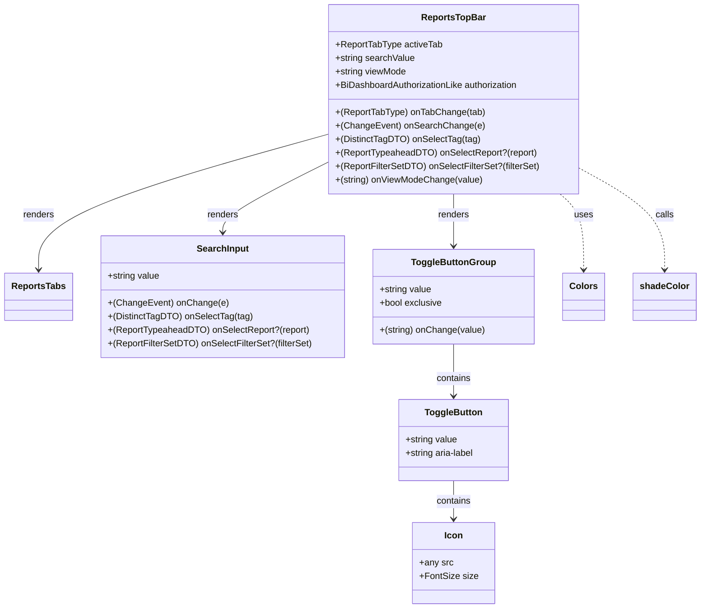

# Diagram: web/portal/src/pages/reports/bi-dashboard-next/components/organisms/Reports.TopBar.organism.tsx


> Auto-generated by Obscura crawlers

## Diagram 1



### SVG

<svg id="container" width="1215.1328125" xmlns="http://www.w3.org/2000/svg" class="classDiagram" height="1078" viewBox="0 0 1215.1328125 1078" role="graphics-document document" aria-roledescription="class"><style>#container{font-family:"trebuchet ms",verdana,arial,sans-serif;font-size:16px;fill:#333;}@keyframes edge-animation-frame{from{stroke-dashoffset:0;}}@keyframes dash{to{stroke-dashoffset:0;}}#container .edge-animation-slow{stroke-dasharray:9,5!important;stroke-dashoffset:900;animation:dash 50s linear infinite;stroke-linecap:round;}#container .edge-animation-fast{stroke-dasharray:9,5!important;stroke-dashoffset:900;animation:dash 20s linear infinite;stroke-linecap:round;}#container .error-icon{fill:#552222;}#container .error-text{fill:#552222;stroke:#552222;}#container .edge-thickness-normal{stroke-width:1px;}#container .edge-thickness-thick{stroke-width:3.5px;}#container .edge-pattern-solid{stroke-dasharray:0;}#container .edge-thickness-invisible{stroke-width:0;fill:none;}#container .edge-pattern-dashed{stroke-dasharray:3;}#container .edge-pattern-dotted{stroke-dasharray:2;}#container .marker{fill:#333333;stroke:#333333;}#container .marker.cross{stroke:#333333;}#container svg{font-family:"trebuchet ms",verdana,arial,sans-serif;font-size:16px;}#container p{margin:0;}#container g.classGroup text{fill:#9370DB;stroke:none;font-family:"trebuchet ms",verdana,arial,sans-serif;font-size:10px;}#container g.classGroup text .title{font-weight:bolder;}#container .nodeLabel,#container .edgeLabel{color:#131300;}#container .edgeLabel .label rect{fill:#ECECFF;}#container .label text{fill:#131300;}#container .labelBkg{background:#ECECFF;}#container .edgeLabel .label span{background:#ECECFF;}#container .classTitle{font-weight:bolder;}#container .node rect,#container .node circle,#container .node ellipse,#container .node polygon,#container .node path{fill:#ECECFF;stroke:#9370DB;stroke-width:1px;}#container .divider{stroke:#9370DB;stroke-width:1;}#container g.clickable{cursor:pointer;}#container g.classGroup rect{fill:#ECECFF;stroke:#9370DB;}#container g.classGroup line{stroke:#9370DB;stroke-width:1;}#container .classLabel .box{stroke:none;stroke-width:0;fill:#ECECFF;opacity:0.5;}#container .classLabel .label{fill:#9370DB;font-size:10px;}#container .relation{stroke:#333333;stroke-width:1;fill:none;}#container .dashed-line{stroke-dasharray:3;}#container .dotted-line{stroke-dasharray:1 2;}#container #compositionStart,#container .composition{fill:#333333!important;stroke:#333333!important;stroke-width:1;}#container #compositionEnd,#container .composition{fill:#333333!important;stroke:#333333!important;stroke-width:1;}#container #dependencyStart,#container .dependency{fill:#333333!important;stroke:#333333!important;stroke-width:1;}#container #dependencyStart,#container .dependency{fill:#333333!important;stroke:#333333!important;stroke-width:1;}#container #extensionStart,#container .extension{fill:transparent!important;stroke:#333333!important;stroke-width:1;}#container #extensionEnd,#container .extension{fill:transparent!important;stroke:#333333!important;stroke-width:1;}#container #aggregationStart,#container .aggregation{fill:transparent!important;stroke:#333333!important;stroke-width:1;}#container #aggregationEnd,#container .aggregation{fill:transparent!important;stroke:#333333!important;stroke-width:1;}#container #lollipopStart,#container .lollipop{fill:#ECECFF!important;stroke:#333333!important;stroke-width:1;}#container #lollipopEnd,#container .lollipop{fill:#ECECFF!important;stroke:#333333!important;stroke-width:1;}#container .edgeTerminals{font-size:11px;line-height:initial;}#container .classTitleText{text-anchor:middle;font-size:18px;fill:#333;}#container .label-icon{display:inline-block;height:1em;overflow:visible;vertical-align:-0.125em;}#container .node .label-icon path{fill:currentColor;stroke:revert;stroke-width:revert;}#container :root{--mermaid-font-family:"trebuchet ms",verdana,arial,sans-serif;}</style><g><defs><marker id="container_class-aggregationStart" class="marker aggregation class" refX="18" refY="7" markerWidth="190" markerHeight="240" orient="auto"><path d="M 18,7 L9,13 L1,7 L9,1 Z"></path></marker></defs><defs><marker id="container_class-aggregationEnd" class="marker aggregation class" refX="1" refY="7" markerWidth="20" markerHeight="28" orient="auto"><path d="M 18,7 L9,13 L1,7 L9,1 Z"></path></marker></defs><defs><marker id="container_class-extensionStart" class="marker extension class" refX="18" refY="7" markerWidth="190" markerHeight="240" orient="auto"><path d="M 1,7 L18,13 V 1 Z"></path></marker></defs><defs><marker id="container_class-extensionEnd" class="marker extension class" refX="1" refY="7" markerWidth="20" markerHeight="28" orient="auto"><path d="M 1,1 V 13 L18,7 Z"></path></marker></defs><defs><marker id="container_class-compositionStart" class="marker composition class" refX="18" refY="7" markerWidth="190" markerHeight="240" orient="auto"><path d="M 18,7 L9,13 L1,7 L9,1 Z"></path></marker></defs><defs><marker id="container_class-compositionEnd" class="marker composition class" refX="1" refY="7" markerWidth="20" markerHeight="28" orient="auto"><path d="M 18,7 L9,13 L1,7 L9,1 Z"></path></marker></defs><defs><marker id="container_class-dependencyStart" class="marker dependency class" refX="6" refY="7" markerWidth="190" markerHeight="240" orient="auto"><path d="M 5,7 L9,13 L1,7 L9,1 Z"></path></marker></defs><defs><marker id="container_class-dependencyEnd" class="marker dependency class" refX="13" refY="7" markerWidth="20" markerHeight="28" orient="auto"><path d="M 18,7 L9,13 L14,7 L9,1 Z"></path></marker></defs><defs><marker id="container_class-lollipopStart" class="marker lollipop class" refX="13" refY="7" markerWidth="190" markerHeight="240" orient="auto"><circle stroke="black" fill="transparent" cx="7" cy="7" r="6"></circle></marker></defs><defs><marker id="container_class-lollipopEnd" class="marker lollipop class" refX="1" refY="7" markerWidth="190" markerHeight="240" orient="auto"><circle stroke="black" fill="transparent" cx="7" cy="7" r="6"></circle></marker></defs><g class="root"><g class="clusters"></g><g class="edgePaths"><path d="M571.547,237.823L487.254,261.686C402.961,285.549,234.375,333.274,150.082,373.304C65.789,413.333,65.789,445.667,65.789,461.833L65.789,478" id="id_ReportsTopBar_ReportsTabs_1" class="edge-thickness-normal edge-pattern-solid relation" style=";;;" data-edge="true" data-et="edge" data-id="id_ReportsTopBar_ReportsTabs_1" data-points="W3sieCI6NTcxLjU0Njg3NSwieSI6MjM3LjgyMjkwNDMwNDY3MTQ4fSx7IngiOjY1Ljc4OTA2MjUsInkiOjM4MX0seyJ4Ijo2NS43ODkwNjI1LCJ5Ijo0ODR9XQ==" marker-end="url(#container_class-dependencyEnd)"></path><path d="M571.547,287.016L540.734,302.68C509.921,318.344,448.294,349.672,417.481,370.503C386.668,391.333,386.668,401.667,386.668,406.833L386.668,412" id="id_ReportsTopBar_SearchInput_2" class="edge-thickness-normal edge-pattern-solid relation" style=";;;" data-edge="true" data-et="edge" data-id="id_ReportsTopBar_SearchInput_2" data-points="W3sieCI6NTcxLjU0Njg3NSwieSI6Mjg3LjAxNTkzNDUxODMzMTk2fSx7IngiOjM4Ni42Njc5Njg3NSwieSI6MzgxfSx7IngiOjM4Ni42Njc5Njg3NSwieSI6NDE4fV0=" marker-end="url(#container_class-dependencyEnd)"></path><path d="M789.93,344L789.93,350.167C789.93,356.333,789.93,368.667,789.93,384C789.93,399.333,789.93,417.667,789.93,426.833L789.93,436" id="id_ReportsTopBar_ToggleButtonGroup_3" class="edge-thickness-normal edge-pattern-solid relation" style=";;;" data-edge="true" data-et="edge" data-id="id_ReportsTopBar_ToggleButtonGroup_3" data-points="W3sieCI6Nzg5LjkyOTY4NzUsInkiOjM0NH0seyJ4Ijo3ODkuOTI5Njg3NSwieSI6MzgxfSx7IngiOjc4OS45Mjk2ODc1LCJ5Ijo0NDJ9XQ==" marker-end="url(#container_class-dependencyEnd)"></path><path d="M789.93,610L789.93,620.167C789.93,630.333,789.93,650.667,789.93,666C789.93,681.333,789.93,691.667,789.93,696.833L789.93,702" id="id_ToggleButtonGroup_ToggleButton_4" class="edge-thickness-normal edge-pattern-solid relation" style=";;;" data-edge="true" data-et="edge" data-id="id_ToggleButtonGroup_ToggleButton_4" data-points="W3sieCI6Nzg5LjkyOTY4NzUsInkiOjYxMH0seyJ4Ijo3ODkuOTI5Njg3NSwieSI6NjcxfSx7IngiOjc4OS45Mjk2ODc1LCJ5Ijo3MDh9XQ==" marker-end="url(#container_class-dependencyEnd)"></path><path d="M789.93,852L789.93,858.167C789.93,864.333,789.93,876.667,789.93,888C789.93,899.333,789.93,909.667,789.93,914.833L789.93,920" id="id_ToggleButton_Icon_5" class="edge-thickness-normal edge-pattern-solid relation" style=";;;" data-edge="true" data-et="edge" data-id="id_ToggleButton_Icon_5" data-points="W3sieCI6Nzg5LjkyOTY4NzUsInkiOjg1Mn0seyJ4Ijo3ODkuOTI5Njg3NSwieSI6ODg5fSx7IngiOjc4OS45Mjk2ODc1LCJ5Ijo5MjZ9XQ==" marker-end="url(#container_class-dependencyEnd)"></path><path d="M974.544,344L981.321,350.167C988.097,356.333,1001.65,368.667,1008.427,391C1015.203,413.333,1015.203,445.667,1015.203,461.833L1015.203,478" id="id_ReportsTopBar_Colors_6" class="edge-thickness-normal edge-pattern-dashed relation" style=";;;" data-edge="true" data-et="edge" data-id="id_ReportsTopBar_Colors_6" data-points="W3sieCI6OTc0LjU0NDAxNjc2ODI5MjcsInkiOjM0NH0seyJ4IjoxMDE1LjIwMzEyNSwieSI6MzgxfSx7IngiOjEwMTUuMjAzMTI1LCJ5Ijo0ODR9XQ==" marker-end="url(#container_class-dependencyEnd)"></path><path d="M1008.313,299.062L1032.547,312.718C1056.781,326.374,1105.25,353.687,1129.484,383.51C1153.719,413.333,1153.719,445.667,1153.719,461.833L1153.719,478" id="id_ReportsTopBar_shadeColor_7" class="edge-thickness-normal edge-pattern-dashed relation" style=";;;" data-edge="true" data-et="edge" data-id="id_ReportsTopBar_shadeColor_7" data-points="W3sieCI6MTAwOC4zMTI1LCJ5IjoyOTkuMDYxNjM0Mjc0NjY5OH0seyJ4IjoxMTUzLjcxODc1LCJ5IjozODF9LHsieCI6MTE1My43MTg3NSwieSI6NDg0fV0=" marker-end="url(#container_class-dependencyEnd)"></path></g><g class="edgeLabels"><g class="edgeLabel" transform="translate(65.7890625, 381)"><g class="label" data-id="id_ReportsTopBar_ReportsTabs_1" transform="translate(-27.75, -12)"><foreignObject width="55.5" height="24"><div xmlns="http://www.w3.org/1999/xhtml" class="labelBkg" style="display: table-cell; white-space: nowrap; line-height: 1.5; max-width: 200px; text-align: center;"><span class="edgeLabel"><p>renders</p></span></div></foreignObject></g></g><g class="edgeLabel" transform="translate(386.66796875, 381)"><g class="label" data-id="id_ReportsTopBar_SearchInput_2" transform="translate(-27.75, -12)"><foreignObject width="55.5" height="24"><div xmlns="http://www.w3.org/1999/xhtml" class="labelBkg" style="display: table-cell; white-space: nowrap; line-height: 1.5; max-width: 200px; text-align: center;"><span class="edgeLabel"><p>renders</p></span></div></foreignObject></g></g><g class="edgeLabel" transform="translate(789.9296875, 381)"><g class="label" data-id="id_ReportsTopBar_ToggleButtonGroup_3" transform="translate(-27.75, -12)"><foreignObject width="55.5" height="24"><div xmlns="http://www.w3.org/1999/xhtml" class="labelBkg" style="display: table-cell; white-space: nowrap; line-height: 1.5; max-width: 200px; text-align: center;"><span class="edgeLabel"><p>renders</p></span></div></foreignObject></g></g><g class="edgeLabel" transform="translate(789.9296875, 671)"><g class="label" data-id="id_ToggleButtonGroup_ToggleButton_4" transform="translate(-30.890625, -12)"><foreignObject width="61.78125" height="24"><div xmlns="http://www.w3.org/1999/xhtml" class="labelBkg" style="display: table-cell; white-space: nowrap; line-height: 1.5; max-width: 200px; text-align: center;"><span class="edgeLabel"><p>contains</p></span></div></foreignObject></g></g><g class="edgeLabel" transform="translate(789.9296875, 889)"><g class="label" data-id="id_ToggleButton_Icon_5" transform="translate(-30.890625, -12)"><foreignObject width="61.78125" height="24"><div xmlns="http://www.w3.org/1999/xhtml" class="labelBkg" style="display: table-cell; white-space: nowrap; line-height: 1.5; max-width: 200px; text-align: center;"><span class="edgeLabel"><p>contains</p></span></div></foreignObject></g></g><g class="edgeLabel" transform="translate(1015.203125, 381)"><g class="label" data-id="id_ReportsTopBar_Colors_6" transform="translate(-16.4921875, -12)"><foreignObject width="32.984375" height="24"><div xmlns="http://www.w3.org/1999/xhtml" class="labelBkg" style="display: table-cell; white-space: nowrap; line-height: 1.5; max-width: 200px; text-align: center;"><span class="edgeLabel"><p>uses</p></span></div></foreignObject></g></g><g class="edgeLabel" transform="translate(1153.71875, 381)"><g class="label" data-id="id_ReportsTopBar_shadeColor_7" transform="translate(-16.4453125, -12)"><foreignObject width="32.890625" height="24"><div xmlns="http://www.w3.org/1999/xhtml" class="labelBkg" style="display: table-cell; white-space: nowrap; line-height: 1.5; max-width: 200px; text-align: center;"><span class="edgeLabel"><p>calls</p></span></div></foreignObject></g></g></g><g class="nodes"><g class="node default" id="classId-ReportsTopBar-0" transform="translate(789.9296875, 176)"><g class="basic label-container"><path d="M-218.3828125 -168 L218.3828125 -168 L218.3828125 168 L-218.3828125 168" stroke="none" stroke-width="0" fill="#ECECFF" style=""></path><path d="M-218.3828125 -168 C-74.03058263154065 -168, 70.3216472369187 -168, 218.3828125 -168 M-218.3828125 -168 C-128.71668059499996 -168, -39.05054868999994 -168, 218.3828125 -168 M218.3828125 -168 C218.3828125 -77.32078048445081, 218.3828125 13.358439031098385, 218.3828125 168 M218.3828125 -168 C218.3828125 -40.12478342477972, 218.3828125 87.75043315044056, 218.3828125 168 M218.3828125 168 C116.69502281490908 168, 15.007233129818161 168, -218.3828125 168 M218.3828125 168 C99.2997743280416 168, -19.783263843916814 168, -218.3828125 168 M-218.3828125 168 C-218.3828125 94.00772092064685, -218.3828125 20.015441841293693, -218.3828125 -168 M-218.3828125 168 C-218.3828125 89.47473680219633, -218.3828125 10.949473604392665, -218.3828125 -168" stroke="#9370DB" stroke-width="1.3" fill="none" stroke-dasharray="0 0" style=""></path></g><g class="annotation-group text" transform="translate(0, -144)"></g><g class="label-group text" transform="translate(-54.703125, -144)"><g class="label" style="font-weight: bolder" transform="translate(0,-12)"><foreignObject width="109.40625" height="24"><div xmlns="http://www.w3.org/1999/xhtml" style="display: table-cell; white-space: nowrap; line-height: 1.5; max-width: 158px; text-align: center;"><span class="nodeLabel markdown-node-label" style=""><p>ReportsTopBar</p></span></div></foreignObject></g></g><g class="members-group text" transform="translate(-206.3828125, -96)"><g class="label" style="" transform="translate(0,-12)"><foreignObject width="189.453125" height="24"><div xmlns="http://www.w3.org/1999/xhtml" style="display: table-cell; white-space: nowrap; line-height: 1.5; max-width: 247px; text-align: center;"><span class="nodeLabel markdown-node-label" style=""><p>+ReportTabType activeTab</p></span></div></foreignObject></g><g class="label" style="" transform="translate(0,12)"><foreignObject width="140.84375" height="24"><div xmlns="http://www.w3.org/1999/xhtml" style="display: table-cell; white-space: nowrap; line-height: 1.5; max-width: 198px; text-align: center;"><span class="nodeLabel markdown-node-label" style=""><p>+string searchValue</p></span></div></foreignObject></g><g class="label" style="" transform="translate(0,36)"><foreignObject width="126.515625" height="24"><div xmlns="http://www.w3.org/1999/xhtml" style="display: table-cell; white-space: nowrap; line-height: 1.5; max-width: 184px; text-align: center;"><span class="nodeLabel markdown-node-label" style=""><p>+string viewMode</p></span></div></foreignObject></g><g class="label" style="" transform="translate(0,60)"><foreignObject width="329.703125" height="24"><div xmlns="http://www.w3.org/1999/xhtml" style="display: table-cell; white-space: nowrap; line-height: 1.5; max-width: 387px; text-align: center;"><span class="nodeLabel markdown-node-label" style=""><p>+BiDashboardAuthorizationLike authorization</p></span></div></foreignObject></g></g><g class="methods-group text" transform="translate(-206.3828125, 24)"><g class="label" style="" transform="translate(0,-12)"><foreignObject width="262.640625" height="24"><div xmlns="http://www.w3.org/1999/xhtml" style="display: table-cell; white-space: nowrap; line-height: 1.5; max-width: 320px; text-align: center;"><span class="nodeLabel markdown-node-label" style=""><p>+(ReportTabType) onTabChange(tab)</p></span></div></foreignObject></g><g class="label" style="" transform="translate(0,12)"><foreignObject width="255.109375" height="24"><div xmlns="http://www.w3.org/1999/xhtml" style="display: table-cell; white-space: nowrap; line-height: 1.5; max-width: 312px; text-align: center;"><span class="nodeLabel markdown-node-label" style=""><p>+(ChangeEvent) onSearchChange(e)</p></span></div></foreignObject></g><g class="label" style="" transform="translate(0,36)"><foreignObject width="250.984375" height="24"><div xmlns="http://www.w3.org/1999/xhtml" style="display: table-cell; white-space: nowrap; line-height: 1.5; max-width: 308px; text-align: center;"><span class="nodeLabel markdown-node-label" style=""><p>+(DistinctTagDTO) onSelectTag(tag)</p></span></div></foreignObject></g><g class="label" style="" transform="translate(0,60)"><foreignObject width="352.890625" height="24"><div xmlns="http://www.w3.org/1999/xhtml" style="display: table-cell; white-space: nowrap; line-height: 1.5; max-width: 410px; text-align: center;"><span class="nodeLabel markdown-node-label" style=""><p>+(ReportTypeaheadDTO) onSelectReport?(report)</p></span></div></foreignObject></g><g class="label" style="" transform="translate(0,84)"><foreignObject width="358.0625" height="24"><div xmlns="http://www.w3.org/1999/xhtml" style="display: table-cell; white-space: nowrap; line-height: 1.5; max-width: 415px; text-align: center;"><span class="nodeLabel markdown-node-label" style=""><p>+(ReportFilterSetDTO) onSelectFilterSet?(filterSet)</p></span></div></foreignObject></g><g class="label" style="" transform="translate(0,108)"><foreignObject width="258.921875" height="24"><div xmlns="http://www.w3.org/1999/xhtml" style="display: table-cell; white-space: nowrap; line-height: 1.5; max-width: 316px; text-align: center;"><span class="nodeLabel markdown-node-label" style=""><p>+(string) onViewModeChange(value)</p></span></div></foreignObject></g></g><g class="divider" style=""><path d="M-218.3828125 -120 C-112.92226284321008 -120, -7.461713186420155 -120, 218.3828125 -120 M-218.3828125 -120 C-63.31155724318009 -120, 91.75969801363982 -120, 218.3828125 -120" stroke="#9370DB" stroke-width="1.3" fill="none" stroke-dasharray="0 0" style=""></path></g><g class="divider" style=""><path d="M-218.3828125 0 C-59.63530451891208 0, 99.11220346217584 0, 218.3828125 0 M-218.3828125 0 C-130.78015327001194 0, -43.17749404002387 0, 218.3828125 0" stroke="#9370DB" stroke-width="1.3" fill="none" stroke-dasharray="0 0" style=""></path></g></g><g class="node default" id="classId-ReportsTabs-1" transform="translate(65.7890625, 526)"><g class="basic label-container"><path d="M-57.7890625 -42 L57.7890625 -42 L57.7890625 42 L-57.7890625 42" stroke="none" stroke-width="0" fill="#ECECFF" style=""></path><path d="M-57.7890625 -42 C-34.24367625349385 -42, -10.698290006987705 -42, 57.7890625 -42 M-57.7890625 -42 C-22.843696354724365 -42, 12.10166979055127 -42, 57.7890625 -42 M57.7890625 -42 C57.7890625 -12.615520539016433, 57.7890625 16.768958921967133, 57.7890625 42 M57.7890625 -42 C57.7890625 -17.22147291410141, 57.7890625 7.5570541717971835, 57.7890625 42 M57.7890625 42 C18.4423280797702 42, -20.9044063404596 42, -57.7890625 42 M57.7890625 42 C26.0981559217806 42, -5.5927506564388025 42, -57.7890625 42 M-57.7890625 42 C-57.7890625 19.31531222891991, -57.7890625 -3.369375542160178, -57.7890625 -42 M-57.7890625 42 C-57.7890625 15.660102614766274, -57.7890625 -10.679794770467453, -57.7890625 -42" stroke="#9370DB" stroke-width="1.3" fill="none" stroke-dasharray="0 0" style=""></path></g><g class="annotation-group text" transform="translate(0, -18)"></g><g class="label-group text" transform="translate(-45.7890625, -18)"><g class="label" style="font-weight: bolder" transform="translate(0,-12)"><foreignObject width="91.578125" height="24"><div xmlns="http://www.w3.org/1999/xhtml" style="display: table-cell; white-space: nowrap; line-height: 1.5; max-width: 140px; text-align: center;"><span class="nodeLabel markdown-node-label" style=""><p>ReportsTabs</p></span></div></foreignObject></g></g><g class="members-group text" transform="translate(-45.7890625, 30)"></g><g class="methods-group text" transform="translate(-45.7890625, 60)"></g><g class="divider" style=""><path d="M-57.7890625 6 C-28.77677571116571 6, 0.23551107766858337 6, 57.7890625 6 M-57.7890625 6 C-16.212093180050452 6, 25.364876139899096 6, 57.7890625 6" stroke="#9370DB" stroke-width="1.3" fill="none" stroke-dasharray="0 0" style=""></path></g><g class="divider" style=""><path d="M-57.7890625 24 C-32.89774129462717 24, -8.006420089254341 24, 57.7890625 24 M-57.7890625 24 C-32.85955369436293 24, -7.93004488872586 24, 57.7890625 24" stroke="#9370DB" stroke-width="1.3" fill="none" stroke-dasharray="0 0" style=""></path></g></g><g class="node default" id="classId-SearchInput-2" transform="translate(386.66796875, 526)"><g class="basic label-container"><path d="M-213.08984375 -108 L213.08984375 -108 L213.08984375 108 L-213.08984375 108" stroke="none" stroke-width="0" fill="#ECECFF" style=""></path><path d="M-213.08984375 -108 C-95.63286250196624 -108, 21.824118746067512 -108, 213.08984375 -108 M-213.08984375 -108 C-89.7248239579359 -108, 33.64019583412821 -108, 213.08984375 -108 M213.08984375 -108 C213.08984375 -54.15168256543912, 213.08984375 -0.3033651308782339, 213.08984375 108 M213.08984375 -108 C213.08984375 -62.648472342745976, 213.08984375 -17.29694468549195, 213.08984375 108 M213.08984375 108 C73.37411212156121 108, -66.34161950687758 108, -213.08984375 108 M213.08984375 108 C91.05055346515918 108, -30.988736819681634 108, -213.08984375 108 M-213.08984375 108 C-213.08984375 59.225323695979164, -213.08984375 10.450647391958327, -213.08984375 -108 M-213.08984375 108 C-213.08984375 36.023890406150656, -213.08984375 -35.95221918769869, -213.08984375 -108" stroke="#9370DB" stroke-width="1.3" fill="none" stroke-dasharray="0 0" style=""></path></g><g class="annotation-group text" transform="translate(0, -84)"></g><g class="label-group text" transform="translate(-44.1171875, -84)"><g class="label" style="font-weight: bolder" transform="translate(0,-12)"><foreignObject width="88.234375" height="24"><div xmlns="http://www.w3.org/1999/xhtml" style="display: table-cell; white-space: nowrap; line-height: 1.5; max-width: 138px; text-align: center;"><span class="nodeLabel markdown-node-label" style=""><p>SearchInput</p></span></div></foreignObject></g></g><g class="members-group text" transform="translate(-201.08984375, -36)"><g class="label" style="" transform="translate(0,-12)"><foreignObject width="92.75" height="24"><div xmlns="http://www.w3.org/1999/xhtml" style="display: table-cell; white-space: nowrap; line-height: 1.5; max-width: 150px; text-align: center;"><span class="nodeLabel markdown-node-label" style=""><p>+string value</p></span></div></foreignObject></g></g><g class="methods-group text" transform="translate(-201.08984375, 12)"><g class="label" style="" transform="translate(0,-12)"><foreignObject width="206.40625" height="24"><div xmlns="http://www.w3.org/1999/xhtml" style="display: table-cell; white-space: nowrap; line-height: 1.5; max-width: 264px; text-align: center;"><span class="nodeLabel markdown-node-label" style=""><p>+(ChangeEvent) onChange(e)</p></span></div></foreignObject></g><g class="label" style="" transform="translate(0,12)"><foreignObject width="250.984375" height="24"><div xmlns="http://www.w3.org/1999/xhtml" style="display: table-cell; white-space: nowrap; line-height: 1.5; max-width: 308px; text-align: center;"><span class="nodeLabel markdown-node-label" style=""><p>+(DistinctTagDTO) onSelectTag(tag)</p></span></div></foreignObject></g><g class="label" style="" transform="translate(0,36)"><foreignObject width="352.890625" height="24"><div xmlns="http://www.w3.org/1999/xhtml" style="display: table-cell; white-space: nowrap; line-height: 1.5; max-width: 410px; text-align: center;"><span class="nodeLabel markdown-node-label" style=""><p>+(ReportTypeaheadDTO) onSelectReport?(report)</p></span></div></foreignObject></g><g class="label" style="" transform="translate(0,60)"><foreignObject width="358.0625" height="24"><div xmlns="http://www.w3.org/1999/xhtml" style="display: table-cell; white-space: nowrap; line-height: 1.5; max-width: 415px; text-align: center;"><span class="nodeLabel markdown-node-label" style=""><p>+(ReportFilterSetDTO) onSelectFilterSet?(filterSet)</p></span></div></foreignObject></g></g><g class="divider" style=""><path d="M-213.08984375 -60 C-53.64606019233429 -60, 105.79772336533142 -60, 213.08984375 -60 M-213.08984375 -60 C-74.84153067464854 -60, 63.40678240070292 -60, 213.08984375 -60" stroke="#9370DB" stroke-width="1.3" fill="none" stroke-dasharray="0 0" style=""></path></g><g class="divider" style=""><path d="M-213.08984375 -12 C-127.68257121514235 -12, -42.27529868028469 -12, 213.08984375 -12 M-213.08984375 -12 C-84.56728141668896 -12, 43.95528091662209 -12, 213.08984375 -12" stroke="#9370DB" stroke-width="1.3" fill="none" stroke-dasharray="0 0" style=""></path></g></g><g class="node default" id="classId-ToggleButtonGroup-3" transform="translate(789.9296875, 526)"><g class="basic label-container"><path d="M-140.171875 -84 L140.171875 -84 L140.171875 84 L-140.171875 84" stroke="none" stroke-width="0" fill="#ECECFF" style=""></path><path d="M-140.171875 -84 C-51.62247363034331 -84, 36.926927739313385 -84, 140.171875 -84 M-140.171875 -84 C-76.17987366310524 -84, -12.187872326210481 -84, 140.171875 -84 M140.171875 -84 C140.171875 -42.02526224134763, 140.171875 -0.050524482695266215, 140.171875 84 M140.171875 -84 C140.171875 -43.65833892223285, 140.171875 -3.3166778444657012, 140.171875 84 M140.171875 84 C67.50459139704971 84, -5.1626922059005835 84, -140.171875 84 M140.171875 84 C32.307473825491314 84, -75.55692734901737 84, -140.171875 84 M-140.171875 84 C-140.171875 23.171133811165603, -140.171875 -37.65773237766879, -140.171875 -84 M-140.171875 84 C-140.171875 38.004581863992726, -140.171875 -7.990836272014548, -140.171875 -84" stroke="#9370DB" stroke-width="1.3" fill="none" stroke-dasharray="0 0" style=""></path></g><g class="annotation-group text" transform="translate(0, -60)"></g><g class="label-group text" transform="translate(-71.109375, -60)"><g class="label" style="font-weight: bolder" transform="translate(0,-12)"><foreignObject width="142.21875" height="24"><div xmlns="http://www.w3.org/1999/xhtml" style="display: table-cell; white-space: nowrap; line-height: 1.5; max-width: 190px; text-align: center;"><span class="nodeLabel markdown-node-label" style=""><p>ToggleButtonGroup</p></span></div></foreignObject></g></g><g class="members-group text" transform="translate(-128.171875, -12)"><g class="label" style="" transform="translate(0,-12)"><foreignObject width="92.75" height="24"><div xmlns="http://www.w3.org/1999/xhtml" style="display: table-cell; white-space: nowrap; line-height: 1.5; max-width: 150px; text-align: center;"><span class="nodeLabel markdown-node-label" style=""><p>+string value</p></span></div></foreignObject></g><g class="label" style="" transform="translate(0,12)"><foreignObject width="111.46875" height="24"><div xmlns="http://www.w3.org/1999/xhtml" style="display: table-cell; white-space: nowrap; line-height: 1.5; max-width: 169px; text-align: center;"><span class="nodeLabel markdown-node-label" style=""><p>+bool exclusive</p></span></div></foreignObject></g></g><g class="methods-group text" transform="translate(-128.171875, 60)"><g class="label" style="" transform="translate(0,-12)"><foreignObject width="185.234375" height="24"><div xmlns="http://www.w3.org/1999/xhtml" style="display: table-cell; white-space: nowrap; line-height: 1.5; max-width: 243px; text-align: center;"><span class="nodeLabel markdown-node-label" style=""><p>+(string) onChange(value)</p></span></div></foreignObject></g></g><g class="divider" style=""><path d="M-140.171875 -36 C-78.28402245131262 -36, -16.396169902625246 -36, 140.171875 -36 M-140.171875 -36 C-55.22290768450493 -36, 29.726059630990136 -36, 140.171875 -36" stroke="#9370DB" stroke-width="1.3" fill="none" stroke-dasharray="0 0" style=""></path></g><g class="divider" style=""><path d="M-140.171875 36 C-53.31630341452906 36, 33.53926817094188 36, 140.171875 36 M-140.171875 36 C-41.80906252536347 36, 56.553749949273055 36, 140.171875 36" stroke="#9370DB" stroke-width="1.3" fill="none" stroke-dasharray="0 0" style=""></path></g></g><g class="node default" id="classId-ToggleButton-4" transform="translate(789.9296875, 780)"><g class="basic label-container"><path d="M-98.7109375 -72 L98.7109375 -72 L98.7109375 72 L-98.7109375 72" stroke="none" stroke-width="0" fill="#ECECFF" style=""></path><path d="M-98.7109375 -72 C-36.42972751565787 -72, 25.851482468684253 -72, 98.7109375 -72 M-98.7109375 -72 C-20.71322906637569 -72, 57.28447936724862 -72, 98.7109375 -72 M98.7109375 -72 C98.7109375 -33.6690733874834, 98.7109375 4.661853225033198, 98.7109375 72 M98.7109375 -72 C98.7109375 -38.11825993106449, 98.7109375 -4.236519862128986, 98.7109375 72 M98.7109375 72 C47.729901951301166 72, -3.2511335973976685 72, -98.7109375 72 M98.7109375 72 C24.839738270209594 72, -49.03146095958081 72, -98.7109375 72 M-98.7109375 72 C-98.7109375 25.36317673529401, -98.7109375 -21.273646529411977, -98.7109375 -72 M-98.7109375 72 C-98.7109375 24.971202085766457, -98.7109375 -22.057595828467086, -98.7109375 -72" stroke="#9370DB" stroke-width="1.3" fill="none" stroke-dasharray="0 0" style=""></path></g><g class="annotation-group text" transform="translate(0, -48)"></g><g class="label-group text" transform="translate(-48.953125, -48)"><g class="label" style="font-weight: bolder" transform="translate(0,-12)"><foreignObject width="97.90625" height="24"><div xmlns="http://www.w3.org/1999/xhtml" style="display: table-cell; white-space: nowrap; line-height: 1.5; max-width: 146px; text-align: center;"><span class="nodeLabel markdown-node-label" style=""><p>ToggleButton</p></span></div></foreignObject></g></g><g class="members-group text" transform="translate(-86.7109375, 0)"><g class="label" style="" transform="translate(0,-12)"><foreignObject width="92.75" height="24"><div xmlns="http://www.w3.org/1999/xhtml" style="display: table-cell; white-space: nowrap; line-height: 1.5; max-width: 150px; text-align: center;"><span class="nodeLabel markdown-node-label" style=""><p>+string value</p></span></div></foreignObject></g><g class="label" style="" transform="translate(0,12)"><foreignObject width="124.46875" height="24"><div xmlns="http://www.w3.org/1999/xhtml" style="display: table-cell; white-space: nowrap; line-height: 1.5; max-width: 182px; text-align: center;"><span class="nodeLabel markdown-node-label" style=""><p>+string aria-label</p></span></div></foreignObject></g></g><g class="methods-group text" transform="translate(-86.7109375, 72)"></g><g class="divider" style=""><path d="M-98.7109375 -24 C-55.794570429626745 -24, -12.87820335925349 -24, 98.7109375 -24 M-98.7109375 -24 C-37.612909228308446 -24, 23.485119043383108 -24, 98.7109375 -24" stroke="#9370DB" stroke-width="1.3" fill="none" stroke-dasharray="0 0" style=""></path></g><g class="divider" style=""><path d="M-98.7109375 48 C-36.66443685455859 48, 25.382063790882825 48, 98.7109375 48 M-98.7109375 48 C-36.228607920458835 48, 26.25372165908233 48, 98.7109375 48" stroke="#9370DB" stroke-width="1.3" fill="none" stroke-dasharray="0 0" style=""></path></g></g><g class="node default" id="classId-Icon-5" transform="translate(789.9296875, 998)"><g class="basic label-container"><path d="M-69.87109375 -72 L69.87109375 -72 L69.87109375 72 L-69.87109375 72" stroke="none" stroke-width="0" fill="#ECECFF" style=""></path><path d="M-69.87109375 -72 C-30.960807876778084 -72, 7.949477996443832 -72, 69.87109375 -72 M-69.87109375 -72 C-18.49562970085713 -72, 32.87983434828574 -72, 69.87109375 -72 M69.87109375 -72 C69.87109375 -30.279813468510163, 69.87109375 11.440373062979674, 69.87109375 72 M69.87109375 -72 C69.87109375 -23.732608072517365, 69.87109375 24.53478385496527, 69.87109375 72 M69.87109375 72 C34.01542923631459 72, -1.840235277370823 72, -69.87109375 72 M69.87109375 72 C21.612803269163166 72, -26.645487211673668 72, -69.87109375 72 M-69.87109375 72 C-69.87109375 16.373146197620144, -69.87109375 -39.25370760475971, -69.87109375 -72 M-69.87109375 72 C-69.87109375 34.36638347145466, -69.87109375 -3.267233057090678, -69.87109375 -72" stroke="#9370DB" stroke-width="1.3" fill="none" stroke-dasharray="0 0" style=""></path></g><g class="annotation-group text" transform="translate(0, -48)"></g><g class="label-group text" transform="translate(-15.3046875, -48)"><g class="label" style="font-weight: bolder" transform="translate(0,-12)"><foreignObject width="30.609375" height="24"><div xmlns="http://www.w3.org/1999/xhtml" style="display: table-cell; white-space: nowrap; line-height: 1.5; max-width: 81px; text-align: center;"><span class="nodeLabel markdown-node-label" style=""><p>Icon</p></span></div></foreignObject></g></g><g class="members-group text" transform="translate(-57.87109375, 0)"><g class="label" style="" transform="translate(0,-12)"><foreignObject width="58.640625" height="24"><div xmlns="http://www.w3.org/1999/xhtml" style="display: table-cell; white-space: nowrap; line-height: 1.5; max-width: 116px; text-align: center;"><span class="nodeLabel markdown-node-label" style=""><p>+any src</p></span></div></foreignObject></g><g class="label" style="" transform="translate(0,12)"><foreignObject width="100.4375" height="24"><div xmlns="http://www.w3.org/1999/xhtml" style="display: table-cell; white-space: nowrap; line-height: 1.5; max-width: 158px; text-align: center;"><span class="nodeLabel markdown-node-label" style=""><p>+FontSize size</p></span></div></foreignObject></g></g><g class="methods-group text" transform="translate(-57.87109375, 72)"></g><g class="divider" style=""><path d="M-69.87109375 -24 C-33.33783522950928 -24, 3.195423290981438 -24, 69.87109375 -24 M-69.87109375 -24 C-22.641513136717514 -24, 24.588067476564973 -24, 69.87109375 -24" stroke="#9370DB" stroke-width="1.3" fill="none" stroke-dasharray="0 0" style=""></path></g><g class="divider" style=""><path d="M-69.87109375 48 C-34.799186579910334 48, 0.2727205901793326 48, 69.87109375 48 M-69.87109375 48 C-39.67646159288256 48, -9.481829435765114 48, 69.87109375 48" stroke="#9370DB" stroke-width="1.3" fill="none" stroke-dasharray="0 0" style=""></path></g></g><g class="node default" id="classId-Colors-6" transform="translate(1015.203125, 526)"><g class="basic label-container"><path d="M-35.1015625 -42 L35.1015625 -42 L35.1015625 42 L-35.1015625 42" stroke="none" stroke-width="0" fill="#ECECFF" style=""></path><path d="M-35.1015625 -42 C-14.903209580836783 -42, 5.295143338326433 -42, 35.1015625 -42 M-35.1015625 -42 C-13.885476954171121 -42, 7.330608591657757 -42, 35.1015625 -42 M35.1015625 -42 C35.1015625 -21.433607619934268, 35.1015625 -0.8672152398685355, 35.1015625 42 M35.1015625 -42 C35.1015625 -19.48207688013742, 35.1015625 3.03584623972516, 35.1015625 42 M35.1015625 42 C16.584135467134182 42, -1.9332915657316363 42, -35.1015625 42 M35.1015625 42 C9.494742408383065 42, -16.11207768323387 42, -35.1015625 42 M-35.1015625 42 C-35.1015625 8.62686890922135, -35.1015625 -24.7462621815573, -35.1015625 -42 M-35.1015625 42 C-35.1015625 24.572637204543657, -35.1015625 7.145274409087314, -35.1015625 -42" stroke="#9370DB" stroke-width="1.3" fill="none" stroke-dasharray="0 0" style=""></path></g><g class="annotation-group text" transform="translate(0, -18)"></g><g class="label-group text" transform="translate(-23.1015625, -18)"><g class="label" style="font-weight: bolder" transform="translate(0,-12)"><foreignObject width="46.203125" height="24"><div xmlns="http://www.w3.org/1999/xhtml" style="display: table-cell; white-space: nowrap; line-height: 1.5; max-width: 95px; text-align: center;"><span class="nodeLabel markdown-node-label" style=""><p>Colors</p></span></div></foreignObject></g></g><g class="members-group text" transform="translate(-23.1015625, 30)"></g><g class="methods-group text" transform="translate(-23.1015625, 60)"></g><g class="divider" style=""><path d="M-35.1015625 6 C-8.387692588207202 6, 18.326177323585597 6, 35.1015625 6 M-35.1015625 6 C-15.03720095995061 6, 5.02716058009878 6, 35.1015625 6" stroke="#9370DB" stroke-width="1.3" fill="none" stroke-dasharray="0 0" style=""></path></g><g class="divider" style=""><path d="M-35.1015625 24 C-13.54844589938429 24, 8.004670701231419 24, 35.1015625 24 M-35.1015625 24 C-7.3559071283149144 24, 20.38974824337017 24, 35.1015625 24" stroke="#9370DB" stroke-width="1.3" fill="none" stroke-dasharray="0 0" style=""></path></g></g><g class="node default" id="classId-shadeColor-7" transform="translate(1153.71875, 526)"><g class="basic label-container"><path d="M-53.4140625 -42 L53.4140625 -42 L53.4140625 42 L-53.4140625 42" stroke="none" stroke-width="0" fill="#ECECFF" style=""></path><path d="M-53.4140625 -42 C-16.16212090400446 -42, 21.08982069199108 -42, 53.4140625 -42 M-53.4140625 -42 C-13.516715685618095 -42, 26.38063112876381 -42, 53.4140625 -42 M53.4140625 -42 C53.4140625 -20.01384401731578, 53.4140625 1.9723119653684407, 53.4140625 42 M53.4140625 -42 C53.4140625 -22.466257962567013, 53.4140625 -2.9325159251340267, 53.4140625 42 M53.4140625 42 C31.022800375443932 42, 8.631538250887864 42, -53.4140625 42 M53.4140625 42 C26.297755278031914 42, -0.8185519439361713 42, -53.4140625 42 M-53.4140625 42 C-53.4140625 9.933164353671948, -53.4140625 -22.133671292656103, -53.4140625 -42 M-53.4140625 42 C-53.4140625 9.391269696511685, -53.4140625 -23.21746060697663, -53.4140625 -42" stroke="#9370DB" stroke-width="1.3" fill="none" stroke-dasharray="0 0" style=""></path></g><g class="annotation-group text" transform="translate(0, -18)"></g><g class="label-group text" transform="translate(-41.4140625, -18)"><g class="label" style="font-weight: bolder" transform="translate(0,-12)"><foreignObject width="82.828125" height="24"><div xmlns="http://www.w3.org/1999/xhtml" style="display: table-cell; white-space: nowrap; line-height: 1.5; max-width: 133px; text-align: center;"><span class="nodeLabel markdown-node-label" style=""><p>shadeColor</p></span></div></foreignObject></g></g><g class="members-group text" transform="translate(-41.4140625, 30)"></g><g class="methods-group text" transform="translate(-41.4140625, 60)"></g><g class="divider" style=""><path d="M-53.4140625 6 C-13.67111048238285 6, 26.0718415352343 6, 53.4140625 6 M-53.4140625 6 C-29.771595651404507 6, -6.129128802809014 6, 53.4140625 6" stroke="#9370DB" stroke-width="1.3" fill="none" stroke-dasharray="0 0" style=""></path></g><g class="divider" style=""><path d="M-53.4140625 24 C-20.90888993798537 24, 11.596282624029257 24, 53.4140625 24 M-53.4140625 24 C-30.254007429644247 24, -7.093952359288494 24, 53.4140625 24" stroke="#9370DB" stroke-width="1.3" fill="none" stroke-dasharray="0 0" style=""></path></g></g></g></g></g></svg>

## Diagram 2

```mermaid
flowchart TD
    A[ReportsTopBar] --> B[ReportsTabs]
    A --> C[Controls Container]
    C --> D[SearchInput]
    C --> E[ToggleButtonGroup]
    E --> F[ToggleButton: Row]
    E --> G[ToggleButton: Grid]
    F --> H[Icon (faRows)]
    G --> I[Icon (faGrid)]
    E -.->|onChange| A
    D -.->|onChange/onSelect| A
```

> SVG rendering failed for this diagram.
