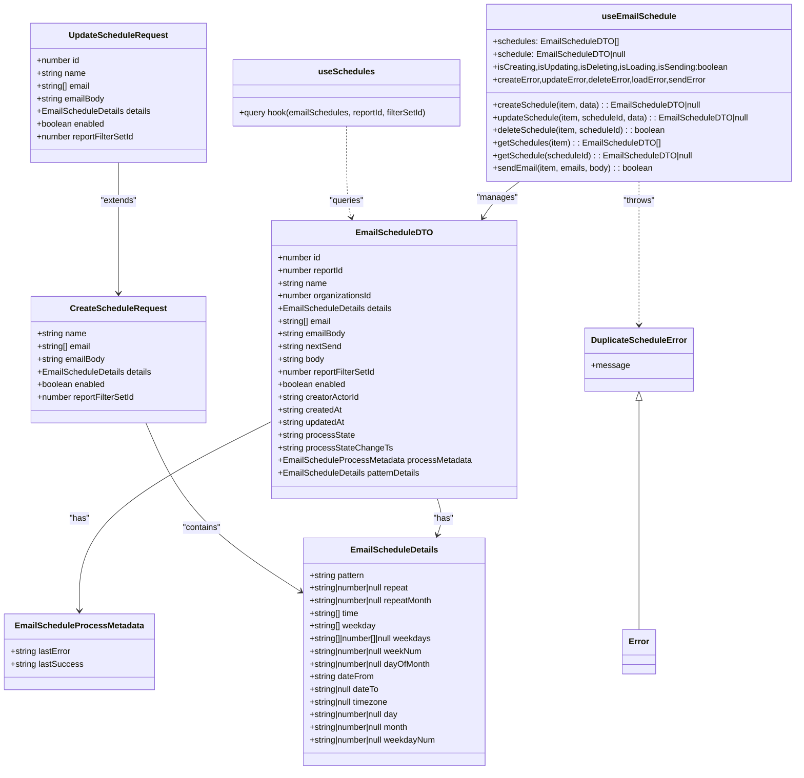
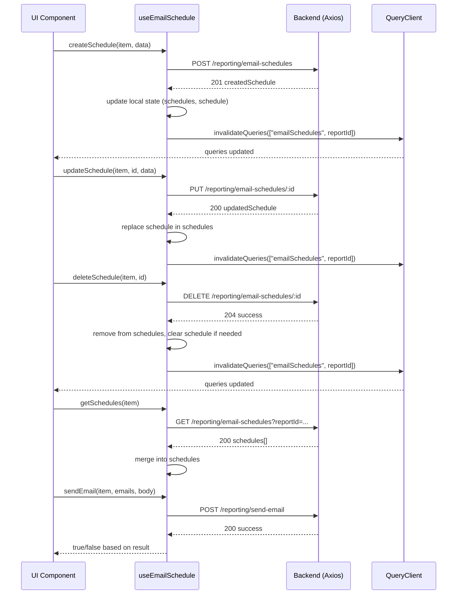

# Diagram: web/portal/src/pages/reports/bi-dashboard-next/hooks/useEmailSchedule.ts


> Auto-generated by Obscura crawlers

## Diagram 1



### SVG

<svg id="container" width="1511.1328125" xmlns="http://www.w3.org/2000/svg" class="classDiagram" height="1460" viewBox="0 0 1511.1328125 1460" role="graphics-document document" aria-roledescription="class"><style>#container{font-family:"trebuchet ms",verdana,arial,sans-serif;font-size:16px;fill:#333;}@keyframes edge-animation-frame{from{stroke-dashoffset:0;}}@keyframes dash{to{stroke-dashoffset:0;}}#container .edge-animation-slow{stroke-dasharray:9,5!important;stroke-dashoffset:900;animation:dash 50s linear infinite;stroke-linecap:round;}#container .edge-animation-fast{stroke-dasharray:9,5!important;stroke-dashoffset:900;animation:dash 20s linear infinite;stroke-linecap:round;}#container .error-icon{fill:#552222;}#container .error-text{fill:#552222;stroke:#552222;}#container .edge-thickness-normal{stroke-width:1px;}#container .edge-thickness-thick{stroke-width:3.5px;}#container .edge-pattern-solid{stroke-dasharray:0;}#container .edge-thickness-invisible{stroke-width:0;fill:none;}#container .edge-pattern-dashed{stroke-dasharray:3;}#container .edge-pattern-dotted{stroke-dasharray:2;}#container .marker{fill:#333333;stroke:#333333;}#container .marker.cross{stroke:#333333;}#container svg{font-family:"trebuchet ms",verdana,arial,sans-serif;font-size:16px;}#container p{margin:0;}#container g.classGroup text{fill:#9370DB;stroke:none;font-family:"trebuchet ms",verdana,arial,sans-serif;font-size:10px;}#container g.classGroup text .title{font-weight:bolder;}#container .nodeLabel,#container .edgeLabel{color:#131300;}#container .edgeLabel .label rect{fill:#ECECFF;}#container .label text{fill:#131300;}#container .labelBkg{background:#ECECFF;}#container .edgeLabel .label span{background:#ECECFF;}#container .classTitle{font-weight:bolder;}#container .node rect,#container .node circle,#container .node ellipse,#container .node polygon,#container .node path{fill:#ECECFF;stroke:#9370DB;stroke-width:1px;}#container .divider{stroke:#9370DB;stroke-width:1;}#container g.clickable{cursor:pointer;}#container g.classGroup rect{fill:#ECECFF;stroke:#9370DB;}#container g.classGroup line{stroke:#9370DB;stroke-width:1;}#container .classLabel .box{stroke:none;stroke-width:0;fill:#ECECFF;opacity:0.5;}#container .classLabel .label{fill:#9370DB;font-size:10px;}#container .relation{stroke:#333333;stroke-width:1;fill:none;}#container .dashed-line{stroke-dasharray:3;}#container .dotted-line{stroke-dasharray:1 2;}#container #compositionStart,#container .composition{fill:#333333!important;stroke:#333333!important;stroke-width:1;}#container #compositionEnd,#container .composition{fill:#333333!important;stroke:#333333!important;stroke-width:1;}#container #dependencyStart,#container .dependency{fill:#333333!important;stroke:#333333!important;stroke-width:1;}#container #dependencyStart,#container .dependency{fill:#333333!important;stroke:#333333!important;stroke-width:1;}#container #extensionStart,#container .extension{fill:transparent!important;stroke:#333333!important;stroke-width:1;}#container #extensionEnd,#container .extension{fill:transparent!important;stroke:#333333!important;stroke-width:1;}#container #aggregationStart,#container .aggregation{fill:transparent!important;stroke:#333333!important;stroke-width:1;}#container #aggregationEnd,#container .aggregation{fill:transparent!important;stroke:#333333!important;stroke-width:1;}#container #lollipopStart,#container .lollipop{fill:#ECECFF!important;stroke:#333333!important;stroke-width:1;}#container #lollipopEnd,#container .lollipop{fill:#ECECFF!important;stroke:#333333!important;stroke-width:1;}#container .edgeTerminals{font-size:11px;line-height:initial;}#container .classTitleText{text-anchor:middle;font-size:18px;fill:#333;}#container .label-icon{display:inline-block;height:1em;overflow:visible;vertical-align:-0.125em;}#container .node .label-icon path{fill:currentColor;stroke:revert;stroke-width:revert;}#container :root{--mermaid-font-family:"trebuchet ms",verdana,arial,sans-serif;}</style><g><defs><marker id="container_class-aggregationStart" class="marker aggregation class" refX="18" refY="7" markerWidth="190" markerHeight="240" orient="auto"><path d="M 18,7 L9,13 L1,7 L9,1 Z"></path></marker></defs><defs><marker id="container_class-aggregationEnd" class="marker aggregation class" refX="1" refY="7" markerWidth="20" markerHeight="28" orient="auto"><path d="M 18,7 L9,13 L1,7 L9,1 Z"></path></marker></defs><defs><marker id="container_class-extensionStart" class="marker extension class" refX="18" refY="7" markerWidth="190" markerHeight="240" orient="auto"><path d="M 1,7 L18,13 V 1 Z"></path></marker></defs><defs><marker id="container_class-extensionEnd" class="marker extension class" refX="1" refY="7" markerWidth="20" markerHeight="28" orient="auto"><path d="M 1,1 V 13 L18,7 Z"></path></marker></defs><defs><marker id="container_class-compositionStart" class="marker composition class" refX="18" refY="7" markerWidth="190" markerHeight="240" orient="auto"><path d="M 18,7 L9,13 L1,7 L9,1 Z"></path></marker></defs><defs><marker id="container_class-compositionEnd" class="marker composition class" refX="1" refY="7" markerWidth="20" markerHeight="28" orient="auto"><path d="M 18,7 L9,13 L1,7 L9,1 Z"></path></marker></defs><defs><marker id="container_class-dependencyStart" class="marker dependency class" refX="6" refY="7" markerWidth="190" markerHeight="240" orient="auto"><path d="M 5,7 L9,13 L1,7 L9,1 Z"></path></marker></defs><defs><marker id="container_class-dependencyEnd" class="marker dependency class" refX="13" refY="7" markerWidth="20" markerHeight="28" orient="auto"><path d="M 18,7 L9,13 L14,7 L9,1 Z"></path></marker></defs><defs><marker id="container_class-lollipopStart" class="marker lollipop class" refX="13" refY="7" markerWidth="190" markerHeight="240" orient="auto"><circle stroke="black" fill="transparent" cx="7" cy="7" r="6"></circle></marker></defs><defs><marker id="container_class-lollipopEnd" class="marker lollipop class" refX="1" refY="7" markerWidth="190" markerHeight="240" orient="auto"><circle stroke="black" fill="transparent" cx="7" cy="7" r="6"></circle></marker></defs><g class="root"><g class="clusters"></g><g class="edgePaths"><path d="M828.961,946L830.83,952.167C832.7,958.333,836.44,970.667,836.425,982.059C836.409,993.452,832.639,1003.904,830.753,1009.13L828.868,1014.356" id="id_EmailScheduleDTO_EmailScheduleDetails_1" class="edge-thickness-normal edge-pattern-solid relation" style=";;;" data-edge="true" data-et="edge" data-id="id_EmailScheduleDTO_EmailScheduleDetails_1" data-points="W3sieCI6ODI4Ljk2MDUwOTI0MDAzMzIsInkiOjk0Nn0seyJ4Ijo4NDAuMTc5Njg3NSwieSI6OTgzfSx7IngiOjgyNi44MzE5Njk0OTExMDY3LCJ5IjoxMDIwfV0=" marker-end="url(#container_class-dependencyEnd)"></path><path d="M520.176,796.252L457.864,827.377C395.552,858.502,270.928,920.751,208.617,981.042C146.305,1041.333,146.305,1099.667,146.305,1128.833L146.305,1158" id="id_EmailScheduleDTO_EmailScheduleProcessMetadata_2" class="edge-thickness-normal edge-pattern-solid relation" style=";;;" data-edge="true" data-et="edge" data-id="id_EmailScheduleDTO_EmailScheduleProcessMetadata_2" data-points="W3sieCI6NTIwLjE3NTc4MTI1LCJ5Ijo3OTYuMjUyMjc2ODk2NTQ5NX0seyJ4IjoxNDYuMzA0Njg3NSwieSI6OTgzfSx7IngiOjE0Ni4zMDQ2ODc1LCJ5IjoxMTY0fV0=" marker-end="url(#container_class-dependencyEnd)"></path><path d="M275.3,802L288.613,832.167C301.925,862.333,328.551,922.667,377.36,975.643C426.17,1028.619,497.165,1074.237,532.662,1097.046L568.159,1119.856" id="id_CreateScheduleRequest_EmailScheduleDetails_3" class="edge-thickness-normal edge-pattern-solid relation" style=";;;" data-edge="true" data-et="edge" data-id="id_CreateScheduleRequest_EmailScheduleDetails_3" data-points="W3sieCI6Mjc1LjMwMDA0MTUyODIzOTIsInkiOjgwMn0seyJ4IjozNTUuMTc1NzgxMjUsInkiOjk4M30seyJ4Ijo1NzMuMjA3MDMxMjUsInkiOjExMjMuMDk5Mjg5NjU0MzUxNH1d" marker-end="url(#container_class-dependencyEnd)"></path><path d="M222.344,308L222.344,320.167C222.344,332.333,222.344,356.667,222.344,398C222.344,439.333,222.344,497.667,222.344,526.833L222.344,556" id="id_UpdateScheduleRequest_CreateScheduleRequest_4" class="edge-thickness-normal edge-pattern-solid relation" style=";;;" data-edge="true" data-et="edge" data-id="id_UpdateScheduleRequest_CreateScheduleRequest_4" data-points="W3sieCI6MjIyLjM0Mzc1LCJ5IjozMDh9LHsieCI6MjIyLjM0Mzc1LCJ5IjozODF9LHsieCI6MjIyLjM0Mzc1LCJ5Ijo1NjJ9XQ==" marker-end="url(#container_class-dependencyEnd)"></path><path d="M986.89,344L978.546,350.167C970.201,356.333,953.513,368.667,941.848,380.152C930.184,391.637,923.543,402.274,920.223,407.592L916.903,412.91" id="id_useEmailSchedule_EmailScheduleDTO_5" class="edge-thickness-normal edge-pattern-solid relation" style=";;;" data-edge="true" data-et="edge" data-id="id_useEmailSchedule_EmailScheduleDTO_5" data-points="W3sieCI6OTg2Ljg4OTg0Mzc1LCJ5IjozNDR9LHsieCI6OTM2LjgyNDIxODc1LCJ5IjozODF9LHsieCI6OTEzLjcyNTE0Nzk0NDM1MjEsInkiOjQxOH1d" marker-end="url(#container_class-dependencyEnd)"></path><path d="M1214.215,344L1214.215,350.167C1214.215,356.333,1214.215,368.667,1214.215,414C1214.215,459.333,1214.215,537.667,1214.215,576.833L1214.215,616" id="id_useEmailSchedule_DuplicateScheduleError_6" class="edge-thickness-normal edge-pattern-dashed relation" style=";;;" data-edge="true" data-et="edge" data-id="id_useEmailSchedule_DuplicateScheduleError_6" data-points="W3sieCI6MTIxNC4yMTQ4NDM3NSwieSI6MzQ0fSx7IngiOjEyMTQuMjE0ODQzNzUsInkiOjM4MX0seyJ4IjoxMjE0LjIxNDg0Mzc1LCJ5Ijo2MjJ9XQ==" marker-end="url(#container_class-dependencyEnd)"></path><path d="M656.918,239L656.918,262.667C656.918,286.333,656.918,333.667,658.51,362.544C660.103,391.421,663.288,401.841,664.88,407.052L666.472,412.262" id="id_useSchedules_EmailScheduleDTO_7" class="edge-thickness-normal edge-pattern-dashed relation" style=";;;" data-edge="true" data-et="edge" data-id="id_useSchedules_EmailScheduleDTO_7" data-points="W3sieCI6NjU2LjkxNzk2ODc1LCJ5IjoyMzl9LHsieCI6NjU2LjkxNzk2ODc1LCJ5IjozODF9LHsieCI6NjY4LjIyNTk3ODUwOTEzNjIsInkiOjQxOH1d" marker-end="url(#container_class-dependencyEnd)"></path><path d="M1214.215,759.25L1214.215,796.542C1214.215,833.833,1214.215,908.417,1214.215,980.875C1214.215,1053.333,1214.215,1123.667,1214.215,1158.833L1214.215,1194" id="id_DuplicateScheduleError_Error_8" class="edge-thickness-normal edge-pattern-solid relation" style=";;;" data-edge="true" data-et="edge" data-id="id_DuplicateScheduleError_Error_8" data-points="W3sieCI6MTIxNC4yMTQ4NDM3NSwieSI6NzQyfSx7IngiOjEyMTQuMjE0ODQzNzUsInkiOjk4M30seyJ4IjoxMjE0LjIxNDg0Mzc1LCJ5IjoxMTk0fV0=" marker-start="url(#container_class-extensionStart)"></path></g><g class="edgeLabels"><g class="edgeLabel" transform="translate(840.06594, 983.31532)"><g class="label" data-id="id_EmailScheduleDTO_EmailScheduleDetails_1" transform="translate(-18.9609375, -12)"><foreignObject width="37.921875" height="24"><div xmlns="http://www.w3.org/1999/xhtml" class="labelBkg" style="display: table-cell; white-space: nowrap; line-height: 1.5; max-width: 200px; text-align: center;"><span class="edgeLabel"><p>"has"</p></span></div></foreignObject></g></g><g class="edgeLabel" transform="translate(146.3046875, 983)"><g class="label" data-id="id_EmailScheduleDTO_EmailScheduleProcessMetadata_2" transform="translate(-18.9609375, -12)"><foreignObject width="37.921875" height="24"><div xmlns="http://www.w3.org/1999/xhtml" class="labelBkg" style="display: table-cell; white-space: nowrap; line-height: 1.5; max-width: 200px; text-align: center;"><span class="edgeLabel"><p>"has"</p></span></div></foreignObject></g></g><g class="edgeLabel" transform="translate(380.97048, 999.57478)"><g class="label" data-id="id_CreateScheduleRequest_EmailScheduleDetails_3" transform="translate(-37.078125, -12)"><foreignObject width="74.15625" height="24"><div xmlns="http://www.w3.org/1999/xhtml" class="labelBkg" style="display: table-cell; white-space: nowrap; line-height: 1.5; max-width: 200px; text-align: center;"><span class="edgeLabel"><p>"contains"</p></span></div></foreignObject></g></g><g class="edgeLabel" transform="translate(222.34375, 381)"><g class="label" data-id="id_UpdateScheduleRequest_CreateScheduleRequest_4" transform="translate(-34.6953125, -12)"><foreignObject width="69.390625" height="24"><div xmlns="http://www.w3.org/1999/xhtml" class="labelBkg" style="display: table-cell; white-space: nowrap; line-height: 1.5; max-width: 200px; text-align: center;"><span class="edgeLabel"><p>"extends"</p></span></div></foreignObject></g></g><g class="edgeLabel" transform="translate(944.31774, 375.46206)"><g class="label" data-id="id_useEmailSchedule_EmailScheduleDTO_5" transform="translate(-38.5625, -12)"><foreignObject width="77.125" height="24"><div xmlns="http://www.w3.org/1999/xhtml" class="labelBkg" style="display: table-cell; white-space: nowrap; line-height: 1.5; max-width: 200px; text-align: center;"><span class="edgeLabel"><p>"manages"</p></span></div></foreignObject></g></g><g class="edgeLabel" transform="translate(1214.21484375, 381)"><g class="label" data-id="id_useEmailSchedule_DuplicateScheduleError_6" transform="translate(-30.9140625, -12)"><foreignObject width="61.828125" height="24"><div xmlns="http://www.w3.org/1999/xhtml" class="labelBkg" style="display: table-cell; white-space: nowrap; line-height: 1.5; max-width: 200px; text-align: center;"><span class="edgeLabel"><p>"throws"</p></span></div></foreignObject></g></g><g class="edgeLabel" transform="translate(656.91796875, 381)"><g class="label" data-id="id_useSchedules_EmailScheduleDTO_7" transform="translate(-33.4296875, -12)"><foreignObject width="66.859375" height="24"><div xmlns="http://www.w3.org/1999/xhtml" class="labelBkg" style="display: table-cell; white-space: nowrap; line-height: 1.5; max-width: 200px; text-align: center;"><span class="edgeLabel"><p>"queries"</p></span></div></foreignObject></g></g><g class="edgeLabel"><g class="label" data-id="id_DuplicateScheduleError_Error_8" transform="translate(0, 0)"><foreignObject width="0" height="0"><div xmlns="http://www.w3.org/1999/xhtml" class="labelBkg" style="display: table-cell; white-space: nowrap; line-height: 1.5; max-width: 200px; text-align: center;"><span class="edgeLabel"></span></div></foreignObject></g></g></g><g class="nodes"><g class="node default" id="classId-EmailScheduleDetails-0" transform="translate(748.91015625, 1236)"><g class="basic label-container"><path d="M-175.703125 -216 L175.703125 -216 L175.703125 216 L-175.703125 216" stroke="none" stroke-width="0" fill="#ECECFF" style=""></path><path d="M-175.703125 -216 C-68.87608894932079 -216, 37.95094710135842 -216, 175.703125 -216 M-175.703125 -216 C-89.90777813601645 -216, -4.112431272032893 -216, 175.703125 -216 M175.703125 -216 C175.703125 -68.75896770649058, 175.703125 78.48206458701884, 175.703125 216 M175.703125 -216 C175.703125 -119.88279402831337, 175.703125 -23.76558805662674, 175.703125 216 M175.703125 216 C83.48888106960733 216, -8.725362860785339 216, -175.703125 216 M175.703125 216 C75.21750378412182 216, -25.268117431756366 216, -175.703125 216 M-175.703125 216 C-175.703125 101.09297229470478, -175.703125 -13.814055410590441, -175.703125 -216 M-175.703125 216 C-175.703125 53.82404601919944, -175.703125 -108.35190796160111, -175.703125 -216" stroke="#9370DB" stroke-width="1.3" fill="none" stroke-dasharray="0 0" style=""></path></g><g class="annotation-group text" transform="translate(0, -192)"></g><g class="label-group text" transform="translate(-78.96875, -192)"><g class="label" style="font-weight: bolder" transform="translate(0,-12)"><foreignObject width="157.9375" height="24"><div xmlns="http://www.w3.org/1999/xhtml" style="display: table-cell; white-space: nowrap; line-height: 1.5; max-width: 207px; text-align: center;"><span class="nodeLabel markdown-node-label" style=""><p>EmailScheduleDetails</p></span></div></foreignObject></g></g><g class="members-group text" transform="translate(-163.703125, -144)"><g class="label" style="" transform="translate(0,-12)"><foreignObject width="107.5" height="24"><div xmlns="http://www.w3.org/1999/xhtml" style="display: table-cell; white-space: nowrap; line-height: 1.5; max-width: 165px; text-align: center;"><span class="nodeLabel markdown-node-label" style=""><p>+string pattern</p></span></div></foreignObject></g><g class="label" style="" transform="translate(0,12)"><foreignObject width="198.578125" height="24"><div xmlns="http://www.w3.org/1999/xhtml" style="display: table-cell; white-space: nowrap; line-height: 1.5; max-width: 256px; text-align: center;"><span class="nodeLabel markdown-node-label" style=""><p>+string|number|null repeat</p></span></div></foreignObject></g><g class="label" style="" transform="translate(0,36)"><foreignObject width="244.90625" height="24"><div xmlns="http://www.w3.org/1999/xhtml" style="display: table-cell; white-space: nowrap; line-height: 1.5; max-width: 302px; text-align: center;"><span class="nodeLabel markdown-node-label" style=""><p>+string|number|null repeatMonth</p></span></div></foreignObject></g><g class="label" style="" transform="translate(0,60)"><foreignObject width="96.890625" height="24"><div xmlns="http://www.w3.org/1999/xhtml" style="display: table-cell; white-space: nowrap; line-height: 1.5; max-width: 154px; text-align: center;"><span class="nodeLabel markdown-node-label" style=""><p>+string[] time</p></span></div></foreignObject></g><g class="label" style="" transform="translate(0,84)"><foreignObject width="127.03125" height="24"><div xmlns="http://www.w3.org/1999/xhtml" style="display: table-cell; white-space: nowrap; line-height: 1.5; max-width: 185px; text-align: center;"><span class="nodeLabel markdown-node-label" style=""><p>+string[] weekday</p></span></div></foreignObject></g><g class="label" style="" transform="translate(0,108)"><foreignObject width="242.453125" height="24"><div xmlns="http://www.w3.org/1999/xhtml" style="display: table-cell; white-space: nowrap; line-height: 1.5; max-width: 300px; text-align: center;"><span class="nodeLabel markdown-node-label" style=""><p>+string[]|number[]|null weekdays</p></span></div></foreignObject></g><g class="label" style="" transform="translate(0,132)"><foreignObject width="222.6875" height="24"><div xmlns="http://www.w3.org/1999/xhtml" style="display: table-cell; white-space: nowrap; line-height: 1.5; max-width: 280px; text-align: center;"><span class="nodeLabel markdown-node-label" style=""><p>+string|number|null weekNum</p></span></div></foreignObject></g><g class="label" style="" transform="translate(0,156)"><foreignObject width="240.28125" height="24"><div xmlns="http://www.w3.org/1999/xhtml" style="display: table-cell; white-space: nowrap; line-height: 1.5; max-width: 298px; text-align: center;"><span class="nodeLabel markdown-node-label" style=""><p>+string|number|null dayOfMonth</p></span></div></foreignObject></g><g class="label" style="" transform="translate(0,180)"><foreignObject width="122.4375" height="24"><div xmlns="http://www.w3.org/1999/xhtml" style="display: table-cell; white-space: nowrap; line-height: 1.5; max-width: 180px; text-align: center;"><span class="nodeLabel markdown-node-label" style=""><p>+string dateFrom</p></span></div></foreignObject></g><g class="label" style="" transform="translate(0,204)"><foreignObject width="137.640625" height="24"><div xmlns="http://www.w3.org/1999/xhtml" style="display: table-cell; white-space: nowrap; line-height: 1.5; max-width: 195px; text-align: center;"><span class="nodeLabel markdown-node-label" style=""><p>+string|null dateTo</p></span></div></foreignObject></g><g class="label" style="" transform="translate(0,228)"><foreignObject width="155.296875" height="24"><div xmlns="http://www.w3.org/1999/xhtml" style="display: table-cell; white-space: nowrap; line-height: 1.5; max-width: 213px; text-align: center;"><span class="nodeLabel markdown-node-label" style=""><p>+string|null timezone</p></span></div></foreignObject></g><g class="label" style="" transform="translate(0,252)"><foreignObject width="177.53125" height="24"><div xmlns="http://www.w3.org/1999/xhtml" style="display: table-cell; white-space: nowrap; line-height: 1.5; max-width: 235px; text-align: center;"><span class="nodeLabel markdown-node-label" style=""><p>+string|number|null day</p></span></div></foreignObject></g><g class="label" style="" transform="translate(0,276)"><foreignObject width="199.203125" height="24"><div xmlns="http://www.w3.org/1999/xhtml" style="display: table-cell; white-space: nowrap; line-height: 1.5; max-width: 257px; text-align: center;"><span class="nodeLabel markdown-node-label" style=""><p>+string|number|null month</p></span></div></foreignObject></g><g class="label" style="" transform="translate(0,300)"><foreignObject width="248.4375" height="24"><div xmlns="http://www.w3.org/1999/xhtml" style="display: table-cell; white-space: nowrap; line-height: 1.5; max-width: 306px; text-align: center;"><span class="nodeLabel markdown-node-label" style=""><p>+string|number|null weekdayNum</p></span></div></foreignObject></g></g><g class="methods-group text" transform="translate(-163.703125, 216)"></g><g class="divider" style=""><path d="M-175.703125 -168 C-90.23392308759047 -168, -4.764721175180938 -168, 175.703125 -168 M-175.703125 -168 C-85.81627973513109 -168, 4.07056552973782 -168, 175.703125 -168" stroke="#9370DB" stroke-width="1.3" fill="none" stroke-dasharray="0 0" style=""></path></g><g class="divider" style=""><path d="M-175.703125 192 C-82.74520764748785 192, 10.21270970502431 192, 175.703125 192 M-175.703125 192 C-59.66412630507142 192, 56.37487238985716 192, 175.703125 192" stroke="#9370DB" stroke-width="1.3" fill="none" stroke-dasharray="0 0" style=""></path></g></g><g class="node default" id="classId-EmailScheduleProcessMetadata-1" transform="translate(146.3046875, 1236)"><g class="basic label-container"><path d="M-138.3046875 -72 L138.3046875 -72 L138.3046875 72 L-138.3046875 72" stroke="none" stroke-width="0" fill="#ECECFF" style=""></path><path d="M-138.3046875 -72 C-80.91544420547058 -72, -23.526200910941142 -72, 138.3046875 -72 M-138.3046875 -72 C-41.66127547563384 -72, 54.98213654873231 -72, 138.3046875 -72 M138.3046875 -72 C138.3046875 -33.16124130850925, 138.3046875 5.677517382981506, 138.3046875 72 M138.3046875 -72 C138.3046875 -41.44697102724845, 138.3046875 -10.893942054496897, 138.3046875 72 M138.3046875 72 C56.96242834785363 72, -24.379830804292737 72, -138.3046875 72 M138.3046875 72 C75.42919246223295 72, 12.553697424465895 72, -138.3046875 72 M-138.3046875 72 C-138.3046875 37.609316742457224, -138.3046875 3.2186334849144487, -138.3046875 -72 M-138.3046875 72 C-138.3046875 22.484273734133723, -138.3046875 -27.031452531732555, -138.3046875 -72" stroke="#9370DB" stroke-width="1.3" fill="none" stroke-dasharray="0 0" style=""></path></g><g class="annotation-group text" transform="translate(0, -48)"></g><g class="label-group text" transform="translate(-116.15625, -48)"><g class="label" style="font-weight: bolder" transform="translate(0,-12)"><foreignObject width="232.3125" height="24"><div xmlns="http://www.w3.org/1999/xhtml" style="display: table-cell; white-space: nowrap; line-height: 1.5; max-width: 280px; text-align: center;"><span class="nodeLabel markdown-node-label" style=""><p>EmailScheduleProcessMetadata</p></span></div></foreignObject></g></g><g class="members-group text" transform="translate(-126.3046875, 0)"><g class="label" style="" transform="translate(0,-12)"><foreignObject width="116.0625" height="24"><div xmlns="http://www.w3.org/1999/xhtml" style="display: table-cell; white-space: nowrap; line-height: 1.5; max-width: 174px; text-align: center;"><span class="nodeLabel markdown-node-label" style=""><p>+string lastError</p></span></div></foreignObject></g><g class="label" style="" transform="translate(0,12)"><foreignObject width="136.453125" height="24"><div xmlns="http://www.w3.org/1999/xhtml" style="display: table-cell; white-space: nowrap; line-height: 1.5; max-width: 194px; text-align: center;"><span class="nodeLabel markdown-node-label" style=""><p>+string lastSuccess</p></span></div></foreignObject></g></g><g class="methods-group text" transform="translate(-126.3046875, 72)"></g><g class="divider" style=""><path d="M-138.3046875 -24 C-77.47231285020965 -24, -16.63993820041931 -24, 138.3046875 -24 M-138.3046875 -24 C-36.898563234200495 -24, 64.50756103159901 -24, 138.3046875 -24" stroke="#9370DB" stroke-width="1.3" fill="none" stroke-dasharray="0 0" style=""></path></g><g class="divider" style=""><path d="M-138.3046875 48 C-66.36868072300992 48, 5.567326053980167 48, 138.3046875 48 M-138.3046875 48 C-39.64760938871805 48, 59.009468722563895 48, 138.3046875 48" stroke="#9370DB" stroke-width="1.3" fill="none" stroke-dasharray="0 0" style=""></path></g></g><g class="node default" id="classId-EmailScheduleDTO-2" transform="translate(748.91015625, 682)"><g class="basic label-container"><path d="M-228.734375 -264 L228.734375 -264 L228.734375 264 L-228.734375 264" stroke="none" stroke-width="0" fill="#ECECFF" style=""></path><path d="M-228.734375 -264 C-119.34805239560244 -264, -9.961729791204874 -264, 228.734375 -264 M-228.734375 -264 C-125.57915140925193 -264, -22.42392781850387 -264, 228.734375 -264 M228.734375 -264 C228.734375 -124.7988683093086, 228.734375 14.402263381382795, 228.734375 264 M228.734375 -264 C228.734375 -134.34325255902635, 228.734375 -4.6865051180527075, 228.734375 264 M228.734375 264 C131.67793497467065 264, 34.6214949493413 264, -228.734375 264 M228.734375 264 C59.19975915455106 264, -110.33485669089788 264, -228.734375 264 M-228.734375 264 C-228.734375 152.4922688759679, -228.734375 40.98453775193579, -228.734375 -264 M-228.734375 264 C-228.734375 117.95593265480576, -228.734375 -28.088134690388472, -228.734375 -264" stroke="#9370DB" stroke-width="1.3" fill="none" stroke-dasharray="0 0" style=""></path></g><g class="annotation-group text" transform="translate(0, -240)"></g><g class="label-group text" transform="translate(-67.96875, -240)"><g class="label" style="font-weight: bolder" transform="translate(0,-12)"><foreignObject width="135.9375" height="24"><div xmlns="http://www.w3.org/1999/xhtml" style="display: table-cell; white-space: nowrap; line-height: 1.5; max-width: 185px; text-align: center;"><span class="nodeLabel markdown-node-label" style=""><p>EmailScheduleDTO</p></span></div></foreignObject></g></g><g class="members-group text" transform="translate(-216.734375, -192)"><g class="label" style="" transform="translate(0,-12)"><foreignObject width="83.109375" height="24"><div xmlns="http://www.w3.org/1999/xhtml" style="display: table-cell; white-space: nowrap; line-height: 1.5; max-width: 140px; text-align: center;"><span class="nodeLabel markdown-node-label" style=""><p>+number id</p></span></div></foreignObject></g><g class="label" style="" transform="translate(0,12)"><foreignObject width="128.53125" height="24"><div xmlns="http://www.w3.org/1999/xhtml" style="display: table-cell; white-space: nowrap; line-height: 1.5; max-width: 186px; text-align: center;"><span class="nodeLabel markdown-node-label" style=""><p>+number reportId</p></span></div></foreignObject></g><g class="label" style="" transform="translate(0,36)"><foreignObject width="94.375" height="24"><div xmlns="http://www.w3.org/1999/xhtml" style="display: table-cell; white-space: nowrap; line-height: 1.5; max-width: 152px; text-align: center;"><span class="nodeLabel markdown-node-label" style=""><p>+string name</p></span></div></foreignObject></g><g class="label" style="" transform="translate(0,60)"><foreignObject width="181.140625" height="24"><div xmlns="http://www.w3.org/1999/xhtml" style="display: table-cell; white-space: nowrap; line-height: 1.5; max-width: 239px; text-align: center;"><span class="nodeLabel markdown-node-label" style=""><p>+number organizationsId</p></span></div></foreignObject></g><g class="label" style="" transform="translate(0,84)"><foreignObject width="218.3125" height="24"><div xmlns="http://www.w3.org/1999/xhtml" style="display: table-cell; white-space: nowrap; line-height: 1.5; max-width: 276px; text-align: center;"><span class="nodeLabel markdown-node-label" style=""><p>+EmailScheduleDetails details</p></span></div></foreignObject></g><g class="label" style="" transform="translate(0,108)"><foreignObject width="104.5" height="24"><div xmlns="http://www.w3.org/1999/xhtml" style="display: table-cell; white-space: nowrap; line-height: 1.5; max-width: 162px; text-align: center;"><span class="nodeLabel markdown-node-label" style=""><p>+string[] email</p></span></div></foreignObject></g><g class="label" style="" transform="translate(0,132)"><foreignObject width="130.71875" height="24"><div xmlns="http://www.w3.org/1999/xhtml" style="display: table-cell; white-space: nowrap; line-height: 1.5; max-width: 188px; text-align: center;"><span class="nodeLabel markdown-node-label" style=""><p>+string emailBody</p></span></div></foreignObject></g><g class="label" style="" transform="translate(0,156)"><foreignObject width="121.734375" height="24"><div xmlns="http://www.w3.org/1999/xhtml" style="display: table-cell; white-space: nowrap; line-height: 1.5; max-width: 179px; text-align: center;"><span class="nodeLabel markdown-node-label" style=""><p>+string nextSend</p></span></div></foreignObject></g><g class="label" style="" transform="translate(0,180)"><foreignObject width="90.15625" height="24"><div xmlns="http://www.w3.org/1999/xhtml" style="display: table-cell; white-space: nowrap; line-height: 1.5; max-width: 148px; text-align: center;"><span class="nodeLabel markdown-node-label" style=""><p>+string body</p></span></div></foreignObject></g><g class="label" style="" transform="translate(0,204)"><foreignObject width="188.6875" height="24"><div xmlns="http://www.w3.org/1999/xhtml" style="display: table-cell; white-space: nowrap; line-height: 1.5; max-width: 246px; text-align: center;"><span class="nodeLabel markdown-node-label" style=""><p>+number reportFilterSetId</p></span></div></foreignObject></g><g class="label" style="" transform="translate(0,228)"><foreignObject width="130.875" height="24"><div xmlns="http://www.w3.org/1999/xhtml" style="display: table-cell; white-space: nowrap; line-height: 1.5; max-width: 188px; text-align: center;"><span class="nodeLabel markdown-node-label" style=""><p>+boolean enabled</p></span></div></foreignObject></g><g class="label" style="" transform="translate(0,252)"><foreignObject width="157.6875" height="24"><div xmlns="http://www.w3.org/1999/xhtml" style="display: table-cell; white-space: nowrap; line-height: 1.5; max-width: 215px; text-align: center;"><span class="nodeLabel markdown-node-label" style=""><p>+string creatorActorId</p></span></div></foreignObject></g><g class="label" style="" transform="translate(0,276)"><foreignObject width="123.234375" height="24"><div xmlns="http://www.w3.org/1999/xhtml" style="display: table-cell; white-space: nowrap; line-height: 1.5; max-width: 181px; text-align: center;"><span class="nodeLabel markdown-node-label" style=""><p>+string createdAt</p></span></div></foreignObject></g><g class="label" style="" transform="translate(0,300)"><foreignObject width="129.71875" height="24"><div xmlns="http://www.w3.org/1999/xhtml" style="display: table-cell; white-space: nowrap; line-height: 1.5; max-width: 187px; text-align: center;"><span class="nodeLabel markdown-node-label" style=""><p>+string updatedAt</p></span></div></foreignObject></g><g class="label" style="" transform="translate(0,324)"><foreignObject width="146.578125" height="24"><div xmlns="http://www.w3.org/1999/xhtml" style="display: table-cell; white-space: nowrap; line-height: 1.5; max-width: 204px; text-align: center;"><span class="nodeLabel markdown-node-label" style=""><p>+string processState</p></span></div></foreignObject></g><g class="label" style="" transform="translate(0,348)"><foreignObject width="214.5625" height="24"><div xmlns="http://www.w3.org/1999/xhtml" style="display: table-cell; white-space: nowrap; line-height: 1.5; max-width: 272px; text-align: center;"><span class="nodeLabel markdown-node-label" style=""><p>+string processStateChangeTs</p></span></div></foreignObject></g><g class="label" style="" transform="translate(0,372)"><foreignObject width="365.5" height="24"><div xmlns="http://www.w3.org/1999/xhtml" style="display: table-cell; white-space: nowrap; line-height: 1.5; max-width: 423px; text-align: center;"><span class="nodeLabel markdown-node-label" style=""><p>+EmailScheduleProcessMetadata processMetadata</p></span></div></foreignObject></g><g class="label" style="" transform="translate(0,396)"><foreignObject width="272.6875" height="24"><div xmlns="http://www.w3.org/1999/xhtml" style="display: table-cell; white-space: nowrap; line-height: 1.5; max-width: 330px; text-align: center;"><span class="nodeLabel markdown-node-label" style=""><p>+EmailScheduleDetails patternDetails</p></span></div></foreignObject></g></g><g class="methods-group text" transform="translate(-216.734375, 264)"></g><g class="divider" style=""><path d="M-228.734375 -216 C-107.46502942614126 -216, 13.804316147717486 -216, 228.734375 -216 M-228.734375 -216 C-130.29395707070546 -216, -31.85353914141089 -216, 228.734375 -216" stroke="#9370DB" stroke-width="1.3" fill="none" stroke-dasharray="0 0" style=""></path></g><g class="divider" style=""><path d="M-228.734375 240 C-131.40688330069335 240, -34.0793916013867 240, 228.734375 240 M-228.734375 240 C-122.67223520746707 240, -16.610095414934136 240, 228.734375 240" stroke="#9370DB" stroke-width="1.3" fill="none" stroke-dasharray="0 0" style=""></path></g></g><g class="node default" id="classId-CreateScheduleRequest-3" transform="translate(222.34375, 682)"><g class="basic label-container"><path d="M-164.70703125 -120 L164.70703125 -120 L164.70703125 120 L-164.70703125 120" stroke="none" stroke-width="0" fill="#ECECFF" style=""></path><path d="M-164.70703125 -120 C-85.0978616012659 -120, -5.488691952531809 -120, 164.70703125 -120 M-164.70703125 -120 C-41.310136251132704 -120, 82.08675874773459 -120, 164.70703125 -120 M164.70703125 -120 C164.70703125 -31.24868615336247, 164.70703125 57.50262769327506, 164.70703125 120 M164.70703125 -120 C164.70703125 -45.599206290319785, 164.70703125 28.80158741936043, 164.70703125 120 M164.70703125 120 C44.29025654276208 120, -76.12651816447584 120, -164.70703125 120 M164.70703125 120 C73.36869946301198 120, -17.969632323976043 120, -164.70703125 120 M-164.70703125 120 C-164.70703125 42.49168964817338, -164.70703125 -35.016620703653246, -164.70703125 -120 M-164.70703125 120 C-164.70703125 36.78898237824653, -164.70703125 -46.42203524350694, -164.70703125 -120" stroke="#9370DB" stroke-width="1.3" fill="none" stroke-dasharray="0 0" style=""></path></g><g class="annotation-group text" transform="translate(0, -96)"></g><g class="label-group text" transform="translate(-87.1015625, -96)"><g class="label" style="font-weight: bolder" transform="translate(0,-12)"><foreignObject width="174.203125" height="24"><div xmlns="http://www.w3.org/1999/xhtml" style="display: table-cell; white-space: nowrap; line-height: 1.5; max-width: 222px; text-align: center;"><span class="nodeLabel markdown-node-label" style=""><p>CreateScheduleRequest</p></span></div></foreignObject></g></g><g class="members-group text" transform="translate(-152.70703125, -48)"><g class="label" style="" transform="translate(0,-12)"><foreignObject width="94.375" height="24"><div xmlns="http://www.w3.org/1999/xhtml" style="display: table-cell; white-space: nowrap; line-height: 1.5; max-width: 152px; text-align: center;"><span class="nodeLabel markdown-node-label" style=""><p>+string name</p></span></div></foreignObject></g><g class="label" style="" transform="translate(0,12)"><foreignObject width="104.5" height="24"><div xmlns="http://www.w3.org/1999/xhtml" style="display: table-cell; white-space: nowrap; line-height: 1.5; max-width: 162px; text-align: center;"><span class="nodeLabel markdown-node-label" style=""><p>+string[] email</p></span></div></foreignObject></g><g class="label" style="" transform="translate(0,36)"><foreignObject width="130.71875" height="24"><div xmlns="http://www.w3.org/1999/xhtml" style="display: table-cell; white-space: nowrap; line-height: 1.5; max-width: 188px; text-align: center;"><span class="nodeLabel markdown-node-label" style=""><p>+string emailBody</p></span></div></foreignObject></g><g class="label" style="" transform="translate(0,60)"><foreignObject width="218.3125" height="24"><div xmlns="http://www.w3.org/1999/xhtml" style="display: table-cell; white-space: nowrap; line-height: 1.5; max-width: 276px; text-align: center;"><span class="nodeLabel markdown-node-label" style=""><p>+EmailScheduleDetails details</p></span></div></foreignObject></g><g class="label" style="" transform="translate(0,84)"><foreignObject width="130.875" height="24"><div xmlns="http://www.w3.org/1999/xhtml" style="display: table-cell; white-space: nowrap; line-height: 1.5; max-width: 188px; text-align: center;"><span class="nodeLabel markdown-node-label" style=""><p>+boolean enabled</p></span></div></foreignObject></g><g class="label" style="" transform="translate(0,108)"><foreignObject width="188.6875" height="24"><div xmlns="http://www.w3.org/1999/xhtml" style="display: table-cell; white-space: nowrap; line-height: 1.5; max-width: 246px; text-align: center;"><span class="nodeLabel markdown-node-label" style=""><p>+number reportFilterSetId</p></span></div></foreignObject></g></g><g class="methods-group text" transform="translate(-152.70703125, 120)"></g><g class="divider" style=""><path d="M-164.70703125 -72 C-55.109265774301704 -72, 54.48849970139659 -72, 164.70703125 -72 M-164.70703125 -72 C-84.43890930067313 -72, -4.170787351346263 -72, 164.70703125 -72" stroke="#9370DB" stroke-width="1.3" fill="none" stroke-dasharray="0 0" style=""></path></g><g class="divider" style=""><path d="M-164.70703125 96 C-48.516968261397324 96, 67.67309472720535 96, 164.70703125 96 M-164.70703125 96 C-77.33717630170506 96, 10.032678646589886 96, 164.70703125 96" stroke="#9370DB" stroke-width="1.3" fill="none" stroke-dasharray="0 0" style=""></path></g></g><g class="node default" id="classId-UpdateScheduleRequest-4" transform="translate(222.34375, 176)"><g class="basic label-container"><path d="M-166.1953125 -132 L166.1953125 -132 L166.1953125 132 L-166.1953125 132" stroke="none" stroke-width="0" fill="#ECECFF" style=""></path><path d="M-166.1953125 -132 C-95.76734426102766 -132, -25.33937602205532 -132, 166.1953125 -132 M-166.1953125 -132 C-99.46443279198088 -132, -32.733553083961766 -132, 166.1953125 -132 M166.1953125 -132 C166.1953125 -77.98124404687505, 166.1953125 -23.962488093750082, 166.1953125 132 M166.1953125 -132 C166.1953125 -49.901343882592386, 166.1953125 32.19731223481523, 166.1953125 132 M166.1953125 132 C57.216536837786606 132, -51.76223882442679 132, -166.1953125 132 M166.1953125 132 C55.08987664731431 132, -56.015559205371375 132, -166.1953125 132 M-166.1953125 132 C-166.1953125 32.59927563799238, -166.1953125 -66.80144872401524, -166.1953125 -132 M-166.1953125 132 C-166.1953125 57.24925371102378, -166.1953125 -17.501492577952433, -166.1953125 -132" stroke="#9370DB" stroke-width="1.3" fill="none" stroke-dasharray="0 0" style=""></path></g><g class="annotation-group text" transform="translate(0, -108)"></g><g class="label-group text" transform="translate(-90.078125, -108)"><g class="label" style="font-weight: bolder" transform="translate(0,-12)"><foreignObject width="180.15625" height="24"><div xmlns="http://www.w3.org/1999/xhtml" style="display: table-cell; white-space: nowrap; line-height: 1.5; max-width: 229px; text-align: center;"><span class="nodeLabel markdown-node-label" style=""><p>UpdateScheduleRequest</p></span></div></foreignObject></g></g><g class="members-group text" transform="translate(-154.1953125, -60)"><g class="label" style="" transform="translate(0,-12)"><foreignObject width="83.109375" height="24"><div xmlns="http://www.w3.org/1999/xhtml" style="display: table-cell; white-space: nowrap; line-height: 1.5; max-width: 140px; text-align: center;"><span class="nodeLabel markdown-node-label" style=""><p>+number id</p></span></div></foreignObject></g><g class="label" style="" transform="translate(0,12)"><foreignObject width="94.375" height="24"><div xmlns="http://www.w3.org/1999/xhtml" style="display: table-cell; white-space: nowrap; line-height: 1.5; max-width: 152px; text-align: center;"><span class="nodeLabel markdown-node-label" style=""><p>+string name</p></span></div></foreignObject></g><g class="label" style="" transform="translate(0,36)"><foreignObject width="104.5" height="24"><div xmlns="http://www.w3.org/1999/xhtml" style="display: table-cell; white-space: nowrap; line-height: 1.5; max-width: 162px; text-align: center;"><span class="nodeLabel markdown-node-label" style=""><p>+string[] email</p></span></div></foreignObject></g><g class="label" style="" transform="translate(0,60)"><foreignObject width="130.71875" height="24"><div xmlns="http://www.w3.org/1999/xhtml" style="display: table-cell; white-space: nowrap; line-height: 1.5; max-width: 188px; text-align: center;"><span class="nodeLabel markdown-node-label" style=""><p>+string emailBody</p></span></div></foreignObject></g><g class="label" style="" transform="translate(0,84)"><foreignObject width="218.3125" height="24"><div xmlns="http://www.w3.org/1999/xhtml" style="display: table-cell; white-space: nowrap; line-height: 1.5; max-width: 276px; text-align: center;"><span class="nodeLabel markdown-node-label" style=""><p>+EmailScheduleDetails details</p></span></div></foreignObject></g><g class="label" style="" transform="translate(0,108)"><foreignObject width="130.875" height="24"><div xmlns="http://www.w3.org/1999/xhtml" style="display: table-cell; white-space: nowrap; line-height: 1.5; max-width: 188px; text-align: center;"><span class="nodeLabel markdown-node-label" style=""><p>+boolean enabled</p></span></div></foreignObject></g><g class="label" style="" transform="translate(0,132)"><foreignObject width="188.6875" height="24"><div xmlns="http://www.w3.org/1999/xhtml" style="display: table-cell; white-space: nowrap; line-height: 1.5; max-width: 246px; text-align: center;"><span class="nodeLabel markdown-node-label" style=""><p>+number reportFilterSetId</p></span></div></foreignObject></g></g><g class="methods-group text" transform="translate(-154.1953125, 132)"></g><g class="divider" style=""><path d="M-166.1953125 -84 C-84.83343617032244 -84, -3.471559840644886 -84, 166.1953125 -84 M-166.1953125 -84 C-93.75035012590162 -84, -21.305387751803238 -84, 166.1953125 -84" stroke="#9370DB" stroke-width="1.3" fill="none" stroke-dasharray="0 0" style=""></path></g><g class="divider" style=""><path d="M-166.1953125 108 C-93.36465151419011 108, -20.53399052838023 108, 166.1953125 108 M-166.1953125 108 C-93.2324040790184 108, -20.26949565803679 108, 166.1953125 108" stroke="#9370DB" stroke-width="1.3" fill="none" stroke-dasharray="0 0" style=""></path></g></g><g class="node default" id="classId-DuplicateScheduleError-5" transform="translate(1214.21484375, 682)"><g class="basic label-container"><path d="M-98.4453125 -60 L98.4453125 -60 L98.4453125 60 L-98.4453125 60" stroke="none" stroke-width="0" fill="#ECECFF" style=""></path><path d="M-98.4453125 -60 C-45.294589798114686 -60, 7.856132903770629 -60, 98.4453125 -60 M-98.4453125 -60 C-27.959820807009166 -60, 42.52567088598167 -60, 98.4453125 -60 M98.4453125 -60 C98.4453125 -20.79960923548098, 98.4453125 18.400781529038042, 98.4453125 60 M98.4453125 -60 C98.4453125 -19.946324697493658, 98.4453125 20.107350605012684, 98.4453125 60 M98.4453125 60 C43.85538830136308 60, -10.734535897273844 60, -98.4453125 60 M98.4453125 60 C52.970025776894914 60, 7.494739053789829 60, -98.4453125 60 M-98.4453125 60 C-98.4453125 29.343854901893035, -98.4453125 -1.3122901962139295, -98.4453125 -60 M-98.4453125 60 C-98.4453125 35.386291663580224, -98.4453125 10.77258332716044, -98.4453125 -60" stroke="#9370DB" stroke-width="1.3" fill="none" stroke-dasharray="0 0" style=""></path></g><g class="annotation-group text" transform="translate(0, -36)"></g><g class="label-group text" transform="translate(-86.4453125, -36)"><g class="label" style="font-weight: bolder" transform="translate(0,-12)"><foreignObject width="172.890625" height="24"><div xmlns="http://www.w3.org/1999/xhtml" style="display: table-cell; white-space: nowrap; line-height: 1.5; max-width: 222px; text-align: center;"><span class="nodeLabel markdown-node-label" style=""><p>DuplicateScheduleError</p></span></div></foreignObject></g></g><g class="members-group text" transform="translate(-86.4453125, 12)"><g class="label" style="" transform="translate(0,-12)"><foreignObject width="70.375" height="24"><div xmlns="http://www.w3.org/1999/xhtml" style="display: table-cell; white-space: nowrap; line-height: 1.5; max-width: 128px; text-align: center;"><span class="nodeLabel markdown-node-label" style=""><p>+message</p></span></div></foreignObject></g></g><g class="methods-group text" transform="translate(-86.4453125, 60)"></g><g class="divider" style=""><path d="M-98.4453125 -12 C-50.67431386436997 -12, -2.9033152287399417 -12, 98.4453125 -12 M-98.4453125 -12 C-55.53502867835787 -12, -12.624744856715736 -12, 98.4453125 -12" stroke="#9370DB" stroke-width="1.3" fill="none" stroke-dasharray="0 0" style=""></path></g><g class="divider" style=""><path d="M-98.4453125 36 C-43.05963148224983 36, 12.326049535500346 36, 98.4453125 36 M-98.4453125 36 C-34.64224546439376 36, 29.16082157121248 36, 98.4453125 36" stroke="#9370DB" stroke-width="1.3" fill="none" stroke-dasharray="0 0" style=""></path></g></g><g class="node default" id="classId-useEmailSchedule-6" transform="translate(1214.21484375, 176)"><g class="basic label-container"><path d="M-288.91796875 -168 L288.91796875 -168 L288.91796875 168 L-288.91796875 168" stroke="none" stroke-width="0" fill="#ECECFF" style=""></path><path d="M-288.91796875 -168 C-141.8725645567785 -168, 5.172839636442973 -168, 288.91796875 -168 M-288.91796875 -168 C-152.3473324292038 -168, -15.776696108407577 -168, 288.91796875 -168 M288.91796875 -168 C288.91796875 -77.97964390280836, 288.91796875 12.040712194383275, 288.91796875 168 M288.91796875 -168 C288.91796875 -78.50311071999687, 288.91796875 10.993778560006263, 288.91796875 168 M288.91796875 168 C166.15474603605028 168, 43.39152332210057 168, -288.91796875 168 M288.91796875 168 C105.68622687098983 168, -77.54551500802035 168, -288.91796875 168 M-288.91796875 168 C-288.91796875 59.524781589540865, -288.91796875 -48.95043682091827, -288.91796875 -168 M-288.91796875 168 C-288.91796875 100.3996670832262, -288.91796875 32.79933416645241, -288.91796875 -168" stroke="#9370DB" stroke-width="1.3" fill="none" stroke-dasharray="0 0" style=""></path></g><g class="annotation-group text" transform="translate(0, -144)"></g><g class="label-group text" transform="translate(-66.3359375, -144)"><g class="label" style="font-weight: bolder" transform="translate(0,-12)"><foreignObject width="132.671875" height="24"><div xmlns="http://www.w3.org/1999/xhtml" style="display: table-cell; white-space: nowrap; line-height: 1.5; max-width: 182px; text-align: center;"><span class="nodeLabel markdown-node-label" style=""><p>useEmailSchedule</p></span></div></foreignObject></g></g><g class="members-group text" transform="translate(-276.91796875, -96)"><g class="label" style="" transform="translate(0,-12)"><foreignObject width="234.484375" height="24"><div xmlns="http://www.w3.org/1999/xhtml" style="display: table-cell; white-space: nowrap; line-height: 1.5; max-width: 292px; text-align: center;"><span class="nodeLabel markdown-node-label" style=""><p>+schedules: EmailScheduleDTO[]</p></span></div></foreignObject></g><g class="label" style="" transform="translate(0,12)"><foreignObject width="251.21875" height="24"><div xmlns="http://www.w3.org/1999/xhtml" style="display: table-cell; white-space: nowrap; line-height: 1.5; max-width: 309px; text-align: center;"><span class="nodeLabel markdown-node-label" style=""><p>+schedule: EmailScheduleDTO|null</p></span></div></foreignObject></g><g class="label" style="" transform="translate(0,36)"><foreignObject width="448.734375" height="24"><div xmlns="http://www.w3.org/1999/xhtml" style="display: table-cell; white-space: nowrap; line-height: 1.5; max-width: 506px; text-align: center;"><span class="nodeLabel markdown-node-label" style=""><p>+isCreating,isUpdating,isDeleting,isLoading,isSending:boolean</p></span></div></foreignObject></g><g class="label" style="" transform="translate(0,60)"><foreignObject width="406.21875" height="24"><div xmlns="http://www.w3.org/1999/xhtml" style="display: table-cell; white-space: nowrap; line-height: 1.5; max-width: 464px; text-align: center;"><span class="nodeLabel markdown-node-label" style=""><p>+createError,updateError,deleteError,loadError,sendError</p></span></div></foreignObject></g></g><g class="methods-group text" transform="translate(-276.91796875, 24)"><g class="label" style="" transform="translate(0,-12)"><foreignObject width="393.21875" height="24"><div xmlns="http://www.w3.org/1999/xhtml" style="display: table-cell; white-space: nowrap; line-height: 1.5; max-width: 451px; text-align: center;"><span class="nodeLabel markdown-node-label" style=""><p>+createSchedule(item, data) : : EmailScheduleDTO|null</p></span></div></foreignObject></g><g class="label" style="" transform="translate(0,12)"><foreignObject width="487.5" height="24"><div xmlns="http://www.w3.org/1999/xhtml" style="display: table-cell; white-space: nowrap; line-height: 1.5; max-width: 545px; text-align: center;"><span class="nodeLabel markdown-node-label" style=""><p>+updateSchedule(item, scheduleId, data) : : EmailScheduleDTO|null</p></span></div></foreignObject></g><g class="label" style="" transform="translate(0,36)"><foreignObject width="331.015625" height="24"><div xmlns="http://www.w3.org/1999/xhtml" style="display: table-cell; white-space: nowrap; line-height: 1.5; max-width: 388px; text-align: center;"><span class="nodeLabel markdown-node-label" style=""><p>+deleteSchedule(item, scheduleId) : : boolean</p></span></div></foreignObject></g><g class="label" style="" transform="translate(0,60)"><foreignObject width="313.46875" height="24"><div xmlns="http://www.w3.org/1999/xhtml" style="display: table-cell; white-space: nowrap; line-height: 1.5; max-width: 371px; text-align: center;"><span class="nodeLabel markdown-node-label" style=""><p>+getSchedules(item) : : EmailScheduleDTO[]</p></span></div></foreignObject></g><g class="label" style="" transform="translate(0,84)"><foreignObject width="377.4375" height="24"><div xmlns="http://www.w3.org/1999/xhtml" style="display: table-cell; white-space: nowrap; line-height: 1.5; max-width: 435px; text-align: center;"><span class="nodeLabel markdown-node-label" style=""><p>+getSchedule(scheduleId) : : EmailScheduleDTO|null</p></span></div></foreignObject></g><g class="label" style="" transform="translate(0,108)"><foreignObject width="306.09375" height="24"><div xmlns="http://www.w3.org/1999/xhtml" style="display: table-cell; white-space: nowrap; line-height: 1.5; max-width: 363px; text-align: center;"><span class="nodeLabel markdown-node-label" style=""><p>+sendEmail(item, emails, body) : : boolean</p></span></div></foreignObject></g></g><g class="divider" style=""><path d="M-288.91796875 -120 C-76.29027007879156 -120, 136.33742859241687 -120, 288.91796875 -120 M-288.91796875 -120 C-70.36679764067881 -120, 148.18437346864238 -120, 288.91796875 -120" stroke="#9370DB" stroke-width="1.3" fill="none" stroke-dasharray="0 0" style=""></path></g><g class="divider" style=""><path d="M-288.91796875 0 C-126.76317137598838 0, 35.391625998023244 0, 288.91796875 0 M-288.91796875 0 C-81.7188450007857 0, 125.48027874842859 0, 288.91796875 0" stroke="#9370DB" stroke-width="1.3" fill="none" stroke-dasharray="0 0" style=""></path></g></g><g class="node default" id="classId-useSchedules-7" transform="translate(656.91796875, 176)"><g class="basic label-container"><path d="M-218.37890625 -63 L218.37890625 -63 L218.37890625 63 L-218.37890625 63" stroke="none" stroke-width="0" fill="#ECECFF" style=""></path><path d="M-218.37890625 -63 C-107.97241624799435 -63, 2.434073754011308 -63, 218.37890625 -63 M-218.37890625 -63 C-93.65997821718197 -63, 31.058949815636055 -63, 218.37890625 -63 M218.37890625 -63 C218.37890625 -23.53867828753861, 218.37890625 15.922643424922782, 218.37890625 63 M218.37890625 -63 C218.37890625 -33.82362201657065, 218.37890625 -4.647244033141305, 218.37890625 63 M218.37890625 63 C56.57125039330688 63, -105.23640546338623 63, -218.37890625 63 M218.37890625 63 C91.38525430454739 63, -35.608397640905224 63, -218.37890625 63 M-218.37890625 63 C-218.37890625 25.644302599662538, -218.37890625 -11.711394800674924, -218.37890625 -63 M-218.37890625 63 C-218.37890625 15.221192476723573, -218.37890625 -32.557615046552854, -218.37890625 -63" stroke="#9370DB" stroke-width="1.3" fill="none" stroke-dasharray="0 0" style=""></path></g><g class="annotation-group text" transform="translate(0, -39)"></g><g class="label-group text" transform="translate(-50.2890625, -39)"><g class="label" style="font-weight: bolder" transform="translate(0,-12)"><foreignObject width="100.578125" height="24"><div xmlns="http://www.w3.org/1999/xhtml" style="display: table-cell; white-space: nowrap; line-height: 1.5; max-width: 150px; text-align: center;"><span class="nodeLabel markdown-node-label" style=""><p>useSchedules</p></span></div></foreignObject></g></g><g class="members-group text" transform="translate(-206.37890625, 9)"></g><g class="methods-group text" transform="translate(-206.37890625, 39)"><g class="label" style="" transform="translate(0,-12)"><foreignObject width="362.46875" height="24"><div xmlns="http://www.w3.org/1999/xhtml" style="display: table-cell; white-space: nowrap; line-height: 1.5; max-width: 420px; text-align: center;"><span class="nodeLabel markdown-node-label" style=""><p>+query hook(emailSchedules, reportId, filterSetId)</p></span></div></foreignObject></g></g><g class="divider" style=""><path d="M-218.37890625 -15 C-56.37729149071865 -15, 105.6243232685627 -15, 218.37890625 -15 M-218.37890625 -15 C-114.46800826510672 -15, -10.557110280213436 -15, 218.37890625 -15" stroke="#9370DB" stroke-width="1.3" fill="none" stroke-dasharray="0 0" style=""></path></g><g class="divider" style=""><path d="M-218.37890625 9 C-129.8751709546917 9, -41.371435659383394 9, 218.37890625 9 M-218.37890625 9 C-44.24897390974732 9, 129.88095843050536 9, 218.37890625 9" stroke="#9370DB" stroke-width="1.3" fill="none" stroke-dasharray="0 0" style=""></path></g></g><g class="node default" id="classId-Error-8" transform="translate(1214.21484375, 1236)"><g class="basic label-container"><path d="M-30.1875 -42 L30.1875 -42 L30.1875 42 L-30.1875 42" stroke="none" stroke-width="0" fill="#ECECFF" style=""></path><path d="M-30.1875 -42 C-8.969652581594517 -42, 12.248194836810967 -42, 30.1875 -42 M-30.1875 -42 C-15.027565819788284 -42, 0.13236836042343114 -42, 30.1875 -42 M30.1875 -42 C30.1875 -21.819648515548003, 30.1875 -1.6392970310960067, 30.1875 42 M30.1875 -42 C30.1875 -14.841135043350285, 30.1875 12.31772991329943, 30.1875 42 M30.1875 42 C13.322750074682876 42, -3.541999850634248 42, -30.1875 42 M30.1875 42 C6.550768017239157 42, -17.085963965521685 42, -30.1875 42 M-30.1875 42 C-30.1875 23.97823824859813, -30.1875 5.956476497196263, -30.1875 -42 M-30.1875 42 C-30.1875 21.212600267948535, -30.1875 0.4252005358970692, -30.1875 -42" stroke="#9370DB" stroke-width="1.3" fill="none" stroke-dasharray="0 0" style=""></path></g><g class="annotation-group text" transform="translate(0, -18)"></g><g class="label-group text" transform="translate(-18.1875, -18)"><g class="label" style="font-weight: bolder" transform="translate(0,-12)"><foreignObject width="36.375" height="24"><div xmlns="http://www.w3.org/1999/xhtml" style="display: table-cell; white-space: nowrap; line-height: 1.5; max-width: 87px; text-align: center;"><span class="nodeLabel markdown-node-label" style=""><p>Error</p></span></div></foreignObject></g></g><g class="members-group text" transform="translate(-18.1875, 30)"></g><g class="methods-group text" transform="translate(-18.1875, 60)"></g><g class="divider" style=""><path d="M-30.1875 6 C-16.811322870209207 6, -3.435145740418413 6, 30.1875 6 M-30.1875 6 C-7.157967693707704 6, 15.871564612584592 6, 30.1875 6" stroke="#9370DB" stroke-width="1.3" fill="none" stroke-dasharray="0 0" style=""></path></g><g class="divider" style=""><path d="M-30.1875 24 C-7.740090412195446 24, 14.707319175609108 24, 30.1875 24 M-30.1875 24 C-7.021867585277349 24, 16.143764829445303 24, 30.1875 24" stroke="#9370DB" stroke-width="1.3" fill="none" stroke-dasharray="0 0" style=""></path></g></g></g></g></g></svg>

## Diagram 2

```mermaid
graph TD
  A[Component: useEmailSchedule] --> B{Actions}
  B --> C[createSchedule(item, data)]
  B --> D[updateSchedule(item, id, data)]
  B --> E[deleteSchedule(item, id)]
  B --> F[getSchedules(item)]
  B --> G[getSchedule(id)]
  B --> H[sendEmail(item, emails, body)]

  subgraph API
    AX[GET /reporting/email-schedules]
    AY[GET /reporting/email-schedules/:id]
    AP[POST /reporting/email-schedules]
    AU[PUT /reporting/email-schedules/:id]
    AD[DELETE /reporting/email-schedules/:id]
    AS[POST /reporting/send-email]
  end

  C -->|POST request| AP
  D -->|PUT request| AU
  E -->|DELETE request| AD
  F -->|GET request| AX
  G -->|GET request| AY
  H -->|POST request| AS

  AP --> U1[response: createdSchedule]
  AU --> U2[response: updatedSchedule]
  AD --> U3[response: success]
  AX --> U4[response: schedules[]]
  AY --> U5[response: schedule]
  AS --> U6[response: success]

  U1 --> M1[setSchedules(prev => [...prev, createdSchedule])]
  U1 --> M2[setSchedule(createdSchedule)]
  U1 --> Q1[queryClient.invalidateQueries(["emailSchedules", reportId])]
  U1 --> Q2[queryClient.setQueriesData(["reports"], updater)]

  U2 --> M3[setSchedules(prev => prev.map(...))]
  U2 --> M4[setSchedule(updatedSchedule)]
  U2 --> Q1

  U3 --> M5[setSchedules(prev => prev.filter(...))]
  U3 --> M6[maybe setSchedule(null)]
  U3 --> Q1
  U3 --> Q2[queryClient.setQueriesData(["reports"], decrement)]

  U4 --> M7[setSchedules( merge fetchedSchedules )]
  U5 --> M8[setSchedule(fetchedSchedule)]
  U5 --> M9[append if missing to schedules]

  AS --> M10[return true on success]

  subgraph Errors
    ErrA[axios error handling]
    ErrB[handleEmailScheduleError -> setErrorState]
    ErrC[DuplicateScheduleError thrown on 409 / DUPLICATE_SCHEDULE]
  end

  AP -->|error| ErrA
  AU -->|error| ErrA
  AD -->|error| ErrA
  AX -->|error| ErrA
  AY -->|error| ErrA
  AS -->|error| ErrA

  ErrA -->|maps| ErrB
  ErrA -->|on duplicate| ErrC
```

> SVG rendering failed for this diagram.

## Diagram 3



### SVG

<svg id="container" width="1134" xmlns="http://www.w3.org/2000/svg" height="1491" viewBox="-50 -10 1134 1491" role="graphics-document document" aria-roledescription="sequence"><g><rect x="884" y="1405" fill="#eaeaea" stroke="#666" width="150" height="65" name="QC" rx="3" ry="3" class="actor actor-bottom"></rect><text x="959" y="1437.5" dominant-baseline="central" alignment-baseline="central" class="actor actor-box" style="text-anchor: middle; font-size: 16px; font-weight: 400;"><tspan x="959" dy="0">QueryClient</tspan></text></g><g><rect x="684" y="1405" fill="#eaeaea" stroke="#666" width="150" height="65" name="API" rx="3" ry="3" class="actor actor-bottom"></rect><text x="759" y="1437.5" dominant-baseline="central" alignment-baseline="central" class="actor actor-box" style="text-anchor: middle; font-size: 16px; font-weight: 400;"><tspan x="759" dy="0">Backend (Axios)</tspan></text></g><g><rect x="293" y="1405" fill="#eaeaea" stroke="#666" width="152" height="65" name="Hook" rx="3" ry="3" class="actor actor-bottom"></rect><text x="369" y="1437.5" dominant-baseline="central" alignment-baseline="central" class="actor actor-box" style="text-anchor: middle; font-size: 16px; font-weight: 400;"><tspan x="369" dy="0">useEmailSchedule</tspan></text></g><g><rect x="0" y="1405" fill="#eaeaea" stroke="#666" width="150" height="65" name="UI" rx="3" ry="3" class="actor actor-bottom"></rect><text x="75" y="1437.5" dominant-baseline="central" alignment-baseline="central" class="actor actor-box" style="text-anchor: middle; font-size: 16px; font-weight: 400;"><tspan x="75" dy="0">UI Component</tspan></text></g><g><line id="actor3" x1="959" y1="65" x2="959" y2="1405" class="actor-line 200" stroke-width="0.5px" stroke="#999" name="QC"></line><g id="root-3"><rect x="884" y="0" fill="#eaeaea" stroke="#666" width="150" height="65" name="QC" rx="3" ry="3" class="actor actor-top"></rect><text x="959" y="32.5" dominant-baseline="central" alignment-baseline="central" class="actor actor-box" style="text-anchor: middle; font-size: 16px; font-weight: 400;"><tspan x="959" dy="0">QueryClient</tspan></text></g></g><g><line id="actor2" x1="759" y1="65" x2="759" y2="1405" class="actor-line 200" stroke-width="0.5px" stroke="#999" name="API"></line><g id="root-2"><rect x="684" y="0" fill="#eaeaea" stroke="#666" width="150" height="65" name="API" rx="3" ry="3" class="actor actor-top"></rect><text x="759" y="32.5" dominant-baseline="central" alignment-baseline="central" class="actor actor-box" style="text-anchor: middle; font-size: 16px; font-weight: 400;"><tspan x="759" dy="0">Backend (Axios)</tspan></text></g></g><g><line id="actor1" x1="369" y1="65" x2="369" y2="1405" class="actor-line 200" stroke-width="0.5px" stroke="#999" name="Hook"></line><g id="root-1"><rect x="293" y="0" fill="#eaeaea" stroke="#666" width="152" height="65" name="Hook" rx="3" ry="3" class="actor actor-top"></rect><text x="369" y="32.5" dominant-baseline="central" alignment-baseline="central" class="actor actor-box" style="text-anchor: middle; font-size: 16px; font-weight: 400;"><tspan x="369" dy="0">useEmailSchedule</tspan></text></g></g><g><line id="actor0" x1="75" y1="65" x2="75" y2="1405" class="actor-line 200" stroke-width="0.5px" stroke="#999" name="UI"></line><g id="root-0"><rect x="0" y="0" fill="#eaeaea" stroke="#666" width="150" height="65" name="UI" rx="3" ry="3" class="actor actor-top"></rect><text x="75" y="32.5" dominant-baseline="central" alignment-baseline="central" class="actor actor-box" style="text-anchor: middle; font-size: 16px; font-weight: 400;"><tspan x="75" dy="0">UI Component</tspan></text></g></g><style>#container{font-family:"trebuchet ms",verdana,arial,sans-serif;font-size:16px;fill:#333;}@keyframes edge-animation-frame{from{stroke-dashoffset:0;}}@keyframes dash{to{stroke-dashoffset:0;}}#container .edge-animation-slow{stroke-dasharray:9,5!important;stroke-dashoffset:900;animation:dash 50s linear infinite;stroke-linecap:round;}#container .edge-animation-fast{stroke-dasharray:9,5!important;stroke-dashoffset:900;animation:dash 20s linear infinite;stroke-linecap:round;}#container .error-icon{fill:#552222;}#container .error-text{fill:#552222;stroke:#552222;}#container .edge-thickness-normal{stroke-width:1px;}#container .edge-thickness-thick{stroke-width:3.5px;}#container .edge-pattern-solid{stroke-dasharray:0;}#container .edge-thickness-invisible{stroke-width:0;fill:none;}#container .edge-pattern-dashed{stroke-dasharray:3;}#container .edge-pattern-dotted{stroke-dasharray:2;}#container .marker{fill:#333333;stroke:#333333;}#container .marker.cross{stroke:#333333;}#container svg{font-family:"trebuchet ms",verdana,arial,sans-serif;font-size:16px;}#container p{margin:0;}#container .actor{stroke:hsl(259.6261682243, 59.7765363128%, 87.9019607843%);fill:#ECECFF;}#container text.actor&gt;tspan{fill:black;stroke:none;}#container .actor-line{stroke:hsl(259.6261682243, 59.7765363128%, 87.9019607843%);}#container .innerArc{stroke-width:1.5;stroke-dasharray:none;}#container .messageLine0{stroke-width:1.5;stroke-dasharray:none;stroke:#333;}#container .messageLine1{stroke-width:1.5;stroke-dasharray:2,2;stroke:#333;}#container #arrowhead path{fill:#333;stroke:#333;}#container .sequenceNumber{fill:white;}#container #sequencenumber{fill:#333;}#container #crosshead path{fill:#333;stroke:#333;}#container .messageText{fill:#333;stroke:none;}#container .labelBox{stroke:hsl(259.6261682243, 59.7765363128%, 87.9019607843%);fill:#ECECFF;}#container .labelText,#container .labelText&gt;tspan{fill:black;stroke:none;}#container .loopText,#container .loopText&gt;tspan{fill:black;stroke:none;}#container .loopLine{stroke-width:2px;stroke-dasharray:2,2;stroke:hsl(259.6261682243, 59.7765363128%, 87.9019607843%);fill:hsl(259.6261682243, 59.7765363128%, 87.9019607843%);}#container .note{stroke:#aaaa33;fill:#fff5ad;}#container .noteText,#container .noteText&gt;tspan{fill:black;stroke:none;}#container .activation0{fill:#f4f4f4;stroke:#666;}#container .activation1{fill:#f4f4f4;stroke:#666;}#container .activation2{fill:#f4f4f4;stroke:#666;}#container .actorPopupMenu{position:absolute;}#container .actorPopupMenuPanel{position:absolute;fill:#ECECFF;box-shadow:0px 8px 16px 0px rgba(0,0,0,0.2);filter:drop-shadow(3px 5px 2px rgb(0 0 0 / 0.4));}#container .actor-man line{stroke:hsl(259.6261682243, 59.7765363128%, 87.9019607843%);fill:#ECECFF;}#container .actor-man circle,#container line{stroke:hsl(259.6261682243, 59.7765363128%, 87.9019607843%);fill:#ECECFF;stroke-width:2px;}#container :root{--mermaid-font-family:"trebuchet ms",verdana,arial,sans-serif;}</style><g></g><defs><symbol id="computer" width="24" height="24"><path transform="scale(.5)" d="M2 2v13h20v-13h-20zm18 11h-16v-9h16v9zm-10.228 6l.466-1h3.524l.467 1h-4.457zm14.228 3h-24l2-6h2.104l-1.33 4h18.45l-1.297-4h2.073l2 6zm-5-10h-14v-7h14v7z"></path></symbol></defs><defs><symbol id="database" fill-rule="evenodd" clip-rule="evenodd"><path transform="scale(.5)" d="M12.258.001l.256.004.255.005.253.008.251.01.249.012.247.015.246.016.242.019.241.02.239.023.236.024.233.027.231.028.229.031.225.032.223.034.22.036.217.038.214.04.211.041.208.043.205.045.201.046.198.048.194.05.191.051.187.053.183.054.18.056.175.057.172.059.168.06.163.061.16.063.155.064.15.066.074.033.073.033.071.034.07.034.069.035.068.035.067.035.066.035.064.036.064.036.062.036.06.036.06.037.058.037.058.037.055.038.055.038.053.038.052.038.051.039.05.039.048.039.047.039.045.04.044.04.043.04.041.04.04.041.039.041.037.041.036.041.034.041.033.042.032.042.03.042.029.042.027.042.026.043.024.043.023.043.021.043.02.043.018.044.017.043.015.044.013.044.012.044.011.045.009.044.007.045.006.045.004.045.002.045.001.045v17l-.001.045-.002.045-.004.045-.006.045-.007.045-.009.044-.011.045-.012.044-.013.044-.015.044-.017.043-.018.044-.02.043-.021.043-.023.043-.024.043-.026.043-.027.042-.029.042-.03.042-.032.042-.033.042-.034.041-.036.041-.037.041-.039.041-.04.041-.041.04-.043.04-.044.04-.045.04-.047.039-.048.039-.05.039-.051.039-.052.038-.053.038-.055.038-.055.038-.058.037-.058.037-.06.037-.06.036-.062.036-.064.036-.064.036-.066.035-.067.035-.068.035-.069.035-.07.034-.071.034-.073.033-.074.033-.15.066-.155.064-.16.063-.163.061-.168.06-.172.059-.175.057-.18.056-.183.054-.187.053-.191.051-.194.05-.198.048-.201.046-.205.045-.208.043-.211.041-.214.04-.217.038-.22.036-.223.034-.225.032-.229.031-.231.028-.233.027-.236.024-.239.023-.241.02-.242.019-.246.016-.247.015-.249.012-.251.01-.253.008-.255.005-.256.004-.258.001-.258-.001-.256-.004-.255-.005-.253-.008-.251-.01-.249-.012-.247-.015-.245-.016-.243-.019-.241-.02-.238-.023-.236-.024-.234-.027-.231-.028-.228-.031-.226-.032-.223-.034-.22-.036-.217-.038-.214-.04-.211-.041-.208-.043-.204-.045-.201-.046-.198-.048-.195-.05-.19-.051-.187-.053-.184-.054-.179-.056-.176-.057-.172-.059-.167-.06-.164-.061-.159-.063-.155-.064-.151-.066-.074-.033-.072-.033-.072-.034-.07-.034-.069-.035-.068-.035-.067-.035-.066-.035-.064-.036-.063-.036-.062-.036-.061-.036-.06-.037-.058-.037-.057-.037-.056-.038-.055-.038-.053-.038-.052-.038-.051-.039-.049-.039-.049-.039-.046-.039-.046-.04-.044-.04-.043-.04-.041-.04-.04-.041-.039-.041-.037-.041-.036-.041-.034-.041-.033-.042-.032-.042-.03-.042-.029-.042-.027-.042-.026-.043-.024-.043-.023-.043-.021-.043-.02-.043-.018-.044-.017-.043-.015-.044-.013-.044-.012-.044-.011-.045-.009-.044-.007-.045-.006-.045-.004-.045-.002-.045-.001-.045v-17l.001-.045.002-.045.004-.045.006-.045.007-.045.009-.044.011-.045.012-.044.013-.044.015-.044.017-.043.018-.044.02-.043.021-.043.023-.043.024-.043.026-.043.027-.042.029-.042.03-.042.032-.042.033-.042.034-.041.036-.041.037-.041.039-.041.04-.041.041-.04.043-.04.044-.04.046-.04.046-.039.049-.039.049-.039.051-.039.052-.038.053-.038.055-.038.056-.038.057-.037.058-.037.06-.037.061-.036.062-.036.063-.036.064-.036.066-.035.067-.035.068-.035.069-.035.07-.034.072-.034.072-.033.074-.033.151-.066.155-.064.159-.063.164-.061.167-.06.172-.059.176-.057.179-.056.184-.054.187-.053.19-.051.195-.05.198-.048.201-.046.204-.045.208-.043.211-.041.214-.04.217-.038.22-.036.223-.034.226-.032.228-.031.231-.028.234-.027.236-.024.238-.023.241-.02.243-.019.245-.016.247-.015.249-.012.251-.01.253-.008.255-.005.256-.004.258-.001.258.001zm-9.258 20.499v.01l.001.021.003.021.004.022.005.021.006.022.007.022.009.023.01.022.011.023.012.023.013.023.015.023.016.024.017.023.018.024.019.024.021.024.022.025.023.024.024.025.052.049.056.05.061.051.066.051.07.051.075.051.079.052.084.052.088.052.092.052.097.052.102.051.105.052.11.052.114.051.119.051.123.051.127.05.131.05.135.05.139.048.144.049.147.047.152.047.155.047.16.045.163.045.167.043.171.043.176.041.178.041.183.039.187.039.19.037.194.035.197.035.202.033.204.031.209.03.212.029.216.027.219.025.222.024.226.021.23.02.233.018.236.016.24.015.243.012.246.01.249.008.253.005.256.004.259.001.26-.001.257-.004.254-.005.25-.008.247-.011.244-.012.241-.014.237-.016.233-.018.231-.021.226-.021.224-.024.22-.026.216-.027.212-.028.21-.031.205-.031.202-.034.198-.034.194-.036.191-.037.187-.039.183-.04.179-.04.175-.042.172-.043.168-.044.163-.045.16-.046.155-.046.152-.047.148-.048.143-.049.139-.049.136-.05.131-.05.126-.05.123-.051.118-.052.114-.051.11-.052.106-.052.101-.052.096-.052.092-.052.088-.053.083-.051.079-.052.074-.052.07-.051.065-.051.06-.051.056-.05.051-.05.023-.024.023-.025.021-.024.02-.024.019-.024.018-.024.017-.024.015-.023.014-.024.013-.023.012-.023.01-.023.01-.022.008-.022.006-.022.006-.022.004-.022.004-.021.001-.021.001-.021v-4.127l-.077.055-.08.053-.083.054-.085.053-.087.052-.09.052-.093.051-.095.05-.097.05-.1.049-.102.049-.105.048-.106.047-.109.047-.111.046-.114.045-.115.045-.118.044-.12.043-.122.042-.124.042-.126.041-.128.04-.13.04-.132.038-.134.038-.135.037-.138.037-.139.035-.142.035-.143.034-.144.033-.147.032-.148.031-.15.03-.151.03-.153.029-.154.027-.156.027-.158.026-.159.025-.161.024-.162.023-.163.022-.165.021-.166.02-.167.019-.169.018-.169.017-.171.016-.173.015-.173.014-.175.013-.175.012-.177.011-.178.01-.179.008-.179.008-.181.006-.182.005-.182.004-.184.003-.184.002h-.37l-.184-.002-.184-.003-.182-.004-.182-.005-.181-.006-.179-.008-.179-.008-.178-.01-.176-.011-.176-.012-.175-.013-.173-.014-.172-.015-.171-.016-.17-.017-.169-.018-.167-.019-.166-.02-.165-.021-.163-.022-.162-.023-.161-.024-.159-.025-.157-.026-.156-.027-.155-.027-.153-.029-.151-.03-.15-.03-.148-.031-.146-.032-.145-.033-.143-.034-.141-.035-.14-.035-.137-.037-.136-.037-.134-.038-.132-.038-.13-.04-.128-.04-.126-.041-.124-.042-.122-.042-.12-.044-.117-.043-.116-.045-.113-.045-.112-.046-.109-.047-.106-.047-.105-.048-.102-.049-.1-.049-.097-.05-.095-.05-.093-.052-.09-.051-.087-.052-.085-.053-.083-.054-.08-.054-.077-.054v4.127zm0-5.654v.011l.001.021.003.021.004.021.005.022.006.022.007.022.009.022.01.022.011.023.012.023.013.023.015.024.016.023.017.024.018.024.019.024.021.024.022.024.023.025.024.024.052.05.056.05.061.05.066.051.07.051.075.052.079.051.084.052.088.052.092.052.097.052.102.052.105.052.11.051.114.051.119.052.123.05.127.051.131.05.135.049.139.049.144.048.147.048.152.047.155.046.16.045.163.045.167.044.171.042.176.042.178.04.183.04.187.038.19.037.194.036.197.034.202.033.204.032.209.03.212.028.216.027.219.025.222.024.226.022.23.02.233.018.236.016.24.014.243.012.246.01.249.008.253.006.256.003.259.001.26-.001.257-.003.254-.006.25-.008.247-.01.244-.012.241-.015.237-.016.233-.018.231-.02.226-.022.224-.024.22-.025.216-.027.212-.029.21-.03.205-.032.202-.033.198-.035.194-.036.191-.037.187-.039.183-.039.179-.041.175-.042.172-.043.168-.044.163-.045.16-.045.155-.047.152-.047.148-.048.143-.048.139-.05.136-.049.131-.05.126-.051.123-.051.118-.051.114-.052.11-.052.106-.052.101-.052.096-.052.092-.052.088-.052.083-.052.079-.052.074-.051.07-.052.065-.051.06-.05.056-.051.051-.049.023-.025.023-.024.021-.025.02-.024.019-.024.018-.024.017-.024.015-.023.014-.023.013-.024.012-.022.01-.023.01-.023.008-.022.006-.022.006-.022.004-.021.004-.022.001-.021.001-.021v-4.139l-.077.054-.08.054-.083.054-.085.052-.087.053-.09.051-.093.051-.095.051-.097.05-.1.049-.102.049-.105.048-.106.047-.109.047-.111.046-.114.045-.115.044-.118.044-.12.044-.122.042-.124.042-.126.041-.128.04-.13.039-.132.039-.134.038-.135.037-.138.036-.139.036-.142.035-.143.033-.144.033-.147.033-.148.031-.15.03-.151.03-.153.028-.154.028-.156.027-.158.026-.159.025-.161.024-.162.023-.163.022-.165.021-.166.02-.167.019-.169.018-.169.017-.171.016-.173.015-.173.014-.175.013-.175.012-.177.011-.178.009-.179.009-.179.007-.181.007-.182.005-.182.004-.184.003-.184.002h-.37l-.184-.002-.184-.003-.182-.004-.182-.005-.181-.007-.179-.007-.179-.009-.178-.009-.176-.011-.176-.012-.175-.013-.173-.014-.172-.015-.171-.016-.17-.017-.169-.018-.167-.019-.166-.02-.165-.021-.163-.022-.162-.023-.161-.024-.159-.025-.157-.026-.156-.027-.155-.028-.153-.028-.151-.03-.15-.03-.148-.031-.146-.033-.145-.033-.143-.033-.141-.035-.14-.036-.137-.036-.136-.037-.134-.038-.132-.039-.13-.039-.128-.04-.126-.041-.124-.042-.122-.043-.12-.043-.117-.044-.116-.044-.113-.046-.112-.046-.109-.046-.106-.047-.105-.048-.102-.049-.1-.049-.097-.05-.095-.051-.093-.051-.09-.051-.087-.053-.085-.052-.083-.054-.08-.054-.077-.054v4.139zm0-5.666v.011l.001.02.003.022.004.021.005.022.006.021.007.022.009.023.01.022.011.023.012.023.013.023.015.023.016.024.017.024.018.023.019.024.021.025.022.024.023.024.024.025.052.05.056.05.061.05.066.051.07.051.075.052.079.051.084.052.088.052.092.052.097.052.102.052.105.051.11.052.114.051.119.051.123.051.127.05.131.05.135.05.139.049.144.048.147.048.152.047.155.046.16.045.163.045.167.043.171.043.176.042.178.04.183.04.187.038.19.037.194.036.197.034.202.033.204.032.209.03.212.028.216.027.219.025.222.024.226.021.23.02.233.018.236.017.24.014.243.012.246.01.249.008.253.006.256.003.259.001.26-.001.257-.003.254-.006.25-.008.247-.01.244-.013.241-.014.237-.016.233-.018.231-.02.226-.022.224-.024.22-.025.216-.027.212-.029.21-.03.205-.032.202-.033.198-.035.194-.036.191-.037.187-.039.183-.039.179-.041.175-.042.172-.043.168-.044.163-.045.16-.045.155-.047.152-.047.148-.048.143-.049.139-.049.136-.049.131-.051.126-.05.123-.051.118-.052.114-.051.11-.052.106-.052.101-.052.096-.052.092-.052.088-.052.083-.052.079-.052.074-.052.07-.051.065-.051.06-.051.056-.05.051-.049.023-.025.023-.025.021-.024.02-.024.019-.024.018-.024.017-.024.015-.023.014-.024.013-.023.012-.023.01-.022.01-.023.008-.022.006-.022.006-.022.004-.022.004-.021.001-.021.001-.021v-4.153l-.077.054-.08.054-.083.053-.085.053-.087.053-.09.051-.093.051-.095.051-.097.05-.1.049-.102.048-.105.048-.106.048-.109.046-.111.046-.114.046-.115.044-.118.044-.12.043-.122.043-.124.042-.126.041-.128.04-.13.039-.132.039-.134.038-.135.037-.138.036-.139.036-.142.034-.143.034-.144.033-.147.032-.148.032-.15.03-.151.03-.153.028-.154.028-.156.027-.158.026-.159.024-.161.024-.162.023-.163.023-.165.021-.166.02-.167.019-.169.018-.169.017-.171.016-.173.015-.173.014-.175.013-.175.012-.177.01-.178.01-.179.009-.179.007-.181.006-.182.006-.182.004-.184.003-.184.001-.185.001-.185-.001-.184-.001-.184-.003-.182-.004-.182-.006-.181-.006-.179-.007-.179-.009-.178-.01-.176-.01-.176-.012-.175-.013-.173-.014-.172-.015-.171-.016-.17-.017-.169-.018-.167-.019-.166-.02-.165-.021-.163-.023-.162-.023-.161-.024-.159-.024-.157-.026-.156-.027-.155-.028-.153-.028-.151-.03-.15-.03-.148-.032-.146-.032-.145-.033-.143-.034-.141-.034-.14-.036-.137-.036-.136-.037-.134-.038-.132-.039-.13-.039-.128-.041-.126-.041-.124-.041-.122-.043-.12-.043-.117-.044-.116-.044-.113-.046-.112-.046-.109-.046-.106-.048-.105-.048-.102-.048-.1-.05-.097-.049-.095-.051-.093-.051-.09-.052-.087-.052-.085-.053-.083-.053-.08-.054-.077-.054v4.153zm8.74-8.179l-.257.004-.254.005-.25.008-.247.011-.244.012-.241.014-.237.016-.233.018-.231.021-.226.022-.224.023-.22.026-.216.027-.212.028-.21.031-.205.032-.202.033-.198.034-.194.036-.191.038-.187.038-.183.04-.179.041-.175.042-.172.043-.168.043-.163.045-.16.046-.155.046-.152.048-.148.048-.143.048-.139.049-.136.05-.131.05-.126.051-.123.051-.118.051-.114.052-.11.052-.106.052-.101.052-.096.052-.092.052-.088.052-.083.052-.079.052-.074.051-.07.052-.065.051-.06.05-.056.05-.051.05-.023.025-.023.024-.021.024-.02.025-.019.024-.018.024-.017.023-.015.024-.014.023-.013.023-.012.023-.01.023-.01.022-.008.022-.006.023-.006.021-.004.022-.004.021-.001.021-.001.021.001.021.001.021.004.021.004.022.006.021.006.023.008.022.01.022.01.023.012.023.013.023.014.023.015.024.017.023.018.024.019.024.02.025.021.024.023.024.023.025.051.05.056.05.06.05.065.051.07.052.074.051.079.052.083.052.088.052.092.052.096.052.101.052.106.052.11.052.114.052.118.051.123.051.126.051.131.05.136.05.139.049.143.048.148.048.152.048.155.046.16.046.163.045.168.043.172.043.175.042.179.041.183.04.187.038.191.038.194.036.198.034.202.033.205.032.21.031.212.028.216.027.22.026.224.023.226.022.231.021.233.018.237.016.241.014.244.012.247.011.25.008.254.005.257.004.26.001.26-.001.257-.004.254-.005.25-.008.247-.011.244-.012.241-.014.237-.016.233-.018.231-.021.226-.022.224-.023.22-.026.216-.027.212-.028.21-.031.205-.032.202-.033.198-.034.194-.036.191-.038.187-.038.183-.04.179-.041.175-.042.172-.043.168-.043.163-.045.16-.046.155-.046.152-.048.148-.048.143-.048.139-.049.136-.05.131-.05.126-.051.123-.051.118-.051.114-.052.11-.052.106-.052.101-.052.096-.052.092-.052.088-.052.083-.052.079-.052.074-.051.07-.052.065-.051.06-.05.056-.05.051-.05.023-.025.023-.024.021-.024.02-.025.019-.024.018-.024.017-.023.015-.024.014-.023.013-.023.012-.023.01-.023.01-.022.008-.022.006-.023.006-.021.004-.022.004-.021.001-.021.001-.021-.001-.021-.001-.021-.004-.021-.004-.022-.006-.021-.006-.023-.008-.022-.01-.022-.01-.023-.012-.023-.013-.023-.014-.023-.015-.024-.017-.023-.018-.024-.019-.024-.02-.025-.021-.024-.023-.024-.023-.025-.051-.05-.056-.05-.06-.05-.065-.051-.07-.052-.074-.051-.079-.052-.083-.052-.088-.052-.092-.052-.096-.052-.101-.052-.106-.052-.11-.052-.114-.052-.118-.051-.123-.051-.126-.051-.131-.05-.136-.05-.139-.049-.143-.048-.148-.048-.152-.048-.155-.046-.16-.046-.163-.045-.168-.043-.172-.043-.175-.042-.179-.041-.183-.04-.187-.038-.191-.038-.194-.036-.198-.034-.202-.033-.205-.032-.21-.031-.212-.028-.216-.027-.22-.026-.224-.023-.226-.022-.231-.021-.233-.018-.237-.016-.241-.014-.244-.012-.247-.011-.25-.008-.254-.005-.257-.004-.26-.001-.26.001z"></path></symbol></defs><defs><symbol id="clock" width="24" height="24"><path transform="scale(.5)" d="M12 2c5.514 0 10 4.486 10 10s-4.486 10-10 10-10-4.486-10-10 4.486-10 10-10zm0-2c-6.627 0-12 5.373-12 12s5.373 12 12 12 12-5.373 12-12-5.373-12-12-12zm5.848 12.459c.202.038.202.333.001.372-1.907.361-6.045 1.111-6.547 1.111-.719 0-1.301-.582-1.301-1.301 0-.512.77-5.447 1.125-7.445.034-.192.312-.181.343.014l.985 6.238 5.394 1.011z"></path></symbol></defs><defs><marker id="arrowhead" refX="7.9" refY="5" markerUnits="userSpaceOnUse" markerWidth="12" markerHeight="12" orient="auto-start-reverse"><path d="M -1 0 L 10 5 L 0 10 z"></path></marker></defs><defs><marker id="crosshead" markerWidth="15" markerHeight="8" orient="auto" refX="4" refY="4.5"><path fill="none" stroke="#000000" stroke-width="1pt" d="M 1,2 L 6,7 M 6,2 L 1,7" style="stroke-dasharray: 0, 0;"></path></marker></defs><defs><marker id="filled-head" refX="15.5" refY="7" markerWidth="20" markerHeight="28" orient="auto"><path d="M 18,7 L9,13 L14,7 L9,1 Z"></path></marker></defs><defs><marker id="sequencenumber" refX="15" refY="15" markerWidth="60" markerHeight="40" orient="auto"><circle cx="15" cy="15" r="6"></circle></marker></defs><text x="221" y="80" text-anchor="middle" dominant-baseline="middle" alignment-baseline="middle" class="messageText" dy="1em" style="font-size: 16px; font-weight: 400;">createSchedule(item, data)</text><line x1="76" y1="113" x2="365" y2="113" class="messageLine0" stroke-width="2" stroke="none" marker-end="url(#arrowhead)" style="fill: none;"></line><text x="563" y="128" text-anchor="middle" dominant-baseline="middle" alignment-baseline="middle" class="messageText" dy="1em" style="font-size: 16px; font-weight: 400;">POST /reporting/email-schedules</text><line x1="370" y1="161" x2="755" y2="161" class="messageLine0" stroke-width="2" stroke="none" marker-end="url(#arrowhead)" style="fill: none;"></line><text x="566" y="176" text-anchor="middle" dominant-baseline="middle" alignment-baseline="middle" class="messageText" dy="1em" style="font-size: 16px; font-weight: 400;">201 createdSchedule</text><line x1="758" y1="209" x2="373" y2="209" class="messageLine1" stroke-width="2" stroke="none" marker-end="url(#arrowhead)" style="stroke-dasharray: 3, 3; fill: none;"></line><text x="370" y="224" text-anchor="middle" dominant-baseline="middle" alignment-baseline="middle" class="messageText" dy="1em" style="font-size: 16px; font-weight: 400;">update local state (schedules, schedule)</text><path d="M 370,257 C 430,247 430,287 370,277" class="messageLine0" stroke-width="2" stroke="none" marker-end="url(#arrowhead)" style="fill: none;"></path><text x="663" y="302" text-anchor="middle" dominant-baseline="middle" alignment-baseline="middle" class="messageText" dy="1em" style="font-size: 16px; font-weight: 400;">invalidateQueries(["emailSchedules", reportId])</text><line x1="370" y1="335" x2="955" y2="335" class="messageLine0" stroke-width="2" stroke="none" marker-end="url(#arrowhead)" style="fill: none;"></line><text x="519" y="350" text-anchor="middle" dominant-baseline="middle" alignment-baseline="middle" class="messageText" dy="1em" style="font-size: 16px; font-weight: 400;">queries updated</text><line x1="958" y1="383" x2="79" y2="383" class="messageLine1" stroke-width="2" stroke="none" marker-end="url(#arrowhead)" style="stroke-dasharray: 3, 3; fill: none;"></line><text x="221" y="398" text-anchor="middle" dominant-baseline="middle" alignment-baseline="middle" class="messageText" dy="1em" style="font-size: 16px; font-weight: 400;">updateSchedule(item, id, data)</text><line x1="76" y1="431" x2="365" y2="431" class="messageLine0" stroke-width="2" stroke="none" marker-end="url(#arrowhead)" style="fill: none;"></line><text x="563" y="446" text-anchor="middle" dominant-baseline="middle" alignment-baseline="middle" class="messageText" dy="1em" style="font-size: 16px; font-weight: 400;">PUT /reporting/email-schedules/:id</text><line x1="370" y1="479" x2="755" y2="479" class="messageLine0" stroke-width="2" stroke="none" marker-end="url(#arrowhead)" style="fill: none;"></line><text x="566" y="494" text-anchor="middle" dominant-baseline="middle" alignment-baseline="middle" class="messageText" dy="1em" style="font-size: 16px; font-weight: 400;">200 updatedSchedule</text><line x1="758" y1="527" x2="373" y2="527" class="messageLine1" stroke-width="2" stroke="none" marker-end="url(#arrowhead)" style="stroke-dasharray: 3, 3; fill: none;"></line><text x="370" y="542" text-anchor="middle" dominant-baseline="middle" alignment-baseline="middle" class="messageText" dy="1em" style="font-size: 16px; font-weight: 400;">replace schedule in schedules</text><path d="M 370,575 C 430,565 430,605 370,595" class="messageLine0" stroke-width="2" stroke="none" marker-end="url(#arrowhead)" style="fill: none;"></path><text x="663" y="620" text-anchor="middle" dominant-baseline="middle" alignment-baseline="middle" class="messageText" dy="1em" style="font-size: 16px; font-weight: 400;">invalidateQueries(["emailSchedules", reportId])</text><line x1="370" y1="653" x2="955" y2="653" class="messageLine0" stroke-width="2" stroke="none" marker-end="url(#arrowhead)" style="fill: none;"></line><text x="221" y="668" text-anchor="middle" dominant-baseline="middle" alignment-baseline="middle" class="messageText" dy="1em" style="font-size: 16px; font-weight: 400;">deleteSchedule(item, id)</text><line x1="76" y1="701" x2="365" y2="701" class="messageLine0" stroke-width="2" stroke="none" marker-end="url(#arrowhead)" style="fill: none;"></line><text x="563" y="716" text-anchor="middle" dominant-baseline="middle" alignment-baseline="middle" class="messageText" dy="1em" style="font-size: 16px; font-weight: 400;">DELETE /reporting/email-schedules/:id</text><line x1="370" y1="749" x2="755" y2="749" class="messageLine0" stroke-width="2" stroke="none" marker-end="url(#arrowhead)" style="fill: none;"></line><text x="566" y="764" text-anchor="middle" dominant-baseline="middle" alignment-baseline="middle" class="messageText" dy="1em" style="font-size: 16px; font-weight: 400;">204 success</text><line x1="758" y1="797" x2="373" y2="797" class="messageLine1" stroke-width="2" stroke="none" marker-end="url(#arrowhead)" style="stroke-dasharray: 3, 3; fill: none;"></line><text x="370" y="812" text-anchor="middle" dominant-baseline="middle" alignment-baseline="middle" class="messageText" dy="1em" style="font-size: 16px; font-weight: 400;">remove from schedules, clear schedule if needed</text><path d="M 370,845 C 430,835 430,875 370,865" class="messageLine0" stroke-width="2" stroke="none" marker-end="url(#arrowhead)" style="fill: none;"></path><text x="663" y="890" text-anchor="middle" dominant-baseline="middle" alignment-baseline="middle" class="messageText" dy="1em" style="font-size: 16px; font-weight: 400;">invalidateQueries(["emailSchedules", reportId])</text><line x1="370" y1="923" x2="955" y2="923" class="messageLine0" stroke-width="2" stroke="none" marker-end="url(#arrowhead)" style="fill: none;"></line><text x="519" y="938" text-anchor="middle" dominant-baseline="middle" alignment-baseline="middle" class="messageText" dy="1em" style="font-size: 16px; font-weight: 400;">queries updated</text><line x1="958" y1="971" x2="79" y2="971" class="messageLine1" stroke-width="2" stroke="none" marker-end="url(#arrowhead)" style="stroke-dasharray: 3, 3; fill: none;"></line><text x="221" y="986" text-anchor="middle" dominant-baseline="middle" alignment-baseline="middle" class="messageText" dy="1em" style="font-size: 16px; font-weight: 400;">getSchedules(item)</text><line x1="76" y1="1019" x2="365" y2="1019" class="messageLine0" stroke-width="2" stroke="none" marker-end="url(#arrowhead)" style="fill: none;"></line><text x="563" y="1034" text-anchor="middle" dominant-baseline="middle" alignment-baseline="middle" class="messageText" dy="1em" style="font-size: 16px; font-weight: 400;">GET /reporting/email-schedules?reportId=...</text><line x1="370" y1="1067" x2="755" y2="1067" class="messageLine0" stroke-width="2" stroke="none" marker-end="url(#arrowhead)" style="fill: none;"></line><text x="566" y="1082" text-anchor="middle" dominant-baseline="middle" alignment-baseline="middle" class="messageText" dy="1em" style="font-size: 16px; font-weight: 400;">200 schedules[]</text><line x1="758" y1="1115" x2="373" y2="1115" class="messageLine1" stroke-width="2" stroke="none" marker-end="url(#arrowhead)" style="stroke-dasharray: 3, 3; fill: none;"></line><text x="370" y="1130" text-anchor="middle" dominant-baseline="middle" alignment-baseline="middle" class="messageText" dy="1em" style="font-size: 16px; font-weight: 400;">merge into schedules</text><path d="M 370,1163 C 430,1153 430,1193 370,1183" class="messageLine0" stroke-width="2" stroke="none" marker-end="url(#arrowhead)" style="fill: none;"></path><text x="221" y="1208" text-anchor="middle" dominant-baseline="middle" alignment-baseline="middle" class="messageText" dy="1em" style="font-size: 16px; font-weight: 400;">sendEmail(item, emails, body)</text><line x1="76" y1="1241" x2="365" y2="1241" class="messageLine0" stroke-width="2" stroke="none" marker-end="url(#arrowhead)" style="fill: none;"></line><text x="563" y="1256" text-anchor="middle" dominant-baseline="middle" alignment-baseline="middle" class="messageText" dy="1em" style="font-size: 16px; font-weight: 400;">POST /reporting/send-email</text><line x1="370" y1="1289" x2="755" y2="1289" class="messageLine0" stroke-width="2" stroke="none" marker-end="url(#arrowhead)" style="fill: none;"></line><text x="566" y="1304" text-anchor="middle" dominant-baseline="middle" alignment-baseline="middle" class="messageText" dy="1em" style="font-size: 16px; font-weight: 400;">200 success</text><line x1="758" y1="1337" x2="373" y2="1337" class="messageLine1" stroke-width="2" stroke="none" marker-end="url(#arrowhead)" style="stroke-dasharray: 3, 3; fill: none;"></line><text x="224" y="1352" text-anchor="middle" dominant-baseline="middle" alignment-baseline="middle" class="messageText" dy="1em" style="font-size: 16px; font-weight: 400;">true/false based on result</text><line x1="368" y1="1385" x2="79" y2="1385" class="messageLine1" stroke-width="2" stroke="none" marker-end="url(#arrowhead)" style="stroke-dasharray: 3, 3; fill: none;"></line></svg>
