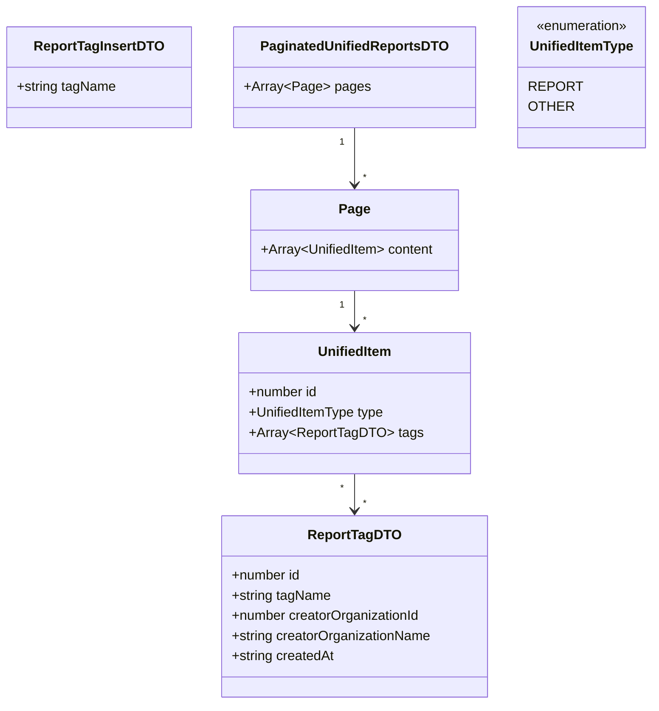

# Diagram: web/portal/src/pages/reports/bi-dashboard-next/hooks/useReportTags.ts


> Auto-generated by Obscura crawlers

## Diagram 1

```mermaid
flowchart LR
  UR[useReportTags] --> QC[queryClient]
  UR --> AUTH[authorization]
  AUTH --> CAN[canManageTags]
  UR --> CTM[createTagMutation]
  UR --> CMTM[createMultipleTagsMutation]
  UR --> DTM[deleteTagMutation]

  CTM --> OM1[onMutate: optimistic add tag]
  CTM --> OE1[onError: rollback previousData]
  CTM --> OS1[onSettled: invalidate reports/distinctTags]
  CMTM --> OM2[onMutate: optimistic add multiple tags]
  CMTM --> OE2[onError: rollback previousData & log error]
  CMTM --> OS2[onSettled: invalidate reports/distinctTags]
  DTM --> OM3[onMutate: optimistic remove tag]
  DTM --> OE3[onError: rollback previousData]
  DTM --> OS3[onSettled: invalidate reports/distinctTags]

  OM1 --> QSET1[queryClient.setQueriesData]
  OM2 --> QSET2[queryClient.setQueriesData]
  OM3 --> QSET3[queryClient.setQueriesData]

  CTM --> API1[POST /reporting/reports/{reportId}/tags]
  CMTM --> API2[POST /reporting/reports/{reportId}/tags/batch]
  DTM --> API3[DELETE /reporting/reports/{reportId}/tags/{tagId}]

  API1 --> AX1[axios.post]
  API2 --> AX2[axios.post]
  API3 --> AX3[axios.delete]

  CAN -- permission check --> CTM
  CAN -- permission check --> CMTM
  CAN -- permission check --> DTM
```

> SVG rendering failed for this diagram.

## Diagram 2



### SVG

<svg id="container" width="747.0625" xmlns="http://www.w3.org/2000/svg" class="classDiagram" height="838" viewBox="0 0 747.0625 838" role="graphics-document document" aria-roledescription="class"><style>#container{font-family:"trebuchet ms",verdana,arial,sans-serif;font-size:16px;fill:#333;}@keyframes edge-animation-frame{from{stroke-dashoffset:0;}}@keyframes dash{to{stroke-dashoffset:0;}}#container .edge-animation-slow{stroke-dasharray:9,5!important;stroke-dashoffset:900;animation:dash 50s linear infinite;stroke-linecap:round;}#container .edge-animation-fast{stroke-dasharray:9,5!important;stroke-dashoffset:900;animation:dash 20s linear infinite;stroke-linecap:round;}#container .error-icon{fill:#552222;}#container .error-text{fill:#552222;stroke:#552222;}#container .edge-thickness-normal{stroke-width:1px;}#container .edge-thickness-thick{stroke-width:3.5px;}#container .edge-pattern-solid{stroke-dasharray:0;}#container .edge-thickness-invisible{stroke-width:0;fill:none;}#container .edge-pattern-dashed{stroke-dasharray:3;}#container .edge-pattern-dotted{stroke-dasharray:2;}#container .marker{fill:#333333;stroke:#333333;}#container .marker.cross{stroke:#333333;}#container svg{font-family:"trebuchet ms",verdana,arial,sans-serif;font-size:16px;}#container p{margin:0;}#container g.classGroup text{fill:#9370DB;stroke:none;font-family:"trebuchet ms",verdana,arial,sans-serif;font-size:10px;}#container g.classGroup text .title{font-weight:bolder;}#container .nodeLabel,#container .edgeLabel{color:#131300;}#container .edgeLabel .label rect{fill:#ECECFF;}#container .label text{fill:#131300;}#container .labelBkg{background:#ECECFF;}#container .edgeLabel .label span{background:#ECECFF;}#container .classTitle{font-weight:bolder;}#container .node rect,#container .node circle,#container .node ellipse,#container .node polygon,#container .node path{fill:#ECECFF;stroke:#9370DB;stroke-width:1px;}#container .divider{stroke:#9370DB;stroke-width:1;}#container g.clickable{cursor:pointer;}#container g.classGroup rect{fill:#ECECFF;stroke:#9370DB;}#container g.classGroup line{stroke:#9370DB;stroke-width:1;}#container .classLabel .box{stroke:none;stroke-width:0;fill:#ECECFF;opacity:0.5;}#container .classLabel .label{fill:#9370DB;font-size:10px;}#container .relation{stroke:#333333;stroke-width:1;fill:none;}#container .dashed-line{stroke-dasharray:3;}#container .dotted-line{stroke-dasharray:1 2;}#container #compositionStart,#container .composition{fill:#333333!important;stroke:#333333!important;stroke-width:1;}#container #compositionEnd,#container .composition{fill:#333333!important;stroke:#333333!important;stroke-width:1;}#container #dependencyStart,#container .dependency{fill:#333333!important;stroke:#333333!important;stroke-width:1;}#container #dependencyStart,#container .dependency{fill:#333333!important;stroke:#333333!important;stroke-width:1;}#container #extensionStart,#container .extension{fill:transparent!important;stroke:#333333!important;stroke-width:1;}#container #extensionEnd,#container .extension{fill:transparent!important;stroke:#333333!important;stroke-width:1;}#container #aggregationStart,#container .aggregation{fill:transparent!important;stroke:#333333!important;stroke-width:1;}#container #aggregationEnd,#container .aggregation{fill:transparent!important;stroke:#333333!important;stroke-width:1;}#container #lollipopStart,#container .lollipop{fill:#ECECFF!important;stroke:#333333!important;stroke-width:1;}#container #lollipopEnd,#container .lollipop{fill:#ECECFF!important;stroke:#333333!important;stroke-width:1;}#container .edgeTerminals{font-size:11px;line-height:initial;}#container .classTitleText{text-anchor:middle;font-size:18px;fill:#333;}#container .label-icon{display:inline-block;height:1em;overflow:visible;vertical-align:-0.125em;}#container .node .label-icon path{fill:currentColor;stroke:revert;stroke-width:revert;}#container :root{--mermaid-font-family:"trebuchet ms",verdana,arial,sans-serif;}</style><g><defs><marker id="container_class-aggregationStart" class="marker aggregation class" refX="18" refY="7" markerWidth="190" markerHeight="240" orient="auto"><path d="M 18,7 L9,13 L1,7 L9,1 Z"></path></marker></defs><defs><marker id="container_class-aggregationEnd" class="marker aggregation class" refX="1" refY="7" markerWidth="20" markerHeight="28" orient="auto"><path d="M 18,7 L9,13 L1,7 L9,1 Z"></path></marker></defs><defs><marker id="container_class-extensionStart" class="marker extension class" refX="18" refY="7" markerWidth="190" markerHeight="240" orient="auto"><path d="M 1,7 L18,13 V 1 Z"></path></marker></defs><defs><marker id="container_class-extensionEnd" class="marker extension class" refX="1" refY="7" markerWidth="20" markerHeight="28" orient="auto"><path d="M 1,1 V 13 L18,7 Z"></path></marker></defs><defs><marker id="container_class-compositionStart" class="marker composition class" refX="18" refY="7" markerWidth="190" markerHeight="240" orient="auto"><path d="M 18,7 L9,13 L1,7 L9,1 Z"></path></marker></defs><defs><marker id="container_class-compositionEnd" class="marker composition class" refX="1" refY="7" markerWidth="20" markerHeight="28" orient="auto"><path d="M 18,7 L9,13 L1,7 L9,1 Z"></path></marker></defs><defs><marker id="container_class-dependencyStart" class="marker dependency class" refX="6" refY="7" markerWidth="190" markerHeight="240" orient="auto"><path d="M 5,7 L9,13 L1,7 L9,1 Z"></path></marker></defs><defs><marker id="container_class-dependencyEnd" class="marker dependency class" refX="13" refY="7" markerWidth="20" markerHeight="28" orient="auto"><path d="M 18,7 L9,13 L14,7 L9,1 Z"></path></marker></defs><defs><marker id="container_class-lollipopStart" class="marker lollipop class" refX="13" refY="7" markerWidth="190" markerHeight="240" orient="auto"><circle stroke="black" fill="transparent" cx="7" cy="7" r="6"></circle></marker></defs><defs><marker id="container_class-lollipopEnd" class="marker lollipop class" refX="1" refY="7" markerWidth="190" markerHeight="240" orient="auto"><circle stroke="black" fill="transparent" cx="7" cy="7" r="6"></circle></marker></defs><g class="root"><g class="clusters"></g><g class="edgePaths"><path d="M409.688,152L409.688,160.167C409.688,168.333,409.688,184.667,409.688,196C409.688,207.333,409.688,213.667,409.688,216.833L409.688,220" id="id_PaginatedUnifiedReportsDTO_Page_1" class="edge-thickness-normal edge-pattern-solid relation" style=";;;" data-edge="true" data-et="edge" data-id="id_PaginatedUnifiedReportsDTO_Page_1" data-points="W3sieCI6NDA5LjY4NzUsInkiOjE1Mn0seyJ4Ijo0MDkuNjg3NSwieSI6MjAxfSx7IngiOjQwOS42ODc1LCJ5IjoyMjZ9XQ==" marker-end="url(#container_class-dependencyEnd)"></path><path d="M409.688,346L409.688,350.167C409.688,354.333,409.688,362.667,409.688,370C409.688,377.333,409.688,383.667,409.688,386.833L409.688,390" id="id_Page_UnifiedItem_2" class="edge-thickness-normal edge-pattern-solid relation" style=";;;" data-edge="true" data-et="edge" data-id="id_Page_UnifiedItem_2" data-points="W3sieCI6NDA5LjY4NzUsInkiOjM0Nn0seyJ4Ijo0MDkuNjg3NSwieSI6MzcxfSx7IngiOjQwOS42ODc1LCJ5IjozOTZ9XQ==" marker-end="url(#container_class-dependencyEnd)"></path><path d="M409.688,564L409.688,568.167C409.688,572.333,409.688,580.667,409.688,588C409.688,595.333,409.688,601.667,409.688,604.833L409.688,608" id="id_UnifiedItem_ReportTagDTO_3" class="edge-thickness-normal edge-pattern-solid relation" style=";;;" data-edge="true" data-et="edge" data-id="id_UnifiedItem_ReportTagDTO_3" data-points="W3sieCI6NDA5LjY4NzUsInkiOjU2NH0seyJ4Ijo0MDkuNjg3NSwieSI6NTg5fSx7IngiOjQwOS42ODc1LCJ5Ijo2MTR9XQ==" marker-end="url(#container_class-dependencyEnd)"></path></g><g class="edgeLabels"><g class="edgeLabel"><g class="label" data-id="id_PaginatedUnifiedReportsDTO_Page_1" transform="translate(0, 0)"><foreignObject width="0" height="0"><div xmlns="http://www.w3.org/1999/xhtml" class="labelBkg" style="display: table-cell; white-space: nowrap; line-height: 1.5; max-width: 200px; text-align: center;"><span class="edgeLabel"></span></div></foreignObject></g></g><g class="edgeLabel"><g class="label" data-id="id_Page_UnifiedItem_2" transform="translate(0, 0)"><foreignObject width="0" height="0"><div xmlns="http://www.w3.org/1999/xhtml" class="labelBkg" style="display: table-cell; white-space: nowrap; line-height: 1.5; max-width: 200px; text-align: center;"><span class="edgeLabel"></span></div></foreignObject></g></g><g class="edgeLabel"><g class="label" data-id="id_UnifiedItem_ReportTagDTO_3" transform="translate(0, 0)"><foreignObject width="0" height="0"><div xmlns="http://www.w3.org/1999/xhtml" class="labelBkg" style="display: table-cell; white-space: nowrap; line-height: 1.5; max-width: 200px; text-align: center;"><span class="edgeLabel"></span></div></foreignObject></g></g><g class="edgeTerminals" transform="translate(394.6875, 169.5)"><g class="inner" transform="translate(0, 0)"><foreignObject style="width: 9px; height: 12px;"><div xmlns="http://www.w3.org/1999/xhtml" style="display: inline-block; padding-right: 1px; white-space: nowrap;"><span class="edgeLabel">1</span></div></foreignObject></g></g><g class="edgeTerminals" transform="translate(394.6875, 363.5)"><g class="inner" transform="translate(0, 0)"><foreignObject style="width: 9px; height: 12px;"><div xmlns="http://www.w3.org/1999/xhtml" style="display: inline-block; padding-right: 1px; white-space: nowrap;"><span class="edgeLabel">1</span></div></foreignObject></g></g><g class="edgeTerminals" transform="translate(394.6875, 581.5)"><g class="inner" transform="translate(0, 0)"><foreignObject style="width: 9px; height: 12px;"><div xmlns="http://www.w3.org/1999/xhtml" style="display: inline-block; padding-right: 1px; white-space: nowrap;"><span class="edgeLabel">*</span></div></foreignObject></g></g><g class="edgeTerminals" transform="translate(419.6875, 203.5)"><g class="inner" transform="translate(0, 0)"></g><foreignObject style="width: 9px; height: 12px;"><div xmlns="http://www.w3.org/1999/xhtml" style="display: inline-block; padding-right: 1px; white-space: nowrap;"><span class="edgeLabel">*</span></div></foreignObject></g><g class="edgeTerminals" transform="translate(419.6875, 373.5)"><g class="inner" transform="translate(0, 0)"></g><foreignObject style="width: 9px; height: 12px;"><div xmlns="http://www.w3.org/1999/xhtml" style="display: inline-block; padding-right: 1px; white-space: nowrap;"><span class="edgeLabel">*</span></div></foreignObject></g><g class="edgeTerminals" transform="translate(419.6875, 591.5)"><g class="inner" transform="translate(0, 0)"></g><foreignObject style="width: 9px; height: 12px;"><div xmlns="http://www.w3.org/1999/xhtml" style="display: inline-block; padding-right: 1px; white-space: nowrap;"><span class="edgeLabel">*</span></div></foreignObject></g></g><g class="nodes"><g class="node default" id="classId-ReportTagDTO-0" transform="translate(409.6875, 722)"><g class="basic label-container"><path d="M-157.890625 -108 L157.890625 -108 L157.890625 108 L-157.890625 108" stroke="none" stroke-width="0" fill="#ECECFF" style=""></path><path d="M-157.890625 -108 C-36.06589317240683 -108, 85.75883865518634 -108, 157.890625 -108 M-157.890625 -108 C-80.00005031499934 -108, -2.109475629998684 -108, 157.890625 -108 M157.890625 -108 C157.890625 -29.456858362311166, 157.890625 49.08628327537767, 157.890625 108 M157.890625 -108 C157.890625 -40.72014515219628, 157.890625 26.559709695607438, 157.890625 108 M157.890625 108 C91.6491427755065 108, 25.40766055101301 108, -157.890625 108 M157.890625 108 C37.85979232964523 108, -82.17104034070954 108, -157.890625 108 M-157.890625 108 C-157.890625 48.33986055770402, -157.890625 -11.320278884591957, -157.890625 -108 M-157.890625 108 C-157.890625 60.69686242088803, -157.890625 13.393724841776063, -157.890625 -108" stroke="#9370DB" stroke-width="1.3" fill="none" stroke-dasharray="0 0" style=""></path></g><g class="annotation-group text" transform="translate(0, -84)"></g><g class="label-group text" transform="translate(-52.109375, -84)"><g class="label" style="font-weight: bolder" transform="translate(0,-12)"><foreignObject width="104.21875" height="24"><div xmlns="http://www.w3.org/1999/xhtml" style="display: table-cell; white-space: nowrap; line-height: 1.5; max-width: 152px; text-align: center;"><span class="nodeLabel markdown-node-label" style=""><p>ReportTagDTO</p></span></div></foreignObject></g></g><g class="members-group text" transform="translate(-145.890625, -36)"><g class="label" style="" transform="translate(0,-12)"><foreignObject width="83.109375" height="24"><div xmlns="http://www.w3.org/1999/xhtml" style="display: table-cell; white-space: nowrap; line-height: 1.5; max-width: 140px; text-align: center;"><span class="nodeLabel markdown-node-label" style=""><p>+number id</p></span></div></foreignObject></g><g class="label" style="" transform="translate(0,12)"><foreignObject width="118.453125" height="24"><div xmlns="http://www.w3.org/1999/xhtml" style="display: table-cell; white-space: nowrap; line-height: 1.5; max-width: 176px; text-align: center;"><span class="nodeLabel markdown-node-label" style=""><p>+string tagName</p></span></div></foreignObject></g><g class="label" style="" transform="translate(0,36)"><foreignObject width="227.0625" height="24"><div xmlns="http://www.w3.org/1999/xhtml" style="display: table-cell; white-space: nowrap; line-height: 1.5; max-width: 284px; text-align: center;"><span class="nodeLabel markdown-node-label" style=""><p>+number creatorOrganizationId</p></span></div></foreignObject></g><g class="label" style="" transform="translate(0,60)"><foreignObject width="239.671875" height="24"><div xmlns="http://www.w3.org/1999/xhtml" style="display: table-cell; white-space: nowrap; line-height: 1.5; max-width: 297px; text-align: center;"><span class="nodeLabel markdown-node-label" style=""><p>+string creatorOrganizationName</p></span></div></foreignObject></g><g class="label" style="" transform="translate(0,84)"><foreignObject width="123.234375" height="24"><div xmlns="http://www.w3.org/1999/xhtml" style="display: table-cell; white-space: nowrap; line-height: 1.5; max-width: 181px; text-align: center;"><span class="nodeLabel markdown-node-label" style=""><p>+string createdAt</p></span></div></foreignObject></g></g><g class="methods-group text" transform="translate(-145.890625, 108)"></g><g class="divider" style=""><path d="M-157.890625 -60 C-84.39578682585137 -60, -10.900948651702748 -60, 157.890625 -60 M-157.890625 -60 C-93.24693948493407 -60, -28.60325396986815 -60, 157.890625 -60" stroke="#9370DB" stroke-width="1.3" fill="none" stroke-dasharray="0 0" style=""></path></g><g class="divider" style=""><path d="M-157.890625 84 C-37.167872120724084 84, 83.55488075855183 84, 157.890625 84 M-157.890625 84 C-62.870214617559085 84, 32.15019576488183 84, 157.890625 84" stroke="#9370DB" stroke-width="1.3" fill="none" stroke-dasharray="0 0" style=""></path></g></g><g class="node default" id="classId-ReportTagInsertDTO-1" transform="translate(116.046875, 92)"><g class="basic label-container"><path d="M-108.046875 -60 L108.046875 -60 L108.046875 60 L-108.046875 60" stroke="none" stroke-width="0" fill="#ECECFF" style=""></path><path d="M-108.046875 -60 C-41.609937704759375 -60, 24.82699959048125 -60, 108.046875 -60 M-108.046875 -60 C-25.04506399494096 -60, 57.95674701011808 -60, 108.046875 -60 M108.046875 -60 C108.046875 -15.380207458126748, 108.046875 29.239585083746505, 108.046875 60 M108.046875 -60 C108.046875 -18.754156061282202, 108.046875 22.491687877435595, 108.046875 60 M108.046875 60 C53.224480597072684 60, -1.5979138058546312 60, -108.046875 60 M108.046875 60 C45.96311787082125 60, -16.1206392583575 60, -108.046875 60 M-108.046875 60 C-108.046875 24.922381125659577, -108.046875 -10.155237748680847, -108.046875 -60 M-108.046875 60 C-108.046875 30.79135641961631, -108.046875 1.5827128392326202, -108.046875 -60" stroke="#9370DB" stroke-width="1.3" fill="none" stroke-dasharray="0 0" style=""></path></g><g class="annotation-group text" transform="translate(0, -36)"></g><g class="label-group text" transform="translate(-73.640625, -36)"><g class="label" style="font-weight: bolder" transform="translate(0,-12)"><foreignObject width="147.28125" height="24"><div xmlns="http://www.w3.org/1999/xhtml" style="display: table-cell; white-space: nowrap; line-height: 1.5; max-width: 194px; text-align: center;"><span class="nodeLabel markdown-node-label" style=""><p>ReportTagInsertDTO</p></span></div></foreignObject></g></g><g class="members-group text" transform="translate(-96.046875, 12)"><g class="label" style="" transform="translate(0,-12)"><foreignObject width="118.453125" height="24"><div xmlns="http://www.w3.org/1999/xhtml" style="display: table-cell; white-space: nowrap; line-height: 1.5; max-width: 176px; text-align: center;"><span class="nodeLabel markdown-node-label" style=""><p>+string tagName</p></span></div></foreignObject></g></g><g class="methods-group text" transform="translate(-96.046875, 60)"></g><g class="divider" style=""><path d="M-108.046875 -12 C-27.65231507514808 -12, 52.74224484970384 -12, 108.046875 -12 M-108.046875 -12 C-61.60936444475589 -12, -15.17185388951178 -12, 108.046875 -12" stroke="#9370DB" stroke-width="1.3" fill="none" stroke-dasharray="0 0" style=""></path></g><g class="divider" style=""><path d="M-108.046875 36 C-51.349576263394 36, 5.347722473212002 36, 108.046875 36 M-108.046875 36 C-59.44690667840692 36, -10.846938356813837 36, 108.046875 36" stroke="#9370DB" stroke-width="1.3" fill="none" stroke-dasharray="0 0" style=""></path></g></g><g class="node default" id="classId-PaginatedUnifiedReportsDTO-2" transform="translate(409.6875, 92)"><g class="basic label-container"><path d="M-135.59375 -60 L135.59375 -60 L135.59375 60 L-135.59375 60" stroke="none" stroke-width="0" fill="#ECECFF" style=""></path><path d="M-135.59375 -60 C-47.081610907788345 -60, 41.43052818442331 -60, 135.59375 -60 M-135.59375 -60 C-36.1745340452601 -60, 63.244681909479795 -60, 135.59375 -60 M135.59375 -60 C135.59375 -24.661801856922224, 135.59375 10.676396286155551, 135.59375 60 M135.59375 -60 C135.59375 -22.40685947151885, 135.59375 15.1862810569623, 135.59375 60 M135.59375 60 C33.1570250438687 60, -69.2796999122626 60, -135.59375 60 M135.59375 60 C39.46628714598627 60, -56.66117570802746 60, -135.59375 60 M-135.59375 60 C-135.59375 23.061754496596528, -135.59375 -13.876491006806944, -135.59375 -60 M-135.59375 60 C-135.59375 32.73690978686995, -135.59375 5.4738195737399025, -135.59375 -60" stroke="#9370DB" stroke-width="1.3" fill="none" stroke-dasharray="0 0" style=""></path></g><g class="annotation-group text" transform="translate(0, -36)"></g><g class="label-group text" transform="translate(-105.9375, -36)"><g class="label" style="font-weight: bolder" transform="translate(0,-12)"><foreignObject width="211.875" height="24"><div xmlns="http://www.w3.org/1999/xhtml" style="display: table-cell; white-space: nowrap; line-height: 1.5; max-width: 259px; text-align: center;"><span class="nodeLabel markdown-node-label" style=""><p>PaginatedUnifiedReportsDTO</p></span></div></foreignObject></g></g><g class="members-group text" transform="translate(-123.59375, 12)"><g class="label" style="" transform="translate(0,-12)"><foreignObject width="141.25" height="24"><div xmlns="http://www.w3.org/1999/xhtml" style="display: table-cell; white-space: nowrap; line-height: 1.5; max-width: 238px; text-align: center;"><span class="nodeLabel markdown-node-label" style=""><p>+Array&lt;Page&gt; pages</p></span></div></foreignObject></g></g><g class="methods-group text" transform="translate(-123.59375, 60)"></g><g class="divider" style=""><path d="M-135.59375 -12 C-31.730636730355258 -12, 72.13247653928948 -12, 135.59375 -12 M-135.59375 -12 C-64.47275937571521 -12, 6.648231248569573 -12, 135.59375 -12" stroke="#9370DB" stroke-width="1.3" fill="none" stroke-dasharray="0 0" style=""></path></g><g class="divider" style=""><path d="M-135.59375 36 C-50.63028812886675 36, 34.333173742266496 36, 135.59375 36 M-135.59375 36 C-50.03506431074247 36, 35.52362137851506 36, 135.59375 36" stroke="#9370DB" stroke-width="1.3" fill="none" stroke-dasharray="0 0" style=""></path></g></g><g class="node default" id="classId-Page-3" transform="translate(409.6875, 286)"><g class="basic label-container"><path d="M-123.4140625 -60 L123.4140625 -60 L123.4140625 60 L-123.4140625 60" stroke="none" stroke-width="0" fill="#ECECFF" style=""></path><path d="M-123.4140625 -60 C-34.012518620324414 -60, 55.38902525935117 -60, 123.4140625 -60 M-123.4140625 -60 C-59.84940145239749 -60, 3.7152595952050262 -60, 123.4140625 -60 M123.4140625 -60 C123.4140625 -14.606961743525176, 123.4140625 30.78607651294965, 123.4140625 60 M123.4140625 -60 C123.4140625 -17.092521503226045, 123.4140625 25.81495699354791, 123.4140625 60 M123.4140625 60 C49.66373805631743 60, -24.086586387365145 60, -123.4140625 60 M123.4140625 60 C73.40228062017619 60, 23.390498740352385 60, -123.4140625 60 M-123.4140625 60 C-123.4140625 15.914673600992977, -123.4140625 -28.170652798014046, -123.4140625 -60 M-123.4140625 60 C-123.4140625 32.924023583202356, -123.4140625 5.8480471664047045, -123.4140625 -60" stroke="#9370DB" stroke-width="1.3" fill="none" stroke-dasharray="0 0" style=""></path></g><g class="annotation-group text" transform="translate(0, -36)"></g><g class="label-group text" transform="translate(-17.34375, -36)"><g class="label" style="font-weight: bolder" transform="translate(0,-12)"><foreignObject width="34.6875" height="24"><div xmlns="http://www.w3.org/1999/xhtml" style="display: table-cell; white-space: nowrap; line-height: 1.5; max-width: 84px; text-align: center;"><span class="nodeLabel markdown-node-label" style=""><p>Page</p></span></div></foreignObject></g></g><g class="members-group text" transform="translate(-111.4140625, 12)"><g class="label" style="" transform="translate(0,-12)"><foreignObject width="205.484375" height="24"><div xmlns="http://www.w3.org/1999/xhtml" style="display: table-cell; white-space: nowrap; line-height: 1.5; max-width: 303px; text-align: center;"><span class="nodeLabel markdown-node-label" style=""><p>+Array&lt;UnifiedItem&gt; content</p></span></div></foreignObject></g></g><g class="methods-group text" transform="translate(-111.4140625, 60)"></g><g class="divider" style=""><path d="M-123.4140625 -12 C-49.7111896177052 -12, 23.991683264589597 -12, 123.4140625 -12 M-123.4140625 -12 C-53.528765076881356 -12, 16.356532346237287 -12, 123.4140625 -12" stroke="#9370DB" stroke-width="1.3" fill="none" stroke-dasharray="0 0" style=""></path></g><g class="divider" style=""><path d="M-123.4140625 36 C-43.67602034867801 36, 36.06202180264398 36, 123.4140625 36 M-123.4140625 36 C-47.05796820499049 36, 29.298126090019025 36, 123.4140625 36" stroke="#9370DB" stroke-width="1.3" fill="none" stroke-dasharray="0 0" style=""></path></g></g><g class="node default" id="classId-UnifiedItem-4" transform="translate(409.6875, 480)"><g class="basic label-container"><path d="M-131.81640625 -84 L131.81640625 -84 L131.81640625 84 L-131.81640625 84" stroke="none" stroke-width="0" fill="#ECECFF" style=""></path><path d="M-131.81640625 -84 C-47.85338711904046 -84, 36.109632011919075 -84, 131.81640625 -84 M-131.81640625 -84 C-53.3321981283451 -84, 25.152009993309804 -84, 131.81640625 -84 M131.81640625 -84 C131.81640625 -47.797072744578365, 131.81640625 -11.59414548915673, 131.81640625 84 M131.81640625 -84 C131.81640625 -39.78386488892518, 131.81640625 4.43227022214964, 131.81640625 84 M131.81640625 84 C44.42054851854063 84, -42.975309212918745 84, -131.81640625 84 M131.81640625 84 C53.101336465810235 84, -25.61373331837953 84, -131.81640625 84 M-131.81640625 84 C-131.81640625 21.578594363564783, -131.81640625 -40.842811272870435, -131.81640625 -84 M-131.81640625 84 C-131.81640625 28.500090391586014, -131.81640625 -26.999819216827973, -131.81640625 -84" stroke="#9370DB" stroke-width="1.3" fill="none" stroke-dasharray="0 0" style=""></path></g><g class="annotation-group text" transform="translate(0, -60)"></g><g class="label-group text" transform="translate(-42.5546875, -60)"><g class="label" style="font-weight: bolder" transform="translate(0,-12)"><foreignObject width="85.109375" height="24"><div xmlns="http://www.w3.org/1999/xhtml" style="display: table-cell; white-space: nowrap; line-height: 1.5; max-width: 135px; text-align: center;"><span class="nodeLabel markdown-node-label" style=""><p>UnifiedItem</p></span></div></foreignObject></g></g><g class="members-group text" transform="translate(-119.81640625, -12)"><g class="label" style="" transform="translate(0,-12)"><foreignObject width="83.109375" height="24"><div xmlns="http://www.w3.org/1999/xhtml" style="display: table-cell; white-space: nowrap; line-height: 1.5; max-width: 140px; text-align: center;"><span class="nodeLabel markdown-node-label" style=""><p>+number id</p></span></div></foreignObject></g><g class="label" style="" transform="translate(0,12)"><foreignObject width="162.40625" height="24"><div xmlns="http://www.w3.org/1999/xhtml" style="display: table-cell; white-space: nowrap; line-height: 1.5; max-width: 220px; text-align: center;"><span class="nodeLabel markdown-node-label" style=""><p>+UnifiedItemType type</p></span></div></foreignObject></g><g class="label" style="" transform="translate(0,36)"><foreignObject width="197.078125" height="24"><div xmlns="http://www.w3.org/1999/xhtml" style="display: table-cell; white-space: nowrap; line-height: 1.5; max-width: 294px; text-align: center;"><span class="nodeLabel markdown-node-label" style=""><p>+Array&lt;ReportTagDTO&gt; tags</p></span></div></foreignObject></g></g><g class="methods-group text" transform="translate(-119.81640625, 84)"></g><g class="divider" style=""><path d="M-131.81640625 -36 C-73.27648443197279 -36, -14.73656261394558 -36, 131.81640625 -36 M-131.81640625 -36 C-32.839585769979834 -36, 66.13723471004033 -36, 131.81640625 -36" stroke="#9370DB" stroke-width="1.3" fill="none" stroke-dasharray="0 0" style=""></path></g><g class="divider" style=""><path d="M-131.81640625 60 C-29.821812369623586 60, 72.17278151075283 60, 131.81640625 60 M-131.81640625 60 C-47.58215833986121 60, 36.65208957027758 60, 131.81640625 60" stroke="#9370DB" stroke-width="1.3" fill="none" stroke-dasharray="0 0" style=""></path></g></g><g class="node default" id="classId-UnifiedItemType-5" transform="translate(667.171875, 92)"><g class="basic label-container"><path d="M-71.890625 -84 L71.890625 -84 L71.890625 84 L-71.890625 84" stroke="none" stroke-width="0" fill="#ECECFF" style=""></path><path d="M-71.890625 -84 C-27.27848062925915 -84, 17.3336637414817 -84, 71.890625 -84 M-71.890625 -84 C-15.652762015205624 -84, 40.58510096958875 -84, 71.890625 -84 M71.890625 -84 C71.890625 -34.067800676360484, 71.890625 15.864398647279032, 71.890625 84 M71.890625 -84 C71.890625 -26.42931419856611, 71.890625 31.14137160286778, 71.890625 84 M71.890625 84 C38.32432215121997 84, 4.7580193024399335 84, -71.890625 84 M71.890625 84 C25.31065393231259 84, -21.26931713537482 84, -71.890625 84 M-71.890625 84 C-71.890625 42.41623673183607, -71.890625 0.8324734636721445, -71.890625 -84 M-71.890625 84 C-71.890625 38.160482986066754, -71.890625 -7.679034027866493, -71.890625 -84" stroke="#9370DB" stroke-width="1.3" fill="none" stroke-dasharray="0 0" style=""></path></g><g class="annotation-group text" transform="translate(-55.5546875, -60)"><g class="label" style="" transform="translate(0,-12)"><foreignObject width="111.109375" height="24"><div xmlns="http://www.w3.org/1999/xhtml" style="display: table-cell; white-space: nowrap; line-height: 1.5; max-width: 161px; text-align: center;"><span class="nodeLabel markdown-node-label" style=""><p>«enumeration»</p></span></div></foreignObject></g></g><g class="label-group text" transform="translate(-59.890625, -36)"><g class="label" style="font-weight: bolder" transform="translate(0,-12)"><foreignObject width="119.78125" height="24"><div xmlns="http://www.w3.org/1999/xhtml" style="display: table-cell; white-space: nowrap; line-height: 1.5; max-width: 168px; text-align: center;"><span class="nodeLabel markdown-node-label" style=""><p>UnifiedItemType</p></span></div></foreignObject></g></g><g class="members-group text" transform="translate(-59.890625, 12)"><g class="label" style="" transform="translate(0,-12)"><foreignObject width="56.25" height="24"><div xmlns="http://www.w3.org/1999/xhtml" style="display: table-cell; white-space: nowrap; line-height: 1.5; max-width: 107px; text-align: center;"><span class="nodeLabel markdown-node-label" style=""><p>REPORT</p></span></div></foreignObject></g><g class="label" style="" transform="translate(0,12)"><foreignObject width="47.90625" height="24"><div xmlns="http://www.w3.org/1999/xhtml" style="display: table-cell; white-space: nowrap; line-height: 1.5; max-width: 98px; text-align: center;"><span class="nodeLabel markdown-node-label" style=""><p>OTHER</p></span></div></foreignObject></g></g><g class="methods-group text" transform="translate(-59.890625, 84)"></g><g class="divider" style=""><path d="M-71.890625 -12 C-29.959330216620877 -12, 11.971964566758245 -12, 71.890625 -12 M-71.890625 -12 C-27.45239021015641 -12, 16.985844579687182 -12, 71.890625 -12" stroke="#9370DB" stroke-width="1.3" fill="none" stroke-dasharray="0 0" style=""></path></g><g class="divider" style=""><path d="M-71.890625 60 C-35.124896531693366 60, 1.6408319366132673 60, 71.890625 60 M-71.890625 60 C-37.932745412212704 60, -3.9748658244254074 60, 71.890625 60" stroke="#9370DB" stroke-width="1.3" fill="none" stroke-dasharray="0 0" style=""></path></g></g></g></g></g></svg>

## Diagram 3

```mermaid
flowchart TD
  User[User action] --> UR2[useReportTags API]
  UR2 -->|createTag(params)| CT_Call[createTagMutation.mutate]
  UR2 -->|createMultipleTags(params)| CMT_Call[createMultipleTagsMutation.mutate]
  UR2 -->|deleteTag(params)| DT_Call[deleteTagMutation.mutate]
  CT_Call --> OM[optimistic update -> queryClient.cancelQueries -> setQueriesData]
  CMT_Call --> OM
  DT_Call --> OM
  OM --> API_Call[network request via axios]
  API_Call --> Success[success -> onSettled invalidate queries]
  API_Call --> Fail[error -> onError rollback using previousData]
```

> SVG rendering failed for this diagram.
