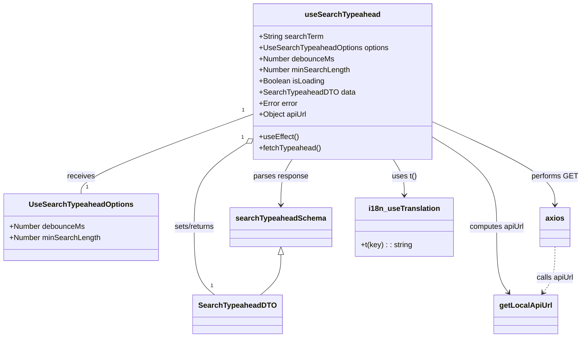

# Diagram: web/portal/src/pages/reports/bi-dashboard-next/hooks/useSearchTypeahead.ts


> Auto-generated by Obscura crawlers

## Diagram 1

```mermaid
flowchart TD
  A[useSearchTypeahead(searchTerm, options)] --> B{searchTerm exists\nAND length >= minSearchLength}
  B -- No --> C[setData(null)\nsetIsLoading(false)\nreturn]
  B -- Yes --> D[start debounce timer (debounceMs)]
  D --> E[fetchTypeahead() after debounce]
  E --> F[setIsLoading(true)\nsetError(null)]
  F --> G[axios.get(apiUrl, params: {query: searchTerm})]
  G --> H{response received}
  H -- success --> I[searchTypeaheadSchema.parse(response.data)]
  I --> J[setData(parsed)]
  H -- error --> K[console.error\nmsg = t("reports:Unknown error")\nsetError(Error)]
  I --> L[setIsLoading(false)]
  K --> L
  D -.-> M[cleanup on unmount\nclearTimeout(timer)]
```

> SVG rendering failed for this diagram.

## Diagram 2



### SVG

<svg id="container" width="1238.6640625" xmlns="http://www.w3.org/2000/svg" class="classDiagram" height="728" viewBox="0 0 1238.6640625 728" role="graphics-document document" aria-roledescription="class"><style>#container{font-family:"trebuchet ms",verdana,arial,sans-serif;font-size:16px;fill:#333;}@keyframes edge-animation-frame{from{stroke-dashoffset:0;}}@keyframes dash{to{stroke-dashoffset:0;}}#container .edge-animation-slow{stroke-dasharray:9,5!important;stroke-dashoffset:900;animation:dash 50s linear infinite;stroke-linecap:round;}#container .edge-animation-fast{stroke-dasharray:9,5!important;stroke-dashoffset:900;animation:dash 20s linear infinite;stroke-linecap:round;}#container .error-icon{fill:#552222;}#container .error-text{fill:#552222;stroke:#552222;}#container .edge-thickness-normal{stroke-width:1px;}#container .edge-thickness-thick{stroke-width:3.5px;}#container .edge-pattern-solid{stroke-dasharray:0;}#container .edge-thickness-invisible{stroke-width:0;fill:none;}#container .edge-pattern-dashed{stroke-dasharray:3;}#container .edge-pattern-dotted{stroke-dasharray:2;}#container .marker{fill:#333333;stroke:#333333;}#container .marker.cross{stroke:#333333;}#container svg{font-family:"trebuchet ms",verdana,arial,sans-serif;font-size:16px;}#container p{margin:0;}#container g.classGroup text{fill:#9370DB;stroke:none;font-family:"trebuchet ms",verdana,arial,sans-serif;font-size:10px;}#container g.classGroup text .title{font-weight:bolder;}#container .nodeLabel,#container .edgeLabel{color:#131300;}#container .edgeLabel .label rect{fill:#ECECFF;}#container .label text{fill:#131300;}#container .labelBkg{background:#ECECFF;}#container .edgeLabel .label span{background:#ECECFF;}#container .classTitle{font-weight:bolder;}#container .node rect,#container .node circle,#container .node ellipse,#container .node polygon,#container .node path{fill:#ECECFF;stroke:#9370DB;stroke-width:1px;}#container .divider{stroke:#9370DB;stroke-width:1;}#container g.clickable{cursor:pointer;}#container g.classGroup rect{fill:#ECECFF;stroke:#9370DB;}#container g.classGroup line{stroke:#9370DB;stroke-width:1;}#container .classLabel .box{stroke:none;stroke-width:0;fill:#ECECFF;opacity:0.5;}#container .classLabel .label{fill:#9370DB;font-size:10px;}#container .relation{stroke:#333333;stroke-width:1;fill:none;}#container .dashed-line{stroke-dasharray:3;}#container .dotted-line{stroke-dasharray:1 2;}#container #compositionStart,#container .composition{fill:#333333!important;stroke:#333333!important;stroke-width:1;}#container #compositionEnd,#container .composition{fill:#333333!important;stroke:#333333!important;stroke-width:1;}#container #dependencyStart,#container .dependency{fill:#333333!important;stroke:#333333!important;stroke-width:1;}#container #dependencyStart,#container .dependency{fill:#333333!important;stroke:#333333!important;stroke-width:1;}#container #extensionStart,#container .extension{fill:transparent!important;stroke:#333333!important;stroke-width:1;}#container #extensionEnd,#container .extension{fill:transparent!important;stroke:#333333!important;stroke-width:1;}#container #aggregationStart,#container .aggregation{fill:transparent!important;stroke:#333333!important;stroke-width:1;}#container #aggregationEnd,#container .aggregation{fill:transparent!important;stroke:#333333!important;stroke-width:1;}#container #lollipopStart,#container .lollipop{fill:#ECECFF!important;stroke:#333333!important;stroke-width:1;}#container #lollipopEnd,#container .lollipop{fill:#ECECFF!important;stroke:#333333!important;stroke-width:1;}#container .edgeTerminals{font-size:11px;line-height:initial;}#container .classTitleText{text-anchor:middle;font-size:18px;fill:#333;}#container .label-icon{display:inline-block;height:1em;overflow:visible;vertical-align:-0.125em;}#container .node .label-icon path{fill:currentColor;stroke:revert;stroke-width:revert;}#container :root{--mermaid-font-family:"trebuchet ms",verdana,arial,sans-serif;}</style><g><defs><marker id="container_class-aggregationStart" class="marker aggregation class" refX="18" refY="7" markerWidth="190" markerHeight="240" orient="auto"><path d="M 18,7 L9,13 L1,7 L9,1 Z"></path></marker></defs><defs><marker id="container_class-aggregationEnd" class="marker aggregation class" refX="1" refY="7" markerWidth="20" markerHeight="28" orient="auto"><path d="M 18,7 L9,13 L1,7 L9,1 Z"></path></marker></defs><defs><marker id="container_class-extensionStart" class="marker extension class" refX="18" refY="7" markerWidth="190" markerHeight="240" orient="auto"><path d="M 1,7 L18,13 V 1 Z"></path></marker></defs><defs><marker id="container_class-extensionEnd" class="marker extension class" refX="1" refY="7" markerWidth="20" markerHeight="28" orient="auto"><path d="M 1,1 V 13 L18,7 Z"></path></marker></defs><defs><marker id="container_class-compositionStart" class="marker composition class" refX="18" refY="7" markerWidth="190" markerHeight="240" orient="auto"><path d="M 18,7 L9,13 L1,7 L9,1 Z"></path></marker></defs><defs><marker id="container_class-compositionEnd" class="marker composition class" refX="1" refY="7" markerWidth="20" markerHeight="28" orient="auto"><path d="M 18,7 L9,13 L1,7 L9,1 Z"></path></marker></defs><defs><marker id="container_class-dependencyStart" class="marker dependency class" refX="6" refY="7" markerWidth="190" markerHeight="240" orient="auto"><path d="M 5,7 L9,13 L1,7 L9,1 Z"></path></marker></defs><defs><marker id="container_class-dependencyEnd" class="marker dependency class" refX="13" refY="7" markerWidth="20" markerHeight="28" orient="auto"><path d="M 18,7 L9,13 L14,7 L9,1 Z"></path></marker></defs><defs><marker id="container_class-lollipopStart" class="marker lollipop class" refX="13" refY="7" markerWidth="190" markerHeight="240" orient="auto"><circle stroke="black" fill="transparent" cx="7" cy="7" r="6"></circle></marker></defs><defs><marker id="container_class-lollipopEnd" class="marker lollipop class" refX="1" refY="7" markerWidth="190" markerHeight="240" orient="auto"><circle stroke="black" fill="transparent" cx="7" cy="7" r="6"></circle></marker></defs><g class="root"><g class="clusters"></g><g class="edgePaths"><path d="M538.203,245.933L477.067,268.444C415.931,290.955,293.659,335.978,232.523,364.656C171.387,393.333,171.387,405.667,171.387,411.833L171.387,418" id="id_useSearchTypeahead_UseSearchTypeaheadOptions_1" class="edge-thickness-normal edge-pattern-solid relation" style=";;;" data-edge="true" data-et="edge" data-id="id_useSearchTypeahead_UseSearchTypeaheadOptions_1" data-points="W3sieCI6NTM4LjIwMzEyNSwieSI6MjQ1LjkzMzI0MDI1MDkwMTU4fSx7IngiOjE3MS4zODY3MTg3NSwieSI6MzgxfSx7IngiOjE3MS4zODY3MTg3NSwieSI6NDE4fV0="></path><path d="M523.767,309.656L505.585,321.546C487.404,333.437,451.042,357.219,432.861,387.276C414.68,417.333,414.68,453.667,414.68,490C414.68,526.333,414.68,562.667,421.872,587C429.064,611.333,443.448,623.667,450.64,629.833L457.832,636" id="id_useSearchTypeahead_SearchTypeaheadDTO_2" class="edge-thickness-normal edge-pattern-solid relation" style=";;;" data-edge="true" data-et="edge" data-id="id_useSearchTypeahead_SearchTypeaheadDTO_2" data-points="W3sieCI6NTM4LjIwMzEyNSwieSI6MzAwLjIxNDAxMjQzNzIyMTl9LHsieCI6NDE0LjY3OTY4NzUsInkiOjM4MX0seyJ4Ijo0MTQuNjc5Njg3NSwieSI6NDkwfSx7IngiOjQxNC42Nzk2ODc1LCJ5Ijo1OTl9LHsieCI6NDU3LjgzMjMyNzkyNzIxNTIsInkiOjYzNn1d" marker-start="url(#container_class-aggregationStart)"></path><path d="M622.268,344L618.382,350.167C614.496,356.333,606.725,368.667,602.839,385C598.953,401.333,598.953,421.667,598.953,431.833L598.953,442" id="id_useSearchTypeahead_searchTypeaheadSchema_3" class="edge-thickness-normal edge-pattern-solid relation" style=";;;" data-edge="true" data-et="edge" data-id="id_useSearchTypeahead_searchTypeaheadSchema_3" data-points="W3sieCI6NjIyLjI2Nzc3ODIwMTIxOTUsInkiOjM0NH0seyJ4Ijo1OTguOTUzMTI1LCJ5IjozODF9LHsieCI6NTk4Ljk1MzEyNSwieSI6NDQ4fV0=" marker-end="url(#container_class-dependencyEnd)"></path><path d="M918.055,261.799L962.033,281.665C1006.01,301.532,1093.966,341.266,1137.944,371.3C1181.922,401.333,1181.922,421.667,1181.922,431.833L1181.922,442" id="id_useSearchTypeahead_axios_4" class="edge-thickness-normal edge-pattern-solid relation" style=";;;" data-edge="true" data-et="edge" data-id="id_useSearchTypeahead_axios_4" data-points="W3sieCI6OTE4LjA1NDY4NzUsInkiOjI2MS43OTg1NjQxODU1NTR9LHsieCI6MTE4MS45MjE4NzUsInkiOjM4MX0seyJ4IjoxMTgxLjkyMTg3NSwieSI6NDQ4fV0=" marker-end="url(#container_class-dependencyEnd)"></path><path d="M918.055,294.762L941.04,309.135C964.026,323.508,1009.997,352.254,1032.983,384.794C1055.969,417.333,1055.969,453.667,1055.969,490C1055.969,526.333,1055.969,562.667,1060.261,586.218C1064.554,609.769,1073.139,620.539,1077.431,625.924L1081.724,631.308" id="id_useSearchTypeahead_getLocalApiUrl_5" class="edge-thickness-normal edge-pattern-solid relation" style=";;;" data-edge="true" data-et="edge" data-id="id_useSearchTypeahead_getLocalApiUrl_5" data-points="W3sieCI6OTE4LjA1NDY4NzUsInkiOjI5NC43NjE2MDIzNDQ4OTV9LHsieCI6MTA1NS45Njg3NSwieSI6MzgxfSx7IngiOjEwNTUuOTY4NzUsInkiOjQ5MH0seyJ4IjoxMDU1Ljk2ODc1LCJ5Ijo1OTl9LHsieCI6MTA4NS40NjQxMDIwNTY5NjIsInkiOjYzNn1d" marker-end="url(#container_class-dependencyEnd)"></path><path d="M833.99,344L837.876,350.167C841.762,356.333,849.533,368.667,853.419,381.5C857.305,394.333,857.305,407.667,857.305,414.333L857.305,421" id="id_useSearchTypeahead_i18n_useTranslation_6" class="edge-thickness-normal edge-pattern-solid relation" style=";;;" data-edge="true" data-et="edge" data-id="id_useSearchTypeahead_i18n_useTranslation_6" data-points="W3sieCI6ODMzLjk5MDAzNDI5ODc4MDUsInkiOjM0NH0seyJ4Ijo4NTcuMzA0Njg3NSwieSI6MzgxfSx7IngiOjg1Ny4zMDQ2ODc1LCJ5Ijo0Mjd9XQ==" marker-end="url(#container_class-dependencyEnd)"></path><path d="M598.953,549.25L598.953,557.542C598.953,565.833,598.953,582.417,591.761,596.875C584.569,611.333,570.185,623.667,562.993,629.833L555.8,636" id="id_searchTypeaheadSchema_SearchTypeaheadDTO_7" class="edge-thickness-normal edge-pattern-solid relation" style=";;;" data-edge="true" data-et="edge" data-id="id_searchTypeaheadSchema_SearchTypeaheadDTO_7" data-points="W3sieCI6NTk4Ljk1MzEyNSwieSI6NTMyfSx7IngiOjU5OC45NTMxMjUsInkiOjU5OX0seyJ4Ijo1NTUuODAwNDg0NTcyNzg0OSwieSI6NjM2fV0=" marker-start="url(#container_class-extensionStart)"></path><path d="M1181.922,532L1181.922,543.167C1181.922,554.333,1181.922,576.667,1177.629,593.218C1173.337,609.769,1164.752,620.539,1160.459,625.924L1156.167,631.308" id="id_axios_getLocalApiUrl_8" class="edge-thickness-normal edge-pattern-dashed relation" style=";;;" data-edge="true" data-et="edge" data-id="id_axios_getLocalApiUrl_8" data-points="W3sieCI6MTE4MS45MjE4NzUsInkiOjUzMn0seyJ4IjoxMTgxLjkyMTg3NSwieSI6NTk5fSx7IngiOjExNTIuNDI2NTIyOTQzMDM4LCJ5Ijo2MzZ9XQ==" marker-end="url(#container_class-dependencyEnd)"></path></g><g class="edgeLabels"><g class="edgeLabel" transform="translate(171.38671875, 381)"><g class="label" data-id="id_useSearchTypeahead_UseSearchTypeaheadOptions_1" transform="translate(-29.4921875, -12)"><foreignObject width="58.984375" height="24"><div xmlns="http://www.w3.org/1999/xhtml" class="labelBkg" style="display: table-cell; white-space: nowrap; line-height: 1.5; max-width: 200px; text-align: center;"><span class="edgeLabel"><p>receives</p></span></div></foreignObject></g></g><g class="edgeLabel" transform="translate(414.6796875, 490)"><g class="label" data-id="id_useSearchTypeahead_SearchTypeaheadDTO_2" transform="translate(-44.90625, -12)"><foreignObject width="89.8125" height="24"><div xmlns="http://www.w3.org/1999/xhtml" class="labelBkg" style="display: table-cell; white-space: nowrap; line-height: 1.5; max-width: 200px; text-align: center;"><span class="edgeLabel"><p>sets/returns</p></span></div></foreignObject></g></g><g class="edgeLabel" transform="translate(598.953125, 381)"><g class="label" data-id="id_useSearchTypeahead_searchTypeaheadSchema_3" transform="translate(-59.1015625, -12)"><foreignObject width="118.203125" height="24"><div xmlns="http://www.w3.org/1999/xhtml" class="labelBkg" style="display: table-cell; white-space: nowrap; line-height: 1.5; max-width: 200px; text-align: center;"><span class="edgeLabel"><p>parses response</p></span></div></foreignObject></g></g><g class="edgeLabel" transform="translate(1181.921875, 381)"><g class="label" data-id="id_useSearchTypeahead_axios_4" transform="translate(-48.7421875, -12)"><foreignObject width="97.484375" height="24"><div xmlns="http://www.w3.org/1999/xhtml" class="labelBkg" style="display: table-cell; white-space: nowrap; line-height: 1.5; max-width: 200px; text-align: center;"><span class="edgeLabel"><p>performs GET</p></span></div></foreignObject></g></g><g class="edgeLabel" transform="translate(1055.96875, 490)"><g class="label" data-id="id_useSearchTypeahead_getLocalApiUrl_5" transform="translate(-59.6796875, -12)"><foreignObject width="119.359375" height="24"><div xmlns="http://www.w3.org/1999/xhtml" class="labelBkg" style="display: table-cell; white-space: nowrap; line-height: 1.5; max-width: 200px; text-align: center;"><span class="edgeLabel"><p>computes apiUrl</p></span></div></foreignObject></g></g><g class="edgeLabel" transform="translate(857.3046875, 381)"><g class="label" data-id="id_useSearchTypeahead_i18n_useTranslation_6" transform="translate(-26.6875, -12)"><foreignObject width="53.375" height="24"><div xmlns="http://www.w3.org/1999/xhtml" class="labelBkg" style="display: table-cell; white-space: nowrap; line-height: 1.5; max-width: 200px; text-align: center;"><span class="edgeLabel"><p>uses t()</p></span></div></foreignObject></g></g><g class="edgeLabel"><g class="label" data-id="id_searchTypeaheadSchema_SearchTypeaheadDTO_7" transform="translate(0, 0)"><foreignObject width="0" height="0"><div xmlns="http://www.w3.org/1999/xhtml" class="labelBkg" style="display: table-cell; white-space: nowrap; line-height: 1.5; max-width: 200px; text-align: center;"><span class="edgeLabel"></span></div></foreignObject></g></g><g class="edgeLabel" transform="translate(1181.921875, 599)"><g class="label" data-id="id_axios_getLocalApiUrl_8" transform="translate(-40.6484375, -12)"><foreignObject width="81.296875" height="24"><div xmlns="http://www.w3.org/1999/xhtml" class="labelBkg" style="display: table-cell; white-space: nowrap; line-height: 1.5; max-width: 200px; text-align: center;"><span class="edgeLabel"><p>calls apiUrl</p></span></div></foreignObject></g></g><g class="edgeTerminals" transform="translate(516.5980071647809, 237.9039917801716)"><g class="inner" transform="translate(0, 0)"><foreignObject style="width: 9px; height: 12px;"><div xmlns="http://www.w3.org/1999/xhtml" style="display: inline-block; padding-right: 1px; white-space: nowrap;"><span class="edgeLabel">1</span></div></foreignObject></g></g><g class="edgeTerminals" transform="translate(515.3470673902676, 297.2390080666162)"><g class="inner" transform="translate(0, 0)"><foreignObject style="width: 9px; height: 12px;"><div xmlns="http://www.w3.org/1999/xhtml" style="display: inline-block; padding-right: 1px; white-space: nowrap;"><span class="edgeLabel">1</span></div></foreignObject></g></g><g class="edgeTerminals" transform="translate(181.38671937499998, 395.50000053571426)"><g class="inner" transform="translate(0, 0)"></g><foreignObject style="width: 9px; height: 12px;"><div xmlns="http://www.w3.org/1999/xhtml" style="display: inline-block; padding-right: 1px; white-space: nowrap;"><span class="edgeLabel">1</span></div></foreignObject></g><g class="edgeTerminals" transform="translate(449.31086346637653, 608.2217338486615)"><g class="inner" transform="translate(0, 0)"></g><foreignObject style="width: 9px; height: 12px;"><div xmlns="http://www.w3.org/1999/xhtml" style="display: inline-block; padding-right: 1px; white-space: nowrap;"><span class="edgeLabel">1</span></div></foreignObject></g></g><g class="nodes"><g class="node default" id="classId-useSearchTypeahead-0" transform="translate(728.12890625, 176)"><g class="basic label-container"><path d="M-189.92578125 -168 L189.92578125 -168 L189.92578125 168 L-189.92578125 168" stroke="none" stroke-width="0" fill="#ECECFF" style=""></path><path d="M-189.92578125 -168 C-53.41065703311685 -168, 83.1044671837663 -168, 189.92578125 -168 M-189.92578125 -168 C-98.20276664414627 -168, -6.479752038292531 -168, 189.92578125 -168 M189.92578125 -168 C189.92578125 -59.8913676837186, 189.92578125 48.2172646325628, 189.92578125 168 M189.92578125 -168 C189.92578125 -66.52976695371686, 189.92578125 34.94046609256628, 189.92578125 168 M189.92578125 168 C98.75736356595891 168, 7.588945881917823 168, -189.92578125 168 M189.92578125 168 C79.2329992111438 168, -31.459782827712388 168, -189.92578125 168 M-189.92578125 168 C-189.92578125 68.3197688371318, -189.92578125 -31.360462325736393, -189.92578125 -168 M-189.92578125 168 C-189.92578125 80.68211772946286, -189.92578125 -6.6357645410742805, -189.92578125 -168" stroke="#9370DB" stroke-width="1.3" fill="none" stroke-dasharray="0 0" style=""></path></g><g class="annotation-group text" transform="translate(0, -144)"></g><g class="label-group text" transform="translate(-77.3515625, -144)"><g class="label" style="font-weight: bolder" transform="translate(0,-12)"><foreignObject width="154.703125" height="24"><div xmlns="http://www.w3.org/1999/xhtml" style="display: table-cell; white-space: nowrap; line-height: 1.5; max-width: 203px; text-align: center;"><span class="nodeLabel markdown-node-label" style=""><p>useSearchTypeahead</p></span></div></foreignObject></g></g><g class="members-group text" transform="translate(-177.92578125, -96)"><g class="label" style="" transform="translate(0,-12)"><foreignObject width="137.921875" height="24"><div xmlns="http://www.w3.org/1999/xhtml" style="display: table-cell; white-space: nowrap; line-height: 1.5; max-width: 195px; text-align: center;"><span class="nodeLabel markdown-node-label" style=""><p>+String searchTerm</p></span></div></foreignObject></g><g class="label" style="" transform="translate(0,12)"><foreignObject width="278.5" height="24"><div xmlns="http://www.w3.org/1999/xhtml" style="display: table-cell; white-space: nowrap; line-height: 1.5; max-width: 336px; text-align: center;"><span class="nodeLabel markdown-node-label" style=""><p>+UseSearchTypeaheadOptions options</p></span></div></foreignObject></g><g class="label" style="" transform="translate(0,36)"><foreignObject width="162.375" height="24"><div xmlns="http://www.w3.org/1999/xhtml" style="display: table-cell; white-space: nowrap; line-height: 1.5; max-width: 220px; text-align: center;"><span class="nodeLabel markdown-node-label" style=""><p>+Number debounceMs</p></span></div></foreignObject></g><g class="label" style="" transform="translate(0,60)"><foreignObject width="196.03125" height="24"><div xmlns="http://www.w3.org/1999/xhtml" style="display: table-cell; white-space: nowrap; line-height: 1.5; max-width: 253px; text-align: center;"><span class="nodeLabel markdown-node-label" style=""><p>+Number minSearchLength</p></span></div></foreignObject></g><g class="label" style="" transform="translate(0,84)"><foreignObject width="141.109375" height="24"><div xmlns="http://www.w3.org/1999/xhtml" style="display: table-cell; white-space: nowrap; line-height: 1.5; max-width: 199px; text-align: center;"><span class="nodeLabel markdown-node-label" style=""><p>+Boolean isLoading</p></span></div></foreignObject></g><g class="label" style="" transform="translate(0,108)"><foreignObject width="199.9375" height="24"><div xmlns="http://www.w3.org/1999/xhtml" style="display: table-cell; white-space: nowrap; line-height: 1.5; max-width: 257px; text-align: center;"><span class="nodeLabel markdown-node-label" style=""><p>+SearchTypeaheadDTO data</p></span></div></foreignObject></g><g class="label" style="" transform="translate(0,132)"><foreignObject width="84.140625" height="24"><div xmlns="http://www.w3.org/1999/xhtml" style="display: table-cell; white-space: nowrap; line-height: 1.5; max-width: 142px; text-align: center;"><span class="nodeLabel markdown-node-label" style=""><p>+Error error</p></span></div></foreignObject></g><g class="label" style="" transform="translate(0,156)"><foreignObject width="103.609375" height="24"><div xmlns="http://www.w3.org/1999/xhtml" style="display: table-cell; white-space: nowrap; line-height: 1.5; max-width: 161px; text-align: center;"><span class="nodeLabel markdown-node-label" style=""><p>+Object apiUrl</p></span></div></foreignObject></g></g><g class="methods-group text" transform="translate(-177.92578125, 120)"><g class="label" style="" transform="translate(0,-12)"><foreignObject width="84.8125" height="24"><div xmlns="http://www.w3.org/1999/xhtml" style="display: table-cell; white-space: nowrap; line-height: 1.5; max-width: 142px; text-align: center;"><span class="nodeLabel markdown-node-label" style=""><p>+useEffect()</p></span></div></foreignObject></g><g class="label" style="" transform="translate(0,12)"><foreignObject width="133.078125" height="24"><div xmlns="http://www.w3.org/1999/xhtml" style="display: table-cell; white-space: nowrap; line-height: 1.5; max-width: 190px; text-align: center;"><span class="nodeLabel markdown-node-label" style=""><p>+fetchTypeahead()</p></span></div></foreignObject></g></g><g class="divider" style=""><path d="M-189.92578125 -120 C-62.08087070090518 -120, 65.76403984818964 -120, 189.92578125 -120 M-189.92578125 -120 C-67.09992212003506 -120, 55.72593700992988 -120, 189.92578125 -120" stroke="#9370DB" stroke-width="1.3" fill="none" stroke-dasharray="0 0" style=""></path></g><g class="divider" style=""><path d="M-189.92578125 96 C-79.7344518244001 96, 30.456877601199807 96, 189.92578125 96 M-189.92578125 96 C-109.06631902187227 96, -28.20685679374455 96, 189.92578125 96" stroke="#9370DB" stroke-width="1.3" fill="none" stroke-dasharray="0 0" style=""></path></g></g><g class="node default" id="classId-UseSearchTypeaheadOptions-1" transform="translate(171.38671875, 490)"><g class="basic label-container"><path d="M-163.38671875 -72 L163.38671875 -72 L163.38671875 72 L-163.38671875 72" stroke="none" stroke-width="0" fill="#ECECFF" style=""></path><path d="M-163.38671875 -72 C-87.55787905489764 -72, -11.72903935979528 -72, 163.38671875 -72 M-163.38671875 -72 C-68.43603439089367 -72, 26.514649968212666 -72, 163.38671875 -72 M163.38671875 -72 C163.38671875 -25.81047312852681, 163.38671875 20.379053742946382, 163.38671875 72 M163.38671875 -72 C163.38671875 -42.130727086776815, 163.38671875 -12.261454173553624, 163.38671875 72 M163.38671875 72 C88.16442619413458 72, 12.942133638269155 72, -163.38671875 72 M163.38671875 72 C56.23492414376197 72, -50.916870462476055 72, -163.38671875 72 M-163.38671875 72 C-163.38671875 35.29095223646873, -163.38671875 -1.4180955270625333, -163.38671875 -72 M-163.38671875 72 C-163.38671875 24.253525882265066, -163.38671875 -23.492948235469868, -163.38671875 -72" stroke="#9370DB" stroke-width="1.3" fill="none" stroke-dasharray="0 0" style=""></path></g><g class="annotation-group text" transform="translate(0, -48)"></g><g class="label-group text" transform="translate(-106.7421875, -48)"><g class="label" style="font-weight: bolder" transform="translate(0,-12)"><foreignObject width="213.484375" height="24"><div xmlns="http://www.w3.org/1999/xhtml" style="display: table-cell; white-space: nowrap; line-height: 1.5; max-width: 261px; text-align: center;"><span class="nodeLabel markdown-node-label" style=""><p>UseSearchTypeaheadOptions</p></span></div></foreignObject></g></g><g class="members-group text" transform="translate(-151.38671875, 0)"><g class="label" style="" transform="translate(0,-12)"><foreignObject width="162.375" height="24"><div xmlns="http://www.w3.org/1999/xhtml" style="display: table-cell; white-space: nowrap; line-height: 1.5; max-width: 220px; text-align: center;"><span class="nodeLabel markdown-node-label" style=""><p>+Number debounceMs</p></span></div></foreignObject></g><g class="label" style="" transform="translate(0,12)"><foreignObject width="196.03125" height="24"><div xmlns="http://www.w3.org/1999/xhtml" style="display: table-cell; white-space: nowrap; line-height: 1.5; max-width: 253px; text-align: center;"><span class="nodeLabel markdown-node-label" style=""><p>+Number minSearchLength</p></span></div></foreignObject></g></g><g class="methods-group text" transform="translate(-151.38671875, 72)"></g><g class="divider" style=""><path d="M-163.38671875 -24 C-67.43514464452433 -24, 28.516429460951343 -24, 163.38671875 -24 M-163.38671875 -24 C-95.60006349782805 -24, -27.813408245656092 -24, 163.38671875 -24" stroke="#9370DB" stroke-width="1.3" fill="none" stroke-dasharray="0 0" style=""></path></g><g class="divider" style=""><path d="M-163.38671875 48 C-68.52355916636267 48, 26.339600417274653 48, 163.38671875 48 M-163.38671875 48 C-46.884796449855926 48, 69.61712585028815 48, 163.38671875 48" stroke="#9370DB" stroke-width="1.3" fill="none" stroke-dasharray="0 0" style=""></path></g></g><g class="node default" id="classId-SearchTypeaheadDTO-2" transform="translate(506.81640625, 678)"><g class="basic label-container"><path d="M-90.984375 -42 L90.984375 -42 L90.984375 42 L-90.984375 42" stroke="none" stroke-width="0" fill="#ECECFF" style=""></path><path d="M-90.984375 -42 C-48.50394629934862 -42, -6.023517598697239 -42, 90.984375 -42 M-90.984375 -42 C-32.325564875352654 -42, 26.33324524929469 -42, 90.984375 -42 M90.984375 -42 C90.984375 -13.199975781435093, 90.984375 15.600048437129814, 90.984375 42 M90.984375 -42 C90.984375 -24.68966305957193, 90.984375 -7.379326119143862, 90.984375 42 M90.984375 42 C28.8848105313852 42, -33.2147539372296 42, -90.984375 42 M90.984375 42 C27.084810388531146 42, -36.81475422293771 42, -90.984375 42 M-90.984375 42 C-90.984375 9.699996000938363, -90.984375 -22.600007998123274, -90.984375 -42 M-90.984375 42 C-90.984375 11.033494227940288, -90.984375 -19.933011544119424, -90.984375 -42" stroke="#9370DB" stroke-width="1.3" fill="none" stroke-dasharray="0 0" style=""></path></g><g class="annotation-group text" transform="translate(0, -18)"></g><g class="label-group text" transform="translate(-78.984375, -18)"><g class="label" style="font-weight: bolder" transform="translate(0,-12)"><foreignObject width="157.96875" height="24"><div xmlns="http://www.w3.org/1999/xhtml" style="display: table-cell; white-space: nowrap; line-height: 1.5; max-width: 206px; text-align: center;"><span class="nodeLabel markdown-node-label" style=""><p>SearchTypeaheadDTO</p></span></div></foreignObject></g></g><g class="members-group text" transform="translate(-78.984375, 30)"></g><g class="methods-group text" transform="translate(-78.984375, 60)"></g><g class="divider" style=""><path d="M-90.984375 6 C-40.92576575388055 6, 9.132843492238905 6, 90.984375 6 M-90.984375 6 C-18.358790852252042 6, 54.266793295495916 6, 90.984375 6" stroke="#9370DB" stroke-width="1.3" fill="none" stroke-dasharray="0 0" style=""></path></g><g class="divider" style=""><path d="M-90.984375 24 C-41.65050626822283 24, 7.683362463554346 24, 90.984375 24 M-90.984375 24 C-24.23084621346956 24, 42.52268257306088 24, 90.984375 24" stroke="#9370DB" stroke-width="1.3" fill="none" stroke-dasharray="0 0" style=""></path></g></g><g class="node default" id="classId-searchTypeaheadSchema-3" transform="translate(598.953125, 490)"><g class="basic label-container"><path d="M-104.3671875 -42 L104.3671875 -42 L104.3671875 42 L-104.3671875 42" stroke="none" stroke-width="0" fill="#ECECFF" style=""></path><path d="M-104.3671875 -42 C-58.300218646366574 -42, -12.233249792733147 -42, 104.3671875 -42 M-104.3671875 -42 C-61.52074519054755 -42, -18.6743028810951 -42, 104.3671875 -42 M104.3671875 -42 C104.3671875 -18.34893672056675, 104.3671875 5.302126558866497, 104.3671875 42 M104.3671875 -42 C104.3671875 -13.222138983450957, 104.3671875 15.555722033098085, 104.3671875 42 M104.3671875 42 C35.287701254109464 42, -33.79178499178107 42, -104.3671875 42 M104.3671875 42 C33.66430320614731 42, -37.03858108770538 42, -104.3671875 42 M-104.3671875 42 C-104.3671875 16.705953352219755, -104.3671875 -8.58809329556049, -104.3671875 -42 M-104.3671875 42 C-104.3671875 10.165896953390675, -104.3671875 -21.66820609321865, -104.3671875 -42" stroke="#9370DB" stroke-width="1.3" fill="none" stroke-dasharray="0 0" style=""></path></g><g class="annotation-group text" transform="translate(0, -18)"></g><g class="label-group text" transform="translate(-92.3671875, -18)"><g class="label" style="font-weight: bolder" transform="translate(0,-12)"><foreignObject width="184.734375" height="24"><div xmlns="http://www.w3.org/1999/xhtml" style="display: table-cell; white-space: nowrap; line-height: 1.5; max-width: 233px; text-align: center;"><span class="nodeLabel markdown-node-label" style=""><p>searchTypeaheadSchema</p></span></div></foreignObject></g></g><g class="members-group text" transform="translate(-92.3671875, 30)"></g><g class="methods-group text" transform="translate(-92.3671875, 60)"></g><g class="divider" style=""><path d="M-104.3671875 6 C-37.75494875038264 6, 28.857289999234723 6, 104.3671875 6 M-104.3671875 6 C-26.590518680672645 6, 51.18615013865471 6, 104.3671875 6" stroke="#9370DB" stroke-width="1.3" fill="none" stroke-dasharray="0 0" style=""></path></g><g class="divider" style=""><path d="M-104.3671875 24 C-55.3561913273757 24, -6.345195154751394 24, 104.3671875 24 M-104.3671875 24 C-40.65711693780443 24, 23.052953624391137 24, 104.3671875 24" stroke="#9370DB" stroke-width="1.3" fill="none" stroke-dasharray="0 0" style=""></path></g></g><g class="node default" id="classId-axios-4" transform="translate(1181.921875, 490)"><g class="basic label-container"><path d="M-31.2734375 -42 L31.2734375 -42 L31.2734375 42 L-31.2734375 42" stroke="none" stroke-width="0" fill="#ECECFF" style=""></path><path d="M-31.2734375 -42 C-6.907352010028863 -42, 17.458733479942275 -42, 31.2734375 -42 M-31.2734375 -42 C-9.485027734068225 -42, 12.30338203186355 -42, 31.2734375 -42 M31.2734375 -42 C31.2734375 -21.868534045777434, 31.2734375 -1.7370680915548675, 31.2734375 42 M31.2734375 -42 C31.2734375 -22.345566712903167, 31.2734375 -2.691133425806335, 31.2734375 42 M31.2734375 42 C15.1169688535789 42, -1.0394997928422 42, -31.2734375 42 M31.2734375 42 C14.583262704886735 42, -2.1069120902265297 42, -31.2734375 42 M-31.2734375 42 C-31.2734375 17.695085488191783, -31.2734375 -6.6098290236164345, -31.2734375 -42 M-31.2734375 42 C-31.2734375 16.246768783976126, -31.2734375 -9.506462432047748, -31.2734375 -42" stroke="#9370DB" stroke-width="1.3" fill="none" stroke-dasharray="0 0" style=""></path></g><g class="annotation-group text" transform="translate(0, -18)"></g><g class="label-group text" transform="translate(-19.2734375, -18)"><g class="label" style="font-weight: bolder" transform="translate(0,-12)"><foreignObject width="38.546875" height="24"><div xmlns="http://www.w3.org/1999/xhtml" style="display: table-cell; white-space: nowrap; line-height: 1.5; max-width: 88px; text-align: center;"><span class="nodeLabel markdown-node-label" style=""><p>axios</p></span></div></foreignObject></g></g><g class="members-group text" transform="translate(-19.2734375, 30)"></g><g class="methods-group text" transform="translate(-19.2734375, 60)"></g><g class="divider" style=""><path d="M-31.2734375 6 C-13.201602415091862 6, 4.870232669816275 6, 31.2734375 6 M-31.2734375 6 C-8.84715353494892 6, 13.579130430102161 6, 31.2734375 6" stroke="#9370DB" stroke-width="1.3" fill="none" stroke-dasharray="0 0" style=""></path></g><g class="divider" style=""><path d="M-31.2734375 24 C-10.005303511940358 24, 11.262830476119284 24, 31.2734375 24 M-31.2734375 24 C-7.860722727470048 24, 15.551992045059905 24, 31.2734375 24" stroke="#9370DB" stroke-width="1.3" fill="none" stroke-dasharray="0 0" style=""></path></g></g><g class="node default" id="classId-getLocalApiUrl-5" transform="translate(1118.9453125, 678)"><g class="basic label-container"><path d="M-65.2890625 -42 L65.2890625 -42 L65.2890625 42 L-65.2890625 42" stroke="none" stroke-width="0" fill="#ECECFF" style=""></path><path d="M-65.2890625 -42 C-29.5634467492267 -42, 6.1621690015466015 -42, 65.2890625 -42 M-65.2890625 -42 C-25.582289235640786 -42, 14.124484028718427 -42, 65.2890625 -42 M65.2890625 -42 C65.2890625 -11.827820711719596, 65.2890625 18.344358576560808, 65.2890625 42 M65.2890625 -42 C65.2890625 -8.754136757907752, 65.2890625 24.491726484184497, 65.2890625 42 M65.2890625 42 C24.352333290340937 42, -16.584395919318126 42, -65.2890625 42 M65.2890625 42 C27.73343340606042 42, -9.822195687879159 42, -65.2890625 42 M-65.2890625 42 C-65.2890625 11.738917729154505, -65.2890625 -18.52216454169099, -65.2890625 -42 M-65.2890625 42 C-65.2890625 22.66247333343901, -65.2890625 3.32494666687802, -65.2890625 -42" stroke="#9370DB" stroke-width="1.3" fill="none" stroke-dasharray="0 0" style=""></path></g><g class="annotation-group text" transform="translate(0, -18)"></g><g class="label-group text" transform="translate(-53.2890625, -18)"><g class="label" style="font-weight: bolder" transform="translate(0,-12)"><foreignObject width="106.578125" height="24"><div xmlns="http://www.w3.org/1999/xhtml" style="display: table-cell; white-space: nowrap; line-height: 1.5; max-width: 155px; text-align: center;"><span class="nodeLabel markdown-node-label" style=""><p>getLocalApiUrl</p></span></div></foreignObject></g></g><g class="members-group text" transform="translate(-53.2890625, 30)"></g><g class="methods-group text" transform="translate(-53.2890625, 60)"></g><g class="divider" style=""><path d="M-65.2890625 6 C-33.085607639770004 6, -0.8821527795400073 6, 65.2890625 6 M-65.2890625 6 C-14.745310756311959 6, 35.79844098737608 6, 65.2890625 6" stroke="#9370DB" stroke-width="1.3" fill="none" stroke-dasharray="0 0" style=""></path></g><g class="divider" style=""><path d="M-65.2890625 24 C-19.608925946509494 24, 26.071210606981012 24, 65.2890625 24 M-65.2890625 24 C-35.89832335261245 24, -6.5075842052248944 24, 65.2890625 24" stroke="#9370DB" stroke-width="1.3" fill="none" stroke-dasharray="0 0" style=""></path></g></g><g class="node default" id="classId-i18n_useTranslation-6" transform="translate(857.3046875, 490)"><g class="basic label-container"><path d="M-103.984375 -63 L103.984375 -63 L103.984375 63 L-103.984375 63" stroke="none" stroke-width="0" fill="#ECECFF" style=""></path><path d="M-103.984375 -63 C-28.2573930749859 -63, 47.4695888500282 -63, 103.984375 -63 M-103.984375 -63 C-26.799084331380726 -63, 50.38620633723855 -63, 103.984375 -63 M103.984375 -63 C103.984375 -21.270167266479632, 103.984375 20.459665467040736, 103.984375 63 M103.984375 -63 C103.984375 -18.14245818776125, 103.984375 26.7150836244775, 103.984375 63 M103.984375 63 C21.395786947475827 63, -61.192801105048346 63, -103.984375 63 M103.984375 63 C54.685306009265 63, 5.386237018529997 63, -103.984375 63 M-103.984375 63 C-103.984375 15.20443339211289, -103.984375 -32.59113321577422, -103.984375 -63 M-103.984375 63 C-103.984375 28.853654432656732, -103.984375 -5.292691134686535, -103.984375 -63" stroke="#9370DB" stroke-width="1.3" fill="none" stroke-dasharray="0 0" style=""></path></g><g class="annotation-group text" transform="translate(0, -39)"></g><g class="label-group text" transform="translate(-73.3125, -39)"><g class="label" style="font-weight: bolder" transform="translate(0,-12)"><foreignObject width="146.625" height="24"><div xmlns="http://www.w3.org/1999/xhtml" style="display: table-cell; white-space: nowrap; line-height: 1.5; max-width: 194px; text-align: center;"><span class="nodeLabel markdown-node-label" style=""><p>i18n_useTranslation</p></span></div></foreignObject></g></g><g class="members-group text" transform="translate(-91.984375, 9)"></g><g class="methods-group text" transform="translate(-91.984375, 39)"><g class="label" style="" transform="translate(0,-12)"><foreignObject width="110.65625" height="24"><div xmlns="http://www.w3.org/1999/xhtml" style="display: table-cell; white-space: nowrap; line-height: 1.5; max-width: 169px; text-align: center;"><span class="nodeLabel markdown-node-label" style=""><p>+t(key) : : string</p></span></div></foreignObject></g></g><g class="divider" style=""><path d="M-103.984375 -15 C-41.2296153615703 -15, 21.525144276859393 -15, 103.984375 -15 M-103.984375 -15 C-46.04154604275365 -15, 11.901282914492697 -15, 103.984375 -15" stroke="#9370DB" stroke-width="1.3" fill="none" stroke-dasharray="0 0" style=""></path></g><g class="divider" style=""><path d="M-103.984375 9 C-23.789945024600385 9, 56.40448495079923 9, 103.984375 9 M-103.984375 9 C-56.93047220001883 9, -9.876569400037667 9, 103.984375 9" stroke="#9370DB" stroke-width="1.3" fill="none" stroke-dasharray="0 0" style=""></path></g></g></g></g></g></svg>
