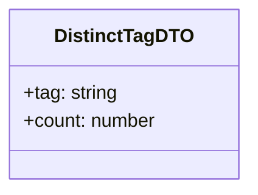
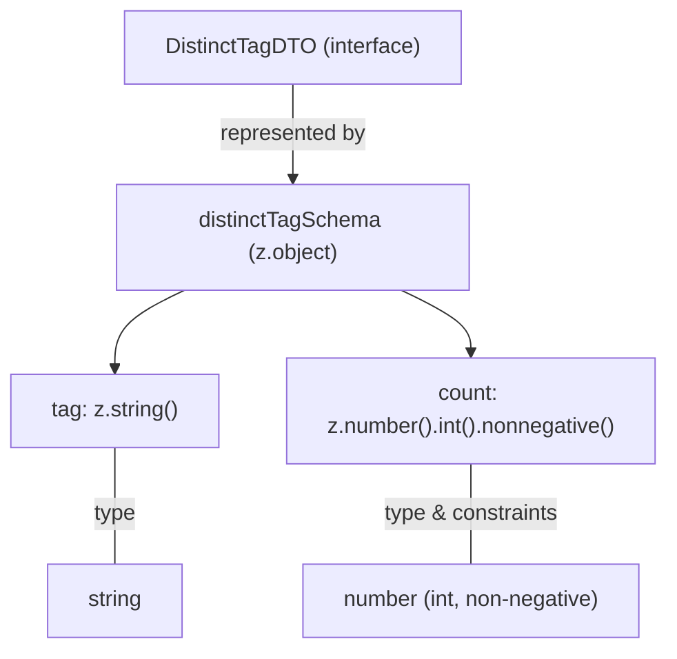

# Diagram: web/portal/src/pages/reports/bi-dashboard-next/models/DistinctTagDTO.ts

> Auto-generated by Obscura crawlers

## Diagram 1

### SVG

<svg id="container" width="209.421875" xmlns="http://www.w3.org/2000/svg" class="classDiagram" height="160" viewBox="0 0 209.421875 160" role="graphics-document document" aria-roledescription="class"><g><defs><marker id="container_class-aggregationStart" class="marker aggregation class" refX="18" refY="7" markerWidth="190" markerHeight="240" orient="auto"><path d="M 18,7 L9,13 L1,7 L9,1 Z"></path></marker></defs><defs><marker id="container_class-aggregationEnd" class="marker aggregation class" refX="1" refY="7" markerWidth="20" markerHeight="28" orient="auto"><path d="M 18,7 L9,13 L1,7 L9,1 Z"></path></marker></defs><defs><marker id="container_class-extensionStart" class="marker extension class" refX="18" refY="7" markerWidth="190" markerHeight="240" orient="auto"><path d="M 1,7 L18,13 V 1 Z"></path></marker></defs><defs><marker id="container_class-extensionEnd" class="marker extension class" refX="1" refY="7" markerWidth="20" markerHeight="28" orient="auto"><path d="M 1,1 V 13 L18,7 Z"></path></marker></defs><defs><marker id="container_class-compositionStart" class="marker composition class" refX="18" refY="7" markerWidth="190" markerHeight="240" orient="auto"><path d="M 18,7 L9,13 L1,7 L9,1 Z"></path></marker></defs><defs><marker id="container_class-compositionEnd" class="marker composition class" refX="1" refY="7" markerWidth="20" markerHeight="28" orient="auto"><path d="M 18,7 L9,13 L1,7 L9,1 Z"></path></marker></defs><defs><marker id="container_class-dependencyStart" class="marker dependency class" refX="6" refY="7" markerWidth="190" markerHeight="240" orient="auto"><path d="M 5,7 L9,13 L1,7 L9,1 Z"></path></marker></defs><defs><marker id="container_class-dependencyEnd" class="marker dependency class" refX="13" refY="7" markerWidth="20" markerHeight="28" orient="auto"><path d="M 18,7 L9,13 L14,7 L9,1 Z"></path></marker></defs><defs><marker id="container_class-lollipopStart" class="marker lollipop class" refX="13" refY="7" markerWidth="190" markerHeight="240" orient="auto"><circle stroke="black" fill="transparent" cx="7" cy="7" r="6"></circle></marker></defs><defs><marker id="container_class-lollipopEnd" class="marker lollipop class" refX="1" refY="7" markerWidth="190" markerHeight="240" orient="auto"><circle stroke="black" fill="transparent" cx="7" cy="7" r="6"></circle></marker></defs><g class="root"><g class="clusters"></g><g class="edgePaths"></g><g class="edgeLabels"></g><g class="nodes"><g class="node default" id="classId-DistinctTagDTO-0" transform="translate(104.7109375, 80)"><g class="basic label-container"><path d="M-96.7109375 -72 L96.7109375 -72 L96.7109375 72 L-96.7109375 72" stroke="none" stroke-width="0" fill="#ECECFF" style=""></path><path d="M-96.7109375 -72 C-21.5362859205389 -72, 53.6383656589222 -72, 96.7109375 -72 M-96.7109375 -72 C-48.31640551722146 -72, 0.07812646555707659 -72, 96.7109375 -72 M96.7109375 -72 C96.7109375 -26.52488808018827, 96.7109375 18.95022383962346, 96.7109375 72 M96.7109375 -72 C96.7109375 -24.166669054603624, 96.7109375 23.666661890792753, 96.7109375 72 M96.7109375 72 C28.536029133060993 72, -39.638879233878015 72, -96.7109375 72 M96.7109375 72 C49.65285137693509 72, 2.594765253870179 72, -96.7109375 72 M-96.7109375 72 C-96.7109375 32.36174734475204, -96.7109375 -7.276505310495921, -96.7109375 -72 M-96.7109375 72 C-96.7109375 37.28892913754644, -96.7109375 2.577858275092879, -96.7109375 -72" stroke="#9370DB" stroke-width="1.3" fill="none" stroke-dasharray="0 0" style=""></path></g><g class="annotation-group text" transform="translate(0, -48)"></g><g class="label-group text" transform="translate(-55.34375, -48)"><g class="label" style="font-weight: bolder" transform="translate(0,-12)"><foreignObject width="110.6875" height="24">

DistinctTagDTO

</foreignObject></g></g><g class="members-group text" transform="translate(-84.7109375, 0)"><g class="label" style="" transform="translate(0,-12)"><foreignObject width="80.15625" height="24">

+tag: string

</foreignObject></g><g class="label" style="" transform="translate(0,12)"><foreignObject width="114.078125" height="24">

+count: number

</foreignObject></g></g><g class="methods-group text" transform="translate(-84.7109375, 72)"></g><g class="divider" style=""><path d="M-96.7109375 -24 C-20.5640255350458 -24, 55.5828864299084 -24, 96.7109375 -24 M-96.7109375 -24 C-38.36081318117427 -24, 19.989311137651455 -24, 96.7109375 -24" stroke="#9370DB" stroke-width="1.3" fill="none" stroke-dasharray="0 0" style=""></path></g><g class="divider" style=""><path d="M-96.7109375 48 C-52.00721242886707 48, -7.3034873577341415 48, 96.7109375 48 M-96.7109375 48 C-35.86968244956389 48, 24.97157260087222 48, 96.7109375 48" stroke="#9370DB" stroke-width="1.3" fill="none" stroke-dasharray="0 0" style=""></path></g></g></g></g></g></svg>

## Diagram 2

### SVG

<svg id="container" width="495.328125" xmlns="http://www.w3.org/2000/svg" class="flowchart" height="478" viewBox="0 0 495.328125 478" role="graphics-document document" aria-roledescription="flowchart-v2"><g><marker id="container_flowchart-v2-pointEnd" class="marker flowchart-v2" viewBox="0 0 10 10" refX="5" refY="5" markerUnits="userSpaceOnUse" markerWidth="8" markerHeight="8" orient="auto"><path d="M 0 0 L 10 5 L 0 10 z" class="arrowMarkerPath" style="stroke-width: 1; stroke-dasharray: 1, 0;"></path></marker><marker id="container_flowchart-v2-pointStart" class="marker flowchart-v2" viewBox="0 0 10 10" refX="4.5" refY="5" markerUnits="userSpaceOnUse" markerWidth="8" markerHeight="8" orient="auto"><path d="M 0 5 L 10 10 L 10 0 z" class="arrowMarkerPath" style="stroke-width: 1; stroke-dasharray: 1, 0;"></path></marker><marker id="container_flowchart-v2-circleEnd" class="marker flowchart-v2" viewBox="0 0 10 10" refX="11" refY="5" markerUnits="userSpaceOnUse" markerWidth="11" markerHeight="11" orient="auto"><circle cx="5" cy="5" r="5" class="arrowMarkerPath" style="stroke-width: 1; stroke-dasharray: 1, 0;"></circle></marker><marker id="container_flowchart-v2-circleStart" class="marker flowchart-v2" viewBox="0 0 10 10" refX="-1" refY="5" markerUnits="userSpaceOnUse" markerWidth="11" markerHeight="11" orient="auto"><circle cx="5" cy="5" r="5" class="arrowMarkerPath" style="stroke-width: 1; stroke-dasharray: 1, 0;"></circle></marker><marker id="container_flowchart-v2-crossEnd" class="marker cross flowchart-v2" viewBox="0 0 11 11" refX="12" refY="5.2" markerUnits="userSpaceOnUse" markerWidth="11" markerHeight="11" orient="auto"><path d="M 1,1 l 9,9 M 10,1 l -9,9" class="arrowMarkerPath" style="stroke-width: 2; stroke-dasharray: 1, 0;"></path></marker><marker id="container_flowchart-v2-crossStart" class="marker cross flowchart-v2" viewBox="0 0 11 11" refX="-1" refY="5.2" markerUnits="userSpaceOnUse" markerWidth="11" markerHeight="11" orient="auto"><path d="M 1,1 l 9,9 M 10,1 l -9,9" class="arrowMarkerPath" style="stroke-width: 2; stroke-dasharray: 1, 0;"></path></marker><g class="root"><g class="clusters"></g><g class="edgePaths"><path d="M217.09,62L217.09,68.167C217.09,74.333,217.09,86.667,217.09,98.333C217.09,110,217.09,121,217.09,126.5L217.09,132" id="L_DistinctTagDTO_distinctTagSchema_0" class="edge-thickness-normal edge-pattern-solid edge-thickness-normal edge-pattern-solid flowchart-link" style=";" data-edge="true" data-et="edge" data-id="L_DistinctTagDTO_distinctTagSchema_0" data-points="W3sieCI6MjE3LjA4OTg0Mzc1LCJ5Ijo2Mn0seyJ4IjoyMTcuMDg5ODQzNzUsInkiOjk5fSx7IngiOjIxNy4wODk4NDM3NSwieSI6MTM2fV0=" marker-end="url(#container_flowchart-v2-pointEnd)"></path><path d="M136.45,214L127.835,218.167C119.219,222.333,101.989,230.667,93.373,240.333C84.758,250,84.758,261,84.758,266.5L84.758,272" id="L_distinctTagSchema_tagField_0" class="edge-thickness-normal edge-pattern-solid edge-thickness-normal edge-pattern-solid flowchart-link" style=";" data-edge="true" data-et="edge" data-id="L_distinctTagSchema_tagField_0" data-points="W3sieCI6MTM2LjQ1MDAxMjIwNzAzMTI1LCJ5IjoyMTR9LHsieCI6ODQuNzU3ODEyNSwieSI6MjM5fSx7IngiOjg0Ljc1NzgxMjUsInkiOjI3Nn1d" marker-end="url(#container_flowchart-v2-pointEnd)"></path><path d="M297.73,214L306.345,218.167C314.96,222.333,332.191,230.667,340.807,238.333C349.422,246,349.422,253,349.422,256.5L349.422,260" id="L_distinctTagSchema_countField_0" class="edge-thickness-normal edge-pattern-solid edge-thickness-normal edge-pattern-solid flowchart-link" style=";" data-edge="true" data-et="edge" data-id="L_distinctTagSchema_countField_0" data-points="W3sieCI6Mjk3LjcyOTY3NTI5Mjk2ODc1LCJ5IjoyMTR9LHsieCI6MzQ5LjQyMTg3NSwieSI6MjM5fSx7IngiOjM0OS40MjE4NzUsInkiOjI2NH1d" marker-end="url(#container_flowchart-v2-pointEnd)"></path><path d="M84.758,330L84.758,338.167C84.758,346.333,84.758,362.667,84.758,377C84.758,391.333,84.758,403.667,84.758,409.833L84.758,416" id="L_tagField_String_0" class="edge-thickness-normal edge-pattern-solid edge-thickness-normal edge-pattern-solid flowchart-link" style=";" data-edge="true" data-et="edge" data-id="L_tagField_String_0" data-points="W3sieCI6ODQuNzU3ODEyNSwieSI6MzMwfSx7IngiOjg0Ljc1NzgxMjUsInkiOjM3OX0seyJ4Ijo4NC43NTc4MTI1LCJ5Ijo0MTZ9XQ=="></path><path d="M349.422,342L349.422,348.167C349.422,354.333,349.422,366.667,349.422,379C349.422,391.333,349.422,403.667,349.422,409.833L349.422,416" id="L_countField_NumberIntNonNeg_0" class="edge-thickness-normal edge-pattern-solid edge-thickness-normal edge-pattern-solid flowchart-link" style=";" data-edge="true" data-et="edge" data-id="L_countField_NumberIntNonNeg_0" data-points="W3sieCI6MzQ5LjQyMTg3NSwieSI6MzQyfSx7IngiOjM0OS40MjE4NzUsInkiOjM3OX0seyJ4IjozNDkuNDIxODc1LCJ5Ijo0MTZ9XQ=="></path></g><g class="edgeLabels"><g class="edgeLabel" transform="translate(217.08984375, 99)"><g class="label" data-id="L_DistinctTagDTO_distinctTagSchema_0" transform="translate(-54.640625, -12)"><foreignObject width="109.28125" height="24">

represented by

</foreignObject></g></g><g class="edgeLabel"><g class="label" data-id="L_distinctTagSchema_tagField_0" transform="translate(0, 0)"><foreignObject width="0" height="0">

</foreignObject></g></g><g class="edgeLabel"><g class="label" data-id="L_distinctTagSchema_countField_0" transform="translate(0, 0)"><foreignObject width="0" height="0">

</foreignObject></g></g><g class="edgeLabel" transform="translate(84.7578125, 379)"><g class="label" data-id="L_tagField_String_0" transform="translate(-15.8984375, -12)"><foreignObject width="31.796875" height="24">

type

</foreignObject></g></g><g class="edgeLabel" transform="translate(349.421875, 379)"><g class="label" data-id="L_countField_NumberIntNonNeg_0" transform="translate(-66.3515625, -12)"><foreignObject width="132.703125" height="24">

type &amp; constraints

</foreignObject></g></g></g><g class="nodes"><g class="node default" id="flowchart-DistinctTagDTO-0" transform="translate(217.08984375, 35)"><rect class="basic label-container" style="" x="-123.46875" y="-27" width="246.9375" height="54"></rect><g class="label" style="" transform="translate(-93.46875, -12)"><rect></rect><foreignObject width="186.9375" height="24">

DistinctTagDTO (interface)

</foreignObject></g></g><g class="node default" id="flowchart-distinctTagSchema-1" transform="translate(217.08984375, 175)"><rect class="basic label-container" style="" x="-130" y="-39" width="260" height="78"></rect><g class="label" style="" transform="translate(-100, -24)"><rect></rect><foreignObject width="200" height="48">

distinctTagSchema (z.object)

</foreignObject></g></g><g class="node default" id="flowchart-tagField-3" transform="translate(84.7578125, 303)"><rect class="basic label-container" style="" x="-76.7578125" y="-27" width="153.515625" height="54"></rect><g class="label" style="" transform="translate(-46.7578125, -12)"><rect></rect><foreignObject width="93.515625" height="24">

tag: z.string()

</foreignObject></g></g><g class="node default" id="flowchart-countField-5" transform="translate(349.421875, 303)"><rect class="basic label-container" style="" x="-137.90625" y="-39" width="275.8125" height="78"></rect><g class="label" style="" transform="translate(-107.90625, -24)"><rect></rect><foreignObject width="215.8125" height="48">

count: z.number().int().nonnegative()

</foreignObject></g></g><g class="node default" id="flowchart-String-7" transform="translate(84.7578125, 443)"><rect class="basic label-container" style="" x="-50.8203125" y="-27" width="101.640625" height="54"></rect><g class="label" style="" transform="translate(-20.8203125, -12)"><rect></rect><foreignObject width="41.640625" height="24">

string

</foreignObject></g></g><g class="node default" id="flowchart-NumberIntNonNeg-9" transform="translate(349.421875, 443)"><rect class="basic label-container" style="" x="-127.703125" y="-27" width="255.40625" height="54"></rect><g class="label" style="" transform="translate(-97.703125, -12)"><rect></rect><foreignObject width="195.40625" height="24">

number (int, non-negative)

</foreignObject></g></g></g></g></g></svg>
