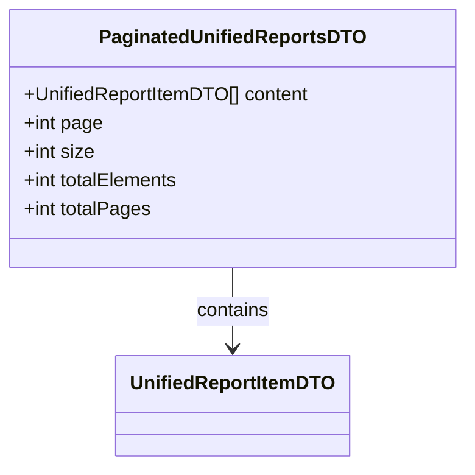

# Diagram: web/portal/src/pages/reports/bi-dashboard-next/models/PaginatedUnifiedReportsDTO.ts

> Auto-generated by Obscura crawlers

## Mermaid

### SVG

<svg id="container" width="386.078125" xmlns="http://www.w3.org/2000/svg" class="classDiagram" height="390" viewBox="0 0 386.078125 390" role="graphics-document document" aria-roledescription="class"><g><defs><marker id="container_class-aggregationStart" class="marker aggregation class" refX="18" refY="7" markerWidth="190" markerHeight="240" orient="auto"><path d="M 18,7 L9,13 L1,7 L9,1 Z"></path></marker></defs><defs><marker id="container_class-aggregationEnd" class="marker aggregation class" refX="1" refY="7" markerWidth="20" markerHeight="28" orient="auto"><path d="M 18,7 L9,13 L1,7 L9,1 Z"></path></marker></defs><defs><marker id="container_class-extensionStart" class="marker extension class" refX="18" refY="7" markerWidth="190" markerHeight="240" orient="auto"><path d="M 1,7 L18,13 V 1 Z"></path></marker></defs><defs><marker id="container_class-extensionEnd" class="marker extension class" refX="1" refY="7" markerWidth="20" markerHeight="28" orient="auto"><path d="M 1,1 V 13 L18,7 Z"></path></marker></defs><defs><marker id="container_class-compositionStart" class="marker composition class" refX="18" refY="7" markerWidth="190" markerHeight="240" orient="auto"><path d="M 18,7 L9,13 L1,7 L9,1 Z"></path></marker></defs><defs><marker id="container_class-compositionEnd" class="marker composition class" refX="1" refY="7" markerWidth="20" markerHeight="28" orient="auto"><path d="M 18,7 L9,13 L1,7 L9,1 Z"></path></marker></defs><defs><marker id="container_class-dependencyStart" class="marker dependency class" refX="6" refY="7" markerWidth="190" markerHeight="240" orient="auto"><path d="M 5,7 L9,13 L1,7 L9,1 Z"></path></marker></defs><defs><marker id="container_class-dependencyEnd" class="marker dependency class" refX="13" refY="7" markerWidth="20" markerHeight="28" orient="auto"><path d="M 18,7 L9,13 L14,7 L9,1 Z"></path></marker></defs><defs><marker id="container_class-lollipopStart" class="marker lollipop class" refX="13" refY="7" markerWidth="190" markerHeight="240" orient="auto"><circle stroke="black" fill="transparent" cx="7" cy="7" r="6"></circle></marker></defs><defs><marker id="container_class-lollipopEnd" class="marker lollipop class" refX="1" refY="7" markerWidth="190" markerHeight="240" orient="auto"><circle stroke="black" fill="transparent" cx="7" cy="7" r="6"></circle></marker></defs><g class="root"><g class="clusters"></g><g class="edgePaths"><path d="M193.039,224L193.039,230.167C193.039,236.333,193.039,248.667,193.039,260C193.039,271.333,193.039,281.667,193.039,286.833L193.039,292" id="id_PaginatedUnifiedReportsDTO_UnifiedReportItemDTO_1" class="edge-thickness-normal edge-pattern-solid relation" style=";;;" data-edge="true" data-et="edge" data-id="id_PaginatedUnifiedReportsDTO_UnifiedReportItemDTO_1" data-points="W3sieCI6MTkzLjAzOTA2MjUsInkiOjIyNH0seyJ4IjoxOTMuMDM5MDYyNSwieSI6MjYxfSx7IngiOjE5My4wMzkwNjI1LCJ5IjoyOTh9XQ==" marker-end="url(#container_class-dependencyEnd)"></path></g><g class="edgeLabels"><g class="edgeLabel" transform="translate(193.0390625, 261)"><g class="label" data-id="id_PaginatedUnifiedReportsDTO_UnifiedReportItemDTO_1" transform="translate(-30.890625, -12)"><foreignObject width="61.78125" height="24">

contains

</foreignObject></g></g></g><g class="nodes"><g class="node default" id="classId-UnifiedReportItemDTO-0" transform="translate(193.0390625, 340)"><g class="basic label-container"><path d="M-94.03125 -42 L94.03125 -42 L94.03125 42 L-94.03125 42" stroke="none" stroke-width="0" fill="#ECECFF" style=""></path><path d="M-94.03125 -42 C-25.1402002402871 -42, 43.7508495194258 -42, 94.03125 -42 M-94.03125 -42 C-28.750406342663396 -42, 36.53043731467321 -42, 94.03125 -42 M94.03125 -42 C94.03125 -17.71879708825374, 94.03125 6.562405823492519, 94.03125 42 M94.03125 -42 C94.03125 -18.725548020817083, 94.03125 4.548903958365834, 94.03125 42 M94.03125 42 C27.857568844886487 42, -38.31611231022703 42, -94.03125 42 M94.03125 42 C51.9060591273211 42, 9.7808682546422 42, -94.03125 42 M-94.03125 42 C-94.03125 17.227637884938773, -94.03125 -7.544724230122455, -94.03125 -42 M-94.03125 42 C-94.03125 23.718760253957335, -94.03125 5.43752050791467, -94.03125 -42" stroke="#9370DB" stroke-width="1.3" fill="none" stroke-dasharray="0 0" style=""></path></g><g class="annotation-group text" transform="translate(0, -18)"></g><g class="label-group text" transform="translate(-82.03125, -18)"><g class="label" style="font-weight: bolder" transform="translate(0,-12)"><foreignObject width="164.0625" height="24">

UnifiedReportItemDTO

</foreignObject></g></g><g class="members-group text" transform="translate(-82.03125, 30)"></g><g class="methods-group text" transform="translate(-82.03125, 60)"></g><g class="divider" style=""><path d="M-94.03125 6 C-39.535883579831676 6, 14.959482840336648 6, 94.03125 6 M-94.03125 6 C-33.332700070171754 6, 27.365849859656493 6, 94.03125 6" stroke="#9370DB" stroke-width="1.3" fill="none" stroke-dasharray="0 0" style=""></path></g><g class="divider" style=""><path d="M-94.03125 24 C-52.75886959126139 24, -11.486489182522774 24, 94.03125 24 M-94.03125 24 C-52.08763827968509 24, -10.144026559370175 24, 94.03125 24" stroke="#9370DB" stroke-width="1.3" fill="none" stroke-dasharray="0 0" style=""></path></g></g><g class="node default" id="classId-PaginatedUnifiedReportsDTO-1" transform="translate(193.0390625, 116)"><g class="basic label-container"><path d="M-185.0390625 -108 L185.0390625 -108 L185.0390625 108 L-185.0390625 108" stroke="none" stroke-width="0" fill="#ECECFF" style=""></path><path d="M-185.0390625 -108 C-51.704259851465594 -108, 81.63054279706881 -108, 185.0390625 -108 M-185.0390625 -108 C-58.42579436577161 -108, 68.18747376845678 -108, 185.0390625 -108 M185.0390625 -108 C185.0390625 -36.79494938587624, 185.0390625 34.41010122824753, 185.0390625 108 M185.0390625 -108 C185.0390625 -47.962292809607455, 185.0390625 12.07541438078509, 185.0390625 108 M185.0390625 108 C41.69694157590561 108, -101.64517934818878 108, -185.0390625 108 M185.0390625 108 C47.50335215026385 108, -90.0323581994723 108, -185.0390625 108 M-185.0390625 108 C-185.0390625 49.24422408262259, -185.0390625 -9.511551834754826, -185.0390625 -108 M-185.0390625 108 C-185.0390625 61.1581615991812, -185.0390625 14.316323198362397, -185.0390625 -108" stroke="#9370DB" stroke-width="1.3" fill="none" stroke-dasharray="0 0" style=""></path></g><g class="annotation-group text" transform="translate(0, -84)"></g><g class="label-group text" transform="translate(-105.9375, -84)"><g class="label" style="font-weight: bolder" transform="translate(0,-12)"><foreignObject width="211.875" height="24">

PaginatedUnifiedReportsDTO

</foreignObject></g></g><g class="members-group text" transform="translate(-173.0390625, -36)"><g class="label" style="" transform="translate(0,-12)"><foreignObject width="240.140625" height="24">

+UnifiedReportItemDTO[] content

</foreignObject></g><g class="label" style="" transform="translate(0,12)"><foreignObject width="66.5625" height="24">

+int page

</foreignObject></g><g class="label" style="" transform="translate(0,36)"><foreignObject width="59.484375" height="24">

+int size

</foreignObject></g><g class="label" style="" transform="translate(0,60)"><foreignObject width="132.5" height="24">

+int totalElements

</foreignObject></g><g class="label" style="" transform="translate(0,84)"><foreignObject width="106.890625" height="24">

+int totalPages

</foreignObject></g></g><g class="methods-group text" transform="translate(-173.0390625, 108)"></g><g class="divider" style=""><path d="M-185.0390625 -60 C-67.31060899176437 -60, 50.41784451647126 -60, 185.0390625 -60 M-185.0390625 -60 C-54.207213169479985 -60, 76.62463616104003 -60, 185.0390625 -60" stroke="#9370DB" stroke-width="1.3" fill="none" stroke-dasharray="0 0" style=""></path></g><g class="divider" style=""><path d="M-185.0390625 84 C-63.60658610384277 84, 57.825890292314455 84, 185.0390625 84 M-185.0390625 84 C-37.32024212722774 84, 110.39857824554451 84, 185.0390625 84" stroke="#9370DB" stroke-width="1.3" fill="none" stroke-dasharray="0 0" style=""></path></g></g></g></g></g></svg>
