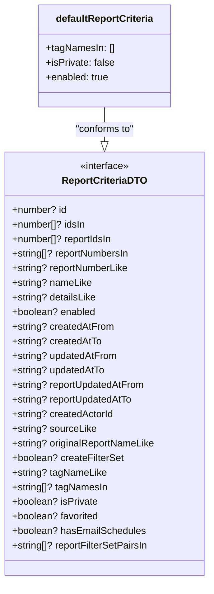

# Diagram: web/portal/src/pages/reports/bi-dashboard-next/models/ReportCriteriaDTO.ts

> Auto-generated by Obscura crawlers

## Mermaid

### SVG

<svg id="container" width="343.2734375" xmlns="http://www.w3.org/2000/svg" class="classDiagram" height="954" viewBox="0 0 343.2734375 954" role="graphics-document document" aria-roledescription="class"><g><defs><marker id="container_class-aggregationStart" class="marker aggregation class" refX="18" refY="7" markerWidth="190" markerHeight="240" orient="auto"><path d="M 18,7 L9,13 L1,7 L9,1 Z"></path></marker></defs><defs><marker id="container_class-aggregationEnd" class="marker aggregation class" refX="1" refY="7" markerWidth="20" markerHeight="28" orient="auto"><path d="M 18,7 L9,13 L1,7 L9,1 Z"></path></marker></defs><defs><marker id="container_class-extensionStart" class="marker extension class" refX="18" refY="7" markerWidth="190" markerHeight="240" orient="auto"><path d="M 1,7 L18,13 V 1 Z"></path></marker></defs><defs><marker id="container_class-extensionEnd" class="marker extension class" refX="1" refY="7" markerWidth="20" markerHeight="28" orient="auto"><path d="M 1,1 V 13 L18,7 Z"></path></marker></defs><defs><marker id="container_class-compositionStart" class="marker composition class" refX="18" refY="7" markerWidth="190" markerHeight="240" orient="auto"><path d="M 18,7 L9,13 L1,7 L9,1 Z"></path></marker></defs><defs><marker id="container_class-compositionEnd" class="marker composition class" refX="1" refY="7" markerWidth="20" markerHeight="28" orient="auto"><path d="M 18,7 L9,13 L1,7 L9,1 Z"></path></marker></defs><defs><marker id="container_class-dependencyStart" class="marker dependency class" refX="6" refY="7" markerWidth="190" markerHeight="240" orient="auto"><path d="M 5,7 L9,13 L1,7 L9,1 Z"></path></marker></defs><defs><marker id="container_class-dependencyEnd" class="marker dependency class" refX="13" refY="7" markerWidth="20" markerHeight="28" orient="auto"><path d="M 18,7 L9,13 L14,7 L9,1 Z"></path></marker></defs><defs><marker id="container_class-lollipopStart" class="marker lollipop class" refX="13" refY="7" markerWidth="190" markerHeight="240" orient="auto"><circle stroke="black" fill="transparent" cx="7" cy="7" r="6"></circle></marker></defs><defs><marker id="container_class-lollipopEnd" class="marker lollipop class" refX="1" refY="7" markerWidth="190" markerHeight="240" orient="auto"><circle stroke="black" fill="transparent" cx="7" cy="7" r="6"></circle></marker></defs><g class="root"><g class="clusters"></g><g class="edgePaths"><path d="M171.637,176L171.637,182.167C171.637,188.333,171.637,200.667,171.637,210.125C171.637,219.583,171.637,226.167,171.637,229.458L171.637,232.75" id="id_defaultReportCriteria_ReportCriteriaDTO_1" class="edge-thickness-normal edge-pattern-solid relation" style=";;;" data-edge="true" data-et="edge" data-id="id_defaultReportCriteria_ReportCriteriaDTO_1" data-points="W3sieCI6MTcxLjYzNjcxODc1LCJ5IjoxNzZ9LHsieCI6MTcxLjYzNjcxODc1LCJ5IjoyMTN9LHsieCI6MTcxLjYzNjcxODc1LCJ5IjoyNTB9XQ==" marker-end="url(#container_class-extensionEnd)"></path></g><g class="edgeLabels"><g class="edgeLabel" transform="translate(171.63671875, 213)"><g class="label" data-id="id_defaultReportCriteria_ReportCriteriaDTO_1" transform="translate(-49.765625, -12)"><foreignObject width="99.53125" height="24">

"conforms to"

</foreignObject></g></g></g><g class="nodes"><g class="node default" id="classId-ReportCriteriaDTO-0" transform="translate(171.63671875, 598)"><g class="basic label-container"><path d="M-163.63671875 -348 L163.63671875 -348 L163.63671875 348 L-163.63671875 348" stroke="none" stroke-width="0" fill="#ECECFF" style=""></path><path d="M-163.63671875 -348 C-32.93211799466485 -348, 97.7724827606703 -348, 163.63671875 -348 M-163.63671875 -348 C-68.85459527591863 -348, 25.927528198162747 -348, 163.63671875 -348 M163.63671875 -348 C163.63671875 -117.13840988360246, 163.63671875 113.72318023279507, 163.63671875 348 M163.63671875 -348 C163.63671875 -177.58505627740072, 163.63671875 -7.170112554801449, 163.63671875 348 M163.63671875 348 C56.190576186137065 348, -51.25556637772587 348, -163.63671875 348 M163.63671875 348 C95.09846915679323 348, 26.560219563586458 348, -163.63671875 348 M-163.63671875 348 C-163.63671875 197.87114770203172, -163.63671875 47.74229540406344, -163.63671875 -348 M-163.63671875 348 C-163.63671875 182.94789109516654, -163.63671875 17.89578219033308, -163.63671875 -348" stroke="#9370DB" stroke-width="1.3" fill="none" stroke-dasharray="0 0" style=""></path></g><g class="annotation-group text" transform="translate(-41.015625, -324)"><g class="label" style="" transform="translate(0,-12)"><foreignObject width="82.03125" height="24">

«interface»

</foreignObject></g></g><g class="label-group text" transform="translate(-66.6484375, -300)"><g class="label" style="font-weight: bolder" transform="translate(0,-12)"><foreignObject width="133.296875" height="24">

ReportCriteriaDTO

</foreignObject></g></g><g class="members-group text" transform="translate(-151.63671875, -252)"><g class="label" style="" transform="translate(0,-12)"><foreignObject width="89.96875" height="24">

+number? id

</foreignObject></g><g class="label" style="" transform="translate(0,12)"><foreignObject width="122.328125" height="24">

+number[]? idsIn

</foreignObject></g><g class="label" style="" transform="translate(0,36)"><foreignObject width="167.75" height="24">

+number[]? reportIdsIn

</foreignObject></g><g class="label" style="" transform="translate(0,60)"><foreignObject width="196.40625" height="24">

+string[]? reportNumbersIn

</foreignObject></g><g class="label" style="" transform="translate(0,84)"><foreignObject width="193.703125" height="24">

+string? reportNumberLike

</foreignObject></g><g class="label" style="" transform="translate(0,108)"><foreignObject width="130.640625" height="24">

+string? nameLike

</foreignObject></g><g class="label" style="" transform="translate(0,132)"><foreignObject width="139.46875" height="24">

+string? detailsLike

</foreignObject></g><g class="label" style="" transform="translate(0,156)"><foreignObject width="137.734375" height="24">

+boolean? enabled

</foreignObject></g><g class="label" style="" transform="translate(0,180)"><foreignObject width="166.3125" height="24">

+string? createdAtFrom

</foreignObject></g><g class="label" style="" transform="translate(0,204)"><foreignObject width="147" height="24">

+string? createdAtTo

</foreignObject></g><g class="label" style="" transform="translate(0,228)"><foreignObject width="172.796875" height="24">

+string? updatedAtFrom

</foreignObject></g><g class="label" style="" transform="translate(0,252)"><foreignObject width="153.484375" height="24">

+string? updatedAtTo

</foreignObject></g><g class="label" style="" transform="translate(0,276)"><foreignObject width="219.28125" height="24">

+string? reportUpdatedAtFrom

</foreignObject></g><g class="label" style="" transform="translate(0,300)"><foreignObject width="199.96875" height="24">

+string? reportUpdatedAtTo

</foreignObject></g><g class="label" style="" transform="translate(0,324)"><foreignObject width="167.484375" height="24">

+string? createdActorId

</foreignObject></g><g class="label" style="" transform="translate(0,348)"><foreignObject width="138.015625" height="24">

+string? sourceLike

</foreignObject></g><g class="label" style="" transform="translate(0,372)"><foreignObject width="236.625" height="24">

+string? originalReportNameLike

</foreignObject></g><g class="label" style="" transform="translate(0,396)"><foreignObject width="183.546875" height="24">

+boolean? createFilterSet

</foreignObject></g><g class="label" style="" transform="translate(0,420)"><foreignObject width="154.734375" height="24">

+string? tagNameLike

</foreignObject></g><g class="label" style="" transform="translate(0,444)"><foreignObject width="157.671875" height="24">

+string[]? tagNamesIn

</foreignObject></g><g class="label" style="" transform="translate(0,468)"><foreignObject width="140.765625" height="24">

+boolean? isPrivate

</foreignObject></g><g class="label" style="" transform="translate(0,492)"><foreignObject width="143.671875" height="24">

+boolean? favorited

</foreignObject></g><g class="label" style="" transform="translate(0,516)"><foreignObject width="218.09375" height="24">

+boolean? hasEmailSchedules

</foreignObject></g><g class="label" style="" transform="translate(0,540)"><foreignObject width="226.015625" height="24">

+string[]? reportFilterSetPairsIn

</foreignObject></g></g><g class="methods-group text" transform="translate(-151.63671875, 348)"></g><g class="divider" style=""><path d="M-163.63671875 -276 C-93.54976864258339 -276, -23.462818535166775 -276, 163.63671875 -276 M-163.63671875 -276 C-44.72708986194213 -276, 74.18253902611573 -276, 163.63671875 -276" stroke="#9370DB" stroke-width="1.3" fill="none" stroke-dasharray="0 0" style=""></path></g><g class="divider" style=""><path d="M-163.63671875 324 C-51.07731595786538 324, 61.48208683426924 324, 163.63671875 324 M-163.63671875 324 C-42.933596234915086 324, 77.76952628016983 324, 163.63671875 324" stroke="#9370DB" stroke-width="1.3" fill="none" stroke-dasharray="0 0" style=""></path></g></g><g class="node default" id="classId-defaultReportCriteria-1" transform="translate(171.63671875, 92)"><g class="basic label-container"><path d="M-107.59375 -84 L107.59375 -84 L107.59375 84 L-107.59375 84" stroke="none" stroke-width="0" fill="#ECECFF" style=""></path><path d="M-107.59375 -84 C-27.65924870868848 -84, 52.27525258262304 -84, 107.59375 -84 M-107.59375 -84 C-30.23732652558445 -84, 47.1190969488311 -84, 107.59375 -84 M107.59375 -84 C107.59375 -48.3576368183658, 107.59375 -12.715273636731595, 107.59375 84 M107.59375 -84 C107.59375 -23.046464407341325, 107.59375 37.90707118531735, 107.59375 84 M107.59375 84 C61.58357637495326 84, 15.57340274990652 84, -107.59375 84 M107.59375 84 C40.76229652390262 84, -26.06915695219476 84, -107.59375 84 M-107.59375 84 C-107.59375 24.315072062913693, -107.59375 -35.369855874172615, -107.59375 -84 M-107.59375 84 C-107.59375 28.75438124457696, -107.59375 -26.491237510846076, -107.59375 -84" stroke="#9370DB" stroke-width="1.3" fill="none" stroke-dasharray="0 0" style=""></path></g><g class="annotation-group text" transform="translate(0, -60)"></g><g class="label-group text" transform="translate(-78.453125, -60)"><g class="label" style="font-weight: bolder" transform="translate(0,-12)"><foreignObject width="156.90625" height="24">

defaultReportCriteria

</foreignObject></g></g><g class="members-group text" transform="translate(-95.59375, -12)"><g class="label" style="" transform="translate(0,-12)"><foreignObject width="112.453125" height="24">

+tagNamesIn: []

</foreignObject></g><g class="label" style="" transform="translate(0,12)"><foreignObject width="112.734375" height="24">

+isPrivate: false

</foreignObject></g><g class="label" style="" transform="translate(0,36)"><foreignObject width="105.25" height="24">

+enabled: true

</foreignObject></g></g><g class="methods-group text" transform="translate(-95.59375, 84)"></g><g class="divider" style=""><path d="M-107.59375 -36 C-51.001567110129265 -36, 5.590615779741469 -36, 107.59375 -36 M-107.59375 -36 C-22.017120311981287 -36, 63.559509376037425 -36, 107.59375 -36" stroke="#9370DB" stroke-width="1.3" fill="none" stroke-dasharray="0 0" style=""></path></g><g class="divider" style=""><path d="M-107.59375 60 C-46.8295105111409 60, 13.934728977718194 60, 107.59375 60 M-107.59375 60 C-31.17668079733545 60, 45.2403884053291 60, 107.59375 60" stroke="#9370DB" stroke-width="1.3" fill="none" stroke-dasharray="0 0" style=""></path></g></g></g></g></g></svg>
