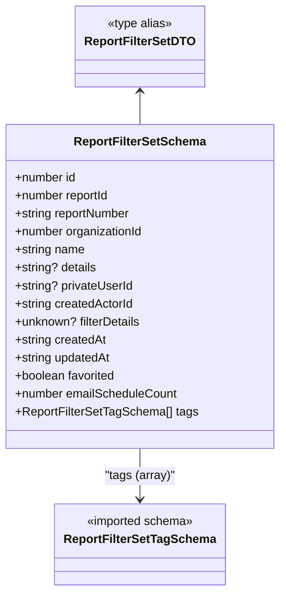

# Diagram: web/portal/src/pages/reports/bi-dashboard-next/models/ReportFilterSetDTO.ts

> Auto-generated by Obscura crawlers

## Mermaid

### SVG

<svg id="container" width="367.2578125" xmlns="http://www.w3.org/2000/svg" class="classDiagram" height="788" viewBox="0 0 367.2578125 788" role="graphics-document document" aria-roledescription="class"><g><defs><marker id="container_class-aggregationStart" class="marker aggregation class" refX="18" refY="7" markerWidth="190" markerHeight="240" orient="auto"><path d="M 18,7 L9,13 L1,7 L9,1 Z"></path></marker></defs><defs><marker id="container_class-aggregationEnd" class="marker aggregation class" refX="1" refY="7" markerWidth="20" markerHeight="28" orient="auto"><path d="M 18,7 L9,13 L1,7 L9,1 Z"></path></marker></defs><defs><marker id="container_class-extensionStart" class="marker extension class" refX="18" refY="7" markerWidth="190" markerHeight="240" orient="auto"><path d="M 1,7 L18,13 V 1 Z"></path></marker></defs><defs><marker id="container_class-extensionEnd" class="marker extension class" refX="1" refY="7" markerWidth="20" markerHeight="28" orient="auto"><path d="M 1,1 V 13 L18,7 Z"></path></marker></defs><defs><marker id="container_class-compositionStart" class="marker composition class" refX="18" refY="7" markerWidth="190" markerHeight="240" orient="auto"><path d="M 18,7 L9,13 L1,7 L9,1 Z"></path></marker></defs><defs><marker id="container_class-compositionEnd" class="marker composition class" refX="1" refY="7" markerWidth="20" markerHeight="28" orient="auto"><path d="M 18,7 L9,13 L1,7 L9,1 Z"></path></marker></defs><defs><marker id="container_class-dependencyStart" class="marker dependency class" refX="6" refY="7" markerWidth="190" markerHeight="240" orient="auto"><path d="M 5,7 L9,13 L1,7 L9,1 Z"></path></marker></defs><defs><marker id="container_class-dependencyEnd" class="marker dependency class" refX="13" refY="7" markerWidth="20" markerHeight="28" orient="auto"><path d="M 18,7 L9,13 L14,7 L9,1 Z"></path></marker></defs><defs><marker id="container_class-lollipopStart" class="marker lollipop class" refX="13" refY="7" markerWidth="190" markerHeight="240" orient="auto"><circle stroke="black" fill="transparent" cx="7" cy="7" r="6"></circle></marker></defs><defs><marker id="container_class-lollipopEnd" class="marker lollipop class" refX="1" refY="7" markerWidth="190" markerHeight="240" orient="auto"><circle stroke="black" fill="transparent" cx="7" cy="7" r="6"></circle></marker></defs><g class="root"><g class="clusters"></g><g class="edgePaths"><path d="M183.629,598L183.629,604.167C183.629,610.333,183.629,622.667,183.629,634C183.629,645.333,183.629,655.667,183.629,660.833L183.629,666" id="id_ReportFilterSetSchema_ReportFilterSetTagSchema_1" class="edge-thickness-normal edge-pattern-solid relation" style=";;;" data-edge="true" data-et="edge" data-id="id_ReportFilterSetSchema_ReportFilterSetTagSchema_1" data-points="W3sieCI6MTgzLjYyODkwNjI1LCJ5Ijo1OTh9LHsieCI6MTgzLjYyODkwNjI1LCJ5Ijo2MzV9LHsieCI6MTgzLjYyODkwNjI1LCJ5Ijo2NzJ9XQ==" marker-end="url(#container_class-dependencyEnd)"></path><path d="M183.629,122L183.629,125.167C183.629,128.333,183.629,134.667,183.629,142C183.629,149.333,183.629,157.667,183.629,161.833L183.629,166" id="id_ReportFilterSetDTO_ReportFilterSetSchema_2" class="edge-thickness-normal edge-pattern-solid relation" style=";;;" data-edge="true" data-et="edge" data-id="id_ReportFilterSetDTO_ReportFilterSetSchema_2" data-points="W3sieCI6MTgzLjYyODkwNjI1LCJ5IjoxMTZ9LHsieCI6MTgzLjYyODkwNjI1LCJ5IjoxNDF9LHsieCI6MTgzLjYyODkwNjI1LCJ5IjoxNjZ9XQ==" marker-start="url(#container_class-dependencyStart)"></path></g><g class="edgeLabels"><g class="edgeLabel" transform="translate(183.62890625, 635)"><g class="label" data-id="id_ReportFilterSetSchema_ReportFilterSetTagSchema_1" transform="translate(-47.1328125, -12)"><foreignObject width="94.265625" height="24">

"tags (array)"

</foreignObject></g></g><g class="edgeLabel"><g class="label" data-id="id_ReportFilterSetDTO_ReportFilterSetSchema_2" transform="translate(0, 0)"><foreignObject width="0" height="0">

</foreignObject></g></g></g><g class="nodes"><g class="node default" id="classId-ReportFilterSetSchema-0" transform="translate(183.62890625, 382)"><g class="basic label-container"><path d="M-175.62890625 -216 L175.62890625 -216 L175.62890625 216 L-175.62890625 216" stroke="none" stroke-width="0" fill="#ECECFF" style=""></path><path d="M-175.62890625 -216 C-41.15724734684753 -216, 93.31441155630495 -216, 175.62890625 -216 M-175.62890625 -216 C-48.27490686121125 -216, 79.0790925275775 -216, 175.62890625 -216 M175.62890625 -216 C175.62890625 -82.78032070725868, 175.62890625 50.43935858548264, 175.62890625 216 M175.62890625 -216 C175.62890625 -93.18557433731219, 175.62890625 29.62885132537562, 175.62890625 216 M175.62890625 216 C86.80258931445695 216, -2.0237276210860955 216, -175.62890625 216 M175.62890625 216 C74.11026144083691 216, -27.408383368326184 216, -175.62890625 216 M-175.62890625 216 C-175.62890625 89.59157097668343, -175.62890625 -36.81685804663314, -175.62890625 -216 M-175.62890625 216 C-175.62890625 80.68841101700187, -175.62890625 -54.62317796599626, -175.62890625 -216" stroke="#9370DB" stroke-width="1.3" fill="none" stroke-dasharray="0 0" style=""></path></g><g class="annotation-group text" transform="translate(0, -192)"></g><g class="label-group text" transform="translate(-84.5078125, -192)"><g class="label" style="font-weight: bolder" transform="translate(0,-12)"><foreignObject width="169.015625" height="24">

ReportFilterSetSchema

</foreignObject></g></g><g class="members-group text" transform="translate(-163.62890625, -144)"><g class="label" style="" transform="translate(0,-12)"><foreignObject width="83.109375" height="24">

+number id

</foreignObject></g><g class="label" style="" transform="translate(0,12)"><foreignObject width="128.53125" height="24">

+number reportId

</foreignObject></g><g class="label" style="" transform="translate(0,36)"><foreignObject width="157.4375" height="24">

+string reportNumber

</foreignObject></g><g class="label" style="" transform="translate(0,60)"><foreignObject width="173.671875" height="24">

+number organizationId

</foreignObject></g><g class="label" style="" transform="translate(0,84)"><foreignObject width="94.375" height="24">

+string name

</foreignObject></g><g class="label" style="" transform="translate(0,108)"><foreignObject width="110.21875" height="24">

+string? details

</foreignObject></g><g class="label" style="" transform="translate(0,132)"><foreignObject width="158.828125" height="24">

+string? privateUserId

</foreignObject></g><g class="label" style="" transform="translate(0,156)"><foreignObject width="160.453125" height="24">

+string createdActorId

</foreignObject></g><g class="label" style="" transform="translate(0,180)"><foreignObject width="169.921875" height="24">

+unknown? filterDetails

</foreignObject></g><g class="label" style="" transform="translate(0,204)"><foreignObject width="123.234375" height="24">

+string createdAt

</foreignObject></g><g class="label" style="" transform="translate(0,228)"><foreignObject width="129.71875" height="24">

+string updatedAt

</foreignObject></g><g class="label" style="" transform="translate(0,252)"><foreignObject width="136.8125" height="24">

+boolean favorited

</foreignObject></g><g class="label" style="" transform="translate(0,276)"><foreignObject width="218.484375" height="24">

+number emailScheduleCount

</foreignObject></g><g class="label" style="" transform="translate(0,300)"><foreignObject width="242.75" height="24">

+ReportFilterSetTagSchema[] tags

</foreignObject></g></g><g class="methods-group text" transform="translate(-163.62890625, 216)"></g><g class="divider" style=""><path d="M-175.62890625 -168 C-52.118286784076304 -168, 71.39233268184739 -168, 175.62890625 -168 M-175.62890625 -168 C-91.43506012375832 -168, -7.241213997516638 -168, 175.62890625 -168" stroke="#9370DB" stroke-width="1.3" fill="none" stroke-dasharray="0 0" style=""></path></g><g class="divider" style=""><path d="M-175.62890625 192 C-96.8491998912818 192, -18.069493532563598 192, 175.62890625 192 M-175.62890625 192 C-100.87525635243462 192, -26.121606454869237 192, 175.62890625 192" stroke="#9370DB" stroke-width="1.3" fill="none" stroke-dasharray="0 0" style=""></path></g></g><g class="node default" id="classId-ReportFilterSetTagSchema-1" transform="translate(183.62890625, 726)"><g class="basic label-container"><path d="M-109.140625 -54 L109.140625 -54 L109.140625 54 L-109.140625 54" stroke="none" stroke-width="0" fill="#ECECFF" style=""></path><path d="M-109.140625 -54 C-48.8152114820341 -54, 11.510202035931798 -54, 109.140625 -54 M-109.140625 -54 C-26.42650465337283 -54, 56.28761569325434 -54, 109.140625 -54 M109.140625 -54 C109.140625 -23.68795754578636, 109.140625 6.624084908427278, 109.140625 54 M109.140625 -54 C109.140625 -24.284430484882296, 109.140625 5.431139030235407, 109.140625 54 M109.140625 54 C24.757310676030144 54, -59.62600364793971 54, -109.140625 54 M109.140625 54 C56.0286938753082 54, 2.9167627506163996 54, -109.140625 54 M-109.140625 54 C-109.140625 26.286161481908703, -109.140625 -1.427677036182594, -109.140625 -54 M-109.140625 54 C-109.140625 15.961492927477849, -109.140625 -22.077014145044302, -109.140625 -54" stroke="#9370DB" stroke-width="1.3" fill="none" stroke-dasharray="0 0" style=""></path></g><g class="annotation-group text" transform="translate(-72.6015625, -30)"><g class="label" style="" transform="translate(0,-12)"><foreignObject width="145.203125" height="24">

«imported schema»

</foreignObject></g></g><g class="label-group text" transform="translate(-97.140625, -6)"><g class="label" style="font-weight: bolder" transform="translate(0,-12)"><foreignObject width="194.28125" height="24">

ReportFilterSetTagSchema

</foreignObject></g></g><g class="members-group text" transform="translate(-97.140625, 42)"></g><g class="methods-group text" transform="translate(-97.140625, 72)"></g><g class="divider" style=""><path d="M-109.140625 18 C-45.40124109538361 18, 18.338142809232778 18, 109.140625 18 M-109.140625 18 C-65.11007138864805 18, -21.079517777296104 18, 109.140625 18" stroke="#9370DB" stroke-width="1.3" fill="none" stroke-dasharray="0 0" style=""></path></g><g class="divider" style=""><path d="M-109.140625 36 C-37.76071302701085 36, 33.6191989459783 36, 109.140625 36 M-109.140625 36 C-62.42258443762821 36, -15.70454387525642 36, 109.140625 36" stroke="#9370DB" stroke-width="1.3" fill="none" stroke-dasharray="0 0" style=""></path></g></g><g class="node default" id="classId-ReportFilterSetDTO-2" transform="translate(183.62890625, 62)"><g class="basic label-container"><path d="M-82.421875 -54 L82.421875 -54 L82.421875 54 L-82.421875 54" stroke="none" stroke-width="0" fill="#ECECFF" style=""></path><path d="M-82.421875 -54 C-40.694307672609604 -54, 1.0332596547807924 -54, 82.421875 -54 M-82.421875 -54 C-19.91535124648246 -54, 42.59117250703508 -54, 82.421875 -54 M82.421875 -54 C82.421875 -18.068442302800513, 82.421875 17.863115394398974, 82.421875 54 M82.421875 -54 C82.421875 -26.95368113104988, 82.421875 0.09263773790024032, 82.421875 54 M82.421875 54 C35.91980566709017 54, -10.582263665819653 54, -82.421875 54 M82.421875 54 C25.499354645747992 54, -31.423165708504015 54, -82.421875 54 M-82.421875 54 C-82.421875 24.991573597077732, -82.421875 -4.016852805844536, -82.421875 -54 M-82.421875 54 C-82.421875 12.023564032399463, -82.421875 -29.952871935201074, -82.421875 -54" stroke="#9370DB" stroke-width="1.3" fill="none" stroke-dasharray="0 0" style=""></path></g><g class="annotation-group text" transform="translate(-44.03125, -30)"><g class="label" style="" transform="translate(0,-12)"><foreignObject width="88.0625" height="24">

«type alias»

</foreignObject></g></g><g class="label-group text" transform="translate(-70.421875, -6)"><g class="label" style="font-weight: bolder" transform="translate(0,-12)"><foreignObject width="140.84375" height="24">

ReportFilterSetDTO

</foreignObject></g></g><g class="members-group text" transform="translate(-70.421875, 42)"></g><g class="methods-group text" transform="translate(-70.421875, 72)"></g><g class="divider" style=""><path d="M-82.421875 18 C-32.76258344339659 18, 16.896708113206813 18, 82.421875 18 M-82.421875 18 C-42.138917261764874 18, -1.855959523529748 18, 82.421875 18" stroke="#9370DB" stroke-width="1.3" fill="none" stroke-dasharray="0 0" style=""></path></g><g class="divider" style=""><path d="M-82.421875 36 C-39.11570895374191 36, 4.1904570925161835 36, 82.421875 36 M-82.421875 36 C-48.133903490345766 36, -13.845931980691532 36, 82.421875 36" stroke="#9370DB" stroke-width="1.3" fill="none" stroke-dasharray="0 0" style=""></path></g></g></g></g></g></svg>
