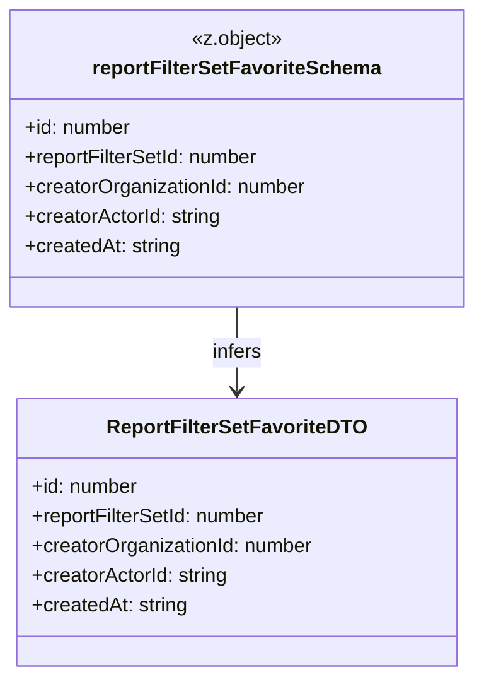

# Diagram: web/portal/src/pages/reports/bi-dashboard-next/models/ReportFilterSetFavoriteDTO.ts

> Auto-generated by Obscura crawlers

## Mermaid

### SVG

<svg id="container" width="382.78125" xmlns="http://www.w3.org/2000/svg" class="classDiagram" height="546" viewBox="0 0 382.78125 546" role="graphics-document document" aria-roledescription="class"><g><defs><marker id="container_class-aggregationStart" class="marker aggregation class" refX="18" refY="7" markerWidth="190" markerHeight="240" orient="auto"><path d="M 18,7 L9,13 L1,7 L9,1 Z"></path></marker></defs><defs><marker id="container_class-aggregationEnd" class="marker aggregation class" refX="1" refY="7" markerWidth="20" markerHeight="28" orient="auto"><path d="M 18,7 L9,13 L1,7 L9,1 Z"></path></marker></defs><defs><marker id="container_class-extensionStart" class="marker extension class" refX="18" refY="7" markerWidth="190" markerHeight="240" orient="auto"><path d="M 1,7 L18,13 V 1 Z"></path></marker></defs><defs><marker id="container_class-extensionEnd" class="marker extension class" refX="1" refY="7" markerWidth="20" markerHeight="28" orient="auto"><path d="M 1,1 V 13 L18,7 Z"></path></marker></defs><defs><marker id="container_class-compositionStart" class="marker composition class" refX="18" refY="7" markerWidth="190" markerHeight="240" orient="auto"><path d="M 18,7 L9,13 L1,7 L9,1 Z"></path></marker></defs><defs><marker id="container_class-compositionEnd" class="marker composition class" refX="1" refY="7" markerWidth="20" markerHeight="28" orient="auto"><path d="M 18,7 L9,13 L1,7 L9,1 Z"></path></marker></defs><defs><marker id="container_class-dependencyStart" class="marker dependency class" refX="6" refY="7" markerWidth="190" markerHeight="240" orient="auto"><path d="M 5,7 L9,13 L1,7 L9,1 Z"></path></marker></defs><defs><marker id="container_class-dependencyEnd" class="marker dependency class" refX="13" refY="7" markerWidth="20" markerHeight="28" orient="auto"><path d="M 18,7 L9,13 L14,7 L9,1 Z"></path></marker></defs><defs><marker id="container_class-lollipopStart" class="marker lollipop class" refX="13" refY="7" markerWidth="190" markerHeight="240" orient="auto"><circle stroke="black" fill="transparent" cx="7" cy="7" r="6"></circle></marker></defs><defs><marker id="container_class-lollipopEnd" class="marker lollipop class" refX="1" refY="7" markerWidth="190" markerHeight="240" orient="auto"><circle stroke="black" fill="transparent" cx="7" cy="7" r="6"></circle></marker></defs><g class="root"><g class="clusters"></g><g class="edgePaths"><path d="M191.391,248L191.391,254.167C191.391,260.333,191.391,272.667,191.391,284C191.391,295.333,191.391,305.667,191.391,310.833L191.391,316" id="id_reportFilterSetFavoriteSchema_ReportFilterSetFavoriteDTO_1" class="edge-thickness-normal edge-pattern-solid relation" style=";;;" data-edge="true" data-et="edge" data-id="id_reportFilterSetFavoriteSchema_ReportFilterSetFavoriteDTO_1" data-points="W3sieCI6MTkxLjM5MDYyNSwieSI6MjQ4fSx7IngiOjE5MS4zOTA2MjUsInkiOjI4NX0seyJ4IjoxOTEuMzkwNjI1LCJ5IjozMjJ9XQ==" marker-end="url(#container_class-dependencyEnd)"></path></g><g class="edgeLabels"><g class="edgeLabel" transform="translate(191.390625, 285)"><g class="label" data-id="id_reportFilterSetFavoriteSchema_ReportFilterSetFavoriteDTO_1" transform="translate(-20.609375, -12)"><foreignObject width="41.21875" height="24">

infers

</foreignObject></g></g></g><g class="nodes"><g class="node default" id="classId-reportFilterSetFavoriteSchema-0" transform="translate(191.390625, 128)"><g class="basic label-container"><path d="M-183.390625 -120 L183.390625 -120 L183.390625 120 L-183.390625 120" stroke="none" stroke-width="0" fill="#ECECFF" style=""></path><path d="M-183.390625 -120 C-79.44970079130134 -120, 24.491223417397322 -120, 183.390625 -120 M-183.390625 -120 C-97.70532815869721 -120, -12.020031317394427 -120, 183.390625 -120 M183.390625 -120 C183.390625 -26.83947199968722, 183.390625 66.32105600062556, 183.390625 120 M183.390625 -120 C183.390625 -30.27281185445358, 183.390625 59.45437629109284, 183.390625 120 M183.390625 120 C38.01827728483286 120, -107.35407043033427 120, -183.390625 120 M183.390625 120 C56.49111620279653 120, -70.40839259440693 120, -183.390625 120 M-183.390625 120 C-183.390625 66.64679475800838, -183.390625 13.29358951601678, -183.390625 -120 M-183.390625 120 C-183.390625 35.4067805269942, -183.390625 -49.186438946011606, -183.390625 -120" stroke="#9370DB" stroke-width="1.3" fill="none" stroke-dasharray="0 0" style=""></path></g><g class="annotation-group text" transform="translate(-37.203125, -96)"><g class="label" style="" transform="translate(0,-12)"><foreignObject width="74.40625" height="24">

«z.object»

</foreignObject></g></g><g class="label-group text" transform="translate(-111.875, -72)"><g class="label" style="font-weight: bolder" transform="translate(0,-12)"><foreignObject width="223.75" height="24">

reportFilterSetFavoriteSchema

</foreignObject></g></g><g class="members-group text" transform="translate(-171.390625, -24)"><g class="label" style="" transform="translate(0,-12)"><foreignObject width="86.953125" height="24">

+id: number

</foreignObject></g><g class="label" style="" transform="translate(0,12)"><foreignObject width="192.515625" height="24">

+reportFilterSetId: number

</foreignObject></g><g class="label" style="" transform="translate(0,36)"><foreignObject width="230.90625" height="24">

+creatorOrganizationId: number

</foreignObject></g><g class="label" style="" transform="translate(0,60)"><foreignObject width="161.53125" height="24">

+creatorActorId: string

</foreignObject></g><g class="label" style="" transform="translate(0,84)"><foreignObject width="127.140625" height="24">

+createdAt: string

</foreignObject></g></g><g class="methods-group text" transform="translate(-171.390625, 120)"></g><g class="divider" style=""><path d="M-183.390625 -48 C-76.71764453087953 -48, 29.95533593824095 -48, 183.390625 -48 M-183.390625 -48 C-66.5020893978702 -48, 50.38644620425961 -48, 183.390625 -48" stroke="#9370DB" stroke-width="1.3" fill="none" stroke-dasharray="0 0" style=""></path></g><g class="divider" style=""><path d="M-183.390625 96 C-62.21392354148783 96, 58.96277791702434 96, 183.390625 96 M-183.390625 96 C-97.14290031414843 96, -10.895175628296869 96, 183.390625 96" stroke="#9370DB" stroke-width="1.3" fill="none" stroke-dasharray="0 0" style=""></path></g></g><g class="node default" id="classId-ReportFilterSetFavoriteDTO-1" transform="translate(191.390625, 430)"><g class="basic label-container"><path d="M-177.26953125 -108 L177.26953125 -108 L177.26953125 108 L-177.26953125 108" stroke="none" stroke-width="0" fill="#ECECFF" style=""></path><path d="M-177.26953125 -108 C-45.5062602820168 -108, 86.2570106859664 -108, 177.26953125 -108 M-177.26953125 -108 C-56.52271618938484 -108, 64.22409887123032 -108, 177.26953125 -108 M177.26953125 -108 C177.26953125 -40.26476318047722, 177.26953125 27.470473639045565, 177.26953125 108 M177.26953125 -108 C177.26953125 -56.04777891589054, 177.26953125 -4.095557831781079, 177.26953125 108 M177.26953125 108 C56.24098789982554 108, -64.78755545034892 108, -177.26953125 108 M177.26953125 108 C39.5670200009194 108, -98.1354912481612 108, -177.26953125 108 M-177.26953125 108 C-177.26953125 43.731176771148114, -177.26953125 -20.537646457703772, -177.26953125 -108 M-177.26953125 108 C-177.26953125 55.023762898606435, -177.26953125 2.04752579721287, -177.26953125 -108" stroke="#9370DB" stroke-width="1.3" fill="none" stroke-dasharray="0 0" style=""></path></g><g class="annotation-group text" transform="translate(0, -84)"></g><g class="label-group text" transform="translate(-99.6328125, -84)"><g class="label" style="font-weight: bolder" transform="translate(0,-12)"><foreignObject width="199.265625" height="24">

ReportFilterSetFavoriteDTO

</foreignObject></g></g><g class="members-group text" transform="translate(-165.26953125, -36)"><g class="label" style="" transform="translate(0,-12)"><foreignObject width="86.953125" height="24">

+id: number

</foreignObject></g><g class="label" style="" transform="translate(0,12)"><foreignObject width="192.515625" height="24">

+reportFilterSetId: number

</foreignObject></g><g class="label" style="" transform="translate(0,36)"><foreignObject width="230.90625" height="24">

+creatorOrganizationId: number

</foreignObject></g><g class="label" style="" transform="translate(0,60)"><foreignObject width="161.53125" height="24">

+creatorActorId: string

</foreignObject></g><g class="label" style="" transform="translate(0,84)"><foreignObject width="127.140625" height="24">

+createdAt: string

</foreignObject></g></g><g class="methods-group text" transform="translate(-165.26953125, 108)"></g><g class="divider" style=""><path d="M-177.26953125 -60 C-45.47501733185146 -60, 86.31949658629708 -60, 177.26953125 -60 M-177.26953125 -60 C-67.79027854939216 -60, 41.68897415121569 -60, 177.26953125 -60" stroke="#9370DB" stroke-width="1.3" fill="none" stroke-dasharray="0 0" style=""></path></g><g class="divider" style=""><path d="M-177.26953125 84 C-73.54864546655935 84, 30.1722403168813 84, 177.26953125 84 M-177.26953125 84 C-63.18795577697638 84, 50.89361969604724 84, 177.26953125 84" stroke="#9370DB" stroke-width="1.3" fill="none" stroke-dasharray="0 0" style=""></path></g></g></g></g></g></svg>
