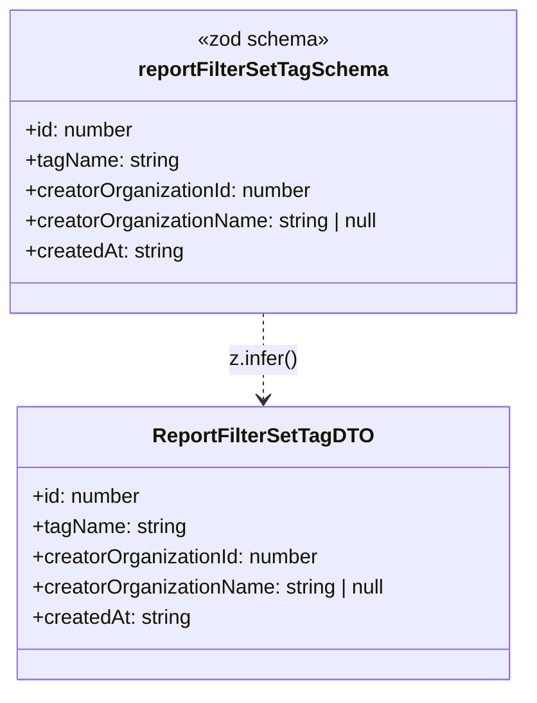

# Diagram: web/portal/src/pages/reports/bi-dashboard-next/models/ReportFilterSetTagDTO.ts

> Auto-generated by Obscura crawlers

## Mermaid

### SVG

<svg id="container" width="421.7890625" xmlns="http://www.w3.org/2000/svg" class="classDiagram" height="546" viewBox="0 0 421.7890625 546" role="graphics-document document" aria-roledescription="class"><g><defs><marker id="container_class-aggregationStart" class="marker aggregation class" refX="18" refY="7" markerWidth="190" markerHeight="240" orient="auto"><path d="M 18,7 L9,13 L1,7 L9,1 Z"></path></marker></defs><defs><marker id="container_class-aggregationEnd" class="marker aggregation class" refX="1" refY="7" markerWidth="20" markerHeight="28" orient="auto"><path d="M 18,7 L9,13 L1,7 L9,1 Z"></path></marker></defs><defs><marker id="container_class-extensionStart" class="marker extension class" refX="18" refY="7" markerWidth="190" markerHeight="240" orient="auto"><path d="M 1,7 L18,13 V 1 Z"></path></marker></defs><defs><marker id="container_class-extensionEnd" class="marker extension class" refX="1" refY="7" markerWidth="20" markerHeight="28" orient="auto"><path d="M 1,1 V 13 L18,7 Z"></path></marker></defs><defs><marker id="container_class-compositionStart" class="marker composition class" refX="18" refY="7" markerWidth="190" markerHeight="240" orient="auto"><path d="M 18,7 L9,13 L1,7 L9,1 Z"></path></marker></defs><defs><marker id="container_class-compositionEnd" class="marker composition class" refX="1" refY="7" markerWidth="20" markerHeight="28" orient="auto"><path d="M 18,7 L9,13 L1,7 L9,1 Z"></path></marker></defs><defs><marker id="container_class-dependencyStart" class="marker dependency class" refX="6" refY="7" markerWidth="190" markerHeight="240" orient="auto"><path d="M 5,7 L9,13 L1,7 L9,1 Z"></path></marker></defs><defs><marker id="container_class-dependencyEnd" class="marker dependency class" refX="13" refY="7" markerWidth="20" markerHeight="28" orient="auto"><path d="M 18,7 L9,13 L14,7 L9,1 Z"></path></marker></defs><defs><marker id="container_class-lollipopStart" class="marker lollipop class" refX="13" refY="7" markerWidth="190" markerHeight="240" orient="auto"><circle stroke="black" fill="transparent" cx="7" cy="7" r="6"></circle></marker></defs><defs><marker id="container_class-lollipopEnd" class="marker lollipop class" refX="1" refY="7" markerWidth="190" markerHeight="240" orient="auto"><circle stroke="black" fill="transparent" cx="7" cy="7" r="6"></circle></marker></defs><g class="root"><g class="clusters"></g><g class="edgePaths"><path d="M210.895,248L210.895,254.167C210.895,260.333,210.895,272.667,210.895,284C210.895,295.333,210.895,305.667,210.895,310.833L210.895,316" id="id_reportFilterSetTagSchema_ReportFilterSetTagDTO_1" class="edge-thickness-normal edge-pattern-dashed relation" style=";;;" data-edge="true" data-et="edge" data-id="id_reportFilterSetTagSchema_ReportFilterSetTagDTO_1" data-points="W3sieCI6MjEwLjg5NDUzMTI1LCJ5IjoyNDh9LHsieCI6MjEwLjg5NDUzMTI1LCJ5IjoyODV9LHsieCI6MjEwLjg5NDUzMTI1LCJ5IjozMjJ9XQ==" marker-end="url(#container_class-dependencyEnd)"></path></g><g class="edgeLabels"><g class="edgeLabel" transform="translate(210.89453125, 285)"><g class="label" data-id="id_reportFilterSetTagSchema_ReportFilterSetTagDTO_1" transform="translate(-27.59375, -12)"><foreignObject width="55.1875" height="24">

z.infer()

</foreignObject></g></g></g><g class="nodes"><g class="node default" id="classId-reportFilterSetTagSchema-0" transform="translate(210.89453125, 128)"><g class="basic label-container"><path d="M-202.89453125 -120 L202.89453125 -120 L202.89453125 120 L-202.89453125 120" stroke="none" stroke-width="0" fill="#ECECFF" style=""></path><path d="M-202.89453125 -120 C-66.03522996288194 -120, 70.82407132423612 -120, 202.89453125 -120 M-202.89453125 -120 C-88.86534911354364 -120, 25.163833022912712 -120, 202.89453125 -120 M202.89453125 -120 C202.89453125 -28.547813865651648, 202.89453125 62.904372268696704, 202.89453125 120 M202.89453125 -120 C202.89453125 -40.10006405207814, 202.89453125 39.79987189584372, 202.89453125 120 M202.89453125 120 C81.60834743068348 120, -39.67783638863304 120, -202.89453125 120 M202.89453125 120 C41.86075739695883 120, -119.17301645608234 120, -202.89453125 120 M-202.89453125 120 C-202.89453125 71.97782769349232, -202.89453125 23.95565538698463, -202.89453125 -120 M-202.89453125 120 C-202.89453125 67.12439383103805, -202.89453125 14.248787662076083, -202.89453125 -120" stroke="#9370DB" stroke-width="1.3" fill="none" stroke-dasharray="0 0" style=""></path></g><g class="annotation-group text" transform="translate(-51.9609375, -96)"><g class="label" style="" transform="translate(0,-12)"><foreignObject width="103.921875" height="24">

«zod schema»

</foreignObject></g></g><g class="label-group text" transform="translate(-95.2890625, -72)"><g class="label" style="font-weight: bolder" transform="translate(0,-12)"><foreignObject width="190.578125" height="24">

reportFilterSetTagSchema

</foreignObject></g></g><g class="members-group text" transform="translate(-190.89453125, -24)"><g class="label" style="" transform="translate(0,-12)"><foreignObject width="86.953125" height="24">

+id: number

</foreignObject></g><g class="label" style="" transform="translate(0,12)"><foreignObject width="122.21875" height="24">

+tagName: string

</foreignObject></g><g class="label" style="" transform="translate(0,36)"><foreignObject width="230.90625" height="24">

+creatorOrganizationId: number

</foreignObject></g><g class="label" style="" transform="translate(0,60)"><foreignObject width="286.5" height="24">

+creatorOrganizationName: string | null

</foreignObject></g><g class="label" style="" transform="translate(0,84)"><foreignObject width="127.140625" height="24">

+createdAt: string

</foreignObject></g></g><g class="methods-group text" transform="translate(-190.89453125, 120)"></g><g class="divider" style=""><path d="M-202.89453125 -48 C-72.03728153881801 -48, 58.819968172363986 -48, 202.89453125 -48 M-202.89453125 -48 C-106.71248185536768 -48, -10.53043246073537 -48, 202.89453125 -48" stroke="#9370DB" stroke-width="1.3" fill="none" stroke-dasharray="0 0" style=""></path></g><g class="divider" style=""><path d="M-202.89453125 96 C-51.41431843673578 96, 100.06589437652843 96, 202.89453125 96 M-202.89453125 96 C-74.88830753525406 96, 53.117916179491885 96, 202.89453125 96" stroke="#9370DB" stroke-width="1.3" fill="none" stroke-dasharray="0 0" style=""></path></g></g><g class="node default" id="classId-ReportFilterSetTagDTO-1" transform="translate(210.89453125, 430)"><g class="basic label-container"><path d="M-196.77734375 -108 L196.77734375 -108 L196.77734375 108 L-196.77734375 108" stroke="none" stroke-width="0" fill="#ECECFF" style=""></path><path d="M-196.77734375 -108 C-87.24804899204246 -108, 22.281245765915088 -108, 196.77734375 -108 M-196.77734375 -108 C-54.675274515289914 -108, 87.42679471942017 -108, 196.77734375 -108 M196.77734375 -108 C196.77734375 -57.56840803439027, 196.77734375 -7.136816068780547, 196.77734375 108 M196.77734375 -108 C196.77734375 -44.543141263902406, 196.77734375 18.913717472195188, 196.77734375 108 M196.77734375 108 C77.47026486756246 108, -41.836814014875074 108, -196.77734375 108 M196.77734375 108 C43.628441266443104 108, -109.52046121711379 108, -196.77734375 108 M-196.77734375 108 C-196.77734375 23.634135568745947, -196.77734375 -60.731728862508106, -196.77734375 -108 M-196.77734375 108 C-196.77734375 46.86123412592743, -196.77734375 -14.277531748145137, -196.77734375 -108" stroke="#9370DB" stroke-width="1.3" fill="none" stroke-dasharray="0 0" style=""></path></g><g class="annotation-group text" transform="translate(0, -84)"></g><g class="label-group text" transform="translate(-83.0546875, -84)"><g class="label" style="font-weight: bolder" transform="translate(0,-12)"><foreignObject width="166.109375" height="24">

ReportFilterSetTagDTO

</foreignObject></g></g><g class="members-group text" transform="translate(-184.77734375, -36)"><g class="label" style="" transform="translate(0,-12)"><foreignObject width="86.953125" height="24">

+id: number

</foreignObject></g><g class="label" style="" transform="translate(0,12)"><foreignObject width="122.21875" height="24">

+tagName: string

</foreignObject></g><g class="label" style="" transform="translate(0,36)"><foreignObject width="230.90625" height="24">

+creatorOrganizationId: number

</foreignObject></g><g class="label" style="" transform="translate(0,60)"><foreignObject width="286.5" height="24">

+creatorOrganizationName: string | null

</foreignObject></g><g class="label" style="" transform="translate(0,84)"><foreignObject width="127.140625" height="24">

+createdAt: string

</foreignObject></g></g><g class="methods-group text" transform="translate(-184.77734375, 108)"></g><g class="divider" style=""><path d="M-196.77734375 -60 C-43.65653364683752 -60, 109.46427645632497 -60, 196.77734375 -60 M-196.77734375 -60 C-105.63845054917873 -60, -14.499557348357456 -60, 196.77734375 -60" stroke="#9370DB" stroke-width="1.3" fill="none" stroke-dasharray="0 0" style=""></path></g><g class="divider" style=""><path d="M-196.77734375 84 C-48.58937052649492 84, 99.59860269701016 84, 196.77734375 84 M-196.77734375 84 C-78.4223229980499 84, 39.932697753900186 84, 196.77734375 84" stroke="#9370DB" stroke-width="1.3" fill="none" stroke-dasharray="0 0" style=""></path></g></g></g></g></g></svg>
