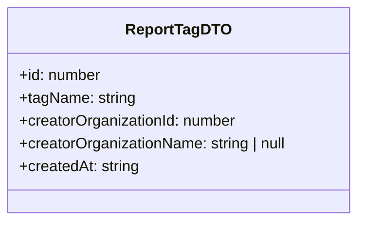

# Diagram: web/portal/src/pages/reports/bi-dashboard-next/models/ReportTagDTO.ts

> Auto-generated by Obscura crawlers

## Mermaid

### SVG

<svg id="container" width="378.609375" xmlns="http://www.w3.org/2000/svg" class="classDiagram" height="232" viewBox="0 0 378.609375 232" role="graphics-document document" aria-roledescription="class"><g><defs><marker id="container_class-aggregationStart" class="marker aggregation class" refX="18" refY="7" markerWidth="190" markerHeight="240" orient="auto"><path d="M 18,7 L9,13 L1,7 L9,1 Z"></path></marker></defs><defs><marker id="container_class-aggregationEnd" class="marker aggregation class" refX="1" refY="7" markerWidth="20" markerHeight="28" orient="auto"><path d="M 18,7 L9,13 L1,7 L9,1 Z"></path></marker></defs><defs><marker id="container_class-extensionStart" class="marker extension class" refX="18" refY="7" markerWidth="190" markerHeight="240" orient="auto"><path d="M 1,7 L18,13 V 1 Z"></path></marker></defs><defs><marker id="container_class-extensionEnd" class="marker extension class" refX="1" refY="7" markerWidth="20" markerHeight="28" orient="auto"><path d="M 1,1 V 13 L18,7 Z"></path></marker></defs><defs><marker id="container_class-compositionStart" class="marker composition class" refX="18" refY="7" markerWidth="190" markerHeight="240" orient="auto"><path d="M 18,7 L9,13 L1,7 L9,1 Z"></path></marker></defs><defs><marker id="container_class-compositionEnd" class="marker composition class" refX="1" refY="7" markerWidth="20" markerHeight="28" orient="auto"><path d="M 18,7 L9,13 L1,7 L9,1 Z"></path></marker></defs><defs><marker id="container_class-dependencyStart" class="marker dependency class" refX="6" refY="7" markerWidth="190" markerHeight="240" orient="auto"><path d="M 5,7 L9,13 L1,7 L9,1 Z"></path></marker></defs><defs><marker id="container_class-dependencyEnd" class="marker dependency class" refX="13" refY="7" markerWidth="20" markerHeight="28" orient="auto"><path d="M 18,7 L9,13 L14,7 L9,1 Z"></path></marker></defs><defs><marker id="container_class-lollipopStart" class="marker lollipop class" refX="13" refY="7" markerWidth="190" markerHeight="240" orient="auto"><circle stroke="black" fill="transparent" cx="7" cy="7" r="6"></circle></marker></defs><defs><marker id="container_class-lollipopEnd" class="marker lollipop class" refX="1" refY="7" markerWidth="190" markerHeight="240" orient="auto"><circle stroke="black" fill="transparent" cx="7" cy="7" r="6"></circle></marker></defs><g class="root"><g class="clusters"></g><g class="edgePaths"></g><g class="edgeLabels"></g><g class="nodes"><g class="node default" id="classId-ReportTagDTO-0" transform="translate(189.3046875, 116)"><g class="basic label-container"><path d="M-181.3046875 -108 L181.3046875 -108 L181.3046875 108 L-181.3046875 108" stroke="none" stroke-width="0" fill="#ECECFF" style=""></path><path d="M-181.3046875 -108 C-52.07600769853275 -108, 77.1526721029345 -108, 181.3046875 -108 M-181.3046875 -108 C-58.879381549616866 -108, 63.54592440076627 -108, 181.3046875 -108 M181.3046875 -108 C181.3046875 -52.28474821221762, 181.3046875 3.4305035755647566, 181.3046875 108 M181.3046875 -108 C181.3046875 -24.163330930226863, 181.3046875 59.673338139546274, 181.3046875 108 M181.3046875 108 C65.6180910210448 108, -50.06850545791039 108, -181.3046875 108 M181.3046875 108 C65.60399180543429 108, -50.09670388913142 108, -181.3046875 108 M-181.3046875 108 C-181.3046875 35.35501695815367, -181.3046875 -37.28996608369266, -181.3046875 -108 M-181.3046875 108 C-181.3046875 21.703804503382145, -181.3046875 -64.59239099323571, -181.3046875 -108" stroke="#9370DB" stroke-width="1.3" fill="none" stroke-dasharray="0 0" style=""></path></g><g class="annotation-group text" transform="translate(0, -84)"></g><g class="label-group text" transform="translate(-52.109375, -84)"><g class="label" style="font-weight: bolder" transform="translate(0,-12)"><foreignObject width="104.21875" height="24">

ReportTagDTO

</foreignObject></g></g><g class="members-group text" transform="translate(-169.3046875, -36)"><g class="label" style="" transform="translate(0,-12)"><foreignObject width="86.953125" height="24">

+id: number

</foreignObject></g><g class="label" style="" transform="translate(0,12)"><foreignObject width="122.21875" height="24">

+tagName: string

</foreignObject></g><g class="label" style="" transform="translate(0,36)"><foreignObject width="230.90625" height="24">

+creatorOrganizationId: number

</foreignObject></g><g class="label" style="" transform="translate(0,60)"><foreignObject width="286.5" height="24">

+creatorOrganizationName: string | null

</foreignObject></g><g class="label" style="" transform="translate(0,84)"><foreignObject width="127.140625" height="24">

+createdAt: string

</foreignObject></g></g><g class="methods-group text" transform="translate(-169.3046875, 108)"></g><g class="divider" style=""><path d="M-181.3046875 -60 C-104.54227218577822 -60, -27.779856871556433 -60, 181.3046875 -60 M-181.3046875 -60 C-64.13045157794112 -60, 53.04378434411777 -60, 181.3046875 -60" stroke="#9370DB" stroke-width="1.3" fill="none" stroke-dasharray="0 0" style=""></path></g><g class="divider" style=""><path d="M-181.3046875 84 C-61.20173721071224 84, 58.90121307857552 84, 181.3046875 84 M-181.3046875 84 C-53.04539985733092 84, 75.21388778533816 84, 181.3046875 84" stroke="#9370DB" stroke-width="1.3" fill="none" stroke-dasharray="0 0" style=""></path></g></g></g></g></g></svg>
