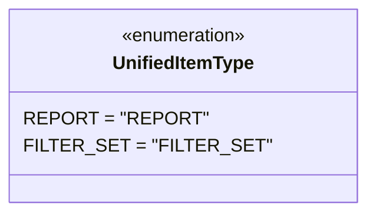

# Diagram: web/portal/src/pages/reports/bi-dashboard-next/models/UnifiedItemType.ts

> Auto-generated by Obscura crawlers

## Mermaid

### SVG

<svg id="container" width="287.859375" xmlns="http://www.w3.org/2000/svg" class="classDiagram" height="184" viewBox="0 0 287.859375 184" role="graphics-document document" aria-roledescription="class"><g><defs><marker id="container_class-aggregationStart" class="marker aggregation class" refX="18" refY="7" markerWidth="190" markerHeight="240" orient="auto"><path d="M 18,7 L9,13 L1,7 L9,1 Z"></path></marker></defs><defs><marker id="container_class-aggregationEnd" class="marker aggregation class" refX="1" refY="7" markerWidth="20" markerHeight="28" orient="auto"><path d="M 18,7 L9,13 L1,7 L9,1 Z"></path></marker></defs><defs><marker id="container_class-extensionStart" class="marker extension class" refX="18" refY="7" markerWidth="190" markerHeight="240" orient="auto"><path d="M 1,7 L18,13 V 1 Z"></path></marker></defs><defs><marker id="container_class-extensionEnd" class="marker extension class" refX="1" refY="7" markerWidth="20" markerHeight="28" orient="auto"><path d="M 1,1 V 13 L18,7 Z"></path></marker></defs><defs><marker id="container_class-compositionStart" class="marker composition class" refX="18" refY="7" markerWidth="190" markerHeight="240" orient="auto"><path d="M 18,7 L9,13 L1,7 L9,1 Z"></path></marker></defs><defs><marker id="container_class-compositionEnd" class="marker composition class" refX="1" refY="7" markerWidth="20" markerHeight="28" orient="auto"><path d="M 18,7 L9,13 L1,7 L9,1 Z"></path></marker></defs><defs><marker id="container_class-dependencyStart" class="marker dependency class" refX="6" refY="7" markerWidth="190" markerHeight="240" orient="auto"><path d="M 5,7 L9,13 L1,7 L9,1 Z"></path></marker></defs><defs><marker id="container_class-dependencyEnd" class="marker dependency class" refX="13" refY="7" markerWidth="20" markerHeight="28" orient="auto"><path d="M 18,7 L9,13 L14,7 L9,1 Z"></path></marker></defs><defs><marker id="container_class-lollipopStart" class="marker lollipop class" refX="13" refY="7" markerWidth="190" markerHeight="240" orient="auto"><circle stroke="black" fill="transparent" cx="7" cy="7" r="6"></circle></marker></defs><defs><marker id="container_class-lollipopEnd" class="marker lollipop class" refX="1" refY="7" markerWidth="190" markerHeight="240" orient="auto"><circle stroke="black" fill="transparent" cx="7" cy="7" r="6"></circle></marker></defs><g class="root"><g class="clusters"></g><g class="edgePaths"></g><g class="edgeLabels"></g><g class="nodes"><g class="node default" id="classId-UnifiedItemType-0" transform="translate(143.9296875, 92)"><g class="basic label-container"><path d="M-135.9296875 -84 L135.9296875 -84 L135.9296875 84 L-135.9296875 84" stroke="none" stroke-width="0" fill="#ECECFF" style=""></path><path d="M-135.9296875 -84 C-61.00982609437072 -84, 13.910035311258554 -84, 135.9296875 -84 M-135.9296875 -84 C-59.24336094710938 -84, 17.44296560578124 -84, 135.9296875 -84 M135.9296875 -84 C135.9296875 -36.61622877225861, 135.9296875 10.767542455482783, 135.9296875 84 M135.9296875 -84 C135.9296875 -22.876484478037106, 135.9296875 38.24703104392579, 135.9296875 84 M135.9296875 84 C30.831322132256716 84, -74.26704323548657 84, -135.9296875 84 M135.9296875 84 C34.24565457147783 84, -67.43837835704434 84, -135.9296875 84 M-135.9296875 84 C-135.9296875 33.06308011964301, -135.9296875 -17.873839760713977, -135.9296875 -84 M-135.9296875 84 C-135.9296875 40.93512875624895, -135.9296875 -2.1297424875020994, -135.9296875 -84" stroke="#9370DB" stroke-width="1.3" fill="none" stroke-dasharray="0 0" style=""></path></g><g class="annotation-group text" transform="translate(-55.5546875, -60)"><g class="label" style="" transform="translate(0,-12)"><foreignObject width="111.109375" height="24">

«enumeration»

</foreignObject></g></g><g class="label-group text" transform="translate(-59.890625, -36)"><g class="label" style="font-weight: bolder" transform="translate(0,-12)"><foreignObject width="119.78125" height="24">

UnifiedItemType

</foreignObject></g></g><g class="members-group text" transform="translate(-123.9296875, 12)"><g class="label" style="" transform="translate(0,-12)"><foreignObject width="141.890625" height="24">

REPORT = "REPORT"

</foreignObject></g><g class="label" style="" transform="translate(0,12)"><foreignObject width="187.96875" height="24">

FILTER_SET = "FILTER_SET"

</foreignObject></g></g><g class="methods-group text" transform="translate(-123.9296875, 84)"></g><g class="divider" style=""><path d="M-135.9296875 -12 C-45.344586110172514 -12, 45.24051527965497 -12, 135.9296875 -12 M-135.9296875 -12 C-42.55147435170451 -12, 50.82673879659097 -12, 135.9296875 -12" stroke="#9370DB" stroke-width="1.3" fill="none" stroke-dasharray="0 0" style=""></path></g><g class="divider" style=""><path d="M-135.9296875 60 C-73.49227417196238 60, -11.054860843924757 60, 135.9296875 60 M-135.9296875 60 C-78.42922198847086 60, -20.928756476941714 60, 135.9296875 60" stroke="#9370DB" stroke-width="1.3" fill="none" stroke-dasharray="0 0" style=""></path></g></g></g></g></g></svg>
