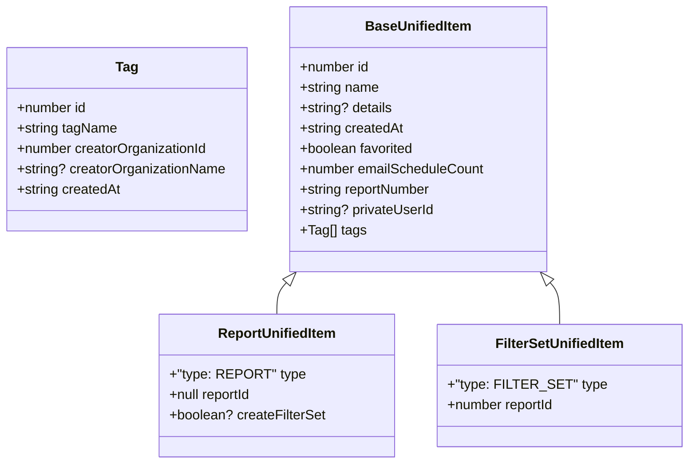

# Diagram: web/portal/src/pages/reports/bi-dashboard-next/models/UnifiedReportItemDTO.ts


> Auto-generated by Obscura crawlers

## Diagram 1



### SVG

<svg id="container" width="799.7109375" xmlns="http://www.w3.org/2000/svg" class="classDiagram" height="546" viewBox="0 0 799.7109375 546" role="graphics-document document" aria-roledescription="class"><style>#container{font-family:"trebuchet ms",verdana,arial,sans-serif;font-size:16px;fill:#333;}@keyframes edge-animation-frame{from{stroke-dashoffset:0;}}@keyframes dash{to{stroke-dashoffset:0;}}#container .edge-animation-slow{stroke-dasharray:9,5!important;stroke-dashoffset:900;animation:dash 50s linear infinite;stroke-linecap:round;}#container .edge-animation-fast{stroke-dasharray:9,5!important;stroke-dashoffset:900;animation:dash 20s linear infinite;stroke-linecap:round;}#container .error-icon{fill:#552222;}#container .error-text{fill:#552222;stroke:#552222;}#container .edge-thickness-normal{stroke-width:1px;}#container .edge-thickness-thick{stroke-width:3.5px;}#container .edge-pattern-solid{stroke-dasharray:0;}#container .edge-thickness-invisible{stroke-width:0;fill:none;}#container .edge-pattern-dashed{stroke-dasharray:3;}#container .edge-pattern-dotted{stroke-dasharray:2;}#container .marker{fill:#333333;stroke:#333333;}#container .marker.cross{stroke:#333333;}#container svg{font-family:"trebuchet ms",verdana,arial,sans-serif;font-size:16px;}#container p{margin:0;}#container g.classGroup text{fill:#9370DB;stroke:none;font-family:"trebuchet ms",verdana,arial,sans-serif;font-size:10px;}#container g.classGroup text .title{font-weight:bolder;}#container .nodeLabel,#container .edgeLabel{color:#131300;}#container .edgeLabel .label rect{fill:#ECECFF;}#container .label text{fill:#131300;}#container .labelBkg{background:#ECECFF;}#container .edgeLabel .label span{background:#ECECFF;}#container .classTitle{font-weight:bolder;}#container .node rect,#container .node circle,#container .node ellipse,#container .node polygon,#container .node path{fill:#ECECFF;stroke:#9370DB;stroke-width:1px;}#container .divider{stroke:#9370DB;stroke-width:1;}#container g.clickable{cursor:pointer;}#container g.classGroup rect{fill:#ECECFF;stroke:#9370DB;}#container g.classGroup line{stroke:#9370DB;stroke-width:1;}#container .classLabel .box{stroke:none;stroke-width:0;fill:#ECECFF;opacity:0.5;}#container .classLabel .label{fill:#9370DB;font-size:10px;}#container .relation{stroke:#333333;stroke-width:1;fill:none;}#container .dashed-line{stroke-dasharray:3;}#container .dotted-line{stroke-dasharray:1 2;}#container #compositionStart,#container .composition{fill:#333333!important;stroke:#333333!important;stroke-width:1;}#container #compositionEnd,#container .composition{fill:#333333!important;stroke:#333333!important;stroke-width:1;}#container #dependencyStart,#container .dependency{fill:#333333!important;stroke:#333333!important;stroke-width:1;}#container #dependencyStart,#container .dependency{fill:#333333!important;stroke:#333333!important;stroke-width:1;}#container #extensionStart,#container .extension{fill:transparent!important;stroke:#333333!important;stroke-width:1;}#container #extensionEnd,#container .extension{fill:transparent!important;stroke:#333333!important;stroke-width:1;}#container #aggregationStart,#container .aggregation{fill:transparent!important;stroke:#333333!important;stroke-width:1;}#container #aggregationEnd,#container .aggregation{fill:transparent!important;stroke:#333333!important;stroke-width:1;}#container #lollipopStart,#container .lollipop{fill:#ECECFF!important;stroke:#333333!important;stroke-width:1;}#container #lollipopEnd,#container .lollipop{fill:#ECECFF!important;stroke:#333333!important;stroke-width:1;}#container .edgeTerminals{font-size:11px;line-height:initial;}#container .classTitleText{text-anchor:middle;font-size:18px;fill:#333;}#container .label-icon{display:inline-block;height:1em;overflow:visible;vertical-align:-0.125em;}#container .node .label-icon path{fill:currentColor;stroke:revert;stroke-width:revert;}#container :root{--mermaid-font-family:"trebuchet ms",verdana,arial,sans-serif;}</style><g><defs><marker id="container_class-aggregationStart" class="marker aggregation class" refX="18" refY="7" markerWidth="190" markerHeight="240" orient="auto"><path d="M 18,7 L9,13 L1,7 L9,1 Z"></path></marker></defs><defs><marker id="container_class-aggregationEnd" class="marker aggregation class" refX="1" refY="7" markerWidth="20" markerHeight="28" orient="auto"><path d="M 18,7 L9,13 L1,7 L9,1 Z"></path></marker></defs><defs><marker id="container_class-extensionStart" class="marker extension class" refX="18" refY="7" markerWidth="190" markerHeight="240" orient="auto"><path d="M 1,7 L18,13 V 1 Z"></path></marker></defs><defs><marker id="container_class-extensionEnd" class="marker extension class" refX="1" refY="7" markerWidth="20" markerHeight="28" orient="auto"><path d="M 1,1 V 13 L18,7 Z"></path></marker></defs><defs><marker id="container_class-compositionStart" class="marker composition class" refX="18" refY="7" markerWidth="190" markerHeight="240" orient="auto"><path d="M 18,7 L9,13 L1,7 L9,1 Z"></path></marker></defs><defs><marker id="container_class-compositionEnd" class="marker composition class" refX="1" refY="7" markerWidth="20" markerHeight="28" orient="auto"><path d="M 18,7 L9,13 L1,7 L9,1 Z"></path></marker></defs><defs><marker id="container_class-dependencyStart" class="marker dependency class" refX="6" refY="7" markerWidth="190" markerHeight="240" orient="auto"><path d="M 5,7 L9,13 L1,7 L9,1 Z"></path></marker></defs><defs><marker id="container_class-dependencyEnd" class="marker dependency class" refX="13" refY="7" markerWidth="20" markerHeight="28" orient="auto"><path d="M 18,7 L9,13 L14,7 L9,1 Z"></path></marker></defs><defs><marker id="container_class-lollipopStart" class="marker lollipop class" refX="13" refY="7" markerWidth="190" markerHeight="240" orient="auto"><circle stroke="black" fill="transparent" cx="7" cy="7" r="6"></circle></marker></defs><defs><marker id="container_class-lollipopEnd" class="marker lollipop class" refX="1" refY="7" markerWidth="190" markerHeight="240" orient="auto"><circle stroke="black" fill="transparent" cx="7" cy="7" r="6"></circle></marker></defs><g class="root"><g class="clusters"></g><g class="edgePaths"><path d="M341.298,332.846L339.483,334.872C337.668,336.897,334.037,340.949,332.222,347.141C330.406,353.333,330.406,361.667,330.406,365.833L330.406,370" id="id_BaseUnifiedItem_ReportUnifiedItem_1" class="edge-thickness-normal edge-pattern-solid relation" style=";;;" data-edge="true" data-et="edge" data-id="id_BaseUnifiedItem_ReportUnifiedItem_1" data-points="W3sieCI6MzUyLjgxMTA3NTYyMTU0NjkzLCJ5IjozMjB9LHsieCI6MzMwLjQwNjI1LCJ5IjozNDV9LHsieCI6MzMwLjQwNjI1LCJ5IjozNzB9XQ==" marker-start="url(#container_class-extensionStart)"></path><path d="M643.936,332.846L645.751,334.872C647.567,336.897,651.197,340.949,653.013,349.141C654.828,357.333,654.828,369.667,654.828,375.833L654.828,382" id="id_BaseUnifiedItem_FilterSetUnifiedItem_2" class="edge-thickness-normal edge-pattern-solid relation" style=";;;" data-edge="true" data-et="edge" data-id="id_BaseUnifiedItem_FilterSetUnifiedItem_2" data-points="W3sieCI6NjMyLjQyMzI5OTM3ODQ1MzEsInkiOjMyMH0seyJ4Ijo2NTQuODI4MTI1LCJ5IjozNDV9LHsieCI6NjU0LjgyODEyNSwieSI6MzgyfV0=" marker-start="url(#container_class-extensionStart)"></path></g><g class="edgeLabels"><g class="edgeLabel"><g class="label" data-id="id_BaseUnifiedItem_ReportUnifiedItem_1" transform="translate(0, 0)"><foreignObject width="0" height="0"><div xmlns="http://www.w3.org/1999/xhtml" class="labelBkg" style="display: table-cell; white-space: nowrap; line-height: 1.5; max-width: 200px; text-align: center;"><span class="edgeLabel"></span></div></foreignObject></g></g><g class="edgeLabel"><g class="label" data-id="id_BaseUnifiedItem_FilterSetUnifiedItem_2" transform="translate(0, 0)"><foreignObject width="0" height="0"><div xmlns="http://www.w3.org/1999/xhtml" class="labelBkg" style="display: table-cell; white-space: nowrap; line-height: 1.5; max-width: 200px; text-align: center;"><span class="edgeLabel"></span></div></foreignObject></g></g></g><g class="nodes"><g class="node default" id="classId-Tag-0" transform="translate(149.66796875, 164)"><g class="basic label-container"><path d="M-141.66796875 -108 L141.66796875 -108 L141.66796875 108 L-141.66796875 108" stroke="none" stroke-width="0" fill="#ECECFF" style=""></path><path d="M-141.66796875 -108 C-30.599194541936924 -108, 80.46957966612615 -108, 141.66796875 -108 M-141.66796875 -108 C-84.35024503695803 -108, -27.032521323916058 -108, 141.66796875 -108 M141.66796875 -108 C141.66796875 -59.83856651175969, 141.66796875 -11.677133023519374, 141.66796875 108 M141.66796875 -108 C141.66796875 -61.42072219559605, 141.66796875 -14.841444391192098, 141.66796875 108 M141.66796875 108 C38.930303822689424 108, -63.80736110462115 108, -141.66796875 108 M141.66796875 108 C33.05144551750415 108, -75.5650777149917 108, -141.66796875 108 M-141.66796875 108 C-141.66796875 34.89827943246294, -141.66796875 -38.203441135074115, -141.66796875 -108 M-141.66796875 108 C-141.66796875 23.044290175996167, -141.66796875 -61.911419648007666, -141.66796875 -108" stroke="#9370DB" stroke-width="1.3" fill="none" stroke-dasharray="0 0" style=""></path></g><g class="annotation-group text" transform="translate(0, -84)"></g><g class="label-group text" transform="translate(-12.6328125, -84)"><g class="label" style="font-weight: bolder" transform="translate(0,-12)"><foreignObject width="25.265625" height="24"><div xmlns="http://www.w3.org/1999/xhtml" style="display: table-cell; white-space: nowrap; line-height: 1.5; max-width: 75px; text-align: center;"><span class="nodeLabel markdown-node-label" style=""><p>Tag</p></span></div></foreignObject></g></g><g class="members-group text" transform="translate(-129.66796875, -36)"><g class="label" style="" transform="translate(0,-12)"><foreignObject width="83.109375" height="24"><div xmlns="http://www.w3.org/1999/xhtml" style="display: table-cell; white-space: nowrap; line-height: 1.5; max-width: 140px; text-align: center;"><span class="nodeLabel markdown-node-label" style=""><p>+number id</p></span></div></foreignObject></g><g class="label" style="" transform="translate(0,12)"><foreignObject width="118.453125" height="24"><div xmlns="http://www.w3.org/1999/xhtml" style="display: table-cell; white-space: nowrap; line-height: 1.5; max-width: 176px; text-align: center;"><span class="nodeLabel markdown-node-label" style=""><p>+string tagName</p></span></div></foreignObject></g><g class="label" style="" transform="translate(0,36)"><foreignObject width="227.0625" height="24"><div xmlns="http://www.w3.org/1999/xhtml" style="display: table-cell; white-space: nowrap; line-height: 1.5; max-width: 284px; text-align: center;"><span class="nodeLabel markdown-node-label" style=""><p>+number creatorOrganizationId</p></span></div></foreignObject></g><g class="label" style="" transform="translate(0,60)"><foreignObject width="246.703125" height="24"><div xmlns="http://www.w3.org/1999/xhtml" style="display: table-cell; white-space: nowrap; line-height: 1.5; max-width: 304px; text-align: center;"><span class="nodeLabel markdown-node-label" style=""><p>+string? creatorOrganizationName</p></span></div></foreignObject></g><g class="label" style="" transform="translate(0,84)"><foreignObject width="123.234375" height="24"><div xmlns="http://www.w3.org/1999/xhtml" style="display: table-cell; white-space: nowrap; line-height: 1.5; max-width: 181px; text-align: center;"><span class="nodeLabel markdown-node-label" style=""><p>+string createdAt</p></span></div></foreignObject></g></g><g class="methods-group text" transform="translate(-129.66796875, 108)"></g><g class="divider" style=""><path d="M-141.66796875 -60 C-40.268737157902436 -60, 61.13049443419513 -60, 141.66796875 -60 M-141.66796875 -60 C-50.01165325351556 -60, 41.64466224296888 -60, 141.66796875 -60" stroke="#9370DB" stroke-width="1.3" fill="none" stroke-dasharray="0 0" style=""></path></g><g class="divider" style=""><path d="M-141.66796875 84 C-71.12926958710968 84, -0.5905704242193508 84, 141.66796875 84 M-141.66796875 84 C-33.67971898635834 84, 74.30853077728332 84, 141.66796875 84" stroke="#9370DB" stroke-width="1.3" fill="none" stroke-dasharray="0 0" style=""></path></g></g><g class="node default" id="classId-BaseUnifiedItem-1" transform="translate(492.6171875, 164)"><g class="basic label-container"><path d="M-151.28125 -156 L151.28125 -156 L151.28125 156 L-151.28125 156" stroke="none" stroke-width="0" fill="#ECECFF" style=""></path><path d="M-151.28125 -156 C-89.6223590396261 -156, -27.963468079252195 -156, 151.28125 -156 M-151.28125 -156 C-87.47723310230009 -156, -23.673216204600195 -156, 151.28125 -156 M151.28125 -156 C151.28125 -42.81864072619051, 151.28125 70.36271854761898, 151.28125 156 M151.28125 -156 C151.28125 -33.08793994782266, 151.28125 89.82412010435468, 151.28125 156 M151.28125 156 C45.214527154606245 156, -60.85219569078751 156, -151.28125 156 M151.28125 156 C88.4207104854904 156, 25.560170970980806 156, -151.28125 156 M-151.28125 156 C-151.28125 57.26821204504989, -151.28125 -41.463575909900214, -151.28125 -156 M-151.28125 156 C-151.28125 49.27157486444591, -151.28125 -57.45685027110818, -151.28125 -156" stroke="#9370DB" stroke-width="1.3" fill="none" stroke-dasharray="0 0" style=""></path></g><g class="annotation-group text" transform="translate(0, -132)"></g><g class="label-group text" transform="translate(-60.078125, -132)"><g class="label" style="font-weight: bolder" transform="translate(0,-12)"><foreignObject width="120.15625" height="24"><div xmlns="http://www.w3.org/1999/xhtml" style="display: table-cell; white-space: nowrap; line-height: 1.5; max-width: 169px; text-align: center;"><span class="nodeLabel markdown-node-label" style=""><p>BaseUnifiedItem</p></span></div></foreignObject></g></g><g class="members-group text" transform="translate(-139.28125, -84)"><g class="label" style="" transform="translate(0,-12)"><foreignObject width="83.109375" height="24"><div xmlns="http://www.w3.org/1999/xhtml" style="display: table-cell; white-space: nowrap; line-height: 1.5; max-width: 140px; text-align: center;"><span class="nodeLabel markdown-node-label" style=""><p>+number id</p></span></div></foreignObject></g><g class="label" style="" transform="translate(0,12)"><foreignObject width="94.375" height="24"><div xmlns="http://www.w3.org/1999/xhtml" style="display: table-cell; white-space: nowrap; line-height: 1.5; max-width: 152px; text-align: center;"><span class="nodeLabel markdown-node-label" style=""><p>+string name</p></span></div></foreignObject></g><g class="label" style="" transform="translate(0,36)"><foreignObject width="110.21875" height="24"><div xmlns="http://www.w3.org/1999/xhtml" style="display: table-cell; white-space: nowrap; line-height: 1.5; max-width: 168px; text-align: center;"><span class="nodeLabel markdown-node-label" style=""><p>+string? details</p></span></div></foreignObject></g><g class="label" style="" transform="translate(0,60)"><foreignObject width="123.234375" height="24"><div xmlns="http://www.w3.org/1999/xhtml" style="display: table-cell; white-space: nowrap; line-height: 1.5; max-width: 181px; text-align: center;"><span class="nodeLabel markdown-node-label" style=""><p>+string createdAt</p></span></div></foreignObject></g><g class="label" style="" transform="translate(0,84)"><foreignObject width="136.8125" height="24"><div xmlns="http://www.w3.org/1999/xhtml" style="display: table-cell; white-space: nowrap; line-height: 1.5; max-width: 194px; text-align: center;"><span class="nodeLabel markdown-node-label" style=""><p>+boolean favorited</p></span></div></foreignObject></g><g class="label" style="" transform="translate(0,108)"><foreignObject width="218.484375" height="24"><div xmlns="http://www.w3.org/1999/xhtml" style="display: table-cell; white-space: nowrap; line-height: 1.5; max-width: 276px; text-align: center;"><span class="nodeLabel markdown-node-label" style=""><p>+number emailScheduleCount</p></span></div></foreignObject></g><g class="label" style="" transform="translate(0,132)"><foreignObject width="157.4375" height="24"><div xmlns="http://www.w3.org/1999/xhtml" style="display: table-cell; white-space: nowrap; line-height: 1.5; max-width: 216px; text-align: center;"><span class="nodeLabel markdown-node-label" style=""><p>+string reportNumber</p></span></div></foreignObject></g><g class="label" style="" transform="translate(0,156)"><foreignObject width="158.828125" height="24"><div xmlns="http://www.w3.org/1999/xhtml" style="display: table-cell; white-space: nowrap; line-height: 1.5; max-width: 216px; text-align: center;"><span class="nodeLabel markdown-node-label" style=""><p>+string? privateUserId</p></span></div></foreignObject></g><g class="label" style="" transform="translate(0,180)"><foreignObject width="75.953125" height="24"><div xmlns="http://www.w3.org/1999/xhtml" style="display: table-cell; white-space: nowrap; line-height: 1.5; max-width: 133px; text-align: center;"><span class="nodeLabel markdown-node-label" style=""><p>+Tag[] tags</p></span></div></foreignObject></g></g><g class="methods-group text" transform="translate(-139.28125, 156)"></g><g class="divider" style=""><path d="M-151.28125 -108 C-43.440887832896266 -108, 64.39947433420747 -108, 151.28125 -108 M-151.28125 -108 C-53.959074496457745 -108, 43.36310100708451 -108, 151.28125 -108" stroke="#9370DB" stroke-width="1.3" fill="none" stroke-dasharray="0 0" style=""></path></g><g class="divider" style=""><path d="M-151.28125 132 C-84.70233393287347 132, -18.123417865746944 132, 151.28125 132 M-151.28125 132 C-37.862393634157286 132, 75.55646273168543 132, 151.28125 132" stroke="#9370DB" stroke-width="1.3" fill="none" stroke-dasharray="0 0" style=""></path></g></g><g class="node default" id="classId-ReportUnifiedItem-2" transform="translate(330.40625, 454)"><g class="basic label-container"><path d="M-137.5390625 -84 L137.5390625 -84 L137.5390625 84 L-137.5390625 84" stroke="none" stroke-width="0" fill="#ECECFF" style=""></path><path d="M-137.5390625 -84 C-75.78859119332049 -84, -14.03811988664097 -84, 137.5390625 -84 M-137.5390625 -84 C-28.81168497403634 -84, 79.91569255192732 -84, 137.5390625 -84 M137.5390625 -84 C137.5390625 -38.5065953886686, 137.5390625 6.986809222662799, 137.5390625 84 M137.5390625 -84 C137.5390625 -19.49208742456824, 137.5390625 45.01582515086352, 137.5390625 84 M137.5390625 84 C80.668618856183 84, 23.79817521236599 84, -137.5390625 84 M137.5390625 84 C62.58782152295311 84, -12.363419454093787 84, -137.5390625 84 M-137.5390625 84 C-137.5390625 49.70734242317728, -137.5390625 15.414684846354561, -137.5390625 -84 M-137.5390625 84 C-137.5390625 22.098953904518076, -137.5390625 -39.80209219096385, -137.5390625 -84" stroke="#9370DB" stroke-width="1.3" fill="none" stroke-dasharray="0 0" style=""></path></g><g class="annotation-group text" transform="translate(0, -60)"></g><g class="label-group text" transform="translate(-67.53125, -60)"><g class="label" style="font-weight: bolder" transform="translate(0,-12)"><foreignObject width="135.0625" height="24"><div xmlns="http://www.w3.org/1999/xhtml" style="display: table-cell; white-space: nowrap; line-height: 1.5; max-width: 184px; text-align: center;"><span class="nodeLabel markdown-node-label" style=""><p>ReportUnifiedItem</p></span></div></foreignObject></g></g><g class="members-group text" transform="translate(-125.5390625, -12)"><g class="label" style="" transform="translate(0,-12)"><foreignObject width="153.21875" height="24"><div xmlns="http://www.w3.org/1999/xhtml" style="display: table-cell; white-space: nowrap; line-height: 1.5; max-width: 222px; text-align: center;"><span class="nodeLabel markdown-node-label" style=""><p>+"type: REPORT" type</p></span></div></foreignObject></g><g class="label" style="" transform="translate(0,12)"><foreignObject width="99.796875" height="24"><div xmlns="http://www.w3.org/1999/xhtml" style="display: table-cell; white-space: nowrap; line-height: 1.5; max-width: 157px; text-align: center;"><span class="nodeLabel markdown-node-label" style=""><p>+null reportId</p></span></div></foreignObject></g><g class="label" style="" transform="translate(0,36)"><foreignObject width="183.546875" height="24"><div xmlns="http://www.w3.org/1999/xhtml" style="display: table-cell; white-space: nowrap; line-height: 1.5; max-width: 241px; text-align: center;"><span class="nodeLabel markdown-node-label" style=""><p>+boolean? createFilterSet</p></span></div></foreignObject></g></g><g class="methods-group text" transform="translate(-125.5390625, 84)"></g><g class="divider" style=""><path d="M-137.5390625 -36 C-30.852304130034724 -36, 75.83445423993055 -36, 137.5390625 -36 M-137.5390625 -36 C-44.893737222630946 -36, 47.75158805473811 -36, 137.5390625 -36" stroke="#9370DB" stroke-width="1.3" fill="none" stroke-dasharray="0 0" style=""></path></g><g class="divider" style=""><path d="M-137.5390625 60 C-48.34369348365628 60, 40.85167553268744 60, 137.5390625 60 M-137.5390625 60 C-77.86678730755443 60, -18.19451211510888 60, 137.5390625 60" stroke="#9370DB" stroke-width="1.3" fill="none" stroke-dasharray="0 0" style=""></path></g></g><g class="node default" id="classId-FilterSetUnifiedItem-3" transform="translate(654.828125, 454)"><g class="basic label-container"><path d="M-136.8828125 -72 L136.8828125 -72 L136.8828125 72 L-136.8828125 72" stroke="none" stroke-width="0" fill="#ECECFF" style=""></path><path d="M-136.8828125 -72 C-49.30328382491837 -72, 38.276244850163266 -72, 136.8828125 -72 M-136.8828125 -72 C-71.12167152686189 -72, -5.360530553723777 -72, 136.8828125 -72 M136.8828125 -72 C136.8828125 -33.415039673082255, 136.8828125 5.16992065383549, 136.8828125 72 M136.8828125 -72 C136.8828125 -14.928904041678067, 136.8828125 42.14219191664387, 136.8828125 72 M136.8828125 72 C53.78199802712801 72, -29.318816445743977 72, -136.8828125 72 M136.8828125 72 C45.29665738154851 72, -46.28949773690297 72, -136.8828125 72 M-136.8828125 72 C-136.8828125 41.23658211540149, -136.8828125 10.473164230802979, -136.8828125 -72 M-136.8828125 72 C-136.8828125 29.731444946554824, -136.8828125 -12.537110106890353, -136.8828125 -72" stroke="#9370DB" stroke-width="1.3" fill="none" stroke-dasharray="0 0" style=""></path></g><g class="annotation-group text" transform="translate(0, -48)"></g><g class="label-group text" transform="translate(-73.5, -48)"><g class="label" style="font-weight: bolder" transform="translate(0,-12)"><foreignObject width="147" height="24"><div xmlns="http://www.w3.org/1999/xhtml" style="display: table-cell; white-space: nowrap; line-height: 1.5; max-width: 195px; text-align: center;"><span class="nodeLabel markdown-node-label" style=""><p>FilterSetUnifiedItem</p></span></div></foreignObject></g></g><g class="members-group text" transform="translate(-124.8828125, 0)"><g class="label" style="" transform="translate(0,-12)"><foreignObject width="176.265625" height="24"><div xmlns="http://www.w3.org/1999/xhtml" style="display: table-cell; white-space: nowrap; line-height: 1.5; max-width: 245px; text-align: center;"><span class="nodeLabel markdown-node-label" style=""><p>+"type: FILTER_SET" type</p></span></div></foreignObject></g><g class="label" style="" transform="translate(0,12)"><foreignObject width="128.53125" height="24"><div xmlns="http://www.w3.org/1999/xhtml" style="display: table-cell; white-space: nowrap; line-height: 1.5; max-width: 186px; text-align: center;"><span class="nodeLabel markdown-node-label" style=""><p>+number reportId</p></span></div></foreignObject></g></g><g class="methods-group text" transform="translate(-124.8828125, 72)"></g><g class="divider" style=""><path d="M-136.8828125 -24 C-51.56737562061528 -24, 33.74806125876944 -24, 136.8828125 -24 M-136.8828125 -24 C-63.43385057798045 -24, 10.015111344039099 -24, 136.8828125 -24" stroke="#9370DB" stroke-width="1.3" fill="none" stroke-dasharray="0 0" style=""></path></g><g class="divider" style=""><path d="M-136.8828125 48 C-45.72558520673553 48, 45.43164208652894 48, 136.8828125 48 M-136.8828125 48 C-53.48347528990331 48, 29.91586192019338 48, 136.8828125 48" stroke="#9370DB" stroke-width="1.3" fill="none" stroke-dasharray="0 0" style=""></path></g></g></g></g></g></svg>

## Diagram 2

```mermaid
erDiagram
    UNIFIED_ITEM {
        number id PK
        string name
        string? details
        string createdAt
        boolean favorited
        number emailScheduleCount
        string reportNumber
        string? privateUserId
        string type
    }
    TAG {
        number id PK
        string tagName
        number creatorOrganizationId
        string? creatorOrganizationName
        string createdAt
        number unified_item_id FK
    }
    UNIFIED_ITEM ||--o{ TAG : "has"
```

> SVG rendering failed for this diagram.
