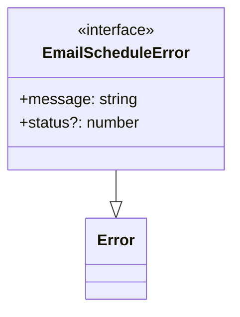

# Diagram: web/portal/src/pages/reports/bi-dashboard-next/utils/emailScheduleErrorHandler.ts


> Auto-generated by Obscura crawlers

## Diagram 1



### SVG

<svg id="container" width="235.796875" xmlns="http://www.w3.org/2000/svg" class="classDiagram" height="318" viewBox="0 0 235.796875 318" role="graphics-document document" aria-roledescription="class"><style>#container{font-family:"trebuchet ms",verdana,arial,sans-serif;font-size:16px;fill:#333;}@keyframes edge-animation-frame{from{stroke-dashoffset:0;}}@keyframes dash{to{stroke-dashoffset:0;}}#container .edge-animation-slow{stroke-dasharray:9,5!important;stroke-dashoffset:900;animation:dash 50s linear infinite;stroke-linecap:round;}#container .edge-animation-fast{stroke-dasharray:9,5!important;stroke-dashoffset:900;animation:dash 20s linear infinite;stroke-linecap:round;}#container .error-icon{fill:#552222;}#container .error-text{fill:#552222;stroke:#552222;}#container .edge-thickness-normal{stroke-width:1px;}#container .edge-thickness-thick{stroke-width:3.5px;}#container .edge-pattern-solid{stroke-dasharray:0;}#container .edge-thickness-invisible{stroke-width:0;fill:none;}#container .edge-pattern-dashed{stroke-dasharray:3;}#container .edge-pattern-dotted{stroke-dasharray:2;}#container .marker{fill:#333333;stroke:#333333;}#container .marker.cross{stroke:#333333;}#container svg{font-family:"trebuchet ms",verdana,arial,sans-serif;font-size:16px;}#container p{margin:0;}#container g.classGroup text{fill:#9370DB;stroke:none;font-family:"trebuchet ms",verdana,arial,sans-serif;font-size:10px;}#container g.classGroup text .title{font-weight:bolder;}#container .nodeLabel,#container .edgeLabel{color:#131300;}#container .edgeLabel .label rect{fill:#ECECFF;}#container .label text{fill:#131300;}#container .labelBkg{background:#ECECFF;}#container .edgeLabel .label span{background:#ECECFF;}#container .classTitle{font-weight:bolder;}#container .node rect,#container .node circle,#container .node ellipse,#container .node polygon,#container .node path{fill:#ECECFF;stroke:#9370DB;stroke-width:1px;}#container .divider{stroke:#9370DB;stroke-width:1;}#container g.clickable{cursor:pointer;}#container g.classGroup rect{fill:#ECECFF;stroke:#9370DB;}#container g.classGroup line{stroke:#9370DB;stroke-width:1;}#container .classLabel .box{stroke:none;stroke-width:0;fill:#ECECFF;opacity:0.5;}#container .classLabel .label{fill:#9370DB;font-size:10px;}#container .relation{stroke:#333333;stroke-width:1;fill:none;}#container .dashed-line{stroke-dasharray:3;}#container .dotted-line{stroke-dasharray:1 2;}#container #compositionStart,#container .composition{fill:#333333!important;stroke:#333333!important;stroke-width:1;}#container #compositionEnd,#container .composition{fill:#333333!important;stroke:#333333!important;stroke-width:1;}#container #dependencyStart,#container .dependency{fill:#333333!important;stroke:#333333!important;stroke-width:1;}#container #dependencyStart,#container .dependency{fill:#333333!important;stroke:#333333!important;stroke-width:1;}#container #extensionStart,#container .extension{fill:transparent!important;stroke:#333333!important;stroke-width:1;}#container #extensionEnd,#container .extension{fill:transparent!important;stroke:#333333!important;stroke-width:1;}#container #aggregationStart,#container .aggregation{fill:transparent!important;stroke:#333333!important;stroke-width:1;}#container #aggregationEnd,#container .aggregation{fill:transparent!important;stroke:#333333!important;stroke-width:1;}#container #lollipopStart,#container .lollipop{fill:#ECECFF!important;stroke:#333333!important;stroke-width:1;}#container #lollipopEnd,#container .lollipop{fill:#ECECFF!important;stroke:#333333!important;stroke-width:1;}#container .edgeTerminals{font-size:11px;line-height:initial;}#container .classTitleText{text-anchor:middle;font-size:18px;fill:#333;}#container .label-icon{display:inline-block;height:1em;overflow:visible;vertical-align:-0.125em;}#container .node .label-icon path{fill:currentColor;stroke:revert;stroke-width:revert;}#container :root{--mermaid-font-family:"trebuchet ms",verdana,arial,sans-serif;}</style><g><defs><marker id="container_class-aggregationStart" class="marker aggregation class" refX="18" refY="7" markerWidth="190" markerHeight="240" orient="auto"><path d="M 18,7 L9,13 L1,7 L9,1 Z"></path></marker></defs><defs><marker id="container_class-aggregationEnd" class="marker aggregation class" refX="1" refY="7" markerWidth="20" markerHeight="28" orient="auto"><path d="M 18,7 L9,13 L1,7 L9,1 Z"></path></marker></defs><defs><marker id="container_class-extensionStart" class="marker extension class" refX="18" refY="7" markerWidth="190" markerHeight="240" orient="auto"><path d="M 1,7 L18,13 V 1 Z"></path></marker></defs><defs><marker id="container_class-extensionEnd" class="marker extension class" refX="1" refY="7" markerWidth="20" markerHeight="28" orient="auto"><path d="M 1,1 V 13 L18,7 Z"></path></marker></defs><defs><marker id="container_class-compositionStart" class="marker composition class" refX="18" refY="7" markerWidth="190" markerHeight="240" orient="auto"><path d="M 18,7 L9,13 L1,7 L9,1 Z"></path></marker></defs><defs><marker id="container_class-compositionEnd" class="marker composition class" refX="1" refY="7" markerWidth="20" markerHeight="28" orient="auto"><path d="M 18,7 L9,13 L1,7 L9,1 Z"></path></marker></defs><defs><marker id="container_class-dependencyStart" class="marker dependency class" refX="6" refY="7" markerWidth="190" markerHeight="240" orient="auto"><path d="M 5,7 L9,13 L1,7 L9,1 Z"></path></marker></defs><defs><marker id="container_class-dependencyEnd" class="marker dependency class" refX="13" refY="7" markerWidth="20" markerHeight="28" orient="auto"><path d="M 18,7 L9,13 L14,7 L9,1 Z"></path></marker></defs><defs><marker id="container_class-lollipopStart" class="marker lollipop class" refX="13" refY="7" markerWidth="190" markerHeight="240" orient="auto"><circle stroke="black" fill="transparent" cx="7" cy="7" r="6"></circle></marker></defs><defs><marker id="container_class-lollipopEnd" class="marker lollipop class" refX="1" refY="7" markerWidth="190" markerHeight="240" orient="auto"><circle stroke="black" fill="transparent" cx="7" cy="7" r="6"></circle></marker></defs><g class="root"><g class="clusters"></g><g class="edgePaths"><path d="M117.898,176L117.898,180.167C117.898,184.333,117.898,192.667,117.898,198.125C117.898,203.583,117.898,206.167,117.898,207.458L117.898,208.75" id="id_EmailScheduleError_Error_1" class="edge-thickness-normal edge-pattern-solid relation" style=";;;" data-edge="true" data-et="edge" data-id="id_EmailScheduleError_Error_1" data-points="W3sieCI6MTE3Ljg5ODQzNzUsInkiOjE3Nn0seyJ4IjoxMTcuODk4NDM3NSwieSI6MjAxfSx7IngiOjExNy44OTg0Mzc1LCJ5IjoyMjZ9XQ==" marker-end="url(#container_class-extensionEnd)"></path></g><g class="edgeLabels"><g class="edgeLabel"><g class="label" data-id="id_EmailScheduleError_Error_1" transform="translate(0, 0)"><foreignObject width="0" height="0"><div xmlns="http://www.w3.org/1999/xhtml" class="labelBkg" style="display: table-cell; white-space: nowrap; line-height: 1.5; max-width: 200px; text-align: center;"><span class="edgeLabel"></span></div></foreignObject></g></g></g><g class="nodes"><g class="node default" id="classId-EmailScheduleError-0" transform="translate(117.8984375, 92)"><g class="basic label-container"><path d="M-109.8984375 -84 L109.8984375 -84 L109.8984375 84 L-109.8984375 84" stroke="none" stroke-width="0" fill="#ECECFF" style=""></path><path d="M-109.8984375 -84 C-45.902016330066274 -84, 18.09440483986745 -84, 109.8984375 -84 M-109.8984375 -84 C-43.089887541094114 -84, 23.71866241781177 -84, 109.8984375 -84 M109.8984375 -84 C109.8984375 -49.16807008145603, 109.8984375 -14.33614016291206, 109.8984375 84 M109.8984375 -84 C109.8984375 -31.55318873061659, 109.8984375 20.89362253876682, 109.8984375 84 M109.8984375 84 C31.931597748317515 84, -46.03524200336497 84, -109.8984375 84 M109.8984375 84 C37.00902649200975 84, -35.880384515980495 84, -109.8984375 84 M-109.8984375 84 C-109.8984375 19.665178356600364, -109.8984375 -44.66964328679927, -109.8984375 -84 M-109.8984375 84 C-109.8984375 24.11491001368794, -109.8984375 -35.77017997262412, -109.8984375 -84" stroke="#9370DB" stroke-width="1.3" fill="none" stroke-dasharray="0 0" style=""></path></g><g class="annotation-group text" transform="translate(-41.015625, -60)"><g class="label" style="" transform="translate(0,-12)"><foreignObject width="82.03125" height="24"><div xmlns="http://www.w3.org/1999/xhtml" style="display: table-cell; white-space: nowrap; line-height: 1.5; max-width: 132px; text-align: center;"><span class="nodeLabel markdown-node-label" style=""><p>«interface»</p></span></div></foreignObject></g></g><g class="label-group text" transform="translate(-71.65625, -36)"><g class="label" style="font-weight: bolder" transform="translate(0,-12)"><foreignObject width="143.3125" height="24"><div xmlns="http://www.w3.org/1999/xhtml" style="display: table-cell; white-space: nowrap; line-height: 1.5; max-width: 193px; text-align: center;"><span class="nodeLabel markdown-node-label" style=""><p>EmailScheduleError</p></span></div></foreignObject></g></g><g class="members-group text" transform="translate(-97.8984375, 12)"><g class="label" style="" transform="translate(0,-12)"><foreignObject width="120.09375" height="24"><div xmlns="http://www.w3.org/1999/xhtml" style="display: table-cell; white-space: nowrap; line-height: 1.5; max-width: 178px; text-align: center;"><span class="nodeLabel markdown-node-label" style=""><p>+message: string</p></span></div></foreignObject></g><g class="label" style="" transform="translate(0,12)"><foreignObject width="124.140625" height="24"><div xmlns="http://www.w3.org/1999/xhtml" style="display: table-cell; white-space: nowrap; line-height: 1.5; max-width: 182px; text-align: center;"><span class="nodeLabel markdown-node-label" style=""><p>+status?: number</p></span></div></foreignObject></g></g><g class="methods-group text" transform="translate(-97.8984375, 84)"></g><g class="divider" style=""><path d="M-109.8984375 -12 C-47.84191456299502 -12, 14.214608374009956 -12, 109.8984375 -12 M-109.8984375 -12 C-59.863263566977764 -12, -9.828089633955528 -12, 109.8984375 -12" stroke="#9370DB" stroke-width="1.3" fill="none" stroke-dasharray="0 0" style=""></path></g><g class="divider" style=""><path d="M-109.8984375 60 C-24.041486687080308 60, 61.815464125839384 60, 109.8984375 60 M-109.8984375 60 C-61.48361215611523 60, -13.068786812230456 60, 109.8984375 60" stroke="#9370DB" stroke-width="1.3" fill="none" stroke-dasharray="0 0" style=""></path></g></g><g class="node default" id="classId-Error-1" transform="translate(117.8984375, 268)"><g class="basic label-container"><path d="M-30.1875 -42 L30.1875 -42 L30.1875 42 L-30.1875 42" stroke="none" stroke-width="0" fill="#ECECFF" style=""></path><path d="M-30.1875 -42 C-6.084999465260996 -42, 18.01750106947801 -42, 30.1875 -42 M-30.1875 -42 C-14.640813297121028 -42, 0.9058734057579443 -42, 30.1875 -42 M30.1875 -42 C30.1875 -17.74880585629228, 30.1875 6.502388287415442, 30.1875 42 M30.1875 -42 C30.1875 -24.710594171538833, 30.1875 -7.421188343077667, 30.1875 42 M30.1875 42 C7.57933104881711 42, -15.02883790236578 42, -30.1875 42 M30.1875 42 C12.268756251935287 42, -5.649987496129427 42, -30.1875 42 M-30.1875 42 C-30.1875 11.24474848300731, -30.1875 -19.51050303398538, -30.1875 -42 M-30.1875 42 C-30.1875 24.92870016217589, -30.1875 7.857400324351779, -30.1875 -42" stroke="#9370DB" stroke-width="1.3" fill="none" stroke-dasharray="0 0" style=""></path></g><g class="annotation-group text" transform="translate(0, -18)"></g><g class="label-group text" transform="translate(-18.1875, -18)"><g class="label" style="font-weight: bolder" transform="translate(0,-12)"><foreignObject width="36.375" height="24"><div xmlns="http://www.w3.org/1999/xhtml" style="display: table-cell; white-space: nowrap; line-height: 1.5; max-width: 87px; text-align: center;"><span class="nodeLabel markdown-node-label" style=""><p>Error</p></span></div></foreignObject></g></g><g class="members-group text" transform="translate(-18.1875, 30)"></g><g class="methods-group text" transform="translate(-18.1875, 60)"></g><g class="divider" style=""><path d="M-30.1875 6 C-10.883109540506592 6, 8.421280918986817 6, 30.1875 6 M-30.1875 6 C-16.903581835501818 6, -3.6196636710036323 6, 30.1875 6" stroke="#9370DB" stroke-width="1.3" fill="none" stroke-dasharray="0 0" style=""></path></g><g class="divider" style=""><path d="M-30.1875 24 C-13.891427905525116 24, 2.404644188949767 24, 30.1875 24 M-30.1875 24 C-13.302461867472655 24, 3.5825762650546906 24, 30.1875 24" stroke="#9370DB" stroke-width="1.3" fill="none" stroke-dasharray="0 0" style=""></path></g></g></g></g></g></svg>

## Diagram 2

```mermaid
flowchart TD
    Start((start)) --> CheckAxios{axios.isAxiosError(error) && error.response}
    CheckAxios -->|Yes| CreateCustom[Create EmailScheduleError from error.response.data.message or "Unknown error"]
    CreateCustom --> SetCustom[setErrorState(customError)]
    SetCustom --> ReturnCustom[/return customError/]
    CheckAxios -->|No| CheckInstance{error instanceof Error}
    CheckInstance -->|Yes| UseExisting[Use existing error as EmailScheduleError fallbackError]
    CheckInstance -->|No| CreateFallback[Create new Error(t("reports:Unknown error")) as EmailScheduleError fallbackError]
    UseExisting --> SetFallback[setErrorState(fallbackError)]
    CreateFallback --> SetFallback
    SetFallback --> ReturnFallback[/return fallbackError/]
```

> SVG rendering failed for this diagram.
