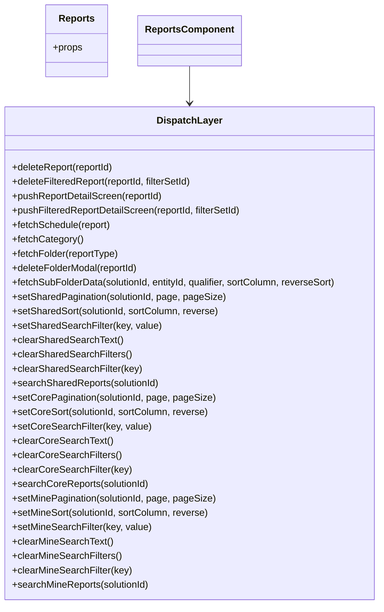

# Diagram: web/portal/src/pages/reports/bi-dashboard/Reports.page.container.js


> Auto-generated by Obscura crawlers

## Diagram 1

```mermaid
flowchart LR
  State["Redux State"] -->|getSchedules(state)| ReportSchedules[ReportSchedulesState.selectors.getSchedules]
  State -->|getSolutionId(state)| SolutionId[getSolutionId]
  State -->|getAuthorization(state)| Authorization[getAuthorization]
  ReportSchedules -->|reportSchedules| Props[mapStateToProps props]
  SolutionId -->|solutionId| Props
  Authorization -->|authorization| Props

  subgraph SharedSelectors ["ReportsSharedSearchBarState.selectors"]
    SR_results[getSearchResults]\n(getSharedReportsResults)
    SR_isLoading[getIsLoading]\n(getSharedReportsIsLoading)
    SR_page[getPage]\n(getSharedPage)
    SR_pageSize[getPageSize]\n(getSharedPageSize)
    SR_total[getTotalPages]\n(getSharedTotalPages)
    SR_sortDefault[getDefaultSortColumn]\n(getSharedReportsDefaultSortColumn)
    SR_reverseDefault[getDefaultReverseSort]\n(getSharedReportsDefaultReverseSort)
    SR_sort[getSortColumn]\n(getSharedReportsSortColumn)
    SR_reverse[getReverseSort]\n(getSharedReportsReverseSort)
    SR_filters[getSearchFilters]\n(getSharedReportsSearchFilters)
  end
  subgraph CoreSelectors ["ReportsCoreSearchBarState.selectors"]
    CR_results[getSearchResults]\n(getCoreReportsResults)
    CR_isLoading[getIsLoading]\n(getCoreReportsIsLoading)
    CR_page[getPage]\n(getCorePage)
    CR_pageSize[getPageSize]\n(getCorePageSize)
    CR_total[getTotalPages]\n(getCoreTotalPages)
    CR_sortDefault[getDefaultSortColumn]\n(getCoreReportsDefaultSortColumn)
    CR_reverseDefault[getDefaultReverseSort]\n(getCoreReportsDefaultReverseSort)
    CR_sort[getSortColumn]\n(getCoreReportsSortColumn)
    CR_reverse[getReverseSort]\n(getCoreReportsReverseSort)
    CR_filters[getSearchFilters]\n(getCoreReportsSearchFilters)
  end
  subgraph MineSelectors ["ReportsMineSearchBarState.selectors"]
    MR_results[getSearchResults]\n(getMineReportsResults)
    MR_isLoading[getIsLoading]\n(getMineReportsIsLoading)
    MR_page[getPage]\n(getMinePage)
    MR_pageSize[getPageSize]\n(getMinePageSize)
    MR_total[getTotalPages]\n(getMineTotalPages)
    MR_sortDefault[getDefaultSortColumn]\n(getMineReportsDefaultSortColumn)
    MR_reverseDefault[getDefaultReverseSort]\n(getMineReportsDefaultReverseSort)
    MR_sort[getSortColumn]\n(getMineReportsSortColumn)
    MR_reverse[getReverseSort]\n(getMineReportsReverseSort)
    MR_filters[getSearchFilters]\n(getMineReportsSearchFilters)
  end

  SR_results -->|sharedReportsResults| Props
  SR_isLoading -->|sharedReportsIsLoading| Props
  SR_page -->|sharedPage| Props
  SR_pageSize -->|sharedPageSize| Props
  SR_total -->|sharedTotalPages| Props
  SR_sortDefault -->|sharedReportsDefaultSortColumn| Props
  SR_reverseDefault -->|sharedReportsDefaultReverseSort| Props
  SR_sort -->|sharedReportsSortColumn| Props
  SR_reverse -->|sharedReportsReverseSort| Props
  SR_filters -->|sharedReportsSearchFilters| Props

  CR_results -->|coreReportsResults| Props
  CR_isLoading -->|coreReportsIsLoading| Props
  CR_page -->|corePage| Props
  CR_pageSize -->|corePageSize| Props
  CR_total -->|coreTotalPages| Props
  CR_sortDefault -->|coreReportsDefaultSortColumn| Props
  CR_reverseDefault -->|coreReportsDefaultReverseSort| Props
  CR_sort -->|coreReportsSortColumn| Props
  CR_reverse -->|coreReportsReverseSort| Props
  CR_filters -->|coreReportsSearchFilters| Props

  MR_results -->|mineReportsResults| Props
  MR_isLoading -->|mineReportsIsLoading| Props
  MR_page -->|minePage| Props
  MR_pageSize -->|minePageSize| Props
  MR_total -->|mineTotalPages| Props
  MR_sortDefault -->|mineReportsDefaultSortColumn| Props
  MR_reverseDefault -->|mineReportsDefaultReverseSort| Props
  MR_sort -->|mineReportsSortColumn| Props
  MR_reverse -->|mineReportsReverseSort| Props
  MR_filters -->|mineReportsSearchFilters| Props

  Props --> ReportsComponent[Reports]
```

> SVG rendering failed for this diagram.

## Diagram 2



### SVG

<svg id="container" width="641.84375" xmlns="http://www.w3.org/2000/svg" class="classDiagram" height="1008" viewBox="0 0 641.84375 1008" role="graphics-document document" aria-roledescription="class"><style>#container{font-family:"trebuchet ms",verdana,arial,sans-serif;font-size:16px;fill:#333;}@keyframes edge-animation-frame{from{stroke-dashoffset:0;}}@keyframes dash{to{stroke-dashoffset:0;}}#container .edge-animation-slow{stroke-dasharray:9,5!important;stroke-dashoffset:900;animation:dash 50s linear infinite;stroke-linecap:round;}#container .edge-animation-fast{stroke-dasharray:9,5!important;stroke-dashoffset:900;animation:dash 20s linear infinite;stroke-linecap:round;}#container .error-icon{fill:#552222;}#container .error-text{fill:#552222;stroke:#552222;}#container .edge-thickness-normal{stroke-width:1px;}#container .edge-thickness-thick{stroke-width:3.5px;}#container .edge-pattern-solid{stroke-dasharray:0;}#container .edge-thickness-invisible{stroke-width:0;fill:none;}#container .edge-pattern-dashed{stroke-dasharray:3;}#container .edge-pattern-dotted{stroke-dasharray:2;}#container .marker{fill:#333333;stroke:#333333;}#container .marker.cross{stroke:#333333;}#container svg{font-family:"trebuchet ms",verdana,arial,sans-serif;font-size:16px;}#container p{margin:0;}#container g.classGroup text{fill:#9370DB;stroke:none;font-family:"trebuchet ms",verdana,arial,sans-serif;font-size:10px;}#container g.classGroup text .title{font-weight:bolder;}#container .nodeLabel,#container .edgeLabel{color:#131300;}#container .edgeLabel .label rect{fill:#ECECFF;}#container .label text{fill:#131300;}#container .labelBkg{background:#ECECFF;}#container .edgeLabel .label span{background:#ECECFF;}#container .classTitle{font-weight:bolder;}#container .node rect,#container .node circle,#container .node ellipse,#container .node polygon,#container .node path{fill:#ECECFF;stroke:#9370DB;stroke-width:1px;}#container .divider{stroke:#9370DB;stroke-width:1;}#container g.clickable{cursor:pointer;}#container g.classGroup rect{fill:#ECECFF;stroke:#9370DB;}#container g.classGroup line{stroke:#9370DB;stroke-width:1;}#container .classLabel .box{stroke:none;stroke-width:0;fill:#ECECFF;opacity:0.5;}#container .classLabel .label{fill:#9370DB;font-size:10px;}#container .relation{stroke:#333333;stroke-width:1;fill:none;}#container .dashed-line{stroke-dasharray:3;}#container .dotted-line{stroke-dasharray:1 2;}#container #compositionStart,#container .composition{fill:#333333!important;stroke:#333333!important;stroke-width:1;}#container #compositionEnd,#container .composition{fill:#333333!important;stroke:#333333!important;stroke-width:1;}#container #dependencyStart,#container .dependency{fill:#333333!important;stroke:#333333!important;stroke-width:1;}#container #dependencyStart,#container .dependency{fill:#333333!important;stroke:#333333!important;stroke-width:1;}#container #extensionStart,#container .extension{fill:transparent!important;stroke:#333333!important;stroke-width:1;}#container #extensionEnd,#container .extension{fill:transparent!important;stroke:#333333!important;stroke-width:1;}#container #aggregationStart,#container .aggregation{fill:transparent!important;stroke:#333333!important;stroke-width:1;}#container #aggregationEnd,#container .aggregation{fill:transparent!important;stroke:#333333!important;stroke-width:1;}#container #lollipopStart,#container .lollipop{fill:#ECECFF!important;stroke:#333333!important;stroke-width:1;}#container #lollipopEnd,#container .lollipop{fill:#ECECFF!important;stroke:#333333!important;stroke-width:1;}#container .edgeTerminals{font-size:11px;line-height:initial;}#container .classTitleText{text-anchor:middle;font-size:18px;fill:#333;}#container .label-icon{display:inline-block;height:1em;overflow:visible;vertical-align:-0.125em;}#container .node .label-icon path{fill:currentColor;stroke:revert;stroke-width:revert;}#container :root{--mermaid-font-family:"trebuchet ms",verdana,arial,sans-serif;}</style><g><defs><marker id="container_class-aggregationStart" class="marker aggregation class" refX="18" refY="7" markerWidth="190" markerHeight="240" orient="auto"><path d="M 18,7 L9,13 L1,7 L9,1 Z"></path></marker></defs><defs><marker id="container_class-aggregationEnd" class="marker aggregation class" refX="1" refY="7" markerWidth="20" markerHeight="28" orient="auto"><path d="M 18,7 L9,13 L1,7 L9,1 Z"></path></marker></defs><defs><marker id="container_class-extensionStart" class="marker extension class" refX="18" refY="7" markerWidth="190" markerHeight="240" orient="auto"><path d="M 1,7 L18,13 V 1 Z"></path></marker></defs><defs><marker id="container_class-extensionEnd" class="marker extension class" refX="1" refY="7" markerWidth="20" markerHeight="28" orient="auto"><path d="M 1,1 V 13 L18,7 Z"></path></marker></defs><defs><marker id="container_class-compositionStart" class="marker composition class" refX="18" refY="7" markerWidth="190" markerHeight="240" orient="auto"><path d="M 18,7 L9,13 L1,7 L9,1 Z"></path></marker></defs><defs><marker id="container_class-compositionEnd" class="marker composition class" refX="1" refY="7" markerWidth="20" markerHeight="28" orient="auto"><path d="M 18,7 L9,13 L1,7 L9,1 Z"></path></marker></defs><defs><marker id="container_class-dependencyStart" class="marker dependency class" refX="6" refY="7" markerWidth="190" markerHeight="240" orient="auto"><path d="M 5,7 L9,13 L1,7 L9,1 Z"></path></marker></defs><defs><marker id="container_class-dependencyEnd" class="marker dependency class" refX="13" refY="7" markerWidth="20" markerHeight="28" orient="auto"><path d="M 18,7 L9,13 L14,7 L9,1 Z"></path></marker></defs><defs><marker id="container_class-lollipopStart" class="marker lollipop class" refX="13" refY="7" markerWidth="190" markerHeight="240" orient="auto"><circle stroke="black" fill="transparent" cx="7" cy="7" r="6"></circle></marker></defs><defs><marker id="container_class-lollipopEnd" class="marker lollipop class" refX="1" refY="7" markerWidth="190" markerHeight="240" orient="auto"><circle stroke="black" fill="transparent" cx="7" cy="7" r="6"></circle></marker></defs><g class="root"><g class="clusters"></g><g class="edgePaths"><path d="M320.922,110L320.922,117.167C320.922,124.333,320.922,138.667,320.922,149C320.922,159.333,320.922,165.667,320.922,168.833L320.922,172" id="id_ReportsComponent_DispatchLayer_1" class="edge-thickness-normal edge-pattern-solid relation" style=";;;" data-edge="true" data-et="edge" data-id="id_ReportsComponent_DispatchLayer_1" data-points="W3sieCI6MzIwLjkyMTg3NSwieSI6MTEwfSx7IngiOjMyMC45MjE4NzUsInkiOjE1M30seyJ4IjozMjAuOTIxODc1LCJ5IjoxNzh9XQ==" marker-end="url(#container_class-dependencyEnd)"></path></g><g class="edgeLabels"><g class="edgeLabel"><g class="label" data-id="id_ReportsComponent_DispatchLayer_1" transform="translate(0, 0)"><foreignObject width="0" height="0"><div xmlns="http://www.w3.org/1999/xhtml" class="labelBkg" style="display: table-cell; white-space: nowrap; line-height: 1.5; max-width: 200px; text-align: center;"><span class="edgeLabel"></span></div></foreignObject></g></g></g><g class="nodes"><g class="node default" id="classId-Reports-0" transform="translate(136.84375, 68)"><g class="basic label-container"><path d="M-51.1796875 -60 L51.1796875 -60 L51.1796875 60 L-51.1796875 60" stroke="none" stroke-width="0" fill="#ECECFF" style=""></path><path d="M-51.1796875 -60 C-22.15453647885279 -60, 6.870614542294419 -60, 51.1796875 -60 M-51.1796875 -60 C-16.528977330769834 -60, 18.121732838460332 -60, 51.1796875 -60 M51.1796875 -60 C51.1796875 -19.9099111900545, 51.1796875 20.180177619890998, 51.1796875 60 M51.1796875 -60 C51.1796875 -28.229471011649817, 51.1796875 3.5410579767003654, 51.1796875 60 M51.1796875 60 C23.67920626381593 60, -3.821274972368137 60, -51.1796875 60 M51.1796875 60 C19.356821062049878 60, -12.466045375900244 60, -51.1796875 60 M-51.1796875 60 C-51.1796875 26.511368758414548, -51.1796875 -6.977262483170904, -51.1796875 -60 M-51.1796875 60 C-51.1796875 35.7015104384392, -51.1796875 11.4030208768784, -51.1796875 -60" stroke="#9370DB" stroke-width="1.3" fill="none" stroke-dasharray="0 0" style=""></path></g><g class="annotation-group text" transform="translate(0, -36)"></g><g class="label-group text" transform="translate(-28.84375, -36)"><g class="label" style="font-weight: bolder" transform="translate(0,-12)"><foreignObject width="57.6875" height="24"><div xmlns="http://www.w3.org/1999/xhtml" style="display: table-cell; white-space: nowrap; line-height: 1.5; max-width: 106px; text-align: center;"><span class="nodeLabel markdown-node-label" style=""><p>Reports</p></span></div></foreignObject></g></g><g class="members-group text" transform="translate(-39.1796875, 12)"><g class="label" style="" transform="translate(0,-12)"><foreignObject width="49.515625" height="24"><div xmlns="http://www.w3.org/1999/xhtml" style="display: table-cell; white-space: nowrap; line-height: 1.5; max-width: 107px; text-align: center;"><span class="nodeLabel markdown-node-label" style=""><p>+props</p></span></div></foreignObject></g></g><g class="methods-group text" transform="translate(-39.1796875, 60)"></g><g class="divider" style=""><path d="M-51.1796875 -12 C-28.141393663939596 -12, -5.103099827879191 -12, 51.1796875 -12 M-51.1796875 -12 C-26.13070991687576 -12, -1.0817323337515177 -12, 51.1796875 -12" stroke="#9370DB" stroke-width="1.3" fill="none" stroke-dasharray="0 0" style=""></path></g><g class="divider" style=""><path d="M-51.1796875 36 C-23.19171337004346 36, 4.796260759913082 36, 51.1796875 36 M-51.1796875 36 C-27.168130639630757 36, -3.156573779261514 36, 51.1796875 36" stroke="#9370DB" stroke-width="1.3" fill="none" stroke-dasharray="0 0" style=""></path></g></g><g class="node default" id="classId-DispatchLayer-1" transform="translate(320.921875, 589)"><g class="basic label-container"><path d="M-312.921875 -411 L312.921875 -411 L312.921875 411 L-312.921875 411" stroke="none" stroke-width="0" fill="#ECECFF" style=""></path><path d="M-312.921875 -411 C-148.20320886851468 -411, 16.515457262970642 -411, 312.921875 -411 M-312.921875 -411 C-177.59121335843489 -411, -42.26055171686977 -411, 312.921875 -411 M312.921875 -411 C312.921875 -167.78458127396553, 312.921875 75.43083745206894, 312.921875 411 M312.921875 -411 C312.921875 -124.50866060280742, 312.921875 161.98267879438515, 312.921875 411 M312.921875 411 C96.81678276664854 411, -119.28830946670291 411, -312.921875 411 M312.921875 411 C102.66907279254167 411, -107.58372941491666 411, -312.921875 411 M-312.921875 411 C-312.921875 191.83887462848966, -312.921875 -27.322250743020675, -312.921875 -411 M-312.921875 411 C-312.921875 129.69733069433522, -312.921875 -151.60533861132956, -312.921875 -411" stroke="#9370DB" stroke-width="1.3" fill="none" stroke-dasharray="0 0" style=""></path></g><g class="annotation-group text" transform="translate(0, -387)"></g><g class="label-group text" transform="translate(-51.796875, -387)"><g class="label" style="font-weight: bolder" transform="translate(0,-12)"><foreignObject width="103.59375" height="24"><div xmlns="http://www.w3.org/1999/xhtml" style="display: table-cell; white-space: nowrap; line-height: 1.5; max-width: 153px; text-align: center;"><span class="nodeLabel markdown-node-label" style=""><p>DispatchLayer</p></span></div></foreignObject></g></g><g class="members-group text" transform="translate(-300.921875, -339)"></g><g class="methods-group text" transform="translate(-300.921875, -309)"><g class="label" style="" transform="translate(0,-12)"><foreignObject width="172.703125" height="24"><div xmlns="http://www.w3.org/1999/xhtml" style="display: table-cell; white-space: nowrap; line-height: 1.5; max-width: 230px; text-align: center;"><span class="nodeLabel markdown-node-label" style=""><p>+deleteReport(reportId)</p></span></div></foreignObject></g><g class="label" style="" transform="translate(0,12)"><foreignObject width="307.34375" height="24"><div xmlns="http://www.w3.org/1999/xhtml" style="display: table-cell; white-space: nowrap; line-height: 1.5; max-width: 365px; text-align: center;"><span class="nodeLabel markdown-node-label" style=""><p>+deleteFilteredReport(reportId, filterSetId)</p></span></div></foreignObject></g><g class="label" style="" transform="translate(0,36)"><foreignObject width="253.953125" height="24"><div xmlns="http://www.w3.org/1999/xhtml" style="display: table-cell; white-space: nowrap; line-height: 1.5; max-width: 311px; text-align: center;"><span class="nodeLabel markdown-node-label" style=""><p>+pushReportDetailScreen(reportId)</p></span></div></foreignObject></g><g class="label" style="" transform="translate(0,60)"><foreignObject width="388.59375" height="24"><div xmlns="http://www.w3.org/1999/xhtml" style="display: table-cell; white-space: nowrap; line-height: 1.5; max-width: 446px; text-align: center;"><span class="nodeLabel markdown-node-label" style=""><p>+pushFilteredReportDetailScreen(reportId, filterSetId)</p></span></div></foreignObject></g><g class="label" style="" transform="translate(0,84)"><foreignObject width="166.484375" height="24"><div xmlns="http://www.w3.org/1999/xhtml" style="display: table-cell; white-space: nowrap; line-height: 1.5; max-width: 224px; text-align: center;"><span class="nodeLabel markdown-node-label" style=""><p>+fetchSchedule(report)</p></span></div></foreignObject></g><g class="label" style="" transform="translate(0,108)"><foreignObject width="117.8125" height="24"><div xmlns="http://www.w3.org/1999/xhtml" style="display: table-cell; white-space: nowrap; line-height: 1.5; max-width: 175px; text-align: center;"><span class="nodeLabel markdown-node-label" style=""><p>+fetchCategory()</p></span></div></foreignObject></g><g class="label" style="" transform="translate(0,132)"><foreignObject width="179.25" height="24"><div xmlns="http://www.w3.org/1999/xhtml" style="display: table-cell; white-space: nowrap; line-height: 1.5; max-width: 237px; text-align: center;"><span class="nodeLabel markdown-node-label" style=""><p>+fetchFolder(reportType)</p></span></div></foreignObject></g><g class="label" style="" transform="translate(0,156)"><foreignObject width="214.046875" height="24"><div xmlns="http://www.w3.org/1999/xhtml" style="display: table-cell; white-space: nowrap; line-height: 1.5; max-width: 271px; text-align: center;"><span class="nodeLabel markdown-node-label" style=""><p>+deleteFolderModal(reportId)</p></span></div></foreignObject></g><g class="label" style="" transform="translate(0,180)"><foreignObject width="550.046875" height="24"><div xmlns="http://www.w3.org/1999/xhtml" style="display: table-cell; white-space: nowrap; line-height: 1.5; max-width: 607px; text-align: center;"><span class="nodeLabel markdown-node-label" style=""><p>+fetchSubFolderData(solutionId, entityId, qualifier, sortColumn, reverseSort)</p></span></div></foreignObject></g><g class="label" style="" transform="translate(0,204)"><foreignObject width="356.28125" height="24"><div xmlns="http://www.w3.org/1999/xhtml" style="display: table-cell; white-space: nowrap; line-height: 1.5; max-width: 414px; text-align: center;"><span class="nodeLabel markdown-node-label" style=""><p>+setSharedPagination(solutionId, page, pageSize)</p></span></div></foreignObject></g><g class="label" style="" transform="translate(0,228)"><foreignObject width="348.25" height="24"><div xmlns="http://www.w3.org/1999/xhtml" style="display: table-cell; white-space: nowrap; line-height: 1.5; max-width: 406px; text-align: center;"><span class="nodeLabel markdown-node-label" style=""><p>+setSharedSort(solutionId, sortColumn, reverse)</p></span></div></foreignObject></g><g class="label" style="" transform="translate(0,252)"><foreignObject width="247.640625" height="24"><div xmlns="http://www.w3.org/1999/xhtml" style="display: table-cell; white-space: nowrap; line-height: 1.5; max-width: 305px; text-align: center;"><span class="nodeLabel markdown-node-label" style=""><p>+setSharedSearchFilter(key, value)</p></span></div></foreignObject></g><g class="label" style="" transform="translate(0,276)"><foreignObject width="183.046875" height="24"><div xmlns="http://www.w3.org/1999/xhtml" style="display: table-cell; white-space: nowrap; line-height: 1.5; max-width: 240px; text-align: center;"><span class="nodeLabel markdown-node-label" style=""><p>+clearSharedSearchText()</p></span></div></foreignObject></g><g class="label" style="" transform="translate(0,300)"><foreignObject width="197.703125" height="24"><div xmlns="http://www.w3.org/1999/xhtml" style="display: table-cell; white-space: nowrap; line-height: 1.5; max-width: 255px; text-align: center;"><span class="nodeLabel markdown-node-label" style=""><p>+clearSharedSearchFilters()</p></span></div></foreignObject></g><g class="label" style="" transform="translate(0,324)"><foreignObject width="215.046875" height="24"><div xmlns="http://www.w3.org/1999/xhtml" style="display: table-cell; white-space: nowrap; line-height: 1.5; max-width: 272px; text-align: center;"><span class="nodeLabel markdown-node-label" style=""><p>+clearSharedSearchFilter(key)</p></span></div></foreignObject></g><g class="label" style="" transform="translate(0,348)"><foreignObject width="247.140625" height="24"><div xmlns="http://www.w3.org/1999/xhtml" style="display: table-cell; white-space: nowrap; line-height: 1.5; max-width: 305px; text-align: center;"><span class="nodeLabel markdown-node-label" style=""><p>+searchSharedReports(solutionId)</p></span></div></foreignObject></g><g class="label" style="" transform="translate(0,372)"><foreignObject width="337.890625" height="24"><div xmlns="http://www.w3.org/1999/xhtml" style="display: table-cell; white-space: nowrap; line-height: 1.5; max-width: 395px; text-align: center;"><span class="nodeLabel markdown-node-label" style=""><p>+setCorePagination(solutionId, page, pageSize)</p></span></div></foreignObject></g><g class="label" style="" transform="translate(0,396)"><foreignObject width="329.859375" height="24"><div xmlns="http://www.w3.org/1999/xhtml" style="display: table-cell; white-space: nowrap; line-height: 1.5; max-width: 387px; text-align: center;"><span class="nodeLabel markdown-node-label" style=""><p>+setCoreSort(solutionId, sortColumn, reverse)</p></span></div></foreignObject></g><g class="label" style="" transform="translate(0,420)"><foreignObject width="229.25" height="24"><div xmlns="http://www.w3.org/1999/xhtml" style="display: table-cell; white-space: nowrap; line-height: 1.5; max-width: 287px; text-align: center;"><span class="nodeLabel markdown-node-label" style=""><p>+setCoreSearchFilter(key, value)</p></span></div></foreignObject></g><g class="label" style="" transform="translate(0,444)"><foreignObject width="164.671875" height="24"><div xmlns="http://www.w3.org/1999/xhtml" style="display: table-cell; white-space: nowrap; line-height: 1.5; max-width: 222px; text-align: center;"><span class="nodeLabel markdown-node-label" style=""><p>+clearCoreSearchText()</p></span></div></foreignObject></g><g class="label" style="" transform="translate(0,468)"><foreignObject width="179.3125" height="24"><div xmlns="http://www.w3.org/1999/xhtml" style="display: table-cell; white-space: nowrap; line-height: 1.5; max-width: 237px; text-align: center;"><span class="nodeLabel markdown-node-label" style=""><p>+clearCoreSearchFilters()</p></span></div></foreignObject></g><g class="label" style="" transform="translate(0,492)"><foreignObject width="196.671875" height="24"><div xmlns="http://www.w3.org/1999/xhtml" style="display: table-cell; white-space: nowrap; line-height: 1.5; max-width: 254px; text-align: center;"><span class="nodeLabel markdown-node-label" style=""><p>+clearCoreSearchFilter(key)</p></span></div></foreignObject></g><g class="label" style="" transform="translate(0,516)"><foreignObject width="228.765625" height="24"><div xmlns="http://www.w3.org/1999/xhtml" style="display: table-cell; white-space: nowrap; line-height: 1.5; max-width: 286px; text-align: center;"><span class="nodeLabel markdown-node-label" style=""><p>+searchCoreReports(solutionId)</p></span></div></foreignObject></g><g class="label" style="" transform="translate(0,540)"><foreignObject width="340.546875" height="24"><div xmlns="http://www.w3.org/1999/xhtml" style="display: table-cell; white-space: nowrap; line-height: 1.5; max-width: 398px; text-align: center;"><span class="nodeLabel markdown-node-label" style=""><p>+setMinePagination(solutionId, page, pageSize)</p></span></div></foreignObject></g><g class="label" style="" transform="translate(0,564)"><foreignObject width="332.515625" height="24"><div xmlns="http://www.w3.org/1999/xhtml" style="display: table-cell; white-space: nowrap; line-height: 1.5; max-width: 390px; text-align: center;"><span class="nodeLabel markdown-node-label" style=""><p>+setMineSort(solutionId, sortColumn, reverse)</p></span></div></foreignObject></g><g class="label" style="" transform="translate(0,588)"><foreignObject width="231.90625" height="24"><div xmlns="http://www.w3.org/1999/xhtml" style="display: table-cell; white-space: nowrap; line-height: 1.5; max-width: 289px; text-align: center;"><span class="nodeLabel markdown-node-label" style=""><p>+setMineSearchFilter(key, value)</p></span></div></foreignObject></g><g class="label" style="" transform="translate(0,612)"><foreignObject width="167.3125" height="24"><div xmlns="http://www.w3.org/1999/xhtml" style="display: table-cell; white-space: nowrap; line-height: 1.5; max-width: 225px; text-align: center;"><span class="nodeLabel markdown-node-label" style=""><p>+clearMineSearchText()</p></span></div></foreignObject></g><g class="label" style="" transform="translate(0,636)"><foreignObject width="181.96875" height="24"><div xmlns="http://www.w3.org/1999/xhtml" style="display: table-cell; white-space: nowrap; line-height: 1.5; max-width: 239px; text-align: center;"><span class="nodeLabel markdown-node-label" style=""><p>+clearMineSearchFilters()</p></span></div></foreignObject></g><g class="label" style="" transform="translate(0,660)"><foreignObject width="199.3125" height="24"><div xmlns="http://www.w3.org/1999/xhtml" style="display: table-cell; white-space: nowrap; line-height: 1.5; max-width: 257px; text-align: center;"><span class="nodeLabel markdown-node-label" style=""><p>+clearMineSearchFilter(key)</p></span></div></foreignObject></g><g class="label" style="" transform="translate(0,684)"><foreignObject width="231.421875" height="24"><div xmlns="http://www.w3.org/1999/xhtml" style="display: table-cell; white-space: nowrap; line-height: 1.5; max-width: 289px; text-align: center;"><span class="nodeLabel markdown-node-label" style=""><p>+searchMineReports(solutionId)</p></span></div></foreignObject></g></g><g class="divider" style=""><path d="M-312.921875 -363 C-169.7405570395525 -363, -26.559239079104998 -363, 312.921875 -363 M-312.921875 -363 C-168.6618163912019 -363, -24.40175778240382 -363, 312.921875 -363" stroke="#9370DB" stroke-width="1.3" fill="none" stroke-dasharray="0 0" style=""></path></g><g class="divider" style=""><path d="M-312.921875 -339 C-150.62499549994033 -339, 11.671884000119348 -339, 312.921875 -339 M-312.921875 -339 C-122.72079341300685 -339, 67.48028817398631 -339, 312.921875 -339" stroke="#9370DB" stroke-width="1.3" fill="none" stroke-dasharray="0 0" style=""></path></g></g><g class="node default" id="classId-ReportsComponent-2" transform="translate(320.921875, 68)"><g class="basic label-container"><path d="M-82.8984375 -42 L82.8984375 -42 L82.8984375 42 L-82.8984375 42" stroke="none" stroke-width="0" fill="#ECECFF" style=""></path><path d="M-82.8984375 -42 C-44.411782621920594 -42, -5.925127743841188 -42, 82.8984375 -42 M-82.8984375 -42 C-35.955334828545006 -42, 10.987767842909989 -42, 82.8984375 -42 M82.8984375 -42 C82.8984375 -15.482598119624164, 82.8984375 11.034803760751672, 82.8984375 42 M82.8984375 -42 C82.8984375 -20.223267619519884, 82.8984375 1.5534647609602317, 82.8984375 42 M82.8984375 42 C26.883880024952575 42, -29.13067745009485 42, -82.8984375 42 M82.8984375 42 C20.834318616179097 42, -41.22980026764181 42, -82.8984375 42 M-82.8984375 42 C-82.8984375 15.895220912686344, -82.8984375 -10.209558174627311, -82.8984375 -42 M-82.8984375 42 C-82.8984375 21.657521919395506, -82.8984375 1.3150438387910128, -82.8984375 -42" stroke="#9370DB" stroke-width="1.3" fill="none" stroke-dasharray="0 0" style=""></path></g><g class="annotation-group text" transform="translate(0, -18)"></g><g class="label-group text" transform="translate(-70.8984375, -18)"><g class="label" style="font-weight: bolder" transform="translate(0,-12)"><foreignObject width="141.796875" height="24"><div xmlns="http://www.w3.org/1999/xhtml" style="display: table-cell; white-space: nowrap; line-height: 1.5; max-width: 190px; text-align: center;"><span class="nodeLabel markdown-node-label" style=""><p>ReportsComponent</p></span></div></foreignObject></g></g><g class="members-group text" transform="translate(-70.8984375, 30)"></g><g class="methods-group text" transform="translate(-70.8984375, 60)"></g><g class="divider" style=""><path d="M-82.8984375 6 C-31.54625142997132 6, 19.80593464005736 6, 82.8984375 6 M-82.8984375 6 C-26.98049432057359 6, 28.937448858852818 6, 82.8984375 6" stroke="#9370DB" stroke-width="1.3" fill="none" stroke-dasharray="0 0" style=""></path></g><g class="divider" style=""><path d="M-82.8984375 24 C-30.460691541552492 24, 21.977054416895015 24, 82.8984375 24 M-82.8984375 24 C-33.74922111406146 24, 15.399995271877074 24, 82.8984375 24" stroke="#9370DB" stroke-width="1.3" fill="none" stroke-dasharray="0 0" style=""></path></g></g></g></g></g></svg>
