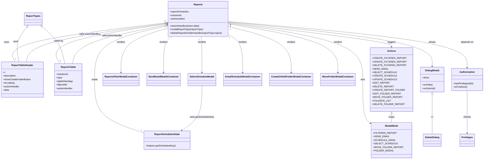

# Diagram: web/portal/src/pages/reports/bi-dashboard/Reports.page.js

> Auto-generated by Obscura crawlers

## Mermaid

### SVG

<svg id="container" width="3162.392578125" xmlns="http://www.w3.org/2000/svg" class="classDiagram" height="1076" viewBox="0 0 3162.392578125 1076" role="graphics-document document" aria-roledescription="class"><g><defs><marker id="container_class-aggregationStart" class="marker aggregation class" refX="18" refY="7" markerWidth="190" markerHeight="240" orient="auto"><path d="M 18,7 L9,13 L1,7 L9,1 Z"></path></marker></defs><defs><marker id="container_class-aggregationEnd" class="marker aggregation class" refX="1" refY="7" markerWidth="20" markerHeight="28" orient="auto"><path d="M 18,7 L9,13 L1,7 L9,1 Z"></path></marker></defs><defs><marker id="container_class-extensionStart" class="marker extension class" refX="18" refY="7" markerWidth="190" markerHeight="240" orient="auto"><path d="M 1,7 L18,13 V 1 Z"></path></marker></defs><defs><marker id="container_class-extensionEnd" class="marker extension class" refX="1" refY="7" markerWidth="20" markerHeight="28" orient="auto"><path d="M 1,1 V 13 L18,7 Z"></path></marker></defs><defs><marker id="container_class-compositionStart" class="marker composition class" refX="18" refY="7" markerWidth="190" markerHeight="240" orient="auto"><path d="M 18,7 L9,13 L1,7 L9,1 Z"></path></marker></defs><defs><marker id="container_class-compositionEnd" class="marker composition class" refX="1" refY="7" markerWidth="20" markerHeight="28" orient="auto"><path d="M 18,7 L9,13 L1,7 L9,1 Z"></path></marker></defs><defs><marker id="container_class-dependencyStart" class="marker dependency class" refX="6" refY="7" markerWidth="190" markerHeight="240" orient="auto"><path d="M 5,7 L9,13 L1,7 L9,1 Z"></path></marker></defs><defs><marker id="container_class-dependencyEnd" class="marker dependency class" refX="13" refY="7" markerWidth="20" markerHeight="28" orient="auto"><path d="M 18,7 L9,13 L14,7 L9,1 Z"></path></marker></defs><defs><marker id="container_class-lollipopStart" class="marker lollipop class" refX="13" refY="7" markerWidth="190" markerHeight="240" orient="auto"><circle stroke="black" fill="transparent" cx="7" cy="7" r="6"></circle></marker></defs><defs><marker id="container_class-lollipopEnd" class="marker lollipop class" refX="1" refY="7" markerWidth="190" markerHeight="240" orient="auto"><circle stroke="black" fill="transparent" cx="7" cy="7" r="6"></circle></marker></defs><g class="root"><g class="clusters"></g><g class="edgePaths"><path d="M1093.924,155.469L918.682,177.058C743.439,198.646,392.954,241.823,227.03,285.578C61.106,329.333,79.744,373.667,89.062,395.833L98.381,418" id="id_Reports_ReportTableHeader_1" class="edge-thickness-normal edge-pattern-solid relation" style=";;;" data-edge="true" data-et="edge" data-id="id_Reports_ReportTableHeader_1" data-points="W3sieCI6MTExMS4wNDQ5MjE4NzUsInkiOjE1My4zNjAxODU0OTg3ODg1Mn0seyJ4Ijo0Mi40Njg3NSwieSI6Mjg1fSx7IngiOjk4LjM4MDk5MDYxMjY0ODIyLCJ5Ijo0MTh9XQ==" marker-start="url(#container_class-aggregationStart)"></path><path d="M1094.007,163.269L965.784,183.557C837.561,203.846,581.116,244.423,466.446,288.878C351.777,333.333,378.884,381.667,392.438,405.833L405.992,430" id="id_Reports_ReportsTable_2" class="edge-thickness-normal edge-pattern-solid relation" style=";;;" data-edge="true" data-et="edge" data-id="id_Reports_ReportsTable_2" data-points="W3sieCI6MTExMS4wNDQ5MjE4NzUsInkiOjE2MC41NzI4NzA1NzMwNDM4fSx7IngiOjMyNC42Njk5MjE4NzUsInkiOjI4NX0seyJ4Ijo0MDUuOTkxNzU1MTg3NzQ3MDYsInkiOjQzMH1d" marker-start="url(#container_class-aggregationStart)"></path><path d="M1094.249,180.135L1019.608,197.613C944.966,215.09,795.683,250.045,721.042,309.689C646.4,369.333,646.4,453.667,646.4,538C646.4,622.333,646.4,706.667,700.558,766.649C754.715,826.632,863.029,862.264,917.187,880.08L971.344,897.896" id="id_Reports_ReportSchedulesState_3" class="edge-thickness-normal edge-pattern-solid relation" style=";;;" data-edge="true" data-et="edge" data-id="id_Reports_ReportSchedulesState_3" data-points="W3sieCI6MTExMS4wNDQ5MjE4NzUsInkiOjE3Ni4yMDI0MzYzNjcyMzc4fSx7IngiOjY0Ni40MDAzOTA2MjUsInkiOjI4NX0seyJ4Ijo2NDYuNDAwMzkwNjI1LCJ5Ijo1Mzh9LHsieCI6NjQ2LjQwMDM5MDYyNSwieSI6NzkxfSx7IngiOjk3MS4zNDM3NSwieSI6ODk3Ljg5NTU0NDU2MDUzMzR9XQ==" marker-start="url(#container_class-aggregationStart)"></path><path d="M1522.764,153.977L1695.813,175.814C1868.863,197.652,2214.962,241.326,2388.011,268.33C2561.061,295.333,2561.061,305.667,2561.061,310.833L2561.061,316" id="id_Reports_Actions_4" class="edge-thickness-normal edge-pattern-solid relation" style=";;;" data-edge="true" data-et="edge" data-id="id_Reports_Actions_4" data-points="W3sieCI6MTUyMi43NjM2NzE4NzUsInkiOjE1My45NzczODE3NTk3MjY3fSx7IngiOjI1NjEuMDYwNTQ2ODc1LCJ5IjoyODV9LHsieCI6MjU2MS4wNjA1NDY4NzUsInkiOjMyMn1d" marker-end="url(#container_class-dependencyEnd)"></path><path d="M1522.764,158.237L1666.599,179.365C1810.434,200.492,2098.105,242.746,2241.94,306.04C2385.775,369.333,2385.775,453.667,2385.775,538C2385.775,622.333,2385.775,706.667,2393.961,756.165C2402.148,805.664,2418.52,820.329,2426.706,827.661L2434.892,834.993" id="id_Reports_ModalMode_5" class="edge-thickness-normal edge-pattern-solid relation" style=";;;" data-edge="true" data-et="edge" data-id="id_Reports_ModalMode_5" data-points="W3sieCI6MTUyMi43NjM2NzE4NzUsInkiOjE1OC4yMzc0MzY1NDc3NTk2fSx7IngiOjIzODUuNzc1MzkwNjI1LCJ5IjoyODV9LHsieCI6MjM4NS43NzUzOTA2MjUsInkiOjUzOH0seyJ4IjoyMzg1Ljc3NTM5MDYyNSwieSI6NzkxfSx7IngiOjI0MzkuMzYxMzI4MTI1LCJ5Ijo4MzguOTk2MDMzMjQ5MzkyN31d" marker-end="url(#container_class-dependencyEnd)"></path><path d="M1522.764,149.563L1738.259,172.136C1953.755,194.709,2384.745,239.854,2600.241,289.594C2815.736,339.333,2815.736,393.667,2815.736,420.833L2815.736,448" id="id_Reports_DialogModal_6" class="edge-thickness-normal edge-pattern-solid relation" style=";;;" data-edge="true" data-et="edge" data-id="id_Reports_DialogModal_6" data-points="W3sieCI6MTUyMi43NjM2NzE4NzUsInkiOjE0OS41NjM0MDQ4Mzg2NjM0NH0seyJ4IjoyODE1LjczNjMyODEyNSwieSI6Mjg1fSx7IngiOjI4MTUuNzM2MzI4MTI1LCJ5Ijo0NTR9XQ==" marker-end="url(#container_class-dependencyEnd)"></path><path d="M1111.045,192.933L1062.397,208.277C1013.749,223.622,916.454,254.311,867.806,303.822C819.158,353.333,819.158,421.667,819.158,455.833L819.158,490" id="id_Reports_ReportsFilterModalContainer_7" class="edge-thickness-normal edge-pattern-solid relation" style=";;;" data-edge="true" data-et="edge" data-id="id_Reports_ReportsFilterModalContainer_7" data-points="W3sieCI6MTExMS4wNDQ5MjE4NzUsInkiOjE5Mi45MzI1NDc0OTkyNzQwNX0seyJ4Ijo4MTkuMTU4MjAzMTI1LCJ5IjoyODV9LHsieCI6ODE5LjE1ODIwMzEyNSwieSI6NDk2fV0=" marker-end="url(#container_class-dependencyEnd)"></path><path d="M1147.5,248L1138.795,254.167C1130.089,260.333,1112.679,272.667,1103.973,313C1095.268,353.333,1095.268,421.667,1095.268,455.833L1095.268,490" id="id_Reports_SendEmailModalContainer_8" class="edge-thickness-normal edge-pattern-solid relation" style=";;;" data-edge="true" data-et="edge" data-id="id_Reports_SendEmailModalContainer_8" data-points="W3sieCI6MTE0Ny41MDA0MzU0MTAwMzIsInkiOjI0OH0seyJ4IjoxMDk1LjI2NzU3ODEyNSwieSI6Mjg1fSx7IngiOjEwOTUuMjY3NTc4MTI1LCJ5Ijo0OTZ9XQ==" marker-end="url(#container_class-dependencyEnd)"></path><path d="M1337.849,248L1338.925,254.167C1340.001,260.333,1342.154,272.667,1343.23,313C1344.307,353.333,1344.307,421.667,1344.307,455.833L1344.307,490" id="id_Reports_SelectScheduleModal_9" class="edge-thickness-normal edge-pattern-solid relation" style=";;;" data-edge="true" data-et="edge" data-id="id_Reports_SelectScheduleModal_9" data-points="W3sieCI6MTMzNy44NDg3NjM0MzU1MDk1LCJ5IjoyNDh9LHsieCI6MTM0NC4zMDY2NDA2MjUsInkiOjI4NX0seyJ4IjoxMzQ0LjMwNjY0MDYyNSwieSI6NDk2fV0=" marker-end="url(#container_class-dependencyEnd)"></path><path d="M1522.764,238.837L1537.053,246.531C1551.343,254.225,1579.923,269.612,1594.212,311.473C1608.502,353.333,1608.502,421.667,1608.502,455.833L1608.502,490" id="id_Reports_EmailScheduleModalContainer_10" class="edge-thickness-normal edge-pattern-solid relation" style=";;;" data-edge="true" data-et="edge" data-id="id_Reports_EmailScheduleModalContainer_10" data-points="W3sieCI6MTUyMi43NjM2NzE4NzUsInkiOjIzOC44MzczODU2MzE0MjE3NH0seyJ4IjoxNjA4LjUwMTk1MzEyNSwieSI6Mjg1fSx7IngiOjE2MDguNTAxOTUzMTI1LCJ5Ijo0OTZ9XQ==" marker-end="url(#container_class-dependencyEnd)"></path><path d="M1522.764,181.449L1589.234,198.708C1655.705,215.966,1788.646,250.483,1855.117,301.908C1921.588,353.333,1921.588,421.667,1921.588,455.833L1921.588,490" id="id_Reports_CreateOrEditFolderModalContainer_11" class="edge-thickness-normal edge-pattern-solid relation" style=";;;" data-edge="true" data-et="edge" data-id="id_Reports_CreateOrEditFolderModalContainer_11" data-points="W3sieCI6MTUyMi43NjM2NzE4NzUsInkiOjE4MS40NDkzMTE2ODgwNn0seyJ4IjoxOTIxLjU4Nzg5MDYyNSwieSI6Mjg1fSx7IngiOjE5MjEuNTg3ODkwNjI1LCJ5Ijo0OTZ9XQ==" marker-end="url(#container_class-dependencyEnd)"></path><path d="M1522.764,163.646L1639.57,183.871C1756.377,204.097,1989.99,244.549,2106.797,298.941C2223.604,353.333,2223.604,421.667,2223.604,455.833L2223.604,490" id="id_Reports_MoveFolderModalContainer_12" class="edge-thickness-normal edge-pattern-solid relation" style=";;;" data-edge="true" data-et="edge" data-id="id_Reports_MoveFolderModalContainer_12" data-points="W3sieCI6MTUyMi43NjM2NzE4NzUsInkiOjE2My42NDU2OTI4Njc3NTk1Mn0seyJ4IjoyMjIzLjYwMzUxNTYyNSwieSI6Mjg1fSx7IngiOjIyMjMuNjAzNTE1NjI1LCJ5Ijo0OTZ9XQ==" marker-end="url(#container_class-dependencyEnd)"></path><path d="M1522.764,146.653L1777.24,169.711C2031.717,192.768,2540.67,238.884,2795.146,290.609C3049.623,342.333,3049.623,399.667,3049.623,428.333L3049.623,457" id="id_Reports_Authorization_13" class="edge-thickness-normal edge-pattern-solid relation" style=";;;" data-edge="true" data-et="edge" data-id="id_Reports_Authorization_13" data-points="W3sieCI6MTUyMi43NjM2NzE4NzUsInkiOjE0Ni42NTI3MjI0MTk2MDc5M30seyJ4IjozMDQ5LjYyMzA0Njg3NSwieSI6Mjg1fSx7IngiOjMwNDkuNjIzMDQ2ODc1LCJ5Ijo0NjN9XQ==" marker-end="url(#container_class-dependencyEnd)"></path><path d="M3049.623,613L3049.623,642.667C3049.623,672.333,3049.623,731.667,3049.623,779.5C3049.623,827.333,3049.623,863.667,3049.623,881.833L3049.623,900" id="id_Authorization_Privileges_14" class="edge-thickness-normal edge-pattern-solid relation" style=";;;" data-edge="true" data-et="edge" data-id="id_Authorization_Privileges_14" data-points="W3sieCI6MzA0OS42MjMwNDY4NzUsInkiOjYxM30seyJ4IjozMDQ5LjYyMzA0Njg3NSwieSI6NzkxfSx7IngiOjMwNDkuNjIzMDQ2ODc1LCJ5Ijo5MDZ9XQ==" marker-end="url(#container_class-dependencyEnd)"></path><path d="M174.77,418L179.562,395.833C184.354,373.667,193.938,329.333,348.993,285.978C504.049,242.622,804.576,200.244,954.84,179.055L1105.104,157.866" id="id_ReportTableHeader_Reports_15" class="edge-thickness-normal edge-pattern-solid relation" style=";;;" data-edge="true" data-et="edge" data-id="id_ReportTableHeader_Reports_15" data-points="W3sieCI6MTc0Ljc2OTYzOTMyODA2MzI1LCJ5Ijo0MTh9LHsieCI6MjAzLjUyMTQ4NDM3NSwieSI6Mjg1fSx7IngiOjExMTEuMDQ0OTIxODc1LCJ5IjoxNTcuMDI4NTc5ODQ4ODU1ODh9XQ==" marker-end="url(#container_class-dependencyEnd)"></path><path d="M493.105,430L499.044,405.833C504.983,381.667,516.862,333.333,618.871,290.03C720.88,246.726,913.02,208.452,1009.09,189.316L1105.161,170.179" id="id_ReportsTable_Reports_16" class="edge-thickness-normal edge-pattern-solid relation" style=";;;" data-edge="true" data-et="edge" data-id="id_ReportsTable_Reports_16" data-points="W3sieCI6NDkzLjEwNDc3Mzk2MjQ1MDYsInkiOjQzMH0seyJ4Ijo1MjguNzQwMjM0Mzc1LCJ5IjoyODV9LHsieCI6MTExMS4wNDQ5MjE4NzUsInkiOjE2OS4wMDY1OTE2NjM3NzU2fV0=" marker-end="url(#container_class-dependencyEnd)"></path><path d="M1344.307,580L1344.307,615.167C1344.307,650.333,1344.307,720.667,1323.103,770.92C1301.899,821.174,1259.492,851.348,1238.288,866.435L1217.084,881.522" id="id_SelectScheduleModal_ReportSchedulesState_17" class="edge-thickness-normal edge-pattern-solid relation" style=";;;" data-edge="true" data-et="edge" data-id="id_SelectScheduleModal_ReportSchedulesState_17" data-points="W3sieCI6MTM0NC4zMDY2NDA2MjUsInkiOjU4MH0seyJ4IjoxMzQ0LjMwNjY0MDYyNSwieSI6NzkxfSx7IngiOjEyMTIuMTk1MTUwNzc2Mjc0LCJ5Ijo4ODV9XQ==" marker-end="url(#container_class-dependencyEnd)"></path><path d="M2561.061,771.25L2561.061,774.542C2561.061,777.833,2561.061,784.417,2561.061,793.875C2561.061,803.333,2561.061,815.667,2561.061,821.833L2561.061,828" id="id_Actions_ModalMode_18" class="edge-thickness-normal edge-pattern-solid relation" style=";;;" data-edge="true" data-et="edge" data-id="id_Actions_ModalMode_18" data-points="W3sieCI6MjU2MS4wNjA1NDY4NzUsInkiOjc1NH0seyJ4IjoyNTYxLjA2MDU0Njg3NSwieSI6NzkxfSx7IngiOjI1NjEuMDYwNTQ2ODc1LCJ5Ijo4Mjh9XQ==" marker-start="url(#container_class-extensionStart)"></path><path d="M285.475,181.202L305.733,198.502C325.991,215.801,366.506,250.401,392.451,291.867C418.396,333.333,429.771,381.667,435.458,405.833L441.146,430" id="id_ReportTypes_ReportsTable_19" class="edge-thickness-normal edge-pattern-solid relation" style=";;;" data-edge="true" data-et="edge" data-id="id_ReportTypes_ReportsTable_19" data-points="W3sieCI6MjcyLjM1NzQzNDMxNTI4NjY0LCJ5IjoxNzB9LHsieCI6NDA3LjAyMTQ4NDM3NSwieSI6Mjg1fSx7IngiOjQ0MS4xNDU3ODE4Njc1ODg5NCwieSI6NDMwfV0=" marker-start="url(#container_class-extensionStart)"></path><path d="M178.543,183.436L164.914,200.364C151.286,217.291,124.029,251.145,114.961,290.239C105.893,329.333,115.015,373.667,119.576,395.833L124.137,418" id="id_ReportTypes_ReportTableHeader_20" class="edge-thickness-normal edge-pattern-solid relation" style=";;;" data-edge="true" data-et="edge" data-id="id_ReportTypes_ReportTableHeader_20" data-points="W3sieCI6MTg5LjM2MDYxOTAyODY2MjQzLCJ5IjoxNzB9LHsieCI6OTYuNzcxNDg0Mzc1LCJ5IjoyODV9LHsieCI6MTI0LjEzNzIyODI2MDg2OTU2LCJ5Ijo0MTh9XQ==" marker-start="url(#container_class-extensionStart)"></path><path d="M2815.736,639.25L2815.736,664.542C2815.736,689.833,2815.736,740.417,2815.736,784.875C2815.736,829.333,2815.736,867.667,2815.736,886.833L2815.736,906" id="id_DialogModal_DeleteDialog_21" class="edge-thickness-normal edge-pattern-solid relation" style=";;;" data-edge="true" data-et="edge" data-id="id_DialogModal_DeleteDialog_21" data-points="W3sieCI6MjgxNS43MzYzMjgxMjUsInkiOjYyMn0seyJ4IjoyODE1LjczNjMyODEyNSwieSI6NzkxfSx7IngiOjI4MTUuNzM2MzI4MTI1LCJ5Ijo5MDZ9XQ==" marker-start="url(#container_class-extensionStart)"></path></g><g class="edgeLabels"><g class="edgeLabel" transform="translate(42.46875, 285)"><g class="label" data-id="id_Reports_ReportTableHeader_1" transform="translate(-16.4921875, -12)"><foreignObject width="32.984375" height="24">

uses

</foreignObject></g></g><g class="edgeLabel" transform="translate(635.75508, 235.77739)"><g class="label" data-id="id_Reports_ReportsTable_2" transform="translate(-30.890625, -12)"><foreignObject width="61.78125" height="24">

contains

</foreignObject></g></g><g class="edgeLabel" transform="translate(646.400390625, 538)"><g class="label" data-id="id_Reports_ReportSchedulesState_3" transform="translate(-20.0078125, -12)"><foreignObject width="40.015625" height="24">

reads

</foreignObject></g></g><g class="edgeLabel" transform="translate(2561.060546875, 285)"><g class="label" data-id="id_Reports_Actions_4" transform="translate(-27.4921875, -12)"><foreignObject width="54.984375" height="24">

triggers

</foreignObject></g></g><g class="edgeLabel" transform="translate(2385.775390625, 538)"><g class="label" data-id="id_Reports_ModalMode_5" transform="translate(-14.7265625, -12)"><foreignObject width="29.453125" height="24">

sets

</foreignObject></g></g><g class="edgeLabel" transform="translate(2815.736328125, 285)"><g class="label" data-id="id_Reports_DialogModal_6" transform="translate(-22.5703125, -12)"><foreignObject width="45.140625" height="24">

shows

</foreignObject></g></g><g class="edgeLabel" transform="translate(819.158203125, 285)"><g class="label" data-id="id_Reports_ReportsFilterModalContainer_7" transform="translate(-27.75, -12)"><foreignObject width="55.5" height="24">

renders

</foreignObject></g></g><g class="edgeLabel" transform="translate(1095.267578125, 285)"><g class="label" data-id="id_Reports_SendEmailModalContainer_8" transform="translate(-27.75, -12)"><foreignObject width="55.5" height="24">

renders

</foreignObject></g></g><g class="edgeLabel" transform="translate(1344.306640625, 285)"><g class="label" data-id="id_Reports_SelectScheduleModal_9" transform="translate(-27.75, -12)"><foreignObject width="55.5" height="24">

renders

</foreignObject></g></g><g class="edgeLabel" transform="translate(1608.501953125, 285)"><g class="label" data-id="id_Reports_EmailScheduleModalContainer_10" transform="translate(-27.75, -12)"><foreignObject width="55.5" height="24">

renders

</foreignObject></g></g><g class="edgeLabel" transform="translate(1921.587890625, 285)"><g class="label" data-id="id_Reports_CreateOrEditFolderModalContainer_11" transform="translate(-27.75, -12)"><foreignObject width="55.5" height="24">

renders

</foreignObject></g></g><g class="edgeLabel" transform="translate(2223.603515625, 285)"><g class="label" data-id="id_Reports_MoveFolderModalContainer_12" transform="translate(-27.75, -12)"><foreignObject width="55.5" height="24">

renders

</foreignObject></g></g><g class="edgeLabel" transform="translate(3049.623046875, 285)"><g class="label" data-id="id_Reports_Authorization_13" transform="translate(-42.9453125, -12)"><foreignObject width="85.890625" height="24">

depends on

</foreignObject></g></g><g class="edgeLabel" transform="translate(3049.623046875, 791)"><g class="label" data-id="id_Authorization_Privileges_14" transform="translate(-24.4921875, -12)"><foreignObject width="48.984375" height="24">

checks

</foreignObject></g></g><g class="edgeLabel" transform="translate(589.91356, 230.5142)"><g class="label" data-id="id_ReportTableHeader_Reports_15" transform="translate(-70.2578125, -12)"><foreignObject width="140.515625" height="24">

calls actionHandler

</foreignObject></g></g><g class="edgeLabel" transform="translate(746.67373, 241.58828)"><g class="label" data-id="id_ReportsTable_Reports_16" transform="translate(-70.2578125, -12)"><foreignObject width="140.515625" height="24">

calls actionHandler

</foreignObject></g></g><g class="edgeLabel" transform="translate(1344.306640625, 791)"><g class="label" data-id="id_SelectScheduleModal_ReportSchedulesState_17" transform="translate(-79.828125, -12)"><foreignObject width="159.65625" height="24">

uses getSchedulesKey

</foreignObject></g></g><g class="edgeLabel" transform="translate(2561.060546875, 791)"><g class="label" data-id="id_Actions_ModalMode_18" transform="translate(-19.703125, -12)"><foreignObject width="39.40625" height="24">

maps

</foreignObject></g></g><g class="edgeLabel" transform="translate(407.021484375, 285)"><g class="label" data-id="id_ReportTypes_ReportsTable_19" transform="translate(-31.4609375, -12)"><foreignObject width="62.921875" height="24">

typed by

</foreignObject></g></g><g class="edgeLabel" transform="translate(100.48859, 280.38318)"><g class="label" data-id="id_ReportTypes_ReportTableHeader_20" transform="translate(-16.4921875, -12)"><foreignObject width="32.984375" height="24">

uses

</foreignObject></g></g><g class="edgeLabel" transform="translate(2815.736328125, 791)"><g class="label" data-id="id_DialogModal_DeleteDialog_21" transform="translate(-8.0078125, -12)"><foreignObject width="16.015625" height="24">

&lt;&gt;

</foreignObject></g></g><g class="edgeTerminals" transform="translate(1091.8422076169372, 140.61241010411456)"><g class="inner" transform="translate(0, 0)"><foreignObject style="width: 9px; height: 12px;">
1
</foreignObject></g></g><g class="edgeTerminals" transform="translate(1091.415692568198, 148.4921692082626)"><g class="inner" transform="translate(0, 0)"><foreignObject style="width: 9px; height: 12px;">
1
</foreignObject></g></g><g class="edgeTerminals" transform="translate(1090.586008288159, 165.58722147932903)"><g class="inner" transform="translate(0, 0)"><foreignObject style="width: 9px; height: 12px;">
1
</foreignObject></g></g><g class="edgeTerminals" transform="translate(1538.2480246531456, 171.05030924949062)"><g class="inner" transform="translate(0, 0)"><foreignObject style="width: 9px; height: 12px;">
1
</foreignObject></g></g><g class="edgeTerminals" transform="translate(1537.8980207265151, 175.62137855977016)"><g class="inner" transform="translate(0, 0)"><foreignObject style="width: 9px; height: 12px;">
1
</foreignObject></g></g><g class="edgeTerminals" transform="translate(1538.6057735159848, 166.30490218735733)"><g class="inner" transform="translate(0, 0)"><foreignObject style="width: 9px; height: 12px;">
1
</foreignObject></g></g><g class="edgeTerminals" transform="translate(1089.8432760354794, 183.8915199825549)"><g class="inner" transform="translate(0, 0)"><foreignObject style="width: 9px; height: 12px;">
1
</foreignObject></g></g><g class="edgeTerminals" transform="translate(1124.5496976932131, 245.87544396717973)"><g class="inner" transform="translate(0, 0)"><foreignObject style="width: 9px; height: 12px;">
1
</foreignObject></g></g><g class="edgeTerminals" transform="translate(1326.0810599013937, 267.8184537199919)"><g class="inner" transform="translate(0, 0)"><foreignObject style="width: 9px; height: 12px;">
1
</foreignObject></g></g><g class="edgeTerminals" transform="translate(1531.0612246607818, 260.3408864164992)"><g class="inner" transform="translate(0, 0)"><foreignObject style="width: 9px; height: 12px;">
1
</foreignObject></g></g><g class="edgeTerminals" transform="translate(1535.9324403944634, 200.36580084477828)"><g class="inner" transform="translate(0, 0)"><foreignObject style="width: 9px; height: 12px;">
1
</foreignObject></g></g><g class="edgeTerminals" transform="translate(1537.4478240874507, 181.411548340652)"><g class="inner" transform="translate(0, 0)"><foreignObject style="width: 9px; height: 12px;">
1
</foreignObject></g></g><g class="edgeTerminals" transform="translate(100.42682694080573, 391.05447096572016)"><g class="inner" transform="translate(0, 0)"></g><foreignObject style="width: 9px; height: 12px;">
1
</foreignObject></g><g class="edgeTerminals" transform="translate(405.5143330704497, 402.3991961677401)"><g class="inner" transform="translate(0, 0)"></g><foreignObject style="width: 9px; height: 12px;">
3
</foreignObject></g><g class="edgeTerminals" transform="translate(954.4075272340897, 873.1781271446933)"><g class="inner" transform="translate(0, 0)"></g><foreignObject style="width: 9px; height: 12px;">
1
</foreignObject></g></g><g class="nodes"><g class="node default" id="classId-Reports-0" transform="translate(1316.904296875, 128)"><g class="basic label-container"><path d="M-205.859375 -120 L205.859375 -120 L205.859375 120 L-205.859375 120" stroke="none" stroke-width="0" fill="#ECECFF" style=""></path><path d="M-205.859375 -120 C-108.6610091575368 -120, -11.462643315073592 -120, 205.859375 -120 M-205.859375 -120 C-121.28911199316929 -120, -36.71884898633857 -120, 205.859375 -120 M205.859375 -120 C205.859375 -28.12097573096686, 205.859375 63.75804853806628, 205.859375 120 M205.859375 -120 C205.859375 -69.0985386753389, 205.859375 -18.1970773506778, 205.859375 120 M205.859375 120 C111.92753849764112 120, 17.995701995282246 120, -205.859375 120 M205.859375 120 C45.72550016940545 120, -114.4083746611891 120, -205.859375 120 M-205.859375 120 C-205.859375 64.39889896901872, -205.859375 8.797797938037434, -205.859375 -120 M-205.859375 120 C-205.859375 24.074448542370575, -205.859375 -71.85110291525885, -205.859375 -120" stroke="#9370DB" stroke-width="1.3" fill="none" stroke-dasharray="0 0" style=""></path></g><g class="annotation-group text" transform="translate(0, -96)"></g><g class="label-group text" transform="translate(-28.84375, -96)"><g class="label" style="font-weight: bolder" transform="translate(0,-12)"><foreignObject width="57.6875" height="24">

Reports

</foreignObject></g></g><g class="members-group text" transform="translate(-193.859375, -48)"><g class="label" style="" transform="translate(0,-12)"><foreignObject width="127.359375" height="24">

+reportSchedules

</foreignObject></g><g class="label" style="" transform="translate(0,12)"><foreignObject width="82.109375" height="24">

+solutionId

</foreignObject></g><g class="label" style="" transform="translate(0,36)"><foreignObject width="105.421875" height="24">

+authorization

</foreignObject></g></g><g class="methods-group text" transform="translate(-193.859375, 48)"><g class="label" style="" transform="translate(0,-12)"><foreignObject width="203.1875" height="24">

+actionHandler(action,data)

</foreignObject></g><g class="label" style="" transform="translate(0,12)"><foreignObject width="225.84375" height="24">

+modalReportType(reportType)

</foreignObject></g><g class="label" style="" transform="translate(0,36)"><foreignObject width="358.875" height="24">

+deleteReportInFolderHandler(reportType,report)

</foreignObject></g></g><g class="divider" style=""><path d="M-205.859375 -72 C-74.79635839852156 -72, 56.266658202956876 -72, 205.859375 -72 M-205.859375 -72 C-69.5551639024097 -72, 66.7490471951806 -72, 205.859375 -72" stroke="#9370DB" stroke-width="1.3" fill="none" stroke-dasharray="0 0" style=""></path></g><g class="divider" style=""><path d="M-205.859375 24 C-78.26298682217896 24, 49.33340135564208 24, 205.859375 24 M-205.859375 24 C-93.21359099629997 24, 19.43219300740006 24, 205.859375 24" stroke="#9370DB" stroke-width="1.3" fill="none" stroke-dasharray="0 0" style=""></path></g></g><g class="node default" id="classId-ReportTableHeader-1" transform="translate(148.828125, 538)"><g class="basic label-container"><path d="M-140.828125 -120 L140.828125 -120 L140.828125 120 L-140.828125 120" stroke="none" stroke-width="0" fill="#ECECFF" style=""></path><path d="M-140.828125 -120 C-31.795356954804674 -120, 77.23741109039065 -120, 140.828125 -120 M-140.828125 -120 C-64.81036717496882 -120, 11.207390650062365 -120, 140.828125 -120 M140.828125 -120 C140.828125 -39.90938685901912, 140.828125 40.181226281961756, 140.828125 120 M140.828125 -120 C140.828125 -26.270789716184623, 140.828125 67.45842056763075, 140.828125 120 M140.828125 120 C80.89315823430263 120, 20.95819146860528 120, -140.828125 120 M140.828125 120 C59.51956204888046 120, -21.78900090223908 120, -140.828125 120 M-140.828125 120 C-140.828125 69.89893411707224, -140.828125 19.797868234144488, -140.828125 -120 M-140.828125 120 C-140.828125 47.29719803723253, -140.828125 -25.405603925534933, -140.828125 -120" stroke="#9370DB" stroke-width="1.3" fill="none" stroke-dasharray="0 0" style=""></path></g><g class="annotation-group text" transform="translate(0, -96)"></g><g class="label-group text" transform="translate(-71.28125, -96)"><g class="label" style="font-weight: bolder" transform="translate(0,-12)"><foreignObject width="142.5625" height="24">

ReportTableHeader

</foreignObject></g></g><g class="members-group text" transform="translate(-128.828125, -48)"><g class="label" style="" transform="translate(0,-12)"><foreignObject width="13.6875" height="24">

+t

</foreignObject></g><g class="label" style="" transform="translate(0,12)"><foreignObject width="90.59375" height="24">

+description

</foreignObject></g><g class="label" style="" transform="translate(0,36)"><foreignObject width="186.375" height="24">

+showCreateFolderButton

</foreignObject></g><g class="label" style="" transform="translate(0,60)"><foreignObject width="77.203125" height="24">

+isLoading

</foreignObject></g><g class="label" style="" transform="translate(0,84)"><foreignObject width="111.140625" height="24">

+actionHandler

</foreignObject></g><g class="label" style="" transform="translate(0,108)"><foreignObject width="40.625" height="24">

+data

</foreignObject></g></g><g class="methods-group text" transform="translate(-128.828125, 120)"></g><g class="divider" style=""><path d="M-140.828125 -72 C-60.2309803877624 -72, 20.3661642244752 -72, 140.828125 -72 M-140.828125 -72 C-35.053378613783764 -72, 70.72136777243247 -72, 140.828125 -72" stroke="#9370DB" stroke-width="1.3" fill="none" stroke-dasharray="0 0" style=""></path></g><g class="divider" style=""><path d="M-140.828125 96 C-54.577051629705394 96, 31.67402174058921 96, 140.828125 96 M-140.828125 96 C-83.50076921507213 96, -26.173413430144265 96, 140.828125 96" stroke="#9370DB" stroke-width="1.3" fill="none" stroke-dasharray="0 0" style=""></path></g></g><g class="node default" id="classId-ReportsTable-2" transform="translate(466.5625, 538)"><g class="basic label-container"><path d="M-92.69140625 -108 L92.69140625 -108 L92.69140625 108 L-92.69140625 108" stroke="none" stroke-width="0" fill="#ECECFF" style=""></path><path d="M-92.69140625 -108 C-35.76791133849223 -108, 21.155583573015534 -108, 92.69140625 -108 M-92.69140625 -108 C-32.167228257887224 -108, 28.35694973422555 -108, 92.69140625 -108 M92.69140625 -108 C92.69140625 -47.405289724938996, 92.69140625 13.189420550122009, 92.69140625 108 M92.69140625 -108 C92.69140625 -44.660714836704685, 92.69140625 18.67857032659063, 92.69140625 108 M92.69140625 108 C51.75928630950276 108, 10.827166369005525 108, -92.69140625 108 M92.69140625 108 C51.09447966310898 108, 9.497553076217955 108, -92.69140625 108 M-92.69140625 108 C-92.69140625 30.57829365276278, -92.69140625 -46.84341269447444, -92.69140625 -108 M-92.69140625 108 C-92.69140625 55.49243968859324, -92.69140625 2.9848793771864734, -92.69140625 -108" stroke="#9370DB" stroke-width="1.3" fill="none" stroke-dasharray="0 0" style=""></path></g><g class="annotation-group text" transform="translate(0, -84)"></g><g class="label-group text" transform="translate(-48.6796875, -84)"><g class="label" style="font-weight: bolder" transform="translate(0,-12)"><foreignObject width="97.359375" height="24">

ReportsTable

</foreignObject></g></g><g class="members-group text" transform="translate(-80.69140625, -36)"><g class="label" style="" transform="translate(0,-12)"><foreignObject width="82.109375" height="24">

+solutionId

</foreignObject></g><g class="label" style="" transform="translate(0,12)"><foreignObject width="39.703125" height="24">

+type

</foreignObject></g><g class="label" style="" transform="translate(0,36)"><foreignObject width="112.703125" height="24">

+tableFilterMap

</foreignObject></g><g class="label" style="" transform="translate(0,60)"><foreignObject width="72.828125" height="24">

+filtersRef

</foreignObject></g><g class="label" style="" transform="translate(0,84)"><foreignObject width="111.140625" height="24">

+actionHandler

</foreignObject></g></g><g class="methods-group text" transform="translate(-80.69140625, 108)"></g><g class="divider" style=""><path d="M-92.69140625 -60 C-20.77407362603614 -60, 51.14325899792772 -60, 92.69140625 -60 M-92.69140625 -60 C-53.62887912244984 -60, -14.566351994899676 -60, 92.69140625 -60" stroke="#9370DB" stroke-width="1.3" fill="none" stroke-dasharray="0 0" style=""></path></g><g class="divider" style=""><path d="M-92.69140625 84 C-41.2370866684737 84, 10.217232913052598 84, 92.69140625 84 M-92.69140625 84 C-41.51694088117724 84, 9.657524487645517 84, 92.69140625 84" stroke="#9370DB" stroke-width="1.3" fill="none" stroke-dasharray="0 0" style=""></path></g></g><g class="node default" id="classId-DialogModal-3" transform="translate(2815.736328125, 538)"><g class="basic label-container"><path d="M-79.1171875 -84 L79.1171875 -84 L79.1171875 84 L-79.1171875 84" stroke="none" stroke-width="0" fill="#ECECFF" style=""></path><path d="M-79.1171875 -84 C-29.811640806116465 -84, 19.49390588776707 -84, 79.1171875 -84 M-79.1171875 -84 C-25.516761544089896 -84, 28.08366441182021 -84, 79.1171875 -84 M79.1171875 -84 C79.1171875 -45.674863823230176, 79.1171875 -7.349727646460352, 79.1171875 84 M79.1171875 -84 C79.1171875 -38.95188969393132, 79.1171875 6.096220612137358, 79.1171875 84 M79.1171875 84 C29.425881306682093 84, -20.265424886635813 84, -79.1171875 84 M79.1171875 84 C43.4062535167428 84, 7.695319533485602 84, -79.1171875 84 M-79.1171875 84 C-79.1171875 32.715358687754865, -79.1171875 -18.56928262449027, -79.1171875 -84 M-79.1171875 84 C-79.1171875 32.99736818661619, -79.1171875 -18.005263626767615, -79.1171875 -84" stroke="#9370DB" stroke-width="1.3" fill="none" stroke-dasharray="0 0" style=""></path></g><g class="annotation-group text" transform="translate(0, -60)"></g><g class="label-group text" transform="translate(-45.625, -60)"><g class="label" style="font-weight: bolder" transform="translate(0,-12)"><foreignObject width="91.25" height="24">

DialogModal

</foreignObject></g></g><g class="members-group text" transform="translate(-67.1171875, -12)"><g class="label" style="" transform="translate(0,-12)"><foreignObject width="45.65625" height="24">

+show

</foreignObject></g></g><g class="methods-group text" transform="translate(-67.1171875, 36)"><g class="label" style="" transform="translate(0,-12)"><foreignObject width="70.765625" height="24">

+onHide()

</foreignObject></g><g class="label" style="" transform="translate(0,12)"><foreignObject width="88.609375" height="24">

+onSubmit()

</foreignObject></g></g><g class="divider" style=""><path d="M-79.1171875 -36 C-28.785190893047947 -36, 21.546805713904106 -36, 79.1171875 -36 M-79.1171875 -36 C-36.45876780329667 -36, 6.199651893406653 -36, 79.1171875 -36" stroke="#9370DB" stroke-width="1.3" fill="none" stroke-dasharray="0 0" style=""></path></g><g class="divider" style=""><path d="M-79.1171875 12 C-39.262749693638334 12, 0.5916881127233324 12, 79.1171875 12 M-79.1171875 12 C-38.12553789906587 12, 2.866111701868263 12, 79.1171875 12" stroke="#9370DB" stroke-width="1.3" fill="none" stroke-dasharray="0 0" style=""></path></g></g><g class="node default" id="classId-ReportsFilterModalContainer-4" transform="translate(819.158203125, 538)"><g class="basic label-container"><path d="M-117.75 -42 L117.75 -42 L117.75 42 L-117.75 42" stroke="none" stroke-width="0" fill="#ECECFF" style=""></path><path d="M-117.75 -42 C-38.60596382066453 -42, 40.538072358670945 -42, 117.75 -42 M-117.75 -42 C-33.81537381218671 -42, 50.11925237562659 -42, 117.75 -42 M117.75 -42 C117.75 -11.05379348677441, 117.75 19.89241302645118, 117.75 42 M117.75 -42 C117.75 -23.830454258319655, 117.75 -5.66090851663931, 117.75 42 M117.75 42 C63.73081419075628 42, 9.711628381512554 42, -117.75 42 M117.75 42 C48.387065656506195 42, -20.97586868698761 42, -117.75 42 M-117.75 42 C-117.75 13.296999144244225, -117.75 -15.40600171151155, -117.75 -42 M-117.75 42 C-117.75 8.497157044476026, -117.75 -25.005685911047948, -117.75 -42" stroke="#9370DB" stroke-width="1.3" fill="none" stroke-dasharray="0 0" style=""></path></g><g class="annotation-group text" transform="translate(0, -18)"></g><g class="label-group text" transform="translate(-105.75, -18)"><g class="label" style="font-weight: bolder" transform="translate(0,-12)"><foreignObject width="211.5" height="24">

ReportsFilterModalContainer

</foreignObject></g></g><g class="members-group text" transform="translate(-105.75, 30)"></g><g class="methods-group text" transform="translate(-105.75, 60)"></g><g class="divider" style=""><path d="M-117.75 6 C-56.93120721293991 6, 3.8875855741201804 6, 117.75 6 M-117.75 6 C-50.88899918026378 6, 15.972001639472438 6, 117.75 6" stroke="#9370DB" stroke-width="1.3" fill="none" stroke-dasharray="0 0" style=""></path></g><g class="divider" style=""><path d="M-117.75 24 C-25.30149148257881 24, 67.14701703484238 24, 117.75 24 M-117.75 24 C-42.893255544372096 24, 31.96348891125581 24, 117.75 24" stroke="#9370DB" stroke-width="1.3" fill="none" stroke-dasharray="0 0" style=""></path></g></g><g class="node default" id="classId-SendEmailModalContainer-5" transform="translate(1095.267578125, 538)"><g class="basic label-container"><path d="M-108.359375 -42 L108.359375 -42 L108.359375 42 L-108.359375 42" stroke="none" stroke-width="0" fill="#ECECFF" style=""></path><path d="M-108.359375 -42 C-36.03945501456835 -42, 36.28046497086331 -42, 108.359375 -42 M-108.359375 -42 C-45.993032809596116 -42, 16.37330938080777 -42, 108.359375 -42 M108.359375 -42 C108.359375 -10.183686540698815, 108.359375 21.63262691860237, 108.359375 42 M108.359375 -42 C108.359375 -23.36943215197376, 108.359375 -4.738864303947523, 108.359375 42 M108.359375 42 C49.20623300762584 42, -9.946908984748319 42, -108.359375 42 M108.359375 42 C34.75170337121489 42, -38.855968257570225 42, -108.359375 42 M-108.359375 42 C-108.359375 21.0390429870418, -108.359375 0.0780859740835993, -108.359375 -42 M-108.359375 42 C-108.359375 9.557447651875627, -108.359375 -22.885104696248746, -108.359375 -42" stroke="#9370DB" stroke-width="1.3" fill="none" stroke-dasharray="0 0" style=""></path></g><g class="annotation-group text" transform="translate(0, -18)"></g><g class="label-group text" transform="translate(-96.359375, -18)"><g class="label" style="font-weight: bolder" transform="translate(0,-12)"><foreignObject width="192.71875" height="24">

SendEmailModalContainer

</foreignObject></g></g><g class="members-group text" transform="translate(-96.359375, 30)"></g><g class="methods-group text" transform="translate(-96.359375, 60)"></g><g class="divider" style=""><path d="M-108.359375 6 C-36.05469311545487 6, 36.249988769090265 6, 108.359375 6 M-108.359375 6 C-35.55339552762463 6, 37.25258394475074 6, 108.359375 6" stroke="#9370DB" stroke-width="1.3" fill="none" stroke-dasharray="0 0" style=""></path></g><g class="divider" style=""><path d="M-108.359375 24 C-47.375815014305324 24, 13.607744971389351 24, 108.359375 24 M-108.359375 24 C-42.44663429735091 24, 23.466106405298177 24, 108.359375 24" stroke="#9370DB" stroke-width="1.3" fill="none" stroke-dasharray="0 0" style=""></path></g></g><g class="node default" id="classId-SelectScheduleModal-6" transform="translate(1344.306640625, 538)"><g class="basic label-container"><path d="M-90.6796875 -42 L90.6796875 -42 L90.6796875 42 L-90.6796875 42" stroke="none" stroke-width="0" fill="#ECECFF" style=""></path><path d="M-90.6796875 -42 C-50.626862812252504 -42, -10.574038124505009 -42, 90.6796875 -42 M-90.6796875 -42 C-28.733222752915182 -42, 33.213241994169636 -42, 90.6796875 -42 M90.6796875 -42 C90.6796875 -21.865390526808934, 90.6796875 -1.7307810536178678, 90.6796875 42 M90.6796875 -42 C90.6796875 -15.409368121737302, 90.6796875 11.181263756525397, 90.6796875 42 M90.6796875 42 C24.945114344983693 42, -40.78945881003261 42, -90.6796875 42 M90.6796875 42 C19.514919668956992 42, -51.649848162086016 42, -90.6796875 42 M-90.6796875 42 C-90.6796875 12.445767909040917, -90.6796875 -17.108464181918166, -90.6796875 -42 M-90.6796875 42 C-90.6796875 11.933194409681636, -90.6796875 -18.133611180636727, -90.6796875 -42" stroke="#9370DB" stroke-width="1.3" fill="none" stroke-dasharray="0 0" style=""></path></g><g class="annotation-group text" transform="translate(0, -18)"></g><g class="label-group text" transform="translate(-78.6796875, -18)"><g class="label" style="font-weight: bolder" transform="translate(0,-12)"><foreignObject width="157.359375" height="24">

SelectScheduleModal

</foreignObject></g></g><g class="members-group text" transform="translate(-78.6796875, 30)"></g><g class="methods-group text" transform="translate(-78.6796875, 60)"></g><g class="divider" style=""><path d="M-90.6796875 6 C-19.930399778831216 6, 50.81888794233757 6, 90.6796875 6 M-90.6796875 6 C-46.55008017161233 6, -2.4204728432246583 6, 90.6796875 6" stroke="#9370DB" stroke-width="1.3" fill="none" stroke-dasharray="0 0" style=""></path></g><g class="divider" style=""><path d="M-90.6796875 24 C-46.79132859276481 24, -2.9029696855296265 24, 90.6796875 24 M-90.6796875 24 C-42.791763973994904 24, 5.096159552010192 24, 90.6796875 24" stroke="#9370DB" stroke-width="1.3" fill="none" stroke-dasharray="0 0" style=""></path></g></g><g class="node default" id="classId-EmailScheduleModalContainer-7" transform="translate(1608.501953125, 538)"><g class="basic label-container"><path d="M-123.515625 -42 L123.515625 -42 L123.515625 42 L-123.515625 42" stroke="none" stroke-width="0" fill="#ECECFF" style=""></path><path d="M-123.515625 -42 C-60.87499112178295 -42, 1.7656427564341044 -42, 123.515625 -42 M-123.515625 -42 C-48.82704585069159 -42, 25.86153329861682 -42, 123.515625 -42 M123.515625 -42 C123.515625 -14.677767852411645, 123.515625 12.64446429517671, 123.515625 42 M123.515625 -42 C123.515625 -9.168498833941989, 123.515625 23.663002332116022, 123.515625 42 M123.515625 42 C44.2094241397087 42, -35.0967767205826 42, -123.515625 42 M123.515625 42 C66.4882828123491 42, 9.460940624698182 42, -123.515625 42 M-123.515625 42 C-123.515625 18.20389708550041, -123.515625 -5.592205828999177, -123.515625 -42 M-123.515625 42 C-123.515625 18.50545322440807, -123.515625 -4.989093551183863, -123.515625 -42" stroke="#9370DB" stroke-width="1.3" fill="none" stroke-dasharray="0 0" style=""></path></g><g class="annotation-group text" transform="translate(0, -18)"></g><g class="label-group text" transform="translate(-111.515625, -18)"><g class="label" style="font-weight: bolder" transform="translate(0,-12)"><foreignObject width="223.03125" height="24">

EmailScheduleModalContainer

</foreignObject></g></g><g class="members-group text" transform="translate(-111.515625, 30)"></g><g class="methods-group text" transform="translate(-111.515625, 60)"></g><g class="divider" style=""><path d="M-123.515625 6 C-50.426601978923614 6, 22.662421042152772 6, 123.515625 6 M-123.515625 6 C-38.41448050511946 6, 46.68666398976109 6, 123.515625 6" stroke="#9370DB" stroke-width="1.3" fill="none" stroke-dasharray="0 0" style=""></path></g><g class="divider" style=""><path d="M-123.515625 24 C-70.01145112706578 24, -16.50727725413155 24, 123.515625 24 M-123.515625 24 C-34.85095319768766 24, 53.81371860462468 24, 123.515625 24" stroke="#9370DB" stroke-width="1.3" fill="none" stroke-dasharray="0 0" style=""></path></g></g><g class="node default" id="classId-CreateOrEditFolderModalContainer-8" transform="translate(1921.587890625, 538)"><g class="basic label-container"><path d="M-139.5703125 -42 L139.5703125 -42 L139.5703125 42 L-139.5703125 42" stroke="none" stroke-width="0" fill="#ECECFF" style=""></path><path d="M-139.5703125 -42 C-52.22194734915193 -42, 35.126417801696135 -42, 139.5703125 -42 M-139.5703125 -42 C-56.77181651464271 -42, 26.026679470714583 -42, 139.5703125 -42 M139.5703125 -42 C139.5703125 -13.947238951455649, 139.5703125 14.105522097088702, 139.5703125 42 M139.5703125 -42 C139.5703125 -19.1350512977965, 139.5703125 3.729897404406998, 139.5703125 42 M139.5703125 42 C36.397744628112235 42, -66.77482324377553 42, -139.5703125 42 M139.5703125 42 C80.80506028677722 42, 22.03980807355444 42, -139.5703125 42 M-139.5703125 42 C-139.5703125 18.8176215726827, -139.5703125 -4.364756854634599, -139.5703125 -42 M-139.5703125 42 C-139.5703125 11.35853407590848, -139.5703125 -19.28293184818304, -139.5703125 -42" stroke="#9370DB" stroke-width="1.3" fill="none" stroke-dasharray="0 0" style=""></path></g><g class="annotation-group text" transform="translate(0, -18)"></g><g class="label-group text" transform="translate(-127.5703125, -18)"><g class="label" style="font-weight: bolder" transform="translate(0,-12)"><foreignObject width="255.140625" height="24">

CreateOrEditFolderModalContainer

</foreignObject></g></g><g class="members-group text" transform="translate(-127.5703125, 30)"></g><g class="methods-group text" transform="translate(-127.5703125, 60)"></g><g class="divider" style=""><path d="M-139.5703125 6 C-39.754601603716964 6, 60.06110929256607 6, 139.5703125 6 M-139.5703125 6 C-45.27882554003399 6, 49.012661419932016 6, 139.5703125 6" stroke="#9370DB" stroke-width="1.3" fill="none" stroke-dasharray="0 0" style=""></path></g><g class="divider" style=""><path d="M-139.5703125 24 C-41.37780995135877 24, 56.81469259728246 24, 139.5703125 24 M-139.5703125 24 C-31.6892276981298 24, 76.1918571037404 24, 139.5703125 24" stroke="#9370DB" stroke-width="1.3" fill="none" stroke-dasharray="0 0" style=""></path></g></g><g class="node default" id="classId-MoveFolderModalContainer-9" transform="translate(2223.603515625, 538)"><g class="basic label-container"><path d="M-112.4453125 -42 L112.4453125 -42 L112.4453125 42 L-112.4453125 42" stroke="none" stroke-width="0" fill="#ECECFF" style=""></path><path d="M-112.4453125 -42 C-54.75741480052717 -42, 2.9304828989456553 -42, 112.4453125 -42 M-112.4453125 -42 C-22.933373180443 -42, 66.578566139114 -42, 112.4453125 -42 M112.4453125 -42 C112.4453125 -13.749464589860136, 112.4453125 14.501070820279729, 112.4453125 42 M112.4453125 -42 C112.4453125 -13.208293259600097, 112.4453125 15.583413480799805, 112.4453125 42 M112.4453125 42 C43.147092220343666 42, -26.15112805931267 42, -112.4453125 42 M112.4453125 42 C53.4918893217229 42, -5.4615338565541975 42, -112.4453125 42 M-112.4453125 42 C-112.4453125 18.65859665147179, -112.4453125 -4.682806697056421, -112.4453125 -42 M-112.4453125 42 C-112.4453125 21.739513366500567, -112.4453125 1.4790267330011346, -112.4453125 -42" stroke="#9370DB" stroke-width="1.3" fill="none" stroke-dasharray="0 0" style=""></path></g><g class="annotation-group text" transform="translate(0, -18)"></g><g class="label-group text" transform="translate(-100.4453125, -18)"><g class="label" style="font-weight: bolder" transform="translate(0,-12)"><foreignObject width="200.890625" height="24">

MoveFolderModalContainer

</foreignObject></g></g><g class="members-group text" transform="translate(-100.4453125, 30)"></g><g class="methods-group text" transform="translate(-100.4453125, 60)"></g><g class="divider" style=""><path d="M-112.4453125 6 C-62.17569867786619 6, -11.906084855732374 6, 112.4453125 6 M-112.4453125 6 C-56.250942563801814 6, -0.05657262760362869 6, 112.4453125 6" stroke="#9370DB" stroke-width="1.3" fill="none" stroke-dasharray="0 0" style=""></path></g><g class="divider" style=""><path d="M-112.4453125 24 C-36.30222507120186 24, 39.84086235759628 24, 112.4453125 24 M-112.4453125 24 C-42.6548247815914 24, 27.135662936817198 24, 112.4453125 24" stroke="#9370DB" stroke-width="1.3" fill="none" stroke-dasharray="0 0" style=""></path></g></g><g class="node default" id="classId-ReportSchedulesState-10" transform="translate(1123.65234375, 948)"><g class="basic label-container"><path d="M-152.30859375 -63 L152.30859375 -63 L152.30859375 63 L-152.30859375 63" stroke="none" stroke-width="0" fill="#ECECFF" style=""></path><path d="M-152.30859375 -63 C-61.72713885396895 -63, 28.854316042062095 -63, 152.30859375 -63 M-152.30859375 -63 C-56.28357162004312 -63, 39.74145050991376 -63, 152.30859375 -63 M152.30859375 -63 C152.30859375 -31.117488398349558, 152.30859375 0.7650232033008848, 152.30859375 63 M152.30859375 -63 C152.30859375 -19.666530802343793, 152.30859375 23.666938395312414, 152.30859375 63 M152.30859375 63 C40.33744900404831 63, -71.63369574190338 63, -152.30859375 63 M152.30859375 63 C69.23544926440042 63, -13.83769522119917 63, -152.30859375 63 M-152.30859375 63 C-152.30859375 24.2711409481823, -152.30859375 -14.4577181036354, -152.30859375 -63 M-152.30859375 63 C-152.30859375 22.33913317611684, -152.30859375 -18.321733647766322, -152.30859375 -63" stroke="#9370DB" stroke-width="1.3" fill="none" stroke-dasharray="0 0" style=""></path></g><g class="annotation-group text" transform="translate(0, -39)"></g><g class="label-group text" transform="translate(-81.7265625, -39)"><g class="label" style="font-weight: bolder" transform="translate(0,-12)"><foreignObject width="163.453125" height="24">

ReportSchedulesState

</foreignObject></g></g><g class="members-group text" transform="translate(-140.30859375, 9)"></g><g class="methods-group text" transform="translate(-140.30859375, 39)"><g class="label" style="" transform="translate(0,-12)"><foreignObject width="198.890625" height="24">

+helpers.getSchedulesKey()

</foreignObject></g></g><g class="divider" style=""><path d="M-152.30859375 -15 C-38.823934579148755 -15, 74.66072459170249 -15, 152.30859375 -15 M-152.30859375 -15 C-56.69154542018586 -15, 38.92550290962828 -15, 152.30859375 -15" stroke="#9370DB" stroke-width="1.3" fill="none" stroke-dasharray="0 0" style=""></path></g><g class="divider" style=""><path d="M-152.30859375 9 C-38.62068841403594 9, 75.06721692192812 9, 152.30859375 9 M-152.30859375 9 C-66.09324886559763 9, 20.12209601880474 9, 152.30859375 9" stroke="#9370DB" stroke-width="1.3" fill="none" stroke-dasharray="0 0" style=""></path></g></g><g class="node default" id="classId-ReportTypes-11" transform="translate(223.17578125, 128)"><g class="basic label-container"><path d="M-58.1796875 -42 L58.1796875 -42 L58.1796875 42 L-58.1796875 42" stroke="none" stroke-width="0" fill="#ECECFF" style=""></path><path d="M-58.1796875 -42 C-22.510006584568828 -42, 13.159674330862345 -42, 58.1796875 -42 M-58.1796875 -42 C-29.636530259823974 -42, -1.0933730196479488 -42, 58.1796875 -42 M58.1796875 -42 C58.1796875 -12.884214733066699, 58.1796875 16.231570533866602, 58.1796875 42 M58.1796875 -42 C58.1796875 -10.749368557793037, 58.1796875 20.501262884413926, 58.1796875 42 M58.1796875 42 C25.08685838622874 42, -8.005970727542518 42, -58.1796875 42 M58.1796875 42 C34.45402439601426 42, 10.72836129202853 42, -58.1796875 42 M-58.1796875 42 C-58.1796875 18.070586678675774, -58.1796875 -5.858826642648452, -58.1796875 -42 M-58.1796875 42 C-58.1796875 12.484131404386908, -58.1796875 -17.031737191226185, -58.1796875 -42" stroke="#9370DB" stroke-width="1.3" fill="none" stroke-dasharray="0 0" style=""></path></g><g class="annotation-group text" transform="translate(0, -18)"></g><g class="label-group text" transform="translate(-46.1796875, -18)"><g class="label" style="font-weight: bolder" transform="translate(0,-12)"><foreignObject width="92.359375" height="24">

ReportTypes

</foreignObject></g></g><g class="members-group text" transform="translate(-46.1796875, 30)"></g><g class="methods-group text" transform="translate(-46.1796875, 60)"></g><g class="divider" style=""><path d="M-58.1796875 6 C-27.006420886235077 6, 4.1668457275298465 6, 58.1796875 6 M-58.1796875 6 C-28.275561312557397 6, 1.6285648748852068 6, 58.1796875 6" stroke="#9370DB" stroke-width="1.3" fill="none" stroke-dasharray="0 0" style=""></path></g><g class="divider" style=""><path d="M-58.1796875 24 C-15.165790281404824 24, 27.84810693719035 24, 58.1796875 24 M-58.1796875 24 C-20.530842873389354 24, 17.118001753221293 24, 58.1796875 24" stroke="#9370DB" stroke-width="1.3" fill="none" stroke-dasharray="0 0" style=""></path></g></g><g class="node default" id="classId-Actions-12" transform="translate(2561.060546875, 538)"><g class="basic label-container"><path d="M-125.55859375 -216 L125.55859375 -216 L125.55859375 216 L-125.55859375 216" stroke="none" stroke-width="0" fill="#ECECFF" style=""></path><path d="M-125.55859375 -216 C-58.69785182137261 -216, 8.162890107254782 -216, 125.55859375 -216 M-125.55859375 -216 C-71.9170582935572 -216, -18.27552283711441 -216, 125.55859375 -216 M125.55859375 -216 C125.55859375 -108.48560076052607, 125.55859375 -0.9712015210521372, 125.55859375 216 M125.55859375 -216 C125.55859375 -54.68225747672574, 125.55859375 106.63548504654852, 125.55859375 216 M125.55859375 216 C72.1482877421453 216, 18.737981734290614 216, -125.55859375 216 M125.55859375 216 C70.677718901964 216, 15.796844053928012 216, -125.55859375 216 M-125.55859375 216 C-125.55859375 115.96478289856765, -125.55859375 15.929565797135297, -125.55859375 -216 M-125.55859375 216 C-125.55859375 49.85689737629971, -125.55859375 -116.28620524740057, -125.55859375 -216" stroke="#9370DB" stroke-width="1.3" fill="none" stroke-dasharray="0 0" style=""></path></g><g class="annotation-group text" transform="translate(0, -192)"></g><g class="label-group text" transform="translate(-27.0546875, -192)"><g class="label" style="font-weight: bolder" transform="translate(0,-12)"><foreignObject width="54.109375" height="24">

Actions

</foreignObject></g></g><g class="members-group text" transform="translate(-113.55859375, -144)"><g class="label" style="" transform="translate(0,-12)"><foreignObject width="197.21875" height="24">

+CREATE_FILTERED_REPORT

</foreignObject></g><g class="label" style="" transform="translate(0,12)"><foreignObject width="200.0625" height="24">

+UPDATE_FILTERED_REPORT

</foreignObject></g><g class="label" style="" transform="translate(0,36)"><foreignObject width="197.046875" height="24">

+DELETE_FILTERED_REPORT

</foreignObject></g><g class="label" style="" transform="translate(0,60)"><foreignObject width="96.40625" height="24">

+SEND_EMAIL

</foreignObject></g><g class="label" style="" transform="translate(0,84)"><foreignObject width="139.78125" height="24">

+SELECT_SCHEDULE

</foreignObject></g><g class="label" style="" transform="translate(0,108)"><foreignObject width="142.9375" height="24">

+CREATE_SCHEDULE

</foreignObject></g><g class="label" style="" transform="translate(0,132)"><foreignObject width="145.765625" height="24">

+UPDATE_SCHEDULE

</foreignObject></g><g class="label" style="" transform="translate(0,156)"><foreignObject width="103.609375" height="24">

+EDIT_REPORT

</foreignObject></g><g class="label" style="" transform="translate(0,180)"><foreignObject width="124.78125" height="24">

+DELETE_REPORT

</foreignObject></g><g class="label" style="" transform="translate(0,204)"><foreignObject width="187.640625" height="24">

+CREATE_REPORT_FOLDER

</foreignObject></g><g class="label" style="" transform="translate(0,228)"><foreignObject width="167.09375" height="24">

+EDIT_FOLDER_REPORT

</foreignObject></g><g class="label" style="" transform="translate(0,252)"><foreignObject width="176.78125" height="24">

+MOVE_FOLDER_REPORT

</foreignObject></g><g class="label" style="" transform="translate(0,276)"><foreignObject width="108.9375" height="24">

+FOLDERS_LIST

</foreignObject></g><g class="label" style="" transform="translate(0,300)"><foreignObject width="188.265625" height="24">

+DELETE_FOLDER_REPORT

</foreignObject></g></g><g class="methods-group text" transform="translate(-113.55859375, 216)"></g><g class="divider" style=""><path d="M-125.55859375 -168 C-32.76767469460684 -168, 60.02324436078632 -168, 125.55859375 -168 M-125.55859375 -168 C-54.450331344957505 -168, 16.65793106008499 -168, 125.55859375 -168" stroke="#9370DB" stroke-width="1.3" fill="none" stroke-dasharray="0 0" style=""></path></g><g class="divider" style=""><path d="M-125.55859375 192 C-48.81994905966563 192, 27.918695630668736 192, 125.55859375 192 M-125.55859375 192 C-66.63930935276156 192, -7.720024955523101 192, 125.55859375 192" stroke="#9370DB" stroke-width="1.3" fill="none" stroke-dasharray="0 0" style=""></path></g></g><g class="node default" id="classId-ModalMode-13" transform="translate(2561.060546875, 948)"><g class="basic label-container"><path d="M-121.69921875 -120 L121.69921875 -120 L121.69921875 120 L-121.69921875 120" stroke="none" stroke-width="0" fill="#ECECFF" style=""></path><path d="M-121.69921875 -120 C-32.78059370823685 -120, 56.1380313335263 -120, 121.69921875 -120 M-121.69921875 -120 C-55.91220124260413 -120, 9.874816264791747 -120, 121.69921875 -120 M121.69921875 -120 C121.69921875 -57.14974117622983, 121.69921875 5.700517647540337, 121.69921875 120 M121.69921875 -120 C121.69921875 -67.47787581602518, 121.69921875 -14.955751632050351, 121.69921875 120 M121.69921875 120 C63.94232634149201 120, 6.185433932984026 120, -121.69921875 120 M121.69921875 120 C33.846369625309606 120, -54.00647949938079 120, -121.69921875 120 M-121.69921875 120 C-121.69921875 67.32419674581637, -121.69921875 14.648393491632731, -121.69921875 -120 M-121.69921875 120 C-121.69921875 58.529819146684716, -121.69921875 -2.9403617066305685, -121.69921875 -120" stroke="#9370DB" stroke-width="1.3" fill="none" stroke-dasharray="0 0" style=""></path></g><g class="annotation-group text" transform="translate(0, -96)"></g><g class="label-group text" transform="translate(-42.6171875, -96)"><g class="label" style="font-weight: bolder" transform="translate(0,-12)"><foreignObject width="85.234375" height="24">

ModalMode

</foreignObject></g></g><g class="members-group text" transform="translate(-109.69921875, -48)"><g class="label" style="" transform="translate(0,-12)"><foreignObject width="136.5" height="24">

+FILTERED_REPORT

</foreignObject></g><g class="label" style="" transform="translate(0,12)"><foreignObject width="96.40625" height="24">

+SEND_EMAIL

</foreignObject></g><g class="label" style="" transform="translate(0,36)"><foreignObject width="133.078125" height="24">

+SCHEDULE_EMAIL

</foreignObject></g><g class="label" style="" transform="translate(0,60)"><foreignObject width="139.78125" height="24">

+SELECT_SCHEDULE

</foreignObject></g><g class="label" style="" transform="translate(0,84)"><foreignObject width="176.78125" height="24">

+MOVE_FOLDER_REPORT

</foreignObject></g><g class="label" style="" transform="translate(0,108)"><foreignObject width="122.125" height="24">

+FOLDER_MODAL

</foreignObject></g></g><g class="methods-group text" transform="translate(-109.69921875, 120)"></g><g class="divider" style=""><path d="M-121.69921875 -72 C-59.3468921630219 -72, 3.0054344239562027 -72, 121.69921875 -72 M-121.69921875 -72 C-51.579535321801146 -72, 18.54014810639771 -72, 121.69921875 -72" stroke="#9370DB" stroke-width="1.3" fill="none" stroke-dasharray="0 0" style=""></path></g><g class="divider" style=""><path d="M-121.69921875 96 C-57.87675911916203 96, 5.945700511675938 96, 121.69921875 96 M-121.69921875 96 C-44.817339758326995 96, 32.06453923334601 96, 121.69921875 96" stroke="#9370DB" stroke-width="1.3" fill="none" stroke-dasharray="0 0" style=""></path></g></g><g class="node default" id="classId-Authorization-14" transform="translate(3049.623046875, 538)"><g class="basic label-container"><path d="M-104.76953125 -75 L104.76953125 -75 L104.76953125 75 L-104.76953125 75" stroke="none" stroke-width="0" fill="#ECECFF" style=""></path><path d="M-104.76953125 -75 C-35.58717078225955 -75, 33.595189685480904 -75, 104.76953125 -75 M-104.76953125 -75 C-33.79538332796723 -75, 37.17876459406554 -75, 104.76953125 -75 M104.76953125 -75 C104.76953125 -41.69434555384282, 104.76953125 -8.388691107685645, 104.76953125 75 M104.76953125 -75 C104.76953125 -22.896972664558582, 104.76953125 29.206054670882835, 104.76953125 75 M104.76953125 75 C61.44270152525319 75, 18.115871800506383 75, -104.76953125 75 M104.76953125 75 C28.519490966060616 75, -47.73054931787877 75, -104.76953125 75 M-104.76953125 75 C-104.76953125 23.73243124368146, -104.76953125 -27.53513751263708, -104.76953125 -75 M-104.76953125 75 C-104.76953125 41.002827434939356, -104.76953125 7.005654869878711, -104.76953125 -75" stroke="#9370DB" stroke-width="1.3" fill="none" stroke-dasharray="0 0" style=""></path></g><g class="annotation-group text" transform="translate(0, -51)"></g><g class="label-group text" transform="translate(-49.7109375, -51)"><g class="label" style="font-weight: bolder" transform="translate(0,-12)"><foreignObject width="99.421875" height="24">

Authorization

</foreignObject></g></g><g class="members-group text" transform="translate(-92.76953125, -3)"></g><g class="methods-group text" transform="translate(-92.76953125, 27)"><g class="label" style="" transform="translate(0,-12)"><foreignObject width="135.828125" height="24">

+hasPrivileges(list)

</foreignObject></g><g class="label" style="" transform="translate(0,12)"><foreignObject width="91.84375" height="24">

+isFvAdmin()

</foreignObject></g></g><g class="divider" style=""><path d="M-104.76953125 -27 C-51.8480509081668 -27, 1.073429433666405 -27, 104.76953125 -27 M-104.76953125 -27 C-53.84417984542552 -27, -2.918828440851044 -27, 104.76953125 -27" stroke="#9370DB" stroke-width="1.3" fill="none" stroke-dasharray="0 0" style=""></path></g><g class="divider" style=""><path d="M-104.76953125 -3 C-40.917738329308115 -3, 22.93405459138377 -3, 104.76953125 -3 M-104.76953125 -3 C-42.79130413912191 -3, 19.186922971756175 -3, 104.76953125 -3" stroke="#9370DB" stroke-width="1.3" fill="none" stroke-dasharray="0 0" style=""></path></g></g><g class="node default" id="classId-Privileges-15" transform="translate(3049.623046875, 948)"><g class="basic label-container"><path d="M-47.734375 -42 L47.734375 -42 L47.734375 42 L-47.734375 42" stroke="none" stroke-width="0" fill="#ECECFF" style=""></path><path d="M-47.734375 -42 C-18.605397764827583 -42, 10.523579470344835 -42, 47.734375 -42 M-47.734375 -42 C-13.99558191355517 -42, 19.74321117288966 -42, 47.734375 -42 M47.734375 -42 C47.734375 -19.207263224277327, 47.734375 3.5854735514453466, 47.734375 42 M47.734375 -42 C47.734375 -11.081407787643826, 47.734375 19.837184424712348, 47.734375 42 M47.734375 42 C22.99743185023957 42, -1.7395112995208635 42, -47.734375 42 M47.734375 42 C27.087091056061393 42, 6.439807112122786 42, -47.734375 42 M-47.734375 42 C-47.734375 21.66116666729604, -47.734375 1.3223333345920807, -47.734375 -42 M-47.734375 42 C-47.734375 21.829923196087787, -47.734375 1.6598463921755737, -47.734375 -42" stroke="#9370DB" stroke-width="1.3" fill="none" stroke-dasharray="0 0" style=""></path></g><g class="annotation-group text" transform="translate(0, -18)"></g><g class="label-group text" transform="translate(-35.734375, -18)"><g class="label" style="font-weight: bolder" transform="translate(0,-12)"><foreignObject width="71.46875" height="24">

Privileges

</foreignObject></g></g><g class="members-group text" transform="translate(-35.734375, 30)"></g><g class="methods-group text" transform="translate(-35.734375, 60)"></g><g class="divider" style=""><path d="M-47.734375 6 C-9.621647353929205 6, 28.49108029214159 6, 47.734375 6 M-47.734375 6 C-27.33893140866836 6, -6.943487817336717 6, 47.734375 6" stroke="#9370DB" stroke-width="1.3" fill="none" stroke-dasharray="0 0" style=""></path></g><g class="divider" style=""><path d="M-47.734375 24 C-16.237147950291245 24, 15.26007909941751 24, 47.734375 24 M-47.734375 24 C-15.235175891388998 24, 17.264023217222004 24, 47.734375 24" stroke="#9370DB" stroke-width="1.3" fill="none" stroke-dasharray="0 0" style=""></path></g></g><g class="node default" id="classId-DeleteDialog-16" transform="translate(2815.736328125, 948)"><g class="basic label-container"><path d="M-58.921875 -42 L58.921875 -42 L58.921875 42 L-58.921875 42" stroke="none" stroke-width="0" fill="#ECECFF" style=""></path><path d="M-58.921875 -42 C-19.801876908452044 -42, 19.31812118309591 -42, 58.921875 -42 M-58.921875 -42 C-28.221308840627806 -42, 2.479257318744388 -42, 58.921875 -42 M58.921875 -42 C58.921875 -22.534268945853395, 58.921875 -3.0685378917067894, 58.921875 42 M58.921875 -42 C58.921875 -14.887195263713217, 58.921875 12.225609472573566, 58.921875 42 M58.921875 42 C18.788100466654328 42, -21.345674066691345 42, -58.921875 42 M58.921875 42 C34.921530352014564 42, 10.921185704029128 42, -58.921875 42 M-58.921875 42 C-58.921875 14.958519158260192, -58.921875 -12.082961683479617, -58.921875 -42 M-58.921875 42 C-58.921875 8.704741830135049, -58.921875 -24.590516339729902, -58.921875 -42" stroke="#9370DB" stroke-width="1.3" fill="none" stroke-dasharray="0 0" style=""></path></g><g class="annotation-group text" transform="translate(0, -18)"></g><g class="label-group text" transform="translate(-46.921875, -18)"><g class="label" style="font-weight: bolder" transform="translate(0,-12)"><foreignObject width="93.84375" height="24">

DeleteDialog

</foreignObject></g></g><g class="members-group text" transform="translate(-46.921875, 30)"></g><g class="methods-group text" transform="translate(-46.921875, 60)"></g><g class="divider" style=""><path d="M-58.921875 6 C-29.178741422665016 6, 0.5643921546699673 6, 58.921875 6 M-58.921875 6 C-28.138666865902714 6, 2.6445412681945726 6, 58.921875 6" stroke="#9370DB" stroke-width="1.3" fill="none" stroke-dasharray="0 0" style=""></path></g><g class="divider" style=""><path d="M-58.921875 24 C-24.114213100736336 24, 10.693448798527328 24, 58.921875 24 M-58.921875 24 C-29.59944745822867 24, -0.27701991645734125 24, 58.921875 24" stroke="#9370DB" stroke-width="1.3" fill="none" stroke-dasharray="0 0" style=""></path></g></g></g></g></g></svg>
