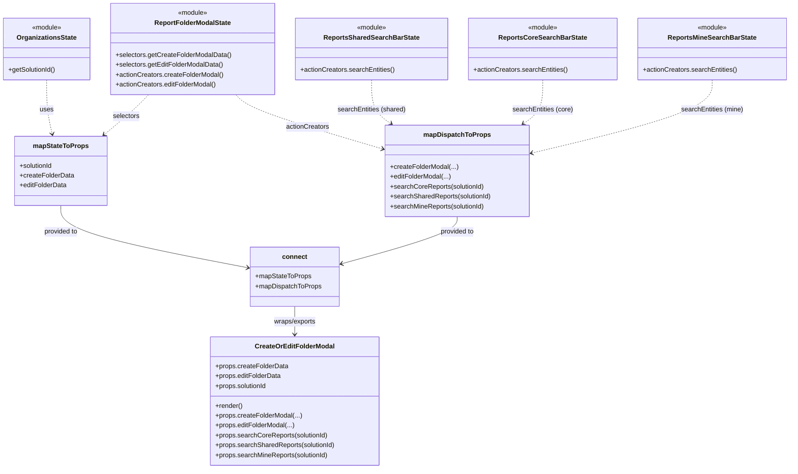

# Diagram: web/portal/src/pages/reports/bi-dashboard/components/CreateOrEditFolder.modal.container.js


> Auto-generated by Obscura crawlers

## Diagram 1



### SVG

<svg id="container" width="1895.5390625" xmlns="http://www.w3.org/2000/svg" class="classDiagram" height="1138" viewBox="0 0 1895.5390625 1138" role="graphics-document document" aria-roledescription="class"><style>#container{font-family:"trebuchet ms",verdana,arial,sans-serif;font-size:16px;fill:#333;}@keyframes edge-animation-frame{from{stroke-dashoffset:0;}}@keyframes dash{to{stroke-dashoffset:0;}}#container .edge-animation-slow{stroke-dasharray:9,5!important;stroke-dashoffset:900;animation:dash 50s linear infinite;stroke-linecap:round;}#container .edge-animation-fast{stroke-dasharray:9,5!important;stroke-dashoffset:900;animation:dash 20s linear infinite;stroke-linecap:round;}#container .error-icon{fill:#552222;}#container .error-text{fill:#552222;stroke:#552222;}#container .edge-thickness-normal{stroke-width:1px;}#container .edge-thickness-thick{stroke-width:3.5px;}#container .edge-pattern-solid{stroke-dasharray:0;}#container .edge-thickness-invisible{stroke-width:0;fill:none;}#container .edge-pattern-dashed{stroke-dasharray:3;}#container .edge-pattern-dotted{stroke-dasharray:2;}#container .marker{fill:#333333;stroke:#333333;}#container .marker.cross{stroke:#333333;}#container svg{font-family:"trebuchet ms",verdana,arial,sans-serif;font-size:16px;}#container p{margin:0;}#container g.classGroup text{fill:#9370DB;stroke:none;font-family:"trebuchet ms",verdana,arial,sans-serif;font-size:10px;}#container g.classGroup text .title{font-weight:bolder;}#container .nodeLabel,#container .edgeLabel{color:#131300;}#container .edgeLabel .label rect{fill:#ECECFF;}#container .label text{fill:#131300;}#container .labelBkg{background:#ECECFF;}#container .edgeLabel .label span{background:#ECECFF;}#container .classTitle{font-weight:bolder;}#container .node rect,#container .node circle,#container .node ellipse,#container .node polygon,#container .node path{fill:#ECECFF;stroke:#9370DB;stroke-width:1px;}#container .divider{stroke:#9370DB;stroke-width:1;}#container g.clickable{cursor:pointer;}#container g.classGroup rect{fill:#ECECFF;stroke:#9370DB;}#container g.classGroup line{stroke:#9370DB;stroke-width:1;}#container .classLabel .box{stroke:none;stroke-width:0;fill:#ECECFF;opacity:0.5;}#container .classLabel .label{fill:#9370DB;font-size:10px;}#container .relation{stroke:#333333;stroke-width:1;fill:none;}#container .dashed-line{stroke-dasharray:3;}#container .dotted-line{stroke-dasharray:1 2;}#container #compositionStart,#container .composition{fill:#333333!important;stroke:#333333!important;stroke-width:1;}#container #compositionEnd,#container .composition{fill:#333333!important;stroke:#333333!important;stroke-width:1;}#container #dependencyStart,#container .dependency{fill:#333333!important;stroke:#333333!important;stroke-width:1;}#container #dependencyStart,#container .dependency{fill:#333333!important;stroke:#333333!important;stroke-width:1;}#container #extensionStart,#container .extension{fill:transparent!important;stroke:#333333!important;stroke-width:1;}#container #extensionEnd,#container .extension{fill:transparent!important;stroke:#333333!important;stroke-width:1;}#container #aggregationStart,#container .aggregation{fill:transparent!important;stroke:#333333!important;stroke-width:1;}#container #aggregationEnd,#container .aggregation{fill:transparent!important;stroke:#333333!important;stroke-width:1;}#container #lollipopStart,#container .lollipop{fill:#ECECFF!important;stroke:#333333!important;stroke-width:1;}#container #lollipopEnd,#container .lollipop{fill:#ECECFF!important;stroke:#333333!important;stroke-width:1;}#container .edgeTerminals{font-size:11px;line-height:initial;}#container .classTitleText{text-anchor:middle;font-size:18px;fill:#333;}#container .label-icon{display:inline-block;height:1em;overflow:visible;vertical-align:-0.125em;}#container .node .label-icon path{fill:currentColor;stroke:revert;stroke-width:revert;}#container :root{--mermaid-font-family:"trebuchet ms",verdana,arial,sans-serif;}</style><g><defs><marker id="container_class-aggregationStart" class="marker aggregation class" refX="18" refY="7" markerWidth="190" markerHeight="240" orient="auto"><path d="M 18,7 L9,13 L1,7 L9,1 Z"></path></marker></defs><defs><marker id="container_class-aggregationEnd" class="marker aggregation class" refX="1" refY="7" markerWidth="20" markerHeight="28" orient="auto"><path d="M 18,7 L9,13 L1,7 L9,1 Z"></path></marker></defs><defs><marker id="container_class-extensionStart" class="marker extension class" refX="18" refY="7" markerWidth="190" markerHeight="240" orient="auto"><path d="M 1,7 L18,13 V 1 Z"></path></marker></defs><defs><marker id="container_class-extensionEnd" class="marker extension class" refX="1" refY="7" markerWidth="20" markerHeight="28" orient="auto"><path d="M 1,1 V 13 L18,7 Z"></path></marker></defs><defs><marker id="container_class-compositionStart" class="marker composition class" refX="18" refY="7" markerWidth="190" markerHeight="240" orient="auto"><path d="M 18,7 L9,13 L1,7 L9,1 Z"></path></marker></defs><defs><marker id="container_class-compositionEnd" class="marker composition class" refX="1" refY="7" markerWidth="20" markerHeight="28" orient="auto"><path d="M 18,7 L9,13 L1,7 L9,1 Z"></path></marker></defs><defs><marker id="container_class-dependencyStart" class="marker dependency class" refX="6" refY="7" markerWidth="190" markerHeight="240" orient="auto"><path d="M 5,7 L9,13 L1,7 L9,1 Z"></path></marker></defs><defs><marker id="container_class-dependencyEnd" class="marker dependency class" refX="13" refY="7" markerWidth="20" markerHeight="28" orient="auto"><path d="M 18,7 L9,13 L14,7 L9,1 Z"></path></marker></defs><defs><marker id="container_class-lollipopStart" class="marker lollipop class" refX="13" refY="7" markerWidth="190" markerHeight="240" orient="auto"><circle stroke="black" fill="transparent" cx="7" cy="7" r="6"></circle></marker></defs><defs><marker id="container_class-lollipopEnd" class="marker lollipop class" refX="1" refY="7" markerWidth="190" markerHeight="240" orient="auto"><circle stroke="black" fill="transparent" cx="7" cy="7" r="6"></circle></marker></defs><g class="root"><g class="clusters"></g><g class="edgePaths"><path d="M113.074,194L113.074,206.167C113.074,218.333,113.074,242.667,115.341,264.526C117.608,286.386,122.142,305.772,124.409,315.465L126.676,325.158" id="id_OrganizationsState_mapStateToProps_1" class="edge-thickness-normal edge-pattern-dashed relation" style=";;;" data-edge="true" data-et="edge" data-id="id_OrganizationsState_mapStateToProps_1" data-points="W3sieCI6MTEzLjA3NDIxODc1LCJ5IjoxOTR9LHsieCI6MTEzLjA3NDIxODc1LCJ5IjoyNjd9LHsieCI6MTI4LjA0MjEyNDE1NTQwNTQyLCJ5IjozMzF9XQ==" marker-end="url(#container_class-dependencyEnd)"></path><path d="M358.861,230L352.976,236.167C347.09,242.333,335.319,254.667,317.525,270.856C299.73,287.046,275.911,307.091,264.001,317.114L252.091,327.137" id="id_ReportFolderModalState_mapStateToProps_2" class="edge-thickness-normal edge-pattern-dashed relation" style=";;;" data-edge="true" data-et="edge" data-id="id_ReportFolderModalState_mapStateToProps_2" data-points="W3sieCI6MzU4Ljg2MDgzOTg0Mzc1LCJ5IjoyMzB9LHsieCI6MzIzLjU0ODgyODEyNSwieSI6MjY3fSx7IngiOjI0Ny41MDA2ODYyMzMxMDgxMywieSI6MzMxfV0=" marker-end="url(#container_class-dependencyEnd)"></path><path d="M567.23,230L572.921,236.167C578.612,242.333,589.993,254.667,648.576,276.575C707.159,298.484,812.942,329.968,865.834,345.71L918.726,361.452" id="id_ReportFolderModalState_mapDispatchToProps_3" class="edge-thickness-normal edge-pattern-dashed relation" style=";;;" data-edge="true" data-et="edge" data-id="id_ReportFolderModalState_mapDispatchToProps_3" data-points="W3sieCI6NTY3LjIzMDQ2ODc1LCJ5IjoyMzB9LHsieCI6NjAxLjM3NSwieSI6MjY3fSx7IngiOjkyNC40NzY1NjI1LCJ5IjozNjMuMTYzMjAzNzQ1NDUzN31d" marker-end="url(#container_class-dependencyEnd)"></path><path d="M893.703,194L893.703,206.167C893.703,218.333,893.703,242.667,901.432,260.415C909.16,278.162,924.617,289.325,932.346,294.906L940.074,300.487" id="id_ReportsSharedSearchBarState_mapDispatchToProps_4" class="edge-thickness-normal edge-pattern-dashed relation" style=";;;" data-edge="true" data-et="edge" data-id="id_ReportsSharedSearchBarState_mapDispatchToProps_4" data-points="W3sieCI6ODkzLjcwMzEyNSwieSI6MTk0fSx7IngiOjg5My43MDMxMjUsInkiOjI2N30seyJ4Ijo5NDQuOTM4NDc2NTYyNSwieSI6MzA0fV0=" marker-end="url(#container_class-dependencyEnd)"></path><path d="M1303.586,194L1303.586,206.167C1303.586,218.333,1303.586,242.667,1295.857,260.415C1288.129,278.162,1272.672,289.325,1264.943,294.906L1257.215,300.487" id="id_ReportsCoreSearchBarState_mapDispatchToProps_5" class="edge-thickness-normal edge-pattern-dashed relation" style=";;;" data-edge="true" data-et="edge" data-id="id_ReportsCoreSearchBarState_mapDispatchToProps_5" data-points="W3sieCI6MTMwMy41ODU5Mzc1LCJ5IjoxOTR9LHsieCI6MTMwMy41ODU5Mzc1LCJ5IjoyNjd9LHsieCI6MTI1Mi4zNTA1ODU5Mzc1LCJ5IjozMDR9XQ==" marker-end="url(#container_class-dependencyEnd)"></path><path d="M1709.375,194L1709.375,206.167C1709.375,218.333,1709.375,242.667,1637.586,272.23C1565.798,301.793,1422.221,336.587,1350.432,353.984L1278.644,371.38" id="id_ReportsMineSearchBarState_mapDispatchToProps_6" class="edge-thickness-normal edge-pattern-dashed relation" style=";;;" data-edge="true" data-et="edge" data-id="id_ReportsMineSearchBarState_mapDispatchToProps_6" data-points="W3sieCI6MTcwOS4zNzUsInkiOjE5NH0seyJ4IjoxNzA5LjM3NSwieSI6MjY3fSx7IngiOjEyNzIuODEyNSwieSI6MzcyLjc5MzM5NTQ2MDA5ODR9XQ==" marker-end="url(#container_class-dependencyEnd)"></path><path d="M147.688,499L147.688,509.667C147.688,520.333,147.688,541.667,222.359,566.851C297.031,592.035,446.374,621.071,521.046,635.588L595.718,650.106" id="id_mapStateToProps_connect_7" class="edge-thickness-normal edge-pattern-solid relation" style=";;;" data-edge="true" data-et="edge" data-id="id_mapStateToProps_connect_7" data-points="W3sieCI6MTQ3LjY4NzUsInkiOjQ5OX0seyJ4IjoxNDcuNjg3NSwieSI6NTYzfSx7IngiOjYwMS42MDc0MjE4NzUsInkiOjY1MS4yNTEwMDU5MjU4MTc2fV0=" marker-end="url(#container_class-dependencyEnd)"></path><path d="M1098.645,526L1098.645,532.167C1098.645,538.333,1098.645,550.667,1052.342,569.764C1006.04,588.861,913.436,614.722,867.134,627.652L820.832,640.583" id="id_mapDispatchToProps_connect_8" class="edge-thickness-normal edge-pattern-solid relation" style=";;;" data-edge="true" data-et="edge" data-id="id_mapDispatchToProps_connect_8" data-points="W3sieCI6MTA5OC42NDQ1MzEyNSwieSI6NTI2fSx7IngiOjEwOTguNjQ0NTMxMjUsInkiOjU2M30seyJ4Ijo4MTUuMDUyNzM0Mzc1LCJ5Ijo2NDIuMTk2NDE2MTUwODM5OX1d" marker-end="url(#container_class-dependencyEnd)"></path><path d="M708.33,744L708.33,750.167C708.33,756.333,708.33,768.667,708.33,780C708.33,791.333,708.33,801.667,708.33,806.833L708.33,812" id="id_connect_CreateOrEditFolderModal_9" class="edge-thickness-normal edge-pattern-solid relation" style=";;;" data-edge="true" data-et="edge" data-id="id_connect_CreateOrEditFolderModal_9" data-points="W3sieCI6NzA4LjMzMDA3ODEyNSwieSI6NzQ0fSx7IngiOjcwOC4zMzAwNzgxMjUsInkiOjc4MX0seyJ4Ijo3MDguMzMwMDc4MTI1LCJ5Ijo4MTh9XQ==" marker-end="url(#container_class-dependencyEnd)"></path></g><g class="edgeLabels"><g class="edgeLabel" transform="translate(113.07421875, 267)"><g class="label" data-id="id_OrganizationsState_mapStateToProps_1" transform="translate(-16.4921875, -12)"><foreignObject width="32.984375" height="24"><div xmlns="http://www.w3.org/1999/xhtml" class="labelBkg" style="display: table-cell; white-space: nowrap; line-height: 1.5; max-width: 200px; text-align: center;"><span class="edgeLabel"><p>uses</p></span></div></foreignObject></g></g><g class="edgeLabel" transform="translate(305.09106, 282.53354)"><g class="label" data-id="id_ReportFolderModalState_mapStateToProps_2" transform="translate(-32.734375, -12)"><foreignObject width="65.46875" height="24"><div xmlns="http://www.w3.org/1999/xhtml" class="labelBkg" style="display: table-cell; white-space: nowrap; line-height: 1.5; max-width: 200px; text-align: center;"><span class="edgeLabel"><p>selectors</p></span></div></foreignObject></g></g><g class="edgeLabel" transform="translate(738.79809, 307.90059)"><g class="label" data-id="id_ReportFolderModalState_mapDispatchToProps_3" transform="translate(-52.671875, -12)"><foreignObject width="105.34375" height="24"><div xmlns="http://www.w3.org/1999/xhtml" class="labelBkg" style="display: table-cell; white-space: nowrap; line-height: 1.5; max-width: 200px; text-align: center;"><span class="edgeLabel"><p>actionCreators</p></span></div></foreignObject></g></g><g class="edgeLabel" transform="translate(893.703125, 267)"><g class="label" data-id="id_ReportsSharedSearchBarState_mapDispatchToProps_4" transform="translate(-83.078125, -12)"><foreignObject width="166.15625" height="24"><div xmlns="http://www.w3.org/1999/xhtml" class="labelBkg" style="display: table-cell; white-space: nowrap; line-height: 1.5; max-width: 200px; text-align: center;"><span class="edgeLabel"><p>searchEntities (shared)</p></span></div></foreignObject></g></g><g class="edgeLabel" transform="translate(1303.5859375, 267)"><g class="label" data-id="id_ReportsCoreSearchBarState_mapDispatchToProps_5" transform="translate(-73.8515625, -12)"><foreignObject width="147.703125" height="24"><div xmlns="http://www.w3.org/1999/xhtml" class="labelBkg" style="display: table-cell; white-space: nowrap; line-height: 1.5; max-width: 200px; text-align: center;"><span class="edgeLabel"><p>searchEntities (core)</p></span></div></foreignObject></g></g><g class="edgeLabel" transform="translate(1709.375, 267)"><g class="label" data-id="id_ReportsMineSearchBarState_mapDispatchToProps_6" transform="translate(-76.46875, -12)"><foreignObject width="152.9375" height="24"><div xmlns="http://www.w3.org/1999/xhtml" class="labelBkg" style="display: table-cell; white-space: nowrap; line-height: 1.5; max-width: 200px; text-align: center;"><span class="edgeLabel"><p>searchEntities (mine)</p></span></div></foreignObject></g></g><g class="edgeLabel" transform="translate(147.6875, 563)"><g class="label" data-id="id_mapStateToProps_connect_7" transform="translate(-41.921875, -12)"><foreignObject width="83.84375" height="24"><div xmlns="http://www.w3.org/1999/xhtml" class="labelBkg" style="display: table-cell; white-space: nowrap; line-height: 1.5; max-width: 200px; text-align: center;"><span class="edgeLabel"><p>provided to</p></span></div></foreignObject></g></g><g class="edgeLabel" transform="translate(1098.64453125, 563)"><g class="label" data-id="id_mapDispatchToProps_connect_8" transform="translate(-41.921875, -12)"><foreignObject width="83.84375" height="24"><div xmlns="http://www.w3.org/1999/xhtml" class="labelBkg" style="display: table-cell; white-space: nowrap; line-height: 1.5; max-width: 200px; text-align: center;"><span class="edgeLabel"><p>provided to</p></span></div></foreignObject></g></g><g class="edgeLabel" transform="translate(708.330078125, 781)"><g class="label" data-id="id_connect_CreateOrEditFolderModal_9" transform="translate(-52.453125, -12)"><foreignObject width="104.90625" height="24"><div xmlns="http://www.w3.org/1999/xhtml" class="labelBkg" style="display: table-cell; white-space: nowrap; line-height: 1.5; max-width: 200px; text-align: center;"><span class="edgeLabel"><p>wraps/exports</p></span></div></foreignObject></g></g></g><g class="nodes"><g class="node default" id="classId-CreateOrEditFolderModal-0" transform="translate(708.330078125, 974)"><g class="basic label-container"><path d="M-204.265625 -156 L204.265625 -156 L204.265625 156 L-204.265625 156" stroke="none" stroke-width="0" fill="#ECECFF" style=""></path><path d="M-204.265625 -156 C-79.54166375508018 -156, 45.18229748983964 -156, 204.265625 -156 M-204.265625 -156 C-80.9084863681823 -156, 42.44865226363541 -156, 204.265625 -156 M204.265625 -156 C204.265625 -79.23180144070918, 204.265625 -2.4636028814183533, 204.265625 156 M204.265625 -156 C204.265625 -72.36929628216456, 204.265625 11.26140743567089, 204.265625 156 M204.265625 156 C59.789972034033156 156, -84.68568093193369 156, -204.265625 156 M204.265625 156 C109.84701281745765 156, 15.428400634915306 156, -204.265625 156 M-204.265625 156 C-204.265625 55.06188523747299, -204.265625 -45.876229525054015, -204.265625 -156 M-204.265625 156 C-204.265625 78.69076994522239, -204.265625 1.3815398904447704, -204.265625 -156" stroke="#9370DB" stroke-width="1.3" fill="none" stroke-dasharray="0 0" style=""></path></g><g class="annotation-group text" transform="translate(0, -132)"></g><g class="label-group text" transform="translate(-91.96875, -132)"><g class="label" style="font-weight: bolder" transform="translate(0,-12)"><foreignObject width="183.9375" height="24"><div xmlns="http://www.w3.org/1999/xhtml" style="display: table-cell; white-space: nowrap; line-height: 1.5; max-width: 232px; text-align: center;"><span class="nodeLabel markdown-node-label" style=""><p>CreateOrEditFolderModal</p></span></div></foreignObject></g></g><g class="members-group text" transform="translate(-192.265625, -84)"><g class="label" style="" transform="translate(0,-12)"><foreignObject width="176.984375" height="24"><div xmlns="http://www.w3.org/1999/xhtml" style="display: table-cell; white-space: nowrap; line-height: 1.5; max-width: 234px; text-align: center;"><span class="nodeLabel markdown-node-label" style=""><p>+props.createFolderData</p></span></div></foreignObject></g><g class="label" style="" transform="translate(0,12)"><foreignObject width="160.703125" height="24"><div xmlns="http://www.w3.org/1999/xhtml" style="display: table-cell; white-space: nowrap; line-height: 1.5; max-width: 218px; text-align: center;"><span class="nodeLabel markdown-node-label" style=""><p>+props.editFolderData</p></span></div></foreignObject></g><g class="label" style="" transform="translate(0,36)"><foreignObject width="127.53125" height="24"><div xmlns="http://www.w3.org/1999/xhtml" style="display: table-cell; white-space: nowrap; line-height: 1.5; max-width: 185px; text-align: center;"><span class="nodeLabel markdown-node-label" style=""><p>+props.solutionId</p></span></div></foreignObject></g></g><g class="methods-group text" transform="translate(-192.265625, 12)"><g class="label" style="" transform="translate(0,-12)"><foreignObject width="66.609375" height="24"><div xmlns="http://www.w3.org/1999/xhtml" style="display: table-cell; white-space: nowrap; line-height: 1.5; max-width: 124px; text-align: center;"><span class="nodeLabel markdown-node-label" style=""><p>+render()</p></span></div></foreignObject></g><g class="label" style="" transform="translate(0,12)"><foreignObject width="210.25" height="24"><div xmlns="http://www.w3.org/1999/xhtml" style="display: table-cell; white-space: nowrap; line-height: 1.5; max-width: 268px; text-align: center;"><span class="nodeLabel markdown-node-label" style=""><p>+props.createFolderModal(...)</p></span></div></foreignObject></g><g class="label" style="" transform="translate(0,36)"><foreignObject width="193.953125" height="24"><div xmlns="http://www.w3.org/1999/xhtml" style="display: table-cell; white-space: nowrap; line-height: 1.5; max-width: 251px; text-align: center;"><span class="nodeLabel markdown-node-label" style=""><p>+props.editFolderModal(...)</p></span></div></foreignObject></g><g class="label" style="" transform="translate(0,60)"><foreignObject width="274.1875" height="24"><div xmlns="http://www.w3.org/1999/xhtml" style="display: table-cell; white-space: nowrap; line-height: 1.5; max-width: 332px; text-align: center;"><span class="nodeLabel markdown-node-label" style=""><p>+props.searchCoreReports(solutionId)</p></span></div></foreignObject></g><g class="label" style="" transform="translate(0,84)"><foreignObject width="292.5625" height="24"><div xmlns="http://www.w3.org/1999/xhtml" style="display: table-cell; white-space: nowrap; line-height: 1.5; max-width: 350px; text-align: center;"><span class="nodeLabel markdown-node-label" style=""><p>+props.searchSharedReports(solutionId)</p></span></div></foreignObject></g><g class="label" style="" transform="translate(0,108)"><foreignObject width="276.84375" height="24"><div xmlns="http://www.w3.org/1999/xhtml" style="display: table-cell; white-space: nowrap; line-height: 1.5; max-width: 334px; text-align: center;"><span class="nodeLabel markdown-node-label" style=""><p>+props.searchMineReports(solutionId)</p></span></div></foreignObject></g></g><g class="divider" style=""><path d="M-204.265625 -108 C-48.79670165755246 -108, 106.67222168489508 -108, 204.265625 -108 M-204.265625 -108 C-98.50567383420652 -108, 7.254277331586962 -108, 204.265625 -108" stroke="#9370DB" stroke-width="1.3" fill="none" stroke-dasharray="0 0" style=""></path></g><g class="divider" style=""><path d="M-204.265625 -12 C-56.76393848163801 -12, 90.73774803672399 -12, 204.265625 -12 M-204.265625 -12 C-78.72478651688648 -12, 46.816051966227036 -12, 204.265625 -12" stroke="#9370DB" stroke-width="1.3" fill="none" stroke-dasharray="0 0" style=""></path></g></g><g class="node default" id="classId-connect-1" transform="translate(708.330078125, 672)"><g class="basic label-container"><path d="M-106.72265625 -72 L106.72265625 -72 L106.72265625 72 L-106.72265625 72" stroke="none" stroke-width="0" fill="#ECECFF" style=""></path><path d="M-106.72265625 -72 C-25.18684606249778 -72, 56.34896412500444 -72, 106.72265625 -72 M-106.72265625 -72 C-50.27855484366355 -72, 6.165546562672901 -72, 106.72265625 -72 M106.72265625 -72 C106.72265625 -35.35280897799093, 106.72265625 1.2943820440181355, 106.72265625 72 M106.72265625 -72 C106.72265625 -19.21040620373175, 106.72265625 33.5791875925365, 106.72265625 72 M106.72265625 72 C62.704034950324186 72, 18.68541365064837 72, -106.72265625 72 M106.72265625 72 C63.86167907581821 72, 21.00070190163642 72, -106.72265625 72 M-106.72265625 72 C-106.72265625 40.939302502734506, -106.72265625 9.878605005469005, -106.72265625 -72 M-106.72265625 72 C-106.72265625 27.485221106376514, -106.72265625 -17.029557787246972, -106.72265625 -72" stroke="#9370DB" stroke-width="1.3" fill="none" stroke-dasharray="0 0" style=""></path></g><g class="annotation-group text" transform="translate(0, -48)"></g><g class="label-group text" transform="translate(-28.9140625, -48)"><g class="label" style="font-weight: bolder" transform="translate(0,-12)"><foreignObject width="57.828125" height="24"><div xmlns="http://www.w3.org/1999/xhtml" style="display: table-cell; white-space: nowrap; line-height: 1.5; max-width: 108px; text-align: center;"><span class="nodeLabel markdown-node-label" style=""><p>connect</p></span></div></foreignObject></g></g><g class="members-group text" transform="translate(-94.72265625, 0)"><g class="label" style="" transform="translate(0,-12)"><foreignObject width="134.984375" height="24"><div xmlns="http://www.w3.org/1999/xhtml" style="display: table-cell; white-space: nowrap; line-height: 1.5; max-width: 192px; text-align: center;"><span class="nodeLabel markdown-node-label" style=""><p>+mapStateToProps</p></span></div></foreignObject></g><g class="label" style="" transform="translate(0,12)"><foreignObject width="160.53125" height="24"><div xmlns="http://www.w3.org/1999/xhtml" style="display: table-cell; white-space: nowrap; line-height: 1.5; max-width: 218px; text-align: center;"><span class="nodeLabel markdown-node-label" style=""><p>+mapDispatchToProps</p></span></div></foreignObject></g></g><g class="methods-group text" transform="translate(-94.72265625, 72)"></g><g class="divider" style=""><path d="M-106.72265625 -24 C-36.31157984772402 -24, 34.09949655455196 -24, 106.72265625 -24 M-106.72265625 -24 C-50.91168759451877 -24, 4.8992810609624655 -24, 106.72265625 -24" stroke="#9370DB" stroke-width="1.3" fill="none" stroke-dasharray="0 0" style=""></path></g><g class="divider" style=""><path d="M-106.72265625 48 C-36.728840655047804 48, 33.26497493990439 48, 106.72265625 48 M-106.72265625 48 C-57.26445692919707 48, -7.806257608394134 48, 106.72265625 48" stroke="#9370DB" stroke-width="1.3" fill="none" stroke-dasharray="0 0" style=""></path></g></g><g class="node default" id="classId-mapStateToProps-2" transform="translate(147.6875, 415)"><g class="basic label-container"><path d="M-110.24609375 -84 L110.24609375 -84 L110.24609375 84 L-110.24609375 84" stroke="none" stroke-width="0" fill="#ECECFF" style=""></path><path d="M-110.24609375 -84 C-28.360340373916117 -84, 53.52541300216777 -84, 110.24609375 -84 M-110.24609375 -84 C-42.216909180144114 -84, 25.812275389711772 -84, 110.24609375 -84 M110.24609375 -84 C110.24609375 -35.08948942767408, 110.24609375 13.821021144651837, 110.24609375 84 M110.24609375 -84 C110.24609375 -21.595447029995455, 110.24609375 40.80910594000909, 110.24609375 84 M110.24609375 84 C53.796553289054856 84, -2.652987171890288 84, -110.24609375 84 M110.24609375 84 C62.28205004676359 84, 14.318006343527173 84, -110.24609375 84 M-110.24609375 84 C-110.24609375 34.07846017260348, -110.24609375 -15.843079654793044, -110.24609375 -84 M-110.24609375 84 C-110.24609375 47.024829199729034, -110.24609375 10.049658399458067, -110.24609375 -84" stroke="#9370DB" stroke-width="1.3" fill="none" stroke-dasharray="0 0" style=""></path></g><g class="annotation-group text" transform="translate(0, -60)"></g><g class="label-group text" transform="translate(-64.7109375, -60)"><g class="label" style="font-weight: bolder" transform="translate(0,-12)"><foreignObject width="129.421875" height="24"><div xmlns="http://www.w3.org/1999/xhtml" style="display: table-cell; white-space: nowrap; line-height: 1.5; max-width: 177px; text-align: center;"><span class="nodeLabel markdown-node-label" style=""><p>mapStateToProps</p></span></div></foreignObject></g></g><g class="members-group text" transform="translate(-98.24609375, -12)"><g class="label" style="" transform="translate(0,-12)"><foreignObject width="82.109375" height="24"><div xmlns="http://www.w3.org/1999/xhtml" style="display: table-cell; white-space: nowrap; line-height: 1.5; max-width: 139px; text-align: center;"><span class="nodeLabel markdown-node-label" style=""><p>+solutionId</p></span></div></foreignObject></g><g class="label" style="" transform="translate(0,12)"><foreignObject width="131.78125" height="24"><div xmlns="http://www.w3.org/1999/xhtml" style="display: table-cell; white-space: nowrap; line-height: 1.5; max-width: 189px; text-align: center;"><span class="nodeLabel markdown-node-label" style=""><p>+createFolderData</p></span></div></foreignObject></g><g class="label" style="" transform="translate(0,36)"><foreignObject width="115.5" height="24"><div xmlns="http://www.w3.org/1999/xhtml" style="display: table-cell; white-space: nowrap; line-height: 1.5; max-width: 173px; text-align: center;"><span class="nodeLabel markdown-node-label" style=""><p>+editFolderData</p></span></div></foreignObject></g></g><g class="methods-group text" transform="translate(-98.24609375, 84)"></g><g class="divider" style=""><path d="M-110.24609375 -36 C-62.90239255472509 -36, -15.55869135945018 -36, 110.24609375 -36 M-110.24609375 -36 C-32.27886749055827 -36, 45.68835876888346 -36, 110.24609375 -36" stroke="#9370DB" stroke-width="1.3" fill="none" stroke-dasharray="0 0" style=""></path></g><g class="divider" style=""><path d="M-110.24609375 60 C-59.6721128701295 60, -9.098131990259006 60, 110.24609375 60 M-110.24609375 60 C-42.384623222072136 60, 25.476847305855728 60, 110.24609375 60" stroke="#9370DB" stroke-width="1.3" fill="none" stroke-dasharray="0 0" style=""></path></g></g><g class="node default" id="classId-mapDispatchToProps-3" transform="translate(1098.64453125, 415)"><g class="basic label-container"><path d="M-174.16796875 -111 L174.16796875 -111 L174.16796875 111 L-174.16796875 111" stroke="none" stroke-width="0" fill="#ECECFF" style=""></path><path d="M-174.16796875 -111 C-103.98287954782913 -111, -33.79779034565826 -111, 174.16796875 -111 M-174.16796875 -111 C-51.22274878284176 -111, 71.72247118431648 -111, 174.16796875 -111 M174.16796875 -111 C174.16796875 -50.15196635970855, 174.16796875 10.696067280582895, 174.16796875 111 M174.16796875 -111 C174.16796875 -44.748717015167, 174.16796875 21.502565969665994, 174.16796875 111 M174.16796875 111 C60.0410307641867 111, -54.0859072216266 111, -174.16796875 111 M174.16796875 111 C36.22673424692243 111, -101.71450025615513 111, -174.16796875 111 M-174.16796875 111 C-174.16796875 60.566432340624296, -174.16796875 10.132864681248591, -174.16796875 -111 M-174.16796875 111 C-174.16796875 60.31166742178487, -174.16796875 9.623334843569737, -174.16796875 -111" stroke="#9370DB" stroke-width="1.3" fill="none" stroke-dasharray="0 0" style=""></path></g><g class="annotation-group text" transform="translate(0, -87)"></g><g class="label-group text" transform="translate(-77.1953125, -87)"><g class="label" style="font-weight: bolder" transform="translate(0,-12)"><foreignObject width="154.390625" height="24"><div xmlns="http://www.w3.org/1999/xhtml" style="display: table-cell; white-space: nowrap; line-height: 1.5; max-width: 203px; text-align: center;"><span class="nodeLabel markdown-node-label" style=""><p>mapDispatchToProps</p></span></div></foreignObject></g></g><g class="members-group text" transform="translate(-162.16796875, -39)"></g><g class="methods-group text" transform="translate(-162.16796875, -9)"><g class="label" style="" transform="translate(0,-12)"><foreignObject width="165.046875" height="24"><div xmlns="http://www.w3.org/1999/xhtml" style="display: table-cell; white-space: nowrap; line-height: 1.5; max-width: 222px; text-align: center;"><span class="nodeLabel markdown-node-label" style=""><p>+createFolderModal(...)</p></span></div></foreignObject></g><g class="label" style="" transform="translate(0,12)"><foreignObject width="148.765625" height="24"><div xmlns="http://www.w3.org/1999/xhtml" style="display: table-cell; white-space: nowrap; line-height: 1.5; max-width: 206px; text-align: center;"><span class="nodeLabel markdown-node-label" style=""><p>+editFolderModal(...)</p></span></div></foreignObject></g><g class="label" style="" transform="translate(0,36)"><foreignObject width="228.765625" height="24"><div xmlns="http://www.w3.org/1999/xhtml" style="display: table-cell; white-space: nowrap; line-height: 1.5; max-width: 286px; text-align: center;"><span class="nodeLabel markdown-node-label" style=""><p>+searchCoreReports(solutionId)</p></span></div></foreignObject></g><g class="label" style="" transform="translate(0,60)"><foreignObject width="247.140625" height="24"><div xmlns="http://www.w3.org/1999/xhtml" style="display: table-cell; white-space: nowrap; line-height: 1.5; max-width: 305px; text-align: center;"><span class="nodeLabel markdown-node-label" style=""><p>+searchSharedReports(solutionId)</p></span></div></foreignObject></g><g class="label" style="" transform="translate(0,84)"><foreignObject width="231.421875" height="24"><div xmlns="http://www.w3.org/1999/xhtml" style="display: table-cell; white-space: nowrap; line-height: 1.5; max-width: 289px; text-align: center;"><span class="nodeLabel markdown-node-label" style=""><p>+searchMineReports(solutionId)</p></span></div></foreignObject></g></g><g class="divider" style=""><path d="M-174.16796875 -63 C-77.05058887434986 -63, 20.066791001300288 -63, 174.16796875 -63 M-174.16796875 -63 C-85.6700926829652 -63, 2.8277833840695905 -63, 174.16796875 -63" stroke="#9370DB" stroke-width="1.3" fill="none" stroke-dasharray="0 0" style=""></path></g><g class="divider" style=""><path d="M-174.16796875 -39 C-98.51240354954427 -39, -22.856838349088548 -39, 174.16796875 -39 M-174.16796875 -39 C-88.75351805023833 -39, -3.339067350476654 -39, 174.16796875 -39" stroke="#9370DB" stroke-width="1.3" fill="none" stroke-dasharray="0 0" style=""></path></g></g><g class="node default" id="classId-ReportFolderModalState-4" transform="translate(464.796875, 119)"><g class="basic label-container"><path d="M-196.6484375 -111 L196.6484375 -111 L196.6484375 111 L-196.6484375 111" stroke="none" stroke-width="0" fill="#ECECFF" style=""></path><path d="M-196.6484375 -111 C-103.47275555193588 -111, -10.297073603871752 -111, 196.6484375 -111 M-196.6484375 -111 C-70.65053457644999 -111, 55.34736834710003 -111, 196.6484375 -111 M196.6484375 -111 C196.6484375 -39.21456310639536, 196.6484375 32.57087378720928, 196.6484375 111 M196.6484375 -111 C196.6484375 -58.96427383831512, 196.6484375 -6.928547676630245, 196.6484375 111 M196.6484375 111 C61.64056252187663 111, -73.36731245624674 111, -196.6484375 111 M196.6484375 111 C72.1536651973977 111, -52.3411071052046 111, -196.6484375 111 M-196.6484375 111 C-196.6484375 44.46518558046154, -196.6484375 -22.069628839076927, -196.6484375 -111 M-196.6484375 111 C-196.6484375 42.615453472477284, -196.6484375 -25.76909305504543, -196.6484375 -111" stroke="#9370DB" stroke-width="1.3" fill="none" stroke-dasharray="0 0" style=""></path></g><g class="annotation-group text" transform="translate(-36.6015625, -87)"><g class="label" style="" transform="translate(0,-12)"><foreignObject width="73.203125" height="24"><div xmlns="http://www.w3.org/1999/xhtml" style="display: table-cell; white-space: nowrap; line-height: 1.5; max-width: 123px; text-align: center;"><span class="nodeLabel markdown-node-label" style=""><p>«module»</p></span></div></foreignObject></g></g><g class="label-group text" transform="translate(-89.78125, -63)"><g class="label" style="font-weight: bolder" transform="translate(0,-12)"><foreignObject width="179.5625" height="24"><div xmlns="http://www.w3.org/1999/xhtml" style="display: table-cell; white-space: nowrap; line-height: 1.5; max-width: 227px; text-align: center;"><span class="nodeLabel markdown-node-label" style=""><p>ReportFolderModalState</p></span></div></foreignObject></g></g><g class="members-group text" transform="translate(-184.6484375, -15)"></g><g class="methods-group text" transform="translate(-184.6484375, 15)"><g class="label" style="" transform="translate(0,-12)"><foreignObject width="279.515625" height="24"><div xmlns="http://www.w3.org/1999/xhtml" style="display: table-cell; white-space: nowrap; line-height: 1.5; max-width: 337px; text-align: center;"><span class="nodeLabel markdown-node-label" style=""><p>+selectors.getCreateFolderModalData()</p></span></div></foreignObject></g><g class="label" style="" transform="translate(0,12)"><foreignObject width="261.671875" height="24"><div xmlns="http://www.w3.org/1999/xhtml" style="display: table-cell; white-space: nowrap; line-height: 1.5; max-width: 319px; text-align: center;"><span class="nodeLabel markdown-node-label" style=""><p>+selectors.getEditFolderModalData()</p></span></div></foreignObject></g><g class="label" style="" transform="translate(0,36)"><foreignObject width="262.296875" height="24"><div xmlns="http://www.w3.org/1999/xhtml" style="display: table-cell; white-space: nowrap; line-height: 1.5; max-width: 320px; text-align: center;"><span class="nodeLabel markdown-node-label" style=""><p>+actionCreators.createFolderModal()</p></span></div></foreignObject></g><g class="label" style="" transform="translate(0,60)"><foreignObject width="246.015625" height="24"><div xmlns="http://www.w3.org/1999/xhtml" style="display: table-cell; white-space: nowrap; line-height: 1.5; max-width: 303px; text-align: center;"><span class="nodeLabel markdown-node-label" style=""><p>+actionCreators.editFolderModal()</p></span></div></foreignObject></g></g><g class="divider" style=""><path d="M-196.6484375 -39 C-75.62936053018835 -39, 45.3897164396233 -39, 196.6484375 -39 M-196.6484375 -39 C-79.09599838524325 -39, 38.4564407295135 -39, 196.6484375 -39" stroke="#9370DB" stroke-width="1.3" fill="none" stroke-dasharray="0 0" style=""></path></g><g class="divider" style=""><path d="M-196.6484375 -15 C-52.96004913654272 -15, 90.72833922691456 -15, 196.6484375 -15 M-196.6484375 -15 C-61.85965742733714 -15, 72.92912264532572 -15, 196.6484375 -15" stroke="#9370DB" stroke-width="1.3" fill="none" stroke-dasharray="0 0" style=""></path></g></g><g class="node default" id="classId-ReportsSharedSearchBarState-5" transform="translate(893.703125, 119)"><g class="basic label-container"><path d="M-182.2578125 -75 L182.2578125 -75 L182.2578125 75 L-182.2578125 75" stroke="none" stroke-width="0" fill="#ECECFF" style=""></path><path d="M-182.2578125 -75 C-96.99054237534341 -75, -11.723272250686819 -75, 182.2578125 -75 M-182.2578125 -75 C-80.3978895411606 -75, 21.46203341767881 -75, 182.2578125 -75 M182.2578125 -75 C182.2578125 -41.94649660982849, 182.2578125 -8.892993219656987, 182.2578125 75 M182.2578125 -75 C182.2578125 -34.804996718466086, 182.2578125 5.390006563067828, 182.2578125 75 M182.2578125 75 C92.37352512805379 75, 2.4892377561075705 75, -182.2578125 75 M182.2578125 75 C55.006381746836325 75, -72.24504900632735 75, -182.2578125 75 M-182.2578125 75 C-182.2578125 29.43421915884364, -182.2578125 -16.13156168231272, -182.2578125 -75 M-182.2578125 75 C-182.2578125 29.534435656883396, -182.2578125 -15.931128686233208, -182.2578125 -75" stroke="#9370DB" stroke-width="1.3" fill="none" stroke-dasharray="0 0" style=""></path></g><g class="annotation-group text" transform="translate(-36.6015625, -51)"><g class="label" style="" transform="translate(0,-12)"><foreignObject width="73.203125" height="24"><div xmlns="http://www.w3.org/1999/xhtml" style="display: table-cell; white-space: nowrap; line-height: 1.5; max-width: 123px; text-align: center;"><span class="nodeLabel markdown-node-label" style=""><p>«module»</p></span></div></foreignObject></g></g><g class="label-group text" transform="translate(-111.15625, -27)"><g class="label" style="font-weight: bolder" transform="translate(0,-12)"><foreignObject width="222.3125" height="24"><div xmlns="http://www.w3.org/1999/xhtml" style="display: table-cell; white-space: nowrap; line-height: 1.5; max-width: 268px; text-align: center;"><span class="nodeLabel markdown-node-label" style=""><p>ReportsSharedSearchBarState</p></span></div></foreignObject></g></g><g class="members-group text" transform="translate(-170.2578125, 21)"></g><g class="methods-group text" transform="translate(-170.2578125, 51)"><g class="label" style="" transform="translate(0,-12)"><foreignObject width="229.359375" height="24"><div xmlns="http://www.w3.org/1999/xhtml" style="display: table-cell; white-space: nowrap; line-height: 1.5; max-width: 287px; text-align: center;"><span class="nodeLabel markdown-node-label" style=""><p>+actionCreators.searchEntities()</p></span></div></foreignObject></g></g><g class="divider" style=""><path d="M-182.2578125 -3 C-89.08555722691177 -3, 4.086698046176451 -3, 182.2578125 -3 M-182.2578125 -3 C-40.45690994329945 -3, 101.3439926134011 -3, 182.2578125 -3" stroke="#9370DB" stroke-width="1.3" fill="none" stroke-dasharray="0 0" style=""></path></g><g class="divider" style=""><path d="M-182.2578125 21 C-96.58545081266935 21, -10.9130891253387 21, 182.2578125 21 M-182.2578125 21 C-38.39229483721067 21, 105.47322282557866 21, 182.2578125 21" stroke="#9370DB" stroke-width="1.3" fill="none" stroke-dasharray="0 0" style=""></path></g></g><g class="node default" id="classId-ReportsCoreSearchBarState-6" transform="translate(1303.5859375, 119)"><g class="basic label-container"><path d="M-177.625 -75 L177.625 -75 L177.625 75 L-177.625 75" stroke="none" stroke-width="0" fill="#ECECFF" style=""></path><path d="M-177.625 -75 C-47.44277976424806 -75, 82.73944047150388 -75, 177.625 -75 M-177.625 -75 C-79.21242718444901 -75, 19.200145631101975 -75, 177.625 -75 M177.625 -75 C177.625 -31.248761162578795, 177.625 12.50247767484241, 177.625 75 M177.625 -75 C177.625 -19.50929949257472, 177.625 35.98140101485056, 177.625 75 M177.625 75 C66.56131246455423 75, -44.50237507089153 75, -177.625 75 M177.625 75 C46.227612783884666 75, -85.16977443223067 75, -177.625 75 M-177.625 75 C-177.625 42.88149663349551, -177.625 10.762993266991018, -177.625 -75 M-177.625 75 C-177.625 26.616524927646708, -177.625 -21.766950144706584, -177.625 -75" stroke="#9370DB" stroke-width="1.3" fill="none" stroke-dasharray="0 0" style=""></path></g><g class="annotation-group text" transform="translate(-36.6015625, -51)"><g class="label" style="" transform="translate(0,-12)"><foreignObject width="73.203125" height="24"><div xmlns="http://www.w3.org/1999/xhtml" style="display: table-cell; white-space: nowrap; line-height: 1.5; max-width: 123px; text-align: center;"><span class="nodeLabel markdown-node-label" style=""><p>«module»</p></span></div></foreignObject></g></g><g class="label-group text" transform="translate(-101.890625, -27)"><g class="label" style="font-weight: bolder" transform="translate(0,-12)"><foreignObject width="203.78125" height="24"><div xmlns="http://www.w3.org/1999/xhtml" style="display: table-cell; white-space: nowrap; line-height: 1.5; max-width: 250px; text-align: center;"><span class="nodeLabel markdown-node-label" style=""><p>ReportsCoreSearchBarState</p></span></div></foreignObject></g></g><g class="members-group text" transform="translate(-165.625, 21)"></g><g class="methods-group text" transform="translate(-165.625, 51)"><g class="label" style="" transform="translate(0,-12)"><foreignObject width="229.359375" height="24"><div xmlns="http://www.w3.org/1999/xhtml" style="display: table-cell; white-space: nowrap; line-height: 1.5; max-width: 287px; text-align: center;"><span class="nodeLabel markdown-node-label" style=""><p>+actionCreators.searchEntities()</p></span></div></foreignObject></g></g><g class="divider" style=""><path d="M-177.625 -3 C-84.04410813880796 -3, 9.536783722384087 -3, 177.625 -3 M-177.625 -3 C-97.54254704413626 -3, -17.460094088272513 -3, 177.625 -3" stroke="#9370DB" stroke-width="1.3" fill="none" stroke-dasharray="0 0" style=""></path></g><g class="divider" style=""><path d="M-177.625 21 C-40.18033282048398 21, 97.26433435903203 21, 177.625 21 M-177.625 21 C-96.38518850596195 21, -15.145377011923898 21, 177.625 21" stroke="#9370DB" stroke-width="1.3" fill="none" stroke-dasharray="0 0" style=""></path></g></g><g class="node default" id="classId-ReportsMineSearchBarState-7" transform="translate(1709.375, 119)"><g class="basic label-container"><path d="M-178.1640625 -75 L178.1640625 -75 L178.1640625 75 L-178.1640625 75" stroke="none" stroke-width="0" fill="#ECECFF" style=""></path><path d="M-178.1640625 -75 C-85.26345857709315 -75, 7.637145345813707 -75, 178.1640625 -75 M-178.1640625 -75 C-101.02437689602355 -75, -23.88469129204711 -75, 178.1640625 -75 M178.1640625 -75 C178.1640625 -25.097868082862703, 178.1640625 24.804263834274593, 178.1640625 75 M178.1640625 -75 C178.1640625 -37.56447823235041, 178.1640625 -0.12895646470082056, 178.1640625 75 M178.1640625 75 C106.25906472296101 75, 34.35406694592203 75, -178.1640625 75 M178.1640625 75 C53.31107255427602 75, -71.54191739144795 75, -178.1640625 75 M-178.1640625 75 C-178.1640625 16.72068690793602, -178.1640625 -41.55862618412796, -178.1640625 -75 M-178.1640625 75 C-178.1640625 34.95143926854436, -178.1640625 -5.097121462911275, -178.1640625 -75" stroke="#9370DB" stroke-width="1.3" fill="none" stroke-dasharray="0 0" style=""></path></g><g class="annotation-group text" transform="translate(-36.6015625, -51)"><g class="label" style="" transform="translate(0,-12)"><foreignObject width="73.203125" height="24"><div xmlns="http://www.w3.org/1999/xhtml" style="display: table-cell; white-space: nowrap; line-height: 1.5; max-width: 123px; text-align: center;"><span class="nodeLabel markdown-node-label" style=""><p>«module»</p></span></div></foreignObject></g></g><g class="label-group text" transform="translate(-102.96875, -27)"><g class="label" style="font-weight: bolder" transform="translate(0,-12)"><foreignObject width="205.9375" height="24"><div xmlns="http://www.w3.org/1999/xhtml" style="display: table-cell; white-space: nowrap; line-height: 1.5; max-width: 252px; text-align: center;"><span class="nodeLabel markdown-node-label" style=""><p>ReportsMineSearchBarState</p></span></div></foreignObject></g></g><g class="members-group text" transform="translate(-166.1640625, 21)"></g><g class="methods-group text" transform="translate(-166.1640625, 51)"><g class="label" style="" transform="translate(0,-12)"><foreignObject width="229.359375" height="24"><div xmlns="http://www.w3.org/1999/xhtml" style="display: table-cell; white-space: nowrap; line-height: 1.5; max-width: 287px; text-align: center;"><span class="nodeLabel markdown-node-label" style=""><p>+actionCreators.searchEntities()</p></span></div></foreignObject></g></g><g class="divider" style=""><path d="M-178.1640625 -3 C-68.9275312747285 -3, 40.30899995054301 -3, 178.1640625 -3 M-178.1640625 -3 C-49.3681445187855 -3, 79.427773462429 -3, 178.1640625 -3" stroke="#9370DB" stroke-width="1.3" fill="none" stroke-dasharray="0 0" style=""></path></g><g class="divider" style=""><path d="M-178.1640625 21 C-48.90168473908321 21, 80.36069302183358 21, 178.1640625 21 M-178.1640625 21 C-41.59077857054925 21, 94.9825053589015 21, 178.1640625 21" stroke="#9370DB" stroke-width="1.3" fill="none" stroke-dasharray="0 0" style=""></path></g></g><g class="node default" id="classId-OrganizationsState-8" transform="translate(113.07421875, 119)"><g class="basic label-container"><path d="M-105.07421875 -75 L105.07421875 -75 L105.07421875 75 L-105.07421875 75" stroke="none" stroke-width="0" fill="#ECECFF" style=""></path><path d="M-105.07421875 -75 C-31.97616365359184 -75, 41.12189144281632 -75, 105.07421875 -75 M-105.07421875 -75 C-31.01268997439331 -75, 43.04883880121338 -75, 105.07421875 -75 M105.07421875 -75 C105.07421875 -29.49451202872769, 105.07421875 16.01097594254462, 105.07421875 75 M105.07421875 -75 C105.07421875 -24.00941685494176, 105.07421875 26.981166290116477, 105.07421875 75 M105.07421875 75 C41.349893269036016 75, -22.374432211927967 75, -105.07421875 75 M105.07421875 75 C28.044979893513826 75, -48.98425896297235 75, -105.07421875 75 M-105.07421875 75 C-105.07421875 27.909784921836795, -105.07421875 -19.18043015632641, -105.07421875 -75 M-105.07421875 75 C-105.07421875 20.552832202220586, -105.07421875 -33.89433559555883, -105.07421875 -75" stroke="#9370DB" stroke-width="1.3" fill="none" stroke-dasharray="0 0" style=""></path></g><g class="annotation-group text" transform="translate(-36.6015625, -51)"><g class="label" style="" transform="translate(0,-12)"><foreignObject width="73.203125" height="24"><div xmlns="http://www.w3.org/1999/xhtml" style="display: table-cell; white-space: nowrap; line-height: 1.5; max-width: 123px; text-align: center;"><span class="nodeLabel markdown-node-label" style=""><p>«module»</p></span></div></foreignObject></g></g><g class="label-group text" transform="translate(-69.8671875, -27)"><g class="label" style="font-weight: bolder" transform="translate(0,-12)"><foreignObject width="139.734375" height="24"><div xmlns="http://www.w3.org/1999/xhtml" style="display: table-cell; white-space: nowrap; line-height: 1.5; max-width: 187px; text-align: center;"><span class="nodeLabel markdown-node-label" style=""><p>OrganizationsState</p></span></div></foreignObject></g></g><g class="members-group text" transform="translate(-93.07421875, 21)"></g><g class="methods-group text" transform="translate(-93.07421875, 51)"><g class="label" style="" transform="translate(0,-12)"><foreignObject width="116.28125" height="24"><div xmlns="http://www.w3.org/1999/xhtml" style="display: table-cell; white-space: nowrap; line-height: 1.5; max-width: 174px; text-align: center;"><span class="nodeLabel markdown-node-label" style=""><p>+getSolutionId()</p></span></div></foreignObject></g></g><g class="divider" style=""><path d="M-105.07421875 -3 C-45.415532912248864 -3, 14.243152925502272 -3, 105.07421875 -3 M-105.07421875 -3 C-31.57551727805148 -3, 41.92318419389704 -3, 105.07421875 -3" stroke="#9370DB" stroke-width="1.3" fill="none" stroke-dasharray="0 0" style=""></path></g><g class="divider" style=""><path d="M-105.07421875 21 C-53.6555286734192 21, -2.236838596838396 21, 105.07421875 21 M-105.07421875 21 C-21.272236806625912 21, 62.529745136748176 21, 105.07421875 21" stroke="#9370DB" stroke-width="1.3" fill="none" stroke-dasharray="0 0" style=""></path></g></g></g></g></g></svg>

## Diagram 2

```mermaid
flowchart TD
    subgraph ReduxState
        State[(state)]
    end

    State -->|getSolutionId(state)| GetSolutionId[getSolutionId]
    State -->|getCreateFolderModalData(state)| GetCreateData[getCreateFolderModalData]
    State -->|getEditFolderModalData(state)| GetEditData[getEditFolderModalData]

    GetSolutionId --> mapStateToProps[mapStateToProps]
    GetCreateData --> mapStateToProps
    GetEditData --> mapStateToProps

    subgraph Actions
        RF_ReportFolderActions[ReportFolderModalState.actionCreators]
        SharedSearch[ReportsSharedSearchBarState.actionCreators]
        CoreSearch[ReportsCoreSearchBarState.actionCreators]
        MineSearch[ReportsMineSearchBarState.actionCreators]
    end

    RF_ReportFolderActions -->|createFolderModal(...)| mapDispatchToProps[mapDispatchToProps]
    RF_ReportFolderActions -->|editFolderModal(...)| mapDispatchToProps
    SharedSearch -->|searchEntities| mapDispatchToProps
    CoreSearch -->|searchEntities| mapDispatchToProps
    MineSearch -->|searchEntities| mapDispatchToProps

    mapStateToProps -->|props| ConnectedProps[Connected Props]
    mapDispatchToProps -->|props (dispatch wrappers)| ConnectedProps

    ConnectedProps -->|passed to| Connect[connect(mapStateToProps, mapDispatchToProps)]
    Connect -->|returns| ConnectedComponent[CreateOrEditFolderModal]
    ConnectedComponent -->|calls| RF_ReportFolderActions.createFolderModal
    ConnectedComponent -->|calls| RF_ReportFolderActions.editFolderModal
    ConnectedComponent -->|calls| CoreSearch.searchEntities
    ConnectedComponent -->|calls| SharedSearch.searchEntities
    ConnectedComponent -->|calls| MineSearch.searchEntities
```

> SVG rendering failed for this diagram.
