# Diagram: web/portal/src/pages/reports/bi-dashboard/components/EmailReport.modals.js


> Auto-generated by Obscura crawlers

## Diagram 1

```mermaid
classDiagram
class EmailForm {
  +prop email
  +prop body
  +prop dispatch()
  +render()
}
class SendEmailModal {
  +prop show, hide, report, sendEmail, sendEmailData
  +state data, errorText, showError, hasRequested
  +useReducer(formDataReducer)
  +validateSendEmailForm()
}
class RepeatTimeForm {
  +prop data, dispatch
  +handleTimeChange()
  +handleAddTime()
  +handleRemoveTime()
}
class DaysCheckboxForm {
  +prop data, dispatch
  +handleCheckboxChange()
}
class EmailScheduleModal {
  +prop show, hide, report, schedule, create/update/delete funcs and data
  +state data, errorText, showError, hasRequested, requestType
  +getPatternDetails()
  +getSampleSchedule()
}
class SelectScheduleModal {
  +prop show, hide, report, isLoading, showCreate/UpdateScheduleModal, privileges
  +state scheduleName, creatorEmail
}
class formDataReducer {
  +actions: NAME, EMAIL, BODY, PATTERN, REPEAT, ON_DAY, DATE_FROM, DATE_TO, WEEK_NUM, TIME, ADD_TIME, REMOVE_TIME, ADD_WEEKDAY, REMOVE_WEEKDAY, PAUSE, LOAD_SCHEDULE, RESET
}
class createSampleDateTimeGenerator {
  +generator(data)
}
class getSampleSchedule {
  +getSampleSchedule(data)
}
class helpers {
  +formatEmail(emails)
  +getPatternDetails(data)
  +getNthWeekdayOfMonth(baseMoment,n,weekday)
  +getRequestWeekdays(weekdays)
  +getStateWeekdays(weekdays)
}

SendEmailModal o-- EmailForm : contains
EmailScheduleModal o-- EmailForm : contains
EmailScheduleModal o-- RepeatTimeForm : contains
EmailScheduleModal o-- DaysCheckboxForm : contains
SendEmailModal --> formDataReducer : uses
EmailScheduleModal --> formDataReducer : uses
EmailScheduleModal --> getPatternDetails : calls
EmailScheduleModal --> getSampleSchedule : calls
getSampleSchedule --> createSampleDateTimeGenerator : creates
SendEmailModal --> helpers : uses formatEmail
EmailScheduleModal --> helpers : uses formatEmail, getNthWeekdayOfMonth
SelectScheduleModal --> helpers : uses lodash uniq/filter
formDataReducer <|-- helpers : transforms state
```



### SVG

<svg id="container" width="4072.103515625" xmlns="http://www.w3.org/2000/svg" class="classDiagram" height="770" viewBox="0 0 4072.103515625 770" role="graphics-document document" aria-roledescription="class"><style>#container{font-family:"trebuchet ms",verdana,arial,sans-serif;font-size:16px;fill:#333;}@keyframes edge-animation-frame{from{stroke-dashoffset:0;}}@keyframes dash{to{stroke-dashoffset:0;}}#container .edge-animation-slow{stroke-dasharray:9,5!important;stroke-dashoffset:900;animation:dash 50s linear infinite;stroke-linecap:round;}#container .edge-animation-fast{stroke-dasharray:9,5!important;stroke-dashoffset:900;animation:dash 20s linear infinite;stroke-linecap:round;}#container .error-icon{fill:#552222;}#container .error-text{fill:#552222;stroke:#552222;}#container .edge-thickness-normal{stroke-width:1px;}#container .edge-thickness-thick{stroke-width:3.5px;}#container .edge-pattern-solid{stroke-dasharray:0;}#container .edge-thickness-invisible{stroke-width:0;fill:none;}#container .edge-pattern-dashed{stroke-dasharray:3;}#container .edge-pattern-dotted{stroke-dasharray:2;}#container .marker{fill:#333333;stroke:#333333;}#container .marker.cross{stroke:#333333;}#container svg{font-family:"trebuchet ms",verdana,arial,sans-serif;font-size:16px;}#container p{margin:0;}#container g.classGroup text{fill:#9370DB;stroke:none;font-family:"trebuchet ms",verdana,arial,sans-serif;font-size:10px;}#container g.classGroup text .title{font-weight:bolder;}#container .nodeLabel,#container .edgeLabel{color:#131300;}#container .edgeLabel .label rect{fill:#ECECFF;}#container .label text{fill:#131300;}#container .labelBkg{background:#ECECFF;}#container .edgeLabel .label span{background:#ECECFF;}#container .classTitle{font-weight:bolder;}#container .node rect,#container .node circle,#container .node ellipse,#container .node polygon,#container .node path{fill:#ECECFF;stroke:#9370DB;stroke-width:1px;}#container .divider{stroke:#9370DB;stroke-width:1;}#container g.clickable{cursor:pointer;}#container g.classGroup rect{fill:#ECECFF;stroke:#9370DB;}#container g.classGroup line{stroke:#9370DB;stroke-width:1;}#container .classLabel .box{stroke:none;stroke-width:0;fill:#ECECFF;opacity:0.5;}#container .classLabel .label{fill:#9370DB;font-size:10px;}#container .relation{stroke:#333333;stroke-width:1;fill:none;}#container .dashed-line{stroke-dasharray:3;}#container .dotted-line{stroke-dasharray:1 2;}#container #compositionStart,#container .composition{fill:#333333!important;stroke:#333333!important;stroke-width:1;}#container #compositionEnd,#container .composition{fill:#333333!important;stroke:#333333!important;stroke-width:1;}#container #dependencyStart,#container .dependency{fill:#333333!important;stroke:#333333!important;stroke-width:1;}#container #dependencyStart,#container .dependency{fill:#333333!important;stroke:#333333!important;stroke-width:1;}#container #extensionStart,#container .extension{fill:transparent!important;stroke:#333333!important;stroke-width:1;}#container #extensionEnd,#container .extension{fill:transparent!important;stroke:#333333!important;stroke-width:1;}#container #aggregationStart,#container .aggregation{fill:transparent!important;stroke:#333333!important;stroke-width:1;}#container #aggregationEnd,#container .aggregation{fill:transparent!important;stroke:#333333!important;stroke-width:1;}#container #lollipopStart,#container .lollipop{fill:#ECECFF!important;stroke:#333333!important;stroke-width:1;}#container #lollipopEnd,#container .lollipop{fill:#ECECFF!important;stroke:#333333!important;stroke-width:1;}#container .edgeTerminals{font-size:11px;line-height:initial;}#container .classTitleText{text-anchor:middle;font-size:18px;fill:#333;}#container .label-icon{display:inline-block;height:1em;overflow:visible;vertical-align:-0.125em;}#container .node .label-icon path{fill:currentColor;stroke:revert;stroke-width:revert;}#container :root{--mermaid-font-family:"trebuchet ms",verdana,arial,sans-serif;}</style><g><defs><marker id="container_class-aggregationStart" class="marker aggregation class" refX="18" refY="7" markerWidth="190" markerHeight="240" orient="auto"><path d="M 18,7 L9,13 L1,7 L9,1 Z"></path></marker></defs><defs><marker id="container_class-aggregationEnd" class="marker aggregation class" refX="1" refY="7" markerWidth="20" markerHeight="28" orient="auto"><path d="M 18,7 L9,13 L1,7 L9,1 Z"></path></marker></defs><defs><marker id="container_class-extensionStart" class="marker extension class" refX="18" refY="7" markerWidth="190" markerHeight="240" orient="auto"><path d="M 1,7 L18,13 V 1 Z"></path></marker></defs><defs><marker id="container_class-extensionEnd" class="marker extension class" refX="1" refY="7" markerWidth="20" markerHeight="28" orient="auto"><path d="M 1,1 V 13 L18,7 Z"></path></marker></defs><defs><marker id="container_class-compositionStart" class="marker composition class" refX="18" refY="7" markerWidth="190" markerHeight="240" orient="auto"><path d="M 18,7 L9,13 L1,7 L9,1 Z"></path></marker></defs><defs><marker id="container_class-compositionEnd" class="marker composition class" refX="1" refY="7" markerWidth="20" markerHeight="28" orient="auto"><path d="M 18,7 L9,13 L1,7 L9,1 Z"></path></marker></defs><defs><marker id="container_class-dependencyStart" class="marker dependency class" refX="6" refY="7" markerWidth="190" markerHeight="240" orient="auto"><path d="M 5,7 L9,13 L1,7 L9,1 Z"></path></marker></defs><defs><marker id="container_class-dependencyEnd" class="marker dependency class" refX="13" refY="7" markerWidth="20" markerHeight="28" orient="auto"><path d="M 18,7 L9,13 L14,7 L9,1 Z"></path></marker></defs><defs><marker id="container_class-lollipopStart" class="marker lollipop class" refX="13" refY="7" markerWidth="190" markerHeight="240" orient="auto"><circle stroke="black" fill="transparent" cx="7" cy="7" r="6"></circle></marker></defs><defs><marker id="container_class-lollipopEnd" class="marker lollipop class" refX="1" refY="7" markerWidth="190" markerHeight="240" orient="auto"><circle stroke="black" fill="transparent" cx="7" cy="7" r="6"></circle></marker></defs><g class="root"><g class="clusters"></g><g class="edgePaths"><path d="M175.347,214.975L173.249,218.646C171.15,222.317,166.953,229.658,164.854,239.496C162.756,249.333,162.756,261.667,162.756,267.833L162.756,274" id="id_SendEmailModal_EmailForm_1" class="edge-thickness-normal edge-pattern-solid relation" style=";;;" data-edge="true" data-et="edge" data-id="id_SendEmailModal_EmailForm_1" data-points="W3sieCI6MTgzLjkwOTA0MDE3ODU3MTQ0LCJ5IjoyMDB9LHsieCI6MTYyLjc1NTg1OTM3NSwieSI6MjM3fSx7IngiOjE2Mi43NTU4NTkzNzUsInkiOjI3NH1d" marker-start="url(#container_class-aggregationStart)"></path><path d="M1821.079,133.794L1629.869,150.995C1438.659,168.196,1056.239,202.598,794.933,238.041C533.627,273.484,393.436,309.967,323.34,328.209L253.244,346.451" id="id_EmailScheduleModal_EmailForm_2" class="edge-thickness-normal edge-pattern-solid relation" style=";;;" data-edge="true" data-et="edge" data-id="id_EmailScheduleModal_EmailForm_2" data-points="W3sieCI6MTgzOC4yNTk3NjU2MjUsInkiOjEzMi4yNDg2OTg3NjI5NjYxNH0seyJ4Ijo2NzMuODE4MzU5Mzc1LCJ5IjoyMzd9LHsieCI6MjUzLjI0NDE0MDYyNSwieSI6MzQ2LjQ1MTEzNTgwNzc1MzV9XQ==" marker-start="url(#container_class-aggregationStart)"></path><path d="M1974.634,208.763L1966.654,213.469C1958.673,218.175,1942.713,227.588,2064.037,251.412C2185.361,275.236,2443.971,313.472,2573.275,332.59L2702.58,351.708" id="id_EmailScheduleModal_RepeatTimeForm_3" class="edge-thickness-normal edge-pattern-solid relation" style=";;;" data-edge="true" data-et="edge" data-id="id_EmailScheduleModal_RepeatTimeForm_3" data-points="W3sieCI6MTk4OS40OTI2NDI3Mzk2NjE3LCJ5IjoyMDB9LHsieCI6MTkyNi43NTE5NTMxMjUsInkiOjIzN30seyJ4IjoyNzAyLjU4MDA3ODEyNSwieSI6MzUxLjcwNzkwODQ5NTU5Njd9XQ==" marker-start="url(#container_class-aggregationStart)"></path><path d="M2129.923,216.922L2129.26,220.268C2128.597,223.614,2127.272,230.307,2272.288,252.706C2417.304,275.104,2708.661,313.208,2854.339,332.26L3000.018,351.313" id="id_EmailScheduleModal_DaysCheckboxForm_4" class="edge-thickness-normal edge-pattern-solid relation" style=";;;" data-edge="true" data-et="edge" data-id="id_EmailScheduleModal_DaysCheckboxForm_4" data-points="W3sieCI6MjEzMy4yNzI3MTc5Mjc2MzE3LCJ5IjoyMDB9LHsieCI6MjEyNS45NDcyNjU2MjUsInkiOjIzN30seyJ4IjozMDAwLjAxNzU3ODEyNSwieSI6MzUxLjMxMjUwNDMyMTIzOX1d" marker-start="url(#container_class-aggregationStart)"></path><path d="M263.112,200L264.674,206.167C266.236,212.333,269.36,224.667,352.619,242.854C435.878,261.042,599.272,285.084,680.969,297.105L762.665,309.127" id="id_SendEmailModal_formDataReducer_5" class="edge-thickness-normal edge-pattern-solid relation" style=";;;" data-edge="true" data-et="edge" data-id="id_SendEmailModal_formDataReducer_5" data-points="W3sieCI6MjYzLjExMTU3Nzc3MjU1NjQsInkiOjIwMH0seyJ4IjoyNzIuNDg0Mzc1LCJ5IjoyMzd9LHsieCI6NzY4LjYwMTU3NzE4NTE1MDQsInkiOjMxMH1d" marker-end="url(#container_class-dependencyEnd)"></path><path d="M2181.91,200L2183.813,206.167C2185.717,212.333,2189.523,224.667,2099.388,242.87C2009.253,261.074,1825.175,285.148,1733.137,297.185L1641.098,309.222" id="id_EmailScheduleModal_formDataReducer_6" class="edge-thickness-normal edge-pattern-solid relation" style=";;;" data-edge="true" data-et="edge" data-id="id_EmailScheduleModal_formDataReducer_6" data-points="W3sieCI6MjE4MS45MDk5MzU5NzI3NDQzLCJ5IjoyMDB9LHsieCI6MjE5My4zMzAwNzgxMjUsInkiOjIzN30seyJ4IjoxNjM1LjE0ODUxMDkyNTc1MiwieSI6MzEwfV0=" marker-end="url(#container_class-dependencyEnd)"></path><path d="M2466.299,137.152L2623.928,153.793C2781.557,170.435,3096.814,203.717,3254.443,234.525C3412.072,265.333,3412.072,293.667,3412.072,307.833L3412.072,322" id="id_EmailScheduleModal_getPatternDetails_7" class="edge-thickness-normal edge-pattern-solid relation" style=";;;" data-edge="true" data-et="edge" data-id="id_EmailScheduleModal_getPatternDetails_7" data-points="W3sieCI6MjQ2Ni4yOTg4MjgxMjUsInkiOjEzNy4xNTE5NTMyOTA5MzYzMn0seyJ4IjozNDEyLjA3MjI2NTYyNSwieSI6MjM3fSx7IngiOjM0MTIuMDcyMjY1NjI1LCJ5IjozMjh9XQ==" marker-end="url(#container_class-dependencyEnd)"></path><path d="M2466.299,131.271L2669.203,148.893C2872.107,166.514,3277.916,201.757,3480.82,230.045C3683.725,258.333,3683.725,279.667,3683.725,290.333L3683.725,301" id="id_EmailScheduleModal_getSampleSchedule_8" class="edge-thickness-normal edge-pattern-solid relation" style=";;;" data-edge="true" data-et="edge" data-id="id_EmailScheduleModal_getSampleSchedule_8" data-points="W3sieCI6MjQ2Ni4yOTg4MjgxMjUsInkiOjEzMS4yNzEzNjA3OTU4MTY4Nn0seyJ4IjozNjgzLjcyNDYwOTM3NSwieSI6MjM3fSx7IngiOjM2ODMuNzI0NjA5Mzc1LCJ5IjozMDd9XQ==" marker-end="url(#container_class-dependencyEnd)"></path><path d="M3683.725,433L3683.725,444.667C3683.725,456.333,3683.725,479.667,3683.725,504.5C3683.725,529.333,3683.725,555.667,3683.725,568.833L3683.725,582" id="id_getSampleSchedule_createSampleDateTimeGenerator_9" class="edge-thickness-normal edge-pattern-solid relation" style=";;;" data-edge="true" data-et="edge" data-id="id_getSampleSchedule_createSampleDateTimeGenerator_9" data-points="W3sieCI6MzY4My43MjQ2MDkzNzUsInkiOjQzM30seyJ4IjozNjgzLjcyNDYwOTM3NSwieSI6NTAzfSx7IngiOjM2ODMuNzI0NjA5Mzc1LCJ5Ijo1ODh9XQ==" marker-end="url(#container_class-dependencyEnd)"></path><path d="M320.017,200L325.235,206.167C330.452,212.333,340.887,224.667,346.105,253C351.322,281.333,351.322,325.667,351.322,370C351.322,414.333,351.322,458.667,546.809,501.673C742.296,544.679,1133.271,586.357,1328.758,607.197L1524.245,628.036" id="id_SendEmailModal_helpers_10" class="edge-thickness-normal edge-pattern-solid relation" style=";;;" data-edge="true" data-et="edge" data-id="id_SendEmailModal_helpers_10" data-points="W3sieCI6MzIwLjAxNzEyMjg4NTMzODQsInkiOjIwMH0seyJ4IjozNTEuMzIyMjY1NjI1LCJ5IjoyMzd9LHsieCI6MzUxLjMyMjI2NTYyNSwieSI6MzcwfSx7IngiOjM1MS4zMjIyNjU2MjUsInkiOjUwM30seyJ4IjoxNTMwLjIxMDkzNzUsInkiOjYyOC42NzE4Nzk4MTM5MDc5fV0=" marker-end="url(#container_class-dependencyEnd)"></path><path d="M2466.299,127.051L2715.933,145.376C2965.567,163.701,3464.835,200.35,3714.469,240.842C3964.104,281.333,3964.104,325.667,3964.104,370C3964.104,414.333,3964.104,458.667,3629.27,503.111C3294.437,547.555,2624.77,592.111,2289.937,614.388L1955.104,636.666" id="id_EmailScheduleModal_helpers_11" class="edge-thickness-normal edge-pattern-solid relation" style=";;;" data-edge="true" data-et="edge" data-id="id_EmailScheduleModal_helpers_11" data-points="W3sieCI6MjQ2Ni4yOTg4MjgxMjUsInkiOjEyNy4wNTExMzExMzI5NDM5Nn0seyJ4IjozOTY0LjEwMzUxNTYyNSwieSI6MjM3fSx7IngiOjM5NjQuMTAzNTE1NjI1LCJ5IjozNzB9LHsieCI6Mzk2NC4xMDM1MTU2MjUsInkiOjUwM30seyJ4IjoxOTQ5LjExNzE4NzUsInkiOjYzNy4wNjQzMjYyNDc5MjI0fV0=" marker-end="url(#container_class-dependencyEnd)"></path><path d="M2302.959,442L2302.959,452.167C2302.959,462.333,2302.959,482.667,2244.953,508.074C2186.946,533.481,2070.933,563.962,2012.927,579.203L1954.92,594.444" id="id_SelectScheduleModal_helpers_12" class="edge-thickness-normal edge-pattern-solid relation" style=";;;" data-edge="true" data-et="edge" data-id="id_SelectScheduleModal_helpers_12" data-points="W3sieCI6MjMwMi45NTg5ODQzNzUsInkiOjQ0Mn0seyJ4IjoyMzAyLjk1ODk4NDM3NSwieSI6NTAzfSx7IngiOjE5NDkuMTE3MTg3NSwieSI6NTk1Ljk2ODMyNjAxMTUwNDZ9XQ==" marker-end="url(#container_class-dependencyEnd)"></path><path d="M1176.369,447.25L1176.369,456.542C1176.369,465.833,1176.369,484.417,1235.343,509.203C1294.316,533.989,1412.264,564.979,1471.237,580.474L1530.211,595.968" id="id_formDataReducer_helpers_13" class="edge-thickness-normal edge-pattern-solid relation" style=";;;" data-edge="true" data-et="edge" data-id="id_formDataReducer_helpers_13" data-points="W3sieCI6MTE3Ni4zNjkxNDA2MjUsInkiOjQzMH0seyJ4IjoxMTc2LjM2OTE0MDYyNSwieSI6NTAzfSx7IngiOjE1MzAuMjEwOTM3NSwieSI6NTk1Ljk2ODMyNjAxMTUwNDZ9XQ==" marker-start="url(#container_class-extensionStart)"></path></g><g class="edgeLabels"><g class="edgeLabel" transform="translate(162.755859375, 237)"><g class="label" data-id="id_SendEmailModal_EmailForm_1" transform="translate(-30.890625, -12)"><foreignObject width="61.78125" height="24"><div xmlns="http://www.w3.org/1999/xhtml" class="labelBkg" style="display: table-cell; white-space: nowrap; line-height: 1.5; max-width: 200px; text-align: center;"><span class="edgeLabel"><p>contains</p></span></div></foreignObject></g></g><g class="edgeLabel" transform="translate(1039.62157, 204.09292)"><g class="label" data-id="id_EmailScheduleModal_EmailForm_2" transform="translate(-30.890625, -12)"><foreignObject width="61.78125" height="24"><div xmlns="http://www.w3.org/1999/xhtml" class="labelBkg" style="display: table-cell; white-space: nowrap; line-height: 1.5; max-width: 200px; text-align: center;"><span class="edgeLabel"><p>contains</p></span></div></foreignObject></g></g><g class="edgeLabel" transform="translate(2278.6386, 289.02722)"><g class="label" data-id="id_EmailScheduleModal_RepeatTimeForm_3" transform="translate(-30.890625, -12)"><foreignObject width="61.78125" height="24"><div xmlns="http://www.w3.org/1999/xhtml" class="labelBkg" style="display: table-cell; white-space: nowrap; line-height: 1.5; max-width: 200px; text-align: center;"><span class="edgeLabel"><p>contains</p></span></div></foreignObject></g></g><g class="edgeLabel" transform="translate(2544.28257, 291.71065)"><g class="label" data-id="id_EmailScheduleModal_DaysCheckboxForm_4" transform="translate(-30.890625, -12)"><foreignObject width="61.78125" height="24"><div xmlns="http://www.w3.org/1999/xhtml" class="labelBkg" style="display: table-cell; white-space: nowrap; line-height: 1.5; max-width: 200px; text-align: center;"><span class="edgeLabel"><p>contains</p></span></div></foreignObject></g></g><g class="edgeLabel" transform="translate(501.66193, 270.72179)"><g class="label" data-id="id_SendEmailModal_formDataReducer_5" transform="translate(-16.4921875, -12)"><foreignObject width="32.984375" height="24"><div xmlns="http://www.w3.org/1999/xhtml" class="labelBkg" style="display: table-cell; white-space: nowrap; line-height: 1.5; max-width: 200px; text-align: center;"><span class="edgeLabel"><p>uses</p></span></div></foreignObject></g></g><g class="edgeLabel" transform="translate(1933.43698, 270.98929)"><g class="label" data-id="id_EmailScheduleModal_formDataReducer_6" transform="translate(-16.4921875, -12)"><foreignObject width="32.984375" height="24"><div xmlns="http://www.w3.org/1999/xhtml" class="labelBkg" style="display: table-cell; white-space: nowrap; line-height: 1.5; max-width: 200px; text-align: center;"><span class="edgeLabel"><p>uses</p></span></div></foreignObject></g></g><g class="edgeLabel" transform="translate(3412.072265625, 237)"><g class="label" data-id="id_EmailScheduleModal_getPatternDetails_7" transform="translate(-16.4453125, -12)"><foreignObject width="32.890625" height="24"><div xmlns="http://www.w3.org/1999/xhtml" class="labelBkg" style="display: table-cell; white-space: nowrap; line-height: 1.5; max-width: 200px; text-align: center;"><span class="edgeLabel"><p>calls</p></span></div></foreignObject></g></g><g class="edgeLabel" transform="translate(3683.724609375, 237)"><g class="label" data-id="id_EmailScheduleModal_getSampleSchedule_8" transform="translate(-16.4453125, -12)"><foreignObject width="32.890625" height="24"><div xmlns="http://www.w3.org/1999/xhtml" class="labelBkg" style="display: table-cell; white-space: nowrap; line-height: 1.5; max-width: 200px; text-align: center;"><span class="edgeLabel"><p>calls</p></span></div></foreignObject></g></g><g class="edgeLabel" transform="translate(3683.724609375, 503)"><g class="label" data-id="id_getSampleSchedule_createSampleDateTimeGenerator_9" transform="translate(-26.171875, -12)"><foreignObject width="52.34375" height="24"><div xmlns="http://www.w3.org/1999/xhtml" class="labelBkg" style="display: table-cell; white-space: nowrap; line-height: 1.5; max-width: 200px; text-align: center;"><span class="edgeLabel"><p>creates</p></span></div></foreignObject></g></g><g class="edgeLabel" transform="translate(351.322265625, 370)"><g class="label" data-id="id_SendEmailModal_helpers_10" transform="translate(-63.078125, -12)"><foreignObject width="126.15625" height="24"><div xmlns="http://www.w3.org/1999/xhtml" class="labelBkg" style="display: table-cell; white-space: nowrap; line-height: 1.5; max-width: 200px; text-align: center;"><span class="edgeLabel"><p>uses formatEmail</p></span></div></foreignObject></g></g><g class="edgeLabel" transform="translate(3964.103515625, 370)"><g class="label" data-id="id_EmailScheduleModal_helpers_11" transform="translate(-100, -24)"><foreignObject width="200" height="48"><div xmlns="http://www.w3.org/1999/xhtml" class="labelBkg" style="display: table; white-space: break-spaces; line-height: 1.5; max-width: 200px; text-align: center; width: 200px;"><span class="edgeLabel"><p>uses formatEmail, getNthWeekdayOfMonth</p></span></div></foreignObject></g></g><g class="edgeLabel" transform="translate(2302.958984375, 503)"><g class="label" data-id="id_SelectScheduleModal_helpers_12" transform="translate(-82.6484375, -12)"><foreignObject width="165.296875" height="24"><div xmlns="http://www.w3.org/1999/xhtml" class="labelBkg" style="display: table-cell; white-space: nowrap; line-height: 1.5; max-width: 200px; text-align: center;"><span class="edgeLabel"><p>uses lodash uniq/filter</p></span></div></foreignObject></g></g><g class="edgeLabel" transform="translate(1176.369140625, 503)"><g class="label" data-id="id_formDataReducer_helpers_13" transform="translate(-59.59375, -12)"><foreignObject width="119.1875" height="24"><div xmlns="http://www.w3.org/1999/xhtml" class="labelBkg" style="display: table-cell; white-space: nowrap; line-height: 1.5; max-width: 200px; text-align: center;"><span class="edgeLabel"><p>transforms state</p></span></div></foreignObject></g></g></g><g class="nodes"><g class="node default" id="classId-EmailForm-0" transform="translate(162.755859375, 370)"><g class="basic label-container"><path d="M-90.48828125 -96 L90.48828125 -96 L90.48828125 96 L-90.48828125 96" stroke="none" stroke-width="0" fill="#ECECFF" style=""></path><path d="M-90.48828125 -96 C-53.17677413462035 -96, -15.865267019240704 -96, 90.48828125 -96 M-90.48828125 -96 C-53.19103548320199 -96, -15.893789716403987 -96, 90.48828125 -96 M90.48828125 -96 C90.48828125 -20.39398653958284, 90.48828125 55.21202692083432, 90.48828125 96 M90.48828125 -96 C90.48828125 -51.17581829390197, 90.48828125 -6.351636587803938, 90.48828125 96 M90.48828125 96 C20.560105345672028 96, -49.368070558655944 96, -90.48828125 96 M90.48828125 96 C49.30125155877312 96, 8.114221867546235 96, -90.48828125 96 M-90.48828125 96 C-90.48828125 24.902309409398214, -90.48828125 -46.19538118120357, -90.48828125 -96 M-90.48828125 96 C-90.48828125 45.91089457943659, -90.48828125 -4.178210841126827, -90.48828125 -96" stroke="#9370DB" stroke-width="1.3" fill="none" stroke-dasharray="0 0" style=""></path></g><g class="annotation-group text" transform="translate(0, -72)"></g><g class="label-group text" transform="translate(-38.1640625, -72)"><g class="label" style="font-weight: bolder" transform="translate(0,-12)"><foreignObject width="76.328125" height="24"><div xmlns="http://www.w3.org/1999/xhtml" style="display: table-cell; white-space: nowrap; line-height: 1.5; max-width: 127px; text-align: center;"><span class="nodeLabel markdown-node-label" style=""><p>EmailForm</p></span></div></foreignObject></g></g><g class="members-group text" transform="translate(-78.48828125, -24)"><g class="label" style="" transform="translate(0,-12)"><foreignObject width="86.609375" height="24"><div xmlns="http://www.w3.org/1999/xhtml" style="display: table-cell; white-space: nowrap; line-height: 1.5; max-width: 144px; text-align: center;"><span class="nodeLabel markdown-node-label" style=""><p>+prop email</p></span></div></foreignObject></g><g class="label" style="" transform="translate(0,12)"><foreignObject width="82.5625" height="24"><div xmlns="http://www.w3.org/1999/xhtml" style="display: table-cell; white-space: nowrap; line-height: 1.5; max-width: 140px; text-align: center;"><span class="nodeLabel markdown-node-label" style=""><p>+prop body</p></span></div></foreignObject></g></g><g class="methods-group text" transform="translate(-78.48828125, 48)"><g class="label" style="" transform="translate(0,-12)"><foreignObject width="118.8125" height="24"><div xmlns="http://www.w3.org/1999/xhtml" style="display: table-cell; white-space: nowrap; line-height: 1.5; max-width: 176px; text-align: center;"><span class="nodeLabel markdown-node-label" style=""><p>+prop dispatch()</p></span></div></foreignObject></g><g class="label" style="" transform="translate(0,12)"><foreignObject width="66.609375" height="24"><div xmlns="http://www.w3.org/1999/xhtml" style="display: table-cell; white-space: nowrap; line-height: 1.5; max-width: 124px; text-align: center;"><span class="nodeLabel markdown-node-label" style=""><p>+render()</p></span></div></foreignObject></g></g><g class="divider" style=""><path d="M-90.48828125 -48 C-29.00768215406383 -48, 32.47291694187234 -48, 90.48828125 -48 M-90.48828125 -48 C-39.92451415635159 -48, 10.639252937296817 -48, 90.48828125 -48" stroke="#9370DB" stroke-width="1.3" fill="none" stroke-dasharray="0 0" style=""></path></g><g class="divider" style=""><path d="M-90.48828125 24 C-22.0934096285459 24, 46.3014619929082 24, 90.48828125 24 M-90.48828125 24 C-21.989884182919 24, 46.508512884162 24, 90.48828125 24" stroke="#9370DB" stroke-width="1.3" fill="none" stroke-dasharray="0 0" style=""></path></g></g><g class="node default" id="classId-SendEmailModal-1" transform="translate(238.79296875, 104)"><g class="basic label-container"><path d="M-230.79296875 -96 L230.79296875 -96 L230.79296875 96 L-230.79296875 96" stroke="none" stroke-width="0" fill="#ECECFF" style=""></path><path d="M-230.79296875 -96 C-65.5802776656154 -96, 99.6324134187692 -96, 230.79296875 -96 M-230.79296875 -96 C-76.72016546008183 -96, 77.35263782983634 -96, 230.79296875 -96 M230.79296875 -96 C230.79296875 -44.72948452085046, 230.79296875 6.541030958299075, 230.79296875 96 M230.79296875 -96 C230.79296875 -51.46951800689783, 230.79296875 -6.939036013795658, 230.79296875 96 M230.79296875 96 C56.40479473581965 96, -117.9833792783607 96, -230.79296875 96 M230.79296875 96 C135.4601774859991 96, 40.12738622199822 96, -230.79296875 96 M-230.79296875 96 C-230.79296875 27.446623853580633, -230.79296875 -41.106752292838735, -230.79296875 -96 M-230.79296875 96 C-230.79296875 35.955257806753906, -230.79296875 -24.089484386492188, -230.79296875 -96" stroke="#9370DB" stroke-width="1.3" fill="none" stroke-dasharray="0 0" style=""></path></g><g class="annotation-group text" transform="translate(0, -72)"></g><g class="label-group text" transform="translate(-60.7578125, -72)"><g class="label" style="font-weight: bolder" transform="translate(0,-12)"><foreignObject width="121.515625" height="24"><div xmlns="http://www.w3.org/1999/xhtml" style="display: table-cell; white-space: nowrap; line-height: 1.5; max-width: 171px; text-align: center;"><span class="nodeLabel markdown-node-label" style=""><p>SendEmailModal</p></span></div></foreignObject></g></g><g class="members-group text" transform="translate(-218.79296875, -24)"><g class="label" style="" transform="translate(0,-12)"><foreignObject width="376.828125" height="24"><div xmlns="http://www.w3.org/1999/xhtml" style="display: table-cell; white-space: nowrap; line-height: 1.5; max-width: 434px; text-align: center;"><span class="nodeLabel markdown-node-label" style=""><p>+prop show, hide, report, sendEmail, sendEmailData</p></span></div></foreignObject></g><g class="label" style="" transform="translate(0,12)"><foreignObject width="345.515625" height="24"><div xmlns="http://www.w3.org/1999/xhtml" style="display: table-cell; white-space: nowrap; line-height: 1.5; max-width: 403px; text-align: center;"><span class="nodeLabel markdown-node-label" style=""><p>+state data, errorText, showError, hasRequested</p></span></div></foreignObject></g></g><g class="methods-group text" transform="translate(-218.79296875, 48)"><g class="label" style="" transform="translate(0,-12)"><foreignObject width="230.046875" height="24"><div xmlns="http://www.w3.org/1999/xhtml" style="display: table-cell; white-space: nowrap; line-height: 1.5; max-width: 287px; text-align: center;"><span class="nodeLabel markdown-node-label" style=""><p>+useReducer(formDataReducer)</p></span></div></foreignObject></g><g class="label" style="" transform="translate(0,12)"><foreignObject width="189.015625" height="24"><div xmlns="http://www.w3.org/1999/xhtml" style="display: table-cell; white-space: nowrap; line-height: 1.5; max-width: 246px; text-align: center;"><span class="nodeLabel markdown-node-label" style=""><p>+validateSendEmailForm()</p></span></div></foreignObject></g></g><g class="divider" style=""><path d="M-230.79296875 -48 C-116.84824048298788 -48, -2.903512215975752 -48, 230.79296875 -48 M-230.79296875 -48 C-50.35880207741616 -48, 130.07536459516768 -48, 230.79296875 -48" stroke="#9370DB" stroke-width="1.3" fill="none" stroke-dasharray="0 0" style=""></path></g><g class="divider" style=""><path d="M-230.79296875 24 C-59.66051599070053 24, 111.47193676859894 24, 230.79296875 24 M-230.79296875 24 C-61.42524444552993 24, 107.94247985894015 24, 230.79296875 24" stroke="#9370DB" stroke-width="1.3" fill="none" stroke-dasharray="0 0" style=""></path></g></g><g class="node default" id="classId-RepeatTimeForm-2" transform="translate(2826.298828125, 370)"><g class="basic label-container"><path d="M-123.71875 -96 L123.71875 -96 L123.71875 96 L-123.71875 96" stroke="none" stroke-width="0" fill="#ECECFF" style=""></path><path d="M-123.71875 -96 C-33.696728323195615 -96, 56.32529335360877 -96, 123.71875 -96 M-123.71875 -96 C-55.73645885693989 -96, 12.24583228612022 -96, 123.71875 -96 M123.71875 -96 C123.71875 -47.812619679554516, 123.71875 0.37476064089096894, 123.71875 96 M123.71875 -96 C123.71875 -29.836487655645584, 123.71875 36.32702468870883, 123.71875 96 M123.71875 96 C57.860938085317585 96, -7.99687382936483 96, -123.71875 96 M123.71875 96 C58.837503500013185 96, -6.043742999973631 96, -123.71875 96 M-123.71875 96 C-123.71875 33.09302321929656, -123.71875 -29.813953561406876, -123.71875 -96 M-123.71875 96 C-123.71875 40.64302573982716, -123.71875 -14.713948520345681, -123.71875 -96" stroke="#9370DB" stroke-width="1.3" fill="none" stroke-dasharray="0 0" style=""></path></g><g class="annotation-group text" transform="translate(0, -72)"></g><g class="label-group text" transform="translate(-61.828125, -72)"><g class="label" style="font-weight: bolder" transform="translate(0,-12)"><foreignObject width="123.65625" height="24"><div xmlns="http://www.w3.org/1999/xhtml" style="display: table-cell; white-space: nowrap; line-height: 1.5; max-width: 172px; text-align: center;"><span class="nodeLabel markdown-node-label" style=""><p>RepeatTimeForm</p></span></div></foreignObject></g></g><g class="members-group text" transform="translate(-111.71875, -24)"><g class="label" style="" transform="translate(0,-12)"><foreignObject width="149.15625" height="24"><div xmlns="http://www.w3.org/1999/xhtml" style="display: table-cell; white-space: nowrap; line-height: 1.5; max-width: 207px; text-align: center;"><span class="nodeLabel markdown-node-label" style=""><p>+prop data, dispatch</p></span></div></foreignObject></g></g><g class="methods-group text" transform="translate(-111.71875, 24)"><g class="label" style="" transform="translate(0,-12)"><foreignObject width="156.96875" height="24"><div xmlns="http://www.w3.org/1999/xhtml" style="display: table-cell; white-space: nowrap; line-height: 1.5; max-width: 214px; text-align: center;"><span class="nodeLabel markdown-node-label" style=""><p>+handleTimeChange()</p></span></div></foreignObject></g><g class="label" style="" transform="translate(0,12)"><foreignObject width="132.234375" height="24"><div xmlns="http://www.w3.org/1999/xhtml" style="display: table-cell; white-space: nowrap; line-height: 1.5; max-width: 190px; text-align: center;"><span class="nodeLabel markdown-node-label" style=""><p>+handleAddTime()</p></span></div></foreignObject></g><g class="label" style="" transform="translate(0,36)"><foreignObject width="161.609375" height="24"><div xmlns="http://www.w3.org/1999/xhtml" style="display: table-cell; white-space: nowrap; line-height: 1.5; max-width: 219px; text-align: center;"><span class="nodeLabel markdown-node-label" style=""><p>+handleRemoveTime()</p></span></div></foreignObject></g></g><g class="divider" style=""><path d="M-123.71875 -48 C-56.956952882616264 -48, 9.804844234767472 -48, 123.71875 -48 M-123.71875 -48 C-39.967241265169946 -48, 43.78426746966011 -48, 123.71875 -48" stroke="#9370DB" stroke-width="1.3" fill="none" stroke-dasharray="0 0" style=""></path></g><g class="divider" style=""><path d="M-123.71875 0 C-27.125408249140264 0, 69.46793350171947 0, 123.71875 0 M-123.71875 0 C-68.10548776700278 0, -12.49222553400557 0, 123.71875 0" stroke="#9370DB" stroke-width="1.3" fill="none" stroke-dasharray="0 0" style=""></path></g></g><g class="node default" id="classId-DaysCheckboxForm-3" transform="translate(3142.908203125, 370)"><g class="basic label-container"><path d="M-142.890625 -72 L142.890625 -72 L142.890625 72 L-142.890625 72" stroke="none" stroke-width="0" fill="#ECECFF" style=""></path><path d="M-142.890625 -72 C-85.48843254940351 -72, -28.086240098807025 -72, 142.890625 -72 M-142.890625 -72 C-38.11889648182263 -72, 66.65283203635474 -72, 142.890625 -72 M142.890625 -72 C142.890625 -25.121222115415343, 142.890625 21.757555769169315, 142.890625 72 M142.890625 -72 C142.890625 -33.474640268098966, 142.890625 5.050719463802068, 142.890625 72 M142.890625 72 C60.879084779982506 72, -21.132455440034988 72, -142.890625 72 M142.890625 72 C43.67323999561512 72, -55.54414500876976 72, -142.890625 72 M-142.890625 72 C-142.890625 32.24865763456182, -142.890625 -7.502684730876354, -142.890625 -72 M-142.890625 72 C-142.890625 16.304379239865128, -142.890625 -39.391241520269745, -142.890625 -72" stroke="#9370DB" stroke-width="1.3" fill="none" stroke-dasharray="0 0" style=""></path></g><g class="annotation-group text" transform="translate(0, -48)"></g><g class="label-group text" transform="translate(-70.828125, -48)"><g class="label" style="font-weight: bolder" transform="translate(0,-12)"><foreignObject width="141.65625" height="24"><div xmlns="http://www.w3.org/1999/xhtml" style="display: table-cell; white-space: nowrap; line-height: 1.5; max-width: 190px; text-align: center;"><span class="nodeLabel markdown-node-label" style=""><p>DaysCheckboxForm</p></span></div></foreignObject></g></g><g class="members-group text" transform="translate(-130.890625, 0)"><g class="label" style="" transform="translate(0,-12)"><foreignObject width="149.15625" height="24"><div xmlns="http://www.w3.org/1999/xhtml" style="display: table-cell; white-space: nowrap; line-height: 1.5; max-width: 207px; text-align: center;"><span class="nodeLabel markdown-node-label" style=""><p>+prop data, dispatch</p></span></div></foreignObject></g></g><g class="methods-group text" transform="translate(-130.890625, 48)"><g class="label" style="" transform="translate(0,-12)"><foreignObject width="190.953125" height="24"><div xmlns="http://www.w3.org/1999/xhtml" style="display: table-cell; white-space: nowrap; line-height: 1.5; max-width: 248px; text-align: center;"><span class="nodeLabel markdown-node-label" style=""><p>+handleCheckboxChange()</p></span></div></foreignObject></g></g><g class="divider" style=""><path d="M-142.890625 -24 C-66.44675468839904 -24, 9.997115623201921 -24, 142.890625 -24 M-142.890625 -24 C-85.10502409802888 -24, -27.31942319605774 -24, 142.890625 -24" stroke="#9370DB" stroke-width="1.3" fill="none" stroke-dasharray="0 0" style=""></path></g><g class="divider" style=""><path d="M-142.890625 24 C-79.60411334767302 24, -16.317601695346042 24, 142.890625 24 M-142.890625 24 C-73.59913490584192 24, -4.3076448116838435 24, 142.890625 24" stroke="#9370DB" stroke-width="1.3" fill="none" stroke-dasharray="0 0" style=""></path></g></g><g class="node default" id="classId-EmailScheduleModal-4" transform="translate(2152.279296875, 104)"><g class="basic label-container"><path d="M-314.01953125 -96 L314.01953125 -96 L314.01953125 96 L-314.01953125 96" stroke="none" stroke-width="0" fill="#ECECFF" style=""></path><path d="M-314.01953125 -96 C-128.9484828005138 -96, 56.1225656489724 -96, 314.01953125 -96 M-314.01953125 -96 C-177.9702955821 -96, -41.92105991419999 -96, 314.01953125 -96 M314.01953125 -96 C314.01953125 -22.61116095884266, 314.01953125 50.77767808231468, 314.01953125 96 M314.01953125 -96 C314.01953125 -20.18830457494579, 314.01953125 55.62339085010842, 314.01953125 96 M314.01953125 96 C106.50058025902445 96, -101.01837073195111 96, -314.01953125 96 M314.01953125 96 C65.54023535966101 96, -182.93906053067798 96, -314.01953125 96 M-314.01953125 96 C-314.01953125 44.15309591119512, -314.01953125 -7.693808177609753, -314.01953125 -96 M-314.01953125 96 C-314.01953125 20.52690969026999, -314.01953125 -54.94618061946002, -314.01953125 -96" stroke="#9370DB" stroke-width="1.3" fill="none" stroke-dasharray="0 0" style=""></path></g><g class="annotation-group text" transform="translate(0, -72)"></g><g class="label-group text" transform="translate(-75.9140625, -72)"><g class="label" style="font-weight: bolder" transform="translate(0,-12)"><foreignObject width="151.828125" height="24"><div xmlns="http://www.w3.org/1999/xhtml" style="display: table-cell; white-space: nowrap; line-height: 1.5; max-width: 202px; text-align: center;"><span class="nodeLabel markdown-node-label" style=""><p>EmailScheduleModal</p></span></div></foreignObject></g></g><g class="members-group text" transform="translate(-302.01953125, -24)"><g class="label" style="" transform="translate(0,-12)"><foreignObject width="528.125" height="24"><div xmlns="http://www.w3.org/1999/xhtml" style="display: table-cell; white-space: nowrap; line-height: 1.5; max-width: 585px; text-align: center;"><span class="nodeLabel markdown-node-label" style=""><p>+prop show, hide, report, schedule, create/update/delete funcs and data</p></span></div></foreignObject></g><g class="label" style="" transform="translate(0,12)"><foreignObject width="442.578125" height="24"><div xmlns="http://www.w3.org/1999/xhtml" style="display: table-cell; white-space: nowrap; line-height: 1.5; max-width: 500px; text-align: center;"><span class="nodeLabel markdown-node-label" style=""><p>+state data, errorText, showError, hasRequested, requestType</p></span></div></foreignObject></g></g><g class="methods-group text" transform="translate(-302.01953125, 48)"><g class="label" style="" transform="translate(0,-12)"><foreignObject width="143.6875" height="24"><div xmlns="http://www.w3.org/1999/xhtml" style="display: table-cell; white-space: nowrap; line-height: 1.5; max-width: 201px; text-align: center;"><span class="nodeLabel markdown-node-label" style=""><p>+getPatternDetails()</p></span></div></foreignObject></g><g class="label" style="" transform="translate(0,12)"><foreignObject width="161.5625" height="24"><div xmlns="http://www.w3.org/1999/xhtml" style="display: table-cell; white-space: nowrap; line-height: 1.5; max-width: 219px; text-align: center;"><span class="nodeLabel markdown-node-label" style=""><p>+getSampleSchedule()</p></span></div></foreignObject></g></g><g class="divider" style=""><path d="M-314.01953125 -48 C-170.42876208296093 -48, -26.83799291592186 -48, 314.01953125 -48 M-314.01953125 -48 C-64.96323199964942 -48, 184.09306725070115 -48, 314.01953125 -48" stroke="#9370DB" stroke-width="1.3" fill="none" stroke-dasharray="0 0" style=""></path></g><g class="divider" style=""><path d="M-314.01953125 24 C-88.78631172158501 24, 136.44690780682998 24, 314.01953125 24 M-314.01953125 24 C-129.06811995002144 24, 55.88329134995712 24, 314.01953125 24" stroke="#9370DB" stroke-width="1.3" fill="none" stroke-dasharray="0 0" style=""></path></g></g><g class="node default" id="classId-SelectScheduleModal-5" transform="translate(2302.958984375, 370)"><g class="basic label-container"><path d="M-349.62109375 -72 L349.62109375 -72 L349.62109375 72 L-349.62109375 72" stroke="none" stroke-width="0" fill="#ECECFF" style=""></path><path d="M-349.62109375 -72 C-157.90139883670315 -72, 33.8182960765937 -72, 349.62109375 -72 M-349.62109375 -72 C-194.60219401802027 -72, -39.58329428604054 -72, 349.62109375 -72 M349.62109375 -72 C349.62109375 -32.50214897543521, 349.62109375 6.9957020491295765, 349.62109375 72 M349.62109375 -72 C349.62109375 -21.034209923663497, 349.62109375 29.931580152673007, 349.62109375 72 M349.62109375 72 C165.49537714430758 72, -18.630339461384835 72, -349.62109375 72 M349.62109375 72 C123.90041456515874 72, -101.82026461968252 72, -349.62109375 72 M-349.62109375 72 C-349.62109375 28.450149282873703, -349.62109375 -15.099701434252594, -349.62109375 -72 M-349.62109375 72 C-349.62109375 25.11093300380749, -349.62109375 -21.778133992385023, -349.62109375 -72" stroke="#9370DB" stroke-width="1.3" fill="none" stroke-dasharray="0 0" style=""></path></g><g class="annotation-group text" transform="translate(0, -48)"></g><g class="label-group text" transform="translate(-78.6796875, -48)"><g class="label" style="font-weight: bolder" transform="translate(0,-12)"><foreignObject width="157.359375" height="24"><div xmlns="http://www.w3.org/1999/xhtml" style="display: table-cell; white-space: nowrap; line-height: 1.5; max-width: 206px; text-align: center;"><span class="nodeLabel markdown-node-label" style=""><p>SelectScheduleModal</p></span></div></foreignObject></g></g><g class="members-group text" transform="translate(-337.62109375, 0)"><g class="label" style="" transform="translate(0,-12)"><foreignObject width="596.5625" height="24"><div xmlns="http://www.w3.org/1999/xhtml" style="display: table-cell; white-space: nowrap; line-height: 1.5; max-width: 654px; text-align: center;"><span class="nodeLabel markdown-node-label" style=""><p>+prop show, hide, report, isLoading, showCreate/UpdateScheduleModal, privileges</p></span></div></foreignObject></g><g class="label" style="" transform="translate(0,12)"><foreignObject width="255.421875" height="24"><div xmlns="http://www.w3.org/1999/xhtml" style="display: table-cell; white-space: nowrap; line-height: 1.5; max-width: 313px; text-align: center;"><span class="nodeLabel markdown-node-label" style=""><p>+state scheduleName, creatorEmail</p></span></div></foreignObject></g></g><g class="methods-group text" transform="translate(-337.62109375, 72)"></g><g class="divider" style=""><path d="M-349.62109375 -24 C-138.72239337148727 -24, 72.17630700702546 -24, 349.62109375 -24 M-349.62109375 -24 C-89.34770737176774 -24, 170.92567900646452 -24, 349.62109375 -24" stroke="#9370DB" stroke-width="1.3" fill="none" stroke-dasharray="0 0" style=""></path></g><g class="divider" style=""><path d="M-349.62109375 48 C-120.68937307392633 48, 108.24234760214733 48, 349.62109375 48 M-349.62109375 48 C-96.11062363165843 48, 157.39984648668315 48, 349.62109375 48" stroke="#9370DB" stroke-width="1.3" fill="none" stroke-dasharray="0 0" style=""></path></g></g><g class="node default" id="classId-formDataReducer-6" transform="translate(1176.369140625, 370)"><g class="basic label-container"><path d="M-726.96875 -60 L726.96875 -60 L726.96875 60 L-726.96875 60" stroke="none" stroke-width="0" fill="#ECECFF" style=""></path><path d="M-726.96875 -60 C-193.60176034250594 -60, 339.7652293149881 -60, 726.96875 -60 M-726.96875 -60 C-392.9785507573083 -60, -58.988351514616625 -60, 726.96875 -60 M726.96875 -60 C726.96875 -16.33784994064451, 726.96875 27.32430011871098, 726.96875 60 M726.96875 -60 C726.96875 -26.761719610211806, 726.96875 6.476560779576388, 726.96875 60 M726.96875 60 C235.57097943816086 60, -255.82679112367828 60, -726.96875 60 M726.96875 60 C262.0167153367548 60, -202.93531932649034 60, -726.96875 60 M-726.96875 60 C-726.96875 30.31788757961434, -726.96875 0.6357751592286789, -726.96875 -60 M-726.96875 60 C-726.96875 15.484402108863058, -726.96875 -29.031195782273883, -726.96875 -60" stroke="#9370DB" stroke-width="1.3" fill="none" stroke-dasharray="0 0" style=""></path></g><g class="annotation-group text" transform="translate(0, -36)"></g><g class="label-group text" transform="translate(-64.203125, -36)"><g class="label" style="font-weight: bolder" transform="translate(0,-12)"><foreignObject width="128.40625" height="24"><div xmlns="http://www.w3.org/1999/xhtml" style="display: table-cell; white-space: nowrap; line-height: 1.5; max-width: 178px; text-align: center;"><span class="nodeLabel markdown-node-label" style=""><p>formDataReducer</p></span></div></foreignObject></g></g><g class="members-group text" transform="translate(-714.96875, 12)"><g class="label" style="" transform="translate(0,-12)"><foreignObject width="1365.734375" height="24"><div xmlns="http://www.w3.org/1999/xhtml" style="display: table-cell; white-space: nowrap; line-height: 1.5; max-width: 1424px; text-align: center;"><span class="nodeLabel markdown-node-label" style=""><p>+actions: NAME, EMAIL, BODY, PATTERN, REPEAT, ON_DAY, DATE_FROM, DATE_TO, WEEK_NUM, TIME, ADD_TIME, REMOVE_TIME, ADD_WEEKDAY, REMOVE_WEEKDAY, PAUSE, LOAD_SCHEDULE, RESET</p></span></div></foreignObject></g></g><g class="methods-group text" transform="translate(-714.96875, 60)"></g><g class="divider" style=""><path d="M-726.96875 -12 C-398.3570142424193 -12, -69.74527848483865 -12, 726.96875 -12 M-726.96875 -12 C-220.7477354734288 -12, 285.4732790531424 -12, 726.96875 -12" stroke="#9370DB" stroke-width="1.3" fill="none" stroke-dasharray="0 0" style=""></path></g><g class="divider" style=""><path d="M-726.96875 36 C-402.57115578395104 36, -78.17356156790208 36, 726.96875 36 M-726.96875 36 C-202.4489742388189 36, 322.0708015223622 36, 726.96875 36" stroke="#9370DB" stroke-width="1.3" fill="none" stroke-dasharray="0 0" style=""></path></g></g><g class="node default" id="classId-createSampleDateTimeGenerator-7" transform="translate(3683.724609375, 651)"><g class="basic label-container"><path d="M-133.5 -63 L133.5 -63 L133.5 63 L-133.5 63" stroke="none" stroke-width="0" fill="#ECECFF" style=""></path><path d="M-133.5 -63 C-64.40210791830707 -63, 4.695784163385866 -63, 133.5 -63 M-133.5 -63 C-30.10135933515872 -63, 73.29728132968256 -63, 133.5 -63 M133.5 -63 C133.5 -13.103991652254422, 133.5 36.79201669549116, 133.5 63 M133.5 -63 C133.5 -13.084086138904205, 133.5 36.83182772219159, 133.5 63 M133.5 63 C70.98861424466816 63, 8.477228489336326 63, -133.5 63 M133.5 63 C67.58283210853362 63, 1.6656642170672455 63, -133.5 63 M-133.5 63 C-133.5 26.391442688176745, -133.5 -10.21711462364651, -133.5 -63 M-133.5 63 C-133.5 17.24895762434987, -133.5 -28.50208475130026, -133.5 -63" stroke="#9370DB" stroke-width="1.3" fill="none" stroke-dasharray="0 0" style=""></path></g><g class="annotation-group text" transform="translate(0, -39)"></g><g class="label-group text" transform="translate(-121.5, -39)"><g class="label" style="font-weight: bolder" transform="translate(0,-12)"><foreignObject width="243" height="24"><div xmlns="http://www.w3.org/1999/xhtml" style="display: table-cell; white-space: nowrap; line-height: 1.5; max-width: 290px; text-align: center;"><span class="nodeLabel markdown-node-label" style=""><p>createSampleDateTimeGenerator</p></span></div></foreignObject></g></g><g class="members-group text" transform="translate(-121.5, 9)"></g><g class="methods-group text" transform="translate(-121.5, 39)"><g class="label" style="" transform="translate(0,-12)"><foreignObject width="121.25" height="24"><div xmlns="http://www.w3.org/1999/xhtml" style="display: table-cell; white-space: nowrap; line-height: 1.5; max-width: 179px; text-align: center;"><span class="nodeLabel markdown-node-label" style=""><p>+generator(data)</p></span></div></foreignObject></g></g><g class="divider" style=""><path d="M-133.5 -15 C-63.15258192379402 -15, 7.194836152411966 -15, 133.5 -15 M-133.5 -15 C-44.08044249994167 -15, 45.339115000116664 -15, 133.5 -15" stroke="#9370DB" stroke-width="1.3" fill="none" stroke-dasharray="0 0" style=""></path></g><g class="divider" style=""><path d="M-133.5 9 C-78.66721954728726 9, -23.834439094574506 9, 133.5 9 M-133.5 9 C-56.2540165169829 9, 20.991966966034198 9, 133.5 9" stroke="#9370DB" stroke-width="1.3" fill="none" stroke-dasharray="0 0" style=""></path></g></g><g class="node default" id="classId-getSampleSchedule-8" transform="translate(3683.724609375, 370)"><g class="basic label-container"><path d="M-145.37890625 -63 L145.37890625 -63 L145.37890625 63 L-145.37890625 63" stroke="none" stroke-width="0" fill="#ECECFF" style=""></path><path d="M-145.37890625 -63 C-48.813992767177254 -63, 47.75092071564549 -63, 145.37890625 -63 M-145.37890625 -63 C-35.53666509812183 -63, 74.30557605375634 -63, 145.37890625 -63 M145.37890625 -63 C145.37890625 -31.424078570322823, 145.37890625 0.15184285935435327, 145.37890625 63 M145.37890625 -63 C145.37890625 -30.290131877558494, 145.37890625 2.419736244883012, 145.37890625 63 M145.37890625 63 C57.2064344039089 63, -30.9660374421822 63, -145.37890625 63 M145.37890625 63 C38.168438877665395 63, -69.04202849466921 63, -145.37890625 63 M-145.37890625 63 C-145.37890625 25.041856918339136, -145.37890625 -12.916286163321729, -145.37890625 -63 M-145.37890625 63 C-145.37890625 31.53924357718229, -145.37890625 0.07848715436458065, -145.37890625 -63" stroke="#9370DB" stroke-width="1.3" fill="none" stroke-dasharray="0 0" style=""></path></g><g class="annotation-group text" transform="translate(0, -39)"></g><g class="label-group text" transform="translate(-72.5546875, -39)"><g class="label" style="font-weight: bolder" transform="translate(0,-12)"><foreignObject width="145.109375" height="24"><div xmlns="http://www.w3.org/1999/xhtml" style="display: table-cell; white-space: nowrap; line-height: 1.5; max-width: 193px; text-align: center;"><span class="nodeLabel markdown-node-label" style=""><p>getSampleSchedule</p></span></div></foreignObject></g></g><g class="members-group text" transform="translate(-133.37890625, 9)"></g><g class="methods-group text" transform="translate(-133.37890625, 39)"><g class="label" style="" transform="translate(0,-12)"><foreignObject width="194.203125" height="24"><div xmlns="http://www.w3.org/1999/xhtml" style="display: table-cell; white-space: nowrap; line-height: 1.5; max-width: 252px; text-align: center;"><span class="nodeLabel markdown-node-label" style=""><p>+getSampleSchedule(data)</p></span></div></foreignObject></g></g><g class="divider" style=""><path d="M-145.37890625 -15 C-46.98743550238845 -15, 51.4040352452231 -15, 145.37890625 -15 M-145.37890625 -15 C-38.81409995130676 -15, 67.75070634738648 -15, 145.37890625 -15" stroke="#9370DB" stroke-width="1.3" fill="none" stroke-dasharray="0 0" style=""></path></g><g class="divider" style=""><path d="M-145.37890625 9 C-45.82249929158944 9, 53.733907666821125 9, 145.37890625 9 M-145.37890625 9 C-37.85320564816003 9, 69.67249495367994 9, 145.37890625 9" stroke="#9370DB" stroke-width="1.3" fill="none" stroke-dasharray="0 0" style=""></path></g></g><g class="node default" id="classId-helpers-9" transform="translate(1739.6640625, 651)"><g class="basic label-container"><path d="M-209.453125 -111 L209.453125 -111 L209.453125 111 L-209.453125 111" stroke="none" stroke-width="0" fill="#ECECFF" style=""></path><path d="M-209.453125 -111 C-93.50448445139766 -111, 22.444156097204683 -111, 209.453125 -111 M-209.453125 -111 C-122.22053882418672 -111, -34.98795264837344 -111, 209.453125 -111 M209.453125 -111 C209.453125 -41.88096196412461, 209.453125 27.238076071750783, 209.453125 111 M209.453125 -111 C209.453125 -54.652331744996964, 209.453125 1.6953365100060722, 209.453125 111 M209.453125 111 C117.89296089369726 111, 26.33279678739453 111, -209.453125 111 M209.453125 111 C42.488773484841346 111, -124.47557803031731 111, -209.453125 111 M-209.453125 111 C-209.453125 48.610707697135254, -209.453125 -13.778584605729492, -209.453125 -111 M-209.453125 111 C-209.453125 39.61298055324501, -209.453125 -31.77403889350998, -209.453125 -111" stroke="#9370DB" stroke-width="1.3" fill="none" stroke-dasharray="0 0" style=""></path></g><g class="annotation-group text" transform="translate(0, -87)"></g><g class="label-group text" transform="translate(-27.578125, -87)"><g class="label" style="font-weight: bolder" transform="translate(0,-12)"><foreignObject width="55.15625" height="24"><div xmlns="http://www.w3.org/1999/xhtml" style="display: table-cell; white-space: nowrap; line-height: 1.5; max-width: 104px; text-align: center;"><span class="nodeLabel markdown-node-label" style=""><p>helpers</p></span></div></foreignObject></g></g><g class="members-group text" transform="translate(-197.453125, -39)"></g><g class="methods-group text" transform="translate(-197.453125, -9)"><g class="label" style="" transform="translate(0,-12)"><foreignObject width="154.859375" height="24"><div xmlns="http://www.w3.org/1999/xhtml" style="display: table-cell; white-space: nowrap; line-height: 1.5; max-width: 212px; text-align: center;"><span class="nodeLabel markdown-node-label" style=""><p>+formatEmail(emails)</p></span></div></foreignObject></g><g class="label" style="" transform="translate(0,12)"><foreignObject width="176.328125" height="24"><div xmlns="http://www.w3.org/1999/xhtml" style="display: table-cell; white-space: nowrap; line-height: 1.5; max-width: 234px; text-align: center;"><span class="nodeLabel markdown-node-label" style=""><p>+getPatternDetails(data)</p></span></div></foreignObject></g><g class="label" style="" transform="translate(0,36)"><foreignObject width="367.328125" height="24"><div xmlns="http://www.w3.org/1999/xhtml" style="display: table-cell; white-space: nowrap; line-height: 1.5; max-width: 425px; text-align: center;"><span class="nodeLabel markdown-node-label" style=""><p>+getNthWeekdayOfMonth(baseMoment,n,weekday)</p></span></div></foreignObject></g><g class="label" style="" transform="translate(0,60)"><foreignObject width="241.953125" height="24"><div xmlns="http://www.w3.org/1999/xhtml" style="display: table-cell; white-space: nowrap; line-height: 1.5; max-width: 299px; text-align: center;"><span class="nodeLabel markdown-node-label" style=""><p>+getRequestWeekdays(weekdays)</p></span></div></foreignObject></g><g class="label" style="" transform="translate(0,84)"><foreignObject width="220.296875" height="24"><div xmlns="http://www.w3.org/1999/xhtml" style="display: table-cell; white-space: nowrap; line-height: 1.5; max-width: 278px; text-align: center;"><span class="nodeLabel markdown-node-label" style=""><p>+getStateWeekdays(weekdays)</p></span></div></foreignObject></g></g><g class="divider" style=""><path d="M-209.453125 -63 C-46.352618823296325 -63, 116.74788735340735 -63, 209.453125 -63 M-209.453125 -63 C-96.05339734162285 -63, 17.34633031675429 -63, 209.453125 -63" stroke="#9370DB" stroke-width="1.3" fill="none" stroke-dasharray="0 0" style=""></path></g><g class="divider" style=""><path d="M-209.453125 -39 C-51.18024686414006 -39, 107.09263127171988 -39, 209.453125 -39 M-209.453125 -39 C-118.13458948659027 -39, -26.816053973180544 -39, 209.453125 -39" stroke="#9370DB" stroke-width="1.3" fill="none" stroke-dasharray="0 0" style=""></path></g></g><g class="node default" id="classId-getPatternDetails-10" transform="translate(3412.072265625, 370)"><g class="basic label-container"><path d="M-76.2734375 -42 L76.2734375 -42 L76.2734375 42 L-76.2734375 42" stroke="none" stroke-width="0" fill="#ECECFF" style=""></path><path d="M-76.2734375 -42 C-27.390452102058617 -42, 21.492533295882765 -42, 76.2734375 -42 M-76.2734375 -42 C-43.44805229639427 -42, -10.622667092788546 -42, 76.2734375 -42 M76.2734375 -42 C76.2734375 -22.372800144940996, 76.2734375 -2.745600289881992, 76.2734375 42 M76.2734375 -42 C76.2734375 -9.410880110684467, 76.2734375 23.178239778631067, 76.2734375 42 M76.2734375 42 C40.20391854715315 42, 4.134399594306302 42, -76.2734375 42 M76.2734375 42 C45.13095252489815 42, 13.988467549796297 42, -76.2734375 42 M-76.2734375 42 C-76.2734375 18.35848805212491, -76.2734375 -5.283023895750183, -76.2734375 -42 M-76.2734375 42 C-76.2734375 16.181671156936037, -76.2734375 -9.636657686127926, -76.2734375 -42" stroke="#9370DB" stroke-width="1.3" fill="none" stroke-dasharray="0 0" style=""></path></g><g class="annotation-group text" transform="translate(0, -18)"></g><g class="label-group text" transform="translate(-64.2734375, -18)"><g class="label" style="font-weight: bolder" transform="translate(0,-12)"><foreignObject width="128.546875" height="24"><div xmlns="http://www.w3.org/1999/xhtml" style="display: table-cell; white-space: nowrap; line-height: 1.5; max-width: 175px; text-align: center;"><span class="nodeLabel markdown-node-label" style=""><p>getPatternDetails</p></span></div></foreignObject></g></g><g class="members-group text" transform="translate(-64.2734375, 30)"></g><g class="methods-group text" transform="translate(-64.2734375, 60)"></g><g class="divider" style=""><path d="M-76.2734375 6 C-35.98230779637175 6, 4.308821907256501 6, 76.2734375 6 M-76.2734375 6 C-19.134667834968788 6, 38.004101830062424 6, 76.2734375 6" stroke="#9370DB" stroke-width="1.3" fill="none" stroke-dasharray="0 0" style=""></path></g><g class="divider" style=""><path d="M-76.2734375 24 C-39.66234979793981 24, -3.051262095879622 24, 76.2734375 24 M-76.2734375 24 C-22.08830528519011 24, 32.09682692961978 24, 76.2734375 24" stroke="#9370DB" stroke-width="1.3" fill="none" stroke-dasharray="0 0" style=""></path></g></g></g></g></g></svg>

## Diagram 2

```mermaid
flowchart TD
  Start([start]) --> InitData{pattern ?}
  InitData -->|daily| Daily
  InitData -->|weekly| Weekly
  InitData -->|monthly_day| MonthlyDay
  InitData -->|monthly_weekday| MonthlyWeekday
  InitData -->|yearly_day| YearlyDay
  InitData -->|yearly_weekday| YearlyWeekday
  InitData -->|other| EndBreak
  Daily --> GenerateDaily[generate baseDateTimes\nfor each: if isValidSample yield]
  Daily --> IncDaily[add repeatNum days to baseDateTimes]
  Weekly --> CheckWeekdays{weekdays empty?}
  CheckWeekdays -->|yes| EndBreak
  CheckWeekdays -->|no| GenerateWeekly[map weekdays -> dateTimes\nvalidate & yield]
  GenerateWeekly --> IncWeekly[add repeatNum weeks to baseDateTimes]
  MonthlyDay --> GenerateMonthlyDay[set date(onDay)\nvalidate & yield]
  MonthlyDay --> IncMonthlyDay[add repeatNum months to baseDateTimes]
  MonthlyWeekday --> CheckMW{weekdays empty?}
  CheckMW -->|yes| EndBreak
  CheckMW -->|no| ForEachWeekday[for each weekday and baseMoment\ncompute nthWeekdayInMonth\nif month matches validate & yield]
  ForEachWeekday --> IncMonthlyWeekday[add repeatNum months to baseDateTimes]
  YearlyDay --> GenerateYearlyDay[set month(repeatMonth) & date(onDay)\nvalidate & yield]
  YearlyDay --> IncYearlyDay[add repeatNum years to baseDateTimes]
  YearlyWeekday --> CheckYW{weekdays empty?}
  CheckYW -->|yes| EndBreak
  CheckYW -->|no| ForEachYearWeekday[for each weekday & baseMoment\ncompute nthWeekdayInMonth\nvalidate & yield]
  ForEachYearWeekday --> IncYearlyWeekday[add repeatNum years to baseDateTimes]
  EndBreak --> YieldNull[yield null and stop]
  IncDaily --> LoopCheck[invalidCount >= 1000?]
  IncWeekly --> LoopCheck
  IncMonthlyDay --> LoopCheck
  IncMonthlyWeekday --> LoopCheck
  IncYearlyDay --> LoopCheck
  IncYearlyWeekday --> LoopCheck
  LoopCheck -->|no| InitData
  LoopCheck -->|yes| EndBreak
```

> SVG rendering failed for this diagram.
