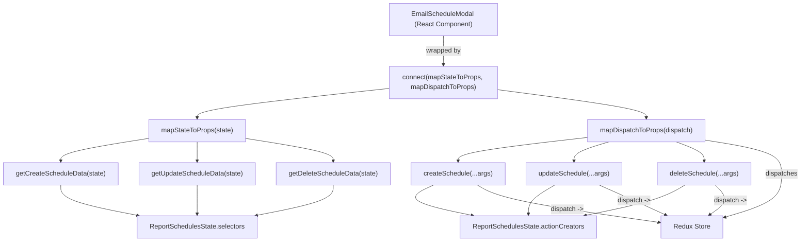
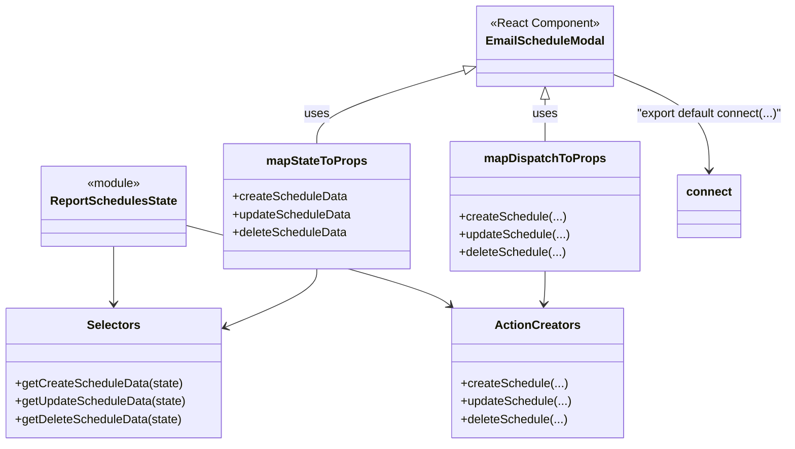

# Diagram: web/portal/src/pages/reports/bi-dashboard/components/EmailSchedule.modal.container.js

> Auto-generated by Obscura crawlers

## Diagram 1

### SVG

<svg id="container" width="1925.64453125" xmlns="http://www.w3.org/2000/svg" class="flowchart" height="582" viewBox="0 0 1925.64453125 582" role="graphics-document document" aria-roledescription="flowchart-v2"><g><marker id="container_flowchart-v2-pointEnd" class="marker flowchart-v2" viewBox="0 0 10 10" refX="5" refY="5" markerUnits="userSpaceOnUse" markerWidth="8" markerHeight="8" orient="auto"><path d="M 0 0 L 10 5 L 0 10 z" class="arrowMarkerPath" style="stroke-width: 1; stroke-dasharray: 1, 0;"></path></marker><marker id="container_flowchart-v2-pointStart" class="marker flowchart-v2" viewBox="0 0 10 10" refX="4.5" refY="5" markerUnits="userSpaceOnUse" markerWidth="8" markerHeight="8" orient="auto"><path d="M 0 5 L 10 10 L 10 0 z" class="arrowMarkerPath" style="stroke-width: 1; stroke-dasharray: 1, 0;"></path></marker><marker id="container_flowchart-v2-circleEnd" class="marker flowchart-v2" viewBox="0 0 10 10" refX="11" refY="5" markerUnits="userSpaceOnUse" markerWidth="11" markerHeight="11" orient="auto"><circle cx="5" cy="5" r="5" class="arrowMarkerPath" style="stroke-width: 1; stroke-dasharray: 1, 0;"></circle></marker><marker id="container_flowchart-v2-circleStart" class="marker flowchart-v2" viewBox="0 0 10 10" refX="-1" refY="5" markerUnits="userSpaceOnUse" markerWidth="11" markerHeight="11" orient="auto"><circle cx="5" cy="5" r="5" class="arrowMarkerPath" style="stroke-width: 1; stroke-dasharray: 1, 0;"></circle></marker><marker id="container_flowchart-v2-crossEnd" class="marker cross flowchart-v2" viewBox="0 0 11 11" refX="12" refY="5.2" markerUnits="userSpaceOnUse" markerWidth="11" markerHeight="11" orient="auto"><path d="M 1,1 l 9,9 M 10,1 l -9,9" class="arrowMarkerPath" style="stroke-width: 2; stroke-dasharray: 1, 0;"></path></marker><marker id="container_flowchart-v2-crossStart" class="marker cross flowchart-v2" viewBox="0 0 11 11" refX="-1" refY="5.2" markerUnits="userSpaceOnUse" markerWidth="11" markerHeight="11" orient="auto"><path d="M 1,1 l 9,9 M 10,1 l -9,9" class="arrowMarkerPath" style="stroke-width: 2; stroke-dasharray: 1, 0;"></path></marker><g class="root"><g class="clusters"></g><g class="edgePaths"><path d="M1064.969,86L1064.969,92.167C1064.969,98.333,1064.969,110.667,1064.969,122.333C1064.969,134,1064.969,145,1064.969,150.5L1064.969,156" id="L_EmailScheduleModal_Connect_0" class="edge-thickness-normal edge-pattern-solid edge-thickness-normal edge-pattern-solid flowchart-link" style=";" data-edge="true" data-et="edge" data-id="L_EmailScheduleModal_Connect_0" data-points="W3sieCI6MTA2NC45Njg3NSwieSI6ODZ9LHsieCI6MTA2NC45Njg3NSwieSI6MTIzfSx7IngiOjEwNjQuOTY4NzUsInkiOjE2MH1d" marker-end="url(#container_flowchart-v2-pointEnd)"></path><path d="M934.969,213.07L858.079,221.392C781.19,229.713,627.411,246.357,550.522,258.178C473.633,270,473.633,277,473.633,280.5L473.633,284" id="L_Connect_MapState_0" class="edge-thickness-normal edge-pattern-solid edge-thickness-normal edge-pattern-solid flowchart-link" style=";" data-edge="true" data-et="edge" data-id="L_Connect_MapState_0" data-points="W3sieCI6OTM0Ljk2ODc1LCJ5IjoyMTMuMDY5ODM2NTcyMzc5OH0seyJ4Ijo0NzMuNjMyODEyNSwieSI6MjYzfSx7IngiOjQ3My42MzI4MTI1LCJ5IjoyODh9XQ==" marker-end="url(#container_flowchart-v2-pointEnd)"></path><path d="M1194.969,216.034L1254.708,223.862C1314.448,231.689,1433.927,247.345,1493.667,258.672C1553.406,270,1553.406,277,1553.406,280.5L1553.406,284" id="L_Connect_MapDispatch_0" class="edge-thickness-normal edge-pattern-solid edge-thickness-normal edge-pattern-solid flowchart-link" style=";" data-edge="true" data-et="edge" data-id="L_Connect_MapDispatch_0" data-points="W3sieCI6MTE5NC45Njg3NSwieSI6MjE2LjAzMzkwOTE0OTA3MjN9LHsieCI6MTU1My40MDYyNSwieSI6MjYzfSx7IngiOjE1NTMuNDA2MjUsInkiOjI4OH1d" marker-end="url(#container_flowchart-v2-pointEnd)"></path><path d="M356.898,333.495L321.654,339.079C286.409,344.663,215.919,355.832,180.674,364.916C145.43,374,145.43,381,145.43,384.5L145.43,388" id="L_MapState_getCreate_0" class="edge-thickness-normal edge-pattern-solid edge-thickness-normal edge-pattern-solid flowchart-link" style=";" data-edge="true" data-et="edge" data-id="L_MapState_getCreate_0" data-points="W3sieCI6MzU2Ljg5ODQzNzUsInkiOjMzMy40OTUyMTU0MjQ4OTg4NH0seyJ4IjoxNDUuNDI5Njg3NSwieSI6MzY3fSx7IngiOjE0NS40Mjk2ODc1LCJ5IjozOTJ9XQ==" marker-end="url(#container_flowchart-v2-pointEnd)"></path><path d="M473.633,342L473.633,346.167C473.633,350.333,473.633,358.667,473.633,366.333C473.633,374,473.633,381,473.633,384.5L473.633,388" id="L_MapState_getUpdate_0" class="edge-thickness-normal edge-pattern-solid edge-thickness-normal edge-pattern-solid flowchart-link" style=";" data-edge="true" data-et="edge" data-id="L_MapState_getUpdate_0" data-points="W3sieCI6NDczLjYzMjgxMjUsInkiOjM0Mn0seyJ4Ijo0NzMuNjMyODEyNSwieSI6MzY3fSx7IngiOjQ3My42MzI4MTI1LCJ5IjozOTJ9XQ==" marker-end="url(#container_flowchart-v2-pointEnd)"></path><path d="M590.367,333.476L625.668,339.064C660.969,344.651,731.57,355.825,766.871,364.913C802.172,374,802.172,381,802.172,384.5L802.172,388" id="L_MapState_getDelete_0" class="edge-thickness-normal edge-pattern-solid edge-thickness-normal edge-pattern-solid flowchart-link" style=";" data-edge="true" data-et="edge" data-id="L_MapState_getDelete_0" data-points="W3sieCI6NTkwLjM2NzE4NzUsInkiOjMzMy40NzYzMDM3MTE5ODI1fSx7IngiOjgwMi4xNzE4NzUsInkiOjM2N30seyJ4Ijo4MDIuMTcxODc1LCJ5IjozOTJ9XQ==" marker-end="url(#container_flowchart-v2-pointEnd)"></path><path d="M145.43,446L145.43,452.167C145.43,458.333,145.43,470.667,176.399,482.872C207.368,495.078,269.307,507.156,300.277,513.195L331.246,519.234" id="L_getCreate_Selectors_0" class="edge-thickness-normal edge-pattern-solid edge-thickness-normal edge-pattern-solid flowchart-link" style=";" data-edge="true" data-et="edge" data-id="L_getCreate_Selectors_0" data-points="W3sieCI6MTQ1LjQyOTY4NzUsInkiOjQ0Nn0seyJ4IjoxNDUuNDI5Njg3NSwieSI6NDgzfSx7IngiOjMzNS4xNzIxMTkxNDA2MjUsInkiOjUyMH1d" marker-end="url(#container_flowchart-v2-pointEnd)"></path><path d="M473.633,446L473.633,452.167C473.633,458.333,473.633,470.667,473.633,482.333C473.633,494,473.633,505,473.633,510.5L473.633,516" id="L_getUpdate_Selectors_0" class="edge-thickness-normal edge-pattern-solid edge-thickness-normal edge-pattern-solid flowchart-link" style=";" data-edge="true" data-et="edge" data-id="L_getUpdate_Selectors_0" data-points="W3sieCI6NDczLjYzMjgxMjUsInkiOjQ0Nn0seyJ4Ijo0NzMuNjMyODEyNSwieSI6NDgzfSx7IngiOjQ3My42MzI4MTI1LCJ5Ijo1MjB9XQ==" marker-end="url(#container_flowchart-v2-pointEnd)"></path><path d="M802.172,446L802.172,452.167C802.172,458.333,802.172,470.667,771.17,482.873C740.168,495.078,678.165,507.157,647.163,513.196L616.161,519.235" id="L_getDelete_Selectors_0" class="edge-thickness-normal edge-pattern-solid edge-thickness-normal edge-pattern-solid flowchart-link" style=";" data-edge="true" data-et="edge" data-id="L_getDelete_Selectors_0" data-points="W3sieCI6ODAyLjE3MTg3NSwieSI6NDQ2fSx7IngiOjgwMi4xNzE4NzUsInkiOjQ4M30seyJ4Ijo2MTIuMjM1MjI5NDkyMTg3NSwieSI6NTIwfV0=" marker-end="url(#container_flowchart-v2-pointEnd)"></path><path d="M1410.867,331.413L1359.358,337.344C1307.849,343.275,1204.831,355.138,1153.322,364.569C1101.813,374,1101.813,381,1101.813,384.5L1101.813,388" id="L_MapDispatch_createAct_0" class="edge-thickness-normal edge-pattern-solid edge-thickness-normal edge-pattern-solid flowchart-link" style=";" data-edge="true" data-et="edge" data-id="L_MapDispatch_createAct_0" data-points="W3sieCI6MTQxMC44NjcxODc1LCJ5IjozMzEuNDEzMDUwOTk5OTMwOH0seyJ4IjoxMTAxLjgxMjUsInkiOjM2N30seyJ4IjoxMTAxLjgxMjUsInkiOjM5Mn1d" marker-end="url(#container_flowchart-v2-pointEnd)"></path><path d="M1462.748,342L1448.757,346.167C1434.767,350.333,1406.786,358.667,1392.795,366.333C1378.805,374,1378.805,381,1378.805,384.5L1378.805,388" id="L_MapDispatch_updateAct_0" class="edge-thickness-normal edge-pattern-solid edge-thickness-normal edge-pattern-solid flowchart-link" style=";" data-edge="true" data-et="edge" data-id="L_MapDispatch_updateAct_0" data-points="W3sieCI6MTQ2Mi43NDc3NDYzOTQyMzA3LCJ5IjozNDJ9LHsieCI6MTM3OC44MDQ2ODc1LCJ5IjozNjd9LHsieCI6MTM3OC44MDQ2ODc1LCJ5IjozOTJ9XQ==" marker-end="url(#container_flowchart-v2-pointEnd)"></path><path d="M1625.318,342L1636.415,346.167C1647.513,350.333,1669.707,358.667,1680.805,366.333C1691.902,374,1691.902,381,1691.902,384.5L1691.902,388" id="L_MapDispatch_deleteAct_0" class="edge-thickness-normal edge-pattern-solid edge-thickness-normal edge-pattern-solid flowchart-link" style=";" data-edge="true" data-et="edge" data-id="L_MapDispatch_deleteAct_0" data-points="W3sieCI6MTYyNS4zMTc2ODMyOTMyNjkzLCJ5IjozNDJ9LHsieCI6MTY5MS45MDIzNDM3NSwieSI6MzY3fSx7IngiOjE2OTEuOTAyMzQzNzUsInkiOjM5Mn1d" marker-end="url(#container_flowchart-v2-pointEnd)"></path><path d="M1042.826,446L1029.354,452.167C1015.881,458.333,988.937,470.667,1004.54,482.865C1020.143,495.063,1078.294,507.125,1107.37,513.156L1136.445,519.188" id="L_createAct_ActionCreators_0" class="edge-thickness-normal edge-pattern-solid edge-thickness-normal edge-pattern-solid flowchart-link" style=";" data-edge="true" data-et="edge" data-id="L_createAct_ActionCreators_0" data-points="W3sieCI6MTA0Mi44MjU4MDU2NjQwNjI1LCJ5Ijo0NDZ9LHsieCI6OTYxLjk5MjE4NzUsInkiOjQ4M30seyJ4IjoxMTQwLjM2MTgxNjQwNjI1LCJ5Ijo1MjB9XQ==" marker-end="url(#container_flowchart-v2-pointEnd)"></path><path d="M1333.124,446L1322.69,452.167C1312.257,458.333,1291.39,470.667,1280.957,482.333C1270.523,494,1270.523,505,1270.523,510.5L1270.523,516" id="L_updateAct_ActionCreators_0" class="edge-thickness-normal edge-pattern-solid edge-thickness-normal edge-pattern-solid flowchart-link" style=";" data-edge="true" data-et="edge" data-id="L_updateAct_ActionCreators_0" data-points="W3sieCI6MTMzMy4xMjM1MzUxNTYyNSwieSI6NDQ2fSx7IngiOjEyNzAuNTIzNDM3NSwieSI6NDgzfSx7IngiOjEyNzAuNTIzNDM3NSwieSI6NTIwfV0=" marker-end="url(#container_flowchart-v2-pointEnd)"></path><path d="M1646.114,446L1635.656,452.167C1625.198,458.333,1604.283,470.667,1564.334,482.866C1524.386,495.066,1465.405,507.132,1435.914,513.165L1406.423,519.198" id="L_deleteAct_ActionCreators_0" class="edge-thickness-normal edge-pattern-solid edge-thickness-normal edge-pattern-solid flowchart-link" style=";" data-edge="true" data-et="edge" data-id="L_deleteAct_ActionCreators_0" data-points="W3sieCI6MTY0Ni4xMTQwNzQ3MDcwMzEyLCJ5Ijo0NDZ9LHsieCI6MTU4My4zNjcxODc1LCJ5Ijo0ODN9LHsieCI6MTQwMi41MDQzOTQ1MzEyNSwieSI6NTIwfV0=" marker-end="url(#container_flowchart-v2-pointEnd)"></path><path d="M1695.945,337.802L1726.365,342.668C1756.785,347.535,1817.625,357.267,1848.045,370.8C1878.465,384.333,1878.465,401.667,1878.465,421C1878.465,440.333,1878.465,461.667,1855.23,479.193C1831.995,496.719,1785.525,510.439,1762.29,517.299L1739.055,524.158" id="L_MapDispatch_ReduxStore_0" class="edge-thickness-normal edge-pattern-solid edge-thickness-normal edge-pattern-solid flowchart-link" style=";" data-edge="true" data-et="edge" data-id="L_MapDispatch_ReduxStore_0" data-points="W3sieCI6MTY5NS45NDUzMTI1LCJ5IjozMzcuODAyMTM5MDM3NDMzMTZ9LHsieCI6MTg3OC40NjQ4NDM3NSwieSI6MzY3fSx7IngiOjE4NzguNDY0ODQzNzUsInkiOjQxOX0seyJ4IjoxODc4LjQ2NDg0Mzc1LCJ5Ijo0ODN9LHsieCI6MTczNS4yMTg3NSwieSI6NTI1LjI5MTA4OTI4NzMyMzJ9XQ==" marker-end="url(#container_flowchart-v2-pointEnd)"></path><path d="M1147.494,446L1157.927,452.167C1168.36,458.333,1189.227,470.667,1262.011,485.67C1334.794,500.673,1459.495,518.345,1521.845,527.182L1584.196,536.018" id="L_createAct_ReduxStore_0" class="edge-thickness-normal edge-pattern-solid edge-thickness-normal edge-pattern-solid flowchart-link" style=";" data-edge="true" data-et="edge" data-id="L_createAct_ReduxStore_0" data-points="W3sieCI6MTE0Ny40OTM2NTIzNDM3NSwieSI6NDQ2fSx7IngiOjEyMTAuMDkzNzUsInkiOjQ4M30seyJ4IjoxNTg4LjE1NjI1LCJ5Ijo1MzYuNTc5MTI5NDcyMDA4OH1d" marker-end="url(#container_flowchart-v2-pointEnd)"></path><path d="M1439.611,446L1453.499,452.167C1467.386,458.333,1495.162,470.667,1521.813,482.721C1548.465,494.775,1573.993,506.55,1586.756,512.437L1599.52,518.325" id="L_updateAct_ReduxStore_0" class="edge-thickness-normal edge-pattern-solid edge-thickness-normal edge-pattern-solid flowchart-link" style=";" data-edge="true" data-et="edge" data-id="L_updateAct_ReduxStore_0" data-points="W3sieCI6MTQzOS42MTA3MTc3NzM0Mzc1LCJ5Ijo0NDZ9LHsieCI6MTUyMi45Mzc1LCJ5Ijo0ODN9LHsieCI6MTYwMy4xNTIzNDM3NSwieSI6NTIwfV0=" marker-end="url(#container_flowchart-v2-pointEnd)"></path><path d="M1718.508,446L1724.585,452.167C1730.662,458.333,1742.815,470.667,1740.454,482.623C1738.092,494.579,1721.215,506.158,1712.777,511.948L1704.339,517.737" id="L_deleteAct_ReduxStore_0" class="edge-thickness-normal edge-pattern-solid edge-thickness-normal edge-pattern-solid flowchart-link" style=";" data-edge="true" data-et="edge" data-id="L_deleteAct_ReduxStore_0" data-points="W3sieCI6MTcxOC41MDg0ODM4ODY3MTg4LCJ5Ijo0NDZ9LHsieCI6MTc1NC45Njg3NSwieSI6NDgzfSx7IngiOjE3MDEuMDQwNTI3MzQzNzUsInkiOjUyMH1d" marker-end="url(#container_flowchart-v2-pointEnd)"></path></g><g class="edgeLabels"><g class="edgeLabel" transform="translate(1064.96875, 123)"><g class="label" data-id="L_EmailScheduleModal_Connect_0" transform="translate(-42.3203125, -12)"><foreignObject width="84.640625" height="24">

wrapped by

</foreignObject></g></g><g class="edgeLabel"><g class="label" data-id="L_Connect_MapState_0" transform="translate(0, 0)"><foreignObject width="0" height="0">

</foreignObject></g></g><g class="edgeLabel"><g class="label" data-id="L_Connect_MapDispatch_0" transform="translate(0, 0)"><foreignObject width="0" height="0">

</foreignObject></g></g><g class="edgeLabel"><g class="label" data-id="L_MapState_getCreate_0" transform="translate(0, 0)"><foreignObject width="0" height="0">

</foreignObject></g></g><g class="edgeLabel"><g class="label" data-id="L_MapState_getUpdate_0" transform="translate(0, 0)"><foreignObject width="0" height="0">

</foreignObject></g></g><g class="edgeLabel"><g class="label" data-id="L_MapState_getDelete_0" transform="translate(0, 0)"><foreignObject width="0" height="0">

</foreignObject></g></g><g class="edgeLabel"><g class="label" data-id="L_getCreate_Selectors_0" transform="translate(0, 0)"><foreignObject width="0" height="0">

</foreignObject></g></g><g class="edgeLabel"><g class="label" data-id="L_getUpdate_Selectors_0" transform="translate(0, 0)"><foreignObject width="0" height="0">

</foreignObject></g></g><g class="edgeLabel"><g class="label" data-id="L_getDelete_Selectors_0" transform="translate(0, 0)"><foreignObject width="0" height="0">

</foreignObject></g></g><g class="edgeLabel"><g class="label" data-id="L_MapDispatch_createAct_0" transform="translate(0, 0)"><foreignObject width="0" height="0">

</foreignObject></g></g><g class="edgeLabel"><g class="label" data-id="L_MapDispatch_updateAct_0" transform="translate(0, 0)"><foreignObject width="0" height="0">

</foreignObject></g></g><g class="edgeLabel"><g class="label" data-id="L_MapDispatch_deleteAct_0" transform="translate(0, 0)"><foreignObject width="0" height="0">

</foreignObject></g></g><g class="edgeLabel"><g class="label" data-id="L_createAct_ActionCreators_0" transform="translate(0, 0)"><foreignObject width="0" height="0">

</foreignObject></g></g><g class="edgeLabel"><g class="label" data-id="L_updateAct_ActionCreators_0" transform="translate(0, 0)"><foreignObject width="0" height="0">

</foreignObject></g></g><g class="edgeLabel"><g class="label" data-id="L_deleteAct_ActionCreators_0" transform="translate(0, 0)"><foreignObject width="0" height="0">

</foreignObject></g></g><g class="edgeLabel" transform="translate(1878.46484375, 419)"><g class="label" data-id="L_MapDispatch_ReduxStore_0" transform="translate(-39.1796875, -12)"><foreignObject width="78.359375" height="24">

dispatches

</foreignObject></g></g><g class="edgeLabel" transform="translate(1363.12618, 504.6878)"><g class="label" data-id="L_createAct_ReduxStore_0" transform="translate(-40.4296875, -12)"><foreignObject width="80.859375" height="24">

dispatch -&gt;

</foreignObject></g></g><g class="edgeLabel" transform="translate(1522.9375, 483)"><g class="label" data-id="L_updateAct_ReduxStore_0" transform="translate(-40.4296875, -12)"><foreignObject width="80.859375" height="24">

dispatch -&gt;

</foreignObject></g></g><g class="edgeLabel" transform="translate(1754.96875, 483)"><g class="label" data-id="L_deleteAct_ReduxStore_0" transform="translate(-40.4296875, -12)"><foreignObject width="80.859375" height="24">

dispatch -&gt;

</foreignObject></g></g></g><g class="nodes"><g class="node default" id="flowchart-EmailScheduleModal-0" transform="translate(1064.96875, 47)"><rect class="basic label-container" style="" x="-130" y="-39" width="260" height="78"></rect><g class="label" style="" transform="translate(-100, -24)"><rect></rect><foreignObject width="200" height="48">

EmailScheduleModal (React Component)

</foreignObject></g></g><g class="node default" id="flowchart-Connect-1" transform="translate(1064.96875, 199)"><rect class="basic label-container" style="" x="-130" y="-39" width="260" height="78"></rect><g class="label" style="" transform="translate(-100, -24)"><rect></rect><foreignObject width="200" height="48">

connect(mapStateToProps, mapDispatchToProps)

</foreignObject></g></g><g class="node default" id="flowchart-MapState-2" transform="translate(473.6328125, 315)"><rect class="basic label-container" style="" x="-116.734375" y="-27" width="233.46875" height="54"></rect><g class="label" style="" transform="translate(-86.734375, -12)"><rect></rect><foreignObject width="173.46875" height="24">

mapStateToProps(state)

</foreignObject></g></g><g class="node default" id="flowchart-MapDispatch-3" transform="translate(1553.40625, 315)"><rect class="basic label-container" style="" x="-142.5390625" y="-27" width="285.078125" height="54"></rect><g class="label" style="" transform="translate(-112.5390625, -12)"><rect></rect><foreignObject width="225.078125" height="24">

mapDispatchToProps(dispatch)

</foreignObject></g></g><g class="node default" id="flowchart-Selectors-4" transform="translate(473.6328125, 547)"><rect class="basic label-container" style="" x="-144.828125" y="-27" width="289.65625" height="54"></rect><g class="label" style="" transform="translate(-114.828125, -12)"><rect></rect><foreignObject width="229.65625" height="24">

ReportSchedulesState.selectors

</foreignObject></g></g><g class="node default" id="flowchart-ActionCreators-5" transform="translate(1270.5234375, 547)"><rect class="basic label-container" style="" x="-164.734375" y="-27" width="329.46875" height="54"></rect><g class="label" style="" transform="translate(-134.734375, -12)"><rect></rect><foreignObject width="269.46875" height="24">

ReportSchedulesState.actionCreators

</foreignObject></g></g><g class="node default" id="flowchart-getCreate-6" transform="translate(145.4296875, 419)"><rect class="basic label-container" style="" x="-137.4296875" y="-27" width="274.859375" height="54"></rect><g class="label" style="" transform="translate(-107.4296875, -12)"><rect></rect><foreignObject width="214.859375" height="24">

getCreateScheduleData(state)

</foreignObject></g></g><g class="node default" id="flowchart-getUpdate-7" transform="translate(473.6328125, 419)"><rect class="basic label-container" style="" x="-140.7734375" y="-27" width="281.546875" height="54"></rect><g class="label" style="" transform="translate(-110.7734375, -12)"><rect></rect><foreignObject width="221.546875" height="24">

getUpdateScheduleData(state)

</foreignObject></g></g><g class="node default" id="flowchart-getDelete-8" transform="translate(802.171875, 419)"><rect class="basic label-container" style="" x="-137.765625" y="-27" width="275.53125" height="54"></rect><g class="label" style="" transform="translate(-107.765625, -12)"><rect></rect><foreignObject width="215.53125" height="24">

getDeleteScheduleData(state)

</foreignObject></g></g><g class="node default" id="flowchart-createAct-9" transform="translate(1101.8125, 419)"><rect class="basic label-container" style="" x="-111.875" y="-27" width="223.75" height="54"></rect><g class="label" style="" transform="translate(-81.875, -12)"><rect></rect><foreignObject width="163.75" height="24">

createSchedule(...args)

</foreignObject></g></g><g class="node default" id="flowchart-updateAct-10" transform="translate(1378.8046875, 419)"><rect class="basic label-container" style="" x="-115.1171875" y="-27" width="230.234375" height="54"></rect><g class="label" style="" transform="translate(-85.1171875, -12)"><rect></rect><foreignObject width="170.234375" height="24">

updateSchedule(...args)

</foreignObject></g></g><g class="node default" id="flowchart-deleteAct-11" transform="translate(1691.90234375, 419)"><rect class="basic label-container" style="" x="-112.3828125" y="-27" width="224.765625" height="54"></rect><g class="label" style="" transform="translate(-82.3828125, -12)"><rect></rect><foreignObject width="164.765625" height="24">

deleteSchedule(...args)

</foreignObject></g></g><g class="node default" id="flowchart-ReduxStore-12" transform="translate(1661.6875, 547)"><rect class="basic label-container" style="" x="-73.53125" y="-27" width="147.0625" height="54"></rect><g class="label" style="" transform="translate(-43.53125, -12)"><rect></rect><foreignObject width="87.0625" height="24">

Redux Store

</foreignObject></g></g></g></g></g></svg>

## Diagram 2

### SVG

<svg id="container" width="1045.37890625" xmlns="http://www.w3.org/2000/svg" class="classDiagram" height="596" viewBox="0 0 1045.37890625 596" role="graphics-document document" aria-roledescription="class"><g><defs><marker id="container_class-aggregationStart" class="marker aggregation class" refX="18" refY="7" markerWidth="190" markerHeight="240" orient="auto"><path d="M 18,7 L9,13 L1,7 L9,1 Z"></path></marker></defs><defs><marker id="container_class-aggregationEnd" class="marker aggregation class" refX="1" refY="7" markerWidth="20" markerHeight="28" orient="auto"><path d="M 18,7 L9,13 L1,7 L9,1 Z"></path></marker></defs><defs><marker id="container_class-extensionStart" class="marker extension class" refX="18" refY="7" markerWidth="190" markerHeight="240" orient="auto"><path d="M 1,7 L18,13 V 1 Z"></path></marker></defs><defs><marker id="container_class-extensionEnd" class="marker extension class" refX="1" refY="7" markerWidth="20" markerHeight="28" orient="auto"><path d="M 1,1 V 13 L18,7 Z"></path></marker></defs><defs><marker id="container_class-compositionStart" class="marker composition class" refX="18" refY="7" markerWidth="190" markerHeight="240" orient="auto"><path d="M 18,7 L9,13 L1,7 L9,1 Z"></path></marker></defs><defs><marker id="container_class-compositionEnd" class="marker composition class" refX="1" refY="7" markerWidth="20" markerHeight="28" orient="auto"><path d="M 18,7 L9,13 L1,7 L9,1 Z"></path></marker></defs><defs><marker id="container_class-dependencyStart" class="marker dependency class" refX="6" refY="7" markerWidth="190" markerHeight="240" orient="auto"><path d="M 5,7 L9,13 L1,7 L9,1 Z"></path></marker></defs><defs><marker id="container_class-dependencyEnd" class="marker dependency class" refX="13" refY="7" markerWidth="20" markerHeight="28" orient="auto"><path d="M 18,7 L9,13 L14,7 L9,1 Z"></path></marker></defs><defs><marker id="container_class-lollipopStart" class="marker lollipop class" refX="13" refY="7" markerWidth="190" markerHeight="240" orient="auto"><circle stroke="black" fill="transparent" cx="7" cy="7" r="6"></circle></marker></defs><defs><marker id="container_class-lollipopEnd" class="marker lollipop class" refX="1" refY="7" markerWidth="190" markerHeight="240" orient="auto"><circle stroke="black" fill="transparent" cx="7" cy="7" r="6"></circle></marker></defs><g class="root"><g class="clusters"></g><g class="edgePaths"><path d="M151.852,331L151.852,340.667C151.852,350.333,151.852,369.667,151.852,382.5C151.852,395.333,151.852,401.667,151.852,404.833L151.852,408" id="id_ReportSchedulesState_Selectors_1" class="edge-thickness-normal edge-pattern-solid relation" style=";;;" data-edge="true" data-et="edge" data-id="id_ReportSchedulesState_Selectors_1" data-points="W3sieCI6MTUxLjg1MTU2MjUsInkiOjMzMX0seyJ4IjoxNTEuODUxNTYyNSwieSI6Mzg5fSx7IngiOjE1MS44NTE1NjI1LCJ5Ijo0MTR9XQ==" marker-end="url(#container_class-dependencyEnd)"></path><path d="M245.578,302.177L299.448,316.647C353.318,331.118,461.057,360.059,519.473,378.081C577.89,396.102,586.982,403.204,591.529,406.756L596.075,410.307" id="id_ReportSchedulesState_ActionCreators_2" class="edge-thickness-normal edge-pattern-solid relation" style=";;;" data-edge="true" data-et="edge" data-id="id_ReportSchedulesState_ActionCreators_2" data-points="W3sieCI6MjQ1LjU3ODEyNSwieSI6MzAyLjE3Njg2Mjk3Mjg4Njg1fSx7IngiOjU2OC43OTY4NzUsInkiOjM4OX0seyJ4Ijo2MDAuODAzNzEwOTM3NSwieSI6NDE0fV0=" marker-end="url(#container_class-dependencyEnd)"></path><path d="M617.754,93.401L584.719,103.334C551.684,113.268,485.613,133.134,452.578,149.734C419.543,166.333,419.543,179.667,419.543,186.333L419.543,193" id="id_EmailScheduleModal_mapStateToProps_3" class="edge-thickness-normal edge-pattern-solid relation" style=";;;" data-edge="true" data-et="edge" data-id="id_EmailScheduleModal_mapStateToProps_3" data-points="W3sieCI6NjM0LjI3MzQzNzUsInkiOjg4LjQzNDI0NTAwMTc0MjQ1fSx7IngiOjQxOS41NDI5Njg3NSwieSI6MTUzfSx7IngiOjQxOS41NDI5Njg3NSwieSI6MTkzfV0=" marker-start="url(#container_class-extensionStart)"></path><path d="M722.188,133.25L722.188,136.542C722.188,139.833,722.188,146.417,722.188,155.875C722.188,165.333,722.188,177.667,722.188,183.833L722.188,190" id="id_EmailScheduleModal_mapDispatchToProps_4" class="edge-thickness-normal edge-pattern-solid relation" style=";;;" data-edge="true" data-et="edge" data-id="id_EmailScheduleModal_mapDispatchToProps_4" data-points="W3sieCI6NzIyLjE4NzUsInkiOjExNn0seyJ4Ijo3MjIuMTg3NSwieSI6MTUzfSx7IngiOjcyMi4xODc1LCJ5IjoxOTB9XQ==" marker-start="url(#container_class-extensionStart)"></path><path d="M419.543,361L419.543,365.667C419.543,370.333,419.543,379.667,399.826,392.583C380.108,405.499,340.673,421.999,320.956,430.248L301.238,438.498" id="id_mapStateToProps_Selectors_5" class="edge-thickness-normal edge-pattern-solid relation" style=";;;" data-edge="true" data-et="edge" data-id="id_mapStateToProps_Selectors_5" data-points="W3sieCI6NDE5LjU0Mjk2ODc1LCJ5IjozNjF9LHsieCI6NDE5LjU0Mjk2ODc1LCJ5IjozODl9LHsieCI6Mjk1LjcwMzEyNSwieSI6NDQwLjgxMzYyNjM0Nzk2OTV9XQ==" marker-end="url(#container_class-dependencyEnd)"></path><path d="M722.188,364L722.188,368.167C722.188,372.333,722.188,380.667,721.904,388.004C721.621,395.341,721.055,401.683,720.772,404.853L720.489,408.024" id="id_mapDispatchToProps_ActionCreators_6" class="edge-thickness-normal edge-pattern-solid relation" style=";;;" data-edge="true" data-et="edge" data-id="id_mapDispatchToProps_ActionCreators_6" data-points="W3sieCI6NzIyLjE4NzUsInkiOjM2NH0seyJ4Ijo3MjIuMTg3NSwieSI6Mzg5fSx7IngiOjcxOS45NTUzNTcxNDI4NTcxLCJ5Ijo0MTR9XQ==" marker-end="url(#container_class-dependencyEnd)"></path><path d="M810.102,99.131L831.359,108.109C852.616,117.087,895.13,135.044,916.387,156.689C937.645,178.333,937.645,203.667,937.645,216.333L937.645,229" id="id_EmailScheduleModal_connect_7" class="edge-thickness-normal edge-pattern-solid relation" style=";;;" data-edge="true" data-et="edge" data-id="id_EmailScheduleModal_connect_7" data-points="W3sieCI6ODEwLjEwMTU2MjUsInkiOjk5LjEzMTIwNzI4MTAzNDE0fSx7IngiOjkzNy42NDQ1MzEyNSwieSI6MTUzfSx7IngiOjkzNy42NDQ1MzEyNSwieSI6MjM1fV0=" marker-end="url(#container_class-dependencyEnd)"></path></g><g class="edgeLabels"><g class="edgeLabel"><g class="label" data-id="id_ReportSchedulesState_Selectors_1" transform="translate(0, 0)"><foreignObject width="0" height="0">

</foreignObject></g></g><g class="edgeLabel"><g class="label" data-id="id_ReportSchedulesState_ActionCreators_2" transform="translate(0, 0)"><foreignObject width="0" height="0">

</foreignObject></g></g><g class="edgeLabel" transform="translate(419.54296875, 153)"><g class="label" data-id="id_EmailScheduleModal_mapStateToProps_3" transform="translate(-16.4921875, -12)"><foreignObject width="32.984375" height="24">

uses

</foreignObject></g></g><g class="edgeLabel" transform="translate(722.1875, 153)"><g class="label" data-id="id_EmailScheduleModal_mapDispatchToProps_4" transform="translate(-16.4921875, -12)"><foreignObject width="32.984375" height="24">

uses

</foreignObject></g></g><g class="edgeLabel"><g class="label" data-id="id_mapStateToProps_Selectors_5" transform="translate(0, 0)"><foreignObject width="0" height="0">

</foreignObject></g></g><g class="edgeLabel"><g class="label" data-id="id_mapDispatchToProps_ActionCreators_6" transform="translate(0, 0)"><foreignObject width="0" height="0">

</foreignObject></g></g><g class="edgeLabel" transform="translate(937.64453125, 153)"><g class="label" data-id="id_EmailScheduleModal_connect_7" transform="translate(-99.734375, -12)"><foreignObject width="199.46875" height="24">

"export default connect(...)"

</foreignObject></g></g></g><g class="nodes"><g class="node default" id="classId-ReportSchedulesState-0" transform="translate(151.8515625, 277)"><g class="basic label-container"><path d="M-93.7265625 -54 L93.7265625 -54 L93.7265625 54 L-93.7265625 54" stroke="none" stroke-width="0" fill="#ECECFF" style=""></path><path d="M-93.7265625 -54 C-47.58606757358665 -54, -1.445572647173293 -54, 93.7265625 -54 M-93.7265625 -54 C-24.772451663492944 -54, 44.18165917301411 -54, 93.7265625 -54 M93.7265625 -54 C93.7265625 -14.527507428245833, 93.7265625 24.944985143508333, 93.7265625 54 M93.7265625 -54 C93.7265625 -26.823518076794358, 93.7265625 0.352963846411285, 93.7265625 54 M93.7265625 54 C28.358595794306737 54, -37.009370911386526 54, -93.7265625 54 M93.7265625 54 C31.986291930409365 54, -29.75397863918127 54, -93.7265625 54 M-93.7265625 54 C-93.7265625 22.16811536519738, -93.7265625 -9.66376926960524, -93.7265625 -54 M-93.7265625 54 C-93.7265625 15.224919747237571, -93.7265625 -23.550160505524858, -93.7265625 -54" stroke="#9370DB" stroke-width="1.3" fill="none" stroke-dasharray="0 0" style=""></path></g><g class="annotation-group text" transform="translate(-36.6015625, -30)"><g class="label" style="" transform="translate(0,-12)"><foreignObject width="73.203125" height="24">

«module»

</foreignObject></g></g><g class="label-group text" transform="translate(-81.7265625, -6)"><g class="label" style="font-weight: bolder" transform="translate(0,-12)"><foreignObject width="163.453125" height="24">

ReportSchedulesState

</foreignObject></g></g><g class="members-group text" transform="translate(-81.7265625, 42)"></g><g class="methods-group text" transform="translate(-81.7265625, 72)"></g><g class="divider" style=""><path d="M-93.7265625 18 C-30.419431973404464 18, 32.88769855319107 18, 93.7265625 18 M-93.7265625 18 C-21.143044699628206 18, 51.44047310074359 18, 93.7265625 18" stroke="#9370DB" stroke-width="1.3" fill="none" stroke-dasharray="0 0" style=""></path></g><g class="divider" style=""><path d="M-93.7265625 36 C-43.22123196082946 36, 7.284098578341073 36, 93.7265625 36 M-93.7265625 36 C-43.74229224872099 36, 6.241978002558014 36, 93.7265625 36" stroke="#9370DB" stroke-width="1.3" fill="none" stroke-dasharray="0 0" style=""></path></g></g><g class="node default" id="classId-Selectors-1" transform="translate(151.8515625, 501)"><g class="basic label-container"><path d="M-143.8515625 -87 L143.8515625 -87 L143.8515625 87 L-143.8515625 87" stroke="none" stroke-width="0" fill="#ECECFF" style=""></path><path d="M-143.8515625 -87 C-86.04101113249091 -87, -28.230459764981816 -87, 143.8515625 -87 M-143.8515625 -87 C-53.263295337765115 -87, 37.32497182446977 -87, 143.8515625 -87 M143.8515625 -87 C143.8515625 -30.35524139744475, 143.8515625 26.2895172051105, 143.8515625 87 M143.8515625 -87 C143.8515625 -34.00980887984312, 143.8515625 18.98038224031376, 143.8515625 87 M143.8515625 87 C44.853031175336895 87, -54.14550014932621 87, -143.8515625 87 M143.8515625 87 C57.229569321170914 87, -29.392423857658173 87, -143.8515625 87 M-143.8515625 87 C-143.8515625 31.984645443899865, -143.8515625 -23.03070911220027, -143.8515625 -87 M-143.8515625 87 C-143.8515625 37.55432258833471, -143.8515625 -11.891354823330573, -143.8515625 -87" stroke="#9370DB" stroke-width="1.3" fill="none" stroke-dasharray="0 0" style=""></path></g><g class="annotation-group text" transform="translate(0, -63)"></g><g class="label-group text" transform="translate(-34.171875, -63)"><g class="label" style="font-weight: bolder" transform="translate(0,-12)"><foreignObject width="68.34375" height="24">

Selectors

</foreignObject></g></g><g class="members-group text" transform="translate(-131.8515625, -15)"></g><g class="methods-group text" transform="translate(-131.8515625, 15)"><g class="label" style="" transform="translate(0,-12)"><foreignObject width="222.84375" height="24">

+getCreateScheduleData(state)

</foreignObject></g><g class="label" style="" transform="translate(0,12)"><foreignObject width="229.53125" height="24">

+getUpdateScheduleData(state)

</foreignObject></g><g class="label" style="" transform="translate(0,36)"><foreignObject width="223.515625" height="24">

+getDeleteScheduleData(state)

</foreignObject></g></g><g class="divider" style=""><path d="M-143.8515625 -39 C-47.952437950531134 -39, 47.94668659893773 -39, 143.8515625 -39 M-143.8515625 -39 C-35.282891603849436 -39, 73.28577929230113 -39, 143.8515625 -39" stroke="#9370DB" stroke-width="1.3" fill="none" stroke-dasharray="0 0" style=""></path></g><g class="divider" style=""><path d="M-143.8515625 -15 C-36.24333909076637 -15, 71.36488431846726 -15, 143.8515625 -15 M-143.8515625 -15 C-60.980110860091386 -15, 21.891340779817227 -15, 143.8515625 -15" stroke="#9370DB" stroke-width="1.3" fill="none" stroke-dasharray="0 0" style=""></path></g></g><g class="node default" id="classId-ActionCreators-2" transform="translate(712.1875, 501)"><g class="basic label-container"><path d="M-112.9296875 -87 L112.9296875 -87 L112.9296875 87 L-112.9296875 87" stroke="none" stroke-width="0" fill="#ECECFF" style=""></path><path d="M-112.9296875 -87 C-64.32703474194366 -87, -15.724381983887312 -87, 112.9296875 -87 M-112.9296875 -87 C-33.73711849925404 -87, 45.455450501491924 -87, 112.9296875 -87 M112.9296875 -87 C112.9296875 -29.977126683505674, 112.9296875 27.045746632988653, 112.9296875 87 M112.9296875 -87 C112.9296875 -52.15601399089281, 112.9296875 -17.31202798178562, 112.9296875 87 M112.9296875 87 C47.5613732578784 87, -17.806940984243198 87, -112.9296875 87 M112.9296875 87 C60.31255116203451 87, 7.695414824069019 87, -112.9296875 87 M-112.9296875 87 C-112.9296875 38.26939691811242, -112.9296875 -10.46120616377516, -112.9296875 -87 M-112.9296875 87 C-112.9296875 48.022296715830876, -112.9296875 9.044593431661752, -112.9296875 -87" stroke="#9370DB" stroke-width="1.3" fill="none" stroke-dasharray="0 0" style=""></path></g><g class="annotation-group text" transform="translate(0, -63)"></g><g class="label-group text" transform="translate(-53.96875, -63)"><g class="label" style="font-weight: bolder" transform="translate(0,-12)"><foreignObject width="107.9375" height="24">

ActionCreators

</foreignObject></g></g><g class="members-group text" transform="translate(-100.9296875, -15)"></g><g class="methods-group text" transform="translate(-100.9296875, 15)"><g class="label" style="" transform="translate(0,-12)"><foreignObject width="141.421875" height="24">

+createSchedule(...)

</foreignObject></g><g class="label" style="" transform="translate(0,12)"><foreignObject width="147.890625" height="24">

+updateSchedule(...)

</foreignObject></g><g class="label" style="" transform="translate(0,36)"><foreignObject width="142.421875" height="24">

+deleteSchedule(...)

</foreignObject></g></g><g class="divider" style=""><path d="M-112.9296875 -39 C-43.04858189420506 -39, 26.832523711589886 -39, 112.9296875 -39 M-112.9296875 -39 C-35.62513812857709 -39, 41.679411242845816 -39, 112.9296875 -39" stroke="#9370DB" stroke-width="1.3" fill="none" stroke-dasharray="0 0" style=""></path></g><g class="divider" style=""><path d="M-112.9296875 -15 C-53.85386377298191 -15, 5.22195995403618 -15, 112.9296875 -15 M-112.9296875 -15 C-47.4180035943413 -15, 18.0936803113174 -15, 112.9296875 -15" stroke="#9370DB" stroke-width="1.3" fill="none" stroke-dasharray="0 0" style=""></path></g></g><g class="node default" id="classId-EmailScheduleModal-3" transform="translate(722.1875, 62)"><g class="basic label-container"><path d="M-87.9140625 -54 L87.9140625 -54 L87.9140625 54 L-87.9140625 54" stroke="none" stroke-width="0" fill="#ECECFF" style=""></path><path d="M-87.9140625 -54 C-24.31865058586766 -54, 39.27676132826468 -54, 87.9140625 -54 M-87.9140625 -54 C-29.962164646043 -54, 27.989733207914 -54, 87.9140625 -54 M87.9140625 -54 C87.9140625 -16.673620132327073, 87.9140625 20.652759735345853, 87.9140625 54 M87.9140625 -54 C87.9140625 -23.702083715584997, 87.9140625 6.595832568830005, 87.9140625 54 M87.9140625 54 C46.25500570741849 54, 4.595948914836981 54, -87.9140625 54 M87.9140625 54 C41.45595947286254 54, -5.002143554274923 54, -87.9140625 54 M-87.9140625 54 C-87.9140625 29.87161542090498, -87.9140625 5.743230841809961, -87.9140625 -54 M-87.9140625 54 C-87.9140625 27.69084486694196, -87.9140625 1.381689733883917, -87.9140625 -54" stroke="#9370DB" stroke-width="1.3" fill="none" stroke-dasharray="0 0" style=""></path></g><g class="annotation-group text" transform="translate(-73.2109375, -30)"><g class="label" style="" transform="translate(0,-12)"><foreignObject width="146.421875" height="24">

«React Component»

</foreignObject></g></g><g class="label-group text" transform="translate(-75.9140625, -6)"><g class="label" style="font-weight: bolder" transform="translate(0,-12)"><foreignObject width="151.828125" height="24">

EmailScheduleModal

</foreignObject></g></g><g class="members-group text" transform="translate(-75.9140625, 42)"></g><g class="methods-group text" transform="translate(-75.9140625, 72)"></g><g class="divider" style=""><path d="M-87.9140625 18 C-29.404833197315398 18, 29.104396105369204 18, 87.9140625 18 M-87.9140625 18 C-27.660244409683052 18, 32.593573680633895 18, 87.9140625 18" stroke="#9370DB" stroke-width="1.3" fill="none" stroke-dasharray="0 0" style=""></path></g><g class="divider" style=""><path d="M-87.9140625 36 C-21.093319273508683 36, 45.72742395298263 36, 87.9140625 36 M-87.9140625 36 C-19.624807540201388 36, 48.664447419597224 36, 87.9140625 36" stroke="#9370DB" stroke-width="1.3" fill="none" stroke-dasharray="0 0" style=""></path></g></g><g class="node default" id="classId-mapStateToProps-4" transform="translate(419.54296875, 277)"><g class="basic label-container"><path d="M-123.96484375 -84 L123.96484375 -84 L123.96484375 84 L-123.96484375 84" stroke="none" stroke-width="0" fill="#ECECFF" style=""></path><path d="M-123.96484375 -84 C-72.030201951089 -84, -20.09556015217798 -84, 123.96484375 -84 M-123.96484375 -84 C-63.29216986919893 -84, -2.6194959883978584 -84, 123.96484375 -84 M123.96484375 -84 C123.96484375 -43.867595224370554, 123.96484375 -3.7351904487411076, 123.96484375 84 M123.96484375 -84 C123.96484375 -20.025708659476138, 123.96484375 43.948582681047725, 123.96484375 84 M123.96484375 84 C31.582808872925312 84, -60.799226004149375 84, -123.96484375 84 M123.96484375 84 C29.754879899944285 84, -64.45508395011143 84, -123.96484375 84 M-123.96484375 84 C-123.96484375 25.05930111417279, -123.96484375 -33.88139777165442, -123.96484375 -84 M-123.96484375 84 C-123.96484375 22.768396845574188, -123.96484375 -38.463206308851625, -123.96484375 -84" stroke="#9370DB" stroke-width="1.3" fill="none" stroke-dasharray="0 0" style=""></path></g><g class="annotation-group text" transform="translate(0, -60)"></g><g class="label-group text" transform="translate(-64.7109375, -60)"><g class="label" style="font-weight: bolder" transform="translate(0,-12)"><foreignObject width="129.421875" height="24">

mapStateToProps

</foreignObject></g></g><g class="members-group text" transform="translate(-111.96484375, -12)"><g class="label" style="" transform="translate(0,-12)"><foreignObject width="152.75" height="24">

+createScheduleData

</foreignObject></g><g class="label" style="" transform="translate(0,12)"><foreignObject width="159.21875" height="24">

+updateScheduleData

</foreignObject></g><g class="label" style="" transform="translate(0,36)"><foreignObject width="153.75" height="24">

+deleteScheduleData

</foreignObject></g></g><g class="methods-group text" transform="translate(-111.96484375, 84)"></g><g class="divider" style=""><path d="M-123.96484375 -36 C-41.94076653880336 -36, 40.08331067239328 -36, 123.96484375 -36 M-123.96484375 -36 C-45.646502062293635 -36, 32.67183962541273 -36, 123.96484375 -36" stroke="#9370DB" stroke-width="1.3" fill="none" stroke-dasharray="0 0" style=""></path></g><g class="divider" style=""><path d="M-123.96484375 60 C-42.448428460058764 60, 39.06798682988247 60, 123.96484375 60 M-123.96484375 60 C-30.89012402875845 60, 62.1845956924831 60, 123.96484375 60" stroke="#9370DB" stroke-width="1.3" fill="none" stroke-dasharray="0 0" style=""></path></g></g><g class="node default" id="classId-mapDispatchToProps-5" transform="translate(722.1875, 277)"><g class="basic label-container"><path d="M-124.54296875 -87 L124.54296875 -87 L124.54296875 87 L-124.54296875 87" stroke="none" stroke-width="0" fill="#ECECFF" style=""></path><path d="M-124.54296875 -87 C-50.15565911211222 -87, 24.231650525775564 -87, 124.54296875 -87 M-124.54296875 -87 C-56.66118111058866 -87, 11.220606528822685 -87, 124.54296875 -87 M124.54296875 -87 C124.54296875 -44.239854419699704, 124.54296875 -1.4797088393994073, 124.54296875 87 M124.54296875 -87 C124.54296875 -45.87465157255032, 124.54296875 -4.74930314510064, 124.54296875 87 M124.54296875 87 C74.60962850402298 87, 24.676288258045957 87, -124.54296875 87 M124.54296875 87 C60.276341808071166 87, -3.990285133857668 87, -124.54296875 87 M-124.54296875 87 C-124.54296875 24.110377142589627, -124.54296875 -38.779245714820746, -124.54296875 -87 M-124.54296875 87 C-124.54296875 24.238104134655508, -124.54296875 -38.523791730688984, -124.54296875 -87" stroke="#9370DB" stroke-width="1.3" fill="none" stroke-dasharray="0 0" style=""></path></g><g class="annotation-group text" transform="translate(0, -63)"></g><g class="label-group text" transform="translate(-77.1953125, -63)"><g class="label" style="font-weight: bolder" transform="translate(0,-12)"><foreignObject width="154.390625" height="24">

mapDispatchToProps

</foreignObject></g></g><g class="members-group text" transform="translate(-112.54296875, -15)"></g><g class="methods-group text" transform="translate(-112.54296875, 15)"><g class="label" style="" transform="translate(0,-12)"><foreignObject width="141.421875" height="24">

+createSchedule(...)

</foreignObject></g><g class="label" style="" transform="translate(0,12)"><foreignObject width="147.890625" height="24">

+updateSchedule(...)

</foreignObject></g><g class="label" style="" transform="translate(0,36)"><foreignObject width="142.421875" height="24">

+deleteSchedule(...)

</foreignObject></g></g><g class="divider" style=""><path d="M-124.54296875 -39 C-61.350288275957965 -39, 1.8423921980840703 -39, 124.54296875 -39 M-124.54296875 -39 C-56.675249627837374 -39, 11.192469494325252 -39, 124.54296875 -39" stroke="#9370DB" stroke-width="1.3" fill="none" stroke-dasharray="0 0" style=""></path></g><g class="divider" style=""><path d="M-124.54296875 -15 C-65.36211112095873 -15, -6.181253491917445 -15, 124.54296875 -15 M-124.54296875 -15 C-42.95765842295138 -15, 38.627651904097235 -15, 124.54296875 -15" stroke="#9370DB" stroke-width="1.3" fill="none" stroke-dasharray="0 0" style=""></path></g></g><g class="node default" id="classId-connect-6" transform="translate(937.64453125, 277)"><g class="basic label-container"><path d="M-40.9140625 -42 L40.9140625 -42 L40.9140625 42 L-40.9140625 42" stroke="none" stroke-width="0" fill="#ECECFF" style=""></path><path d="M-40.9140625 -42 C-13.736093888606305 -42, 13.44187472278739 -42, 40.9140625 -42 M-40.9140625 -42 C-19.95360797833148 -42, 1.0068465433370406 -42, 40.9140625 -42 M40.9140625 -42 C40.9140625 -19.908572805037316, 40.9140625 2.1828543899253674, 40.9140625 42 M40.9140625 -42 C40.9140625 -24.350216465193082, 40.9140625 -6.700432930386164, 40.9140625 42 M40.9140625 42 C16.18012071398319 42, -8.553821072033621 42, -40.9140625 42 M40.9140625 42 C23.654550612256767 42, 6.395038724513533 42, -40.9140625 42 M-40.9140625 42 C-40.9140625 14.005911060757587, -40.9140625 -13.988177878484827, -40.9140625 -42 M-40.9140625 42 C-40.9140625 11.276697536618371, -40.9140625 -19.446604926763257, -40.9140625 -42" stroke="#9370DB" stroke-width="1.3" fill="none" stroke-dasharray="0 0" style=""></path></g><g class="annotation-group text" transform="translate(0, -18)"></g><g class="label-group text" transform="translate(-28.9140625, -18)"><g class="label" style="font-weight: bolder" transform="translate(0,-12)"><foreignObject width="57.828125" height="24">

connect

</foreignObject></g></g><g class="members-group text" transform="translate(-28.9140625, 30)"></g><g class="methods-group text" transform="translate(-28.9140625, 60)"></g><g class="divider" style=""><path d="M-40.9140625 6 C-9.0610879983961 6, 22.7918865032078 6, 40.9140625 6 M-40.9140625 6 C-10.739254788533195 6, 19.43555292293361 6, 40.9140625 6" stroke="#9370DB" stroke-width="1.3" fill="none" stroke-dasharray="0 0" style=""></path></g><g class="divider" style=""><path d="M-40.9140625 24 C-11.956768063199565 24, 17.00052637360087 24, 40.9140625 24 M-40.9140625 24 C-22.54041288297239 24, -4.16676326594478 24, 40.9140625 24" stroke="#9370DB" stroke-width="1.3" fill="none" stroke-dasharray="0 0" style=""></path></g></g></g></g></g></svg>
