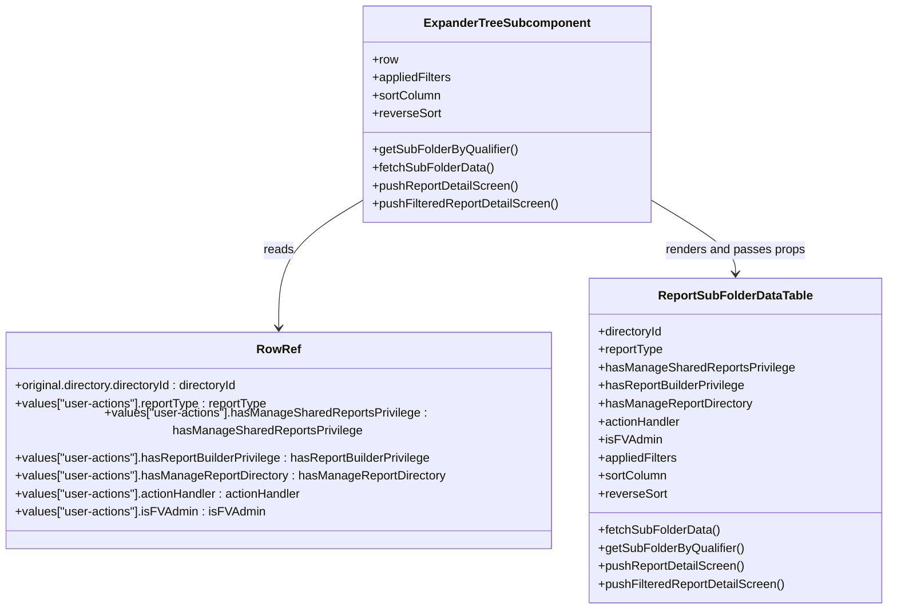

# Diagram: web/portal/src/pages/reports/bi-dashboard/components/ExpanderTreeSubcomponent.js

> Auto-generated by Obscura crawlers

## Mermaid

### SVG

<svg id="container" width="1183.7890625" xmlns="http://www.w3.org/2000/svg" class="classDiagram" height="810" viewBox="0 0 1183.7890625 810" role="graphics-document document" aria-roledescription="class"><g><defs><marker id="container_class-aggregationStart" class="marker aggregation class" refX="18" refY="7" markerWidth="190" markerHeight="240" orient="auto"><path d="M 18,7 L9,13 L1,7 L9,1 Z"></path></marker></defs><defs><marker id="container_class-aggregationEnd" class="marker aggregation class" refX="1" refY="7" markerWidth="20" markerHeight="28" orient="auto"><path d="M 18,7 L9,13 L1,7 L9,1 Z"></path></marker></defs><defs><marker id="container_class-extensionStart" class="marker extension class" refX="18" refY="7" markerWidth="190" markerHeight="240" orient="auto"><path d="M 1,7 L18,13 V 1 Z"></path></marker></defs><defs><marker id="container_class-extensionEnd" class="marker extension class" refX="1" refY="7" markerWidth="20" markerHeight="28" orient="auto"><path d="M 1,1 V 13 L18,7 Z"></path></marker></defs><defs><marker id="container_class-compositionStart" class="marker composition class" refX="18" refY="7" markerWidth="190" markerHeight="240" orient="auto"><path d="M 18,7 L9,13 L1,7 L9,1 Z"></path></marker></defs><defs><marker id="container_class-compositionEnd" class="marker composition class" refX="1" refY="7" markerWidth="20" markerHeight="28" orient="auto"><path d="M 18,7 L9,13 L1,7 L9,1 Z"></path></marker></defs><defs><marker id="container_class-dependencyStart" class="marker dependency class" refX="6" refY="7" markerWidth="190" markerHeight="240" orient="auto"><path d="M 5,7 L9,13 L1,7 L9,1 Z"></path></marker></defs><defs><marker id="container_class-dependencyEnd" class="marker dependency class" refX="13" refY="7" markerWidth="20" markerHeight="28" orient="auto"><path d="M 18,7 L9,13 L14,7 L9,1 Z"></path></marker></defs><defs><marker id="container_class-lollipopStart" class="marker lollipop class" refX="13" refY="7" markerWidth="190" markerHeight="240" orient="auto"><circle stroke="black" fill="transparent" cx="7" cy="7" r="6"></circle></marker></defs><defs><marker id="container_class-lollipopEnd" class="marker lollipop class" refX="1" refY="7" markerWidth="190" markerHeight="240" orient="auto"><circle stroke="black" fill="transparent" cx="7" cy="7" r="6"></circle></marker></defs><g class="root"><g class="clusters"></g><g class="edgePaths"><path d="M491.342,264.576L472.16,275.98C452.978,287.384,414.614,310.192,395.432,340.763C376.25,371.333,376.25,409.667,376.25,428.833L376.25,448" id="id_ExpanderTreeSubcomponent_RowRef_1" class="edge-thickness-normal edge-pattern-solid relation" style=";;;" data-edge="true" data-et="edge" data-id="id_ExpanderTreeSubcomponent_RowRef_1" data-points="W3sieCI6NDkxLjM0MTc5Njg3NSwieSI6MjY0LjU3NTYyMDUyMTMwODQ1fSx7IngiOjM3Ni4yNSwieSI6MzMzfSx7IngiOjM3Ni4yNSwieSI6NDU0fV0=" marker-end="url(#container_class-dependencyEnd)"></path><path d="M870.053,264.576L889.235,275.98C908.417,287.384,946.781,310.192,965.963,326.763C985.145,343.333,985.145,353.667,985.145,358.833L985.145,364" id="id_ExpanderTreeSubcomponent_ReportSubFolderDataTable_2" class="edge-thickness-normal edge-pattern-solid relation" style=";;;" data-edge="true" data-et="edge" data-id="id_ExpanderTreeSubcomponent_ReportSubFolderDataTable_2" data-points="W3sieCI6ODcwLjA1MjczNDM3NSwieSI6MjY0LjU3NTYyMDUyMTMwODQ1fSx7IngiOjk4NS4xNDQ1MzEyNSwieSI6MzMzfSx7IngiOjk4NS4xNDQ1MzEyNSwieSI6MzcwfV0=" marker-end="url(#container_class-dependencyEnd)"></path></g><g class="edgeLabels"><g class="edgeLabel" transform="translate(376.25, 333)"><g class="label" data-id="id_ExpanderTreeSubcomponent_RowRef_1" transform="translate(-20.0078125, -12)"><foreignObject width="40.015625" height="24">

reads

</foreignObject></g></g><g class="edgeLabel" transform="translate(985.14453125, 333)"><g class="label" data-id="id_ExpanderTreeSubcomponent_ReportSubFolderDataTable_2" transform="translate(-93.125, -12)"><foreignObject width="186.25" height="24">

renders and passes props

</foreignObject></g></g></g><g class="nodes"><g class="node default" id="classId-ExpanderTreeSubcomponent-0" transform="translate(680.697265625, 152)"><g class="basic label-container"><path d="M-189.35546875 -144 L189.35546875 -144 L189.35546875 144 L-189.35546875 144" stroke="none" stroke-width="0" fill="#ECECFF" style=""></path><path d="M-189.35546875 -144 C-85.29860605544154 -144, 18.758256639116922 -144, 189.35546875 -144 M-189.35546875 -144 C-51.05355712686509 -144, 87.24835449626983 -144, 189.35546875 -144 M189.35546875 -144 C189.35546875 -57.42358222393467, 189.35546875 29.152835552130654, 189.35546875 144 M189.35546875 -144 C189.35546875 -39.390406625643294, 189.35546875 65.21918674871341, 189.35546875 144 M189.35546875 144 C81.51012488321952 144, -26.335218983560964 144, -189.35546875 144 M189.35546875 144 C73.83932971738062 144, -41.676809315238756 144, -189.35546875 144 M-189.35546875 144 C-189.35546875 74.32223584771705, -189.35546875 4.644471695434106, -189.35546875 -144 M-189.35546875 144 C-189.35546875 66.98994171846064, -189.35546875 -10.020116563078716, -189.35546875 -144" stroke="#9370DB" stroke-width="1.3" fill="none" stroke-dasharray="0 0" style=""></path></g><g class="annotation-group text" transform="translate(0, -120)"></g><g class="label-group text" transform="translate(-105.5234375, -120)"><g class="label" style="font-weight: bolder" transform="translate(0,-12)"><foreignObject width="211.046875" height="24">

ExpanderTreeSubcomponent

</foreignObject></g></g><g class="members-group text" transform="translate(-177.35546875, -72)"><g class="label" style="" transform="translate(0,-12)"><foreignObject width="34.5" height="24">

+row

</foreignObject></g><g class="label" style="" transform="translate(0,12)"><foreignObject width="107.109375" height="24">

+appliedFilters

</foreignObject></g><g class="label" style="" transform="translate(0,36)"><foreignObject width="91.828125" height="24">

+sortColumn

</foreignObject></g><g class="label" style="" transform="translate(0,60)"><foreignObject width="91.015625" height="24">

+reverseSort

</foreignObject></g></g><g class="methods-group text" transform="translate(-177.35546875, 48)"><g class="label" style="" transform="translate(0,-12)"><foreignObject width="193.96875" height="24">

+getSubFolderByQualifier()

</foreignObject></g><g class="label" style="" transform="translate(0,12)"><foreignObject width="161.0625" height="24">

+fetchSubFolderData()

</foreignObject></g><g class="label" style="" transform="translate(0,36)"><foreignObject width="194.453125" height="24">

+pushReportDetailScreen()

</foreignObject></g><g class="label" style="" transform="translate(0,60)"><foreignObject width="249.1875" height="24">

+pushFilteredReportDetailScreen()

</foreignObject></g></g><g class="divider" style=""><path d="M-189.35546875 -96 C-106.05787026396926 -96, -22.760271777938527 -96, 189.35546875 -96 M-189.35546875 -96 C-111.3129633697274 -96, -33.2704579894548 -96, 189.35546875 -96" stroke="#9370DB" stroke-width="1.3" fill="none" stroke-dasharray="0 0" style=""></path></g><g class="divider" style=""><path d="M-189.35546875 24 C-44.69586847010416 24, 99.96373180979168 24, 189.35546875 24 M-189.35546875 24 C-40.928722506625746 24, 107.49802373674851 24, 189.35546875 24" stroke="#9370DB" stroke-width="1.3" fill="none" stroke-dasharray="0 0" style=""></path></g></g><g class="node default" id="classId-RowRef-1" transform="translate(376.25, 586)"><g class="basic label-container"><path d="M-368.25 -132 L368.25 -132 L368.25 132 L-368.25 132" stroke="none" stroke-width="0" fill="#ECECFF" style=""></path><path d="M-368.25 -132 C-74.21365930890022 -132, 219.82268138219956 -132, 368.25 -132 M-368.25 -132 C-163.76905893343942 -132, 40.71188213312115 -132, 368.25 -132 M368.25 -132 C368.25 -54.87966370419626, 368.25 22.240672591607478, 368.25 132 M368.25 -132 C368.25 -29.426307476428093, 368.25 73.14738504714381, 368.25 132 M368.25 132 C188.91272309481815 132, 9.575446189636295 132, -368.25 132 M368.25 132 C153.39927114295907 132, -61.45145771408187 132, -368.25 132 M-368.25 132 C-368.25 38.12861744038456, -368.25 -55.74276511923088, -368.25 -132 M-368.25 132 C-368.25 48.49132549429524, -368.25 -35.01734901140952, -368.25 -132" stroke="#9370DB" stroke-width="1.3" fill="none" stroke-dasharray="0 0" style=""></path></g><g class="annotation-group text" transform="translate(0, -108)"></g><g class="label-group text" transform="translate(-27.5625, -108)"><g class="label" style="font-weight: bolder" transform="translate(0,-12)"><foreignObject width="55.125" height="24">

RowRef

</foreignObject></g></g><g class="members-group text" transform="translate(-356.25, -60)"><g class="label" style="" transform="translate(0,-12)"><foreignObject width="306.359375" height="24">

+original.directory.directoryId : directoryId

</foreignObject></g><g class="label" style="" transform="translate(0,12)"><foreignObject width="341.578125" height="24">

+values["user-actions"].reportType : reportType

</foreignObject></g><g class="label" style="" transform="translate(0,36)"><foreignObject width="684.9375" height="24">

+values["user-actions"].hasManageSharedReportsPrivilege : hasManageSharedReportsPrivilege

</foreignObject></g><g class="label" style="" transform="translate(0,60)"><foreignObject width="561.953125" height="24">

+values["user-actions"].hasReportBuilderPrivilege : hasReportBuilderPrivilege

</foreignObject></g><g class="label" style="" transform="translate(0,84)"><foreignObject width="575.71875" height="24">

+values["user-actions"].hasManageReportDirectory : hasManageReportDirectory

</foreignObject></g><g class="label" style="" transform="translate(0,108)"><foreignObject width="390.46875" height="24">

+values["user-actions"].actionHandler : actionHandler

</foreignObject></g><g class="label" style="" transform="translate(0,132)"><foreignObject width="333.390625" height="24">

+values["user-actions"].isFVAdmin : isFVAdmin

</foreignObject></g></g><g class="methods-group text" transform="translate(-356.25, 132)"></g><g class="divider" style=""><path d="M-368.25 -84 C-101.04863520534855 -84, 166.1527295893029 -84, 368.25 -84 M-368.25 -84 C-148.5076313209621 -84, 71.23473735807579 -84, 368.25 -84" stroke="#9370DB" stroke-width="1.3" fill="none" stroke-dasharray="0 0" style=""></path></g><g class="divider" style=""><path d="M-368.25 108 C-134.3028480076943 108, 99.64430398461138 108, 368.25 108 M-368.25 108 C-177.05403339050804 108, 14.141933218983922 108, 368.25 108" stroke="#9370DB" stroke-width="1.3" fill="none" stroke-dasharray="0 0" style=""></path></g></g><g class="node default" id="classId-ReportSubFolderDataTable-2" transform="translate(985.14453125, 586)"><g class="basic label-container"><path d="M-190.64453125 -216 L190.64453125 -216 L190.64453125 216 L-190.64453125 216" stroke="none" stroke-width="0" fill="#ECECFF" style=""></path><path d="M-190.64453125 -216 C-65.0260969537558 -216, 60.592337342488406 -216, 190.64453125 -216 M-190.64453125 -216 C-39.69774114766926 -216, 111.24904895466148 -216, 190.64453125 -216 M190.64453125 -216 C190.64453125 -44.319531917374604, 190.64453125 127.36093616525079, 190.64453125 216 M190.64453125 -216 C190.64453125 -45.96794594064295, 190.64453125 124.0641081187141, 190.64453125 216 M190.64453125 216 C44.228416250094796 216, -102.18769874981041 216, -190.64453125 216 M190.64453125 216 C86.18348040077129 216, -18.277570448457425 216, -190.64453125 216 M-190.64453125 216 C-190.64453125 91.1910413450169, -190.64453125 -33.6179173099662, -190.64453125 -216 M-190.64453125 216 C-190.64453125 118.64091833954731, -190.64453125 21.281836679094624, -190.64453125 -216" stroke="#9370DB" stroke-width="1.3" fill="none" stroke-dasharray="0 0" style=""></path></g><g class="annotation-group text" transform="translate(0, -192)"></g><g class="label-group text" transform="translate(-98.6796875, -192)"><g class="label" style="font-weight: bolder" transform="translate(0,-12)"><foreignObject width="197.359375" height="24">

ReportSubFolderDataTable

</foreignObject></g></g><g class="members-group text" transform="translate(-178.64453125, -144)"><g class="label" style="" transform="translate(0,-12)"><foreignObject width="87.359375" height="24">

+directoryId

</foreignObject></g><g class="label" style="" transform="translate(0,12)"><foreignObject width="86.9375" height="24">

+reportType

</foreignObject></g><g class="label" style="" transform="translate(0,36)"><foreignObject width="258.609375" height="24">

+hasManageSharedReportsPrivilege

</foreignObject></g><g class="label" style="" transform="translate(0,60)"><foreignObject width="197.125" height="24">

+hasReportBuilderPrivilege

</foreignObject></g><g class="label" style="" transform="translate(0,84)"><foreignObject width="204.015625" height="24">

+hasManageReportDirectory

</foreignObject></g><g class="label" style="" transform="translate(0,108)"><foreignObject width="111.140625" height="24">

+actionHandler

</foreignObject></g><g class="label" style="" transform="translate(0,132)"><foreignObject width="82.84375" height="24">

+isFVAdmin

</foreignObject></g><g class="label" style="" transform="translate(0,156)"><foreignObject width="107.109375" height="24">

+appliedFilters

</foreignObject></g><g class="label" style="" transform="translate(0,180)"><foreignObject width="91.828125" height="24">

+sortColumn

</foreignObject></g><g class="label" style="" transform="translate(0,204)"><foreignObject width="91.015625" height="24">

+reverseSort

</foreignObject></g></g><g class="methods-group text" transform="translate(-178.64453125, 120)"><g class="label" style="" transform="translate(0,-12)"><foreignObject width="161.0625" height="24">

+fetchSubFolderData()

</foreignObject></g><g class="label" style="" transform="translate(0,12)"><foreignObject width="193.96875" height="24">

+getSubFolderByQualifier()

</foreignObject></g><g class="label" style="" transform="translate(0,36)"><foreignObject width="194.453125" height="24">

+pushReportDetailScreen()

</foreignObject></g><g class="label" style="" transform="translate(0,60)"><foreignObject width="249.1875" height="24">

+pushFilteredReportDetailScreen()

</foreignObject></g></g><g class="divider" style=""><path d="M-190.64453125 -168 C-108.10519232440083 -168, -25.565853398801664 -168, 190.64453125 -168 M-190.64453125 -168 C-85.70815385558673 -168, 19.22822353882654 -168, 190.64453125 -168" stroke="#9370DB" stroke-width="1.3" fill="none" stroke-dasharray="0 0" style=""></path></g><g class="divider" style=""><path d="M-190.64453125 96 C-52.9870578443562 96, 84.6704155612876 96, 190.64453125 96 M-190.64453125 96 C-85.5660177244958 96, 19.512495801008413 96, 190.64453125 96" stroke="#9370DB" stroke-width="1.3" fill="none" stroke-dasharray="0 0" style=""></path></g></g></g></g></g></svg>
