# Diagram: web/portal/src/pages/reports/bi-dashboard/components/MoveFolder.modal.container.js

> Auto-generated by Obscura crawlers

## Mermaid

```mermaid
classDiagram
class MoveReportModal
class connect
class mapStateToProps
class mapDispatchToProps
class ReportFolderModalState
class ShipmentsSearchBarState
class FinishedVehicleSearchBarState
class ContainerTrackingSearchBarState
class ReportsState
class finVehicleDomainData
class Locations_state
class OrganizationsState
class fetchLocationDetails

connect --> MoveReportModal : wraps
connect --> mapStateToProps
connect --> mapDispatchToProps

mapStateToProps ..> ReportFolderModalState : uses selectors\ngetCategoryFolderData, getMoveFolderReportData, getIsLoading
mapStateToProps ..> ShipmentsSearchBarState : uses selectors\ngetSearchFilters
mapStateToProps ..> FinishedVehicleSearchBarState : uses selectors\ngetSearchFilters
mapStateToProps ..> ContainerTrackingSearchBarState : uses selectors\ngetSearchFilters
mapStateToProps ..> Locations_state : uses getLocations
mapStateToProps ..> OrganizationsState : uses getSolutionId

mapDispatchToProps ..> ReportFolderModalState : dispatches actionCreators\nmoveFolderReportModal
mapDispatchToProps ..> ShipmentsSearchBarState : dispatches actionCreators\nsetSearchFilter, clearSearchFilters
mapDispatchToProps ..> FinishedVehicleSearchBarState : dispatches actionCreators\nsetSearchFilter, clearSearchFilters
mapDispatchToProps ..> ContainerTrackingSearchBarState : dispatches actionCreators\nsetSearchFilter, clearSearchFilters
mapDispatchToProps ..> finVehicleDomainData : dispatches actionCreators\nfetchDomainData
mapDispatchToProps ..> ReportsState : dispatches actionCreators\nfetchReports
mapDispatchToProps ..> fetchLocationDetails : dispatches function

ReportFolderModalState : selectors
ReportFolderModalState : actionCreators
ShipmentsSearchBarState : selectors
ShipmentsSearchBarState : actionCreators
FinishedVehicleSearchBarState : selectors
FinishedVehicleSearchBarState : actionCreators
ContainerTrackingSearchBarState : selectors
ContainerTrackingSearchBarState : actionCreators
finVehicleDomainData : actionCreators
ReportsState : actionCreators
Locations_state : functions
OrganizationsState : functions
```

### SVG

<svg id="container" width="2925.636474609375" xmlns="http://www.w3.org/2000/svg" class="classDiagram" height="548" viewBox="219.28538513183594 0 2925.636474609375 548" role="graphics-document document" aria-roledescription="class"><g><defs><marker id="container_class-aggregationStart" class="marker aggregation class" refX="18" refY="7" markerWidth="190" markerHeight="240" orient="auto"><path d="M 18,7 L9,13 L1,7 L9,1 Z"></path></marker></defs><defs><marker id="container_class-aggregationEnd" class="marker aggregation class" refX="1" refY="7" markerWidth="20" markerHeight="28" orient="auto"><path d="M 18,7 L9,13 L1,7 L9,1 Z"></path></marker></defs><defs><marker id="container_class-extensionStart" class="marker extension class" refX="18" refY="7" markerWidth="190" markerHeight="240" orient="auto"><path d="M 1,7 L18,13 V 1 Z"></path></marker></defs><defs><marker id="container_class-extensionEnd" class="marker extension class" refX="1" refY="7" markerWidth="20" markerHeight="28" orient="auto"><path d="M 1,1 V 13 L18,7 Z"></path></marker></defs><defs><marker id="container_class-compositionStart" class="marker composition class" refX="18" refY="7" markerWidth="190" markerHeight="240" orient="auto"><path d="M 18,7 L9,13 L1,7 L9,1 Z"></path></marker></defs><defs><marker id="container_class-compositionEnd" class="marker composition class" refX="1" refY="7" markerWidth="20" markerHeight="28" orient="auto"><path d="M 18,7 L9,13 L1,7 L9,1 Z"></path></marker></defs><defs><marker id="container_class-dependencyStart" class="marker dependency class" refX="6" refY="7" markerWidth="190" markerHeight="240" orient="auto"><path d="M 5,7 L9,13 L1,7 L9,1 Z"></path></marker></defs><defs><marker id="container_class-dependencyEnd" class="marker dependency class" refX="13" refY="7" markerWidth="20" markerHeight="28" orient="auto"><path d="M 18,7 L9,13 L14,7 L9,1 Z"></path></marker></defs><defs><marker id="container_class-lollipopStart" class="marker lollipop class" refX="13" refY="7" markerWidth="190" markerHeight="240" orient="auto"><circle stroke="black" fill="transparent" cx="7" cy="7" r="6"></circle></marker></defs><defs><marker id="container_class-lollipopEnd" class="marker lollipop class" refX="1" refY="7" markerWidth="190" markerHeight="240" orient="auto"><circle stroke="black" fill="transparent" cx="7" cy="7" r="6"></circle></marker></defs><g class="root"><g class="clusters"></g><g class="edgePaths"><path d="M1378.75,65.73L1351.322,76.275C1323.893,86.82,1269.036,107.91,1241.608,123.622C1214.18,139.333,1214.18,149.667,1214.18,154.833L1214.18,160" id="id_connect_MoveReportModal_1" class="edge-thickness-normal edge-pattern-solid relation" style=";;;" data-edge="true" data-et="edge" data-id="id_connect_MoveReportModal_1" data-points="W3sieCI6MTM3OC43NSwieSI6NjUuNzI5NzE2MzcxMzc4Nn0seyJ4IjoxMjE0LjE3OTY4NzUsInkiOjEyOX0seyJ4IjoxMjE0LjE3OTY4NzUsInkiOjE2Nn1d" marker-end="url(#container_class-dependencyEnd)"></path><path d="M1419.664,92L1419.664,98.167C1419.664,104.333,1419.664,116.667,1419.664,128C1419.664,139.333,1419.664,149.667,1419.664,154.833L1419.664,160" id="id_connect_mapStateToProps_2" class="edge-thickness-normal edge-pattern-solid relation" style=";;;" data-edge="true" data-et="edge" data-id="id_connect_mapStateToProps_2" data-points="W3sieCI6MTQxOS42NjQwNjI1LCJ5Ijo5Mn0seyJ4IjoxNDE5LjY2NDA2MjUsInkiOjEyOX0seyJ4IjoxNDE5LjY2NDA2MjUsInkiOjE2Nn1d" marker-end="url(#container_class-dependencyEnd)"></path><path d="M1460.578,56.779L1533.225,68.816C1605.872,80.853,1751.167,104.926,1823.814,122.13C1896.461,139.333,1896.461,149.667,1896.461,154.833L1896.461,160" id="id_connect_mapDispatchToProps_3" class="edge-thickness-normal edge-pattern-solid relation" style=";;;" data-edge="true" data-et="edge" data-id="id_connect_mapDispatchToProps_3" data-points="W3sieCI6MTQ2MC41NzgxMjUsInkiOjU2Ljc3OTAxMDMyMjc5MjA3fSx7IngiOjE4OTYuNDYwOTM3NSwieSI6MTI5fSx7IngiOjE4OTYuNDYwOTM3NSwieSI6MTY2fV0=" marker-end="url(#container_class-dependencyEnd)"></path><path d="M1342.953,214.87L1141.736,232.892C940.518,250.914,538.083,286.957,359.715,318.133C181.347,349.31,227.046,375.62,249.896,388.774L272.745,401.929" id="id_mapStateToProps_ReportFolderModalState_4" class="edge-thickness-normal edge-pattern-dashed relation" style=";;;" data-edge="true" data-et="edge" data-id="id_mapStateToProps_ReportFolderModalState_4" data-points="W3sieCI6MTM0Mi45NTMxMjUsInkiOjIxNC44NzA0NDQyODQ4OTcyNX0seyJ4IjoxMzUuNjQ4NDM3NSwieSI6MzIzfSx7IngiOjI3Ny45NDUzMTI1LCJ5Ijo0MDQuOTIyODg2MDM1MTEzODN9XQ==" marker-end="url(#container_class-dependencyEnd)"></path><path d="M1342.953,220.335L1236.539,237.446C1130.125,254.557,917.297,288.778,827.673,317.487C738.048,346.197,771.628,369.393,788.417,380.991L805.207,392.59" id="id_mapStateToProps_ShipmentsSearchBarState_5" class="edge-thickness-normal edge-pattern-dashed relation" style=";;;" data-edge="true" data-et="edge" data-id="id_mapStateToProps_ShipmentsSearchBarState_5" data-points="W3sieCI6MTM0Mi45NTMxMjUsInkiOjIyMC4zMzQ3NTMzOTk5NjcyNH0seyJ4Ijo3MDQuNDY4NzUsInkiOjMyM30seyJ4Ijo4MTAuMTQzNzIzMDYwMzQ0OSwieSI6Mzk2fV0=" marker-end="url(#container_class-dependencyEnd)"></path><path d="M1342.953,245.004L1316.005,258.004C1289.057,271.003,1235.161,297.001,1225.003,321.599C1214.845,346.197,1248.425,369.393,1265.214,380.991L1282.004,392.59" id="id_mapStateToProps_FinishedVehicleSearchBarState_6" class="edge-thickness-normal edge-pattern-dashed relation" style=";;;" data-edge="true" data-et="edge" data-id="id_mapStateToProps_FinishedVehicleSearchBarState_6" data-points="W3sieCI6MTM0Mi45NTMxMjUsInkiOjI0NS4wMDQyNjAxOTk5MDE3fSx7IngiOjExODEuMjY1NjI1LCJ5IjozMjN9LHsieCI6MTI4Ni45NDA1OTgwNjAzNDQ5LCJ5IjozOTZ9XQ==" marker-end="url(#container_class-dependencyEnd)"></path><path d="M1496.375,245.004L1523.323,258.004C1550.271,271.003,1604.167,297.001,1647.904,321.599C1691.642,346.197,1725.221,369.393,1742.011,380.991L1758.801,392.59" id="id_mapStateToProps_ContainerTrackingSearchBarState_7" class="edge-thickness-normal edge-pattern-dashed relation" style=";;;" data-edge="true" data-et="edge" data-id="id_mapStateToProps_ContainerTrackingSearchBarState_7" data-points="W3sieCI6MTQ5Ni4zNzUsInkiOjI0NS4wMDQyNjAxOTk5MDE3fSx7IngiOjE2NTguMDYyNSwieSI6MzIzfSx7IngiOjE3NjMuNzM3NDczMDYwMzQ0OSwieSI6Mzk2fV0=" marker-end="url(#container_class-dependencyEnd)"></path><path d="M1496.375,220.453L1601.653,237.545C1706.931,254.636,1917.487,288.818,2022.765,319.076C2128.043,349.333,2128.043,375.667,2128.043,388.833L2128.043,402" id="id_mapStateToProps_Locations_state_8" class="edge-thickness-normal edge-pattern-dashed relation" style=";;;" data-edge="true" data-et="edge" data-id="id_mapStateToProps_Locations_state_8" data-points="W3sieCI6MTQ5Ni4zNzUsInkiOjIyMC40NTM0NDUwOTA4NDg5M30seyJ4IjoyMTI4LjA0Mjk2ODc1LCJ5IjozMjN9LHsieCI6MjEyOC4wNDI5Njg3NSwieSI6NDA4fV0=" marker-end="url(#container_class-dependencyEnd)"></path><path d="M1496.375,217.639L1636.131,235.199C1775.887,252.759,2055.398,287.88,2195.154,318.606C2334.91,349.333,2334.91,375.667,2334.91,388.833L2334.91,402" id="id_mapStateToProps_OrganizationsState_9" class="edge-thickness-normal edge-pattern-dashed relation" style=";;;" data-edge="true" data-et="edge" data-id="id_mapStateToProps_OrganizationsState_9" data-points="W3sieCI6MTQ5Ni4zNzUsInkiOjIxNy42Mzg2NzMwMDAzNDU3fSx7IngiOjIzMzQuOTEwMTU2MjUsInkiOjMyM30seyJ4IjoyMzM0LjkxMDE1NjI1LCJ5Ijo0MDh9XQ==" marker-end="url(#container_class-dependencyEnd)"></path><path d="M1807.266,215.013L1578.368,233.011C1349.471,251.009,891.677,287.004,659.193,316.216C426.71,345.428,419.536,367.857,415.95,379.071L412.363,390.285" id="id_mapDispatchToProps_ReportFolderModalState_10" class="edge-thickness-normal edge-pattern-dashed relation" style=";;;" data-edge="true" data-et="edge" data-id="id_mapDispatchToProps_ReportFolderModalState_10" data-points="W3sieCI6MTgwNy4yNjU2MjUsInkiOjIxNS4wMTMyNzM4NjM1NzU2OH0seyJ4Ijo0MzMuODgyODEyNSwieSI6MzIzfSx7IngiOjQxMC41MzUzOTg3MDY4OTY1NiwieSI6Mzk2fV0=" marker-end="url(#container_class-dependencyEnd)"></path><path d="M1807.266,218.757L1663.199,236.131C1519.133,253.504,1231,288.252,1084.735,316.812C938.471,345.371,934.074,367.742,931.876,378.927L929.678,390.113" id="id_mapDispatchToProps_ShipmentsSearchBarState_11" class="edge-thickness-normal edge-pattern-dashed relation" style=";;;" data-edge="true" data-et="edge" data-id="id_mapDispatchToProps_ShipmentsSearchBarState_11" data-points="W3sieCI6MTgwNy4yNjU2MjUsInkiOjIxOC43NTY2MzYwODA2MTYxfSx7IngiOjk0Mi44NjcxODc1LCJ5IjozMjN9LHsieCI6OTI4LjUyMDg3ODIzMjc1ODYsInkiOjM5Nn1d" marker-end="url(#container_class-dependencyEnd)"></path><path d="M1807.266,229.513L1742.665,245.094C1678.065,260.676,1548.865,291.838,1482.066,318.604C1415.268,345.371,1410.871,367.742,1408.673,378.927L1406.475,390.113" id="id_mapDispatchToProps_FinishedVehicleSearchBarState_12" class="edge-thickness-normal edge-pattern-dashed relation" style=";;;" data-edge="true" data-et="edge" data-id="id_mapDispatchToProps_FinishedVehicleSearchBarState_12" data-points="W3sieCI6MTgwNy4yNjU2MjUsInkiOjIyOS41MTMyNzIxNjEyMzIxOH0seyJ4IjoxNDE5LjY2NDA2MjUsInkiOjMyM30seyJ4IjoxNDA1LjMxNzc1MzIzMjc1ODYsInkiOjM5Nn1d" marker-end="url(#container_class-dependencyEnd)"></path><path d="M1896.461,250L1896.461,262.167C1896.461,274.333,1896.461,298.667,1894.263,322.019C1892.065,345.371,1887.668,367.742,1885.47,378.927L1883.272,390.113" id="id_mapDispatchToProps_ContainerTrackingSearchBarState_13" class="edge-thickness-normal edge-pattern-dashed relation" style=";;;" data-edge="true" data-et="edge" data-id="id_mapDispatchToProps_ContainerTrackingSearchBarState_13" data-points="W3sieCI6MTg5Ni40NjA5Mzc1LCJ5IjoyNTB9LHsieCI6MTg5Ni40NjA5Mzc1LCJ5IjozMjN9LHsieCI6MTg4Mi4xMTQ2MjgyMzI3NTg2LCJ5IjozOTZ9XQ==" marker-end="url(#container_class-dependencyEnd)"></path><path d="M1985.656,223.192L2083.324,239.826C2180.992,256.461,2376.328,289.731,2473.996,319.532C2571.664,349.333,2571.664,375.667,2571.664,388.833L2571.664,402" id="id_mapDispatchToProps_finVehicleDomainData_14" class="edge-thickness-normal edge-pattern-dashed relation" style=";;;" data-edge="true" data-et="edge" data-id="id_mapDispatchToProps_finVehicleDomainData_14" data-points="W3sieCI6MTk4NS42NTYyNSwieSI6MjIzLjE5MTY2Njg1OTUwOTg3fSx7IngiOjI1NzEuNjY0MDYyNSwieSI6MzIzfSx7IngiOjI1NzEuNjY0MDYyNSwieSI6NDA4fV0=" marker-end="url(#container_class-dependencyEnd)"></path><path d="M1985.656,219.067L2125.268,236.389C2264.88,253.711,2544.104,288.356,2683.716,318.844C2823.328,349.333,2823.328,375.667,2823.328,388.833L2823.328,402" id="id_mapDispatchToProps_ReportsState_15" class="edge-thickness-normal edge-pattern-dashed relation" style=";;;" data-edge="true" data-et="edge" data-id="id_mapDispatchToProps_ReportsState_15" data-points="W3sieCI6MTk4NS42NTYyNSwieSI6MjE5LjA2NjgwNzcxMDc4NjV9LHsieCI6MjgyMy4zMjgxMjUsInkiOjMyM30seyJ4IjoyODIzLjMyODEyNSwieSI6NDA4fV0=" marker-end="url(#container_class-dependencyEnd)"></path><path d="M1985.656,216.896L2162.964,234.58C2340.271,252.264,2694.885,287.632,2872.193,321.483C3049.5,355.333,3049.5,387.667,3049.5,403.833L3049.5,420" id="id_mapDispatchToProps_fetchLocationDetails_16" class="edge-thickness-normal edge-pattern-dashed relation" style=";;;" data-edge="true" data-et="edge" data-id="id_mapDispatchToProps_fetchLocationDetails_16" data-points="W3sieCI6MTk4NS42NTYyNSwieSI6MjE2Ljg5NjAyMjA2MTI2NDcyfSx7IngiOjMwNDkuNSwieSI6MzIzfSx7IngiOjMwNDkuNSwieSI6NDI2fV0=" marker-end="url(#container_class-dependencyEnd)"></path></g><g class="edgeLabels"><g class="edgeLabel" transform="translate(1214.1796875, 129)"><g class="label" data-id="id_connect_MoveReportModal_1" transform="translate(-21.390625, -12)"><foreignObject width="42.78125" height="24">

wraps

</foreignObject></g></g><g class="edgeLabel"><g class="label" data-id="id_connect_mapStateToProps_2" transform="translate(0, 0)"><foreignObject width="0" height="0">

</foreignObject></g></g><g class="edgeLabel"><g class="label" data-id="id_connect_mapDispatchToProps_3" transform="translate(0, 0)"><foreignObject width="0" height="0">

</foreignObject></g></g><g class="edgeLabel" transform="translate(657.53095, 276.25876)"><g class="label" data-id="id_mapStateToProps_ReportFolderModalState_4" transform="translate(-127.6484375, -48)"><foreignObject width="255.296875" height="96">

uses selectors\ngetCategoryFolderData, getMoveFolderReportData, getIsLoading

</foreignObject></g></g><g class="edgeLabel" transform="translate(960.3066, 281.86249)"><g class="label" data-id="id_mapStateToProps_ShipmentsSearchBarState_5" transform="translate(-100, -24)"><foreignObject width="200" height="48">

uses selectors\ngetSearchFilters

</foreignObject></g></g><g class="edgeLabel" transform="translate(1204.26862, 311.90369)"><g class="label" data-id="id_mapStateToProps_FinishedVehicleSearchBarState_6" transform="translate(-100, -24)"><foreignObject width="200" height="48">

uses selectors\ngetSearchFilters

</foreignObject></g></g><g class="edgeLabel" transform="translate(1635.05951, 311.90369)"><g class="label" data-id="id_mapStateToProps_ContainerTrackingSearchBarState_7" transform="translate(-100, -24)"><foreignObject width="200" height="48">

uses selectors\ngetSearchFilters

</foreignObject></g></g><g class="edgeLabel" transform="translate(2128.04296875, 323)"><g class="label" data-id="id_mapStateToProps_Locations_state_8" transform="translate(-64.6875, -12)"><foreignObject width="129.375" height="24">

uses getLocations

</foreignObject></g></g><g class="edgeLabel" transform="translate(2334.91015625, 323)"><g class="label" data-id="id_mapStateToProps_OrganizationsState_9" transform="translate(-67.5703125, -12)"><foreignObject width="135.140625" height="24">

uses getSolutionId

</foreignObject></g></g><g class="edgeLabel" transform="translate(1082.37079, 272.01051)"><g class="label" data-id="id_mapDispatchToProps_ReportFolderModalState_10" transform="translate(-150.5859375, -24)"><foreignObject width="301.171875" height="48">

dispatches actionCreators\nmoveFolderReportModal

</foreignObject></g></g><g class="edgeLabel" transform="translate(1338.13581, 275.33202)"><g class="label" data-id="id_mapDispatchToProps_ShipmentsSearchBarState_11" transform="translate(-118.3984375, -36)"><foreignObject width="236.796875" height="72">

dispatches actionCreators\nsetSearchFilter, clearSearchFilters

</foreignObject></g></g><g class="edgeLabel" transform="translate(1577.30362, 284.97846)"><g class="label" data-id="id_mapDispatchToProps_FinishedVehicleSearchBarState_12" transform="translate(-118.3984375, -36)"><foreignObject width="236.796875" height="72">

dispatches actionCreators\nsetSearchFilter, clearSearchFilters

</foreignObject></g></g><g class="edgeLabel" transform="translate(1896.4609375, 323)"><g class="label" data-id="id_mapDispatchToProps_ContainerTrackingSearchBarState_13" transform="translate(-118.3984375, -36)"><foreignObject width="236.796875" height="72">

dispatches actionCreators\nsetSearchFilter, clearSearchFilters

</foreignObject></g></g><g class="edgeLabel" transform="translate(2571.6640625, 323)"><g class="label" data-id="id_mapDispatchToProps_finVehicleDomainData_14" transform="translate(-124.015625, -24)"><foreignObject width="248.03125" height="48">

dispatches actionCreators\nfetchDomainData

</foreignObject></g></g><g class="edgeLabel" transform="translate(2823.328125, 323)"><g class="label" data-id="id_mapDispatchToProps_ReportsState_15" transform="translate(-107.6484375, -24)"><foreignObject width="215.296875" height="48">

dispatches actionCreators\nfetchReports

</foreignObject></g></g><g class="edgeLabel" transform="translate(3049.5, 323)"><g class="label" data-id="id_mapDispatchToProps_fetchLocationDetails_16" transform="translate(-71.6484375, -12)"><foreignObject width="143.296875" height="24">

dispatches function

</foreignObject></g></g></g><g class="nodes"><g class="node default" id="classId-MoveReportModal-0" transform="translate(1214.1796875, 208)"><g class="basic label-container"><path d="M-78.7734375 -42 L78.7734375 -42 L78.7734375 42 L-78.7734375 42" stroke="none" stroke-width="0" fill="#ECECFF" style=""></path><path d="M-78.7734375 -42 C-23.168519582985944 -42, 32.43639833402811 -42, 78.7734375 -42 M-78.7734375 -42 C-35.17377217789544 -42, 8.425893144209127 -42, 78.7734375 -42 M78.7734375 -42 C78.7734375 -13.749640186064628, 78.7734375 14.500719627870744, 78.7734375 42 M78.7734375 -42 C78.7734375 -11.867537231488015, 78.7734375 18.26492553702397, 78.7734375 42 M78.7734375 42 C29.660048504796237 42, -19.453340490407527 42, -78.7734375 42 M78.7734375 42 C30.089061046371413 42, -18.595315407257175 42, -78.7734375 42 M-78.7734375 42 C-78.7734375 19.599884398805703, -78.7734375 -2.800231202388595, -78.7734375 -42 M-78.7734375 42 C-78.7734375 24.569824012243103, -78.7734375 7.139648024486206, -78.7734375 -42" stroke="#9370DB" stroke-width="1.3" fill="none" stroke-dasharray="0 0" style=""></path></g><g class="annotation-group text" transform="translate(0, -18)"></g><g class="label-group text" transform="translate(-66.7734375, -18)"><g class="label" style="font-weight: bolder" transform="translate(0,-12)"><foreignObject width="133.546875" height="24">

MoveReportModal

</foreignObject></g></g><g class="members-group text" transform="translate(-66.7734375, 30)"></g><g class="methods-group text" transform="translate(-66.7734375, 60)"></g><g class="divider" style=""><path d="M-78.7734375 6 C-29.386225119322205 6, 20.00098726135559 6, 78.7734375 6 M-78.7734375 6 C-41.1931776715598 6, -3.612917843119604 6, 78.7734375 6" stroke="#9370DB" stroke-width="1.3" fill="none" stroke-dasharray="0 0" style=""></path></g><g class="divider" style=""><path d="M-78.7734375 24 C-44.69300013195706 24, -10.612562763914113 24, 78.7734375 24 M-78.7734375 24 C-37.24209294156089 24, 4.289251616878218 24, 78.7734375 24" stroke="#9370DB" stroke-width="1.3" fill="none" stroke-dasharray="0 0" style=""></path></g></g><g class="node default" id="classId-connect-1" transform="translate(1419.6640625, 50)"><g class="basic label-container"><path d="M-40.9140625 -42 L40.9140625 -42 L40.9140625 42 L-40.9140625 42" stroke="none" stroke-width="0" fill="#ECECFF" style=""></path><path d="M-40.9140625 -42 C-18.08287380969926 -42, 4.748314880601477 -42, 40.9140625 -42 M-40.9140625 -42 C-19.355177041556026 -42, 2.203708416887949 -42, 40.9140625 -42 M40.9140625 -42 C40.9140625 -10.151303860127193, 40.9140625 21.697392279745614, 40.9140625 42 M40.9140625 -42 C40.9140625 -20.914867006254116, 40.9140625 0.17026598749176713, 40.9140625 42 M40.9140625 42 C8.374684672912096 42, -24.164693154175808 42, -40.9140625 42 M40.9140625 42 C10.184531635987248 42, -20.544999228025503 42, -40.9140625 42 M-40.9140625 42 C-40.9140625 19.71347721906685, -40.9140625 -2.5730455618663015, -40.9140625 -42 M-40.9140625 42 C-40.9140625 18.24121043528756, -40.9140625 -5.517579129424881, -40.9140625 -42" stroke="#9370DB" stroke-width="1.3" fill="none" stroke-dasharray="0 0" style=""></path></g><g class="annotation-group text" transform="translate(0, -18)"></g><g class="label-group text" transform="translate(-28.9140625, -18)"><g class="label" style="font-weight: bolder" transform="translate(0,-12)"><foreignObject width="57.828125" height="24">

connect

</foreignObject></g></g><g class="members-group text" transform="translate(-28.9140625, 30)"></g><g class="methods-group text" transform="translate(-28.9140625, 60)"></g><g class="divider" style=""><path d="M-40.9140625 6 C-13.017749112958946 6, 14.878564274082109 6, 40.9140625 6 M-40.9140625 6 C-17.39539162435936 6, 6.123279251281282 6, 40.9140625 6" stroke="#9370DB" stroke-width="1.3" fill="none" stroke-dasharray="0 0" style=""></path></g><g class="divider" style=""><path d="M-40.9140625 24 C-12.404134052130868 24, 16.105794395738265 24, 40.9140625 24 M-40.9140625 24 C-14.379984126178336 24, 12.154094247643329 24, 40.9140625 24" stroke="#9370DB" stroke-width="1.3" fill="none" stroke-dasharray="0 0" style=""></path></g></g><g class="node default" id="classId-mapStateToProps-2" transform="translate(1419.6640625, 208)"><g class="basic label-container"><path d="M-76.7109375 -42 L76.7109375 -42 L76.7109375 42 L-76.7109375 42" stroke="none" stroke-width="0" fill="#ECECFF" style=""></path><path d="M-76.7109375 -42 C-40.36392491828644 -42, -4.0169123365728865 -42, 76.7109375 -42 M-76.7109375 -42 C-22.394229553888884 -42, 31.92247839222223 -42, 76.7109375 -42 M76.7109375 -42 C76.7109375 -24.862654523819206, 76.7109375 -7.725309047638412, 76.7109375 42 M76.7109375 -42 C76.7109375 -15.423386090004975, 76.7109375 11.15322781999005, 76.7109375 42 M76.7109375 42 C35.23261083894599 42, -6.245715822108025 42, -76.7109375 42 M76.7109375 42 C23.543668226872143 42, -29.623601046255715 42, -76.7109375 42 M-76.7109375 42 C-76.7109375 23.140486199039096, -76.7109375 4.280972398078191, -76.7109375 -42 M-76.7109375 42 C-76.7109375 25.145871402613967, -76.7109375 8.291742805227933, -76.7109375 -42" stroke="#9370DB" stroke-width="1.3" fill="none" stroke-dasharray="0 0" style=""></path></g><g class="annotation-group text" transform="translate(0, -18)"></g><g class="label-group text" transform="translate(-64.7109375, -18)"><g class="label" style="font-weight: bolder" transform="translate(0,-12)"><foreignObject width="129.421875" height="24">

mapStateToProps

</foreignObject></g></g><g class="members-group text" transform="translate(-64.7109375, 30)"></g><g class="methods-group text" transform="translate(-64.7109375, 60)"></g><g class="divider" style=""><path d="M-76.7109375 6 C-38.36107826445708 6, -0.01121902891415516 6, 76.7109375 6 M-76.7109375 6 C-31.745204698239903 6, 13.220528103520195 6, 76.7109375 6" stroke="#9370DB" stroke-width="1.3" fill="none" stroke-dasharray="0 0" style=""></path></g><g class="divider" style=""><path d="M-76.7109375 24 C-28.775018405047234 24, 19.16090068990553 24, 76.7109375 24 M-76.7109375 24 C-20.060045092841847 24, 36.590847314316306 24, 76.7109375 24" stroke="#9370DB" stroke-width="1.3" fill="none" stroke-dasharray="0 0" style=""></path></g></g><g class="node default" id="classId-mapDispatchToProps-3" transform="translate(1896.4609375, 208)"><g class="basic label-container"><path d="M-89.1953125 -42 L89.1953125 -42 L89.1953125 42 L-89.1953125 42" stroke="none" stroke-width="0" fill="#ECECFF" style=""></path><path d="M-89.1953125 -42 C-25.043252446338386 -42, 39.10880760732323 -42, 89.1953125 -42 M-89.1953125 -42 C-38.5462015811739 -42, 12.102909337652207 -42, 89.1953125 -42 M89.1953125 -42 C89.1953125 -12.22511131211731, 89.1953125 17.54977737576538, 89.1953125 42 M89.1953125 -42 C89.1953125 -20.78133442531196, 89.1953125 0.4373311493760781, 89.1953125 42 M89.1953125 42 C23.722921365190615 42, -41.74946976961877 42, -89.1953125 42 M89.1953125 42 C51.58526220090251 42, 13.975211901805025 42, -89.1953125 42 M-89.1953125 42 C-89.1953125 25.131152833000648, -89.1953125 8.262305666001296, -89.1953125 -42 M-89.1953125 42 C-89.1953125 14.25566506575268, -89.1953125 -13.48866986849464, -89.1953125 -42" stroke="#9370DB" stroke-width="1.3" fill="none" stroke-dasharray="0 0" style=""></path></g><g class="annotation-group text" transform="translate(0, -18)"></g><g class="label-group text" transform="translate(-77.1953125, -18)"><g class="label" style="font-weight: bolder" transform="translate(0,-12)"><foreignObject width="154.390625" height="24">

mapDispatchToProps

</foreignObject></g></g><g class="members-group text" transform="translate(-77.1953125, 30)"></g><g class="methods-group text" transform="translate(-77.1953125, 60)"></g><g class="divider" style=""><path d="M-89.1953125 6 C-25.215803911235213 6, 38.763704677529574 6, 89.1953125 6 M-89.1953125 6 C-21.20649234883726 6, 46.78232780232548 6, 89.1953125 6" stroke="#9370DB" stroke-width="1.3" fill="none" stroke-dasharray="0 0" style=""></path></g><g class="divider" style=""><path d="M-89.1953125 24 C-36.91788605675001 24, 15.359540386499987 24, 89.1953125 24 M-89.1953125 24 C-29.123219108057334 24, 30.94887428388533 24, 89.1953125 24" stroke="#9370DB" stroke-width="1.3" fill="none" stroke-dasharray="0 0" style=""></path></g></g><g class="node default" id="classId-ReportFolderModalState-4" transform="translate(387.5078125, 468)"><g class="basic label-container"><path d="M-109.5625 -72 L109.5625 -72 L109.5625 72 L-109.5625 72" stroke="none" stroke-width="0" fill="#ECECFF" style=""></path><path d="M-109.5625 -72 C-47.13789643040716 -72, 15.28670713918568 -72, 109.5625 -72 M-109.5625 -72 C-53.25883559948057 -72, 3.044828801038861 -72, 109.5625 -72 M109.5625 -72 C109.5625 -30.84766645826143, 109.5625 10.304667083477142, 109.5625 72 M109.5625 -72 C109.5625 -34.69805601146592, 109.5625 2.6038879770681547, 109.5625 72 M109.5625 72 C62.00598902127725 72, 14.449478042554503 72, -109.5625 72 M109.5625 72 C25.821567482954876 72, -57.91936503409025 72, -109.5625 72 M-109.5625 72 C-109.5625 30.923064798131207, -109.5625 -10.153870403737585, -109.5625 -72 M-109.5625 72 C-109.5625 36.839973919516005, -109.5625 1.6799478390320104, -109.5625 -72" stroke="#9370DB" stroke-width="1.3" fill="none" stroke-dasharray="0 0" style=""></path></g><g class="annotation-group text" transform="translate(0, -48)"></g><g class="label-group text" transform="translate(-89.78125, -48)"><g class="label" style="font-weight: bolder" transform="translate(0,-12)"><foreignObject width="179.5625" height="24">

ReportFolderModalState

</foreignObject></g></g><g class="members-group text" transform="translate(-97.5625, 0)"><g class="label" style="" transform="translate(0,-12)"><foreignObject width="65.46875" height="24">

selectors

</foreignObject></g><g class="label" style="" transform="translate(0,12)"><foreignObject width="105.34375" height="24">

actionCreators

</foreignObject></g></g><g class="methods-group text" transform="translate(-97.5625, 72)"></g><g class="divider" style=""><path d="M-109.5625 -24 C-25.232318086069014 -24, 59.09786382786197 -24, 109.5625 -24 M-109.5625 -24 C-61.822742576344304 -24, -14.082985152688607 -24, 109.5625 -24" stroke="#9370DB" stroke-width="1.3" fill="none" stroke-dasharray="0 0" style=""></path></g><g class="divider" style=""><path d="M-109.5625 48 C-25.593724264759203 48, 58.375051470481594 48, 109.5625 48 M-109.5625 48 C-58.62786041415703 48, -7.693220828314054 48, 109.5625 48" stroke="#9370DB" stroke-width="1.3" fill="none" stroke-dasharray="0 0" style=""></path></g></g><g class="node default" id="classId-ShipmentsSearchBarState-5" transform="translate(914.37109375, 468)"><g class="basic label-container"><path d="M-112.43359375 -72 L112.43359375 -72 L112.43359375 72 L-112.43359375 72" stroke="none" stroke-width="0" fill="#ECECFF" style=""></path><path d="M-112.43359375 -72 C-28.21421121110012 -72, 56.00517132779976 -72, 112.43359375 -72 M-112.43359375 -72 C-44.99784366202461 -72, 22.437906425950786 -72, 112.43359375 -72 M112.43359375 -72 C112.43359375 -33.70547650626142, 112.43359375 4.589046987477161, 112.43359375 72 M112.43359375 -72 C112.43359375 -26.04051908243514, 112.43359375 19.91896183512972, 112.43359375 72 M112.43359375 72 C32.2179209754665 72, -47.997751799067004 72, -112.43359375 72 M112.43359375 72 C52.89724383417816 72, -6.639106081643675 72, -112.43359375 72 M-112.43359375 72 C-112.43359375 31.146857141454106, -112.43359375 -9.706285717091788, -112.43359375 -72 M-112.43359375 72 C-112.43359375 30.510344523137007, -112.43359375 -10.979310953725985, -112.43359375 -72" stroke="#9370DB" stroke-width="1.3" fill="none" stroke-dasharray="0 0" style=""></path></g><g class="annotation-group text" transform="translate(0, -48)"></g><g class="label-group text" transform="translate(-95.5234375, -48)"><g class="label" style="font-weight: bolder" transform="translate(0,-12)"><foreignObject width="191.046875" height="24">

ShipmentsSearchBarState

</foreignObject></g></g><g class="members-group text" transform="translate(-100.43359375, 0)"><g class="label" style="" transform="translate(0,-12)"><foreignObject width="65.46875" height="24">

selectors

</foreignObject></g><g class="label" style="" transform="translate(0,12)"><foreignObject width="105.34375" height="24">

actionCreators

</foreignObject></g></g><g class="methods-group text" transform="translate(-100.43359375, 72)"></g><g class="divider" style=""><path d="M-112.43359375 -24 C-27.076554046095453 -24, 58.280485657809095 -24, 112.43359375 -24 M-112.43359375 -24 C-28.226414257663166 -24, 55.98076523467367 -24, 112.43359375 -24" stroke="#9370DB" stroke-width="1.3" fill="none" stroke-dasharray="0 0" style=""></path></g><g class="divider" style=""><path d="M-112.43359375 48 C-26.706998249639298 48, 59.019597250721404 48, 112.43359375 48 M-112.43359375 48 C-31.70764413059652 48, 49.01830548880696 48, 112.43359375 48" stroke="#9370DB" stroke-width="1.3" fill="none" stroke-dasharray="0 0" style=""></path></g></g><g class="node default" id="classId-FinishedVehicleSearchBarState-6" transform="translate(1391.16796875, 468)"><g class="basic label-container"><path d="M-125.2734375 -72 L125.2734375 -72 L125.2734375 72 L-125.2734375 72" stroke="none" stroke-width="0" fill="#ECECFF" style=""></path><path d="M-125.2734375 -72 C-30.02237069364388 -72, 65.22869611271224 -72, 125.2734375 -72 M-125.2734375 -72 C-62.36087926909342 -72, 0.5516789618131668 -72, 125.2734375 -72 M125.2734375 -72 C125.2734375 -28.470255293655242, 125.2734375 15.059489412689516, 125.2734375 72 M125.2734375 -72 C125.2734375 -35.10455595303352, 125.2734375 1.7908880939329634, 125.2734375 72 M125.2734375 72 C40.57044316202912 72, -44.13255117594176 72, -125.2734375 72 M125.2734375 72 C53.72611099434336 72, -17.821215511313284 72, -125.2734375 72 M-125.2734375 72 C-125.2734375 15.6689484950682, -125.2734375 -40.6621030098636, -125.2734375 -72 M-125.2734375 72 C-125.2734375 30.343936968181268, -125.2734375 -11.312126063637464, -125.2734375 -72" stroke="#9370DB" stroke-width="1.3" fill="none" stroke-dasharray="0 0" style=""></path></g><g class="annotation-group text" transform="translate(0, -48)"></g><g class="label-group text" transform="translate(-113.2734375, -48)"><g class="label" style="font-weight: bolder" transform="translate(0,-12)"><foreignObject width="226.546875" height="24">

FinishedVehicleSearchBarState

</foreignObject></g></g><g class="members-group text" transform="translate(-113.2734375, 0)"><g class="label" style="" transform="translate(0,-12)"><foreignObject width="65.46875" height="24">

selectors

</foreignObject></g><g class="label" style="" transform="translate(0,12)"><foreignObject width="105.34375" height="24">

actionCreators

</foreignObject></g></g><g class="methods-group text" transform="translate(-113.2734375, 72)"></g><g class="divider" style=""><path d="M-125.2734375 -24 C-60.70217672224386 -24, 3.8690840555122747 -24, 125.2734375 -24 M-125.2734375 -24 C-28.619426090994693 -24, 68.03458531801061 -24, 125.2734375 -24" stroke="#9370DB" stroke-width="1.3" fill="none" stroke-dasharray="0 0" style=""></path></g><g class="divider" style=""><path d="M-125.2734375 48 C-51.57740099510609 48, 22.118635509787822 48, 125.2734375 48 M-125.2734375 48 C-61.1123127077101 48, 3.0488120845797937 48, 125.2734375 48" stroke="#9370DB" stroke-width="1.3" fill="none" stroke-dasharray="0 0" style=""></path></g></g><g class="node default" id="classId-ContainerTrackingSearchBarState-7" transform="translate(1867.96484375, 468)"><g class="basic label-container"><path d="M-135.078125 -72 L135.078125 -72 L135.078125 72 L-135.078125 72" stroke="none" stroke-width="0" fill="#ECECFF" style=""></path><path d="M-135.078125 -72 C-72.71865459955366 -72, -10.359184199107318 -72, 135.078125 -72 M-135.078125 -72 C-80.70921039537001 -72, -26.34029579074 -72, 135.078125 -72 M135.078125 -72 C135.078125 -30.38693327583234, 135.078125 11.226133448335318, 135.078125 72 M135.078125 -72 C135.078125 -41.47706286399272, 135.078125 -10.954125727985442, 135.078125 72 M135.078125 72 C75.83810479814417 72, 16.598084596288345 72, -135.078125 72 M135.078125 72 C29.842471652745658 72, -75.39318169450868 72, -135.078125 72 M-135.078125 72 C-135.078125 34.87146171438287, -135.078125 -2.257076571234265, -135.078125 -72 M-135.078125 72 C-135.078125 30.339356538401276, -135.078125 -11.321286923197448, -135.078125 -72" stroke="#9370DB" stroke-width="1.3" fill="none" stroke-dasharray="0 0" style=""></path></g><g class="annotation-group text" transform="translate(0, -48)"></g><g class="label-group text" transform="translate(-123.078125, -48)"><g class="label" style="font-weight: bolder" transform="translate(0,-12)"><foreignObject width="246.15625" height="24">

ContainerTrackingSearchBarState

</foreignObject></g></g><g class="members-group text" transform="translate(-123.078125, 0)"><g class="label" style="" transform="translate(0,-12)"><foreignObject width="65.46875" height="24">

selectors

</foreignObject></g><g class="label" style="" transform="translate(0,12)"><foreignObject width="105.34375" height="24">

actionCreators

</foreignObject></g></g><g class="methods-group text" transform="translate(-123.078125, 72)"></g><g class="divider" style=""><path d="M-135.078125 -24 C-74.82820970743734 -24, -14.57829441487469 -24, 135.078125 -24 M-135.078125 -24 C-27.66510214808629 -24, 79.74792070382742 -24, 135.078125 -24" stroke="#9370DB" stroke-width="1.3" fill="none" stroke-dasharray="0 0" style=""></path></g><g class="divider" style=""><path d="M-135.078125 48 C-68.15969587366877 48, -1.2412667473375336 48, 135.078125 48 M-135.078125 48 C-78.86357321002666 48, -22.6490214200533 48, 135.078125 48" stroke="#9370DB" stroke-width="1.3" fill="none" stroke-dasharray="0 0" style=""></path></g></g><g class="node default" id="classId-ReportsState-8" transform="translate(2823.328125, 468)"><g class="basic label-container"><path d="M-88.75 -60 L88.75 -60 L88.75 60 L-88.75 60" stroke="none" stroke-width="0" fill="#ECECFF" style=""></path><path d="M-88.75 -60 C-51.182729223095826 -60, -13.615458446191653 -60, 88.75 -60 M-88.75 -60 C-22.328966190809027 -60, 44.09206761838195 -60, 88.75 -60 M88.75 -60 C88.75 -20.13834779877009, 88.75 19.723304402459817, 88.75 60 M88.75 -60 C88.75 -26.92889688035632, 88.75 6.142206239287361, 88.75 60 M88.75 60 C36.39596862507175 60, -15.958062749856495 60, -88.75 60 M88.75 60 C41.003842573396355 60, -6.74231485320729 60, -88.75 60 M-88.75 60 C-88.75 20.08425324155823, -88.75 -19.83149351688354, -88.75 -60 M-88.75 60 C-88.75 14.001164753348768, -88.75 -31.997670493302465, -88.75 -60" stroke="#9370DB" stroke-width="1.3" fill="none" stroke-dasharray="0 0" style=""></path></g><g class="annotation-group text" transform="translate(0, -36)"></g><g class="label-group text" transform="translate(-48.15625, -36)"><g class="label" style="font-weight: bolder" transform="translate(0,-12)"><foreignObject width="96.3125" height="24">

ReportsState

</foreignObject></g></g><g class="members-group text" transform="translate(-76.75, 12)"><g class="label" style="" transform="translate(0,-12)"><foreignObject width="105.34375" height="24">

actionCreators

</foreignObject></g></g><g class="methods-group text" transform="translate(-76.75, 60)"></g><g class="divider" style=""><path d="M-88.75 -12 C-41.94310206326362 -12, 4.863795873472753 -12, 88.75 -12 M-88.75 -12 C-49.636938450152755 -12, -10.52387690030551 -12, 88.75 -12" stroke="#9370DB" stroke-width="1.3" fill="none" stroke-dasharray="0 0" style=""></path></g><g class="divider" style=""><path d="M-88.75 36 C-35.12741001429368 36, 18.49517997141264 36, 88.75 36 M-88.75 36 C-22.115840699589427 36, 44.518318600821146 36, 88.75 36" stroke="#9370DB" stroke-width="1.3" fill="none" stroke-dasharray="0 0" style=""></path></g></g><g class="node default" id="classId-finVehicleDomainData-9" transform="translate(2571.6640625, 468)"><g class="basic label-container"><path d="M-104.88671875 -60 L104.88671875 -60 L104.88671875 60 L-104.88671875 60" stroke="none" stroke-width="0" fill="#ECECFF" style=""></path><path d="M-104.88671875 -60 C-32.49984248501032 -60, 39.88703377997936 -60, 104.88671875 -60 M-104.88671875 -60 C-48.844004648580736 -60, 7.1987094528385285 -60, 104.88671875 -60 M104.88671875 -60 C104.88671875 -27.362572311922108, 104.88671875 5.274855376155784, 104.88671875 60 M104.88671875 -60 C104.88671875 -19.77981841878063, 104.88671875 20.440363162438743, 104.88671875 60 M104.88671875 60 C41.211336191432 60, -22.464046367136007 60, -104.88671875 60 M104.88671875 60 C21.202723830051866 60, -62.48127108989627 60, -104.88671875 60 M-104.88671875 60 C-104.88671875 33.44804245100717, -104.88671875 6.89608490201433, -104.88671875 -60 M-104.88671875 60 C-104.88671875 25.550423402264663, -104.88671875 -8.899153195470674, -104.88671875 -60" stroke="#9370DB" stroke-width="1.3" fill="none" stroke-dasharray="0 0" style=""></path></g><g class="annotation-group text" transform="translate(0, -36)"></g><g class="label-group text" transform="translate(-80.4296875, -36)"><g class="label" style="font-weight: bolder" transform="translate(0,-12)"><foreignObject width="160.859375" height="24">

finVehicleDomainData

</foreignObject></g></g><g class="members-group text" transform="translate(-92.88671875, 12)"><g class="label" style="" transform="translate(0,-12)"><foreignObject width="105.34375" height="24">

actionCreators

</foreignObject></g></g><g class="methods-group text" transform="translate(-92.88671875, 60)"></g><g class="divider" style=""><path d="M-104.88671875 -12 C-53.58886667564529 -12, -2.291014601290584 -12, 104.88671875 -12 M-104.88671875 -12 C-35.968106250078264 -12, 32.95050624984347 -12, 104.88671875 -12" stroke="#9370DB" stroke-width="1.3" fill="none" stroke-dasharray="0 0" style=""></path></g><g class="divider" style=""><path d="M-104.88671875 36 C-28.72178427250391 36, 47.44315020499218 36, 104.88671875 36 M-104.88671875 36 C-59.35450412044495 36, -13.8222894908899 36, 104.88671875 36" stroke="#9370DB" stroke-width="1.3" fill="none" stroke-dasharray="0 0" style=""></path></g></g><g class="node default" id="classId-Locations_state-10" transform="translate(2128.04296875, 468)"><g class="basic label-container"><path d="M-75 -60 L75 -60 L75 60 L-75 60" stroke="none" stroke-width="0" fill="#ECECFF" style=""></path><path d="M-75 -60 C-17.551543244554665 -60, 39.89691351089067 -60, 75 -60 M-75 -60 C-25.397460505369665 -60, 24.20507898926067 -60, 75 -60 M75 -60 C75 -31.73251028706609, 75 -3.4650205741321827, 75 60 M75 -60 C75 -16.34439495468085, 75 27.311210090638298, 75 60 M75 60 C37.635596229135245 60, 0.271192458270491 60, -75 60 M75 60 C40.55464102026695 60, 6.109282040533898 60, -75 60 M-75 60 C-75 32.05269048380525, -75 4.105380967610493, -75 -60 M-75 60 C-75 24.536329427238513, -75 -10.927341145522973, -75 -60" stroke="#9370DB" stroke-width="1.3" fill="none" stroke-dasharray="0 0" style=""></path></g><g class="annotation-group text" transform="translate(0, -36)"></g><g class="label-group text" transform="translate(-57.8125, -36)"><g class="label" style="font-weight: bolder" transform="translate(0,-12)"><foreignObject width="115.625" height="24">

Locations_state

</foreignObject></g></g><g class="members-group text" transform="translate(-63, 12)"><g class="label" style="" transform="translate(0,-12)"><foreignObject width="68.1875" height="24">

functions

</foreignObject></g></g><g class="methods-group text" transform="translate(-63, 60)"></g><g class="divider" style=""><path d="M-75 -12 C-20.03493072604985 -12, 34.9301385479003 -12, 75 -12 M-75 -12 C-20.404575345143286 -12, 34.19084930971343 -12, 75 -12" stroke="#9370DB" stroke-width="1.3" fill="none" stroke-dasharray="0 0" style=""></path></g><g class="divider" style=""><path d="M-75 36 C-33.57074330313366 36, 7.858513393732679 36, 75 36 M-75 36 C-29.281340925604233 36, 16.437318148791533 36, 75 36" stroke="#9370DB" stroke-width="1.3" fill="none" stroke-dasharray="0 0" style=""></path></g></g><g class="node default" id="classId-OrganizationsState-11" transform="translate(2334.91015625, 468)"><g class="basic label-container"><path d="M-81.8671875 -60 L81.8671875 -60 L81.8671875 60 L-81.8671875 60" stroke="none" stroke-width="0" fill="#ECECFF" style=""></path><path d="M-81.8671875 -60 C-43.3499488431678 -60, -4.8327101863356035 -60, 81.8671875 -60 M-81.8671875 -60 C-39.938000068604914 -60, 1.9911873627901713 -60, 81.8671875 -60 M81.8671875 -60 C81.8671875 -16.5494143547324, 81.8671875 26.901171290535203, 81.8671875 60 M81.8671875 -60 C81.8671875 -33.94306609780882, 81.8671875 -7.886132195617634, 81.8671875 60 M81.8671875 60 C17.21337175946971 60, -47.44044398106058 60, -81.8671875 60 M81.8671875 60 C47.74095983775102 60, 13.614732175502041 60, -81.8671875 60 M-81.8671875 60 C-81.8671875 25.835664873850085, -81.8671875 -8.32867025229983, -81.8671875 -60 M-81.8671875 60 C-81.8671875 29.24841986413487, -81.8671875 -1.503160271730259, -81.8671875 -60" stroke="#9370DB" stroke-width="1.3" fill="none" stroke-dasharray="0 0" style=""></path></g><g class="annotation-group text" transform="translate(0, -36)"></g><g class="label-group text" transform="translate(-69.8671875, -36)"><g class="label" style="font-weight: bolder" transform="translate(0,-12)"><foreignObject width="139.734375" height="24">

OrganizationsState

</foreignObject></g></g><g class="members-group text" transform="translate(-69.8671875, 12)"><g class="label" style="" transform="translate(0,-12)"><foreignObject width="68.1875" height="24">

functions

</foreignObject></g></g><g class="methods-group text" transform="translate(-69.8671875, 60)"></g><g class="divider" style=""><path d="M-81.8671875 -12 C-46.78232567125649 -12, -11.697463842512974 -12, 81.8671875 -12 M-81.8671875 -12 C-36.17143094947578 -12, 9.524325601048446 -12, 81.8671875 -12" stroke="#9370DB" stroke-width="1.3" fill="none" stroke-dasharray="0 0" style=""></path></g><g class="divider" style=""><path d="M-81.8671875 36 C-42.54347895525466 36, -3.2197704105093266 36, 81.8671875 36 M-81.8671875 36 C-30.987086053066513 36, 19.893015393866975 36, 81.8671875 36" stroke="#9370DB" stroke-width="1.3" fill="none" stroke-dasharray="0 0" style=""></path></g></g><g class="node default" id="classId-fetchLocationDetails-12" transform="translate(3049.5, 468)"><g class="basic label-container"><path d="M-87.421875 -42 L87.421875 -42 L87.421875 42 L-87.421875 42" stroke="none" stroke-width="0" fill="#ECECFF" style=""></path><path d="M-87.421875 -42 C-51.52156060310787 -42, -15.621246206215744 -42, 87.421875 -42 M-87.421875 -42 C-47.159369580615135 -42, -6.896864161230269 -42, 87.421875 -42 M87.421875 -42 C87.421875 -24.48731292316817, 87.421875 -6.9746258463363375, 87.421875 42 M87.421875 -42 C87.421875 -12.379230262816943, 87.421875 17.241539474366114, 87.421875 42 M87.421875 42 C32.684673812363584 42, -22.05252737527283 42, -87.421875 42 M87.421875 42 C19.197182161202534 42, -49.02751067759493 42, -87.421875 42 M-87.421875 42 C-87.421875 10.210367598262533, -87.421875 -21.579264803474935, -87.421875 -42 M-87.421875 42 C-87.421875 24.052306746962945, -87.421875 6.104613493925889, -87.421875 -42" stroke="#9370DB" stroke-width="1.3" fill="none" stroke-dasharray="0 0" style=""></path></g><g class="annotation-group text" transform="translate(0, -18)"></g><g class="label-group text" transform="translate(-75.421875, -18)"><g class="label" style="font-weight: bolder" transform="translate(0,-12)"><foreignObject width="150.84375" height="24">

fetchLocationDetails

</foreignObject></g></g><g class="members-group text" transform="translate(-75.421875, 30)"></g><g class="methods-group text" transform="translate(-75.421875, 60)"></g><g class="divider" style=""><path d="M-87.421875 6 C-24.999686453461905 6, 37.42250209307619 6, 87.421875 6 M-87.421875 6 C-38.23011121862629 6, 10.961652562747418 6, 87.421875 6" stroke="#9370DB" stroke-width="1.3" fill="none" stroke-dasharray="0 0" style=""></path></g><g class="divider" style=""><path d="M-87.421875 24 C-47.76140675713032 24, -8.100938514260633 24, 87.421875 24 M-87.421875 24 C-23.27900295706172 24, 40.86386908587656 24, 87.421875 24" stroke="#9370DB" stroke-width="1.3" fill="none" stroke-dasharray="0 0" style=""></path></g></g></g></g></g></svg>
