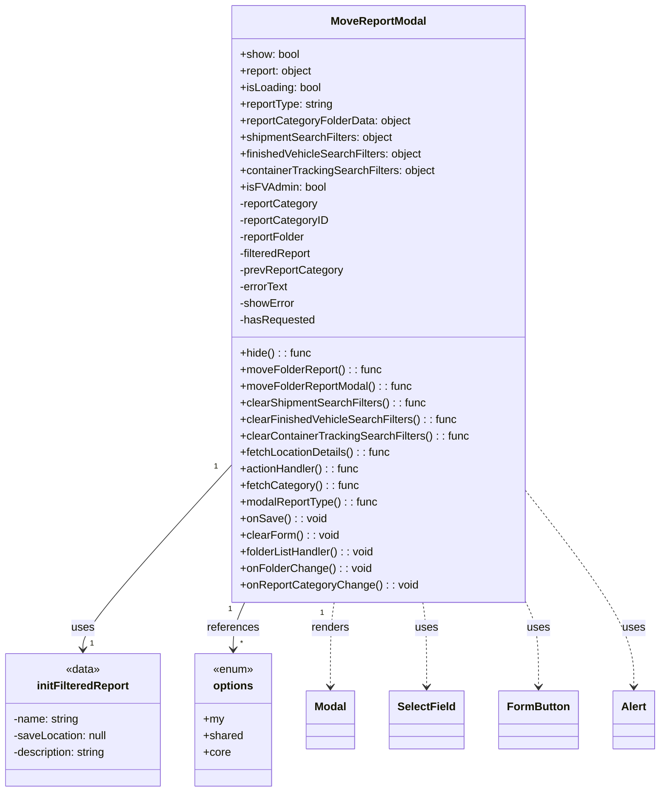

# Diagram: web/portal/src/pages/reports/bi-dashboard/components/MoveReport.modal.js


> Auto-generated by Obscura crawlers

## Diagram 1



### SVG

<svg id="container" width="947.7890625" xmlns="http://www.w3.org/2000/svg" class="classDiagram" height="1146" viewBox="0 0 947.7890625 1146" role="graphics-document document" aria-roledescription="class"><style>#container{font-family:"trebuchet ms",verdana,arial,sans-serif;font-size:16px;fill:#333;}@keyframes edge-animation-frame{from{stroke-dashoffset:0;}}@keyframes dash{to{stroke-dashoffset:0;}}#container .edge-animation-slow{stroke-dasharray:9,5!important;stroke-dashoffset:900;animation:dash 50s linear infinite;stroke-linecap:round;}#container .edge-animation-fast{stroke-dasharray:9,5!important;stroke-dashoffset:900;animation:dash 20s linear infinite;stroke-linecap:round;}#container .error-icon{fill:#552222;}#container .error-text{fill:#552222;stroke:#552222;}#container .edge-thickness-normal{stroke-width:1px;}#container .edge-thickness-thick{stroke-width:3.5px;}#container .edge-pattern-solid{stroke-dasharray:0;}#container .edge-thickness-invisible{stroke-width:0;fill:none;}#container .edge-pattern-dashed{stroke-dasharray:3;}#container .edge-pattern-dotted{stroke-dasharray:2;}#container .marker{fill:#333333;stroke:#333333;}#container .marker.cross{stroke:#333333;}#container svg{font-family:"trebuchet ms",verdana,arial,sans-serif;font-size:16px;}#container p{margin:0;}#container g.classGroup text{fill:#9370DB;stroke:none;font-family:"trebuchet ms",verdana,arial,sans-serif;font-size:10px;}#container g.classGroup text .title{font-weight:bolder;}#container .nodeLabel,#container .edgeLabel{color:#131300;}#container .edgeLabel .label rect{fill:#ECECFF;}#container .label text{fill:#131300;}#container .labelBkg{background:#ECECFF;}#container .edgeLabel .label span{background:#ECECFF;}#container .classTitle{font-weight:bolder;}#container .node rect,#container .node circle,#container .node ellipse,#container .node polygon,#container .node path{fill:#ECECFF;stroke:#9370DB;stroke-width:1px;}#container .divider{stroke:#9370DB;stroke-width:1;}#container g.clickable{cursor:pointer;}#container g.classGroup rect{fill:#ECECFF;stroke:#9370DB;}#container g.classGroup line{stroke:#9370DB;stroke-width:1;}#container .classLabel .box{stroke:none;stroke-width:0;fill:#ECECFF;opacity:0.5;}#container .classLabel .label{fill:#9370DB;font-size:10px;}#container .relation{stroke:#333333;stroke-width:1;fill:none;}#container .dashed-line{stroke-dasharray:3;}#container .dotted-line{stroke-dasharray:1 2;}#container #compositionStart,#container .composition{fill:#333333!important;stroke:#333333!important;stroke-width:1;}#container #compositionEnd,#container .composition{fill:#333333!important;stroke:#333333!important;stroke-width:1;}#container #dependencyStart,#container .dependency{fill:#333333!important;stroke:#333333!important;stroke-width:1;}#container #dependencyStart,#container .dependency{fill:#333333!important;stroke:#333333!important;stroke-width:1;}#container #extensionStart,#container .extension{fill:transparent!important;stroke:#333333!important;stroke-width:1;}#container #extensionEnd,#container .extension{fill:transparent!important;stroke:#333333!important;stroke-width:1;}#container #aggregationStart,#container .aggregation{fill:transparent!important;stroke:#333333!important;stroke-width:1;}#container #aggregationEnd,#container .aggregation{fill:transparent!important;stroke:#333333!important;stroke-width:1;}#container #lollipopStart,#container .lollipop{fill:#ECECFF!important;stroke:#333333!important;stroke-width:1;}#container #lollipopEnd,#container .lollipop{fill:#ECECFF!important;stroke:#333333!important;stroke-width:1;}#container .edgeTerminals{font-size:11px;line-height:initial;}#container .classTitleText{text-anchor:middle;font-size:18px;fill:#333;}#container .label-icon{display:inline-block;height:1em;overflow:visible;vertical-align:-0.125em;}#container .node .label-icon path{fill:currentColor;stroke:revert;stroke-width:revert;}#container :root{--mermaid-font-family:"trebuchet ms",verdana,arial,sans-serif;}</style><g><defs><marker id="container_class-aggregationStart" class="marker aggregation class" refX="18" refY="7" markerWidth="190" markerHeight="240" orient="auto"><path d="M 18,7 L9,13 L1,7 L9,1 Z"></path></marker></defs><defs><marker id="container_class-aggregationEnd" class="marker aggregation class" refX="1" refY="7" markerWidth="20" markerHeight="28" orient="auto"><path d="M 18,7 L9,13 L1,7 L9,1 Z"></path></marker></defs><defs><marker id="container_class-extensionStart" class="marker extension class" refX="18" refY="7" markerWidth="190" markerHeight="240" orient="auto"><path d="M 1,7 L18,13 V 1 Z"></path></marker></defs><defs><marker id="container_class-extensionEnd" class="marker extension class" refX="1" refY="7" markerWidth="20" markerHeight="28" orient="auto"><path d="M 1,1 V 13 L18,7 Z"></path></marker></defs><defs><marker id="container_class-compositionStart" class="marker composition class" refX="18" refY="7" markerWidth="190" markerHeight="240" orient="auto"><path d="M 18,7 L9,13 L1,7 L9,1 Z"></path></marker></defs><defs><marker id="container_class-compositionEnd" class="marker composition class" refX="1" refY="7" markerWidth="20" markerHeight="28" orient="auto"><path d="M 18,7 L9,13 L1,7 L9,1 Z"></path></marker></defs><defs><marker id="container_class-dependencyStart" class="marker dependency class" refX="6" refY="7" markerWidth="190" markerHeight="240" orient="auto"><path d="M 5,7 L9,13 L1,7 L9,1 Z"></path></marker></defs><defs><marker id="container_class-dependencyEnd" class="marker dependency class" refX="13" refY="7" markerWidth="20" markerHeight="28" orient="auto"><path d="M 18,7 L9,13 L14,7 L9,1 Z"></path></marker></defs><defs><marker id="container_class-lollipopStart" class="marker lollipop class" refX="13" refY="7" markerWidth="190" markerHeight="240" orient="auto"><circle stroke="black" fill="transparent" cx="7" cy="7" r="6"></circle></marker></defs><defs><marker id="container_class-lollipopEnd" class="marker lollipop class" refX="1" refY="7" markerWidth="190" markerHeight="240" orient="auto"><circle stroke="black" fill="transparent" cx="7" cy="7" r="6"></circle></marker></defs><g class="root"><g class="clusters"></g><g class="edgePaths"><path d="M339.391,670.525L303.144,710.271C266.897,750.017,194.404,829.508,158.157,874.421C121.91,919.333,121.91,929.667,121.91,934.833L121.91,940" id="id_MoveReportModal_initFilteredReport_1" class="edge-thickness-normal edge-pattern-solid relation" style=";;;" data-edge="true" data-et="edge" data-id="id_MoveReportModal_initFilteredReport_1" data-points="W3sieCI6MzM5LjM5MDYyNSwieSI6NjcwLjUyNTA2MDczMzkyMTV9LHsieCI6MTIxLjkxMDE1NjI1LCJ5Ijo5MDl9LHsieCI6MTIxLjkxMDE1NjI1LCJ5Ijo5NDZ9XQ==" marker-end="url(#container_class-dependencyEnd)"></path><path d="M357.782,872L355.044,878.167C352.305,884.333,346.828,896.667,344.09,908C341.352,919.333,341.352,929.667,341.352,934.833L341.352,940" id="id_MoveReportModal_options_2" class="edge-thickness-normal edge-pattern-solid relation" style=";;;" data-edge="true" data-et="edge" data-id="id_MoveReportModal_options_2" data-points="W3sieCI6MzU3Ljc4MjIwNzgyMjQ5NDcsInkiOjg3Mn0seyJ4IjozNDEuMzUxNTYyNSwieSI6OTA5fSx7IngiOjM0MS4zNTE1NjI1LCJ5Ijo5NDZ9XQ==" marker-end="url(#container_class-dependencyEnd)"></path><path d="M486.716,872L485.818,878.167C484.92,884.333,483.124,896.667,482.226,917C481.328,937.333,481.328,965.667,481.328,979.833L481.328,994" id="id_MoveReportModal_Modal_3" class="edge-thickness-normal edge-pattern-dashed relation" style=";;;" data-edge="true" data-et="edge" data-id="id_MoveReportModal_Modal_3" data-points="W3sieCI6NDg2LjcxNTg0MzIxNjk1MDkzLCJ5Ijo4NzJ9LHsieCI6NDgxLjMyODEyNSwieSI6OTA5fSx7IngiOjQ4MS4zMjgxMjUsInkiOjEwMDB9XQ==" marker-end="url(#container_class-dependencyEnd)"></path><path d="M612.526,872L613.424,878.167C614.322,884.333,616.118,896.667,617.016,917C617.914,937.333,617.914,965.667,617.914,979.833L617.914,994" id="id_MoveReportModal_SelectField_4" class="edge-thickness-normal edge-pattern-dashed relation" style=";;;" data-edge="true" data-et="edge" data-id="id_MoveReportModal_SelectField_4" data-points="W3sieCI6NjEyLjUyNjM0NDI4MzA0OTEsInkiOjg3Mn0seyJ4Ijo2MTcuOTE0MDYyNSwieSI6OTA5fSx7IngiOjYxNy45MTQwNjI1LCJ5IjoxMDAwfV0=" marker-end="url(#container_class-dependencyEnd)"></path><path d="M757.356,872L760.322,878.167C763.287,884.333,769.218,896.667,772.183,917C775.148,937.333,775.148,965.667,775.148,979.833L775.148,994" id="id_MoveReportModal_FormButton_5" class="edge-thickness-normal edge-pattern-dashed relation" style=";;;" data-edge="true" data-et="edge" data-id="id_MoveReportModal_FormButton_5" data-points="W3sieCI6NzU3LjM1NjMwMTYzOTEyNTgsInkiOjg3Mn0seyJ4Ijo3NzUuMTQ4NDM3NSwieSI6OTA5fSx7IngiOjc3NS4xNDg0Mzc1LCJ5IjoxMDAwfV0=" marker-end="url(#container_class-dependencyEnd)"></path><path d="M759.852,713.584L784.879,746.153C809.906,778.723,859.961,843.861,884.988,890.597C910.016,937.333,910.016,965.667,910.016,979.833L910.016,994" id="id_MoveReportModal_Alert_6" class="edge-thickness-normal edge-pattern-dashed relation" style=";;;" data-edge="true" data-et="edge" data-id="id_MoveReportModal_Alert_6" data-points="W3sieCI6NzU5Ljg1MTU2MjUsInkiOjcxMy41ODM3NTY5NTAzOTA4fSx7IngiOjkxMC4wMTU2MjUsInkiOjkwOX0seyJ4Ijo5MTAuMDE1NjI1LCJ5IjoxMDAwfV0=" marker-end="url(#container_class-dependencyEnd)"></path></g><g class="edgeLabels"><g class="edgeLabel" transform="translate(121.91015625, 909)"><g class="label" data-id="id_MoveReportModal_initFilteredReport_1" transform="translate(-16.4921875, -12)"><foreignObject width="32.984375" height="24"><div xmlns="http://www.w3.org/1999/xhtml" class="labelBkg" style="display: table-cell; white-space: nowrap; line-height: 1.5; max-width: 200px; text-align: center;"><span class="edgeLabel"><p>uses</p></span></div></foreignObject></g></g><g class="edgeLabel" transform="translate(341.3515625, 909)"><g class="label" data-id="id_MoveReportModal_options_2" transform="translate(-37.828125, -12)"><foreignObject width="75.65625" height="24"><div xmlns="http://www.w3.org/1999/xhtml" class="labelBkg" style="display: table-cell; white-space: nowrap; line-height: 1.5; max-width: 200px; text-align: center;"><span class="edgeLabel"><p>references</p></span></div></foreignObject></g></g><g class="edgeLabel" transform="translate(481.328125, 909)"><g class="label" data-id="id_MoveReportModal_Modal_3" transform="translate(-27.75, -12)"><foreignObject width="55.5" height="24"><div xmlns="http://www.w3.org/1999/xhtml" class="labelBkg" style="display: table-cell; white-space: nowrap; line-height: 1.5; max-width: 200px; text-align: center;"><span class="edgeLabel"><p>renders</p></span></div></foreignObject></g></g><g class="edgeLabel" transform="translate(617.9140625, 909)"><g class="label" data-id="id_MoveReportModal_SelectField_4" transform="translate(-16.4921875, -12)"><foreignObject width="32.984375" height="24"><div xmlns="http://www.w3.org/1999/xhtml" class="labelBkg" style="display: table-cell; white-space: nowrap; line-height: 1.5; max-width: 200px; text-align: center;"><span class="edgeLabel"><p>uses</p></span></div></foreignObject></g></g><g class="edgeLabel" transform="translate(775.1484375, 909)"><g class="label" data-id="id_MoveReportModal_FormButton_5" transform="translate(-16.4921875, -12)"><foreignObject width="32.984375" height="24"><div xmlns="http://www.w3.org/1999/xhtml" class="labelBkg" style="display: table-cell; white-space: nowrap; line-height: 1.5; max-width: 200px; text-align: center;"><span class="edgeLabel"><p>uses</p></span></div></foreignObject></g></g><g class="edgeLabel" transform="translate(910.015625, 909)"><g class="label" data-id="id_MoveReportModal_Alert_6" transform="translate(-16.4921875, -12)"><foreignObject width="32.984375" height="24"><div xmlns="http://www.w3.org/1999/xhtml" class="labelBkg" style="display: table-cell; white-space: nowrap; line-height: 1.5; max-width: 200px; text-align: center;"><span class="edgeLabel"><p>uses</p></span></div></foreignObject></g></g><g class="edgeTerminals" transform="translate(316.51528855291923, 673.3479925946754)"><g class="inner" transform="translate(0, 0)"><foreignObject style="width: 9px; height: 12px;"><div xmlns="http://www.w3.org/1999/xhtml" style="display: inline-block; padding-right: 1px; white-space: nowrap;"><span class="edgeLabel">1</span></div></foreignObject></g></g><g class="edgeTerminals" transform="translate(336.97069450526163, 881.9061061970015)"><g class="inner" transform="translate(0, 0)"><foreignObject style="width: 9px; height: 12px;"><div xmlns="http://www.w3.org/1999/xhtml" style="display: inline-block; padding-right: 1px; white-space: nowrap;"><span class="edgeLabel">1</span></div></foreignObject></g></g><g class="edgeTerminals" transform="translate(469.35073234886545, 887.1559544434036)"><g class="inner" transform="translate(0, 0)"><foreignObject style="width: 9px; height: 12px;"><div xmlns="http://www.w3.org/1999/xhtml" style="display: inline-block; padding-right: 1px; white-space: nowrap;"><span class="edgeLabel">1</span></div></foreignObject></g></g><g class="edgeTerminals" transform="translate(131.91015812499992, 923.5000016071428)"><g class="inner" transform="translate(0, 0)"></g><foreignObject style="width: 9px; height: 12px;"><div xmlns="http://www.w3.org/1999/xhtml" style="display: inline-block; padding-right: 1px; white-space: nowrap;"><span class="edgeLabel">1</span></div></foreignObject></g><g class="edgeTerminals" transform="translate(351.35156125, 923.4999989285715)"><g class="inner" transform="translate(0, 0)"></g><foreignObject style="width: 9px; height: 12px;"><div xmlns="http://www.w3.org/1999/xhtml" style="display: inline-block; padding-right: 1px; white-space: nowrap;"><span class="edgeLabel">*</span></div></foreignObject></g></g><g class="nodes"><g class="node default" id="classId-MoveReportModal-0" transform="translate(549.62109375, 440)"><g class="basic label-container"><path d="M-210.23046875 -432 L210.23046875 -432 L210.23046875 432 L-210.23046875 432" stroke="none" stroke-width="0" fill="#ECECFF" style=""></path><path d="M-210.23046875 -432 C-55.52241642271136 -432, 99.18563590457728 -432, 210.23046875 -432 M-210.23046875 -432 C-68.74210203587486 -432, 72.74626467825027 -432, 210.23046875 -432 M210.23046875 -432 C210.23046875 -131.28049124215852, 210.23046875 169.43901751568296, 210.23046875 432 M210.23046875 -432 C210.23046875 -137.30422886701842, 210.23046875 157.39154226596315, 210.23046875 432 M210.23046875 432 C70.04963367513005 432, -70.1312013997399 432, -210.23046875 432 M210.23046875 432 C82.29905297367789 432, -45.632362802644224 432, -210.23046875 432 M-210.23046875 432 C-210.23046875 103.35416826890491, -210.23046875 -225.29166346219017, -210.23046875 -432 M-210.23046875 432 C-210.23046875 153.3486464198765, -210.23046875 -125.302707160247, -210.23046875 -432" stroke="#9370DB" stroke-width="1.3" fill="none" stroke-dasharray="0 0" style=""></path></g><g class="annotation-group text" transform="translate(0, -408)"></g><g class="label-group text" transform="translate(-66.7734375, -408)"><g class="label" style="font-weight: bolder" transform="translate(0,-12)"><foreignObject width="133.546875" height="24"><div xmlns="http://www.w3.org/1999/xhtml" style="display: table-cell; white-space: nowrap; line-height: 1.5; max-width: 182px; text-align: center;"><span class="nodeLabel markdown-node-label" style=""><p>MoveReportModal</p></span></div></foreignObject></g></g><g class="members-group text" transform="translate(-198.23046875, -360)"><g class="label" style="" transform="translate(0,-12)"><foreignObject width="86.6875" height="24"><div xmlns="http://www.w3.org/1999/xhtml" style="display: table-cell; white-space: nowrap; line-height: 1.5; max-width: 144px; text-align: center;"><span class="nodeLabel markdown-node-label" style=""><p>+show: bool</p></span></div></foreignObject></g><g class="label" style="" transform="translate(0,12)"><foreignObject width="106.828125" height="24"><div xmlns="http://www.w3.org/1999/xhtml" style="display: table-cell; white-space: nowrap; line-height: 1.5; max-width: 164px; text-align: center;"><span class="nodeLabel markdown-node-label" style=""><p>+report: object</p></span></div></foreignObject></g><g class="label" style="" transform="translate(0,36)"><foreignObject width="118.171875" height="24"><div xmlns="http://www.w3.org/1999/xhtml" style="display: table-cell; white-space: nowrap; line-height: 1.5; max-width: 176px; text-align: center;"><span class="nodeLabel markdown-node-label" style=""><p>+isLoading: bool</p></span></div></foreignObject></g><g class="label" style="" transform="translate(0,60)"><foreignObject width="136.640625" height="24"><div xmlns="http://www.w3.org/1999/xhtml" style="display: table-cell; white-space: nowrap; line-height: 1.5; max-width: 195px; text-align: center;"><span class="nodeLabel markdown-node-label" style=""><p>+reportType: string</p></span></div></foreignObject></g><g class="label" style="" transform="translate(0,84)"><foreignObject width="248.90625" height="24"><div xmlns="http://www.w3.org/1999/xhtml" style="display: table-cell; white-space: nowrap; line-height: 1.5; max-width: 306px; text-align: center;"><span class="nodeLabel markdown-node-label" style=""><p>+reportCategoryFolderData: object</p></span></div></foreignObject></g><g class="label" style="" transform="translate(0,108)"><foreignObject width="222.859375" height="24"><div xmlns="http://www.w3.org/1999/xhtml" style="display: table-cell; white-space: nowrap; line-height: 1.5; max-width: 280px; text-align: center;"><span class="nodeLabel markdown-node-label" style=""><p>+shipmentSearchFilters: object</p></span></div></foreignObject></g><g class="label" style="" transform="translate(0,132)"><foreignObject width="264.46875" height="24"><div xmlns="http://www.w3.org/1999/xhtml" style="display: table-cell; white-space: nowrap; line-height: 1.5; max-width: 322px; text-align: center;"><span class="nodeLabel markdown-node-label" style=""><p>+finishedVehicleSearchFilters: object</p></span></div></foreignObject></g><g class="label" style="" transform="translate(0,156)"><foreignObject width="283.765625" height="24"><div xmlns="http://www.w3.org/1999/xhtml" style="display: table-cell; white-space: nowrap; line-height: 1.5; max-width: 341px; text-align: center;"><span class="nodeLabel markdown-node-label" style=""><p>+containerTrackingSearchFilters: object</p></span></div></foreignObject></g><g class="label" style="" transform="translate(0,180)"><foreignObject width="123.796875" height="24"><div xmlns="http://www.w3.org/1999/xhtml" style="display: table-cell; white-space: nowrap; line-height: 1.5; max-width: 181px; text-align: center;"><span class="nodeLabel markdown-node-label" style=""><p>+isFVAdmin: bool</p></span></div></foreignObject></g><g class="label" style="" transform="translate(0,204)"><foreignObject width="114.890625" height="24"><div xmlns="http://www.w3.org/1999/xhtml" style="display: table-cell; white-space: nowrap; line-height: 1.5; max-width: 172px; text-align: center;"><span class="nodeLabel markdown-node-label" style=""><p>-reportCategory</p></span></div></foreignObject></g><g class="label" style="" transform="translate(0,228)"><foreignObject width="129.90625" height="24"><div xmlns="http://www.w3.org/1999/xhtml" style="display: table-cell; white-space: nowrap; line-height: 1.5; max-width: 187px; text-align: center;"><span class="nodeLabel markdown-node-label" style=""><p>-reportCategoryID</p></span></div></foreignObject></g><g class="label" style="" transform="translate(0,252)"><foreignObject width="97.390625" height="24"><div xmlns="http://www.w3.org/1999/xhtml" style="display: table-cell; white-space: nowrap; line-height: 1.5; max-width: 156px; text-align: center;"><span class="nodeLabel markdown-node-label" style=""><p>-reportFolder</p></span></div></foreignObject></g><g class="label" style="" transform="translate(0,276)"><foreignObject width="107.296875" height="24"><div xmlns="http://www.w3.org/1999/xhtml" style="display: table-cell; white-space: nowrap; line-height: 1.5; max-width: 165px; text-align: center;"><span class="nodeLabel markdown-node-label" style=""><p>-filteredReport</p></span></div></foreignObject></g><g class="label" style="" transform="translate(0,300)"><foreignObject width="150.359375" height="24"><div xmlns="http://www.w3.org/1999/xhtml" style="display: table-cell; white-space: nowrap; line-height: 1.5; max-width: 208px; text-align: center;"><span class="nodeLabel markdown-node-label" style=""><p>-prevReportCategory</p></span></div></foreignObject></g><g class="label" style="" transform="translate(0,324)"><foreignObject width="72.078125" height="24"><div xmlns="http://www.w3.org/1999/xhtml" style="display: table-cell; white-space: nowrap; line-height: 1.5; max-width: 130px; text-align: center;"><span class="nodeLabel markdown-node-label" style=""><p>-errorText</p></span></div></foreignObject></g><g class="label" style="" transform="translate(0,348)"><foreignObject width="79.90625" height="24"><div xmlns="http://www.w3.org/1999/xhtml" style="display: table-cell; white-space: nowrap; line-height: 1.5; max-width: 138px; text-align: center;"><span class="nodeLabel markdown-node-label" style=""><p>-showError</p></span></div></foreignObject></g><g class="label" style="" transform="translate(0,372)"><foreignObject width="108.90625" height="24"><div xmlns="http://www.w3.org/1999/xhtml" style="display: table-cell; white-space: nowrap; line-height: 1.5; max-width: 166px; text-align: center;"><span class="nodeLabel markdown-node-label" style=""><p>-hasRequested</p></span></div></foreignObject></g></g><g class="methods-group text" transform="translate(-198.23046875, 72)"><g class="label" style="" transform="translate(0,-12)"><foreignObject width="102.625" height="24"><div xmlns="http://www.w3.org/1999/xhtml" style="display: table-cell; white-space: nowrap; line-height: 1.5; max-width: 160px; text-align: center;"><span class="nodeLabel markdown-node-label" style=""><p>+hide() : : func</p></span></div></foreignObject></g><g class="label" style="" transform="translate(0,12)"><foreignObject width="204.640625" height="24"><div xmlns="http://www.w3.org/1999/xhtml" style="display: table-cell; white-space: nowrap; line-height: 1.5; max-width: 262px; text-align: center;"><span class="nodeLabel markdown-node-label" style=""><p>+moveFolderReport() : : func</p></span></div></foreignObject></g><g class="label" style="" transform="translate(0,36)"><foreignObject width="249.234375" height="24"><div xmlns="http://www.w3.org/1999/xhtml" style="display: table-cell; white-space: nowrap; line-height: 1.5; max-width: 307px; text-align: center;"><span class="nodeLabel markdown-node-label" style=""><p>+moveFolderReportModal() : : func</p></span></div></foreignObject></g><g class="label" style="" transform="translate(0,60)"><foreignObject width="268.71875" height="24"><div xmlns="http://www.w3.org/1999/xhtml" style="display: table-cell; white-space: nowrap; line-height: 1.5; max-width: 326px; text-align: center;"><span class="nodeLabel markdown-node-label" style=""><p>+clearShipmentSearchFilters() : : func</p></span></div></foreignObject></g><g class="label" style="" transform="translate(0,84)"><foreignObject width="311.921875" height="24"><div xmlns="http://www.w3.org/1999/xhtml" style="display: table-cell; white-space: nowrap; line-height: 1.5; max-width: 370px; text-align: center;"><span class="nodeLabel markdown-node-label" style=""><p>+clearFinishedVehicleSearchFilters() : : func</p></span></div></foreignObject></g><g class="label" style="" transform="translate(0,108)"><foreignObject width="329.6875" height="24"><div xmlns="http://www.w3.org/1999/xhtml" style="display: table-cell; white-space: nowrap; line-height: 1.5; max-width: 387px; text-align: center;"><span class="nodeLabel markdown-node-label" style=""><p>+clearContainerTrackingSearchFilters() : : func</p></span></div></foreignObject></g><g class="label" style="" transform="translate(0,132)"><foreignObject width="218.875" height="24"><div xmlns="http://www.w3.org/1999/xhtml" style="display: table-cell; white-space: nowrap; line-height: 1.5; max-width: 277px; text-align: center;"><span class="nodeLabel markdown-node-label" style=""><p>+fetchLocationDetails() : : func</p></span></div></foreignObject></g><g class="label" style="" transform="translate(0,156)"><foreignObject width="173.609375" height="24"><div xmlns="http://www.w3.org/1999/xhtml" style="display: table-cell; white-space: nowrap; line-height: 1.5; max-width: 231px; text-align: center;"><span class="nodeLabel markdown-node-label" style=""><p>+actionHandler() : : func</p></span></div></foreignObject></g><g class="label" style="" transform="translate(0,180)"><foreignObject width="169.90625" height="24"><div xmlns="http://www.w3.org/1999/xhtml" style="display: table-cell; white-space: nowrap; line-height: 1.5; max-width: 228px; text-align: center;"><span class="nodeLabel markdown-node-label" style=""><p>+fetchCategory() : : func</p></span></div></foreignObject></g><g class="label" style="" transform="translate(0,204)"><foreignObject width="199" height="24"><div xmlns="http://www.w3.org/1999/xhtml" style="display: table-cell; white-space: nowrap; line-height: 1.5; max-width: 257px; text-align: center;"><span class="nodeLabel markdown-node-label" style=""><p>+modalReportType() : : func</p></span></div></foreignObject></g><g class="label" style="" transform="translate(0,228)"><foreignObject width="122.421875" height="24"><div xmlns="http://www.w3.org/1999/xhtml" style="display: table-cell; white-space: nowrap; line-height: 1.5; max-width: 180px; text-align: center;"><span class="nodeLabel markdown-node-label" style=""><p>+onSave() : : void</p></span></div></foreignObject></g><g class="label" style="" transform="translate(0,252)"><foreignObject width="142.21875" height="24"><div xmlns="http://www.w3.org/1999/xhtml" style="display: table-cell; white-space: nowrap; line-height: 1.5; max-width: 200px; text-align: center;"><span class="nodeLabel markdown-node-label" style=""><p>+clearForm() : : void</p></span></div></foreignObject></g><g class="label" style="" transform="translate(0,276)"><foreignObject width="197.125" height="24"><div xmlns="http://www.w3.org/1999/xhtml" style="display: table-cell; white-space: nowrap; line-height: 1.5; max-width: 254px; text-align: center;"><span class="nodeLabel markdown-node-label" style=""><p>+folderListHandler() : : void</p></span></div></foreignObject></g><g class="label" style="" transform="translate(0,300)"><foreignObject width="187.46875" height="24"><div xmlns="http://www.w3.org/1999/xhtml" style="display: table-cell; white-space: nowrap; line-height: 1.5; max-width: 245px; text-align: center;"><span class="nodeLabel markdown-node-label" style=""><p>+onFolderChange() : : void</p></span></div></foreignObject></g><g class="label" style="" transform="translate(0,324)"><foreignObject width="253.921875" height="24"><div xmlns="http://www.w3.org/1999/xhtml" style="display: table-cell; white-space: nowrap; line-height: 1.5; max-width: 311px; text-align: center;"><span class="nodeLabel markdown-node-label" style=""><p>+onReportCategoryChange() : : void</p></span></div></foreignObject></g></g><g class="divider" style=""><path d="M-210.23046875 -384 C-56.013106152468396 -384, 98.20425644506321 -384, 210.23046875 -384 M-210.23046875 -384 C-93.14332993508245 -384, 23.943808879835103 -384, 210.23046875 -384" stroke="#9370DB" stroke-width="1.3" fill="none" stroke-dasharray="0 0" style=""></path></g><g class="divider" style=""><path d="M-210.23046875 48 C-97.72498963163696 48, 14.780489486726083 48, 210.23046875 48 M-210.23046875 48 C-100.78077237958324 48, 8.66892399083352 48, 210.23046875 48" stroke="#9370DB" stroke-width="1.3" fill="none" stroke-dasharray="0 0" style=""></path></g></g><g class="node default" id="classId-initFilteredReport-1" transform="translate(121.91015625, 1042)"><g class="basic label-container"><path d="M-113.91015625 -96 L113.91015625 -96 L113.91015625 96 L-113.91015625 96" stroke="none" stroke-width="0" fill="#ECECFF" style=""></path><path d="M-113.91015625 -96 C-32.514654129501025 -96, 48.88084799099795 -96, 113.91015625 -96 M-113.91015625 -96 C-23.215624607371197 -96, 67.4789070352576 -96, 113.91015625 -96 M113.91015625 -96 C113.91015625 -37.91165754743113, 113.91015625 20.176684905137733, 113.91015625 96 M113.91015625 -96 C113.91015625 -49.20592954290281, 113.91015625 -2.4118590858056166, 113.91015625 96 M113.91015625 96 C64.73381848025394 96, 15.557480710507875 96, -113.91015625 96 M113.91015625 96 C47.57934532589883 96, -18.751465598202344 96, -113.91015625 96 M-113.91015625 96 C-113.91015625 29.528483956108346, -113.91015625 -36.94303208778331, -113.91015625 -96 M-113.91015625 96 C-113.91015625 52.59404353326958, -113.91015625 9.188087066539154, -113.91015625 -96" stroke="#9370DB" stroke-width="1.3" fill="none" stroke-dasharray="0 0" style=""></path></g><g class="annotation-group text" transform="translate(-25.2890625, -72)"><g class="label" style="" transform="translate(0,-12)"><foreignObject width="50.578125" height="24"><div xmlns="http://www.w3.org/1999/xhtml" style="display: table-cell; white-space: nowrap; line-height: 1.5; max-width: 101px; text-align: center;"><span class="nodeLabel markdown-node-label" style=""><p>«data»</p></span></div></foreignObject></g></g><g class="label-group text" transform="translate(-65.0390625, -48)"><g class="label" style="font-weight: bolder" transform="translate(0,-12)"><foreignObject width="130.078125" height="24"><div xmlns="http://www.w3.org/1999/xhtml" style="display: table-cell; white-space: nowrap; line-height: 1.5; max-width: 178px; text-align: center;"><span class="nodeLabel markdown-node-label" style=""><p>initFilteredReport</p></span></div></foreignObject></g></g><g class="members-group text" transform="translate(-101.91015625, 0)"><g class="label" style="" transform="translate(0,-12)"><foreignObject width="96.6875" height="24"><div xmlns="http://www.w3.org/1999/xhtml" style="display: table-cell; white-space: nowrap; line-height: 1.5; max-width: 155px; text-align: center;"><span class="nodeLabel markdown-node-label" style=""><p>-name: string</p></span></div></foreignObject></g><g class="label" style="" transform="translate(0,12)"><foreignObject width="137.015625" height="24"><div xmlns="http://www.w3.org/1999/xhtml" style="display: table-cell; white-space: nowrap; line-height: 1.5; max-width: 195px; text-align: center;"><span class="nodeLabel markdown-node-label" style=""><p>-saveLocation: null</p></span></div></foreignObject></g><g class="label" style="" transform="translate(0,36)"><foreignObject width="138.78125" height="24"><div xmlns="http://www.w3.org/1999/xhtml" style="display: table-cell; white-space: nowrap; line-height: 1.5; max-width: 197px; text-align: center;"><span class="nodeLabel markdown-node-label" style=""><p>-description: string</p></span></div></foreignObject></g></g><g class="methods-group text" transform="translate(-101.91015625, 96)"></g><g class="divider" style=""><path d="M-113.91015625 -24 C-39.16255228478143 -24, 35.58505168043715 -24, 113.91015625 -24 M-113.91015625 -24 C-32.549687274423164 -24, 48.81078170115367 -24, 113.91015625 -24" stroke="#9370DB" stroke-width="1.3" fill="none" stroke-dasharray="0 0" style=""></path></g><g class="divider" style=""><path d="M-113.91015625 72 C-37.320237745430475 72, 39.26968075913905 72, 113.91015625 72 M-113.91015625 72 C-32.354266681027156 72, 49.20162288794569 72, 113.91015625 72" stroke="#9370DB" stroke-width="1.3" fill="none" stroke-dasharray="0 0" style=""></path></g></g><g class="node default" id="classId-options-2" transform="translate(341.3515625, 1042)"><g class="basic label-container"><path d="M-55.53125 -96 L55.53125 -96 L55.53125 96 L-55.53125 96" stroke="none" stroke-width="0" fill="#ECECFF" style=""></path><path d="M-55.53125 -96 C-16.973628116947637 -96, 21.583993766104726 -96, 55.53125 -96 M-55.53125 -96 C-28.37566318265219 -96, -1.2200763653043794 -96, 55.53125 -96 M55.53125 -96 C55.53125 -33.85391508799255, 55.53125 28.292169824014906, 55.53125 96 M55.53125 -96 C55.53125 -53.91281670829873, 55.53125 -11.825633416597455, 55.53125 96 M55.53125 96 C23.013990764138875 96, -9.50326847172225 96, -55.53125 96 M55.53125 96 C13.649410860850537 96, -28.232428278298926 96, -55.53125 96 M-55.53125 96 C-55.53125 24.594879121745365, -55.53125 -46.81024175650927, -55.53125 -96 M-55.53125 96 C-55.53125 23.86735990949107, -55.53125 -48.26528018101786, -55.53125 -96" stroke="#9370DB" stroke-width="1.3" fill="none" stroke-dasharray="0 0" style=""></path></g><g class="annotation-group text" transform="translate(-29.53125, -72)"><g class="label" style="" transform="translate(0,-12)"><foreignObject width="59.0625" height="24"><div xmlns="http://www.w3.org/1999/xhtml" style="display: table-cell; white-space: nowrap; line-height: 1.5; max-width: 109px; text-align: center;"><span class="nodeLabel markdown-node-label" style=""><p>«enum»</p></span></div></foreignObject></g></g><g class="label-group text" transform="translate(-27.9453125, -48)"><g class="label" style="font-weight: bolder" transform="translate(0,-12)"><foreignObject width="55.890625" height="24"><div xmlns="http://www.w3.org/1999/xhtml" style="display: table-cell; white-space: nowrap; line-height: 1.5; max-width: 105px; text-align: center;"><span class="nodeLabel markdown-node-label" style=""><p>options</p></span></div></foreignObject></g></g><g class="members-group text" transform="translate(-43.53125, 0)"><g class="label" style="" transform="translate(0,-12)"><foreignObject width="29.46875" height="24"><div xmlns="http://www.w3.org/1999/xhtml" style="display: table-cell; white-space: nowrap; line-height: 1.5; max-width: 87px; text-align: center;"><span class="nodeLabel markdown-node-label" style=""><p>+my</p></span></div></foreignObject></g><g class="label" style="" transform="translate(0,12)"><foreignObject width="57.53125" height="24"><div xmlns="http://www.w3.org/1999/xhtml" style="display: table-cell; white-space: nowrap; line-height: 1.5; max-width: 115px; text-align: center;"><span class="nodeLabel markdown-node-label" style=""><p>+shared</p></span></div></foreignObject></g><g class="label" style="" transform="translate(0,36)"><foreignObject width="39.078125" height="24"><div xmlns="http://www.w3.org/1999/xhtml" style="display: table-cell; white-space: nowrap; line-height: 1.5; max-width: 96px; text-align: center;"><span class="nodeLabel markdown-node-label" style=""><p>+core</p></span></div></foreignObject></g></g><g class="methods-group text" transform="translate(-43.53125, 96)"></g><g class="divider" style=""><path d="M-55.53125 -24 C-26.53114285127614 -24, 2.4689642974477195 -24, 55.53125 -24 M-55.53125 -24 C-12.927130354629519 -24, 29.676989290740963 -24, 55.53125 -24" stroke="#9370DB" stroke-width="1.3" fill="none" stroke-dasharray="0 0" style=""></path></g><g class="divider" style=""><path d="M-55.53125 72 C-20.749384714112757 72, 14.032480571774485 72, 55.53125 72 M-55.53125 72 C-19.334634592833517 72, 16.861980814332966 72, 55.53125 72" stroke="#9370DB" stroke-width="1.3" fill="none" stroke-dasharray="0 0" style=""></path></g></g><g class="node default" id="classId-Modal-3" transform="translate(481.328125, 1042)"><g class="basic label-container"><path d="M-34.4453125 -42 L34.4453125 -42 L34.4453125 42 L-34.4453125 42" stroke="none" stroke-width="0" fill="#ECECFF" style=""></path><path d="M-34.4453125 -42 C-20.122797540095537 -42, -5.800282580191073 -42, 34.4453125 -42 M-34.4453125 -42 C-7.595094033146232 -42, 19.255124433707536 -42, 34.4453125 -42 M34.4453125 -42 C34.4453125 -24.37994147142792, 34.4453125 -6.759882942855839, 34.4453125 42 M34.4453125 -42 C34.4453125 -10.629346692642645, 34.4453125 20.74130661471471, 34.4453125 42 M34.4453125 42 C8.398717972242284 42, -17.64787655551543 42, -34.4453125 42 M34.4453125 42 C10.100101250654074 42, -14.245109998691852 42, -34.4453125 42 M-34.4453125 42 C-34.4453125 17.950763077275013, -34.4453125 -6.098473845449973, -34.4453125 -42 M-34.4453125 42 C-34.4453125 23.576206985155217, -34.4453125 5.152413970310434, -34.4453125 -42" stroke="#9370DB" stroke-width="1.3" fill="none" stroke-dasharray="0 0" style=""></path></g><g class="annotation-group text" transform="translate(0, -18)"></g><g class="label-group text" transform="translate(-22.4453125, -18)"><g class="label" style="font-weight: bolder" transform="translate(0,-12)"><foreignObject width="44.890625" height="24"><div xmlns="http://www.w3.org/1999/xhtml" style="display: table-cell; white-space: nowrap; line-height: 1.5; max-width: 95px; text-align: center;"><span class="nodeLabel markdown-node-label" style=""><p>Modal</p></span></div></foreignObject></g></g><g class="members-group text" transform="translate(-22.4453125, 30)"></g><g class="methods-group text" transform="translate(-22.4453125, 60)"></g><g class="divider" style=""><path d="M-34.4453125 6 C-10.040584151100816 6, 14.364144197798367 6, 34.4453125 6 M-34.4453125 6 C-18.93175382532891 6, -3.4181951506578194 6, 34.4453125 6" stroke="#9370DB" stroke-width="1.3" fill="none" stroke-dasharray="0 0" style=""></path></g><g class="divider" style=""><path d="M-34.4453125 24 C-10.86643260685765 24, 12.7124472862847 24, 34.4453125 24 M-34.4453125 24 C-13.42183517772995 24, 7.601642144540101 24, 34.4453125 24" stroke="#9370DB" stroke-width="1.3" fill="none" stroke-dasharray="0 0" style=""></path></g></g><g class="node default" id="classId-SelectField-4" transform="translate(617.9140625, 1042)"><g class="basic label-container"><path d="M-52.140625 -42 L52.140625 -42 L52.140625 42 L-52.140625 42" stroke="none" stroke-width="0" fill="#ECECFF" style=""></path><path d="M-52.140625 -42 C-12.831581012067403 -42, 26.477462975865194 -42, 52.140625 -42 M-52.140625 -42 C-29.280569165145895 -42, -6.42051333029179 -42, 52.140625 -42 M52.140625 -42 C52.140625 -20.557216013609583, 52.140625 0.8855679727808337, 52.140625 42 M52.140625 -42 C52.140625 -9.952303436127579, 52.140625 22.095393127744842, 52.140625 42 M52.140625 42 C16.130982444240125 42, -19.87866011151975 42, -52.140625 42 M52.140625 42 C17.06619353004571 42, -18.008237939908582 42, -52.140625 42 M-52.140625 42 C-52.140625 16.076184716946027, -52.140625 -9.847630566107945, -52.140625 -42 M-52.140625 42 C-52.140625 19.710112062955268, -52.140625 -2.5797758740894636, -52.140625 -42" stroke="#9370DB" stroke-width="1.3" fill="none" stroke-dasharray="0 0" style=""></path></g><g class="annotation-group text" transform="translate(0, -18)"></g><g class="label-group text" transform="translate(-40.140625, -18)"><g class="label" style="font-weight: bolder" transform="translate(0,-12)"><foreignObject width="80.28125" height="24"><div xmlns="http://www.w3.org/1999/xhtml" style="display: table-cell; white-space: nowrap; line-height: 1.5; max-width: 129px; text-align: center;"><span class="nodeLabel markdown-node-label" style=""><p>SelectField</p></span></div></foreignObject></g></g><g class="members-group text" transform="translate(-40.140625, 30)"></g><g class="methods-group text" transform="translate(-40.140625, 60)"></g><g class="divider" style=""><path d="M-52.140625 6 C-27.81246785095715 6, -3.4843107019143034 6, 52.140625 6 M-52.140625 6 C-26.13051809589481 6, -0.12041119178962134 6, 52.140625 6" stroke="#9370DB" stroke-width="1.3" fill="none" stroke-dasharray="0 0" style=""></path></g><g class="divider" style=""><path d="M-52.140625 24 C-11.137883659755374 24, 29.86485768048925 24, 52.140625 24 M-52.140625 24 C-18.974326163440864 24, 14.191972673118272 24, 52.140625 24" stroke="#9370DB" stroke-width="1.3" fill="none" stroke-dasharray="0 0" style=""></path></g></g><g class="node default" id="classId-FormButton-5" transform="translate(775.1484375, 1042)"><g class="basic label-container"><path d="M-55.09375 -42 L55.09375 -42 L55.09375 42 L-55.09375 42" stroke="none" stroke-width="0" fill="#ECECFF" style=""></path><path d="M-55.09375 -42 C-18.099188006347056 -42, 18.895373987305888 -42, 55.09375 -42 M-55.09375 -42 C-22.77244036169818 -42, 9.54886927660364 -42, 55.09375 -42 M55.09375 -42 C55.09375 -14.314427050930053, 55.09375 13.371145898139893, 55.09375 42 M55.09375 -42 C55.09375 -16.086794237384392, 55.09375 9.826411525231215, 55.09375 42 M55.09375 42 C19.80399605560985 42, -15.485757888780299 42, -55.09375 42 M55.09375 42 C27.80455042615896 42, 0.5153508523179227 42, -55.09375 42 M-55.09375 42 C-55.09375 16.850722882877157, -55.09375 -8.298554234245685, -55.09375 -42 M-55.09375 42 C-55.09375 21.874728081286694, -55.09375 1.749456162573388, -55.09375 -42" stroke="#9370DB" stroke-width="1.3" fill="none" stroke-dasharray="0 0" style=""></path></g><g class="annotation-group text" transform="translate(0, -18)"></g><g class="label-group text" transform="translate(-43.09375, -18)"><g class="label" style="font-weight: bolder" transform="translate(0,-12)"><foreignObject width="86.1875" height="24"><div xmlns="http://www.w3.org/1999/xhtml" style="display: table-cell; white-space: nowrap; line-height: 1.5; max-width: 136px; text-align: center;"><span class="nodeLabel markdown-node-label" style=""><p>FormButton</p></span></div></foreignObject></g></g><g class="members-group text" transform="translate(-43.09375, 30)"></g><g class="methods-group text" transform="translate(-43.09375, 60)"></g><g class="divider" style=""><path d="M-55.09375 6 C-21.770159499230616 6, 11.553431001538769 6, 55.09375 6 M-55.09375 6 C-16.69784529170326 6, 21.69805941659348 6, 55.09375 6" stroke="#9370DB" stroke-width="1.3" fill="none" stroke-dasharray="0 0" style=""></path></g><g class="divider" style=""><path d="M-55.09375 24 C-17.562502300182913 24, 19.968745399634173 24, 55.09375 24 M-55.09375 24 C-26.04280842123366 24, 3.008133157532683 24, 55.09375 24" stroke="#9370DB" stroke-width="1.3" fill="none" stroke-dasharray="0 0" style=""></path></g></g><g class="node default" id="classId-Alert-6" transform="translate(910.015625, 1042)"><g class="basic label-container"><path d="M-29.7734375 -42 L29.7734375 -42 L29.7734375 42 L-29.7734375 42" stroke="none" stroke-width="0" fill="#ECECFF" style=""></path><path d="M-29.7734375 -42 C-14.840732608115568 -42, 0.09197228376886457 -42, 29.7734375 -42 M-29.7734375 -42 C-8.031192618833803 -42, 13.711052262332394 -42, 29.7734375 -42 M29.7734375 -42 C29.7734375 -20.58565116466375, 29.7734375 0.8286976706724971, 29.7734375 42 M29.7734375 -42 C29.7734375 -11.615763138872918, 29.7734375 18.768473722254164, 29.7734375 42 M29.7734375 42 C10.578633769990113 42, -8.616169960019775 42, -29.7734375 42 M29.7734375 42 C8.76557116041364 42, -12.242295179172721 42, -29.7734375 42 M-29.7734375 42 C-29.7734375 16.730370489289285, -29.7734375 -8.53925902142143, -29.7734375 -42 M-29.7734375 42 C-29.7734375 23.72474139036935, -29.7734375 5.449482780738698, -29.7734375 -42" stroke="#9370DB" stroke-width="1.3" fill="none" stroke-dasharray="0 0" style=""></path></g><g class="annotation-group text" transform="translate(0, -18)"></g><g class="label-group text" transform="translate(-17.7734375, -18)"><g class="label" style="font-weight: bolder" transform="translate(0,-12)"><foreignObject width="35.546875" height="24"><div xmlns="http://www.w3.org/1999/xhtml" style="display: table-cell; white-space: nowrap; line-height: 1.5; max-width: 85px; text-align: center;"><span class="nodeLabel markdown-node-label" style=""><p>Alert</p></span></div></foreignObject></g></g><g class="members-group text" transform="translate(-17.7734375, 30)"></g><g class="methods-group text" transform="translate(-17.7734375, 60)"></g><g class="divider" style=""><path d="M-29.7734375 6 C-11.80124146663093 6, 6.170954566738139 6, 29.7734375 6 M-29.7734375 6 C-8.572648054956275 6, 12.62814139008745 6, 29.7734375 6" stroke="#9370DB" stroke-width="1.3" fill="none" stroke-dasharray="0 0" style=""></path></g><g class="divider" style=""><path d="M-29.7734375 24 C-10.469747700950375 24, 8.83394209809925 24, 29.7734375 24 M-29.7734375 24 C-12.894754508642809 24, 3.983928482714383 24, 29.7734375 24" stroke="#9370DB" stroke-width="1.3" fill="none" stroke-dasharray="0 0" style=""></path></g></g></g></g></g></svg>

## Diagram 2

```mermaid
flowchart TD
    A[Start: User clicks Save] --> B[Build filters object]
    B --> C{Shipment filters present?}
    C -->|yes| D[Deep copy shipmentSearchFilters -> shipmentPayload]
    C -->|no| D
    D --> E[Normalize destination/origin/service_code arrays to ids/values]
    E --> F[Set filters.shipments, filters.finished_vehicle, filters.container_tracking]
    F --> G[Construct data payload]
    G --> H{Determine privacy from filteredReport.saveLocation}
    H -->|options[0] -> private| I[set data.private = true]
    H -->|options[1/2] -> not private| J[set data.private = false]
    H -->|invalid| K[console.error]
    I --> L[Call moveFolderReportModal(report identifiers, data)]
    J --> L
    K --> L
    L --> M[Promise resolves -> setHasRequested(true)]
    M --> N[useEffect reacts: check moveFolderReport errors?]
    N -->|isLoadingError| O[setShowError(true), setErrorText(...) , setHasRequested(false)]
    N -->|no error| P[call modalReportType(prevReportCategory.toUpperCase()) and modalReportType(reportCategory.toUpperCase())]
    O --> Q[End with error displayed]
    P --> R[End: Modal closed / state updated]
```

> SVG rendering failed for this diagram.
